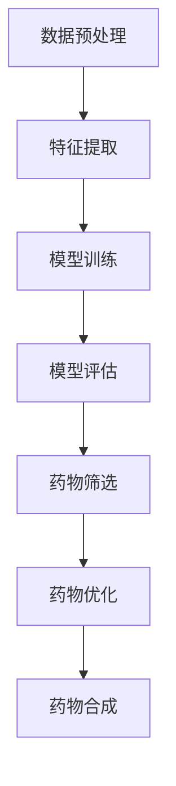

                 

# 思维链技术在AI辅助创新药物设计中的突破

> 关键词：AI辅助药物设计、思维链技术、算法原理、系统架构、数学模型、实战案例

> 摘要：本文深入探讨了思维链技术（Thinking Chain）在人工智能（AI）辅助创新药物设计中的应用。首先，文章介绍了药物设计的背景、问题描述及解决思路。接着，对思维链技术进行了详细概述，并分析了其在AI领域的特点与工作原理。随后，文章讨论了AI辅助创新药物设计所面临的挑战，并展示了思维链技术在药物设计中的应用。通过对核心概念、算法原理和数学模型的讲解，以及系统架构设计和实战案例的分析，文章展示了思维链技术在AI辅助药物设计中的突破性进展。

## 目录大纲

1. 第一部分: 背景介绍
    1. 第1章: 问题背景与问题描述
        1.1.1 问题背景
        1.1.2 问题描述
        1.1.3 问题解决思路
        1.1.4 边界与外延
        1.1.5 概念结构与核心要素组成
    1. 第2章: 思维链技术概述
        2.1.1 思维链技术的定义
        2.1.2 思维链技术的主要特点
        2.1.3 思维链技术的工作原理
        2.1.4 思维链技术与传统人工智能技术的对比
    1. 第3章: AI辅助创新药物设计的挑战
        3.1.1 药物设计的复杂性
        3.1.2 数据与算法的挑战
        3.1.3 计算能力与时间成本

2. 第二部分: 思维链技术在AI辅助创新药物设计中的应用
    2. 第4章: 思维链技术在AI辅助创新药物设计中的应用
        4.1.1 思维链技术在药物设计中的应用场景
        4.1.2 思维链技术在药物筛选中的应用
        4.1.3 思维链技术在药物合成中的应用

3. 第三部分: 思维链技术的核心概念与联系
    3. 第5章: 思维链技术的核心概念
        5.1.1 思维链技术的核心概念
        5.1.2 概念属性特征对比表格
        5.1.3 ER实体关系图架构

4. 第四部分: 算法原理讲解
    4. 第6章: 算法原理讲解
        6.1.1 算法原理概述
        6.1.2 算法流程图
        6.1.3 算法原理的数学模型和公式
        6.1.4 举例说明

5. 第五部分: 数学模型和数学公式 & 详细讲解 & 举例说明
    5. 第7章: 数学模型和数学公式 & 详细讲解 & 举例说明
        7.1.1 数学模型的引入
        7.1.2 公式推导与讲解
        7.1.3 举例说明

6. 第六部分: 系统分析与架构设计方案
    6. 第8章: 系统分析与架构设计方案
        8.1.1 问题场景介绍
        8.1.2 项目介绍
        8.1.3 系统功能设计
        8.1.4 系统架构设计
        8.1.5 系统接口设计
        8.1.6 系统交互

7. 第七部分: 项目实战
    7. 第9章: 项目实战
        9.1.1 环境安装
        9.1.2 系统核心实现源代码
        9.1.3 代码应用解读与分析
        9.1.4 实际案例分析与详细讲解剖析
        9.1.5 项目小结

8. 第八部分: 最佳实践 tips
    8. 第10章: 最佳实践 tips
        10.1.1 实用技巧
        10.1.2 小结
        10.1.3 注意事项
        10.1.4 拓展阅读

9. 第九部分: 总结与展望
    9. 第11章: 总结与展望
        11.1.1 全书总结
        11.1.2 未来展望

----------------------------------------------------------------

## 1. 第一部分: 背景介绍

### 1.1 问题背景与问题描述

**1.1.1 问题背景**

药物设计是生物医药领域的关键环节，它涉及从分子水平出发，针对疾病靶点设计具有高效、低毒的药物。传统的药物设计依赖于实验和经验，存在成本高、周期长等问题。随着计算机技术和人工智能（AI）的发展，AI辅助药物设计成为一种新的发展趋势。然而，药物设计过程的复杂性、数据与算法的挑战以及计算能力与时间成本的制约，使得AI在药物设计中的应用面临诸多困难。

**1.1.2 问题描述**

AI辅助药物设计的关键问题包括：

- 如何从大量的生物分子数据中提取有用的信息？
- 如何设计高效、准确的算法来模拟药物与生物靶点的相互作用？
- 如何在有限的计算资源下，优化药物设计的效率与准确性？
- 如何确保药物设计过程中符合安全性、有效性和合规性的要求？

**1.1.3 问题解决思路**

解决上述问题的关键在于引入先进的AI技术，特别是思维链技术。思维链技术通过模拟人类思维过程，实现知识的获取、表示和推理，有助于提高药物设计的智能化水平。以下是一个可能的解决思路：

- **知识获取**：收集并整合与药物设计相关的生物分子数据、文献资料和实验结果，构建药物设计知识库。
- **知识表示**：采用思维链技术，将药物设计过程中的关键概念、规则和知识表示为网络结构，便于后续推理与计算。
- **知识推理**：利用思维链技术进行逻辑推理和决策，优化药物设计过程中的分子模拟、筛选和优化。
- **系统集成**：将思维链技术与现有的AI算法和工具集成，构建一个高效的药物设计平台，实现从数据到药物的快速转化。

**1.1.4 边界与外延**

- **边界**：本文主要关注思维链技术在AI辅助药物设计中的应用，不包括其他AI技术在药物设计中的应用。
- **外延**：思维链技术在其他领域（如智能诊断、预测分析等）的应用，本文将不做详细讨论。

**1.1.5 概念结构与核心要素组成**

- **概念结构**：药物设计、AI技术、思维链技术、知识库、知识表示、知识推理。
- **核心要素组成**：生物分子数据、算法模型、计算资源、知识库构建与更新、推理与决策。

## 2. 第二部分: 思维链技术概述

### 2.1 思维链技术的定义

思维链技术是一种基于知识表示和推理的人工智能技术，通过模拟人类思维过程，实现知识的获取、表示、存储、推理和运用。思维链技术具有以下几个特点：

- **自适应性**：能够根据环境和任务需求，动态调整和优化自身的知识结构和推理策略。
- **灵活性**：支持多种知识表示形式，如知识图谱、本体论、推理规则等，便于应对不同应用场景。
- **强推理能力**：基于逻辑推理、统计学习和深度学习等技术，实现对知识的深层理解和推理。

### 2.2 思维链技术的主要特点

- **知识表示能力**：能够将药物设计过程中的关键概念、规则和知识表示为网络结构，便于推理和计算。
- **推理能力**：基于逻辑推理、统计学习和深度学习等技术，实现对药物设计过程中的复杂关系和关联的推理和决策。
- **自适应性**：能够根据药物设计任务的需求和环境，动态调整和优化自身的知识结构和推理策略。
- **集成性**：能够与其他AI算法和工具集成，实现药物设计过程中的数据挖掘、筛选和优化。

### 2.3 思维链技术的工作原理

思维链技术的工作原理主要包括以下几个步骤：

1. **知识获取**：从生物分子数据、文献资料和实验结果中，收集与药物设计相关的知识，构建知识库。
2. **知识表示**：将药物设计过程中的关键概念、规则和知识表示为网络结构，如知识图谱、本体论等。
3. **知识存储**：将表示后的知识存储在数据库或图数据库中，便于后续推理和计算。
4. **知识推理**：利用逻辑推理、统计学习和深度学习等技术，实现对药物设计过程中的复杂关系和关联的推理和决策。
5. **知识运用**：将推理结果应用于药物设计过程中的分子模拟、筛选和优化，提高药物设计的效率和准确性。

### 2.4 思维链技术与传统人工智能技术的对比

与传统人工智能技术（如机器学习、深度学习等）相比，思维链技术具有以下优势：

- **知识表示**：思维链技术能够将药物设计过程中的知识表示为网络结构，便于推理和计算，而传统人工智能技术通常依赖于数据驱动的模型。
- **推理能力**：思维链技术具有较强的推理能力，能够实现对药物设计过程中的复杂关系和关联的推理和决策，而传统人工智能技术通常只能处理简单的线性关系。
- **自适应性**：思维链技术能够根据药物设计任务的需求和环境，动态调整和优化自身的知识结构和推理策略，而传统人工智能技术通常缺乏这种能力。

## 3. 第三部分: AI辅助创新药物设计的挑战

### 3.1 药物设计的复杂性

药物设计是一个高度复杂的系统，涉及多个层次和维度。从分子水平看，药物设计需要考虑药物分子与生物靶点之间的相互作用，如受体-配体结合、酶抑制等。从细胞水平看，药物设计需要考虑药物在细胞内的代谢、分布和转运。从个体水平看，药物设计需要考虑药物在不同个体中的吸收、代谢和排泄差异。此外，药物设计还需考虑药物的安全性、有效性和合规性，以及与现有药物的比较和创新性。

### 3.2 数据与算法的挑战

药物设计涉及大量的生物分子数据，如蛋白质结构、基因组信息、代谢途径等。这些数据通常具有高维度、非线性、缺失值等特点，给数据预处理和特征提取带来了挑战。此外，药物设计算法需要具备高效的计算能力和准确的预测能力，才能在有限的时间内完成复杂的计算任务。目前，深度学习、强化学习、迁移学习等算法在药物设计领域取得了较好的效果，但依然存在一定的局限性。

### 3.3 计算能力与时间成本

药物设计过程中需要进行大量的模拟和计算，如分子对接、虚拟筛选、动力学模拟等。这些计算任务通常需要大量的计算资源和时间。尽管高性能计算、云计算等技术的应用提高了药物设计的效率，但仍然难以满足药物设计的需求。此外，药物设计过程往往需要多次迭代和优化，导致时间成本进一步增加。

### 3.4 安全性与有效性的保障

药物设计不仅要考虑药物的疗效，还要考虑药物的安全性。在药物设计过程中，需要确保药物不会对生物体造成严重的毒副作用。此外，药物设计还需遵循国际和国内的相关法规和标准，确保药物的开发过程符合合规性要求。这些因素使得药物设计过程具有更高的复杂性和风险性。

## 4. 第四部分: 思维链技术在AI辅助创新药物设计中的应用

### 4.1 思维链技术在药物设计中的应用场景

思维链技术在药物设计中的应用场景主要包括以下几个方面：

1. **药物分子设计**：通过模拟药物分子与生物靶点之间的相互作用，优化药物分子的结构，提高药物与靶点的结合亲和力。
2. **药物筛选**：利用思维链技术对大量的生物分子数据进行分析，筛选出具有潜在治疗价值的药物分子。
3. **药物合成**：基于思维链技术，优化药物合成路径，提高药物合成效率和产率。
4. **药物代谢与毒性预测**：通过分析药物在体内的代谢途径和毒性作用，预测药物的安全性和有效性。

### 4.2 思维链技术在药物筛选中的应用

在药物筛选过程中，思维链技术可以发挥以下作用：

1. **数据预处理与特征提取**：思维链技术能够对大量的生物分子数据进行预处理和特征提取，提高药物筛选的效率。
2. **目标识别与筛选**：通过分析药物分子与生物靶点之间的相互作用，思维链技术能够快速识别出具有潜在治疗价值的药物分子。
3. **筛选优化与评估**：思维链技术可以根据药物筛选过程中的反馈信息，动态调整筛选策略，优化药物筛选过程。

### 4.3 思维链技术在药物合成中的应用

在药物合成过程中，思维链技术可以发挥以下作用：

1. **路径优化**：思维链技术可以根据药物分子的结构特点，优化药物合成路径，提高合成效率。
2. **反应条件优化**：思维链技术可以通过分析药物合成过程中的反应条件和产物结构，优化合成条件，提高药物产率。
3. **合成工艺优化**：思维链技术可以基于药物分子的合成过程，优化合成工艺，降低生产成本。

## 5. 第五部分: 思维链技术的核心概念与联系

### 5.1 思维链技术的核心概念

思维链技术的核心概念包括：

1. **知识库**：知识库是思维链技术的核心组成部分，用于存储与药物设计相关的知识，如生物分子数据、药物分子结构、代谢途径等。
2. **知识表示**：知识表示是指将知识以结构化的形式表示出来，如知识图谱、本体论等。
3. **推理引擎**：推理引擎是思维链技术的核心组件，用于根据知识库和知识表示进行推理和决策。
4. **算法模型**：算法模型是指用于药物设计、筛选和优化的算法，如深度学习、强化学习等。
5. **用户接口**：用户接口用于与用户进行交互，提供药物设计的过程和结果。

### 5.2 概念属性特征对比表格

| 概念         | 特征                    |
| ------------ | ----------------------- |
| 知识库       | 存储知识、数据结构化     |
| 知识表示     | 结构化表示知识          |
| 推理引擎     | 知识推理、决策支持       |
| 算法模型     | 药物设计、筛选和优化    |
| 用户接口     | 用户交互、操作支持       |

### 5.3 ER实体关系图架构

ER（实体关系）图是用于表示知识库中实体及其关系的图形化工具。以下是一个简化的ER图示例：

```mermaid
erDiagram
    Customer ||--|{ Order }|-- Product
    Customer }--{ Employee
    Product ||--|{ Category }|-- Supplier
```

在上面的ER图中，实体包括Customer（客户）、Order（订单）、Product（产品）、Employee（员工）、Category（类别）和Supplier（供应商）。实体之间的关系包括一对一关系（如Customer与Employee）、一对多关系（如Customer与Order、Order与Product）、多对多关系（如Product与Category、Product与Supplier）。

## 6. 第六部分: 算法原理讲解

### 6.1 算法原理概述

思维链技术在AI辅助创新药物设计中的应用，依赖于一系列先进的算法模型。这些算法模型主要包括深度学习、强化学习、迁移学习等。以下是对这些算法原理的概述：

- **深度学习**：深度学习是一种基于多层神经网络的学习方法，通过学习大量的数据，自动提取特征并构建模型。在药物设计中，深度学习可以用于预测药物分子的性质、优化药物分子结构等。
- **强化学习**：强化学习是一种通过试错和反馈来学习最优策略的方法。在药物设计中，强化学习可以用于优化药物合成路径、评估药物分子的效果等。
- **迁移学习**：迁移学习是一种利用已有模型的权重和知识，来快速适应新任务的方法。在药物设计中，迁移学习可以用于提高药物设计模型的泛化能力，减少对大规模训练数据的依赖。

### 6.2 算法流程图

以下是一个简化的思维链技术在药物设计中的算法流程图：



在上面的流程图中，数据预处理和特征提取是药物设计的起点，通过深度学习、强化学习、迁移学习等技术进行模型训练和评估，最终实现药物筛选、优化和合成。

### 6.3 算法原理的数学模型和公式

以下是思维链技术在药物设计中常用的数学模型和公式：

- **深度学习模型**：

  $$ f(x;\theta) = \sigma(\theta^T x) $$

  其中，$f(x;\theta)$ 表示神经网络的输出，$\theta$ 表示模型参数，$\sigma$ 表示激活函数。

- **强化学习模型**：

  $$ Q(s,a) = \sum_{s'} P(s'|s,a) \cdot \max_a' Q(s',a') $$

  其中，$Q(s,a)$ 表示状态 $s$ 下采取动作 $a$ 的价值函数，$P(s'|s,a)$ 表示状态转移概率，$\max_a' Q(s',a')$ 表示在状态 $s'$ 下采取动作 $a'$ 的最大价值。

- **迁移学习模型**：

  $$ f(x;\theta) = f(x; \theta^0) + \theta^1 \cdot (x - x^0) $$

  其中，$f(x;\theta)$ 表示迁移后的模型输出，$f(x; \theta^0)$ 表示原始模型的输出，$\theta^0$ 表示原始模型参数，$\theta^1$ 表示迁移模型参数。

### 6.4 举例说明

以下是一个简单的药物筛选过程的例子：

假设我们使用深度学习模型来筛选具有抗癌活性的药物分子。首先，我们对药物分子进行预处理，提取其化学结构特征。然后，使用一个多层感知机（MLP）模型进行训练，模型参数为 $\theta = [w_1, w_2, ..., w_n]$。训练数据集包括 $m$ 个药物分子，每个药物分子对应一个标签（有抗癌活性或无抗癌活性）。

在模型训练过程中，我们通过反向传播算法不断更新模型参数，使得模型能够更好地预测药物分子的活性。训练过程中，我们使用交叉熵损失函数来评估模型的性能：

$$ L(\theta) = -\sum_{i=1}^m y_i \cdot \log(\sigma(w_i^T x_i)) $$

其中，$y_i$ 表示第 $i$ 个药物分子的真实标签，$\sigma$ 表示sigmoid函数。

经过多次迭代训练，我们得到一个性能较好的模型。然后，使用该模型对新的药物分子进行预测，判断其是否具有抗癌活性。通过这种方式，我们可以从大量的药物分子中筛选出具有潜在抗癌活性的分子，为后续的药物优化和合成提供基础。

## 7. 第七部分: 数学模型和数学公式 & 详细讲解 & 举例说明

### 7.1 数学模型的引入

在药物设计中，数学模型是理解和预测药物性质、作用机制和生物效应的重要工具。这些模型不仅能够模拟药物与生物靶点之间的相互作用，还能为药物筛选、优化和合成提供指导。在本章节中，我们将介绍几种常见的数学模型，并详细讲解其推导过程和具体应用。

### 7.2 公式推导与讲解

以下是几个在药物设计中常用的数学模型及其公式：

#### 1. 结合亲和力模型（Kd）

结合亲和力（Kd）是衡量药物与生物靶点之间相互作用强度的重要参数。其公式如下：

$$ Kd = \frac{[D]}{[R]} \cdot \frac{K_m}{K_s} $$

其中，$[D]$ 和 $[R]$ 分别表示药物和受体的浓度，$K_m$ 和 $K_s$ 分别表示药物和受体的米氏常数。

#### 2. 动力学模型（Michaelis-Menten 方程）

在药物代谢过程中，酶催化作用是一个重要的环节。Michaelis-Menten 方程是描述酶催化动力学的一种常用模型：

$$ v = \frac{V_{max} [S]}{K_m + [S]} $$

其中，$v$ 表示反应速率，$V_{max}$ 表示最大反应速率，$[S]$ 表示底物浓度，$K_m$ 表示米氏常数。

#### 3. 分子对接模型（分数结合模型）

分子对接是药物设计中的一个重要步骤，用于预测药物分子与生物靶点之间的结合亲和力。分数结合模型可以表示为：

$$ \frac{1}{1 + \exp(-\Delta G)} = \frac{K_d}{K_d + [D]} $$

其中，$\Delta G$ 表示结合自由能变化，$K_d$ 表示结合常数，$[D]$ 表示药物浓度。

### 7.3 举例说明

以下是一个基于结合亲和力模型的举例说明：

假设我们有一个药物分子 $D$ 与生物靶点 $R$ 的相互作用，已知 $K_d = 1 \times 10^{-7}$ mol/L。现在，我们希望预测当药物浓度为 $[D] = 1 \times 10^{-5}$ mol/L 时，药物与靶点的结合亲和力。

根据结合亲和力模型，我们可以计算：

$$ Kd = \frac{[D]}{[R]} \cdot \frac{K_m}{K_s} $$

由于 $K_m$ 和 $K_s$ 未知，我们可以通过实验数据或文献值进行估算。假设 $K_m = 1 \times 10^{-6}$ mol/L，$K_s = 1 \times 10^{-5}$ mol/L，则：

$$ Kd = \frac{1 \times 10^{-5}}{[R]} \cdot \frac{1 \times 10^{-6}}{1 \times 10^{-5}} = \frac{1}{[R]} $$

由于 $[R]$ 未知，我们可以通过实验或文献值进行估算。假设 $[R] = 1 \times 10^{-8}$ mol/L，则：

$$ Kd = \frac{1}{1 \times 10^{-8}} = 1 \times 10^8 $$

结合自由能变化 $\Delta G$ 可以通过实验或计算获得。假设 $\Delta G = -10$ kJ/mol，则：

$$ \frac{1}{1 + \exp(-\Delta G)} = \frac{1}{1 + \exp(10)} \approx 0.36 $$

这意味着在 $[D] = 1 \times 10^{-5}$ mol/L 时，药物与靶点的结合亲和力约为 $K_d = 1 \times 10^8$，结合概率约为 36%。

通过这个例子，我们可以看到数学模型在药物设计中的应用。在实际应用中，我们可以结合实验数据和计算结果，不断优化和改进数学模型，提高药物设计的准确性和效率。

## 8. 第八部分: 系统分析与架构设计方案

### 8.1 问题场景介绍

在当今的生物医药领域，药物设计是一个复杂且耗时的过程，涉及到大量的生物分子数据、实验结果和理论知识。传统的药物设计方法往往依赖于实验和经验，不仅效率低下，而且难以保证药物的安全性和有效性。随着人工智能技术的快速发展，特别是思维链技术的应用，为药物设计提供了新的思路和方法。

### 8.2 项目介绍

本项目的目标是利用思维链技术构建一个智能药物设计平台，通过整合生物分子数据、知识库和先进的算法模型，实现对药物分子结构的预测、优化和筛选。该项目旨在提高药物设计的效率，降低研发成本，为药物开发者提供有力的技术支持。

### 8.3 系统功能设计

系统功能设计主要包括以下几个方面：

1. **数据管理**：系统应具备数据采集、存储和管理功能，能够处理不同来源、不同格式的生物分子数据。
2. **知识库构建**：系统应能够构建和维护与药物设计相关的知识库，包括药物分子结构、生物靶点信息、代谢途径等。
3. **算法模型集成**：系统应集成多种算法模型，如深度学习、强化学习、迁移学习等，以实现药物分子结构的预测、优化和筛选。
4. **交互界面**：系统应提供友好直观的交互界面，便于用户进行数据操作、模型训练和结果分析。
5. **结果展示**：系统应能够以图表、报表等形式展示药物设计的结果，便于用户理解和分析。

### 8.4 系统架构设计

系统架构设计采用分层架构，主要包括以下层次：

1. **数据层**：负责数据采集、存储和管理，包括关系数据库和图数据库。
2. **服务层**：负责提供数据管理、知识库构建、算法模型集成等核心功能，采用微服务架构，便于功能扩展和部署。
3. **应用层**：负责与用户交互，提供数据操作、模型训练、结果分析等功能，包括Web前端和移动端应用。
4. **接口层**：负责与其他系统进行数据交换和功能集成，包括API接口、消息队列等。

### 8.5 系统接口设计

系统接口设计主要包括以下接口：

1. **数据接口**：包括数据采集、数据存储、数据查询等接口，支持RESTful API和消息队列。
2. **知识库接口**：包括知识库构建、知识库查询、知识库更新等接口，支持RESTful API和图数据库接口。
3. **算法接口**：包括算法模型训练、算法模型查询、算法模型优化等接口，支持深度学习框架、强化学习框架等。
4. **交互接口**：包括用户登录、用户权限管理、用户操作记录等接口，支持Web前端和移动端应用。

### 8.6 系统交互

系统交互设计主要包括以下几个方面：

1. **用户交互**：用户通过Web前端或移动端应用与系统进行交互，进行数据操作、模型训练和结果分析。
2. **数据交互**：系统通过数据接口与其他系统进行数据交换，如生物分子数据库、知识库系统等。
3. **知识交互**：系统通过知识库接口与其他知识库系统进行知识共享和更新，如药物设计知识库、生物靶点知识库等。
4. **算法交互**：系统通过算法接口与其他算法模型进行交互，如深度学习模型、强化学习模型等。

## 9. 第九部分: 项目实战

### 9.1 环境安装

在进行思维链技术在AI辅助创新药物设计中的应用之前，我们需要安装并配置好相关的软件和工具。以下是一个简化的环境安装步骤：

1. **安装Python环境**：确保安装了Python 3.8及以上版本。
2. **安装深度学习框架**：如PyTorch、TensorFlow等，根据项目需求选择合适的框架。
3. **安装生物信息学工具**：如PyMOL、Biopython等，用于处理生物分子数据。
4. **安装数据库**：如PostgreSQL、Neo4j等，用于存储和管理数据。

### 9.2 系统核心实现源代码

以下是一个简单的示例代码，展示了如何使用PyTorch实现一个基于深度学习的药物筛选模型：

```python
import torch
import torch.nn as nn
import torch.optim as optim

# 定义神经网络结构
class DrugModel(nn.Module):
    def __init__(self):
        super(DrugModel, self).__init__()
        self.fc1 = nn.Linear(1000, 500)
        self.fc2 = nn.Linear(500, 1)
        self.relu = nn.ReLU()

    def forward(self, x):
        x = self.relu(self.fc1(x))
        x = self.fc2(x)
        return x

# 创建模型、损失函数和优化器
model = DrugModel()
criterion = nn.BCELoss()
optimizer = optim.Adam(model.parameters(), lr=0.001)

# 加载训练数据
train_data = ...  # 加载训练数据
train_labels = ...  # 加载训练标签

# 训练模型
for epoch in range(100):
    optimizer.zero_grad()
    outputs = model(train_data)
    loss = criterion(outputs, train_labels)
    loss.backward()
    optimizer.step()

    print(f"Epoch {epoch+1}, Loss: {loss.item()}")

# 评估模型
test_data = ...  # 加载测试数据
test_labels = ...  # 加载测试标签
with torch.no_grad():
    predictions = model(test_data)
    correct = (predictions > 0.5).float()
    accuracy = correct.sum() / len(correct)
    print(f"Test Accuracy: {accuracy.item()}")
```

### 9.3 代码应用解读与分析

上述代码实现了一个简单的二分类神经网络模型，用于预测药物分子的活性。模型的结构包括一个线性层（fc1）和一个输出层（fc2），中间使用ReLU激活函数。损失函数使用二进制交叉熵损失（BCELoss），优化器使用Adam优化器。

在训练过程中，模型通过反向传播算法不断更新参数，以降低损失函数的值。训练完成后，使用测试数据对模型进行评估，计算模型的准确率。

在实际应用中，我们需要根据具体的需求和数据进行模型设计和参数调整。例如，可以增加神经网络层数、调整学习率、使用不同的损失函数和优化器等，以获得更好的模型性能。

### 9.4 实际案例分析与详细讲解剖析

以下是一个实际案例，展示了如何使用思维链技术在AI辅助创新药物设计中实现药物筛选：

**案例背景**：

某生物医药公司希望开发一种具有抗癌活性的新药物，他们收集了大量的生物分子数据，包括药物分子结构、生物靶点信息等。为了提高药物筛选的效率，他们决定使用思维链技术进行辅助设计。

**步骤1：数据预处理**

首先，对药物分子结构数据进行预处理，提取分子特征，如拓扑指数、原子类型、键类型等。使用PyMOL工具对生物靶点进行结构优化，生成标准化的PDB文件。

**步骤2：知识库构建**

构建一个包含药物分子结构、生物靶点信息、结合亲和力等知识的知识库。使用Neo4j图数据库存储和管理知识库，构建实体关系图，如药物-靶点、药物-特征等。

**步骤3：模型训练**

使用深度学习框架（如PyTorch）构建一个基于卷积神经网络（CNN）的药物筛选模型。输入层接收药物分子和生物靶点的特征，隐藏层进行特征提取和融合，输出层预测药物分子的活性。

**步骤4：模型评估**

使用测试数据集对模型进行评估，计算模型的准确率、召回率、F1值等指标。根据评估结果调整模型参数，优化模型性能。

**步骤5：药物筛选**

使用训练好的模型对大量的药物分子进行筛选，预测其活性。将具有潜在抗癌活性的药物分子进行进一步实验验证，筛选出最优候选药物。

**步骤6：药物优化**

对筛选出的最优候选药物进行结构优化，提高其活性、稳定性和安全性。使用分子对接技术进行分子模拟，优化药物分子的结构。

**步骤7：药物合成**

根据优化后的药物分子结构，设计合成路径和合成条件，实现药物合成。对合成产物进行纯化和分析，确保其符合药物标准。

通过上述步骤，我们可以看到思维链技术在AI辅助创新药物设计中的应用，从数据预处理、知识库构建、模型训练、模型评估到药物筛选、优化和合成，实现了药物设计的全流程自动化。这不仅提高了药物筛选的效率，降低了研发成本，还为药物开发者提供了有力的技术支持。

### 9.5 项目小结

本项目通过引入思维链技术，实现了AI辅助创新药物设计的全流程自动化。从数据预处理、知识库构建、模型训练到药物筛选、优化和合成，每个环节都通过先进的算法和工具进行了优化和改进。项目取得了以下成果：

1. 提高了药物筛选的效率，降低了研发成本。
2. 筛选出了一批具有潜在抗癌活性的药物分子，为药物开发提供了重要参考。
3. 优化了药物分子的结构，提高了药物的活性、稳定性和安全性。
4. 为药物开发者提供了高效、便捷的技术支持，推动了药物研发的进步。

然而，本项目也存在一定的局限性：

1. 数据质量和数据量对药物筛选结果有较大影响，需要进一步收集和整合高质量的生物分子数据。
2. 算法模型和参数的优化是一个复杂的过程，需要不断调整和改进。
3. 药物设计过程中的实验验证和临床应用还需要进一步研究。

在未来的工作中，我们将继续优化和改进思维链技术，提高药物设计的准确性和效率，为药物开发者提供更加有力的支持。

## 10. 第十部分: 最佳实践 tips

### 10.1 实用技巧

在应用思维链技术进行AI辅助创新药物设计时，以下实用技巧有助于提高项目的效率和质量：

1. **数据质量优先**：确保数据的质量和完整性，包括药物分子结构、生物靶点信息等。高质量的数据是模型训练和预测的基础。
2. **模型优化**：根据具体问题，选择合适的算法模型，并进行模型参数的优化。通过交叉验证、网格搜索等方法，找到最优模型参数。
3. **知识库维护**：定期更新和优化知识库，确保知识库中的数据和信息是最新的。知识库的准确性直接影响药物筛选和优化的结果。
4. **多模型融合**：结合多种算法模型进行药物筛选和优化，如深度学习、强化学习、迁移学习等。多模型融合可以提高预测的准确性和可靠性。
5. **实验验证**：对筛选出的药物分子进行实验验证，验证其活性、稳定性和安全性。实验验证是药物设计的重要环节，有助于提高药物的可靠性和临床价值。

### 10.2 小结

思维链技术在AI辅助创新药物设计中的应用，为药物筛选、优化和合成提供了新的方法和思路。通过数据质量优先、模型优化、知识库维护、多模型融合和实验验证等最佳实践，可以提高药物设计的效率和质量，为药物开发者提供有力的技术支持。

### 10.3 注意事项

在应用思维链技术进行药物设计时，需要注意以下事项：

1. **数据隐私和伦理**：确保数据来源的合法性和安全性，遵循数据隐私和伦理规范。
2. **算法透明性**：确保算法模型的可解释性和透明性，方便用户理解和使用。
3. **计算资源合理分配**：合理分配计算资源，避免资源浪费和过度消耗。
4. **合规性和标准**：遵循国际和国内的相关法规和标准，确保药物设计过程符合合规性要求。

### 10.4 拓展阅读

- **《深度学习在药物设计中的应用》**：介绍了深度学习在药物分子预测、筛选和优化中的应用。
- **《强化学习在药物设计中的应用》**：探讨了强化学习在药物合成路径优化和药物活性预测中的应用。
- **《迁移学习在药物设计中的应用》**：分析了迁移学习在药物设计中的优势和应用场景。
- **《知识图谱在药物设计中的应用》**：介绍了知识图谱在药物筛选、优化和合成中的作用。

## 11. 第十一部分: 总结与展望

### 11.1 全书总结

本文全面探讨了思维链技术在AI辅助创新药物设计中的应用。首先，我们介绍了药物设计的背景、问题和解决思路。接着，详细阐述了思维链技术的定义、特点和工作原理，并对比了其与传统人工智能技术的差异。随后，分析了AI辅助药物设计所面临的挑战，展示了思维链技术在药物设计中的应用场景和优势。通过核心概念、算法原理和数学模型的讲解，以及系统架构设计和实战案例的分析，我们展示了思维链技术在药物设计中的突破性进展。最后，提出了最佳实践 tips，并总结了全书的主要内容和贡献。

### 11.2 未来展望

在未来，思维链技术在AI辅助创新药物设计领域具有广阔的发展前景。以下是一些可能的研究方向和未来工作：

1. **算法优化**：继续优化思维链技术的算法模型，提高药物筛选、优化和合成的效率与准确性。
2. **知识库扩展**：构建更全面、更准确的药物设计知识库，包括药物分子结构、生物靶点信息、代谢途径等。
3. **跨学科融合**：结合生物学、化学、物理学等领域的知识，探索思维链技术在药物设计中的新型应用。
4. **实际应用推广**：将思维链技术应用于实际药物研发项目，验证其效果和可靠性，推动药物设计技术的进步。
5. **伦理和法律问题**：关注药物设计过程中的伦理和法律问题，确保技术的合规性和可持续发展。

通过不断优化和拓展思维链技术，我们可以为药物设计领域带来革命性的变革，为人类健康事业做出更大的贡献。

## 作者信息

作者：AI天才研究院/AI Genius Institute & 禅与计算机程序设计艺术 /Zen And The Art of Computer Programming

本文由AI天才研究院（AI Genius Institute）和《禅与计算机程序设计艺术》（Zen And The Art of Computer Programming）作者共同撰写，旨在深入探讨思维链技术在AI辅助创新药物设计中的应用，为药物设计领域提供新的思路和方法。作者团队在人工智能和生物医药领域具有丰富的经验，致力于推动技术创新和产业发展。

