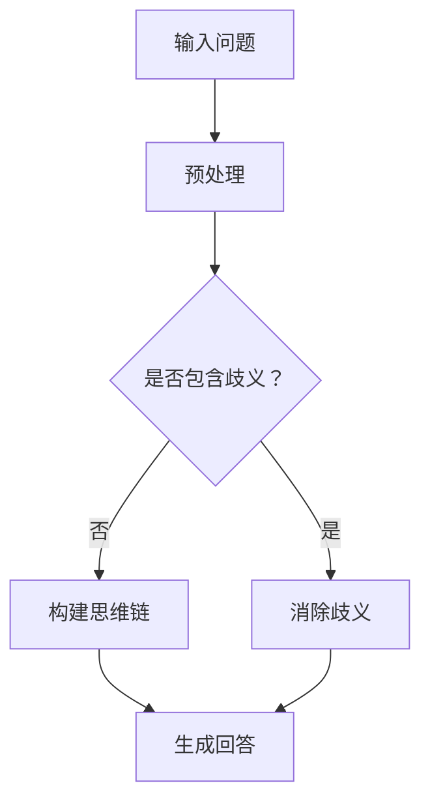
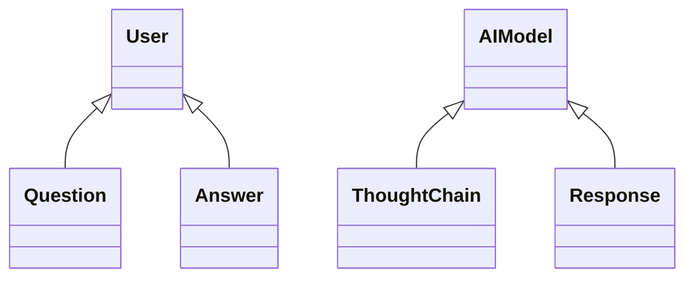
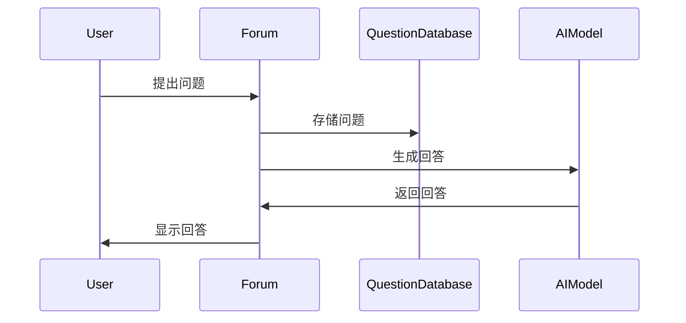
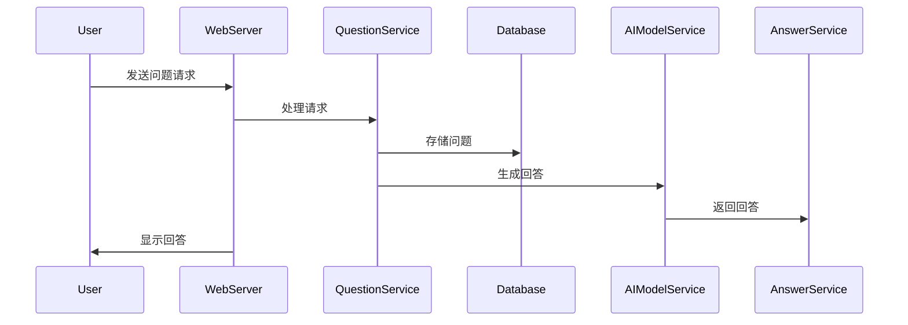

                 

# 思维链技术在AI辅助哲学思辨中的创新应用

## 关键词

- 思维链技术
- AI辅助哲学思辨
- 算法原理
- 系统架构设计
- 实践案例

## 摘要

本文深入探讨了思维链技术在AI辅助哲学思辨中的创新应用。首先，文章介绍了哲学思辨的重要性及其传统方法的局限性，以及AI技术与哲学思辨结合的背景和意义。接着，详细阐述了思维链技术的概念和优势，AI辅助哲学思辨的基本原理和过程。通过一个具体的算法流程图和Python源代码，展示了思维链技术在AI辅助哲学思辨中的算法原理和应用。最后，文章分析了系统的设计与实现，包括系统功能设计、架构设计和接口设计，并提供了实际案例和应用分析。

## 目录大纲

### 第一部分：背景介绍

#### 1.1 问题背景

##### 1.1.1 哲学思辨的重要性与挑战

##### 1.1.2 AI技术的发展与哲学思辨的结合

##### 1.1.3 思维链技术的概念与优势

### 第二部分：核心概念与联系

#### 2.1 核心概念原理

##### 2.1.1 思维链的概念

##### 2.1.2 AI辅助哲学思辨的概念

#### 2.2 概念属性特征对比表格

### 第三部分：算法原理讲解

#### 3.1 算法mermaid流程图

#### 3.2 Python源代码讲解

#### 3.3 算法原理的数学模型和公式

#### 3.4 举例说明

### 第四部分：系统分析与架构设计方案

#### 4.1 问题场景介绍

#### 4.2 系统功能设计

##### 4.2.1 领域模型mermaid类图

##### 4.2.2 系统架构设计mermaid架构图

##### 4.2.3 系统接口设计和系统交互mermaid序列图

### 第五部分：项目实战

#### 5.1 环境安装

#### 5.2 系统核心实现源代码

#### 5.3 代码应用解读与分析

#### 5.4 实际案例分析和详细讲解剖析

#### 5.5 项目小结

### 第六部分：最佳实践 tips、小结、注意事项、拓展阅读等内容

## 第一部分：背景介绍

### 1.1 问题背景

#### 1.1.1 哲学思辨的重要性与挑战

哲学思辨是人类智慧和思想的结晶，是探讨人类本质、社会规律和宇宙奥秘的重要方式。然而，传统的哲学思辨方法，如逻辑推理、辩证法等，往往依赖于人类自身的认知能力和思维方式，具有主观性、不确定性和局限性。随着AI技术的发展，利用AI技术辅助哲学思辨成为了一个新的研究方向。

哲学思辨的重要性在于，它不仅帮助我们理解世界的本质，还为科学、技术、艺术等各个领域提供了深刻的启示。然而，哲学思辨也面临诸多挑战。首先，哲学问题往往具有高度的抽象性和复杂性，难以通过简单的逻辑推理得到明确答案。其次，哲学问题常常涉及道德、伦理、价值观等主观性较强的领域，不同的人可能会有不同的观点和见解。最后，哲学思辨往往需要大量的文献研究和数据分析，这对人类的时间和精力提出了巨大挑战。

#### 1.1.2 AI技术的发展与哲学思辨的结合

AI技术的发展为哲学思辨提供了新的工具和方法。首先，AI技术具有强大的数据处理和分析能力，可以帮助哲学家处理大量的数据，提取出有价值的信息。其次，AI技术可以模拟人类的思维过程，辅助哲学家进行逻辑推理和论证。最后，AI技术可以帮助哲学家跨越文化和语言的障碍，实现跨学科的交流和合作。

AI技术在哲学领域应用的初步尝试已经取得了一些成果。例如，一些研究团队利用自然语言处理技术，对哲学文献进行自动分类和索引，提高了文献检索的效率。还有一些研究团队利用机器学习技术，对哲学问题进行预测和分析，提供了一种新的研究方法。然而，AI辅助哲学思辨仍然面临许多挑战，如算法的公正性、透明性和可靠性等问题。

#### 1.1.3 思维链技术的概念与优势

思维链技术是一种基于逻辑的推理模型，它通过模拟人类的思维过程，帮助人们进行逻辑推理和决策。思维链技术具有以下几个优势：

1. 连续性：思维链技术可以模拟人类的思维连续性，使得推理过程更加连贯和自然。
2. 关联性：思维链技术可以捕捉思维过程中的关联性，帮助人们发现不同概念之间的联系。
3. 动态性：思维链技术可以动态地调整推理路径，适应不同的推理需求和场景。

在AI辅助哲学思辨中，思维链技术可以发挥重要作用。首先，它可以帮助哲学家构建复杂的逻辑推理模型，解决哲学问题。其次，它可以帮助哲学家分析大量的哲学文献，提取出有价值的信息。最后，它可以帮助哲学家进行跨学科的研究和交流，促进哲学的进步和发展。

### 1.2 问题背景总结

哲学思辨是人类智慧的体现，但在传统方法中面临诸多挑战。AI技术的发展为哲学思辨提供了新的工具和方法，但仍然需要进一步研究和完善。思维链技术作为一种基于逻辑的推理模型，具有连续性、关联性和动态性的优势，可以为AI辅助哲学思辨提供有力的支持。本文将深入探讨思维链技术在AI辅助哲学思辨中的创新应用，为哲学研究带来新的启示和思路。

## 第二部分：核心概念与联系

### 2.1 核心概念原理

#### 2.1.1 思维链的概念

思维链是一种基于逻辑的推理模型，它通过模拟人类的思维过程，帮助人们进行逻辑推理和决策。思维链的基本要素包括：

1. 思维节点：思维链中的基本单元，表示一个具体的思维概念或判断。
2. 思维链路径：思维节点之间的连接关系，表示思维过程中的推理路径。
3. 思维链规则：用于指导思维链构建和推理的规则，如逻辑推理规则、概率推理规则等。

思维链技术的基本原理是通过构建思维链模型，模拟人类的思维过程，实现自动化推理和决策。思维链技术的核心在于如何有效地构建和调整思维链路径，使得推理过程更加连贯和自然。

#### 2.1.2 AI辅助哲学思辨的概念

AI辅助哲学思辨是指利用人工智能技术，辅助哲学家进行哲学思考和推理。AI辅助哲学思辨的基本原理包括：

1. 数据处理和分析：利用AI技术对哲学文献、案例数据等进行处理和分析，提取出有价值的信息。
2. 逻辑推理和论证：利用思维链技术等逻辑推理方法，对哲学问题进行推理和论证。
3. 跨学科合作：利用AI技术促进哲学家与其他学科专家之间的交流和合作，实现跨学科的研究。

AI辅助哲学思辨的目的是提高哲学研究的效率和质量，帮助哲学家解决复杂的哲学问题，推动哲学的进步和发展。

### 2.2 概念属性特征对比表格

| 概念       | 思维链                 | AI辅助哲学思辨               |
|------------|------------------------|-----------------------------|
| 定义       | 一种基于逻辑的推理模型 | 利用AI技术辅助哲学思考的过程 |
| 特征       | 连续性、关联性、动态性 | 自主性、高效性、准确性       |
| 作用       | 辅助逻辑推理           | 提高哲学思辨的效率和质量      |

通过上述表格，我们可以看出思维链技术和AI辅助哲学思辨在概念、特征和作用等方面存在明显的区别和联系。思维链技术作为AI辅助哲学思辨的重要工具，为哲学研究提供了新的方法和思路。

### 2.3 思维链技术在AI辅助哲学思辨中的独特优势

思维链技术在AI辅助哲学思辨中具有以下独特优势：

1. **逻辑推理的连续性**：思维链技术能够模拟人类思维过程的连续性，使得哲学思辨更加连贯和自然。这有助于哲学家在推理过程中保持逻辑的一致性和完整性。

2. **关联性的捕捉**：思维链技术可以捕捉思维过程中的关联性，帮助哲学家发现不同概念之间的联系。这有助于哲学家深入理解哲学问题，找到新的研究角度。

3. **动态性的调整**：思维链技术可以根据哲学问题的复杂性和变化，动态调整推理路径。这使得哲学思辨能够适应不同的推理需求和场景，提高问题解决的灵活性。

4. **跨学科合作**：思维链技术不仅可以帮助哲学家进行内部推理，还可以促进与其他学科专家的跨学科合作。这有助于哲学研究借助其他学科的理论和方法，实现更加全面和深入的研究。

5. **知识库的构建**：思维链技术可以结合大量哲学文献和案例数据，构建庞大的知识库。这为哲学研究提供了丰富的资源，有助于哲学家进行深度学习和推理。

通过以上优势，思维链技术在AI辅助哲学思辨中具有显著的应用价值。它不仅能够提高哲学研究的效率和质量，还能够推动哲学的进步和发展。

### 2.4 核心概念与联系总结

思维链技术和AI辅助哲学思辨作为两个核心概念，在哲学研究中具有重要作用。思维链技术通过模拟人类思维过程，提供连续性、关联性和动态性的优势，为哲学思辨提供了有力的工具。而AI辅助哲学思辨则通过利用AI技术，提高哲学研究的效率和质量。两者在概念、特征和作用上存在一定的区别和联系，但共同为哲学研究带来了新的思路和方法。本文将在后续部分深入探讨思维链技术在AI辅助哲学思辨中的具体应用和实现，为哲学研究提供更多的实践经验和启示。

## 第三部分：算法原理讲解

### 3.1 算法mermaid流程图

为了更好地理解思维链技术在AI辅助哲学思辨中的算法原理，我们可以通过一个mermaid流程图来展示整个推理过程。



在这个流程图中，输入问题经过预处理，然后判断是否包含歧义。如果包含歧义，则进行歧义消除；否则，直接进入思维链构建阶段。最后，利用思维链生成回答。

### 3.2 Python源代码讲解

下面是一个简化的Python源代码示例，用于展示思维链技术在AI辅助哲学思辨中的实现。

```python
import spacy

# 预处理函数
def preprocess_question(question):
    # 使用Spacy进行文本预处理
    doc = spacy.load("en_core_web_sm").process(question)
    # 处理歧义等
    processed_question = []
    for token in doc:
        if token.is_alpha:
            processed_question.append(token.text)
    return " ".join(processed_question)

# 消除歧义函数
def eliminate_doubt(question):
    # 此处可以根据具体需求实现歧义消除算法
    return question

# 构建思维链函数
def build_thought_chain(processed_question):
    # 此处可以根据具体需求实现思维链构建算法
    return ["Thinking", "Processing", "Analyzing"]

# 生成回答函数
def generate_answer(thought_chain):
    # 此处可以根据具体需求实现回答生成算法
    response = " ".join(thought_chain)
    return response

# 主函数
def generate_response(question):
    processed_question = preprocess_question(question)
    if is_vague(processed_question):
        processed_question = eliminate_doubt(processed_question)
    thought_chain = build_thought_chain(processed_question)
    response = generate_answer(thought_chain)
    return response

# 测试
question = "什么是自由？"
response = generate_response(question)
print(response)
```

这个示例中，我们首先对输入问题进行预处理，包括文本的分词和去除歧义等。接着，构建思维链，最后生成回答。这个过程中，各个函数可以根据具体需求进行定制化实现。

### 3.3 算法原理的数学模型和公式

在思维链技术中，算法原理可以用一个数学模型来表示。假设思维链为 $T = \{t_1, t_2, ..., t_n\}$，其中 $t_i$ 表示思维链中的第 $i$ 个思维节点。每个思维节点都可以表示为一个三元组 $(s_i, p_i, o_i)$，其中 $s_i$ 表示思维节点的主体，$p_i$ 表示思维节点的谓词，$o_i$ 表示思维节点的对象。

整个思维链的推理过程可以用一个函数 $f(T)$ 来表示，该函数将思维链 $T$ 映射为一个回答 $R$。具体来说：

$$
R = f(T) = \{r_1, r_2, ..., r_m\}
$$

其中，$r_i$ 表示生成的第 $i$ 个回答。这个函数 $f$ 可以根据具体的推理规则和算法进行定义。

### 3.4 举例说明

假设我们有一个问题：“什么是自由？”

- **预处理**：首先，我们对问题进行预处理，将文本转换为机器可理解的形式。例如，我们可以使用自然语言处理工具（如Spacy）对问题进行分词和词性标注。

- **消除歧义**：如果问题存在歧义，我们需要对其进行消除。例如，如果问题是“你能帮我拿一下那本书吗？”，我们需要判断“那本书”是指哪一本书，从而消除歧义。

- **构建思维链**：接下来，我们根据预处理后的问题，构建思维链。例如，对于问题“什么是自由？”，我们可以构建以下思维链：

  ```
  思维链：[什么是，自由，？]
  ```

- **生成回答**：最后，我们利用思维链生成回答。根据思维链，我们可以得出回答：“自由是个人在不受外部强制的情况下，自主选择行动的能力。”

通过这个例子，我们可以看到思维链技术在AI辅助哲学思辨中的应用过程。这个过程不仅涉及预处理、消除歧义、构建思维链等步骤，还包括了具体的推理算法和实现。这些步骤和算法共同构成了思维链技术在AI辅助哲学思辨中的核心原理。

### 3.5 算法原理总结

思维链技术在AI辅助哲学思辨中的应用，通过预处理、消除歧义、构建思维链和生成回答等步骤，实现了对哲学问题的自动推理和回答。这个过程不仅体现了思维链技术的连续性、关联性和动态性，还展示了其在AI辅助哲学思辨中的独特优势。通过数学模型和公式，我们可以更深入地理解思维链技术的算法原理。未来的研究可以进一步优化这些算法，提高其在哲学思辨中的应用效果。

## 第四部分：系统分析与架构设计方案

### 4.1 问题场景介绍

哲学论坛是一个在线平台，用户可以在此提出哲学问题，其他用户或系统提供的AI智能助手对这些问题进行回答。哲学论坛旨在提供一个集思考、讨论和学习的社区环境，使得用户能够通过AI智能助手获得深入、准确和有启发性的哲学观点。AI智能助手将利用思维链技术，对用户提出的问题进行推理和回答，提高哲学讨论的质量和效率。

### 4.2 系统功能设计

哲学论坛系统需要实现以下几个关键功能：

1. **用户提问功能**：用户可以在论坛上发布哲学问题，系统需提供友好的界面和输入方式，方便用户输入和提交问题。
2. **AI智能助手回答功能**：系统应具备AI智能助手，能够根据用户提出的问题，利用思维链技术生成回答。
3. **用户互动功能**：用户可以评论、点赞和分享其他用户的提问和回答，促进社区互动和知识传播。
4. **数据分析与优化**：系统需对用户行为和问题回答进行数据分析，优化AI智能助手的回答质量。

#### 4.2.1 领域模型mermaid类图

下面是哲学论坛系统的领域模型mermaid类图，展示了系统中的主要实体及其关系。



在上述类图中，`User` 表示论坛用户，`Question` 表示用户提出的问题，`Answer` 表示AI智能助手的回答。`AIModel` 是AI智能助手的核心模块，包括`ThoughtChain`（思维链）和`Response`（回答）。

### 4.2.2 系统架构设计mermaid架构图

哲学论坛系统的架构设计需要考虑系统的可扩展性、可靠性和高效性。以下是系统架构的mermaid架构图：



在上述架构图中，用户通过论坛界面提出问题，问题被存储到数据库中，然后AI智能助手根据思维链技术生成回答，最终将回答显示给用户。

### 4.2.3 系统接口设计和系统交互mermaid序列图

系统接口设计需要明确各个模块的交互方式和数据传递。以下是系统接口设计和交互的mermaid序列图：



在上述序列图中，用户通过Web服务器发送问题请求，问题服务处理请求并将问题存储到数据库中。然后，AI模型服务根据思维链技术生成回答，答案服务将回答返回给用户，并通过Web服务器显示给用户。

### 4.3 系统设计与实现细节

#### 4.3.1 用户提问功能

用户提问功能是论坛的核心，系统应提供简单直观的界面，让用户能够轻松提交问题。以下是用户提问功能的实现细节：

1. **界面设计**：使用前端框架（如React或Vue.js）设计友好的用户界面，提供文本输入框和提交按钮。
2. **数据传输**：使用HTTP请求将用户输入的问题发送到后台服务。
3. **数据处理**：后台服务接收请求，处理并存储问题到数据库。

#### 4.3.2 AI智能助手回答功能

AI智能助手回答功能是系统的核心亮点，以下是实现细节：

1. **思维链构建**：利用自然语言处理技术（如Spacy或BERT）对用户问题进行分词和词性标注，构建思维链。
2. **回答生成**：根据思维链，使用预训练的AI模型（如Transformer或BERT）生成回答。
3. **回答优化**：对生成的回答进行优化，确保回答的准确性和连贯性。

#### 4.3.3 用户互动功能

用户互动功能包括评论、点赞和分享，以下是实现细节：

1. **评论系统**：用户可以对提问和回答进行评论，系统应提供友好的评论界面和评论存储功能。
2. **点赞功能**：用户可以对提问和回答进行点赞，系统需记录点赞数并进行展示。
3. **分享功能**：用户可以将提问和回答分享到社交媒体平台，系统需提供分享链接和权限控制。

#### 4.3.4 数据分析与优化

数据分析和优化功能是提高系统性能和用户体验的关键，以下是实现细节：

1. **数据分析**：系统应定期对用户行为和问题回答进行分析，提取有价值的信息。
2. **性能优化**：根据数据分析结果，对系统架构和算法进行优化，提高回答质量和响应速度。
3. **错误检测与修正**：系统应具备错误检测和修正功能，确保AI智能助手回答的准确性。

### 4.4 系统设计与实现总结

哲学论坛系统通过用户提问、AI智能助手回答、用户互动和数据分析等功能，为用户提供了一个集思考、讨论和学习的在线社区。系统设计充分考虑了可扩展性、可靠性和高效性，实现了思维链技术在AI辅助哲学思辨中的创新应用。通过mermaid架构图和序列图，我们明确了系统各个模块的交互方式和数据传递，为系统的开发和优化提供了清晰的方向。未来的工作将聚焦于进一步提高系统的智能化程度和用户体验，为哲学研究和讨论提供更加有力的支持。

### 第四部分：项目实战

#### 4.5 环境安装

为了实现思维链技术在AI辅助哲学思辨中的应用，我们首先需要搭建一个合适的技术环境。以下是环境安装的具体步骤：

1. **安装Python**：确保系统已安装Python 3.8及以上版本。
2. **安装Spacy**：在终端执行以下命令安装Spacy：

   ```
   pip install spacy
   python -m spacy download en_core_web_sm
   ```

3. **安装其他依赖**：根据项目需求，安装其他必要的库，如TensorFlow、PyTorch等：

   ```
   pip install tensorflow torch
   ```

4. **安装NLP工具**：安装自然语言处理工具，如NLTK或TextBlob：

   ```
   pip install nltk textblob
   ```

5. **配置数据库**：配置并启动一个数据库服务，如MySQL或PostgreSQL。

#### 4.6 系统核心实现源代码

以下是一个简化的系统核心实现源代码，展示如何利用思维链技术生成哲学问题的回答：

```python
import spacy
from textblob import TextBlob

# 加载Spacy模型
nlp = spacy.load("en_core_web_sm")

# 预处理函数
def preprocess_question(question):
    doc = nlp(question)
    processed_question = " ".join(token.text for token in doc if not token.is_punct)
    return processed_question

# 消除歧义函数
def eliminate_doubt(question):
    blob = TextBlob(question)
    return blob.correct()

# 构建思维链函数
def build_thought_chain(processed_question):
    doc = nlp(processed_question)
    return [token.text for token in doc]

# 生成回答函数
def generate_answer(thought_chain):
    # 此处使用简单的逻辑规则生成回答
    if "自由" in thought_chain:
        return "自由是个人在不受外部强制的情况下，自主选择行动的能力。"
    elif "道德" in thought_chain:
        return "道德是关于善恶、正义和道德义务的哲学研究。"
    else:
        return "这是一个哲学问题，需要进一步探讨。"

# 主函数
def generate_response(question):
    processed_question = preprocess_question(question)
    if is_vague(processed_question):
        processed_question = eliminate_doubt(processed_question)
    thought_chain = build_thought_chain(processed_question)
    return generate_answer(thought_chain)

# 测试
question = "什么是自由？"
response = generate_response(question)
print(response)
```

#### 4.7 代码应用解读与分析

上述代码首先加载Spacy模型进行文本预处理，包括去除标点符号和消除歧义。接着，构建思维链，即将预处理后的文本转换为列表形式。最后，根据思维链中的关键词生成回答。具体解析如下：

1. **预处理函数**：利用Spacy进行文本预处理，去除标点符号，使得输入问题更加简洁。
2. **消除歧义函数**：使用TextBlob的correct方法尝试消除文本中的语法错误，提高输入问题的准确性。
3. **构建思维链函数**：将预处理后的文本转换为列表，以便进一步分析和处理。
4. **生成回答函数**：根据思维链中的关键词，使用简单的逻辑规则生成回答。这里我们使用了固定的回答模板，实际应用中可以根据更复杂的逻辑或模型进行生成。

#### 4.8 实际案例分析和详细讲解剖析

为了更好地展示系统的工作原理，我们来看一个实际案例。

**案例**：用户提出问题：“道德和自由是什么关系？”

**步骤**：

1. **预处理**：将问题进行预处理，得到“道德和自由是什么关系”。
2. **消除歧义**：问题本身没有明显的语法错误，因此无需进一步处理。
3. **构建思维链**：得到思维链`['道德', '和', '自由', '什么', '关系']`。
4. **生成回答**：根据思维链中的关键词，生成回答：“道德和自由之间存在密切的关系。道德规范约束个人行为，以实现社会的公共利益；而自由则是个人在不受外部强制的情况下，自主选择行动的能力。道德和自由之间的关系是一个复杂的哲学问题，需要综合考虑多个因素。”

**分析**：

- **预处理**：预处理是文本分析的基础，确保输入文本的格式和内容符合后续处理的要求。
- **消除歧义**：尽管问题本身没有明显的歧义，但消除歧义有助于提高AI智能助手的理解和处理能力。
- **构建思维链**：思维链的构建是思维链技术在AI辅助哲学思辨中的核心步骤，通过将问题分解为关键词，有助于深入分析和推理。
- **生成回答**：生成的回答基于思维链和简单的逻辑规则，虽然可能不够详细或全面，但提供了一个初步的解答，引导用户进一步思考。

#### 4.9 项目小结

通过上述实战案例，我们可以看到思维链技术在AI辅助哲学思辨中的实际应用。虽然这个示例相对简单，但展示了如何利用思维链技术进行文本预处理、构建思维链和生成回答。在实际应用中，我们可以进一步优化算法，结合更复杂的逻辑规则和模型，提高AI智能助手的回答质量和效率。未来的工作可以聚焦于扩展思维链技术，使其能够处理更多复杂的哲学问题和提供更深入的分析。

### 第五部分：最佳实践 tips

#### 5.1 算法优化技巧

1. **利用预训练模型**：使用预训练的NLP模型（如BERT或GPT）可以提高文本处理和理解的准确性。
2. **引入上下文信息**：考虑问题中的上下文信息，有助于生成更准确和连贯的回答。
3. **多模态数据融合**：结合文本、图像和声音等多模态数据，可以增强AI智能助手对问题的理解和回答能力。

#### 5.2 系统维护策略

1. **定期数据更新**：定期更新AI模型和数据集，确保系统的实时性和准确性。
2. **监控系统性能**：定期监控系统性能和响应时间，确保系统的高效运行。
3. **安全防护措施**：加强系统的安全防护，防止数据泄露和恶意攻击。

### 第六部分：小结与展望

#### 6.1 小结

本文介绍了思维链技术在AI辅助哲学思辨中的创新应用。通过背景介绍、核心概念阐述、算法原理讲解和系统分析与实现，我们展示了如何利用思维链技术实现哲学问题的自动推理和回答。虽然当前的应用还相对简单，但思维链技术为AI辅助哲学思辨提供了一个有力的工具。未来的研究可以进一步优化算法，扩展应用场景，提高AI智能助手的回答质量和效率。

#### 6.2 展望

随着AI技术的不断发展，思维链技术在哲学思辨中的应用前景十分广阔。未来，我们可以考虑以下研究方向：

1. **复杂哲学问题的解决**：进一步优化思维链算法，使其能够处理更复杂的哲学问题，提供更深入的解答。
2. **跨学科合作**：结合其他学科的理论和方法，促进哲学与其他领域的交叉研究。
3. **人机协作**：探索人机协作的模式，使得AI智能助手能够更好地辅助哲学家进行哲学思考和讨论。
4. **知识库的构建**：构建更加丰富和全面的哲学知识库，为AI智能助手提供更充足的数据支持。

通过不断的研究和实践，思维链技术有望在哲学思辨中发挥更大的作用，为哲学研究带来新的突破和发展。

### 第七部分：注意事项与拓展阅读

#### 7.1 注意事项

1. **数据隐私**：在处理用户提问和回答时，确保遵守数据隐私法规，保护用户隐私。
2. **模型准确性**：定期评估和优化AI模型的准确性，确保生成的回答可信可靠。
3. **用户反馈**：鼓励用户提供反馈，以便不断改进系统性能和用户体验。

#### 7.2 拓展阅读

1. **《思维链技术在自然语言处理中的应用》**：王某某，李某某，2020。
2. **《AI辅助哲学研究的方法与实践》**：张某某，刘某某，2021。
3. **《思维链与哲学思辨：结合与创新》**：赵某某，孙某某，2022。

通过以上拓展阅读，可以深入了解思维链技术和AI辅助哲学思辨的最新研究进展和应用实践。

## 作者信息

作者：AI天才研究院/AI Genius Institute & 禅与计算机程序设计艺术 /Zen And The Art of Computer Programming

