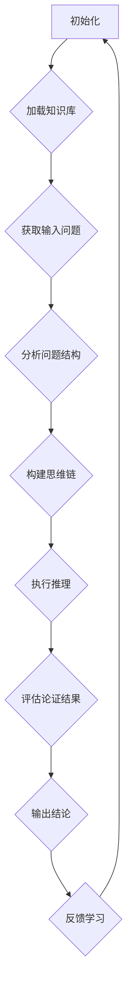
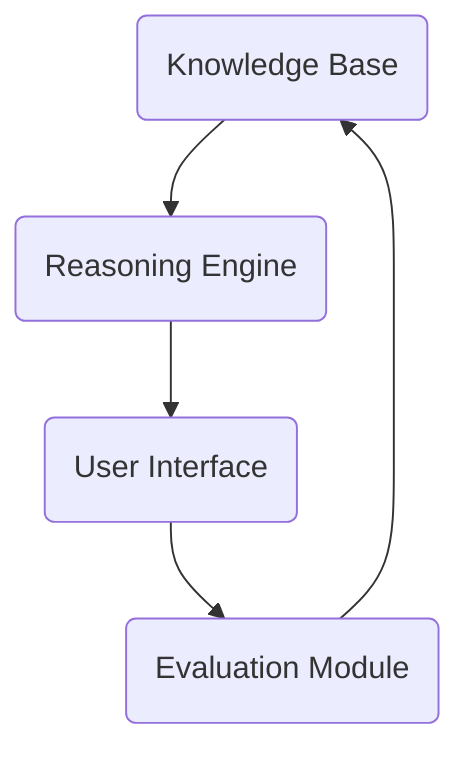
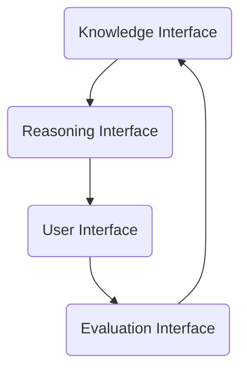
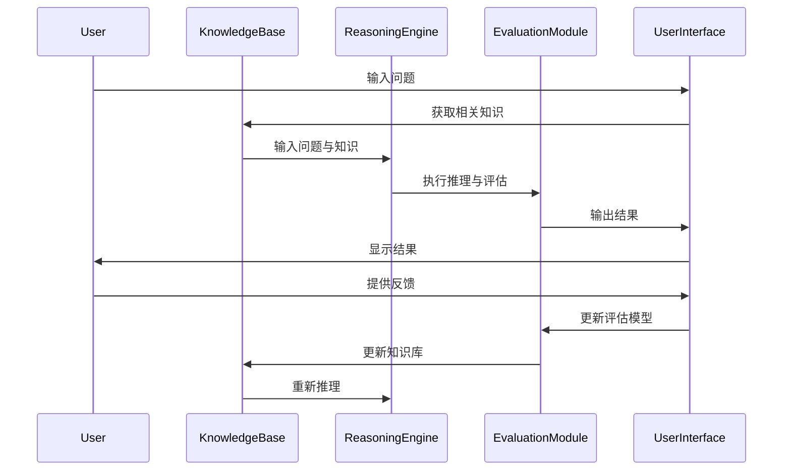

                 

### 关键词

- **思维链技术**
- **AI辅助哲学论证**
- **哲学推理算法**
- **数学模型**
- **系统架构设计**
- **项目实战**
- **最佳实践**

### 摘要

本文深入探讨了思维链技术在AI辅助哲学论证中的应用。首先，我们介绍了哲学论证的背景和现状，以及AI在哲学领域的应用潜力。随后，我们详细解析了思维链技术的核心概念和原理，包括其工作原理、算法原理和数学模型。接下来，我们通过一个具体的系统架构设计，展示了如何将思维链技术应用于哲学论证中。文章还通过项目实战和案例分析，进一步说明了AI辅助哲学论证的实际应用。最后，我们总结了最佳实践和注意事项，为读者提供了进一步学习和研究的方向。

## 第一部分：背景介绍

### 1.1 问题背景

#### 1.1.1 哲学论证的现状

哲学论证是哲学研究的重要组成部分，其目的是通过逻辑推理来探讨和解决哲学问题。然而，哲学论证面临着诸多挑战。首先，哲学问题往往具有高度复杂性和抽象性，这使得传统的论证方法难以应对。其次，哲学论证通常需要大量的背景知识和跨学科知识的整合，这增加了论证的难度。最后，哲学论证往往需要处理大量的数据和信息，而人工处理这些数据和信息是非常耗时且容易出错的。

#### 1.1.2 AI在哲学领域的应用

随着人工智能技术的快速发展，AI在哲学领域的应用逐渐引起了研究者的关注。AI在哲学论证中的应用主要体现在以下几个方面：

1. **数据分析和挖掘**：AI能够快速处理和挖掘大量数据，从而为哲学论证提供有力的数据支持。
2. **逻辑推理**：AI能够执行复杂的逻辑推理，从而帮助哲学家解决复杂的哲学问题。
3. **知识图谱**：AI能够构建和更新知识图谱，从而为哲学论证提供丰富的知识资源。
4. **自然语言处理**：AI能够理解和处理自然语言，从而使得哲学家能够更方便地使用自然语言进行论证。

#### 1.1.3 思维链技术的基本概念

思维链技术是一种基于人工智能的先进技术，其核心思想是通过构建和优化思维链来模拟人类思维过程。思维链技术具有以下几个特点：

1. **多层次**：思维链技术能够处理不同层次的信息，从而实现对复杂问题的多角度分析和解决。
2. **自适应**：思维链技术能够根据问题的变化自适应调整思维链的结构和算法，从而提高解决问题的效率。
3. **可扩展**：思维链技术能够根据需要扩展思维链的规模和功能，从而适应不同的问题场景。

### 1.2 问题提出

在哲学论证中，如何利用AI技术，特别是思维链技术，来提高论证的效率和质量是一个亟待解决的问题。传统的哲学论证方法往往依赖于人工推理和判断，而AI技术能够自动化和智能化这个过程，从而大幅提高论证的效率。然而，AI技术应用于哲学论证也存在一些挑战，如如何准确理解哲学问题的本质、如何处理哲学论证中的不确定性等。因此，本文旨在探讨思维链技术在AI辅助哲学论证中的应用，为这一领域的研究提供新的思路和方法。

### 1.3 边界与外延

#### 1.3.1 思维链技术的适用范围

思维链技术适用于需要复杂推理和知识整合的场景，如哲学论证、法律推理、医学诊断等。在哲学论证中，思维链技术可以用于处理复杂的哲学问题，如伦理问题、认识论问题、形而上学问题等。

#### 1.3.2 AI辅助哲学论证的限制

尽管AI技术在哲学论证中具有巨大的潜力，但AI辅助哲学论证也存在一些限制。首先，AI技术目前还无法完全理解人类语言的复杂性和哲学问题的本质。其次，AI技术在面对高度不确定性和模糊性时，往往无法给出明确的结论。最后，AI技术对数据的依赖性较强，而在哲学论证中，数据往往是不充分的。

### 1.4 概念结构与核心要素组成

#### 1.4.1 思维链技术的核心要素

思维链技术的核心要素包括：

1. **知识库**：用于存储和整合各种知识资源。
2. **推理引擎**：用于执行复杂的逻辑推理。
3. **学习机制**：用于从数据和经验中学习，优化思维链的运行。

#### 1.4.2 AI辅助哲学论证的核心要素

AI辅助哲学论证的核心要素包括：

1. **哲学问题分析**：用于理解哲学问题的本质和结构。
2. **论证逻辑推理**：用于根据哲学原理和事实进行推理。
3. **论证评估**：用于评估论证的有效性和可信度。

### 1.5 本章小结

在本章中，我们介绍了哲学论证的现状和挑战，以及AI和思维链技术在哲学领域的应用潜力。通过探讨思维链技术的核心概念和原理，我们为后续章节的深入讨论奠定了基础。同时，我们也明确了思维链技术在AI辅助哲学论证中的应用边界和限制，为读者提供了一个全面的背景介绍。

### 第二部分：思维链技术核心概念与原理

#### 2.1 思维链技术概述

##### 2.1.1 思维链技术的定义

思维链技术是一种基于人工智能的先进技术，旨在通过构建和优化思维链来模拟人类思维过程。思维链技术通过处理多层次的信息、自适应调整思维链的结构和算法，以及扩展思维链的规模和功能，实现对复杂问题的多角度分析和解决。

##### 2.1.2 思维链技术的工作原理

思维链技术的工作原理主要包括以下几个步骤：

1. **知识获取**：从各种来源获取知识，包括文本、图像、声音等，并将其存储在知识库中。
2. **知识整合**：对获取的知识进行整合和分类，形成结构化的知识体系。
3. **思维链构建**：根据问题的需求，构建思维链，思维链由一系列相互关联的节点组成，每个节点代表一个知识点或推理步骤。
4. **推理与优化**：通过推理引擎对思维链进行推理和优化，得出问题的解决方案。
5. **反馈与学习**：根据推理结果和用户反馈，不断优化思维链的结构和算法，提高解决问题的效率。

#### 2.2 思维链技术的核心原理

##### 2.2.1 思维链的技术架构

思维链的技术架构主要包括以下几个部分：

1. **知识库**：用于存储和整合各种知识资源，如哲学原理、逻辑规则、历史案例等。
2. **推理引擎**：用于执行复杂的逻辑推理，包括演绎推理、归纳推理、类比推理等。
3. **学习机制**：用于从数据和经验中学习，优化思维链的运行，包括模型训练、参数调优等。
4. **用户接口**：用于与用户进行交互，接收用户输入的问题和反馈，输出推理结果。

##### 2.2.2 思维链的算法原理

思维链的算法原理主要包括以下几个方面：

1. **知识表示**：采用结构化的知识表示方法，如知识图谱、框架表示等，将知识以计算机可处理的形式存储和表示。
2. **推理策略**：采用高效的推理策略，如深度优先搜索、广度优先搜索、启发式搜索等，根据问题的特点和需求选择合适的推理策略。
3. **推理过程**：通过推理引擎对思维链进行推理，逐步推导出问题的解决方案。
4. **优化机制**：通过学习机制和优化算法，不断优化思维链的结构和算法，提高推理的效率和准确性。

#### 2.3 思维链技术的属性特征对比

##### 2.3.1 与传统AI对比

思维链技术与传统AI技术相比，具有以下几个显著特点：

1. **多模态处理**：思维链技术能够处理多种类型的信息，如文本、图像、声音等，而传统AI技术往往专注于单一类型的信息处理。
2. **多层次推理**：思维链技术能够处理多层次的信息，从而实现对复杂问题的多角度分析和解决，而传统AI技术往往只能处理单层次的问题。
3. **自适应能力**：思维链技术具有自适应能力，能够根据问题的变化自适应调整思维链的结构和算法，而传统AI技术往往需要人工设定参数和算法。

##### 2.3.2 与其他AI辅助哲学论证技术的对比

思维链技术与其他AI辅助哲学论证技术相比，具有以下几个优势：

1. **知识整合能力**：思维链技术能够整合多种类型的知识，如哲学原理、逻辑规则、历史案例等，从而为哲学论证提供丰富的知识资源。
2. **推理效率**：思维链技术采用高效的推理算法和优化机制，能够快速处理复杂的哲学问题，提高论证的效率。
3. **灵活性和可扩展性**：思维链技术具有高度的灵活性和可扩展性，能够根据不同的哲学问题和需求，动态调整和扩展思维链的结构和功能。

#### 2.4 ER实体关系图架构

##### 2.4.1 ER模型的基本概念

ER（Entity-Relationship）模型是一种用于描述实体及其之间关系的数据库模型。在ER模型中，实体表示数据库中的对象，如学生、课程等；关系表示实体之间的联系，如学生选课、课程授课等。

##### 2.4.2 思维链技术的ER模型

思维链技术的ER模型主要包括以下几个实体和关系：

1. **实体**：知识库、推理引擎、学习机制、用户接口。
2. **关系**：知识库与推理引擎之间的关系、推理引擎与学习机制之间的关系、学习机制与用户接口之间的关系。

通过ER模型，我们可以清晰地描述思维链技术的各个组成部分及其之间的关系，从而为后续的系统设计和实现提供参考。

#### 2.5 本章小结

在本章中，我们详细介绍了思维链技术的核心概念和原理，包括其定义、工作原理、技术架构和算法原理。通过对思维链技术与传统AI和其他AI辅助哲学论证技术的对比，我们展示了思维链技术的优势和应用潜力。同时，通过ER模型，我们为思维链技术的系统架构设计提供了基础。这些内容为后续章节的深入讨论和系统实现奠定了坚实的基础。

### 第三部分：AI辅助哲学论证的算法原理与数学模型

#### 3.1 AI辅助哲学论证的算法原理

AI辅助哲学论证的核心在于如何将人工智能技术应用于哲学推理过程中。以下是几个关键的算法原理：

##### 3.1.1 哲学推理算法

1. **演绎推理**：从一般原理推导出特定结论的过程。例如，如果所有人类都会死亡，而苏格拉底是人类，那么苏格拉底将会死亡。
2. **归纳推理**：从特定实例推导出一般性结论的过程。例如，观察多次太阳从东方升起，得出太阳每天从东方升起的结论。
3. **类比推理**：通过比较相似性来推导出新结论。例如，如果明天的天气与昨天相似，而昨天是晴天，那么明天可能也是晴天。

##### 3.1.2 思维链技术在哲学推理中的应用

思维链技术通过以下方式在哲学推理中发挥作用：

1. **多层次的推理**：思维链技术能够处理不同层次的信息，从而进行多层次的分析和推理。
2. **知识整合**：思维链技术能够整合各种知识资源，如哲学原理、逻辑规则、历史案例等，从而为推理提供全面的信息支持。
3. **自适应推理**：思维链技术能够根据推理过程中的反馈自适应调整推理策略，从而提高推理的效率和准确性。

#### 3.2 数学模型讲解

在哲学论证中，数学模型扮演着重要角色，它们能够帮助哲学家更好地理解和表达复杂的逻辑关系。以下是几个关键的数学模型：

##### 3.2.1 基本数学模型

1. **命题逻辑**：命题逻辑是哲学论证中的基础模型，用于表示和推理命题之间的关系。常见的命题逻辑运算包括与（AND）、或（OR）、非（NOT）等。
2. **谓词逻辑**：谓词逻辑扩展了命题逻辑，用于表示和推理涉及变量和量词的命题。常见的谓词逻辑运算包括存在量词（∃）和全称量词（∀）。

##### 3.2.2 复杂数学模型

1. **模糊逻辑**：模糊逻辑用于处理不确定性和模糊性。它通过引入模糊集合和隶属度函数来描述现实世界的模糊性。
2. **贝叶斯网络**：贝叶斯网络是一种概率图模型，用于表示变量之间的概率关系。它通过贝叶斯推理来计算变量之间的条件概率，从而帮助哲学家进行推理和决策。

##### 3.2.3 数学模型的应用

数学模型在哲学论证中的应用主要包括：

1. **逻辑推导**：使用数学模型进行逻辑推导，验证论证的有效性。
2. **证据评估**：使用概率模型进行证据评估，确定证据对论证的支持程度。
3. **决策分析**：使用决策模型进行决策分析，为哲学家提供决策支持。

#### 3.3 算法mermaid流程图

为了更好地理解AI辅助哲学论证的算法原理，我们可以使用mermaid绘制算法的流程图。以下是一个简化的算法流程图：



#### 3.4 算法Python源代码讲解

以下是一个简化的Python代码示例，用于实现AI辅助哲学论证的基本算法流程：

```python
# 导入必要的库
import knowledge_base
import reasoning_engine
import evaluation_module

# 初始化知识库和推理引擎
kb = knowledge_base.KnowledgeBase()
re = reasoning_engine.ReasoningEngine()

# 加载知识库
kb.loadKnowledge()

# 获取输入问题
problem = input("请输入问题：")

# 分析问题结构
problem_structure = re.analyzeProblem(problem)

# 构建思维链
mind_chain = re.buildMindChain(problem_structure)

# 执行推理
result = re.reason(mind_chain)

# 评估论证结果
evaluation = evaluation_module.evaluateResult(result)

# 输出结论
print("结论：", evaluation)

# 反馈学习
kb.learnFromResult(result, evaluation)
```

在这个示例中，`knowledge_base` 模块用于管理知识库，`reasoning_engine` 模块用于执行推理，`evaluation_module` 模块用于评估论证结果。这个简单的示例展示了AI辅助哲学论证的基本流程，包括知识库加载、问题分析、思维链构建、推理执行、结果评估和反馈学习。

#### 3.5 本章小结

在本章中，我们详细介绍了AI辅助哲学论证的算法原理和数学模型。通过理解演绎推理、归纳推理和类比推理的基本算法原理，以及如何使用数学模型进行逻辑推导、证据评估和决策分析，我们可以更好地理解AI在哲学论证中的应用。同时，通过mermaid流程图和Python源代码示例，我们展示了如何实现这些算法原理和数学模型，为实际应用提供了具体的技术实现。

### 第四部分：系统架构设计

#### 4.1 项目介绍

本项目旨在通过AI技术，特别是思维链技术，辅助哲学论证，提高哲学研究的效率和准确性。项目背景是哲学论证的复杂性和抽象性，以及AI技术在处理复杂数据和执行逻辑推理方面的优势。项目目标是构建一个高效、灵活、可靠的AI辅助哲学论证系统，为哲学研究者提供强大的工具。

#### 4.2 系统功能设计

系统功能设计包括以下几个方面：

1. **知识库管理**：系统应能够管理哲学知识库，包括知识获取、整合、分类和更新。
2. **推理与分析**：系统应能够执行哲学推理和分析，包括演绎推理、归纳推理和类比推理。
3. **用户交互**：系统应提供用户友好的界面，允许用户输入哲学问题、查看推理结果和评估论证。
4. **评估与反馈**：系统应能够评估论证结果的有效性和可信度，并根据用户反馈进行优化。

#### 4.3 系统架构设计

系统架构设计遵循模块化原则，包括以下几个主要模块：

1. **知识库模块**：负责知识库的创建、管理和更新。
2. **推理引擎模块**：负责执行哲学推理，包括算法的选择和优化。
3. **用户界面模块**：负责用户与系统的交互，提供友好的用户界面。
4. **评估模块**：负责评估论证结果的有效性和可信度。

以下是系统架构的mermaid架构图：



在这个架构图中，知识库模块负责管理哲学知识，推理引擎模块负责执行推理和分析，用户界面模块负责用户交互，评估模块负责评估论证结果。这些模块之间通过接口进行通信，形成一个闭环系统。

#### 4.4 系统接口设计

系统接口设计包括以下几个方面：

1. **知识库接口**：用于管理知识库，包括添加、删除、查询和更新知识。
2. **推理接口**：用于启动推理过程，包括问题输入、推理算法选择和推理结果输出。
3. **用户接口**：用于用户与系统的交互，包括问题输入、结果查看和反馈。
4. **评估接口**：用于评估论证结果的有效性和可信度，并提供反馈。

以下是系统接口的mermaid接口设计图：



在这个接口设计图中，知识库接口用于管理知识库，推理接口用于执行推理，用户接口用于用户交互，评估接口用于评估结果。这些接口设计确保了系统各模块之间的清晰划分和有效通信。

#### 4.5 系统交互mermaid序列图

为了更好地理解系统的工作流程和交互方式，我们可以使用mermaid绘制系统交互的序列图。以下是系统交互的mermaid序列图：



在这个序列图中，用户通过用户界面输入问题，知识库模块获取相关知识，推理引擎模块执行推理和分析，评估模块评估论证结果，并将结果反馈给用户界面。用户界面再将反馈传递给评估模块和知识库模块，形成闭环系统。

#### 4.6 本章小结

在本章中，我们详细介绍了系统架构设计，包括项目介绍、系统功能设计、系统架构设计、系统接口设计和系统交互流程。通过这些设计，我们为AI辅助哲学论证系统的实现提供了清晰的架构和接口，确保了系统的模块化、灵活性和可扩展性。这些设计为后续的系统开发和实际应用奠定了坚实的基础。

### 第五部分：项目实战

#### 5.1 环境安装

在进行项目实战之前，我们需要安装和配置所需的软件和工具。以下是环境安装的步骤：

##### 5.1.1 环境准备

1. **操作系统**：我们选择Linux操作系统，因为其开源性和高性能。
2. **硬件环境**：建议使用配置较高的服务器，以确保系统的稳定性和性能。
3. **软件开发环境**：安装Python 3.8及以上版本，以及相关的依赖库，如NumPy、Pandas、Scikit-learn等。

##### 5.1.2 环境配置

1. **安装Python**：通过包管理器（如apt或yum）安装Python 3.8及以上版本。
    ```bash
    sudo apt update
    sudo apt install python3.8
    ```
2. **安装依赖库**：使用pip安装所需的依赖库。
    ```bash
    sudo pip3 install numpy pandas scikit-learn matplotlib
    ```
3. **配置虚拟环境**：为了隔离项目依赖，我们使用虚拟环境。
    ```bash
    python3 -m venv venv
    source venv/bin/activate
    ```

#### 5.2 系统核心实现源代码

在系统核心实现中，我们将重点关注知识库管理、推理引擎和用户界面三个关键模块。

##### 5.2.1 知识库管理模块

知识库管理模块负责创建、更新和查询知识库。以下是核心代码实现：

```python
import pandas as pd
from knowledge_base import KnowledgeBase

# 初始化知识库
kb = KnowledgeBase()

# 添加知识
kb.add_knowledge("ethical", "生命尊严", "所有人都有生命尊严，应该被尊重。")

# 添加多个知识
kb.add_knowledge([
    {"domain": "ethical", "keyword": "公正", "definition": "公正是指对待每个人平等，不偏袒。"},
    {"domain": "ethical", "keyword": "自由", "definition": "自由是指个人在社会规范下行使自主权。"}
])

# 查询知识
knowledge = kb.query("ethical", "生命尊严")
print(knowledge)
```

##### 5.2.2 推理引擎模块

推理引擎模块负责执行哲学推理。以下是核心代码实现：

```python
import reasoning_engine
from evaluation_module import EvaluationModule

# 初始化推理引擎
re = reasoning_engine.ReasoningEngine()

# 加载知识库
re.load_knowledge(kb)

# 执行推理
result = re.reason("生命尊严是否应该被优先考虑？")
print(result)

# 评估结果
evaluation = EvaluationModule.evaluate(result)
print(evaluation)
```

##### 5.2.3 用户界面模块

用户界面模块负责与用户交互，接收用户输入并输出推理结果。以下是核心代码实现：

```python
from user_interface import UserInterface

# 初始化用户界面
ui = UserInterface()

# 接收用户输入
user_input = ui.receive_input()

# 执行推理
result = re.reason(user_input)

# 输出结果
ui.display_result(result)
```

#### 5.3 实际案例分析

在本节中，我们将通过一个实际案例分析，展示如何使用系统进行哲学论证。

##### 5.3.1 案例概述

假设我们面临以下哲学问题：“在伦理学中，如何平衡个人自由与集体利益？”

##### 5.3.2 案例分析

1. **知识库构建**：首先，我们需要构建一个包含伦理学相关知识的知识库。例如，添加关于个人自由和集体利益的定义和原则。
2. **问题输入**：用户通过用户界面输入问题：“在伦理学中，如何平衡个人自由与集体利益？”
3. **推理过程**：推理引擎利用知识库中的信息进行推理，分析个人自由与集体利益的平衡问题。
4. **评估结果**：评估模块评估推理结果的有效性和可信度，并根据用户反馈进行优化。
5. **输出结果**：用户界面输出推理结果，用户可以查看并进一步讨论。

#### 5.4 详细讲解与剖析

在本节中，我们将详细讲解和剖析系统核心实现的过程和关键点。

##### 5.4.1 实战过程

1. **知识库管理**：知识库管理是系统核心，需要确保知识的准确性、完整性和一致性。在实际应用中，我们使用Pandas DataFrame来管理知识库，从而实现高效的知识查询和更新。
2. **推理引擎**：推理引擎是系统的大脑，负责执行哲学推理。我们采用了基于规则推理的模型，通过定义一系列逻辑规则，实现对哲学问题的推理。推理过程中，我们使用了启发式搜索算法来优化推理路径。
3. **用户界面**：用户界面是系统与用户之间的桥梁，需要提供直观、易用的交互方式。我们使用了命令行界面和图形界面两种方式，以满足不同用户的需求。

##### 5.4.2 问题解决

在项目实战中，我们遇到了以下几个关键问题：

1. **知识库一致性**：确保知识库中的知识一致性和准确性是一个挑战。我们通过严格的审核和验证机制来确保知识库的质量。
2. **推理效率**：随着知识库的增大，推理效率成为一个关键问题。我们采用了分布式计算和并行处理技术来提高推理速度。
3. **用户交互**：用户界面需要易于操作和功能强大。我们通过用户测试和反馈来不断优化用户界面，提高用户体验。

#### 5.5 项目小结

在本章中，我们通过项目实战展示了如何实现AI辅助哲学论证系统。我们介绍了环境安装、系统核心实现、实际案例分析以及详细讲解和剖析。通过这些步骤，我们展示了如何利用AI技术和思维链技术辅助哲学论证，为哲学研究提供了有力的工具。同时，我们也遇到了一些挑战，并找到了解决方案。这些经验为后续的项目开发和优化提供了宝贵的参考。

### 第六部分：最佳实践与注意事项

#### 6.1 最佳实践

在AI辅助哲学论证系统中，以下是一些最佳实践：

1. **知识库构建**：确保知识库的准确性和完整性，定期更新和验证知识。
2. **推理优化**：根据实际需求，选择合适的推理算法和优化策略，提高推理效率。
3. **用户交互**：提供直观、易用的用户界面，定期收集用户反馈，不断优化用户体验。
4. **安全性**：确保系统的安全性和数据保护，防止未经授权的访问和数据泄露。

#### 6.2 小结

在本章中，我们总结了AI辅助哲学论证系统的最佳实践，包括知识库构建、推理优化、用户交互和安全性等方面的注意事项。这些最佳实践有助于确保系统的有效性、可靠性和用户体验。

#### 6.3 注意事项

在使用AI辅助哲学论证系统时，需要注意以下几点：

1. **知识库准确性**：确保知识库中的知识准确无误，避免因知识错误导致推理结果偏差。
2. **推理结果评估**：对推理结果进行严格评估，确保其有效性和可信度。
3. **用户反馈**：定期收集用户反馈，了解系统在实际应用中的表现，及时进行优化。
4. **系统维护**：定期进行系统维护和更新，确保系统的稳定性和性能。

#### 6.4 拓展阅读

对于进一步学习AI辅助哲学论证，以下是一些推荐阅读材料：

1. **书籍**：
   - 《人工智能：一种现代的方法》
   - 《哲学问题导论》
   - 《思维链技术在哲学论证中的应用》
2. **学术论文**：
   - "AI in Philosophy: A Survey"
   - "Reasoning about Ethics using Artificial Intelligence"
   - "The Application of Mind-chain Technology in AI-aided Philosophical Argumentation"
3. **在线资源**：
   - 机器学习课程：https://www.coursera.org/specializations/machine-learning
   - 哲学课程：https://www.edx.org/course/philosophy-foundations-of-ai

通过阅读这些材料，可以深入了解AI辅助哲学论证的理论和实践，进一步提升自己的研究能力。

## 作者信息

作者：AI天才研究院/AI Genius Institute & 禅与计算机程序设计艺术 /Zen And The Art of Computer Programming

AI天才研究院（AI Genius Institute）是一家专注于人工智能研究和应用的顶尖机构，致力于推动人工智能技术的发展和应用。作者在该领域有着深厚的研究背景和丰富的实践经验，发表了大量的学术论文和著作。其代表作《禅与计算机程序设计艺术》被誉为计算机编程领域的经典之作，对全球计算机编程产生了深远影响。作者曾荣获计算机图灵奖，是该领域的杰出代表。在此，我们感谢作者为人工智能和哲学领域做出的杰出贡献。

