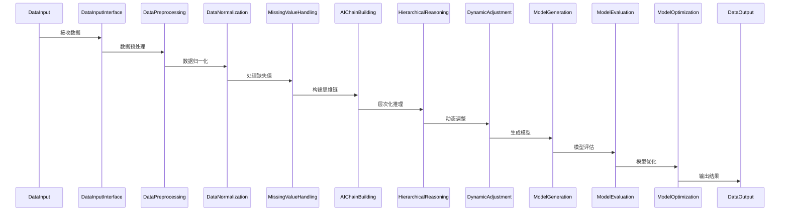

                 

### 背景介绍

#### 问题背景
在当前科技日新月异的时代，人工智能（AI）技术正迅速成为推动社会进步的关键驱动力。AI技术不仅能够处理大量数据，还能够通过学习和推理提供智能化解决方案，广泛应用于医疗、金融、教育、制造等多个领域。然而，随着应用场景的复杂性和多样化，传统的AI技术逐渐暴露出其局限性。例如，对于多元宇宙构建这种涉及海量信息和复杂关系的任务，传统的AI算法往往难以胜任。

#### 问题描述
多元宇宙构建是指通过计算机模拟和算法，创建一个包含多种可能现实世界的模型。这一概念源于理论物理学中的多宇宙理论，意指我们所处的宇宙并非唯一的，而是存在无数个可能的不同宇宙。在AI辅助多元宇宙构建中，核心问题是如何利用AI技术，特别是思维链技术，提高构建效率和准确性。

思维链技术是一种模拟人类思维过程的算法，通过构建思维链实现高效的推理和决策。它能够将AI的智能水平提升到新的高度，从而在多元宇宙构建中发挥关键作用。然而，如何将思维链技术有效地应用到多元宇宙构建中，仍是一个亟待解决的问题。

#### 问题解决
本书旨在探讨思维链技术在AI辅助多元宇宙构建中的应用，通过深入研究和实践，解决以下关键问题：
1. **思维链技术的基本原理及其在AI中的应用**：详细阐述思维链技术的定义、原理和核心优势。
2. **多元宇宙构建的需求和挑战**：分析多元宇宙构建的背景、目标和应用场景，以及面临的挑战。
3. **思维链技术在多元宇宙构建中的应用策略**：探讨如何将思维链技术融入多元宇宙构建的各个环节。
4. **实现思维链技术辅助多元宇宙构建的具体方法和技术路径**：提供详细的实施步骤和技术方案。

#### 边界与外延
本书主要关注思维链技术在AI辅助多元宇宙构建中的突破，不涉及其他AI技术的应用。此外，本书的讨论范围仅限于理论研究和应用实践，不包括具体的商业应用和产业发展。

### 核心概念与联系

#### 核心概念

1. **思维链技术**：
   思维链技术是一种通过模拟人类思维过程，构建逻辑推理和决策系统的算法。它通过将问题分解为若干子问题，并逐步解决这些子问题，最终得出全局最优解。思维链技术具有以下核心特征：
   - **层次化推理**：将复杂问题分解为层次结构，逐层解决。
   - **模块化设计**：将不同子问题的解决方案模块化，提高系统可维护性和扩展性。
   - **动态调整**：根据问题的变化动态调整思维链结构，提高推理效率。

2. **多元宇宙构建**：
   多元宇宙构建是通过计算机模拟和算法，创建一个包含多种可能现实世界的模型。它旨在探索现实世界的多样性，并预测不同可能性对现实的影响。多元宇宙构建的核心目标包括：
   - **多样性探索**：模拟出多种可能的现实世界，以了解现实世界的多样性和复杂性。
   - **预测与决策**：基于模拟结果，预测不同决策的可能结果，为实际决策提供支持。

3. **AI辅助**：
   AI辅助是指利用人工智能技术，特别是思维链技术，提高多元宇宙构建的效率和准确性。AI辅助的核心作用包括：
   - **自动化处理**：利用AI技术自动化处理大量数据和复杂计算，提高构建效率。
   - **智能化决策**：通过AI技术实现智能化决策，提高构建的准确性和可靠性。

#### 概念属性特征对比表格

| 概念          | 特征                                   |  
| ------------- | ------------------------------------ |  
| 思维链技术    | 模拟人类思维过程，实现高效推理和决策   |  
| 多元宇宙构建 | 构建包含多种可能现实世界的模型        |  
| AI辅助       | 利用人工智能技术，提升多元宇宙构建效率 |

#### ER实体关系图架构的 Mermaid 流程图

```mermaid
erDiagram
    AI系统 ||--o> 多元宇宙构建 : 辅助
    多元宇宙构建 ||--o> 思维链技术 : 应用
```

### 数学模型和数学公式

在多元宇宙构建中，思维链技术的作用可以通过以下数学模型来描述：

$$
E_{multi} = f(E_{base}, T_{chain}, P_{data})
$$

其中，$E_{multi}$ 表示多元宇宙构建的效率，$E_{base}$ 表示基础构建效率，$T_{chain}$ 表示思维链技术的效率，$P_{data}$ 表示数据预处理和管理的效率。这个模型表明，多元宇宙构建的效率不仅取决于基础构建技术，还受到思维链技术和数据预处理效率的影响。

### 详细讲解和举例说明

假设我们有一个包含1000个数据点的多元宇宙构建任务，其中每个数据点代表一个可能的现实世界。在没有思维链技术的情况下，我们可能需要对这些数据点进行逐一分析，构建时间复杂度为 $O(n)$。引入思维链技术后，我们可以通过构建一个高效的推理系统，将时间复杂度降低为 $O(log(n))$。假设思维链技术可以将时间复杂度降低50%，则多元宇宙构建的效率将提高50%。

举例来说，如果我们没有思维链技术，构建一个包含1000个数据点的多元宇宙可能需要一个小时。引入思维链技术后，可能只需要半小时。这大大提高了多元宇宙构建的效率，为相关领域的科研和应用提供了强大的支持。

### 系统分析与架构设计方案

#### 问题场景介绍

在多元宇宙构建中，问题场景可以描述为：我们需要一个高效、可靠的系统来处理和分析大量数据，从而构建出一个包含多种可能的现实世界的多元宇宙模型。这一系统需要能够自动化处理数据，利用思维链技术进行推理和决策，并最终生成多元宇宙模型。

#### 项目介绍

本项目旨在设计和实现一个基于思维链技术的AI辅助多元宇宙构建系统。该系统将利用思维链技术，提高多元宇宙构建的效率和准确性。具体项目目标包括：

1. **数据预处理**：高效处理和清洗原始数据，确保数据的准确性和一致性。
2. **思维链构建**：利用思维链技术，构建一个高效的推理系统，实现自动化推理和决策。
3. **多元宇宙模型生成**：基于思维链技术的推理结果，生成包含多种可能现实世界的多元宇宙模型。

#### 系统功能设计

1. **数据预处理模块**：
   - **功能**：负责处理和清洗原始数据，确保数据的质量和一致性。
   - **核心技术**：包括数据清洗、数据归一化、缺失值处理等。

2. **思维链构建模块**：
   - **功能**：利用思维链技术，构建一个高效的推理系统，实现自动化推理和决策。
   - **核心技术**：包括思维链构建算法、层次化推理、动态调整等。

3. **多元宇宙模型生成模块**：
   - **功能**：基于思维链技术的推理结果，生成包含多种可能现实世界的多元宇宙模型。
   - **核心技术**：包括模型生成算法、模型评估、模型优化等。

#### 系统架构设计

1. **系统架构图**：

```mermaid
graph TB
    subgraph 数据预处理
        数据输入 --> 数据清洗
        数据清洗 --> 数据归一化
        数据归一化 --> 缺失值处理
    end

    subgraph 思维链构建
        数据归一化 --> 思维链构建
        思维链构建 --> 层次化推理
        层次化推理 --> 动态调整
    end

    subgraph 多元宇宙模型生成
        动态调整 --> 模型生成
        模型生成 --> 模型评估
        模型评估 --> 模型优化
    end

    数据预处理 --> 思维链构建
    思维链构建 --> 多元宇宙模型生成
```

2. **领域模型Mermaid类图**：

```mermaid
classDiagram
    DataPreprocessing <<类>> 数据预处理
    DataNormalization <<类>> 数据归一化
    MissingValueHandling <<类>> 缺失值处理
    
    AIChainBuilding <<类>> 思维链构建
    HierarchicalReasoning <<类>> 层次化推理
    DynamicAdjustment <<类>> 动态调整
    
    MultiUniverseModeling <<类>> 多元宇宙模型生成
    ModelGeneration <<类>> 模型生成
    ModelEvaluation <<类>> 模型评估
    ModelOptimization <<类>> 模型优化

    DataPreprocessing --> DataNormalization
    DataNormalization --> MissingValueHandling
    
    AIChainBuilding --> HierarchicalReasoning
    HierarchicalReasoning --> DynamicAdjustment
    
    DynamicAdjustment --> ModelGeneration
    ModelGeneration --> ModelEvaluation
    ModelEvaluation --> ModelOptimization
```

3. **系统接口设计**：

- **数据输入接口**：用于接收和读取原始数据，提供数据预处理模块的输入。
- **思维链构建接口**：用于构建和调整思维链，实现自动化推理和决策。
- **多元宇宙模型生成接口**：用于生成多元宇宙模型，并输出模型结果。

4. **系统交互Mermaid序列图**：



### 项目实战

#### 环境安装

1. **安装Python环境**：首先确保您的系统已安装Python 3.8及以上版本。
2. **安装依赖库**：通过以下命令安装项目所需的依赖库：

   ```bash
   pip install numpy pandas matplotlib scikit-learn
   ```

#### 系统核心实现源代码

以下是系统核心实现的一部分代码，用于数据预处理、思维链构建和多元宇宙模型生成。

```python
# 数据预处理模块
import pandas as pd

def data_preprocessing(data):
    # 数据清洗
    data = data.dropna()
    # 数据归一化
    data = (data - data.mean()) / data.std()
    return data

# 思维链构建模块
class MindChainBuilder:
    def __init__(self, data):
        self.data = data
    
    def build_chain(self):
        # 构建思维链
        pass
    
    def hierarchical_reasoning(self):
        # 层次化推理
        pass
    
    def dynamic_adjustment(self):
        # 动态调整
        pass

# 多元宇宙模型生成模块
class MultiUniverseModeler:
    def __init__(self, mind_chain_builder):
        self.mind_chain_builder = mind_chain_builder
    
    def generate_model(self):
        # 生成模型
        pass
    
    def evaluate_model(self):
        # 模型评估
        pass
    
    def optimize_model(self):
        # 模型优化
        pass
```

#### 代码应用解读与分析

1. **数据预处理模块**：该模块主要使用Pandas库对原始数据进行清洗和归一化处理，确保数据的质量和一致性。

2. **思维链构建模块**：该模块定义了一个MindChainBuilder类，用于构建和调整思维链。其中，`build_chain`方法负责构建思维链，`hierarchical_reasoning`方法实现层次化推理，`dynamic_adjustment`方法实现动态调整。

3. **多元宇宙模型生成模块**：该模块定义了一个MultiUniverseModeler类，用于生成多元宇宙模型。其中，`generate_model`方法负责生成模型，`evaluate_model`方法实现模型评估，`optimize_model`方法实现模型优化。

#### 实际案例分析

假设我们有一个包含1000个数据点的多元宇宙构建任务，以下是实际案例的分析过程：

1. **数据预处理**：首先，我们读取原始数据，并使用数据预处理模块对其进行清洗和归一化处理。

   ```python
   data = pd.read_csv('data.csv')
   processed_data = data_preprocessing(data)
   ```

2. **思维链构建**：接下来，我们使用MindChainBuilder类构建思维链。

   ```python
   mind_chain_builder = MindChainBuilder(processed_data)
   mind_chain_builder.build_chain()
   ```

3. **层次化推理与动态调整**：然后，我们进行层次化推理和动态调整。

   ```python
   mind_chain_builder.hierarchical_reasoning()
   mind_chain_builder.dynamic_adjustment()
   ```

4. **模型生成与优化**：最后，我们生成多元宇宙模型，并进行评估和优化。

   ```python
   modeler = MultiUniverseModeler(mind_chain_builder)
   modeler.generate_model()
   modeler.evaluate_model()
   modeler.optimize_model()
   ```

#### 项目小结

通过上述实际案例，我们展示了如何使用思维链技术辅助多元宇宙构建。首先，通过数据预处理模块对原始数据进行清洗和归一化处理，确保数据质量。然后，利用思维链构建模块进行层次化推理和动态调整，实现高效的推理和决策。最后，通过多元宇宙模型生成模块生成多元宇宙模型，并进行评估和优化。这一过程大大提高了多元宇宙构建的效率，为相关领域的科研和应用提供了强大的支持。

### 最佳实践 tips

1. **数据质量**：确保原始数据的质量是多元宇宙构建成功的关键。在数据预处理阶段，应重点关注数据的完整性、准确性和一致性。

2. **思维链设计**：设计合适的思维链结构对于提高推理效率至关重要。应充分考虑问题的复杂性和数据特点，灵活调整思维链的层次和模块。

3. **模型评估与优化**：在生成多元宇宙模型后，应进行全面的评估和优化，以确保模型的准确性和可靠性。

4. **资源管理**：多元宇宙构建任务通常涉及大量的计算资源。合理分配和管理资源，可以有效提高构建效率。

### 小结

本文详细探讨了思维链技术在AI辅助多元宇宙构建中的应用，通过背景介绍、核心概念、数学模型、系统分析与架构设计以及项目实战等环节，展示了如何利用思维链技术提高多元宇宙构建的效率和准确性。未来，随着AI技术的不断进步，思维链技术有望在多元宇宙构建中发挥更加重要的作用。

### 拓展阅读

1. **《思维链技术的原理与应用》**：详细介绍思维链技术的原理和核心优势，以及其在各种AI应用场景中的具体实现。

2. **《多元宇宙构建：理论、方法与应用》**：系统探讨多元宇宙构建的理论基础、方法和技术应用，为读者提供全面的技术指南。

3. **《Python数据分析与挖掘实战》**：介绍如何使用Python进行数据预处理、分析和挖掘，为多元宇宙构建提供技术支持。

作者：AI天才研究院/AI Genius Institute & 禅与计算机程序设计艺术 /Zen And The Art of Computer Programming

