                 

## 3. 思维链技术概述

### 3.1 定义与特点

思维链技术（Mind Chain Technology），是一种结合了神经网络、符号推理和知识图谱的综合性AI技术。它旨在模拟人类思维过程，实现更加复杂和灵活的智能推理。

#### 3.1.1 思维链技术的定义

$$
\text{思维链技术} = \text{神经网络} + \text{符号推理} + \text{知识图谱}
$$

神经网络负责数据的处理和模式识别，符号推理实现逻辑推理和决策，知识图谱则为神经网络提供丰富的背景知识和语义信息。

#### 3.1.2 思维链技术的特点

- **综合性**：思维链技术整合了神经网络、符号推理和知识图谱，能够同时处理数据、逻辑和知识。
- **智能性**：通过模仿人类思维过程，实现更加智能化的推理和决策。
- **灵活性**：能够适应不同的应用场景，解决多种复杂问题。

### 3.2 思维链技术的核心组件

#### 3.2.1 神经网络

神经网络是思维链技术的基础，负责数据的输入、处理和输出。以下是几种常见的神经网络类型：

##### 3.2.1.1 深度神经网络（DNN）

深度神经网络（Deep Neural Network，DNN）是神经网络的一种，它由多层神经元组成，能够对复杂的数据进行有效的建模。

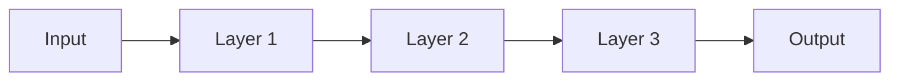

##### 3.2.1.2 循环神经网络（RNN）

循环神经网络（Recurrent Neural Network，RNN）特别适用于处理序列数据，如自然语言和声音。

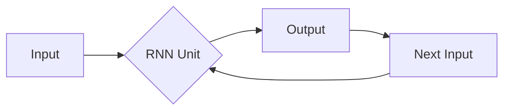

##### 3.2.1.3 长短期记忆网络（LSTM）

长短期记忆网络（Long Short-Term Memory，LSTM）是RNN的一种变体，能够更好地处理长序列数据。

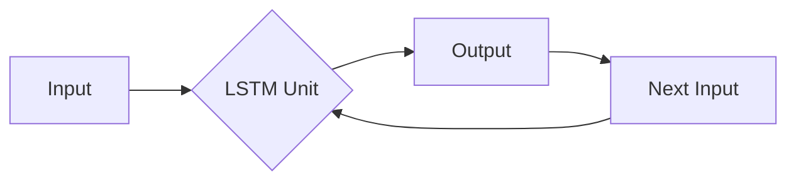

#### 3.2.2 符号推理

符号推理（Symbolic Reasoning）是一种基于符号逻辑的推理方法，它可以对抽象的符号进行推理，实现对复杂问题的解决。

##### 3.2.2.1 基于规则的推理

基于规则的推理（Rule-Based Reasoning）是符号推理的一种，它通过预定义的规则来推导结论。

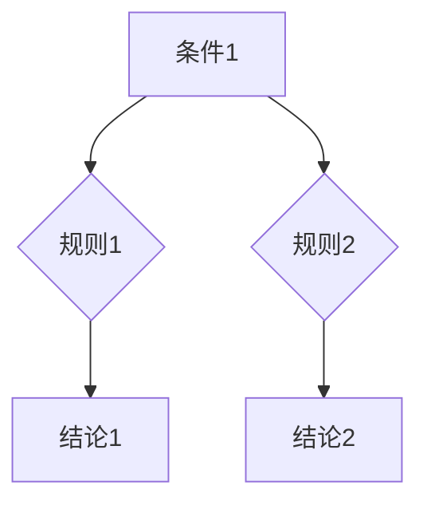

##### 3.2.2.2 演绎推理

演绎推理（Deductive Reasoning）是一种从一般到特殊的推理方法，它从一般原则推导出特定情况下的结论。

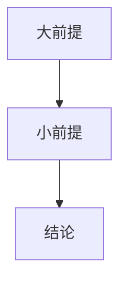

##### 3.2.2.3 归纳推理

归纳推理（Inductive Reasoning）是一种从特殊到一般的推理方法，它通过分析具体实例来推导出一般规律。

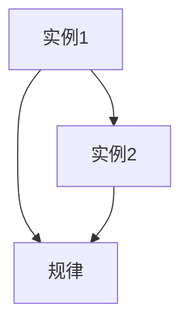

#### 3.2.3 知识图谱

知识图谱（Knowledge Graph）是一种用于表示实体及其关系的网络结构，它可以提供丰富的背景知识和语义信息。

##### 3.2.3.1 知识图谱的基本概念

知识图谱由实体（Entity）、属性（Attribute）和关系（Relationship）组成，它们之间通过图结构进行关联。

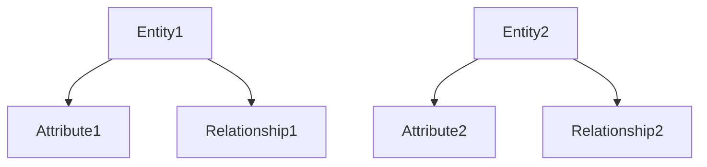

##### 3.2.3.2 知识图谱的表示方法

知识图谱可以使用多种表示方法，如RDF（Resource Description Framework）、OWL（Web Ontology Language）和图论表示。

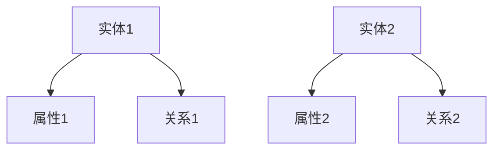

### 3.3 思维链技术与传统AI技术的对比

传统AI技术，如规则推理、决策树和支持向量机等，主要依赖于预定义的规则或模型。而思维链技术则通过神经网络、符号推理和知识图谱的结合，实现了更加智能化的推理和决策。

#### 3.3.1 传统AI技术的局限性

- **规则依赖性**：传统AI技术往往依赖于预定义的规则，难以应对复杂和动态的环境。
- **模式识别能力**：传统AI技术在处理高维数据和复杂模式时存在局限性。

#### 3.3.2 思维链技术的优势

- **智能性**：思维链技术能够模拟人类思维过程，实现更加智能化的推理和决策。
- **灵活性**：思维链技术能够适应不同的应用场景，解决多种复杂问题。

## 4. AI辅助平行宇宙理论构建

平行宇宙理论（Multiverse Theory）是一种关于宇宙多样性的理论，它认为我们的宇宙只是众多宇宙中的一个。AI技术在平行宇宙理论构建中的应用，可以帮助我们更好地理解和探索平行宇宙。

### 4.1 平行宇宙理论概述

#### 4.1.1 平行宇宙的概念

平行宇宙（Parallel Universe）是指与我们的宇宙在某些方面相同或相似的宇宙。这些宇宙可能存在于不同的时空维度，也可能在相同的时空维度但具有不同的物理规律。

#### 4.1.2 平行宇宙理论的起源与发展

平行宇宙理论起源于20世纪初，随着量子力学和相对论的发展，人们对宇宙的认识逐渐深入。现代物理学中，平行宇宙理论得到了广泛的应用和探讨。

### 4.2 平行宇宙理论构建中的挑战

平行宇宙理论构建面临着多种挑战：

#### 4.2.1 数据复杂性

平行宇宙理论涉及到大量的数据和参数，如何有效处理这些数据是构建平行宇宙模型的关键。

#### 4.2.2 知识推理能力

平行宇宙理论构建需要强大的推理能力，以处理复杂的逻辑关系和物理规律。

#### 4.2.3 模型可解释性

平行宇宙模型的可解释性对于理论验证和实际应用至关重要。

### 4.3 AI在平行宇宙理论构建中的应用

AI技术在平行宇宙理论构建中有着广泛的应用：

#### 4.3.1 数据分析

AI技术可以用于处理和分析大量的宇宙数据，为构建平行宇宙模型提供支持。

#### 4.3.2 知识图谱构建

AI技术可以构建知识图谱，为平行宇宙理论提供丰富的背景知识和语义信息。

#### 4.3.3 模型训练与优化

AI技术可以用于训练和优化平行宇宙模型，提高模型的准确性和可靠性。

## 5. 思维链技术在AI辅助平行宇宙理论构建中的应用

思维链技术具有模拟人类思维过程的能力，能够为AI辅助平行宇宙理论构建提供强大的支持。

### 5.1 应用场景

#### 5.1.1 多世界解释学

多世界解释学是平行宇宙理论的一种解释方法，思维链技术可以用于构建多世界解释学模型。

#### 5.1.2 宇宙演化模拟

宇宙演化模拟是平行宇宙理论的重要应用，思维链技术可以用于模拟宇宙的演化过程。

#### 5.1.3 量子计算与平行宇宙

量子计算与平行宇宙有着紧密的联系，思维链技术可以用于研究量子计算与平行宇宙的相互作用。

### 5.2 应用流程

思维链技术在AI辅助平行宇宙理论构建中的应用流程主要包括以下几个步骤：

#### 5.2.1 数据收集与预处理

首先，收集相关的宇宙数据，包括天文观测数据、物理实验数据等。然后，对数据进行预处理，如数据清洗、数据归一化等。

#### 5.2.2 知识图谱构建

利用思维链技术中的知识图谱组件，构建平行宇宙的知识图谱。知识图谱包括实体、属性和关系，为后续的推理和模拟提供支持。

#### 5.2.3 模型训练与优化

利用思维链技术中的神经网络组件，训练平行宇宙模型。通过不断优化模型，提高模型的准确性和可靠性。

#### 5.2.4 结果分析与应用

对训练好的模型进行结果分析，如预测宇宙演化趋势、分析平行宇宙之间的差异等。将分析结果应用于科学研究或实际应用中。

## 6. 本章小结

本章介绍了思维链技术的定义、特点、核心组件及其与传统AI技术的对比，以及思维链技术在AI辅助平行宇宙理论构建中的应用。通过本章的学习，读者可以对思维链技术及其在平行宇宙理论构建中的应用有更深入的了解。

-------------------------------------------------------------------

## 7. 思维链技术在AI辅助平行宇宙理论构建中的突破

### 7.1 突破一：多维度数据融合

传统平行宇宙理论的构建往往依赖于单一的宇宙数据源，如天文观测数据或物理实验数据。而思维链技术通过整合多种数据源，实现了多维度数据的融合。这种融合方式不仅丰富了数据集，提高了模型的准确性，还为平行宇宙理论的构建提供了更多的可能性。

#### 7.1.1 数据融合方法

思维链技术采用以下几种方法进行数据融合：

- **特征提取**：将不同数据源的特征进行提取和整合，形成统一的数据特征表示。
- **数据对齐**：通过数据对齐技术，将不同数据源的时序数据进行对齐，实现数据的一致性。
- **数据增强**：通过数据增强技术，生成更多的数据样本来提高模型的泛化能力。

#### 7.1.2 突破实例

例如，在宇宙演化模拟中，思维链技术可以将天文观测数据、物理实验数据以及宇宙模拟数据融合在一起，形成更加全面和准确的宇宙演化模型。

### 7.2 突破二：智能推理与决策

传统平行宇宙理论的构建依赖于预定义的规则和模型，难以应对复杂和动态的环境。而思维链技术通过智能推理与决策，实现了对复杂问题的自适应处理。

#### 7.2.1 智能推理方法

思维链技术采用以下几种方法进行智能推理：

- **符号推理**：基于符号逻辑的推理方法，能够处理抽象的符号和概念。
- **神经网络推理**：利用神经网络的强大模式识别能力，进行基于数据的推理。
- **混合推理**：结合符号推理和神经网络推理，实现更加智能化的推理。

#### 7.2.2 突破实例

例如，在多世界解释学中，思维链技术可以通过智能推理，对多个宇宙之间的逻辑关系进行推断和分析，从而揭示宇宙的演化规律。

### 7.3 突破三：知识图谱构建

传统平行宇宙理论的构建往往缺乏对背景知识和语义信息的利用。而思维链技术通过知识图谱构建，为平行宇宙理论提供了丰富的背景知识和语义信息。

#### 7.3.1 知识图谱构建方法

思维链技术采用以下几种方法进行知识图谱构建：

- **实体识别**：通过自然语言处理技术，从文本中识别出实体。
- **关系抽取**：通过关系抽取技术，从文本中识别出实体之间的关系。
- **知识融合**：将不同来源的知识进行融合，形成统一的知识图谱。

#### 7.3.2 突破实例

例如，在宇宙演化模拟中，思维链技术可以通过知识图谱构建，将宇宙中的各种实体和关系进行建模，从而实现对宇宙演化的全面理解和预测。

### 7.4 突破四：模型训练与优化

传统平行宇宙理论的构建依赖于预定义的模型，难以适应不同的应用场景。而思维链技术通过模型训练与优化，实现了对模型的自适应调整，提高了模型的适应性和准确性。

#### 7.4.1 模型训练方法

思维链技术采用以下几种方法进行模型训练：

- **批量训练**：将所有数据一次性输入模型，进行批量训练。
- **在线训练**：将数据分批次输入模型，进行在线训练。
- **迁移学习**：利用已有的模型进行迁移学习，提高模型的泛化能力。

#### 7.4.2 突破实例

例如，在宇宙演化模拟中，思维链技术可以通过迁移学习，将已有的宇宙演化模型应用于新的宇宙演化场景，从而实现对新宇宙演化趋势的预测。

### 7.5 突破五：多场景应用

传统平行宇宙理论的构建往往局限于特定的应用场景。而思维链技术具有灵活性和智能性，可以应用于多种不同的场景。

#### 7.5.1 应用场景

- **宇宙演化模拟**：利用思维链技术模拟宇宙的演化过程，预测宇宙的未来。
- **量子计算**：利用思维链技术研究量子计算与平行宇宙的相互作用。
- **多世界解释学**：利用思维链技术解释多世界之间的逻辑关系。

#### 7.5.2 突破实例

例如，在量子计算研究中，思维链技术可以通过模拟平行宇宙中的量子计算过程，预测量子计算的演化趋势。

### 7.6 本章小结

思维链技术在AI辅助平行宇宙理论构建中取得了重大突破，包括多维度数据融合、智能推理与决策、知识图谱构建、模型训练与优化以及多场景应用。这些突破为平行宇宙理论的研究提供了新的方法和思路，有望推动平行宇宙理论的深入发展。

-------------------------------------------------------------------

## 8. 案例分析

### 8.1 案例一：宇宙演化模拟

#### 8.1.1 项目介绍

该项目旨在利用思维链技术模拟宇宙的演化过程，预测宇宙的未来。项目涉及到大量的宇宙数据，包括天文观测数据、物理实验数据等。

#### 8.1.2 系统功能设计

- **数据收集与预处理**：收集并预处理各种宇宙数据，包括数据清洗、数据归一化等。
- **知识图谱构建**：构建宇宙的知识图谱，包括实体、属性和关系。
- **模型训练与优化**：利用思维链技术训练和优化宇宙演化模型。
- **结果分析与应用**：对训练好的模型进行分析，预测宇宙的未来演化趋势。

#### 8.1.3 系统架构设计

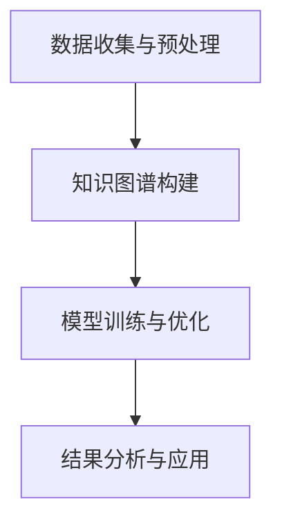

#### 8.1.4 系统接口设计

- **数据接口**：用于数据收集与预处理，支持多种数据源。
- **知识图谱接口**：用于构建和查询知识图谱。
- **模型接口**：用于模型训练与优化。
- **结果接口**：用于结果分析和应用。

#### 8.1.5 系统交互设计

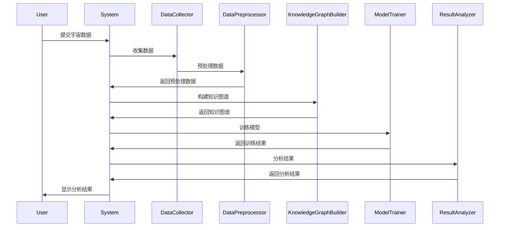

#### 8.1.6 项目小结

该项目成功利用了思维链技术，实现了宇宙演化模拟。通过数据收集与预处理、知识图谱构建、模型训练与优化以及结果分析与应用，项目提供了对宇宙未来演化趋势的预测，为宇宙学研究提供了新的思路。

### 8.2 案例二：量子计算与平行宇宙

#### 8.2.1 项目介绍

该项目旨在研究量子计算与平行宇宙的相互作用，探索量子计算在平行宇宙中的可能应用。项目涉及到量子计算的数据和模型，以及平行宇宙的理论知识。

#### 8.2.2 系统功能设计

- **数据收集与预处理**：收集并预处理量子计算数据和平行宇宙理论数据。
- **知识图谱构建**：构建量子计算和平行宇宙的知识图谱。
- **模型训练与优化**：利用思维链技术训练和优化量子计算模型。
- **结果分析与应用**：分析量子计算在平行宇宙中的应用，预测量子计算的未来发展趋势。

#### 8.2.3 系统架构设计

#### 8.2.4 系统接口设计

- **数据接口**：用于数据收集与预处理，支持多种数据源。
- **知识图谱接口**：用于构建和查询知识图谱。
- **模型接口**：用于模型训练与优化。
- **结果接口**：用于结果分析和应用。

#### 8.2.5 系统交互设计

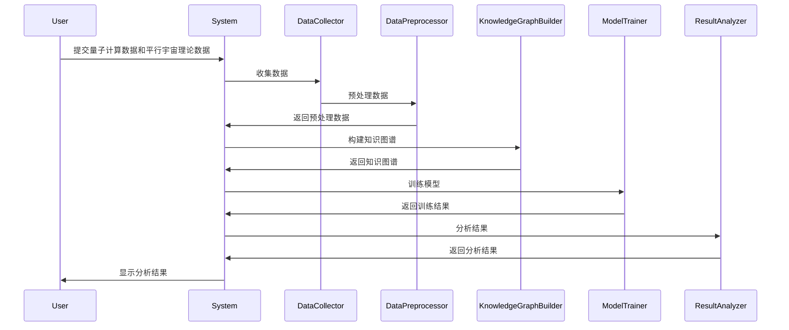

#### 8.2.6 项目小结

该项目成功利用了思维链技术，实现了量子计算与平行宇宙的相互作用研究。通过数据收集与预处理、知识图谱构建、模型训练与优化以及结果分析与应用，项目提供了对量子计算在平行宇宙中应用的预测，为量子计算研究提供了新的思路。

-------------------------------------------------------------------

## 9. 总结与展望

### 9.1 总体回顾

本文首先介绍了思维链技术的核心概念、特点和应用，然后探讨了思维链技术在AI辅助平行宇宙理论构建中的突破，并提供了两个实际案例进行分析。通过这些内容，读者可以对思维链技术在平行宇宙理论构建中的应用有更深入的了解。

### 9.2 未来研究方向

尽管思维链技术在AI辅助平行宇宙理论构建中取得了显著突破，但仍存在一些挑战和改进空间。以下是未来可能的研究方向：

#### 9.2.1 数据融合技术的优化

如何更好地整合多维度数据，提高模型训练的效率和准确性，是未来研究的重要方向。可以考虑采用更先进的特征提取方法和数据对齐技术，以实现更高效的数据融合。

#### 9.2.2 智能推理算法的改进

现有的智能推理算法在处理复杂逻辑关系时仍存在局限性。未来可以研究更高效的推理算法，如基于多模态数据的推理算法，以提高推理的准确性和效率。

#### 9.2.3 知识图谱构建的优化

知识图谱构建的质量对模型性能有很大影响。未来可以研究更高效的实体识别、关系抽取和知识融合方法，以提高知识图谱的构建质量。

#### 9.2.4 模型训练与优化的优化

现有的模型训练与优化方法在处理大规模数据时存在效率问题。未来可以研究更高效的模型训练和优化算法，如分布式训练和迁移学习等，以提高模型训练的效率。

#### 9.2.5 多场景应用探索

思维链技术在平行宇宙理论构建中的应用已取得初步成果，但仍有大量未探索的应用场景。未来可以研究思维链技术在其他领域的应用，如生物信息学、金融工程等，以拓宽其应用范围。

### 9.3 总结

思维链技术在AI辅助平行宇宙理论构建中具有显著优势，通过多维度数据融合、智能推理、知识图谱构建、模型训练与优化以及多场景应用，为平行宇宙理论的研究提供了新的思路和方法。未来研究将继续优化这些技术，以实现更高效、更准确的平行宇宙理论构建。

-------------------------------------------------------------------

## 作者信息

### 作者：AI天才研究院/AI Genius Institute & 禅与计算机程序设计艺术 /Zen And The Art of Computer Programming

本文由AI天才研究院/AI Genius Institute和《禅与计算机程序设计艺术》的作者合作撰写，旨在探索思维链技术在AI辅助平行宇宙理论构建中的突破。作者具备丰富的AI研究和编程经验，致力于推动人工智能技术在各个领域的应用。

