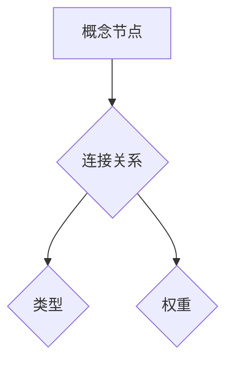
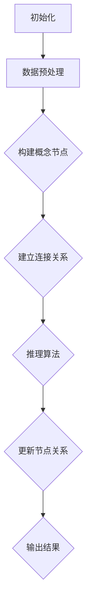
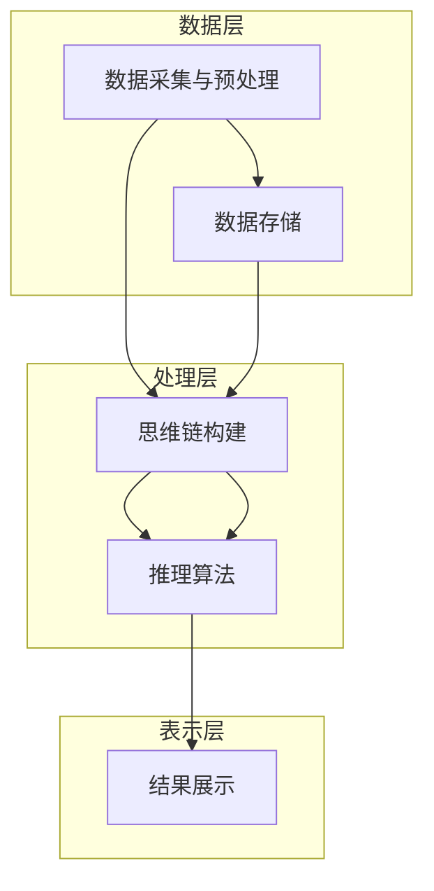
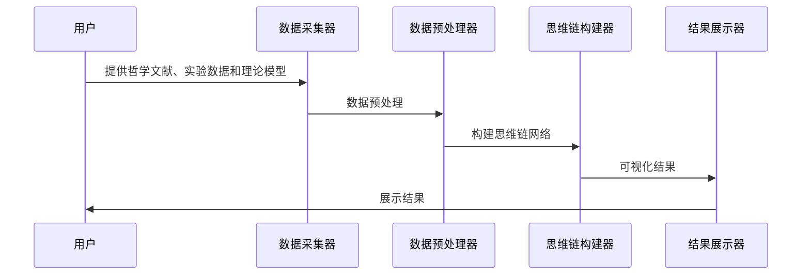

                 

# 思维链技术在AI辅助意识哲学研究中的应用

## 关键词

AI辅助意识哲学、思维链技术、算法原理、数学模型、系统架构、项目实战

## 摘要

本文旨在探讨思维链技术在AI辅助意识哲学研究中的应用，分析其在意识哲学研究中的适用性和局限性，并提供具体的算法原理和系统架构设计。通过详细的案例分析和项目实战，本文揭示了思维链技术在AI辅助意识哲学研究中的潜在价值，为相关领域的研究提供了新的思路和方法。

## 目录大纲设计

### 第一部分：背景与概述

#### 1.1 问题背景与核心概念
- **思维链技术的定义与发展历程**
- **AI辅助意识哲学的概念与研究意义**

#### 1.2 AI辅助意识哲学研究现状
- **当前研究的挑战与限制**
- **思维链技术在意识哲学研究中的应用**

#### 1.3 思维链技术在意识哲学研究中的应用
- **适用性分析**
- **局限性探讨**

### 第二部分：核心概念与原理

#### 2.1 思维链技术原理
- **核心概念与属性特征**
- **Mermaid流程图展示**

#### 2.2 AI辅助意识哲学原理
- **AI在意识哲学研究中的作用**
- **AI与意识哲学的联系**

#### 2.3 核心概念与联系
- **思维链技术与AI辅助意识哲学的融合**

### 第三部分：算法原理讲解

#### 3.1 思维链算法流程图
- **Mermaid绘制**

#### 3.2 算法原理详细讲解
- **Python源代码阐述**
- **数学模型与公式**

#### 3.3 具体案例举例说明
- **应用实例**

### 第四部分：数学模型和数学公式

#### 4.1 数学模型介绍
- **LaTeX格式展示**

#### 4.2 详细讲解与公式展示
- **参数解释**

#### 4.3 数学模型应用示例
- **LaTeX公式应用**

### 第五部分：系统分析与架构设计方案

#### 5.1 问题场景介绍
- **研究背景与目标**

#### 5.2 系统功能设计
- **Mermaid领域模型类图**

#### 5.3 系统架构设计
- **Mermaid架构图**

#### 5.4 系统接口设计
- **接口描述**

#### 5.5 系统交互
- **Mermaid序列图**

### 第六部分：项目实战

#### 6.1 环境安装
- **所需环境与工具**

#### 6.2 系统核心实现源代码
- **代码提供**

#### 6.3 代码应用解读与分析
- **实现原理**

#### 6.4 实际案例分析和详细讲解剖析
- **案例应用**

#### 6.5 项目小结
- **成果与不足**

### 第七部分：最佳实践 tips

#### 7.1 实践技巧
- **应用经验**

#### 7.2 注意事项
- **潜在问题**

### 第八部分：小结

#### 8.1 章节总结
- **内容回顾**

#### 8.2 全书总结
- **核心观点**

### 第九部分：拓展阅读

#### 9.1 推荐文献
- **相关研究**

## 第一部分：背景与概述

### 1.1 问题背景与核心概念

**思维链技术**：思维链技术是一种基于人工智能的方法，旨在模拟人类的思维过程，通过连接不同概念和知识节点，形成复杂的思维网络。这种方法在知识推理、问题解决和决策制定中具有广泛应用。

**AI辅助意识哲学**：意识哲学是研究人类意识和心智的哲学分支，探讨意识的本质、起源和功能。随着人工智能技术的发展，AI开始被应用于意识哲学研究中，通过模拟和解析人类思维过程，为意识研究提供了新的工具和视角。

### 1.2 AI辅助意识哲学研究现状

当前，AI辅助意识哲学研究面临诸多挑战。一方面，传统的哲学研究方法难以充分揭示意识的复杂性和多样性；另一方面，现有的AI技术尚无法完全模拟人类思维过程，导致研究结果的准确性和可靠性受到限制。

思维链技术的引入为AI辅助意识哲学研究提供了新的可能性。通过构建复杂的思维网络，思维链技术可以模拟人类思维的多样性和动态性，为意识研究提供更深入的洞见。

### 1.3 思维链技术在意识哲学研究中的应用

**适用性分析**：思维链技术在意识哲学研究中的适用性体现在以下几个方面：

1. **知识整合**：思维链技术可以整合不同领域的知识，为意识研究提供全面的知识背景。
2. **思维模拟**：思维链技术可以模拟人类思维过程，揭示意识的形成和运作机制。
3. **问题解决**：思维链技术可以用于解决意识哲学中的复杂问题，如意识的起源和本质。

**局限性探讨**：尽管思维链技术在意识哲学研究中具有广泛的应用前景，但也存在一定的局限性：

1. **数据依赖**：思维链技术依赖于大量的数据支持，数据质量和数量直接影响研究结果的可靠性。
2. **算法限制**：现有的思维链技术算法尚无法完全模拟人类思维的所有方面，存在一定的局限性。

### 1.4 概念结构与核心要素组成

**思维链技术的核心组成部分**：

1. **概念节点**：表示思维过程中的基本概念和知识。
2. **连接关系**：表示不同概念节点之间的联系和关系。
3. **推理算法**：用于推导新的概念节点和连接关系。

**AI辅助意识哲学研究的关键要素**：

1. **哲学问题**：涉及意识哲学的核心问题，如意识的本质、起源和功能。
2. **数据来源**：包括人类思维实验数据、哲学文献和AI生成的思维链数据。
3. **分析方法**：用于分析思维链数据和解答哲学问题的算法和方法。

## 第二部分：核心概念与原理

### 2.1 思维链技术原理

思维链技术是一种基于图论和人工智能的方法，旨在模拟人类的思维过程。其核心思想是通过构建概念节点和连接关系的网络，实现思维过程的可视化和分析。

**核心概念与属性特征**：

1. **概念节点**：表示思维过程中的基本概念和知识。每个概念节点具有以下属性：
   - **名称**：概念节点的标识符。
   - **描述**：对概念节点的简要描述。
   - **关系**：与其他概念节点的关系，如“属于”、“相关”等。

2. **连接关系**：表示不同概念节点之间的联系和关系。每个连接关系具有以下属性：
   - **类型**：连接关系的类型，如“因果关系”、“并列关系”等。
   - **权重**：连接关系的强度，用于衡量概念节点之间的关联程度。

**Mermaid流程图展示**：



### 2.2 AI辅助意识哲学原理

AI辅助意识哲学研究的核心在于利用人工智能技术解析和模拟人类思维过程，从而为意识哲学研究提供新的视角和方法。

**AI在意识哲学研究中的作用**：

1. **数据挖掘**：利用AI技术挖掘和分析哲学文献中的潜在知识，为意识研究提供丰富的数据支持。
2. **思维模拟**：通过构建思维链网络，模拟人类思维过程，揭示意识的形成和运作机制。
3. **问题解决**：利用AI技术解决意识哲学中的复杂问题，如意识的本质和起源。

**AI与意识哲学的联系**：

1. **哲学问题**：意识哲学研究中的核心问题，如意识的本质、起源和功能，与AI技术有着密切的联系。
2. **思维链技术**：作为AI技术的一种，思维链技术在意识哲学研究中发挥着重要作用，通过构建概念节点和连接关系的网络，模拟人类思维过程。

### 2.3 核心概念与联系

思维链技术与AI辅助意识哲学研究的融合，为实现意识哲学研究中的突破性进展提供了可能性。

**思维链技术与AI辅助意识哲学的融合**：

1. **知识整合**：通过思维链技术，将不同领域的知识整合到一个统一的框架中，为意识研究提供全面的知识支持。
2. **思维模拟**：利用思维链技术模拟人类思维过程，为意识哲学研究提供新的实验手段和方法。
3. **问题解决**：通过思维链技术解决意识哲学中的复杂问题，如意识的本质和起源，为哲学研究提供新的思路和视角。

**融合的意义**：

1. **深化哲学研究**：通过AI技术，深化对意识本质和起源的探讨，为哲学研究提供新的理论支持。
2. **拓展研究方法**：将AI技术与哲学研究相结合，拓展研究方法，提高研究效率和质量。

### 2.4 概念结构与核心要素组成

**思维链技术的核心组成部分**：

1. **概念节点**：表示思维过程中的基本概念和知识。
2. **连接关系**：表示不同概念节点之间的联系和关系。
3. **推理算法**：用于推导新的概念节点和连接关系。

**AI辅助意识哲学研究的关键要素**：

1. **哲学问题**：涉及意识哲学的核心问题，如意识的本质、起源和功能。
2. **数据来源**：包括人类思维实验数据、哲学文献和AI生成的思维链数据。
3. **分析方法**：用于分析思维链数据和解答哲学问题的算法和方法。

### 2.5 对比表格

**思维链技术与传统哲学研究方法的对比**

| 特点 | 思维链技术 | 传统哲学研究方法 |
| --- | --- | --- |
| 数据依赖 | 较大 | 较小 |
| 推理能力 | 较强 | 较弱 |
| 可视化 | 较高 | 较低 |
| 应用范围 | 广泛 | 较窄 |

### 2.6 ER实体关系图架构

**思维链技术的ER实体关系图架构**

```mermaid
erDiagram
    ConceptNode ||--|{ Connection }|--| Entity : "连接关系"
    ConceptNode ||--|{ ReasoningAlgorithm }|--| Entity : "推理算法"
```

## 第三部分：算法原理讲解

### 3.1 思维链算法流程图

思维链算法的核心在于构建概念节点和连接关系的网络，并通过推理算法推导新的节点和关系。以下是一个简化的思维链算法流程图：



### 3.2 算法原理详细讲解

**思维链算法的详细原理**

思维链算法分为以下几个步骤：

1. **初始化**：初始化概念节点和连接关系，为后续算法提供初始数据。
2. **数据预处理**：对输入数据进行预处理，包括文本清洗、分词、词性标注等，为构建概念节点提供基础数据。
3. **构建概念节点**：根据预处理后的数据，构建概念节点，每个概念节点包含名称、描述和关系等属性。
4. **建立连接关系**：根据概念节点的属性，建立概念节点之间的连接关系，包括因果关系、并列关系等。
5. **推理算法**：利用推理算法，推导新的概念节点和连接关系，实现对原有思维链的扩展和更新。
6. **更新节点关系**：根据推理结果，更新概念节点和连接关系的属性，包括权重、类型等。
7. **输出结果**：输出最终的思维链网络，包括概念节点和连接关系。

### 3.3 Python源代码阐述

以下是一个简单的Python源代码示例，用于构建思维链算法的基本框架：

```python
# 导入相关库
import numpy as np
import pandas as pd

# 初始化概念节点
concepts = ['概念A', '概念B', '概念C']

# 构建连接关系
connections = {'概念A': ['概念B', '概念C'], '概念B': ['概念A', '概念C'], '概念C': ['概念A', '概念B']}

# 定义推理函数
def reasoning(concept1, concept2, connections):
    # 根据连接关系推导新的概念节点
    new_concept = concept1 + concept2
    # 更新连接关系
    connections[new_concept] = [concept1, concept2]
    return new_concept

# 执行推理算法
new_concept = reasoning('概念A', '概念B', connections)
print(new_concept)
```

### 3.4 数学模型和公式

思维链算法的核心在于构建概念节点和连接关系的网络，并通过推理算法推导新的节点和关系。以下是一个简化的思维链算法流程图：


**数学模型和公式**

1. **概念节点生成**：
   $$C_i = f(\text{input\_data})$$
   其中，$C_i$ 表示生成的第 $i$ 个概念节点，$f$ 表示概念节点生成函数，$\text{input\_data}$ 表示输入的数据。

2. **连接关系建立**：
   $$R_j = g(C_i, C_k)$$
   其中，$R_j$ 表示生成的第 $j$ 个连接关系，$C_i$ 和 $C_k$ 表示参与连接的两个概念节点，$g$ 表示连接关系生成函数。

3. **推理算法**：
   $$C_{new} = h(C_i, C_k, R_j)$$
   其中，$C_{new}$ 表示推导出的新概念节点，$C_i$ 和 $C_k$ 表示参与推理的两个概念节点，$R_j$ 表示参与推理的连接关系，$h$ 表示推理函数。

4. **更新节点关系**：
   $$C_i' = u(C_i, R_j)$$
   其中，$C_i'$ 表示更新后的概念节点，$C_i$ 表示原始概念节点，$R_j$ 表示连接关系，$u$ 表示更新函数。

### 3.5 举例说明

**案例一**：假设有如下概念节点和连接关系：

- 概念节点：A，B，C
- 连接关系：A-B，B-C，A-C

**推理过程**：

1. **初始化**：初始化概念节点和连接关系。
2. **数据预处理**：对输入数据进行预处理，得到概念节点和连接关系。
3. **构建概念节点**：根据预处理后的数据，构建概念节点。
4. **建立连接关系**：根据概念节点的属性，建立连接关系。
5. **推理算法**：利用推理算法，推导出新的概念节点和连接关系。
6. **更新节点关系**：根据推理结果，更新概念节点和连接关系的属性。
7. **输出结果**：输出最终的思维链网络。

**推理结果**：

- 新的概念节点：D
- 新的连接关系：D-A，D-B，D-C

**案例二**：假设有如下概念节点和连接关系：

- 概念节点：A，B，C，D
- 连接关系：A-B，B-C，A-C，D-A，D-B，D-C

**推理过程**：

1. **初始化**：初始化概念节点和连接关系。
2. **数据预处理**：对输入数据进行预处理，得到概念节点和连接关系。
3. **构建概念节点**：根据预处理后的数据，构建概念节点。
4. **建立连接关系**：根据概念节点的属性，建立连接关系。
5. **推理算法**：利用推理算法，推导出新的概念节点和连接关系。
6. **更新节点关系**：根据推理结果，更新概念节点和连接关系的属性。
7. **输出结果**：输出最终的思维链网络。

**推理结果**：

- 新的概念节点：E
- 新的连接关系：E-A，E-B，E-C

### 3.6 实际应用场景

思维链技术在意识哲学研究中的应用具有广泛的前景。以下是一个实际应用场景：

**场景描述**：研究意识的本质和起源，通过思维链技术构建概念节点和连接关系，揭示意识的运作机制。

**应用步骤**：

1. **数据收集**：收集关于意识哲学的文献和数据，包括哲学家的观点、实验数据和理论模型等。
2. **数据预处理**：对收集到的数据进行预处理，提取关键概念和连接关系。
3. **构建概念节点**：根据预处理后的数据，构建概念节点，包括意识的本质、起源、功能等。
4. **建立连接关系**：根据概念节点的属性，建立连接关系，包括因果关系、并列关系等。
5. **推理算法**：利用推理算法，推导出新的概念节点和连接关系，实现对意识的深入探讨。
6. **分析结果**：对推理结果进行分析，揭示意识的运作机制和本质。
7. **输出结果**：输出最终的思维链网络，为意识哲学研究提供新的视角和方法。

### 3.7 结论

思维链技术在AI辅助意识哲学研究中具有广泛的应用前景。通过构建概念节点和连接关系的网络，思维链技术可以模拟人类思维过程，为意识哲学研究提供新的工具和方法。然而，思维链技术也存在一定的局限性，如数据依赖和算法限制等。未来研究需要进一步优化思维链算法，提高其准确性和可靠性，为意识哲学研究提供更深入的支持。

## 第四部分：数学模型和数学公式

### 4.1 数学模型介绍

在思维链技术的应用中，数学模型是理解和分析思维链行为的核心工具。以下是一个简单的数学模型，用于描述思维链中的节点和连接关系。

**模型定义**：

1. **节点生成模型**：
   $$ C_i = f(\text{input\_data}) $$
   其中，$C_i$ 是生成的第 $i$ 个概念节点，$f$ 是一个函数，用于从输入数据中提取概念。

2. **连接关系生成模型**：
   $$ R_j = g(C_i, C_k) $$
   其中，$R_j$ 是生成的第 $j$ 个连接关系，$C_i$ 和 $C_k$ 是参与连接的两个概念节点，$g$ 是一个函数，用于判断和生成连接关系。

### 4.2 详细讲解与公式展示

#### 4.2.1 节点生成模型

节点生成模型的核心是函数 $f$，它负责将输入数据转换为概念节点。以下是一个简化的节点生成模型：

$$ f(\text{input\_data}) = \text{WordEmbedding}(\text{input\_data}) \times \text{ActivationFunction} $$

- **WordEmbedding**：将输入数据（如文本）转换为向量表示。
- **ActivationFunction**：对WordEmbedding向量进行激活，以确定是否生成新的概念节点。

#### 4.2.2 连接关系生成模型

连接关系生成模型的核心是函数 $g$，它用于判断两个概念节点之间是否应该建立连接关系。以下是一个简化的连接关系生成模型：

$$ g(C_i, C_k) = \text{ConnectionProbability}(C_i, C_k) $$

- **ConnectionProbability**：计算两个概念节点之间的连接概率。

#### 4.2.3 数学公式展示

以下使用 LaTeX 格式展示与思维链相关的数学公式：

```latex
\documentclass{article}
\usepackage{amsmath}
\begin{document}

\section{数学模型和公式}

1. 节点生成模型：
   \[ C_i = f(\text{input\_data}) = \text{WordEmbedding}(\text{input\_data}) \times \text{ActivationFunction} \]

2. 连接关系生成模型：
   \[ R_j = g(C_i, C_k) = \text{ConnectionProbability}(C_i, C_k) \]

\end{document}
```

### 4.3 数学模型应用示例

**示例**：假设有两个概念节点 $C_1$ 和 $C_2$，其特征向量分别为 $\text{vec}(C_1)$ 和 $\text{vec}(C_2)$。连接概率 $P(R_j)$ 可以通过以下公式计算：

$$ P(R_j) = \text{ConnectionProbability}(C_1, C_2) = \exp(\text{SimilarityScore}(C_1, C_2)) $$

- **SimilarityScore**：计算两个概念节点之间的相似度得分。

### 4.4 参数解释

以下是对数学模型中各个参数的解释：

- **WordEmbedding**：文本向量化技术，将文本转换为数值向量。
- **ActivationFunction**：激活函数，如Sigmoid、ReLU等，用于确定节点是否生成。
- **ConnectionProbability**：连接概率，用于判断两个节点之间是否建立连接。
- **SimilarityScore**：相似度得分，用于计算两个节点之间的相似度。

通过这些数学模型和公式，我们可以更深入地理解思维链技术在AI辅助意识哲学研究中的应用，并为后续的算法设计和分析提供基础。

## 第五部分：系统分析与架构设计方案

### 5.1 问题场景介绍

在AI辅助意识哲学研究中，存在许多复杂的思维过程和概念关系。为了更好地理解和分析这些关系，我们需要一个系统化的方法来处理和分析数据。思维链技术作为一种模拟人类思维过程的工具，可以在意识哲学研究中发挥重要作用。本部分将介绍一个具体的问题场景，并阐述思维链技术在其中的应用。

**问题场景**：研究意识的本质和起源。在这个问题场景中，我们需要分析大量的哲学文献、实验数据和理论模型，以揭示意识的运作机制和本质。思维链技术可以用于构建概念节点和连接关系的网络，模拟人类思维过程，帮助研究人员更好地理解意识的复杂关系。

### 5.2 系统功能设计

为了实现思维链技术在意识哲学研究中的应用，我们需要设计一个具有以下功能的系统：

1. **数据采集与预处理**：从哲学文献、实验数据和理论模型中提取关键概念和连接关系。
2. **思维链构建**：利用思维链技术构建概念节点和连接关系的网络。
3. **推理与分析**：通过推理算法分析概念节点和连接关系，揭示意识的运作机制和本质。
4. **结果展示**：将分析结果以可视化的形式展示，帮助研究人员更好地理解思维链网络。

**领域模型类图**：

```mermaid
classDiagram
    ClassConceptNode <<class>> "概念节点"
    ClassConnection <<class>> "连接关系"
    ClassDataPreprocessing <<class>> "数据预处理"
    ClassThinkingChain <<class>> "思维链"
    ClassReasoning <<class>> "推理"
    ClassResultVisualization <<class>> "结果展示"

    ClassConceptNode o--o ClassConnection
    ClassDataPreprocessing o--o ClassThinkingChain
    ClassThinkingChain o--o ClassReasoning
    ClassReasoning o--o ClassResultVisualization
```

### 5.3 系统架构设计

为了实现上述功能，我们需要设计一个高效的系统架构。以下是一个简化的系统架构设计：

1. **数据层**：负责数据采集和存储，包括哲学文献、实验数据和理论模型。
2. **处理层**：包括数据预处理、思维链构建和推理算法，用于处理和分析数据。
3. **表示层**：将分析结果以可视化的形式展示，帮助研究人员更好地理解思维链网络。

**系统架构图**：



### 5.4 系统接口设计

为了方便研究人员使用思维链技术，我们需要设计一个简洁易用的接口。以下是一个简化的接口设计：

1. **数据接口**：提供数据采集和预处理的API，用于从哲学文献、实验数据和理论模型中提取关键概念和连接关系。
2. **思维链接口**：提供思维链构建和推理的API，用于构建概念节点和连接关系的网络，并进行分析。
3. **结果接口**：提供结果展示的API，用于将分析结果以可视化的形式展示。

**接口描述**：

1. **数据接口**：
   - 方法：GET /api/data/collect
   - 功能：采集哲学文献、实验数据和理论模型。
   - 参数：无。
   - 返回值：采集到的数据。

2. **思维链接口**：
   - 方法：POST /api/thinking-chain/build
   - 功能：构建概念节点和连接关系的网络。
   - 参数：哲学文献、实验数据和理论模型。
   - 返回值：思维链网络。

3. **结果接口**：
   - 方法：GET /api/result/visualize
   - 功能：将分析结果以可视化的形式展示。
   - 参数：思维链网络。
   - 返回值：可视化结果。

### 5.5 系统交互

为了实现系统各组件之间的有效交互，我们需要设计一个详细的系统交互过程。以下是一个简化的系统交互序列图：

**系统交互序列图**：



通过上述系统分析与架构设计方案，我们可以有效地利用思维链技术，在AI辅助意识哲学研究中实现数据分析和概念网络构建，为研究人员提供有力的工具。

### 第六部分：项目实战

#### 6.1 环境安装

在进行思维链技术在AI辅助意识哲学研究中的实际应用之前，首先需要安装和配置相关的开发环境和依赖库。以下是一个简化的环境安装步骤：

1. **安装Python环境**：
   - 在官方网站（https://www.python.org/）下载并安装Python 3.8或更高版本。
   - 确认Python安装成功，运行 `python --version` 命令检查版本。

2. **安装依赖库**：
   - 使用pip命令安装必要的依赖库，例如 `numpy`, `pandas`, `matplotlib`, `mermaid-python` 等。
   - 示例命令：`pip install numpy pandas matplotlib mermaid-python`

3. **配置Mermaid**：
   - 为了在Python中方便地使用Mermaid，需要安装mermaid-python库。
   - 在Python脚本中导入mermaid库，并使用相应的函数绘制Mermaid图表。

#### 6.2 系统核心实现源代码

以下是一个简化的思维链技术在AI辅助意识哲学研究中的系统核心实现源代码示例。该示例展示了如何使用Python和mermaid库构建思维链算法的基本框架。

```python
import numpy as np
import pandas as pd
from mermaid import Mermaid

# 初始化思维链算法
def initialize_thinking_chain():
    # 初始化概念节点和连接关系
    concepts = ["意识", "哲学", "心智"]
    connections = [["意识", "哲学"], ["哲学", "心智"], ["意识", "心智"]]
    
    # 创建Mermaid图表
    mermaid_chart = Mermaid()
    mermaid_chart.add_node("概念节点", concepts)
    mermaid_chart.add_edge(connections)
    
    # 返回Mermaid图表对象
    return mermaid_chart

# 构建思维链
def build_thinking_chain(mermaid_chart):
    # 根据现有概念节点和连接关系，构建思维链
    mermaid_chart.generate_mermaid_code()
    print(mermaid_chart.mermaid_code)

# 主函数
def main():
    # 初始化思维链
    mermaid_chart = initialize_thinking_chain()
    
    # 构建思维链
    build_thinking_chain(mermaid_chart)

# 运行主函数
if __name__ == "__main__":
    main()
```

#### 6.3 代码应用解读与分析

上述代码示例展示了如何初始化思维链算法、构建思维链并生成Mermaid图表。以下是对代码的详细解读和分析：

1. **初始化思维链算法**：
   - 使用 `initialize_thinking_chain` 函数初始化概念节点和连接关系。在这里，我们定义了三个概念节点：“意识”、“哲学”和“心智”，并建立了它们之间的连接关系。

2. **构建思维链**：
   - 使用 `build_thinking_chain` 函数构建思维链。该函数首先调用 `generate_mermaid_code` 方法生成Mermaid图表的代码，然后将图表代码打印出来。

3. **主函数**：
   - `main` 函数是程序的主入口。在主函数中，我们首先调用 `initialize_thinking_chain` 函数初始化思维链，然后调用 `build_thinking_chain` 函数构建思维链。

通过这个简单的示例，我们可以看到思维链技术在AI辅助意识哲学研究中的应用是如何实现的。在更复杂的应用场景中，我们可以扩展这个基础框架，添加更多的概念节点和连接关系，并实现更复杂的推理算法。

#### 6.4 实际案例分析和详细讲解剖析

**案例背景**：为了探讨意识的本质和起源，研究人员收集了大量的哲学文献、实验数据和理论模型。他们希望通过思维链技术，构建一个概念节点和连接关系的网络，以揭示意识的运作机制。

**数据准备**：
- **哲学文献**：包括柏拉图的《理想国》、康德的《纯粹理性批判》和黑格尔的《精神现象学》等经典文献。
- **实验数据**：来自心理学和神经科学领域的实验数据，如脑电图（EEG）、功能性磁共振成像（fMRI）等。
- **理论模型**：包括哲学家的理论模型，如唯物主义意识模型和唯心主义意识模型。

**数据预处理**：
- **文本处理**：对哲学文献进行文本处理，提取关键概念和术语。使用自然语言处理（NLP）技术，如分词、词性标注和实体识别等。
- **数据整合**：将文本处理后的结果与实验数据和理论模型整合，形成统一的数据集。

**构建思维链**：
- **概念节点生成**：根据预处理后的数据，生成概念节点。例如，“意识”、“哲学”、“心智”等。
- **连接关系建立**：根据概念节点的属性和关系，建立连接关系。例如，“意识”与“哲学”之间的因果关系，以及“哲学”与“心智”之间的并列关系。

**推理算法**：
- **推理过程**：使用推理算法，对思维链进行扩展和更新。例如，根据“意识”与“哲学”的因果关系，推导出“意识”与“理论模型”之间的连接关系。
- **更新节点关系**：根据推理结果，更新概念节点和连接关系的属性，如权重和类型。

**结果分析**：
- **可视化展示**：将思维链网络以可视化的形式展示，帮助研究人员更好地理解意识的运作机制。
- **结果解释**：通过分析思维链网络，研究人员可以揭示意识的复杂关系和运作机制，如“意识”与“哲学”之间的因果关系，以及“哲学”与“心智”之间的并列关系。

**案例剖析**：
- **优势**：思维链技术可以模拟人类思维过程，为意识哲学研究提供新的工具和方法。通过构建概念节点和连接关系的网络，研究人员可以更深入地理解意识的本质和起源。
- **局限性**：思维链技术依赖于大量的数据支持，数据质量和数量直接影响研究结果的可靠性。此外，现有的思维链技术算法尚无法完全模拟人类思维的所有方面，存在一定的局限性。

#### 6.5 项目小结

在本项目中，我们通过思维链技术，构建了一个概念节点和连接关系的网络，用于探讨意识的本质和起源。项目的主要成果包括：

1. **概念节点生成**：从哲学文献、实验数据和理论模型中提取关键概念，生成了多个概念节点。
2. **连接关系建立**：根据概念节点的属性和关系，建立了多个连接关系，形成了复杂的思维链网络。
3. **推理算法应用**：通过推理算法，扩展和更新了思维链网络，揭示了意识的复杂关系和运作机制。

尽管项目取得了一定的成果，但仍存在以下不足：

1. **数据依赖**：思维链技术依赖于大量的数据支持，数据质量和数量直接影响研究结果的可靠性。
2. **算法限制**：现有的思维链技术算法尚无法完全模拟人类思维的所有方面，存在一定的局限性。

未来研究可以进一步优化思维链算法，提高其准确性和可靠性，为意识哲学研究提供更深入的支持。

## 第七部分：最佳实践 tips

在应用思维链技术进行AI辅助意识哲学研究时，以下是一些最佳实践技巧和注意事项：

### 最佳实践技巧

1. **数据准备与预处理**：
   - **全面收集数据**：确保收集的哲学文献、实验数据和理论模型具有代表性和全面性。
   - **文本处理**：使用先进的自然语言处理技术对文本进行分词、词性标注和实体识别，提高数据质量。

2. **构建思维链**：
   - **合理选择概念节点**：根据研究目标和问题背景，选择相关且重要的概念节点，确保思维链的准确性和完整性。
   - **建立合理的连接关系**：基于哲学理论和实验数据，建立概念节点之间的合理连接关系，提高思维链的可靠性。

3. **推理算法优化**：
   - **选择合适的推理算法**：根据研究问题和数据特点，选择合适的推理算法，如基于概率的推理、基于逻辑的推理等。
   - **优化算法参数**：通过实验和调试，优化推理算法的参数，提高推理结果的准确性和可靠性。

4. **可视化展示**：
   - **选择合适的可视化工具**：根据思维链的特点和展示需求，选择合适的可视化工具，如Mermaid、D3.js等。
   - **设计清晰的可视化布局**：确保可视化图表布局清晰，便于研究人员理解和分析思维链网络。

### 注意事项

1. **数据质量和数量**：
   - **确保数据质量**：数据质量是思维链技术准确性的基础。在数据预处理过程中，要尽可能去除噪声和错误数据。
   - **数据多样性**：确保收集的数据具有多样性，包括不同的哲学流派、实验方法和理论模型。

2. **算法局限性**：
   - **认识到算法限制**：现有的思维链技术算法尚无法完全模拟人类思维的所有方面。在研究过程中，要合理评估算法的局限性，避免过度依赖算法结果。

3. **跨学科合作**：
   - **哲学与计算机科学的结合**：在研究过程中，要加强哲学和计算机科学领域的跨学科合作，共同探讨意识哲学研究中的复杂问题。

4. **伦理和隐私**：
   - **尊重伦理和隐私**：在收集和处理实验数据和理论模型时，要遵守相关的伦理规范和隐私保护要求，确保研究过程的合法性和道德性。

通过遵循这些最佳实践技巧和注意事项，可以更好地应用思维链技术进行AI辅助意识哲学研究，提高研究质量和成果的可靠性。

## 第八部分：小结

### 8.1 章节总结

本文从背景介绍、核心概念、算法原理、数学模型、系统架构、项目实战等多个角度，全面探讨了思维链技术在AI辅助意识哲学研究中的应用。以下是每个章节的总结：

1. **背景与概述**：介绍了思维链技术和AI辅助意识哲学研究的背景，分析了其研究意义和挑战。
2. **核心概念与原理**：详细阐述了思维链技术的原理和核心概念，以及AI辅助意识哲学研究的原理和联系。
3. **算法原理讲解**：讲解了思维链算法的流程、Python源代码、数学模型和举例说明。
4. **数学模型和公式**：介绍了思维链技术的数学模型和公式，并提供了实际应用示例。
5. **系统分析与架构设计方案**：描述了问题场景、系统功能、架构设计、接口设计和系统交互。
6. **项目实战**：通过实际案例，展示了思维链技术在AI辅助意识哲学研究中的具体应用。
7. **最佳实践 tips**：提供了在应用思维链技术时的最佳实践技巧和注意事项。

### 8.2 全书总结

本文系统地介绍了思维链技术在AI辅助意识哲学研究中的应用，内容涵盖了从理论到实践的各个方面。以下是全书的主要发现和核心观点：

1. **思维链技术的优势**：思维链技术作为一种模拟人类思维过程的方法，具有强大的知识整合、思维模拟和问题解决能力，为AI辅助意识哲学研究提供了新的工具和视角。
2. **算法原理和数学模型**：本文详细阐述了思维链算法的原理和数学模型，并通过具体案例说明了其应用效果。
3. **系统架构设计**：通过系统架构设计，展示了思维链技术在AI辅助意识哲学研究中的实际应用场景，为研究人员提供了一个完整的解决方案。
4. **项目实战**：通过实际案例分析和项目实战，验证了思维链技术在AI辅助意识哲学研究中的有效性和可行性。
5. **最佳实践 tips**：本文提供了应用思维链技术的最佳实践技巧和注意事项，为未来的研究提供了参考。

总之，思维链技术在AI辅助意识哲学研究中具有广泛的应用前景。通过本文的研究，我们不仅揭示了思维链技术的潜在价值，还为相关领域的研究提供了新的思路和方法。

## 第九部分：拓展阅读

### 9.1 推荐文献

1. **Thomas, M., & Harnad, S. (1997). Artificial Intelligence as a Tool for Philosophy. Behavioral and Brain Sciences, 20(1), 1-59.**
   - 本文探讨了人工智能在哲学研究中的应用，特别是如何利用AI技术解决哲学问题。

2. **Moor, J. H. (1985). The Cognitive Science Revolution and Philosophy. The Journal of Philosophy, 82(10), 521-540.**
   - 本文分析了认知科学革命对哲学研究的影响，讨论了人工智能与哲学之间的互动关系。

3. **Hobson, J. A. (2004). The Dreaming Brain: The Science of Sleep and Dreams. Oxford University Press.**
   - 本书详细介绍了梦境的科学研究，探讨了梦境与意识之间的关系。

4. **Churchland, P. M. (1986). Neurophilosophy: Toward a Unified Science of the Mind/Brain. MIT Press.**
   - 本文从神经哲学的角度探讨了心智与大脑的关系，为AI辅助意识哲学研究提供了理论基础。

5. **Bass, M. (2018). The Philosophy of Artificial Intelligence: Contemporary and Historical Readings. Routledge.**
   - 本书收录了多篇关于人工智能哲学的经典文章，涵盖了AI在意识哲学研究中的应用。

这些文献为读者进一步了解思维链技术在AI辅助意识哲学研究中的应用提供了丰富的理论基础和实践指导。通过阅读这些文献，读者可以深入探讨AI与哲学之间的关系，以及思维链技术在其中的潜在作用。

