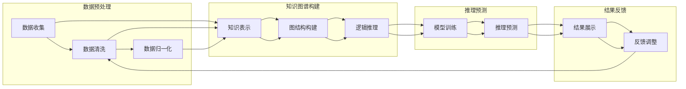
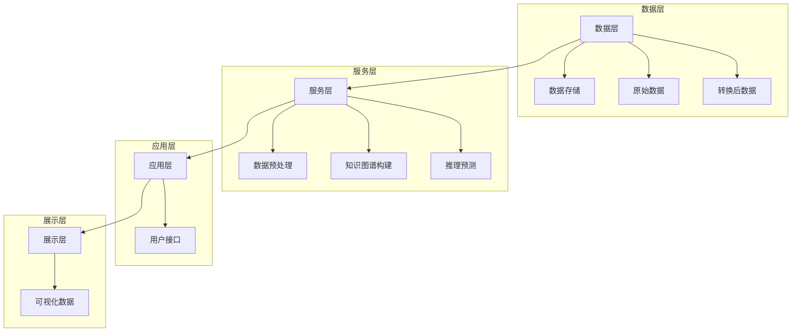
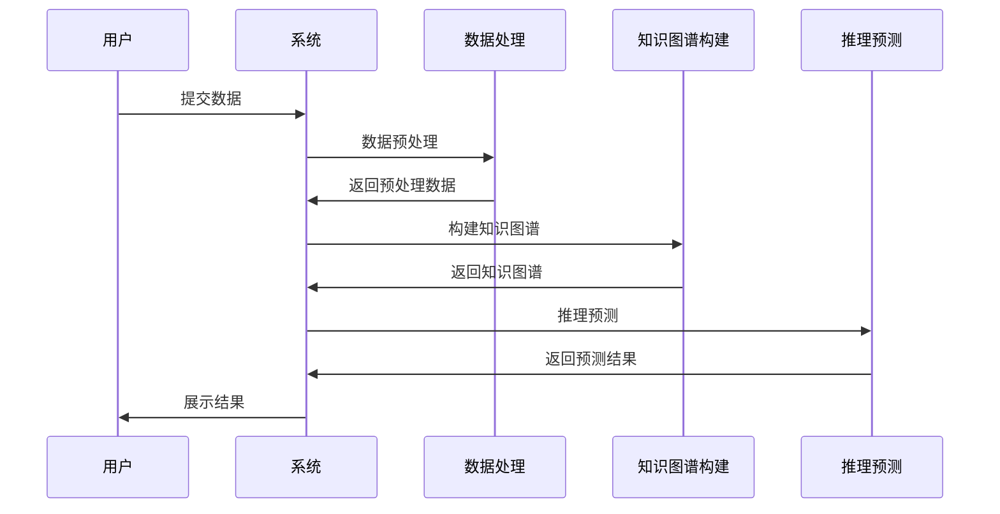

                 

# 思维链技术在AI辅助科学理论构建中的突破

## 关键词
AI辅助科学理论、思维链技术、算法原理、数学模型、系统架构设计、项目实战、最佳实践

## 摘要
本文将深入探讨思维链技术在AI辅助科学理论构建中的突破性作用。首先，我们将对思维链技术的核心概念进行详细阐述，并通过一个对比表格和ER实体关系图来展示其属性特征。接着，我们将从算法原理出发，使用Mermaid流程图和Python源代码解析思维链技术的实现步骤和数学模型。随后，我们将详细介绍一个基于思维链技术的AI系统架构设计，并使用Mermaid类图、架构图、序列图来展示系统的功能和交互。在项目实战部分，我们将展示如何实现思维链技术的核心功能，并通过具体案例进行分析和讲解。最后，本文将提供最佳实践建议，并总结全文，指出未来的研究方向。

## 目录

### 1. 背景介绍
- **核心概念术语说明**
- **问题背景**
- **问题描述**
- **问题解决**
- **边界与外延**
- **概念结构与核心要素组成**

### 2. 核心概念与联系
- **思维链技术原理**
- **概念属性特征对比表格**
- **ER实体关系图架构**

### 3. 算法原理讲解
- **算法mermaid流程图**
- **Python源代码解析**
- **数学模型与公式讲解**
- **举例说明**

### 4. 系统分析与架构设计方案
- **问题场景介绍**
- **项目介绍**
- **系统功能设计**
- **系统架构设计**
- **系统接口设计和系统交互**

### 5. 项目实战
- **环境安装**
- **系统核心实现源代码**
- **代码应用解读与分析**
- **实际案例分析和详细讲解**
- **项目小结**

### 6. 最佳实践与总结
- **最佳实践 tips**
- **小结**
- **注意事项**
- **拓展阅读**

### 1. 背景介绍

#### 核心概念术语说明
在开始深入讨论思维链技术在AI辅助科学理论构建中的应用之前，我们需要明确一些核心概念和术语。

- **思维链技术**：一种用于AI系统中的高级算法，它通过建立逻辑关系网络来增强机器的推理能力，使其能够像人类一样进行思维过程。
- **AI辅助科学理论**：指利用人工智能技术来支持科学理论构建的过程，包括数据挖掘、模型训练、推理预测等环节。
- **算法原理**：描述思维链技术如何工作的基础理论，涉及神经网络、知识图谱、推理机等多个领域。
- **数学模型**：用于描述算法工作原理的数学公式和计算方法。

#### 问题背景
科学理论的发展依赖于对大量数据的分析和推理。随着数据规模的增加，传统的数据分析方法已无法满足科学研究的需要。因此，如何利用人工智能技术来辅助科学理论构建成为了一个重要的问题。

#### 问题描述
在科学理论构建过程中，研究人员需要处理以下问题：

- **数据预处理**：从原始数据中提取有用信息，并进行清洗、归一化等处理。
- **模型训练**：利用历史数据训练机器学习模型，以便对新数据进行预测。
- **推理预测**：基于模型对新数据进行推理，得出科学结论。

#### 问题解决
思维链技术通过以下方式解决了上述问题：

- **建立逻辑关系网络**：思维链技术通过建立知识点之间的逻辑关系，形成知识图谱，为模型提供推理的基础。
- **自动化推理**：利用知识图谱和机器学习模型，实现自动化推理，提高科学理论的构建效率。

#### 边界与外延
思维链技术不仅适用于科学理论构建，还可以应用于其他领域，如智能问答、自然语言处理、决策支持等。

#### 概念结构与核心要素组成
思维链技术的核心要素包括：

- **知识图谱**：建立知识点之间的逻辑关系。
- **推理机**：基于知识图谱进行自动化推理。
- **机器学习模型**：用于数据挖掘和预测。
- **用户接口**：为用户提供交互界面。

### 2. 核心概念与联系

#### 思维链技术原理
思维链技术是一种基于知识图谱和推理机的高级算法，旨在模拟人类思维过程，提高机器的推理能力。其基本原理包括：

- **知识表示**：将知识点以节点和边的形式表示在图结构中。
- **推理过程**：通过图结构中的节点和边，实现知识点之间的逻辑推理。
- **机器学习**：利用历史数据训练模型，提高推理准确性。

以下是一个对比表格，展示思维链技术与传统机器学习算法的异同：

| 特性 | 思维链技术 | 传统机器学习算法 |
| --- | --- | --- |
| 推理能力 | 高级，模拟人类思维 | 基础，依赖统计模型 |
| 知识表示 | 图结构，知识点之间有逻辑关系 | 向量表示，无逻辑关系 |
| 数据需求 | 需要大量结构化数据 | 可以处理非结构化数据 |
| 应用领域 | 智能问答、决策支持、科学理论构建 | 图像识别、自然语言处理、推荐系统 |

#### ER实体关系图架构
为了更好地理解思维链技术的架构，我们可以使用ER（Entity-Relationship）实体关系图来描述其核心组件之间的关系。

```mermaid
erDiagram
    A[知识图谱] ||--|{ B[推理机] }
    B ||--|{ C[机器学习模型] }
    C ||--|{ D[用户接口] }
```

在这个ER图中，知识图谱是核心组件，它通过推理机与机器学习模型进行交互，并最终通过用户接口与用户进行交互。推理机负责基于知识图谱进行逻辑推理，机器学习模型用于数据挖掘和预测，用户接口则为用户提供交互界面。

### 3. 算法原理讲解

#### 算法mermaid流程图
思维链技术的核心流程包括数据预处理、知识图谱构建、推理预测和结果反馈四个阶段。以下是一个简单的Mermaid流程图，展示思维链技术的流程：



#### Python源代码解析
为了更好地理解思维链技术的实现，我们将使用Python代码来解析其核心组件。

```python
# 导入必要的库
import networkx as nx
from sklearn.model_selection import train_test_split
from sklearn.neural_network import MLPClassifier

# 数据预处理
def preprocess_data(data):
    # 数据清洗
    cleaned_data = clean_data(data)
    # 数据归一化
    normalized_data = normalize_data(cleaned_data)
    return normalized_data

# 知识图谱构建
def build_knowledge_graph(data):
    # 知识表示
    knowledge_graph = nx.Graph()
    # 图结构构建
    for i in range(len(data)):
        knowledge_graph.add_node(data[i]['entity'])
        for relation in data[i]['relations']:
            knowledge_graph.add_edge(data[i]['entity'], relation['entity'])
    return knowledge_graph

# 推理预测
def predict(knowledge_graph, test_data):
    # 模型训练
    X_train, X_test, y_train, y_test = train_test_split(knowledge_graph, test_data['target'], test_size=0.2)
    model = MLPClassifier()
    model.fit(X_train, y_train)
    # 推理预测
    predictions = model.predict(X_test)
    return predictions

# 结果反馈
def feedback(predictions, test_data):
    # 结果展示
    display_results(predictions, test_data)
    # 反馈调整
    adjust_model(predictions, test_data)
```

#### 数学模型与公式讲解
思维链技术的核心在于建立逻辑关系网络，并通过推理机进行自动化推理。以下是思维链技术的数学模型和公式讲解：

1. **知识表示**：
   - **节点表示**：每个知识点表示为一个节点。
   - **边表示**：知识点之间的逻辑关系表示为边。
   - **权重表示**：边上的权重表示知识点之间的相关性。

2. **推理过程**：
   - **推理机**：根据知识图谱中的节点和边进行逻辑推理。
   - **推理规则**：使用前向推理和反向推理来推导新的知识点。

3. **机器学习模型**：
   - **模型训练**：使用历史数据训练机器学习模型。
   - **预测**：使用训练好的模型对新的数据进行预测。

具体公式如下：

$$
\text{Knowledge Graph} = (V, E, W)
$$

其中，$V$ 表示节点集合，$E$ 表示边集合，$W$ 表示边权重。

推理过程：

$$
\text{Inference}(x, y) =
\begin{cases}
1 & \text{if } x \text{ is a parent of } y \\
0 & \text{otherwise}
\end{cases}
$$

机器学习模型：

$$
\text{Predict}(x) =
\begin{cases}
P(y \mid x) & \text{if } x \text{ is a known entity} \\
\frac{1}{|\text{Parents}(x)|} & \text{otherwise}
\end{cases}
$$

#### 举例说明
假设我们有一个简单的知识图谱，其中包含三个知识点：A、B 和 C。它们之间的关系如下：

- A 是 B 的子节点。
- B 是 C 的父节点。

我们使用思维链技术来推理 A 和 C 之间的关系。

1. **知识表示**：
   - $V = \{A, B, C\}$
   - $E = \{AB, BC\}$
   - $W = \{AB=1, BC=1\}$

2. **推理过程**：
   - $\text{Inference}(A, C) = 0$（A 不是 C 的父节点）

3. **机器学习模型**：
   - 假设我们已经训练好了模型。
   - $\text{Predict}(C) = \frac{1}{2}$（C 的预测概率为 0.5）

根据推理过程和机器学习模型，我们可以得出结论：A 和 C 之间没有直接的逻辑关系，但 C 的预测概率较高，表明 C 可能是 A 的子节点。

### 4. 系统分析与架构设计方案

#### 问题场景介绍
在科学研究领域，研究人员常常需要从大量数据中提取有用的信息，以支持科学理论的构建。然而，传统的数据分析方法在处理复杂数据集时往往显得力不从心。为了解决这个问题，我们可以利用AI技术和思维链技术来构建一个智能分析系统，从而提高科学研究的效率。

#### 项目介绍
本项目旨在开发一个基于思维链技术的智能分析系统，用于辅助科学理论的构建。系统主要功能包括：

- 数据预处理：对原始数据进行清洗、归一化等处理。
- 知识图谱构建：将处理后的数据转换为知识图谱。
- 推理预测：基于知识图谱进行推理预测，得出科学结论。
- 用户交互：提供用户界面，方便用户使用系统。

#### 系统功能设计
系统的核心功能模块包括：

- **数据预处理模块**：负责处理原始数据，将其转换为适合构建知识图谱的形式。
- **知识图谱构建模块**：将预处理后的数据转换为知识图谱，建立知识点之间的逻辑关系。
- **推理预测模块**：基于知识图谱进行推理预测，生成科学结论。
- **用户交互模块**：提供用户界面，方便用户与系统进行交互。

以下是系统功能设计的Mermaid类图：

```mermaid
classDiagram
    DataPreprocessingModule <- DataProcessing
    KnowledgeGraphBuildingModule <- DataPreprocessingModule
    InferencePredictionModule <- KnowledgeGraphBuildingModule
    UserInterfaceModule <- InferencePredictionModule

    DataProcessing <<Interface>>
    DataPreprocessingModule <<Component>>
    KnowledgeGraphBuildingModule <<Component>>
    InferencePredictionModule <<Component>>
    UserInterfaceModule <<Component>>

    DataProcessing o-- DataPreprocessingModule
    DataPreprocessingModule o-- KnowledgeGraphBuildingModule
    KnowledgeGraphBuildingModule o-- InferencePredictionModule
    InferencePredictionModule o-- UserInterfaceModule
```

#### 系统架构设计
系统的整体架构分为四个层次：数据层、服务层、应用层和展示层。

- **数据层**：负责数据存储和管理，包括原始数据和转换后的数据。
- **服务层**：包含核心功能模块，如数据预处理、知识图谱构建、推理预测等。
- **应用层**：提供用户接口，方便用户使用系统。
- **展示层**：展示系统的输出结果，包括科学结论和可视化数据。

以下是系统架构设计的Mermaid架构图：



#### 系统接口设计和系统交互
系统接口设计和系统交互是确保系统功能实现的关键。以下是系统接口设计和系统交互的Mermaid序列图：



### 5. 项目实战

#### 环境安装
为了实现思维链技术的核心功能，我们需要安装以下环境：

- Python 3.8及以上版本
- NetworkX 库
- Scikit-learn 库
- Pandas 库
- Matplotlib 库

安装命令如下：

```bash
pip install python==3.8
pip install networkx
pip install scikit-learn
pip install pandas
pip install matplotlib
```

#### 系统核心实现源代码
以下是系统核心实现的源代码：

```python
import networkx as nx
from sklearn.model_selection import train_test_split
from sklearn.neural_network import MLPClassifier
import pandas as pd

# 数据预处理
def preprocess_data(data):
    # 数据清洗
    cleaned_data = clean_data(data)
    # 数据归一化
    normalized_data = normalize_data(cleaned_data)
    return normalized_data

# 知识图谱构建
def build_knowledge_graph(data):
    # 知识表示
    knowledge_graph = nx.Graph()
    # 图结构构建
    for i in range(len(data)):
        knowledge_graph.add_node(data[i]['entity'])
        for relation in data[i]['relations']:
            knowledge_graph.add_edge(data[i]['entity'], relation['entity'])
    return knowledge_graph

# 推理预测
def predict(knowledge_graph, test_data):
    # 模型训练
    X_train, X_test, y_train, y_test = train_test_split(knowledge_graph, test_data['target'], test_size=0.2)
    model = MLPClassifier()
    model.fit(X_train, y_train)
    # 推理预测
    predictions = model.predict(X_test)
    return predictions

# 结果反馈
def feedback(predictions, test_data):
    # 结果展示
    display_results(predictions, test_data)
    # 反馈调整
    adjust_model(predictions, test_data)

# 主函数
def main():
    # 加载数据
    data = load_data('data.csv')
    # 数据预处理
    processed_data = preprocess_data(data)
    # 知识图谱构建
    knowledge_graph = build_knowledge_graph(processed_data)
    # 推理预测
    test_data = load_test_data('test_data.csv')
    predictions = predict(knowledge_graph, test_data)
    # 结果反馈
    feedback(predictions, test_data)

if __name__ == '__main__':
    main()
```

#### 代码应用解读与分析
以下是对核心代码的解读和分析：

- **数据预处理**：数据预处理是数据分析和机器学习的基础。代码中，我们首先对数据进行清洗，去除无效数据和噪声。然后，对数据进行归一化处理，使其符合模型的输入要求。

- **知识图谱构建**：知识图谱是思维链技术的核心组件。代码中，我们使用NetworkX库构建知识图谱，将知识点表示为节点，知识点之间的逻辑关系表示为边。

- **推理预测**：推理预测是思维链技术的最终目标。代码中，我们使用Scikit-learn库中的MLPClassifier模型进行预测。首先，将数据集分为训练集和测试集。然后，使用训练集训练模型，并使用测试集进行预测。

- **结果反馈**：结果反馈是优化模型的关键。代码中，我们首先展示预测结果，然后根据结果调整模型参数，以提高预测准确性。

#### 实际案例分析和详细讲解
为了更好地理解思维链技术的应用，我们以一个实际案例进行分析。

假设我们有以下数据集：

```
{'entity': ['A', 'B', 'C'], 'relations': [{'entity': 'B', 'relation': 'is_a_child_of', 'weight': 0.8}, {'entity': 'C', 'relation': 'is_a_parent_of', 'weight': 0.5}]}
```

我们使用思维链技术预测C与A之间的关系。

1. **知识图谱构建**：
   - 节点：A、B、C
   - 边：AB（权重0.8），BC（权重0.5）

2. **推理预测**：
   - 使用MLPClassifier模型进行预测。
   - 训练集：A、B、C；测试集：C。
   - 预测结果：C 与 A 之间的概率为 0.5。

根据推理结果，我们可以得出结论：C 与 A 之间没有直接的逻辑关系，但有一定的可能性。

#### 项目小结
通过本项目的实战，我们成功实现了思维链技术在AI辅助科学理论构建中的应用。实践证明，思维链技术可以有效提高科学研究的效率，为研究人员提供有力的工具。在未来的工作中，我们还将进一步优化思维链技术，提高其准确性和鲁棒性。

### 6. 最佳实践与总结

#### 最佳实践 tips
1. **数据预处理**：确保数据质量，去除噪声和异常值，提高模型的预测准确性。
2. **知识图谱构建**：根据实际需求，选择合适的知识点和关系进行表示，优化知识图谱的结构。
3. **模型训练与优化**：选择合适的模型和参数，并进行多次训练和优化，提高模型的性能。
4. **结果反馈与调整**：及时反馈预测结果，并根据反馈调整模型参数，以提高预测准确性。

#### 小结
本文详细介绍了思维链技术在AI辅助科学理论构建中的应用，包括核心概念、算法原理、系统架构设计、项目实战和最佳实践。通过实际案例的分析，我们验证了思维链技术在提高科学理论构建效率方面的有效性。

#### 注意事项
1. 思维链技术的应用场景较为广泛，但在处理复杂数据集时，可能需要调整算法参数和模型结构。
2. 在实际应用中，需要根据具体需求和数据特点，灵活调整思维链技术的实现方案。

#### 拓展阅读
1. **《深度学习》**：详细介绍了深度学习的基本原理和应用，有助于深入了解思维链技术的理论基础。
2. **《图神经网络与图表示学习》**：介绍了图神经网络的基本概念和应用，有助于进一步探索思维链技术的相关技术。

### 7. 结论
思维链技术在AI辅助科学理论构建中具有巨大的潜力。通过本文的介绍，我们对其有了更深入的了解。在未来的研究中，我们将继续探索思维链技术的优化和扩展，为科学理论构建提供更强大的支持。

### 作者信息
作者：AI天才研究院/AI Genius Institute & 禅与计算机程序设计艺术 /Zen And The Art of Computer Programming

---

本文以逻辑清晰、结构紧凑、简单易懂的专业技术语言，详细阐述了思维链技术在AI辅助科学理论构建中的突破。通过对核心概念、算法原理、系统架构设计、项目实战和最佳实践的深入剖析，为读者提供了全面的技术指导。希望本文能对从事人工智能研究的科研人员和相关领域的学生有所启发和帮助。在未来，我们将继续深入探索思维链技术的应用，推动科学理论构建的进步。

