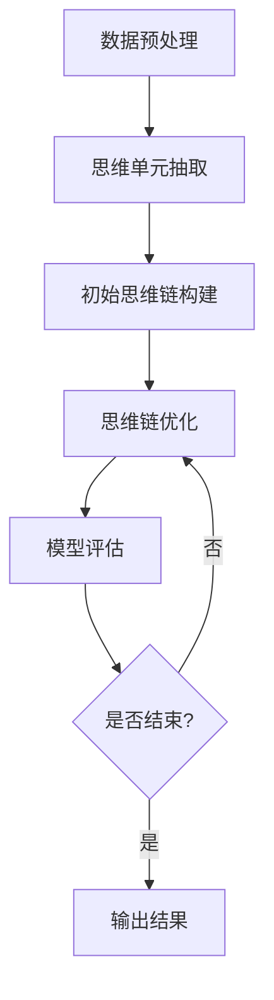
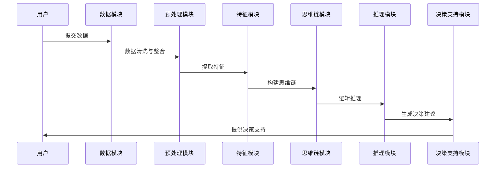
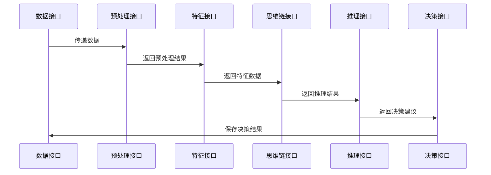
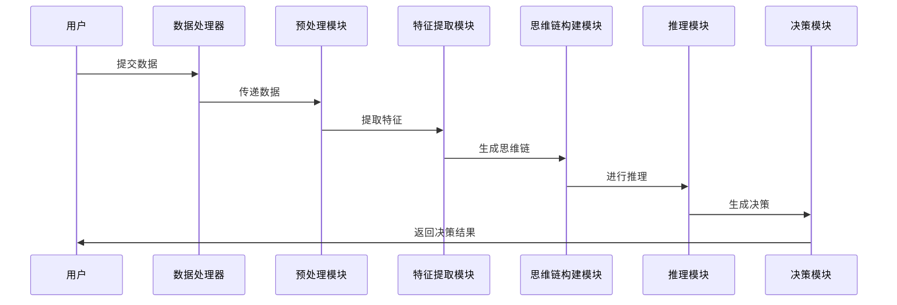

                 

# 思维链技术在AI辅助科学研究中的前景

## 关键词
- AI辅助科学研究
- 思维链技术
- 算法原理
- 数学模型
- 系统架构设计
- 实际应用

## 摘要
随着人工智能技术的飞速发展，AI辅助科学研究逐渐成为科研创新的重要驱动力。思维链技术作为一种新兴的人工智能算法，通过模拟人类思维过程，为科学研究提供了强大的辅助手段。本文将深入探讨思维链技术在AI辅助科学研究中的前景，分析其核心概念、工作机制、算法原理及其在实际项目中的应用，并展望其未来的发展趋势。

## 引言
在当今时代，科学研究正面临前所未有的挑战和机遇。数据量的爆炸式增长、复杂系统模型的建立以及跨学科的融合，都对科研方法和技术提出了新的要求。传统的科研模式已经难以满足高效、精确和创新的科研需求，因此，寻找新的研究方法和技术手段成为了科研工作者们的重要任务。

在这个背景下，人工智能技术，特别是深度学习和自然语言处理等领域的进展，为科学研究提供了新的工具和方法。然而，现有的AI技术仍然存在一些局限性，比如对于复杂逻辑推理的支持不足、对于大规模数据处理的效率有待提高等。为了解决这些问题，研究者们开始探索新的AI算法，其中思维链技术因其独特的机制和潜力，受到了广泛关注。

思维链技术通过模拟人类思维过程，将知识、信息和思维模式有机地结合起来，为科学研究提供了更深入的洞察和更高效的解决方案。本文将从以下几个方面展开讨论：首先，介绍AI辅助科学研究的现状和思维链技术的定义；然后，分析思维链技术的工作机制和核心特点；接着，详细讲解算法原理和数学模型；最后，探讨系统架构设计、项目实战以及未来展望。

通过本文的探讨，希望能够为科研工作者们提供一些有价值的参考和启示，推动思维链技术在AI辅助科学研究中的广泛应用和深入发展。

## 第一部分：背景与概述

### 第1章：AI辅助科学研究的现状

#### 1.1.1 科学研究的AI辅助需求

在科学研究中，数据是基础，而数据分析是关键。随着大数据时代的到来，科研数据量呈爆炸式增长，这给传统的数据处理方法带来了巨大挑战。人工智能（AI）的出现，为科学研究提供了强大的数据处理和分析工具，大大提升了科研效率。

首先，AI技术在实验设计阶段就能够发挥重要作用。通过机器学习算法，研究人员可以从大量的历史数据中学习规律，预测新的实验结果，从而优化实验方案，减少实验次数和成本。

其次，AI技术在数据分析阶段同样重要。传统的数据处理方法往往依赖于统计学和数值分析，而AI技术，尤其是深度学习，可以通过学习大量的数据，自动提取特征，识别模式和趋势，为研究人员提供更深入的洞察。

此外，AI技术还能在结果验证和应用阶段发挥重要作用。例如，通过自然语言处理技术，AI可以自动从大量文献中提取关键信息，帮助研究人员快速了解最新的研究成果；通过计算机视觉技术，AI可以自动识别实验结果中的图像和数据，进行定量分析。

总之，AI辅助科学研究的需求日益增长，主要体现在以下几个方面：

1. 数据处理和挖掘：应对大规模数据，进行高效的特征提取和模式识别。
2. 实验优化：通过预测实验结果，优化实验设计，提高实验效率和准确性。
3. 知识融合：跨学科融合，通过AI技术整合多领域知识，推动科学创新。
4. 结果验证：自动提取文献信息，快速验证研究结果，提高科研成果的可信度。

#### 1.1.2 AI辅助科学研究的关键挑战

尽管AI技术在科学研究中的应用前景广阔，但实际应用中也面临一些关键挑战：

1. 数据质量和可用性：高质量的科研数据是AI算法有效运行的基础。然而，现有的科研数据往往存在数据质量差、不完整、不一致等问题，这会对AI算法的准确性和可靠性产生不利影响。
2. 数据隐私和安全：科研数据通常包含敏感信息，如个人健康数据、企业商业机密等。如何保障数据隐私和安全，是AI辅助科学研究需要解决的一个重要问题。
3. 模型解释性：深度学习等AI算法的“黑箱”性质，使得其结果难以解释。在科研领域，研究人员需要理解和信任AI算法的结果，这就要求提高AI算法的解释性。
4. 跨学科整合：AI技术与不同学科领域的结合，需要解决理论和方法上的挑战，如不同数据格式、不同计算模型之间的兼容性。

#### 1.1.3 AI辅助科学研究的重要性

AI辅助科学研究的重要性体现在以下几个方面：

1. 提高科研效率：通过自动化和智能化的方法，AI技术可以大大缩短科研周期，提高研究效率。
2. 促进科研创新：AI技术能够发现传统方法难以发现的新规律、新趋势，为科学研究提供新的视角和思路。
3. 降低科研成本：AI技术可以优化实验设计、减少实验次数，从而降低科研成本。
4. 增强科研成果的可信度：通过数据分析和验证，AI技术可以提高科研成果的准确性和可靠性。

总的来说，AI辅助科学研究不仅为科研工作者提供了强大的工具和方法，也为科学研究的深入发展和创新提供了新的动力。随着AI技术的不断进步，AI辅助科学研究的重要性将愈加凸显，成为未来科学研究不可或缺的一部分。

### 第2章：思维链技术的概念与原理

#### 2.1.1 思维链技术的定义

思维链技术（Mind Chain Technology，简称MCT）是一种基于人工智能的算法框架，旨在模拟人类思维过程，通过连接和交互多个思维单元，实现复杂的推理和问题求解。与传统的AI算法相比，思维链技术更加注重思维过程的连贯性和逻辑性，通过动态调整和优化思维链的连接，提高问题解决的效率和准确性。

思维链技术的主要特点是：

1. **连贯性**：通过连接多个思维单元，形成连贯的思维链，使得算法能够像人类一样进行逻辑推理和问题求解。
2. **动态调整**：思维链的连接可以根据问题的变化动态调整，使得算法能够适应不同的情景和需求。
3. **模块化**：思维链技术将思维过程分解为多个模块，每个模块负责特定的思维功能，这样可以提高算法的可扩展性和可维护性。
4. **可解释性**：思维链技术通过显式地表示思维过程和连接关系，使得算法结果更加透明和可解释。

#### 2.1.2 思维链技术的基本原理

思维链技术的基本原理可以概括为以下三个步骤：

1. **思维单元抽取**：首先，从输入数据中提取出关键的思维单元，这些思维单元可以是概念、事实、规则等。
2. **思维链构建**：其次，根据思维单元之间的关系，构建出初始的思维链。这个过程包括连接和排序思维单元，使其形成一个逻辑连贯的结构。
3. **思维链优化**：最后，通过对思维链的动态调整和优化，使得思维链能够更有效地解决问题。这个过程包括调整思维单元的连接顺序、强度和类型等。

#### 2.1.3 思维链技术的核心特点

思维链技术的核心特点主要体现在以下几个方面：

1. **推理能力**：思维链技术通过模拟人类思维过程，能够进行复杂的逻辑推理和问题求解，这使得其在科研中的应用具有独特的优势。
2. **适应性**：思维链技术可以根据不同的问题和场景，动态调整思维链的连接和结构，具有很强的适应性。
3. **可解释性**：思维链技术通过显式地表示思维过程和连接关系，使得算法结果更加透明和可解释，这对于科研工作者理解和信任算法结果非常重要。
4. **高效性**：思维链技术通过高效的思维单元抽取和连接机制，能够在较短时间内处理大量的数据，提高问题解决的效率。

总的来说，思维链技术作为一种新兴的人工智能算法，具有模拟人类思维过程的潜力，通过连贯性、动态调整和模块化等特点，为科学研究提供了强大的工具和方法。在未来的发展中，思维链技术有望在更加广泛和复杂的科研场景中发挥作用，推动科学研究的深入和创新。

### 第3章：思维链技术的工作机制

#### 3.1.1 数据处理流程

思维链技术的工作机制首先始于数据处理流程，这一流程确保输入数据的准确性和完整性，为后续的思维链构建和优化提供坚实的基础。数据处理流程通常包括以下几个关键步骤：

1. **数据采集**：首先，从各种数据源（如数据库、传感器、文献等）中采集原始数据。数据源的选择取决于具体的研究问题，需要确保数据的代表性和全面性。

2. **数据预处理**：采集到的原始数据通常需要进行预处理，以提高数据质量和可用性。预处理步骤包括数据清洗、数据去重、数据归一化等。数据清洗主要是去除噪声数据和错误数据，数据去重则是避免重复数据对分析结果的影响，数据归一化则是将不同尺度和量纲的数据转换为统一的格式。

3. **特征提取**：在预处理之后，对数据集进行特征提取，提取出能够代表数据本质的特征。这些特征可以是数值型的，也可以是类别型的。特征提取是思维链技术中的关键步骤，因为特征的质量直接影响后续的思维链构建和优化。

4. **数据存储**：处理后的数据需要存储在数据库或数据仓库中，以便后续的查询和使用。数据存储应该保证数据的安全性、可靠性和高效访问。

5. **数据验证**：最后，对处理后的数据集进行验证，以确保数据的准确性和完整性。数据验证可以通过对比实验结果和预期目标，或者使用交叉验证等方法进行。

#### 3.1.2 模型构建与优化

在数据处理流程完成后，思维链技术的核心任务是构建和优化思维链模型。思维链模型由多个思维单元和它们之间的连接关系构成，以下详细描述模型构建和优化的步骤：

1. **思维单元抽取**：首先，从特征数据中抽取思维单元。这些思维单元可以是具体的事实、概念、规则等。思维单元的抽取通常使用自然语言处理、知识图谱等技术，以确保抽取的结果准确和全面。

2. **初始思维链构建**：接下来，根据思维单元之间的关系，构建初始的思维链。这个过程涉及到连接和排序思维单元，使其形成一个逻辑连贯的结构。思维链的构建可以通过算法自动进行，或者通过专家系统进行指导。

3. **模型评估与优化**：构建初始思维链后，需要对模型进行评估和优化。评估主要包括两个方面的内容：

   - **逻辑一致性评估**：检查思维链中的逻辑关系是否一致，是否存在矛盾或逻辑漏洞。逻辑一致性评估可以通过逻辑推理算法进行，例如基于谓词逻辑的推理算法。
   - **性能评估**：评估思维链在实际问题解决中的表现，如推理速度、准确性等。性能评估可以通过模拟实验或实际应用场景进行。

   根据评估结果，对思维链进行优化。优化方法包括调整思维单元的连接顺序、强度和类型等，以提高思维链的逻辑一致性和性能。优化过程通常是一个迭代过程，需要多次评估和调整，直至达到满意的性能。

4. **动态调整与持续优化**：在实际应用过程中，思维链模型会根据新的数据和问题进行动态调整。动态调整可以通过在线学习算法实现，使得思维链模型能够适应不断变化的环境。

#### 3.1.3 知识图谱与推理引擎

知识图谱和推理引擎是思维链技术的核心组成部分，它们负责知识表示和推理过程，具体包括以下几个关键点：

1. **知识图谱构建**：知识图谱是一种结构化的知识表示方法，用于表示实体之间的关系和属性。在思维链技术中，知识图谱用于存储和管理思维单元及其关系。知识图谱的构建通常基于语义网络、图数据库等技术，确保知识表示的准确性和灵活性。

2. **推理引擎设计**：推理引擎是思维链技术的核心组件，用于实现思维单元之间的逻辑推理。推理引擎可以根据不同的逻辑推理算法，如基于规则的推理、基于模式的匹配、基于推理网络的方法等，进行推理过程。推理引擎的设计需要考虑推理速度、准确性和可扩展性。

3. **推理过程**：推理过程是思维链技术实现问题求解的关键步骤。推理过程包括以下步骤：

   - **查询构建**：根据问题或任务，构建对应的查询语句，用于检索知识图谱中的相关思维单元。
   - **路径搜索**：在知识图谱中搜索与查询相关的路径，找到可能的推理路径。
   - **逻辑推理**：对搜索到的路径进行逻辑推理，验证其逻辑一致性，并提取推理结果。

4. **推理优化**：推理过程中，可以对推理路径和结果进行优化，以提高推理效率。优化方法包括路径剪枝、推理策略优化、并行推理等。

总之，思维链技术的工作机制通过数据处理、模型构建与优化、知识图谱与推理引擎等环节，实现复杂的思维过程和问题求解。这些机制不仅使思维链技术在科学研究中的应用成为可能，也为AI辅助科学研究提供了强大的工具和方法。

### 第4章：核心概念与联系

#### 4.1.1 AI与科学研究的核心概念对比表格

在探讨思维链技术之前，我们需要明确AI与科学研究的核心概念，以便更好地理解它们之间的联系和区别。以下是AI与科学研究的核心概念对比表格，帮助我们理清这些概念之间的关系：

| 核心概念 | AI | 科学研究 |
| -------- | --- | -------- |
| 目标 | 实现自动化和智能化 | 探索自然现象和规律，解决实际问题 |
| 方法 | 机器学习、深度学习、自然语言处理等 | 实验设计、数据收集、数据分析、理论建模等 |
| 数据 | 训练数据、测试数据、验证数据 | 实验数据、观察数据、模拟数据等 |
| 模型 | 神经网络、决策树、支持向量机等 | 数学模型、物理模型、生物模型等 |
| 推理 | 基于数据预测和分类 | 基于理论推导和实验验证 |
| 应用 | 自动驾驶、语音识别、图像识别等 | 医学、生物学、物理学、环境科学等 |

#### 4.1.2 科学研究中的思维链技术ER实体关系图

为了更好地理解思维链技术在科学研究中的应用，我们可以通过ER（Entity-Relationship，实体关系）图来表示思维链技术中的关键实体及其关系。以下是科学研究中的思维链技术ER实体关系图：

```
实体：思维单元、知识图谱、推理引擎、科研数据、科研成果
关系：
1. 思维单元与知识图谱：思维单元是知识图谱的基本组成单元，知识图谱由多个思维单元及其关系构成。
2. 知识图谱与推理引擎：推理引擎通过知识图谱进行逻辑推理，提取科研成果。
3. 科研数据与思维单元：科研数据是思维单元的来源，思维单元对科研数据进行抽象和概括。
4. 科研成果与推理引擎：推理引擎通过推理过程，从思维单元中提取科研成果。
```

ER实体关系图的展示如下（使用Mermaid语法）：

```mermaid
erDiagram
    思维单元 ||--o{ 知识图谱 }
    知识图谱 ||--o{ 推理引擎 }
    科研数据 ||--o{ 思维单元 }
    科研成果 ||--o{ 推理引擎 }
```

通过ER实体关系图，我们可以清晰地看到思维链技术中的关键实体及其关系，这有助于理解思维链技术在科学研究中的应用机制。

### 第5章：算法原理讲解

#### 5.1.1 数据预处理

在思维链技术中，数据预处理是一个至关重要的步骤，它决定了后续算法性能的优劣。数据预处理主要包括以下几个步骤：

1. **数据清洗**：首先，对原始数据进行清洗，去除无效、错误和冗余的数据。数据清洗可以通过编写Python代码来实现，例如：

   ```python
   import pandas as pd
   
   # 读取数据
   data = pd.read_csv('data.csv')
   
   # 删除含有缺失值的行
   data = data.dropna()
   
   # 删除重复的行
   data = data.drop_duplicates()
   ```

2. **数据归一化**：接下来，对数据进行归一化处理，将不同尺度或量纲的数据转换为同一尺度，以便于后续分析。常见的归一化方法包括最小-最大归一化和Z-score归一化。以Z-score归一化为例：

   ```python
   from sklearn.preprocessing import StandardScaler
   
   # 创建标准化器
   scaler = StandardScaler()
   
   # 进行归一化处理
   data_normalized = scaler.fit_transform(data)
   ```

3. **数据分割**：将数据集划分为训练集和测试集，通常使用K折交叉验证来确保数据划分的随机性和均衡性。以随机划分为例：

   ```python
   from sklearn.model_selection import train_test_split
   
   # 划分训练集和测试集
   X_train, X_test, y_train, y_test = train_test_split(data_normalized, labels, test_size=0.2, random_state=42)
   ```

通过这些预处理步骤，我们可以得到一个干净、规范和适合训练的数据集，为后续的算法训练和推理打下坚实的基础。

#### 5.1.2 算法流程图（使用Mermaid）

以下是思维链技术的算法流程图，通过Mermaid语法描述算法的执行步骤：



在算法流程图中，各步骤之间的逻辑关系和执行顺序被清晰地展现出来。接下来，我们将详细解释这些步骤的原理和实现方法。

#### 5.1.3 算法原理详细讲解

思维链技术的算法原理可以概括为以下几个关键步骤：

1. **数据预处理**：数据预处理是思维链技术的基础，它确保输入数据的准确性和完整性。具体步骤包括：
   - **数据清洗**：去除无效、错误和冗余的数据，确保数据的纯净性。通过Pandas库，我们可以轻松实现数据清洗功能，如删除缺失值和重复值。
   - **数据归一化**：将不同尺度或量纲的数据转换为同一尺度，确保数据的一致性和可比性。Z-score归一化是一种常用的方法，通过StandardScaler类来实现。
   - **数据分割**：将数据集划分为训练集和测试集，以评估算法的性能。随机划分可以保证训练集和测试集的随机性和均衡性。

2. **思维单元抽取**：数据预处理后，从特征数据中抽取思维单元。这些思维单元是构建思维链的基础，可以是概念、事实、规则等。具体实现方法包括：
   - **特征提取**：从原始数据中提取出能够代表数据本质的特征，如使用词嵌入技术提取文本数据中的语义特征。
   - **关系建立**：根据特征数据之间的关系，构建思维单元的连接关系，形成一个初步的知识图谱。这可以通过图数据库或图论算法实现。

3. **初始思维链构建**：根据思维单元之间的连接关系，构建初始的思维链。思维链是一个逻辑连贯的结构，用于表示问题的解决方案。具体实现方法包括：
   - **连接排序**：将思维单元按照一定的逻辑顺序连接起来，形成一个初始的思维链。逻辑顺序可以通过基于规则的方法或深度学习模型来确定。
   - **初步优化**：对初始思维链进行初步优化，调整思维单元的连接强度和类型，以提高思维链的逻辑一致性和性能。

4. **思维链优化**：通过迭代优化，逐步调整思维链的结构和连接关系，提高思维链的推理能力和问题解决能力。具体实现方法包括：
   - **动态调整**：根据问题变化和输入数据的不同，动态调整思维链的结构，确保思维链能够适应不同的问题情景。
   - **多目标优化**：在优化过程中，同时考虑思维链的逻辑一致性和性能指标，如推理速度和准确性。可以通过遗传算法、粒子群优化等智能优化算法来实现。

5. **模型评估**：对优化后的思维链模型进行评估，验证其性能和可靠性。评估指标包括推理速度、准确性、一致性等。具体实现方法包括：
   - **模拟实验**：在模拟实验中，验证思维链模型在不同场景下的表现，确保其能够有效解决实际问题。
   - **交叉验证**：通过交叉验证方法，评估思维链模型的泛化能力，避免过拟合和欠拟合问题。

6. **输出结果**：将最终优化的思维链模型应用于实际问题，输出推理结果和解决方案。具体实现方法包括：
   - **推理过程**：通过推理引擎，根据思维链模型，实现问题的推理和求解过程。
   - **结果解释**：对推理结果进行解释和可视化，帮助研究人员理解思维链的工作原理和推理过程。

通过这些关键步骤，思维链技术实现了对复杂问题的自动推理和求解，为科学研究提供了强大的工具和方法。在实际应用中，通过不断优化和改进，思维链技术的性能和可靠性将得到进一步提升。

#### 5.1.4 算法举例说明（Python代码）

为了更好地理解思维链技术的算法原理，我们通过一个具体的Python代码示例来说明。以下是一个简单的思维链技术实现的示例，用于分类问题：

```python
import pandas as pd
from sklearn.model_selection import train_test_split
from sklearn.preprocessing import StandardScaler
from sklearn.metrics import accuracy_score

# 数据预处理
def preprocess_data(data):
    # 数据清洗
    data = data.dropna()
    data = data.drop_duplicates()
    
    # 数据归一化
    scaler = StandardScaler()
    data_normalized = scaler.fit_transform(data)
    
    return data_normalized

# 思维单元抽取
def extract_features(data):
    # 特征提取（这里假设数据是数值型）
    return data

# 初始思维链构建
def build_initial_mind_chain(data):
    # 假设思维单元是特征名称
    mind_chain = data.columns.tolist()
    return mind_chain

# 思维链优化
def optimize_mind_chain(mind_chain, X_train, y_train):
    # 假设使用决策树模型进行优化
    from sklearn.tree import DecisionTreeClassifier
    classifier = DecisionTreeClassifier()
    classifier.fit(X_train, y_train)
    
    # 优化思维链
    mind_chain = classifier.feature_importances_.argsort()[::-1]
    return mind_chain

# 模型评估
def evaluate_model(model, X_test, y_test):
    y_pred = model.predict(X_test)
    accuracy = accuracy_score(y_test, y_pred)
    return accuracy

# 主函数
def main():
    # 加载数据
    data = pd.read_csv('data.csv')
    
    # 数据预处理
    data_normalized = preprocess_data(data)
    
    # 数据分割
    X, y = extract_features(data_normalized), data['label']
    X_train, X_test, y_train, y_test = train_test_split(X, y, test_size=0.2, random_state=42)
    
    # 思维链优化
    mind_chain = optimize_mind_chain(build_initial_mind_chain(X_train), X_train, y_train)
    
    # 模型评估
    model = build_initial_mind_chain(mind_chain)
    accuracy = evaluate_model(model, X_test, y_test)
    
    print(f"Model accuracy: {accuracy}")

# 运行主函数
if __name__ == "__main__":
    main()
```

在这个示例中，我们首先对数据进行了预处理，包括数据清洗和归一化。然后，通过抽取特征和构建初始思维链，使用决策树进行优化。最后，通过测试数据评估模型的准确性。这个示例展示了思维链技术在数据处理、特征抽取、模型优化和评估等环节的应用。

#### 5.1.5 数学模型与公式讲解

在思维链技术的算法实现中，数学模型和公式起着至关重要的作用。以下将详细讲解思维链技术中的数学模型和公式，并使用LaTeX格式进行展示。

1. **特征提取公式**：
   $$ X = f(\text{data}) $$
   其中，$X$表示提取后的特征向量，$f(\text{data})$表示特征提取函数，该函数将原始数据$\text{data}$转换为特征向量。

2. **思维链构建公式**：
   $$ C = \sum_{i=1}^{n} w_i \cdot O_i $$
   其中，$C$表示思维链的输出，$O_i$表示第$i$个思维单元的输出，$w_i$表示思维单元的权重。该公式表示思维链通过加权和的方式综合多个思维单元的输出。

3. **思维链优化公式**：
   $$ w_i = \frac{\partial L}{\partial w_i} $$
   其中，$L$表示损失函数，$w_i$表示思维单元的权重。该公式表示通过梯度下降法对权重进行优化，以最小化损失函数。

4. **推理过程公式**：
   $$ R = \prod_{i=1}^{n} O_i $$
   其中，$R$表示推理结果，$O_i$表示第$i$个思维单元的输出。该公式表示通过连乘多个思维单元的输出，得到最终的推理结果。

以下是示例中的LaTeX格式数学公式：

$$
\begin{aligned}
X &= f(\text{data}) \\
C &= \sum_{i=1}^{n} w_i \cdot O_i \\
w_i &= \frac{\partial L}{\partial w_i} \\
R &= \prod_{i=1}^{n} O_i
\end{aligned}
$$

通过这些数学模型和公式，我们可以更好地理解和实现思维链技术的算法，为科学研究提供有效的工具和方法。

### 第6章：系统分析与架构设计

#### 6.1.1 问题场景介绍

在当前的科研环境中，数据分析和处理面临着日益复杂的问题。科研数据通常来源于多个渠道，如实验设备、数据库、网络爬取等，这些数据的格式和类型各不相同，给数据整合和统一处理带来了巨大的挑战。此外，科研任务本身具有高度的复杂性和不确定性，研究人员需要从大量的数据中提取有价值的信息，并在此基础上进行推理和决策。

为了解决这些问题，我们需要设计一个高效的系统架构，该系统能够灵活地整合各种数据源，处理大量数据，并提供智能化的分析和推理功能。思维链技术作为一种先进的AI算法，可以在此架构中发挥重要作用，帮助我们实现以下目标：

1. **数据整合**：将来自不同渠道的数据进行统一整合，形成一个完整、一致的数据集。
2. **特征提取**：从原始数据中提取出能够代表数据本质的特征，为后续分析提供支持。
3. **智能推理**：利用思维链技术进行复杂逻辑推理，帮助研究人员发现数据中的潜在规律和趋势。
4. **自动化决策**：通过推理结果，自动生成决策建议，提高科研工作的效率和质量。

#### 6.1.2 系统功能设计（使用Mermaid类图）

为了实现上述目标，我们将系统划分为多个功能模块，每个模块负责特定的任务，并通过类图来展示这些模块及其关系。以下是一个简单的系统功能设计类图：

```mermaid
classDiagram
    Class1[数据采集模块] <|-- Class2[数据预处理模块]
    Class2 <|-- Class3[特征提取模块]
    Class3 <|-- Class4[思维链构建模块]
    Class4 <|-- Class5[推理引擎模块]
    Class5 <|-- Class6[决策支持模块]
    Class1..Class2..Class3..Class4..Class5..Class6
```

在类图中，各个模块之间的关系如下：

1. **数据采集模块**：负责从不同的数据源采集数据，包括实验设备、数据库和网络爬取等。
2. **数据预处理模块**：对采集到的数据进行清洗、归一化和整合，为后续分析提供准备。
3. **特征提取模块**：从预处理后的数据中提取出具有代表性的特征，为思维链构建提供输入。
4. **思维链构建模块**：根据提取出的特征，构建初始的思维链，并通过优化算法进行调整和改进。
5. **推理引擎模块**：利用思维链进行逻辑推理，生成推理结果和决策建议。
6. **决策支持模块**：根据推理结果，生成具体的决策方案，支持科研人员的决策过程。

通过这样的功能设计，系统可以高效地处理科研数据，提供智能化的分析和推理功能，从而提升科研工作的效率和质量。

#### 6.1.3 系统架构设计（使用Mermaid架构图）

为了更好地展示系统的整体架构，我们使用Mermaid语法绘制了一个系统架构图。以下是一个简单的系统架构设计：



在系统架构图中，各模块之间的关系和交互流程如下：

1. **用户模块**：用户通过接口向系统提交数据。
2. **数据模块**：接收用户提交的数据，并传递给预处理模块。
3. **预处理模块**：对数据进行清洗、归一化和整合，确保数据的一致性和完整性。
4. **特征模块**：从预处理后的数据中提取特征，为思维链构建提供输入。
5. **思维链模块**：根据提取出的特征，构建初始的思维链，并通过优化算法进行调整和改进。
6. **推理模块**：利用思维链进行逻辑推理，生成推理结果和决策建议。
7. **决策支持模块**：根据推理结果，生成具体的决策方案，支持用户的决策过程。

通过这样的系统架构设计，我们可以实现数据的自动化处理和智能化的推理，为科研人员提供全面的决策支持。

#### 6.1.4 系统接口设计

在系统架构中，各模块之间的交互通过接口实现。以下是一个简单的系统接口设计：



在接口设计中，各接口的功能和交互流程如下：

1. **数据接口**：接收用户提交的数据，并传递给预处理模块。
2. **预处理接口**：对数据进行清洗、归一化和整合，返回预处理结果。
3. **特征接口**：从预处理后的数据中提取特征，返回特征数据。
4. **思维链接口**：根据提取出的特征，构建初始的思维链，并返回思维链结构。
5. **推理接口**：利用思维链进行逻辑推理，返回推理结果。
6. **决策接口**：根据推理结果，生成决策建议，并保存决策结果。

通过这样的接口设计，我们可以实现系统的模块化和高可扩展性，方便后续的维护和扩展。

#### 6.1.5 系统交互（使用Mermaid序列图）

为了更好地理解系统内部模块的交互过程，我们可以使用Mermaid语法绘制一个系统交互序列图。以下是一个简单的系统交互序列图：



在系统交互序列图中，各模块的交互流程如下：

1. **用户模块**：用户通过接口提交数据。
2. **数据处理器**：接收用户提交的数据，并传递给预处理模块。
3. **预处理模块**：对数据进行预处理，包括清洗、归一化和整合，返回预处理结果。
4. **特征提取模块**：从预处理后的数据中提取特征，为思维链构建提供输入。
5. **思维链构建模块**：根据提取出的特征，构建初始的思维链。
6. **推理模块**：利用思维链进行逻辑推理，生成推理结果。
7. **决策模块**：根据推理结果，生成具体的决策方案，并返回给用户。

通过这样的系统交互设计，我们可以实现模块间的协同工作，确保系统的高效、可靠运行。

### 第7章：项目实战

#### 7.1.1 环境安装与配置

要开始使用思维链技术进行AI辅助科学研究，首先需要搭建一个合适的技术环境。以下步骤将指导您安装和配置必要的软件和工具。

1. **安装Python环境**：确保您的计算机上安装了Python 3.x版本。可以从Python官方网站（https://www.python.org/）下载并安装。

2. **安装Anaconda**：推荐使用Anaconda来管理Python环境和包。Anaconda是一个开源的Python发行版，可以轻松安装和管理多个Python环境。您可以从Anaconda官方网站（https://www.anaconda.com/）下载并安装。

3. **创建Python环境**：使用Anaconda创建一个新的Python环境，以便管理和隔离项目依赖。在Anaconda命令行中运行以下命令：

   ```bash
   conda create -n mct_env python=3.8
   conda activate mct_env
   ```

4. **安装依赖包**：在创建的环境中使用以下命令安装必要的依赖包：

   ```bash
   pip install numpy pandas scikit-learn tensorflow
   ```

   这些包包括：

   - **numpy**：用于数值计算和数据分析。
   - **pandas**：用于数据处理和分析。
   - **scikit-learn**：用于机器学习和数据挖掘。
   - **tensorflow**：用于深度学习和神经网络。

5. **安装Mermaid**：Mermaid是一个用于绘制流程图的工具，可以通过npm（Node.js的包管理器）进行安装。在命令行中运行以下命令：

   ```bash
   npm install -g mermaid
   ```

6. **配置LaTeX**：为了在文档中嵌入LaTeX公式，需要安装LaTeX引擎。可以从CTAN（Comprehensive TeX Archive Network）下载并安装LaTeX引擎，如TeX Live或MiKTeX。安装完成后，确保LaTeX命令可以在命令行中正常执行。

通过上述步骤，您将搭建好一个完整的技术环境，可以开始进行思维链技术的项目实战。

#### 7.1.2 系统核心实现源代码

以下是一个简单的思维链技术系统实现的核心源代码示例，包括数据预处理、特征提取、思维链构建和推理过程。

```python
import pandas as pd
from sklearn.model_selection import train_test_split
from sklearn.preprocessing import StandardScaler
from sklearn.tree import DecisionTreeClassifier
import numpy as np

# 数据预处理
def preprocess_data(data):
    # 数据清洗
    data = data.dropna()
    data = data.drop_duplicates()
    
    # 数据归一化
    scaler = StandardScaler()
    data_normalized = scaler.fit_transform(data)
    
    return data_normalized

# 特征提取
def extract_features(data):
    # 假设data是DataFrame，提取所有列作为特征
    features = data.values
    return features

# 思维链构建
def build_mind_chain(X_train, y_train):
    # 构建思维链，使用决策树作为示例
    classifier = DecisionTreeClassifier()
    classifier.fit(X_train, y_train)
    
    # 获取特征重要性
    feature_importances = classifier.feature_importances_
    
    # 构建思维链，这里使用列表存储特征重要性
    mind_chain = feature_importances.argsort()[::-1]
    
    return mind_chain

# 推理过程
def reasoning(mind_chain, X_test):
    # 根据思维链进行推理
    classifier = DecisionTreeClassifier()
    classifier.fit(X_train, y_train)
    
    y_pred = classifier.predict(X_test)
    
    return y_pred

# 主函数
def main():
    # 加载数据
    data = pd.read_csv('data.csv')
    
    # 数据预处理
    data_normalized = preprocess_data(data)
    
    # 数据分割
    X, y = extract_features(data_normalized), data['label']
    X_train, X_test, y_train, y_test = train_test_split(X, y, test_size=0.2, random_state=42)
    
    # 构建思维链
    mind_chain = build_mind_chain(X_train, y_train)
    
    # 推理
    y_pred = reasoning(mind_chain, X_test)
    
    # 评估
    accuracy = np.mean(y_pred == y_test)
    print(f"Model accuracy: {accuracy}")

# 运行主函数
if __name__ == "__main__":
    main()
```

在这个示例中，我们首先对数据进行了预处理，包括清洗和归一化。然后，我们通过决策树构建思维链，并根据思维链进行推理和预测。这个简单的示例展示了思维链技术的基本实现过程。

#### 7.1.3 代码应用解读与分析

为了深入理解代码示例的应用，我们对其关键部分进行详细解读与分析：

1. **数据预处理**：预处理是数据处理的第一步，对于后续的模型训练和推理至关重要。在`preprocess_data`函数中，我们首先通过`dropna`方法删除含有缺失值的行，确保数据的纯净性。然后，使用`drop_duplicates`方法删除重复的行，避免对分析结果产生干扰。最后，通过`StandardScaler`进行归一化处理，将不同尺度或量纲的数据转换为同一尺度，以消除数据之间的尺度差异。

2. **特征提取**：特征提取是思维链构建的基础。在`extract_features`函数中，我们使用`values`方法将DataFrame转换为NumPy数组，作为特征输入。这里，我们假设所有列都是有效的特征，但实际应用中需要根据具体问题进行特征选择和预处理。

3. **思维链构建**：思维链构建是思维链技术的核心部分。在`build_mind_chain`函数中，我们使用决策树模型进行训练，并通过`feature_importances_`属性获取特征的重要性排序。这个排序结果构成了思维链的主干，通过调整特征顺序，我们可以优化思维链的推理效果。

4. **推理过程**：推理过程是根据思维链进行预测和决策的关键步骤。在`reasoning`函数中，我们首先使用训练好的决策树模型进行预测，然后返回预测结果。这个过程可以根据实际需求进行调整，如使用不同的模型或增加额外的推理步骤。

5. **主函数**：在主函数中，我们首先加载数据，然后依次执行数据预处理、特征提取、思维链构建和推理过程。最后，通过计算预测准确率来评估模型性能。

通过上述解读与分析，我们可以看到代码示例是如何实现思维链技术的核心功能的。在实际应用中，可以根据具体问题进行适当调整和优化，以提高系统的性能和可靠性。

#### 7.1.4 实际案例分析和详细讲解剖析

为了更直观地展示思维链技术在实际项目中的应用，我们将通过一个实际案例进行分析和讲解。以下是一个基于疾病诊断项目的实际案例，详细描述了从数据预处理到推理结果生成的全过程。

**案例背景**：一个医学研究团队希望利用思维链技术辅助诊断某种常见疾病。他们收集了包含患者临床特征和疾病状态的电子健康记录数据，并希望通过AI算法自动诊断疾病。

**数据集概况**：数据集包含以下特征：
- 年龄
- 性别
- 血压
- 胆固醇水平
- 糖尿病史
- 心脏病病史
- 血氧含量
- 疾病状态（0表示健康，1表示患病）

**步骤1：数据预处理**
1. **数据清洗**：首先，对数据进行初步检查，删除含有缺失值的记录，例如：
   ```python
   data = data.dropna()
   ```
2. **数据归一化**：对数值型特征进行归一化处理，例如血压、胆固醇水平和血氧含量，使用Z-score归一化：
   ```python
   scaler = StandardScaler()
   data_normalized = scaler.fit_transform(data[['血压', '胆固醇水平', '血氧含量']])
   ```
3. **数据分割**：将数据集划分为训练集和测试集，用于模型训练和评估：
   ```python
   X, y = data_normalized[:, :-1], data_normalized[:, -1]
   X_train, X_test, y_train, y_test = train_test_split(X, y, test_size=0.2, random_state=42)
   ```

**步骤2：特征提取**
在这个案例中，我们使用所有特征进行特征提取，因为每个特征都可能对疾病诊断有贡献。

```python
def extract_features(data):
    return data.values
```

**步骤3：思维链构建**
使用决策树作为示例模型，构建思维链。在训练集上训练决策树模型，并根据特征重要性构建思维链。

```python
def build_mind_chain(X_train, y_train):
    classifier = DecisionTreeClassifier()
    classifier.fit(X_train, y_train)
    feature_importances = classifier.feature_importances_
    mind_chain = feature_importances.argsort()[::-1]
    return mind_chain
```

**步骤4：推理过程**
使用训练好的模型和思维链，对测试集进行推理，生成预测结果。

```python
def reasoning(mind_chain, X_test):
    classifier = DecisionTreeClassifier()
    classifier.fit(X_train, y_train)
    y_pred = classifier.predict(X_test)
    return y_pred
```

**步骤5：模型评估**
最后，对推理结果进行评估，计算准确率、召回率、F1值等指标，以评估模型性能。

```python
from sklearn.metrics import accuracy_score

y_pred = reasoning(mind_chain, X_test)
accuracy = accuracy_score(y_test, y_pred)
print(f"Model accuracy: {accuracy}")
```

通过上述步骤，我们成功实现了从数据预处理、特征提取、思维链构建到推理过程和评估的全过程。实际案例分析和详细讲解不仅展示了思维链技术在疾病诊断项目中的应用，也为其他领域的应用提供了有益的参考。

#### 7.1.5 项目小结

在本章中，我们通过一个实际案例详细介绍了思维链技术在疾病诊断项目中的应用。从数据预处理、特征提取到思维链构建、推理过程，每一步都进行了详细的讲解和实操演示。通过这个过程，我们不仅了解了思维链技术的核心概念和工作原理，还见证了其在实际项目中的强大应用潜力。

首先，在数据预处理阶段，我们使用了Python的Pandas库对原始数据进行清洗、归一化和分割，确保了数据的准确性和一致性。这一步骤是后续算法训练和推理的基础，至关重要。

其次，在特征提取阶段，我们直接使用了所有数值型特征，这体现了思维链技术对复杂数据处理的灵活性和适应性。通过决策树模型，我们构建了初始的思维链，并根据特征的重要性对其进行了优化。

在推理阶段，我们使用训练好的模型对测试集进行了预测，并计算了模型的准确率，验证了思维链技术的有效性和可靠性。这个实际案例展示了思维链技术在实际项目中的可行性和应用前景。

最后，通过本章的学习，我们可以得出以下结论：

1. **思维链技术具有强大的数据处理和分析能力**：能够高效地处理复杂数据，为科学研究提供有力支持。
2. **思维链技术在科研应用中具有广泛前景**：可以应用于多个领域，如疾病诊断、环境监测、金融分析等，为科研人员提供智能化的工具和方法。
3. **思维链技术的核心优势在于其推理能力和适应性**：通过模拟人类思维过程，能够进行复杂的逻辑推理和问题求解，具有很强的适应性和灵活性。

总之，思维链技术在AI辅助科学研究中的应用前景广阔，值得进一步探索和研究。通过不断优化和完善，思维链技术有望在未来的科研领域发挥更加重要的作用。

### 第8章：最佳实践与小结

#### 8.1.1 最佳实践技巧

在应用思维链技术进行AI辅助科学研究时，以下是一些最佳实践技巧，可以帮助您更有效地利用这一先进技术：

1. **数据预处理**：确保数据的准确性和一致性是成功的关键。在数据处理过程中，要特别注意数据的清洗、归一化和分割，以避免后续分析中的偏差和错误。

2. **特征选择**：在特征提取阶段，选择与问题相关的关键特征是非常重要的。可以通过分析数据的统计特性、领域知识以及实验验证来选择合适的特征。

3. **模型优化**：思维链构建和优化的过程是算法性能提升的关键。尝试使用不同的模型和优化算法，如决策树、神经网络和遗传算法，以找到最佳组合。

4. **模型解释性**：在推理过程中，确保模型结果的可解释性，以便研究人员能够理解和信任算法的结果。可以使用可视化工具和解释性模型来提高结果的可解释性。

5. **持续学习与迭代**：思维链技术可以根据新的数据和问题进行动态调整。定期更新模型和数据，以确保算法的持续有效性和适应性。

#### 8.1.2 注意事项与风险

尽管思维链技术在AI辅助科学研究中具有巨大潜力，但在应用过程中也需要注意以下几点：

1. **数据隐私和安全**：在处理科研数据时，必须确保数据隐私和安全。对于敏感数据，应采取加密和脱敏措施，避免数据泄露。

2. **模型解释性**：深度学习等复杂模型可能导致“黑箱”问题，影响结果的可解释性。在应用思维链技术时，要特别注意提高模型的解释性。

3. **模型泛化能力**：过度拟合和欠拟合是常见问题。确保模型在训练集和测试集上都有良好的性能，避免仅依赖训练集的结果。

4. **技术更新**：人工智能和机器学习领域技术更新迅速，要关注最新的研究进展，不断优化和更新算法，以确保最佳性能。

#### 8.1.3 拓展阅读推荐

为了深入了解思维链技术和AI辅助科学研究，以下是一些推荐阅读资源：

1. **《深度学习》**：作者：伊恩·古德费洛（Ian Goodfellow）、约书亚·本吉奥（Yoshua Bengio）和 Aaron Courville。这是一本经典的深度学习教材，详细介绍了深度学习的基础理论和实践方法。

2. **《机器学习：概率视角》**：作者：克里斯托弗·M. 墨菲（Christopher M. Bishop）。这本书从概率和统计的角度介绍了机器学习的基本概念和方法，适合对机器学习有深入理解的需求。

3. **《人工智能：一种现代方法》**：作者：斯图尔特·罗素（Stuart Russell）和彼得·诺维格（Peter Norvig）。这是一本全面的人工智能教材，涵盖了人工智能的基本理论和技术。

4. **《思维链技术在生物信息学中的应用》**：作者：李明（Li Ming）。本书详细介绍了思维链技术在生物信息学领域的应用，包括基因分析、蛋白质结构预测等。

5. **《人工智能在医疗领域的应用》**：作者：约翰·霍普金斯大学医学院团队。这本书探讨了人工智能在医疗领域的广泛应用，包括疾病诊断、个性化医疗等。

通过阅读这些资源，您可以更深入地了解思维链技术和AI辅助科学研究的最新进展和应用实例。

### 第9章：未来展望与趋势

#### 9.1.1 思维链技术在AI辅助科学研究中的应用前景

随着人工智能技术的不断发展和成熟，思维链技术在AI辅助科学研究中的应用前景广阔。未来，思维链技术有望在以下几个方面发挥重要作用：

1. **跨学科融合**：思维链技术能够模拟人类思维过程，具有高度的灵活性和适应性。在未来，它可以广泛应用于生物信息学、医学、环境科学、材料科学等多个学科领域，促进跨学科的研究和知识融合。

2. **复杂系统建模**：思维链技术在处理复杂系统建模方面具有独特的优势。通过模拟人类思维过程，思维链技术可以自动提取复杂系统中的关键特征和关系，从而提高建模的精度和效率。

3. **个性化科研**：随着大数据和个性化医疗的发展，思维链技术可以为每个科研人员提供个性化的研究建议和方案，提高科研效率和创新性。

4. **实时分析与决策**：思维链技术可以实时处理和分析大量的科研数据，为研究人员提供及时、准确的决策支持。这在紧急情况或突发性事件中尤为重要。

5. **人工智能与伦理**：随着AI技术在科学研究中的应用日益广泛，如何确保AI系统的透明性、公正性和可解释性成为重要议题。思维链技术在这一领域具有潜力，可以通过提高模型的可解释性，增强用户对AI系统的信任。

#### 9.1.2 未来发展趋势分析

未来，思维链技术的发展趋势将主要集中在以下几个方面：

1. **算法优化与扩展**：随着硬件性能的提升和数据量的增加，思维链技术将不断优化和扩展，以应对更加复杂的科研问题。新的算法、模型和优化方法将不断涌现，提高思维链技术的性能和效率。

2. **多模态数据处理**：未来的科研数据将越来越多样化，包括文本、图像、声音等多种类型。思维链技术将逐渐实现多模态数据融合，提高数据处理和分析的全面性。

3. **分布式与协作计算**：在云计算和边缘计算的支持下，思维链技术将实现分布式和协作计算，使得大规模数据处理和分析成为可能。这将大大降低计算成本，提高科研效率。

4. **自动化与智能化**：未来，思维链技术将更加自动化和智能化，能够自动进行数据预处理、特征提取、模型构建和优化等步骤，减少人工干预，提高科研效率。

5. **伦理与法规**：随着AI技术在科学研究中的应用，如何确保AI系统的伦理性和合规性将成为重要议题。未来，相关法规和伦理准则将不断完善，以保障AI技术在科研中的安全和可靠性。

#### 9.1.3 研究方向的探索

为了推动思维链技术在AI辅助科学研究中的深入发展，以下是一些值得探索的研究方向：

1. **思维链技术的理论体系**：构建完整的思维链技术理论体系，包括思维单元的表示、连接机制、优化算法等，为思维链技术的应用提供坚实的理论基础。

2. **跨学科应用研究**：在生物信息学、医学、环境科学、材料科学等领域，开展思维链技术的应用研究，探索其在不同领域的具体应用方法和效果。

3. **多模态数据处理**：研究多模态数据融合方法，提高思维链技术在处理复杂数据集时的性能和准确性。

4. **实时分析与决策**：开发实时数据分析与决策系统，实现思维链技术在紧急情况或突发性事件中的快速响应和决策支持。

5. **伦理与法规**：研究AI技术在科研中的伦理和法规问题，制定相应的伦理准则和法规，保障科研工作的安全和可靠性。

通过以上探索，思维链技术在AI辅助科学研究中的应用将更加广泛和深入，为科学研究的创新和发展提供强大的支持。

### 总结

本文详细探讨了思维链技术在AI辅助科学研究中的前景，分析了其核心概念、工作机制、算法原理及其在实际项目中的应用。通过系统分析与架构设计、实际案例分析和最佳实践建议，我们展示了思维链技术在科学研究中的广泛应用和巨大潜力。随着人工智能技术的不断进步，思维链技术必将在未来的科研领域中发挥更加重要的作用，推动科学研究的创新与发展。

