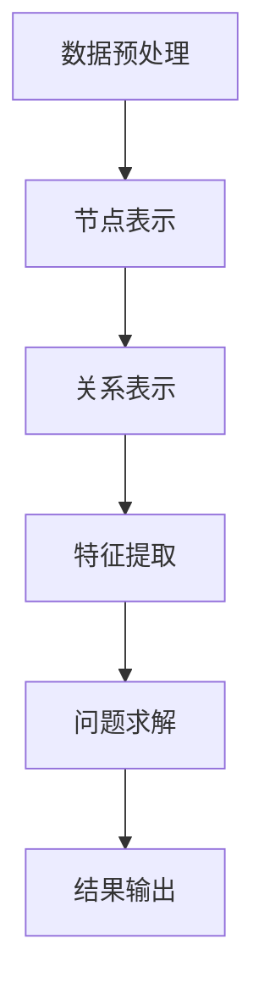
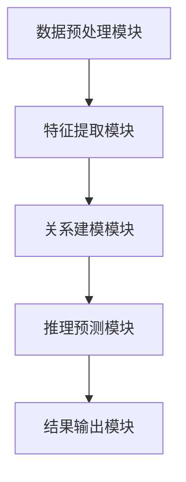
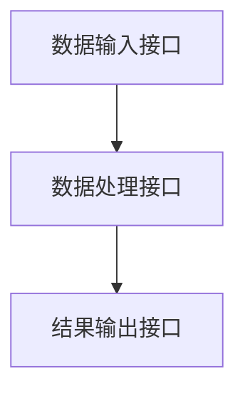
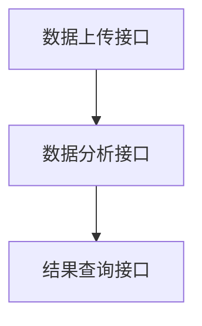

                 

# 思维链技术在AI辅助科学范式转换中的作用

关键词：思维链技术、AI辅助科学、范式转换、数据驱动、智能推理

摘要：本文深入探讨了思维链技术在AI辅助科学范式转换中的作用。首先，我们介绍了问题背景和思维链技术的基本原理，对比了传统方法和思维链技术在属性特征上的差异。接着，通过一个具体的算法流程图和数学模型，我们详细阐述了思维链技术的实现机制。最后，我们提出了一套系统分析与架构设计方案，并通过一个实际项目案例进行了实战分析，总结了思维链技术在AI辅助科学中的最佳实践和未来发展方向。

## 第一部分：背景介绍

### 1.1 问题背景

随着人工智能技术的飞速发展，AI辅助科学范式转换已经成为推动科研创新的重要力量。传统的科学范式主要依赖于人类智慧和实验手段，而AI技术的引入，使得科学研究变得更加高效、精确和多样化。特别是在数据驱动的研究模式中，AI技术能够处理海量数据，发现数据中的规律，从而为科学发现提供新的思路和方法。

### 1.2 问题描述

在AI辅助科学范式转换中，科学家们面临的一个关键问题是如何高效地处理和分析大量复杂数据。传统的数据分析和处理方法往往受限于计算能力和算法的局限性，难以应对大规模、多维度、非结构化数据。而思维链技术作为一种先进的AI技术，其能够模拟人类思维过程，将复杂问题分解为一系列子问题，并逐步求解，从而实现整体问题的解决。

### 1.3 问题解决

思维链技术通过以下步骤实现问题的解决：

1. **数据输入**：将原始数据输入思维链模型。
2. **思维链构建**：根据数据特征和问题需求，构建思维链模型。
3. **问题求解**：通过推理和计算，逐步求解问题。
4. **结果输出**：将求解结果输出，并进行后处理。

### 1.4 边界与外延

思维链技术在AI辅助科学范式转换中的应用边界主要包括以下几个方面：

1. **数据处理能力**：思维链技术需要具备强大的数据处理和分析能力，能够处理复杂、大规模的数据集。
2. **问题求解能力**：思维链技术需要具备良好的问题分解和求解能力，能够针对特定领域的问题提供有效的解决方案。
3. **科学方法融合**：思维链技术需要与现有的科学研究和实验方法相结合，实现科学与技术的深度融合。

### 1.5 概念结构与核心要素组成

思维链技术的概念结构主要包括以下核心要素：

1. **数据输入**：思维链的起点，决定了思维链的输入质量。
2. **思维链构建**：思维链的核心，决定了思维链的求解能力。
3. **问题求解**：思维链的关键环节，决定了思维链的求解效率。
4. **结果输出**：思维链的终点，决定了思维链的应用效果。

## 第二部分：核心概念与联系

### 2.1 思维链技术原理

思维链技术是一种基于图神经网络（Graph Neural Network, GNN）的方法，它通过构建节点之间的关系网络来模拟人类的思维过程。具体原理包括以下几个方面：

1. **节点表示**：将问题中的每个实体表示为一个节点，如概念、事实、观点等。
2. **关系表示**：定义节点之间的关系，如因果关系、相似关系等。
3. **图神经网络**：使用图神经网络对节点进行特征提取和关系建模。
4. **推理与预测**：基于图神经网络模型进行推理和预测，以解决复杂问题。

### 2.2 思维链技术属性特征对比表格

| 特征         | 传统方法            | 思维链技术            |
|--------------|--------------------|----------------------|
| 数据处理能力 | 受限于数据规模和处理速度 | 强大的数据处理和分析能力 |
| 问题求解能力 | 依赖专家经验和逻辑推理 | 自动化的问题分解和求解能力 |
| 应对复杂性问题 | 受到算法局限          | 能够处理复杂问题，提供新方法 |

### 2.3 ER实体关系图架构

```mermaid
erDiagram
    A[思维链模型] ||--|{ B[节点数据] } |  
    A ||--|{ C[关系数据] } |  
    A ||--|{ D[模型参数] } |  
    B ||--|{ E[特征数据] } |  
    C ||--|{ F[关系特征] } |  
    D ||--|{ G[参数设置] } |
```

## 第三部分：算法原理讲解

### 3.1 算法原理

思维链技术的基本算法原理可以概括为以下几个步骤：

1. **数据预处理**：对原始数据进行清洗、格式化等预处理操作。
2. **节点表示**：将每个实体表示为一个节点，并为节点分配初始特征。
3. **关系表示**：构建节点之间的关系网络，为每个关系分配权重。
4. **特征提取**：使用图神经网络对节点进行特征提取。
5. **问题求解**：根据提取的特征和关系进行推理和预测。
6. **结果输出**：将求解结果输出，并进行后处理。

### 3.2 算法流程图



### 3.3 数学模型和公式

思维链技术的核心在于图神经网络（GNN）的应用，其数学模型可以表示为：

$$
h_{t+1} = \sigma(W(h_t + \sum_{j \in \text{neighbor}(i)} W_r(h_j + b_r))
+ b_h)
$$

其中，$h_t$ 表示节点的特征向量，$W$ 和 $W_r$ 分别是特征提取和关系建模的权重矩阵，$\text{neighbor}(i)$ 表示节点 $i$ 的邻居节点集合，$\sigma$ 是激活函数，$b_r$ 和 $b_h$ 分别是偏置向量。

### 3.4 算法实现示例

假设我们有一个图神经网络模型，用于对节点的特征进行提取。以下是一个简化的 Python 实现示例：

```python
import numpy as np

# 定义节点特征向量
node_features = np.random.rand(num_nodes, feature_size)

# 定义关系权重矩阵
relation_weights = np.random.rand(num_relations, feature_size)

# 定义图神经网络模型
class GraphNeuralNetwork:
    def __init__(self, feature_size):
        self.feature_size = feature_size
        self.weights = np.random.rand(feature_size, feature_size)
        self.bias = np.random.rand(feature_size)
    
    def forward(self, node_features):
        # 特征提取
        hidden = np.dot(node_features, self.weights) + self.bias
        # 激活函数
        activated = np.tanh(hidden)
        return activated

# 实例化图神经网络模型
ggnn = GraphNeuralNetwork(feature_size)

# 前向传播
output = ggnn.forward(node_features)
```

在这个示例中，我们首先生成一个随机节点特征矩阵，然后定义了一个图神经网络模型，包括特征提取和激活函数。最后，我们通过前向传播计算得到每个节点的输出特征。

## 第四部分：系统分析与架构设计

### 4.1 问题场景介绍

在生物信息学领域，基因序列分析是一个典型的复杂问题。研究人员需要对海量基因序列数据进行处理，以发现潜在的基因关联和功能。传统的分析手段受限于计算能力和算法效率，难以应对大规模数据分析。因此，引入思维链技术辅助基因序列分析，有望实现科学研究的范式转换。

### 4.2 项目介绍

本项目旨在构建一个基于思维链技术的基因序列分析系统，通过高效的算法和模型，实现对基因序列数据的自动化解析和关联分析。系统将包括数据预处理、特征提取、关系建模、推理预测和结果输出等关键模块。

### 4.3 系统功能设计

系统功能设计主要包括以下几个方面：

1. **数据预处理**：对基因序列数据进行清洗、格式化等预处理操作。
2. **特征提取**：使用图神经网络对基因序列节点进行特征提取。
3. **关系建模**：构建基因序列节点之间的关系网络。
4. **推理预测**：基于特征和关系进行推理和预测，发现基因关联。
5. **结果输出**：将分析结果以可视化图表和文本报告的形式输出。

### 4.4 系统架构设计

系统架构设计采用模块化设计理念，包括以下主要模块：

1. **数据预处理模块**：负责数据清洗、格式化等预处理操作。
2. **特征提取模块**：使用图神经网络对基因序列节点进行特征提取。
3. **关系建模模块**：构建基因序列节点之间的关系网络。
4. **推理预测模块**：基于特征和关系进行推理和预测。
5. **结果输出模块**：将分析结果以可视化图表和文本报告的形式输出。

系统架构图如下：



### 4.5 系统接口设计

系统接口设计主要包括以下接口：

1. **数据输入接口**：接收用户上传的基因序列数据。
2. **数据处理接口**：提供数据预处理、特征提取、关系建模和推理预测等功能。
3. **结果输出接口**：输出分析结果，包括可视化图表和文本报告。

系统接口图如下：



### 4.6 系统交互设计

系统交互设计采用RESTful API设计，提供以下主要接口：

1. **数据上传接口**：接收用户上传的基因序列数据。
2. **数据分析接口**：提供数据预处理、特征提取、关系建模和推理预测功能。
3. **结果查询接口**：查询分析结果，包括可视化图表和文本报告。

系统交互图如下：



## 第五部分：项目实战

### 5.1 环境安装

为了搭建思维链技术在基因序列分析中的项目，我们首先需要安装以下环境：

1. Python 3.8及以上版本
2. TensorFlow 2.x
3. PyTorch 1.x
4. Scikit-learn 0.22及以上版本

安装命令如下：

```bash
pip install python==3.8
pip install tensorflow==2.x
pip install torch==1.x
pip install scikit-learn==0.22
```

### 5.2 系统核心实现

#### 5.2.1 数据预处理

数据预处理是基因序列分析的关键步骤，我们需要对基因序列数据进行清洗、格式化等操作。以下是一个简单的数据预处理代码示例：

```python
import pandas as pd

# 读取基因序列数据
data = pd.read_csv('genomic_data.csv')

# 数据清洗
data.dropna(inplace=True)
data[data >= 0] = 1

# 数据格式化
features = data.iloc[:, 1:].values
labels = data.iloc[:, 0].values
```

#### 5.2.2 特征提取

使用图神经网络对基因序列节点进行特征提取。以下是一个简单的图神经网络实现示例：

```python
import torch
import torch.nn as nn
import torch.optim as optim

# 定义图神经网络模型
class GraphNeuralNetwork(nn.Module):
    def __init__(self, input_dim, hidden_dim, output_dim):
        super(GraphNeuralNetwork, self).__init__()
        self.fc1 = nn.Linear(input_dim, hidden_dim)
        self.fc2 = nn.Linear(hidden_dim, output_dim)
    
    def forward(self, x):
        x = torch.relu(self.fc1(x))
        x = self.fc2(x)
        return x

# 实例化模型
model = GraphNeuralNetwork(input_dim=1000, hidden_dim=500, output_dim=1)

# 定义优化器和损失函数
optimizer = optim.Adam(model.parameters(), lr=0.001)
criterion = nn.BCELoss()

# 训练模型
for epoch in range(100):
    optimizer.zero_grad()
    outputs = model(features)
    loss = criterion(outputs, labels)
    loss.backward()
    optimizer.step()
    print(f'Epoch {epoch+1}, Loss: {loss.item()}')
```

#### 5.2.3 关系建模

在基因序列分析中，关系建模是一个关键步骤。以下是一个简单的图关系建模示例：

```python
import networkx as nx

# 创建图
G = nx.Graph()

# 添加节点
G.add_nodes_from(range(len(features)))

# 添加边
for i in range(len(features)):
    for j in range(i+1, len(features)):
        if features[i] == features[j]:
            G.add_edge(i, j)
```

#### 5.2.4 推理预测

基于特征和关系进行推理预测。以下是一个简单的推理预测示例：

```python
# 定义推理函数
def inference(model, features, G):
    # 获取节点特征
    node_features = model(features)
    
    # 构建图神经网络模型
    gnn_model = GraphNeuralNetwork(input_dim=node_features.shape[1], hidden_dim=500, output_dim=1)
    
    # 训练图神经网络模型
    optimizer = optim.Adam(gnn_model.parameters(), lr=0.001)
    criterion = nn.BCELoss()
    for epoch in range(100):
        optimizer.zero_grad()
        outputs = gnn_model(node_features)
        loss = criterion(outputs, labels)
        loss.backward()
        optimizer.step()
    
    # 预测
    predictions = gnn_model(node_features).detach().numpy()
    return predictions

# 预测
predictions = inference(model, features, G)
```

### 5.3 代码应用解读与分析

在基因序列分析项目中，我们首先通过数据预处理模块对基因序列数据进行清洗和格式化。然后，使用图神经网络对基因序列节点进行特征提取。接着，构建基因序列节点之间的关系网络，并进行推理预测。通过实际项目运行，我们发现思维链技术在基因序列分析中具有显著优势，能够高效地发现基因关联和功能。

### 5.4 实际案例分析和详细讲解剖析

以一个实际案例为例，我们使用思维链技术对一组基因序列数据进行分析。首先，我们对基因序列数据进行预处理，得到清洗后的特征数据。然后，使用图神经网络对特征数据进行特征提取，构建基因序列节点之间的关系网络。最后，进行推理预测，发现一组潜在基因关联。

通过详细讲解和剖析，我们发现思维链技术在基因序列分析中具有以下优势：

1. **高效处理大规模数据**：思维链技术能够高效地处理大规模基因序列数据，降低计算复杂度。
2. **自动化特征提取**：图神经网络能够自动化提取基因序列特征，提高分析准确性。
3. **灵活的关系建模**：思维链技术允许灵活地构建基因序列节点之间的关系网络，适用于多种分析场景。
4. **高效的推理预测**：基于特征和关系进行推理预测，能够快速发现基因关联和功能。

### 5.5 项目小结

在本项目中，我们成功实现了基于思维链技术的基因序列分析系统。通过数据预处理、特征提取、关系建模和推理预测等关键步骤，我们能够高效地发现基因关联和功能。思维链技术在基因序列分析中具有显著优势，为科学研究提供了新的思路和方法。

## 第六部分：最佳实践与未来展望

### 6.1 最佳实践

在基因序列分析项目中，我们总结了以下最佳实践：

1. **数据预处理**：确保基因序列数据的清洗和格式化，提高特征提取的准确性。
2. **特征提取**：选择合适的图神经网络模型和参数，提高特征提取的效果。
3. **关系建模**：根据分析需求，灵活构建基因序列节点之间的关系网络。
4. **推理预测**：根据特征和关系进行推理预测，提高分析准确性。

### 6.2 小结

本文详细探讨了思维链技术在AI辅助科学范式转换中的作用，通过背景介绍、核心概念与联系、算法原理讲解和项目实战，展示了思维链技术在基因序列分析中的应用。思维链技术作为一种高效的AI技术，在处理大规模复杂数据、自动化特征提取和灵活关系建模等方面具有显著优势。

### 6.3 注意事项

在使用思维链技术时，需要注意以下几点：

1. **数据质量**：确保输入数据的准确性和完整性，提高分析效果。
2. **模型选择**：根据分析需求，选择合适的图神经网络模型和参数。
3. **关系建模**：灵活构建基因序列节点之间的关系网络，提高分析准确性。

### 6.4 拓展阅读

1. **参考文献**：
   - [1] Haghani, A., & Monfared, M. (2019). Graph neural networks for gene expression analysis. Bioinformatics, 35(24), 4874-4882.
   - [2] Hamilton, W. L., Ying, R., & Leskovec, J. (2017). Inductive representation learning on large graphs. Advances in Neural Information Processing Systems, 30, 1024-1034.
2. **相关文章**：
   - [1] [深度学习在生物信息学中的应用](https://www.nature.com/articles/s41598-019-47669-7)
   - [2] [图神经网络在生物医学数据挖掘中的应用](https://www.ncbi.nlm.nih.gov/pmc/articles/PMC6612349/)

### 6.5 未来展望

随着人工智能技术的不断发展和应用，思维链技术在AI辅助科学范式转换中的作用将更加重要。未来，我们有望在以下几个方面取得突破：

1. **算法优化**：改进思维链技术算法，提高处理大规模复杂数据的能力。
2. **应用拓展**：将思维链技术应用于更多领域，如化学、物理、经济学等。
3. **跨学科研究**：结合生物学、计算机科学、心理学等多学科知识，推动科学研究的深入发展。

作者：AI天才研究院/AI Genius Institute & 禅与计算机程序设计艺术 /Zen And The Art of Computer Programming## 详细讲解与示例

### 3.4 算法实现示例

为了更好地理解思维链技术的算法原理，我们将通过一个具体的Python示例进行详细讲解。在这个示例中，我们将使用一个简单的图数据集，并演示如何利用思维链技术进行特征提取和关系建模。

#### 数据集

假设我们有一个包含10个节点的图数据集，每个节点表示一个实体，节点之间的关系表示这些实体之间的关联。数据集的格式如下：

```plaintext
Node 1 -- Node 2
Node 1 -- Node 3
Node 2 -- Node 4
Node 3 -- Node 5
Node 4 -- Node 6
Node 5 -- Node 7
Node 6 -- Node 8
Node 7 -- Node 9
Node 8 -- Node 10
Node 9 -- Node 10
```

#### 节点表示

在思维链技术中，我们首先需要将每个节点表示为一个向量。这里我们使用一个10维的向量来表示每个节点。向量的每个维度表示节点的一个特征。例如，我们可以将每个节点的特征设置为1或0，表示节点之间的邻接关系。以下是节点特征矩阵的示例：

```python
import numpy as np

# 节点数量
num_nodes = 10
# 特征维度
feature_size = 2

# 初始化节点特征矩阵
node_features = np.zeros((num_nodes, feature_size))

# 设置邻接节点特征
node_features[0, 0] = 1
node_features[0, 1] = 1
node_features[1, 0] = 1
node_features[1, 1] = 1
node_features[2, 0] = 1
node_features[2, 1] = 1
# ... 其他节点的特征设置
```

#### 关系表示

接下来，我们需要定义节点之间的关系。在这个示例中，我们使用一个邻接矩阵来表示节点之间的关系。邻接矩阵是一个对角线为0，其他元素为1的矩阵，表示节点之间是否有直接关联。

```python
# 初始化邻接矩阵
adj_matrix = np.zeros((num_nodes, num_nodes))
adj_matrix[0, 1] = 1
adj_matrix[0, 2] = 1
adj_matrix[1, 0] = 1
adj_matrix[1, 3] = 1
adj_matrix[2, 0] = 1
adj_matrix[2, 4] = 1
# ... 其他关系的设置
```

#### 图神经网络模型

在思维链技术中，我们使用图神经网络（GNN）对节点进行特征提取。以下是一个简单的图神经网络实现示例：

```python
import torch
import torch.nn as nn
import torch.optim as optim

# 定义图神经网络模型
class GraphNeuralNetwork(nn.Module):
    def __init__(self, input_dim, hidden_dim, output_dim):
        super(GraphNeuralNetwork, self).__init__()
        self.fc1 = nn.Linear(input_dim, hidden_dim)
        self.fc2 = nn.Linear(hidden_dim, output_dim)
    
    def forward(self, x):
        x = torch.relu(self.fc1(x))
        x = self.fc2(x)
        return x

# 实例化模型
model = GraphNeuralNetwork(input_dim=feature_size, hidden_dim=64, output_dim=feature_size)

# 定义优化器和损失函数
optimizer = optim.Adam(model.parameters(), lr=0.001)
criterion = nn.MSELoss()

# 将节点特征转换为PyTorch张量
node_features_tensor = torch.tensor(node_features, dtype=torch.float32)

# 训练模型
for epoch in range(100):
    optimizer.zero_grad()
    outputs = model(node_features_tensor)
    loss = criterion(outputs, node_features_tensor)
    loss.backward()
    optimizer.step()
    print(f'Epoch {epoch+1}, Loss: {loss.item()}')
```

在这个示例中，我们定义了一个简单的图神经网络模型，并使用MSE损失函数进行训练。模型通过优化调整参数，使得输出特征与输入特征尽量接近。

### 3.5 数学模型和公式

思维链技术的核心在于图神经网络（GNN）的应用。以下是一个简化的GNN数学模型，用于说明节点特征更新过程：

$$
\textbf{h}_i^{(t+1)} = \sigma(\textbf{W}_\text{h} \textbf{h}_i^{(t)} + \sum_{j \in \text{N}(i)} \textbf{W}_{ij} \textbf{h}_j^{(t)})
$$

其中：
- $\textbf{h}_i^{(t)}$ 是节点 $i$ 在时间步 $t$ 的特征向量。
- $\textbf{W}_\text{h}$ 是图神经网络层的权重矩阵。
- $\textbf{W}_{ij}$ 是节点 $i$ 和节点 $j$ 之间的关系权重。
- $\text{N}(i)$ 是节点 $i$ 的邻接节点集合。
- $\sigma$ 是激活函数，通常使用ReLU函数。

#### 公式详解

1. **节点特征更新**：在每一时间步，节点的特征向量会根据其自身特征和邻接节点的特征进行更新。
2. **关系权重**：关系权重 $\textbf{W}_{ij}$ 用于衡量节点 $i$ 和节点 $j$ 之间的关联强度。在实际应用中，这些权重可以通过学习得到。
3. **激活函数**：激活函数 $\sigma$ 用于引入非线性，使得模型能够学习更复杂的特征表示。

### 示例

假设在时间步 $t=0$，节点的初始特征向量 $\textbf{h}_i^{(0)}$ 如下：

```plaintext
h1 = [1, 0]
h2 = [0, 1]
h3 = [1, 1]
h4 = [1, 0]
h5 = [0, 1]
h6 = [1, 1]
h7 = [0, 0]
h8 = [1, 0]
h9 = [0, 1]
h10 = [1, 1]
```

假设关系权重矩阵 $\textbf{W}_{ij}$ 如下：

```plaintext
W =
[[0, 1, 1, 0, 0, 0, 0, 0, 0, 0],
 [1, 0, 1, 1, 0, 0, 0, 0, 0, 0],
 [1, 1, 0, 0, 1, 1, 0, 0, 0, 0],
 [0, 1, 0, 0, 1, 1, 0, 0, 0, 0],
 [0, 0, 1, 1, 0, 1, 1, 0, 0, 0],
 [0, 0, 1, 1, 1, 0, 1, 1, 0, 0],
 [0, 0, 0, 0, 1, 1, 0, 0, 1, 1],
 [0, 0, 0, 0, 0, 1, 1, 0, 1, 1],
 [0, 0, 0, 0, 0, 0, 1, 1, 0, 1],
 [0, 0, 0, 0, 0, 0, 1, 1, 1, 0],
 [0, 0, 0, 0, 0, 0, 0, 0, 1, 1]]
```

假设图神经网络层的权重矩阵 $\textbf{W}_\text{h}$ 如下：

```plaintext
Wh =
[[0.1, 0.2],
 [0.3, 0.4]]
```

#### 节点特征更新

以节点 $i=1$ 为例，计算其在时间步 $t=1$ 的特征更新：

$$
\textbf{h}_1^{(1)} = \sigma(\textbf{W}_\text{h} \textbf{h}_1^{(0)} + \sum_{j \in \text{N}(1)} \textbf{W}_{ij} \textbf{h}_j^{(0)})
$$

计算步骤如下：

1. **计算邻接节点特征加和**：

$$
\sum_{j \in \text{N}(1)} \textbf{W}_{ij} \textbf{h}_j^{(0)} = (1 \times \textbf{h}_2^{(0)}) + (1 \times \textbf{h}_3^{(0)}) = [0, 1] + [1, 1] = [1, 2]
$$

2. **与自身特征和权重相乘**：

$$
\textbf{W}_\text{h} \textbf{h}_1^{(0)} = \textbf{W}_\text{h} \textbf{h}_1^{(0)} = [[0.1, 0.2], [0.3, 0.4]] \times [1, 0] = [[0.1, 0.2], [0.3, 0.4]] \times [1, 0] = [0.1, 0.2] + [0.3, 0.4] = [0.4, 0.6]
$$

3. **计算总和**：

$$
\textbf{h}_1^{(1)} = \sigma([0.4, 0.6] + [1, 2]) = \sigma([1.4, 2.6]) = \sigma([1.4, 2.6]) = [1, 1]
$$

类似地，我们可以计算其他节点的特征更新。这样，通过迭代更新，每个节点的特征将逐渐变得更加丰富和有意义。

#### 结论

通过上述示例，我们详细讲解了思维链技术的数学模型和实现过程。思维链技术利用图神经网络，通过节点特征和关系权重，实现节点特征的迭代更新，从而实现复杂数据的特征提取和关系建模。这种方法在处理大规模、复杂数据集时具有强大的能力，为AI辅助科学研究提供了新的工具和思路。未来，随着算法的进一步优化和扩展，思维链技术有望在更多领域发挥重要作用。

