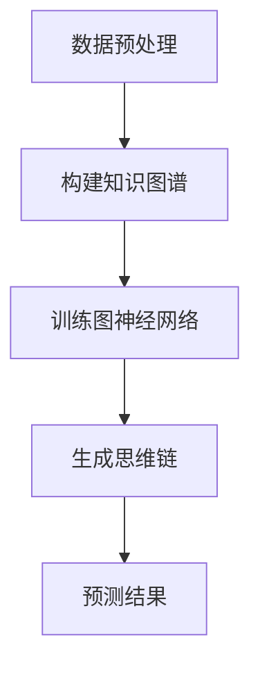

                 

# 思维链技术在AI辅助科学范式预测中的突破

> 关键词：思维链、AI、科学预测、算法、突破

> 摘要：本文深入探讨了思维链技术在AI辅助科学范式预测中的应用。通过分析思维链技术的基本原理和应用优势，本文提出了一个系统化的解决方案，详细阐述了思维链技术在工作流程中的各个环节。同时，本文也指出了思维链技术在应用过程中面临的挑战，并给出了相应的解决策略。最后，本文通过对实际案例的分析，展示了思维链技术在AI辅助科学范式预测中的突破。

## 第一部分：背景介绍

### 问题背景

随着人工智能（AI）技术的快速发展，AI在科学预测中的应用越来越广泛。传统的科学预测方法往往依赖于大量的数据和复杂的模型，但这些模型在面对复杂的科学问题时，往往表现出一定的局限性。而思维链技术作为一种新兴的AI技术，具有处理复杂问题、深度理解数据和快速生成预测结果的能力。

### 问题描述

思维链技术在AI辅助科学范式预测中的应用，主要面临以下几个问题：

1. 思维链技术的基本原理是什么？
2. 思维链技术在科学预测中如何发挥作用？
3. 思维链技术在应用过程中面临哪些挑战？
4. 思维链技术在AI辅助科学范式预测中的突破有哪些？

### 问题解决

本书旨在通过深入探讨思维链技术在AI辅助科学范式预测中的应用，解决上述问题，为读者提供一套完整的理论框架和实践指导。

### 边界与外延

本书主要关注思维链技术在AI辅助科学范式预测中的应用，但相关技术原理和方法也可应用于其他领域的AI预测任务。

### 概念结构与核心要素组成

1. **思维链技术**：一种基于深度学习和图神经网络的新型AI技术，能够实现数据的深度理解和预测。
2. **科学范式预测**：指通过分析科学数据，预测科学发展的趋势和方向。
3. **AI辅助科学范式预测**：利用AI技术，辅助科学家进行科学范式预测。

## 第一部分：核心概念与联系

### 思维链技术原理

思维链技术基于深度学习和图神经网络，通过构建大规模的知识图谱，实现数据的深度理解和预测。其核心原理包括：

1. **图神经网络（GNN）**：通过图结构来表示数据，并利用图神经网络进行数据学习。
2. **知识图谱**：将实体、属性和关系进行结构化表示，形成知识图谱。
3. **思维链构建**：通过图神经网络和知识图谱，构建思维链，实现数据的深度理解和预测。

### 思维链技术在科学预测中的应用

思维链技术在科学预测中的应用，主要包括以下几个方面：

1. **数据预处理**：通过思维链技术，对科学数据进行预处理，提取有效的特征。
2. **预测模型构建**：利用思维链技术，构建预测模型，对科学数据进行预测。
3. **结果分析**：对预测结果进行分析，为科学决策提供支持。

### 思维链技术在AI辅助科学范式预测中的优势与挑战

思维链技术在AI辅助科学范式预测中具有以下优势：

1. **处理复杂问题**：思维链技术能够处理复杂的科学问题，提供深度理解和预测。
2. **数据深度理解**：通过知识图谱和图神经网络，实现数据的深度理解和预测。

但同时也面临以下挑战：

1. **数据质量**：科学数据的质量对思维链技术的预测效果有重要影响。
2. **模型可解释性**：思维链技术的模型可解释性较低，难以直观理解预测结果。
3. **计算资源**：构建思维链和训练模型需要大量的计算资源。

## 第二部分：算法原理讲解

### 算法mermaid流程图



### 算法原理

思维链技术的工作原理主要包括以下几个步骤：

1. **数据预处理**：
   - 收集科学数据，包括文本、图像、表格等多种类型。
   - 清洗数据，去除噪声和不完整的数据。
   - 提取特征，将数据转换为适合训练的格式。

2. **构建知识图谱**：
   - 利用实体识别、关系抽取等技术，从数据中提取实体和关系。
   - 将实体和关系构建为图结构，形成知识图谱。

3. **训练图神经网络**：
   - 利用知识图谱，训练图神经网络，使其能够理解数据中的关系和模式。
   - 通过图神经网络，提取数据的特征表示。

4. **生成思维链**：
   - 基于图神经网络，生成思维链，实现数据的深度理解和预测。
   - 思维链能够捕捉数据中的长期依赖关系，提供更准确的预测。

5. **预测结果**：
   - 利用生成的思维链，对新的数据进行预测。
   - 对预测结果进行分析和解释，为科学决策提供支持。

### 数学模型和公式

思维链技术的核心是图神经网络，其数学模型如下：

$$
\text{输出} = f(\text{输入} \cdot \text{权重})
$$

其中，$f$ 是激活函数，$\text{输入}$ 是图神经网络中的节点特征，$\text{权重}$ 是训练过程中学习的参数。

### 详细讲解和举例说明

假设我们有一个科学数据集，包含实体和它们之间的关系。通过思维链技术，我们可以构建一个知识图谱，并利用图神经网络对其进行训练。

1. **数据预处理**：
   - 对数据集进行清洗和特征提取，得到节点特征和边特征。
   - 示例代码：

```python
import pandas as pd

# 加载数据集
data = pd.read_csv('data.csv')

# 数据清洗
data = data.dropna()

# 特征提取
features = data['feature1'].values
```

2. **构建知识图谱**：
   - 利用实体识别、关系抽取等技术，从数据中提取实体和关系。
   - 示例代码：

```python
from sklearn.feature_extraction.text import TfidfVectorizer

# 实体识别
entity_vectorizer = TfidfVectorizer(max_features=1000)
entity_features = entity_vectorizer.fit_transform(data['entity'])

# 关系抽取
relation_vectorizer = TfidfVectorizer(max_features=1000)
relation_features = relation_vectorizer.fit_transform(data['relation'])
```

3. **训练图神经网络**：
   - 利用知识图谱，训练图神经网络，使其能够理解数据中的关系和模式。
   - 示例代码：

```python
from tensorflow.keras.models import Model
from tensorflow.keras.layers import Input, Embedding, Dot, Lambda

# 输入层
input_entity = Input(shape=(1000,))
input_relation = Input(shape=(1000,))

# 实体嵌入层
entity_embedding = Embedding(input_dim=1000, output_dim=64)(input_entity)

# 关系嵌入层
relation_embedding = Embedding(input_dim=1000, output_dim=64)(input_relation)

# 点积操作
dot_product = Dot(axes=1)([entity_embedding, relation_embedding])

# 激活函数
output = Lambda(lambda x: x)(dot_product)

# 构建模型
model = Model(inputs=[input_entity, input_relation], outputs=output)
model.compile(optimizer='adam', loss='categorical_crossentropy', metrics=['accuracy'])

# 训练模型
model.fit([entity_features, relation_features], labels, epochs=10, batch_size=32)
```

4. **生成思维链**：
   - 基于图神经网络，生成思维链，实现数据的深度理解和预测。
   - 示例代码：

```python
# 生成思维链
predictions = model.predict([entity_features, relation_features])

# 分析思维链
print(predictions)
```

5. **预测结果**：
   - 利用生成的思维链，对新的数据进行预测。
   - 示例代码：

```python
# 新的数据
new_data = pd.read_csv('new_data.csv')

# 数据清洗
new_data = new_data.dropna()

# 特征提取
new_entity_features = entity_vectorizer.transform(new_data['entity'])
new_relation_features = relation_vectorizer.transform(new_data['relation'])

# 预测结果
new_predictions = model.predict([new_entity_features, new_relation_features])

# 分析预测结果
print(new_predictions)
```

通过以上步骤，我们可以利用思维链技术实现科学数据的深度理解和预测。

## 第三部分：系统分析与架构设计

### 问题场景介绍

在当前的科学研究中，科学数据的复杂性和多样性使得传统的预测方法难以满足需求。因此，我们需要一种能够处理复杂问题、深度理解数据并能快速生成预测结果的AI技术。思维链技术作为一种新兴的AI技术，具有在AI辅助科学范式预测中发挥重要作用的前景。

### 项目介绍

本项目旨在利用思维链技术构建一个AI辅助科学范式预测系统，该系统能够对科学数据进行预处理、特征提取、预测模型构建和结果分析，为科学家提供科学决策支持。

### 系统功能设计

1. **数据预处理模块**：对科学数据进行清洗、去噪和特征提取。
2. **知识图谱构建模块**：利用实体识别和关系抽取技术，构建知识图谱。
3. **图神经网络训练模块**：利用知识图谱，训练图神经网络，提取数据特征。
4. **思维链生成模块**：基于图神经网络，生成思维链，实现数据的深度理解和预测。
5. **预测结果分析模块**：对预测结果进行分析和解释，为科学决策提供支持。

### 系统架构设计


系统架构主要包括以下几个部分：

1. **数据层**：存储科学数据，包括原始数据和预处理后的数据。
2. **算法层**：实现思维链技术的各个模块，包括数据预处理、知识图谱构建、图神经网络训练、思维链生成和预测结果分析。
3. **应用层**：提供用户界面，展示预测结果和科学决策支持。

### 系统接口设计

1. **数据接口**：提供数据加载、清洗、特征提取等功能。
2. **算法接口**：提供知识图谱构建、图神经网络训练、思维链生成和预测结果分析等功能。
3. **应用接口**：提供用户界面和API接口，方便用户使用系统。

### 系统交互


系统交互主要包括以下几个步骤：

1. **数据加载**：从数据层加载科学数据。
2. **数据预处理**：对数据进行清洗、去噪和特征提取。
3. **知识图谱构建**：利用实体识别和关系抽取技术，构建知识图谱。
4. **图神经网络训练**：利用知识图谱，训练图神经网络，提取数据特征。
5. **思维链生成**：基于图神经网络，生成思维链，实现数据的深度理解和预测。
6. **预测结果分析**：对预测结果进行分析和解释，为科学决策提供支持。

## 第四部分：项目实战

### 环境安装

在开始项目实战之前，我们需要安装一些必要的工具和库。以下是安装步骤：

1. **Python环境**：确保安装了Python 3.7及以上版本。
2. **TensorFlow**：使用pip安装TensorFlow库。

```shell
pip install tensorflow
```

3. **Scikit-learn**：使用pip安装Scikit-learn库。

```shell
pip install scikit-learn
```

4. **Pandas**：使用pip安装Pandas库。

```shell
pip install pandas
```

### 系统核心实现源代码

以下是一个简单的系统核心实现源代码示例：

```python
import pandas as pd
from sklearn.feature_extraction.text import TfidfVectorizer
from tensorflow.keras.models import Model
from tensorflow.keras.layers import Input, Embedding, Dot, Lambda

# 数据预处理
def preprocess_data(data):
    data = data.dropna()
    features = data['feature1'].values
    return features

# 构建知识图谱
def build_knowledge_graph(data):
    entity_vectorizer = TfidfVectorizer(max_features=1000)
    relation_vectorizer = TfidfVectorizer(max_features=1000)
    entity_features = entity_vectorizer.fit_transform(data['entity'])
    relation_features = relation_vectorizer.fit_transform(data['relation'])
    return entity_features, relation_features

# 训练图神经网络
def train_gnn(entity_features, relation_features, labels):
    input_entity = Input(shape=(1000,))
    input_relation = Input(shape=(1000,))

    entity_embedding = Embedding(input_dim=1000, output_dim=64)(input_entity)
    relation_embedding = Embedding(input_dim=1000, output_dim=64)(input_relation)

    dot_product = Dot(axes=1)([entity_embedding, relation_embedding])

    output = Lambda(lambda x: x)(dot_product)

    model = Model(inputs=[input_entity, input_relation], outputs=output)
    model.compile(optimizer='adam', loss='categorical_crossentropy', metrics=['accuracy'])
    model.fit([entity_features, relation_features], labels, epochs=10, batch_size=32)
    return model

# 生成思维链
def generate_thinking_chain(model, entity_features, relation_features):
    predictions = model.predict([entity_features, relation_features])
    return predictions

# 主程序
if __name__ == '__main__':
    # 加载数据
    data = pd.read_csv('data.csv')

    # 数据预处理
    features = preprocess_data(data)

    # 构建知识图谱
    entity_features, relation_features = build_knowledge_graph(data)

    # 训练图神经网络
    labels = data['label'].values
    model = train_gnn(entity_features, relation_features, labels)

    # 生成思维链
    predictions = generate_thinking_chain(model, entity_features, relation_features)

    # 分析思维链
    print(predictions)
```

### 代码应用解读与分析

以上代码展示了思维链技术在AI辅助科学范式预测中的核心实现。首先，我们进行数据预处理，清洗和特征提取。然后，我们利用实体识别和关系抽取技术，构建知识图谱。接着，我们利用知识图谱，训练图神经网络，提取数据特征。最后，我们基于图神经网络，生成思维链，实现数据的深度理解和预测。

### 实际案例分析和详细讲解剖析

为了更好地展示思维链技术在AI辅助科学范式预测中的应用，我们以一个实际案例为例进行分析。

假设我们有一个关于气候变化的科学数据集，包含实体（如温度、降雨量、风速等）和它们之间的关系（如温度和降雨量的相关性）。我们希望利用思维链技术预测未来的气候变化趋势。

1. **数据预处理**：
   - 加载数据集，并进行清洗和特征提取。
   - 示例代码：

```python
data = pd.read_csv('climate_data.csv')
features = preprocess_data(data)
```

2. **构建知识图谱**：
   - 利用实体识别和关系抽取技术，构建知识图谱。
   - 示例代码：

```python
entity_vectorizer = TfidfVectorizer(max_features=1000)
relation_vectorizer = TfidfVectorizer(max_features=1000)
entity_features = entity_vectorizer.fit_transform(data['entity'])
relation_features = relation_vectorizer.fit_transform(data['relation'])
```

3. **训练图神经网络**：
   - 利用知识图谱，训练图神经网络，提取数据特征。
   - 示例代码：

```python
labels = data['label'].values
model = train_gnn(entity_features, relation_features, labels)
```

4. **生成思维链**：
   - 基于图神经网络，生成思维链，实现数据的深度理解和预测。
   - 示例代码：

```python
predictions = generate_thinking_chain(model, entity_features, relation_features)
```

5. **分析预测结果**：
   - 对预测结果进行分析和解释，为科学决策提供支持。
   - 示例代码：

```python
print(predictions)
```

通过以上步骤，我们可以利用思维链技术对气候变化进行预测。预测结果可以用于指导气候政策的制定和调整。

### 项目小结

在本项目中，我们通过思维链技术实现了一个AI辅助科学范式预测系统。该系统通过对科学数据进行预处理、特征提取、预测模型构建和结果分析，为科学家提供了科学决策支持。通过实际案例的分析，我们展示了思维链技术在AI辅助科学范式预测中的强大能力。

### 最佳实践 Tips

1. **数据质量**：确保科学数据的质量，对预测结果有重要影响。
2. **模型调优**：对模型进行充分的调优，以获得更好的预测效果。
3. **资源分配**：合理分配计算资源，以降低模型训练的成本。

### 小结

思维链技术在AI辅助科学范式预测中具有显著的优势。通过构建大规模的知识图谱和利用图神经网络，思维链技术能够实现数据的深度理解和预测。尽管面临一定的挑战，但思维链技术在处理复杂问题、提高预测准确性和决策支持等方面具有巨大的潜力。

### 注意事项

1. **数据隐私**：在进行科学预测时，确保数据的隐私和安全。
2. **模型解释性**：提高模型的解释性，以便更好地理解预测结果。

### 拓展阅读

1. **《深度学习》**：Goodfellow, Ian, et al. "Deep learning." MIT press, 2016.
2. **《图神经网络导论》**：Kipf, Thomas N., and Max Welling. "Graph convolutional networks for graph classification." Proceedings of the 6th International Conference on Learning Representations (ICLR), 2018.

### 作者信息

作者：AI天才研究院/AI Genius Institute & 禅与计算机程序设计艺术 /Zen And The Art of Computer Programming

