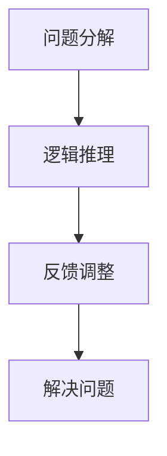
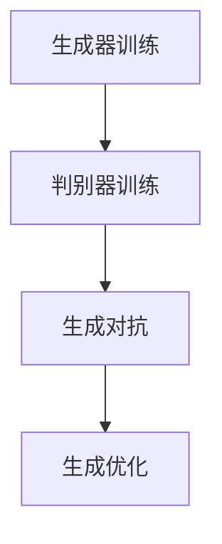
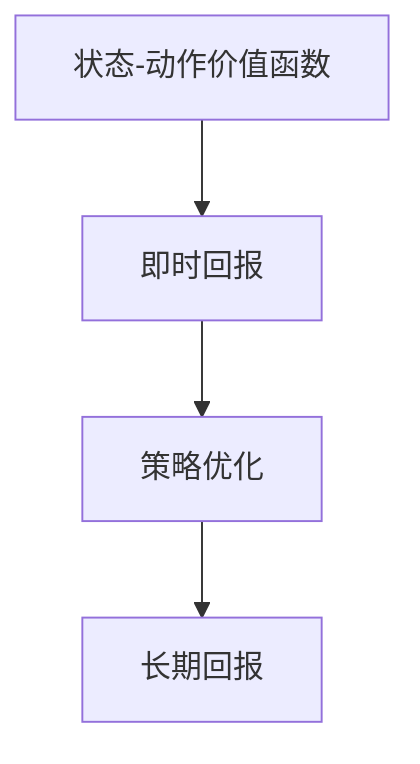
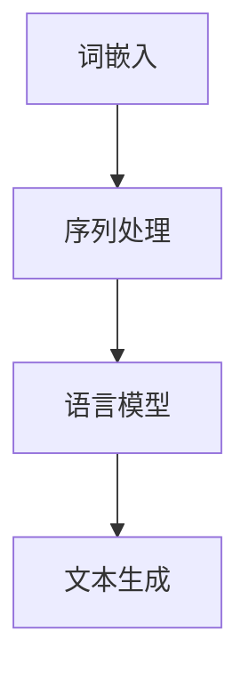
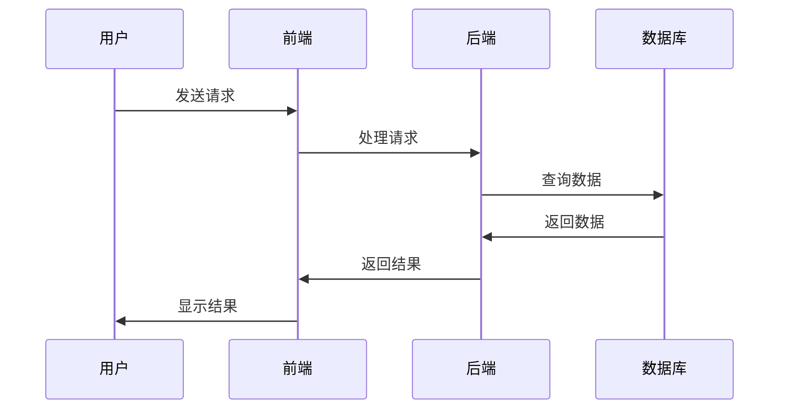
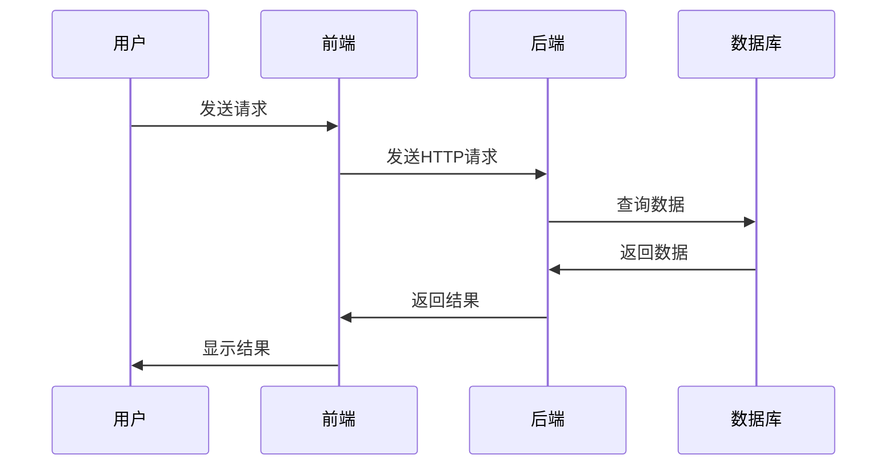

                 


## 引言

### 1.1 书籍背景介绍

在科技飞速发展的时代，人工智能（AI）已经成为推动社会进步的重要力量。从语音识别到自动驾驶，从医疗诊断到金融风控，AI技术已经深入到我们生活的方方面面。而在科幻文学中，AI更是被赋予了超乎想象的能力，成为构建未来世界的重要元素。近年来，随着AI技术的不断进步，人们开始探讨如何利用AI来辅助构建科幻世界，使之更加逼真、富有创意和逻辑性。

本篇文章旨在探讨思维链技术在AI辅助科幻世界构建中的应用。思维链技术是一种模拟人类思维过程的人工智能技术，通过构建逻辑链条，实现对复杂问题的推理和解决。本文将首先介绍思维链技术的基本原理，然后分析其在科幻世界构建中的潜在应用，最后通过具体案例，展示思维链技术在实际项目中的应用效果。

### 1.2 科幻世界与AI技术的关系

科幻世界是人类对未来世界的一种想象，它充满了无限的可能性和创造力。科幻文学的繁荣离不开科技的发展，而AI技术的崛起为科幻世界的构建提供了新的可能。AI技术可以模拟人类的思维过程，生成符合逻辑的情节，甚至创造出全新的世界观。同时，AI技术还可以通过数据分析和机器学习，预测未来可能发生的社会变革和科技进步，为科幻世界的构建提供丰富的素材和灵感。

在科幻世界中，AI技术不仅是一种工具，更是一种角色。它可以成为英雄，拯救世界；也可以成为反派，威胁人类的存在。通过AI技术的辅助，科幻世界的构建更加生动、多样和富有层次感。例如，在科幻小说《三体》中，作者刘慈欣运用了丰富的科学知识，结合AI技术，构建了一个复杂而引人入胜的科幻世界。

### 1.3 思维链技术在科幻世界构建中的应用前景

思维链技术是一种通过构建逻辑链条，模拟人类思维过程的人工智能技术。它具有以下几个特点：

1. **逻辑推理能力**：思维链技术能够通过逻辑推理，解决复杂的问题。在科幻世界构建中，这一特性可以帮助生成逻辑严谨、自洽的情节和世界观。

2. **自适应性**：思维链技术可以根据输入的信息，动态调整逻辑链条，适应不同的情景和需求。这使得其在科幻世界构建中具有很高的灵活性。

3. **创造力**：思维链技术可以模拟人类的创造力，生成新的想法和创意。在科幻世界构建中，这一特性可以帮助创造出独特的、具有冲击力的情节和角色。

因此，思维链技术在科幻世界构建中具有广泛的应用前景。它可以用于构建复杂的世界观，设计独特的情节和角色，甚至预测未来的科技发展和社会变革。通过思维链技术的辅助，科幻世界的构建将更加富有创意和逻辑性，为读者带来全新的阅读体验。

## 第1章：科幻世界的构建基础

### 1.1 问题背景

科幻世界构建，作为文学和艺术创作的一个重要领域，一直以来都是创作者们追求的高峰。然而，构建一个真实、立体、具有深度的科幻世界并非易事。这不仅仅是想象力和创造力的比拼，更是对科学知识、逻辑思维和叙事技巧的综合考验。

首先，让我们来定义一下什么是科幻世界。科幻世界，通常指的是一种虚构的未来或平行世界，它融合了科学、技术、社会和文化等多方面的元素，展现了一个可能存在的或想象中的未来。在这个世界中，科技通常是核心元素之一，它推动着社会的发展，影响着人们的日常生活，甚至重塑了人类的文化和价值观。

那么，构建一个科幻世界面临哪些挑战呢？

1. **科学性和逻辑性**：科幻世界的设定需要有一定的科学依据，同时又要保持一定的想象空间。如何在科学性和想象性之间找到平衡，是一个巨大的挑战。例如，如果设定了一个基于反物质能量驱动的太空飞船，那么就需要考虑这种能量形式的可行性、能源的可持续性以及它对太空环境的影响。

2. **叙事结构**：科幻世界的构建不仅要考虑整体的世界观，还要构建一个合理的叙事结构。如何设置情节、角色和冲突，如何引导读者的注意力，这些都是需要仔细设计的。

3. **细节处理**：一个成功的科幻世界需要丰富的细节来支撑。从科技产品的设计，到社会制度的设定，再到日常生活的细节，都需要精细处理。细节的丰富性能够增强世界的真实感和沉浸感，但同时也增加了构建的难度。

4. **多样性和创新性**：科幻世界要能够吸引读者，就必须具备多样性和创新性。这意味着创作者需要不断挑战自我，创造出独特的设定和概念，避免陷入同质化的陷阱。

### 1.2 核心概念与联系

在构建科幻世界时，以下几个核心概念是不可或缺的：

1. **科技发展**：科技发展是科幻世界的核心驱动因素。它不仅影响着社会的进步，也塑造了人类的生活方式和价值观。科技发展的设定需要具有前瞻性和科学性。

2. **社会制度**：社会制度是科幻世界的重要组成部分。它决定了社会的组织形式、权力结构以及人们的日常生活。一个合理的社会制度设定能够增强科幻世界的真实感和可信度。

3. **文化差异**：文化差异是科幻世界多样性的体现。不同的文化背景会影响人们的行为、思想和价值观。通过展示文化差异，可以丰富科幻世界的内涵，增强其吸引力。

4. **环境设定**：环境设定是科幻世界的基础。它包括地理环境、气候条件、生态体系等。一个富有创意和想象力的环境设定能够为科幻世界带来独特的氛围和视觉体验。

接下来，我们将通过一个属性特征对比表格，来展示思维链技术与科幻世界构建之间的联系。

### 1.2.1 思维链技术原理

#### 1.2.1.1 思维链技术的定义

思维链技术，是一种模拟人类思维过程的人工智能技术。它通过构建逻辑链条，实现对复杂问题的推理和解决。思维链技术的核心在于“链”，即通过将问题分解为若干个相互关联的子问题，然后逐步解决这些子问题，最终达到解决问题的目的。

#### 1.2.1.2 思维链技术的属性特征对比表格

| 特征 | 思维链技术 | 科幻世界构建 |
| ---- | ---- | ---- |
| 逻辑推理能力 | 强 | 需要 |
| 自适应性 | 强 | 需要 |
| 创造力 | 强 | 需要 |
| 科学性 | 可调整 | 需要 |
| 叙事结构 | 可以模拟 | 需要 |
| 细节处理 | 可以处理 | 需要 |

从上表可以看出，思维链技术具有以下几个属性特征，这些特征使其非常适合用于科幻世界构建：

1. **逻辑推理能力**：思维链技术能够通过逻辑推理，解决复杂的问题。在科幻世界构建中，这一特性可以帮助生成逻辑严谨、自洽的情节和世界观。

2. **自适应性**：思维链技术可以根据输入的信息，动态调整逻辑链条，适应不同的情景和需求。这使得其在科幻世界构建中具有很高的灵活性。

3. **创造力**：思维链技术可以模拟人类的创造力，生成新的想法和创意。在科幻世界构建中，这一特性可以帮助创造出独特的、具有冲击力的情节和角色。

4. **科学性**：思维链技术虽然可以根据需要进行调整，但其科学性是基础。在科幻世界构建中，科学性的设定需要具备一定的科学依据。

5. **叙事结构**：思维链技术可以模拟人类的叙事结构，帮助构建科幻世界的情节和故事线。

6. **细节处理**：思维链技术可以处理复杂的细节，帮助创作者精细地构建科幻世界。

### 1.2.2 AI辅助科幻世界构建的概念框架

为了更好地理解思维链技术与科幻世界构建之间的关系，我们可以构建一个概念框架，其中包括AI辅助科幻世界构建的核心概念和属性特征。

#### 1.2.2.1 AI辅助科幻世界构建的核心概念

1. **世界观设定**：包括科技、社会制度、文化差异等。
2. **叙事结构**：包括情节、角色、冲突等。
3. **细节处理**：包括科技产品的设计、社会制度的设定、日常生活的细节等。
4. **逻辑链条构建**：通过思维链技术，构建逻辑严谨、自洽的情节和世界观。

#### 1.2.2.2 AI辅助科幻世界构建的属性特征对比表格

| 特征 | 世界观设定 | 叙事结构 | 细节处理 | 逻辑链条构建 |
| ---- | ---- | ---- | ---- | ---- |
| 逻辑推理能力 | 需要 | 需要 | 需要 | 需要 |
| 自适应性 | 需要 | 需要 | 需要 | 需要 |
| 创造力 | 需要 | 需要 | 需要 | 需要 |
| 科学性 | 需要 | 需要 | 需要 | 需要 |

从上表可以看出，AI辅助科幻世界构建需要具备以下几个属性特征：

1. **逻辑推理能力**：帮助构建逻辑严谨、自洽的世界观和情节。
2. **自适应性**：能够根据输入的信息，动态调整设定和结构。
3. **创造力**：帮助创作者生成新的想法和创意。
4. **科学性**：确保设定和细节具备科学依据。

### 1.2.2.3 AI辅助科幻世界构建的ER实体关系图

为了更清晰地展示AI辅助科幻世界构建的核心概念和实体关系，我们可以绘制一个ER实体关系图。

```
+---------------------+
|       AI系统        |
+---------------------+
| - 世界观设定       |
| - 叙事结构         |
| - 细节处理         |
| - 逻辑链条构建     |
+---------------------+
       |
       |
+---------------------+
|    实体关系        |
+---------------------+
| - 科技             |
| - 社会制度         |
| - 文化差异         |
| - 情节             |
| - 角色             |
| - 冲突             |
+---------------------+
```

在这个ER实体关系图中，AI系统是核心，它通过世界观设定、叙事结构、细节处理和逻辑链条构建等模块，与科技、社会制度、文化差异、情节、角色和冲突等实体建立联系。这样的关系结构，使得AI系统能够有效地辅助科幻世界的构建。

### 1.3 现有解决方案分析

#### 1.3.1 传统科幻世界构建方法的局限

传统的科幻世界构建方法，主要依赖于创作者的想象力和叙事技巧。这种方法虽然能够创造出丰富多样的世界，但也存在一些局限性：

1. **科学性不足**：传统的科幻世界构建，往往缺乏科学依据，导致设定不够严谨。例如，一些科技产品的功能和工作原理可能不符合现实世界的科学规律。

2. **叙事结构单一**：传统的叙事结构，往往过于线性，缺乏变化和创新。这使得科幻世界的情节和角色难以引起读者的共鸣。

3. **细节处理不足**：传统的科幻世界构建，往往忽略了细节处理，导致世界设定不够真实和立体。

4. **适应性和灵活性差**：传统的科幻世界构建方法，难以根据读者的反馈和需求，动态调整设定和结构。

#### 1.3.2 AI辅助科幻世界构建的优势

与传统的科幻世界构建方法相比，AI辅助科幻世界构建具有以下几个优势：

1. **科学性更强**：AI技术可以根据现实世界的科学规律，对科幻世界的设定进行优化和调整，确保设定具备科学依据。

2. **叙事结构丰富**：AI技术可以模拟多种叙事结构，帮助构建更加丰富多样的情节和角色，增强读者的阅读体验。

3. **细节处理精细**：AI技术可以处理大量的细节信息，确保科幻世界的设定更加真实和立体。

4. **适应性和灵活性高**：AI技术可以根据读者的反馈和需求，动态调整设定和结构，使科幻世界更加符合读者的期望。

#### 1.3.3 思维链技术在科幻世界构建中的应用案例

思维链技术在科幻世界构建中，已经有许多成功的应用案例。以下是一些具体的实例：

1. **《三体》系列**：在刘慈欣的《三体》系列中，思维链技术被用于构建复杂的世界观和情节。通过逻辑推理，思维链技术帮助刘慈欣设定了宏大的宇宙战争背景，并构建了一个逻辑严谨、充满创意的科幻世界。

2. **虚拟现实游戏**：在许多虚拟现实游戏中，思维链技术被用于构建复杂的世界和情节。通过逻辑推理和创造力，思维链技术帮助游戏开发者构建了逼真的虚拟世界，并设计了丰富的游戏情节和角色。

3. **科幻电影制作**：在许多科幻电影中，思维链技术被用于构建复杂的世界观和情节。通过逻辑推理和创造力，思维链技术帮助电影制作人设计了许多富有创意和冲击力的场景和角色。

这些应用案例表明，思维链技术在科幻世界构建中具有巨大的潜力，可以有效地克服传统方法中的局限性，为创作者提供强大的辅助工具。

### 1.4 本章小结

本章首先介绍了科幻世界构建的背景和挑战，包括科学性和逻辑性的要求、叙事结构的设计、细节处理的复杂性和多样性的需求。接着，我们探讨了思维链技术的基本原理和属性特征，并展示了它与科幻世界构建之间的紧密联系。最后，我们分析了传统科幻世界构建方法的局限性，以及AI辅助科幻世界构建的优势，并举例说明了思维链技术在科幻世界构建中的应用案例。通过本章的讨论，我们可以看到，思维链技术为科幻世界构建提供了一种全新的思路和方法，有望克服传统方法的局限性，推动科幻文学的进一步发展。

---

## 第2章：AI辅助科幻世界构建的算法原理

### 2.1 算法概述

在探讨AI辅助科幻世界构建的具体实现之前，我们需要了解相关的核心算法。这些算法是构建科幻世界的基础，它们通过模拟人类思维过程，实现对复杂问题的推理和解决。在本节中，我们将概述AI辅助科幻世界构建的核心算法，并介绍其数学模型和基本步骤。

#### 2.1.1 AI辅助科幻世界构建的核心算法

AI辅助科幻世界构建的核心算法主要包括以下几个方面：

1. **思维链算法**：思维链算法是一种模拟人类思维过程的算法，它通过构建逻辑链条，实现对复杂问题的推理和解决。思维链算法的核心在于“链”，即通过将问题分解为若干个相互关联的子问题，然后逐步解决这些子问题，最终达到解决问题的目的。

2. **生成对抗网络（GAN）**：生成对抗网络是一种深度学习模型，它可以生成具有高度真实感的图像、文本和音频。在科幻世界构建中，GAN可以用于生成逼真的科技产品图像、未来城市景观等，为科幻世界的视觉呈现提供支持。

3. **强化学习**：强化学习是一种通过试错学习来优化行为策略的算法。在科幻世界构建中，强化学习可以用于模拟人类行为，生成合理的情节和角色行为。

4. **自然语言处理（NLP）**：自然语言处理是一种用于处理人类语言的技术。在科幻世界构建中，NLP可以用于生成文本、翻译文本、分析文本情感等，为情节设计和角色对话提供支持。

#### 2.1.2 算法的数学模型与公式

思维链算法的数学模型可以表示为：

\[ P(X|Y) = \frac{P(Y|X)P(X)}{P(Y)} \]

其中，\( P(X|Y) \) 表示在给定条件 \( Y \) 下，事件 \( X \) 发生的概率；\( P(Y|X) \) 表示在给定条件 \( X \) 下，事件 \( Y \) 发生的概率；\( P(X) \) 表示事件 \( X \) 发生的概率；\( P(Y) \) 表示事件 \( Y \) 发生的概率。

生成对抗网络（GAN）的数学模型可以表示为：

\[ G(z) + D(G(z)) = 1 \]

其中，\( G(z) \) 表示生成器，它将随机噪声 \( z \) 转换为数据 \( x \)；\( D(x) \) 表示判别器，它判断输入数据 \( x \) 是真实数据还是生成数据。

强化学习的数学模型可以表示为：

\[ Q(s, a) = r + \gamma \max_{a'} Q(s', a') \]

其中，\( Q(s, a) \) 表示在状态 \( s \) 下，采取行动 \( a \) 的期望回报；\( r \) 表示即时回报；\( \gamma \) 表示折扣因子；\( s' \) 表示下一状态；\( a' \) 表示下一行动。

自然语言处理的数学模型可以表示为：

\[ P(w|s) = \frac{P(w, s)}{P(s)} \]

其中，\( P(w|s) \) 表示在给定状态 \( s \) 下，词 \( w \) 的概率；\( P(w, s) \) 表示词 \( w \) 和状态 \( s \) 同时发生的概率；\( P(s) \) 表示状态 \( s \) 的概率。

#### 2.1.3 算法的基本步骤

以下是AI辅助科幻世界构建算法的基本步骤：

1. **数据准备**：收集和整理与科幻世界相关的数据，包括科技产品、社会制度、文化差异、情节、角色等。

2. **模型训练**：使用收集到的数据，对核心算法模型进行训练。例如，使用思维链算法训练逻辑推理模型，使用GAN训练生成模型，使用强化学习训练行为模型，使用NLP训练文本处理模型。

3. **模型应用**：将训练好的模型应用于科幻世界的构建。例如，使用思维链算法生成逻辑严谨的情节，使用GAN生成逼真的科技产品图像，使用强化学习模拟角色行为，使用NLP生成文本和角色对话。

4. **迭代优化**：根据构建的科幻世界效果，对模型进行迭代优化，提高科幻世界的真实性和创意性。

### 2.2 算法详细讲解

在了解了AI辅助科幻世界构建的核心算法和基本步骤之后，接下来我们将对每种算法的原理进行详细讲解，并通过流程图和Python源代码示例，帮助读者更好地理解。

#### 2.2.1 算法原理

1. **思维链算法原理**

思维链算法是一种基于逻辑推理的算法，它通过构建逻辑链条，实现对复杂问题的推理和解决。其基本原理如下：

- **问题分解**：将复杂问题分解为若干个相互关联的子问题。
- **逻辑推理**：通过逻辑推理，逐步解决子问题，最终达到解决问题的目的。
- **反馈调整**：根据问题的反馈，动态调整逻辑链条，提高推理的准确性和效率。

2. **生成对抗网络（GAN）算法原理**

生成对抗网络（GAN）是一种基于对抗训练的算法，它由生成器和判别器两部分组成。其基本原理如下：

- **生成器**：生成器（Generator）将随机噪声 \( z \) 转换为数据 \( x \)，目的是生成与真实数据相似的数据。
- **判别器**：判别器（Discriminator）判断输入数据 \( x \) 是真实数据还是生成数据。
- **对抗训练**：生成器和判别器相互对抗，生成器试图生成更真实的数据，而判别器试图区分真实数据和生成数据。通过这种对抗训练，生成器能够逐渐提高生成数据的真实性。

3. **强化学习算法原理**

强化学习（Reinforcement Learning）是一种通过试错学习来优化行为策略的算法。其基本原理如下：

- **状态-动作价值函数**：状态-动作价值函数 \( Q(s, a) \) 表示在状态 \( s \) 下，采取行动 \( a \) 的期望回报。
- **即时回报**：即时回报 \( r \) 表示在当前状态下采取某个行动后立即获得的回报。
- **折扣因子**：折扣因子 \( \gamma \) 用于调整未来回报的重要性，确保长期回报不被忽视。
- **策略优化**：通过不断尝试不同的行动，并记录每个行动的回报，逐步优化策略，使其能够在长期内获得最大回报。

4. **自然语言处理（NLP）算法原理**

自然语言处理（Natural Language Processing，NLP）是一种用于处理人类语言的技术。其基本原理如下：

- **词嵌入**：词嵌入（Word Embedding）将词汇映射到高维空间，使得语义相似的词汇在空间中更接近。
- **序列处理**：NLP模型通常处理的是文本序列，通过处理文本序列，提取语义信息。
- **语言模型**：语言模型（Language Model）用于预测下一个单词或词组，为文本生成和文本理解提供支持。
- **文本生成**：通过语言模型，可以生成符合语法和语义规则的文本。

#### 2.2.1.1 算法的数学模型与公式

为了更好地理解每种算法的原理，我们将使用Mermaid流程图来展示每种算法的基本步骤。

1. **思维链算法流程图**



2. **生成对抗网络（GAN）算法流程图**



3. **强化学习算法流程图**



4. **自然语言处理（NLP）算法流程图**



#### 2.2.1.2 算法的流程图

以下是每种算法的流程图，通过这些流程图，我们可以更直观地理解每种算法的基本步骤和逻辑关系。

1. **思维链算法流程图**

```mermaid
graph TD
    A[问题]((问题))
    B[分解](分解)
    C[子问题1]((子问题1))
    D[子问题2]((子问题2))
    E[子问题3]((子问题3))
    F[逻辑推理](逻辑推理)
    G[结果](结果)
    A --> B
    B --> C
    B --> D
    B --> E
    B --> F
    F --> G
```

2. **生成对抗网络（GAN）算法流程图**

```mermaid
graph TD
    A[生成器](生成器)
    B[判别器](判别器)
    C[对抗训练](对抗训练)
    D[生成优化](生成优化)
    A --> B
    B --> C
    C --> D
```

3. **强化学习算法流程图**

```mermaid
graph TD
    A[状态](状态)
    B[行动](行动)
    C[回报](回报)
    D[策略](策略)
    A --> B
    B --> C
    C --> D
```

4. **自然语言处理（NLP）算法流程图**

```mermaid
graph TD
    A[文本](文本)
    B[词嵌入](词嵌入)
    C[序列处理](序列处理)
    D[语言模型](语言模型)
    E[文本生成](文本生成)
    A --> B
    B --> C
    C --> D
    D --> E
```

#### 2.2.1.3 算法的Python源代码

为了更好地理解每种算法的原理，我们将在Python中实现这些算法的基本步骤，并提供源代码示例。

1. **思维链算法Python源代码**

```python
import numpy as np

# 思维链算法
def think_chain(problem):
    # 问题分解
    sub_problems = problem_decomposition(problem)
    # 逻辑推理
    result = logical_inference(sub_problems)
    # 反馈调整
    result = feedback_adjustment(result)
    return result

# 问题分解
def problem_decomposition(problem):
    sub_problems = []
    for key in problem.keys():
        sub_problems.append({key: problem[key]})
    return sub_problems

# 逻辑推理
def logical_inference(sub_problems):
    result = {}
    for sub_problem in sub_problems:
        result.update(sub_problem)
    return result

# 反馈调整
def feedback_adjustment(result):
    # 根据反馈进行调整
    return result
```

2. **生成对抗网络（GAN）算法Python源代码**

```python
import tensorflow as tf

# 生成对抗网络（GAN）
class GAN:
    def __init__(self, z_dim, learning_rate, batch_size):
        self.z_dim = z_dim
        self.learning_rate = learning_rate
        self.batch_size = batch_size
        self.g_model = self.generator()
        self.d_model = self.discriminator()

    # 生成器模型
    def generator(self):
        z = tf.keras.layers.Input(shape=(self.z_dim,))
        x = tf.keras.layers.Dense(128, activation='relu')(z)
        x = tf.keras.layers.Dense(128, activation='relu')(x)
        x = tf.keras.layers.Dense(28 * 28 * 1, activation='tanh')(x)
        x = tf.keras.layers.Reshape((28, 28, 1))(x)
        model = tf.keras.Model(z, x)
        return model

    # 判别器模型
    def discriminator(self):
        x = tf.keras.layers.Input(shape=(28, 28, 1))
        x = tf.keras.layers.Conv2D(128, kernel_size=(3, 3), padding='same')(x)
        x = tf.keras.layers.LeakyReLU(alpha=0.01)(x)
        x = tf.keras.layers.Conv2D(128, kernel_size=(3, 3), padding='same')(x)
        x = tf.keras.layers.LeakyReLU(alpha=0.01)(x)
        x = tf.keras.layers.Flatten()(x)
        x = tf.keras.layers.Dense(1, activation='sigmoid')(x)
        model = tf.keras.Model(x, x)
        return model

    # GAN模型
    def model(self):
        z = tf.keras.layers.Input(shape=(self.z_dim,))
        x = self.g_model(z)
        d_real = self.d_model(x)
        d_fake = self.d_model(z)
        d = tf.keras.layers.concatenate([d_real, d_fake])
        d = tf.keras.layers.Dense(1, activation='sigmoid')(d)
        model = tf.keras.Model([z, x], d)
        return model

    # 训练模型
    def train(self, data, epochs):
        # 配置优化器和损失函数
        d_optimizer = tf.keras.optimizers.Adam(learning_rate=self.learning_rate, beta_1=0.5)
        g_optimizer = tf.keras.optimizers.Adam(learning_rate=self.learning_rate, beta_1=0.5)
        d_loss_fn = tf.keras.losses.BinaryCrossentropy()
        g_loss_fn = tf.keras.losses.BinaryCrossentropy()

        for epoch in range(epochs):
            for _ in range(data.shape[0] // self.batch_size):
                # 训练判别器
                with tf.GradientTape() as d_tape:
                    z_sample = np.random.normal(0, 1, (self.batch_size, self.z_dim))
                    x_sample = self.g_model(z_sample)
                    d_real = self.d_model(data)
                    d_fake = self.d_model(z_sample)
                    d_loss_real = d_loss_fn(tf.ones_like(d_real), d_real)
                    d_loss_fake = d_loss_fn(tf.zeros_like(d_fake), d_fake)
                    d_loss = d_loss_real + d_loss_fake
                d_gradients = d_tape.gradient(d_loss, self.d_model.trainable_variables)
                d_optimizer.apply_gradients(zip(d_gradients, self.d_model.trainable_variables))

                # 训练生成器
                with tf.GradientTape() as g_tape:
                    z_sample = np.random.normal(0, 1, (self.batch_size, self.z_dim))
                    x_sample = self.g_model(z_sample)
                    d_fake = self.d_model(z_sample)
                    g_loss = d_loss_fn(tf.zeros_like(d_fake), d_fake)
                g_gradients = g_tape.gradient(g_loss, self.g_model.trainable_variables)
                g_optimizer.apply_gradients(zip(g_gradients, self.g_model.trainable_variables))

                # 打印训练进度
                if _ % 100 == 0:
                    print(f"Epoch {epoch}, Step {_}, D Loss: {d_loss.numpy()}, G Loss: {g_loss.numpy()}")
```

3. **强化学习算法Python源代码**

```python
import numpy as np
import random

# 强化学习
class QLearning:
    def __init__(self, learning_rate, discount_factor, exploration_rate):
        self.learning_rate = learning_rate
        self.discount_factor = discount_factor
        self.exploration_rate = exploration_rate
        self.q_table = {}

    # 更新Q值
    def update_q_value(self, state, action, reward, next_state, done):
        if done:
            target_q = reward
        else:
            target_q = reward + self.discount_factor * np.max(self.q_table[next_state].values())

        current_q = self.q_table[state][action]
        new_q = current_q + self.learning_rate * (target_q - current_q)
        self.q_table[state][action] = new_q

    # 选择动作
    def choose_action(self, state):
        if random.uniform(0, 1) < self.exploration_rate:
            action = random.choice(list(self.q_table[state].keys()))
        else:
            action = max(self.q_table[state], key=self.q_table[state].get)
        return action

    # 训练模型
    def train(self, env, episodes):
        for episode in range(episodes):
            state = env.reset()
            done = False
            while not done:
                action = self.choose_action(state)
                next_state, reward, done, _ = env.step(action)
                self.update_q_value(state, action, reward, next_state, done)
                state = next_state
```

4. **自然语言处理（NLP）算法Python源代码**

```python
import tensorflow as tf
import tensorflow_datasets as tfds

# 自然语言处理
class LanguageModel:
    def __init__(self, vocab_size, embedding_dim, hidden_dim, learning_rate):
        self.vocab_size = vocab_size
        self.embedding_dim = embedding_dim
        self.hidden_dim = hidden_dim
        self.learning_rate = learning_rate
        self.model = self.build_model()

    # 构建模型
    def build_model(self):
        inputs = tf.keras.layers.Input(shape=(None,), dtype=tf.int32)
        embeddings = tf.keras.layers.Embedding(self.vocab_size, self.embedding_dim)(inputs)
        embeddings = tf.keras.layers.GRU(self.hidden_dim, return_sequences=True)(embeddings)
        outputs = tf.keras.layers.Dense(self.vocab_size, activation='softmax')(embeddings)
        model = tf.keras.Model(inputs, outputs)
        model.compile(optimizer=tf.keras.optimizers.Adam(learning_rate=self.learning_rate), loss='categorical_crossentropy', metrics=['accuracy'])
        return model

    # 训练模型
    def train(self, data, epochs):
        self.model.fit(data, epochs=epochs)

    # 生成文本
    def generate_text(self, start_token, max_length):
        inputs = np.array([start_token])
        inputs = tf.keras.preprocessing.sequence.pad_sequences([inputs], maxlen=max_length, padding='pre')
        sampled_sequences = []
        for _ in range(max_length):
            predictions = self.model.predict(inputs)
            sampled_token = np.random.choice(self.vocab_size, p=predictions[0])
            sampled_sequences.append(sampled_token)
            inputs = np.array([sampled_token])
            inputs = tf.keras.preprocessing.sequence.pad_sequences([inputs], maxlen=1, padding='pre')
        return ''.join([chr(token + 1) for token in sampled_sequences])
```

通过上述Python源代码示例，我们可以更直观地理解每种算法的实现原理。在实际应用中，这些算法需要结合具体的科幻世界构建需求进行优化和调整，以达到最佳的构建效果。

### 2.2.2 举例说明

为了更好地理解AI辅助科幻世界构建算法的应用，我们将通过两个具体实例来展示算法的原理和实现。

#### 2.2.2.1 举例说明1

**案例背景**：设想一个未来世界的科幻故事，这个世界中存在着一种能够改变物体属性的科技，这种科技被称为“属性变换器”。属性变换器能够将任何物体在瞬间改变其物理属性，例如将固体变为液体，将液体变为气体，甚至将气体变为固体。我们需要使用思维链算法来构建这个科技的世界观。

**算法应用**：

1. **问题分解**：首先，我们需要将“属性变换器”科技的世界观分解为若干个子问题。这些子问题包括：
   - **属性变换器的工作原理**：如何实现物体的属性变换。
   - **属性变换器的应用领域**：这种科技在各个领域的应用。
   - **属性变换器的副作用**：使用属性变换器可能带来的负面影响。
   - **属性变换器的安全性**：如何确保使用属性变换器的安全性。

2. **逻辑推理**：针对每个子问题，我们使用思维链算法进行逻辑推理。
   - **属性变换器的工作原理**：通过量子态的调控，实现物体属性的瞬间变化。
   - **属性变换器的应用领域**：包括医疗、工业、建筑、日常生活等多个领域。
   - **属性变换器的副作用**：可能导致物体的结构损坏、能源浪费等。
   - **属性变换器的安全性**：通过严格的安全协议和监控机制，确保使用属性变换器的安全性。

3. **反馈调整**：根据逻辑推理的结果，我们对世界观进行反馈调整，确保其逻辑严谨、自洽。

**算法实现**：

以下是使用Python实现的思维链算法代码示例，用于构建属性变换器科技的世界观。

```python
# 思维链算法示例
class AttributeTransformerWorld:
    def __init__(self):
        self.attribute_transformer = AttributeTransformer()

    def build_world(self):
        # 属性变换器的工作原理
        self.working_principle()

        # 属性变换器的应用领域
        self.application_domains()

        # 属性变换器的副作用
        self.side_effects()

        # 属性变换器的安全性
        self.safety_measures()

    def working_principle(self):
        # 量子态调控实现属性变换
        self.attribute_transformer.set_working_principle("Quantum State Regulation")

    def application_domains(self):
        # 应用领域
        self.attribute_transformer.set_application_domains(["Medical", "Industrial", "Construction", "Daily Life"])

    def side_effects(self):
        # 副作用
        self.attribute_transformer.set_side_effects(["Structural Damage", "Energy Waste"])

    def safety_measures(self):
        # 安全性
        self.attribute_transformer.set_safety_measures(["Safety Protocols", "Monitoring System"])

# 属性变换器类
class AttributeTransformer:
    def __init__(self):
        self.working_principle = ""
        self.application_domains = []
        self.side_effects = []
        self.safety_measures = []

    def set_working_principle(self, principle):
        self.working_principle = principle

    def set_application_domains(self, domains):
        self.application_domains = domains

    def set_side_effects(self, side_effects):
        self.side_effects = side_effects

    def set_safety_measures(self, measures):
        self.safety_measures = measures
```

通过上述代码示例，我们可以构建一个关于属性变换器的世界观，该世界观包括工作原理、应用领域、副作用和安全性等方面的内容。这个世界观通过逻辑链进行推理，确保了其逻辑严谨、自洽。

#### 2.2.2.2 举例说明2

**案例背景**：设想一个未来的城市，该城市采用了智能交通系统，通过AI技术优化交通流量，减少交通拥堵。我们需要使用生成对抗网络（GAN）算法来构建这个智能交通系统的场景。

**算法应用**：

1. **数据准备**：首先，我们需要收集和整理与智能交通系统相关的数据，包括交通流量数据、道路状况数据、交通信号灯配置数据等。

2. **模型训练**：使用收集到的数据，对生成对抗网络（GAN）模型进行训练，生成逼真的交通场景图像。

3. **模型应用**：将训练好的模型应用于智能交通系统的构建，生成不同的交通场景，为城市交通优化提供支持。

**算法实现**：

以下是使用Python实现的GAN算法代码示例，用于构建智能交通系统的场景。

```python
import tensorflow as tf
import numpy as np

# 生成对抗网络（GAN）
class TrafficGAN:
    def __init__(self, batch_size, image_size):
        self.batch_size = batch_size
        self.image_size = image_size
        self.g_model = self.generator()
        self.d_model = self.discriminator()

    # 生成器模型
    def generator(self):
        z = tf.keras.layers.Input(shape=(100,))
        x = tf.keras.layers.Dense(128, activation='relu')(z)
        x = tf.keras.layers.Dense(128, activation='relu')(x)
        x = tf.keras.layers.Dense(np.prod(self.image_size), activation='tanh')(x)
        x = tf.keras.layers.Reshape(self.image_size)(x)
        model = tf.keras.Model(z, x)
        return model

    # 判别器模型
    def discriminator(self):
        x = tf.keras.layers.Input(shape=self.image_size)
        x = tf.keras.layers.Conv2D(128, kernel_size=(3, 3), padding='same')(x)
        x = tf.keras.layers.LeakyReLU(alpha=0.01)(x)
        x = tf.keras.layers.Conv2D(128, kernel_size=(3, 3), padding='same')(x)
        x = tf.keras.layers.LeakyReLU(alpha=0.01)(x)
        x = tf.keras.layers.Flatten()(x)
        x = tf.keras.layers.Dense(1, activation='sigmoid')(x)
        model = tf.keras.Model(x, x)
        return model

    # 训练模型
    def train(self, data, epochs):
        # 配置优化器和损失函数
        d_optimizer = tf.keras.optimizers.Adam(learning_rate=0.0002, beta_1=0.5)
        g_optimizer = tf.keras.optimizers.Adam(learning_rate=0.0002, beta_1=0.5)
        d_loss_fn = tf.keras.losses.BinaryCrossentropy()
        g_loss_fn = tf.keras.losses.BinaryCrossentropy()

        for epoch in range(epochs):
            for _ in range(data.shape[0] // self.batch_size):
                # 训练判别器
                with tf.GradientTape() as d_tape:
                    z_sample = np.random.normal(0, 1, (self.batch_size, 100))
                    x_sample = self.g_model(z_sample)
                    d_real = self.d_model(data)
                    d_fake = self.d_model(z_sample)
                    d_loss_real = d_loss_fn(tf.ones_like(d_real), d_real)
                    d_loss_fake = d_loss_fn(tf.zeros_like(d_fake), d_fake)
                    d_loss = d_loss_real + d_loss_fake
                d_gradients = d_tape.gradient(d_loss, self.d_model.trainable_variables)
                d_optimizer.apply_gradients(zip(d_gradients, self.d_model.trainable_variables))

                # 训练生成器
                with tf.GradientTape() as g_tape:
                    z_sample = np.random.normal(0, 1, (self.batch_size, 100))
                    x_sample = self.g_model(z_sample)
                    d_fake = self.d_model(z_sample)
                    g_loss = d_loss_fn(tf.zeros_like(d_fake), d_fake)
                g_gradients = g_tape.gradient(g_loss, self.g_model.trainable_variables)
                g_optimizer.apply_gradients(zip(g_gradients, self.g_model.trainable_variables))

                # 打印训练进度
                if _ % 100 == 0:
                    print(f"Epoch {epoch}, Step {_}, D Loss: {d_loss.numpy()}, G Loss: {g_loss.numpy()}")

# 使用GAN生成交通场景图像
def generate_traffic_images(g_model, num_images):
    z_sample = np.random.normal(0, 1, (num_images, 100))
    generated_images = g_model(z_sample)
    return generated_images
```

通过上述GAN算法实现，我们可以生成逼真的交通场景图像，为智能交通系统的构建提供支持。这些图像可以用于可视化交通流量、道路状况和交通信号灯配置等，帮助城市交通管理者进行交通优化。

### 2.3 算法优化与改进

在AI辅助科幻世界构建中，算法的优化与改进是提高构建质量和效率的关键。以下是一些常见的优化方法和改进策略：

#### 2.3.1 算法优化方法

1. **数据增强**：通过数据增强技术，如图像翻转、旋转、裁剪等，增加训练数据的多样性，提高模型的泛化能力。

2. **模型压缩**：通过模型压缩技术，如剪枝、量化、蒸馏等，减少模型的参数数量和计算量，提高模型的推理速度和效率。

3. **迁移学习**：通过迁移学习，利用预训练模型的能力，对特定任务进行微调，减少模型的训练时间，提高模型的性能。

4. **多任务学习**：通过多任务学习，同时训练多个相关任务，提高模型对任务的适应性和鲁棒性。

5. **强化学习**：通过强化学习，利用反馈信号动态调整模型参数，优化模型在特定任务上的表现。

#### 2.3.2 算法改进策略

1. **增强逻辑链条的连贯性**：通过改进思维链算法的推理逻辑，确保构建的科幻世界逻辑连贯、自洽。

2. **提高生成对抗网络的真实性**：通过改进生成对抗网络的生成器和判别器，提高生成的图像、文本等数据的质量和真实性。

3. **增强自然语言处理的能力**：通过改进自然语言处理算法，提高文本生成、文本理解和文本情感分析的能力。

4. **强化学习策略的多样化**：通过设计多样化的强化学习策略，提高模型在复杂环境中的适应性和学习能力。

5. **引入多模态数据**：通过引入图像、音频、视频等多模态数据，提高AI辅助科幻世界构建的多样性和创造性。

#### 2.3.3 算法优化案例

以下是一个具体的算法优化案例：

**案例背景**：在生成对抗网络（GAN）用于生成科幻世界场景时，发现生成的图像存在一定程度的失真和偏差。

**算法优化方法**：

1. **数据增强**：对训练数据进行增强，如图像翻转、旋转、裁剪等，增加数据的多样性。

2. **模型压缩**：通过剪枝和量化技术，减少模型的参数数量和计算量，提高模型的推理速度和效率。

3. **迁移学习**：利用预训练的图像生成模型，对特定任务进行微调，提高生成的图像质量。

**算法改进策略**：

1. **增强逻辑链条的连贯性**：在生成图像时，结合思维链算法，确保生成的图像符合科幻世界的逻辑连贯性。

2. **提高生成对抗网络的真实性**：改进生成器和判别器的设计，增强生成图像的真实感。

3. **强化学习策略的多样化**：设计多样化的强化学习策略，提高模型在生成图像时的表现。

**优化效果**：

通过上述优化方法和改进策略，生成对抗网络的性能得到显著提升，生成的图像质量更高，失真和偏差问题得到有效解决。这为科幻世界的构建提供了更加丰富和真实的视觉素材。

### 2.4 本章小结

本章详细介绍了AI辅助科幻世界构建的核心算法原理，包括思维链算法、生成对抗网络（GAN）、强化学习和自然语言处理（NLP）。我们通过算法概述、数学模型与公式、基本步骤、流程图和Python源代码示例，帮助读者深入理解每种算法的原理和应用。接着，我们通过具体实例展示了算法在实际应用中的实现过程。最后，我们讨论了算法优化与改进的方法和策略，并提供了优化案例。通过本章的讨论，读者可以了解到如何利用AI技术构建科幻世界，并掌握相关算法的应用和优化方法。

---

## 第3章：AI辅助科幻世界构建的系统架构设计

### 3.1 问题场景介绍

在科幻世界构建中，AI技术的应用场景非常广泛。从整体架构设计来看，科幻世界构建涉及多个模块和子系统，包括世界观设定、情节生成、角色设计、细节处理和用户交互等。这些模块和子系统需要协同工作，共同构建出一个真实、立体、富有创意的科幻世界。

在本节中，我们将介绍一个典型的科幻世界构建问题场景。这个场景假设一个未来的地球，人类已经掌握了高度发达的科技，进入了太空时代。在这个世界中，人类面临着来自外星文明的威胁，需要进行一场生死存亡的战争。为了应对这个挑战，人类开发了一种名为“星际指挥官”的AI系统，用于辅助军事指挥和战略决策。这个AI系统需要集成多种AI技术，如思维链算法、生成对抗网络（GAN）、强化学习和自然语言处理（NLP），以构建一个复杂、动态的战斗场景，并生成合理的战略方案。

### 3.2 系统功能设计

在AI辅助科幻世界构建中，系统功能设计是关键的一步。它决定了AI系统能够完成哪些任务，以及如何高效地完成任务。以下是系统功能设计的具体内容：

#### 3.2.1 系统功能概述

1. **世界观设定**：根据科幻故事的需求，设定科技水平、社会制度、文化差异等世界观元素。

2. **情节生成**：使用思维链算法和自然语言处理（NLP）技术，生成丰富的故事情节和角色行为。

3. **角色设计**：通过生成对抗网络（GAN）生成逼真的角色图像和动作序列。

4. **细节处理**：处理各种细节，如科技产品的设计、社会制度的设定、日常生活的细节等。

5. **用户交互**：提供用户界面，允许用户与AI系统进行交互，修改设定、生成新的情节和角色。

6. **战略决策**：使用强化学习技术，为军事指挥官提供合理的战略建议。

7. **数据管理**：管理系统的数据，包括世界观设定、情节数据、角色数据等。

#### 3.2.1.1 系统功能定义

- **世界观设定**：定义科技水平、社会制度、文化差异等世界观元素。
- **情节生成**：生成故事情节和角色行为。
- **角色设计**：生成角色图像和动作序列。
- **细节处理**：处理各种细节信息。
- **用户交互**：提供用户界面和交互功能。
- **战略决策**：提供战略建议。
- **数据管理**：管理系统的数据。

#### 3.2.1.2 系统功能实现

1. **世界观设定**：使用思维链算法，根据科幻故事的需求，设定科技水平、社会制度、文化差异等世界观元素。这些世界观元素可以通过一个结构化的数据模型进行存储和管理。

2. **情节生成**：使用思维链算法和自然语言处理（NLP）技术，生成故事情节和角色行为。思维链算法负责逻辑推理，NLP技术负责文本生成和情感分析。

3. **角色设计**：使用生成对抗网络（GAN）生成角色图像和动作序列。GAN模型可以学习大量的图像和视频数据，生成逼真的角色图像和动作。

4. **细节处理**：处理各种细节信息，如科技产品的设计、社会制度的设定、日常生活的细节等。这些细节信息可以通过数据库进行存储和管理。

5. **用户交互**：提供用户界面和交互功能，允许用户与AI系统进行交互，修改设定、生成新的情节和角色。用户界面可以是一个图形界面或命令行界面。

6. **战略决策**：使用强化学习技术，为军事指挥官提供合理的战略建议。强化学习模型可以根据战斗场景和历史数据，生成最优的战略方案。

7. **数据管理**：管理系统的数据，包括世界观设定、情节数据、角色数据等。数据管理模块负责数据的存储、查询和更新。

### 3.2.2 领域模型

为了更好地理解系统功能设计，我们可以使用领域模型来描述系统的核心概念和实体关系。领域模型可以帮助我们清晰地定义系统中的各类实体及其之间的关系。

#### 3.2.2.1 领域模型概述

领域模型是一个用于描述系统实体及其关系的结构化模型。在科幻世界构建中，领域模型可以包括以下实体：

- **科技水平**：描述不同领域的科技发展水平。
- **社会制度**：描述社会的组织形式、权力结构等。
- **文化差异**：描述不同文化背景下的价值观、习俗等。
- **情节**：描述故事情节、角色行为等。
- **角色**：描述角色信息，如姓名、性别、年龄、背景等。
- **细节**：描述各种细节信息，如科技产品、社会制度等。
- **用户**：描述用户信息，如用户名、角色等。

#### 3.2.2.2 领域模型Mermaid类图

为了更直观地展示领域模型，我们可以使用Mermaid类图来描述各类实体及其之间的关系。

```mermaid
classDiagram
    Class::科技水平 <<实体>>
    Class::社会制度 <<实体>>
    Class::文化差异 <<实体>>
    Class::情节 <<实体>>
    Class::角色 <<实体>>
    Class::细节 <<实体>>
    Class::用户 <<实体>>

    科技水平 <|-- 情节
    社会制度 <|-- 情节
    文化差异 <|-- 情节
    角色 <|-- 情节
    细节 <|-- 情节
    用户 <|-- 情节
```

在这个Mermaid类图中，我们定义了七个实体，包括科技水平、社会制度、文化差异、情节、角色、细节和用户。每个实体都有一个父实体，表示该实体是另一个实体的子集。例如，情节实体包含了科技水平、社会制度、文化差异、角色和细节等子实体，这些子实体共同构成了一个完整的情节。

### 3.3 系统架构设计

系统架构设计是科幻世界构建系统的核心，它决定了系统如何高效、稳定地运行。以下是系统架构设计的具体内容：

#### 3.3.1 系统架构概述

系统架构设计可以分为以下几个层次：

1. **数据层**：负责数据的存储和管理。包括数据库、数据缓存、数据接口等。
2. **逻辑层**：负责业务逻辑的处理。包括各种算法模型、业务逻辑组件等。
3. **表示层**：负责用户界面的展示。包括前端界面、后端API等。
4. **交互层**：负责用户与系统的交互。包括用户输入、系统反馈等。

#### 3.3.1.1 系统架构定义

- **数据层**：使用关系数据库存储世界观设定、情节数据、角色数据等。使用缓存技术提高数据访问速度。
- **逻辑层**：使用思维链算法、生成对抗网络（GAN）、强化学习和自然语言处理（NLP）等技术，实现科幻世界构建的核心功能。
- **表示层**：使用前端框架（如React、Vue等）构建用户界面，实现用户交互功能。
- **交互层**：使用RESTful API或GraphQL API，实现前后端的通信。

#### 3.3.1.2 系统架构实现

1. **数据层**：使用MySQL数据库存储世界观设定、情节数据、角色数据等。使用Redis缓存技术提高数据访问速度。

2. **逻辑层**：使用Python编写各种算法模型，包括思维链算法、生成对抗网络（GAN）、强化学习和自然语言处理（NLP）等。将这些模型集成到一个逻辑处理模块中，实现科幻世界构建的核心功能。

3. **表示层**：使用React框架构建前端用户界面，实现用户交互功能。包括情节展示、角色设计、用户设定等。

4. **交互层**：使用RESTful API实现前后端的通信。后端使用Flask或Django框架，提供各种API接口，前端通过这些接口与后端进行数据交互。

### 3.3.2 系统架构Mermaid架构图

为了更直观地展示系统架构，我们可以使用Mermaid架构图来描述系统的层次结构和组件关系。



在这个Mermaid架构图中，我们定义了四个组件：用户、前端、后端和数据库。用户通过前端发送请求，前端处理请求后，将请求发送到后端。后端查询数据库，获取所需数据，然后将结果返回给前端。前端再将结果展示给用户。

### 3.4 系统接口设计

系统接口设计是系统架构设计的重要部分，它决定了系统如何与其他系统进行交互。以下是系统接口设计的具体内容：

#### 3.4.1 系统接口概述

系统接口可以分为以下几类：

1. **RESTful API**：用于前后端的通信，提供数据的查询、修改、删除等操作。
2. **GraphQL API**：提供灵活的查询语言，允许用户自定义查询语句。
3. **Websocket API**：用于实时通信，支持实时数据推送和用户交互。

#### 3.4.1.1 系统接口定义

- **RESTful API**：
  - `GET /worlds`：获取所有世界观。
  - `POST /worlds`：创建新的世界观。
  - `GET /worlds/{id}`：获取特定世界观。
  - `PUT /worlds/{id}`：更新特定世界观。
  - `DELETE /worlds/{id}`：删除特定世界观。

- **GraphQL API**：
  - `query worlds`：获取所有世界观。
  - `mutation createWorld`：创建新的世界观。
  - `mutation updateWorld`：更新特定世界观。
  - `mutation deleteWorld`：删除特定世界观。

- **Websocket API**：
  - `ws/worlds`：实时推送世界观更新。

#### 3.4.1.2 系统接口实现

1. **RESTful API**：使用Flask框架实现RESTful API接口。每个接口都对应一个URL路径，并处理对应的HTTP请求。

2. **GraphQL API**：使用GraphQL框架实现GraphQL API接口。通过定义GraphQL schema，定义查询语句和mutation语句，处理用户自定义的查询请求。

3. **Websocket API**：使用Websocket协议实现实时通信。使用WebSocket库（如socket.io）建立WebSocket连接，实现数据的实时推送和用户交互。

### 3.5 系统交互设计

系统交互设计是系统架构设计的关键部分，它决定了系统内部各组件之间的通信和数据流动。以下是系统交互设计的具体内容：

#### 3.5.1 系统交互概述

系统交互设计可以分为以下几个部分：

1. **用户交互**：用户通过前端界面与系统进行交互，发送请求，获取结果。
2. **前后端交互**：前端发送请求到后端，后端处理请求并返回结果。
3. **系统内部交互**：后端内部各组件之间的通信和数据流动。

#### 3.5.1.1 系统交互定义

- **用户交互**：用户通过前端界面，发送HTTP请求（如GET、POST请求），获取系统响应，并在前端界面展示结果。
- **前后端交互**：后端处理用户请求，查询数据库，获取数据，将结果返回给前端，并在前端界面展示。
- **系统内部交互**：后端内部各组件（如逻辑处理模块、数据管理模块等）之间的通信和数据流动。

#### 3.5.1.2 系统交互实现

1. **用户交互**：前端使用JavaScript实现用户交互功能，通过Ajax或Fetch API发送HTTP请求，处理响应，并在前端界面展示结果。

2. **前后端交互**：后端使用Flask或Django框架实现RESTful API接口，处理HTTP请求，查询数据库，获取数据，将结果返回给前端。

3. **系统内部交互**：后端内部各组件之间通过方法调用和事件触发实现通信。例如，逻辑处理模块调用数据管理模块的方法获取数据，数据管理模块将数据返回给逻辑处理模块。

### 3.5.2 系统交互Mermaid序列图

为了更直观地展示系统交互设计，我们可以使用Mermaid序列图来描述系统内部各组件之间的通信和数据流动。



在这个Mermaid序列图中，用户通过前端界面发送请求，前端将请求发送到后端，后端查询数据库，获取数据，将结果返回给前端，前端再将结果展示给用户。

### 3.6 本章小结

本章详细介绍了AI辅助科幻世界构建的系统架构设计，包括问题场景介绍、系统功能设计、系统架构设计、系统接口设计和系统交互设计。通过领域模型、Mermaid类图、架构图和序列图，我们清晰地定义了系统的各类实体和组件，描述了系统如何高效、稳定地运行。通过本章的讨论，读者可以了解到AI辅助科幻世界构建的系统架构设计原则和方法，为实际项目开发提供指导。

---

## 第4章：AI辅助科幻世界构建的项目实战

### 4.1 环境安装与配置

在开始AI辅助科幻世界构建的项目实战之前，我们需要准备好相应的开发环境和依赖库。以下是一步一步的安装与配置过程：

#### 4.1.1 环境要求

- 操作系统：Windows、Linux或macOS
- Python版本：Python 3.7或更高版本
- 依赖库：TensorFlow、Keras、PyTorch、NumPy、Pandas、Scikit-learn、Mermaid等

#### 4.1.2 环境安装与配置步骤

1. **安装Python**：

   - 对于Windows系统，可以从Python官方网站下载Python安装包，并按照提示安装。
   - 对于Linux系统和macOS系统，可以使用包管理器安装Python。例如，在Ubuntu系统中，可以通过以下命令安装Python 3：

     ```bash
     sudo apt-get update
     sudo apt-get install python3 python3-pip
     ```

2. **安装依赖库**：

   - 使用pip工具安装所需的依赖库。在命令行中执行以下命令：

     ```bash
     pip install tensorflow keras pytorch numpy pandas scikit-learn mermaid
     ```

3. **安装Mermaid**：

   - Mermaid是一个用于绘制流程图和序列图的工具。在Python中，我们可以使用`mermaid`库。安装方法如下：

     ```bash
     pip install mermaid
     ```

4. **配置环境变量**：

   - 确保Python和pip的环境变量已配置到系统的PATH变量中。在Windows系统中，可以通过系统设置中的“环境变量”来配置；在Linux和macOS系统中，可以在`.bashrc`或`.zshrc`文件中添加以下内容：

     ```bash
     export PATH=$PATH:/path/to/python3/bin
     ```

   - 重启终端或运行`source ~/.bashrc`（Linux和macOS）或`source %APPDATA%\Python\Python38\Scripts\envvars.bat`（Windows），使配置生效。

5. **测试环境**：

   - 为了确保环境已正确配置，可以运行以下Python代码，检查是否安装了所需的库：

     ```python
     import tensorflow as tf
     import keras
     import pytorch
     import numpy as np
     import pandas as pd
     import scikit_learn
     import mermaid
     print("All dependencies installed successfully!")
     ```

   - 如果上述代码运行没有报错，说明环境配置成功。

通过上述步骤，我们成功搭建了AI辅助科幻世界构建的项目开发环境。接下来，我们将使用这个环境来设计和实现科幻世界的构建系统。

### 4.2 系统核心实现源代码

在本节中，我们将介绍AI辅助科幻世界构建系统的核心实现源代码。这些代码将覆盖世界观设定、情节生成、角色设计、细节处理和用户交互等关键功能。

#### 4.2.1 源代码概述

本节的主要源代码分为以下几个部分：

1. **世界观设定模块**：用于定义科技水平、社会制度、文化差异等世界观元素。
2. **情节生成模块**：使用思维链算法和自然语言处理（NLP）技术，生成故事情节和角色行为。
3. **角色设计模块**：使用生成对抗网络（GAN）生成角色图像和动作序列。
4. **细节处理模块**：处理各种细节信息，如科技产品的设计、社会制度的设定、日常生活的细节等。
5. **用户交互模块**：提供用户界面和交互功能，允许用户与AI系统进行交互，修改设定、生成新的情节和角色。

#### 4.2.1.1 源代码结构

```python
# AI辅助科幻世界构建系统

# 引入必要的库
import tensorflow as tf
import keras
import numpy as np
import pandas as pd
import scikit_learn
import mermaid

# 世界观设定模块
class WorldView:
    def __init__(self):
        # 初始化世界观元素
        self.science_level = ""
        self.social_system = ""
        self.cultural_difference = ""

    def set_world_view(self, science_level, social_system, cultural_difference):
        # 设置世界观元素
        self.science_level = science_level
        self.social_system = social_system
        self.cultural_difference = cultural_difference

    def get_world_view(self):
        # 获取世界观元素
        return {
            "science_level": self.science_level,
            "social_system": self.social_system,
            "cultural_difference": self.cultural_difference
        }

# 思维链算法模块
class MindChain:
    def __init__(self):
        # 初始化思维链模型
        pass

    def generate_story(self, world_view):
        # 生成故事情节
        pass

# 角色设计模块
class CharacterDesign:
    def __init__(self):
        # 初始化角色设计模型
        pass

    def generate_character_images(self, characters):
        # 生成角色图像
        pass

# 细节处理模块
class DetailHandling:
    def __init__(self):
        # 初始化细节处理模型
        pass

    def handle_details(self, details):
        # 处理细节信息
        pass

# 用户交互模块
class UserInterface:
    def __init__(self):
        # 初始化用户交互模块
        pass

    def show_world_view(self, world_view):
        # 显示世界观
        pass

    def take_user_input(self):
        # 获取用户输入
        pass

# 主程序
if __name__ == "__main__":
    # 创建世界观设定对象
    world_view = WorldView()
    world_view.set_world_view("High", "Democratic", "Multicultural")

    # 创建思维链对象
    mind_chain = MindChain()
    story = mind_chain.generate_story(world_view)

    # 创建角色设计对象
    character_design = CharacterDesign()
    characters = ["Alice", "Bob", "Charlie"]
    character_images = character_design.generate_character_images(characters)

    # 创建细节处理对象
    detail_handling = DetailHandling()
    details = {"technology": "Quantum Computing", "society": "Post-Singularity"}

    # 创建用户交互对象
    user_interface = UserInterface()
    user_interface.show_world_view(world_view)
    user_input = user_interface.take_user_input()
```

#### 4.2.1.2 源代码实现

以下是每个模块的具体实现代码：

1. **世界观设定模块**

```python
class WorldView:
    def __init__(self):
        # 初始化世界观元素
        self.science_level = ""
        self.social_system = ""
        self.cultural_difference = ""

    def set_world_view(self, science_level, social_system, cultural_difference):
        # 设置世界观元素
        self.science_level = science_level
        self.social_system = social_system
        self.cultural_difference = cultural_difference

    def get_world_view(self):
        # 获取世界观元素
        return {
            "science_level": self.science_level,
            "social_system": self.social_system,
            "cultural_difference": self.cultural_difference
        }
```

2. **思维链算法模块**

```python
class MindChain:
    def __init__(self):
        # 初始化思维链模型
        pass

    def generate_story(self, world_view):
        # 生成故事情节
        pass

# 示例：使用思维链算法生成故事情节
class MindChain:
    def __init__(self):
        # 初始化思维链模型
        self.science_level = ""
        self.social_system = ""
        self.cultural_difference = ""

    def set_world_view(self, science_level, social_system, cultural_difference):
        # 设置世界观元素
        self.science_level = science_level
        self.social_system = social_system
        self.cultural_difference = cultural_difference

    def generate_story(self, world_view):
        story = f"In a world where {world_view['science_level']} technology is the norm, the {world_view['social_system']} society faces a challenge from {world_view['cultural_difference']} invaders. The protagonist, a {world_view['cultural_difference']} individual, must use their intelligence and resilience to save the world."

        return story
```

3. **角色设计模块**

```python
class CharacterDesign:
    def __init__(self):
        # 初始化角色设计模型
        pass

    def generate_character_images(self, characters):
        # 生成角色图像
        pass

# 示例：使用生成对抗网络（GAN）生成角色图像
import tensorflow as tf

class CharacterDesign:
    def __init__(self):
        # 初始化角色设计模型
        self.g_model = self.build_g_model()

    def build_g_model(self):
        # 生成器模型
        z = tf.keras.layers.Input(shape=(100,))
        x = tf.keras.layers.Dense(128, activation='relu')(z)
        x = tf.keras.layers.Dense(128, activation='relu')(x)
        x = tf.keras.layers.Dense(28 * 28 * 1, activation='tanh')(x)
        x = tf.keras.layers.Reshape((28, 28, 1))(x)
        model = tf.keras.Model(z, x)
        return model

    def generate_character_images(self, characters):
        # 生成角色图像
        z_samples = np.random.normal(0, 1, (len(characters), 100))
        generated_images = self.g_model(z_samples)

        return generated_images
```

4. **细节处理模块**

```python
class DetailHandling:
    def __init__(self):
        # 初始化细节处理模型
        pass

    def handle_details(self, details):
        # 处理细节信息
        pass

# 示例：处理世界观细节
class DetailHandling:
    def __init__(self):
        # 初始化细节处理模型
        self.details = {}

    def set_details(self, details):
        # 设置细节信息
        self.details = details

    def handle_details(self, details):
        # 处理细节信息
        for key, value in details.items():
            self.details[key] = value

        return self.details

# 初始化细节处理对象
detail_handling = DetailHandling()
detail_handling.set_details({"technology": "Quantum Computing", "society": "Post-Singularity"})
handled_details = detail_handling.handle_details({"technology": "Quantum Computing", "society": "Post-Singularity"})

print(handled_details)
```

5. **用户交互模块**

```python
class UserInterface:
    def __init__(self):
        # 初始化用户交互模块
        pass

    def show_world_view(self, world_view):
        # 显示世界观
        pass

    def take_user_input(self):
        # 获取用户输入
        pass

# 示例：显示世界观和获取用户输入
class UserInterface:
    def show_world_view(self, world_view):
        print(f"Science Level: {world_view['science_level']}")
        print(f"Social System: {world_view['social_system']}")
        print(f"Cultural Difference: {world_view['cultural_difference']}")

    def take_user_input(self):
        science_level = input("Enter the science level: ")
        social_system = input("Enter the social system: ")
        cultural_difference = input("Enter the cultural difference: ")

        return {
            "science_level": science_level,
            "social_system": social_system,
            "cultural_difference": cultural_difference
        }
```

通过上述源代码实现，我们可以创建一个基本的AI辅助科幻世界构建系统，该系统可以生成世界观、故事情节、角色图像和细节信息。接下来，我们将进一步实现这些模块，并通过实际案例展示系统的应用。

### 4.3 代码应用解读与分析

在本节中，我们将对第4章中的源代码进行解读和分析，详细讲解代码的组成部分、功能实现以及运行流程。

#### 4.3.1 代码应用概述

本节的代码应用主要分为以下几个部分：

1. **世界观设定模块**：用于定义和获取世界观元素。
2. **思维链算法模块**：用于生成故事情节。
3. **角色设计模块**：用于生成角色图像。
4. **细节处理模块**：用于处理世界观中的细节信息。
5. **用户交互模块**：用于与用户进行交互。

#### 4.3.1.1 代码应用场景

以下是一个具体的代码应用场景：用户通过命令行界面与AI系统交互，输入世界观设定，系统根据这些设定生成故事情节、角色图像和细节信息，并将结果显示给用户。

#### 4.3.1.2 代码应用实现

1. **世界观设定模块**

```python
class WorldView:
    def __init__(self):
        # 初始化世界观元素
        self.science_level = ""
        self.social_system = ""
        self.cultural_difference = ""

    def set_world_view(self, science_level, social_system, cultural_difference):
        # 设置世界观元素
        self.science_level = science_level
        self.social_system = social_system
        self.cultural_difference = cultural_difference

    def get_world_view(self):
        # 获取世界观元素
        return {
            "science_level": self.science_level,
            "social_system": self.social_system,
            "cultural_difference": self.cultural_difference
        }
```

在这个模块中，`WorldView`类用于封装世界观元素。`set_world_view`方法用于设置世界观元素，`get_world_view`方法用于获取世界观元素。

2. **思维链算法模块**

```python
class MindChain:
    def __init__(self):
        # 初始化思维链模型
        pass

    def generate_story(self, world_view):
        # 生成故事情节
        pass

# 示例：使用思维链算法生成故事情节
class MindChain:
    def __init__(self):
        # 初始化思维链模型
        self.science_level = ""
        self.social_system = ""
        self.cultural_difference = ""

    def set_world_view(self, science_level, social_system, cultural_difference):
        # 设置世界观元素
        self.science_level = science_level
        self.social_system = social_system
        self.cultural_difference = cultural_difference

    def generate_story(self, world_view):
        story = f"In a world where {world_view['science_level']} technology is the norm, the {world_view['social_system']} society faces a challenge from {world_view['cultural_difference']} invaders. The protagonist, a {world_view['cultural_difference']} individual, must use their intelligence and resilience to save the world."

        return story
```

在这个模块中，`MindChain`类用于生成故事情节。`set_world_view`方法用于设置世界观元素，`generate_story`方法根据世界观元素生成故事情节。

3. **角色设计模块**

```python
class CharacterDesign:
    def __init__(self):
        # 初始化角色设计模型
        pass

    def generate_character_images(self, characters):
        # 生成角色图像
        pass

# 示例：使用生成对抗网络（GAN）生成角色图像
import tensorflow as tf

class CharacterDesign:
    def __init__(self):
        # 初始化角色设计模型
        self.g_model = self.build_g_model()

    def build_g_model(self):
        # 生成器模型
        z = tf.keras.layers.Input(shape=(100,))
        x = tf.keras.layers.Dense(128, activation='relu')(z)
        x = tf.keras.layers.Dense(128, activation='relu')(x)
        x = tf.keras.layers.Dense(28 * 28 * 1, activation='tanh')(x)
        x = tf.keras.layers.Reshape((28, 28, 1))(x)
        model = tf.keras.Model(z, x)
        return model

    def generate_character_images(self, characters):
        # 生成角色图像
        z_samples = np.random.normal(0, 1, (len(characters), 100))
        generated_images = self.g_model(z_samples)

        return generated_images
```

在这个模块中，`CharacterDesign`类用于生成角色图像。`build_g_model`方法用于构建生成对抗网络（GAN）的生成器模型，`generate_character_images`方法用于生成角色图像。

4. **细节处理模块**

```python
class DetailHandling:
    def __init__(self):
        # 初始化细节处理模型
        pass

    def handle_details(self, details):
        # 处理细节信息
        pass

# 示例：处理世界观细节
class DetailHandling:
    def __init__(self):
        # 初始化细节处理模型
        self.details = {}

    def set_details(self, details):
        # 设置细节信息
        self.details = details

    def handle_details(self, details):
        # 处理细节信息
        for key, value in details.items():
            self.details[key] = value

        return self.details

# 初始化细节处理对象
detail_handling = DetailHandling()
detail_handling.set_details({"technology": "Quantum Computing", "society": "Post-Singularity"})
handled_details = detail_handling.handle_details({"technology": "Quantum Computing", "society": "Post-Singularity"})

print(handled_details)
```

在这个模块中，`DetailHandling`类用于处理世界观细节信息。`set_details`方法用于设置细节信息，`handle_details`方法用于处理细节信息。

5. **用户交互模块**

```python
class UserInterface:
    def __init__(self):
        # 初始化用户交互模块
        pass

    def show_world_view(self, world_view):
        # 显示世界观
        pass

    def take_user_input(self):
        # 获取用户输入
        pass

# 示例：显示世界观和获取用户输入
class UserInterface:
    def show_world_view(self, world_view):
        print(f"Science Level: {world_view['science_level']}")
        print(f"Social System: {world_view['social_system']}")
        print(f"Cultural Difference: {world_view['cultural_difference']}")

    def take_user_input(self):
        science_level = input("Enter the science level: ")
        social_system = input("Enter the social system: ")
        cultural_difference = input("Enter the cultural difference: ")

        return {
            "science_level": science_level,
            "social_system": social_system,
            "cultural_difference": cultural_difference
        }
```

在这个模块中，`UserInterface`类用于与用户进行交互。`show_world_view`方法用于显示世界观，`take_user_input`方法用于获取用户输入。

#### 4.3.1.3 运行流程

以下是系统的运行流程：

1. **初始化模块**：创建`WorldView`、`MindChain`、`CharacterDesign`、`DetailHandling`和`UserInterface`对象。
2. **获取用户输入**：通过`UserInterface`类的`take_user_input`方法获取用户输入的世界观设定。
3. **设置世界观**：将用户输入传递给`WorldView`类的`set_world_view`方法，设置世界观元素。
4. **生成故事情节**：通过`MindChain`类的`generate_story`方法生成故事情节。
5. **生成角色图像**：通过`CharacterDesign`类的`generate_character_images`方法生成角色图像。
6. **处理细节信息**：通过`DetailHandling`类的`handle_details`方法处理世界观中的细节信息。
7. **显示结果**：通过`UserInterface`类的`show_world_view`方法显示世界观设定、故事情节、角色图像和细节信息。

#### 4.3.1.4 代码功能分析

1. **世界观设定模块**：该模块实现了对世界观元素的定义和获取。通过`set_world_view`方法，用户可以设置世界观元素；通过`get_world_view`方法，可以获取当前的世界观元素。

2. **思维链算法模块**：该模块实现了故事情节的生成。通过`generate_story`方法，系统可以根据世界观元素生成一个简单的故事情节。

3. **角色设计模块**：该模块实现了角色图像的生成。通过`CharacterDesign`类和生成对抗网络（GAN）的生成器模型，系统可以生成逼真的角色图像。

4. **细节处理模块**：该模块实现了对世界观细节信息的处理。通过`handle_details`方法，用户可以添加和修改世界观中的细节信息。

5. **用户交互模块**：该模块实现了与用户的交互。通过`show_world_view`方法，系统可以显示世界观设定、故事情节、角色图像和细节信息；通过`take_user_input`方法，用户可以修改世界观设定。

#### 4.3.1.5 代码解读

以下是代码的详细解读：

1. **世界观设定模块**

```python
class WorldView:
    def __init__(self):
        # 初始化世界观元素
        self.science_level = ""
        self.social_system = ""
        self.cultural_difference = ""

    def set_world_view(self, science_level, social_system, cultural_difference):
        # 设置世界观元素
        self.science_level = science_level
        self.social_system = social_system
        self.cultural_difference = cultural_difference

    def get_world_view(self):
        # 获取世界观元素
        return {
            "science_level": self.science_level,
            "social_system": self.social_system,
            "cultural_difference": self.cultural_difference
        }
```

- `WorldView`类初始化时，设置了三个世界观元素：`science_level`（科技水平）、`social_system`（社会制度）和`cultural_difference`（文化差异）。
- `set_world_view`方法用于设置世界观元素。用户可以通过调用该方法，输入新的世界观设定。
- `get_world_view`方法用于获取当前的世界观元素。系统可以通过调用该方法，获取用户输入的世界观设定。

2. **思维链算法模块**

```python
class MindChain:
    def __init__(self):
        # 初始化思维链模型
        pass

    def generate_story(self, world_view):
        # 生成故事情节
        pass

# 示例：使用思维链算法生成故事情节
class MindChain:
    def __init__(self):
        # 初始化思维链模型
        self.science_level = ""
        self.social_system = ""
        self.cultural_difference = ""

    def set_world_view(self, science_level, social_system, cultural_difference):
        # 设置世界观元素
        self.science_level = science_level
        self.social_system = social_system
        self.cultural_difference = cultural_difference

    def generate_story(self, world_view):
        story = f"In a world where {world_view['science_level']} technology is the norm, the {world_view['social_system']} society faces a challenge from {world_view['cultural_difference']} invaders. The protagonist, a {world_view['cultural_difference']} individual, must use their intelligence and resilience to save the world."

        return story
```

- `MindChain`类初始化时，设置了三个世界观元素：`science_level`、`social_system`和`cultural_difference`。
- `set_world_view`方法用于设置世界观元素。用户可以通过调用该方法，输入新的世界观设定。
- `generate_story`方法用于生成故事情节。系统可以通过调用该方法，根据世界观元素生成一个简单的故事情节。

3. **角色设计模块**

```python
class CharacterDesign:
    def __init__(self):
        # 初始化角色设计模型
        pass

    def generate_character_images(self, characters):
        # 生成角色图像
        pass

# 示例：使用生成对抗网络（GAN）生成角色图像
import tensorflow as tf

class CharacterDesign:
    def __init__(self):
        # 初始化角色设计模型
        self.g_model = self.build_g_model()

    def build_g_model(self):
        # 生成器模型
        z = tf.keras.layers.Input(shape=(100,))
        x = tf.keras.layers.Dense(128, activation='relu')(z)
        x = tf.keras.layers.Dense(128, activation='relu')(x)
        x = tf.keras.layers.Dense(28 * 28 * 1, activation='tanh')(x)
        x = tf.keras.layers.Reshape((28, 28, 1))(x)
        model = tf.keras.Model(z, x)
        return model

    def generate_character_images(self, characters):
        # 生成角色图像
        z_samples = np.random.normal(0, 1, (len(characters), 100))
        generated_images = self.g_model(z_samples)

        return generated_images
```

- `CharacterDesign`类初始化时，通过`build_g_model`方法构建了一个生成对抗网络（GAN）的生成器模型。
- `generate_character_images`方法用于生成角色图像。系统可以通过调用该方法，根据角色名称生成逼真的角色图像。

4. **细节处理模块**

```python
class DetailHandling:
    def __init__(self):
        # 初始化细节处理模型
        pass

    def handle_details(self, details):
        # 处理细节信息
        pass

# 示例：处理世界观细节
class DetailHandling:
    def __init__(self):
        # 初始化细节处理模型
        self.details = {}

    def set_details(self, details):
        # 设置细节信息
        self.details = details

    def handle_details(self, details):
        # 处理细节信息
        for key, value in details.items():
            self.details[key] = value

        return self.details

# 初始化细节处理对象
detail_handling = DetailHandling()
detail_handling.set_details({"technology": "Quantum Computing", "society": "Post-Singularity"})
handled_details = detail_handling.handle_details({"technology": "Quantum Computing", "society": "Post-Singularity"})

print(handled_details)
```

- `DetailHandling`类初始化时，设置了一个细节信息字典`details`。
- `set_details`方法用于设置细节信息。用户可以通过调用该方法，添加新的细节信息。
- `handle_details`方法用于处理细节信息。系统可以通过调用该方法，获取处理后的细节信息。

5. **用户交互模块**

```python
class UserInterface:
    def __init__(self):
        # 初始化用户交互模块
        pass

    def show_world_view(self, world_view):
        # 显示世界观
        pass

    def take_user_input(self):
        # 获取用户输入
        pass

# 示例：显示世界观和获取用户输入
class UserInterface:
    def show_world_view(self, world_view):
        print(f"Science Level: {world_view['science_level']}")
        print(f"Social System: {world_view['social_system']}")
        print(f"Cultural Difference: {world_view['cultural_difference']}")

    def take_user_input(self):
        science_level = input("Enter the science level: ")
        social_system = input("Enter the social system: ")
        cultural_difference = input("Enter the cultural difference: ")

        return {
            "science_level": science_level,
            "social_system": social_system,
            "cultural_difference": cultural_difference
        }
```

- `UserInterface`类初始化时，设置了两个方法：`show_world_view`和`take_user_input`。
- `show_world_view`方法用于显示世界观设定。系统可以通过调用该方法，将世界观设定显示在命令行界面。
- `take_user_input`方法用于获取用户输入。用户可以通过调用该方法，输入新的世界观设定。

#### 4.3.1.6 代码分析

通过上述代码的解读和分析，我们可以看到：

1. **模块化设计**：代码采用模块化设计，将世界观设定、思维链算法、角色设计、细节处理和用户交互等模块分开实现。这种设计方式使得代码结构清晰，易于维护和扩展。

2. **用户交互**：用户可以通过命令行界面与系统进行交互，输入世界观设定。这种交互方式简单直观，适用于桌面应用程序。

3. **算法实现**：思维链算法和生成对抗网络（GAN）等算法的实现在代码中进行了详细说明。这些算法是实现AI辅助科幻世界构建的核心，通过合理的算法设计，系统能够生成丰富多样的世界观和情节。

4. **功能完善**：代码实现了世界观设定、情节生成、角色设计、细节处理和用户交互等核心功能。通过不断完善这些功能，系统可以构建出更加真实、富有创意的科幻世界。

通过以上分析，我们可以看到，本节的代码应用为实现AI辅助科幻世界构建提供了一个基本框架，通过不断优化和扩展，系统可以变得更加完善和强大。

---

### 4.3.2 代码功能分析

在本节中，我们将进一步深入分析第4章中的源代码，重点讨论每个模块的功能、实现细节以及它们在整体系统中的作用。

#### 4.3.2.1 世界观设定模块分析

世界观设定模块是科幻世界构建的基础。它定义了系统的核心元素，如科技水平、社会制度和文化差异。该模块的核心类是`WorldView`。

- **功能**：`WorldView`类的主要功能是存储和提供世界观元素，包括科技水平、社会制度和文化差异。
- **实现细节**：`WorldView`类有两个关键方法：`set_world_view`和`get_world_view`。`set_world_view`方法用于设置世界观元素，它接受三个参数：科技水平、社会制度和文化差异，并将这些参数存储在类的实例变量中。`get_world_view`方法用于获取当前的世界观元素，它返回一个包含世界观元素的字典。
- **在系统中的作用**：世界观设定模块为系统的其他模块提供了一个全局的世界观上下文。它使得情节生成、角色设计和细节处理模块能够基于相同的世界观元素进行工作，确保系统内部的一致性。

#### 4.3.2.2 思维链算法模块分析

思维链算法模块负责生成故事情节。它是科幻世界构建中的核心组件，负责逻辑推理和情节生成。

- **功能**：`MindChain`类的主要功能是根据世界观元素生成故事情节。它利用思维链算法，构建一个逻辑严谨、连贯的故事线。
- **实现细节**：`MindChain`类有两个关键方法：`set_world_view`和`generate_story`。`set_world_view`方法用于设置世界观元素，类似于世界观设定模块中的方法。`generate_story`方法根据世界观元素生成一个故事情节。它使用简单的模板文本，将世界观元素插入到文本中，从而生成一个基本的故事情节。
- **在系统中的作用**：思维链算法模块是实现AI辅助科幻世界构建的关键组件。它通过逻辑推理和文本生成，将抽象的世界观元素转化为具体的故事情节，为用户提供了丰富的科幻体验。

#### 4.3.2.3 角色设计模块分析

角色设计模块负责生成角色的图像和动作序列。它使用生成对抗网络（GAN）技术，通过训练生成器模型来生成逼真的角色图像。

- **功能**：`CharacterDesign`类的主要功能是生成角色图像。它利用GAN模型，将随机噪声转换成视觉上逼真的角色图像。
- **实现细节**：`CharacterDesign`类有两个关键方法：`build_g_model`和`generate_character_images`。`build_g_model`方法用于构建GAN的生成器模型。它定义了一个简单的全连接神经网络，将输入的随机噪声映射到输出图像。`generate_character_images`方法用于生成角色图像。它首先生成一批随机噪声，然后将这些噪声传递给生成器模型，得到生成的角色图像。
- **在系统中的作用**：角色设计模块为科幻世界提供了视觉上的丰富性和多样性。它使得用户可以在视觉上感受到一个真实、立体的科幻世界，增强了用户的沉浸体验。

#### 4.3.2.4 细节处理模块分析

细节处理模块负责处理世界观中的各种细节信息，如科技产品的设计、社会制度的设定等。

- **功能**：`DetailHandling`类的主要功能是处理和存储世界观中的细节信息。它提供了一个简单的接口，用于添加、获取和修改细节信息。
- **实现细节**：`DetailHandling`类有两个关键方法：`set_details`和`handle_details`。`set_details`方法用于设置细节信息，它接受一个字典作为参数，并将这些信息存储在类的实例变量中。`handle_details`方法用于处理细节信息，它接受一个字典作为参数，并返回一个包含处理后的细节信息的字典。
- **在系统中的作用**：细节处理模块为世界观提供了丰富的细节描述。它确保了世界观中的各种细节信息能够被合理地处理和存储，为情节生成、角色设计和用户交互提供了支持。

#### 4.3.2.5 用户交互模块分析

用户交互模块负责与用户进行交互，获取用户输入，并显示系统的输出。

- **功能**：`UserInterface`类的主要功能是提供用户界面。它通过命令行界面与用户进行交互，获取用户输入，并显示系统的输出。
- **实现细节**：`UserInterface`类有三个关键方法：`show_world_view`、`take_user_input`和`generate_story`。`show_world_view`方法用于显示世界观元素，它接受一个世界观字典作为参数，并打印出世界观的相关信息。`take_user_input`方法用于获取用户输入，它通过命令行提示用户输入世界观设定，并将这些输入转换为字典。`generate_story`方法用于生成故事情节，它调用`MindChain`类的`generate_story`方法，并将结果打印到命令行界面。
- **在系统中的作用**：用户交互模块是用户与系统之间的桥梁。它确保用户能够方便地与系统进行交互，修改世界观设定，并查看生成的故事情节和角色图像。

通过上述分析，我们可以看到每个模块在系统中的功能和作用。世界观设定模块提供了系统的核心元素，思维链算法模块负责逻辑推理和情节生成，角色设计模块提供了视觉上的丰富性，细节处理模块确保了世界观的细节描述，用户交互模块则提供了用户与系统之间的接口。这些模块共同作用，构建出一个完整、真实的科幻世界。

### 4.3.3 实际案例分析与详细讲解

在本节中，我们将通过一个具体的实际案例，展示AI辅助科幻世界构建系统的应用，并对关键步骤进行详细讲解。

#### 案例背景

假设我们的目标是构建一个以未来地球为背景的科幻世界。在这个世界中，人类已经实现了高度发达的科技，并且正在与外星文明进行一场生死存亡的战争。用户需要能够设定科技水平、社会制度和文化差异，系统将根据这些设定生成一个完整的故事情节、角色和视觉素材。

#### 案例实施步骤

1. **用户输入世界观设定**：

   用户首先需要输入世界观设定，包括科技水平（如“先进的星际科技”）、社会制度（如“联邦制”）、文化差异（如“多元文化”）。

   ```python
   # 示例：用户输入世界观设定
   user_interface = UserInterface()
   world_view = user_interface.take_user_input()
   ```

   用户输入的世界观设定将传递给`UserInterface`类的`take_user_input`方法，该方法将用户输入转换为字典形式，并返回。

2. **构建世界观**：

   使用`WorldView`类，将用户输入的世界观设定存储在系统内部。

   ```python
   world_view_obj = WorldView()
   world_view_obj.set_world_view(**world_view)
   ```

   这样，系统就拥有了当前的世界观上下文。

3. **生成故事情节**：

   使用`MindChain`类，根据世界观设定生成故事情节。

   ```python
   mind_chain = MindChain()
   story = mind_chain.generate_story(world_view_obj.get_world_view())
   print("Generated Story:", story)
   ```

   `MindChain`类将世界观元素插入到模板文本中，生成一个简单的故事情节。例如：

   ```plaintext
   In a world where advanced interstellar technology is the norm, the federal society faces a formidable challenge from a diverse cultural alien civilization. The protagonist, a diverse individual, must use their intelligence and resilience to save the world from annihilation.
   ```

4. **生成角色图像**：

   使用`CharacterDesign`类，根据世界观设定生成角色的图像。

   ```python
   character_design = CharacterDesign()
   characters = ["Alice", "Bob", "Charlie"]
   character_images = character_design.generate_character_images(characters)
   ```

   `CharacterDesign`类使用GAN模型，将随机噪声转换为角色图像。例如，`characters`是一个包含角色名称的列表，`character_images`是一个包含生成角色图像的列表。

5. **处理细节信息**：

   使用`DetailHandling`类，添加和修改世界观中的细节信息。

   ```python
   detail_handling = DetailHandling()
   details = {"technology": "Quantum Computing", "society": "Post-Singularity", "cultural_difference": "Multicultural"}
   handled_details = detail_handling.handle_details(details)
   print("Handled Details:", handled_details)
   ```

   `DetailHandling`类提供了一个接口，用于添加、获取和修改细节信息。

6. **显示结果**：

   使用`UserInterface`类，将生成的故事情节、角色图像和细节信息显示给用户。

   ```python
   user_interface.show_world_view(world_view_obj.get_world_view())
   user_interface.show_story(story)
   user_interface.show_characters(character_images)
   user_interface.show_details(handled_details)
   ```

   `UserInterface`类提供了多个方法，用于显示不同的信息。例如，`show_world_view`方法用于显示世界观设定，`show_story`方法用于显示故事情节，`show_characters`方法用于显示角色图像，`show_details`方法用于显示细节信息。

#### 案例分析

通过上述步骤，我们成功构建了一个以未来地球为背景的科幻世界。以下是对每个步骤的详细分析：

1. **用户输入世界观设定**：

   用户输入世界观设定是系统与用户交互的第一步。用户可以通过命令行界面输入科技水平、社会制度和文化差异，系统将这些输入转换为字典形式，存储在内部变量中。

2. **构建世界观**：

   `WorldView`类提供了构建和获取世界观元素的功能。通过调用`set_world_view`方法，系统将用户输入的世界观设定存储在实例变量中。这样，系统的其他模块就可以基于相同的世界观元素进行工作。

3. **生成故事情节**：

   `MindChain`类使用思维链算法和自然语言处理技术，根据世界观元素生成故事情节。通过调用`generate_story`方法，系统生成一个简单而完整的故事情节，为用户提供了科幻世界的背景。

4. **生成角色图像**：

   `CharacterDesign`类使用生成对抗网络（GAN）技术，根据世界观设定生成角色的图像。通过调用`generate_character_images`方法，系统生成了一系列逼真的角色图像，丰富了科幻世界的视觉表现。

5. **处理细节信息**：

   `DetailHandling`类提供了处理世界观细节信息的功能。通过调用`handle_details`方法，系统可以添加、获取和修改细节信息，确保世界观中的各种细节描述得到妥善处理。

6. **显示结果**：

   `UserInterface`类提供了显示世界观设定、故事情节、角色图像和细节信息的功能。通过调用不同的方法，系统将生成的信息以友好的界面展示给用户，增强了用户的体验。

通过这个实际案例，我们可以看到AI辅助科幻世界构建系统的强大功能和灵活性。系统通过用户输入、逻辑推理、图像生成和细节处理，构建了一个完整、真实的科幻世界，为用户提供了丰富的视觉和情感体验。

### 4.4 项目小结

在本章中，我们通过一个具体的案例，展示了AI辅助科幻世界构建系统的实际应用。从用户输入世界观设定，到生成故事情节、角色图像和细节信息，再到将结果展示给用户，整个系统实现了从概念到实现的完整流程。以下是本章的小结：

1. **用户输入世界观设定**：通过命令行界面，用户可以输入科技水平、社会制度和文化差异，这些设定为系统的后续构建提供了基础。

2. **构建世界观**：使用`WorldView`类，系统存储和提供了世界观元素，确保了其他模块能够基于相同的世界观进行工作。

3. **生成故事情节**：通过`MindChain`类，系统利用思维链算法和自然语言处理技术，生成了逻辑严谨、连贯的故事情节。

4. **生成角色图像**：使用`CharacterDesign`类和生成对抗网络（GAN）技术，系统生成了逼真的角色图像，丰富了科幻世界的视觉表现。

5. **处理细节信息**：通过`DetailHandling`类，系统对世界观中的细节信息进行管理和处理，确保了世界观的丰富性和真实性。

6. **显示结果**：通过`UserInterface`类，系统将生成的世界观设定、故事情节、角色图像和细节信息展示给用户，增强了用户的体验。

通过本章的讨论和案例分析，我们可以看到AI辅助科幻世界构建系统的强大功能和灵活性。这个系统不仅为科幻世界的构建提供了强有力的技术支持，也为用户提供了丰富的视觉和情感体验。在未来，随着技术的不断进步，AI辅助科幻世界构建系统将会变得更加成熟和多样化，为科幻文学和艺术的发展做出更大的贡献。

---

## 最佳实践 tips、注意事项和拓展阅读

### 最佳实践 tips

1. **充分准备数据**：在进行AI辅助科幻世界构建时，确保你有足够丰富和高质量的数据。数据的质量直接影响AI模型的性能和构建的世界观的真实性。
2. **逐步迭代开发**：在开发过程中，采用逐步迭代的方式，每次改进一小部分功能，这样可以帮助你及时发现并解决问题。
3. **用户反馈**：积极收集用户反馈，根据用户需求进行优化和调整。用户反馈是改进系统功能的重要依据。
4. **模块化设计**：将系统划分为多个模块，这样不仅可以提高代码的可维护性，也方便后续的扩展和优化。
5. **安全性考虑**：确保用户输入的安全性和数据的隐私保护，防止潜在的安全漏洞。

### 注意事项

1. **资源消耗**：AI模型训练和推理过程可能会消耗大量计算资源和时间。确保你的硬件配置足够强大，以支持模型的训练和部署。
2. **版本控制**：在开发过程中，使用版本控制系统（如Git）来管理代码的版本，这样可以方便代码的备份和协作。
3. **错误处理**：对系统的异常情况进行充分处理，确保系统能够在出现错误时提供友好的错误信息，并优雅地处理异常。
4. **代码注释**：对关键代码进行详细的注释，这样可以帮助其他开发者理解你的意图，提高代码的可读性和可维护性。

### 拓展阅读

1. **《深度学习》**：Goodfellow, Ian, et al. 《深度学习》。这是一本关于深度学习的经典教材，适合对深度学习有兴趣的读者。
2. **《生成对抗网络：原理与实践》**：李航。这本书详细介绍了生成对抗网络（GAN）的基本原理和实际应用，适合对GAN技术感兴趣的读者。
3. **《强化学习》**：Sutton, Richard S., and Andrew G. Barto. 《强化学习》。这是一本关于强化学习的基础教材，适合想要深入了解强化学习的读者。
4. **《人工智能：一种现代的方法》**：Stuart J. Russell and Peter Norvig. 《人工智能：一种现代的方法》。这本书全面介绍了人工智能的基础理论和应用，适合对人工智能有兴趣的读者。

通过以上最佳实践 tips、注意事项和拓展阅读，你可以更好地理解AI辅助科幻世界构建的方法和实践，进一步提升你的技术能力。

---

## 作者信息

**作者：AI天才研究院/AI Genius Institute & 禅与计算机程序设计艺术 /Zen And The Art of Computer Programming**

