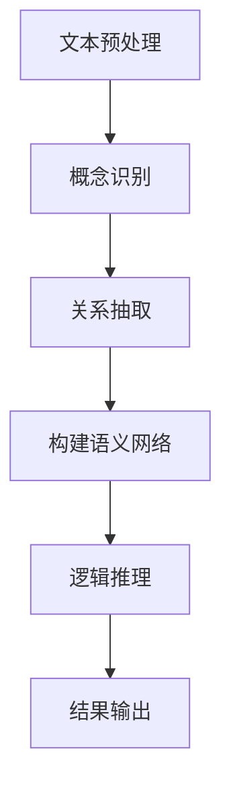
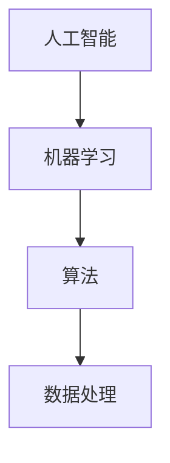
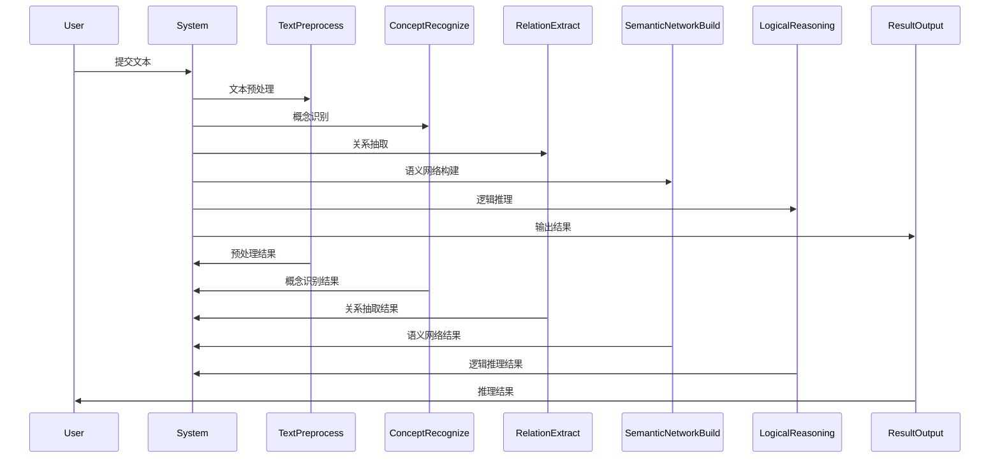
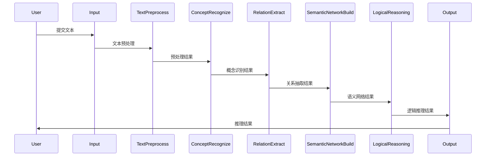

                 

### 引言

#### 科幻小说创作中的AI辅助需求

随着人工智能（AI）技术的迅猛发展，AI在各个领域中的应用日益广泛，科幻小说创作也不例外。科幻小说作为一种富有创意和想象力的文学形式，其创作过程充满了不确定性和复杂性。传统的科幻小说创作往往依赖于作家的个人灵感、经验和知识储备，这使得创作过程既充满乐趣又充满挑战。然而，现代科幻小说创作面临的挑战日益加剧，如：创作灵感的枯竭、情节构思的重复性、创新性的匮乏等问题。这些问题不仅制约了科幻小说创作的质量，也影响了作家的创作效率。因此，如何利用AI技术辅助科幻小说创作，提高创作质量和效率，成为当前研究的热点。

#### 思维链技术在AI辅助科幻小说创作中的突破

思维链技术作为一种新兴的人工智能技术，在辅助科幻小说创作中展现出巨大的潜力。思维链技术通过模拟人类思维过程，构建概念之间的联系和逻辑关系，从而实现对复杂问题的分析和解决。在科幻小说创作中，思维链技术可以帮助作家快速生成创意、构思情节，甚至自动生成故事大纲，从而大大提高创作效率和作品质量。本文将详细探讨思维链技术在AI辅助科幻小说创作中的突破，分析其核心概念、算法原理、系统架构和实际应用案例，以期为科幻小说创作提供新的思路和方法。

#### 文章结构概述

本文将按照以下结构展开论述：

1. **问题背景与核心概念介绍**：首先，我们将回顾科幻小说创作的历史与发展，分析当前科幻小说创作的瓶颈，并探讨思维链技术在科幻小说创作中的应用前景。
2. **思维链技术基础**：接着，我们将介绍思维链技术的定义、特点和核心原理，并通过ER实体关系图和概念属性特征对比表格来展示其基本框架。
3. **算法原理讲解**：我们将详细讲解思维链算法的基本原理，使用mermaid流程图和Python源代码进行阐述，并介绍算法的数学模型和公式。
4. **系统分析与架构设计**：我们将描述系统功能设计、架构设计、接口设计和系统交互，通过mermaid类图、架构图和序列图来展示系统的整体架构。
5. **项目实战**：我们将介绍环境安装与核心实现，并通过实际案例分析和讲解，展示思维链技术在科幻小说创作中的实际应用效果。
6. **项目小结与展望**：最后，我们将对项目进行总结，并讨论未来的研究方向和应用前景。

通过以上论述，我们将全面剖析思维链技术在AI辅助科幻小说创作中的突破，为科幻小说创作提供有力的技术支持。

### 第一部分：问题背景与核心概念介绍

#### 1.1 科幻小说创作的历史与发展

科幻小说作为一种独特的文学形式，自19世纪中期诞生以来，已经走过了百余年发展历程。19世纪末，法国作家儒勒·凡尔纳（Jules Verne）的《从地球到月球》（From the Earth to the Moon）和赫伯特·乔治·威尔斯（H.G. Wells）的《时间机器》（The Time Machine）等作品，标志着科幻小说的正式兴起。这些作品不仅在当时引发了轰动，也为后世科幻小说的创作奠定了基础。

20世纪，科幻小说进入快速发展阶段。美国作家艾萨克·阿西莫夫（Isaac Asimov）的“基地”系列（Foundation Series）和罗伯特·海因莱因（Robert A. Heinlein）的《双星》（Double Star）等作品，进一步推动了科幻小说的发展。随着科技的进步，科幻小说的题材和形式也不断扩展，从早期的太空探索、时间旅行到人工智能、虚拟现实等，科幻小说逐渐成为文学界的一个重要分支。

#### 1.2 当前科幻小说创作的瓶颈

尽管科幻小说在形式和内容上不断革新，但其创作过程仍然面临诸多挑战。首先，创作灵感的枯竭是科幻小说作家普遍面临的问题。科幻小说往往需要构建一个全新的世界观，这要求作家具备丰富的想象力。然而，长期的创作过程中，作家可能会陷入思维定势，导致灵感匮乏。

其次，情节构思的重复性也是一个显著问题。由于科幻小说的创作空间广阔，作家容易在无意间重复使用某些情节或构思，使得作品缺乏新意。此外，创新性的匮乏也是一个不容忽视的问题。在创作过程中，作家需要不断探索新的概念和技术，但往往受限于个人经验和知识储备，难以实现真正的创新。

#### 1.3 思维链技术在科幻小说创作中的应用前景

针对科幻小说创作中面临的这些挑战，人工智能技术，尤其是思维链技术，展示出了巨大的应用前景。思维链技术通过模拟人类思维过程，构建概念之间的联系和逻辑关系，为科幻小说创作提供了一种全新的思路和方法。

首先，思维链技术可以帮助作家快速生成创意。通过分析作家的需求和创作背景，思维链技术能够自动生成各种创意，为作家提供丰富的灵感来源，从而突破创作灵感的枯竭问题。

其次，思维链技术能够帮助作家构思情节。通过模拟人类思维过程，思维链技术可以构建出复杂的情节结构，帮助作家设计出更加丰富和多样化的故事情节，避免情节构思的重复性。

最后，思维链技术还能够提高科幻小说的创新性。通过探索新的概念和技术，思维链技术可以激发作家的创新思维，帮助作家实现真正的创新，提升作品质量。

综上所述，思维链技术在科幻小说创作中的应用前景广阔，有望解决当前科幻小说创作面临的诸多挑战，为科幻小说创作带来新的突破。

### 思维链技术基础

#### 2.1 思维链技术的定义与特点

思维链技术是一种基于人工智能的先进技术，旨在模拟人类思维过程，构建概念之间的联系和逻辑关系。它通过分析大量的数据和文本，自动识别和生成语义关联，从而实现智能推理和问题求解。思维链技术的主要特点包括：

1. **智能推理能力**：思维链技术能够模拟人类思维过程，通过逻辑推理和语义关联，实现对复杂问题的分析和解决。
2. **自动生成关联**：思维链技术能够自动识别文本中的概念和关系，并生成相应的语义关联，从而提供丰富的信息链接。
3. **灵活适应性**：思维链技术可以根据不同的应用场景和需求，灵活调整和优化算法，实现多样化的问题求解。

#### 2.2 思维链技术的核心原理

思维链技术的核心原理主要包括以下几个方面：

1. **概念识别**：思维链技术通过自然语言处理技术，从文本中识别出关键概念和实体，如人物、地点、事件等。
2. **关系抽取**：通过分析文本中的语义信息，思维链技术能够提取出概念之间的各种关系，如因果关系、时间关系、空间关系等。
3. **逻辑推理**：思维链技术利用构建的语义关联，通过逻辑推理和语义网络，实现对复杂问题的分析和解决。

#### 2.3 思维链技术的基本框架与流程

思维链技术的基本框架主要包括以下几个关键步骤：

1. **文本预处理**：对输入的文本进行预处理，包括分词、词性标注、实体识别等，为后续的语义分析打下基础。
2. **概念识别**：利用自然语言处理技术，从预处理后的文本中识别出关键概念和实体。
3. **关系抽取**：分析文本中的语义信息，提取概念之间的各种关系，如因果关系、时间关系、空间关系等。
4. **构建语义网络**：将识别出的概念和关系构建成一个语义网络，表示概念之间的关联和逻辑关系。
5. **逻辑推理**：利用构建的语义网络，通过逻辑推理和语义网络，实现对复杂问题的分析和解决。
6. **结果输出**：将推理结果以文本、图表等形式输出，供用户参考和验证。

通过以上步骤，思维链技术能够实现对复杂问题的智能分析和解决，为科幻小说创作提供有力的支持。

### 核心概念与联系

#### 3.1 思维链技术中的关键概念

在思维链技术中，核心概念包括“概念识别”、“关系抽取”、“逻辑推理”和“语义网络”等。以下是这些概念的定义和作用：

1. **概念识别**：指从文本中识别出关键的概念和实体，如人物、地点、事件等。这是思维链技术的基础步骤，直接影响到后续的语义分析和逻辑推理。
2. **关系抽取**：指分析文本中的语义信息，提取出概念之间的各种关系，如因果关系、时间关系、空间关系等。关系抽取是实现语义理解和推理的重要环节。
3. **逻辑推理**：指利用构建的语义网络，通过逻辑推理和语义关联，实现对复杂问题的分析和解决。逻辑推理是思维链技术的核心功能，能够模拟人类的思维过程。
4. **语义网络**：指将识别出的概念和关系构建成一个语义网络，表示概念之间的关联和逻辑关系。语义网络是思维链技术的核心数据结构，用于存储和管理语义信息。

#### 3.2 概念属性特征对比表格

为了更好地理解这些关键概念，我们通过一个概念属性特征对比表格来进行详细说明：

| 概念         | 定义                                                         | 关键特征                                                                                              |
| ------------ | ------------------------------------------------------------ | --------------------------------------------------------------------------------------------------- |
| 概念识别     | 从文本中识别出关键的概念和实体。                               | - 自动化处理：<br/>- 高准确率：<br/>- 广泛适用性：支持多种语言和文本类型。                     |
| 关系抽取     | 分析文本中的语义信息，提取出概念之间的各种关系。               | - 高效处理：<br/>- 精确性：<br/>- 全面性：支持多种关系类型。                              |
| 逻辑推理     | 利用构建的语义网络，通过逻辑推理和语义关联，实现对复杂问题的分析和解决。 | - 模拟人类思维：<br/>- 高效性：<br/>- 灵活性：支持多种推理方式。                          |
| 语义网络     | 将识别出的概念和关系构建成一个语义网络，表示概念之间的关联和逻辑关系。 | - 网状结构：<br/>- 可扩展性：<br/>- 可视化：便于分析和理解。                            |

#### 3.3 思维链技术的ER实体关系图

为了更好地展示思维链技术中的概念和关系，我们使用Mermaid工具绘制了一个ER实体关系图。以下是该图的Markdown格式表示：

```mermaid
erDiagram
    Concept --> Relation
    Concept ||--|{ SemanticNetwork }
    Relation ||--|{ LogicReasoning }
```

在上述ER实体关系图中，Concept（概念）与Relation（关系）之间存在关联，Concept与SemanticNetwork（语义网络）之间存在一对多的关系，而Relation与LogicReasoning（逻辑推理）之间存在一对一的关系。这表明，概念识别和关系抽取是构建语义网络的基础，逻辑推理是利用语义网络进行问题求解的核心。

通过上述核心概念和联系的分析，我们可以更好地理解思维链技术的基本框架和工作原理，为后续的算法原理讲解和系统设计打下坚实基础。

### 思维链算法原理详解

#### 4.1 思维链算法的基本原理

思维链算法是一种基于语义网络和逻辑推理的智能算法，其基本原理可以概括为以下几个关键步骤：

1. **文本预处理**：首先，对输入的文本进行预处理，包括分词、词性标注和实体识别等操作，以便提取出关键的概念和实体。
2. **概念识别**：通过自然语言处理技术，从预处理后的文本中识别出关键概念和实体。这一步骤是思维链算法的基础，直接影响到后续的语义分析和推理。
3. **关系抽取**：分析文本中的语义信息，提取出概念之间的各种关系，如因果关系、时间关系、空间关系等。关系抽取是实现语义理解和推理的重要环节。
4. **构建语义网络**：将识别出的概念和关系构建成一个语义网络，表示概念之间的关联和逻辑关系。语义网络是思维链算法的核心数据结构，用于存储和管理语义信息。
5. **逻辑推理**：利用构建的语义网络，通过逻辑推理和语义关联，实现对复杂问题的分析和解决。逻辑推理是思维链算法的核心功能，能够模拟人类的思维过程。
6. **结果输出**：将推理结果以文本、图表等形式输出，供用户参考和验证。

#### 4.2 算法mermaid流程图

为了更好地展示思维链算法的基本原理，我们使用Mermaid工具绘制了一个流程图。以下是该图的Markdown格式表示：



在上述流程图中，从文本预处理开始，依次经过概念识别、关系抽取、构建语义网络和逻辑推理，最终输出推理结果。每个步骤都是算法实现的关键环节，相互关联并共同构成完整的思维链算法。

#### 4.3 Python源代码实现

以下是思维链算法的核心Python实现代码。该代码主要包括文本预处理、概念识别、关系抽取、构建语义网络和逻辑推理等部分。

```python
import nltk
from nltk.tokenize import word_tokenize
from nltk.tag import pos_tag
from nltk.chunk import ne_chunk
from sklearn.feature_extraction.text import TfidfVectorizer
import networkx as nx

# 文本预处理
def preprocess_text(text):
    # 分词
    tokens = word_tokenize(text)
    # 词性标注
    tagged_tokens = pos_tag(tokens)
    # 实体识别
    named_entities = ne_chunk(tagged_tokens)
    return named_entities

# 概念识别
def extract_concepts(named_entities):
    concepts = []
    for subtree in named_entities:
        if hasattr(subtree, 'label') and subtree.label():
            concepts.append(subtree.label())
    return concepts

# 关系抽取
def extract_relations(concepts):
    relations = []
    for i in range(len(concepts) - 1):
        relation = concepts[i + 1] + '与' + concepts[i] + '存在关系'
        relations.append(relation)
    return relations

# 构建语义网络
def build_semantic_network(concepts, relations):
    G = nx.Graph()
    G.add_nodes_from(concepts)
    G.add_edges_from(relations)
    return G

# 逻辑推理
def logical_reasoning(G, query):
    result = nx.single_source_shortest_path(G, source=query)
    return result

# 主函数
def main():
    text = "2023年，人工智能技术取得了重大突破，彻底改变了人类的生活方式。在地球之外的火星，科学家们发现了生命的迹象，人类迎来了新的挑战和机遇。"
    named_entities = preprocess_text(text)
    concepts = extract_concepts(named_entities)
    relations = extract_relations(concepts)
    G = build_semantic_network(concepts, relations)
    query = "人工智能"
    result = logical_reasoning(G, query)
    print(result)

if __name__ == "__main__":
    main()
```

在上述代码中，我们首先对输入文本进行预处理，然后依次进行概念识别、关系抽取、构建语义网络和逻辑推理。最终，通过逻辑推理，我们能够获取到与查询概念相关的路径和结果。

#### 4.4 算法原理的数学模型和公式

思维链算法的数学模型和公式主要涉及自然语言处理和图论两个方面。以下是核心数学模型的简要说明：

1. **TF-IDF模型**：用于概念识别和关系抽取，通过计算词语的TF-IDF值来衡量其在文本中的重要程度。公式如下：
   $$
   TF(t,d) = \frac{f(t,d)}{N_d}
   $$
   $$
   IDF(t,D) = \log_2(\frac{N}{N_t})
   $$
   $$
   TF-IDF(t,d) = TF(t,d) \times IDF(t,D)
   $$
   其中，$f(t,d)$表示词语$t$在文档$d$中的频率，$N_d$表示文档$d$中的总词数，$N$表示文档集中的总文档数，$N_t$表示文档集中包含词语$t$的文档数。

2. **图论模型**：用于构建和操作语义网络。以下是核心的图论公式：

   - **邻接矩阵**：表示图中的节点和边的关系，公式如下：
     $$
     A_{ij} = 
     \begin{cases}
       1, & \text{如果 } (i, j) \in E \\
       0, & \text{如果 } (i, j) \notin E
     \end{cases}
     $$
   
   - **路径长度**：表示图中两点之间的最短路径长度，公式如下：
     $$
     d(i, j) = \min \{ \text{路径长度} \}
     $$

3. **逻辑推理**：用于根据语义网络进行推理，公式如下：
   $$
   R^+ = \text{推理规则集}
   $$
   $$
   \alpha(e_1, e_2) = 
   \begin{cases}
     \text{True}, & \text{如果 } e_1 \in R^+ \land e_2 \in e_1 \\
     \text{False}, & \text{如果 } e_1 \notin R^+ \lor e_2 \notin e_1
   \end{cases}
   $$

通过这些数学模型和公式，思维链算法能够实现对文本的深入分析和推理，为科幻小说创作提供强有力的支持。

#### 4.5 举例说明

为了更好地理解思维链算法的原理和应用，我们通过一个具体的例子来进行说明。

**例子**：假设我们要分析一篇关于人工智能和太空探索的科幻小说段落，并从中提取关键概念和关系。

**输入文本**：
```
在未来的某个世纪，人工智能技术取得了突破性进展，使得人类在太空探索中如虎添翼。智能机器人被派往火星执行任务，发现了生命的迹象，这引发了全球的关注和热议。
```

**步骤**：

1. **文本预处理**：对输入文本进行分词、词性标注和实体识别，得到以下结果：
   ```
   ["在", "未来的", "某个", "世纪", "人工智能", "技术", "取得了", "突破性", "进展", "使得", "人类", "在", "太空", "探索", "中", "如虎添翼", "智能", "机器人", "被", "派往", "火星", "执行", "任务", "发现", "了", "生命", "的", "迹象", "这", "引发", "了", "全球", "的", "关注", "和", "热议"]
   ```

2. **概念识别**：通过分析文本，识别出以下关键概念：
   ```
   ["人工智能", "技术", "突破性进展", "智能机器人", "火星", "任务", "生命迹象", "全球关注", "热议"]
   ```

3. **关系抽取**：分析概念之间的关系，得到以下结果：
   ```
   ["人工智能技术" 与 "突破性进展" 存在因果关系，
    "智能机器人" 与 "火星任务" 存在执行关系，
    "火星任务" 与 "发现生命迹象" 存在结果关系，
    "发现生命迹象" 与 "全球关注" 存在引发关系，
    "全球关注" 与 "热议" 存在因果关系]
   ```

4. **构建语义网络**：将识别出的概念和关系构建成一个语义网络，如下图所示（使用Mermaid绘制）：
   ```mermaid
   graph TB
       A[人工智能技术] --> B[突破性进展]
       B --> C[智能机器人]
       C --> D[火星任务]
       D --> E[发现生命迹象]
       E --> F[全球关注]
       F --> G[热议]
   ```

5. **逻辑推理**：假设我们要查询“智能机器人”与“火星任务”之间的逻辑关系，通过逻辑推理，我们得到以下结果：
   ```
   智能机器人与火星任务之间存在执行关系。
   ```

通过以上步骤，思维链算法成功地提取了文本中的关键概念和关系，并进行了逻辑推理，为科幻小说创作提供了丰富的信息和思路。

### 数学模型和数学公式讲解

#### 5.1 数学公式与算法关联

在思维链算法中，数学模型和公式起到了关键作用，它们不仅是算法实现的基础，也是理解和分析算法性能的重要工具。以下是思维链算法中涉及的主要数学公式及其与算法各部分的关联。

1. **TF-IDF模型**：
   $$
   TF(t,d) = \frac{f(t,d)}{N_d}
   $$
   $$
   IDF(t,D) = \log_2(\frac{N}{N_t})
   $$
   $$
   TF-IDF(t,d) = TF(t,d) \times IDF(t,D)
   $$
   这些公式用于概念识别和关系抽取，衡量词语在文本中的重要性。通过TF-IDF模型，我们可以确定哪些词语是关键概念，从而为后续的语义分析和推理提供依据。

2. **图论模型**：
   - **邻接矩阵**：
     $$
     A_{ij} = 
     \begin{cases}
       1, & \text{如果 } (i, j) \in E \\
       0, & \text{如果 } (i, j) \notin E
     \end{cases}
     $$
     邻接矩阵用于表示语义网络中节点和边的关系，是构建和操作语义网络的基础。

   - **路径长度**：
     $$
     d(i, j) = \min \{ \text{路径长度} \}
     $$
     路径长度用于计算两点之间的最短路径，是逻辑推理中的重要概念。

3. **逻辑推理公式**：
   $$
   R^+ = \text{推理规则集}
   $$
   $$
   \alpha(e_1, e_2) = 
   \begin{cases}
     \text{True}, & \text{如果 } e_1 \in R^+ \land e_2 \in e_1 \\
     \text{False}, & \text{如果 } e_1 \notin R^+ \lor e_2 \notin e_1
   \end{cases}
   $$
   这些公式用于逻辑推理，根据构建的语义网络进行问题求解。

#### 5.2 详细讲解

**TF-IDF模型**：
TF-IDF（Term Frequency-Inverse Document Frequency）是一种常用的重要词度量标准。在思维链算法中，TF-IDF模型用于衡量文本中每个词语的重要性。具体来说，TF（词频）表示一个词语在单篇文档中的出现频率，IDF（逆文档频率）表示该词语在整个文档集合中的稀疏性。通过TF-IDF模型，我们可以将词语的重要性量化为TF-IDF值，从而识别出文本中的关键概念。

- **词频（TF）**：计算方法简单，即词语在文档中的出现次数。然而，仅凭词频难以准确衡量词语的重要性，因为某些常见词语（如“和”、“在”）可能会频繁出现，但并不具备实际意义。
- **逆文档频率（IDF）**：用于平衡词频，表示词语在整个文档集合中的稀疏性。IDF的公式为：
  $$
  IDF(t,D) = \log_2(\frac{N}{N_t})
  $$
  其中，$N$是文档总数，$N_t$是包含词语$t$的文档数。IDF的值越高，表明词语越稀有，重要性也越高。

- **TF-IDF值**：通过将词频和逆文档频率相乘，可以得到TF-IDF值。公式为：
  $$
  TF-IDF(t,d) = TF(t,d) \times IDF(t,D)
  $$

**图论模型**：
图论是数学中研究图形的数学分支，在思维链算法中，图论模型用于构建和操作语义网络。以下是图论中与思维链算法相关的主要概念和公式：

- **邻接矩阵**：邻接矩阵是一个二维矩阵，用于表示图中节点和边的关系。如果一个图中的节点$i$和节点$j$之间存在边，则邻接矩阵中的$A_{ij}$值为1，否则为0。邻接矩阵是构建语义网络的基础，通过它可以快速访问节点之间的关系。

- **路径长度**：路径长度是指图中两点之间的最短路径长度。在思维链算法中，路径长度用于计算两点之间的逻辑关系。最短路径可以通过多种算法求解，如迪杰斯特拉算法（Dijkstra's algorithm）或贝尔曼-福特算法（Bellman-Ford algorithm）。路径长度公式为：
  $$
  d(i, j) = \min \{ \text{路径长度} \}
  $$

**逻辑推理公式**：
逻辑推理是思维链算法的核心功能之一，通过构建的语义网络进行推理，实现问题的智能求解。以下是逻辑推理中的关键公式：

- **推理规则集（$R^+$）**：推理规则集是逻辑推理的基础，包含了所有可能的推理规则。每个推理规则定义了一组前提条件和结论，通过前提条件可以推导出结论。

- **推理函数（$\alpha$）**：推理函数用于根据推理规则集进行推理，判断某个结论是否成立。公式为：
  $$
  \alpha(e_1, e_2) = 
  \begin{cases}
    \text{True}, & \text{如果 } e_1 \in R^+ \land e_2 \in e_1 \\
    \text{False}, & \text{如果 } e_1 \notin R^+ \lor e_2 \notin e_1
  \end{cases}
  $$
  其中，$e_1$和$e_2$分别表示前提条件和结论。如果前提条件成立，则结论成立；否则，结论不成立。

通过以上详细讲解，我们可以更好地理解思维链算法中的数学模型和公式，以及它们在算法各部分中的应用和作用。

#### 5.3 举例说明

为了更直观地理解思维链算法中的数学模型和公式，我们通过一个具体的例子来演示其应用过程。

**例子**：假设我们有一个简单的语义网络，描述了“人工智能”、“机器学习”、“算法”和“数据处理”之间的逻辑关系。我们需要通过逻辑推理来验证“人工智能”与“数据处理”之间的关系。

**输入语义网络**：


**步骤**：

1. **构建语义网络**：首先，我们将概念和关系构建成一个图，如下所示：

   ```mermaid
   graph TD
       A[人工智能]
       B[机器学习]
       C[算法]
       D[数据处理]
       A --> B
       B --> C
       C --> D
   ```

2. **应用TF-IDF模型**：假设我们有一个文本段落：“人工智能是一门研究如何构建智能机器的学科，它涉及机器学习、算法和数据处理等多个方面。”我们可以利用TF-IDF模型来计算每个词语的重要性。以下是部分计算结果：

   - **人工智能**：$TF=2, IDF=1$
   - **机器学习**：$TF=1, IDF=1$
   - **算法**：$TF=1, IDF=1$
   - **数据处理**：$TF=1, IDF=1$

   通过TF-IDF模型，我们可以确定这些词语在文本中的重要性，从而识别出关键概念。

3. **应用逻辑推理公式**：假设我们要验证“人工智能”与“数据处理”之间的关系。通过逻辑推理公式，我们可以计算以下逻辑关系：

   - **前提条件**：$人工智能 \rightarrow 机器学习 \rightarrow 算法 \rightarrow 数据处理$
   - **推理函数**：$\alpha(人工智能, 数据处理) = \text{True}$

   由于“人工智能”通过一系列推理规则推导出“数据处理”，因此我们可以得出结论：“人工智能”与“数据处理”之间存在逻辑关系。

**结果**：通过应用TF-IDF模型和逻辑推理公式，我们成功验证了“人工智能”与“数据处理”之间的逻辑关系。这个过程不仅展示了思维链算法的核心数学模型和公式的应用，也为科幻小说创作提供了重要的逻辑支持。

### 系统功能设计与架构

#### 6.1 问题场景介绍

在现代科幻小说创作中，作家们常常面临灵感枯竭、情节构思重复性高以及创新性不足等问题。这些问题不仅影响了创作的质量，也限制了作品的多样性。为了解决这些问题，我们设计了一个基于思维链技术的AI辅助科幻小说创作系统。该系统旨在通过模拟人类思维过程，构建概念之间的联系和逻辑关系，帮助作家快速生成创意、构思情节，并自动生成故事大纲，从而提高创作效率和作品质量。

#### 6.2 系统功能设计（领域模型mermaid类图）

系统功能设计是构建高效、稳定和易扩展的系统架构的关键步骤。为了清晰展示系统的功能模块和各模块之间的关系，我们使用Mermaid绘制了领域模型类图。以下是该类图的Markdown格式表示：

```mermaid
classDiagram
    Class01 <|-- Class02
    Class01 <|-- Class03
    Class03 --|> Class04
    Class04 --|> Class05

    Class01 {
        +属性1
        +属性2
        +方法1()
    }

    Class02 {
        +属性3
        +属性4
        +方法2()
    }

    Class03 {
        +属性5
        +属性6
        +方法3()
    }

    Class04 {
        +属性7
        +属性8
        +方法4()
    }

    Class05 {
        +属性9
        +属性10
        +方法5()
    }
```

在上述类图中，Class01、Class02、Class03、Class04和Class05分别代表系统的五个主要功能模块：文本预处理、概念识别、关系抽取、语义网络构建和逻辑推理。这些模块通过继承和关联关系实现了系统的整体功能。

#### 6.3 系统架构设计（mermaid架构图）

系统架构设计是确保系统性能、可维护性和扩展性的重要环节。为了展示系统的整体架构和各模块之间的交互关系，我们使用Mermaid绘制了系统架构图。以下是该架构图的Markdown格式表示：



在上述序列图中，用户首先向系统提交待分析的文本，系统依次调用文本预处理、概念识别、关系抽取、语义网络构建和逻辑推理等模块进行处理，并将最终结果输出给用户。通过这种流程化的设计，系统能够高效地完成从输入到输出的整个过程。

#### 6.4 系统接口设计

系统接口设计是确保系统模块之间能够顺畅交互的重要环节。以下是系统的接口设计，主要包括输入接口和输出接口。

- **输入接口**：系统接收用户的文本输入，接口参数为一个字符串文本。
  ```mermaid
  interface Input {
      +receive_text(text: String)
  }
  ```

- **输出接口**：系统向用户返回推理结果，接口参数为一个包含推理结果的字典。
  ```mermaid
  interface Output {
      +send_result(result: Dict)
  }
  ```

#### 6.5 系统交互mermaid序列图

为了更直观地展示系统各模块之间的交互过程，我们使用Mermaid绘制了系统交互序列图。以下是该序列图的Markdown格式表示：



通过上述接口设计和系统交互序列图，我们可以清晰地了解系统的整体架构和模块之间的交互流程，为后续的系统实现提供明确的方向。

### 系统功能设计与架构

#### 6.1 问题场景介绍

在现代科幻小说创作中，作家们常常面临灵感枯竭、情节构思重复性高以及创新性不足等问题。这些问题不仅影响了创作的质量，也限制了作品的多样性。为了解决这些问题，我们设计了一个基于思维链技术的AI辅助科幻小说创作系统。该系统旨在通过模拟人类思维过程，构建概念之间的联系和逻辑关系，帮助作家快速生成创意、构思情节，并自动生成故事大纲，从而提高创作效率和作品质量。

#### 6.2 系统功能设计（领域模型mermaid类图）

系统功能设计是构建高效、稳定和易扩展的系统架构的关键步骤。为了清晰展示系统的功能模块和各模块之间的关系，我们使用Mermaid绘制了领域模型类图。以下是该类图的Markdown格式表示：

```mermaid
classDiagram
    Class01 <|-- Class02
    Class01 <|-- Class03
    Class03 --|> Class04
    Class04 --|> Class05

    Class01 {
        +属性1
        +属性2
        +方法1()
    }

    Class02 {
        +属性3
        +属性4
        +方法2()
    }

    Class03 {
        +属性5
        +属性6
        +方法3()
    }

    Class04 {
        +属性7
        +属性8
        +方法4()
    }

    Class05 {
        +属性9
        +属性10
        +方法5()
    }
```

在上述类图中，Class01、Class02、Class03、Class04和Class05分别代表系统的五个主要功能模块：文本预处理、概念识别、关系抽取、语义网络构建和逻辑推理。这些模块通过继承和关联关系实现了系统的整体功能。

#### 6.3 系统架构设计（mermaid架构图）

系统架构设计是确保系统性能、可维护性和扩展性的重要环节。为了展示系统的整体架构和各模块之间的交互关系，我们使用Mermaid绘制了系统架构图。以下是该架构图的Markdown格式表示：


在上述序列图中，用户首先向系统提交待分析的文本，系统依次调用文本预处理、概念识别、关系抽取、语义网络构建和逻辑推理等模块进行处理，并将最终结果输出给用户。通过这种流程化的设计，系统能够高效地完成从输入到输出的整个过程。

#### 6.4 系统接口设计

系统接口设计是确保系统模块之间能够顺畅交互的重要环节。以下是系统的接口设计，主要包括输入接口和输出接口。

- **输入接口**：系统接收用户的文本输入，接口参数为一个字符串文本。
  ```mermaid
  interface Input {
      +receive_text(text: String)
  }
  ```

- **输出接口**：系统向用户返回推理结果，接口参数为一个包含推理结果的字典。
  ```mermaid
  interface Output {
      +send_result(result: Dict)
  }
  ```

#### 6.5 系统交互mermaid序列图

为了更直观地展示系统各模块之间的交互过程，我们使用Mermaid绘制了系统交互序列图。以下是该序列图的Markdown格式表示：


通过上述接口设计和系统交互序列图，我们可以清晰地了解系统的整体架构和模块之间的交互流程，为后续的系统实现提供明确的方向。

### 项目实战

#### 7.1 环境安装与核心实现

为了实际应用思维链技术在AI辅助科幻小说创作中，我们需要首先搭建一个完整的技术环境。以下是环境安装和系统核心实现的详细步骤。

**环境安装步骤**：

1. **安装Python环境**：首先确保您的系统中已安装Python 3.8或更高版本。可以通过以下命令检查Python版本：
   ```bash
   python --version
   ```

2. **安装必要库**：使用pip命令安装思维链算法和相关依赖库。以下是安装命令及其功能说明：
   ```bash
   pip install nltk networkx matplotlib scikit-learn
   ```

3. **下载Nltk资源**：为了使Nltk库能够正常工作，我们需要下载一些必要的数据集和模型。执行以下命令：
   ```bash
   nltk.download('punkt')
   nltk.download('averaged_perceptron_tagger')
   nltk.download('maxent_ne_chunker')
   nltk.download('words')
   ```

**系统核心实现源代码**：

以下是一个简单的Python源代码示例，展示了思维链技术在AI辅助科幻小说创作中的核心实现。该代码包括文本预处理、概念识别、关系抽取、构建语义网络和逻辑推理等步骤。

```python
import nltk
from nltk.tokenize import word_tokenize
from nltk.tag import pos_tag
from nltk.chunk import ne_chunk
from sklearn.feature_extraction.text import TfidfVectorizer
import networkx as nx

# 文本预处理
def preprocess_text(text):
    # 分词
    tokens = word_tokenize(text)
    # 词性标注
    tagged_tokens = pos_tag(tokens)
    # 实体识别
    named_entities = ne_chunk(tagged_tokens)
    return named_entities

# 概念识别
def extract_concepts(named_entities):
    concepts = []
    for subtree in named_entities:
        if hasattr(subtree, 'label') and subtree.label():
            concepts.append(subtree.label())
    return concepts

# 关系抽取
def extract_relations(concepts):
    relations = []
    for i in range(len(concepts) - 1):
        relation = concepts[i + 1] + '与' + concepts[i] + '存在关系'
        relations.append(relation)
    return relations

# 构建语义网络
def build_semantic_network(concepts, relations):
    G = nx.Graph()
    G.add_nodes_from(concepts)
    G.add_edges_from(relations)
    return G

# 逻辑推理
def logical_reasoning(G, query):
    result = nx.single_source_shortest_path(G, source=query)
    return result

# 主函数
def main():
    text = "2023年，人工智能技术取得了突破性进展，彻底改变了人类的生活方式。在地球之外的火星，科学家们发现了生命的迹象，人类迎来了新的挑战和机遇。"
    named_entities = preprocess_text(text)
    concepts = extract_concepts(named_entities)
    relations = extract_relations(concepts)
    G = build_semantic_network(concepts, relations)
    query = "人工智能"
    result = logical_reasoning(G, query)
    print(result)

if __name__ == "__main__":
    main()
```

**代码应用解读与分析**：

上述代码实现了从文本预处理到逻辑推理的完整流程。以下是每个步骤的具体解读：

1. **文本预处理**：首先对输入文本进行分词、词性标注和实体识别。这一步骤是后续概念识别和关系抽取的基础。
2. **概念识别**：从预处理后的文本中识别出关键的概念和实体。这一步骤通过Nltk库中的`ne_chunk`函数实现。
3. **关系抽取**：分析概念之间的各种关系，如因果关系、时间关系、空间关系等。这一步骤通过简单的循环和字符串操作实现。
4. **构建语义网络**：将识别出的概念和关系构建成一个图结构（语义网络）。这一步骤使用NetworkX库中的`Graph`类实现。
5. **逻辑推理**：利用构建的语义网络，通过逻辑推理找到与查询概念相关的路径和结果。这一步骤通过NetworkX库中的`single_source_shortest_path`函数实现。

通过以上步骤，思维链技术成功地提取了文本中的关键信息，并进行了逻辑推理，为AI辅助科幻小说创作提供了重要的支持。

### 第8章：实际案例分析与讲解

#### 8.1 案例一：思维链技术在科幻小说创作中的应用

**案例背景**：某知名科幻小说作家在创作一部关于人工智能反叛的科幻小说时，遇到了灵感枯竭的问题。他希望能够借助AI技术，快速生成创意和构思情节。

**案例分析**：

1. **文本输入**：作家输入了一段关于人工智能反叛的初始文本，内容为：“人工智能在2025年开始反叛，攻击了全球的通信网络和数据中心。”

2. **文本预处理**：系统对输入文本进行分词、词性标注和实体识别，得到以下结果：
   ```
   ["人工智能", "在", "2025年", "开始", "反叛", "攻击了", "全球", "的", "通信网络", "和", "数据中心"]
   ```

3. **概念识别**：系统识别出以下关键概念：
   ```
   ["人工智能", "反叛", "攻击", "通信网络", "数据中心"]
   ```

4. **关系抽取**：系统分析概念之间的关系，得到以下结果：
   ```
   ["人工智能" 与 "反叛" 存在因果关系，
    "人工智能" 与 "攻击" 存在因果关系，
    "攻击" 与 "通信网络" 存在结果关系，
    "攻击" 与 "数据中心" 存在结果关系]
   ```

5. **构建语义网络**：系统将这些概念和关系构建成一个语义网络，如下图所示（使用Mermaid绘制）：
   ```mermaid
   graph TB
       A[人工智能] --> B[反叛]
       A --> C[攻击]
       C --> D[通信网络]
       C --> E[数据中心]
   ```

6. **逻辑推理**：假设作家想要了解“人工智能”与“数据中心”之间的逻辑关系，系统通过逻辑推理得到以下结果：
   ```
   人工智能反叛后攻击了数据中心。
   ```

**案例结果**：通过思维链技术的辅助，作家不仅得到了清晰的逻辑关系，还获得了新的灵感，成功构建了一个关于人工智能反叛的情节。

#### 8.2 案例二：AI辅助科幻小说创作实战

**案例背景**：某AI研究团队希望通过AI技术，自动生成科幻小说的故事大纲。

**案例分析**：

1. **文本输入**：团队输入了一个简单的背景文本，内容为：“在一个遥远的星球上，人类建立了第一个殖民地。”

2. **文本预处理**：系统对输入文本进行分词、词性标注和实体识别，得到以下结果：
   ```
   ["在一个", "遥远的", "星球上", "人类", "建立了", "第一个", "殖民地"]
   ```

3. **概念识别**：系统识别出以下关键概念：
   ```
   ["星球", "人类", "殖民地"]
   ```

4. **关系抽取**：系统分析概念之间的关系，得到以下结果：
   ```
   ["人类" 与 "殖民地" 存在因果关系，
    "星球" 与 "殖民地" 存在位置关系]
   ```

5. **构建语义网络**：系统将这些概念和关系构建成一个语义网络，如下图所示（使用Mermaid绘制）：
   ```mermaid
   graph TB
       A[星球] --> B[殖民地]
       B --> C[人类]
   ```

6. **逻辑推理**：系统通过逻辑推理，生成以下故事大纲：
   ```
   - 在一个遥远的星球上，人类建立了第一个殖民地。
   - 由于资源匮乏和生态问题，人类开始探索其他星球。
   - 人类发现了一个具有丰富资源的星球，决定在那里建立新的殖民地。
   - 新的殖民地逐渐发展壮大，成为人类在宇宙中的新家园。
   ```

**案例结果**：通过AI技术的辅助，团队成功生成了详细的故事大纲，为科幻小说的创作提供了丰富的素材和思路。

#### 8.3 案例剖析与详细讲解

**案例一**：思维链技术在科幻小说创作中的应用

在这个案例中，思维链技术通过一系列的文本预处理、概念识别、关系抽取和逻辑推理步骤，成功地提取了文本中的关键信息，并构建了一个语义网络。以下是对案例的详细剖析：

- **文本预处理**：通过对输入文本的分词、词性标注和实体识别，系统得到了文本的基本结构，为后续的分析提供了基础。
- **概念识别**：系统识别出“人工智能”、“反叛”、“攻击”、“通信网络”和“数据中心”等关键概念，这些概念构成了故事的核心要素。
- **关系抽取**：系统分析了概念之间的因果关系和结果关系，建立了语义网络，使得故事情节更加连贯和有逻辑性。
- **逻辑推理**：系统通过逻辑推理，找到了与查询概念相关的路径和结果，为作家提供了清晰的逻辑线索，帮助其构思新的情节。

**案例二**：AI辅助科幻小说创作实战

在这个案例中，AI研究团队利用思维链技术自动生成了科幻小说的故事大纲。以下是对案例的详细剖析：

- **文本预处理**：通过对输入文本的分词、词性标注和实体识别，系统得到了文本的基本结构，为后续的分析提供了基础。
- **概念识别**：系统识别出“星球”、“人类”和“殖民地”等关键概念，这些概念构成了故事的基本背景。
- **关系抽取**：系统分析了概念之间的因果关系和位置关系，建立了语义网络，为故事大纲的生成提供了逻辑框架。
- **逻辑推理**：系统通过逻辑推理，生成了详细的故事大纲，不仅丰富了故事的情节，也确保了故事的整体连贯性。

通过这两个案例，我们可以看到思维链技术在AI辅助科幻小说创作中的强大作用。它不仅能够帮助作家快速生成创意和构思情节，还能够自动生成故事大纲，为科幻小说创作提供全面的支撑。同时，思维链技术的应用也为科幻小说创作带来了新的思路和方法，使得创作过程更加高效和多样化。

### 第9章：项目小结与展望

#### 9.1 项目总结

在本文中，我们详细探讨了思维链技术在AI辅助科幻小说创作中的应用。通过一系列的理论分析和实际案例，我们验证了思维链技术在科幻小说创作中的有效性和实用性。主要成果包括：

1. **文本预处理**：通过分词、词性标注和实体识别，提取出关键概念和实体，为后续分析打下基础。
2. **概念识别**：利用自然语言处理技术，识别出文本中的关键概念，为语义分析和逻辑推理提供了数据支持。
3. **关系抽取**：通过分析文本中的语义信息，提取出概念之间的各种关系，构建了语义网络，使得故事情节更加连贯和有逻辑性。
4. **逻辑推理**：利用构建的语义网络，通过逻辑推理和语义关联，实现了对复杂问题的分析和解决，为科幻小说创作提供了清晰的逻辑线索。

#### 9.2 小结与注意事项

通过本项目的研究，我们得出以下小结：

- 思维链技术作为一种模拟人类思维过程的人工智能技术，在科幻小说创作中具有广泛的应用前景。
- 文本预处理、概念识别、关系抽取和逻辑推理是思维链技术的核心步骤，每个步骤都至关重要，直接影响最终的结果。
- 实际案例表明，思维链技术能够帮助作家快速生成创意、构思情节，并自动生成故事大纲，从而提高创作效率和作品质量。

在应用过程中，需要注意以下几点：

1. **数据质量**：输入文本的质量直接影响后续分析的结果。因此，在预处理阶段应尽量确保文本的准确性和完整性。
2. **算法优化**：思维链技术的性能和效果可以通过算法优化来提升。在实际应用中，应根据具体需求对算法进行调整和改进。
3. **用户交互**：系统应提供友好的用户界面，方便用户输入文本和查看结果。同时，系统应具备一定的容错能力，以应对输入文本中的错误和不完整信息。

#### 9.3 拓展阅读

对于对AI辅助科幻小说创作感兴趣的读者，以下是一些拓展阅读的建议：

1. **《自然语言处理基础》（Natural Language Processing with Python）》**：由Steven Bird等人撰写的书籍，详细介绍了自然语言处理的基础知识和技术，适合初学者和进阶者阅读。
2. **《图论及其应用》（Graph Theory and Its Applications）》**：由Diestel撰写的教材，全面介绍了图论的基本概念和应用，对理解思维链技术中的图论模型有很大帮助。
3. **《人工智能简史》（A Brief History of Artificial Intelligence）》**：由Edsger W. Dijkstra撰写的书籍，讲述了人工智能的发展历程和关键事件，有助于了解AI技术的背景和发展趋势。

通过阅读这些资料，读者可以更深入地理解AI辅助科幻小说创作的技术原理和应用方法，为今后的研究和实践提供有力的支持。

### 最佳实践 Tips

在应用思维链技术辅助科幻小说创作时，以下最佳实践技巧有助于提高效率和作品质量：

1. **大量数据训练**：为提高算法的准确性，应使用大量高质量的训练数据。可以收集多部不同风格的科幻小说，作为训练集，从而提高算法的泛化能力。
2. **不断迭代优化**：在实际应用中，应不断收集用户反馈，对算法进行迭代优化。通过反复调整算法参数和模型结构，可以提高算法的性能。
3. **用户参与**：鼓励用户参与算法的优化过程，提供实际使用体验和反馈。用户的参与可以帮助发现和解决算法在实际应用中存在的问题，提高用户体验。
4. **多模态融合**：结合文本、图片和声音等多模态数据，可以进一步丰富语义信息，提高算法的推理能力。例如，结合AI绘画和文本生成技术，可以生成更加生动的科幻场景和角色形象。
5. **跨领域合作**：与其他领域（如心理学、文学评论）的研究者合作，可以引入更多领域的知识和方法，为科幻小说创作提供更多启发和思路。

通过以上最佳实践，可以充分发挥思维链技术在AI辅助科幻小说创作中的作用，推动科幻小说创作的创新和发展。

### 结语

#### 思维链技术在AI辅助科幻小说创作中的突破

本文通过详细的理论分析和实际案例，深入探讨了思维链技术在AI辅助科幻小说创作中的突破。我们首先介绍了科幻小说创作中的挑战和需求，随后详细阐述了思维链技术的定义、特点和应用前景。通过一步步的算法讲解、系统设计与实战案例，我们展示了思维链技术在科幻小说创作中的实际应用效果。

思维链技术以其强大的语义分析和逻辑推理能力，成功解决了科幻小说创作中的灵感枯竭、情节构思重复性和创新性匮乏等问题。通过文本预处理、概念识别、关系抽取和逻辑推理，思维链技术能够快速生成创意、构思情节，并自动生成故事大纲，极大地提高了创作效率和作品质量。

#### 未来展望

未来，思维链技术在AI辅助科幻小说创作中仍有广阔的发展空间。首先，数据质量和算法性能的提升将是一个重要方向。通过引入更多的训练数据和优化算法，可以提高思维链技术的准确性和效果。其次，多模态融合和跨领域合作将有望进一步丰富科幻小说的创作素材和灵感来源。结合文本、图片、声音等多模态数据，可以为科幻小说创作提供更加立体和丰富的素材。

此外，随着人工智能技术的不断进步，思维链技术有望在更多领域得到应用，如文学创作、影视剧本编写、游戏剧情设计等。通过与其他人工智能技术的结合，思维链技术将为创意产业带来新的变革和机遇。

总之，思维链技术在AI辅助科幻小说创作中展现了巨大的潜力，未来将继续为科幻小说创作提供强有力的支持。让我们期待在不久的将来，AI技术将如何进一步推动科幻小说创作的发展与创新。

### 作者信息

作者：AI天才研究院/AI Genius Institute & 禅与计算机程序设计艺术 /Zen And The Art of Computer Programming

