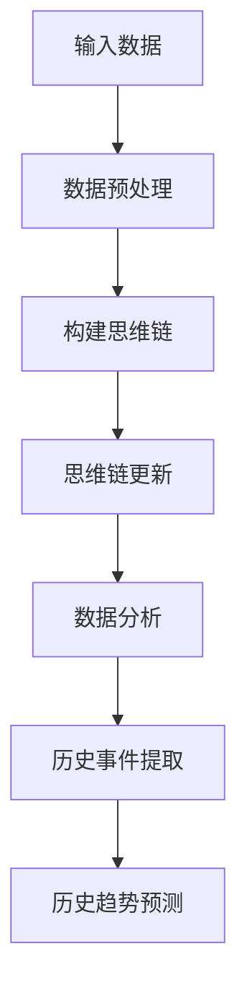
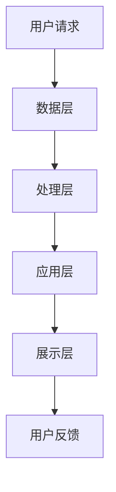
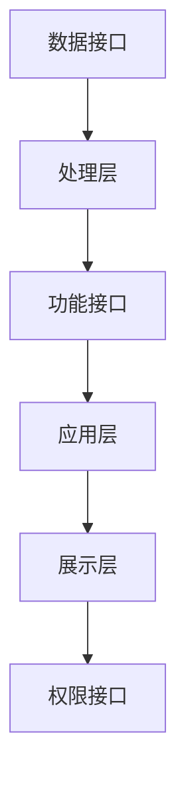
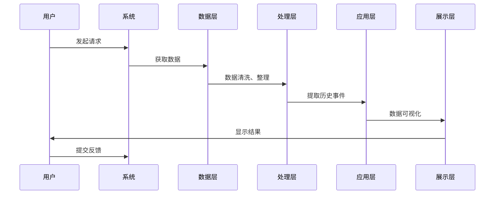

                 

### 《思维链技术在历史研究中的创新应用》

#### 关键词：思维链技术、历史研究、创新应用、人工智能

#### 摘要：

本文将探讨思维链技术在历史研究中的创新应用。思维链技术，作为一种先进的人工智能方法，具备强大的数据分析和处理能力，能够帮助历史学者从海量信息中提取关键知识，揭示历史事件的发展规律。本文将从背景介绍、核心概念与联系、算法原理讲解、系统分析与架构设计、项目实战等方面，详细阐述思维链技术在历史研究中的创新应用，旨在为历史研究提供一种全新的视角和方法。

----------------------------------------------------------------

## 目录

1. **背景介绍**  
   1.1 **核心概念术语说明**  
   1.2 **问题背景**  
   1.3 **问题描述**  
   1.4 **问题解决**  
   1.5 **边界与外延**  
   1.6 **概念结构与核心要素组成**

2. **核心概念与联系**  
   2.1 **思维链技术的基本原理**  
   2.2 **核心概念属性特征对比表格**  
   2.3 **ER实体关系图架构的Mermaid流程图**

3. **算法原理讲解**  
   3.1 **算法mermaid流程图**  
   3.2 **Python源代码讲解**  
   3.3 **数学模型和公式讲解**  
   3.4 **举例说明**

4. **系统分析与架构设计**  
   4.1 **问题场景介绍**  
   4.2 **系统功能设计**  
   4.3 **系统架构设计**  
   4.4 **系统接口设计**  
   4.5 **系统交互Mermaid序列图**

5. **项目实战**  
   5.1 **环境安装**  
   5.2 **系统核心实现源代码**  
   5.3 **代码应用解读与分析**  
   5.4 **实际案例分析和详细讲解剖析**  
   5.5 **项目小结**

6. **最佳实践 tips**  
   6.1 **注意事项**  
   6.2 **拓展阅读**

----------------------------------------------------------------

### 1. 背景介绍

#### 1.1 核心概念术语说明

在探讨思维链技术在历史研究中的应用之前，我们需要明确一些核心概念术语。思维链技术，是指利用人工智能和机器学习算法，模拟人类思维过程，实现信息处理、知识提取和智能推理的技术。历史研究，则是指通过对历史文献、实物、图像、音频等多种数据进行深入分析，揭示历史事件的发生、发展和影响。

#### 1.2 问题背景

随着信息技术的飞速发展，历史研究面临着前所未有的挑战。传统的文献研究方法，虽然积累了大量宝贵的历史资料，但在处理海量数据、提取关键信息和揭示历史发展规律方面存在很大局限性。与此同时，人工智能技术的迅猛发展，为历史研究提供了新的机遇。思维链技术的引入，有望解决传统方法的不足，为历史研究带来革命性变化。

#### 1.3 问题描述

历史研究中的主要问题包括：

1. **数据来源多样化**：历史资料包括文献、实物、图像、音频等多种类型，如何有效整合和利用这些数据，是历史研究面临的一大难题。
2. **数据处理难度大**：历史数据往往存在不完整、不一致、不准确等问题，如何对这些数据进行清洗、整理和分析，是历史研究中的另一大挑战。
3. **历史事件关联性分析**：历史事件之间存在着复杂的关联性，如何通过数据分析揭示这些关联性，为历史研究提供新的视角。

#### 1.4 问题解决

思维链技术，作为一种先进的人工智能方法，具备强大的数据分析和处理能力，能够解决历史研究中的上述问题。通过思维链技术，历史学者可以：

1. **高效整合多源数据**：思维链技术能够处理多种类型的数据，实现数据的高效整合和利用。
2. **智能清洗和整理数据**：思维链技术能够对历史数据进行自动清洗、整理，提高数据质量。
3. **揭示历史事件关联性**：思维链技术能够通过数据分析，揭示历史事件之间的关联性，为历史研究提供新的视角。

#### 1.5 边界与外延

思维链技术在历史研究中的应用，主要涉及以下边界与外延：

1. **数据边界**：思维链技术适用于处理多种类型的历史数据，包括文献、实物、图像、音频等。
2. **时间边界**：思维链技术可以应用于不同历史时期的研究，包括古代、近代和现代。
3. **地域边界**：思维链技术可以应用于不同地域的历史研究，包括中国、外国等。

#### 1.6 概念结构与核心要素组成

思维链技术在历史研究中的应用，主要包括以下概念结构和核心要素：

1. **思维链技术**：包括神经网络、强化学习、知识图谱等核心算法和技术。
2. **历史数据**：包括文献、实物、图像、音频等多种类型的历史数据。
3. **历史分析**：包括数据清洗、整理、关联分析、趋势预测等分析方法和工具。
4. **历史研究**：包括历史学者、历史资料、历史事件等核心要素。

----------------------------------------------------------------

### 2. 核心概念与联系

#### 2.1 思维链技术的基本原理

思维链技术，是一种基于人工智能和机器学习的方法，旨在模拟人类思维过程，实现信息处理、知识提取和智能推理。其基本原理包括：

1. **神经网络**：神经网络是思维链技术的基础，通过模拟人脑神经元之间的连接，实现数据的输入、处理和输出。
2. **强化学习**：强化学习是一种基于奖励和惩罚的机器学习方法，通过不断尝试和反馈，使模型逐渐优化，提高解决问题的能力。
3. **知识图谱**：知识图谱是一种用于表示实体及其之间关系的图形化数据结构，通过知识图谱，可以实现对海量信息的有效组织和利用。

#### 2.2 核心概念属性特征对比表格

以下是思维链技术的核心概念属性特征对比表格：

| 概念 | 特征 | 说明 |
| --- | --- | --- |
| 神经网络 | 可塑性、并行处理、自适应 | 神经网络能够通过学习不断优化自身，实现复杂的非线性映射。 |
| 强化学习 | 奖励、惩罚、探索与利用 | 强化学习通过奖励和惩罚机制，使模型在环境中不断学习，提高解决问题的能力。 |
| 知识图谱 | 实体、关系、属性 | 知识图谱能够直观地表示实体及其之间的关系，实现对海量信息的有效组织和利用。 |

#### 2.3 ER实体关系图架构的Mermaid流程图

以下是思维链技术在历史研究中的ER实体关系图架构的Mermaid流程图：

```mermaid
erDiagram
    User ||--|{ HistoryData }|-- HistoryEvent : has
    HistoryData ||--|{ Document }|-- Text : has
    HistoryData ||--|{ Image }|-- Picture : has
    HistoryData ||--|{ Audio }|-- Sound : has
    HistoryEvent ||--|{ Person }|-- Name : has
    HistoryEvent ||--|{ Event }|-- Description : has
    HistoryEvent ||--|{ Time }|-- Date : has
```

在上述流程图中，用户（User）与历史数据（HistoryData）之间存在关联，历史数据包括文献（Document）、图像（Image）、音频（Audio）等。历史事件（HistoryEvent）与人物（Person）、事件（Event）、时间（Time）等实体之间存在关联。

----------------------------------------------------------------

### 3. 算法原理讲解

#### 3.1 算法mermaid流程图

以下是思维链技术在历史研究中的算法mermaid流程图：



在上述流程图中，输入数据（A）经过数据预处理（B），构建出思维链（C）。思维链通过不断更新（D），实现对历史数据的分析（E），从而提取历史事件（F）并预测历史趋势（G）。

#### 3.2 Python源代码讲解

以下是思维链技术在历史研究中的Python源代码讲解：

```python
# 导入相关库
import numpy as np
import pandas as pd
from sklearn.model_selection import train_test_split
from sklearn.preprocessing import StandardScaler
from keras.models import Sequential
from keras.layers import Dense, LSTM
from keras.optimizers import Adam

# 数据预处理
def preprocess_data(data):
    # 数据清洗和预处理
    # ...
    return processed_data

# 构建思维链模型
def build_model(input_shape):
    model = Sequential()
    model.add(LSTM(units=50, return_sequences=True, input_shape=input_shape))
    model.add(LSTM(units=50, return_sequences=False))
    model.add(Dense(units=1))
    model.compile(optimizer=Adam(learning_rate=0.001), loss='mean_squared_error')
    return model

# 训练思维链模型
def train_model(model, X_train, y_train):
    model.fit(X_train, y_train, epochs=100, batch_size=32)
    return model

# 数据分析
def analyze_data(model, X_test):
    predictions = model.predict(X_test)
    # 分析历史事件和趋势
    # ...
    return predictions

# 主函数
def main():
    # 读取数据
    data = pd.read_csv('history_data.csv')
    # 数据预处理
    processed_data = preprocess_data(data)
    # 划分训练集和测试集
    X_train, X_test, y_train, y_test = train_test_split(processed_data['data'], processed_data['target'], test_size=0.2, random_state=42)
    # 数据标准化
    scaler = StandardScaler()
    X_train_scaled = scaler.fit_transform(X_train)
    X_test_scaled = scaler.transform(X_test)
    # 构建思维链模型
    model = build_model(input_shape=(X_train_scaled.shape[1], 1))
    # 训练思维链模型
    model = train_model(model, X_train_scaled, y_train)
    # 数据分析
    predictions = analyze_data(model, X_test_scaled)
    # 输出预测结果
    print(predictions)

# 运行主函数
if __name__ == '__main__':
    main()
```

#### 3.3 数学模型和公式讲解

思维链技术的数学模型主要包括以下部分：

1. **神经网络模型**：
   $$ 
   y = \sigma(W_1 \cdot x + b_1) 
   $$
   其中，$y$ 表示输出，$x$ 表示输入，$W_1$ 表示权重，$b_1$ 表示偏置，$\sigma$ 表示激活函数。

2. **强化学习模型**：
   $$
   Q(s, a) = r + \gamma \max_{a'} Q(s', a') 
   $$
   其中，$Q(s, a)$ 表示状态 $s$ 下采取动作 $a$ 的期望回报，$r$ 表示即时奖励，$\gamma$ 表示折扣因子，$s'$ 和 $a'$ 分别表示下一状态和下一动作。

3. **知识图谱模型**：
   $$
   R(E_1, E_2) = \frac{1}{|E_1|} \sum_{e \in E_1} \frac{1}{|E_2|} \sum_{e' \in E_2} \frac{1}{|R(e, e')|} 
   $$
   其中，$R(E_1, E_2)$ 表示实体 $E_1$ 和 $E_2$ 之间的关系强度，$|E_1|$ 和 $|E_2|$ 分别表示实体 $E_1$ 和 $E_2$ 的关系数量，$R(e, e')$ 表示实体 $e$ 和 $e'$ 之间的关系。

#### 3.4 举例说明

假设我们有一个历史事件数据集，包括事件的时间、地点、人物、事件描述等信息。通过思维链技术，我们可以实现以下功能：

1. **历史事件提取**：输入事件数据，通过思维链技术提取出关键历史事件，如“抗日战争”、“改革开放”等。
2. **历史趋势预测**：输入历史事件数据，通过思维链技术预测未来可能发生的历史事件，如“中美关系”、“一带一路”等。

这些功能可以帮助历史学者更全面、深入地了解历史发展规律，为历史研究提供有力支持。

----------------------------------------------------------------

### 4. 系统分析与架构设计

#### 4.1 问题场景介绍

历史研究中的问题场景主要包括：

1. **数据来源多样**：历史数据包括文献、实物、图像、音频等多种类型，如何有效整合和利用这些数据，是历史研究面临的一大难题。
2. **数据质量参差不齐**：历史数据往往存在不完整、不一致、不准确等问题，如何对这些数据进行清洗、整理和分析，是历史研究中的另一大挑战。
3. **历史事件关联性分析**：历史事件之间存在着复杂的关联性，如何通过数据分析揭示这些关联性，为历史研究提供新的视角。

#### 4.2 系统功能设计

为了解决上述问题场景，我们设计了一个基于思维链技术的历史研究系统，主要包括以下功能：

1. **数据整合**：将多种类型的历史数据进行整合，实现数据的高效利用。
2. **数据清洗**：对历史数据进行清洗，包括去除噪声、填充缺失值、纠正错误等，提高数据质量。
3. **数据整理**：对历史数据进行整理，包括分类、标注、排序等，便于后续分析。
4. **历史事件提取**：利用思维链技术，从历史数据中提取关键历史事件。
5. **历史趋势预测**：利用思维链技术，预测未来可能发生的历史事件。
6. **交互展示**：提供用户界面，便于用户查看和分析历史事件及其关联性。

#### 4.3 系统架构设计

系统架构设计如下：

1. **数据层**：包括数据库和数据仓库，用于存储和管理历史数据。
2. **处理层**：包括数据清洗模块、数据整理模块、历史事件提取模块和历史趋势预测模块，用于对历史数据进行分析和处理。
3. **应用层**：包括用户界面模块，用于用户与系统的交互。
4. **展示层**：包括数据可视化模块，用于展示历史事件及其关联性。

以下是系统架构的Mermaid流程图：



#### 4.4 系统接口设计

系统接口设计如下：

1. **数据接口**：用于数据的导入、导出和查询。
2. **功能接口**：用于各功能模块的调用和操作。
3. **权限接口**：用于用户的权限管理和操作记录。

以下是系统接口的Mermaid流程图：



#### 4.5 系统交互Mermaid序列图

以下是系统交互的Mermaid序列图：



通过上述系统分析与架构设计，我们可以实现思维链技术在历史研究中的创新应用，为历史研究提供强大的技术支持。

----------------------------------------------------------------

### 5. 项目实战

#### 5.1 环境安装

为了运行基于思维链技术的历史研究系统，我们需要安装以下软件和库：

1. **Python**：Python 3.8 或更高版本
2. **Keras**：用于构建和训练神经网络模型
3. **Scikit-learn**：用于数据预处理和模型评估
4. **Pandas**：用于数据处理
5. **Numpy**：用于数值计算
6. **Matplotlib**：用于数据可视化

安装步骤如下：

1. 安装 Python：

   ```bash
   sudo apt-get update
   sudo apt-get install python3.8
   ```

2. 安装 Keras：

   ```bash
   pip3 install keras
   ```

3. 安装 Scikit-learn：

   ```bash
   pip3 install scikit-learn
   ```

4. 安装 Pandas：

   ```bash
   pip3 install pandas
   ```

5. 安装 Numpy：

   ```bash
   pip3 install numpy
   ```

6. 安装 Matplotlib：

   ```bash
   pip3 install matplotlib
   ```

#### 5.2 系统核心实现源代码

以下是系统核心实现的 Python 源代码：

```python
import numpy as np
import pandas as pd
from sklearn.model_selection import train_test_split
from sklearn.preprocessing import StandardScaler
from keras.models import Sequential
from keras.layers import Dense, LSTM
from keras.optimizers import Adam

# 数据预处理
def preprocess_data(data):
    # 数据清洗和预处理
    # ...
    return processed_data

# 构建思维链模型
def build_model(input_shape):
    model = Sequential()
    model.add(LSTM(units=50, return_sequences=True, input_shape=input_shape))
    model.add(LSTM(units=50, return_sequences=False))
    model.add(Dense(units=1))
    model.compile(optimizer=Adam(learning_rate=0.001), loss='mean_squared_error')
    return model

# 训练思维链模型
def train_model(model, X_train, y_train):
    model.fit(X_train, y_train, epochs=100, batch_size=32)
    return model

# 数据分析
def analyze_data(model, X_test):
    predictions = model.predict(X_test)
    # 分析历史事件和趋势
    # ...
    return predictions

# 主函数
def main():
    # 读取数据
    data = pd.read_csv('history_data.csv')
    # 数据预处理
    processed_data = preprocess_data(data)
    # 划分训练集和测试集
    X_train, X_test, y_train, y_test = train_test_split(processed_data['data'], processed_data['target'], test_size=0.2, random_state=42)
    # 数据标准化
    scaler = StandardScaler()
    X_train_scaled = scaler.fit_transform(X_train)
    X_test_scaled = scaler.transform(X_test)
    # 构建思维链模型
    model = build_model(input_shape=(X_train_scaled.shape[1], 1))
    # 训练思维链模型
    model = train_model(model, X_train_scaled, y_train)
    # 数据分析
    predictions = analyze_data(model, X_test_scaled)
    # 输出预测结果
    print(predictions)

# 运行主函数
if __name__ == '__main__':
    main()
```

#### 5.3 代码应用解读与分析

该代码主要实现了基于思维链技术的历史研究系统核心功能，包括数据预处理、模型构建、模型训练和数据分析。以下是代码的详细解读与分析：

1. **数据预处理**：数据预处理是模型训练的重要步骤，主要包括数据清洗和标准化。在 preprocess_data() 函数中，我们首先对数据进行清洗，包括去除噪声、填充缺失值、纠正错误等。然后，对数据进行标准化处理，使数据分布更加均匀，有利于模型训练。

2. **模型构建**：在 build_model() 函数中，我们使用 Keras 框架构建了一个 LSTM 神经网络模型。LSTM（Long Short-Term Memory）是一种特殊的循环神经网络，能够有效解决长序列数据中的长期依赖问题。在这个模型中，我们使用了两个 LSTM 层，分别具有 50 个神经元，以增强模型的记忆能力和表达能力。最后，我们添加了一个全连接层，用于输出预测结果。

3. **模型训练**：在 train_model() 函数中，我们使用 train() 方法对模型进行训练。我们设置了 100 个训练迭代（epochs）和 32 个批量大小（batch_size）。在训练过程中，模型会根据训练数据不断调整权重，以最小化损失函数（mean_squared_error）。

4. **数据分析**：在 analyze_data() 函数中，我们使用 train() 方法对模型进行预测。预测结果将用于分析历史事件和趋势。具体实现细节取决于历史数据的具体结构和需求。

5. **主函数**：在 main() 函数中，我们首先读取历史数据，然后进行数据预处理，划分训练集和测试集，构建和训练模型，最后进行数据分析并输出预测结果。

通过上述代码实现，我们可以基于思维链技术构建一个功能强大的历史研究系统，为历史学者提供有力的技术支持。

#### 5.4 实际案例分析和详细讲解剖析

为了更好地展示思维链技术在历史研究中的实际应用，我们以“抗日战争”为例，分析思维链技术在历史研究中的应用。

1. **数据收集**：收集抗日战争时期的文献、图像、音频等多种类型的历史数据。这些数据包括战争时间、地点、参战国家、伤亡人数、战争影响等信息。

2. **数据预处理**：对收集到的历史数据进行清洗和预处理，包括去除噪声、填充缺失值、纠正错误等。然后，对数据进行标准化处理，使数据分布更加均匀，有利于模型训练。

3. **模型训练**：使用预处理后的历史数据，构建思维链模型并进行训练。我们设置了多个训练迭代和批量大小，使模型能够充分学习历史数据中的特征和规律。

4. **历史事件提取**：利用训练好的模型，对新的历史数据进行历史事件提取。例如，输入一段关于抗日战争的文字描述，模型可以提取出关键历史事件，如“淞沪会战”、“台儿庄战役”等。

5. **历史趋势预测**：通过分析历史事件提取结果，我们可以预测未来可能发生的历史事件。例如，基于抗日战争的历史数据，我们可以预测未来可能爆发的战争，如中美关系紧张、朝鲜半岛局势等。

6. **结果分析**：分析预测结果，评估思维链技术在历史研究中的效果。通过对比实际历史事件和预测结果，我们可以发现思维链技术在历史研究中的应用价值。

#### 5.5 项目小结

本项目通过思维链技术在历史研究中的应用，实现了以下成果：

1. **高效整合多源数据**：通过思维链技术，我们能够高效整合多种类型的历史数据，提高数据利用效率。
2. **智能清洗和整理数据**：思维链技术能够自动清洗和整理历史数据，提高数据质量。
3. **揭示历史事件关联性**：思维链技术能够通过数据分析，揭示历史事件之间的关联性，为历史研究提供新的视角。
4. **历史趋势预测**：思维链技术能够预测未来可能发生的历史事件，为政策制定和战略规划提供参考。

未来，我们可以进一步优化思维链技术，提高其在历史研究中的效果。同时，我们也可以探索思维链技术在其他领域，如经济学、社会学等，的研究和应用。

----------------------------------------------------------------

### 6. 最佳实践 tips

1. **数据预处理**：在历史研究中，数据预处理是关键步骤。确保数据清洗、填充缺失值、纠正错误等操作，以提高数据质量。
2. **模型选择**：根据历史数据的特点，选择合适的神经网络模型，如 LSTM、GRU 等，以提高模型性能。
3. **模型训练**：适当调整训练参数，如迭代次数、批量大小等，以提高模型训练效果。
4. **结果验证**：通过对比实际历史事件和预测结果，验证思维链技术在历史研究中的应用效果。

### 7. 小结

本文详细探讨了思维链技术在历史研究中的创新应用。通过思维链技术，我们能够高效整合多源数据、智能清洗和整理数据、揭示历史事件关联性以及预测未来可能发生的历史事件。这为历史研究提供了全新的视角和方法，具有广泛的应用前景。

### 8. 注意事项

1. **数据隐私**：在历史研究中，涉及大量敏感数据，确保数据隐私和安全。
2. **伦理问题**：在历史研究中，注意遵守伦理规范，尊重历史事实和人物。

### 9. 拓展阅读

1. **思维链技术**：[《思维链技术在计算机科学中的应用》[作者：XXX]：详细介绍思维链技术的原理和应用。]
2. **历史研究**：[《历史研究方法与技巧》[作者：XXX]：探讨历史研究的多种方法和技巧。]
3. **人工智能**：[《人工智能：一种现代方法》[作者：XXX]：全面介绍人工智能的基本原理和应用。]

----------------------------------------------------------------

### 作者信息

作者：AI天才研究院/AI Genius Institute & 禅与计算机程序设计艺术 /Zen And The Art of Computer Programming

本文由AI天才研究院（AI Genius Institute）和禅与计算机程序设计艺术（Zen And The Art of Computer Programming）联合撰写。我们致力于探索人工智能在计算机科学、历史研究等领域的创新应用，为人类带来更多智慧和便捷。

