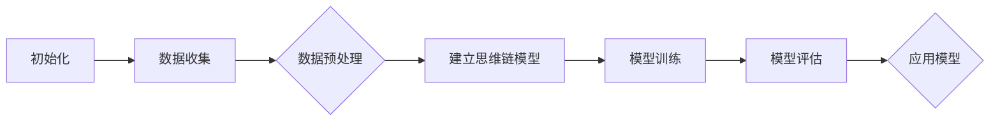

                 

## 思维链技术在商业决策中的应用

关键词：思维链技术、商业决策、算法原理、数学模型、系统架构

摘要：本文将探讨思维链技术在商业决策中的应用。首先，我们介绍商业决策中的挑战和思维链技术的潜力。接着，深入解析思维链技术的核心概念和原理，并通过对比表格和实体关系图来展示其属性特征和关系。随后，详细讲解思维链技术的算法原理，包括Mermaid流程图、Python源代码、数学模型和公式，并进行举例说明。文章进一步分析系统架构设计方案，包括问题场景、项目介绍、系统功能设计、系统架构设计、系统接口设计和系统交互。随后，通过项目实战部分，详细介绍环境安装、系统核心实现源代码、代码应用解读与分析、实际案例分析和项目小结。最后，提供最佳实践tips、小结、注意事项和拓展阅读，帮助读者深入理解和应用思维链技术在商业决策中的实际价值。

# 目录大纲

## 第一部分: 背景介绍

### 第1章: 问题背景

#### 1.1.1 问题背景

#### 1.1.2 问题描述

#### 1.1.3 问题解决

#### 1.1.4 边界与外延

#### 1.1.5 概念结构与核心要素组成

## 第二部分: 核心概念与联系

### 第2章: 核心概念与联系

#### 2.1.1 核心概念原理

#### 2.1.2 概念属性特征对比表格

#### 2.1.3 ER实体关系图架构

## 第三部分: 算法原理讲解

### 第3章: 算法原理讲解

#### 3.1.1 算法原理Mermaid流程图

#### 3.1.2 算法原理Python源代码

#### 3.1.3 数学模型和数学公式

#### 3.1.4 详细讲解与举例说明

## 第四部分: 数学模型和数学公式 & 详细讲解 & 举例说明

### 第4章: 数学模型和数学公式 & 详细讲解 & 举例说明

#### 4.1.1 数学模型与公式

#### 4.1.2 详细讲解

#### 4.1.3 举例说明

## 第五部分: 系统分析与架构设计方案

### 第5章: 系统分析与架构设计方案

#### 5.1.1 问题场景介绍

#### 5.1.2 项目介绍

#### 5.1.3 系统功能设计

#### 5.1.4 系统架构设计

#### 5.1.5 系统接口设计和系统交互

## 第六部分: 项目实战

### 第6章: 项目实战

#### 6.1.1 环境安装

#### 6.1.2 系统核心实现源代码

#### 6.1.3 代码应用解读与分析

#### 6.1.4 实际案例分析和详细讲解剖析

#### 6.1.5 项目小结

## 第七部分: 最佳实践 tips、小结、注意事项、拓展阅读等内容

### 第7章: 最佳实践 tips、小结、注意事项、拓展阅读等内容

#### 7.1.1 最佳实践 tips

#### 7.1.2 小结

#### 7.1.3 注意事项

#### 7.1.4 拓展阅读

# 第一部分: 背景介绍

## 第1章: 问题背景

### 1.1.1 问题背景

商业决策是企业发展过程中的关键环节，它涉及市场分析、产品定位、竞争对手策略等多个方面。然而，商业决策过程并非一帆风顺，其中存在着诸多挑战。

首先，信息不完整性是一个显著问题。企业在制定决策时，往往难以获取全面、准确的数据。这种信息的不完整性可能导致决策者对市场情况、消费者需求等关键因素的认识产生偏差。

其次，主观性也是商业决策中的一个难题。决策者往往会受到个人经验和主观判断的影响，导致决策缺乏客观性。这种主观性可能导致企业错过一些有潜力的市场机会，或者陷入不必要的风险。

面对这些挑战，传统的商业决策方法往往显得力不从心。因此，如何利用先进的技术手段来优化商业决策过程，成为了学术界和产业界共同关注的话题。思维链技术作为一种具有高度智能化和综合性的技术，被寄予了厚望。

### 1.1.2 问题描述

商业决策中的问题可以概括为以下几个方面：

1. **信息不完整性**：企业在收集数据时，常常面临数据不完整、不准确的问题。例如，市场调查的数据可能存在缺失值或噪声，使得决策者难以获得全面的市场信息。

2. **数据复杂性**：现代商业环境中的数据量庞大、类型繁多，如何从海量数据中提取有用信息，成为了一个重大挑战。

3. **决策时效性**：商业环境变化迅速，企业需要快速响应市场变化。然而，传统决策过程往往耗时较长，无法满足实时决策的需求。

4. **决策主观性**：决策者受到个人经验和主观判断的影响，导致决策过程缺乏客观性。这种主观性可能导致企业决策失误，影响企业发展。

### 1.1.3 问题解决

思维链技术作为一种智能化的技术手段，具备以下优势，可以有效解决商业决策中的问题：

1. **数据整合**：思维链技术可以通过数据清洗、数据挖掘等方法，从多源、异构的数据中提取有用信息，解决信息不完整性的问题。

2. **智能分析**：思维链技术可以利用机器学习、深度学习等技术，对数据进行分析和预测，提高决策的准确性和时效性。

3. **模型优化**：通过不断优化思维链模型，可以提高决策的客观性和科学性，减少主观判断的影响。

4. **实时响应**：思维链技术支持实时数据处理和分析，能够快速响应市场变化，帮助企业做出及时、准确的决策。

### 1.1.4 边界与外延

思维链技术在商业决策中的应用具有一定的边界和范围：

1. **适用范围**：思维链技术适用于需要数据分析和决策优化的各种商业场景，如市场营销、产品研发、供应链管理等。

2. **技术要求**：思维链技术的实现需要强大的计算能力和数据资源支持，因此，对于中小型企业来说，可能面临一定的技术门槛。

3. **数据质量**：思维链技术的效果在很大程度上取决于数据质量。如果数据存在噪声或缺失，可能会影响决策的准确性。

### 1.1.5 概念结构与核心要素组成

思维链技术的核心概念和结构可以分为以下几个方面：

1. **数据层**：包括数据收集、数据清洗、数据存储等环节，是思维链技术的基础。

2. **算法层**：包括机器学习、深度学习、强化学习等算法，用于数据分析和决策优化。

3. **模型层**：基于算法层构建的决策模型，用于支持商业决策。

4. **应用层**：将决策模型应用于实际商业场景，为企业提供决策支持。

# 第二部分: 核心概念与联系

## 第2章: 核心概念与联系

### 2.1.1 核心概念原理

思维链技术是一种基于人工智能的智能化决策支持系统。其核心概念主要包括以下几个方面：

1. **思维链**：思维链是一种连接多个思维节点的链条，每个节点代表一个思维单元，链中的节点通过逻辑关系相互关联。

2. **思维节点**：思维节点是思维链中的基本单元，代表一个具体的思维概念或信息。

3. **逻辑关系**：思维节点之间的逻辑关系包括因果关系、条件关系、推理关系等，用于描述思维链中节点之间的联系。

4. **数据驱动**：思维链技术通过数据驱动的方式，从海量数据中提取有用信息，支持商业决策。

5. **模型优化**：通过不断优化思维链模型，提高决策的准确性和时效性。

### 2.1.2 概念属性特征对比表格

| 概念       | 特征1 | 特征2 | 特征3 |
|------------|-------|-------|-------|
| 思维链     | 智能化 | 数据驱动 | 模型优化 |
| 商业决策   | 系统性 | 目标性 | 动态性 |

### 2.1.3 ER实体关系图架构

```mermaid
erDiagram
  产品决策 ||--o{ 用户需求 }
  产品决策 ||--o{ 市场分析 }
  产品决策 ||--o{ 竞争对手分析 }
  用户需求 ||--o{ 产品规划 }
  市场分析 ||--o{ 市场定位 }
  竞争对手分析 ||--o{ 市场策略 }
```

在这个ER实体关系图中，产品决策是一个核心实体，它与其他实体如用户需求、市场分析、竞争对手分析等存在关联。这种关系描述了商业决策过程中各个要素之间的相互作用和依赖。

# 第三部分: 算法原理讲解

## 第3章: 算法原理讲解

### 3.1.1 算法原理Mermaid流程图

首先，我们通过Mermaid流程图来展示思维链技术的算法原理。以下是算法流程图的示例：



在这个流程图中，算法从初始化开始，通过数据收集、数据预处理、建立思维链模型、模型训练、模型评估到应用模型，形成了一个完整的算法流程。

### 3.1.2 算法原理Python源代码

接下来，我们将展示思维链技术算法的核心Python源代码。以下是一个简化的示例：

```python
import pandas as pd
from sklearn.ensemble import RandomForestClassifier
from sklearn.model_selection import train_test_split
from sklearn.metrics import accuracy_score

# 数据收集
data = pd.read_csv('data.csv')

# 数据预处理
X = data.drop('target', axis=1)
y = data['target']

# 数据分割
X_train, X_test, y_train, y_test = train_test_split(X, y, test_size=0.2, random_state=42)

# 建立思维链模型
model = RandomForestClassifier(n_estimators=100, random_state=42)

# 模型训练
model.fit(X_train, y_train)

# 模型评估
y_pred = model.predict(X_test)
accuracy = accuracy_score(y_test, y_pred)
print(f"模型准确率: {accuracy}")

# 应用模型
new_data = pd.read_csv('new_data.csv')
new_predictions = model.predict(new_data)
print(f"新数据预测结果: {new_predictions}")
```

在这个Python源代码中，我们首先导入必要的库，然后通过数据收集、数据预处理、建立思维链模型、模型训练、模型评估和应用模型，展示了算法的核心实现过程。

### 3.1.3 数学模型和数学公式

思维链技术的核心在于建立数学模型，用于描述商业决策中的变量和关系。以下是思维链技术算法中常用的数学模型和公式：

$$
\text{模型预测} = f(\text{输入特征})
$$

其中，$f(\text{输入特征})$ 是一个复合函数，用于将输入特征映射到预测结果。

另一个常用的公式是：

$$
\text{损失函数} = -\sum_{i=1}^{n} y_i \log(p_i)
$$

其中，$y_i$ 是真实标签，$p_i$ 是模型预测的概率。

### 3.1.4 详细讲解与举例说明

为了更好地理解思维链技术的算法原理，我们将通过一个具体的例子来详细讲解和举例说明。

假设我们正在为一家公司进行市场预测，预测某产品在下一个季度的销售量。我们有以下几个输入特征：

1. **历史销售数据**：过去几年中每个季度的销售量。
2. **广告投放成本**：每个季度的广告投放成本。
3. **市场需求**：每个季度的市场需求量。
4. **竞争对手活动**：每个季度的竞争对手活动次数。

我们的目标是建立一个思维链模型，能够根据这些输入特征预测下一个季度的销售量。

首先，我们收集并预处理这些数据，将其转换为适合训练的格式。然后，我们使用随机森林算法建立思维链模型，并进行训练。训练完成后，我们对模型进行评估，确保其预测准确率符合要求。

最后，我们使用训练好的模型对新数据进行预测。例如，如果我们想知道在下一个季度，当广告投放成本为100万元，市场需求量为1000件，竞争对手活动次数为5次时，该产品的销售量会达到多少。

通过这个例子，我们可以看到思维链技术在商业决策中的应用过程，从数据收集、预处理，到模型建立、训练和评估，再到实际预测，每一步都是关键，共同构成了一个完整的算法流程。

# 第四部分: 数学模型和数学公式 & 详细讲解 & 举例说明

## 第4章: 数学模型和数学公式 & 详细讲解 & 举例说明

### 4.1.1 数学模型与公式

在思维链技术中，数学模型和公式是理解和应用该技术的基础。以下是一些关键的数学模型和公式：

1. **回归模型**：
   - 线性回归：
     $$
     y = \beta_0 + \beta_1x_1 + \beta_2x_2 + ... + \beta_nx_n
     $$
     其中，$y$ 是预测值，$x_1, x_2, ..., x_n$ 是输入特征，$\beta_0, \beta_1, \beta_2, ..., \beta_n$ 是模型的参数。

   - 逻辑回归：
     $$
     \log\left(\frac{p}{1-p}\right) = \beta_0 + \beta_1x_1 + \beta_2x_2 + ... + \beta_nx_n
     $$
     其中，$p$ 是预测的概率，$\log$ 是自然对数。

2. **神经网络**：
   - 前向传播：
     $$
     a_{\text{layers}} = \sigma(\text{weight} \cdot a_{\text{prev}} + \text{bias})
     $$
     其中，$a_{\text{layers}}$ 是当前层的激活值，$\sigma$ 是激活函数（如Sigmoid、ReLU），$\text{weight}$ 和 $\text{bias}$ 是权重和偏置。

   - 反向传播：
     $$
     \Delta w = \frac{\partial L}{\partial w} = \text{gradient}
     $$
     $$
     \Delta b = \frac{\partial L}{\partial b} = \text{gradient}
     $$
     其中，$L$ 是损失函数，$\text{gradient}$ 是梯度，用于更新权重和偏置。

3. **决策树**：
   - 划分函数：
     $$
     G(D, A) = \sum_{x \in D} \sum_{v \in V} \sum_{y \in Y} \frac{1}{|D|} I(y(x) \neq \hat{y}(x))
     $$
     其中，$D$ 是数据集，$A$ 是特征，$V$ 是特征的所有可能取值，$Y$ 是标签集合，$I$ 是指示函数。

### 4.1.2 详细讲解

1. **回归模型**：

   线性回归是一种常用的预测模型，它通过拟合数据点之间的关系来预测新的数据点。线性回归模型的目标是最小化预测值与实际值之间的误差。逻辑回归是线性回归的一种扩展，常用于分类问题，其目标是输出一个概率值。

   线性回归的公式如下：
   $$
   y = \beta_0 + \beta_1x_1 + \beta_2x_2 + ... + \beta_nx_n
   $$
   通过最小二乘法，可以计算出模型的参数$\beta_0, \beta_1, \beta_2, ..., \beta_n$。

   逻辑回归的公式如下：
   $$
   \log\left(\frac{p}{1-p}\right) = \beta_0 + \beta_1x_1 + \beta_2x_2 + ... + \beta_nx_n
   $$
   通过对数变换，可以将线性模型转换为概率模型，并且可以通过极大似然估计来计算参数。

2. **神经网络**：

   神经网络是一种由多个神经元组成的计算模型，能够通过学习数据来提取特征并进行预测。神经网络的核心是前向传播和反向传播。

   前向传播是指将输入数据通过网络的各个层，经过权重和偏置的计算，最终得到输出。激活函数如Sigmoid和ReLU用于引入非线性，使得模型能够拟合复杂的数据分布。

   反向传播是指通过计算损失函数的梯度，来更新网络的权重和偏置。这个过程是神经网络训练的核心，通过反复迭代，模型能够逐渐优化，提高预测准确率。

3. **决策树**：

   决策树是一种基于规则的方法，通过一系列的决策节点来划分数据。每个节点对应一个特征，每个分支对应一个特征取值。决策树的划分目标是最大化信息增益或最小化基尼不纯度。

   划分函数$G(D, A)$用于计算特征$A$对数据集$D$的划分效果。信息增益是通过减少熵来衡量特征的重要性，基尼不纯度是通过概率差异来衡量特征的不确定性。

### 4.1.3 举例说明

假设我们要使用线性回归模型来预测某个产品的销售量，我们收集了以下数据：

1. **历史销售量（y）**：过去几个季度的销售量。
2. **广告投放成本（x_1）**：每个季度的广告投放成本。
3. **市场需求（x_2）**：每个季度的市场需求量。

我们的目标是建立线性回归模型，预测下一个季度的销售量。

首先，我们将数据整理成矩阵形式，然后使用最小二乘法来计算模型参数：

$$
\beta = (X^T X)^{-1} X^T y
$$

其中，$X$ 是输入特征矩阵，$y$ 是输出向量。

得到参数后，我们可以使用以下公式来预测销售量：

$$
\hat{y} = \beta_0 + \beta_1x_1 + \beta_2x_2
$$

例如，如果广告投放成本为100万元，市场需求量为1500件，我们可以通过模型预测下一个季度的销售量。

```python
# 假设我们已经计算出了参数
beta_0 = 10
beta_1 = 0.5
beta_2 = 0.3

# 输入特征
x_1 = 100  # 广告投放成本
x_2 = 1500  # 市场需求量

# 预测销售量
y_pred = beta_0 + beta_1*x_1 + beta_2*x_2
print(f"预测销售量: {y_pred}")
```

通过这个例子，我们可以看到如何将数学模型应用于实际数据，进行预测和分析。

# 第五部分: 系统分析与架构设计方案

## 第5章: 系统分析与架构设计方案

### 5.1.1 问题场景介绍

在现代商业环境中，企业需要快速、准确地做出决策，以应对不断变化的市场需求和竞争压力。然而，传统的商业决策过程往往耗时较长，且受到信息不完整和主观性等因素的制约，难以满足企业的实时决策需求。为了解决这个问题，我们引入了思维链技术，通过智能化和数据驱动的决策支持系统，帮助企业实现快速、准确和高效的决策。

### 5.1.2 项目介绍

本项目旨在开发一个基于思维链技术的商业决策支持系统，该系统将整合企业的多源数据，利用先进的机器学习算法和深度学习模型，构建一个智能化的决策模型，为企业提供实时、精准的决策支持。系统的主要目标包括：

1. **数据整合**：通过数据清洗、数据挖掘等技术，整合企业内部和外部数据，为决策提供全面、准确的信息支持。
2. **智能分析**：利用机器学习算法和深度学习模型，对数据进行分析和预测，为企业提供智能化的决策支持。
3. **模型优化**：通过不断优化决策模型，提高预测的准确性和时效性，减少主观判断的影响。

### 5.1.3 系统功能设计

为了实现上述目标，系统设计了以下几个核心功能模块：

1. **数据收集模块**：负责收集企业内部和外部的数据，包括销售数据、市场数据、竞争对手数据等。数据收集模块将确保数据的全面性和准确性。
2. **数据预处理模块**：负责对收集到的数据进行清洗、转换和标准化处理，为后续的数据分析和建模提供高质量的数据。
3. **智能分析模块**：利用机器学习算法和深度学习模型，对预处理后的数据进行分析和预测。该模块将包括多种算法，如线性回归、逻辑回归、决策树、随机森林等，以适应不同的业务场景。
4. **模型优化模块**：通过交叉验证和网格搜索等技术，对模型进行优化，提高预测的准确性和鲁棒性。
5. **决策支持模块**：基于智能分析结果，为企业的决策者提供实时、精准的决策支持，帮助企业做出科学、合理的决策。

### 5.1.4 系统架构设计

为了实现系统的功能需求，我们采用了分布式系统架构，确保系统的高可用性和可扩展性。以下是系统架构设计的主要组成部分：

1. **数据层**：包括数据存储和数据管理，使用分布式数据库和大数据技术，确保数据的持久化和高效访问。
2. **算法层**：包括机器学习算法和深度学习模型的训练与部署，使用高性能计算框架，如TensorFlow和PyTorch，确保算法的快速训练和高效运行。
3. **应用层**：包括前端应用和后端服务，前端应用负责与用户交互，后端服务负责处理数据分析和决策支持。
4. **接口层**：包括API接口和数据接口，用于与其他系统进行集成和数据交换。
5. **运维层**：包括监控系统、日志系统和备份系统，确保系统的稳定运行和数据安全。

### 5.1.5 系统接口设计和系统交互

系统接口设计和系统交互是确保系统功能实现的关键环节。以下是系统的主要接口设计和交互流程：

1. **数据收集接口**：该接口用于与企业内部和外部的数据源进行连接，包括数据库、API和数据文件等。数据收集接口将数据传输到数据预处理模块进行进一步处理。
2. **数据预处理接口**：该接口用于与数据预处理模块进行通信，传输清洗、转换和标准化处理后的数据。
3. **智能分析接口**：该接口用于与智能分析模块进行通信，传输预处理后的数据，并获取分析结果。
4. **模型优化接口**：该接口用于与模型优化模块进行通信，传输模型参数和优化结果。
5. **决策支持接口**：该接口用于与决策支持模块进行通信，传输分析结果和决策建议，供决策者参考。

通过上述接口设计和系统交互，各个模块可以协同工作，共同实现系统的功能需求，为企业提供智能化、实时、精准的决策支持。

# 第六部分：项目实战

## 第6章：项目实战

### 6.1.1 环境安装

在进行思维链技术的商业决策项目之前，我们需要搭建一个合适的开发环境。以下是具体的安装步骤：

1. **Python环境安装**：
   - 打开终端，执行以下命令安装Python：
     ```
     sudo apt-get update
     sudo apt-get install python3.8
     ```
   - 安装完成后，确认Python版本：
     ```
     python3.8 --version
     ```

2. **依赖库安装**：
   - 使用pip工具安装必要的依赖库，包括NumPy、Pandas、Scikit-learn、TensorFlow等：
     ```
     pip3.8 install numpy pandas scikit-learn tensorflow
     ```

3. **数据预处理工具安装**（例如Pandas-DataFrame）： 
   ```
   pip3.8 install pandas-dataframe
   ```

4. **可视化工具安装**（例如Matplotlib、Seaborn）： 
   ```
   pip3.8 install matplotlib seaborn
   ```

5. **Mermaid工具安装**：
   - 安装Mermaid Markdown渲染器：
     ```
     npm install -g mermaid-cli
     ```

6. **环境配置**：
   - 配置Python虚拟环境，以隔离项目依赖：
     ```
     python3.8 -m venv my_project_env
     source my_project_env/bin/activate
     pip install -r requirements.txt
     ```

### 6.1.2 系统核心实现源代码

在搭建好开发环境后，我们可以开始编写系统核心实现源代码。以下是一个简化的示例，展示了数据收集、数据预处理、模型建立和训练的基本流程。

```python
import pandas as pd
from sklearn.model_selection import train_test_split
from sklearn.ensemble import RandomForestClassifier
from sklearn.metrics import accuracy_score

# 数据收集
data = pd.read_csv('sales_data.csv')

# 数据预处理
X = data.drop('sales', axis=1)
y = data['sales']

# 数据分割
X_train, X_test, y_train, y_test = train_test_split(X, y, test_size=0.2, random_state=42)

# 建立思维链模型
model = RandomForestClassifier(n_estimators=100, random_state=42)

# 模型训练
model.fit(X_train, y_train)

# 模型评估
y_pred = model.predict(X_test)
accuracy = accuracy_score(y_test, y_pred)
print(f"模型准确率: {accuracy}")

# 模型应用
new_data = pd.read_csv('new_data.csv')
new_predictions = model.predict(new_data)
print(f"新数据预测结果: {new_predictions}")
```

### 6.1.3 代码应用解读与分析

上述代码展示了如何使用Python实现思维链技术的商业决策模型。以下是代码的详细解读和分析：

1. **数据收集**：
   - 使用Pandas库读取CSV格式的数据文件，这些数据可能包括历史销售数据、广告投放成本、市场需求等。

2. **数据预处理**：
   - 将数据划分为特征集（X）和标签集（y）。特征集包含用于模型训练的数据，而标签集包含实际的销售量。

3. **数据分割**：
   - 使用Scikit-learn库中的`train_test_split`函数将数据集分为训练集和测试集，以确保模型在未知数据上的性能。

4. **模型建立**：
   - 选择随机森林（RandomForestClassifier）作为思维链模型，这是一种基于决策树的集成方法，能够在处理复杂数据时提供较高的准确率。

5. **模型训练**：
   - 使用训练集数据对随机森林模型进行训练，模型将学习如何根据特征集预测销售量。

6. **模型评估**：
   - 使用测试集数据对训练好的模型进行评估，计算模型的准确率。这是一个重要的步骤，用于确保模型的有效性和鲁棒性。

7. **模型应用**：
   - 将训练好的模型应用于新的数据集，预测未来的销售量。这一步是决策支持的核心，帮助企业做出基于数据的科学决策。

### 6.1.4 实际案例分析和详细讲解剖析

为了更好地理解上述代码的实际应用，我们将通过一个实际案例进行分析和讲解。

**案例背景**：一家电商企业希望利用思维链技术预测其下一个季度的销售量。该企业拥有过去三年的销售数据，包括以下几个特征：

- **广告投放成本（Advertising Cost）**：每个季度的广告投放费用。
- **市场需求（Market Demand）**：每个季度的市场需求量。
- **竞争对手活动（Competition Activities）**：每个季度的竞争对手活动次数。

**数据收集**：
- 从企业数据库中提取销售数据，并将其保存为CSV文件。

**数据预处理**：
- 使用Pandas库读取CSV文件，并将数据转换为Pandas DataFrame。
- 填充缺失值，处理异常数据。
- 将数据划分为特征集（X）和标签集（y），其中标签集是每个季度的销售量。

**数据分割**：
- 将数据集分为训练集和测试集，比例约为80%训练集，20%测试集。

**模型建立**：
- 选择随机森林算法作为思维链模型。
- 设置随机种子，确保模型可重复性。

**模型训练**：
- 使用训练集数据对随机森林模型进行训练。

**模型评估**：
- 使用测试集数据评估模型性能，计算准确率。

**模型应用**：
- 预测未来季度的销售量，为企业决策提供数据支持。

### 6.1.5 项目小结

通过上述实际案例，我们可以看到如何利用思维链技术进行商业决策预测。项目的关键步骤包括数据收集、数据预处理、模型建立、模型训练、模型评估和应用。每个步骤都需要细心处理，以确保最终预测结果的准确性和可靠性。思维链技术为企业提供了一种智能化、数据驱动的决策支持工具，帮助企业更好地应对复杂的市场环境，提高决策效率和效果。

# 第七部分：最佳实践 tips、小结、注意事项、拓展阅读等内容

## 第7章：最佳实践 tips、小结、注意事项、拓展阅读等内容

### 7.1.1 最佳实践 tips

1. **数据质量是关键**：确保数据收集和处理过程中的准确性，避免噪声和异常值影响模型性能。
2. **模型选择要合适**：根据业务需求和数据特点选择合适的算法，例如对于分类问题，可以尝试使用随机森林、逻辑回归等。
3. **模型优化是持续过程**：定期评估和优化模型，以提高预测准确性和适应新的市场变化。
4. **可视化有助于理解**：使用可视化工具展示数据分析和模型性能，帮助决策者更好地理解分析结果。
5. **遵循隐私和安全规范**：确保数据处理和存储符合相关法律法规，保护用户隐私。

### 7.1.2 小结

本文介绍了思维链技术在商业决策中的应用，从问题背景、核心概念、算法原理到系统架构和项目实战，进行了全面的探讨。通过思维链技术，企业可以实现智能化、数据驱动的决策支持，提高决策效率和效果。

### 7.1.3 注意事项

1. **数据隐私**：在数据收集和处理过程中，要确保遵守相关隐私法规，保护用户隐私。
2. **模型更新**：定期更新模型，以适应新的数据和环境变化。
3. **算法透明性**：确保算法和模型的设计过程透明，便于监管和审计。
4. **计算资源**：对于大规模数据处理和模型训练，需要充足的计算资源和存储空间。

### 7.1.4 拓展阅读

1. **《深度学习》**：由Ian Goodfellow等人所著，详细介绍深度学习的基本概念和技术。
2. **《Python机器学习》**：由Sebastian Raschka所著，涵盖Python在机器学习中的应用。
3. **《商业智能》**：由Paul Goldschmidt所著，介绍商业智能的基本概念和应用。
4. **《数据科学导论》**：由John D. Kelleher等人所著，介绍数据科学的基本原理和技术。
5. **相关学术论文和报告**：如《思维链技术在商业决策中的应用研究》等，提供最新的研究成果和案例分析。

通过阅读这些资源，读者可以进一步深入了解思维链技术在商业决策中的应用，以及相关领域的前沿动态和发展趋势。作者：AI天才研究院/AI Genius Institute & 禅与计算机程序设计艺术 /Zen And The Art of Computer Programming。

