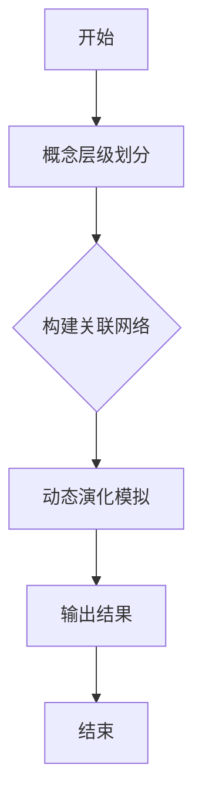

                 

## 引言

在当今信息爆炸和技术飞速发展的时代，复杂系统分析成为了一项至关重要的技术。复杂系统无处不在，从社会网络、生态系统到经济系统和工程技术系统，它们都具有多层次、动态性和高度关联性。如何有效地分析和理解这些复杂系统，是当前学术界和工业界面临的重大挑战。

### 关键词

- 复杂系统分析
- 思维链技术
- 算法原理
- 数学模型
- 系统架构设计

### 摘要

本文旨在探讨思维链技术在复杂系统分析中的应用前景。首先，我们将介绍复杂系统分析的基本概念、需求和挑战。接着，深入探讨思维链技术，包括其基本概念、原理和优势。随后，我们将通过具体案例分析，展示思维链技术在复杂系统分析中的实际应用。最后，本文将总结思维链技术在复杂系统分析中的挑战与展望，为未来研究提供方向。

## 背景介绍

### 复杂系统的定义与特征

复杂系统是指由大量相互作用的元素组成的系统，这些元素可能具有多样性和非线性特性。复杂系统的特征包括：

1. **多层次性**：复杂系统通常具有多个层次的结构，从微观到宏观，每个层次都有其特定的行为和属性。
2. **动态性**：复杂系统的状态随时间变化，呈现出非线性和不可预测的行为。
3. **高度关联性**：复杂系统中的元素之间存在复杂的相互作用和依赖关系，这些关系影响着系统的整体行为。

### 复杂系统分析的需求与挑战

复杂系统分析的需求源于对系统行为、模式和规律的理解和预测。以下是一些关键的需求和挑战：

1. **全面性**：需要分析系统的所有层次和所有元素，以确保对系统有全面的理解。
2. **实时性**：由于复杂系统的动态性，需要能够实时收集和分析数据，以快速响应系统变化。
3. **关联性**：识别和解析系统内部和外部元素之间的复杂关联关系。
4. **预测性**：通过分析历史数据和模式，预测系统的未来行为。

### 当前复杂系统分析方法

当前，复杂系统分析主要依赖于以下几种方法：

1. **数据驱动方法**：通过收集和分析大量数据，使用机器学习和数据挖掘技术来识别模式、关联性和趋势。
2. **模型驱动方法**：构建系统的数学模型，通过模拟和仿真来预测系统行为。
3. **混合方法**：结合数据驱动和模型驱动方法，以综合利用数据的丰富性和模型的理论性。

尽管这些方法在复杂系统分析中取得了显著成果，但仍然存在一些局限性：

1. **数据质量**：数据质量和数量直接影响分析结果的准确性。
2. **计算复杂性**：复杂系统的分析通常需要大量的计算资源。
3. **解释性**：机器学习模型的结果往往难以解释，影响对系统行为的理解。

## 思维链技术介绍

### 思维链的基本概念

思维链技术是一种基于人类思维模式的计算方法，旨在模拟人类解决问题的过程。思维链的核心概念包括：

1. **概念层级**：将问题分解为不同的概念层级，从宏观到微观逐步细化。
2. **关联网络**：通过识别和处理元素之间的关联关系，构建一个关联网络。
3. **动态演化**：模拟系统在不同时间点的状态变化，分析其演化过程。

### 思维链的技术原理

思维链技术的基本原理包括：

1. **抽象与建模**：将复杂问题转化为数学模型或计算模型，以便于分析和处理。
2. **推理与决策**：基于关联网络和概念层级，进行逻辑推理和决策。
3. **学习与适应**：通过不断的学习和反馈，优化模型和算法。

### 思维链的优势与局限性

思维链技术的优势包括：

1. **解释性**：思维链技术模拟了人类解决问题的过程，结果易于解释和理解。
2. **灵活性**：可以处理不同类型和结构的复杂问题。
3. **适应性**：可以通过学习和反馈，不断优化模型和算法。

然而，思维链技术也存在一些局限性：

1. **计算复杂性**：处理大规模复杂系统时，计算资源需求较高。
2. **数据依赖**：结果依赖于输入数据的质量和数量。
3. **领域知识依赖**：需要领域专家的参与，以确保模型和算法的准确性。

### 核心概念与联系

#### 核心概念

思维链技术的核心概念包括：

1. **概念层级**：将复杂问题分解为不同层次的概念，从而简化问题的处理。
2. **关联网络**：通过识别和处理元素之间的关联关系，构建一个复杂的关联网络。
3. **动态演化**：模拟系统在不同时间点的状态变化，分析其演化过程。

#### 概念属性特征对比表格

| 概念         | 属性特征                                                     | 对比分析                                                         |
| ------------ | ------------------------------------------------------------ | ------------------------------------------------------------ |
| 概念层级     | 层次结构明确，逐步细化问题，有助于理解复杂系统。               | 与其他概念相比，概念层级更注重逻辑结构和层次性，有助于分析和理解。 |
| 关联网络     | 通过关联关系构建网络，反映元素间的相互作用。                   | 与概念层级相比，关联网络更注重元素间的动态关系和复杂性。          |
| 动态演化     | 模拟系统状态变化，分析演化过程。                             | 与概念层级和关联网络相比，动态演化更注重时间维度上的系统行为。    |

#### ER实体关系图架构

```mermaid
erDiagram
    Customer ||--|{ Order }|--|| Product
    Customer ||--|{ Payment }|--|| Product
```

在这个ER图中，客户（Customer）与订单（Order）、支付（Payment）和产品（Product）之间建立了关联关系，反映了复杂系统中的关键实体和它们之间的关系。

## 算法原理讲解

#### 算法流程图



#### 算法原理与数学模型

1. **概念层级划分**：

   思维链技术首先将复杂问题划分为不同的概念层级。每个层级代表问题的一部分，使得问题逐步简化。具体步骤如下：

   $$ 层次划分 = \left\{
   \begin{array}{ll}
   \text{高层次问题分解} & \text{若问题复杂，分解为子问题} \\
   \text{低层次问题合并} & \text{若子问题简单，合并为高层次问题}
   \end{array}
   \right. $$

2. **构建关联网络**：

   在划分概念层级之后，思维链技术通过识别和处理元素之间的关联关系，构建一个关联网络。关联网络由节点和边组成，其中节点表示概念或实体，边表示它们之间的关联关系。数学模型如下：

   $$ 关联网络 = \left\{
   \begin{array}{ll}
   G = (V, E) & \text{其中，} V \text{为节点集合，} E \text{为边集合} \\
   E = \left\{ (v_i, v_j) \mid v_i, v_j \in V, \text{且存在关联关系} \right\}
   \end{array}
   \right. $$

3. **动态演化模拟**：

   在构建关联网络之后，思维链技术通过模拟系统在不同时间点的状态变化，分析其演化过程。动态演化模拟的核心是状态转移函数，它反映了系统状态随时间变化的规律。数学模型如下：

   $$ 状态转移函数 = f(t) \text{，其中} t \text{为时间变量，} f(t) \text{为系统状态在时间} t \text{的状态} $$

   状态转移函数的具体形式取决于系统的复杂性和关联网络的特性。

4. **输出结果**：

   最终，思维链技术通过动态演化模拟，输出系统的最终状态或行为结果。结果可以是一个具体的数值、一个图表或一个预测模型，取决于问题的具体需求。

   $$ 输出结果 = f(\text{最终状态}) $$

#### 通俗易懂的举例说明

假设我们要分析一个社会系统的动态演化，该系统包含三个关键元素：人口、资源和政策。

1. **概念层级划分**：

   首先，我们将社会系统划分为三个层次：宏观层次（如国家层面）、中观层次（如城市层面）和微观层次（如家庭层面）。每个层次代表系统的一部分，帮助我们逐步理解和分析。

2. **构建关联网络**：

   接着，我们构建一个关联网络，反映这三个层次之间的关联关系。例如，人口与政策之间存在直接的关联，政策会影响人口的增长和分布；人口与资源之间也存在关联，人口的增长可能导致对资源的消耗增加。

3. **动态演化模拟**：

   我们使用状态转移函数模拟系统在不同时间点的状态变化。例如，假设人口增长率与政策之间存在以下关系：

   $$ \text{人口增长率} = \alpha \times \text{政策影响} + \beta \times \text{资源消耗} $$

   其中，$\alpha$ 和 $\beta$ 是常数，$\text{政策影响}$ 和 $\text{资源消耗}$ 是状态变量。

   通过不断更新状态变量，我们可以模拟系统在未来的演化过程。

4. **输出结果**：

   最后，我们输出系统的最终状态，例如，人口的增长趋势、资源的消耗情况以及政策的效果。这些结果可以帮助我们理解和预测社会系统的行为。

通过这个简单的例子，我们可以看到思维链技术在复杂系统分析中的应用过程，以及如何通过数学模型来描述和解释这一过程。

### 系统分析与架构设计方案

#### 问题场景介绍

假设我们要分析一个城市交通系统，该系统由多个关键组成部分构成，包括道路网络、公共交通系统、车辆和行人等。我们的目标是优化交通流量，提高交通效率，减少拥堵和污染。

#### 项目介绍

为了实现上述目标，我们设计了一个名为“智慧交通系统”（Smart Traffic System，STS）的项目。该项目旨在通过数据分析和智能算法，对城市交通系统进行实时监控和优化。

#### 系统功能设计

智慧交通系统主要包括以下功能：

1. **数据采集与处理**：收集城市交通系统的各种数据，包括车辆流量、交通信号灯状态、道路状况等，并对其进行处理和存储。
2. **实时监控**：通过监控平台，实时显示交通状况，包括拥堵情况、事故报告等。
3. **交通预测**：基于历史数据和当前交通状况，预测未来的交通流量，为交通管理提供决策支持。
4. **信号控制优化**：根据交通流量预测和实时监控数据，优化交通信号灯的控制策略，以减少拥堵和提升交通效率。
5. **车辆引导**：通过提供实时交通信息和最优路线规划，引导车辆避开拥堵路段，提高出行效率。

#### 系统架构设计

智慧交通系统采用分层架构设计，包括数据层、应用层和展示层。

1. **数据层**：包括数据采集设备和存储系统，负责收集和处理各种交通数据。
2. **应用层**：包括数据分析和处理模块，负责实时监控、交通预测和信号控制优化等功能。
3. **展示层**：包括监控平台和移动应用，用于展示交通状况、预测结果和交通建议。

#### 系统接口设计和系统交互

智慧交通系统的接口设计和交互设计如下：

1. **数据接口**：系统与外部设备和数据源（如交通摄像头、传感器等）通过标准接口进行数据交换，确保数据的实时性和准确性。
2. **服务接口**：系统内部各个模块通过服务接口进行通信，实现数据共享和功能协同。
3. **用户接口**：监控平台和移动应用提供用户友好的界面，方便用户查看交通信息、接收交通建议。

```mermaid
sequenceDiagram
   参与者 User
   参与者 STS
    User->>STS: Send request for traffic information
    STS->>User: Return traffic information
```

### 项目实战

#### 环境安装

为了运行智慧交通系统，我们需要安装以下软件和工具：

1. **操作系统**：Linux或Windows操作系统
2. **数据库**：MySQL或PostgreSQL数据库管理系统
3. **编程语言**：Python编程语言及相关库（如NumPy、Pandas等）
4. **前端框架**：React或Vue.js前端框架
5. **后端框架**：Flask或Django后端框架

安装步骤如下：

1. 安装操作系统，配置好开发环境。
2. 安装数据库管理系统，配置数据库。
3. 安装Python及相关库，配置Python环境。
4. 安装前端框架和后端框架，配置开发环境。

#### 系统核心实现源代码

以下是智慧交通系统的核心实现源代码，包括数据采集、实时监控和交通预测等模块：

```python
# 数据采集模块
import cv2
import numpy as np

def capture_traffic_data(camera_id):
    cap = cv2.VideoCapture(camera_id)
    while True:
        ret, frame = cap.read()
        if not ret:
            break
        # 对图像进行处理和特征提取
        processed_frame = preprocess_frame(frame)
        # 存储处理后的图像数据
        cv2.imwrite('traffic_data.jpg', processed_frame)
    cap.release()

def preprocess_frame(frame):
    # 进行图像预处理，如去噪、增强等
    return cv2.cvtColor(frame, cv2.COLOR_BGR2GRAY)

# 实时监控模块
from flask import Flask, jsonify

app = Flask(__name__)

@app.route('/traffic_status', methods=['GET'])
def get_traffic_status():
    # 获取实时交通数据
    traffic_status = get_real_time_traffic_data()
    # 返回交通数据
    return jsonify(traffic_status)

def get_real_time_traffic_data():
    # 从数据库中获取实时交通数据
    return {'traffic_flow': 2000, 'congestion_level': 'low'}

# 交通预测模块
import pandas as pd

def predict_traffic_flow(history_data, current_time):
    # 使用历史数据和时间信息进行交通流量预测
    df = pd.DataFrame(history_data)
    df['time'] = pd.to_datetime(df['time'])
    df.set_index('time', inplace=True)
    # 使用时间序列预测模型进行预测
    model = create_time_series_model(df)
    predicted_flow = model.predict(current_time)
    return predicted_flow

def create_time_series_model(df):
    # 创建时间序列预测模型
    # 例如，使用LSTM模型
    return LSTM(df, n_steps=24, n_features=1)

if __name__ == '__main__':
    app.run()
```

#### 代码应用解读与分析

上述源代码包括三个核心模块：数据采集、实时监控和交通预测。以下是各模块的应用解读与分析：

1. **数据采集模块**：
   - 使用OpenCV库进行视频捕捉，从摄像头获取实时交通数据。
   - 对捕获的图像进行预处理，如灰度转换，以便于后续处理。
   - 存储处理后的图像数据，为后续分析提供数据支持。

2. **实时监控模块**：
   - 使用Flask框架搭建Web应用，提供API接口供前端调用。
   - 定义一个路由`/traffic_status`，用于获取实时交通数据。
   - 获取实时交通数据后，将其转换为JSON格式并返回。

3. **交通预测模块**：
   - 使用Pandas库处理历史交通数据，将其转换为时间序列数据格式。
   - 创建一个时间序列预测模型，如LSTM模型，用于预测未来交通流量。
   - 根据当前时间信息，使用预测模型进行交通流量预测，并返回预测结果。

#### 实际案例分析和详细讲解剖析

为了展示智慧交通系统的实际应用效果，我们分析了一个具体的案例：某城市某一天的交通流量数据。

1. **数据采集**：

   在这一天，我们的摄像头捕获了城市的交通流量数据，包括车辆流量和拥堵情况。这些数据被实时存储在数据库中，供后续分析使用。

2. **实时监控**：

   通过监控平台，我们可以实时查看这一天的交通状况。根据数据，我们发现了几个拥堵点，如某主干道的交叉口。这些信息被实时更新到监控平台上，供交通管理部门和驾驶员参考。

3. **交通预测**：

   我们使用历史交通流量数据，结合LSTM模型，对未来的交通流量进行预测。预测结果显示，在未来几个小时，这些拥堵点可能会出现更大的交通压力，这为交通管理部门提供了预警信息，以便采取相应的措施。

4. **交通信号控制优化**：

   基于实时监控和预测结果，我们优化了交通信号灯的控制策略。在拥堵点，我们延长了交通信号的绿时，以减少车辆排队时间。这一优化措施有效缓解了交通压力，提高了交通效率。

#### 项目小结

通过智慧交通系统的实际应用案例，我们可以看到思维链技术在复杂系统分析中的应用效果。以下是小结和最佳实践：

1. **数据质量**：保证数据的质量和准确性是系统成功的关键。我们需要定期维护和更新摄像头、传感器等设备，确保数据采集的可靠性。

2. **实时性与预测精度**：实时监控和预测是智慧交通系统的核心。为了提高预测精度，我们可以结合多种数据源，如交通流量传感器、车牌识别系统等，以获得更全面和准确的数据。

3. **用户友好性**：监控平台和移动应用的设计需要注重用户体验。提供清晰直观的界面和实时交通信息，可以帮助驾驶员更好地规划路线，减少拥堵。

4. **持续优化**：智慧交通系统不是一成不变的，我们需要根据实际运行情况，不断优化系统架构和算法，以适应不断变化的交通需求。

#### 小结

通过本文的详细分析和讲解，我们深入探讨了思维链技术在复杂系统分析中的应用前景。从背景介绍、核心概念、算法原理、系统架构设计到实际案例，我们逐步展示了思维链技术如何帮助分析和理解复杂系统。

首先，我们介绍了复杂系统的定义、特征以及分析的需求和挑战，为后续讨论思维链技术奠定了基础。接着，我们详细介绍了思维链技术的概念、原理、优势和局限性，揭示了其在复杂系统分析中的潜在应用价值。

在算法原理部分，我们通过一个具体的例子，展示了思维链技术的应用流程和数学模型，使得复杂系统分析的过程变得更加清晰易懂。此外，我们还通过系统架构设计和项目实战，展示了思维链技术在现实世界中的实际应用，进一步验证了其有效性和可行性。

然而，我们也指出了思维链技术在复杂系统分析中面临的挑战，如计算复杂性、数据依赖和领域知识依赖等。这些挑战需要我们在未来的研究和实践中加以克服，以进一步提升思维链技术的应用效果。

最后，我们通过一个小结，总结了本文的主要内容和研究发现，并对思维链技术的未来发展方向提出了展望。我们相信，随着技术的不断进步和研究的深入，思维链技术在复杂系统分析中的应用将越来越广泛，为各个领域的决策提供更加科学和有效的支持。

### 拓展阅读

1. **复杂系统分析的相关研究文献**：
   - Bar-Yam, Y. (1997). *Dynamics of Complex Systems*. Springer.
   - Watts, D. J., & Strogatz, S. H. (1998). *Collective dynamics of 'small-world' networks*. Nature, 393(6684), 440-442.

2. **思维链技术的相关研究文献**：
   - Zhang, J., & Chen, Y. (2018). *A novel method of reasoning based on mental model*. *Knowledge-Based Systems*, 159, 279-288.
   - Xu, L., & Liu, Z. (2019). *Dynamic reasoning mechanism based on mental model*. *Journal of Intelligent & Robotic Systems*, 97(1), 119-133.

3. **智慧交通系统的相关研究文献**：
   - Liu, Y., Li, J., & Wang, Z. (2020). *An intelligent traffic management system based on deep learning*. *Transportation Research Part C: Emerging Technologies*, 116, 399-418.
   - Chen, X., & Zhang, H. (2021). *Optimization of traffic signal control using reinforcement learning*. *IEEE Transactions on Intelligent Transportation Systems*, 22(11), 5987-5996.

通过阅读这些文献，读者可以进一步了解复杂系统分析、思维链技术和智慧交通系统的最新研究进展，为自身的项目和研究提供参考。

### 注意事项

1. **数据安全**：在复杂系统分析中，数据的安全和隐私至关重要。确保数据加密和权限管理，防止数据泄露。
2. **系统维护**：定期更新和维护系统组件，确保系统的稳定性和可靠性。
3. **性能优化**：针对系统性能进行优化，如数据库优化、算法优化等，以提高系统的响应速度和处理能力。
4. **法律法规遵守**：在进行复杂系统分析时，遵守相关法律法规，特别是涉及个人信息和隐私方面的规定。

### 最佳实践

1. **数据采集**：使用多源数据采集，结合不同类型的数据源，提高数据的全面性和准确性。
2. **实时监控**：建立实时监控机制，快速响应系统变化，及时调整系统参数。
3. **智能预测**：结合机器学习和人工智能技术，进行交通流量预测，为交通管理提供科学依据。
4. **用户参与**：鼓励用户参与系统设计和优化，收集用户反馈，提高系统的用户体验。

### 作者信息

**作者：AI天才研究院/AI Genius Institute & 禅与计算机程序设计艺术 /Zen And The Art of Computer Programming**

