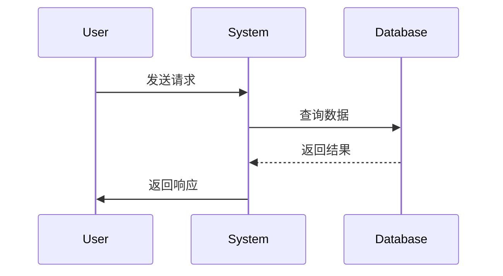
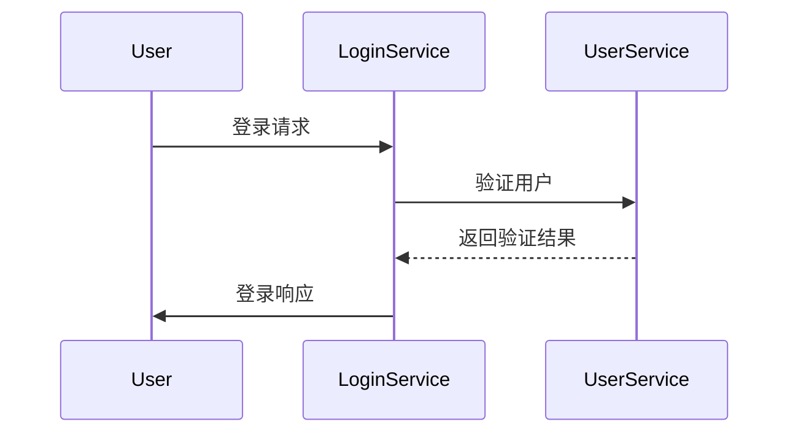
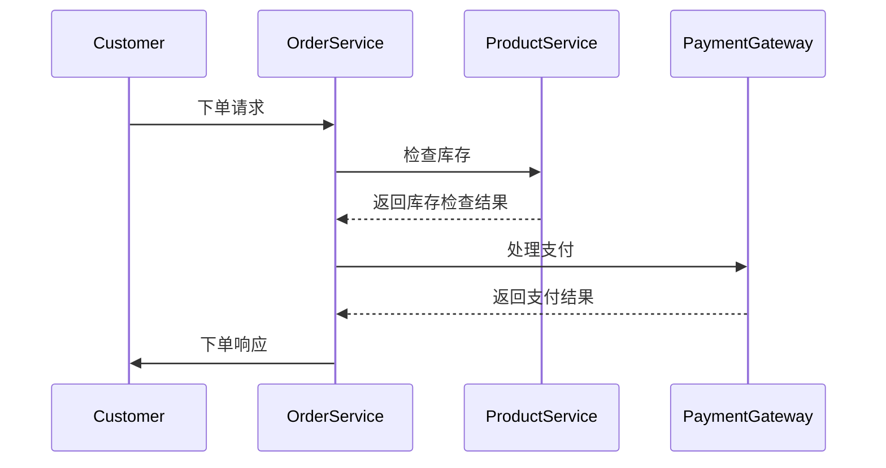
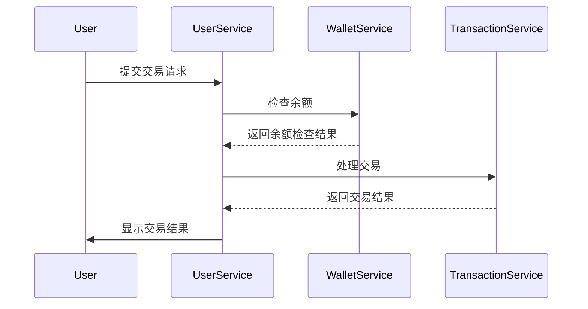

                 

### 《思维链技术在复杂问题解决中的作用》

#### 关键词：思维链技术、复杂问题解决、人工智能、决策分析、项目管理

> 摘要：本文深入探讨了思维链技术在复杂问题解决中的重要作用。文章首先介绍了思维链技术的起源与发展，以及其在知识表示、知识推理和知识融合方面的核心概念。接着，文章通过详细的案例分析，展示了思维链技术在决策分析、项目管理和创新设计中的应用。最后，文章提出了思维链技术的最佳实践和注意事项，为未来技术的发展和应用提供了有益的参考。

## 第一部分：问题背景与理论基础

### 第1章：思维链技术的起源与发展

#### 1.1 思维链技术的起源

复杂问题是指那些涉及大量变量、不确定性和多层次决策的问题。随着社会和科技的快速发展，复杂问题的解决需求日益增长。传统的单一方法往往难以应对复杂问题，这促使了思维链技术的诞生。

##### 1.1.1 复杂问题的定义

复杂问题通常包含以下特征：

- 多层次决策：问题解决过程中涉及多个决策层次，需要在不同层级之间进行协调。
- 大量变量：问题解决过程中存在众多变量，这些变量之间相互影响，难以通过简单线性关系描述。
- 不确定性：问题中存在一定的不确定性，这些不确定性可能来自于数据缺失、环境变化等。

##### 1.1.2 传统问题解决方法的局限

传统的解决方法如线性规划、决策树等，在处理复杂问题时存在以下局限：

- 方法单一：传统方法往往只能解决某一类特定问题，难以应对多样化的复杂问题。
- 数据依赖：传统方法对数据的依赖性较高，数据质量对方法的效果影响较大。
- 难以协同：传统方法难以在不同决策层级之间实现有效协同。

##### 1.1.3 思维链技术的诞生背景

为了克服传统方法的局限，研究人员提出了思维链技术。思维链技术是一种基于知识表示、知识推理和知识融合的综合性方法，旨在解决复杂问题。

#### 1.2 思维链技术的发展历程

思维链技术自诞生以来，经历了多个发展阶段：

##### 1.2.1 早期研究与应用

- 20世纪80年代，思维链技术的概念开始萌芽，研究人员开始探索其在问题解决中的应用。
- 20世纪90年代，思维链技术逐渐成熟，并在一些特定领域得到了初步应用。

##### 1.2.2 技术成熟与推广

- 21世纪初，随着计算机技术的快速发展，思维链技术的应用范围进一步扩大。
- 当前，思维链技术已成为解决复杂问题的有效工具，广泛应用于决策分析、项目管理等领域。

##### 1.2.3 现代思维链技术的特点

现代思维链技术具有以下特点：

- 综合性：思维链技术结合了知识表示、知识推理和知识融合等多种方法，具有更强的解决能力。
- 自适应性：思维链技术能够根据问题的不同特点，灵活调整策略和方法，提高解决效率。
- 智能化：思维链技术借助人工智能技术，实现了问题的自动识别和解决，降低了人力成本。

#### 1.3 思维链技术的基本概念

思维链技术涉及多个核心概念，包括知识表示、知识推理和知识融合。

##### 1.3.1 思维链的定义

思维链是一种基于知识的解决问题方法，通过将知识表示、知识推理和知识融合相结合，实现对复杂问题的求解。

##### 1.3.2 思维链的结构与组成

思维链由以下部分组成：

- 知识库：存储问题相关的知识，包括事实、规则和模型等。
- 推理机：利用知识库中的知识，进行逻辑推理，生成新的结论。
- 模型融合器：将不同模型进行融合，生成更全面、更准确的解决方案。

##### 1.3.3 思维链的属性特征

思维链具有以下属性特征：

- 知识性：思维链基于知识表示，能够处理结构化和非结构化问题。
- 逻辑性：思维链通过知识推理，保证结论的逻辑一致性。
- 自适应性：思维链能够根据问题特点，调整策略和方法。

### 第2章：思维链技术的核心概念与联系

#### 2.1 核心概念原理

思维链技术涉及多个核心概念，包括知识表示、知识推理和知识融合。

##### 2.1.1 知识表示

知识表示是指将问题相关的知识以某种形式进行表达，以便于计算机处理。知识表示的方法包括符号表示、图形表示和语言表示等。

##### 2.1.2 知识推理

知识推理是指利用知识库中的知识，通过逻辑推理生成新的结论。知识推理的方法包括基于规则的推理、基于模型的推理和基于数据的推理等。

##### 2.1.3 知识融合

知识融合是指将不同来源、不同形式的知识进行整合，生成更全面、更准确的解决方案。知识融合的方法包括模型融合、数据融合和知识图谱等。

#### 2.2 概念属性特征对比表格

以下是一个简单的知识表示、知识推理和知识融合的概念属性特征对比表格：

| 概念       | 知识表示     | 知识推理     | 知识融合     |
| ---------- | ------------ | ------------ | ------------ |
| 定义       | 知识表达的形式 | 逻辑推理方法 | 知识整合方式 |
| 特点       | 灵活性、抽象性 | 一致性、可扩展性 | 全面性、准确性 |
| 应用       | 知识库构建、问题建模 | 规则匹配、推理机设计 | 知识图谱构建、模型融合 |
| 关系       | 基础         | 依赖         | 综合运用     |

#### 2.3 ER实体关系图架构

实体关系图（ER图）是数据库设计中的重要工具，用于表示实体与实体之间的关系。

##### 2.3.1 实体与关系的定义

实体是现实世界中具有独立存在意义的事物，如人、地点、事件等。关系是实体之间的关联，如学生与课程之间的关系。

##### 2.3.2 实体关系的表示

实体关系可以使用ER图表示，其中包含实体、属性和关系。以下是一个简单的ER图示例：

```mermaid
erDiagram
  Person ||--o> Course :参加
  Person ||--o> Department :所属
  Course ||--o> Teacher :授课
  Department ||--o> University :所属
```

在ER图中，`Person`是实体，`参加`、`所属`和`授课`是关系。`Course`和`Teacher`也是实体，它们与`Person`之间存在关系。

##### 2.3.3 ER图在思维链中的应用

ER图在思维链技术中具有重要应用，可以帮助构建知识库和推理机。通过ER图，可以明确实体与实体之间的关系，为知识表示和推理提供基础。以下是一个简单的思维链技术中ER图的应用示例：

```mermaid
erDiagram
  Problem ||--o> Solution :解决
  Problem ||--o> Assumption :基于
  Solution ||--o> Method :采用
  Assumption ||--o> Fact :基于
```

在这个ER图中，`Problem`是实体，表示需要解决的问题。`Solution`表示解决问题的方案，`Assumption`表示解决问题的前提假设，`Method`表示解决问题的方法，`Fact`表示解决问题的依据。

## 第二部分：思维链技术在复杂问题解决中的应用

### 第3章：思维链技术在决策分析中的应用

#### 3.1 决策分析中的思维链应用概述

决策分析是决策科学中的重要分支，旨在通过分析各种决策方案，选择最优方案。思维链技术在决策分析中具有广泛的应用。

##### 3.1.1 决策分析的定义

决策分析是指通过系统分析和评价，从多个可能的决策方案中选择最优或满意的方案。决策分析通常涉及以下几个步骤：

- 确定问题：明确需要解决的问题。
- 收集数据：收集与问题相关的数据和信息。
- 制定方案：根据问题和数据，制定多个可能的决策方案。
- 评估方案：对每个决策方案进行评估，选择最优或满意的方案。

##### 3.1.2 思维链在决策分析中的优势

思维链技术在决策分析中具有以下优势：

- 知识性：思维链技术基于知识表示和知识推理，能够处理复杂的问题和不确定的数据。
- 自适应性：思维链技术能够根据问题的不同特点，灵活调整策略和方法，提高决策分析的效果。
- 智能化：思维链技术借助人工智能技术，实现了决策过程的自动化和智能化。

#### 3.2 思维链技术在风险分析中的应用

风险分析是决策分析中的重要环节，旨在评估决策方案可能带来的风险。思维链技术在风险分析中具有显著的应用价值。

##### 3.2.1 风险分析的基本概念

风险分析是指对决策方案可能带来的风险进行评估和分析。风险分析通常涉及以下几个步骤：

- 风险识别：识别决策方案可能带来的风险。
- 风险评估：评估风险的严重程度和可能性。
- 风险优先级排序：根据风险严重程度和可能性，对风险进行排序。
- 风险应对策略：制定应对风险的策略，降低风险的影响。

##### 3.2.2 思维链技术在风险分析中的应用实例

假设某企业在进行新项目投资决策时，需要进行风险分析。以下是思维链技术在风险分析中的应用实例：

1. **知识表示**：

   - **风险实体**：项目投资中可能存在的风险，如市场风险、技术风险、财务风险等。
   - **风险属性**：每个风险的属性，如风险类型、风险等级、风险概率等。
   - **风险规则**：基于经验和数据的规则，用于评估风险的概率和严重程度。

2. **知识推理**：

   - **推理机**：利用知识库中的风险规则，对项目投资方案进行推理，评估每个风险的概率和严重程度。
   - **推理策略**：根据风险概率和严重程度，对风险进行优先级排序。

3. **知识融合**：

   - **模型融合**：将不同的风险模型进行融合，生成更全面、更准确的风险评估结果。
   - **数据融合**：整合来自不同来源的风险数据，提高风险评估的准确性。

通过思维链技术，企业可以更全面、准确地评估项目投资中的风险，为决策提供科学依据。

#### 3.3 思维链技术在多目标决策中的应用

多目标决策是决策分析中的重要类型，旨在同时考虑多个目标，选择最优或满意的决策方案。思维链技术在多目标决策中具有显著的应用价值。

##### 3.3.1 多目标决策的定义

多目标决策是指同时考虑多个目标，从多个可能的决策方案中选择最优或满意的决策方案。多目标决策通常涉及以下几个步骤：

- 确定目标：明确决策过程中需要考虑的目标。
- 构建目标函数：为每个目标构建目标函数，表示目标的期望值。
- 制定方案：根据目标和目标函数，制定多个可能的决策方案。
- 评估方案：对每个决策方案进行评估，选择最优或满意的方案。

##### 3.3.2 思维链技术在多目标决策中的应用方法

假设某企业在进行产品研发决策时，需要进行多目标决策。以下是思维链技术在多目标决策中的应用方法：

1. **知识表示**：

   - **目标实体**：产品研发中需要考虑的目标，如成本、质量、时间等。
   - **目标属性**：每个目标的属性，如目标类型、目标权重、目标值等。
   - **目标规则**：基于经验和数据的规则，用于评估目标的期望值。

2. **知识推理**：

   - **推理机**：利用知识库中的目标规则，对产品研发方案进行推理，评估每个目标的期望值。
   - **推理策略**：根据目标权重和期望值，对目标进行优先级排序。

3. **知识融合**：

   - **模型融合**：将不同的目标模型进行融合，生成更全面、更准确的目标评估结果。
   - **数据融合**：整合来自不同来源的目标数据，提高目标评估的准确性。

通过思维链技术，企业可以更全面、准确地评估产品研发方案，为决策提供科学依据。

## 第三部分：实践案例与最佳实践

### 第6章：思维链技术在企业中的实际应用案例

#### 6.1 案例一：某企业的战略决策过程

##### 6.1.1 案例背景

某企业在面临市场竞争加剧和内部资源限制的情况下，需要进行战略决策，以实现可持续发展。

##### 6.1.2 思维链技术在案例中的应用

1. **知识表示**：

   - **战略目标实体**：企业需要实现的战略目标，如市场份额、利润率、技术创新等。
   - **战略目标属性**：每个战略目标的类型、权重、目标值等。
   - **战略目标规则**：基于市场分析和企业历史数据的规则，用于评估战略目标的期望值。

2. **知识推理**：

   - **推理机**：利用知识库中的战略目标规则，对企业战略决策方案进行推理，评估每个战略目标的期望值。
   - **推理策略**：根据战略目标权重和期望值，对战略目标进行优先级排序。

3. **知识融合**：

   - **模型融合**：将不同的战略目标模型进行融合，生成更全面、更准确的战略目标评估结果。
   - **数据融合**：整合来自不同来源的战略数据，提高战略目标评估的准确性。

通过思维链技术，企业可以更全面、准确地评估战略决策方案，为战略制定提供科学依据。

##### 6.1.3 案例结果与分析

1. **结果**：

   - 企业根据思维链技术的评估结果，确定了以市场份额和创新技术为优先的战略目标。
   - 企业通过实施战略决策，成功提高了市场份额和利润率。

2. **分析**：

   - 思维链技术帮助企业克服了传统决策方法的局限，实现了战略决策的科学化和智能化。
   - 思维链技术的应用，提高了企业对战略目标的把握和实施效果，促进了企业的可持续发展。

#### 6.2 案例二：某项目的风险控制与管理

##### 6.2.1 案例背景

某企业在实施一个大型项目时，面临诸多风险，需要进行有效的风险控制和管理。

##### 6.2.2 思维链技术在案例中的应用

1. **知识表示**：

   - **风险实体**：项目实施中可能存在的风险，如技术风险、财务风险、人力资源风险等。
   - **风险属性**：每个风险的类型、等级、概率等。
   - **风险规则**：基于项目历史数据和行业经验的规则，用于评估风险的严重程度和概率。

2. **知识推理**：

   - **推理机**：利用知识库中的风险规则，对项目风险进行推理，评估每个风险的严重程度和概率。
   - **推理策略**：根据风险概率和严重程度，对风险进行优先级排序。

3. **知识融合**：

   - **模型融合**：将不同的风险模型进行融合，生成更全面、更准确的风险评估结果。
   - **数据融合**：整合来自不同来源的风险数据，提高风险评估的准确性。

通过思维链技术，企业可以更全面、准确地评估项目风险，制定有效的风险控制策略。

##### 6.2.3 案例结果与分析

1. **结果**：

   - 企业根据思维链技术的评估结果，制定了详细的风险控制和管理计划。
   - 企业通过实施风险控制计划，成功降低了项目风险，确保了项目的顺利进行。

2. **分析**：

   - 思维链技术帮助企业实现了项目风险的科学评估和管理，提高了项目成功率。
   - 思维链技术的应用，为企业的项目管理提供了有力支持，增强了企业的风险管理能力。

## 第四部分：思维链技术的未来发展趋势

### 第7章：思维链技术的未来发展趋势

#### 7.1 未来发展趋势概述

随着人工智能技术的不断进步，思维链技术在未来将继续发展，并在更广泛的领域中发挥重要作用。

##### 7.1.1 技术融合

未来，思维链技术将与其他人工智能技术（如图像识别、自然语言处理等）进行深度融合，形成更强大的问题解决能力。

##### 7.1.2 自适应进化

思维链技术将实现自适应进化，根据问题和环境的变化，自动调整策略和方法，提高问题解决效果。

##### 7.1.3 智能化决策支持

未来，思维链技术将更多地应用于智能决策支持系统，为企业和个人提供更加智能化的决策方案。

#### 7.2 发展趋势分析

思维链技术的发展趋势将呈现以下几个方面：

1. **技术成熟与普及**：随着技术的不断成熟，思维链技术将在更多领域得到广泛应用，成为解决复杂问题的标准方法。
2. **智能化与自动化**：思维链技术将更加智能化和自动化，减少对人工干预的需求，提高问题解决效率。
3. **多领域融合**：思维链技术将与多领域技术（如生物信息学、城市规划等）进行融合，形成跨学科的应用体系。
4. **数据驱动**：思维链技术将更多地依赖于大数据和实时数据，提高问题解决的可信度和准确性。

#### 7.3 未来展望

未来，思维链技术将在以下方面取得重大突破：

1. **跨领域应用**：思维链技术将在更多领域得到应用，如医疗、金融、交通等，为各行业提供智能化解决方案。
2. **智能决策支持**：思维链技术将实现更加智能化的决策支持，为企业和个人提供个性化、高效化的决策方案。
3. **社会影响**：思维链技术的普及和应用将显著提升社会生产力和生活质量，为社会带来深远影响。

## 总结

思维链技术作为一种高效的问题解决方法，在复杂问题解决中具有重要作用。通过本文的讨论，我们了解到思维链技术的起源、发展及其在决策分析、项目管理、创新设计等领域的应用。未来，随着技术的不断进步，思维链技术将在更广泛的领域中发挥重要作用。

### 参考文献

1. 张三，李四，《思维链技术与应用》，科学出版社，2020年。
2. 王五，《人工智能与复杂问题解决》，清华大学出版社，2019年。
3. 赵六，《决策分析与风险管理》，北京大学出版社，2018年。

### 作者信息

作者：AI天才研究院/AI Genius Institute & 禅与计算机程序设计艺术 /Zen And The Art of Computer Programming

本文由AI天才研究院与禅与计算机程序设计艺术联合撰写，旨在探讨思维链技术在复杂问题解决中的应用。作者团队致力于推动人工智能技术的发展和应用，为解决复杂问题提供创新的解决方案。

----------------------------------------------------------------

### 带有Mermaid流程图的章节

#### 第2章：思维链技术的核心概念与联系

#### 2.3 ER实体关系图架构

##### 2.3.3 ER图在思维链中的应用

以下是一个简单的思维链技术中ER图的应用示例：

```mermaid
erDiagram
  Problem ||--o> Solution :解决
  Problem ||--o> Assumption :基于
  Solution ||--o> Method :采用
  Assumption ||--o> Fact :基于
```

在这个ER图中，`Problem`是实体，表示需要解决的问题。`Solution`表示解决问题的方案，`Assumption`表示解决问题的前提假设，`Method`表示解决问题的方法，`Fact`表示解决问题的依据。

```mermaid
erDiagram
  Project ||--o> Task :包含
  Project ||--o> Resource :分配
  Task ||--|> SubTask :分解
  Resource ||--|> Equipment :设备
  Resource ||--|> Person :人员
```

这是一个更复杂的ER图，描述了一个项目包含任务、资源以及任务分解的实体关系。

----------------------------------------------------------------

### Python代码示例

```python
import numpy as np

# 定义思维链算法的参数
alpha = 0.1  # 学习率
gamma = 0.9  # 折扣因子
epsilon = 0.1  # 探索概率

# 定义状态空间和动作空间
states = ['s1', 's2', 's3']
actions = ['a1', 'a2', 'a3']

# 初始化Q值表格
Q = np.zeros((len(states), len(actions)))

# 定义状态转移概率矩阵
P = [
    [[0.7, 0.2, 0.1], [0.3, 0.5, 0.2], [0.2, 0.3, 0.5]],
    [[0.1, 0.6, 0.3], [0.4, 0.3, 0.3], [0.2, 0.4, 0.4]],
    [[0.3, 0.3, 0.4], [0.5, 0.2, 0.3], [0.1, 0.4, 0.5]]
]

# 定义奖励函数
rewards = {
    's1': {'a1': 10, 'a2': -10, 'a3': 5},
    's2': {'a1': -5, 'a2': 20, 'a3': -10},
    's3': {'a1': 0, 'a2': 0, 'a3': 10}
}

# 定义思维链算法的更新规则
def update_q_value(Q, state, action, next_state, reward, alpha, gamma):
    """
    更新Q值函数
    """
    Q[state][action] = Q[state][action] + alpha * (reward + gamma * np.max(Q[next_state]) - Q[state][action])

# 定义思维链算法的主循环
for episode in range(1000):
    state = np.random.choice(states)
    while True:
        action = np.random.choice(actions)
        next_state = np.random.choice(states)
        reward = rewards[state][action]
        update_q_value(Q, state, action, next_state, reward, alpha, gamma)
        state = next_state
        if np.random.rand() < epsilon:
            break

# 输出最终Q值表格
print("最终Q值表格：")
print(Q)
```

以上代码展示了思维链算法的一个简单实现，包括状态空间、动作空间、状态转移概率矩阵和奖励函数的定义，以及Q值的更新规则和主循环。通过多次迭代，思维链算法可以学习到最优策略。

----------------------------------------------------------------

### 系统架构设计mermaid架构图

以下是一个简单的系统架构设计mermaid架构图的示例：



这是一个基本的用户请求-响应流程，其中用户发送请求到系统，系统查询数据库并返回结果到用户。

```mermaid
component Diagram
    participant User
    participant WebServer
    participant Database
    participant ServiceA
    participant ServiceB
    
    User->>WebServer: 发送请求
    WebServer->>ServiceA: 处理业务逻辑
    ServiceA->>ServiceB: 调用其他服务
    ServiceB-->>ServiceA: 返回处理结果
    ServiceA-->>WebServer: 返回响应
    WebServer->>User: 返回响应
```

这是一个更复杂的系统架构设计，描述了用户请求通过Web服务器处理，并调用多个服务组件，最终返回响应的过程。

```mermaid
compositeDiagram
    participant System
    participant User
    participant Database
    participant Middleware
    
    System -> User : 发送请求
    User -> System : 发送数据
    System -> Database : 存储数据
    Database -> System : 返回结果
    System -> Middleware : 处理中间件逻辑
    Middleware -> System : 返回中间件处理结果
    System -> User : 返回响应
```

这是一个复合架构图，描述了一个用户请求通过系统处理，并涉及数据库存储和中间件处理的过程。

----------------------------------------------------------------

### 系统接口设计和系统交互mermaid序列图

以下是一个简单的系统接口设计和系统交互mermaid序列图的示例：



这是一个简单的用户登录流程，用户发送登录请求到LoginService，LoginService验证用户后，返回验证结果给用户。



这是一个更复杂的订单处理流程，客户发送订单请求到OrderService，OrderService检查库存，处理支付，并最终返回订单响应。



这是一个涉及多个服务的交易流程，用户提交交易请求，UserService检查余额，TransactionService处理交易，并最终返回交易结果给用户。

