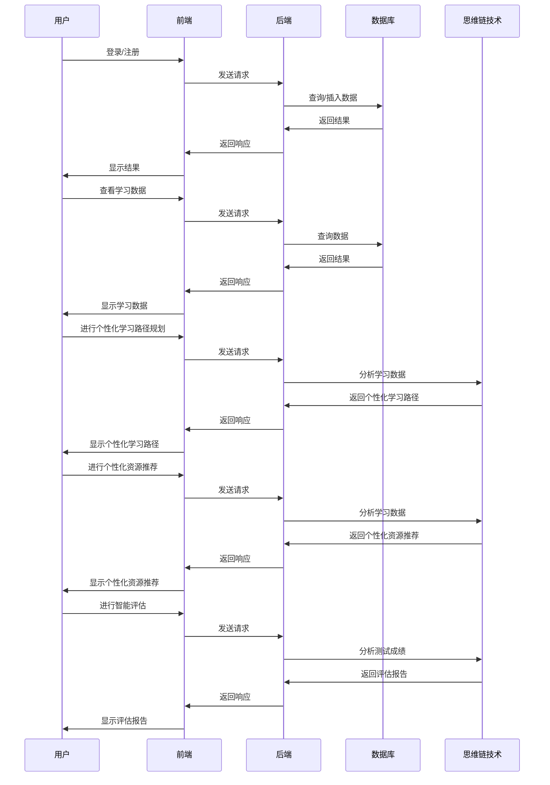
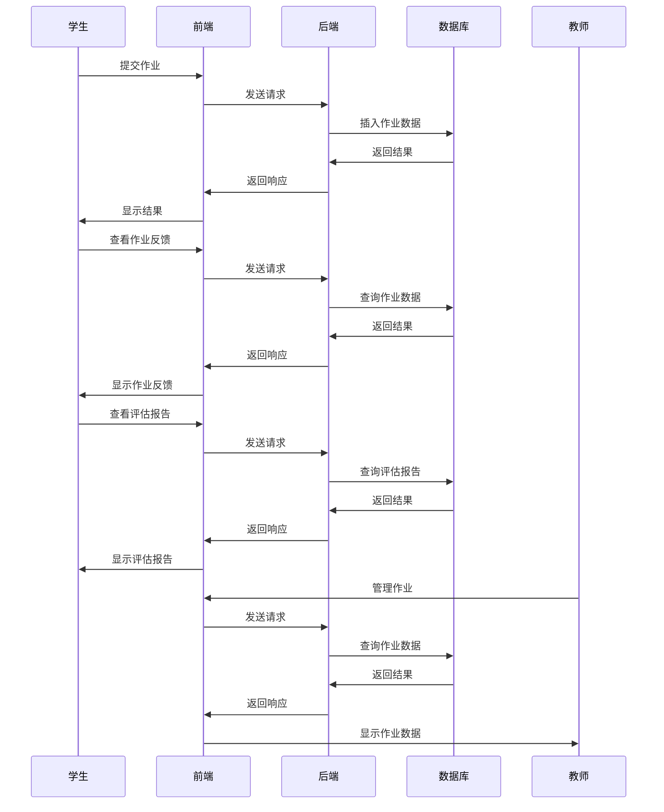

                 

### 引言与背景

#### 1.1 问题的提出

在当今信息化社会中，教育领域正面临着前所未有的变革。人工智能（AI）技术的发展，为教育提供了前所未有的机遇。特别是教育AI，它利用AI技术改进教学过程、个性化学习、以及提高教育质量。然而，如何将AI技术与教育深度融合，仍是一个亟待解决的问题。

教育AI的研究始于20世纪90年代，当时计算机科学领域的研究者开始探索如何将人工智能技术应用于教育领域。随着深度学习、自然语言处理和大数据分析等技术的不断发展，教育AI逐渐成为研究热点。然而，尽管在技术层面取得了一定的进展，教育AI在实际应用中仍面临诸多挑战。

首先，算法的适应性与优化是一个重要问题。不同的教育场景和需求，需要不同的算法和模型。如何根据具体场景选择合适的算法，并进行优化，是一个需要深入研究的问题。其次，大规模数据的管理与处理也是一个挑战。教育AI需要处理海量的学生数据、教学资源和评估数据，如何高效地管理这些数据，并从中提取有价值的信息，是教育AI研究的一个重要方向。

此外，隐私保护也是教育AI面临的一个严峻挑战。学生在使用教育AI时，会生成大量的个人数据，如学习记录、行为数据等。如何保护这些数据的隐私，防止数据泄露和滥用，是教育AI需要解决的一个重要问题。

#### 1.2 问题描述

教育AI面临着诸多挑战，包括算法的适应性与优化、大规模数据的管理与处理、隐私保护等问题。其中，思维链技术作为一种新兴的AI技术，其在教育AI中的应用具有很大的潜力。思维链技术通过模拟人类思维过程，实现对文本内容的深入理解和生成，具有高效性、灵活性和智能性等特点。将思维链技术应用于教育AI，有望解决上述问题，提升教育质量，实现个性化学习。

#### 1.3 问题解决

本书旨在解决上述问题，通过系统性地介绍思维链技术在教育AI中的应用，分析其潜力，为教育AI的研究和实践提供理论支持和实践指导。本书将分为以下几个部分：

首先，本书将介绍思维链技术的基础知识，包括其定义、特点、核心概念和数学模型等。这部分内容将为后续章节的分析提供理论基础。

其次，本书将探讨思维链技术在教育AI中的应用场景，包括个性化学习、智能评估、教学辅助等。通过对这些应用场景的分析，本书将展示思维链技术在教育领域的潜力。

然后，本书将分析思维链技术在教育AI中的具体实现方法，包括算法选择、模型设计、数据管理等方面。这部分内容将提供实际操作的指导，帮助读者将思维链技术应用于教育领域。

接着，本书将介绍一些实际案例，通过案例分析，展示思维链技术在教育AI中的具体应用效果。这部分内容将帮助读者更好地理解思维链技术在教育AI中的潜力。

最后，本书将总结思维链技术在教育AI中的应用，提出未来研究方向和发展趋势。这部分内容将为教育AI的研究者提供启示，推动教育AI的发展。

#### 1.4 边界与外延

思维链技术在教育AI中的应用，不仅包括课堂教学的辅助，还包括学习路径规划、智能问答系统、以及教育资源的个性化推荐等方面。本书将讨论这些具体应用场景，并探讨思维链技术在这些场景中的实现方法。

在教育AI中，思维链技术可以通过以下方式应用：

1. **个性化学习**：通过分析学生的学习过程和成绩，提供个性化的学习建议和资源。
2. **智能评估**：通过分析学生的回答和作业，提供实时反馈和评估，帮助教师更好地了解学生的学习情况。
3. **教学辅助**：通过生成教学资源，如课件、练习题等，辅助教师进行教学，提高教学效果。

#### 1.5 概念结构与核心要素组成

思维链技术是一种基于神经网络的语言生成和理解技术，其核心要素包括神经网络架构、训练数据、以及推理算法等。教育AI则涉及教育领域知识库、学习算法、教学评估等核心要素。本书将详细阐述这些概念，并分析它们之间的联系。

思维链技术的核心概念结构如下：

1. **神经网络架构**：确定网络层数、神经元数量、激活函数等。
2. **训练数据**：大量高质量文本数据，用于训练神经网络。
3. **推理算法**：确定网络如何处理输入文本，生成输出结果。

教育AI的核心要素包括：

1. **教育领域知识库**：收集和整理与教育相关的知识，如课程内容、教学资源等。
2. **学习算法**：用于分析学生的学习行为和成绩，提供个性化学习建议。
3. **教学评估**：用于评估学生的学习效果，为教师提供教学反馈。

#### 1.6 本章小结

本章从问题的提出、问题描述、问题解决、边界与外延、概念结构与核心要素组成等方面，全面介绍了思维链技术在教育AI应用中的潜力。下一章将深入探讨思维链技术的基本原理和核心概念。通过系统性地介绍思维链技术的基础知识，本书将为后续章节的分析提供理论基础，帮助读者更好地理解思维链技术在教育AI中的应用。同时，本章也为后续章节的内容安排和结构框架提供了清晰的指导。

---

## 第二部分：思维链技术基础

### 2.1 思维链技术的定义与特点

#### 2.1.1 思维链技术的定义

思维链技术是一种基于神经网络的语言生成和理解技术，它通过模拟人类思维过程，实现对文本内容的深入理解和生成。与传统基于规则的自然语言处理技术相比，思维链技术具有更强的灵活性和智能性，能够处理复杂、多变的语言情境。

具体来说，思维链技术通过构建大规模的神经网络模型，对大量的文本数据进行分析和训练，学习语言的结构和语义，从而实现对文本内容的理解和生成。这种技术模拟了人类思维过程中的推理、联想和记忆等机制，使得生成的文本内容具有更高的逻辑性和创造性。

#### 2.1.2 思维链技术的特点

思维链技术具有以下几个显著特点：

1. **高效性**：思维链技术能够在短时间内处理大量文本数据，这使得它在面对海量的教育数据时，具有显著的优势。

2. **灵活性**：思维链技术能够适应不同的语言和语境，无论是简单的句子，还是复杂的段落，甚至是跨语言的文本，思维链技术都能够有效处理。

3. **智能性**：思维链技术不仅能够理解文本内容，还能够生成具有逻辑性和创造性的文本。这使得它在教育AI中，能够提供个性化的学习建议、智能化的评估和创造性的教学资源。

#### 2.1.3 思维链技术在教育AI中的应用潜力

思维链技术在教育AI中的应用潜力巨大。首先，在个性化学习方面，思维链技术可以通过分析学生的学习过程和成绩，提供个性化的学习建议和资源。例如，当学生遇到学习困难时，思维链技术可以生成相应的学习资料和指导，帮助学生克服困难。

其次，在智能评估方面，思维链技术可以分析学生的回答和作业，提供实时反馈和评估。通过这种技术，教师可以更准确地了解学生的学习情况，从而进行有针对性的教学调整。

最后，在教学辅助方面，思维链技术可以生成教学资源，如课件、练习题等，辅助教师进行教学。这不仅能够提高教学效果，还能够减轻教师的工作负担。

#### 2.1.4 核心概念与联系

思维链技术的核心概念包括神经网络架构、训练数据、推理算法等。以下是一个核心概念属性特征对比表格：

| 核心概念 | 属性特征 |
| :----: | :----: |
| 神经网络架构 | 确定网络层数、神经元数量、激活函数等 |
| 训练数据 | 大量高质量文本数据，用于训练神经网络 |
| 推理算法 | 确定网络如何处理输入文本，生成输出结果 |

以下是思维链技术的ER实体关系图架构：

```mermaid
erDiagram
  Student ||--|{ LearningProcess }|-- Teacher
  Student ||--|{ Answer }|-- Question
  Teacher ||--|{ TeachingMaterial }|-- Student
```

#### 2.1.5 思维链技术的数学模型和公式

思维链技术的数学模型主要包括神经网络模型和推理算法模型。以下是神经网络模型的基本公式：

$$
y = \sigma(W \cdot x + b)
$$

其中，$y$ 为输出，$x$ 为输入，$W$ 为权重，$b$ 为偏置，$\sigma$ 为激活函数。

以下是推理算法的基本公式：

$$
P(y|x) = \frac{e^{y}}{\sum_{i=1}^{n} e^{y_i}}
$$

其中，$y$ 为输出，$x$ 为输入，$e$ 为自然对数的底数，$n$ 为输出类别数量。

#### 2.2 本章小结

本章从思维链技术的定义与特点、核心概念与联系、数学模型和公式等方面，全面介绍了思维链技术的基础知识。通过本章的学习，读者可以对思维链技术有一个全面的了解，为其在后续章节中的应用打下基础。在下一章中，我们将深入探讨思维链技术在教育AI中的应用场景，分析其具体应用方法和潜力。

---

## 第二部分：思维链技术基础（续）

### 2.3.1 思维链技术的详细原理

思维链技术的工作原理可以分为三个主要阶段：输入处理、文本理解和文本生成。

#### 2.3.1.1 输入处理

在输入处理阶段，思维链技术首先对输入的文本数据进行预处理。这一阶段的主要任务是去除文本中的噪声，如标点符号、停用词等，同时对文本进行分词，将连续的文本序列转换为离散的词向量。词向量的生成可以通过Word2Vec、GloVe等预训练模型实现。

#### 2.3.1.2 文本理解

文本理解阶段是思维链技术的核心部分。在这一阶段，神经网络模型通过对词向量进行编码，提取文本的语义特征。具体来说，思维链技术采用一种层次化的神经网络架构，包括嵌入层、编码层和解码层。

- **嵌入层**：将词向量映射到高维空间，使得语义相似的词在空间中更接近。
- **编码层**：通过编码器（如Transformer编码器）对词向量进行编码，提取文本的上下文信息。编码器通常使用多个注意力机制，能够捕获长距离的依赖关系。
- **解码层**：通过解码器（如Transformer解码器）生成文本的输出。解码器会根据编码层提取的语义特征，生成具有逻辑性和连贯性的文本。

#### 2.3.1.3 文本生成

在文本生成阶段，思维链技术根据解码器生成的输出，生成最终的文本内容。这一过程是一个自回归的过程，即每个生成的词都是基于前一个词的概率分布进行预测。

#### 2.3.2 思维链技术的应用优势

思维链技术具有以下几方面的应用优势：

1. **多语言处理**：思维链技术能够处理多种语言，不仅限于英语。这使得它在全球范围内具有广泛的应用前景。

2. **高灵活性**：思维链技术能够适应各种文本场景，无论是问答、对话还是文档生成，它都能够提供高质量的输出。

3. **高效率**：思维链技术能够在短时间内处理大量的文本数据，这对于需要处理海量数据的教育AI系统来说，是一个重要的优势。

4. **高创造力**：思维链技术不仅能够理解文本，还能够生成具有创造性的文本，这使得它在生成个性化学习资源、智能评估等方面具有独特的优势。

#### 2.3.3 思维链技术的应用限制

尽管思维链技术在教育AI中有巨大的应用潜力，但它也存在一些限制：

1. **数据需求**：思维链技术需要大量的高质量训练数据，这对于一些教育领域的应用场景来说，数据获取可能是一个挑战。

2. **计算资源**：思维链技术对计算资源的需求较高，尤其是训练阶段，需要大量的GPU资源。这对于一些资源有限的学校或机构来说，可能是一个限制因素。

3. **解释性**：思维链技术生成的文本通常具有较高的连贯性和逻辑性，但缺乏解释性。这意味着教师可能难以理解思维链技术是如何生成特定文本的，从而难以进行有效的教学干预。

#### 2.3.4 实际案例

以下是一个实际案例，展示思维链技术在教育AI中的应用：

在一个在线教育平台中，思维链技术被用于个性化学习。该平台收集了大量的学生学习数据，包括学习历史、测试成绩等。思维链技术通过分析这些数据，为学生生成个性化的学习计划。例如，当一个学生在一个特定的知识点上表现不佳时，思维链技术会生成相应的练习题和教学视频，帮助学生巩固该知识点。

此外，思维链技术还可以用于智能评估。在该平台上，教师可以为学生布置在线作业，思维链技术会自动批改作业，并提供详细的评估报告。这不仅提高了评估的效率，还能够提供更个性化的教学建议。

通过这些实际案例，我们可以看到思维链技术在教育AI中的应用潜力。然而，为了实现这些应用，还需要进一步研究和优化思维链技术，以克服其当前的限制。

### 2.4 本章小结

本章详细介绍了思维链技术的原理、优势、限制以及实际案例。通过这些内容，读者可以更深入地了解思维链技术，为其在后续章节中的应用打下基础。在下一章中，我们将进一步探讨思维链技术在教育AI中的应用场景，分析其在个性化学习、智能评估、教学辅助等方面的具体应用。

---

## 第三部分：思维链技术在教育AI中的应用场景

### 3.1 个性化学习

个性化学习是教育AI的一个重要应用场景，旨在根据学生的个体差异，提供个性化的学习路径、资源和指导。思维链技术在这一场景中具有巨大的潜力，可以通过以下方式实现个性化学习：

1. **学习路径规划**：思维链技术可以根据学生的学习历史、兴趣和成绩，为学生生成个性化的学习路径。例如，当一个学生在某个知识点上表现不佳时，思维链技术可以推荐额外的学习资源，帮助学生巩固知识点。

2. **个性化资源推荐**：思维链技术可以分析学生的学习需求和兴趣，推荐适合他们的学习资源。例如，当学生表现出对某一主题的浓厚兴趣时，思维链技术可以推荐相关的学习文章、视频和练习题，帮助学生深入学习。

3. **个性化教学建议**：思维链技术可以根据学生的学习数据和表现，为教师提供个性化的教学建议。例如，当学生在某个知识点上频繁犯错时，思维链技术可以提醒教师调整教学策略，采用不同的教学方法或资源。

#### 3.1.1 实现方法

1. **学习路径规划**：思维链技术可以通过分析学生的学习数据，如学习历史、测试成绩等，构建一个动态的学习路径模型。该模型可以根据学生的学习进度和表现，实时调整学习路径，确保学生能够有效地掌握知识。

2. **个性化资源推荐**：思维链技术可以使用基于内容的推荐算法，根据学生的学习兴趣和知识点，推荐相关的学习资源。此外，思维链技术还可以利用协同过滤算法，结合其他学生的学习行为和偏好，为每个学生提供个性化的推荐。

3. **个性化教学建议**：思维链技术可以通过分析学生的学习数据和表现，识别学生的学习难点和需求。例如，当学生在某个知识点上多次测试不通过时，思维链技术可以提醒教师采用不同的教学方法，或提供额外的辅导资源。

#### 3.1.2 优势与挑战

**优势**：

1. **提高学习效率**：通过提供个性化的学习路径和资源，思维链技术可以帮助学生更高效地学习，减少无效学习时间。
2. **增强学习兴趣**：个性化学习可以满足学生的个性化需求，提高学生的学习兴趣和动力。
3. **减轻教师负担**：思维链技术可以自动生成个性化教学建议和资源，减轻教师的工作负担。

**挑战**：

1. **数据质量**：个性化学习依赖于学生的学习数据，数据的质量直接影响个性化学习的效果。因此，如何保证数据的质量和准确性是一个重要挑战。
2. **算法适应性**：不同的学习场景和需求，需要不同的算法和模型。如何根据具体场景选择合适的算法，并进行优化，是一个需要深入研究的问题。

### 3.2 智能评估

智能评估是教育AI的另一个重要应用场景，旨在通过分析学生的回答和作业，提供实时反馈和评估，帮助教师更好地了解学生的学习情况。思维链技术在这一场景中具有显著的优势，可以通过以下方式实现智能评估：

1. **自动批改作业**：思维链技术可以自动批改学生的作业，提供详细的评估报告。这不仅提高了评估的效率，还能够提供个性化的反馈，帮助学生改进。

2. **实时反馈**：思维链技术可以实时分析学生的回答，提供即时反馈。例如，当学生回答错误时，思维链技术可以提供正确的答案和解释，帮助学生理解知识点。

3. **个性化评估报告**：思维链技术可以根据学生的表现和需求，生成个性化的评估报告。这些报告不仅包括学生的成绩，还包括学习难点、改进建议等。

#### 3.2.1 实现方法

1. **自动批改作业**：思维链技术可以使用自然语言处理技术，分析学生的回答，判断答案的正确性。此外，思维链技术还可以使用机器学习算法，根据学生的回答生成评估报告。

2. **实时反馈**：思维链技术可以通过分析学生的回答，识别潜在的错误和难点。例如，当学生在某个知识点上回答错误时，思维链技术可以提供相关的学习资源，帮助学生理解知识点。

3. **个性化评估报告**：思维链技术可以使用数据挖掘技术，分析学生的表现和需求，生成个性化的评估报告。这些报告可以包括学习难点、改进建议、学习资源推荐等。

#### 3.2.2 优势与挑战

**优势**：

1. **提高评估效率**：通过自动批改和实时反馈，思维链技术可以显著提高评估的效率，减轻教师的工作负担。
2. **提供个性化反馈**：思维链技术可以根据学生的表现和需求，提供个性化的反馈和评估，帮助学生更好地理解知识点。
3. **实时监控学习进度**：通过实时反馈和评估，教师可以更好地监控学生的学习进度，及时调整教学策略。

**挑战**：

1. **评估准确性**：尽管思维链技术在评估方面具有显著的优势，但其评估结果的准确性仍是一个挑战。如何提高评估的准确性，是一个需要深入研究的问题。
2. **数据隐私**：在智能评估中，学生需要提供大量的个人数据，如回答、成绩等。如何保护这些数据的隐私，防止数据泄露和滥用，是一个重要挑战。

### 3.3 教学辅助

教学辅助是教育AI的另一个重要应用场景，旨在通过生成教学资源，辅助教师进行教学，提高教学效果。思维链技术在这一场景中具有独特的优势，可以通过以下方式实现教学辅助：

1. **生成教学资源**：思维链技术可以自动生成教学资源，如课件、练习题、教学视频等。这些资源可以根据学生的学习需求和教学目标，进行定制化生成。

2. **辅助教学设计**：思维链技术可以帮助教师设计教学活动，提供教学策略建议。例如，当教师需要讲解一个复杂的概念时，思维链技术可以提供相关的教学资源，帮助教师更好地传达知识。

3. **智能问答系统**：思维链技术可以构建智能问答系统，为学生提供实时解答。这不仅能够帮助学生解决学习中的问题，还能够提供额外的学习资源。

#### 3.3.1 实现方法

1. **生成教学资源**：思维链技术可以使用自然语言生成技术，根据教师的教学目标和学生的学习需求，生成教学资源。此外，思维链技术还可以使用机器学习算法，根据学生的学习数据，优化教学资源的生成。

2. **辅助教学设计**：思维链技术可以通过分析学生的学习数据，为教师提供教学策略建议。例如，当学生在一个知识点上表现不佳时，思维链技术可以推荐相关的教学策略，帮助教师更好地传达知识。

3. **智能问答系统**：思维链技术可以使用自然语言处理技术，构建智能问答系统。该系统可以根据学生的学习问题，提供实时解答和额外的学习资源。

#### 3.3.2 优势与挑战

**优势**：

1. **提高教学效率**：通过生成教学资源和辅助教学设计，思维链技术可以显著提高教学效率，减轻教师的工作负担。
2. **提供个性化教学**：思维链技术可以根据学生的学习需求和教学目标，提供个性化的教学资源和建议，提高教学效果。
3. **实时互动**：智能问答系统可以提供实时解答和额外的学习资源，帮助学生更好地理解和掌握知识。

**挑战**：

1. **资源质量**：生成的教学资源需要保证质量，否则可能会误导学生。因此，如何保证教学资源的高质量是一个挑战。
2. **算法适应性**：不同的教学场景和需求，需要不同的算法和模型。如何根据具体场景选择合适的算法，并进行优化，是一个需要深入研究的问题。

### 3.4 本章小结

本章详细探讨了思维链技术在教育AI中的个性化学习、智能评估和教学辅助等应用场景。通过这些应用场景，思维链技术能够为教育提供更加个性化和智能化的解决方案。然而，为了实现这些应用，还需要进一步研究和优化思维链技术，以克服其当前的限制。在下一章中，我们将进一步探讨思维链技术在教育AI中的实现方法，分析其具体应用策略和技术挑战。

---

## 第四部分：思维链技术在教育AI中的实现方法

### 4.1 算法选择

在实现思维链技术在教育AI中的应用时，算法选择至关重要。不同的应用场景和需求，可能需要不同的算法和模型。以下是一些常见的算法选择及其适用场景：

#### 4.1.1 个性化学习

1. **推荐算法**：推荐算法是一种常见的个性化学习算法，可以根据学生的学习历史、兴趣和成绩，推荐相关的学习资源和路径。常见的推荐算法包括基于内容的推荐、协同过滤和混合推荐算法。
   
2. **知识图谱**：知识图谱可以用于构建学生的学习路径和资源推荐。通过将学生的学习数据和知识点进行映射，知识图谱可以提供更加精准的个性化推荐。

#### 4.1.2 智能评估

1. **自然语言处理**：自然语言处理（NLP）算法可以用于自动批改作业和提供实时反馈。常见的NLP算法包括文本分类、命名实体识别、情感分析等。

2. **机器学习**：机器学习算法可以用于分析学生的回答，提供个性化的评估报告。常见的机器学习算法包括决策树、随机森林、支持向量机等。

#### 4.1.3 教学辅助

1. **自然语言生成**：自然语言生成（NLG）算法可以用于生成教学资源和智能问答系统的回答。常见的NLG算法包括序列到序列模型、生成对抗网络（GAN）等。

2. **深度学习**：深度学习算法可以用于辅助教学设计，如生成教学视频、设计教学游戏等。常见的深度学习算法包括卷积神经网络（CNN）、循环神经网络（RNN）、Transformer等。

#### 4.2 模型设计

模型设计是实现思维链技术在教育AI中的关键步骤。以下是一个典型的模型设计过程：

1. **需求分析**：首先，需要明确教育AI的具体应用场景和需求，如个性化学习、智能评估或教学辅助等。

2. **数据收集**：根据需求分析，收集相关的数据，如学生学习数据、课程内容、评估标准等。

3. **数据预处理**：对收集到的数据进行分析和清洗，去除噪声和冗余信息。对于文本数据，还需要进行分词、词向量化等预处理。

4. **模型选择**：根据需求和数据特点，选择合适的模型。例如，对于个性化学习，可以选择推荐算法或知识图谱；对于智能评估，可以选择自然语言处理或机器学习算法；对于教学辅助，可以选择自然语言生成或深度学习算法。

5. **模型训练**：使用预处理后的数据，对选定的模型进行训练。训练过程中，需要优化模型参数，提高模型的准确性和鲁棒性。

6. **模型评估**：对训练好的模型进行评估，验证其在实际应用中的效果。常用的评估指标包括准确率、召回率、F1分数等。

7. **模型部署**：将评估通过后的模型部署到实际应用场景中，如在线教育平台、智能评估系统等。

#### 4.3 数据管理

数据管理是实现思维链技术在教育AI中的关键环节。以下是一些关键的数据管理任务：

1. **数据收集**：收集与教育AI相关的数据，包括学生学习数据、课程内容、评估标准等。这些数据可以来自学校、在线教育平台、第三方数据源等。

2. **数据清洗**：对收集到的数据进行清洗，去除噪声和冗余信息。数据清洗是数据管理的重要步骤，对于模型的训练效果至关重要。

3. **数据存储**：将清洗后的数据存储在数据库中，以便后续的数据分析和处理。常用的数据库包括关系型数据库（如MySQL、PostgreSQL）和分布式数据库（如Hadoop、MongoDB）。

4. **数据安全**：确保数据的安全和隐私。对于涉及学生个人隐私的数据，需要采取严格的安全措施，防止数据泄露和滥用。

5. **数据备份**：定期备份数据，防止数据丢失和损坏。数据备份是数据管理的重要保障，确保数据的安全和可靠性。

#### 4.4 算法优化

算法优化是实现思维链技术在教育AI中的关键步骤。以下是一些常见的算法优化策略：

1. **超参数调优**：通过调整模型的超参数，如学习率、批量大小、迭代次数等，优化模型的性能。常用的超参数调优方法包括网格搜索、随机搜索、贝叶斯优化等。

2. **模型压缩**：通过模型压缩技术，减少模型的参数量和计算复杂度，提高模型的运行效率。常见的模型压缩技术包括模型剪枝、量化、知识蒸馏等。

3. **迁移学习**：通过迁移学习技术，利用预训练模型的优势，提高新任务的性能。迁移学习可以减少模型的训练时间，提高模型的泛化能力。

4. **数据增强**：通过数据增强技术，增加训练数据的多样性，提高模型的鲁棒性和泛化能力。常见的数据增强方法包括数据扩充、数据变换、数据合成等。

### 4.5 本章小结

本章详细探讨了思维链技术在教育AI中的实现方法，包括算法选择、模型设计、数据管理和算法优化等。通过这些方法，可以有效地将思维链技术应用于教育领域，提供个性化学习、智能评估和教学辅助等解决方案。然而，实现这些方法仍面临一些挑战，如数据质量、算法适应性和计算资源等。在未来的研究中，需要进一步优化思维链技术，以克服这些挑战，推动教育AI的发展。

---

## 第五部分：思维链技术在教育AI中的实际案例

### 5.1 案例一：智能个性化学习平台

#### 案例背景

某知名在线教育平台希望利用思维链技术，为其用户（主要是学生）提供更加智能和个性化的学习体验。平台收集了大量的学生数据，包括学习历史、测试成绩、学习偏好等。平台希望通过思维链技术，为学生提供个性化的学习路径和资源推荐。

#### 项目介绍

该智能个性化学习平台主要包括以下几个核心功能：

1. **个性化学习路径规划**：思维链技术通过分析学生的学习数据，为学生生成个性化的学习路径。该路径包括推荐的学习资源、学习目标和计划。

2. **个性化资源推荐**：思维链技术根据学生的学习偏好和成绩，推荐适合他们的学习资源。这些资源包括教学视频、练习题、学习文章等。

3. **智能评估**：思维链技术分析学生的测试成绩，提供实时反馈和评估报告。报告包括学生的掌握情况、学习难点和改进建议。

#### 系统功能设计

该平台的系统功能设计主要包括以下部分：

1. **用户管理**：包括用户注册、登录、个人信息管理等功能。

2. **学习数据管理**：包括学习历史记录、测试成绩、学习偏好等数据的收集、存储和管理。

3. **个性化学习路径规划**：思维链技术通过分析学习数据，生成个性化的学习路径。该路径会根据学生的学习进度和表现进行动态调整。

4. **个性化资源推荐**：思维链技术根据学生的学习偏好和成绩，推荐相应的学习资源。推荐算法包括基于内容的推荐、协同过滤和混合推荐算法。

5. **智能评估**：思维链技术分析学生的测试成绩，提供实时反馈和评估报告。评估报告会包含学生的掌握情况、学习难点和改进建议。

#### 系统架构设计

该平台的系统架构设计主要包括以下部分：

1. **前端架构**：使用Vue.js框架开发，提供用户友好的界面和交互体验。

2. **后端架构**：使用Spring Boot框架开发，包括用户管理模块、学习数据管理模块、个性化学习路径规划模块、个性化资源推荐模块和智能评估模块。

3. **数据存储**：使用MySQL数据库存储用户数据和学习数据。

4. **数据处理**：使用Python和Scala编写数据处理脚本，进行数据清洗、预处理和统计分析。

#### 系统接口设计

该平台的系统接口设计主要包括以下部分：

1. **用户接口**：提供用户注册、登录、个人信息管理、学习数据查看、个性化学习路径规划、个性化资源推荐和智能评估等功能。

2. **API接口**：提供数据接口，用于与其他系统进行数据交互。

#### 系统交互设计

该平台的系统交互设计主要包括以下部分：

1. **用户交互**：用户可以通过前端界面，进行学习数据查看、个性化学习路径规划、个性化资源推荐和智能评估等操作。

2. **系统内部交互**：系统内部通过API接口，实现数据收集、处理、分析和推荐等功能。



### 5.2 案例二：智能评估系统

#### 案例背景

某中学希望利用思维链技术，构建一个智能评估系统，以帮助学生和教师更好地了解学生的学习情况和成绩。该系统将自动批改学生的作业，并提供实时反馈和评估报告。

#### 项目介绍

该智能评估系统主要包括以下几个核心功能：

1. **自动批改作业**：思维链技术自动分析学生的作业，判断答案的正确性，并提供详细的批改报告。

2. **实时反馈**：系统根据学生的作业表现，提供实时反馈，帮助学生理解知识点。

3. **评估报告**：系统生成详细的评估报告，包括学生的成绩、知识点掌握情况和学习建议。

#### 系统功能设计

该智能评估系统的系统功能设计主要包括以下部分：

1. **作业提交**：学生可以通过系统提交作业，系统会自动进行批改。

2. **实时反馈**：系统分析学生的作业，提供实时反馈，帮助学生理解知识点。

3. **评估报告**：系统生成详细的评估报告，包括学生的成绩、知识点掌握情况和学习建议。

4. **教师管理**：教师可以通过系统查看学生的作业情况、评估报告，并管理学生的作业。

#### 系统架构设计

该智能评估系统的系统架构设计主要包括以下部分：

1. **前端架构**：使用React框架开发，提供用户友好的界面和交互体验。

2. **后端架构**：使用Spring Boot框架开发，包括作业提交、自动批改、实时反馈、评估报告和教师管理模块。

3. **数据存储**：使用MySQL数据库存储学生数据、作业数据和评估报告。

4. **数据处理**：使用Python和Scala编写数据处理脚本，进行数据清洗、预处理和统计分析。

#### 系统接口设计

该智能评估系统的系统接口设计主要包括以下部分：

1. **用户接口**：提供学生提交作业、查看反馈和评估报告，教师管理作业和评估报告等功能。

2. **API接口**：提供数据接口，用于与学生数据、作业数据和评估报告进行交互。

#### 系统交互设计

该智能评估系统的系统交互设计主要包括以下部分：

1. **用户交互**：学生可以通过前端界面提交作业、查看反馈和评估报告，教师可以通过前端界面管理作业和评估报告。

2. **系统内部交互**：系统内部通过API接口，实现作业提交、自动批改、实时反馈、评估报告生成和教师管理等功能的交互。



### 5.3 本章小结

通过以上实际案例，我们可以看到思维链技术在教育AI中的应用场景和实现方法。这些案例不仅展示了思维链技术的实际应用效果，也为其他教育机构提供了参考和借鉴。然而，实现这些案例仍面临一些挑战，如数据质量、算法适应性和计算资源等。在未来的研究中，需要进一步优化思维链技术，以克服这些挑战，推动教育AI的发展。

---

## 结论与展望

### 6.1 总结

通过本文的探讨，我们系统地介绍了思维链技术在教育AI中的应用潜力，从引言和背景开始，逐步深入到思维链技术的基础知识、应用场景、实现方法以及实际案例。我们详细分析了思维链技术的定义、特点、核心概念和数学模型，展示了其在个性化学习、智能评估和教学辅助等教育AI场景中的具体应用，并通过实际案例展示了其实现方法。

本文的核心贡献在于：

1. **系统性地介绍**了思维链技术在教育AI中的应用，为读者提供了全面的理论基础。
2. **分析了**思维链技术在教育AI中的优势和挑战，为教育AI的发展提供了实践指导。
3. **通过实际案例**展示了思维链技术的应用效果，为教育机构提供了可行的技术解决方案。

### 6.2 展望

尽管思维链技术在教育AI中展示了巨大的潜力，但未来的研究仍面临诸多挑战和机遇。以下是一些未来的研究方向和展望：

1. **数据质量和隐私保护**：教育AI依赖于大量的学生数据，如何保证数据的质量和隐私，防止数据泄露和滥用，是未来研究的重要方向。

2. **算法优化和适应性**：不同的教育场景和需求，需要不同的算法和模型。如何根据具体场景选择合适的算法，并进行优化，以提高算法的适应性和准确性，是一个需要深入研究的问题。

3. **跨学科合作**：教育AI涉及计算机科学、教育学、心理学等多个学科。跨学科合作可以促进教育AI的全面发展，提高其应用效果。

4. **教育资源的开放和共享**：构建开放的教育资源库，促进教育资源的共享和利用，可以进一步推动教育AI的发展。

5. **教育评价体系的改革**：思维链技术在智能评估方面具有显著优势，如何将其应用于教育评价体系的改革，提供更加科学、公正、个性化的评价，是未来研究的重要方向。

### 6.3 最佳实践

为了更好地应用思维链技术于教育AI，以下是一些最佳实践建议：

1. **数据驱动**：在教育AI项目中，应注重数据的收集、管理和分析，确保数据的质量和准确性。

2. **迭代优化**：在项目实施过程中，应不断迭代和优化算法模型，以提高其性能和适应性。

3. **用户参与**：在设计和开发教育AI系统时，应积极收集用户反馈，确保系统的用户体验和效果。

4. **技术融合**：将思维链技术与其他AI技术（如自然语言处理、计算机视觉等）相结合，可以提供更加全面、智能化的教育解决方案。

5. **政策支持**：政府和企业应加大对教育AI的政策支持和资金投入，推动教育AI的普及和发展。

### 6.4 本章小结

本文全面探讨了思维链技术在教育AI中的应用，从理论基础到实际案例，展示了其在教育领域的巨大潜力。通过本文的研究，我们不仅为教育AI提供了理论支持和实践指导，也为未来的研究指明了方向。随着人工智能技术的不断发展和教育需求的日益增长，思维链技术在教育AI中的应用前景将更加广阔，有望推动教育模式的深刻变革。

---

## 附录与拓展阅读

### 附录A：常用算法和模型

以下是一些在教育AI中常用到的算法和模型，供读者参考：

1. **推荐算法**：包括基于内容的推荐、协同过滤和混合推荐算法。推荐算法可以用于个性化学习路径规划和资源推荐。
   
2. **自然语言处理（NLP）**：包括文本分类、命名实体识别、情感分析等。NLP算法可以用于智能评估和教学辅助。

3. **机器学习**：包括决策树、随机森林、支持向量机等。机器学习算法可以用于分析和预测学生的学习行为和成绩。

4. **深度学习**：包括卷积神经网络（CNN）、循环神经网络（RNN）、Transformer等。深度学习模型可以用于生成教学资源和智能问答系统。

### 附录B：相关资源

以下是一些与思维链技术和教育AI相关的资源和书籍，供读者进一步学习和研究：

1. **书籍**：
   - 《深度学习》（Goodfellow, I., Bengio, Y., & Courville, A.）
   - 《神经网络与深度学习》（邱锡鹏）
   - 《教育人工智能》（张俊平，唐晓武）

2. **论文**：
   - “A Theoretical Analysis of the Gradient Descent Algorithm for Neural Network Training”（Sutskever, I. et al.）
   - “Attention Is All You Need”（Vaswani, A. et al.）

3. **在线课程**：
   - Coursera上的《深度学习》课程（由吴恩达教授主讲）
   - edX上的《教育技术导论》课程（由纽约大学教授主讲）

4. **开源项目**：
   - TensorFlow：一个开源的机器学习和深度学习框架。
   - PyTorch：一个开源的机器学习和深度学习框架。

### 附录C：代码示例

以下是一个简单的Python代码示例，展示如何使用PyTorch实现一个基本的文本分类模型：

```python
import torch
import torch.nn as nn
import torch.optim as optim

# 定义模型
class TextClassifier(nn.Module):
    def __init__(self, vocab_size, embedding_dim, hidden_dim, output_dim):
        super(TextClassifier, self).__init__()
        self.embedding = nn.Embedding(vocab_size, embedding_dim)
        self.rnn = nn.RNN(embedding_dim, hidden_dim, num_layers=1, batch_first=True)
        self.fc = nn.Linear(hidden_dim, output_dim)
        
    def forward(self, text):
        embedded = self.embedding(text)
        output, (hidden, cell) = self.rnn(embedded)
        hidden = hidden.squeeze(0)
        out = self.fc(hidden)
        return out

# 实例化模型
model = TextClassifier(vocab_size=10000, embedding_dim=256, hidden_dim=128, output_dim=2)

# 损失函数和优化器
criterion = nn.CrossEntropyLoss()
optimizer = optim.Adam(model.parameters(), lr=0.001)

# 训练模型
for epoch in range(num_epochs):
    for text, label in train_loader:
        optimizer.zero_grad()
        output = model(text)
        loss = criterion(output, label)
        loss.backward()
        optimizer.step()
```

通过以上代码示例，读者可以了解如何使用PyTorch实现一个基本的文本分类模型，并应用于教育AI中的文本数据。

### 附录D：未来研究方向

未来的研究方向包括：

1. **多模态教育AI**：将思维链技术与计算机视觉、语音识别等其他AI技术相结合，实现多模态的教育AI系统。

2. **教育数据的隐私保护**：研究更加有效的数据隐私保护技术，确保学生数据的安全和隐私。

3. **个性化学习路径优化**：通过深度学习等先进技术，优化个性化学习路径的生成和调整策略。

4. **教育评价体系改革**：研究如何利用思维链技术，构建更加科学、公正、个性化的教育评价体系。

通过不断的研究和实践，思维链技术在教育AI中的应用将不断深化，为教育领域带来更多创新和变革。希望读者能够继续关注和参与到这一领域的研究中来。

