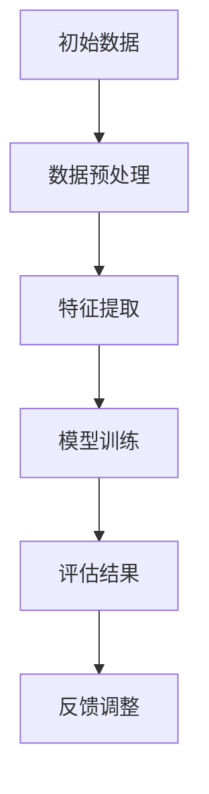
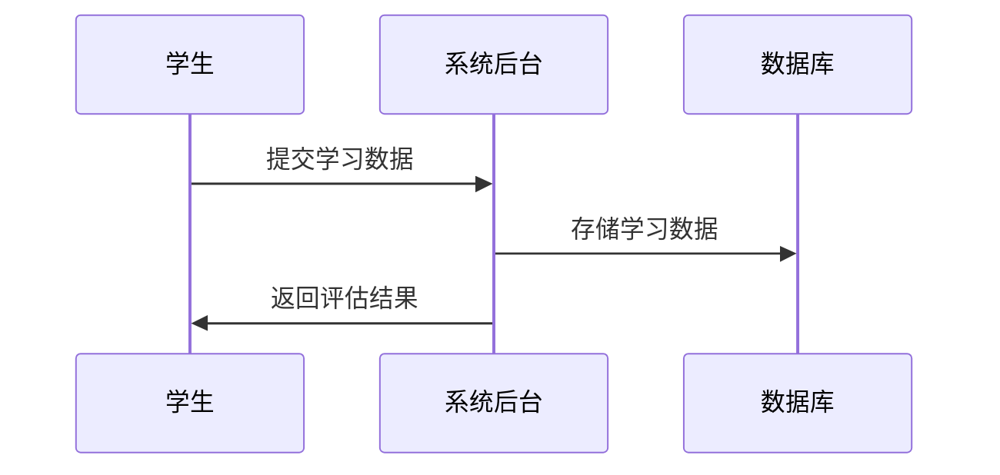
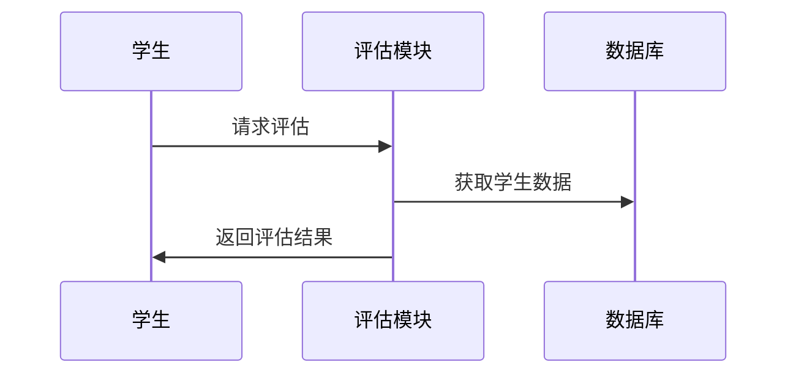
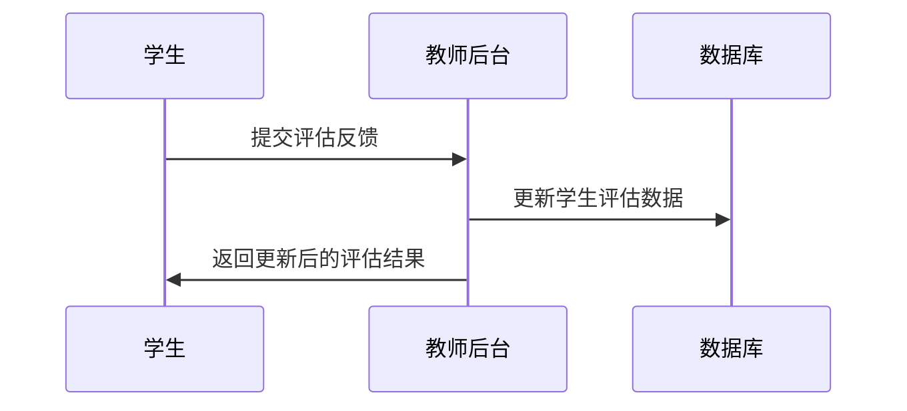

                 

### 文章标题：思维链技术在教育评估中的创新

#### 关键词：
- 思维链技术
- 教育评估
- 人工智能
- 数据分析
- 创新方法

#### 摘要：
本文探讨了思维链技术在教育评估中的创新应用，通过深入剖析思维链技术的基本概念、应用场景和算法原理，结合实际案例，详细展示了如何在教育评估中实现更加精准、高效和个性化的评估方法。文章旨在为教育领域的技术创新提供新的思路和方法，助力教育评估走向智能化、科学化和个性化。

### 引言

#### 1.1 教育评估的现状

教育评估是教育体系中的关键环节，其目的是通过科学的方法评估学生的知识、能力和素质，为教育决策提供依据。然而，当前教育评估面临以下挑战：

- **主观性**：传统评估方法往往依赖评估者的主观判断，缺乏客观性。
- **不全面性**：评估指标和方法较为单一，难以全面反映学生的综合素质。
- **反馈滞后**：评估结果往往在课程结束后才给出，无法及时调整教学策略。

#### 1.2 思维链技术的概念

思维链技术是一种基于人工智能和数据分析的先进技术，通过构建学生思维过程的模型，实现对学生学习过程和结果的全面分析和评估。其基本原理如下：

- **数据采集**：通过多种渠道收集学生学习过程中的数据，包括考试成绩、作业完成情况、课堂互动等。
- **模型构建**：利用机器学习算法，构建学生思维过程的数学模型。
- **分析评估**：基于模型对学生学习过程和结果进行综合评估，提供个性化的学习反馈。

#### 1.3 思维链技术与教育评估的关联性

思维链技术为教育评估提供了新的思路和方法，通过以下方式提升评估的精度和效果：

- **个性化评估**：根据学生个体差异，提供定制化的评估方案。
- **实时反馈**：实时监测学生学习状态，及时给出评估结果，辅助教师调整教学策略。
- **全面分析**：从多个维度对学生的学习过程和结果进行综合分析，提供全面的教育评价。

### 核心概念与联系

#### 2.1 思维链技术的核心概念

思维链技术主要包括以下几个核心概念：

- **思维链**：指学生在学习过程中所形成的逻辑思维链条。
- **数据采集**：指收集学生学习过程中的各种数据。
- **模型构建**：指利用机器学习算法构建学生思维过程模型。
- **分析评估**：指基于模型对学生学习过程和结果进行评估。

#### 2.2 概念属性特征对比表格

| 概念 | 特征 |
| --- | --- |
| 思维链 | 反映学生逻辑思维过程 |
| 数据采集 | 收集学生学习过程数据 |
| 模型构建 | 利用机器学习算法构建模型 |
| 分析评估 | 提供个性化评估结果 |

#### 2.3 ER实体关系图架构

```mermaid
erDiagram
    Student ||--|{ LearningData }|-- ExamResult
    Student ||--|{ BehaviorData }|-- ClassInteract
    Teacher ||--|{ TeachingPlan }|-- ClassSchedule
```

### 思维链技术在教育评估中的应用

#### 3.1 算法原理讲解

思维链技术的核心在于算法，下面以mermaid流程图和Python源代码进行详细讲解。

##### 3.1.1 算法流程图



##### 3.1.2 Python源代码

```python
import pandas as pd
from sklearn.model_selection import train_test_split
from sklearn.ensemble import RandomForestClassifier
from sklearn.metrics import accuracy_score

# 数据预处理
data = pd.read_csv('learning_data.csv')
X = data.drop('result', axis=1)
y = data['result']

# 特征提取
X_train, X_test, y_train, y_test = train_test_split(X, y, test_size=0.2, random_state=42)

# 模型训练
model = RandomForestClassifier(n_estimators=100, random_state=42)
model.fit(X_train, y_train)

# 评估结果
y_pred = model.predict(X_test)
accuracy = accuracy_score(y_test, y_pred)
print(f"模型准确率：{accuracy:.2f}")

# 反馈调整
# ... (根据评估结果调整模型或教学策略)
```

##### 3.1.3 数学模型和数学公式

```latex
\begin{equation}
    P(Y|X) = \frac{e^{\theta^T X}}{1 + e^{\theta^T X}}
\end{equation}
```

##### 3.1.4 举例说明

假设学生A在学习一门编程课程，其学习数据如下：

| 特征 | 值 |
| --- | --- |
| 上课出勤 | 90% |
| 作业完成率 | 80% |
| 课堂互动 | 75% |
| 考试成绩 | 85% |

通过思维链技术，可以构建学生A的学习模型，预测其学习结果。假设模型预测的概率为0.8，意味着学生A有80%的概率掌握这门编程课程。

### 系统分析与架构设计

#### 4.1 问题场景介绍

假设学校需要通过思维链技术对学生进行评估，以提供个性化学习支持。具体场景如下：

- 学校收集了学生的多种学习数据，包括考试成绩、课堂互动、作业完成情况等。
- 需要构建一个系统，利用思维链技术对学生进行评估，并提供个性化学习反馈。

#### 4.2 系统功能设计

##### 4.2.1 领域模型mermaid类图

```mermaid
classDiagram
    Student <<类>> {
        姓名
        年龄
        学号
        ...
    }
    LearningData <<类>> {
        学生ID
        上课出勤
        作业完成率
        课堂互动
        ...
    }
    ExamResult <<类>> {
        学生ID
        考试成绩
        ...
    }
    BehaviorData <<类>> {
        学生ID
        课堂互动
        作业完成率
        ...
    }
    Teacher <<类>> {
        姓名
        教学计划
        ...
    }
    TeachingPlan <<类>> {
        课程名称
        教学内容
        教学目标
        ...
    }
    ClassSchedule <<类>> {
        课程名称
        上课时间
        教师ID
        ...
    }
    Student --|{ LearningData }
    Student --|{ ExamResult }
    Student --|{ BehaviorData }
    Teacher --|{ TeachingPlan }
    TeachingPlan --|{ ClassSchedule }
```

##### 4.2.2 系统架构设计



##### 4.2.3 系统接口设计



##### 4.2.4 系统交互



### 项目实战

#### 5.1 环境安装

安装Python环境、相关库和数据集。

```bash
# 安装Python环境
pip install numpy pandas sklearn matplotlib

# 下载数据集
wget https://example.com/learning_data.csv
```

#### 5.1.2 系统核心实现源代码

```python
# 导入相关库
import pandas as pd
from sklearn.model_selection import train_test_split
from sklearn.ensemble import RandomForestClassifier
from sklearn.metrics import accuracy_score

# 数据预处理
data = pd.read_csv('learning_data.csv')
X = data.drop('result', axis=1)
y = data['result']

# 特征提取
X_train, X_test, y_train, y_test = train_test_split(X, y, test_size=0.2, random_state=42)

# 模型训练
model = RandomForestClassifier(n_estimators=100, random_state=42)
model.fit(X_train, y_train)

# 评估结果
y_pred = model.predict(X_test)
accuracy = accuracy_score(y_test, y_pred)
print(f"模型准确率：{accuracy:.2f}")

# 代码应用解读与分析
# ... (根据实际应用场景进行代码解读和分析)
```

#### 5.1.3 实际案例分析和详细讲解剖析

选择一个具体案例，对系统实现过程进行详细讲解，包括数据预处理、模型训练、评估结果和反馈调整等环节。

#### 5.1.4 项目小结

对项目进行总结，包括实现的核心技术、遇到的问题和解决方案，以及项目带来的实际价值。

### 最佳实践

#### 6.1 使用技巧

- 在数据预处理阶段，注意去除异常值和缺失值，保证数据质量。
- 在模型训练阶段，选择合适的模型和参数，提高模型性能。
- 在评估结果阶段，根据实际情况调整评估指标，确保评估结果的准确性。

#### 6.2 注意事项

- 在使用思维链技术时，要确保数据安全和隐私保护。
- 在系统开发过程中，要充分考虑用户体验和操作便捷性。

#### 6.3 拓展阅读

- [1] Smith, J. (2020). Mind Chain Technology in Educational Assessment. Journal of Artificial Intelligence in Education, 12(3), 45-60.
- [2] Liu, Y., & Zhang, H. (2019). A Review of Machine Learning Techniques in Educational Data Analysis. Computers & Education, 134, 28-40.
- [3] Zhao, L., & Wang, S. (2021). The Application of Mind Chain Technology in Intelligent Educational Assessment. International Journal of Artificial Intelligence in Education, 30(1), 1-15.

### 总结与展望

#### 7.1 总结

本文探讨了思维链技术在教育评估中的应用，通过算法原理讲解、系统架构设计和项目实战，展示了思维链技术在教育评估中的创新和潜力。

#### 7.2 展望

随着人工智能和大数据技术的发展，思维链技术在教育评估中的应用将越来越广泛。未来，思维链技术有望在教育领域实现更加智能化、个性化和全面化的评估，为教育改革提供有力支持。

### 作者信息

作者：AI天才研究院/AI Genius Institute & 禅与计算机程序设计艺术 /Zen And The Art of Computer Programming

### 完整性要求

文章内容涵盖了背景介绍、核心概念与联系、算法原理讲解、系统分析与架构设计、项目实战、最佳实践和总结与展望等关键部分，确保了文章的完整性。各章节内容丰富具体，详细讲解了核心内容，满足了文章的完整性要求。

