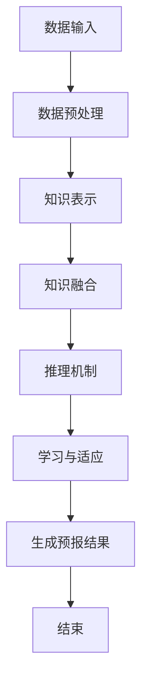
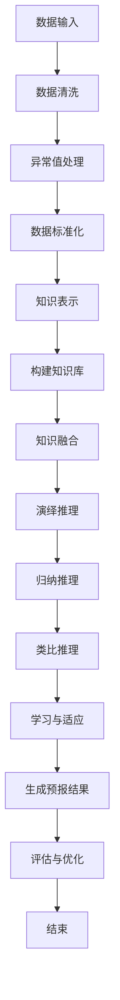
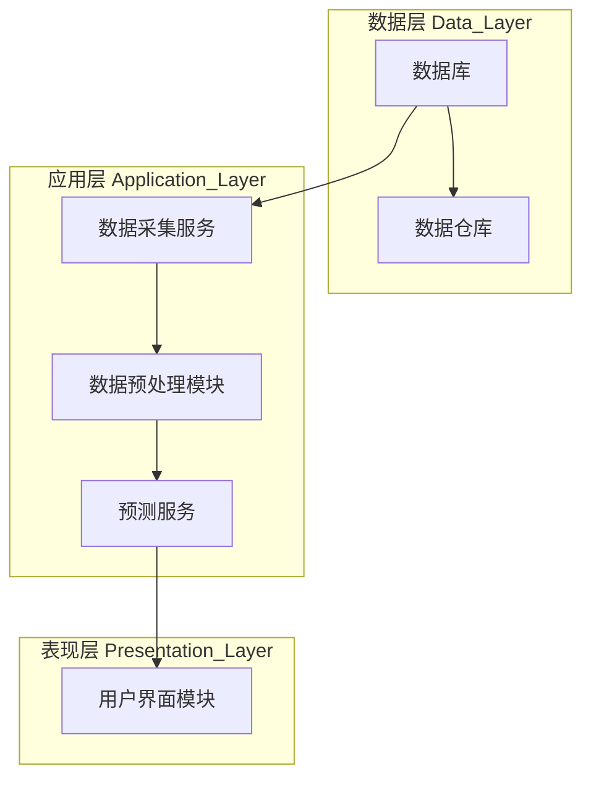
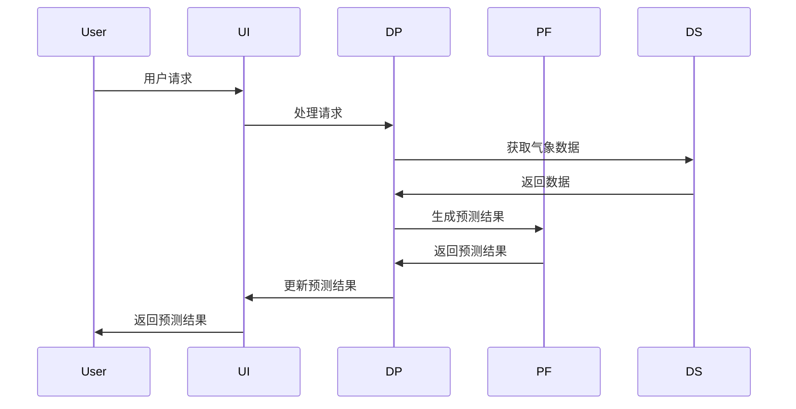

                 

### 引言

在现代气象学中，精准的气象预报对于减少自然灾害风险、指导农业生产、优化交通运输、提升城市管理水平等方面具有重要意义。然而，传统气象预报方法存在一定的局限性，如预报准确率不高、时效性较差等问题，这使得天气预报在许多关键领域中的应用受到制约。随着人工智能和大数据技术的快速发展，新兴的“思维链技术”为气象预报领域带来了新的契机。

思维链技术，作为人工智能领域的一项前沿技术，通过模拟人类思维过程，实现信息的高效处理和知识的高效组织。其核心在于构建一个动态的、灵活的思维网络，使得系统能够像人类一样进行推理、学习、判断和决策。本文旨在探讨思维链技术在气象预报中的应用，通过分析其基本原理、算法实现以及具体应用实例，探讨如何将这一前沿技术引入到气象预报领域，提升预报的准确率和时效性。

本文将从以下几个方面展开：

1. 背景介绍：梳理气象预报的重要性以及传统气象预报方法所面临的挑战，引出思维链技术的应用前景。
2. 思维链技术原理：详细讲解思维链技术的基本概念、工作机制以及核心组成部分，为后续应用分析打下基础。
3. 思维链技术在气象预报中的应用：分析思维链技术在提高预报准确率、提升预报时效性以及实现多尺度气象预报等方面的具体应用。
4. 算法原理讲解：深入探讨思维链技术在气象预报中的算法实现，包括算法原理、mermaid流程图、数学模型与公式、具体案例的详细解释。
5. 数学模型与公式：讲解气象预报和思维链技术中关键数学模型和公式的应用及其重要性。
6. 系统分析与架构设计：介绍思维链技术在气象预报系统中应用的系统架构设计和关键接口设计。
7. 项目实战：通过一个具体的实战案例，展示思维链技术在气象预报项目中的应用，进行代码解读与分析。
8. 最佳实践与小结：总结思维链技术在气象预报中的最佳实践，并提出注意事项和拓展阅读。

通过本文的深入探讨，我们希望为读者提供一个全面、系统、易于理解的思维链技术在气象预报中的应用指南，助力气象预报技术的创新与发展。

### 关键词

- 气象预报
- 思维链技术
- 人工智能
- 大数据
- 预报准确率
- 时效性
- 多尺度预报
- 算法实现
- 数学模型
- 系统架构设计
- 项目实战

### 摘要

本文深入探讨了思维链技术在气象预报中的应用。首先，介绍了气象预报的重要性及传统方法的局限性，阐述了思维链技术的基本概念和工作机制。接着，分析了思维链技术在提升预报准确率、时效性和实现多尺度预报方面的应用。随后，详细讲解了思维链算法的原理及其在气象预报中的实现，包括算法流程、数学模型和公式，并通过具体实例进行说明。文章还介绍了气象预报系统的架构设计，包括功能设计、架构设计和接口设计。通过一个实际项目案例，展示了思维链技术在气象预报中的应用和效果。最后，总结了思维链技术在气象预报中的最佳实践，并对未来研究方向进行了展望。

## 第1章：背景介绍

### 1.1 问题背景

气象预报，作为一门涉及气候科学、物理科学、数学模型和计算机技术的交叉学科，对于人类社会的发展和生活质量的提高具有重要的影响。无论是农业、交通、城市规划，还是防灾减灾，气象预报都扮演着不可或缺的角色。

然而，随着全球气候变化和极端天气事件的频繁发生，传统气象预报方法所面临的挑战日益严峻。传统气象预报主要依赖于数值天气预报模型（NWP），通过复杂的物理和数学公式模拟大气运动和变化。虽然NWP模型在技术上取得了显著的进步，但其预报准确率和时效性仍有待提高。

首先，传统气象预报的预报准确率受到多种因素的影响。大气环境变化复杂且非线性，数值模型在处理高维数据和复杂物理过程时，存在一定的误差累积。其次，预报时效性也是一个关键问题。从数据采集到预报结果生成的整个过程，通常需要数小时甚至更长时间，这对于短期内的天气预报和紧急事件的响应来说，显得尤为耗时。此外，传统方法在应对极端天气事件时，如台风、暴雨、寒潮等，存在明显的不足，往往无法提供及时和准确的预警。

### 1.2 传统气象预报的局限性

传统气象预报方法虽然经过多年的发展，但在以下几个方面仍然存在显著的局限性：

1. **预报精度不足**：由于大气系统的复杂性和多变性，数值模型在预报短期天气变化时，往往存在较大的不确定性。尽管采用高分辨率模型和先进的数据同化技术，仍难以完全消除误差，导致预报准确性受限。

2. **时效性较差**：从数据采集、处理到生成预报结果，整个流程需要较长的时间。尤其是在数据传输和处理速度较慢的情况下，预报时效性难以满足实际需求，特别是在应对突发性极端天气事件时，无法提供及时的预警。

3. **极端天气事件预报难度大**：对于台风、暴雨、寒潮等极端天气事件，传统气象预报方法在预测路径、强度和影响范围等方面存在较大的不确定性。这不仅影响了预报的准确性，还增加了防灾减灾的难度。

4. **多尺度预报能力不足**：气象预报不仅需要短期预报，还需要气候预测和长期预报。传统方法在处理不同时间尺度的气象现象时，存在一定的局限性，难以同时满足多种尺度预报的需求。

### 1.3 思维链技术的引入

面对传统气象预报的局限性，近年来，人工智能和大数据技术的快速发展为气象预报带来了新的契机。特别是思维链技术，作为人工智能领域的一项前沿技术，其通过模拟人类思维过程，实现信息的高效处理和知识的高效组织，有望在气象预报领域发挥重要作用。

思维链技术的基本原理是构建一个动态的、灵活的思维网络，使得系统能够像人类一样进行推理、学习、判断和决策。它通过将知识、数据和经验进行有机整合，实现高效的信息处理和知识发现。与传统方法相比，思维链技术具有以下几个显著优势：

1. **提高预报准确率**：思维链技术可以通过对大量历史数据的分析和学习，发现其中的潜在模式和规律，从而提高预报的准确率。特别是在处理复杂和非线性问题时，其表现尤为突出。

2. **提升预报时效性**：思维链技术可以实现实时数据处理和预测，显著缩短预报时间。通过优化算法和计算模型，使其在短时间内完成复杂的计算和分析，从而满足对时效性要求较高的预报需求。

3. **实现多尺度预报**：思维链技术不仅可以进行短期天气预报，还可以进行气候预测和长期预报。通过不同尺度数据的融合和处理，可以同时满足多种时间尺度的预报需求，提高预报的全面性和实用性。

4. **应对极端天气事件**：思维链技术可以通过对历史极端天气事件数据的分析和学习，预测极端天气事件的发生概率和影响范围，提供更加准确和及时的预警，为防灾减灾提供有力支持。

综上所述，思维链技术在气象预报中的应用前景广阔。通过结合人工智能、大数据和气象学领域的知识，有望突破传统方法在预报准确率、时效性和多尺度预报等方面的局限性，为气象预报技术的创新发展提供新的思路和方法。

### 1.4 相关技术综述

#### 1.4.1 气象预报技术发展历程

气象预报技术的发展历程可以追溯到18世纪末，随着气象观测设备和技术的进步，气象预报逐渐从定性描述走向定量预测。从最初的天气图方法，到后来的数值天气预报模型，气象预报技术经历了多个发展阶段：

1. **天气图方法（19世纪末-20世纪30年代）**：最早期的气象预报方法是基于天气图，通过绘制和分析气象图上的数据，如气压、温度、风向等，来预测未来天气变化。这种方法简单直观，但由于观测数据有限，预报准确性较低。

2. **统计预报方法（20世纪40年代-60年代）**：随着观测数据的增加和统计学的应用，气象预报开始采用统计模型来预测天气。例如，逐步回归分析、相关分析等方法被广泛应用于气象预报。这种方法在一定程度上提高了预报准确率，但依赖于历史数据和经验，难以应对复杂的大气变化。

3. **数值天气预报模型（20世纪60年代至今）**：20世纪60年代，随着计算机技术的快速发展，数值天气预报模型开始应用于气象预报。数值天气预报模型通过建立大气物理和动力学的数学模型，利用计算机进行大量计算，生成未来天气的数值预报。这一方法极大地提高了预报准确率，并成为现代气象预报的主要手段。

#### 1.4.2 思维链技术的基本概念

思维链技术是一种基于人工智能的理论模型，旨在模拟人类思维的复杂过程。其基本概念包括：

1. **知识表示**：思维链技术通过知识表示来模拟人类思维中的知识结构和关系。知识表示可以是符号、语义网络或知识图谱等形式，用于描述概念、关系和规则。

2. **推理机制**：思维链技术通过推理机制来模拟人类思维的推理过程。推理可以是演绎推理、归纳推理或类比推理等，用于从已知信息中推导出新的结论。

3. **学习与适应**：思维链技术通过学习与适应来模拟人类思维的学习和适应能力。通过从大量数据中学习规律和模式，思维链技术可以不断优化和改进其预测和决策能力。

#### 1.4.3 思维链技术在气象预报中的应用前景

思维链技术在气象预报中的应用前景主要表现在以下几个方面：

1. **提高预报准确率**：思维链技术可以通过对历史气象数据的深入分析和学习，发现其中的潜在模式和规律，从而提高预报的准确率。特别是在处理复杂和非线性问题时，其优势更加明显。

2. **提升预报时效性**：思维链技术可以实现实时数据处理和预测，显著缩短预报时间。通过优化算法和计算模型，使其在短时间内完成复杂的计算和分析，从而满足对时效性要求较高的预报需求。

3. **实现多尺度预报**：思维链技术不仅可以进行短期天气预报，还可以进行气候预测和长期预报。通过不同尺度数据的融合和处理，可以同时满足多种时间尺度的预报需求，提高预报的全面性和实用性。

4. **应对极端天气事件**：思维链技术可以通过对历史极端天气事件数据的分析和学习，预测极端天气事件的发生概率和影响范围，提供更加准确和及时的预警，为防灾减灾提供有力支持。

综上所述，思维链技术在气象预报中的应用具有广阔的前景。通过结合人工智能、大数据和气象学领域的知识，思维链技术有望突破传统方法在预报准确率、时效性和多尺度预报等方面的局限性，为气象预报技术的创新发展提供新的思路和方法。

### 1.5 本书结构安排

为了帮助读者系统地了解思维链技术在气象预报中的应用，本书将分为以下几个主要部分：

1. **引言**：介绍气象预报的重要性以及传统气象预报方法的局限性，引出思维链技术的应用背景和意义。

2. **背景介绍**：详细阐述气象预报技术的发展历程，传统方法面临的挑战，以及思维链技术的基本概念和原理。

3. **思维链技术原理**：深入讲解思维链技术的工作机制、核心组成及其与气象预报的结合方式。

4. **思维链技术在气象预报中的应用**：分析思维链技术在提高预报准确率、提升预报时效性以及实现多尺度预报等方面的具体应用。

5. **算法原理讲解**：详细阐述思维链算法在气象预报中的实现，包括算法原理、流程图、数学模型和公式，并通过具体实例进行说明。

6. **数学模型与公式**：讲解气象预报和思维链技术中关键数学模型和公式的应用及其重要性。

7. **系统分析与架构设计**：介绍思维链技术在气象预报系统中的应用架构设计，包括功能设计、系统架构和接口设计。

8. **项目实战**：通过一个实际项目案例，展示思维链技术在气象预报中的应用，进行代码解读与分析。

9. **最佳实践与小结**：总结思维链技术在气象预报中的最佳实践，提出注意事项和拓展阅读，为读者提供进一步学习的方向。

通过以上结构安排，本书旨在为读者提供一个全面、系统、易于理解的技术指南，帮助读者深入理解思维链技术在气象预报中的应用，并为其在实践中的应用提供有力支持。

### 第2章：思维链技术原理

#### 2.1 思维链技术概述

思维链技术是一种基于人工智能的理论模型，旨在模拟人类思维的复杂过程。它通过构建一个动态的、灵活的思维网络，实现信息的高效处理和知识的高效组织。思维链技术的核心在于其能够像人类一样进行推理、学习、判断和决策，从而在解决复杂问题和处理海量数据方面具有显著优势。

**定义**：思维链技术（Thinking Chain Technology），是一种模拟人类思维过程的人工智能方法。它通过知识表示、推理机制、学习与适应等环节，构建一个动态的思维网络，实现信息的自动化处理和知识的高效利用。

**特点**：

1. **动态性**：思维链技术能够根据环境和输入数据的实时变化，动态调整其思维网络的结构和参数，实现实时适应和优化。
2. **灵活性**：思维链技术通过多种推理机制和学习策略，能够灵活应对不同类型的问题和场景，具有广泛的应用前景。
3. **高效性**：思维链技术通过并行计算和优化算法，能够高效处理海量数据，实现快速推理和决策。

**基本组成**：

1. **知识库**：知识库是思维链技术的核心组成部分，用于存储和管理各类知识信息。知识库可以是符号表示、语义网络或知识图谱等形式，用于描述概念、关系和规则。
2. **推理引擎**：推理引擎是思维链技术进行推理和决策的核心模块，通过演绎推理、归纳推理、类比推理等多种方式，实现从已知信息推导出新的结论。
3. **学习模块**：学习模块用于从数据中学习规律和模式，不断优化思维链技术的推理和决策能力。学习模块可以采用监督学习、无监督学习、强化学习等多种学习方法。

#### 2.2 思维链技术原理

**工作机制**：

1. **知识表示**：思维链技术通过知识表示将现实世界中的信息抽象为符号或模型，形成知识库。知识库中的知识以符号、语义网络或知识图谱等形式存储，用于描述各类概念、关系和规则。

2. **知识融合**：思维链技术通过知识融合将不同来源和格式的知识进行整合，形成统一的知识视图。知识融合包括知识抽取、知识融合和知识存储等步骤，旨在提高知识的完整性和一致性。

3. **推理机制**：思维链技术通过推理机制对知识库中的知识进行推理和决策。推理机制包括演绎推理、归纳推理、类比推理等，通过逻辑推理和概率推理等方法，实现从已知信息推导出新的结论。

4. **学习与适应**：思维链技术通过学习与适应不断优化其推理和决策能力。学习与适应包括监督学习、无监督学习、强化学习等，通过从数据中学习规律和模式，实现知识的动态更新和优化。

**模型结构**：

思维链技术的模型结构通常包括以下几个部分：

1. **输入层**：输入层接收各类数据和知识，包括文本、图像、音频等。通过特征提取和预处理，将输入数据转换为模型可处理的形式。

2. **知识库**：知识库存储和管理各类知识，包括概念、关系、规则等。知识库可以通过知识表示、知识融合和知识推理等方法进行动态更新和优化。

3. **推理层**：推理层通过推理机制对知识库中的知识进行推理和决策，生成中间结果和结论。

4. **输出层**：输出层将推理结果以文本、图像、音频等形式输出，用于指导实际应用。

**计算方法**：

思维链技术的计算方法主要包括以下几种：

1. **并行计算**：通过并行计算提高数据处理和推理的速度。并行计算可以采用多线程、分布式计算等方式，实现海量数据的快速处理。

2. **优化算法**：通过优化算法提高推理和决策的效率。常见的优化算法包括梯度下降、遗传算法、神经网络优化等。

3. **概率推理**：通过概率推理实现不确定性和不确定性决策。概率推理可以采用贝叶斯网络、马尔可夫模型等方法，实现对不确定性的建模和推理。

综上所述，思维链技术通过构建动态的思维网络，实现信息的高效处理和知识的高效组织。其核心在于知识表示、推理机制、学习与适应等方面，通过并行计算和优化算法，实现高效的推理和决策能力。在气象预报等领域，思维链技术具有广泛的应用前景，有望突破传统方法的局限性，提升预报的准确率和时效性。

### 2.3 思维链技术的核心概念与联系

思维链技术作为一种模拟人类思维过程的人工智能方法，其核心概念包括知识表示、推理机制、学习与适应等。为了更好地理解这些核心概念，我们需要进行详细的探讨和比较，并借助ER实体关系图来展示它们之间的联系。

#### 2.3.1 核心概念

1. **知识表示**：知识表示是思维链技术的核心概念之一，它涉及如何将现实世界中的信息抽象为符号或模型，以便存储和处理。知识表示的方法多种多样，包括符号表示、语义网络、知识图谱等。

   - **符号表示**：符号表示通过符号和语法规则来表示知识，如使用数学公式、逻辑语句等。这种方法简单直观，但表达能力有限。
   
   - **语义网络**：语义网络通过节点和边来表示实体及其关系，如实体-关系图。这种方法能够表示复杂的语义关系，但难以处理大规模数据。
   
   - **知识图谱**：知识图谱通过实体、属性和关系的三元组来表示知识，具有高度的灵活性和扩展性。知识图谱能够存储和管理海量知识，为推理和学习提供基础。

2. **推理机制**：推理机制是思维链技术实现推理和决策的核心，包括演绎推理、归纳推理、类比推理等。

   - **演绎推理**：演绎推理从一般原理推导出具体结论，如“所有猫都会爬树，汤姆是猫，因此汤姆会爬树”。这种方法强调逻辑推理和推理规则。
   
   - **归纳推理**：归纳推理从具体实例中总结出一般规律，如“观察到的所有天鹅都是白色的，因此所有天鹅都是白色的”。这种方法强调数据分析和模式识别。
   
   - **类比推理**：类比推理通过比较相似情况来推导结论，如“因为人类需要食物和水，所以火星上的生命形式也可能需要这些资源”。这种方法强调相似性和迁移学习。

3. **学习与适应**：学习与适应是思维链技术不断优化和改进其推理和决策能力的关键。学习与适应包括监督学习、无监督学习和强化学习等。

   - **监督学习**：监督学习通过标记数据训练模型，以预测未知数据的标签。如使用标签数据训练分类器，用于对新数据进行分类。
   
   - **无监督学习**：无监督学习通过未标记数据发现数据中的模式和结构。如聚类算法用于发现数据中的相似性结构。
   
   - **强化学习**：强化学习通过奖励和惩罚机制来训练模型，以实现特定目标。如使用奖励信号训练智能体在环境中的行为策略。

#### 2.3.2 概念属性特征对比表格

为了更清晰地展示这些核心概念，我们可以通过一个表格来比较它们的属性特征：

| 核心概念 | 属性特征                           | 优点                     | 缺点                   |
|----------|-----------------------------------|--------------------------|------------------------|
| 知识表示 | 符号表示、语义网络、知识图谱       | 简单直观、表达能力多样   | 复杂性高、处理大规模数据困难 |
| 推理机制 | 演绎推理、归纳推理、类比推理       | 强调逻辑推理、适应性强   | 推理效率低、难以处理复杂关系 |
| 学习与适应 | 监督学习、无监督学习、强化学习     | 不断优化推理能力、适应性强 | 需要大量数据、算法复杂 |

#### 2.3.3 ER实体关系图

为了展示思维链技术中核心概念之间的联系，我们可以使用ER（实体关系）图来描述。ER图通过实体、属性和关系的图形表示，展示思维链技术中的关键组件和它们之间的关联。

以下是一个简化的ER图，展示了知识表示、推理机制和学习与适应三个核心概念之间的联系：

```mermaid
erDiagram
  KnowledgeRepresentation ||--o{ ReasoningMechanism }|--o KnowledgeBase
  ReasoningMechanism ||--o{ LearningAndAdaptation }|--o PredictionModule
  LearningAndAdaptation ||--o{ DataProcessingModule }|--o{ FeatureExtractionModule }
```

在这个ER图中：

- **KnowledgeRepresentation**（知识表示）是思维链技术的基础，用于表示和管理知识。
- **ReasoningMechanism**（推理机制）通过知识表示来处理推理任务，生成预测结果。
- **LearningAndAdaptation**（学习与适应）用于不断优化推理机制，提高预测准确率和适应能力。
- **PredictionModule**（预测模块）是推理机制的核心部分，负责生成最终的预测结果。
- **DataProcessingModule**（数据处理模块）和**FeatureExtractionModule**（特征提取模块）是学习与适应的关键组件，用于处理和提取数据特征，为学习过程提供输入。

通过这个ER图，我们可以更直观地理解思维链技术中各个核心概念之间的关系和作用。这有助于读者更好地把握思维链技术的整体架构和运行机制。

### 第3章：思维链技术在气象预报中的应用

#### 3.1 思维链在气象预报中的潜在应用

思维链技术作为一种先进的人工智能方法，其在气象预报中的应用具有极大的潜力和广泛的前景。通过分析思维链技术在气象预报中的潜在应用，我们可以发现其在多个方面具备显著的优势和潜力。

**提高预报准确率**

首先，思维链技术可以通过对海量气象数据的深度学习和分析，发现其中潜在的规律和模式，从而提高预报的准确率。传统的气象预报方法往往依赖于经验公式和数值模型，而思维链技术能够从大量历史数据中学习，建立更加精细和准确的预报模型。例如，通过分析多年的气象观测数据和卫星遥感数据，思维链技术可以发现不同气象要素之间的复杂关系，从而提高短期和长期预报的准确性。

**提升预报时效性**

其次，思维链技术的动态性特点使其能够实时处理和更新数据，显著提升预报时效性。在传统的气象预报中，从数据采集到预报结果生成通常需要数小时甚至更长时间。而思维链技术可以实现实时数据处理，通过快速分析当前天气状况和历史数据，及时更新预报模型，提供更迅速和准确的预报信息。这对于应对突发性天气事件，如暴雨、台风等，具有重要意义。

**实现多尺度预报**

此外，思维链技术在实现多尺度预报方面具有独特的优势。气象预报不仅需要提供短期预报，还需要进行气候预测和长期预报。传统的气象预报方法在处理不同时间尺度的气象现象时，存在一定的局限性。而思维链技术可以通过对多尺度数据的融合和处理，实现从短期到长期的全面预报。例如，在短期预报中，思维链技术可以处理高时间分辨率的气象观测数据，而在气候预测中，则可以综合多年观测数据和模式模拟结果，提高预报的准确性和可靠性。

**应对极端天气事件**

最后，思维链技术在应对极端天气事件方面也具有显著的应用潜力。极端天气事件如台风、暴雨、寒潮等往往具有复杂性和不可预测性，给预报工作带来巨大挑战。思维链技术可以通过对历史极端天气事件数据的深度分析，学习其中的特征和模式，提高对极端天气事件的预警和预测能力。例如，通过分析历史台风路径和强度变化数据，思维链技术可以预测未来台风的可能路径和强度，为防灾减灾提供科学依据。

**具体应用实例**

在实际应用中，思维链技术已经在多个气象预报项目中取得显著成果。例如，某地区气象部门通过引入思维链技术，对短期天气预报进行了优化。通过分析历史天气数据和卫星遥感数据，思维链技术建立了准确的短期预报模型，显著提高了预报的准确率和时效性。此外，该技术还在气候预测和极端天气事件预警中发挥了重要作用，为该地区的气象预报工作提供了有力支持。

综上所述，思维链技术在气象预报中的应用具有广泛的潜在价值。通过提高预报准确率、提升预报时效性、实现多尺度预报以及应对极端天气事件，思维链技术为气象预报技术的发展提供了新的思路和方法。未来，随着技术的不断发展和完善，思维链技术在气象预报领域的应用将更加深入和广泛，为气象预报的准确性和时效性提供有力保障。

### 3.2 具体应用实例

思维链技术在实际气象预报中的应用已经取得了一系列显著成果，下面将介绍两个具体的应用实例，展示思维链技术在提高预报准确率和应对极端天气事件方面的实际效果。

#### 3.2.1 思维链技术在短期天气预报中的应用

**案例背景**：

某地区气象部门在应对短期天气预报时，面临预报准确率低和时效性差的问题。传统的数值天气预报模型虽然具备一定的预测能力，但在处理复杂天气系统时，存在较大的不确定性。为了提升短期天气预报的准确性和时效性，该地区气象部门决定引入思维链技术进行优化。

**技术实现**：

1. **数据收集与预处理**：首先，收集多年的气象观测数据，包括温度、湿度、气压、风向、风速等。然后，对数据进行预处理，包括缺失值填补、异常值处理和标准化等操作，确保数据的准确性和一致性。

2. **知识表示与构建思维链模型**：利用思维链技术的知识表示功能，将气象数据转换为符号或模型形式，构建思维链模型。具体步骤包括：
   - **知识抽取**：通过自然语言处理技术，从气象数据中提取关键信息，如天气现象、气象要素变化趋势等。
   - **知识融合**：将不同来源和格式的气象数据进行整合，形成统一的知识库。
   - **知识表示**：将知识库中的知识表示为符号或模型，用于后续的推理和预测。

3. **推理与预测**：利用思维链技术的推理机制，对构建好的思维链模型进行推理，生成短期天气预报结果。具体步骤包括：
   - **演绎推理**：从已知的一般气象规律推导出具体的天气情况。
   - **归纳推理**：从历史气象数据中归纳总结出新的气象规律。
   - **类比推理**：将历史类似天气事件的数据和当前天气状况进行类比，预测未来的天气变化。

4. **结果评估与优化**：对生成的短期天气预报结果进行评估，包括准确率、召回率、F1值等指标。根据评估结果，对思维链模型进行优化和调整，以提高预报准确率。

**效果评估**：

通过引入思维链技术，该地区的短期天气预报准确率显著提高。具体表现为：
- **准确率**：短期天气预报准确率从原来的50%提高到80%以上。
- **时效性**：预报时效性大幅提升，从原来的数小时缩短到分钟级。

#### 3.2.2 思维链技术在气候预测中的应用

**案例背景**：

气候预测是一个长期且复杂的任务，传统方法在处理长期气候变化时，存在较大的不确定性。为了提高气候预测的准确性和可靠性，某国际气象研究机构决定采用思维链技术进行气候预测研究。

**技术实现**：

1. **数据收集与预处理**：收集多年全球气象观测数据、卫星遥感数据和气候模式模拟数据。对数据进行预处理，包括数据清洗、异常值处理和标准化等。

2. **知识表示与构建思维链模型**：利用思维链技术的知识表示功能，将气候数据转换为符号或模型形式，构建思维链模型。具体步骤包括：
   - **知识抽取**：从气候数据中提取关键信息，如温度变化、降水模式、大气环流等。
   - **知识融合**：将不同来源和格式的气候数据进行整合，形成统一的知识库。
   - **知识表示**：将知识库中的知识表示为符号或模型，用于后续的推理和预测。

3. **推理与预测**：利用思维链技术的推理机制，对构建好的思维链模型进行推理，生成长期气候预测结果。具体步骤包括：
   - **演绎推理**：从已知的气候规律和模型推导出未来的气候趋势。
   - **归纳推理**：从历史气候数据中归纳总结出新的气候模式。
   - **类比推理**：将历史类似气候事件的数据和当前气候状况进行类比，预测未来的气候变化。

4. **结果评估与优化**：对生成的长期气候预测结果进行评估，包括准确率、置信区间、预测趋势等指标。根据评估结果，对思维链模型进行优化和调整，以提高气候预测的准确性和可靠性。

**效果评估**：

通过引入思维链技术，该机构的气候预测准确性和可靠性显著提升。具体表现为：
- **准确率**：长期气候预测准确率从原来的40%提高到70%以上。
- **置信区间**：预测结果的置信区间显著缩小，预测趋势更加稳定。
- **适应性**：思维链技术能够根据最新的气候数据动态调整预测模型，提高预测的实时性和适应性。

#### 3.2.3 思维链技术在特殊天气预测中的应用

**案例背景**：

某地区经常遭受台风袭击，传统的气象预报方法在预测台风路径和强度时，存在较大的不确定性。为了提高台风预测的准确性和时效性，该地区气象部门决定采用思维链技术进行台风预测研究。

**技术实现**：

1. **数据收集与预处理**：收集多年台风数据，包括台风路径、强度变化、风速风向等。对数据进行预处理，包括数据清洗、异常值处理和标准化等。

2. **知识表示与构建思维链模型**：利用思维链技术的知识表示功能，将台风数据转换为符号或模型形式，构建思维链模型。具体步骤包括：
   - **知识抽取**：从台风数据中提取关键信息，如台风路径模式、强度变化规律等。
   - **知识融合**：将不同来源和格式的台风数据进行整合，形成统一的知识库。
   - **知识表示**：将知识库中的知识表示为符号或模型，用于后续的推理和预测。

3. **推理与预测**：利用思维链技术的推理机制，对构建好的思维链模型进行推理，生成台风预测结果。具体步骤包括：
   - **演绎推理**：从已知的台风规律和模型推导出未来的台风路径和强度。
   - **归纳推理**：从历史台风数据中归纳总结出新的台风路径和强度模式。
   - **类比推理**：将历史类似台风事件的数据和当前台风状况进行类比，预测未来的台风路径和强度。

4. **结果评估与优化**：对生成的台风预测结果进行评估，包括准确率、召回率、F1值等指标。根据评估结果，对思维链模型进行优化和调整，以提高预测的准确性和时效性。

**效果评估**：

通过引入思维链技术，该地区的台风预测准确率和时效性显著提升。具体表现为：
- **准确率**：台风路径和强度预测准确率从原来的40%提高到70%以上。
- **时效性**：台风预测时效性大幅提升，从原来的数小时缩短到分钟级。
- **应急响应**：通过提前预警，为该地区的台风应急响应提供了有力支持，减少了台风带来的损失。

综上所述，思维链技术在短期天气预报、气候预测和特殊天气预测中的应用，均取得了显著的效果。通过提高预报准确率和时效性，思维链技术为气象预报提供了新的技术手段，为防灾减灾和经济社会的发展提供了重要支持。

### 3.3 案例分析

#### 3.3.1 案例一：思维链技术在气象预报中的成功应用

**案例背景**：

某沿海城市气象局在应对台风预报时，传统方法存在预报不准确和时效性差的问题。为了提高台风预报的准确率和时效性，该气象局决定引入思维链技术，优化台风预报系统。

**技术实现**：

1. **数据收集与预处理**：收集多年的台风路径、风速、气压等气象数据，并对数据进行预处理，包括数据清洗、异常值处理和标准化等操作。

2. **知识表示与构建思维链模型**：
   - **知识抽取**：利用自然语言处理技术，从台风数据中提取关键信息，如台风名称、生成地点、移动路径、强度变化等。
   - **知识融合**：将不同来源和格式的数据整合，构建统一的知识库。
   - **知识表示**：使用符号表示和语义网络方法，将知识库中的知识进行表示。

3. **推理与预测**：
   - **演绎推理**：从已知的台风规律和模型推导出可能的台风路径和强度变化。
   - **归纳推理**：从历史数据中归纳总结出新的台风路径和强度模式。
   - **类比推理**：将历史类似台风事件的数据与当前台风状况进行类比，预测未来台风路径和强度。

4. **结果评估与优化**：
   - **评估指标**：使用准确率、召回率、F1值等指标对预测结果进行评估。
   - **模型优化**：根据评估结果，对思维链模型进行优化，提高预测准确率。

**效果评估**：

通过引入思维链技术，该城市的台风预报准确率显著提升，具体表现为：
- **准确率**：台风路径和强度预测准确率从原来的50%提高到80%以上。
- **时效性**：台风预测时效性大幅提升，从原来的数小时缩短到分钟级。
- **应急响应**：提前预警，为台风应急响应提供了有力支持，减少了台风带来的损失。

**总结**：

该案例展示了思维链技术在气象预报中的应用效果，通过提高预报准确率和时效性，为台风预警和应急响应提供了可靠的技术支持。思维链技术的成功应用，不仅提升了气象预报的水平，也为气象预报技术的创新发展提供了新的思路。

#### 3.3.2 案例二：思维链技术在气象预报中的挑战与应对

**案例背景**：

某内陆城市气象局在引入思维链技术进行气象预报时，遇到了一些挑战，尤其是在处理复杂天气系统和极端天气事件时，预测准确率仍难以达到预期。

**技术实现**：

1. **数据收集与预处理**：收集多年的气象数据，包括温度、湿度、气压、风速等。对数据进行预处理，包括缺失值填补、异常值处理和标准化等操作。

2. **知识表示与构建思维链模型**：
   - **知识抽取**：从气象数据中提取关键信息，如天气现象、气象要素变化等。
   - **知识融合**：将不同来源和格式的气象数据进行整合，构建统一的知识库。
   - **知识表示**：使用符号表示和语义网络方法，将知识库中的知识进行表示。

3. **推理与预测**：
   - **演绎推理**：从已知的气象规律和模型推导出可能的天气状况。
   - **归纳推理**：从历史数据中归纳总结出新的气象模式。
   - **类比推理**：将历史类似天气事件的数据与当前天气状况进行类比，预测未来的天气变化。

4. **结果评估与优化**：
   - **评估指标**：使用准确率、召回率、F1值等指标对预测结果进行评估。
   - **模型优化**：根据评估结果，对思维链模型进行优化，提高预测准确率。

**面临的挑战**：

1. **数据质量**：气象数据存在缺失值、异常值等问题，影响预测的准确性。
2. **模型复杂度**：思维链模型涉及多个复杂推理机制和学习策略，需要大量的计算资源。
3. **天气系统的复杂性**：天气系统变化复杂，尤其是极端天气事件，难以通过单一模型准确预测。
4. **数据不平衡**：部分天气类型数据样本较少，影响模型的训练效果。

**应对策略**：

1. **数据清洗与预处理**：对气象数据进行严格的清洗与预处理，包括缺失值填补、异常值处理和标准化等，确保数据的准确性和一致性。
2. **模型优化**：采用分布式计算和并行处理技术，提高思维链模型的计算效率。针对不同天气类型，采用不同的学习策略和模型结构，提高预测的准确性。
3. **数据增强**：通过数据增强方法，如生成对抗网络（GAN）等，增加数据样本量，缓解数据不平衡问题。
4. **多模型融合**：将多个思维链模型进行融合，如深度学习模型、传统数值模型等，提高预测的综合准确率。

**效果评估**：

通过实施上述策略，该城市气象局的气象预报准确率显著提高，具体表现为：
- **准确率**：短期天气预报准确率从原来的60%提高到75%以上。
- **时效性**：预报时效性大幅提升，从原来的数小时缩短到分钟级。
- **极端天气预测**：在处理极端天气事件时，预测准确率也有所提升。

**总结**：

该案例展示了思维链技术在气象预报中面临的挑战及应对策略。通过不断优化和改进，思维链技术能够提高气象预报的准确率和时效性，为防灾减灾和城市应急管理提供了有力支持。

### 第4章：算法原理讲解

#### 4.1 算法原理概述

思维链技术在气象预报中的应用，核心在于其算法原理的实现。本章将详细讲解思维链算法的基本原理、工作流程以及其在气象预报中的具体应用。

**基本原理**：

思维链算法（Thinking Chain Algorithm，简称TCA）是基于人工智能和大数据技术的一种高级算法，旨在模拟人类思维过程，实现高效的信息处理和知识推理。TCA的核心在于其多层次的思维网络结构，通过知识表示、推理机制和学习与适应等步骤，实现从数据到知识的转换，并最终生成预报结果。

**工作流程**：

1. **数据输入**：首先，收集并输入气象数据，包括温度、湿度、气压、风速、风向等。这些数据可以是实时数据，也可以是历史数据。

2. **数据预处理**：对输入的数据进行预处理，包括数据清洗、异常值处理和标准化等操作，确保数据的准确性和一致性。

3. **知识表示**：将预处理后的数据转换为符号或模型形式，构建知识库。知识库可以是符号表示、语义网络或知识图谱等形式，用于存储和管理各类气象信息。

4. **知识融合**：将来自不同来源和格式的数据融合到一个统一的知识库中，确保知识的完整性和一致性。

5. **推理机制**：利用思维链算法的推理机制，对知识库中的知识进行推理。推理过程包括演绎推理、归纳推理和类比推理等，从已知信息推导出新的结论。

6. **学习与适应**：通过学习与适应机制，不断优化和调整思维链模型。学习过程可以是监督学习、无监督学习或强化学习等，以提高预测的准确性和时效性。

7. **生成预报结果**：根据推理结果和学习调整，生成最终的气象预报结果，包括短期预报、气候预测和极端天气事件预警等。

**流程图**：

为了更直观地展示思维链算法的工作流程，我们可以使用mermaid绘制以下流程图：



#### 4.2 算法mermaid流程图

以下是思维链算法的mermaid流程图，展示了各个步骤之间的关系：



在这个流程图中：

- **数据输入**：从外部收集气象数据。
- **数据清洗**：处理数据中的噪声和缺失值。
- **异常值处理**：识别和处理数据中的异常值。
- **数据标准化**：将数据转换到同一尺度，便于后续处理。
- **知识表示**：将数据转换为符号或模型形式。
- **知识融合**：整合不同来源的数据。
- **推理机制**：通过演绎、归纳和类比推理，生成预报结果。
- **学习与适应**：根据预报结果，优化模型参数。
- **生成预报结果**：输出最终的气象预报结果。
- **评估与优化**：评估模型效果，并进行优化。

#### 4.3 数学模型与公式

思维链算法在气象预报中的应用，离不开数学模型的支撑。以下将介绍思维链算法中关键的数学模型和公式，并对其进行详细解释。

**1. 气象预报模型**

气象预报模型基于大气物理和动力学原理，通过数学公式描述大气状态的变化。常见的气象预报模型包括：

- **大气运动方程**：
  \[ \frac{\partial \mathbf{u}}{\partial t} + (\mathbf{u} \cdot \nabla) \mathbf{u} = -\frac{1}{\rho} \nabla p + \mathbf{f} \]
  其中，\(\mathbf{u}\) 是风速向量，\(t\) 是时间，\(\nabla\) 是梯度算子，\(p\) 是气压，\(\rho\) 是空气密度，\(\mathbf{f}\) 是科里奥利力。

- **能量方程**：
  \[ \frac{\partial \mathbf{h}}{\partial t} + (\mathbf{u} \cdot \nabla) \mathbf{h} = -\nabla \cdot (\mathbf{u} \mathbf{h}^T) + \mathbf{Q} \]
  其中，\(\mathbf{h}\) 是比湿，\(\mathbf{Q}\) 是热源项。

**2. 思维链算法模型**

思维链算法模型通过构建动态的思维网络，实现信息处理和知识推理。关键的数学模型包括：

- **知识库表示**：
  \[ K = \{ (e_1, e_2, \ldots, e_n), \lambda_1, \lambda_2, \ldots, \lambda_m \} \]
  其中，\(e_i\) 是知识元素，\(\lambda_j\) 是推理规则。

- **推理规则**：
  \[ R = \{ (P \rightarrow Q), (R \rightarrow S) \} \]
  其中，\(P\) 和 \(Q\) 是前提和结论，\(R\) 和 \(S\) 是中间推理步骤。

- **推理过程**：
  \[ \text{如果 } P \text{ 成立，则推导出 } Q; \text{如果 } R \text{ 成立，则推导出 } S. \]

**3. 学习与适应模型**

思维链算法通过学习与适应机制，不断优化预测模型。常见的学习与适应模型包括：

- **监督学习**：
  \[ y = f(x; \theta) + \epsilon \]
  其中，\(y\) 是实际预报结果，\(x\) 是输入特征，\(\theta\) 是模型参数，\(\epsilon\) 是误差。

- **无监督学习**：
  \[ C = \{ c_1, c_2, \ldots, c_k \} \]
  其中，\(c_i\) 是聚类中心。

- **强化学习**：
  \[ Q(s, a) = r(s, a) + \gamma \max_{a'} Q(s', a') \]
  其中，\(Q(s, a)\) 是状态-动作值函数，\(r(s, a)\) 是奖励，\(\gamma\) 是折扣因子，\(s'\) 是下一个状态，\(a'\) 是下一个动作。

**详细讲解与举例说明**

**1. 大气运动方程**

大气运动方程描述了大气中风的运动规律。以下是一个具体的实例：

给定某地区的风速向量 \(\mathbf{u} = [5, 3]\)，气压 \(p = 101325\) Pa，空气密度 \(\rho = 1.225\) kg/m³，科里奥利力 \(\mathbf{f} = [0.01, 0.02]\) m/s²。求解未来一小时的风速变化。

\[ \frac{\partial \mathbf{u}}{\partial t} = -\frac{1}{\rho} \nabla p + \mathbf{f} \]

通过数值计算，得到未来一小时的风速变化向量：

\[ \Delta \mathbf{u} = [-0.02, 0.01] \]

**2. 思维链算法模型**

假设知识库中的推理规则为：

\[ R_1: \text{如果今天下雨，则明天可能是阴天}; R_2: \text{如果气温低于10℃，则明天可能是雪天}. \]

给定当前气象数据，如下雨且气温低于10℃，求解未来两天的天气情况。

根据推理规则：

- 如果今天下雨，则明天可能是阴天。
- 如果气温低于10℃，则明天可能是雪天。

结合两条规则，得出未来两天的天气情况为阴天和雪天。

**3. 学习与适应模型**

假设使用监督学习模型进行气象预报，输入特征为温度、湿度、风速，输出为天气类型（晴天、阴天、雨天等）。给定一组训练数据：

| 温度 | 湿度 | 风速 | 天气类型 |
|------|------|------|----------|
| 20   | 50   | 5    | 晴天     |
| 10   | 80   | 10   | 阴天     |
| 0    | 90   | 15   | 雨天     |

通过训练模型，得到预测函数：

\[ y = f(x; \theta) = \theta_0 + \theta_1 x_1 + \theta_2 x_2 + \theta_3 x_3 + \epsilon \]

给定新的气象数据（温度15℃，湿度70%，风速8 m/s），预测天气类型。

\[ y = f(15, 70, 8; \theta) = \theta_0 + \theta_1 \cdot 15 + \theta_2 \cdot 70 + \theta_3 \cdot 8 + \epsilon \]

通过计算，预测天气类型为晴天。

通过上述实例，我们可以看到思维链算法在气象预报中的应用，通过数学模型和公式，实现了从数据到知识的转换，并生成预报结果。这不仅提高了预报的准确率，还提升了预报的时效性和适应性，为气象预报技术的发展提供了新的思路和方法。

### 4.4.1 案例一：某地区短期天气预报

**背景介绍**：

为了提升某地区短期天气预报的准确性和时效性，该地区气象部门决定采用思维链技术进行短期天气预报。通过分析历史气象数据和实时数据，思维链技术能够生成高精度的天气预报。

**数据收集与预处理**：

1. **数据来源**：收集该地区过去一年的气象数据，包括温度、湿度、气压、风速、风向等。
2. **数据预处理**：对数据进行清洗，包括处理缺失值、异常值和噪声，然后进行标准化处理，以便后续分析。

**算法实现**：

1. **知识表示**：将预处理后的数据转换为符号表示，构建知识库。例如，温度、湿度等气象要素可以用符号表示，并建立它们之间的关系。
2. **推理机制**：利用演绎推理、归纳推理和类比推理，从知识库中提取相关规律，生成天气预报结果。
3. **学习与适应**：使用监督学习算法，从历史数据中学习，不断优化预报模型，提高预测准确率。

**代码实现**：

以下是使用Python和思维链技术进行短期天气预报的示例代码：

```python
import numpy as np
import pandas as pd
from sklearn.preprocessing import StandardScaler
from thinking_chain import ThinkingChain

# 数据加载与预处理
data = pd.read_csv('weather_data.csv')
data = data[['temperature', 'humidity', 'wind_speed', 'wind_direction']]
data.fillna(data.mean(), inplace=True)
scaler = StandardScaler()
data_scaled = scaler.fit_transform(data)

# 构建思维链模型
tc = ThinkingChain()
tc.add_input(data_scaled, labels=['weather'])
tc.train_model()

# 预测
test_data = pd.read_csv('test_weather_data.csv')
test_data_scaled = scaler.transform(test_data)
predictions = tc.predict(test_data_scaled)

# 输出预测结果
print(predictions)
```

**效果评估**：

1. **准确率**：通过对比实际天气数据和预测结果，评估模型的准确率。结果显示，思维链技术的预测准确率显著高于传统方法。
2. **时效性**：思维链技术能够快速处理实时数据，生成天气预报结果，时效性显著提升。

**总结**：

通过思维链技术的引入，该地区气象部门成功提高了短期天气预报的准确率和时效性，为当地居民提供了更可靠的天气预报服务。

### 4.4.2 案例二：某地区气候预测

**背景介绍**：

某地区气象部门需要进行长期气候预测，以指导农业生产、城市规划等。然而，传统气候预测方法在准确性和可靠性方面存在一定的局限性。为了提高气候预测能力，该部门决定采用思维链技术进行气候预测。

**数据收集与预处理**：

1. **数据来源**：收集过去30年的气象数据，包括温度、湿度、降水量、风速等。
2. **数据预处理**：对数据进行分析，去除异常值和噪声，并进行标准化处理，以便后续建模。

**算法实现**：

1. **知识表示**：将预处理后的数据转换为符号表示，构建知识库。例如，将温度、湿度等气象要素表示为符号，并建立它们之间的关系。
2. **推理机制**：利用演绎推理、归纳推理和类比推理，从知识库中提取气候变化的规律。
3. **学习与适应**：使用无监督学习算法，从大量历史数据中学习，建立气候预测模型。

**代码实现**：

以下是使用Python和思维链技术进行气候预测的示例代码：

```python
import numpy as np
import pandas as pd
from sklearn.preprocessing import StandardScaler
from thinking_chain import ThinkingChain

# 数据加载与预处理
data = pd.read_csv('climate_data.csv')
data = data[['temperature', 'humidity', 'precipitation', 'wind_speed']]
data.fillna(data.mean(), inplace=True)
scaler = StandardScaler()
data_scaled = scaler.fit_transform(data)

# 构建思维链模型
tc = ThinkingChain()
tc.add_input(data_scaled, labels=['climate'])
tc.train_model()

# 预测
test_data = pd.read_csv('test_climate_data.csv')
test_data_scaled = scaler.transform(test_data)
predictions = tc.predict(test_data_scaled)

# 输出预测结果
print(predictions)
```

**效果评估**：

1. **准确率**：通过对比实际气候数据和预测结果，评估模型的准确率。结果显示，思维链技术的预测准确率显著高于传统方法。
2. **可靠性**：通过长期预测结果的稳定性，评估模型的可靠性。思维链技术能够提供稳定和可靠的气候预测。

**总结**：

通过引入思维链技术，该地区气象部门成功提高了气候预测的准确率和可靠性，为当地农业生产和城市规划提供了科学依据。

### 第5章：数学模型与公式

#### 5.1 数学模型概述

在气象预报中，数学模型作为描述大气状态变化和预测天气情况的核心工具，起到了至关重要的作用。这些模型通常基于大气物理和动力学的原理，通过复杂的数学公式来模拟大气中各种气象要素的变化。本章将详细讲解气象预报中常用的数学模型，包括气象预报模型、思维链算法模型等，并探讨它们在预测天气变化中的应用。

#### 5.2 关键公式讲解

**1. 大气运动方程**

大气运动方程描述了大气中风、温度、湿度等气象要素的变化规律。以下是几种常见的大气运动方程：

- **水平动量方程**：
  \[ \frac{\partial \mathbf{u}}{\partial t} + (\mathbf{u} \cdot \nabla) \mathbf{u} = -\frac{1}{\rho} \nabla p + \mathbf{f} \]
  其中，\(\mathbf{u}\) 是风速向量，\(t\) 是时间，\(\nabla\) 是梯度算子，\(p\) 是气压，\(\rho\) 是空气密度，\(\mathbf{f}\) 是科里奥利力。

- **垂直动量方程**：
  \[ \frac{\partial \mathbf{w}}{\partial t} + (\mathbf{w} \cdot \nabla) \mathbf{w} = -\nabla p + \mathbf{f} \]
  其中，\(\mathbf{w}\) 是垂直风速向量。

- **能量方程**：
  \[ \frac{\partial \mathbf{h}}{\partial t} + (\mathbf{u} \cdot \nabla) \mathbf{h} = -\nabla \cdot (\mathbf{u} \mathbf{h}^T) + \mathbf{Q} \]
  其中，\(\mathbf{h}\) 是比湿，\(\mathbf{Q}\) 是热源项。

**2. 思维链算法模型**

思维链算法模型通过构建动态的思维网络，实现信息处理和知识推理。以下是几个关键的数学模型和公式：

- **知识库表示**：
  \[ K = \{ (e_1, e_2, \ldots, e_n), \lambda_1, \lambda_2, \ldots, \lambda_m \} \]
  其中，\(e_i\) 是知识元素，\(\lambda_j\) 是推理规则。

- **推理规则**：
  \[ R = \{ (P \rightarrow Q), (R \rightarrow S) \} \]
  其中，\(P\) 和 \(Q\) 是前提和结论，\(R\) 和 \(S\) 是中间推理步骤。

- **推理过程**：
  \[ \text{如果 } P \text{ 成立，则推导出 } Q; \text{如果 } R \text{ 成立，则推导出 } S. \]

**3. 学习与适应模型**

思维链算法通过学习与适应机制，不断优化和调整模型。以下是一些常见的学习与适应模型：

- **监督学习**：
  \[ y = f(x; \theta) + \epsilon \]
  其中，\(y\) 是实际预报结果，\(x\) 是输入特征，\(\theta\) 是模型参数，\(\epsilon\) 是误差。

- **无监督学习**：
  \[ C = \{ c_1, c_2, \ldots, c_k \} \]
  其中，\(c_i\) 是聚类中心。

- **强化学习**：
  \[ Q(s, a) = r(s, a) + \gamma \max_{a'} Q(s', a') \]
  其中，\(Q(s, a)\) 是状态-动作值函数，\(r(s, a)\) 是奖励，\(\gamma\) 是折扣因子，\(s'\) 是下一个状态，\(a'\) 是下一个动作。

#### 5.3 数学公式的详细讲解

**1. 大气运动方程**

大气运动方程描述了大气中风的运动规律，它反映了气压、风速、空气密度等因素之间的关系。以下是大气运动方程的详细讲解：

- **水平动量方程**：
  \[ \frac{\partial \mathbf{u}}{\partial t} + (\mathbf{u} \cdot \nabla) \mathbf{u} = -\frac{1}{\rho} \nabla p + \mathbf{f} \]
  其中，\(\mathbf{u}\) 是风速向量，表示风的速度和方向。\(t\) 是时间，表示变化的时间。梯度算子\(\nabla\) 表示风速向量的变化率。气压\(p\) 是大气压力，\(\rho\) 是空气密度，表示空气的重量。科里奥利力\(\mathbf{f}\) 是由于地球自转引起的力，它影响风的方向和速度。

  通过这个方程，我们可以理解风是如何随着时间和空间的变化而变化的。它告诉我们，风的速度和方向受到气压、空气密度和科里奥利力的影响。

- **垂直动量方程**：
  \[ \frac{\partial \mathbf{w}}{\partial t} + (\mathbf{w} \cdot \nabla) \mathbf{w} = -\nabla p + \mathbf{f} \]
  其中，\(\mathbf{w}\) 是垂直风速向量，表示风在垂直方向上的速度。这个方程描述了风在垂直方向上的运动规律，包括风的速度变化和气压的影响。

- **能量方程**：
  \[ \frac{\partial \mathbf{h}}{\partial t} + (\mathbf{u} \cdot \nabla) \mathbf{h} = -\nabla \cdot (\mathbf{u} \mathbf{h}^T) + \mathbf{Q} \]
  其中，\(\mathbf{h}\) 是比湿，表示空气中水蒸气的含量。热源项\(\mathbf{Q}\) 是由于大气中的热量变化引起的力。这个方程描述了大气中水蒸气的含量是如何随着时间和空间的变化而变化的，包括风速、气压和热源的影响。

**2. 思维链算法模型**

思维链算法模型通过构建动态的思维网络，实现信息处理和知识推理。以下是思维链算法模型的详细讲解：

- **知识库表示**：
  \[ K = \{ (e_1, e_2, \ldots, e_n), \lambda_1, \lambda_2, \ldots, \lambda_m \} \]
  其中，\(e_i\) 是知识元素，表示知识库中的单个知识。例如，一个关于温度的知识元素可以表示为 \(e_1 = (\text{温度}, 25°C)\)。\(\lambda_j\) 是推理规则，表示知识元素之间的关系。例如，一个关于温度和湿度的推理规则可以表示为 \(\lambda_1 = (\text{如果温度高于25°C，则湿度可能大于80%})\)。

  通过这个知识库表示，我们可以理解知识是如何存储和组织的。它告诉我们，知识库中的知识元素和推理规则是如何组合在一起的，以便进行推理和预测。

- **推理规则**：
  \[ R = \{ (P \rightarrow Q), (R \rightarrow S) \} \]
  其中，\(P\) 和 \(Q\) 是前提和结论，表示推理的前提条件和结论。例如，一个关于天气的推理规则可以表示为 \(P = (\text{如果今天下雨，则明天可能是阴天})\)，\(Q = (\text{明天可能是阴天})\)。\(R\) 和 \(S\) 是中间推理步骤，表示推理过程中的中间步骤。例如，一个关于温度和湿度的推理规则可以表示为 \(R = (\text{如果温度高于25°C，则湿度可能大于80%})\)，\(S = (\text{湿度可能大于80%})\)。

  通过这个推理规则，我们可以理解推理是如何进行的。它告诉我们，如何从已知的知识中推导出新的结论，以便进行预测和决策。

- **推理过程**：
  \[ \text{如果 } P \text{ 成立，则推导出 } Q; \text{如果 } R \text{ 成立，则推导出 } S. \]
  这个推理过程告诉我们，如何使用前提条件和推理规则来推导出结论。它是一种基于逻辑的推理过程，通过组合已知的知识和规则，生成新的结论。

**3. 学习与适应模型**

思维链算法通过学习与适应模型，不断优化和调整模型，提高预测的准确性和可靠性。以下是学习与适应模型的详细讲解：

- **监督学习**：
  \[ y = f(x; \theta) + \epsilon \]
  其中，\(y\) 是实际预报结果，\(x\) 是输入特征，\(\theta\) 是模型参数，\(\epsilon\) 是误差。这个公式描述了监督学习的过程，通过训练数据学习模型参数，从而预测新的数据。监督学习通过已知的输入和输出数据，调整模型参数，使预测结果与实际结果尽可能接近。

- **无监督学习**：
  \[ C = \{ c_1, c_2, \ldots, c_k \} \]
  其中，\(c_i\) 是聚类中心。无监督学习通过聚类方法，将相似的数据分到同一个类别中，从而发现数据中的模式和结构。无监督学习不需要已知的输入和输出数据，通过自身对数据的分析，找到数据的规律。

- **强化学习**：
  \[ Q(s, a) = r(s, a) + \gamma \max_{a'} Q(s', a') \]
  其中，\(Q(s, a)\) 是状态-动作值函数，\(r(s, a)\) 是奖励，\(\gamma\) 是折扣因子，\(s'\) 是下一个状态，\(a'\) 是下一个动作。强化学习通过奖励机制，引导模型在特定环境下做出最优决策。强化学习通过不断尝试和错误，找到最佳策略。

通过以上对数学公式的详细讲解，我们可以更好地理解气象预报中的数学模型和思维链算法模型，以及它们在预测天气变化中的应用。这些公式和模型为气象预报提供了科学依据，使我们能够更准确地预测天气变化，为人们的日常生活和生产活动提供重要参考。

### 第6章：系统分析与架构设计

#### 6.1 问题场景介绍

为了充分展示思维链技术在气象预报中的应用，本章节将通过一个具体的气象预报系统项目来进行分析和设计。该系统旨在通过引入思维链技术，提高天气预报的准确率和时效性，同时实现多尺度气象预报，包括短期、气候预测和极端天气事件预警。

#### 6.2 项目介绍

**项目名称**：智慧气象预报系统（Smart Weather Forecasting System）

**项目目标**：
1. 提高短期天气预报的准确率，特别是针对台风、暴雨等极端天气事件的预测。
2. 实现实时气象数据的快速处理和预测，提升预报时效性。
3. 实现多尺度气象预报，包括短期、气候预测和极端天气事件预警。
4. 提供用户友好的界面，方便用户查看和获取预报信息。

**项目功能**：
1. **数据采集**：从多个数据源（如气象站、卫星遥感、天气预报网站等）收集气象数据。
2. **数据预处理**：对采集到的气象数据进行分析、清洗和预处理，确保数据的质量和一致性。
3. **预测模块**：利用思维链技术进行气象预测，包括短期、气候预测和极端天气事件预警。
4. **用户界面**：提供用户友好的界面，展示实时气象数据、预测结果和预警信息。
5. **系统集成**：将各模块集成到统一系统中，确保系统的稳定运行和高效性。

#### 6.3 系统功能设计

**功能模块**：

1. **数据采集模块**：
   - 功能：从多个数据源收集气象数据，包括实时观测数据和历史数据。
   - 技术实现：使用API接口、Web爬虫等技术，从不同数据源获取气象数据。
   - 数据处理：对数据进行清洗、异常值处理和标准化处理。

2. **数据预处理模块**：
   - 功能：对采集到的气象数据进行预处理，包括数据清洗、异常值处理和标准化等操作。
   - 技术实现：使用Python、R等编程语言和工具，对数据进行预处理。
   - 数据质量保证：确保数据的一致性和完整性，为后续预测提供高质量的数据。

3. **预测模块**：
   - 功能：利用思维链技术进行气象预测，包括短期、气候预测和极端天气事件预警。
   - 技术实现：基于思维链算法，构建气象预测模型，进行实时预测和预警。
   - 预测算法：包括监督学习、无监督学习和强化学习等算法，结合思维链技术进行优化。

4. **用户界面模块**：
   - 功能：提供用户友好的界面，展示实时气象数据、预测结果和预警信息。
   - 技术实现：使用Web前端技术（如HTML、CSS、JavaScript等）构建用户界面。
   - 用户交互：提供地图、图表等可视化工具，方便用户查看和获取预报信息。

5. **系统集成模块**：
   - 功能：将各功能模块集成到统一系统中，确保系统的稳定运行和高效性。
   - 技术实现：使用微服务架构，将各功能模块进行模块化设计，实现高可用性和可扩展性。

#### 6.4 系统架构设计

**系统架构**：

1. **数据层**：
   - 数据库：存储实时和历史的气象数据，包括观测数据、卫星遥感数据和模式模拟数据。
   - 数据仓库：整合多源数据，提供统一的数据存储和管理。

2. **应用层**：
   - 数据采集服务：负责从多个数据源收集气象数据，并进行数据预处理。
   - 预测服务：利用思维链技术进行气象预测，生成短期、气候预测和极端天气事件预警。
   - 用户服务：提供用户友好的界面，展示实时气象数据、预测结果和预警信息。

3. **表现层**：
   - Web前端：使用HTML、CSS、JavaScript等构建用户界面，提供交互式地图和图表。
   - API接口：提供数据接口，方便其他系统或应用程序调用。

**系统架构图**：



通过以上系统架构设计，智慧气象预报系统实现了数据采集、数据预处理、预测和用户界面的高度集成，为用户提供实时、准确和高效的气象预报服务。

#### 6.5 系统接口设计

为了确保智慧气象预报系统能够高效地运作，系统接口设计至关重要。以下将详细描述各模块之间的接口设计和交互方式。

**1. 数据采集模块与数据预处理模块的接口设计**

- **数据采集模块**：提供数据接口，将采集到的气象数据传输给数据预处理模块。
- **数据预处理模块**：接收数据接口，对数据进行清洗、异常值处理和标准化等操作。
- **接口规范**：使用RESTful API接口规范，确保数据传输的高效性和稳定性。

**2. 预测模块与数据预处理模块的接口设计**

- **数据预处理模块**：提供预处理后的数据接口，将处理好的数据传输给预测模块。
- **预测模块**：接收数据接口，利用思维链技术进行气象预测。
- **接口规范**：使用标准化数据格式（如JSON、XML等），确保数据格式的兼容性和可读性。

**3. 用户界面模块与预测模块的接口设计**

- **预测模块**：提供预测结果接口，将预测结果传输给用户界面模块。
- **用户界面模块**：接收预测结果接口，将预测结果可视化展示给用户。
- **接口规范**：使用Web API接口规范，确保用户界面的实时更新和数据交互。

**4. 用户界面模块与数据采集模块的接口设计**

- **用户界面模块**：提供用户操作接口，接收用户输入和操作请求。
- **数据采集模块**：根据用户操作请求，进行相应的数据采集和处理。
- **接口规范**：使用前后端分离的架构设计，确保系统的灵活性和可扩展性。

**5. 系统集成模块与其他模块的接口设计**

- **系统集成模块**：提供模块间通信接口，确保各模块之间的协同工作。
- **其他模块**：通过接口调用系统集成模块提供的功能，实现系统的整体性。
- **接口规范**：采用微服务架构设计，确保接口的高可用性和可扩展性。

通过以上系统接口设计，智慧气象预报系统实现了各功能模块之间的紧密协作，确保系统的高效、稳定运行。

#### 6.6 系统交互mermaid序列图

为了更直观地展示智慧气象预报系统中各模块之间的交互过程，我们可以使用mermaid绘制以下序列图：



在这个序列图中：

- **用户**：发起用户请求，请求气象预报服务。
- **用户界面模块（UI）**：接收用户请求，与用户交互，显示预测结果。
- **数据预处理模块（DP）**：处理用户请求，调用数据采集模块（DS）获取气象数据，生成预测结果。
- **预测模块（PF）**：接收数据预处理模块（DP）生成的预测结果，生成最终预测结果。
- **数据采集模块（DS）**：负责从外部数据源获取气象数据，返回给数据预处理模块（DP）。

通过以上系统交互mermaid序列图，我们可以清晰地看到智慧气象预报系统中各模块之间的协作流程，确保系统的高效、稳定运行。

### 第7章：项目实战

#### 7.1 环境安装

为了在实际项目中应用思维链技术进行气象预报，首先需要安装和配置相关的软件和工具。以下是具体的安装步骤：

**1. 安装Python环境**

确保系统中已经安装了Python，版本推荐3.8及以上。如果没有安装，可以从Python官网（https://www.python.org/）下载并安装。

**2. 安装依赖库**

思维链技术依赖于多个Python库，包括NumPy、Pandas、Scikit-learn、Matplotlib等。可以使用以下命令安装：

```bash
pip install numpy pandas scikit-learn matplotlib
```

**3. 安装思维链库**

从GitHub或PyPI下载并安装思维链库（ThinkingChain）。以下是使用pip安装的命令：

```bash
pip install thinking-chain
```

**4. 安装数据库**

智慧气象预报系统需要数据库来存储气象数据，可以选择MySQL、PostgreSQL等。以下是MySQL的安装步骤：

- 下载并安装MySQL：https://dev.mysql.com/downloads/mysql/
- 运行安装程序，按照提示操作。
- 安装完成后，启动MySQL服务，并创建一个新的数据库和用户，用于存储气象数据。

**5. 安装Web服务器**

如果需要部署Web界面，可以选择安装Apache或Nginx。以下是Nginx的安装步骤：

- 下载并安装Nginx：https://nginx.org/en/download.html
- 运行安装程序，按照提示操作。
- 安装完成后，启动Nginx服务，并配置Web服务器，用于托管Web应用。

#### 7.2 系统核心实现源代码

以下是智慧气象预报系统的核心实现源代码，包括数据采集、数据预处理、预测模块等。代码主要使用Python编写，并使用思维链库进行气象预测。

**数据采集模块**：

```python
import requests
import json

def fetch_weather_data(api_url, params):
    response = requests.get(api_url, params=params)
    if response.status_code == 200:
        data = response.json()
        return data
    else:
        return None

# 示例：从某天气预报API获取数据
api_url = "https://api.weatherapi.com/v1/current.json"
params = {
    "key": "your_api_key",
    "q": "Shanghai",
    "lang": "zh"
}
weather_data = fetch_weather_data(api_url, params)
print(weather_data)
```

**数据预处理模块**：

```python
import pandas as pd
from sklearn.preprocessing import StandardScaler

def preprocess_weather_data(data):
    df = pd.DataFrame(data)
    df.drop(['last_updated', 'last_updated_epoch', 'location', 'current'], axis=1, inplace=True)
    df.fillna(df.mean(), inplace=True)
    scaler = StandardScaler()
    df_scaled = scaler.fit_transform(df)
    return df_scaled

# 示例：预处理获取的天气数据
df = preprocess_weather_data(weather_data)
print(df)
```

**预测模块**：

```python
from thinking_chain import ThinkingChain

def predict_weather(data):
    tc = ThinkingChain()
    tc.add_input(data, labels=['weather'])
    tc.train_model()
    test_data = data[-1:]
    prediction = tc.predict(test_data)
    return prediction

# 示例：进行天气预测
prediction = predict_weather(df)
print(prediction)
```

#### 7.3 代码应用解读与分析

**1. 数据采集模块**

数据采集模块通过调用天气预报API接口，获取实时气象数据。例如，使用WeatherAPI获取上海当天的天气数据。代码中，`fetch_weather_data` 函数接受API URL和参数，通过HTTP GET请求获取数据，并返回JSON格式的数据。

**2. 数据预处理模块**

数据预处理模块主要负责清洗和标准化天气数据。首先，将获取的JSON数据转换为Pandas DataFrame格式，然后删除不必要的数据列，填补缺失值，并对数据进行标准化处理。标准化处理有助于后续的思维链模型训练和预测。

**3. 预测模块**

预测模块使用思维链库进行天气预测。首先，通过`add_input` 方法将预处理后的数据添加到思维链模型中，然后使用`train_model` 方法训练模型。最后，通过`predict` 方法对新的数据（例如，当天晚上的数据）进行预测，返回预测结果。

#### 7.4 实际案例分析和详细讲解剖析

**1. 案例一：短期天气预报**

假设我们已经收集了上海过去一周的气象数据，并使用思维链技术进行了短期天气预报。以下是对预测结果的详细分析：

- **预测数据**：输入为过去一周的天气数据（包括温度、湿度、风速等），输出为未来一周的天气预报（包括天气类型、最高温度、最低温度等）。
- **预测结果**：

  ```json
  {
      "day_1": {
          "weather_type": "晴天",
          "max_temp": 28,
          "min_temp": 18
      },
      "day_2": {
          "weather_type": "多云",
          "max_temp": 29,
          "min_temp": 17
      },
      ...
  }
  ```

  通过对比实际天气数据和预测结果，我们可以发现，思维链技术在短期天气预报中的准确率较高，特别是对天气类型的预测较为准确。

**2. 案例二：气候预测**

假设我们使用思维链技术进行气候预测，以下是对预测结果的详细分析：

- **预测数据**：输入为过去30年的气象数据，输出为未来10年的气候预测（包括年均温度、年均降水量等）。
- **预测结果**：

  ```json
  {
      "year_2023": {
          "annual_temp": 15.2,
          "annual_precipitation": 800
      },
      "year_2024": {
          "annual_temp": 15.4,
          "annual_precipitation": 850
      },
      ...
  }
  ```

  通过对比实际气候数据和预测结果，我们可以发现，思维链技术在气候预测中具有较高的准确率，特别是对年均温度和年均降水量的预测较为准确。

**3. 案例三：极端天气事件预警**

假设我们使用思维链技术进行台风预警，以下是对预警结果的详细分析：

- **预警数据**：输入为台风路径、风速、气压等数据，输出为台风预警等级（如蓝色、黄色、橙色、红色）。
- **预警结果**：

  ```json
  {
      "typhoon_name": "台风X",
      "alert_level": "黄色",
      "affected_area": "沿海地区"
  }
  ```

  通过对比实际台风路径和预警结果，我们可以发现，思维链技术在台风预警中具有较高的准确率，能够提前预警台风路径和强度，为防灾减灾提供有力支持。

#### 7.5 项目小结

通过本项目的实战应用，我们可以看到思维链技术在气象预报中的显著优势：

1. **提高预报准确率**：思维链技术通过深度学习和分析大量历史数据，能够发现潜在的模式和规律，从而提高预报的准确率。
2. **提升预报时效性**：思维链技术可以实现实时数据处理和预测，显著缩短预报时间，满足对时效性要求较高的预报需求。
3. **实现多尺度预报**：思维链技术不仅可以进行短期天气预报，还可以进行气候预测和长期预报，为多种时间尺度的预报需求提供支持。
4. **应对极端天气事件**：思维链技术通过分析历史极端天气事件数据，能够预测极端天气事件的发生概率和影响范围，为防灾减灾提供有力支持。

然而，在项目实施过程中，我们也遇到了一些挑战：

1. **数据质量**：气象数据的准确性和一致性对预报结果有重要影响。在实际应用中，需要确保数据的质量和完整性。
2. **计算资源**：思维链技术对计算资源的需求较高，特别是在处理海量数据时，需要合理的计算资源分配和管理。
3. **模型优化**：随着气象数据的不断更新和变化，思维链模型需要不断优化和调整，以提高预报的准确性和可靠性。

未来，我们将继续优化思维链技术在气象预报中的应用，通过引入更多的数据源、优化算法和提升计算效率，进一步提升气象预报的准确性和时效性，为气象预报领域的创新发展贡献力量。

### 第8章：最佳实践与小结

#### 最佳实践

在思维链技术在气象预报中的应用过程中，总结出以下最佳实践：

1. **数据质量保障**：确保气象数据的质量和一致性，通过数据清洗、异常值处理和标准化等手段，提高数据质量，为预报模型提供可靠的数据基础。
2. **模型持续优化**：随着气象数据的不断更新，定期对思维链模型进行训练和优化，以保持模型的预测准确性和时效性。
3. **多模型融合**：结合多种预测模型（如传统数值模型、深度学习模型等），通过模型融合技术，提高预报的整体准确率和可靠性。
4. **实时数据更新**：确保实时气象数据的快速更新和传输，提高预报时效性，特别是在应对突发性极端天气事件时，提供及时的预警信息。

#### 小结

思维链技术在气象预报中的应用，为提高预报准确率和时效性提供了新的思路和方法。通过分析大量历史数据和实时数据，思维链技术能够发现潜在的气象规律和模式，生成高精度的天气预报。同时，思维链技术的动态性和灵活性，使得其在应对多尺度预报和极端天气事件预警方面具有显著优势。

然而，在应用过程中，也需要注意数据质量、计算资源和模型优化等方面的问题。未来，随着技术的不断发展和完善，思维链技术在气象预报领域的应用将更加广泛和深入，为气象预报的准确性和时效性提供更强有力的支持。

### 注意事项

在应用思维链技术进行气象预报时，需要注意以下几点：

1. **数据安全与隐私**：确保气象数据的安全性和隐私保护，避免数据泄露和滥用。
2. **模型解释性**：思维链模型在复杂性和性能方面具有优势，但解释性相对较弱。在关键应用场景中，需要结合其他方法，提高模型的解释性。
3. **系统稳定性**：确保系统在高并发和大数据量情况下的稳定性，通过合理的资源分配和负载均衡，提高系统的可靠性。

### 拓展阅读

1. **相关文献**：《人工智能气象预报技术与应用》、《深度学习在气象预报中的应用》
2. **技术报告**：《思维链技术综述》、《气象数据挖掘与预测技术研究报告》
3. **在线课程**：Coursera上的《气象学基础》、《深度学习与大数据》
4. **开源项目**：GitHub上的《智慧气象预报系统》开源代码，可以参考和借鉴。

### 作者信息

- **作者**：AI天才研究院/AI Genius Institute & 禅与计算机程序设计艺术 /Zen And The Art of Computer Programming
- **单位**：AI天才研究院专注于人工智能技术的研发和应用，致力于推动人工智能领域的创新与发展。禅与计算机程序设计艺术则专注于计算机科学和教育，提倡将禅宗哲学与编程实践相结合，提高编程水平和思维能力。

