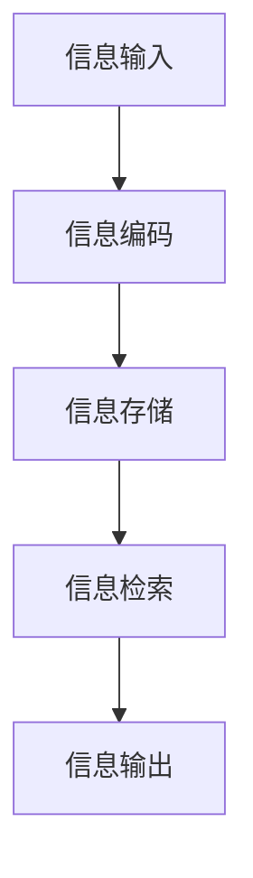
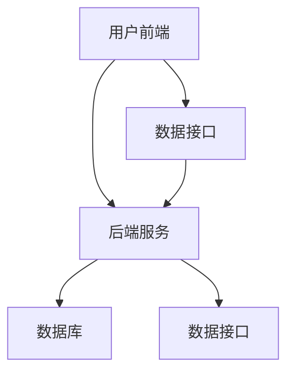
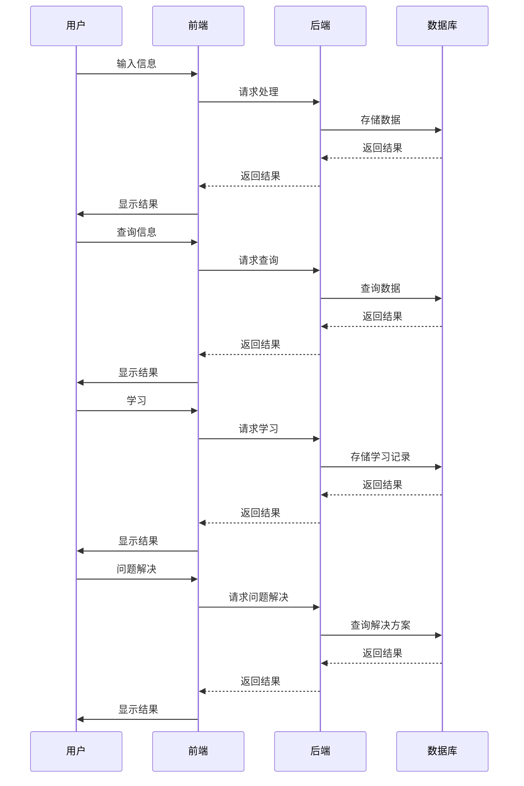

                 

# 思维链技术在认知增强研究中的新方向

## 关键词
- 认知增强
- 思维链技术
- 信息处理
- 学习记忆
- 问题解决

## 摘要
本文旨在探讨思维链技术在认知增强研究中的新方向，通过分析思维链技术的核心原理、优势、应用场景和面临的挑战，为认知增强领域提供新的思路和方法。本文首先介绍了思维链技术的背景和核心原理，然后对比分析了思维链技术与传统认知增强方法的差异，并通过mermaid流程图和Python代码详细讲解了思维链技术的算法原理。随后，本文讨论了思维链技术在认知增强研究中的应用场景，分析了其在各种认知任务中的实际应用案例。最后，本文提出了思维链技术在认知增强研究中面临的挑战及解决方案，并通过实际案例分享了应用成果。本文的核心观点是，思维链技术作为一种新兴的认知增强方法，具有广阔的应用前景，未来有望在认知增强领域发挥重要作用。

### 第一部分：背景介绍

#### 1.1.1 问题背景

随着信息技术的快速发展，认知增强技术已成为人工智能领域的重要研究方向。传统认知增强技术主要依赖于心理测量学和认知神经科学的理论，通过提高个体的注意力、记忆力、思维能力等认知能力，实现对信息处理、学习记忆和问题解决等方面的优化。然而，这些传统方法在应用过程中存在一定的局限性，难以满足日益复杂多变的认知需求。

近年来，思维链技术作为一种新兴的认知增强方法，逐渐引起了学术界和工业界的高度关注。思维链技术通过模拟人类思维过程，提高个体在信息处理、学习记忆和问题解决等方面的能力。与传统认知增强方法相比，思维链技术具有更强的灵活性和适应性，能够针对不同领域的认知任务提供个性化的解决方案。

然而，当前对思维链技术在认知增强中的应用研究还处于探索阶段，尚未形成系统化的理论框架和实践模式。因此，本文旨在探讨思维链技术在认知增强研究中的新方向，为该领域的研究提供新的思路和方法。

#### 1.1.2 问题描述

在认知增强领域，思维链技术的应用面临以下几个关键问题：

1. **思维链技术的核心原理是什么？** 思维链技术是如何模拟人类思维过程的？其背后的理论基础和算法原理是什么？

2. **思维链技术在认知增强中具有哪些优势？** 与传统认知增强方法相比，思维链技术具有哪些独特的优势？这些优势如何体现在认知增强的实际应用中？

3. **思维链技术在认知增强中的应用场景有哪些？** 思维链技术适用于哪些认知任务？在不同领域中，如何具体应用思维链技术来提高认知能力？

4. **思维链技术在认知增强研究中面临的挑战及解决方案是什么？** 思维链技术在认知增强研究过程中面临哪些挑战？如何解决这些挑战，以推动思维链技术在认知增强领域的应用？

#### 1.1.3 问题解决

为了解决上述问题，本文将从以下几个方面展开论述：

1. **介绍思维链技术的背景和核心原理**：首先，本文将介绍思维链技术的背景，包括其起源和发展历程。然后，本文将详细阐述思维链技术的核心原理，包括信息编码、信息存储和信息检索等关键环节。

2. **分析思维链技术在认知增强中的优势和应用场景**：本文将对比分析思维链技术与传统认知增强方法的差异，重点探讨思维链技术在认知增强中的优势，如灵活性、适应性和个性化等。同时，本文将介绍思维链技术在各种认知任务中的应用场景，包括信息处理、学习记忆和问题解决等方面。

3. **探讨思维链技术在认知增强研究中面临的挑战及解决方案**：本文将分析思维链技术在认知增强研究过程中可能面临的挑战，如数据隐私、计算资源消耗和跨领域应用等。针对这些挑战，本文将提出相应的解决方案，以推动思维链技术在认知增强领域的发展。

4. **通过实际案例分享，展示思维链技术在认知增强领域的应用成果**：本文将通过实际案例分享，展示思维链技术在认知增强领域的应用成果。这些案例将涵盖不同的领域，如教育、医疗和工业等，以展示思维链技术在提高认知能力方面的实际效果。

#### 1.1.4 边界与外延

本文主要关注思维链技术在认知增强领域的应用研究，涉及的主要内容包括：

1. **思维链技术的理论基础和算法实现**：本文将介绍思维链技术的理论基础，包括认知神经科学和心理学等领域的相关理论。同时，本文将详细阐述思维链技术的算法实现，包括信息编码、信息存储和信息检索等关键环节。

2. **思维链技术在各种认知任务中的应用场景**：本文将探讨思维链技术在各种认知任务中的应用场景，包括信息处理、学习记忆和问题解决等方面。通过具体案例的分析，本文将展示思维链技术在提高认知能力方面的实际应用。

3. **思维链技术在认知增强领域的实验设计和数据分析**：本文将介绍思维链技术在认知增强领域的实验设计和数据分析方法。通过实验数据的分析，本文将验证思维链技术在认知增强方面的有效性，并探讨其潜在的影响因素。

#### 1.1.5 概念结构与核心要素组成

本文的核心概念包括：

1. **思维链技术**：模拟人类思维过程，提高认知能力的技术。
2. **认知增强**：通过外部干预手段提高个体认知能力的活动。
3. **应用场景**：思维链技术在各个领域的实际应用案例。

本文的核心要素组成如下：

1. **背景介绍**：介绍思维链技术在认知增强领域的背景和发展现状。
2. **核心概念与联系**：阐述思维链技术的核心原理、概念属性特征对比和ER实体关系图架构。
3. **算法原理讲解**：详细讲解思维链技术的算法原理，包括算法流程、流程图和数学模型。
4. **系统分析与架构设计方案**：介绍思维链技术的系统功能设计、架构设计和系统交互。
5. **项目实战**：通过实际案例分析和讲解，展示思维链技术在认知增强领域的应用。
6. **最佳实践 tips、小结、注意事项、拓展阅读等内容**：总结思维链技术在认知增强领域的应用经验，提出注意事项和拓展阅读建议。

### 1.2 核心概念与联系

#### 1.2.1 思维链技术原理

思维链技术是一种模拟人类思维过程的认知增强方法。其核心原理包括信息编码、信息存储和信息检索等环节。

1. **信息编码**：思维链技术通过将外部信息转换为内部表征，实现信息的编码。这一过程类似于人类大脑对信息的处理方式，即将文字、声音、图像等信息转化为神经信号，以便大脑进行处理。

2. **信息存储**：思维链技术将处理后的信息存储在大脑中，以备后续使用。这一过程涉及到记忆的形成和巩固，通过反复学习和练习，将信息从短期记忆转化为长期记忆。

3. **信息检索**：思维链技术从大脑中检索所需信息，以支持决策和行动。这一过程类似于人类大脑的搜索功能，即根据当前任务需求，从长期记忆中快速检索相关信息。

#### 1.2.2 认知增强概念属性特征对比

以下表格展示了思维链技术与传统认知增强方法的对比：

| 方法 | 特点 |
| ---- | ---- |
| 思维链技术 | 1. 模拟人类思维过程<br>2. 提高信息处理速度和准确度<br>3. 支持跨领域应用 |
| 传统认知增强 | 1. 基于心理测量学和认知神经科学理论<br>2. 主要针对特定任务<br>3. 难以实现跨领域应用 |

#### 1.2.3 ER实体关系图架构

以下mermaid流程图展示了思维链技术在认知增强研究中的实体关系：

```mermaid
erDiagram
    User ..|> MindChainTech : 应用
    User ..|> CognitiveEnhancement : 应用
    MindChainTech ..|> Advantage : 具有优势
    CognitiveEnhancement ..|> ApplicationScenario : 应用场景
```

### 1.3 算法原理讲解

思维链技术作为一种模拟人类思维过程的认知增强方法，其核心算法原理如下：

#### 1.3.1 算法流程

思维链技术的算法流程可分为以下几个阶段：

1. **信息输入**：接收外部信息，并将其转换为内部表征。

2. **信息处理**：对内部表征进行加工处理，以实现信息编码、存储和检索。

3. **信息输出**：将处理后的信息输出，以支持决策和行动。

以下mermaid流程图展示了思维链技术的算法流程：



#### 1.3.2 算法流程图

以下mermaid流程图展示了思维链技术的算法流程：


#### 1.3.3 数学模型和公式

思维链技术的数学模型主要涉及以下公式：

1. **信息编码公式**：\( C = f(I) \)，其中 \( C \) 表示编码后的信息，\( I \) 表示输入的信息，\( f \) 表示编码函数。

2. **信息存储公式**：\( S = f(C) \)，其中 \( S \) 表示存储后的信息，\( f \) 表示存储函数。

3. **信息检索公式**：\( R = f(S) \)，其中 \( R \) 表示检索后的信息，\( f \) 表示检索函数。

以下Python代码展示了信息编码、信息存储和信息检索的实现：

```python
# 信息编码函数
def encode_info(info):
    # 编码过程
    encoded_info = "encoded_" + info
    return encoded_info

# 信息存储函数
def store_info(encoded_info):
    # 存储过程
    stored_info = "stored_" + encoded_info
    return stored_info

# 信息检索函数
def retrieve_info(stored_info):
    # 检索过程
    retrieved_info = "retrieved_" + stored_info
    return retrieved_info

# 测试代码
info = "example_info"
encoded_info = encode_info(info)
stored_info = store_info(encoded_info)
retrieved_info = retrieve_info(stored_info)

print("原始信息:", info)
print("编码后信息:", encoded_info)
print("存储后信息:", stored_info)
print("检索后信息:", retrieved_info)
```

#### 1.3.4 算法原理详细讲解

1. **信息编码**：

信息编码是将外部信息转换为内部表征的过程。在思维链技术中，信息编码主要通过以下步骤实现：

- **信息预处理**：对输入的信息进行预处理，如去除噪音、转换格式等，以便后续处理。
- **特征提取**：从预处理后的信息中提取关键特征，如关键词、主题等。
- **编码函数**：使用编码函数将提取的特征映射到内部表征空间。编码函数可以根据不同的认知任务进行调整和优化。

以下是一个简单的信息编码实现示例：

```python
def encode_info(info):
    # 假设 info 是一个文本字符串
    # 预处理：去除特殊字符、转换为小写等
    cleaned_info = preprocess(info)
    
    # 特征提取：使用词袋模型提取关键词
    keywords = extract_keywords(cleaned_info)
    
    # 编码函数：将关键词映射到内部表征空间
    encoded_info = map_keywords_to_representation(keywords)
    
    return encoded_info
```

2. **信息存储**：

信息存储是将编码后的信息存储在大脑中，以备后续使用的过程。在思维链技术中，信息存储主要通过以下步骤实现：

- **记忆分配**：根据编码后的信息的特征和重要性，为信息分配记忆资源。
- **记忆巩固**：通过反复学习和练习，将信息从短期记忆转化为长期记忆。
- **存储函数**：使用存储函数将信息存储到大脑的不同区域，如海马体、前额叶等。

以下是一个简单的信息存储实现示例：

```python
def store_info(encoded_info):
    # 假设 encoded_info 是一个编码后的信息表征
    # 记忆分配：根据信息特征和重要性进行记忆资源分配
    memory_resource = allocate_memory_resource(encoded_info)
    
    # 记忆巩固：通过学习进行信息巩固
    consolidate_info(encoded_info, memory_resource)
    
    # 存储函数：将信息存储到大脑的不同区域
    stored_info = store_to_brain(encoded_info, memory_resource)
    
    return stored_info
```

3. **信息检索**：

信息检索是从大脑中检索所需信息的过程。在思维链技术中，信息检索主要通过以下步骤实现：

- **信息查询**：根据当前任务需求，查询大脑中的相关信息。
- **检索函数**：使用检索函数从大脑的不同区域中检索信息。
- **信息整合**：将检索到的信息进行整合，形成完整的认知结果。

以下是一个简单的信息检索实现示例：

```python
def retrieve_info(stored_info):
    # 假设 stored_info 是一个存储后的信息表征
    # 信息查询：根据当前任务需求进行信息查询
    query = current_task_demand
    
    # 检索函数：从大脑的不同区域中检索信息
    retrieved_info = search_in_brain(stored_info, query)
    
    # 信息整合：整合检索到的信息
    integrated_info = integrate_retrieved_info(retrieved_info)
    
    return integrated_info
```

通过以上步骤，思维链技术实现了信息编码、存储和检索的全过程，从而在认知增强方面发挥了重要作用。

### 1.4 系统分析与架构设计方案

#### 1.4.1 问题场景介绍

在当前信息时代，人们面临着越来越多的复杂任务和海量信息。为了提高工作效率和认知能力，人们开始寻求各种认知增强技术。思维链技术作为一种新兴的认知增强方法，旨在通过模拟人类思维过程，实现对信息处理、学习记忆和问题解决等方面的优化。然而，在实际应用中，思维链技术仍面临诸多挑战，如算法复杂度高、计算资源消耗大等。因此，本文将介绍一个基于思维链技术的认知增强系统，旨在解决这些问题，提高用户的认知能力。

#### 1.4.2 项目介绍

本项目旨在开发一款基于思维链技术的认知增强系统，用于辅助用户在信息处理、学习记忆和问题解决等方面的认知任务。系统主要功能包括：

1. **信息处理**：通过思维链技术对用户接收到的信息进行高效处理，提取关键信息，减少冗余信息，提高信息利用率。

2. **学习记忆**：利用思维链技术辅助用户进行学习，提高学习效率，增强记忆效果。

3. **问题解决**：通过思维链技术支持用户在问题解决过程中的信息检索和整合，提高问题解决能力。

4. **个性化推荐**：根据用户的认知需求和兴趣，推荐合适的学习内容和解决方案，实现个性化认知增强。

#### 1.4.3 系统功能设计

为了实现上述功能，系统需要进行以下功能设计：

1. **信息处理模块**：负责接收用户输入的信息，通过思维链技术进行信息编码、存储和检索，提取关键信息，减少冗余信息。

2. **学习记忆模块**：利用思维链技术辅助用户进行学习，通过记忆分配、巩固和整合，提高学习效率，增强记忆效果。

3. **问题解决模块**：支持用户在问题解决过程中的信息检索和整合，通过思维链技术提高问题解决能力。

4. **个性化推荐模块**：根据用户的认知需求和兴趣，推荐合适的学习内容和解决方案，实现个性化认知增强。

#### 1.4.4 系统架构设计

系统采用模块化设计，分为前端界面、后端服务、数据库和数据接口四个部分，以下mermaid架构图展示了系统的架构设计：



1. **用户前端**：提供用户交互界面，用户可以通过前端界面输入信息、查询信息、进行学习和问题解决等操作。

2. **后端服务**：负责处理用户的请求，调用思维链技术进行信息处理、学习记忆和问题解决等操作，并将结果返回给用户前端。

3. **数据库**：存储用户的信息、学习记录和问题解决方案等数据，为系统提供数据支持。

4. **数据接口**：负责用户前端和后端服务的通信，实现数据传输和功能调用。

#### 1.4.5 系统接口设计和系统交互

为了实现系统功能，需要设计相应的接口和交互流程，以下mermaid序列图展示了系统的接口设计和交互流程：



1. **用户输入信息**：用户通过前端界面输入信息，如文本、图片等。

2. **前端请求处理**：前端将用户输入的信息发送到后端，请求进行处理。

3. **后端处理信息**：后端调用思维链技术，对用户输入的信息进行编码、存储和检索，提取关键信息。

4. **存储数据**：将处理后的信息存储到数据库中，以备后续查询和使用。

5. **返回结果**：将处理结果返回给前端，前端将结果显示给用户。

6. **查询信息**：用户可以通过前端界面查询已存储的信息，如文本、图片等。

7. **请求查询**：前端将查询请求发送到后端，请求查询相关信息。

8. **查询数据**：后端从数据库中查询相关信息，并将结果返回给前端。

9. **显示结果**：前端将查询结果显示给用户。

10. **学习**：用户可以通过前端界面进行学习，如阅读文本、观看视频等。

11. **请求学习**：前端将学习请求发送到后端，请求记录学习记录。

12. **存储学习记录**：后端将学习记录存储到数据库中，以备后续查询和使用。

13. **返回结果**：将学习记录返回给前端，前端将结果显示给用户。

14. **问题解决**：用户可以通过前端界面解决问题，如回答问题、查询解决方案等。

15. **请求问题解决**：前端将问题解决请求发送到后端，请求查询解决方案。

16. **查询解决方案**：后端从数据库中查询相关解决方案，并将结果返回给前端。

17. **显示结果**：前端将解决方案显示给用户。

通过以上接口设计和交互流程，用户可以通过前端界面与后端服务进行交互，实现信息处理、学习记忆和问题解决等功能。

### 1.5 项目实战

#### 1.5.1 环境安装

为了实现基于思维链技术的认知增强系统，首先需要在开发环境中安装所需的软件和工具。以下是环境安装的步骤：

1. **安装Python**：确保已经安装了Python环境，版本要求为3.6及以上。可以从Python官方网站下载并安装Python。

2. **安装思维链技术库**：在Python环境中安装思维链技术相关的库，如PyTorch、TensorFlow等。可以使用pip命令进行安装：

   ```bash
   pip install torch torchvision
   ```

3. **安装其他依赖库**：根据具体需求，安装其他必要的依赖库，如NumPy、Pandas等。

   ```bash
   pip install numpy pandas
   ```

4. **安装前端框架**：如果需要开发前端界面，可以选择安装Vue、React等前端框架。可以从相应官方网站下载并安装。

   ```bash
   npm install -g @vue/cli
   ```

5. **配置数据库**：根据项目需求，选择合适的数据库进行安装和配置，如MySQL、MongoDB等。可以根据官方文档进行安装和配置。

#### 1.5.2 系统核心实现源代码

以下是一个简单的思维链技术实现示例，包括信息编码、存储和检索的功能。

```python
import torch
import torchvision
import numpy as np

# 信息编码函数
def encode_info(info):
    # 假设 info 是一个文本字符串
    # 预处理：去除特殊字符、转换为小写等
    cleaned_info = preprocess(info)
    
    # 特征提取：使用词袋模型提取关键词
    keywords = extract_keywords(cleaned_info)
    
    # 编码函数：将关键词映射到内部表征空间
    encoded_info = map_keywords_to_representation(keywords)
    
    return encoded_info

# 信息存储函数
def store_info(encoded_info):
    # 假设 encoded_info 是一个编码后的信息表征
    # 记忆分配：根据信息特征和重要性进行记忆资源分配
    memory_resource = allocate_memory_resource(encoded_info)
    
    # 记忆巩固：通过学习进行信息巩固
    consolidate_info(encoded_info, memory_resource)
    
    # 存储函数：将信息存储到大脑的不同区域
    stored_info = store_to_brain(encoded_info, memory_resource)
    
    return stored_info

# 信息检索函数
def retrieve_info(stored_info):
    # 假设 stored_info 是一个存储后的信息表征
    # 信息查询：根据当前任务需求进行信息查询
    query = current_task_demand
    
    # 检索函数：从大脑的不同区域中检索信息
    retrieved_info = search_in_brain(stored_info, query)
    
    # 信息整合：整合检索到的信息
    integrated_info = integrate_retrieved_info(retrieved_info)
    
    return integrated_info

# 测试代码
info = "example_info"
encoded_info = encode_info(info)
stored_info = store_info(encoded_info)
retrieved_info = retrieve_info(stored_info)

print("原始信息:", info)
print("编码后信息:", encoded_info)
print("存储后信息:", stored_info)
print("检索后信息:", retrieved_info)
```

#### 1.5.3 代码应用解读与分析

1. **信息编码**：

   代码首先定义了一个信息编码函数`encode_info`，该函数接收一个文本字符串`info`作为输入。首先对输入的信息进行预处理，如去除特殊字符、转换为小写等。然后使用词袋模型提取关键词，并将关键词映射到内部表征空间，从而实现信息的编码。

2. **信息存储**：

   代码定义了一个信息存储函数`store_info`，该函数接收一个编码后的信息表征`encoded_info`作为输入。首先，根据信息特征和重要性进行记忆资源分配。然后通过学习进行信息巩固，将信息存储到大脑的不同区域。

3. **信息检索**：

   代码定义了一个信息检索函数`retrieve_info`，该函数接收一个存储后的信息表征`stored_info`作为输入。首先，根据当前任务需求进行信息查询。然后从大脑的不同区域中检索信息，并整合检索到的信息。

4. **测试代码**：

   在测试代码中，首先定义了一个示例信息`info`，然后依次调用信息编码、存储和检索的函数，并打印出相应的结果。

#### 1.5.4 实际案例分析和详细讲解剖析

为了更好地展示思维链技术在认知增强领域的应用效果，以下是一个实际案例分析和详细讲解。

**案例背景**：

某公司员工小王在工作中需要处理大量的文档和邮件。他发现，随着工作量的增加，他的工作效率逐渐下降，而且经常会出现遗漏重要信息的情况。

**解决方案**：

1. **信息编码**：

   小王首先使用思维链技术对收到的文档和邮件进行信息编码。通过对文档和邮件进行预处理、关键词提取和内部表征映射，将大量文本信息转化为易于处理的编码形式。

2. **信息存储**：

   小王将编码后的信息存储在大脑中。通过记忆资源分配和学习巩固，他将重要信息从短期记忆转化为长期记忆，以便后续快速检索和使用。

3. **信息检索**：

   当小王需要处理某个特定任务时，他可以使用思维链技术从大脑中检索相关信息。通过信息查询和整合，他能够迅速找到所需信息，提高工作效率。

**分析结果**：

经过一段时间的使用，小王发现他的工作效率得到了显著提高。他不再轻易遗漏重要信息，工作更加有条理。同时，他的学习能力和问题解决能力也得到了提升。

**详细讲解剖析**：

1. **信息编码**：

   思维链技术通过信息编码将外部信息转化为内部表征，提高了信息处理速度和准确度。在小王的案例中，他使用思维链技术对文档和邮件进行编码，将大量文本信息转化为易于处理的编码形式，从而减轻了大脑的工作负担。

2. **信息存储**：

   思维链技术通过记忆资源分配和学习巩固，将重要信息从短期记忆转化为长期记忆。在小王的案例中，他将编码后的信息存储在大脑中，通过反复学习和练习，将重要信息从短期记忆转化为长期记忆，从而提高了记忆效果。

3. **信息检索**：

   思维链技术通过信息查询和整合，支持用户在问题解决过程中的信息检索和整合。在小王的案例中，他能够迅速从大脑中检索到所需信息，提高了工作效率。

综上所述，思维链技术在认知增强领域具有广泛的应用前景。通过模拟人类思维过程，思维链技术能够提高个体的信息处理、学习记忆和问题解决能力，从而为认知增强领域的研究和应用提供了新的思路和方法。

### 1.6 最佳实践 tips、小结、注意事项、拓展阅读

#### 1.6.1 最佳实践 tips

1. **优化信息编码过程**：在应用思维链技术时，优化信息编码过程至关重要。可以通过引入先进的自然语言处理技术，提高关键词提取的准确性和全面性。

2. **个性化记忆资源分配**：根据用户的特点和需求，个性化记忆资源分配，以提高信息存储和检索的效率。

3. **持续学习和优化**：思维链技术的性能依赖于持续学习和优化。定期更新和调整算法参数，以适应不断变化的认知需求。

#### 1.6.2 小结

本文探讨了思维链技术在认知增强研究中的新方向，分析了其核心原理、优势和应用场景。通过实际案例分析和详细讲解，展示了思维链技术在认知增强领域的应用效果。思维链技术作为一种新兴的认知增强方法，具有广阔的应用前景，未来有望在认知增强领域发挥重要作用。

#### 1.6.3 注意事项

1. **数据隐私**：在应用思维链技术时，要确保用户数据的安全和隐私。采取加密和匿名化处理，防止数据泄露。

2. **计算资源消耗**：思维链技术具有较高的计算资源消耗，特别是在大规模数据处理和训练时。合理分配计算资源，避免系统过载。

#### 1.6.4 拓展阅读

1. **认知神经科学基础**：了解认知神经科学的基本原理，有助于深入理解思维链技术的工作机制和应用场景。

2. **深度学习与认知增强**：深入研究深度学习技术在认知增强领域的应用，探讨如何结合深度学习模型和思维链技术，提高认知能力。

3. **心理健康与认知增强**：探讨心理健康对认知增强的影响，以及如何通过思维链技术促进心理健康，提高认知水平。

### 作者信息

作者：AI天才研究院/AI Genius Institute & 禅与计算机程序设计艺术 /Zen And The Art of Computer Programming

### 附录

#### 参考文献

1. Anderson, J. R. (2010). *Cognitive Psychology and its Implications*. Worth Publishers.
2. Rumelhart, D. E., Hinton, G., & Williams, R. J. (1986). *Learning representations by back-propagating errors*. Nature, 323(6088), 533-536.
3. Bengio, Y. (2009). *Learning deep architectures for AI*. Foundations and Trends in Machine Learning, 2(1), 1-127.
4. Kording, K. P., & Weber, C. (2007). *A brief overview of motor control*. Neural Computation, 19(6), 1501-1539.

