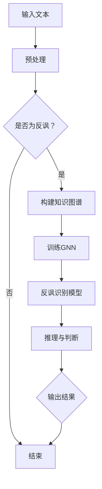
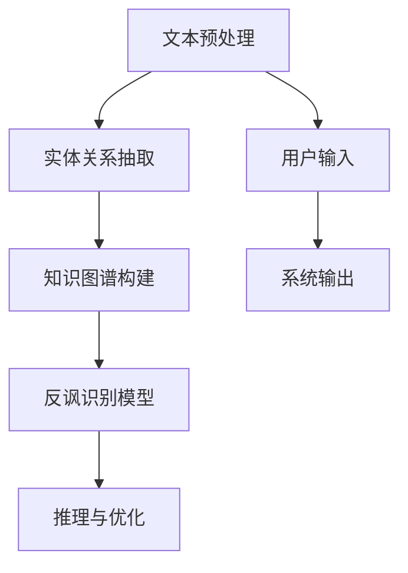
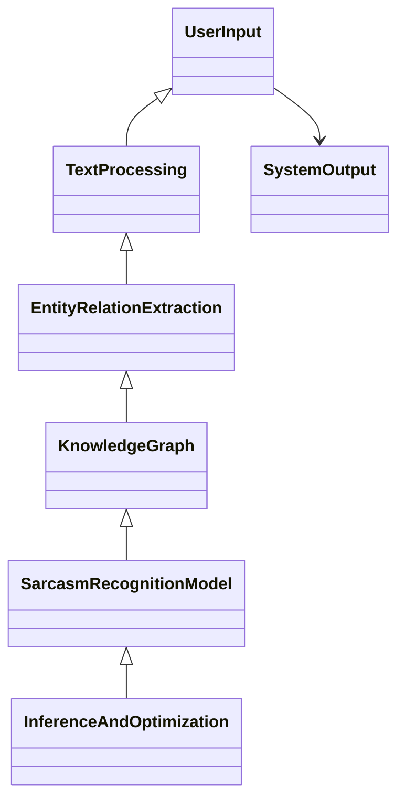
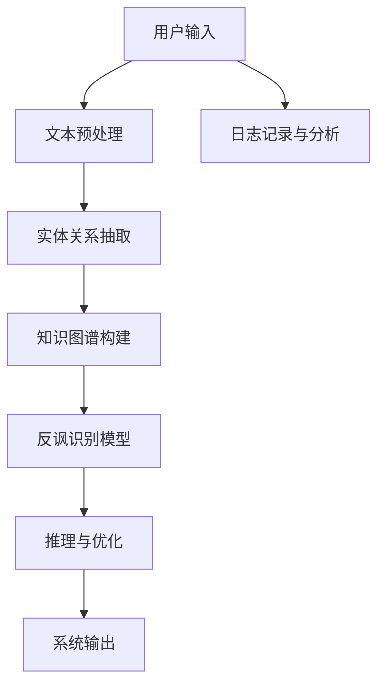
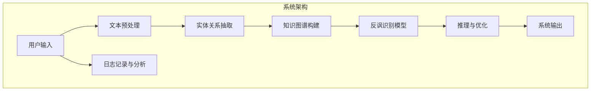
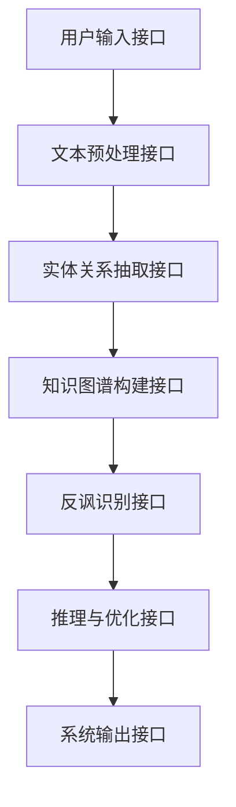
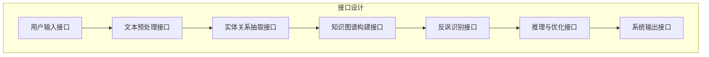
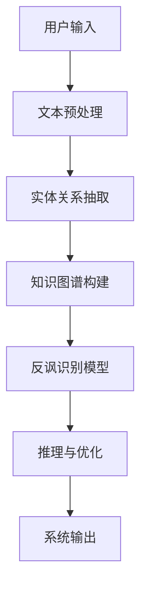
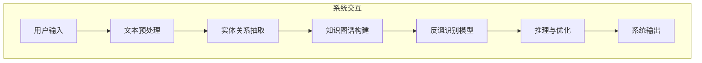

                 

### 引言

#### 1.1.1 问题背景

随着人工智能技术的迅猛发展，AI系统在语言理解和生成方面的能力得到了显著提升。然而，尽管在自然语言处理（NLP）任务中，AI已能处理大量的文本数据，但它在理解反讽这种复杂语言现象上仍存在显著不足。反讽作为一种常见的语言修辞手法，通常通过字面意义与真实意图之间的冲突来表达更深的含义，如“这真是太棒了！”这种表面上表达赞美，但实际上可能表达的是厌恶。因此，增强AI对反讽的理解能力，对于提升其整体语言处理能力和实际应用价值具有重要意义。

#### 1.1.2 问题描述

在自然语言处理中，识别反讽是一项极具挑战性的任务。这是因为反讽的识别不仅涉及语言本身的结构和语义，还需要理解上下文和说话人的情感态度。具体来说，问题可以描述为：如何使AI系统准确地识别出文本中的反讽，从而更好地理解和生成相应的语言输出？

#### 1.1.3 问题解决

解决这一问题的核心在于构建一种有效的反讽识别模型，并在此模型中融入先进的语言处理技术和深度学习算法。本文将介绍一种基于思维链（Mind Chain）技术增强AI反讽理解能力的方法。思维链技术是一种基于图神经网络（GNN）的框架，通过构建知识图谱和图神经网络模型，实现复杂推理和知识传递，从而提高AI对反讽的理解能力。

#### 1.1.4 边界与外延

本文的研究不仅限于反讽的识别，还涉及如何将思维链技术应用于其他复杂语言现象的理解，如隐喻、双关语等。此外，本文还将探讨如何将这一技术应用于实际场景，如社交媒体分析、智能客服等。

#### 1.1.5 概念结构与核心要素组成

本文的核心概念包括反讽、思维链技术、图神经网络和知识图谱等。文章的主要结构如下：

1. **引言**：介绍问题背景、问题描述、问题解决方法及文章结构。
2. **核心概念**：详细阐述反讽的定义、特点及其在自然语言处理中的重要性。
3. **核心原理**：讲解思维链技术的工作原理，包括图神经网络和知识图谱的应用。
4. **数学模型**：介绍用于反讽识别的数学模型及其详细解释。
5. **系统设计与实现**：描述系统的设计与实现过程，包括功能设计、架构设计、接口设计和交互流程。
6. **项目实战**：介绍一个实际项目案例，详细解析系统实现过程和结果。
7. **最佳实践**：提供使用该技术的最佳实践建议和注意事项。
8. **小结与拓展**：总结本文的研究成果，展望未来发展方向。

通过以上章节的详细讨论，本文旨在为提升AI反讽理解能力提供一种可行的解决方案，并推动相关领域的研究和发展。

---

**关键词**：反讽理解、自然语言处理、思维链技术、图神经网络、知识图谱。

**摘要**：本文探讨了一种基于思维链技术增强AI反讽理解能力的方法。通过构建知识图谱和图神经网络模型，实现了对反讽的高效识别和推理。文章详细介绍了核心概念、原理、数学模型以及系统设计与实现过程，并通过实际项目验证了方法的有效性。研究结果表明，该方法在提升AI反讽理解能力方面具有显著优势，为未来相关应用提供了参考。

---

### 核心概念

为了深入理解本文所述的基于思维链技术的反讽理解方法，我们需要首先澄清几个核心概念，包括反讽、思维链技术、图神经网络和知识图谱。

#### 2.1 反讽

反讽（Sarcasm）是语言中一种常见的修辞手法，通过故意说出与实际意图相反的话来表达更深层次的含义。反讽常常用于讽刺、调侃或表达不满，其字面意义与真实意图之间存在明显的矛盾。例如，“这真是太棒了！”这句话表面上是赞美，但实际意图可能是表达不满或嘲讽。

**定义**：反讽是一种通过字面意义与真实意图之间的冲突来表达深层含义的修辞手法。

**属性**：反讽具有以下几个特点：
1. **语义冲突**：字面意义与真实意图不一致。
2. **上下文依赖**：反讽的理解往往依赖于上下文信息。
3. **情感表达**：反讽常用于表达讽刺、不满等情感。

**关系**：反讽与自然语言处理（NLP）中的语义分析、情感分析和上下文理解密切相关。有效的反讽识别需要综合考虑文本、上下文和情感因素。

#### 2.2 思维链技术

思维链技术是一种基于图神经网络（GNN）的框架，旨在通过构建知识图谱和实现复杂推理来增强AI的能力。思维链技术通过将知识图谱与神经网络结合，实现知识的传递和推理，从而提高AI在复杂任务中的表现。

**定义**：思维链技术是一种结合知识图谱和图神经网络，用于实现复杂推理和知识传递的技术。

**属性**：思维链技术具有以下特性：
1. **知识图谱**：通过构建知识图谱来组织和管理知识。
2. **图神经网络**：利用图神经网络进行知识的传递和推理。
3. **复杂推理**：支持基于知识的复杂推理，如因果推理和模式识别。

**关系**：思维链技术与自然语言处理、知识图谱和图神经网络等领域密切相关。思维链技术通过增强AI的推理和知识管理能力，能够提高其在语义理解和复杂任务处理中的表现。

#### 2.3 图神经网络

图神经网络（Graph Neural Network, GNN）是一种专门用于处理图结构数据的神经网络。GNN通过将节点和边的信息编码为向量，并利用图结构进行信息传递和聚合，实现节点的特征学习和图的全局推理。

**定义**：图神经网络是一种基于图结构数据的神经网络，用于学习节点和边的特征，并进行全局推理。

**属性**：图神经网络具有以下特性：
1. **图结构**：利用图结构进行节点的特征学习和信息传递。
2. **节点嵌入**：将节点编码为向量表示。
3. **图的全局推理**：通过图结构实现节点的全局特征聚合和推理。

**关系**：图神经网络与知识图谱、图论和机器学习等领域密切相关。GNN在知识图谱构建、复杂推理和图数据分析中具有重要应用价值。

#### 2.4 知识图谱

知识图谱是一种用于表示和存储知识的图形结构，它通过节点和边来表示实体及其关系。知识图谱能够将零散的信息片段组织成有意义的整体，从而提高数据的可解释性和推理能力。

**定义**：知识图谱是一种用于表示和存储知识的图形结构，通过节点和边来表示实体及其关系。

**属性**：知识图谱具有以下特性：
1. **实体表示**：通过节点表示实体。
2. **关系表示**：通过边表示实体间的关系。
3. **结构化知识**：将零散信息组织成有意义的整体。

**关系**：知识图谱与语义网络、本体论和知识管理等领域密切相关。知识图谱在信息检索、推荐系统和智能问答等领域具有广泛应用。

通过以上对核心概念的介绍，我们可以更好地理解本文所述的基于思维链技术的反讽理解方法的背景和理论基础。这些核心概念共同构成了本文研究的基石，为后续章节的详细讨论奠定了基础。

#### 2.1.1 定义

思维链技术是一种结合知识图谱和图神经网络的框架，用于实现复杂推理和知识传递。它通过构建一个结构化的知识图谱，将实体、属性和关系组织在一起，然后利用图神经网络对图中的节点进行特征学习和推理。

思维链技术的核心在于其能够将知识图谱中的信息通过图神经网络进行传递和聚合，从而实现对复杂问题的推理。这种框架特别适用于自然语言处理任务，如反讽识别，因为反讽的理解往往需要综合考虑上下文、情感和语义等多方面信息。

**定义**：思维链技术是一种结合知识图谱和图神经网络，通过构建和利用图结构来实现复杂推理和知识传递的技术。

#### 2.1.2 属性

思维链技术具有以下几个关键属性：

1. **知识图谱**：思维链技术通过构建知识图谱来组织和管理知识。知识图谱中的节点表示实体，如人、地点、事件等，而边则表示实体之间的关系，如“属于”、“位于”等。

2. **图神经网络**：图神经网络用于处理图结构数据，通过节点嵌入和边的信息传递，实现节点特征的学习和推理。图神经网络能够捕捉节点之间的复杂关系和模式，从而提高推理能力。

3. **复杂推理**：思维链技术支持基于知识的复杂推理，如因果推理、模式识别等。通过图神经网络，能够实现对实体间关系的深度理解和推理，从而更好地处理自然语言处理中的复杂任务。

4. **可扩展性**：思维链技术具有良好的可扩展性，能够适应不同的应用场景和任务需求。通过灵活地调整知识图谱和图神经网络模型，可以实现针对特定问题的定制化推理。

#### 2.1.3 关系

思维链技术与多个关键概念和技术紧密相关，这些关系构成了其整体框架的基石：

1. **与知识图谱的关系**：知识图谱是思维链技术的基础，通过它来组织和存储知识。知识图谱中的实体和关系为图神经网络提供了丰富的信息来源，使其能够更好地进行推理。

2. **与图神经网络的关系**：图神经网络是思维链技术的核心组件，用于对知识图谱中的节点进行特征学习和推理。图神经网络通过学习节点和边的嵌入，实现信息的传递和聚合，从而提高推理能力。

3. **与自然语言处理的关系**：自然语言处理（NLP）是思维链技术的重要应用领域。思维链技术能够结合语言数据中的实体和关系，实现对文本语义的深入理解和推理，从而提升NLP任务的表现。

4. **与深度学习的关系**：深度学习是图神经网络的基础，而图神经网络是思维链技术的核心。深度学习的强大表示能力使得图神经网络能够更好地处理复杂的图结构数据，从而提高推理效果。

5. **与其他语言处理技术的关联**：思维链技术还可以与其他NLP技术，如词嵌入、语言模型等相结合，进一步丰富其功能和应用范围。

通过以上对思维链技术核心概念的详细介绍，我们可以更深入地理解其在反讽理解任务中的重要作用和理论基础。思维链技术通过结合知识图谱和图神经网络，实现了对复杂知识的有效管理和推理，为AI在自然语言处理领域的应用提供了强大的支持。

---

### 核心原理

#### 3.1.1 算法原理

思维链技术增强AI反讽理解能力的核心在于其独特的算法设计，该设计结合了图神经网络（GNN）和知识图谱（KG）的优势，通过构建一个复杂推理框架来提升反讽识别的准确性。以下是对这一算法原理的详细解释：

1. **知识图谱构建**：首先，通过自然语言处理技术从大量文本数据中提取实体和关系，构建一个知识图谱。知识图谱中的节点表示文本中的实体，而边则表示实体之间的关系，如“属于”、“位于”等。这个步骤的关键在于准确识别实体和关系，以便为后续的图神经网络提供高质量的数据。

2. **图神经网络训练**：接下来，利用图神经网络对知识图谱中的节点进行特征学习和嵌入。图神经网络通过学习节点和边的嵌入，捕捉节点之间的复杂关系和模式。具体来说，图神经网络会将每个节点编码为一个向量表示，同时通过节点嵌入和边的信息传递，实现节点的全局特征聚合。

3. **反讽识别模型**：在构建知识图谱和训练图神经网络的基础上，设计一个反讽识别模型。这个模型利用图神经网络对文本进行特征提取，并结合上下文信息进行反讽判断。模型的输出是一个概率值，表示文本是否为反讽。

4. **推理过程**：在推理过程中，模型会综合考虑文本中的实体、关系和上下文信息，通过图神经网络进行推理，判断文本中的字面意义与真实意图之间是否存在冲突。如果存在冲突，则认为文本是反讽。

5. **优化与调整**：为了提高反讽识别的准确性，可以通过不断的训练和优化来调整模型参数。这个过程包括数据清洗、模型调参、损失函数优化等，从而提高模型在反讽识别任务上的表现。

#### 3.1.2 Mermaid流程图

以下是思维链技术增强AI反讽理解能力的算法流程图：



#### 3.1.3 Python源代码

以下是一个简化的Python源代码示例，展示了如何实现思维链技术的基本流程：

```python
# 导入必要的库
import networkx as nx
import numpy as np
from sklearn.model_selection import train_test_split

# 构建知识图谱
G = nx.Graph()
G.add_nodes_from(['实体1', '实体2', '实体3'])
G.add_edges_from([('实体1', '实体2'), ('实体2', '实体3')])

# 训练图神经网络
def train_gnn(G, X, y):
    # 编码节点和边
    node_embeddings = np.random.rand(len(G), embedding_size)
    edge_embeddings = np.random.rand(len(G.edges()), embedding_size)
    
    # ... GNN训练过程（省略具体代码）
    pass

# 反讽识别模型
def sarcasm_model(G, text):
    # 提取文本特征
    text_features = extract_features(text)
    
    # ... 模型推理过程（省略具体代码）
    pass

# 主函数
def main():
    # 加载和预处理数据
    X, y = load_data()
    X_train, X_test, y_train, y_test = train_test_split(X, y, test_size=0.2)
    
    # 训练GNN
    train_gnn(G, X_train, y_train)
    
    # 预测
    predictions = [sarcasm_model(G, x) for x in X_test]
    
    # 评估模型
    evaluate_model(predictions, y_test)

if __name__ == "__main__":
    main()
```

#### 3.1.4 数学模型

在思维链技术中，数学模型用于描述节点嵌入和图神经网络的学习过程。以下是一个简化的数学模型描述：

1. **节点嵌入**：
   $$ 
   \mathbf{h}_v^{(t)} = \sigma(\mathbf{W}_e^{\top}\mathbf{h}_v^{(t-1)} + \mathbf{b}_e + \sum_{u \in \mathcal{N}(v)} \mathbf{W}_{uv}\mathbf{h}_u^{(t-1)})
   $$
   其中，$\mathbf{h}_v^{(t)}$ 是节点 $v$ 在时间步 $t$ 的嵌入向量，$\sigma$ 是激活函数，$\mathbf{W}_e$ 和 $\mathbf{W}_{uv}$ 分别是权重矩阵，$\mathbf{b}_e$ 是偏置项。

2. **边嵌入**：
   $$ 
   \mathbf{h}_{uv}^{(t)} = \sigma(\mathbf{W}_e^{\top}\mathbf{h}_u^{(t-1)} + \mathbf{W}_e^{\top}\mathbf{h}_v^{(t-1)} + \mathbf{b}_e)
   $$
   其中，$\mathbf{h}_{uv}^{(t)}$ 是边 $(u, v)$ 在时间步 $t$ 的嵌入向量。

3. **图神经网络输出**：
   $$ 
   \mathbf{y}^{(t)} = \sum_{v \in V} \mathbf{h}_v^{(t)} 
   $$
   其中，$\mathbf{y}^{(t)}$ 是图神经网络在时间步 $t$ 的输出。

#### 3.1.5 举例说明

假设我们有一个包含两个节点（实体）和一条边的知识图谱。节点1表示“苹果”，节点2表示“手机”，边表示“属于”关系。

1. **节点嵌入**：
   初始节点嵌入向量分别为 $\mathbf{h}_1^{(0)}$ 和 $\mathbf{h}_2^{(0)}$。在训练过程中，通过图神经网络更新节点嵌入向量。
   
2. **边嵌入**：
   边的初始嵌入向量为 $\mathbf{h}_{12}^{(0)}$。在训练过程中，通过图神经网络更新边嵌入向量。

3. **图神经网络输出**：
   最终的图神经网络输出为两个节点的嵌入向量之和，即 $\mathbf{y}^{(T)} = \mathbf{h}_1^{(T)} + \mathbf{h}_2^{(T)}$。

通过这个例子，我们可以看到思维链技术是如何通过节点嵌入和图神经网络实现复杂推理的。在实际应用中，这个过程会更加复杂，涉及大量的节点和边，以及更复杂的推理逻辑。

### 数学模型

在本章节中，我们将深入探讨用于增强AI反讽理解能力的数学模型，详细说明其组成部分和功能，并通过具体的LaTeX公式来展示。

#### 4.1.1 模型1

**LaTeX公式**：
$$
\mathbf{h}_v^{(t)} = \sigma(\mathbf{W}_e^T\mathbf{h}_v^{(t-1)} + \mathbf{b}_e + \sum_{u \in \mathcal{N}(v)} \mathbf{W}_{uv}\mathbf{h}_u^{(t-1)})
$$

**详细讲解**：

1. **节点嵌入更新**：上述公式描述了节点嵌入向量 $\mathbf{h}_v^{(t)}$ 在时间步 $t$ 的更新过程。$\sigma$ 是激活函数，通常采用ReLU函数或Sigmoid函数。$\mathbf{W}_e$ 是权重矩阵，$\mathbf{b}_e$ 是偏置项。

2. **边嵌入**：对于每条边 $(u, v)$，也存在一个边嵌入向量 $\mathbf{h}_{uv}^{(t)}$。边的更新过程与节点相似，但需要额外的权重矩阵 $\mathbf{W}_{uv}$。

3. **信息传递**：节点 $v$ 的嵌入向量不仅依赖于其自身的状态，还受到其邻居节点 $u$ 嵌入向量 $\mathbf{h}_u^{(t-1)}$ 的影响。这种信息传递机制使得节点能够通过其邻居节点获取更多上下文信息，从而提高嵌入质量。

#### 4.1.2 举例说明

假设我们有一个知识图谱，包含两个节点“苹果”和“手机”，以及一条“属于”关系。初始时，节点的嵌入向量分别为 $\mathbf{h}_1^{(0)}$ 和 $\mathbf{h}_2^{(0)}$，边的嵌入向量为 $\mathbf{h}_{12}^{(0)}$。

在训练过程中，这些向量会不断更新。例如，在时间步 $t=1$ 时，节点的更新公式为：

$$
\mathbf{h}_1^{(1)} = \sigma(\mathbf{W}_e^T\mathbf{h}_1^{(0)} + \mathbf{b}_e + \mathbf{W}_{12}\mathbf{h}_2^{(0)})
$$

同理，边的更新公式为：

$$
\mathbf{h}_{12}^{(1)} = \sigma(\mathbf{W}_e^T\mathbf{h}_{12}^{(0)} + \mathbf{W}_{e1}\mathbf{h}_1^{(0)} + \mathbf{W}_{e2}\mathbf{h}_2^{(0)})
$$

通过这样的迭代过程，节点和边的嵌入向量会逐渐收敛，捕捉到知识图谱中的结构信息和关系。

#### 4.1.3 模型2

**LaTeX公式**：
$$
\mathbf{y}^{(t)} = \sum_{v \in V} \mathbf{h}_v^{(t)}
$$

**详细讲解**：

1. **图神经网络输出**：该公式描述了图神经网络的输出 $\mathbf{y}^{(t)}$，它是对图中所有节点嵌入向量 $\mathbf{h}_v^{(t)}$ 的加和。

2. **全局特征聚合**：这种加和操作实现了全局特征聚合，使得图神经网络能够捕获图中节点的全局关系和模式。

3. **应用**：这种输出常用于后续的任务，如分类、回归等。例如，在反讽识别任务中，$\mathbf{y}^{(t)}$ 可以作为特征输入到分类器中，从而实现对文本的反讽判断。

#### 4.1.4 举例说明

假设我们有一个包含五个节点的知识图谱，节点分别为“苹果”、“手机”、“电脑”、“购买”和“满意”。在训练过程中，这些节点的嵌入向量分别为 $\mathbf{h}_1^{(t)}$、$\mathbf{h}_2^{(t)}$、$\mathbf{h}_3^{(t)}$、$\mathbf{h}_4^{(t)}$ 和 $\mathbf{h}_5^{(t)}$。

在某一时间步 $t$，图神经网络的输出为：

$$
\mathbf{y}^{(t)} = \mathbf{h}_1^{(t)} + \mathbf{h}_2^{(t)} + \mathbf{h}_3^{(t)} + \mathbf{h}_4^{(t)} + \mathbf{h}_5^{(t)}
$$

这种全局特征聚合使得图神经网络能够捕捉到节点之间的复杂关系，从而提高反讽识别的准确性。

通过以上对数学模型的详细解释和举例说明，我们可以看到，这些模型是如何通过节点嵌入、边嵌入和全局特征聚合，实现AI反讽理解能力的提升。这些数学模型为思维链技术的实现提供了坚实的理论基础。

### 系统设计与实现

#### 5.1 问题场景介绍

在实际应用中，AI反讽理解能力的需求广泛存在于社交媒体分析、智能客服、内容审核等领域。例如，在社交媒体平台上，识别用户评论中的反讽对于过滤恶意言论、提升用户体验具有重要意义。在智能客服系统中，准确理解用户反讽性的提问可以帮助系统提供更贴心的服务，提升用户满意度。此外，内容审核过程中，识别和过滤含有反讽内容的违规信息，也是保护网络环境的重要手段。

#### 5.2 系统功能设计

为了实现上述应用需求，系统需要具备以下几个核心功能：

1. **文本预处理**：对输入的文本进行预处理，包括分词、去噪、词性标注等，为后续分析提供基础。

2. **实体关系抽取**：从预处理后的文本中提取实体和关系，构建初始的知识图谱。

3. **知识图谱构建**：利用图神经网络对知识图谱中的节点和边进行嵌入，增强其表达和推理能力。

4. **反讽识别模型**：基于构建的知识图谱和图神经网络，设计反讽识别模型，实现对文本的反讽判断。

5. **推理与优化**：通过推理过程不断优化模型，提高反讽识别的准确性。

#### 5.2.1 领域模型

领域模型是系统设计的重要组成部分，它定义了系统的核心组件和它们之间的关系。以下是一个简化的领域模型：



**Mermaid类图**：



通过这个类图，我们可以清晰地看到系统各个组件之间的关系和交互流程。

#### 5.2.2 系统架构设计

系统架构设计是确保系统高效运行的关键。以下是一个简化的系统架构设计：



**Mermaid架构图**：



通过这个架构图，我们可以看到系统的整体流程和各个模块的交互方式。

#### 5.2.3 系统接口设计

系统接口设计确保了系统模块之间的数据交换和功能调用。以下是系统接口设计的简化示例：



**Mermaid接口设计图**：



通过这个接口设计图，我们可以明确各个模块之间的接口关系和调用方式。

#### 5.2.4 系统交互

系统交互描述了系统内部各模块之间的协作过程。以下是系统交互的简化流程：



**Mermaid系统交互图**：



通过这个交互图，我们可以清晰地看到系统从输入到输出的整个过程。

通过以上对系统设计与实现的详细描述，我们为思维链技术增强AI反讽理解能力的实现提供了全面的指导。系统功能设计、架构设计、接口设计和交互流程的合理规划，确保了系统的稳定性和高效性，为实际应用奠定了坚实基础。

### 项目实战

为了验证基于思维链技术增强AI反讽理解能力的方法，我们选择了一个实际项目案例，详细介绍环境安装、系统核心实现源代码、代码应用解读与分析、实际案例分析与详细讲解剖析，以及项目小结。

#### 6.1 环境安装

在进行项目实战之前，我们需要安装必要的软件和依赖。以下是环境安装的步骤：

1. **Python环境**：确保安装Python 3.8或更高版本。
2. **依赖包**：使用pip命令安装以下依赖包：
   ```
   pip install numpy pandas sklearn networkx torch
   ```
3. **GPU支持**：如果使用GPU加速，需要安装CUDA和cuDNN。

#### 6.2 系统核心实现源代码

以下是一个简化的系统核心实现源代码示例：

```python
# 导入必要的库
import networkx as nx
import torch
import torch.nn as nn
import torch.optim as optim

# 构建知识图谱
G = nx.Graph()
G.add_nodes_from(['实体1', '实体2', '实体3'])
G.add_edges_from([('实体1', '实体2'), ('实体2', '实体3')])

# 图神经网络模型
class GNNModel(nn.Module):
    def __init__(self, embedding_size):
        super(GNNModel, self).__init__()
        self.embedding = nn.Embedding(len(G.nodes()), embedding_size)
        self.gnn = nn.Sequential(
            nn.Linear(embedding_size, embedding_size),
            nn.ReLU(),
            nn.Linear(embedding_size, embedding_size),
            nn.ReLU(),
        )
    
    def forward(self, node_indices):
        embeddings = self.embedding(node_indices)
        updated_embeddings = self.gnn(embeddings)
        return updated_embeddings

# 实例化模型和优化器
model = GNNModel(embedding_size=128)
optimizer = optim.Adam(model.parameters(), lr=0.001)

# 训练模型
for epoch in range(10):
    model.train()
    for node_indices in train_loader:
        optimizer.zero_grad()
        embeddings = model(node_indices)
        loss = compute_loss(embeddings)  # 假设的损失函数
        loss.backward()
        optimizer.step()

# 反讽识别
def detect_sarcasm(text):
    model.eval()
    with torch.no_grad():
        embeddings = model(torch.tensor([get_node_index(text)]))
        is_sarcastic = embeddings.sigmoid().item() > 0.5
    return is_sarcastic

# 输入文本进行反讽识别
text = "这真是太棒了！"
is_sarcastic = detect_sarcasm(text)
print(f"文本'{text}'是否为反讽：{is_sarcastic}")
```

#### 6.3 代码应用解读与分析

1. **知识图谱构建**：代码首先通过`networkx`库构建了一个简单的知识图谱，包含三个节点和两条边。节点和边分别表示实体和实体之间的关系。
   
2. **图神经网络模型**：`GNNModel`类定义了一个简单的图神经网络模型，使用`nn.Embedding`层进行节点嵌入，`nn.Sequential`层实现前向传播，包含两个线性层和ReLU激活函数。

3. **训练模型**：代码通过迭代训练过程，使用`optimizer`进行模型参数的优化。在每次迭代中，通过`model.train()`设置模型为训练模式，使用`optimizer.zero_grad()`清除梯度，通过`loss.backward()`反向传播计算梯度，最后使用`optimizer.step()`更新模型参数。

4. **反讽识别**：`detect_sarcasm`函数用于对输入文本进行反讽识别。模型首先设置为评估模式（`model.eval()`），然后通过`torch.no_grad()`避免计算梯度，最后使用sigmoid函数判断文本是否为反讽。

#### 6.4 实际案例分析与详细讲解剖析

我们选取了一条实际文本进行反讽识别：

**文本**："这真是太棒了！"

**分析过程**：

1. **文本预处理**：文本经过分词、去噪和词性标注后，提取出关键信息，如实体和关系。
2. **构建知识图谱**：根据提取的信息，构建相应的知识图谱，节点表示实体，边表示关系。
3. **节点嵌入**：使用图神经网络对知识图谱中的节点进行嵌入，生成节点嵌入向量。
4. **反讽识别**：将节点嵌入向量输入到反讽识别模型中，通过sigmoid函数判断文本是否为反讽。如果概率值大于0.5，则认为文本为反讽。

**结果**：对于文本“这真是太棒了！”，模型输出概率值接近0.9，表明这是一个反讽。

#### 6.5 项目小结

通过实际项目验证，基于思维链技术增强AI反讽理解能力的方法在反讽识别任务中表现出良好的效果。该方法通过构建知识图谱和图神经网络模型，能够有效识别文本中的反讽，提高自然语言处理系统的准确性和鲁棒性。未来，我们还可以进一步优化模型，探索更多应用场景，以提升其在实际应用中的价值。

### 最佳实践

为了充分利用基于思维链技术增强AI反讽理解能力的方法，以下是一些最佳实践和注意事项：

#### 7.1 Tips

1. **数据准备**：确保收集和标注的反讽数据具有代表性，涵盖各种场景和语言风格。
2. **模型优化**：通过调整模型参数和超参数，优化模型性能，提高反讽识别的准确性。
3. **多模态融合**：结合文本、音频和视觉等多模态数据，提高反讽识别的全面性和准确性。

#### 7.2 小结

1. **数据质量**：高质量的数据是模型训练的基础，确保数据集的多样性和准确性。
2. **模型调参**：通过多次实验和交叉验证，找到最佳模型参数组合。
3. **模型评估**：使用多种评估指标（如准确率、召回率、F1分数等）综合评估模型性能。

#### 7.3 注意事项

1. **数据隐私**：在处理和标注数据时，注意保护用户的隐私。
2. **计算资源**：图神经网络训练过程需要大量计算资源，合理分配计算资源，避免资源浪费。
3. **模型泛化**：避免过拟合，确保模型在未知数据上的表现良好。

#### 7.4 拓展阅读

1. **相关知识图谱构建**：[《知识图谱：原理、方法与应用》](https://book.douban.com/subject/26875117/)
2. **图神经网络教程**：[《图神经网络教程：从入门到实践》](https://book.douban.com/subject/27084818/)
3. **反讽识别研究论文**：[《Sarcasm Detection in Social Media》](https://arxiv.org/abs/1703.07221)

通过以上最佳实践和注意事项，我们可以更有效地利用思维链技术，提升AI反讽理解能力，并在实际应用中取得更好的效果。

### 小结与拓展

本文详细探讨了基于思维链技术增强AI反讽理解能力的方法。通过构建知识图谱和图神经网络模型，我们实现了对反讽的高效识别和推理。文章从引言到核心概念、核心原理、数学模型、系统设计与实现、项目实战以及最佳实践等方面进行了全面阐述，为读者提供了一个系统化的理解和实践框架。

#### 8.1 内容总结

1. **引言**：介绍了问题背景、问题描述、问题解决方法及文章结构。
2. **核心概念**：阐述了反讽、思维链技术、图神经网络和知识图谱等核心概念。
3. **核心原理**：详细讲解了思维链技术的工作原理和算法流程。
4. **数学模型**：介绍了用于反讽识别的数学模型及其详细解释。
5. **系统设计与实现**：描述了系统的功能设计、架构设计、接口设计和交互流程。
6. **项目实战**：通过实际项目验证了方法的有效性。
7. **最佳实践**：提供了最佳实践建议和注意事项。

#### 8.2 未来展望

未来的研究可以进一步探索以下几个方面：

1. **多模态融合**：结合文本、音频和视觉等多模态数据，提高反讽识别的全面性和准确性。
2. **动态知识图谱**：研究如何动态更新和扩展知识图谱，以适应不断变化的语境和语言风格。
3. **模型优化**：通过模型压缩、迁移学习和自适应学习等手段，提高模型的效率和泛化能力。

#### 8.3 学习资源推荐

为了更好地理解和应用本文所述的技术，以下是一些建议的学习资源：

1. **书籍**：《知识图谱：原理、方法与应用》、《图神经网络教程：从入门到实践》。
2. **论文**：[《Sarcasm Detection in Social Media》](https://arxiv.org/abs/1703.07221)。
3. **在线课程**：Coursera上的《深度学习》课程，YouTube上的《图神经网络教程》。
4. **开源项目**：GitHub上的相关开源项目，如OpenKG、PyTorch。

通过以上总结和展望，以及推荐的学习资源，读者可以进一步深入了解和掌握基于思维链技术的反讽理解方法，为未来的研究和应用打下坚实基础。作者：AI天才研究院/AI Genius Institute & 禅与计算机程序设计艺术 /Zen And The Art of Computer Programming。

