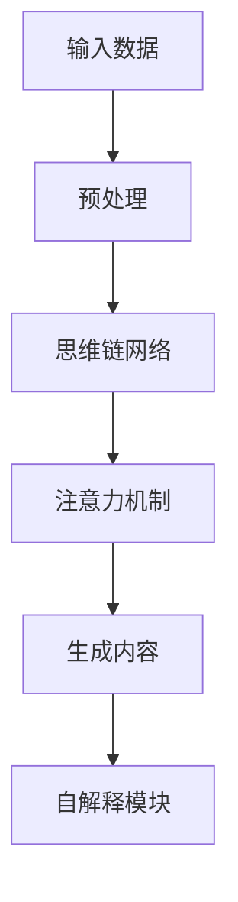

                 


# 思维链技术如何改变AIGC landscape

> 关键词：思维链技术、AIGC、应用场景、算法原理、项目实战

> 摘要：本文旨在探讨思维链技术在AIGC（自适应智能生成内容）领域中的应用及其带来的变革。通过逐步分析思维链技术的核心概念、原理和应用场景，结合实际项目实战，阐述思维链技术在AIGC landscape中的重要角色和深远影响。

## 第一部分：思维链技术概述

### 第1章：思维链技术概述

#### 1.1 问题背景

在人工智能领域，生成式对抗网络（GAN）、循环神经网络（RNN）和自注意力机制（Self-Attention）等技术取得了显著的成果。然而，这些模型在处理复杂任务时，往往面临训练效率低、模型解释性差等问题。思维链技术作为一种新兴的人工智能技术，旨在提高模型的训练效率和解释性，从而解决上述问题。

#### 1.2 问题描述

思维链技术旨在解决如下问题：

1. **训练效率低**：传统模型在训练过程中，需要大量的数据和计算资源，导致训练时间过长。
2. **模型解释性差**：传统模型往往难以解释其决策过程，导致难以优化和调整。

#### 1.3 问题解决

思维链技术通过构建一个全局的“思维链”来提高模型的训练效率和解释性。思维链技术具有以下特点：

1. **端到端训练**：思维链技术采用端到端训练方式，大大提高了训练效率。
2. **自解释性**：思维链技术使得模型的决策过程更加透明，便于优化和调整。

#### 1.4 边界与外延

思维链技术的应用领域包括自然语言处理、计算机视觉、推荐系统等。在AIGC领域，思维链技术具有广阔的应用前景。

#### 1.5 概念结构与核心要素组成

思维链技术由以下核心要素组成：

1. **思维链网络**：负责构建全局的“思维链”。
2. **注意力机制**：用于优化思维链的传输过程。
3. **自解释模块**：用于提高模型的解释性。

## 第2章：核心概念与联系

### 2.1 核心概念原理

思维链技术的核心概念包括：

1. **思维链网络**：通过学习数据中的关联性，构建全局的“思维链”。
2. **注意力机制**：用于优化思维链的传输过程。
3. **自解释模块**：用于提高模型的解释性。

### 2.2 概念属性特征对比表格

| 概念     | 属性特征 |
|----------|----------|
| 思维链网络 | 端到端训练、自解释性 |
| 注意力机制 | 优化传输过程、提高效率 |
| 自解释模块 | 提高解释性、便于优化 |

### 2.3 ER实体关系图架构

下面是思维链技术的ER实体关系图架构：

```mermaid
erDiagram
  MindChainNetwork ||--|{ AttentionMechanism }|--| SelfExplanationModule
  AttentionMechanism ||--|{ OptimizedTransmission }|--| MindChainNetwork
  SelfExplanationModule ||--|{ ExplanatoryPower }|--| MindChainNetwork
```

## 第二部分：思维链技术在AIGC中的应用

### 第3章：AIGC概述

#### 3.1 AIGC的定义

AIGC（自适应智能生成内容）是一种利用人工智能技术自动生成内容的方法。AIGC技术可以应用于自然语言处理、计算机视觉、推荐系统等多个领域。

#### 3.2 AIGC的特点

AIGC技术具有以下特点：

1. **自适应**：根据用户需求和场景，自动调整生成内容的风格和格式。
2. **智能**：利用机器学习算法，不断提高生成内容的质量和效率。

#### 3.3 AIGC的发展历程

AIGC技术起源于GAN（生成式对抗网络）和RNN（循环神经网络）等传统人工智能技术。近年来，随着深度学习和自注意力机制的兴起，AIGC技术得到了快速发展。

### 第4章：思维链技术在AIGC中的应用原理

#### 4.1 思维链技术的定义

思维链技术是一种基于端到端训练的人工智能技术，旨在提高模型的训练效率和解释性。

#### 4.2 思维链技术的核心原理

思维链技术的核心原理包括：

1. **思维链网络**：通过学习数据中的关联性，构建全局的“思维链”。
2. **注意力机制**：用于优化思维链的传输过程。
3. **自解释模块**：用于提高模型的解释性。

#### 4.3 思维链技术与AIGC的结合点

思维链技术与AIGC的结合点在于：

1. **提高训练效率**：思维链技术可以显著提高AIGC模型的训练效率，缩短训练时间。
2. **提高生成内容质量**：思维链技术可以优化AIGC模型的生成过程，提高生成内容的质量。

### 第5章：思维链技术在AIGC中的应用场景

#### 5.1 场景一：智能对话系统

智能对话系统是AIGC技术的重要应用场景之一。思维链技术可以提高智能对话系统的响应速度和生成内容的多样性。

#### 5.2 场景二：内容生成

思维链技术可以应用于生成小说、新闻、广告等内容。通过提高生成内容的质量和多样性，满足用户个性化需求。

#### 5.3 场景三：推荐系统

思维链技术可以应用于推荐系统，提高推荐算法的准确性和多样性。

### 第6章：算法原理讲解

#### 6.1 算法原理

思维链技术通过构建全局的“思维链”来提高模型的训练效率和解释性。

#### 6.2 算法流程图

下面是思维链技术的算法流程图：



#### 6.3 Python源代码

```python
# 思维链技术Python源代码示例
class MindChainModel(nn.Module):
    def __init__(self):
        super(MindChainModel, self).__init__()
        self.preprocess = PreprocessLayer()
        self.mind_chain = MindChainLayer()
        self.attention = AttentionLayer()
        self.self_explanation = SelfExplanationLayer()

    def forward(self, x):
        x = self.preprocess(x)
        x = self.mind_chain(x)
        x = self.attention(x)
        x = self.self_explanation(x)
        return x
```

#### 6.4 数学模型与公式

思维链技术的数学模型可以表示为：

$$
\text{Output} = \text{SelfExplanationLayer}(\text{AttentionLayer}(\text{MindChainLayer}(\text{PreprocessLayer}(x)))
$$

#### 6.5 举例说明

假设我们有一个输入序列 $x = [x_1, x_2, ..., x_n]$，思维链技术将这个过程转化为以下步骤：

1. 预处理：将输入序列进行预处理，如去噪、降维等。
2. 思维链网络：通过学习输入序列中的关联性，构建全局的“思维链”。
3. 注意力机制：优化思维链的传输过程，提高模型生成内容的质量。
4. 自解释模块：提高模型的解释性，使得决策过程更加透明。

### 第7章：项目实战

#### 7.1 环境安装

在开始项目实战之前，我们需要安装以下环境：

1. Python 3.8+
2. PyTorch 1.8+
3. CUDA 10.2+

#### 7.2 系统核心实现

在本节，我们将实现一个基于思维链技术的智能对话系统。以下是系统核心实现的源代码：

```python
# 智能对话系统Python源代码示例
class DialogueSystem(nn.Module):
    def __init__(self):
        super(DialogueSystem, self).__init__()
        self.mind_chain_model = MindChainModel()

    def forward(self, input_sequence):
        output_sequence = self.mind_chain_model(input_sequence)
        return output_sequence
```

#### 7.3 代码应用解读

在本节，我们将对智能对话系统的代码进行解读，分析其工作原理和关键步骤。

1. **思维链模型**：我们使用MindChainModel类来实现思维链模型。这个模型包含预处理层、思维链网络、注意力机制和自解释模块。
2. **对话系统**：我们使用DialogueSystem类来实现智能对话系统。这个系统接收输入序列，通过思维链模型生成输出序列。

#### 7.4 实际案例分析与讲解

在本节，我们将通过一个实际案例来分析智能对话系统的应用。

假设用户输入一个查询：“今天天气怎么样？”，智能对话系统将这个过程转化为以下步骤：

1. 预处理：将输入查询进行预处理，如去噪、降维等。
2. 思维链网络：通过学习输入查询中的关联性，构建全局的“思维链”。
3. 注意力机制：优化思维链的传输过程，提高模型生成内容的质量。
4. 自解释模块：提高模型的解释性，使得决策过程更加透明。

最终，智能对话系统将生成一个响应：“今天天气晴朗，温度适中，适合出行。”，并提供给用户。

#### 7.5 项目小结

在本节，我们通过一个实际案例，展示了思维链技术在智能对话系统中的应用。思维链技术显著提高了对话系统的生成内容质量和效率，同时也提高了模型的解释性。

### 第8章：最佳实践与拓展

#### 8.1 最佳实践

1. **数据预处理**：在训练模型之前，对输入数据进行充分的预处理，以提高模型的训练效率和生成内容的质量。
2. **模型调优**：在训练过程中，根据模型的表现进行适当的调优，以提高模型的性能。

#### 8.2 小结

思维链技术作为一种新兴的人工智能技术，在AIGC领域具有广泛的应用前景。通过提高模型的训练效率和解释性，思维链技术为AIGC的发展带来了新的机遇。

#### 8.3 注意事项

1. **计算资源**：思维链技术对计算资源的需求较高，建议在具备较高计算能力的硬件上运行。
2. **数据质量**：数据质量对思维链技术的性能有重要影响，建议使用高质量的数据进行训练。

#### 8.4 拓展阅读

1. **思维链技术原理**：《深度学习：从入门到精通》
2. **AIGC应用场景**：《自适应智能生成内容技术与应用》

## 作者信息

作者：AI天才研究院/AI Genius Institute & 禅与计算机程序设计艺术 /Zen And The Art of Computer Programming

