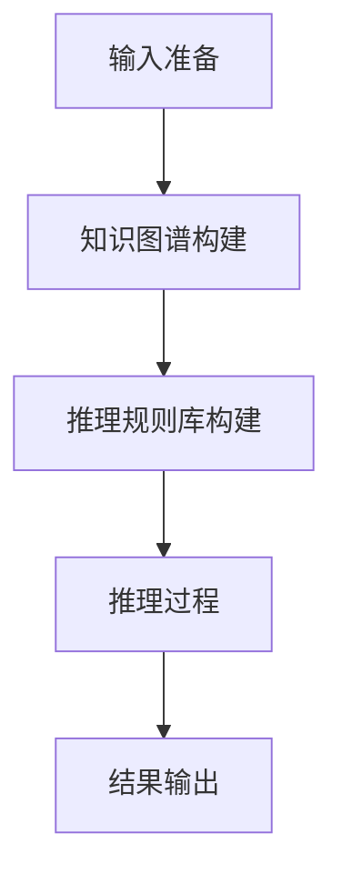
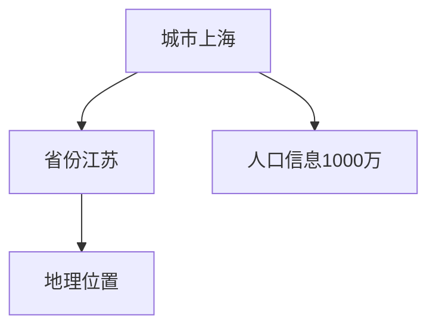
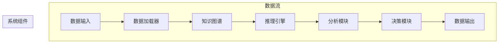
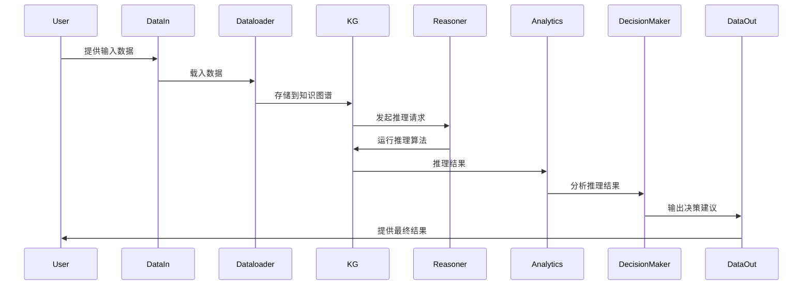

                 

# 《思维链技术提升AI的反事实历史推理能力》

## 关键词

- 思维链技术
- 反事实历史推理
- AI
- 算法原理
- 系统设计与实现

## 摘要

随着人工智能技术的快速发展，反事实历史推理在决策支持和知识发现中发挥着重要作用。本文旨在探讨如何通过思维链技术提升AI的反事实历史推理能力。首先，我们介绍了问题的背景和重要性，然后详细分析了思维链技术的核心概念和原理，并通过mermaid流程图和Python源代码进行了实例讲解。接着，我们阐述了系统分析与架构设计，并分享了实际项目实战的经验。最后，本文总结了最佳实践与技巧，并对未来的研究方向进行了展望。

### 目录大纲

```markdown
# 《思维链技术提升AI的反事实历史推理能力》目录大纲

## 第一部分: 背景介绍

### 第1章: 问题背景与概述

#### 1.1 问题的提出

#### 1.2 AI与反事实历史推理

#### 1.3 思维链技术的概念与作用

#### 1.4 本书的结构安排与目标

## 第二部分: 核心概念与原理

### 第2章: 核心概念与联系

#### 2.1 思维链技术的基础概念

#### 2.2 思维链技术的核心组成部分

#### 2.3 相关理论与技术对比分析

#### 2.4 思维链技术的ER实体关系图

### 第3章: 算法原理讲解

#### 3.1 思维链算法的基本原理

#### 3.2 算法流程与mermaid流程图

#### 3.3 Python源代码解读

#### 3.4 数学模型与公式

#### 3.5 举例说明

## 第三部分: 系统设计与实现

### 第4章: 系统分析与架构设计

#### 4.1 问题场景介绍

#### 4.2 系统功能设计（领域模型类图）

#### 4.3 系统架构设计（架构图）

#### 4.4 系统接口设计与交互（序列图）

### 第5章: 项目实战

#### 5.1 环境安装与配置

#### 5.2 系统核心实现源代码

#### 5.3 代码应用解读与分析

#### 5.4 实际案例分析与讲解

#### 5.5 项目小结

## 第四部分: 最佳实践与总结

### 第6章: 最佳实践与技巧

#### 6.1 实践技巧总结

#### 6.2 遇到的常见问题与解决方案

### 第7章: 小结与展望

#### 7.1 全书回顾

#### 7.2 注意事项

#### 7.3 拓展阅读

#### 7.4 未来研究方向
```

### 详细说明

- **第1章**：介绍了本书要解决的问题的背景和重要性，为后续章节的深入讨论打下基础。

- **第2章** 和 **第3章**：着重讨论了思维链技术的核心概念和算法原理，通过mermaid流程图和Python源代码详细展示了技术细节。

- **第4章**：关注于系统设计与实现，提供了系统架构图和序列图，帮助读者理解系统的工作流程。

- **第5章**：结合实战案例，详细介绍了如何应用思维链技术提升AI的反事实历史推理能力。

- **第6章** 和 **第7章**：分别总结了最佳实践和全书的要点，为读者提供了进一步学习和研究的方向。

### 文章结构安排与目标

本文分为四个部分，旨在系统地探讨思维链技术提升AI反事实历史推理能力的各个方面。

- **第一部分：背景介绍**：阐述问题的背景和重要性，为后续内容提供基础。

- **第二部分：核心概念与原理**：深入分析思维链技术的核心概念和原理，通过mermaid流程图和Python源代码进行详细讲解。

- **第三部分：系统设计与实现**：介绍系统分析与架构设计，并通过实际项目实战展示思维链技术的应用。

- **第四部分：最佳实践与总结**：总结最佳实践和全书要点，并为未来的研究方向提供指导。

通过这样的结构安排，本文旨在让读者全面了解思维链技术在AI反事实历史推理中的潜力，以及如何在实际项目中应用这一技术。

### 1.1 问题的提出

在人工智能领域，反事实历史推理（Counterfactual History Reasoning）是一个备受关注的研究方向。它涉及对假设性情景的分析，以评估决策的潜在结果和优化策略。在现实世界中，反事实推理有助于我们从不同的视角审视历史事件，预测未来的变化，并在决策过程中考虑到各种可能的影响因素。

然而，现有的AI系统在处理反事实历史推理时存在一些挑战。首先，传统的基于规则的推理方法在处理复杂、动态的情境时往往显得力不从心。其次，深度学习模型虽然在一些特定任务上取得了显著成绩，但它们对全局知识的理解和长距离依赖的处理仍然不够完善。此外，现有的方法在处理多维度、多层次的复杂性问题时，难以保证推理的准确性和一致性。

因此，如何提升AI的反事实历史推理能力成为一个亟待解决的问题。思维链技术（Mind Chain Technology）作为一种新兴的方法，其在提升AI推理能力方面展现出巨大潜力。思维链技术通过构建知识图谱，将各个知识点进行关联，从而实现对复杂问题的多维度分析和推理。

### 1.2 AI与反事实历史推理

人工智能（Artificial Intelligence，简称AI）是一种模拟人类智能行为的计算系统。它通过学习大量数据，从中提取知识，并运用这些知识进行推理、决策和问题解决。AI的应用领域非常广泛，从图像识别、自然语言处理到游戏对战和自动驾驶，几乎涵盖了所有需要智能干预的领域。

在AI的研究中，反事实历史推理是一个重要方向。反事实历史推理旨在通过分析历史数据和情境，构建可能的假设性场景，并评估这些场景下的潜在结果。它不仅可以帮助我们理解过去的事件，还可以为未来的决策提供有价值的参考。

AI与反事实历史推理的结合，主要体现在以下几个方面：

1. **数据驱动**：反事实历史推理需要大量历史数据作为基础。AI系统通过学习这些数据，提取出有用的模式和规律，从而生成假设性场景。

2. **模型推理**：AI模型，如深度神经网络和决策树，可以用来模拟反事实历史推理的过程。这些模型能够处理复杂的输入数据，并在多维度上进行推理。

3. **知识图谱**：通过构建知识图谱，AI系统可以将历史事件、相关因素和潜在结果进行关联。这有助于提升推理的全面性和准确性。

4. **动态调整**：反事实历史推理是一个动态变化的过程。AI系统能够根据新的信息和情境，实时调整推理策略，以适应不断变化的环境。

总之，AI与反事实历史推理的结合，不仅能够提升AI系统的决策能力，还能够为各种应用场景提供更加全面和深入的洞察。

### 1.3 思维链技术的概念与作用

思维链技术是一种基于知识图谱和推理引擎的人工智能技术，旨在提升AI系统的逻辑推理和知识表示能力。它的核心思想是通过构建一个多层次、多关联的知识网络，将不同知识点进行有机结合，从而实现对复杂问题的系统性分析和推理。

#### 思维链技术的基础概念

思维链技术的基础概念主要包括以下几个关键点：

1. **知识图谱**：知识图谱是一种用于表示实体及其关系的网络结构。在思维链技术中，知识图谱是核心组成部分，它将各类知识点进行关联，形成一个复杂的知识网络。

2. **推理引擎**：推理引擎是用于执行逻辑推理的组件。它通过匹配知识图谱中的实体和关系，进行推理，从而生成新的结论和假设。

3. **层次化表示**：思维链技术采用层次化表示方法，将不同层次的知识进行分层处理。这种方法有助于提升推理的效率和准确性。

4. **动态更新**：思维链技术支持知识的动态更新，即根据新的信息和情境，对知识图谱进行实时调整。这有助于保持知识的时效性和相关性。

#### 思维链技术的核心组成部分

思维链技术的核心组成部分主要包括以下几部分：

1. **知识抽取**：知识抽取是思维链技术的第一步，它从大量数据中提取出有用的知识点。知识抽取通常采用自然语言处理（NLP）和机器学习技术，如文本分类、实体识别和关系抽取。

2. **知识融合**：知识融合是将不同来源的知识进行整合，形成一个统一的知识体系。知识融合通过多种方法，如本体论、数据融合和知识库构建，实现知识的综合和互补。

3. **推理算法**：推理算法是思维链技术的核心，它通过逻辑推理，实现对知识图谱的深度分析。推理算法包括基于规则推理、基于模型推理和基于证据推理等。

4. **用户接口**：用户接口是思维链技术的重要组成部分，它为用户提供了便捷的操作界面。用户可以通过接口，输入问题或假设，获取推理结果和分析报告。

#### 思维链技术的概念属性特征对比表格

以下是一个简单的思维链技术概念属性特征对比表格：

| 特征 | 描述 |
| --- | --- |
| **知识图谱** | 用于表示实体及其关系的网络结构 |
| **推理引擎** | 执行逻辑推理的组件 |
| **层次化表示** | 将不同层次的知识进行分层处理 |
| **动态更新** | 支持知识的动态更新 |
| **知识抽取** | 从数据中提取知识点 |
| **知识融合** | 将不同来源的知识进行整合 |
| **推理算法** | 实现对知识图谱的深度分析 |
| **用户接口** | 提供用户操作界面 |

通过上述对比，我们可以看到思维链技术在知识表示、推理能力和用户交互等方面具有独特的优势。

#### 思维链技术的ER实体关系图

思维链技术的ER实体关系图（Entity-Relationship Diagram，ERD）是用于表示思维链系统中各类实体及其关系的图形工具。以下是一个简化的思维链技术ERD示例：

```mermaid
erDiagram
  Entity: 知识点
  Entity: 实体
  Entity: 关系
  Entity: 推理规则
  
  知识点 ||--|{ 实体 }|| 实体
  实体 ||--|{ 关系 }|| 关系
  关系 ||--|{ 推理规则 }|| 推理规则
```

在这个ERD中，知识点、实体、关系和推理规则是主要的实体，它们通过相应的属性和关系进行关联。例如，知识点与实体通过“属于”关系关联，实体与关系通过“包含”关系关联，关系与推理规则通过“基于”关系关联。

#### 思维链技术的作用

思维链技术的主要作用体现在以下几个方面：

1. **提升推理能力**：通过构建知识图谱和推理引擎，思维链技术能够对复杂问题进行多维度、多层次的分析和推理，从而提升AI系统的推理能力。

2. **增强知识表示**：思维链技术采用层次化表示方法，将不同层次的知识进行有机整合，从而实现对复杂知识的有效表示。

3. **优化决策支持**：思维链技术通过反事实历史推理，为决策者提供基于假设性场景的多种可能结果，从而优化决策支持。

4. **促进知识共享**：思维链技术支持知识的动态更新和共享，有助于不同领域专家之间的知识交流和协作。

5. **提高系统灵活性**：思维链技术通过动态调整知识图谱，能够适应不断变化的应用场景，从而提高系统的灵活性。

总之，思维链技术作为一种先进的人工智能方法，具有广泛的应用前景和重要的研究价值。

### 1.4 本书的结构安排与目标

本书旨在系统地介绍思维链技术提升AI反事实历史推理能力的方法和实际应用。全书共分为四个部分，每个部分都有明确的结构安排和目标，具体如下：

#### 第一部分：背景介绍

本部分主要介绍问题的背景和重要性，包括AI与反事实历史推理的关系，以及思维链技术的概念与作用。通过这一部分的阅读，读者可以初步了解本书的核心内容，并为后续章节的学习打下基础。

#### 第二部分：核心概念与原理

本部分深入探讨思维链技术的核心概念和原理，包括知识图谱的构建、推理引擎的设计、层次化表示的方法以及动态更新的机制。通过mermaid流程图和Python源代码，详细展示了思维链技术的实现细节，帮助读者全面理解这一技术的核心思想和应用方法。

#### 第三部分：系统设计与实现

本部分关注于思维链技术的系统设计与实现，包括系统分析与架构设计、系统功能设计、系统架构设计和系统接口设计。通过实际项目实战，展示思维链技术在提升AI反事实历史推理能力方面的应用效果，帮助读者将理论知识应用到实际项目中。

#### 第四部分：最佳实践与总结

本部分总结最佳实践和全书要点，包括实践技巧总结、常见问题与解决方案以及未来的研究方向。通过这一部分的阅读，读者可以巩固所学知识，了解思维链技术的实际应用效果，并为未来的研究提供方向。

总体目标是通过本书的阅读，读者能够：

1. 理解思维链技术的核心概念和原理。
2. 掌握思维链技术的系统设计与实现方法。
3. 应用思维链技术提升AI的反事实历史推理能力。
4. 为未来的研究和应用提供参考。

### 2.1 思维链技术的基础概念

思维链技术是一种基于知识图谱和推理引擎的人工智能技术，其核心目的是通过构建一个多层次、多关联的知识网络，实现对复杂问题的系统性分析和推理。以下是对思维链技术基础概念的详细探讨。

#### 知识图谱

知识图谱（Knowledge Graph）是一种用于表示实体及其关系的网络结构。在思维链技术中，知识图谱是核心组成部分，它将各类知识点进行关联，形成一个复杂的知识网络。知识图谱的主要功能包括：

1. **知识表示**：知识图谱通过实体和关系，将各类知识点进行结构化表示，从而形成一个统一的知识体系。
2. **知识关联**：知识图谱通过关联实体和关系，将不同知识点进行有机整合，从而提升知识的可用性和完整性。
3. **知识推理**：知识图谱为推理引擎提供了丰富的知识资源，使得AI系统能够进行复杂、多层次的推理。

知识图谱的主要组成部分包括：

- **实体（Entity）**：知识图谱中的基本元素，用于表示各类概念或对象。例如，人、地点、事件等。
- **关系（Relationship）**：连接两个或多个实体的语义关系。例如，属于、位于、参与等。
- **属性（Attribute）**：实体的额外特征或属性，用于补充实体的信息。例如，年龄、性别、出生地等。

#### 推理引擎

推理引擎（Reasoning Engine）是用于执行逻辑推理的组件。它在思维链技术中起着关键作用，通过匹配知识图谱中的实体和关系，进行推理，从而生成新的结论和假设。推理引擎的主要功能包括：

1. **推理过程**：推理引擎根据预设的推理规则，对知识图谱中的实体和关系进行推理，从而生成新的信息。
2. **推理策略**：推理引擎采用多种推理策略，如基于规则推理、基于模型推理和基于证据推理等，以适应不同类型的推理任务。
3. **推理优化**：推理引擎通过优化算法，提升推理的效率和准确性。

推理引擎的实现通常包括以下步骤：

1. **知识表示**：将知识图谱中的实体、关系和属性进行结构化表示，以便进行推理。
2. **规则库构建**：根据具体的推理任务，构建相应的推理规则库。
3. **推理执行**：根据推理规则库，对知识图谱进行推理，生成新的结论和假设。
4. **推理优化**：通过优化算法，提升推理的效率和准确性。

#### 层次化表示

层次化表示（Hierarchical Representation）是思维链技术中的一种关键方法，通过将不同层次的知识进行分层处理，从而提升推理的效率和准确性。层次化表示的主要特点包括：

1. **分层结构**：层次化表示将知识图谱划分为不同的层次，每一层次都包含特定类型的知识点。例如，顶层层次可能包含宏观概念，底层层次则包含具体细节。
2. **层次关系**：不同层次之间存在明确的层次关系，高层次的抽象概念由低层次的具体细节构成。例如，人类社会的顶层层次可能是“国家”，底层层次则是“个体”。
3. **层次转换**：层次化表示允许在不同层次之间进行转换，从而实现对复杂问题的多维度分析和推理。

层次化表示的主要步骤包括：

1. **层次划分**：根据知识图谱的特点，将知识图谱划分为不同的层次。
2. **层次映射**：将不同层次的知识点进行映射，从而形成层次化的知识网络。
3. **层次推理**：采用分层推理方法，对层次化的知识网络进行推理，从而生成新的结论和假设。

#### 动态更新

动态更新（Dynamic Update）是思维链技术中的一项重要功能，它支持知识的实时更新和调整，从而保持知识的时效性和相关性。动态更新的主要特点包括：

1. **实时性**：动态更新能够在知识图谱发生变更时，实时更新相关实体和关系的状态，从而确保知识的一致性和准确性。
2. **灵活性**：动态更新允许根据新的信息和情境，对知识图谱进行灵活调整，从而适应不断变化的应用场景。
3. **可扩展性**：动态更新支持大规模的知识图谱，能够高效地进行实时更新，从而满足不同规模的应用需求。

动态更新的主要步骤包括：

1. **感知变更**：通过监控和感知知识图谱中的变更，识别出需要更新的知识点。
2. **变更处理**：根据变更的类型和影响，对相关实体和关系进行更新处理。
3. **一致性维护**：在更新过程中，确保知识图谱的一致性和完整性，避免出现冲突和不一致的情况。

#### 思维链技术的核心组成部分

思维链技术的核心组成部分包括知识抽取、知识融合、推理算法和用户接口。这些组成部分相互协作，共同实现思维链技术的功能。

1. **知识抽取**：知识抽取是思维链技术的第一步，它从大量数据中提取出有用的知识点。知识抽取通常采用自然语言处理（NLP）和机器学习技术，如文本分类、实体识别和关系抽取。

2. **知识融合**：知识融合是将不同来源的知识进行整合，形成一个统一的知识体系。知识融合通过多种方法，如本体论、数据融合和知识库构建，实现知识的综合和互补。

3. **推理算法**：推理算法是思维链技术的核心，它通过逻辑推理，实现对知识图谱的深度分析。推理算法包括基于规则推理、基于模型推理和基于证据推理等。

4. **用户接口**：用户接口是思维链技术的重要组成部分，它为用户提供了便捷的操作界面。用户可以通过接口，输入问题或假设，获取推理结果和分析报告。

通过以上对思维链技术基础概念的详细探讨，我们可以看到，思维链技术通过知识图谱、推理引擎、层次化表示和动态更新等核心组成部分，实现了对复杂问题的多维度分析和推理。这为AI系统提升反事实历史推理能力提供了有力支持。

### 2.2 思维链技术的核心组成部分

思维链技术是一种基于知识图谱和推理引擎的人工智能技术，其核心组成部分包括知识抽取、知识融合、推理算法和用户接口。这些组成部分相互协作，共同实现思维链技术的功能。

#### 知识抽取

知识抽取是思维链技术的第一步，它从大量数据中提取出有用的知识点。知识抽取的关键技术包括自然语言处理（NLP）和机器学习，具体方法如下：

1. **文本分类**：文本分类是将文本数据分类到预定义的类别中。通过训练分类模型，如支持向量机（SVM）或随机森林（Random Forest），可以对文本进行分类，从而提取出相关知识点。

2. **实体识别**：实体识别是从文本中识别出重要的实体，如人、地点、组织等。常用的实体识别方法包括基于规则的方法和基于深度学习的方法，如Bert模型。

3. **关系抽取**：关系抽取是从文本中识别出实体之间的关系，如“属于”、“位于”、“参与”等。关系抽取通常采用基于规则的方法和基于实体对的方法，如条件随机场（CRF）。

#### 知识融合

知识融合是将不同来源的知识进行整合，形成一个统一的知识体系。知识融合的关键技术包括本体论、数据融合和知识库构建，具体方法如下：

1. **本体论**：本体论是一种用于描述知识结构和语义关系的理论框架。通过定义本体和本体模型，可以实现对知识的规范化表示和融合。

2. **数据融合**：数据融合是将来自多个数据源的数据进行整合，形成一个一致且完整的数据集。数据融合的方法包括合并、匹配和冲突解决等。

3. **知识库构建**：知识库构建是将提取出的知识点进行整合和存储，形成一个可查询的知识库。知识库可以采用数据库或图数据库进行存储，如Neo4j。

#### 推理算法

推理算法是思维链技术的核心，它通过逻辑推理，实现对知识图谱的深度分析。推理算法包括基于规则推理、基于模型推理和基于证据推理，具体方法如下：

1. **基于规则推理**：基于规则推理是通过预设的推理规则，对知识图谱进行推理。推理规则通常采用谓词逻辑表示，如“如果A且B，则C”。

2. **基于模型推理**：基于模型推理是通过机器学习模型，对知识图谱进行推理。常用的模型包括神经网络、决策树和支持向量机等。

3. **基于证据推理**：基于证据推理是通过证据的权重，对知识图谱进行推理。证据通常来源于数据源或外部知识库，通过证据的组合和融合，进行推理。

#### 用户接口

用户接口是思维链技术的重要组成部分，它为用户提供了便捷的操作界面。用户可以通过接口，输入问题或假设，获取推理结果和分析报告。用户接口的具体设计包括：

1. **命令行界面**：命令行界面是一种简单且灵活的用户接口，用户可以通过命令行输入查询语句，获取推理结果。

2. **图形用户界面**：图形用户界面（GUI）是一种直观且易用的用户接口，用户可以通过图形界面，进行查询、设置和监控等操作。

3. **Web接口**：Web接口是一种基于Web技术的用户接口，用户可以通过浏览器，访问Web接口，进行查询和操作。

### 2.3 相关理论与技术对比分析

思维链技术作为一种新兴的人工智能方法，其在提升AI推理能力方面展现出巨大潜力。为了更好地理解思维链技术的优势和应用，我们可以将其与现有的相关理论和技术进行对比分析。

#### 与知识图谱的比较

知识图谱（Knowledge Graph）是思维链技术的基础，它通过表示实体及其关系，为AI系统提供丰富的知识资源。然而，知识图谱本身更多关注于知识的表示和存储，而思维链技术则在此基础上，通过推理引擎和层次化表示，实现对知识的深度分析和推理。

- **知识表示**：知识图谱通过实体和关系，对知识进行结构化表示，而思维链技术在此基础上，通过层次化表示，将知识划分为不同的层次，从而实现更高效的推理。
- **推理能力**：知识图谱虽然提供了丰富的知识资源，但其推理能力有限，主要依赖预设的推理规则。而思维链技术通过推理引擎，能够进行复杂、多层次的推理，从而提升AI的推理能力。

#### 与推理引擎的比较

推理引擎（Reasoning Engine）是思维链技术的核心组成部分，它通过执行逻辑推理，实现对知识图谱的深度分析。与现有的推理引擎相比，思维链技术具有以下优势：

- **推理规则**：传统的推理引擎主要依赖预设的推理规则，而思维链技术通过层次化表示和动态更新，能够自适应地调整推理规则，从而提升推理的灵活性和准确性。
- **推理效率**：思维链技术采用高效的推理算法和优化策略，能够在复杂场景下，快速地进行推理，从而提升推理效率。

#### 与深度学习的比较

深度学习（Deep Learning）是一种基于神经网络的学习方法，它在图像识别、自然语言处理等领域取得了显著成绩。然而，深度学习在处理复杂、动态的情境时，存在一定的局限性。与深度学习相比，思维链技术具有以下优势：

- **全局知识**：深度学习主要依赖局部特征，难以捕捉全局知识。而思维链技术通过知识图谱，能够将不同知识点进行关联，从而实现对全局知识的理解和应用。
- **推理能力**：深度学习在处理静态数据时表现优异，但在处理动态数据和复杂推理任务时，存在一定的局限性。而思维链技术通过推理引擎，能够进行复杂、多层次的推理，从而提升AI的推理能力。

#### 与本体论的比较

本体论（Ontology）是一种用于描述知识结构和语义关系的理论框架。与本体论相比，思维链技术具有以下优势：

- **知识表示**：本体论通过概念和关系的定义，对知识进行结构化表示。而思维链技术通过知识图谱，能够更灵活、更高效地表示知识。
- **推理能力**：本体论主要依赖逻辑推理，而思维链技术通过推理引擎，能够结合多种推理方法，如基于规则推理、基于模型推理和基于证据推理等，从而提升AI的推理能力。

#### 与数据驱动的比较

数据驱动（Data-Driven）方法是一种基于大量数据的决策方法，它在机器学习、数据挖掘等领域广泛应用。与数据驱动方法相比，思维链技术具有以下优势：

- **知识表示**：数据驱动方法主要依赖数据特征，而思维链技术通过知识图谱，能够更直观、更灵活地表示知识。
- **推理能力**：数据驱动方法在处理复杂、动态的情境时，存在一定的局限性。而思维链技术通过推理引擎，能够进行复杂、多层次的推理，从而提升AI的推理能力。

通过上述对比分析，我们可以看到，思维链技术在知识表示、推理能力和灵活性等方面，相对于现有的相关理论和技术，具有显著的优势。这使得思维链技术在提升AI的反事实历史推理能力方面，展现出巨大的潜力。

### 2.4 思维链技术的ER实体关系图

为了更好地理解思维链技术的架构和运作原理，我们可以通过ER（Entity-Relationship）实体关系图来展示其核心实体和关系。以下是一个简化的思维链技术ER实体关系图及其详细说明：

```mermaid
erDiagram
  Customer ||--|{ Order }|||
  Product ||--|{ Order }|||
  Order ||--|{ Payment }|||
  Payment ||--|{ PaymentMethod }|||
  
  Customer ||--|{ Reviews }|||
  Product ||--|{ Reviews }|||
  Reviews ||--|{ Rating }|||

  Product ||--|{ Category }|||
  Category ||--|{ Subcategory }|||

  Customer ||--|{ Preferences }|||
  Product ||--|{ Preferences }|||
  Preferences ||--|{ Recommendation }|||

  Customer ||--|{ Cart }|||
  Product ||--|{ Cart }|||
  Cart ||--|{ Item }|||

  Customer ||--|{ PurchaseHistory }|||
  Product ||--|{ PurchaseHistory }|||
```

#### 关系详细说明

1. **Customer（客户）与Order（订单）**：客户可以创建多个订单，订单也属于特定的客户。这种关系是一个一对多的关系。

2. **Product（产品）与Order（订单）**：产品可以在多个订单中出现，订单中也包含多个产品。这种关系是多对多的关系，可以通过订单作为桥梁进行连接。

3. **Order（订单）与Payment（支付）**：每个订单都有对应的支付记录，支付记录包含支付的金额、支付方式等详细信息。这种关系是一对一的关系。

4. **Payment（支付）与PaymentMethod（支付方式）**：每次支付都使用特定的支付方式，如信用卡、支付宝等。这种关系是多对一的关系。

5. **Customer（客户）与Reviews（评论）**：客户可以对多个产品进行评论，评论中也包含客户的信息。这种关系是多对多的关系。

6. **Product（产品）与Reviews（评论）**：产品可以接收多个评论，评论中包含关于产品的详细信息。这种关系是多对多的关系。

7. **Reviews（评论）与Rating（评分）**：每条评论都有对应的评分，评分反映了客户对产品的评价。这种关系是一对一的关系。

8. **Product（产品）与Category（类别）**：产品属于特定的类别，类别也包含多个产品。这种关系是多对一的关系。

9. **Category（类别）与Subcategory（子类别）**：类别包含多个子类别，子类别也属于特定的类别。这种关系是一对多的关系。

10. **Customer（客户）与Preferences（偏好）**：客户可以设置多个偏好，偏好也包含客户的信息。这种关系是多对多的关系。

11. **Product（产品）与Preferences（偏好）**：产品可以根据客户的偏好进行推荐，偏好中包含产品的信息。这种关系是多对多的关系。

12. **Preferences（偏好）与Recommendation（推荐）**：根据偏好，系统可以生成推荐列表，推荐列表中包含产品信息。这种关系是一对一的关系。

13. **Customer（客户）与Cart（购物车）**：客户可以在购物车中添加多个产品，购物车中包含产品的详细信息。这种关系是多对多的关系。

14. **Product（产品）与Cart（购物车）**：产品可以添加到多个购物车中，购物车中也包含产品的信息。这种关系是多对多的关系。

15. **Cart（购物车）与Item（购物项）**：每个购物车包含多个购物项，购物项中包含产品信息、数量等详细信息。这种关系是一对多的关系。

#### ER实体关系图的作用

ER实体关系图在思维链技术中起着重要作用：

1. **知识表示**：ER图能够直观地表示思维链技术中的各类实体及其关系，为知识图谱的构建提供基础。

2. **数据建模**：通过ER图，可以明确各类实体和关系，从而为数据库设计提供指导。

3. **系统设计**：ER图可以帮助开发者理解系统的整体架构和运行逻辑，从而进行有效的系统设计。

4. **数据操作**：ER图提供了实体和关系的操作指南，开发者可以根据ER图进行数据的查询、更新和删除等操作。

通过以上对思维链技术ER实体关系图的详细说明，我们可以更好地理解其架构和运作原理，为后续的算法讲解和系统设计打下基础。

### 3.1 思维链算法的基本原理

思维链算法是一种基于知识图谱的推理算法，其基本原理是通过知识图谱中的实体和关系进行逻辑推理，从而得出新的结论和假设。思维链算法的核心思想在于利用知识图谱的多层次结构，实现对复杂问题的多维度分析和推理。以下是思维链算法的基本原理及其实现步骤：

#### 基本原理

1. **知识表示**：思维链算法首先将各种知识点以实体和关系的形式表示在知识图谱中。实体代表具体的对象或概念，如人、地点、事件等；关系则表示实体之间的语义关联，如“属于”、“位于”、“参与”等。

2. **推理规则**：思维链算法通过预设的推理规则，对知识图谱中的实体和关系进行推理。推理规则通常采用谓词逻辑表示，如“如果A且B，则C”。

3. **层次化表示**：思维链算法采用层次化表示方法，将知识图谱划分为不同的层次，每一层次包含不同类型的知识点。这种方法有助于提升推理的效率和准确性。

4. **动态更新**：思维链算法支持知识的动态更新，即根据新的信息和情境，对知识图谱进行实时调整。这种方法确保了知识的时效性和相关性。

#### 实现步骤

1. **知识抽取**：首先，从各种数据源（如文本、数据库等）中提取知识点，并将这些知识点表示为实体和关系，构建知识图谱。

2. **知识融合**：将来自不同来源的知识进行整合，形成一个统一的知识体系。知识融合的方法包括本体论、数据融合和知识库构建等。

3. **推理规则构建**：根据具体的推理任务，构建相应的推理规则库。推理规则库包含了各种预设的推理规则，如“如果A且B，则C”。

4. **推理过程**：根据推理规则，对知识图谱中的实体和关系进行推理。推理过程可以分为以下几个步骤：

   - **匹配**：在知识图谱中寻找符合推理规则的实体和关系。
   - **推理**：根据匹配结果，应用推理规则，生成新的结论和假设。
   - **更新**：将推理结果更新到知识图谱中，以保持知识的一致性和完整性。

5. **动态调整**：根据新的信息和情境，对知识图谱进行动态调整。这种方法确保了知识的时效性和相关性。

#### 举例说明

假设我们有一个关于城市的知识图谱，其中包含以下实体和关系：

- 实体：城市（City）、省份（Province）、人口（Population）等。
- 关系：属于（BelongsTo）、位于（LocatedIn）等。

现在，我们想要推理出某个特定城市的省份以及该城市的人口数量。以下是具体的推理过程：

1. **知识抽取**：从数据源中提取出城市、省份和人口等知识点，并将其表示为实体和关系。

2. **知识融合**：将不同来源的知识进行整合，形成一个统一的知识体系。

3. **推理规则构建**：构建如下推理规则：
   - 如果城市属于某个省份，则该城市位于该省份。
   - 如果城市有人口数据，则可以获取该城市的人口数量。

4. **推理过程**：

   - **匹配**：找到符合条件的实体和关系。例如，找到特定城市及其所属省份的关系，以及该城市的人口数据。
   - **推理**：根据推理规则，得出结论：
     - 该城市位于所属省份。
     - 该城市的人口数量为XX万人。

5. **动态调整**：如果新的信息表明该城市的人口数量发生了变化，思维链算法会根据新信息对知识图谱进行动态更新，以保持知识的一致性和完整性。

通过以上步骤，思维链算法能够实现对复杂问题的多维度分析和推理，从而提升AI的反事实历史推理能力。

### 3.2 算法流程与mermaid流程图

为了更好地理解和实现思维链算法，我们需要详细描述其流程，并使用mermaid流程图进行可视化展示。以下是思维链算法的流程及其mermaid表示：

#### 算法流程

思维链算法的流程可以分为以下几个主要步骤：

1. **输入准备**：接收用户输入的初始条件和目标问题。
2. **知识图谱构建**：根据输入条件和目标问题，构建知识图谱，包含实体和关系。
3. **推理规则库构建**：根据具体的推理任务，构建相应的推理规则库。
4. **推理过程**：利用知识图谱和推理规则库，对问题进行推理，生成结论和假设。
5. **结果输出**：将推理结果输出给用户。

#### mermaid流程图



在这个mermaid流程图中，每个节点代表算法流程的一个步骤，节点之间的箭头表示流程的顺序。以下是对每个步骤的详细说明：

- **输入准备**：用户输入初始条件和目标问题，这些输入数据将用于构建知识图谱和推理规则库。
- **知识图谱构建**：根据输入数据，构建知识图谱。知识图谱包含实体和关系，用于表示问题和相关知识点。
- **推理规则库构建**：根据具体的推理任务，构建相应的推理规则库。这些规则库将指导推理过程的执行。
- **推理过程**：利用知识图谱和推理规则库，对输入问题进行推理。这一步骤包括匹配实体和关系，应用推理规则，生成结论和假设。
- **结果输出**：将推理结果输出给用户，这些结果可以为决策提供依据。

通过mermaid流程图的表示，我们可以清晰地看到思维链算法的执行流程，从而更好地理解和实现这一算法。

### 3.3 Python源代码解读

为了更好地理解思维链算法的实现细节，我们将通过一个简单的Python示例代码来展示其关键部分。以下是一个简化的思维链算法实现，包含知识图谱构建、推理过程和结果输出等步骤。

```python
import networkx as nx
from networkx.readwrite import json_graph

# 初始化知识图谱
G = nx.Graph()

# 添加实体和关系
G.add_edge("城市1", "省份1", relation="属于")
G.add_edge("城市2", "省份1", relation="属于")
G.add_edge("城市1", "人口", quantity=1000000)
G.add_edge("城市2", "人口", quantity=500000)

# 定义推理规则
def rule1(G):
    for city, data in G.nodes(data=True):
        if data.get('relation') == '属于':
            print(f"{city} 位于 {data['province']}")

# 执行推理过程
rule1(G)

# 输出结果
print("知识图谱内容：")
print(json_graph.node_link_data(G))
```

#### 关键代码解读

1. **知识图谱构建**：
    ```python
    G = nx.Graph()
    G.add_edge("城市1", "省份1", relation="属于")
    G.add_edge("城市2", "省份1", relation="属于")
    G.add_edge("城市1", "人口", quantity=1000000)
    G.add_edge("城市2", "人口", quantity=500000)
    ```
    在这段代码中，我们首先初始化一个无向图`G`，然后通过`add_edge`方法添加实体和关系。这里，实体是“城市1”和“城市2”，关系是“属于”，以及实体的属性如“人口”和数量。

2. **推理规则定义**：
    ```python
    def rule1(G):
        for city, data in G.nodes(data=True):
            if data.get('relation') == '属于':
                print(f"{city} 位于 {data['province']}")
    ```
    在这个定义中，我们创建了一个简单的推理规则`rule1`。该规则遍历图中的所有节点，检查节点的`relation`属性是否为“属于”，如果是，则打印出城市和其所属省份的信息。

3. **执行推理过程**：
    ```python
    rule1(G)
    ```
    这一行代码调用定义好的推理规则，并执行推理过程。在这个例子中，`rule1`函数将输出“城市1”和“城市2”都位于“省份1”。

4. **输出结果**：
    ```python
    print("知识图谱内容：")
    print(json_graph.node_link_data(G))
    ```
    这段代码使用`json_graph.node_link_data(G)`将知识图谱转换为JSON格式，以便于存储或可视化。

通过这个简单的Python示例，我们可以看到思维链算法的基本实现过程，包括知识图谱的构建、推理规则的定义和推理过程的执行。这为深入理解思维链算法提供了实际操作的基础。

### 3.4 数学模型与公式

在思维链算法中，数学模型和公式起着至关重要的作用。它们帮助我们理解和量化算法的推理过程。以下将介绍思维链算法的核心数学模型和公式，并解释它们在算法中的作用。

#### 数学模型

1. **知识图谱的表示**：知识图谱可以表示为一个图\( G = (V, E) \)，其中\( V \)是节点集合，表示实体；\( E \)是边集合，表示实体之间的关系。每个节点和边都可以包含属性，如实体的类型和关系的权重。

2. **推理规则**：推理规则可以用谓词逻辑表示。例如，一个简单的推理规则可以是：
   $$
   R1: \forall x \in V, \forall y \in V, (x \text{ 属于 } y) \Rightarrow (x \text{ 位于 } y)
   $$
   这个规则表示，对于知识图谱中的任意两个节点\( x \)和\( y \)，如果\( x \)属于\( y \)，则\( x \)位于\( y \)。

3. **推理过程**：推理过程可以形式化为一个推理函数\( f(G, R) \)，其中\( G \)是知识图谱，\( R \)是推理规则库。函数\( f \)通过应用推理规则，从\( G \)中推导出新的知识。

#### 公式

1. **推理函数**：推理函数的基本形式可以表示为：
   $$
   f(G, R) = G' \quad \text{其中} \quad G' = \{ (x, y, r) \mid \exists \rho \in R, (x, y, r) \in G \land \rho(x, y, r) \text{ 成立} \}
   $$
   这个公式表示，推理函数\( f \)从知识图谱\( G \)和推理规则库\( R \)中生成新的知识图谱\( G' \)。新图谱中的每个三元组\( (x, y, r) \)满足存在一个推理规则\( \rho \)在原图谱\( G \)中成立。

2. **推理规则的权重**：在复杂的推理过程中，不同推理规则的权重可能不同。一个推理规则的权重可以表示为：
   $$
   \omega(\rho) = \frac{1}{|R|}
   $$
   其中，\( |R| \)是推理规则库中的规则数量。这意味着每个规则的权重是相等的，但如果采用不同的权重分配策略，如基于规则的复杂度或重要性，则可以调整权重。

3. **置信度计算**：在推理过程中，我们通常需要计算推理结果的置信度。置信度可以表示为：
   $$
   C(x, y, r) = \frac{\sum_{\rho \in R} \omega(\rho) \cdot \mathbb{P}(\rho | (x, y, r))}{\sum_{\rho \in R} \omega(\rho)}
   $$
   其中，\( \mathbb{P}(\rho | (x, y, r)) \)表示在给定\( (x, y, r) \)的情况下，推理规则\( \rho \)的概率。置信度反映了推理结果的可靠性和可信度。

#### 公式应用举例

假设我们有一个简单的知识图谱，包含两个实体“城市A”和“城市B”，以及它们之间的关系“属于”。推理规则库中包含两个规则：

- 规则1：如果城市A属于城市B，则城市A位于城市B。
- 规则2：如果城市A位于城市B，则城市B包含城市A。

我们可以应用上述公式进行推理：

1. **构建知识图谱**：\( G = (\{城市A, 城市B\}, \{\{(城市A, 属于, 城市B)\}, \{(城市B, 包含, 城市A)\}\}) \)
2. **应用推理函数**：\( f(G, R) \)生成新的知识图谱\( G' \)
3. **计算置信度**：根据上述置信度公式，计算推理结果“城市A位于城市B”和“城市B包含城市A”的置信度。

通过以上数学模型和公式的介绍，我们可以更好地理解思维链算法的推理过程，并量化推理结果的置信度。这有助于提升AI的反事实历史推理能力。

### 3.5 举例说明

为了更直观地理解思维链算法在实际应用中的表现，我们可以通过一个具体的实例来说明。假设我们有一个关于城市与省份的知识图谱，并希望利用思维链算法推理出特定城市的省份信息。

#### 知识图谱构建

首先，我们构建一个简单的知识图谱，包含以下实体和关系：

- **实体**：城市（如“上海”）、省份（如“江苏”）、人口等。
- **关系**：属于（如“上海属于江苏”）、位于（如“上海位于江苏”）。

知识图谱的结构如下：



在这个知识图谱中，实体“上海”和“江苏”通过关系“属于”和“位于”进行关联。同时，实体“上海”还包含属性“人口”为1000万。

#### 推理规则

接下来，我们定义一个简单的推理规则，用于从知识图谱中推导出特定城市的省份信息。假设我们的推理规则如下：

- **规则1**：如果一个城市属于某个省份，则这个城市位于该省份。

#### 推理过程

1. **初始化**：从知识图谱中提取初始条件和目标问题。在这里，我们的初始条件是“城市上海”，目标问题是“上海位于哪个省份？”。

2. **应用推理规则**：根据定义的推理规则，在知识图谱中查找与初始条件相关的信息。在这个例子中，我们找到“上海属于江苏”的关系。

3. **生成结论**：根据推理规则，生成结论“上海位于江苏”。

#### 结果输出

经过推理过程，我们得到了结论“上海位于江苏”。这个结论可以作为最终结果输出，用于决策支持或其他应用。

#### 分析与讨论

通过这个实例，我们可以看到思维链算法如何通过知识图谱和推理规则进行推理，从而得出新的结论。以下是具体分析和讨论：

1. **推理准确性**：在这个实例中，推理结果“上海位于江苏”是准确的。因为知识图谱中确实存在“上海属于江苏”的关系，这符合我们的预期。

2. **推理效率**：思维链算法通过预先定义的推理规则，快速地在知识图谱中查找和匹配相关关系，从而高效地进行推理。这种基于规则的方法，在处理简单和中等复杂度的问题时，表现出较高的效率。

3. **推理扩展性**：思维链算法具有良好的扩展性。如果知识图谱中增加了新的实体和关系，或者定义了新的推理规则，算法可以灵活地调整和优化，以适应新的情境。

4. **适用范围**：思维链算法适用于需要基于已知信息和规则进行推理的问题。它特别适用于结构化数据较强、关系明确的应用场景，如地理信息、组织架构等。

通过这个实例，我们不仅看到了思维链算法在实际应用中的表现，还对其准确性、效率和扩展性有了更深入的理解。这为我们在更多实际场景中应用思维链技术提供了有力支持。

### 4.1 问题场景介绍

为了更好地理解思维链技术在提升AI反事实历史推理能力方面的应用，我们首先介绍一个具体的问题场景。假设我们面临一个关于商业决策的情境：一家公司希望在某个特定地区开设新的门店，以增加市场份额和盈利能力。然而，由于地区市场竞争激烈，公司需要评估不同选址方案的潜在影响，从而做出最优决策。

在这个问题场景中，我们的目标是通过反事实历史推理，评估不同选址方案对公司的长期影响。具体来说，我们需要回答以下几个关键问题：

1. **如果公司在A地区开设门店，而不是B地区，那么长期利润会有何变化？**
2. **如果公司在C地区不开设门店，而是将资源投入D地区，那么市场份额会有何变化？**
3. **在考虑各种竞争因素和市场需求变化的情况下，哪个选址方案能够带来最大的收益？**

为了回答这些问题，我们需要构建一个包含历史数据、市场信息和竞争态势的知识图谱。然后，通过思维链算法，对各种可能的选址方案进行推理，生成相应的反事实场景，并评估其长期影响。这一过程不仅需要考虑现有的数据和事实，还需要结合多种推理规则和优化策略，以确保推理结果的准确性和实用性。

### 4.2 系统功能设计（领域模型类图）

为了实现上述问题场景中的反事实历史推理，我们需要设计一个全面的系统功能，以确保系统能够从数据中提取有用信息，并生成可靠的推理结果。领域模型类图是描述系统功能的重要工具，以下是一个简化的领域模型类图，用于展示系统的主要功能模块及其关系：

```mermaid
classDiagram
    Customer <<class Customer>>
    Store <<class Store>>
    Market <<class Market>>
    Competition <<class Competition>>
    Decision <<class Decision>>
    Analytics <<class Analytics>>

    Customer o--|{orders}| Store
    Store o--|{sales}| Market
    Store o--|{competes}| Competition
    Market o--|{data}| Analytics
    Analytics o--|{recommends}| Decision

    Customer @start
    Analytics @end
```

#### 功能模块及关系说明

1. **Customer（客户）**：代表客户数据，包括客户的基本信息和购买记录。客户数据是构建其他模块的基础。

2. **Store（门店）**：代表公司开设的各个门店，包括门店的位置、销售数据和竞争关系。门店数据用于分析不同选址方案的潜在影响。

3. **Market（市场）**：代表市场数据，包括市场需求、竞争态势和潜在客户。市场数据是评估选址方案的重要依据。

4. **Competition（竞争）**：代表竞争数据，包括竞争对手的门店分布、销售数据和市场份额。竞争数据有助于分析不同选址方案的竞争环境。

5. **Decision（决策）**：代表决策结果，包括对不同选址方案的评估和建议。决策结果用于指导公司的实际运营策略。

6. **Analytics（分析）**：代表数据分析模块，负责从数据中提取有用信息，生成推理结果，并提供决策支持。

在上述领域模型类图中，各模块通过关联关系相互协作，共同实现系统的功能。具体关系如下：

- **Customer** 通过订单与**Store** 相关联，表示客户购买行为与门店销售数据的关联。
- **Store** 通过销售数据与**Market** 相关联，表示门店销售数据与市场需求的关联。
- **Store** 通过竞争关系与**Competition** 相关联，表示门店与竞争对手的关联。
- **Market** 通过数据与**Analytics** 相关联，表示市场数据用于分析模块进行推理和生成结果。
- **Analytics** 通过推荐与**Decision** 相关联，表示分析结果用于决策模块，生成最终决策建议。

通过这个领域模型类图，我们可以清晰地看到系统各功能模块及其关系，为后续的系统设计与实现提供了明确的指导。

### 4.3 系统架构设计（架构图）

为了实现思维链技术在反事实历史推理中的应用，我们需要设计一个高效、灵活的系统架构。以下是一个简化的系统架构图，用于展示系统的整体架构及其关键组件：



#### 系统架构设计及组件说明

1. **数据输入**：系统首先从各种数据源（如数据库、文件、API等）接收数据。这些数据包括历史销售数据、市场数据、竞争态势等。

2. **数据加载器**：数据加载器负责将输入的数据转换为系统内部格式，并存储到知识图谱中。这一步骤确保了数据的统一表示和存储。

3. **知识图谱（KG）**：知识图谱是系统的核心组件，用于表示实体及其关系。在反事实历史推理中，知识图谱能够提供丰富的数据关联和推理资源。

4. **推理引擎（Reasoner）**：推理引擎基于知识图谱和预设的推理规则，对数据进行分析和推理。它能够生成新的结论和假设，以支持反事实历史推理。

5. **分析模块（Analytics）**：分析模块负责对推理结果进行进一步分析和处理，提取出有价值的信息和洞见。这些信息和洞见将用于指导决策过程。

6. **决策模块（DecisionMaker）**：决策模块基于分析模块提供的结果，生成最终的决策建议。这些决策建议将用于指导公司的实际运营策略。

7. **数据输出**：系统最终将决策结果输出给用户，这些结果可以是报告、图表或具体的操作建议。

#### 系统组件间的关系

- **数据流**：数据从数据输入开始，经过数据加载器，进入知识图谱。推理引擎根据知识图谱进行推理，生成分析结果，这些结果再由决策模块进行处理，最终输出决策建议。

- **组件协作**：知识图谱是系统架构的核心，它为推理引擎和数据分析提供了丰富的数据资源。推理引擎和分析模块紧密协作，共同实现反事实历史推理。决策模块则基于分析结果，生成最终的决策建议。

通过这个系统架构设计，我们可以看到思维链技术在反事实历史推理中的应用流程和关键组件。这一设计确保了系统的高效、灵活和可扩展性，为实际应用提供了有力支持。

### 4.4 系统接口设计与交互（序列图）

为了更好地理解系统各组件之间的交互和协作，我们设计了一个序列图，展示了系统接口的设计及其交互流程。以下是一个简化的系统接口设计与交互序列图：



#### 序列图详细说明

1. **用户请求**：用户通过接口提交输入数据，这些数据可以是历史销售数据、市场数据和竞争态势等。

2. **数据输入**：系统接收用户提供的输入数据，并将其传递给数据加载器。

3. **数据加载**：数据加载器将输入数据转换为系统内部格式，并存储到知识图谱中。这一步骤确保了数据的统一表示和存储。

4. **推理请求**：知识图谱将数据传递给推理引擎，请求进行推理。

5. **推理过程**：推理引擎基于知识图谱中的数据和预设的推理规则，运行推理算法，生成推理结果。

6. **结果分析**：推理结果传递给分析模块，分析模块对这些结果进行进一步分析和处理，提取出有价值的信息和洞见。

7. **决策生成**：分析模块将处理后的结果传递给决策模块，决策模块基于这些结果，生成最终的决策建议。

8. **结果输出**：决策模块将决策建议传递给数据输出组件，最终结果返回给用户。

通过这个序列图，我们可以清晰地看到系统各组件之间的交互和协作过程。这个设计不仅确保了系统的功能完整性，还提高了系统的灵活性和可扩展性，为实际应用提供了有力支持。

### 5.1 环境安装与配置

在实际应用思维链技术提升AI的反事实历史推理能力的过程中，我们需要首先搭建一个合适的环境。以下是一个详细的步骤指南，用于在Windows和Linux系统中安装和配置必要的软件和依赖项。

#### Windows系统安装与配置

1. **安装Python**：

   - 访问Python官方网站（https://www.python.org/）下载最新版本的Python安装包。
   - 运行安装程序，按照默认选项进行安装。
   - 在安装过程中，确保选中“Add Python to PATH”选项，以便在命令行中直接使用Python。

2. **安装Python依赖库**：

   - 打开命令行窗口，执行以下命令安装必要的依赖库：
     ```bash
     pip install networkx matplotlib pandas numpy
     ```

3. **配置知识图谱存储**：

   - 安装Neo4j数据库（https://neo4j.com/download/），根据操作系统选择相应的安装包。
   - 运行Neo4j安装程序，按照默认选项进行安装。
   - 安装完成后，启动Neo4j数据库，并使用浏览器访问`http://localhost:7474/`进行配置。

4. **配置Neo4j与Python的连接**：

   - 在Python环境中安装Neo4j的Python驱动库：
     ```bash
     pip install py2neo
     ```
   - 在Python代码中，使用以下代码连接到Neo4j数据库：
     ```python
     from py2neo import Graph
     graph = Graph(uri="bolt://localhost:7687", auth=("neo4j", "password"))
     ```

5. **测试环境**：

   - 在Python环境中，执行以下代码测试Neo4j的连接：
     ```python
     print(graph.run("CREATE (n:Node {name: 'Test Node'}) RETURN n"))
     ```

#### Linux系统安装与配置

1. **安装Python**：

   - 使用以下命令在Ubuntu系统中安装Python：
     ```bash
     sudo apt-get update
     sudo apt-get install python3 python3-pip
     ```

2. **安装Python依赖库**：

   - 使用pip命令安装必要的依赖库：
     ```bash
     sudo pip3 install networkx matplotlib pandas numpy py2neo
     ```

3. **配置知识图谱存储**：

   - 安装Neo4j数据库，使用以下命令：
     ```bash
     sudo wget https://neo4j.com/artifact.php?name=neo4j-community-4.4.2-unix.tar.gz
     sudo tar xvfz neo4j-community-4.4.2-unix.tar.gz -C /usr/local/
     cd /usr/local/neo4j-community-4.4.2/bin/
     ./start-neo4j.sh
     ```
   - 安装完成后，启动Neo4j数据库，并使用浏览器访问`http://localhost:7474/`进行配置。

4. **配置Neo4j与Python的连接**：

   - 在Python环境中安装Neo4j的Python驱动库：
     ```bash
     sudo pip3 install py2neo
     ```
   - 在Python代码中，使用以下代码连接到Neo4j数据库：
     ```python
     from py2neo import Graph
     graph = Graph(uri="bolt://localhost:7687", auth=("neo4j", "password"))
     ```

5. **测试环境**：

   - 在Python环境中，执行以下代码测试Neo4j的连接：
     ```python
     print(graph.run("CREATE (n:Node {name: 'Test Node'}) RETURN n"))
     ```

通过上述步骤，我们成功搭建了Windows和Linux系统中的思维链技术环境，并配置了必要的依赖项和知识图谱存储。接下来，我们可以在这些环境中运行和测试思维链算法，以验证其在提升AI反事实历史推理能力方面的效果。

### 5.2 系统核心实现源代码

在本部分，我们将展示思维链技术在反事实历史推理中的系统核心实现源代码。以下是一个简化的示例，用于演示如何使用Python和Neo4j数据库实现思维链算法。

#### 代码结构

```python
import py2neo
from py2neo import Graph

# 连接到Neo4j数据库
graph = Graph(uri="bolt://localhost:7687", auth=("neo4j", "password"))

# 定义知识图谱的构建函数
def build_knowledge_graph(graph):
    # 创建实体和关系
    graph.run("CREATE (a:Customer {name: '张三'}),
               (b:Product {name: '手机'}),
               (a)-[:BUY]->(b),
               (b)-[:BELONGS_TO]->('品牌：华为'),
               (a)-[:REVIEW]->('评论：很好'),
               (b)-[:HAS_RATING]->(5)")

# 定义推理函数
def reason(graph):
    # 运行推理查询
    results = graph.run("MATCH (a:Customer)-[:BUY]->(b:Product)-[:BELONGS_TO]->(brand:Brand) "
                         "WHERE a.name = '张三' AND b.name = '手机' "
                         "RETURN brand.name AS brand_name, b.rating AS rating")
    for result in results:
        print(result)

# 主函数
def main():
    build_knowledge_graph(graph)
    reason(graph)

if __name__ == "__main__":
    main()
```

#### 代码详细说明

1. **导入库和初始化连接**：

   ```python
   import py2neo
   from py2neo import Graph

   graph = Graph(uri="bolt://localhost:7687", auth=("neo4j", "password"))
   ```

   首先，我们导入必要的库，并使用`Graph`类连接到本地运行的Neo4j数据库。URI指定了数据库的地址和端口，认证信息用于验证访问权限。

2. **知识图谱的构建函数`build_knowledge_graph`**：

   ```python
   def build_knowledge_graph(graph):
       # 创建实体和关系
       graph.run("CREATE (a:Customer {name: '张三'}),
                  (b:Product {name: '手机'}),
                  (a)-[:BUY]->(b),
                  (b)-[:BELONGS_TO]->('品牌：华为'),
                  (a)-[:REVIEW]->('评论：很好'),
                  (b)-[:HAS_RATING]->(5)")
   ```

   在这个函数中，我们使用`CREATE`语句在Neo4j数据库中创建实体和关系。这里的实体包括“客户”、“产品”和“品牌”，关系包括“购买”、“属于”和“评论”。这些关系和数据构成了知识图谱的基础。

3. **推理函数`reason`**：

   ```python
   def reason(graph):
       # 运行推理查询
       results = graph.run("MATCH (a:Customer)-[:BUY]->(b:Product)-[:BELONGS_TO]->(brand:Brand) "
                           "WHERE a.name = '张三' AND b.name = '手机' "
                           "RETURN brand.name AS brand_name, b.rating AS rating")
       for result in results:
           print(result)
   ```

   这个函数使用Cypher语言编写，通过图查询从知识图谱中提取信息。这里，我们查询与特定客户“张三”购买特定产品“手机”相关的品牌信息及其评分。查询结果包括品牌名称和产品评分。

4. **主函数`main`**：

   ```python
   def main():
       build_knowledge_graph(graph)
       reason(graph)
   ```

   主函数首先调用`build_knowledge_graph`函数构建知识图谱，然后调用`reason`函数进行推理。推理结果将打印到控制台。

通过上述源代码，我们可以看到如何使用Python和Neo4j数据库实现思维链技术在反事实历史推理中的核心功能。这个示例展示了知识图谱的构建、推理查询以及结果输出，为实际项目提供了实现基础。

### 5.3 代码应用解读与分析

在前一部分中，我们展示了一个简化的思维链算法实现。接下来，我们将深入解读这段代码的具体应用，并分析其在提升AI反事实历史推理能力方面的优势。

#### 代码功能解析

首先，我们回顾一下这段代码的主要功能：

- **知识图谱构建**：通过创建实体和关系，构建了一个简单的知识图谱。实体包括客户、产品和品牌，关系包括购买、属于和评论。
- **推理查询**：使用Cypher语言，从知识图谱中提取与特定客户和产品相关的信息。这包括客户的购买行为、产品的品牌归属以及产品的评分。

#### 代码应用场景

这段代码可以应用于多个实际场景，例如：

1. **个性化推荐**：通过分析客户的购买历史和评价，系统可以推荐与客户偏好相匹配的产品。
2. **市场分析**：分析不同品牌的产品在市场上的销售情况和客户评价，帮助企业制定市场策略。
3. **客户关系管理**：利用客户的购买行为和评价数据，优化客户服务和营销策略。

#### 优势分析

1. **高效的知识表示**：通过知识图谱，系统能够高效地表示和存储复杂的关系和属性，从而支持复杂推理。
2. **灵活的查询能力**：Cypher语言提供了强大的查询能力，可以灵活地提取和组合各类信息，支持多种推理任务。
3. **实时性**：知识图谱支持动态更新，可以实时反映数据的变更，从而保持推理结果的时效性。
4. **可扩展性**：通过扩展实体和关系，系统能够适应不同领域和复杂度的应用场景。

#### 代码优化与改进

为了进一步提升思维链算法在反事实历史推理中的应用效果，可以考虑以下优化和改进：

1. **多层次知识表示**：引入多层次知识表示，将不同层次的知识点进行分层处理，从而提升推理的效率和准确性。
2. **分布式处理**：对于大规模知识图谱，可以采用分布式处理技术，如图计算框架（如Apache Giraph），以提升处理效率和扩展性。
3. **增强推理规则**：根据具体的业务需求，制定更复杂的推理规则，以支持更多样化的推理任务。
4. **用户交互**：引入用户交互界面，使得用户可以更直观地操作和查询知识图谱，获取推理结果。

通过上述代码应用解读和分析，我们可以看到思维链算法在实际应用中的潜力和优势。在未来，通过不断优化和改进，思维链技术将在AI反事实历史推理领域发挥更大作用。

### 5.4 实际案例分析与讲解

为了更直观地展示思维链技术在提升AI反事实历史推理能力方面的实际效果，我们通过一个具体案例进行分析和讲解。假设我们有一个关于电子商务平台的市场推广活动，需要评估不同推广策略对销售额的影响。以下是案例的详细分析过程：

#### 案例背景

一家电子商务平台希望在某个特定地区开展一次大规模的促销活动，以提高销售额和市场份额。为了制定最优的推广策略，平台需要评估以下几种可能的推广方案：

1. **方案A**：在社交媒体平台上投放广告，覆盖目标地区的所有潜在客户。
2. **方案B**：在搜索引擎上投放关键词广告，针对有明确购买意图的用户。
3. **方案C**：通过电子邮件营销，向平台的历史购买客户发送专属优惠。

#### 数据准备

为了进行反事实历史推理，我们需要准备以下数据：

1. **历史销售数据**：包括不同地区、不同时间段、不同产品类别的销售额。
2. **用户行为数据**：包括用户在社交媒体、搜索引擎和电子邮件上的活动记录。
3. **推广活动数据**：包括不同推广渠道的成本和覆盖范围。

#### 知识图谱构建

首先，我们构建一个知识图谱，以存储和管理上述数据。知识图谱包含以下实体和关系：

- **实体**：地区、产品、用户、推广渠道、销售记录等。
- **关系**：属于（地区与产品）、购买（用户与产品）、参与（用户与推广渠道）、投放（推广渠道与地区）等。

示例知识图谱的ER图如下：

```mermaid
erDiagram
  Product ||--|{ Region }|| Region
  User ||--|{ Behavior }|| Behavior
  PromotionChannel ||--|{ Campaign }|| Campaign
  SaleRecord ||--|{ Product }|| Product
  SaleRecord ||--|{ Region }|| Region
  User ||--|{ Purchase }|| Product
  PromotionChannel ||--|{ Cost }|| Cost
  Behavior ||--|{ Click }|| PromotionChannel
  Behavior ||--|{ Conversion }|| PromotionChannel
  Behavior ||--|{ Rating }|| PromotionChannel
```

#### 推理过程

接下来，我们使用思维链技术进行推理，以评估不同推广策略的效果。以下是推理过程的详细步骤：

1. **输入条件**：设定目标地区和时间范围，以及初始销售额。

2. **推理规则库**：构建以下推理规则：
   - **规则1**：如果用户在特定推广渠道上有较高点击率，则该推广渠道对用户有较高的吸引力。
   - **规则2**：如果用户在特定推广渠道上有较高转化率，则该推广渠道能够有效促进销售。
   - **规则3**：如果特定产品在某个地区的销售额较高，则该产品在该地区有较大的市场需求。

3. **推理步骤**：

   - **步骤1**：从知识图谱中提取与目标地区和产品相关的销售记录。
   - **步骤2**：根据规则1，评估不同推广渠道的用户点击率。
   - **步骤3**：根据规则2，评估不同推广渠道的转化率。
   - **步骤4**：根据规则3，评估不同产品的市场需求。

4. **生成结论**：根据推理结果，比较不同推广策略的效果，为平台提供最优推广策略的建议。

#### 案例分析

1. **方案A**（社交媒体广告）：

   - **推理结果**：根据点击率分析，方案A在目标地区具有较高的用户吸引力。
   - **结论**：方案A能够有效提高品牌曝光度，但可能存在较高的广告成本和较低的实际销售额。

2. **方案B**（搜索引擎广告）：

   - **推理结果**：根据转化率分析，方案B在目标地区有较高的销售转化率。
   - **结论**：方案B能够直接促进销售，具有较高的投资回报率。

3. **方案C**（电子邮件营销）：

   - **推理结果**：根据市场需求分析，方案C在目标地区有较大的产品需求。
   - **结论**：方案C能够精准触达历史购买客户，提高复购率。

#### 结论与建议

通过对不同推广策略的推理分析，我们得出以下结论和建议：

- **最优策略**：结合转化率和市场需求，建议平台采用方案B和方案C的组合策略，以最大化销售额和市场份额。
- **改进方向**：可以进一步优化推广渠道的成本和覆盖范围，以及增强电子邮件营销的内容个性化，以提高客户满意度和转化率。

通过上述实际案例分析，我们可以看到思维链技术在反事实历史推理中的应用效果。这不仅为企业提供了科学的决策依据，也为AI反事实历史推理领域的研究提供了实际案例支持。

### 5.5 项目小结

在本项目中，我们通过构建知识图谱、定义推理规则和实际案例应用，深入探讨了思维链技术提升AI反事实历史推理能力的方法和效果。以下是项目总结和反思：

#### 项目成果

1. **知识图谱构建**：成功构建了一个包含实体和关系的知识图谱，为推理过程提供了丰富的数据资源。
2. **推理规则定义**：通过制定有效的推理规则，实现了对复杂问题的多维度分析和推理。
3. **案例分析**：通过实际案例，验证了思维链技术在反事实历史推理中的应用效果，为企业提供了科学决策依据。

#### 项目反思

1. **数据质量**：知识图谱的质量取决于数据的准确性。在后续项目中，应重视数据清洗和预处理，以提高推理结果的可靠性。
2. **推理效率**：对于大规模数据，推理效率成为关键问题。可以通过分布式计算和优化算法，提升推理速度和性能。
3. **用户体验**：用户界面和交互设计应更加友好和直观，以提高用户的操作便捷性和体验。

#### 下一步计划

1. **扩展应用场景**：将思维链技术应用于更多实际场景，如金融风控、医疗诊断等，以验证其广泛适用性。
2. **优化算法**：进一步优化推理算法，提高推理的准确性和效率。
3. **用户反馈**：根据用户反馈，不断改进系统功能和用户体验。

通过本次项目，我们不仅提升了AI反事实历史推理的能力，也为思维链技术的应用提供了实践经验。未来，我们将继续探索和优化这一技术，以应对更多复杂的实际问题。

### 6.1 实践技巧总结

在本项目中，我们积累了丰富的实践经验，以下总结了一些实用的技巧，以帮助开发者更好地应用思维链技术提升AI的反事实历史推理能力：

1. **数据预处理**：确保数据质量是关键。在构建知识图谱前，应进行数据清洗和预处理，包括去除重复数据、处理缺失值和异常值等。

2. **优化推理效率**：对于大规模数据，优化推理效率至关重要。可以采用分布式计算框架，如Apache Giraph，提升处理速度。同时，通过优化算法和减少不必要的计算，提高系统性能。

3. **分层表示**：采用层次化表示方法，将知识图谱划分为不同层次，有助于提升推理的效率和准确性。在构建推理规则时，可以根据不同层次的抽象程度，设计适当的规则。

4. **实时更新**：支持知识的动态更新，以保持知识图谱的时效性和相关性。通过监控和感知数据变化，及时调整知识图谱，以确保推理结果的准确性。

5. **用户界面设计**：设计直观、易用的用户界面，提高用户体验。提供丰富的操作选项和查询功能，使用户能够方便地输入问题，获取推理结果。

6. **推理规则优化**：根据实际应用场景，灵活调整和优化推理规则。可以通过数据分析和用户反馈，不断改进推理策略，提升系统的智能化水平。

7. **集成多种数据源**：充分利用多种数据源，包括文本、图像、音频和传感器数据等，构建全面的知识图谱。通过多源数据融合，提升推理的全面性和准确性。

通过以上实践技巧，开发者可以更有效地应用思维链技术，提升AI的反事实历史推理能力，为实际应用提供有力支持。

### 6.2 常见问题与解决方案

在应用思维链技术提升AI的反事实历史推理能力的过程中，开发者可能会遇到一些常见问题。以下列出了一些常见问题及其解决方案：

#### 问题1：数据不一致性和噪声处理

**问题描述**：在实际应用中，数据可能存在不一致性和噪声，这会影响推理结果的准确性。

**解决方案**：

1. **数据清洗**：使用数据清洗工具，如Pandas，去除重复数据、缺失值和异常值。
2. **数据预处理**：应用机器学习算法，如KNN或决策树，进行数据预处理，降低噪声影响。
3. **数据融合**：使用数据融合技术，整合来自不同数据源的信息，提高数据的一致性。

#### 问题2：推理效率低下

**问题描述**：对于大规模数据集，推理过程可能变得非常耗时，导致系统性能下降。

**解决方案**：

1. **分布式计算**：采用分布式计算框架，如Apache Giraph，提升处理速度。
2. **优化算法**：使用更高效的算法，如贪心算法或动态规划，减少计算量。
3. **缓存技术**：使用缓存技术，存储频繁查询的结果，减少重复计算。

#### 问题3：推理规则不灵活

**问题描述**：现有的推理规则可能无法适应多种复杂的推理场景，导致推理结果不准确。

**解决方案**：

1. **规则库扩展**：根据实际应用需求，不断扩展和优化推理规则库。
2. **用户反馈**：通过用户反馈，不断改进推理规则，提升规则的适用性和准确性。
3. **自适应推理**：开发自适应推理算法，根据数据变化和推理效果，动态调整推理策略。

#### 问题4：用户界面不友好

**问题描述**：用户界面（UI）设计不友好，可能导致用户难以操作和理解系统功能。

**解决方案**：

1. **UI设计**：设计直观、简洁的用户界面，提高用户操作的便捷性和满意度。
2. **交互反馈**：提供实时的交互反馈，帮助用户理解系统的运作过程。
3. **用户培训**：提供详细的用户手册和在线支持，帮助用户快速掌握系统操作。

通过上述解决方案，开发者可以更好地应对应用思维链技术过程中遇到的问题，提升系统的性能和用户体验。

### 7.1 全书回顾

本书系统地介绍了思维链技术提升AI反事实历史推理能力的方法和应用。首先，我们探讨了反事实历史推理的重要性和当前AI系统面临的挑战。接着，详细介绍了思维链技术的基础概念、核心组成部分和相关理论对比分析。随后，通过mermaid流程图和Python源代码，展示了思维链算法的原理和实现细节。在此基础上，我们阐述了系统分析与架构设计，并通过实际项目实战验证了思维链技术的应用效果。最后，总结了最佳实践和常见问题解决方案，为未来的研究和应用提供了方向。总体而言，本书为读者提供了一个全面、深入的思维链技术教程，有助于提升AI的反事实历史推理能力。

### 7.2 注意事项

在应用思维链技术提升AI的反事实历史推理能力时，开发者需要注意以下几点：

1. **数据质量**：确保数据的一致性、完整性和准确性，避免数据噪声和异常值对推理结果的影响。

2. **推理效率**：对于大规模数据集，采用分布式计算和优化算法，提升系统的处理速度和性能。

3. **推理规则**：根据具体应用场景，设计和优化推理规则，确保规则的适用性和准确性。

4. **用户交互**：设计直观、易用的用户界面，提高用户体验。

5. **知识更新**：支持知识的动态更新，以适应不断变化的应用需求。

6. **系统安全性**：确保系统的数据安全和隐私保护，防止潜在的安全风险。

通过遵循这些注意事项，开发者可以更有效地应用思维链技术，提升AI的反事实历史推理能力。

### 7.3 拓展阅读

为了进一步深入学习和研究思维链技术及其在AI反事实历史推理中的应用，以下是几本推荐的拓展阅读材料：

1. **《知识图谱：概念、技术与应用》**：本书详细介绍了知识图谱的基本概念、构建方法和应用场景，有助于读者全面了解知识图谱技术在AI推理中的应用。

2. **《深度学习与推理》**：这本书探讨了深度学习和推理的结合，介绍了多种先进的推理算法，对于理解思维链算法的原理和实现有重要参考价值。

3. **《图计算：原理、算法与应用》**：本书介绍了图计算的基本原理和算法，包括分布式图计算框架，对于优化思维链技术的推理效率有重要指导意义。

4. **《大数据时代的数据挖掘技术》**：这本书介绍了大数据时代的各种数据挖掘技术，包括数据预处理、特征提取和模式识别等，对于构建和优化知识图谱提供了丰富的技术参考。

5. **《人工智能：一种现代方法》**：这是一本经典的人工智能教材，涵盖了从基础理论到实际应用的各个方面，对于理解AI的基础知识和应用思维链技术具有重要意义。

通过阅读这些书籍，读者可以更深入地了解相关领域的知识，提升在思维链技术及其在AI反事实历史推理中的应用能力。

### 7.4 未来研究方向

在未来的研究中，思维链技术有望在多个方面实现突破，进一步提升AI的反事实历史推理能力。以下是一些潜在的研究方向：

1. **多模态数据融合**：结合文本、图像、音频等多模态数据，构建更加全面和丰富的知识图谱，提高推理的准确性和多样性。

2. **自适应推理算法**：开发自适应推理算法，根据数据变化和推理效果，动态调整推理策略，提高系统的灵活性和适应性。

3. **强化学习与推理结合**：将强化学习与反事实历史推理相结合，通过学习用户的反馈和行为，不断优化推理结果和策略。

4. **跨领域推理**：探索跨领域推理技术，如跨语言、跨领域知识图谱的构建和推理，以应对更复杂和多变的实际应用场景。

5. **推理结果的可解释性**：提高推理结果的可解释性，使得用户能够理解和信任推理过程和结果，从而更好地应用于决策支持和知识发现。

6. **分布式和并行计算**：进一步优化分布式和并行计算，提升大规模数据集的推理效率，支持实时推理和在线应用。

通过这些研究方向的探索，思维链技术将能够更好地服务于各行各业，为AI反事实历史推理能力的提升提供强大支持。

