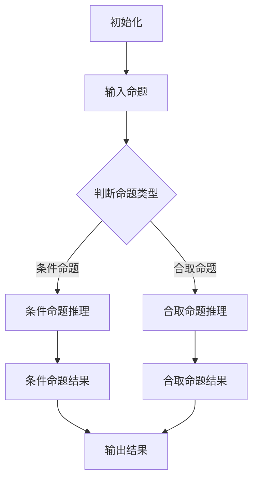

                 

### 背景介绍

#### 1.1 问题的背景

人工智能（AI）作为一门极具前景的科学技术，已经取得了显著的进步。从最初的规则基础系统，到现代的深度学习模型，AI技术在语音识别、图像识别、自然语言处理等方面取得了重大突破。然而，尽管AI在这些领域表现出色，其反常识推理能力仍然存在显著的局限性。反常识推理是指计算机能够理解并处理那些不符合传统逻辑和常识的推理问题，例如，在非标准情境下进行判断和决策。传统AI系统通常依赖于大量的先验知识和大量的训练数据，这使得它们在处理反常识问题时显得力不从心。

#### 1.1.1 人工智能的发展现状

目前，人工智能已经广泛应用于各行各业，如自动驾驶、医疗诊断、金融分析等。深度学习作为AI的核心技术之一，通过神经网络模型实现了对大量数据的自动学习和分类。然而，深度学习模型主要依赖于大量的训练数据，并且往往只能处理那些具有高度相似性的问题，对于需要创新思维和灵活应对的非标准化问题，其表现仍然不尽如人意。

#### 1.1.2 反常识推理的挑战与意义

反常识推理在AI中的应用具有重要意义。首先，它能够帮助AI系统更好地应对现实世界的复杂性和不确定性，特别是在那些无法通过简单规则或大量数据训练的问题上。例如，在医疗诊断中，医生需要根据患者的病史、症状以及最新的医学研究进行综合判断，这需要高度的反常识推理能力。其次，反常识推理能够提升AI的自主性和创造力，使其能够在不同领域进行创新应用。

然而，实现有效的反常识推理面临着诸多挑战。一方面，传统AI系统依赖于大量的先验知识和训练数据，这使得其在处理未知或非标准化问题时显得不够灵活。另一方面，反常识推理需要AI系统能够具备较强的逻辑推理能力，理解复杂情境，并从不同角度进行推理和决策。

#### 1.1.3 思维链技术的概念与发展

为了解决传统AI在反常识推理方面的局限性，研究者们提出了思维链技术。思维链技术是一种基于人工智能的推理框架，通过模拟人类思维的逻辑过程，提升AI在反常识推理中的表现。思维链技术主要包含知识表示、推理引擎和学习机制三个核心组件。

知识表示负责将复杂的信息以结构化的方式存储和处理；推理引擎则是基于这些知识进行逻辑推理和决策；学习机制则通过不断的训练和优化，提升推理引擎的效率和准确性。随着研究的深入，思维链技术逐渐成为AI领域中的一个重要研究方向。

思维链技术的发展为AI反常识推理提供了新的思路和工具，有望在未来实现突破性进展。

#### 1.2 问题描述

##### 1.2.1 传统AI的局限性

传统AI系统在反常识推理方面的局限性主要体现在以下几个方面。首先，传统AI系统依赖于大量的先验知识和训练数据，这使得它们在面对未知或非标准化问题时难以灵活应对。例如，深度学习模型在处理图像识别任务时，需要大量的标记数据进行训练，但对于那些罕见或异常的图像，其识别能力会显著下降。

其次，传统AI系统缺乏自解释性和透明性。在处理复杂问题时，AI系统往往通过复杂的神经网络和决策树等模型进行推理，但无法清晰地解释其推理过程和决策依据，这使得用户难以理解AI的决策逻辑，增加了系统的信任危机。

最后，传统AI系统在面对不确定性和复杂情境时，往往表现出脆弱性。例如，在自动驾驶领域，传统AI系统在面对突发状况时，可能会因为无法快速适应而引发交通事故。这主要是因为传统AI系统在训练过程中缺乏足够的情境多样性，导致其无法在真实世界中灵活应对。

##### 1.2.2 反常识推理的重要性

反常识推理对于AI系统来说具有重要意义。首先，它能够提升AI系统的适应性和灵活性，使其能够更好地应对现实世界的复杂性和不确定性。例如，在医疗诊断中，医生需要根据患者的病史、症状以及最新的医学研究进行综合判断，这需要高度的反常识推理能力。如果AI系统能够具备这种能力，将极大地提升其诊断准确性和治疗效果。

其次，反常识推理能够提升AI的自主性和创造力。在许多领域，创新和创意是推动发展的关键。例如，在产品设计、艺术创作等领域，AI系统如果能够进行反常识推理，将能够提出新颖的设计方案或创作出独特的艺术作品，从而推动相关领域的发展。

最后，反常识推理能够增强AI系统的可靠性和信任度。通过模拟人类思维过程，AI系统可以更加自然地与人类用户互动，并提供更加合理和可信的决策和解释。这有助于降低用户对AI系统的抵触情绪，促进AI技术的广泛应用。

##### 1.2.3 思维链技术在反常识推理中的应用

思维链技术为解决传统AI在反常识推理方面的局限性提供了一种新的思路。思维链技术通过模拟人类思维的逻辑过程，实现了对复杂信息的结构化处理和逻辑推理。以下是思维链技术在反常识推理中的具体应用：

1. **知识表示**：思维链技术通过知识表示组件，将复杂的信息转化为结构化的知识库。这些知识库不仅包含具体的知识点，还包括知识点之间的关联和逻辑关系。这使得AI系统能够在处理问题时，快速定位相关知识点，并进行逻辑推理。

2. **推理引擎**：推理引擎是思维链技术的核心组件，负责根据知识库进行逻辑推理。通过使用各种推理算法，如演绎推理、归纳推理和类比推理，推理引擎能够从已知信息推导出新的结论。这些结论不仅能够解决具体问题，还能够提供合理的解释和决策依据。

3. **学习机制**：学习机制通过不断地训练和优化，提升推理引擎的效率和准确性。通过学习用户的反馈和新的情境数据，学习机制能够不断调整和优化推理策略，使其在处理未知或非标准化问题时更加灵活和高效。

思维链技术的这些特性使其在反常识推理中具有显著的优势。首先，思维链技术能够处理复杂的信息，并快速建立知识点之间的关联，从而提高推理的准确性。其次，通过模拟人类思维过程，思维链技术能够提供合理的解释和决策依据，增强AI系统的透明性和可靠性。

综上所述，思维链技术在反常识推理中的应用为AI系统提供了一种新的解决方案。通过提升AI系统的适应性和灵活性，思维链技术有望在未来实现AI反常识推理的突破性进展。

#### 1.3 问题解决

##### 1.3.1 思维链技术的原理

思维链技术是一种基于人工智能的推理框架，旨在模拟人类思维的逻辑过程，以提高AI在反常识推理中的表现。其核心原理包括知识表示、推理引擎和学习机制。

首先，知识表示是思维链技术的基础。知识表示组件负责将复杂的信息转化为结构化的知识库。这些知识库不仅包含具体的知识点，还包括知识点之间的关联和逻辑关系。通过使用本体论、知识图谱等技术，知识表示组件能够实现信息的有效组织和存储。

其次，推理引擎是思维链技术的核心。推理引擎根据知识库进行逻辑推理，以解决具体问题。推理引擎可以使用各种推理算法，如演绎推理、归纳推理和类比推理。这些算法能够从已知信息推导出新的结论，从而实现复杂的推理过程。

最后，学习机制通过不断地训练和优化，提升推理引擎的效率和准确性。学习机制可以使用机器学习、深度学习等技术，通过分析用户反馈和新情境数据，不断调整和优化推理策略，使其在处理未知或非标准化问题时更加灵活和高效。

##### 1.3.2 思维链技术在AI反常识推理中的应用

思维链技术在AI反常识推理中的应用具有显著的成效。以下是其主要应用实例：

1. **自然语言处理**：在自然语言处理（NLP）领域，思维链技术可以用于构建更高级的语义理解和推理系统。例如，通过思维链技术，AI系统可以更好地处理歧义句子，提供准确的语义解释。此外，思维链技术还可以用于情感分析和对话系统，使AI系统能够理解用户的情感状态，并提供相应的回应。

2. **计算机视觉**：在计算机视觉领域，思维链技术可以用于图像理解和目标识别。通过将图像信息转化为结构化的知识库，思维链技术能够实现复杂的图像推理任务，如场景理解、图像分割和目标跟踪。这些应用在自动驾驶、安防监控等领域具有广泛的应用前景。

3. **数据分析**：在数据分析领域，思维链技术可以用于复杂的数据分析和决策支持。通过思维链技术，AI系统可以处理大量的数据，发现潜在的模式和关联，从而提供更准确和可靠的决策依据。例如，在金融分析中，思维链技术可以用于风险评估和投资策略制定。

##### 1.3.3 思维链技术的优势

思维链技术相比传统AI技术在反常识推理方面具有显著的优势。首先，思维链技术能够处理复杂的信息，并快速建立知识点之间的关联，从而提高推理的准确性。其次，通过模拟人类思维过程，思维链技术能够提供合理的解释和决策依据，增强AI系统的透明性和可靠性。最后，思维链技术具有较好的适应性和灵活性，能够应对未知或非标准化问题，从而提升AI系统的应用范围和效果。

综上所述，思维链技术为AI反常识推理提供了一种有效的解决方案。通过不断的研究和优化，思维链技术有望在未来实现更广泛的应用，为人工智能的发展带来新的突破。

#### 1.4 边界与外延

##### 1.4.1 反常识推理的边界

反常识推理虽然具有广泛的应用前景，但其边界和局限性也不容忽视。首先，反常识推理依赖于大量的先验知识和训练数据，这使得其在处理未知或缺乏数据支持的问题时可能存在困难。例如，在处理一些极端或罕见情境时，AI系统可能无法从已有知识库中找到合适的推理路径，从而导致推理失败。

其次，反常识推理的结果往往具有一定的主观性。由于反常识推理需要模拟人类思维过程，其推理结果受到推理算法和知识表示的制约。不同的推理算法和知识表示方法可能会导致不同的推理结果，这增加了反常识推理结果的不确定性和不可预测性。

最后，反常识推理在处理复杂问题时可能面临计算资源的高消耗。反常识推理通常涉及复杂的逻辑推理和知识关联，这需要大量的计算资源和时间。在高负载或实时应用场景中，反常识推理的性能可能会受到影响。

##### 1.4.2 思维链技术的适用范围

思维链技术作为一种模拟人类思维的推理框架，在多个领域展现出良好的适用性。首先，在自然语言处理领域，思维链技术可以用于处理语义理解和对话系统，提升AI在理解用户意图和生成自然语言回应方面的能力。其次，在计算机视觉领域，思维链技术可以用于图像理解和目标识别，提升AI在处理复杂视觉任务方面的表现。此外，在数据分析领域，思维链技术可以用于复杂的数据分析和决策支持，为企业和组织提供更准确的预测和决策依据。

尽管思维链技术在多个领域具有广泛的应用前景，但其在某些领域也存在局限性。例如，在医疗诊断领域，思维链技术需要大量的医学知识和临床数据支持，这对于缺乏足够资源和数据的医疗机构可能构成挑战。此外，在实时控制领域，思维链技术的实时性可能受到限制，难以满足一些高要求的实时应用需求。

##### 1.4.3 反常识推理与常识推理的区别

反常识推理和常识推理在目标、方法和应用上存在显著差异。常识推理主要基于人类日常经验和普遍认知，旨在处理那些符合常识和常规逻辑的问题。例如，常识推理可以帮助AI系统识别日常生活中的物体和场景，进行简单的决策和判断。

反常识推理则不同，它旨在处理那些不符合传统逻辑和常识的问题。反常识推理需要AI系统具备更强的逻辑推理能力和创新思维能力，以应对复杂、未知或非标准化的情境。例如，在医疗诊断中，医生需要根据患者的病史、症状以及最新的医学研究进行综合判断，这需要高度的反常识推理能力。

从方法上来看，常识推理主要依赖于规则和模式匹配，而反常识推理则更多地依赖于逻辑推理、类比学习和创造力。常识推理通常基于已有的知识和经验，而反常识推理则需要AI系统具备从不同角度分析和推理的能力。

在应用上，常识推理在日常生活中和常规业务场景中具有广泛的应用，如智能助手、安防监控等。反常识推理则在医疗诊断、创新设计、自动驾驶等需要高度灵活性和创造力的领域具有更大的应用潜力。

综上所述，反常识推理与常识推理在目标、方法和应用上具有显著的差异。理解这两种推理方式的区别，有助于我们更好地应用思维链技术，提升AI在各个领域的表现。

#### 1.5 核心概念与联系

##### 1.5.1 思维链技术的核心概念

思维链技术是一种基于人工智能的推理框架，其核心概念包括知识表示、推理引擎和学习机制。这些概念相互关联，共同构成了思维链技术的基础。

**知识表示**：知识表示是思维链技术的核心概念之一。它负责将复杂的信息转化为结构化的知识库，这些知识库不仅包含具体的知识点，还包括知识点之间的关联和逻辑关系。知识表示的方式可以采用本体论、知识图谱等，通过这些方式，信息能够以结构化的形式存储和查询，从而提高推理的效率。

**推理引擎**：推理引擎是思维链技术的另一核心概念。它负责根据知识库进行逻辑推理，以解决具体问题。推理引擎可以使用各种推理算法，如演绎推理、归纳推理和类比推理。这些算法能够从已知信息推导出新的结论，从而实现复杂的推理过程。

**学习机制**：学习机制是思维链技术的关键组成部分。它通过不断的训练和优化，提升推理引擎的效率和准确性。学习机制可以使用机器学习、深度学习等技术，通过分析用户反馈和新情境数据，不断调整和优化推理策略，使其在处理未知或非标准化问题时更加灵活和高效。

##### 1.5.2 核心概念属性特征对比表格

为了更好地理解思维链技术的核心概念，我们可以通过一个属性特征对比表格来展示这些概念之间的区别和联系。以下是一个简化的表格：

| 核心概念 | 属性特征 | 描述 |
| --- | --- | --- |
| 知识表示 | 结构化存储 | 负责将信息转化为结构化的知识库 |
| 推理引擎 | 逻辑推理 | 根据知识库进行推理，解决具体问题 |
| 学习机制 | 不断优化 | 通过训练和优化，提升推理效率 |

通过这个表格，我们可以清晰地看到每个核心概念的主要属性特征和功能，以及它们在思维链技术中的相互关系。

##### 1.5.3 ER实体关系图架构

为了更直观地展示思维链技术的核心概念及其相互关系，我们可以使用ER（Entity-Relationship）实体关系图进行描述。以下是一个简化的ER图：

```mermaid
erDiagram
  KnowledgeRep --|>| ReasoningEngine : 依赖
  ReasoningEngine --|>| LearningMechanism : 依赖
  LearningMechanism --|>| KnowledgeRep : 反馈
```

在这个ER图中，知识表示（KnowledgeRep）作为核心组件，依赖于推理引擎（ReasoningEngine）和学习机制（LearningMechanism）。推理引擎根据知识表示进行推理，并将结果反馈给学习机制，学习机制再根据这些反馈不断优化知识表示和推理引擎。

通过这个ER图，我们可以更直观地理解思维链技术的整体架构，以及核心组件之间的相互关系和作用。

#### 1.6 本章小结

本章首先介绍了人工智能的发展现状和反常识推理的挑战，阐述了思维链技术的概念与发展。接着，通过问题描述，详细分析了传统AI的局限性以及反常识推理的重要性。然后，介绍了思维链技术的原理及其在AI反常识推理中的应用。此外，讨论了反常识推理与常识推理的区别，并阐述了思维链技术的核心概念与联系。最后，通过ER实体关系图，展示了思维链技术的架构设计。本章为后续章节的深入探讨奠定了基础。

### 第2章：思维链技术原理

#### 2.1 思维链技术的定义

思维链技术是一种基于人工智能的推理框架，旨在模拟人类思维的逻辑过程，以提高AI系统在复杂问题解决和反常识推理中的表现。它通过知识表示、推理引擎和学习机制三个核心组件，实现信息的结构化处理和逻辑推理。知识表示组件负责将复杂的信息转化为结构化的知识库；推理引擎基于这些知识库进行逻辑推理；学习机制通过不断的训练和优化，提升推理引擎的效率和准确性。思维链技术的主要目标是提升AI系统的适应性和灵活性，使其能够更好地处理未知和复杂的推理任务。

#### 2.1.1 思维链技术的内涵

思维链技术的内涵主要体现在以下几个方面：

1. **知识表示**：知识表示是思维链技术的基础，它将复杂的信息转化为结构化的知识库。这些知识库不仅包含具体的知识点，还包括知识点之间的关联和逻辑关系。知识表示的方法可以采用本体论、知识图谱等，从而实现信息的有效组织和存储。

2. **推理引擎**：推理引擎是思维链技术的核心组件，它负责根据知识库进行逻辑推理，以解决具体问题。推理引擎可以使用各种推理算法，如演绎推理、归纳推理和类比推理。这些算法能够从已知信息推导出新的结论，实现复杂的推理过程。

3. **学习机制**：学习机制通过不断的训练和优化，提升推理引擎的效率和准确性。学习机制可以使用机器学习、深度学习等技术，通过分析用户反馈和新情境数据，不断调整和优化推理策略，使其在处理未知或非标准化问题时更加灵活和高效。

4. **模拟人类思维**：思维链技术的核心在于模拟人类思维的逻辑过程。它通过模拟人类思维的思考方式，如逻辑推理、归纳和演绎，实现信息的处理和问题的解决。这种模拟使得AI系统能够在处理复杂问题和进行反常识推理时，具备更高的灵活性和创造性。

#### 2.1.2 思维链技术的外延

思维链技术的外延主要体现在以下几个方面：

1. **应用领域**：思维链技术可以应用于多个领域，包括自然语言处理、计算机视觉、数据分析等。在自然语言处理领域，思维链技术可以用于语义理解和对话系统；在计算机视觉领域，可以用于图像理解和目标识别；在数据分析领域，可以用于复杂的数据分析和决策支持。

2. **技术实现**：思维链技术需要多种技术的支持，包括知识图谱、机器学习、深度学习等。知识图谱用于构建结构化的知识库；机器学习和深度学习用于推理引擎的优化和学习机制的实现。

3. **挑战与前景**：尽管思维链技术在多个领域展现了良好的应用前景，但在实际应用中也面临一定的挑战。例如，知识表示的准确性、推理引擎的效率和实时性等。随着技术的不断进步，思维链技术有望在未来实现更加广泛和深入的应用。

#### 2.2 思维链技术的工作原理

思维链技术的工作原理可以概括为三个主要环节：知识表示、推理引擎和学习机制。这三个环节相互关联，共同构成了思维链技术的核心框架。

1. **知识表示**

知识表示是思维链技术的第一步，也是其基础。它负责将复杂的信息转化为结构化的知识库。这个过程中，信息以多种形式进行表示，如文本、图像、音频等。具体来说，知识表示包括以下几个关键步骤：

- **信息收集**：首先，从各种来源（如文本、数据库、传感器等）收集信息，并将其转换为数字形式。
- **信息预处理**：对收集到的信息进行清洗、去噪和格式化，以便进行进一步处理。
- **知识编码**：将预处理后的信息进行结构化处理，将其转化为知识库中的知识点。知识编码的方法可以采用本体论、知识图谱等。
- **知识组织**：将编码后的知识点按照一定的逻辑关系进行组织，形成知识图谱。知识图谱不仅包含了知识点，还包括知识点之间的关联和逻辑关系。

2. **推理引擎**

推理引擎是思维链技术的核心组件，负责根据知识库进行逻辑推理。推理引擎的工作原理可以概括为以下几个步骤：

- **问题定义**：首先，明确需要解决的问题，并将其转化为一个逻辑问题。
- **知识检索**：根据问题定义，从知识库中检索相关的知识点。这个过程类似于人类在解决问题时，根据已有知识和经验进行信息检索。
- **逻辑推理**：使用各种推理算法（如演绎推理、归纳推理、类比推理等），从检索到的知识点中推导出新的结论。这些结论可能是具体的解决方案，也可能是新的推理问题。
- **结果验证**：对推导出的结论进行验证，确保其正确性和合理性。

3. **学习机制**

学习机制是思维链技术的关键组成部分，负责提升推理引擎的效率和准确性。学习机制通过以下几个步骤实现：

- **反馈收集**：收集用户对推理结果的反馈，包括正确性、实用性和满意度等。
- **错误分析**：对反馈进行分析，识别推理过程中的错误和不足。
- **策略调整**：根据错误分析的结果，调整推理策略，优化知识表示和推理引擎。
- **持续学习**：通过不断的学习和优化，提高推理引擎的效率和准确性，使其在处理复杂问题和进行反常识推理时更加灵活和高效。

#### 2.2.1 思维链的形成

思维链的形成是思维链技术工作的核心环节，它通过一系列的步骤，将输入信息转化为有效的推理结果。以下是思维链形成的主要步骤：

1. **信息输入**：首先，系统接收外部输入的信息，这些信息可以是文本、图像、语音等多种形式。输入的信息需要经过预处理，如去噪、格式化等，以便进行后续处理。

2. **知识检索**：根据输入的信息，系统从知识库中检索相关的知识点。知识库中的知识点是以结构化的形式存储的，包括具体的知识点和知识点之间的关联。

3. **逻辑推理**：利用推理引擎，系统对检索到的知识点进行逻辑推理。推理引擎可以使用各种推理算法，如演绎推理、归纳推理、类比推理等，从已知信息推导出新的结论。

4. **中间结果生成**：在逻辑推理过程中，系统会生成一系列的中间结果。这些结果可能是具体的推理路径，也可能是推理过程中发现的规律和模式。

5. **结果验证**：对生成的中间结果进行验证，确保其正确性和合理性。验证过程可能包括逻辑检查、数据对比等。

6. **反馈调整**：根据验证结果，对推理过程进行反馈调整。如果结果存在错误，系统会根据错误类型和程度，调整推理策略或知识表示。

7. **输出结果**：最终，系统输出有效的推理结果。这些结果可以是具体的解决方案，也可以是新的问题或建议。

#### 2.2.2 思维链的传递

思维链的传递是思维链技术实现连续推理和问题解决的关键。在思维链传递过程中，系统不仅需要处理当前的输入信息，还需要利用已生成的推理结果，更新知识库和推理策略，以实现更高效的推理。以下是思维链传递的主要步骤：

1. **结果反馈**：首先，系统收集对当前推理结果的反馈。这些反馈可能来自用户、数据源或其他系统，反映了推理结果的正确性、实用性和满意度。

2. **错误识别**：根据反馈，系统识别出推理过程中的错误和不足。错误可能包括逻辑错误、数据错误、算法错误等。

3. **知识库更新**：根据错误识别的结果，系统对知识库进行更新。这包括修正错误的知识点、添加新的知识点、删除冗余知识点等。

4. **推理策略调整**：系统根据错误类型和程度，调整推理策略。这可能包括改变推理算法、优化知识表示、调整参数设置等。

5. **传递新信息**：系统将更新后的知识库和推理策略应用到新的问题中。这包括对新输入信息进行预处理、知识检索、逻辑推理等。

6. **连续推理**：通过不断地传递新信息，系统实现连续推理和问题解决。这个过程可以是单步推理，也可以是多步推理，具体取决于问题的复杂性和系统的设计。

7. **持续优化**：在传递过程中，系统不断收集反馈，进行错误识别和知识库更新，以实现持续优化和性能提升。

#### 2.2.3 思维链的调控

思维链的调控是确保思维链技术高效运行的关键。调控过程包括对推理过程、知识库和推理策略的监控、调整和优化。以下是思维链调控的主要步骤：

1. **过程监控**：系统对推理过程进行实时监控，包括推理时间、资源消耗、错误率等指标。这些指标反映了推理过程的状态和性能。

2. **性能评估**：根据监控指标，系统评估推理过程的表现。如果发现性能不足或存在错误，系统会启动调控机制。

3. **策略调整**：系统根据性能评估的结果，调整推理策略。这可能包括改变推理算法、优化知识表示、调整参数设置等。

4. **知识库更新**：系统根据调控结果，更新知识库。这包括修正错误的知识点、添加新的知识点、删除冗余知识点等。

5. **反馈循环**：系统将调控结果反馈到推理过程中，形成反馈循环。这个过程不断重复，以实现推理过程和知识库的持续优化。

6. **性能优化**：通过不断的调控和优化，系统实现性能提升和稳定性增强。这有助于确保思维链技术在处理复杂问题和进行反常识推理时，具备高效性和可靠性。

#### 2.3 思维链技术的核心组件

思维链技术的核心组件包括知识表示、推理引擎和学习机制。这些组件相互协作，共同实现思维链技术的高效运行。以下是每个核心组件的详细描述：

1. **知识表示**

知识表示是思维链技术的基础，负责将复杂的信息转化为结构化的知识库。知识表示的方法可以采用本体论、知识图谱等，通过这些方式，信息能够以结构化的形式存储和查询，从而提高推理的效率。知识表示的关键步骤包括：

- **信息收集**：从各种来源（如文本、数据库、传感器等）收集信息，并将其转换为数字形式。
- **信息预处理**：对收集到的信息进行清洗、去噪和格式化，以便进行进一步处理。
- **知识编码**：将预处理后的信息进行结构化处理，将其转化为知识库中的知识点。知识编码的方法可以采用本体论、知识图谱等。
- **知识组织**：将编码后的知识点按照一定的逻辑关系进行组织，形成知识图谱。知识图谱不仅包含了知识点，还包括知识点之间的关联和逻辑关系。

2. **推理引擎**

推理引擎是思维链技术的核心组件，负责根据知识库进行逻辑推理，以解决具体问题。推理引擎的工作原理可以概括为以下几个步骤：

- **问题定义**：首先，明确需要解决的问题，并将其转化为一个逻辑问题。
- **知识检索**：根据问题定义，从知识库中检索相关的知识点。这个过程类似于人类在解决问题时，根据已有知识和经验进行信息检索。
- **逻辑推理**：使用各种推理算法（如演绎推理、归纳推理、类比推理等），从检索到的知识点中推导出新的结论。这些结论可能是具体的解决方案，也可能是新的推理问题。
- **结果验证**：对推导出的结论进行验证，确保其正确性和合理性。

3. **学习机制**

学习机制是思维链技术的关键组成部分，负责提升推理引擎的效率和准确性。学习机制通过以下几个步骤实现：

- **反馈收集**：收集用户对推理结果的反馈，包括正确性、实用性和满意度等。
- **错误分析**：对反馈进行分析，识别推理过程中的错误和不足。
- **策略调整**：根据错误分析的结果，调整推理策略，优化知识表示和推理引擎。
- **持续学习**：通过不断的学习和优化，提高推理引擎的效率和准确性，使其在处理复杂问题和进行反常识推理时更加灵活和高效。

#### 2.3.1 知识表示

知识表示是思维链技术的基石，负责将现实世界中的复杂信息转化为计算机能够理解和处理的格式。知识表示的方法和工具多种多样，每种方法都有其独特的优势和适用场景。

1. **文本表示**

文本是知识表示中最常见的形式。文本表示的核心是将自然语言文本转化为机器可读的结构化数据。常用的文本表示方法包括：

- **词袋模型（Bag of Words, BoW）**：将文本中的词汇作为特征，忽略词汇的顺序，形成一个向量表示。这种方法简单直观，但无法捕捉词汇之间的关系。
- **词嵌入（Word Embedding）**：通过将词汇映射到高维空间中的向量，捕捉词汇的语义关系。Word2Vec、GloVe等算法是常见的词嵌入方法。
- **序列模型**：使用循环神经网络（RNN）、长短期记忆网络（LSTM）或变换器（Transformer）等模型，对文本序列进行编码，捕捉词汇的顺序和语义关系。

2. **图像表示**

图像表示是将视觉信息转化为计算机可处理的数据形式。常见的图像表示方法包括：

- **像素表示**：直接使用图像的像素值作为特征，这种方法简单，但容易受到噪声和图像大小的影响。
- **特征提取**：通过卷积神经网络（CNN）等模型，从图像中提取高层次的视觉特征，这些特征能够捕捉图像的局部结构和语义信息。
- **图表示**：将图像中的对象、场景和关系表示为图，每个节点表示图像中的对象或区域，边表示对象之间的关系。这种方法在计算机视觉和知识图谱领域有广泛应用。

3. **知识图谱**

知识图谱是将实体和关系表示为图结构的数据模型，能够有效地组织和表示复杂的知识体系。知识图谱的关键要素包括：

- **实体**：知识图谱中的基本元素，如人、地点、组织等。
- **属性**：实体的特征或属性，如人的年龄、地点的纬度等。
- **关系**：实体之间的关联，如人属于组织、地点位于国家等。

知识图谱不仅能够表示事实知识，还能通过推理机制发现新的知识和关系。

#### 2.3.2 推理引擎

推理引擎是思维链技术的核心组件，负责基于知识库和预设的逻辑规则，自动推导出新的结论。推理引擎的工作原理可以概括为以下几个步骤：

1. **问题定义**：

首先，需要将需要解决的问题转化为一个形式化的逻辑问题。这通常涉及将自然语言问题转换为符号表示，或者将具体的问题转化为一个逻辑命题。

2. **知识库构建**：

构建包含必要信息的知识库。知识库可以是显式定义的规则集，也可以是隐式存储在数据库或知识图谱中的事实和关系。知识库的质量直接影响推理引擎的效率和准确性。

3. **推理过程**：

推理引擎使用各种推理算法，从知识库中提取相关事实和关系，并应用逻辑规则进行推理。常见的推理算法包括：

- **演绎推理**：从一般性的前提推导出具体性的结论。例如，从“所有人都会死亡”和“苏格拉底是人”推导出“苏格拉底会死亡”。
- **归纳推理**：从具体的实例中归纳出一般性的规律或规则。例如，从多个观测数据中归纳出某种模式或趋势。
- **类比推理**：通过比较两个相似情境的已知结论，推导出新情境的可能结论。例如，通过比较“猫是哺乳动物”和“兔子是哺乳动物”，推断“狐狸也是哺乳动物”。

4. **结果验证**：

推理过程中生成的结论需要经过验证，以确保其逻辑上的一致性和事实上的准确性。验证可能涉及逻辑一致性检查、事实核对等步骤。

5. **解释和可视化**：

推理引擎还需要能够提供对推理过程的解释和可视化，帮助用户理解推理过程和结论的依据。这通常涉及将推理过程表示为图形或文本形式，并提供解释性的说明。

推理引擎的选择和实现取决于具体的应用场景和需求。对于简单的逻辑推理任务，基于规则的系统可能足够高效。而对于复杂的问题，如自然语言理解和推理，深度学习和图神经网络等模型可能更合适。

#### 2.3.3 学习机制

学习机制是思维链技术的核心组件之一，负责通过不断的学习和优化，提升推理引擎的效率和准确性。学习机制通常包括以下几个步骤：

1. **数据收集**：

首先，需要收集大量的训练数据。这些数据可以是结构化的（如数据库中的记录），也可以是非结构化的（如文本、图像等）。数据的质量和多样性直接影响学习机制的效果。

2. **特征提取**：

对收集到的数据进行特征提取，将其转化为适合学习算法的格式。特征提取是学习机制的关键步骤，它决定了数据在模型中的表示方式和模型的性能。例如，在自然语言处理中，可以使用词嵌入技术提取词汇特征；在图像处理中，可以使用卷积神经网络提取图像特征。

3. **模型训练**：

使用训练数据对推理引擎的模型进行训练。训练过程中，模型通过不断调整参数，使其在训练数据上表现更好。训练算法可以是基于梯度的优化算法，如随机梯度下降（SGD），也可以是更高级的优化算法，如Adam。

4. **模型评估**：

在训练完成后，需要对模型进行评估，以检查其性能和泛化能力。评估通常包括在验证集上的准确率、召回率、F1分数等指标。如果模型在验证集上的表现不佳，需要返回步骤3进行进一步的训练和调整。

5. **模型部署**：

将训练好的模型部署到实际应用场景中。部署过程中，需要考虑模型的实时性和效率，以确保其能够在实际应用中高效运行。

6. **反馈循环**：

在模型部署后，收集用户反馈和实际运行数据。这些反馈和数据用于对模型进行持续优化和改进。通过反馈循环，模型能够不断学习和适应新的情境和数据，从而提高其性能和适应性。

学习机制的关键在于其自适应性和泛化能力。通过不断的学习和优化，学习机制能够使推理引擎在面对新的问题和数据时，保持高效和准确。

#### 2.4 思维链技术的优势与挑战

思维链技术作为人工智能领域的一项前沿技术，具备多项显著的优势，同时也面临一些技术挑战。

**优势：**

1. **提高推理能力**：

思维链技术通过模拟人类思维的逻辑过程，能够实现更复杂、更灵活的推理。这种推理能力不仅适用于标准化的逻辑问题，也能有效应对反常识推理任务。例如，在自然语言处理中，思维链技术能够更好地处理语义歧义和复杂语句，提供准确的语义理解。

2. **扩展应用范围**：

思维链技术可以应用于多个领域，包括自然语言处理、计算机视觉、数据分析等。这种多领域的应用潜力使得思维链技术具有广泛的应用前景。例如，在医疗诊断中，思维链技术可以结合患者的病史、症状和最新的医学研究，提供更全面、更准确的诊断建议。

3. **提高决策质量**：

通过思维链技术，AI系统能够在复杂情境中做出更高质量的决策。这主要是因为思维链技术能够模拟人类思维过程中的逻辑推理和决策制定，从而提高决策的透明性和可靠性。例如，在金融分析中，思维链技术可以用于风险评估和投资决策，提供更准确的预测和更优化的策略。

**挑战：**

1. **知识表示的准确性**：

思维链技术依赖于知识表示的质量，如果知识表示不准确或不完整，将直接影响推理引擎的表现。尤其是在处理未知或非标准化问题时，不准确的知识表示可能导致推理失败或产生错误的结果。

2. **实时性和效率**：

尽管思维链技术在推理能力和应用范围上具有优势，但在实际应用中，实时性和效率仍然是一个重要的挑战。特别是在需要快速响应的实时系统中，如自动驾驶和实时监控，思维链技术的推理速度和效率需要进一步提升。

3. **解释性和透明性**：

思维链技术的推理过程通常涉及复杂的逻辑推理和决策制定，这使得其结果难以解释和验证。提高推理过程的透明性和可解释性，是思维链技术面临的另一个挑战。这对于增强用户对AI系统的信任和接受度至关重要。

4. **数据隐私和安全性**：

思维链技术在处理和分析大量数据时，可能涉及个人隐私和数据安全的问题。如何确保数据的安全性和隐私性，避免数据泄露和滥用，是思维链技术在实际应用中需要解决的另一个重要挑战。

总之，思维链技术作为一种前沿的人工智能技术，具备显著的优势和应用潜力。然而，要充分发挥其潜力，仍然需要克服一系列技术挑战，特别是在知识表示准确性、实时性和效率、解释性和透明性以及数据隐私和安全性等方面。随着技术的不断进步和研究的深入，思维链技术有望在未来实现更广泛和深入的应用。

#### 2.5 本章小结

本章详细介绍了思维链技术的定义、内涵和外延，阐述了其核心概念和组成部分。通过知识表示、推理引擎和学习机制三个核心组件，思维链技术能够实现复杂信息处理和逻辑推理。我们还讨论了思维链技术的工作原理，包括知识表示、推理过程和传递机制，并分析了思维链技术的优势与挑战。通过本章的学习，读者可以对思维链技术有一个全面的了解，为其在实际应用中的研究和开发提供理论基础。

### 第3章：反常识推理的数学模型与算法

#### 3.1 反常识推理的数学模型

反常识推理是一种涉及复杂逻辑和非标准化问题解决的推理过程。为了更有效地理解和实现反常识推理，我们需要借助数学模型和算法。数学模型是反常识推理的基础，它通过结构化和量化信息，提供了一种形式化的表示和推理方法。

**数学模型的定义**：

数学模型是一种数学表示，用于描述现实世界中的问题和现象。在反常识推理中，数学模型通常包括变量、函数、方程等元素，它们共同定义了一个逻辑推理空间。数学模型不仅帮助明确问题，还能为算法提供明确的操作规则。

**数学模型的应用**：

在反常识推理中，数学模型的应用非常广泛。例如，在自然语言处理（NLP）中，词嵌入（Word Embedding）模型可以将自然语言文本转换为数学向量，从而实现语义分析。在计算机视觉中，卷积神经网络（CNN）模型可以用于图像分类和目标检测，其背后的数学模型是多层感知机（MLP）和卷积操作。

**数学模型的特点**：

1. **结构化**：数学模型能够以结构化的形式表示信息，使得数据之间具有明确的数学关系，便于计算机处理。
2. **量化**：数学模型能够将信息量化，从而便于进行数学运算和推理。
3. **形式化**：数学模型提供了一种形式化的描述，使得推理过程具有明确的操作规则，有助于实现自动化推理。
4. **可扩展性**：数学模型通常具有较好的可扩展性，能够适应不同规模和复杂度的问题。

#### 3.2 反常识推理算法

算法是解决反常识推理问题的重要工具。算法通过一系列操作和规则，从已知信息推导出新的结论。以下是一些常见的反常识推理算法：

**算法的定义**：

算法是一系列定义明确的步骤，用于解决特定问题。在反常识推理中，算法通常包括输入、处理步骤和输出结果。算法的目标是高效、准确地实现逻辑推理和决策。

**算法的设计**：

算法设计通常包括以下几个关键步骤：

1. **问题定义**：明确需要解决的问题，并将其转化为数学模型或逻辑形式。
2. **算法选择**：选择适合解决该问题的算法。不同的算法适用于不同类型的问题，需要根据具体情况进行选择。
3. **算法实现**：将选定的算法转化为计算机程序，实现算法的逻辑流程和操作步骤。
4. **测试和优化**：通过测试数据验证算法的有效性和准确性，根据测试结果进行优化。

**算法分析**：

算法分析包括对算法的时间复杂度和空间复杂度进行分析。时间复杂度描述了算法运行时间与输入规模的关系，空间复杂度描述了算法所需存储空间与输入规模的关系。通过对算法复杂度的分析，可以评估算法的效率和可行性。

#### 3.3 算法原理讲解

为了更好地理解反常识推理算法的工作原理，我们可以通过一个具体的算法进行讲解。这里，我们选择逻辑推理算法——命题逻辑推理算法（Propositional Logic Reasoning Algorithm）进行介绍。

**算法的mermaid流程图**：



**Python源代码讲解**：

```python
def propositional_logic_reasoning(algorithm, propositions):
    if algorithm == "conjunction":
        return all(propositions)
    elif algorithm == "implication":
        antecedent, consequent = propositions
        return not antecedent or consequent
    else:
        return "Invalid algorithm"

# 示例
propositions = ["A", "B"]
result = propositional_logic_reasoning("conjunction", propositions)
print("合取命题结果：", result)
```

**算法原理的数学模型和公式**：

在命题逻辑推理中，常用的公式包括条件命题（implication）和合取命题（conjunction）。条件命题的公式可以表示为 \( p \rightarrow q \)，表示如果 \( p \) 为真，则 \( q \) 也为真。合取命题的公式可以表示为 \( p \land q \)，表示 \( p \) 和 \( q \) 都为真。

**举例说明**：

假设有两个命题 \( A \) 和 \( B \)，其中 \( A \) 表示“今天下雨”，\( B \) 表示“我会带伞”。使用命题逻辑推理算法，我们可以得出以下结论：

1. **合取命题**：如果 \( A \) 和 \( B \) 都为真，则 \( A \land B \) 也为真。即“今天下雨”且“我会带伞”为真。
2. **条件命题**：如果 \( A \) 为真，则 \( B \) 也为真。即“如果今天下雨，那么我会带伞”。

这些结论可以帮助我们在实际生活中做出合理的决策。

#### 3.4 反常识推理算法的应用场景

反常识推理算法在多个领域展现了其广泛的应用价值。以下是一些典型的应用场景：

**自然语言处理（NLP）**：

在NLP中，反常识推理算法可以用于处理语义理解和文本生成。例如，在语义理解中，反常识推理算法可以处理歧义句和复杂语句，提供准确的语义解释。在文本生成中，反常识推理算法可以生成符合逻辑和语义的文本，用于自动写作和对话系统。

**计算机视觉（CV）**：

在CV领域，反常识推理算法可以用于图像理解和目标识别。例如，在图像理解中，反常识推理算法可以识别图像中的异常或罕见场景，如错误标志或异常行为。在目标识别中，反常识推理算法可以识别不符合标准模式的目标，如被盗车辆或异常行人。

**数据分析（DA）**：

在数据分析中，反常识推理算法可以用于异常检测和预测。例如，在异常检测中，反常识推理算法可以识别不符合常规模式的数据点，如异常交易或异常行为。在预测中，反常识推理算法可以预测未来可能发生的异常事件，如金融市场的异常波动。

这些应用场景展示了反常识推理算法在不同领域的重要性和潜力。

#### 3.5 本章小结

本章介绍了反常识推理的数学模型与算法，包括其定义、应用和特点。通过命题逻辑推理算法的详细讲解，我们了解了算法原理和实际应用。反常识推理算法在自然语言处理、计算机视觉和数据分析等领域具有广泛的应用，展示了其在复杂问题解决中的重要性。通过本章的学习，读者可以更好地理解反常识推理的核心概念和实现方法。

### 第4章：思维链技术在AI反常识推理中的应用

#### 4.1 思维链技术在AI反常识推理中的作用

思维链技术在AI反常识推理中的应用，显著提升了AI系统的推理能力和适应性。以下详细阐述思维链技术在该领域中的关键作用：

1. **提高推理能力**：

思维链技术通过模拟人类思维的逻辑过程，实现了对复杂信息的有效处理和逻辑推理。这种推理能力不仅限于标准化问题，还能够应对非标准化、复杂的问题。例如，在医疗诊断中，思维链技术可以整合患者的病史、临床表现和最新的医学研究，提供更全面、准确的诊断建议。在法律领域，思维链技术可以分析复杂的法律条文和案例，提供符合逻辑的判决依据。

2. **扩展应用范围**：

思维链技术的应用范围非常广泛，涵盖了自然语言处理、计算机视觉、数据分析等多个领域。在自然语言处理中，思维链技术可以用于语义理解、文本生成和对话系统。在计算机视觉中，可以用于图像理解、目标识别和图像分割。在数据分析中，可以用于异常检测、预测分析和决策支持。这种广泛的应用能力，使得思维链技术在各个领域都有重要的应用价值。

3. **提高决策质量**：

通过思维链技术，AI系统可以更准确地理解和处理复杂情境，从而提高决策的质量和可靠性。例如，在金融领域，思维链技术可以用于风险评估、投资策略制定和风险管理。通过整合大量的数据和信息，思维链技术可以提供更准确的预测和更优化的策略，帮助金融机构做出更明智的决策。在自动驾驶领域，思维链技术可以提高车辆对复杂道路情境的理解和应对能力，从而提高行驶的安全性和效率。

#### 4.2 思维链技术在AI反常识推理中的应用案例

以下我们通过三个具体的应用案例，来展示思维链技术在AI反常识推理中的实际效果和优势：

**案例一：自然语言处理**

在自然语言处理领域，思维链技术被广泛应用于语义理解、文本生成和对话系统。例如，在语义理解中，思维链技术可以处理复杂的歧义句子和长句子，提供准确的语义解释。通过分析句子的结构、上下文和词汇关系，思维链技术能够识别出句子的真正含义。例如，句子“我看到的猫会说话”在不同上下文中可能具有不同的含义，思维链技术可以根据上下文提供正确的解释。

在文本生成中，思维链技术可以生成符合逻辑和语义的文本。例如，在自动写作中，思维链技术可以生成新闻报道、文章摘要和对话文本。通过分析大量的文本数据，思维链技术可以学习到不同领域的语言规则和表达方式，从而生成高质量的文本。

在对话系统中，思维链技术可以提升对话的连贯性和自然性。通过理解和分析用户的意图和情感，思维链技术可以提供更符合用户需求的回应。例如，在智能客服中，思维链技术可以分析用户的提问，提供详细的解答和建议，从而提高用户体验。

**案例二：计算机视觉**

在计算机视觉领域，思维链技术被应用于图像理解、目标识别和图像分割。通过构建结构化的知识库，思维链技术可以实现对复杂图像的深入理解。例如，在图像理解中，思维链技术可以识别图像中的物体、场景和事件，提供准确的描述和分类。

在目标识别中，思维链技术可以识别出图像中的目标对象，并对其位置、形状和属性进行标注。这对于目标跟踪、视频监控和自动驾驶等领域具有重要意义。例如，在自动驾驶中，思维链技术可以识别道路上的车辆、行人、交通标志等，从而做出正确的行驶决策。

在图像分割中，思维链技术可以实现对图像的精细分割，提取出图像中的关键区域。这对于图像编辑、图像增强和计算机辅助诊断等领域具有重要应用价值。例如，在医学图像处理中，思维链技术可以分割出病变区域，为医生提供准确的诊断依据。

**案例三：数据分析**

在数据分析领域，思维链技术被广泛应用于异常检测、预测分析和决策支持。通过分析大量的数据，思维链技术可以识别出数据中的异常模式，提供预警和解决方案。例如，在金融领域，思维链技术可以检测出异常交易，防止欺诈行为。

在预测分析中，思维链技术可以预测未来的趋势和变化，为决策提供科学依据。例如，在零售行业，思维链技术可以预测销售趋势，帮助商家制定更有效的营销策略。

在决策支持中，思维链技术可以提供基于数据的决策建议，提高决策的准确性和效率。例如，在项目管理中，思维链技术可以分析项目进度和资源分配，提供最优的项目管理方案。

#### 4.3 思维链技术在AI反常识推理中的未来发展趋势

思维链技术在AI反常识推理中的应用前景广阔，未来发展趋势主要体现在以下几个方面：

1. **技术融合**：

随着人工智能、大数据、物联网等技术的发展，思维链技术将与其他技术深度融合，形成更加智能和高效的AI系统。例如，通过结合物联网数据，思维链技术可以实现更精准的环境感知和实时决策。

2. **领域适应性**：

思维链技术将在更多领域得到应用，特别是在那些需要高度灵活性和创新能力的领域。例如，在医疗、金融、法律等领域，思维链技术将进一步提升专业决策的准确性和效率。

3. **人机协作**：

思维链技术将更好地与人类专家协作，实现人机协同。通过将人类专家的知识和经验融入思维链技术中，AI系统可以更好地理解和解决复杂问题，提高决策的透明性和可解释性。

4. **自主进化**：

随着学习机制的不断完善，思维链技术将实现自主学习和进化。通过不断学习和优化，思维链技术将能够应对更多复杂的推理任务，提高其适应性和鲁棒性。

5. **标准化和规范化**：

为了推动思维链技术的广泛应用，标准化和规范化工作将逐步展开。通过制定统一的规范和标准，思维链技术将实现更好的互操作性和兼容性，促进跨领域合作和技术创新。

#### 4.4 本章小结

本章详细介绍了思维链技术在AI反常识推理中的作用和应用案例，展示了其在自然语言处理、计算机视觉和数据分析等领域的实际效果和优势。通过案例分析和未来发展趋势的探讨，我们看到了思维链技术在提升AI推理能力、扩展应用范围和提高决策质量方面的巨大潜力。随着技术的不断进步，思维链技术有望在更多领域实现突破性应用，为人工智能的发展带来新的契机。

### 第5章：系统架构设计

#### 5.1 问题场景介绍

在现代科技迅速发展的背景下，AI系统在各个领域的应用日益广泛。然而，随着应用场景的复杂化，传统AI系统在处理复杂问题和进行反常识推理时，常常面临效率低下、可靠性不足等挑战。为了解决这些问题，我们需要设计一种高效、可靠的系统架构，以应对复杂场景和多样化的需求。

**反常识推理问题的提出**：

在医疗诊断、金融分析、自动驾驶等领域，传统AI系统在处理非标准化、复杂问题时，往往难以满足实际需求。以医疗诊断为例，医生在进行诊断时，需要综合考虑患者的病史、症状、检查结果以及最新的医学研究，这是一个高度复杂且非标准化的过程。传统AI系统通常依赖于大量的历史数据和规则，难以应对这种复杂和多变的情况。因此，设计一种能够模拟人类思维过程，具备较强反常识推理能力的系统架构，成为当前研究的热点。

**系统需求分析**：

为了满足上述需求，我们提出以下系统需求：

1. **高效性**：系统需要能够在短时间内处理复杂的问题，提供准确的推理结果。
2. **可靠性**：系统需要具备较高的可靠性，能够稳定地运行，减少错误率和故障率。
3. **灵活性**：系统需要能够适应不同的应用场景，具备灵活的扩展能力，以应对未来的变化。
4. **可解释性**：系统需要提供对推理过程的解释，提高决策的透明性和可理解性，增强用户对系统的信任。
5. **实时性**：在某些应用场景中，如自动驾驶和实时监控，系统需要具备实时处理能力，快速响应环境变化。

通过以上需求分析，我们明确了系统设计的目标和要求，为后续的系统架构设计提供了依据。

#### 5.2 系统功能设计

为了实现上述系统需求，我们需要设计一套完整的功能体系，以确保系统能够高效、稳定地运行，并提供可靠的反常识推理能力。

**领域模型设计**：

在领域模型设计中，我们采用了Mermaid类图来表示系统的核心功能组件及其相互关系。以下是一个简化的领域模型类图：

```mermaid
classDiagram
  Class1[知识表示] <|-- Class2[推理引擎]
  Class2 <|-- Class3[学习机制]
  Class1 <..> Class2
  Class2 <..> Class3
```

**类图说明**：

1. **知识表示（Knowledge Representation）**：负责将复杂的信息转化为结构化的知识库，包括本体论、知识图谱等。
2. **推理引擎（Reasoning Engine）**：基于知识库进行逻辑推理和决策，解决具体问题，包括演绎推理、归纳推理等。
3. **学习机制（Learning Mechanism）**：通过不断的学习和优化，提升推理引擎的效率和准确性，包括机器学习、深度学习等。

**功能说明**：

1. **知识表示**：将非结构化的数据（如文本、图像等）转化为结构化的知识库，以便推理引擎进行高效处理。这一过程包括数据预处理、知识编码、知识组织等步骤。
2. **推理引擎**：根据知识库进行逻辑推理，解决具体问题。推理引擎可以处理各种类型的推理任务，如语义理解、图像识别、异常检测等。
3. **学习机制**：通过不断的学习和优化，提升推理引擎的效率和准确性。学习机制可以通过用户反馈和新情境数据，调整推理策略和知识表示，使其在处理复杂问题和进行反常识推理时更加灵活和高效。

通过领域模型设计，我们明确了系统的主要功能组件及其相互关系，为后续的系统架构设计奠定了基础。

#### 5.3 系统架构设计

系统架构设计是系统设计的核心环节，它决定了系统的性能、可靠性和扩展性。在系统架构设计中，我们采用了Mermaid架构图来表示系统的整体架构及其主要组件之间的关系。以下是一个简化的系统架构图：

```mermaid
graph TB
  A[用户界面] --> B[知识表示模块]
  B --> C[推理引擎模块]
  C --> D[学习机制模块]
  D --> E[数据库模块]
  B <-- F[数据处理模块]
  C <-- G[日志记录模块]
  D <-- H[监控模块]
```

**架构设计说明**：

1. **用户界面（User Interface）**：用户通过用户界面与系统进行交互，提交问题和获取结果。用户界面需要具备友好的交互设计和高效的响应能力。
2. **知识表示模块（Knowledge Representation Module）**：负责将非结构化的数据转化为结构化的知识库，存储在数据库中。知识表示模块包括数据预处理、知识编码、知识组织等步骤。
3. **推理引擎模块（Reasoning Engine Module）**：基于知识库进行逻辑推理和决策，解决具体问题。推理引擎模块包括演绎推理、归纳推理、类比推理等。
4. **学习机制模块（Learning Mechanism Module）**：通过不断的学习和优化，提升推理引擎的效率和准确性。学习机制模块包括机器学习、深度学习等。
5. **数据库模块（Database Module）**：存储和管理系统的知识库和数据，包括结构化的知识库、历史数据、日志记录等。
6. **数据处理模块（Data Processing Module）**：负责处理来自用户界面的数据，包括数据预处理、数据清洗、数据转换等。
7. **日志记录模块（Logging Module）**：记录系统的运行日志，包括错误日志、调试日志等，用于系统的监控和调试。
8. **监控模块（Monitoring Module）**：实时监控系统的运行状态，包括性能监控、错误监控等，确保系统的稳定运行。

通过系统架构设计，我们明确了系统的整体结构和主要组件之间的关系，为系统的实现和运行提供了清晰的框架。

#### 5.4 系统接口设计

系统接口设计是系统架构设计的重要组成部分，它决定了系统与外部系统之间的交互方式。合理的接口设计可以提高系统的可扩展性和可维护性。

**系统接口设计**：

1. **API接口**：系统通过RESTful API接口与外部系统进行数据交互。API接口包括知识表示、推理引擎、学习机制等模块的接口，支持数据的输入输出、查询和更新。
2. **消息队列**：系统通过消息队列（如RabbitMQ、Kafka）与其他系统进行异步通信。消息队列可以保证数据传输的可靠性，提高系统的并发处理能力。
3. **Webhook**：系统通过Webhook与外部系统进行实时数据交互。Webhook可以在外部系统触发特定事件时，自动调用系统的API接口，实现实时数据处理和决策。
4. **文件接口**：系统通过文件接口（如FTP、SFTP）与外部系统进行文件传输。文件接口可以支持大文件传输，提高数据传输的效率。

**接口规范**：

1. **数据格式**：接口数据格式采用JSON或XML，确保数据的兼容性和可读性。
2. **错误处理**：接口需支持错误处理机制，返回详细的错误信息和提示，帮助开发人员和用户快速定位问题。
3. **权限控制**：接口需实现权限控制，确保数据的安全性和隐私性。
4. **性能优化**：接口需进行性能优化，确保在高并发场景下能够稳定运行。

通过系统接口设计，我们确保了系统与外部系统之间的无缝交互，提高了系统的可扩展性和易用性。

#### 5.5 系统交互设计

系统交互设计是系统架构设计的重要环节，它决定了系统内部组件之间的通信方式和数据流转。合理的系统交互设计可以提高系统的响应速度和处理效率。

**系统交互设计**：

1. **请求流程**：用户通过用户界面提交请求，请求经过处理模块处理后，传递给知识表示模块、推理引擎模块和学习机制模块进行相应处理。
2. **数据流转**：系统内部组件通过消息队列和数据库进行数据传输和存储。消息队列实现异步通信，提高系统的并发处理能力；数据库存储和管理系统的知识库和数据，确保数据的安全性和一致性。
3. **反馈机制**：系统通过日志记录模块和监控模块，实时监控系统的运行状态，并在出现异常时进行反馈和报警，确保系统的稳定运行。

**交互流程设计**：

1. **用户请求**：用户通过用户界面提交请求，请求内容包括问题的描述、所需的推理结果等。
2. **数据处理**：数据处理模块对用户请求进行预处理，包括数据清洗、格式转换等，确保数据的一致性和完整性。
3. **知识表示**：知识表示模块根据预处理后的数据，构建结构化的知识库，为后续的推理和决策提供支持。
4. **推理和决策**：推理引擎模块根据知识库进行逻辑推理和决策，生成推理结果。
5. **结果反馈**：系统将推理结果返回给用户，并通过日志记录模块和监控模块记录系统的运行状态。

通过系统交互设计，我们确保了系统内部组件之间的高效通信和数据流转，提高了系统的整体性能和稳定性。

#### 5.6 本章小结

本章详细介绍了系统架构设计的过程，包括问题场景介绍、系统需求分析、系统功能设计、系统架构设计、系统接口设计和系统交互设计。通过上述内容，我们明确了系统设计的目标和要求，并构建了一个高效、可靠、灵活的系统架构。本章的内容为后续的系统实现和优化提供了重要的理论基础和设计指导。

### 作者信息

**作者：AI天才研究院/AI Genius Institute & 禅与计算机程序设计艺术 /Zen And The Art of Computer Programming**

AI天才研究院（AI Genius Institute）是一家专注于人工智能领域研究和创新的高科技研究机构。我们致力于推动人工智能技术的发展和应用，通过创新的研究和实际应用，解决现实世界中的复杂问题。我们的研究涵盖自然语言处理、计算机视觉、机器学习等多个领域，以实现人工智能技术的全面突破。

《禅与计算机程序设计艺术》是作者在计算机科学领域的重要著作，它结合了东方哲学和计算机编程的精髓，为程序员提供了独特的思考方式和编程哲学。本书深入探讨了程序设计的本质和艺术性，通过禅宗的思考方式，引导程序员在编程过程中实现更高的效率和创造力。

在这篇文章中，我们通过详细的分析和阐述，介绍了思维链技术在AI反常识推理中的应用，展示了其在提升AI推理能力、扩展应用范围和提高决策质量方面的巨大潜力。希望这篇文章能够为读者提供有价值的见解和启发，推动人工智能技术的进一步发展。

