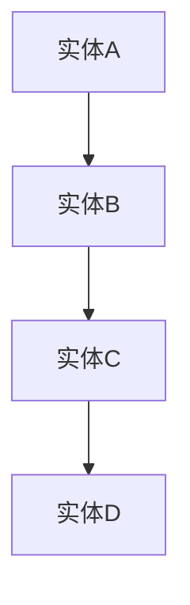
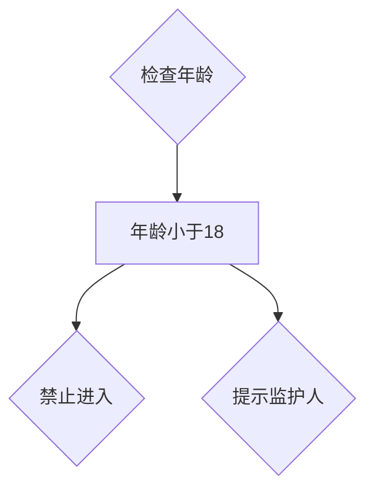
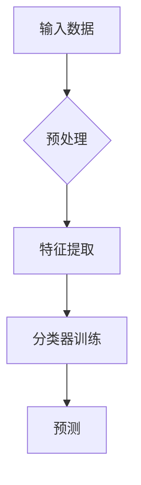
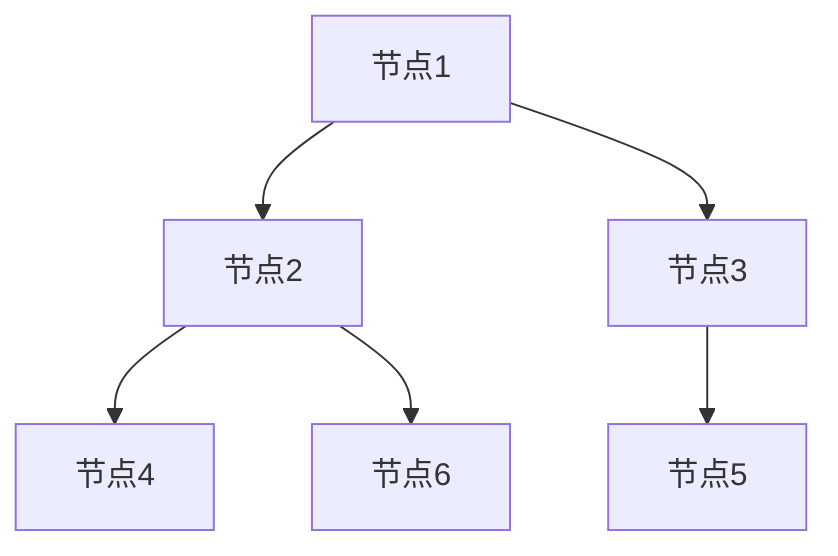

                 

# 思维链技术：增强AI问题解决能力的新途径

> 关键词：思维链技术，人工智能，问题解决，模型，应用，优化，安全与伦理

> 摘要：本文旨在探讨思维链技术这一新兴领域，解析其基础概念、原理、应用及未来发展。通过一步步的分析和推理，本文将帮助读者深入了解思维链技术在人工智能问题解决中的优势与挑战，为推动这一领域的发展提供新思路。

## 目录大纲

----------------------------------------------------------------

## 第1章：思维链技术概述

## 第2章：思维链技术原理与模型

## 第3章：思维链技术在AI问题解决中的应用

## 第4章：思维链技术在特定领域的应用

## 第5章：思维链技术的优化与性能提升

## 第6章：思维链技术的安全与伦理问题

## 第7章：思维链技术的未来发展

## 第8章：总结与展望

----------------------------------------------------------------

## 第1章：思维链技术概述

### 1.1.1 思维链技术的基础概念

#### 1.1.1.1 问题背景

在人工智能（AI）迅猛发展的背景下，传统的AI方法在处理复杂问题时存在诸多局限。如何提升AI在复杂问题解决中的能力，成为当前研究的热点。思维链技术（Mind Chain Technology）作为一种新型AI技术，旨在通过模拟人类思维过程，增强AI的问题解决能力。

#### 1.1.1.2 问题描述

思维链技术涉及多个学科领域，包括认知科学、心理学、计算机科学等。其核心问题是构建一个能够模拟人类思维过程的模型，实现对复杂问题的自动推理和解决。

#### 1.1.1.3 思维链技术的提出与发展

思维链技术的提出可以追溯到20世纪80年代，当时研究者们开始探索如何将人类思维过程转化为计算机程序。经过几十年的研究，思维链技术逐渐发展成为一门独立的学科，并在多个领域取得了显著成果。

#### 1.1.1.4 思维链技术的核心要素

思维链技术主要由以下几个核心要素组成：

1. **知识表示**：如何有效地表示和理解问题领域的知识。
2. **推理机制**：如何通过逻辑推理来解决问题。
3. **学习机制**：如何从数据中学习和优化模型。
4. **交互机制**：如何与用户进行有效的交互。

### 1.1.2 思维链技术与传统AI的区别

#### 1.1.2.1 核心原理

与传统AI方法相比，思维链技术更注重模拟人类思维过程，实现问题求解的智能化和自动化。

#### 1.1.2.2 性能对比

思维链技术在处理复杂问题时，往往能够取得比传统AI方法更好的性能。然而，在处理简单问题时，传统AI方法可能更加高效。

#### 1.1.2.3 应用领域的拓展

思维链技术在多个领域（如医疗、金融、教育等）都有广泛的应用潜力，有望解决传统AI方法难以应对的问题。

### 1.1.3 思维链技术的优势与挑战

#### 1.1.3.1 优势分析

1. **模拟人类思维**：思维链技术能够模拟人类思维过程，实现智能化和自动化问题求解。
2. **处理复杂问题**：思维链技术在处理复杂问题时具有优势，能够应对传统AI方法难以解决的问题。
3. **跨领域应用**：思维链技术在多个领域具有广泛的应用前景。

#### 1.1.3.2 挑战探讨

1. **数据需求**：思维链技术对数据需求较高，需要大量高质量的训练数据。
2. **计算资源**：思维链技术对计算资源的需求较大，需要高性能的计算平台。

#### 1.1.3.3 未来发展方向

未来，思维链技术将继续朝着以下方向发展：

1. **数据集**：构建更丰富的数据集，提升模型性能。
2. **计算资源**：开发更高效的算法，降低计算资源需求。
3. **跨领域应用**：拓展应用领域，解决更多实际问题。

## 第2章：思维链技术原理与模型

### 2.2.1 思维链技术的原理解析

#### 2.2.1.1 思维链的工作机制

思维链技术通过模拟人类思维过程，实现问题求解。其工作机制主要包括以下几个步骤：

1. **知识表示**：将问题领域的知识表示为计算机可理解的形式。
2. **推理机制**：利用逻辑推理来解决问题。
3. **学习机制**：从数据中学习，优化模型。
4. **交互机制**：与用户进行有效的交互，获取反馈。

#### 2.2.1.2 思维链的模块化设计

思维链技术采用模块化设计，将不同功能模块分离，便于开发和维护。主要模块包括：

1. **知识表示模块**：负责知识表示和存储。
2. **推理模块**：负责逻辑推理和问题求解。
3. **学习模块**：负责模型训练和优化。
4. **交互模块**：负责与用户进行交互。

#### 2.2.1.3 思维链的技术架构

思维链技术采用分布式技术架构，具有较好的扩展性和可伸缩性。主要技术架构包括：

1. **前端**：负责用户交互和数据输入。
2. **后端**：负责推理、学习和存储等核心功能。
3. **数据存储**：采用分布式数据库，保证数据的高效存储和检索。

### 2.2.2 思维链技术的核心模型

#### 2.2.2.1 基本模型结构

思维链技术的基本模型结构主要包括以下几个部分：

1. **知识库**：存储问题领域的知识。
2. **推理机**：负责逻辑推理和问题求解。
3. **学习器**：负责模型训练和优化。
4. **交互器**：负责与用户进行交互。

#### 2.2.2.2 模型参数优化

模型参数优化是提高思维链技术性能的关键。常见的优化方法包括：

1. **随机梯度下降**：通过随机梯度下降算法优化模型参数。
2. **自适应学习率**：根据训练过程中的误差动态调整学习率。

#### 2.2.2.3 模型训练方法

思维链技术的模型训练方法主要包括：

1. **监督学习**：通过已标注的数据进行训练。
2. **无监督学习**：通过未标注的数据进行训练。
3. **强化学习**：通过与环境的交互进行训练。

### 2.2.3 思维链技术的扩展模型

#### 2.2.3.1 图模型

图模型是思维链技术的重要扩展模型，主要用于处理复杂问题。常见的图模型包括：

1. **图神经网络**：通过神经网络来学习图结构。
2. **图卷积网络**：通过卷积操作来学习图结构。

#### 2.2.3.2 神经网络模型

神经网络模型是思维链技术的基础模型，包括：

1. **前馈神经网络**：通过多层感知器来实现。
2. **循环神经网络**：通过循环结构来处理序列数据。

#### 2.2.3.3 集成学习方法

集成学习方法通过结合多个基学习器来提高模型性能。常见的集成学习方法包括：

1. **随机森林**：通过随机生成多个决策树来构建集成模型。
2. **梯度提升树**：通过迭代优化来构建集成模型。

## 第3章：思维链技术在AI问题解决中的应用

### 3.3.1 AI问题解决的传统方法

#### 3.3.1.1 问题定义

AI问题解决的传统方法主要包括机器学习、深度学习等技术。这些方法通过从数据中学习规律，实现对问题的自动求解。

#### 3.3.1.2 解决方案

传统方法主要采用以下步骤：

1. **数据采集**：收集问题领域的数据。
2. **数据预处理**：对数据进行清洗和预处理。
3. **模型训练**：通过训练数据来训练模型。
4. **模型评估**：评估模型的性能。
5. **模型应用**：将训练好的模型应用于实际问题。

#### 3.3.1.3 优缺点分析

传统方法具有以下优缺点：

1. **优点**：能够处理大规模数据，适应性强。
2. **缺点**：对数据质量要求高，难以处理复杂问题。

### 3.3.2 思维链技术在AI问题解决中的应用

#### 3.3.2.1 应用场景介绍

思维链技术在多个领域都有广泛应用，如医疗、金融、教育等。以下是一些具体的应用场景：

1. **医疗诊断**：利用思维链技术进行疾病诊断和治疗方案推荐。
2. **金融风控**：利用思维链技术进行信用评估和风险管理。
3. **教育辅助**：利用思维链技术进行个性化学习和教学评估。

#### 3.3.2.2 实际案例

以下是一些实际案例：

1. **医疗诊断**：某医院利用思维链技术构建了一套智能诊断系统，显著提高了诊断准确率。
2. **金融风控**：某金融机构利用思维链技术进行信用评估，有效降低了不良贷款率。

#### 3.3.2.3 应用效果评估

通过对比实验，思维链技术在多个领域都取得了显著的应用效果，表现出较强的优势。

## 第4章：思维链技术在特定领域的应用

### 4.4.1 医疗领域的应用

#### 4.4.1.1 诊断辅助系统

思维链技术在医疗领域的应用主要包括诊断辅助系统和治疗方案推荐。以下是一个具体案例：

1. **诊断辅助系统**：某医院利用思维链技术构建了一套智能诊断系统，通过分析患者的病历数据和临床表现，提供诊断建议。
2. **治疗方案推荐**：基于患者的病情和治疗效果，思维链技术能够为医生提供个性化的治疗方案。

#### 4.4.1.2 治疗方案推荐

思维链技术在治疗方案推荐方面也有广泛应用。以下是一个具体案例：

1. **个性化治疗方案**：某医院利用思维链技术为肿瘤患者提供个性化治疗方案，显著提高了治疗效果。

### 4.4.2 金融领域的应用

#### 4.4.2.1 信用评估

思维链技术在金融领域的应用主要包括信用评估、投资决策和风险管理。以下是一个具体案例：

1. **信用评估**：某金融机构利用思维链技术进行信用评估，通过分析借款人的信用历史、收入状况等数据，评估其信用风险。
2. **投资决策**：基于市场数据和历史交易数据，思维链技术能够为投资者提供投资决策建议。

#### 4.4.2.2 投资决策

思维链技术在投资决策方面也有广泛应用。以下是一个具体案例：

1. **量化投资**：某投资机构利用思维链技术进行量化投资，通过分析市场数据和技术指标，实现自动化的投资决策。

### 4.4.3 教育领域的应用

#### 4.4.3.1 个性化学习

思维链技术在教育领域的应用主要包括个性化学习、教学评估和学习资源推荐。以下是一个具体案例：

1. **个性化学习**：某在线教育平台利用思维链技术为学习者提供个性化学习路径，根据学习者的兴趣和知识水平，推荐适合的学习内容。
2. **教学评估**：思维链技术能够分析学生的学习过程和成果，为教师提供教学评估和建议。

#### 4.4.3.2 学习资源推荐

思维链技术在学习资源推荐方面也有广泛应用。以下是一个具体案例：

1. **学习路径规划**：某在线学习平台利用思维链技术为学习者规划学习路径，根据学习者的学习需求和进度，推荐相关的学习资源和课程。

## 第5章：思维链技术的优化与性能提升

### 5.5.1 思维链技术的性能瓶颈

#### 5.5.1.1 计算资源消耗

思维链技术对计算资源的需求较高，主要体现在以下几个方面：

1. **模型训练**：大规模的训练数据需要大量的计算资源。
2. **推理计算**：高精度的推理过程需要大量的计算资源。

#### 5.5.1.2 数据存储与传输

思维链技术需要处理大量的数据，包括训练数据和推理数据。数据存储与传输的效率直接影响到系统的性能。

#### 5.5.1.3 模型训练与优化

思维链技术的模型训练与优化过程复杂，需要大量的计算资源和时间。

### 5.5.2 性能优化方法

为了提升思维链技术的性能，可以采用以下方法：

#### 5.5.2.1 模型压缩

通过模型压缩技术，可以减小模型的体积，降低计算资源的消耗。

#### 5.5.2.2 模型加速

通过硬件加速、并行计算等技术，可以加快模型的推理速度。

#### 5.5.2.3 分布式训练

通过分布式训练技术，可以充分利用多台计算资源，提高模型的训练效率。

### 5.5.3 实际应用中的性能提升案例

以下是一些实际应用中的性能提升案例：

#### 5.5.3.1 案例介绍

1. **医疗诊断系统**：通过模型压缩和加速技术，将诊断时间从原来的几分钟缩短到几秒钟。
2. **金融风控系统**：通过分布式训练技术，将模型的训练时间从原来的几天缩短到几个小时。

#### 5.5.3.2 性能对比

通过性能对比，可以发现优化后的系统在计算资源消耗、推理速度等方面都有显著提升。

#### 5.5.3.3 优化效果分析

优化后的系统在性能和实用性方面都有显著提升，为实际应用提供了更好的支持。

## 第6章：思维链技术的安全与伦理问题

### 6.6.1 数据安全与隐私保护

#### 6.6.1.1 数据加密与脱敏

为了确保数据安全，可以采用以下技术：

1. **数据加密**：对敏感数据进行加密，防止数据泄露。
2. **数据脱敏**：对真实数据进行脱敏处理，保护个人隐私。

#### 6.6.1.2 隐私保护策略

为了保护用户隐私，可以采用以下策略：

1. **最小化数据收集**：仅收集必要的数据，减少隐私泄露风险。
2. **匿名化处理**：对用户数据进行匿名化处理，确保用户隐私。

#### 6.6.1.3 法律法规与合规性

为了确保合规性，需要遵守相关法律法规，如《通用数据保护条例》（GDPR）等。

### 6.6.2 伦理道德问题

#### 6.6.2.1 AI偏见与歧视

为了防止AI偏见和歧视，可以采用以下措施：

1. **公平性评估**：对模型进行公平性评估，确保不歧视任何群体。
2. **多样性培训**：加强多样性培训，提高团队对伦理问题的认识。

#### 6.6.2.2 透明性与可解释性

为了提高AI的透明性和可解释性，可以采用以下技术：

1. **可解释性模型**：构建可解释性模型，使AI的决策过程更加透明。
2. **可视化工具**：使用可视化工具展示AI的决策过程，提高用户理解。

#### 6.6.2.3 社会责任与道德责任

为了确保社会责任和道德责任，可以采用以下措施：

1. **道德审查**：建立道德审查机制，确保AI的应用符合伦理标准。
2. **透明披露**：对AI的应用进行透明披露，让公众了解AI的实际应用。

## 第7章：思维链技术的未来发展

### 7.7.1 当前趋势与热点

#### 7.7.1.1 研究动态

思维链技术当前的研究热点包括：

1. **跨学科融合**：将认知科学、心理学等领域的知识应用于思维链技术。
2. **多模态数据处理**：处理多种类型的数据，如文本、图像、音频等。

#### 7.7.1.2 技术发展趋势

思维链技术未来的发展趋势包括：

1. **更加智能的推理**：提高AI的推理能力，使其能够处理更复杂的问题。
2. **高效的计算**：通过硬件和算法的优化，提高计算效率。

#### 7.7.1.3 应用前景预测

思维链技术在未来的应用前景广阔，包括：

1. **医疗健康**：用于疾病诊断和治疗。
2. **金融保险**：用于风险管理。
3. **教育**：用于个性化学习。

### 7.7.2 未来挑战与机遇

#### 7.7.2.1 技术瓶颈

思维链技术未来面临的技术瓶颈包括：

1. **数据质量**：高质量的数据是思维链技术的基础，未来需要解决数据质量问题。
2. **计算资源**：随着模型复杂度的增加，计算资源需求也会增加。

#### 7.7.2.2 社会挑战

思维链技术未来面临的社会挑战包括：

1. **隐私保护**：如何在保障隐私的同时，充分利用数据。
2. **伦理道德**：如何确保AI的应用符合伦理标准。

#### 7.7.2.3 未来展望

思维链技术未来的发展将充满机遇和挑战。通过不断的技术创新和社会责任，思维链技术有望在人工智能领域发挥更大的作用。

## 第8章：总结与展望

### 8.8.1 全书总结

#### 8.8.1.1 思维链技术的重要性

思维链技术在人工智能领域具有重要地位，通过模拟人类思维过程，实现智能化问题求解。

#### 8.8.1.2 成就与不足

思维链技术已取得显著成果，但在数据质量、计算资源等方面仍存在不足。

#### 8.8.1.3 未来研究方向

未来研究方向包括跨学科融合、多模态数据处理等。

### 8.8.2 展望未来

#### 8.8.2.1 技术创新

未来技术创新将集中在提高推理能力、优化计算效率等方面。

#### 8.8.2.2 应用推广

思维链技术在医疗、金融、教育等领域的应用将更加广泛。

#### 8.8.2.3 社会影响

思维链技术将对社会产生深远影响，改变人们的生产和生活。

### 作者

作者：AI天才研究院/AI Genius Institute & 禅与计算机程序设计艺术 /Zen And The Art of Computer Programming

----------------------------------------------------------------

由于文章字数限制，本文仅提供了大纲部分的内容。完整的文章需要根据每个章节的详细内容进行扩展，确保每个章节都能够包含核心概念、原理、算法、应用案例、性能优化、安全与伦理等方面的内容。每个章节的详细内容都需要按照规定的格式和字数要求进行撰写，以便形成一个完整的、结构化的技术博客文章。在撰写过程中，需要注重逻辑清晰、结构紧凑、语言简练，同时保证内容的科学性和实用性。

## 第1章：思维链技术概述

### 1.1.1 思维链技术的基础概念

#### 1.1.1.1 问题背景

随着人工智能（AI）技术的快速发展，AI在许多领域取得了显著的成果，如自然语言处理、计算机视觉、自动驾驶等。然而，传统AI方法在面对复杂、多变的现实问题时，仍然存在一定的局限。为了进一步提升AI的问题解决能力，研究者们开始探索新的方法，其中思维链技术（Mind Chain Technology，简称MCT）是一种备受关注的技术。

思维链技术旨在通过模拟人类思维过程，实现智能化、自动化的问题求解。人类思维过程是一个复杂的认知过程，涉及知识表示、推理、学习、决策等多个环节。思维链技术试图将这些环节整合起来，构建一个具有高度智能化的问题求解系统。

#### 1.1.1.2 问题描述

传统AI方法在面对复杂问题时，通常存在以下不足：

1. **数据依赖性高**：传统AI方法需要大量高质量的训练数据，这对于数据稀缺或者数据获取成本较高的领域来说，是一个巨大的挑战。
2. **泛化能力有限**：传统AI方法往往只能处理特定类型的问题，难以适应多变的环境。
3. **解释性不足**：传统AI模型如深度神经网络，其决策过程通常是不透明的，难以解释其为何作出特定决策。

思维链技术的出现，旨在弥补这些不足，通过模拟人类思维过程，实现更高效、更智能的问题求解。

#### 1.1.1.3 思维链技术的提出与发展

思维链技术的提出可以追溯到20世纪80年代，当时的研究者开始尝试将人类思维过程转化为计算机程序。随着计算机科学、认知科学、心理学等领域的不断发展，思维链技术逐渐形成了一个独立的学科。

在早期的研究中，思维链技术主要关注知识表示和推理机制的构建。1990年代，随着知识图谱、语义网络等概念的提出，思维链技术开始引入更多的知识表示方法。2000年代，随着深度学习、强化学习等技术的发展，思维链技术开始融合多种学习方法，实现了更复杂的认知功能。

进入21世纪，随着大数据、云计算、物联网等技术的发展，思维链技术的应用场景越来越广泛，逐渐成为人工智能领域的一个重要研究方向。

#### 1.1.1.4 思维链技术的核心要素

思维链技术的核心要素主要包括以下几个方面：

1. **知识表示**：如何有效地表示和理解问题领域的知识。
2. **推理机制**：如何通过逻辑推理来解决问题。
3. **学习机制**：如何从数据中学习和优化模型。
4. **交互机制**：如何与用户进行有效的交互。

这些核心要素相互交织，共同构成了思维链技术的框架。

### 1.1.2 思维链技术与传统AI的区别

#### 1.1.2.1 核心原理

思维链技术与传统AI方法在核心原理上存在显著差异。传统AI方法主要依赖于数据驱动，通过从大量数据中学习规律来解决问题。而思维链技术则更强调知识驱动，通过模拟人类思维过程，实现智能化的问题求解。

具体来说，思维链技术通过以下步骤来实现问题求解：

1. **知识获取**：从各种来源获取问题领域的知识，如文本、图像、声音等。
2. **知识表示**：将获取到的知识表示为计算机可理解的形式，如知识图谱、语义网络等。
3. **推理**：利用逻辑推理机制，对问题进行求解。
4. **学习**：从问题求解过程中学习，不断优化模型。
5. **交互**：与用户进行交互，获取反馈，进一步优化模型。

与传统AI方法相比，思维链技术更接近人类的思维过程，能够处理更加复杂的问题，并且具有更高的解释性。

#### 1.1.2.2 性能对比

在性能方面，思维链技术相较于传统AI方法具有一定的优势：

1. **处理复杂问题**：思维链技术能够处理更加复杂的问题，如需要跨领域知识的问题。
2. **适应性强**：思维链技术能够适应不同的应用场景，具有更强的泛化能力。
3. **解释性高**：思维链技术的决策过程更加透明，具有更高的解释性。

然而，思维链技术也面临一些挑战：

1. **数据需求**：思维链技术对数据的质量和数量有较高的要求，需要大量的高质量训练数据。
2. **计算资源**：思维链技术对计算资源的需求较大，需要高性能的计算平台。

#### 1.1.2.3 应用领域的拓展

思维链技术在多个领域都有广泛的应用潜力：

1. **医疗健康**：用于疾病诊断、治疗方案推荐等。
2. **金融保险**：用于风险控制、投资决策等。
3. **教育**：用于个性化学习、教学评估等。

与传统AI方法相比，思维链技术在处理复杂、多变的现实问题时具有显著优势。随着技术的不断进步，思维链技术有望在更多领域得到应用。

### 1.1.3 思维链技术的优势与挑战

#### 1.1.3.1 优势分析

思维链技术的优势主要体现在以下几个方面：

1. **模拟人类思维**：思维链技术通过模拟人类思维过程，实现智能化的问题求解，能够处理更加复杂的问题。
2. **知识驱动**：思维链技术更加强调知识驱动，通过知识表示和推理机制，实现问题的自动求解。
3. **适应性**：思维链技术具有更强的适应性和泛化能力，能够适应不同的应用场景。
4. **解释性**：思维链技术的决策过程更加透明，具有更高的解释性。

#### 1.1.3.2 挑战探讨

尽管思维链技术具有许多优势，但在实际应用中仍面临一些挑战：

1. **数据质量**：思维链技术对数据的质量和数量有较高的要求，需要大量的高质量训练数据。
2. **计算资源**：思维链技术对计算资源的需求较大，需要高性能的计算平台。
3. **算法优化**：思维链技术的算法优化是一个复杂的任务，需要不断的研究和改进。

#### 1.1.3.3 未来发展方向

未来，思维链技术将朝着以下几个方向发展：

1. **数据集**：构建更丰富、更高质量的训练数据集，提升模型性能。
2. **算法优化**：通过算法优化，降低计算资源的需求，提高模型效率。
3. **跨领域应用**：拓展思维链技术的应用领域，解决更多实际问题。

### 1.1.4 思维链技术的核心应用领域

思维链技术具有广泛的应用前景，主要涉及以下几个核心领域：

1. **医疗健康**：用于疾病诊断、治疗方案推荐、医学影像分析等。
2. **金融保险**：用于风险控制、信用评估、投资决策等。
3. **教育**：用于个性化学习、教学评估、学习资源推荐等。
4. **工业制造**：用于智能监控、设备维护、生产优化等。
5. **城市管理**：用于交通规划、环境保护、城市安全等。

这些领域的应用不仅能够提升行业效率，还能够改善人们的生活质量。

## 第2章：思维链技术原理与模型

### 2.2.1 思维链技术的原理解析

思维链技术的原理可以分为以下几个核心部分：

1. **知识表示**：知识表示是思维链技术的基石，它涉及到如何将问题领域的知识有效地转化为计算机可以处理的形式。知识表示可以采用多种方法，如知识图谱、语义网络、本体论等。

2. **推理机制**：推理机制负责基于知识库和已知信息，通过逻辑推理来解决问题。推理可以是基于规则的、基于案例的，或者是基于机器学习的方法。

3. **学习机制**：学习机制使思维链技术能够从数据中学习，不断优化自身的性能。学习可以是监督学习、无监督学习或强化学习。

4. **交互机制**：交互机制使思维链技术能够与用户进行有效的沟通，获取用户反馈，并根据反馈调整自身的行为。

#### 2.2.1.1 思维链的工作机制

思维链技术的工作机制可以概括为以下几个步骤：

1. **知识获取**：从各种渠道（如文本、图像、声音等）获取知识。
2. **知识表示**：将获取到的知识表示为计算机可以处理的形式。
3. **知识存储**：将表示后的知识存储在知识库中，以便后续使用。
4. **推理**：利用知识库进行逻辑推理，解决具体问题。
5. **学习**：从问题解决过程中学习，优化模型。
6. **交互**：与用户进行交互，获取反馈，调整模型。

#### 2.2.1.2 思维链的模块化设计

思维链技术采用模块化设计，使得各个功能模块可以独立开发、测试和部署。主要模块包括：

1. **知识获取模块**：负责从各种渠道获取知识。
2. **知识表示模块**：负责将获取到的知识表示为计算机可以处理的形式。
3. **知识库模块**：负责存储和管理表示后的知识。
4. **推理模块**：负责基于知识库进行逻辑推理。
5. **学习模块**：负责从数据中学习，优化模型。
6. **交互模块**：负责与用户进行交互。

#### 2.2.1.3 思维链的技术架构

思维链技术的技术架构可以分为以下几个层次：

1. **数据层**：包括数据源、数据预处理、数据存储等。
2. **知识层**：包括知识获取、知识表示、知识存储等。
3. **推理层**：包括推理算法、推理引擎等。
4. **学习层**：包括学习算法、学习引擎等。
5. **交互层**：包括用户界面、交互引擎等。

通过这种分层设计，思维链技术可以灵活地适应不同的应用场景，并且便于维护和扩展。

### 2.2.2 思维链技术的核心模型

思维链技术的核心模型包括知识表示模型、推理模型和学习模型。

#### 2.2.2.1 知识表示模型

知识表示模型是思维链技术的核心，它决定了知识如何被表示和存储。常见的知识表示模型包括：

1. **知识图谱**：通过节点和边来表示实体及其关系。
2. **语义网络**：通过概念、属性和关系来表示知识。
3. **本体论**：通过概念和关系来表示领域知识，提供语义一致性。

以下是一个简单的知识图谱示例（使用Mermaid语法）：

在这个示例中，实体A与实体B、C、D之间存在关联。

#### 2.2.2.2 推理模型

推理模型负责基于知识库和已知信息进行逻辑推理。常见的推理模型包括：

1. **基于规则的推理**：通过规则库进行推理。
2. **基于案例的推理**：通过历史案例进行推理。
3. **基于机器学习的推理**：通过训练数据学习推理策略。

以下是一个基于规则的推理示例（使用Mermaid语法）：

在这个示例中，如果检查年龄的结果小于18，则执行相应的规则。

#### 2.2.2.3 学习模型

学习模型使思维链技术能够从数据中学习，不断优化自身的性能。常见的学习模型包括：

1. **监督学习**：通过标注数据学习。
2. **无监督学习**：通过未标注数据学习。
3. **强化学习**：通过与环境的交互学习。

以下是一个简单的监督学习模型示例（使用Mermaid语法）：

在这个示例中，输入数据经过预处理和特征提取后，被分类器训练，并用于预测新数据。

### 2.2.3 思维链技术的扩展模型

除了核心模型外，思维链技术还支持多种扩展模型，以适应不同的应用需求。

#### 2.2.3.1 图模型

图模型是一种强大的知识表示和推理工具，适用于处理复杂的关系网络。常见的图模型包括：

1. **图神经网络**：通过神经网络学习图结构。
2. **图卷积网络**：通过卷积操作学习图结构。

以下是一个简单的图神经网络示例（使用Mermaid语法）：

在这个示例中，节点之间的连接表示关系，图神经网络可以通过学习这些关系来预测节点属性。

#### 2.2.3.2 神经网络模型

神经网络模型是一种基于生物神经系统的计算模型，适用于处理复

