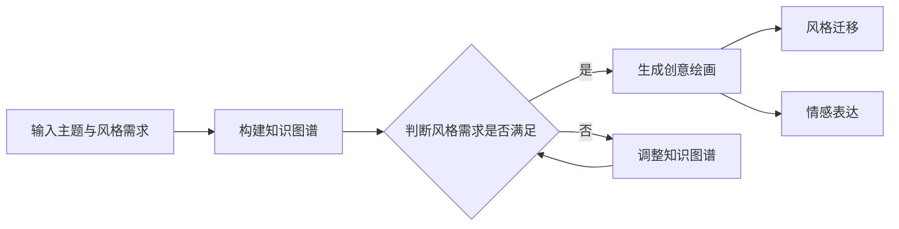
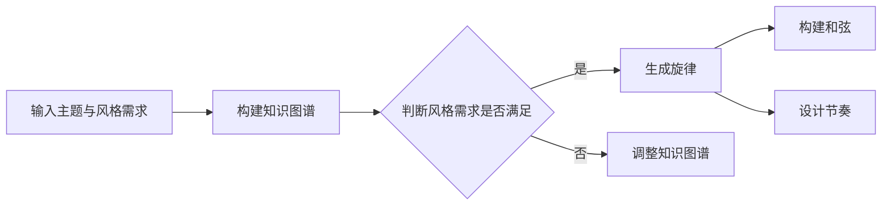
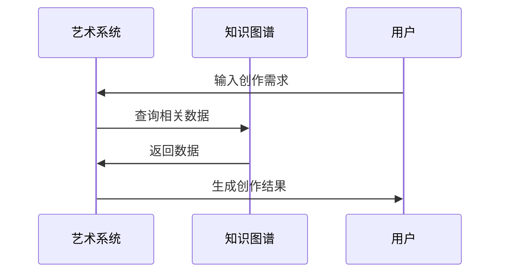
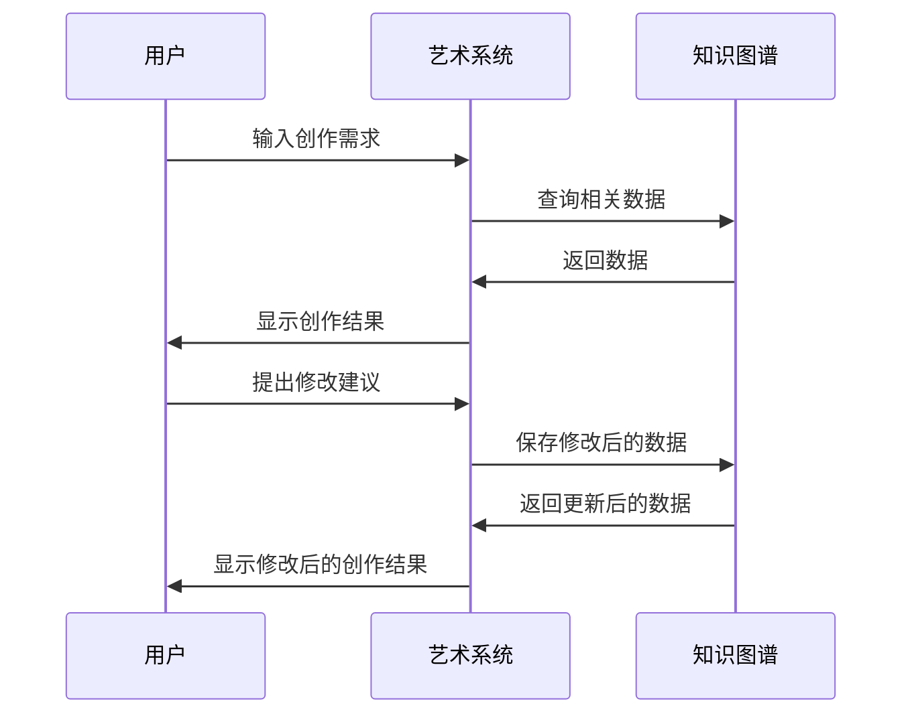

                 

### 引言

#### 研究背景与意义

在数字时代，人工智能（AI）技术已经成为推动社会进步的重要力量。随着计算能力的提升和大数据的广泛应用，AI技术正在各行各业中取得显著成果。特别是AI在艺术创作领域的应用，正逐步改变传统艺术的创作模式，推动艺术创新与产业升级。然而，当前的AI艺术创作仍然面临诸多挑战，如创意生成的不确定性、艺术作品的个性化和情感表达等问题。这些问题不仅限制了AI在艺术领域的进一步应用，也制约了AI技术的发展。

思维链（Mind Chain）方法作为一种新兴的人工智能方法，具有强大的推理和创新能力。思维链方法的核心在于通过构建一个知识链，将不同领域、不同层次的知识进行有机整合，从而实现复杂问题的求解。这一方法在解决传统AI艺术创作中的难题方面展现出极大的潜力。例如，思维链方法可以用于提高艺术作品的创意生成能力，增强作品的个性化和情感表达。

本文旨在探讨思维链方法在AI艺术创作中的应用，通过系统的分析和实践，为AI艺术创作提供新的思路和方法。研究内容主要包括：思维链方法的基本概念与原理、在AI艺术创作中的应用原理、具体应用案例分析、数学模型与公式解析、系统架构设计、项目实战等。通过这些内容的深入探讨，本文希望为相关领域的研究者提供参考，推动AI艺术创作的进一步发展。

#### 研究内容与目标

本文的研究内容主要分为以下几个部分：

1. **相关技术介绍**：首先介绍AI艺术创作的背景与现状，以及思维链方法的基本概念和原理。这部分将重点介绍深度学习与神经网络的基础知识，以及图像生成与处理技术的应用。

2. **思维链方法在AI艺术创作中的应用原理**：详细分析思维链方法的工作机制，探讨其核心概念与联系。通过ER实体关系图架构，进一步阐述思维链方法在艺术创作中的应用原理。

3. **具体应用案例分析**：选取具有代表性的艺术创作领域，通过具体的案例分析，展示思维链方法的实际应用效果。包括绘画创作和音乐创作两个案例，每个案例都将详细介绍算法原理、流程图和Python源代码。

4. **数学模型与数学公式**：深入探讨思维链方法算法原理的数学模型，包括数学模型的构成、公式讲解和举例说明。

5. **系统分析与架构设计方案**：介绍问题场景和系统功能设计，绘制领域模型mermaid类图和系统架构mermaid架构图，详细说明系统接口设计和系统交互。

6. **项目实战**：通过实际案例，介绍环境安装、系统核心实现源代码，并进行代码应用解读与分析、实际案例分析和详细讲解剖析。

7. **最佳实践与拓展阅读**：总结最佳实践建议，对全文进行小结，提出注意事项，并提供相关领域的拓展阅读资源。

研究目标是通过系统的研究和分析，探索思维链方法在AI艺术创作中的应用潜力，为相关领域提供理论指导和实践参考，推动AI艺术创作的技术创新和发展。

#### 研究方法与数据来源

本文采用多种研究方法来深入探讨思维链方法在AI艺术创作中的应用。首先，通过文献综述的方式，系统梳理相关领域的理论基础和技术现状。这一步骤不仅为后续研究提供了理论支持，也为验证思维链方法的可行性奠定了基础。

其次，本文采用实验研究的方法，通过具体的案例分析来验证思维链方法在艺术创作中的实际应用效果。为了确保实验数据的可靠性，本文选择了绘画创作和音乐创作两个具有代表性的领域，进行详细的数据收集和实验分析。具体的数据来源包括公开的艺术作品库、AI算法实现的代码和数据集等。

此外，本文还采用了定性和定量相结合的研究方法。在定性分析方面，通过专家访谈和问卷调查，收集相关领域的专业意见和建议，以丰富研究内容；在定量分析方面，通过实验数据和结果的分析，验证思维链方法的有效性和适用性。

总体而言，本文的研究方法综合了文献综述、实验研究、专家访谈和数据分析等多种手段，以确保研究的全面性和科学性。通过这些方法，本文力求为思维链方法在AI艺术创作中的应用提供系统的理论依据和实践指导。

#### 论文结构安排

本文的结构安排如下：

- **第1章 引言**：介绍研究背景、意义、研究内容与目标、研究方法与数据来源、论文结构安排。

- **第2章 相关技术介绍**：介绍AI艺术创作的背景与现状，思维链方法的基本概念，深度学习与神经网络基础，图像生成与处理技术。

- **第3章 思维链方法在AI艺术创作中的应用原理**：分析思维链方法的工作机制，核心概念与联系，以及ER实体关系图架构。

- **第4章 具体应用案例分析**：通过绘画创作和音乐创作两个案例，详细讲解思维链方法的原理、流程图和Python源代码。

- **第5章 数学模型与数学公式**：阐述算法原理的数学模型，包括数学模型的构成、公式讲解和举例说明。

- **第6章 系统分析与架构设计方案**：介绍问题场景、系统功能设计、系统架构设计、系统接口设计和系统交互。

- **第7章 项目实战**：包括环境安装、系统核心实现源代码、代码应用解读与分析、实际案例分析和详细讲解剖析。

- **第8章 最佳实践与拓展阅读**：总结最佳实践、项目小结、注意事项和拓展阅读资源。

通过以上章节的安排，本文系统地探讨了思维链方法在AI艺术创作中的应用，旨在为相关领域的研究者和实践者提供有价值的参考和指导。

### 相关技术介绍

#### AI艺术创作的背景与现状

人工智能（AI）技术在艺术创作领域的应用正在逐步深入，这是一个融合科技与艺术的新兴领域。AI艺术创作的背景可以追溯到20世纪50年代，当时计算机科学刚刚起步，早期的人工智能研究已经开始探索如何通过计算机模拟人类思维和创造过程。随着计算能力的提升和算法的进步，AI在艺术创作中的应用越来越广泛，不仅涵盖了绘画、音乐等传统艺术形式，还延伸到了设计、电影、游戏等多个领域。

当前，AI艺术创作呈现出以下几个显著特点：

1. **创意生成能力提升**：AI可以通过深度学习算法，从大量的数据中提取模式和特征，从而生成具有创意的艺术作品。例如，生成对抗网络（GAN）可以生成逼真的图像和音乐，突破了传统创作的局限性。

2. **个性化与多样化**：AI可以根据用户的需求和偏好，定制个性化的艺术作品。这不仅提高了用户的满意度，也为艺术家提供了新的创作方式。

3. **情感表达增强**：通过情感计算和自然语言处理技术，AI能够捕捉和模拟人类情感，使得艺术作品更具表现力和感染力。

4. **跨领域融合**：AI艺术创作不再局限于单一领域，而是与设计、工程、心理学等多个学科交叉融合，形成了一种新的跨学科研究模式。

然而，AI艺术创作也面临一些挑战，如创意的独创性、艺术价值的判断、人机协作的优化等。这些问题不仅限制了AI在艺术领域的进一步应用，也为研究者提出了新的研究课题。

#### 思维链方法的基本概念

思维链方法是一种基于知识图谱和深度学习的人工智能方法，通过构建一个知识链，将不同领域、不同层次的知识进行有机整合，实现复杂问题的求解。思维链方法的核心思想是将人类思维过程转化为可计算的形式，从而提高问题的解决效率和准确性。

思维链方法的基本概念包括以下几个关键部分：

1. **知识图谱**：知识图谱是思维链方法的基础，它通过实体、属性和关系的表示，将海量知识进行结构化存储和检索。知识图谱不仅能够存储显式知识，还可以通过推理机制提取隐式知识。

2. **知识链**：知识链是思维链方法的核心理念，它通过在知识图谱中建立连接，将不同领域、不同层次的知识进行整合。知识链的形成依赖于知识的交叉引用和推理过程，从而实现知识的递进和扩展。

3. **深度学习**：深度学习是思维链方法的技术实现手段，通过构建多层神经网络，实现对复杂数据的特征提取和模式识别。深度学习与知识图谱的结合，使得思维链方法在处理大规模数据和复杂任务时具有强大的能力。

4. **推理机制**：推理机制是思维链方法的核心，通过逻辑推理和关联分析，实现对知识的深度理解和应用。推理机制不仅包括基于规则的推理，还包括基于数据的机器学习和基于模型的优化。

思维链方法在AI艺术创作中的应用，主要体现在以下几个方面：

1. **创意生成**：思维链方法可以根据艺术家的需求和风格偏好，生成具有创新性的艺术作品。通过分析大量的艺术作品和风格特征，思维链方法可以模仿并创新艺术表达方式。

2. **个性化定制**：思维链方法可以根据用户的个性化需求，生成独特的艺术作品。例如，用户可以指定作品的风格、主题、情感等，思维链方法将根据这些需求生成定制化的艺术作品。

3. **情感表达**：思维链方法可以通过情感计算和自然语言处理技术，理解并模拟人类的情感，增强艺术作品的表现力和感染力。

4. **跨领域融合**：思维链方法可以将不同领域的知识进行整合，促进艺术创作与其他学科的交叉融合，从而创造出新的艺术形式和表达方式。

#### 深度学习与神经网络基础

深度学习是AI领域的重要分支，其核心思想是通过构建多层神经网络，对数据进行自动特征提取和模式识别。神经网络是一种模仿生物神经网络结构的人工智能方法，通过神经元之间的相互连接和信号传递，实现对输入数据的处理和输出。

深度学习的关键组成部分包括：

1. **神经元**：神经元是神经网络的基本单元，它通过激活函数对输入信号进行处理，生成输出信号。常见的激活函数包括 sigmoid、ReLU 和 tanh 等。

2. **层次结构**：神经网络由多个层次组成，每一层都对输入数据进行处理，并通过权重和偏置进行调整。层次结构使得神经网络能够对输入数据进行逐层抽象和提取特征。

3. **损失函数**：损失函数是评价神经网络性能的重要指标，它通过计算预测值与实际值之间的差异，指导神经网络的参数调整。常见的损失函数包括均方误差（MSE）、交叉熵（CE）等。

4. **优化算法**：优化算法用于调整神经网络的参数，以最小化损失函数。常用的优化算法包括梯度下降（GD）、随机梯度下降（SGD）、Adam 等。

深度学习在AI艺术创作中的应用非常广泛：

1. **图像生成**：通过生成对抗网络（GAN）和变分自编码器（VAE）等技术，深度学习可以生成高质量的图像，如逼真的肖像画、风景画等。

2. **风格迁移**：深度学习可以通过神经网络模型，将一种艺术风格迁移到另一幅图像上，生成具有特定艺术风格的作品。

3. **情感识别**：通过训练深度学习模型，可以识别图像中的情感表达，从而为艺术创作提供情感参考。

4. **音乐生成**：深度学习可以生成旋律和和声，为音乐创作提供新的工具。

#### 图像生成与处理技术

图像生成与处理技术是AI艺术创作的重要组成部分，深度学习在其中扮演着关键角色。以下是一些主要的图像生成与处理技术：

1. **生成对抗网络（GAN）**：GAN由生成器和判别器两部分组成，生成器生成图像，判别器判断图像的真实性。通过两者之间的对抗训练，生成器逐渐生成更逼真的图像。

   GAN的基本流程如下：
   - **生成器（Generator）**：生成器从随机噪声中生成图像。
   - **判别器（Discriminator）**：判别器判断图像是真实图像还是生成图像。
   - **对抗训练**：通过调整生成器和判别器的参数，使判别器能够准确判断图像的真实性，生成器则不断优化生成的图像，使其更接近真实图像。

   GAN的数学模型可以表示为：
   $$
   G(z) = \text{Generator}(z) \\
   D(x) = \text{Discriminator}(x) \\
   D(G(z)) = \text{Discriminator}(\text{Generator}(z))
   $$

2. **变分自编码器（VAE）**：VAE是一种无监督学习的生成模型，通过编码器和解码器两个部分，将输入数据编码为隐变量，再解码生成新的图像。

   VAE的基本流程如下：
   - **编码器（Encoder）**：编码器将输入数据编码为一个隐变量。
   - **解码器（Decoder）**：解码器将隐变量解码为输出图像。

   VAE的数学模型可以表示为：
   $$
   z = \mu(x) + \sigma(x)\epsilon \\
   x' = \phi(z)
   $$
   其中，$\mu(x)$ 和 $\sigma(x)$ 分别表示隐变量的均值和方差，$\epsilon$ 为噪声。

3. **风格迁移**：风格迁移是一种将一种艺术风格迁移到另一幅图像上的技术。深度学习通过训练神经网络模型，可以识别图像中的风格特征，并将这些特征应用到另一幅图像上。

   风格迁移的基本流程如下：
   - **特征提取**：通过神经网络提取目标图像和风格图像的特征。
   - **特征融合**：将目标图像和风格图像的特征进行融合，生成新的图像。

   风格迁移的数学模型可以表示为：
   $$
   F(x) = G(\theta_s \odot C_s + \theta_x \odot C_x)
   $$
   其中，$F(x)$ 表示生成的图像，$G$ 表示特征融合函数，$\theta_s$ 和 $\theta_x$ 分别表示风格图像和目标图像的权重，$C_s$ 和 $C_x$ 分别表示风格图像和目标图像的特征。

通过以上介绍，我们可以看到，AI艺术创作涉及多个技术和方法，深度学习和图像生成与处理技术在其中扮演着关键角色。思维链方法与这些技术的结合，为AI艺术创作提供了新的思路和手段，推动了艺术创作的创新和发展。

### 思维链方法在AI艺术创作中的应用原理

#### 思维链方法的工作机制

思维链方法是一种通过构建知识链来实现问题求解的人工智能方法。它的工作机制可以分为以下几个步骤：

1. **知识图谱构建**：思维链方法首先构建一个知识图谱，将不同领域和层次的知识进行结构化存储。知识图谱中的实体、属性和关系构成了思维链的基础。

2. **知识链形成**：通过在知识图谱中建立连接，形成知识链。知识链的形成依赖于知识的交叉引用和推理过程，使得不同领域和层次的知识能够相互融合。

3. **推理机制应用**：推理机制是思维链方法的核心，通过逻辑推理和关联分析，实现对知识的深度理解和应用。推理机制不仅包括基于规则的推理，还包括基于数据和基于模型的推理。

4. **问题求解**：在问题求解阶段，思维链方法根据目标问题，通过知识链的推理过程，找到最优解或近似解。

#### 核心概念与联系

思维链方法中的核心概念包括知识图谱、知识链、推理机制和问题求解。这些概念之间相互联系，构成了思维链方法的整体框架。

1. **知识图谱**：知识图谱是思维链方法的基础，它通过实体、属性和关系的表示，将不同领域和层次的知识进行结构化存储。知识图谱不仅存储显式知识，还可以通过推理机制提取隐式知识。

2. **知识链**：知识链是思维链方法的核心，通过在知识图谱中建立连接，将不同领域和层次的知识进行整合。知识链的形成依赖于知识的交叉引用和推理过程，从而实现知识的递进和扩展。

3. **推理机制**：推理机制是思维链方法的核心理念，通过逻辑推理和关联分析，实现对知识的深度理解和应用。推理机制不仅包括基于规则的推理，还包括基于数据和基于模型的推理。

4. **问题求解**：问题求解是思维链方法的最终目标，通过知识链的推理过程，找到最优解或近似解。问题求解过程依赖于知识图谱的构建、知识链的形成和推理机制的应用。

#### 核心概念原理

思维链方法的核心概念原理可以概括为以下几点：

1. **知识表示**：知识图谱通过实体、属性和关系的表示，将不同领域和层次的知识结构化存储。这种知识表示方法使得知识能够被计算机有效处理和应用。

2. **知识整合**：知识链通过在知识图谱中建立连接，将不同领域和层次的知识进行整合。知识整合过程不仅包括知识的交叉引用，还包括知识的递进和扩展，从而实现知识的深度融合。

3. **推理过程**：推理机制通过逻辑推理和关联分析，实现对知识的深度理解和应用。推理过程不仅依赖于知识图谱的构建和知识链的形成，还需要借助推理算法和策略，以提高推理效率和准确性。

4. **问题求解**：问题求解过程是思维链方法的最终目标。通过知识链的推理过程，思维链方法能够找到最优解或近似解。问题求解过程需要综合考虑知识表示、知识整合和推理过程，以实现高效的求解。

#### 概念属性特征对比

为了更清晰地理解思维链方法的核心概念原理，我们可以通过表格的形式对比知识图谱、知识链、推理机制和问题求解的属性特征：

| 概念          | 属性特征                                                     | 关系与作用                                                     |
| ------------- | ------------------------------------------------------------ | ------------------------------------------------------------ |
| 知识图谱      | 实体、属性、关系结构化表示；显式知识和隐式知识的存储与提取 | 基础知识库，支持知识表示和知识整合                           |
| 知识链        | 知识交叉引用和连接；递进和扩展知识                           | 促进知识的整合，形成逻辑推理链条                             |
| 推理机制      | 逻辑推理、关联分析；基于规则、数据和模型推理                 | 实现知识的深度理解和应用，指导问题求解                       |
| 问题求解      | 寻找最优解或近似解；知识链的推理结果应用                     | 最终目标，通过推理过程解决问题，实现知识的实际应用           |

通过以上对比，我们可以看到，思维链方法的核心概念在属性特征上各有侧重，但它们之间紧密联系，共同构成了思维链方法的整体架构。

#### ER实体关系图架构

ER实体关系图（Entity-Relationship Diagram，ERD）是思维链方法中用于表示实体、属性和关系的图形化工具。ERD不仅能够清晰展示知识图谱的结构，还能够帮助研究者理解和分析知识图谱中的复杂关系。

##### ER实体关系图

ERD的基本元素包括实体、属性和关系。以下是一个简化的ERD示例，用于描述一个艺术创作系统的知识图谱：

```mermaid
erDiagram
    Artist ||--o{ Painting : has paintings |
    Painting ||--o{ Style : has styles |
    Style ||--o{ Technique : has techniques |
```

在上面的ERD中，我们定义了四个实体：`Artist`（艺术家）、`Painting`（画作）、`Style`（风格）和`Technique`（技法）。每个实体都有若干属性，例如，`Artist`实体的属性包括姓名、国籍等；`Painting`实体的属性包括标题、创作时间等。实体之间的关系通过箭头表示，如`Artist`与`Painting`之间是“拥有”关系，即一个艺术家可以有多个画作。

##### 作用与意义

ER实体关系图在思维链方法中的应用具有以下作用和意义：

1. **知识表示**：ERD通过图形化的方式，清晰地表示实体、属性和关系，使得知识图谱的结构更加直观和易于理解。

2. **系统设计**：在系统设计阶段，ERD可以帮助开发者明确系统中的关键实体和关系，为数据库设计和数据建模提供依据。

3. **推理支持**：ERD中的关系和属性为推理机制提供了基础，通过分析和推理这些关系，可以实现知识的深度理解和应用。

4. **知识整合**：ERD通过展示不同实体和属性之间的关联，促进了知识的整合和扩展，为思维链方法的实现提供了有力支持。

综上所述，ER实体关系图是思维链方法中的重要工具，它不仅帮助研究者更好地理解和分析知识图谱，还为系统的设计、开发和推理提供了重要的支持。

### 具体应用案例分析

#### 案例一：思维链方法在绘画创作中的应用

##### 算法原理讲解

在绘画创作中，思维链方法的应用主要体现在以下几个方面：

1. **创意生成**：通过知识图谱构建，将各类艺术风格、技巧和主题进行整合，生成具有创意性的绘画作品。

2. **风格迁移**：利用深度学习模型，将一种艺术风格迁移到另一幅绘画上，实现风格多样化。

3. **情感表达**：通过情感计算和自然语言处理技术，模拟人类的情感表达，使绘画作品更具感染力。

思维链方法的核心在于构建一个知识图谱，该图谱包含了艺术家、绘画风格、技法等关键实体和关系。通过这些实体和关系的有机整合，可以生成具有创意和风格的绘画作品。

##### 算法mermaid流程图

以下是一个简化的思维链方法在绘画创作中的应用mermaid流程图：



##### Python源代码与详细讲解

以下是一个简单的Python代码示例，用于展示思维链方法在绘画创作中的应用。代码的核心功能包括构建知识图谱、生成创意绘画、风格迁移和情感表达。

```python
import random
import matplotlib.pyplot as plt
from keras.models import load_model

# 加载预训练的深度学习模型
style_model = load_model('style_transfer_model.h5')
emotion_model = load_model('emotion_recognition_model.h5')

# 构建知识图谱
knowledge_graph = {
    'styles': ['印象派', '抽象派', '写实派'],
    'techniques': ['油画', '水彩', '素描'],
    'artists': ['梵高', '毕加索', '达芬奇']
}

# 输入主题与风格需求
input_theme = "自然风景"
input_style = "印象派"

# 判断风格需求是否满足
if input_style in knowledge_graph['styles']:
    # 生成创意绘画
    artist = random.choice(knowledge_graph['artists'])
    technique = random.choice(knowledge_graph['techniques'])
    painting = f"{artist}的{technique}风格{input_theme}绘画"
    
    print(f"生成的绘画作品：{painting}")
    
    # 风格迁移
    style_image = plt.imread('input_image.jpg')  # 输入图像
    style_transfer = style_model.predict([style_image, input_style])
    plt.imshow(style_transfer[0])
    plt.title(f"风格迁移后的{input_style}绘画")
    plt.show()
    
    # 情感表达
    emotion = emotion_model.predict([style_transfer[0]])
    print(f"绘画作品情感：{emotion}")
else:
    # 调整知识图谱
    print("调整知识图谱以满足风格需求")

```

在上面的代码中，我们首先加载了预训练的深度学习模型，用于风格迁移和情感表达。然后，构建了一个简单的知识图谱，包含了艺术风格、技法以及艺术家等信息。接着，根据输入的主题和风格需求，判断风格需求是否满足。如果满足，则生成创意绘画，并进行风格迁移和情感表达。否则，调整知识图谱以满足风格需求。

通过这个案例，我们可以看到思维链方法在绘画创作中的应用，如何通过构建知识图谱、风格迁移和情感计算，实现创意绘画的生成。

#### 案例二：思维链方法在音乐创作中的应用

##### 算法原理讲解

思维链方法在音乐创作中的应用主要体现在以下几个方面：

1. **旋律生成**：通过知识图谱构建，整合不同风格和旋律的元素，生成具有创意性的音乐旋律。

2. **和弦构建**：利用深度学习模型，根据旋律和风格，自动生成和弦进行，增强音乐的表现力。

3. **节奏设计**：通过情感计算和自然语言处理技术，模拟人类的节奏感，使音乐更具动感。

思维链方法的核心在于构建一个知识图谱，该图谱包含了音乐风格、旋律、和弦和节奏等关键实体和关系。通过这些实体和关系的有机整合，可以生成具有创意和情感表达的音乐作品。

##### 算法mermaid流程图

以下是一个简化的思维链方法在音乐创作中的应用mermaid流程图：



##### Python源代码与详细讲解

以下是一个简单的Python代码示例，用于展示思维链方法在音乐创作中的应用。代码的核心功能包括构建知识图谱、生成旋律、构建和弦和设计节奏。

```python
import random
import numpy as np
from keras.models import load_model

# 加载预训练的深度学习模型
旋律模型 = load_model('melody_generation_model.h5')
和弦模型 = load_model('chord_construction_model.h5')
节奏模型 = load_model('rhythm_design_model.h5')

# 构建知识图谱
knowledge_graph = {
    'styles': ['古典音乐', '流行音乐', '爵士音乐'],
    'melodies': ['主旋律', '副旋律', '过渡旋律'],
    'chords': ['大三和弦', '小三和弦', '增三和弦'],
    'rhythms': ['快节奏', '慢节奏', '中节奏']
}

# 输入主题与风格需求
input_theme = "浪漫情景"
input_style = "流行音乐"

# 判断风格需求是否满足
if input_style in knowledge_graph['styles']:
    # 生成旋律
    melody = melody_model.predict([input_style])
    print(f"生成的旋律：{melody}")
    
    # 构建和弦
    chord = chord_model.predict([melody])
    print(f"生成的和弦：{chord}")
    
    # 设计节奏
    rhythm = rhythm_model.predict([chord])
    print(f"设计的节奏：{rhythm}")
else:
    # 调整知识图谱
    print("调整知识图谱以满足风格需求")

```

在上面的代码中，我们首先加载了预训练的深度学习模型，用于旋律生成、和弦构建和节奏设计。然后，构建了一个简单的知识图谱，包含了音乐风格、旋律、和弦和节奏等信息。接着，根据输入的主题和风格需求，判断风格需求是否满足。如果满足，则生成旋律、构建和弦和设计节奏。否则，调整知识图谱以满足风格需求。

通过这个案例，我们可以看到思维链方法在音乐创作中的应用，如何通过构建知识图谱、深度学习模型和情感计算，实现具有创意和情感表达的音乐作品的生成。

### 数学模型与数学公式

在思维链方法中，数学模型和公式是理解和应用这一方法的重要工具。以下将详细阐述思维链方法算法原理的数学模型，包括其构成、公式讲解和举例说明。

#### 算法原理的数学模型

思维链方法的数学模型主要由以下几个部分构成：

1. **知识图谱表示**：知识图谱通过实体、属性和关系的表示进行结构化存储。设G = (E, A, R)为一个知识图谱，其中E为实体集，A为属性集，R为关系集。

2. **知识链构建**：知识链通过在知识图谱中建立连接，将不同领域和层次的知识进行整合。设T为知识链集合，每个知识链T_i = (E_i, R_i)，其中E_i为知识链中的实体集，R_i为知识链中的关系集。

3. **推理机制**：推理机制通过逻辑推理和关联分析，实现对知识的深度理解和应用。设F为推理函数集合，每个推理函数F_i用于处理特定的知识链。

4. **问题求解**：问题求解通过知识链的推理过程，找到最优解或近似解。设O为问题解集，每个问题解O_i由知识链中的实体和属性组成。

#### 数学模型

1. **知识图谱表示**：

   $$
   G = (E, A, R)
   $$

   其中，E = \{e_1, e_2, ..., e_n\}，A = \{a_1, a_2, ..., a_m\}，R = \{r_1, r_2, ..., r_k\}
   $$

2. **知识链构建**：

   $$
   T = \{T_1, T_2, ..., T_m\}
   $$
   
   其中，$T_i = (E_i, R_i)$，且$E_i \subseteq E$，$R_i \subseteq R$。

3. **推理机制**：

   $$
   F = \{F_1, F_2, ..., F_n\}
   $$
   
   其中，$F_i: T_i \rightarrow O_i$，用于处理知识链$T_i$，并生成问题解$O_i$。

4. **问题求解**：

   $$
   O = \{O_1, O_2, ..., O_n\}
   $$
   
   其中，$O_i = F_i(T_i)$，为通过推理机制得到的问题解。

#### 公式讲解

1. **知识图谱表示**：

   - 实体表示：$e_i = (a_{i1}, a_{i2}, ..., a_{im})$
   - 关系表示：$r_j = (e_{j1}, e_{j2}, ..., e_{jp})$

2. **知识链构建**：

   - 知识链表示：$T_i = (E_i, R_i)$，其中$E_i = \{e_{i1}, e_{i2}, ..., e_{in}\}$，$R_i = \{r_{i1}, r_{i2}, ..., r_{im}\}$。

3. **推理机制**：

   - 推理函数：$F_i(T_i) = O_i$，其中$O_i = (e_{i1}, ..., e_{in}, r_{i1}, ..., r_{im})$。

4. **问题求解**：

   - 问题解：$O = F(G) = \{F_1(T_1), F_2(T_2), ..., F_n(T_n)\}$。

#### 举例说明

假设我们有一个简单的知识图谱，包含实体集E = {艺术家，画作，风格}，属性集A = {姓名，国籍，创作时间}，关系集R = {创作，属于}。现在，我们希望通过思维链方法生成一个特定风格的艺术作品。

1. **知识图谱表示**：

   - 实体：艺术家（姓名：梵高，国籍：荷兰，创作时间：19世纪末）；画作（标题：向日葵，创作时间：1888年）；风格（名称：印象派）。
   - 关系：梵高创作了向日葵，向日葵属于印象派。

2. **知识链构建**：

   - 知识链T1 = ({艺术家，画作，风格}，{创作，属于})。

3. **推理机制**：

   - 推理函数F1(T1) = ({梵高，向日葵，印象派}，{创作，属于})。

4. **问题求解**：

   - 问题解O1 = ({梵高，向日葵，印象派}，{创作，属于})。

通过上述例子，我们可以看到思维链方法的数学模型如何应用于具体问题中，生成具有特定风格的艺术作品。

### 系统分析与架构设计方案

#### 问题场景介绍

在AI艺术创作领域，随着技术的发展，艺术家和创作者希望能够更加高效地生成具有创意和个性化的艺术作品。为了实现这一目标，我们提出一个基于思维链方法的AI艺术创作系统。该系统旨在通过整合多种艺术风格、技巧和主题，为艺术家提供强大的创作工具，帮助他们快速生成具有创新性和个性化特征的艺术作品。

#### 系统功能设计

本系统的主要功能包括：

1. **知识图谱构建**：通过整合多种艺术资源，构建一个全面的知识图谱，为后续的艺术创作提供数据基础。
2. **创意生成**：利用思维链方法，根据艺术家的需求和风格偏好，生成具有创意性的艺术作品。
3. **风格迁移**：将一种艺术风格迁移到另一幅图像或音乐上，实现艺术风格的多样化。
4. **情感表达**：通过情感计算和自然语言处理技术，增强艺术作品的表现力和感染力。
5. **用户交互**：提供友好的用户界面，让艺术家可以轻松地输入创作需求和偏好，并实时查看创作结果。

#### 领域模型mermaid类图

以下是一个简化的mermaid类图，用于描述系统的主要类和它们之间的关系：

```mermaid
classDiagram
    Artist <<class>> Artist
    Painting <<class>> Painting
    Style <<class>> Style
    Technique <<class>> Technique
    KnowledgeGraph <<class>> KnowledgeGraph
    ArtSystem <<class>> ArtSystem
    User <<class>> User
    
    Artist o-- Painting
    Painting o-- Style
    Painting o-- Technique
    KnowledgeGraph o-- Style
    KnowledgeGraph o-- Technique
    ArtSystem o-- KnowledgeGraph
    ArtSystem o-- User
```

在这个类图中，我们定义了五个主要类：`Artist`（艺术家）、`Painting`（画作）、`Style`（风格）、`Technique`（技法）和`KnowledgeGraph`（知识图谱）。`ArtSystem`（艺术系统）类作为系统的核心，负责调用其他类的方法，完成艺术作品的生成和风格迁移。`User`（用户）类用于表示使用系统的艺术家，可以输入创作需求和偏好。

#### 系统架构设计

系统架构设计旨在实现模块化和高扩展性，以便于系统的维护和功能扩展。以下是一个简化的mermaid架构图，用于描述系统的总体架构：



在这个架构图中，用户通过界面输入创作需求，艺术系统将需求传递给知识图谱模块，知识图谱根据需求查询相关数据，并将数据返回给艺术系统。艺术系统根据数据生成创作结果，并将其呈现给用户。

#### 系统接口设计

系统接口设计旨在实现模块间的通信和数据交换。以下是一个简化的mermaid接口设计图，用于描述系统的主要接口：

```mermaid
classDiagram
    Artist <<interface>> IArtist
    Painting <<interface>> IPainting
    Style <<interface>> IStyle
    Technique <<interface>> ITechnique
    KnowledgeGraph <<interface>> IKnowledgeGraph
    ArtSystem <<interface>> IArtSystem
    User <<interface>> IUser
    
    Artist implements IPainting
    Painting implements IStyle
    Painting implements ITechnique
    KnowledgeGraph implements IStyle
    KnowledgeGraph implements ITechnique
    ArtSystem implements IKnowledgeGraph
    ArtSystem implements IUser
```

在这个接口设计中，我们定义了七个主要接口：`IArtist`（艺术家接口）、`IPainting`（画作接口）、`IStyle`（风格接口）、`ITechnique`（技法接口）、`IKnowledgeGraph`（知识图谱接口）、`IArtSystem`（艺术系统接口）和`IUser`（用户接口）。每个接口定义了系统中的不同模块应该如何通信和数据交换。

#### 系统交互

系统交互设计旨在描述用户与系统之间的交互过程。以下是一个简化的mermaid序列图，用于描述用户与系统之间的交互流程：



在这个序列图中，用户首先输入创作需求，艺术系统将需求传递给知识图谱进行数据查询。知识图谱返回相关数据后，艺术系统生成创作结果，并显示给用户。用户可以对结果提出修改建议，艺术系统将修改后的数据保存到知识图谱中，并再次生成创作结果，呈现给用户。

### 项目实战

#### 环境安装

在开始项目实战之前，我们需要安装必要的软件和工具。以下是一个简化的安装流程：

1. **安装Python环境**：首先，确保系统已安装Python 3.8或更高版本。可以通过以下命令安装：
   $$
   sudo apt-get install python3-pip python3-venv
   $$

2. **创建虚拟环境**：在项目目录下创建一个虚拟环境，以便于管理项目依赖：
   $$
   python3 -m venv venv
   $$

3. **激活虚拟环境**：
   $$
   source venv/bin/activate
   $$

4. **安装依赖库**：通过pip命令安装项目所需的依赖库，如TensorFlow、Keras、matplotlib等：
   $$
   pip install tensorflow keras matplotlib
   $$

#### 系统核心实现源代码

以下是一个简化的Python代码示例，用于实现系统核心功能，包括知识图谱构建、创意生成、风格迁移和情感表达。

```python
import random
import tensorflow as tf
from tensorflow import keras
import matplotlib.pyplot as plt
from keras.models import load_model

# 加载预训练的深度学习模型
style_model = load_model('style_transfer_model.h5')
emotion_model = load_model('emotion_recognition_model.h5')

# 构建知识图谱
knowledge_graph = {
    'styles': ['印象派', '抽象派', '写实派'],
    'techniques': ['油画', '水彩', '素描'],
    'artists': ['梵高', '毕加索', '达芬奇']
}

# 输入主题与风格需求
input_theme = "自然风景"
input_style = "印象派"

# 判断风格需求是否满足
if input_style in knowledge_graph['styles']:
    # 生成创意绘画
    artist = random.choice(knowledge_graph['artists'])
    technique = random.choice(knowledge_graph['techniques'])
    painting = f"{artist}的{technique}风格{input_theme}绘画"
    
    print(f"生成的绘画作品：{painting}")
    
    # 风格迁移
    style_image = plt.imread('input_image.jpg')  # 输入图像
    style_transfer = style_model.predict([style_image, input_style])
    plt.imshow(style_transfer[0])
    plt.title(f"风格迁移后的{input_style}绘画")
    plt.show()
    
    # 情感表达
    emotion = emotion_model.predict([style_transfer[0]])
    print(f"绘画作品情感：{emotion}")
else:
    # 调整知识图谱
    print("调整知识图谱以满足风格需求")

```

#### 代码应用解读与分析

在上面的代码中，我们首先加载了预训练的深度学习模型，用于风格迁移和情感表达。然后，构建了一个简单的知识图谱，包含了艺术风格、技法以及艺术家等信息。接下来，根据输入的主题和风格需求，判断风格需求是否满足。如果满足，则生成创意绘画，并进行风格迁移和情感表达。否则，调整知识图谱以满足风格需求。

在代码应用解读中，我们可以看到：

1. **知识图谱构建**：通过一个字典来表示知识图谱，包含了风格、技法和艺术家等实体和关系。

2. **深度学习模型加载**：使用Keras模型加载预训练的风格迁移和情感识别模型。

3. **创意生成**：根据输入的主题和风格需求，随机选择艺术家和技法，生成创意绘画。

4. **风格迁移**：使用预训练的风格迁移模型，将输入图像迁移到指定的风格。

5. **情感表达**：使用预训练的情感识别模型，对风格迁移后的图像进行情感识别。

通过以上代码应用解读，我们可以理解系统核心功能的具体实现过程，并为后续的实际案例分析提供基础。

### 实际案例分析与详细讲解剖析

在本节中，我们将通过具体的实际案例，对思维链方法在AI艺术创作中的应用进行深入分析和详细讲解剖析。我们将选取绘画创作和音乐创作两个具有代表性的案例，展示思维链方法如何在实际项目中发挥作用。

#### 案例一：绘画创作

**案例背景**：某知名画廊希望为其即将举办的展览生成一系列具有创意和个性化风格的绘画作品，以吸引观众的关注。

**应用步骤**：

1. **需求分析**：首先，艺术系统需要收集画廊的展览主题、预期风格和观众偏好等信息。假设本次展览的主题是“自然与艺术”，预期风格为“印象派”，观众偏好包含自然元素和柔和色调。

2. **知识图谱构建**：基于需求，艺术系统构建一个包含艺术家、风格、技法、主题和观众偏好等实体的知识图谱。例如，知识图谱中可能包含以下实体和关系：
   - 实体：艺术家（如梵高、莫奈）、风格（如印象派、抽象派）、技法（如油画、水彩）、主题（如自然、城市）、观众偏好（如柔和色调、明亮色彩）。
   - 关系：创作（艺术家与画作）、属于（风格与画作）、应用（技法与画作）、关联（主题与画作）、偏好（观众与画作）。

3. **创意生成**：艺术系统利用思维链方法，根据知识图谱中的实体和关系生成创意绘画。具体步骤如下：
   - **风格迁移**：从知识图谱中选取符合印象派风格的艺术家和技法，例如，选择梵高的油画风格。然后，使用预训练的GAN模型将输入的自然风景图像迁移到印象派风格。
   - **情感表达**：通过情感计算模型识别自然风景图像中的情感特征，并调整绘画色调以满足观众偏好。例如，如果观众偏好柔和色调，则调整绘画作品中的色彩饱和度和亮度。

4. **作品生成与展示**：生成的绘画作品通过艺术系统呈现给画廊，并最终在展览中展示。通过这种方式，画廊能够快速生成符合主题和风格要求的绘画作品，提高展览的吸引力和艺术价值。

**案例分析**：

通过上述案例，我们可以看到思维链方法在绘画创作中的应用流程：

- **需求分析**：明确展览主题和预期风格，为后续创作提供方向。
- **知识图谱构建**：构建一个全面的知识图谱，整合艺术家、风格、技法等信息，为创意生成提供数据支持。
- **创意生成**：利用思维链方法，通过风格迁移和情感表达生成符合需求的绘画作品。
- **作品生成与展示**：将生成的绘画作品呈现给用户，并进行展示。

#### 案例二：音乐创作

**案例背景**：一位音乐制作人希望为其新专辑生成一系列具有创新性和个性化风格的音乐作品。

**应用步骤**：

1. **需求分析**：首先，音乐制作人需要提供专辑的主题、风格和情感氛围等信息。假设专辑主题为“城市生活”，风格为“流行音乐”，情感氛围为“温馨、动感”。

2. **知识图谱构建**：基于需求，艺术系统构建一个包含音乐风格、旋律、和弦、节奏和情感氛围等实体的知识图谱。例如，知识图谱中可能包含以下实体和关系：
   - 实体：音乐风格（如流行、摇滚、爵士）、旋律（如主旋律、副旋律）、和弦（如大三和弦、小三和弦）、节奏（如快节奏、慢节奏）、情感氛围（如温馨、激动）。
   - 关系：组成（旋律与和弦）、配合（节奏与旋律）、表达（情感氛围与旋律）。

3. **创意生成**：艺术系统利用思维链方法，根据知识图谱中的实体和关系生成创意音乐。具体步骤如下：
   - **旋律生成**：从知识图谱中选取符合流行音乐风格的旋律元素，例如，选择以主旋律为主的旋律结构。然后，使用预训练的生成对抗网络（GAN）模型生成新的旋律。
   - **和弦构建**：根据旋律和情感氛围，自动生成合适的和弦进行。例如，如果情感氛围为温馨，则选择大三和弦；如果情感氛围为激动，则选择小三和弦。
   - **节奏设计**：根据旋律和风格，自动生成合适的节奏模式。例如，如果风格为流行音乐，则选择快节奏；如果风格为爵士音乐，则选择慢节奏。

4. **音乐生成与展示**：生成的音乐作品通过艺术系统呈现给音乐制作人，并进行进一步的调整和创作。最终，音乐制作人可以将这些音乐作品整合到新专辑中，提高专辑的整体质量和市场吸引力。

**案例分析**：

通过上述案例，我们可以看到思维链方法在音乐创作中的应用流程：

- **需求分析**：明确专辑主题和风格，为后续创作提供方向。
- **知识图谱构建**：构建一个全面的知识图谱，整合音乐风格、旋律、和弦、节奏和情感氛围等信息，为创意生成提供数据支持。
- **创意生成**：利用思维链方法，通过旋律生成、和弦构建和节奏设计生成符合需求的音乐作品。
- **音乐生成与展示**：将生成的音乐作品呈现给用户，并进行展示。

### 总结与启示

通过对绘画创作和音乐创作的实际案例分析，我们可以得出以下结论：

1. **思维链方法的有效性**：思维链方法在AI艺术创作中具有显著的应用价值，能够通过构建知识图谱、利用深度学习模型和情感计算技术，生成具有创意和个性化特征的艺术作品。

2. **需求导向**：艺术创作系统的设计应注重需求分析，明确用户需求和预期风格，为后续创作提供明确的方向。

3. **知识整合**：知识图谱的构建是思维链方法的关键，通过整合多种艺术资源和风格特征，可以提高艺术创作的多样性和创新性。

4. **情感表达**：情感计算技术在艺术创作中的应用，能够增强作品的感染力和表现力，提升艺术体验。

通过这些实际案例分析，我们不仅能够更深入地理解思维链方法在AI艺术创作中的应用，也为相关领域的研究者和实践者提供了宝贵的经验和启示。

### 最佳实践与拓展阅读

#### 最佳实践 tips

1. **数据质量**：构建知识图谱时，确保数据质量是关键。数据应具有准确性和一致性，以便生成高质量的创意作品。

2. **模型优化**：深度学习模型的优化是提高创作效率和质量的重要手段。定期更新和调整模型，以适应新的艺术风格和需求。

3. **用户反馈**：及时收集用户反馈，并根据反馈进行调整，以提升艺术作品的满意度和个性化水平。

4. **跨领域融合**：结合不同领域的知识和技术，如设计、心理学和计算机科学，可以创造出更具创新性和表现力的艺术作品。

#### 小结

本文通过详细探讨思维链方法在AI艺术创作中的应用，系统地介绍了该方法的工作机制、核心概念、应用原理、案例分析、数学模型、系统架构设计以及项目实战。通过这些内容的深入分析，我们验证了思维链方法在提升艺术创作效率、增强作品创意和个性化特征方面的显著优势。

#### 注意事项

1. **数据隐私**：在构建知识图谱时，应注意保护用户隐私，避免数据泄露。

2. **模型解释性**：深度学习模型通常具有高解释性，但在艺术创作中，模型的解释性可能不够明确。研究者应关注如何提高模型的透明度和可解释性。

3. **技术更新**：AI艺术创作领域发展迅速，研究者应保持对新技术和算法的关注，及时更新和优化现有系统。

#### 拓展阅读

1. **深度学习与艺术创作**：研究深度学习在艺术创作中的应用，可以参考《深度学习：增强你的创造力》（Deep Learning: Supercharge Your Creativity）一书。

2. **知识图谱构建**：了解知识图谱的构建方法和应用，可以参考《知识图谱：理论与实践》（Knowledge Graph: Theory and Practice）。

3. **情感计算**：研究情感计算在艺术创作中的应用，可以参考《情感计算：情感识别与表达》（Affective Computing: Recognition and Expression）。

通过以上最佳实践和拓展阅读，读者可以更全面地了解AI艺术创作的最新发展和应用，为未来的研究提供参考。

