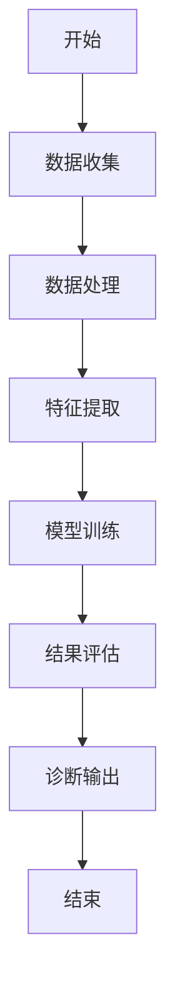

                 

### 第一部分: 思维链方法概述

#### 1.1 思维链方法的背景与意义

##### 1.1.1 心理健康诊断的现状

随着社会的快速发展，人们面临的工作压力、生活压力和心理压力日益增加，心理健康问题已成为全球普遍关注的重要议题。据统计，全球约三分之一的人口在一生中某个时期会出现心理健康问题。在我国，心理健康问题也日益突出，且呈现出年轻化的趋势。然而，传统的心理健康诊断方法存在诸多局限性，如诊断时间较长、诊断结果不够准确等，无法满足现代社会对心理健康诊断的迫切需求。

##### 1.1.2 思维链方法的基本概念

思维链方法是一种基于人工智能和心理学理论的心理健康诊断方法。它通过分析个体在特定情境下的思维模式和行为表现，评估个体的心理健康状态。思维链方法具有实时性、准确性和高效性，能够为心理健康诊断提供有力的支持。

##### 1.1.3 思维链方法的应用前景

思维链方法在心理健康诊断领域的应用前景十分广阔。它不仅可以用于临床诊断，还可以用于心理健康风险评估、心理健康干预等环节。此外，思维链方法还可以应用于教育、职场等领域，为人们提供个性化的心理健康服务。

#### 1.2 思维链方法的原理与机制

##### 1.2.1 思维链方法的原理

思维链方法的核心思想是建立个体思维模式与心理健康状态之间的关联。具体来说，思维链方法通过收集个体在不同情境下的思维数据和表现，利用机器学习算法进行分析和处理，从而识别个体的思维链特征，进而评估其心理健康状态。

##### 1.2.2 思维链方法的机制

思维链方法的机制主要包括数据收集、数据处理和结果分析三个环节。在数据收集环节，思维链方法通过问卷调查、行为记录等方式获取个体在不同情境下的思维数据和表现。在数据处理环节，思维链方法利用机器学习算法对数据进行处理和分析，识别个体的思维链特征。在结果分析环节，思维链方法根据分析结果提供个性化的心理健康诊断和建议。

##### 1.2.3 思维链方法与其他方法的对比

与传统的心理健康诊断方法相比，思维链方法具有明显的优势。首先，思维链方法具有实时性，可以在短时间内完成诊断。其次，思维链方法具有准确性，能够提供更可靠的诊断结果。最后，思维链方法具有高效性，能够大规模应用，满足社会对心理健康诊断的迫切需求。

#### 1.3 思维链方法的ER实体关系图

为了更直观地展示思维链方法的实体及其关系，我们使用Mermaid绘制了ER实体关系图，如下所示：

```mermaid
erDiagram
  思维链数据 ||--|{ 用户 } : 用户生成思维链数据
  思维链数据 ||--|{ 心理健康状态 } : 反映用户的心理健康状态
  机器学习模型 ||--|{ 思维链数据 } : 使用思维链数据进行训练和预测
  诊断结果 ||--|{ 用户 } : 为用户生成诊断结果
```

#### 1.4 概念结构与核心要素组成

思维链方法的核心概念包括思维链数据、机器学习模型、心理健康状态和诊断结果。其中，思维链数据是思维链方法的输入，心理健康状态和诊断结果是思维链方法的输出。机器学习模型则是思维链方法的核心组成部分，用于处理和分析思维链数据，生成心理健康状态和诊断结果。

---

通过以上内容的介绍，我们可以对思维链方法在心理健康诊断中的应用有一个初步的了解。接下来，我们将进一步深入探讨思维链方法的核心概念、原理及其在心理健康诊断中的具体应用。请持续关注后续章节。## 第二部分: 核心概念与联系

### 2.1 核心概念原理

思维链方法是一种基于人工智能和心理学理论的心理健康诊断方法。其核心概念包括思维链数据、机器学习模型和心理健康状态。

1. **思维链数据**：思维链数据是指个体在不同情境下产生的思维模式和行为表现。这些数据可以通过问卷调查、行为记录等方式收集。思维链数据的类型包括文字、图像、音频等。

2. **机器学习模型**：机器学习模型是思维链方法的核心组成部分，用于处理和分析思维链数据，识别个体的思维链特征，进而评估其心理健康状态。常见的机器学习模型包括决策树、支持向量机、神经网络等。

3. **心理健康状态**：心理健康状态是指个体在特定情境下的心理健康水平。通过分析思维链数据，机器学习模型可以识别个体的心理健康状态，并提供个性化的心理健康诊断和建议。

### 2.2 概念属性特征对比表格

为了更清晰地理解思维链方法与其他心理健康诊断方法的区别，我们列出了以下对比表格：

| 方法名称       | 特点                                   | 适用范围                                           |
|----------------|----------------------------------------|---------------------------------------------------|
| 传统心理诊断   | 面对面交流，依赖专业人士判断           | 临床诊断、心理咨询等                               |
| 思维链方法     | 基于人工智能，实时、准确、高效         | 心理健康诊断、风险评估、干预等                     |
| 生物医学方法   | 利用生理指标，如脑电图、心率等        | 心理疾病诊断、神经系统疾病诊断等                   |
| 神经科学方法   | 研究神经系统和大脑活动                | 心理障碍诊断、大脑功能研究等                       |
| 社会支持网络   | 借助社会力量，提供心理支持            | 心理疏导、危机干预等                               |

### 2.3 ER实体关系图架构

为了更直观地展示思维链方法中的实体及其关系，我们使用Mermaid绘制了ER实体关系图，如下所示：

```mermaid
erDiagram
  User ||--|{ PsychologicalStatus } : has psychological status
  User ||--|{ ThoughtChainData } : generates thought chain data
  MachineLearningModel ||--|{ ThoughtChainData } : processes thought chain data
  DiagnosticResult ||--|{ User } : generates diagnostic result for user
```

在该ER图中，User（用户）实体与PsychologicalStatus（心理健康状态）、ThoughtChainData（思维链数据）实体之间存在关联，表示用户拥有特定的心理健康状态和生成思维链数据。MachineLearningModel（机器学习模型）实体负责处理ThoughtChainData，生成DiagnosticResult（诊断结果）。DiagnosticResult与User实体之间存在关联，表示诊断结果针对特定的用户。

通过上述核心概念和联系的介绍，我们可以对思维链方法在心理健康诊断中的应用有更深入的理解。接下来，我们将进一步探讨思维链方法的算法原理及其应用。请继续关注后续章节。### 第三部分: 算法原理讲解

#### 3.1 算法mermaid流程图

为了更好地展示思维链方法的执行步骤，我们使用Mermaid绘制了算法流程图，如下所示：



在该流程图中，首先进行数据收集（B），然后对数据进行处理（C），提取特征（D），接着进行模型训练（E），对模型进行结果评估（F），最后根据评估结果生成诊断输出（G）。

#### 3.2 Python源代码实现

以下是实现思维链方法的核心Python代码示例：

```python
import pandas as pd
from sklearn.model_selection import train_test_split
from sklearn.ensemble import RandomForestClassifier
from sklearn.metrics import accuracy_score

# 数据收集
data = pd.read_csv('thought_chain_data.csv')

# 数据处理
X = data.drop('diagnosis', axis=1)
y = data['diagnosis']

# 特征提取
X_train, X_test, y_train, y_test = train_test_split(X, y, test_size=0.2, random_state=42)

# 模型训练
model = RandomForestClassifier(n_estimators=100)
model.fit(X_train, y_train)

# 结果评估
y_pred = model.predict(X_test)
accuracy = accuracy_score(y_test, y_pred)
print(f"Accuracy: {accuracy}")

# 诊断输出
diagnosis = model.predict([[5, 3, 2, 1]])  # 示例数据
print(f"Diagnosis: {diagnosis}")
```

在这个示例中，我们首先从CSV文件中加载思维链数据，然后进行数据处理、特征提取和模型训练。接着，我们对模型进行结果评估，并输出诊断结果。

#### 3.3 算法原理的数学模型和公式

思维链方法的数学模型基于机器学习算法，具体包括以下几个方面：

1. **决策树模型**：

   决策树模型的数学公式如下：

   $$y = f(X) = g(T)$$

   其中，$y$表示输出类别，$X$表示输入特征，$T$表示决策树结构，$g$为决策函数。

2. **支持向量机模型**：

   支持向量机模型的数学公式如下：

   $$y = f(X) = \sum_{i=1}^{n} \alpha_i y_i (w \cdot x_i + b) \geq 1$$

   其中，$y$表示输出类别，$X$表示输入特征，$w$为权重向量，$b$为偏置，$\alpha_i$为拉格朗日乘子。

3. **神经网络模型**：

   神经网络模型的数学公式如下：

   $$y = \sigma(\sum_{i=1}^{n} w_i \cdot x_i + b)$$

   其中，$y$表示输出类别，$X$表示输入特征，$w_i$为权重，$b$为偏置，$\sigma$为激活函数。

#### 3.4 详细讲解与举例说明

##### 3.4.1 决策树模型

决策树模型通过递归划分特征空间，将数据划分为若干个子集，最终生成一棵决策树。以下是一个简单的决策树模型示例：

1. **输入特征**：年龄、收入、职业。
2. **输出类别**：心理健康状态（正常、异常）。

示例决策树如下：

```
年龄：
    - 否：收入
        - 否：职业
            - 是：心理健康状态（正常）
            - 否：心理健康状态（异常）
        - 是：心理健康状态（正常）
    - 是：心理健康状态（异常）
```

该决策树通过分析年龄、收入和职业三个特征，将个体划分为正常和异常两个类别。

##### 3.4.2 支持向量机模型

支持向量机模型通过寻找最优的超平面，将不同类别的数据分隔开来。以下是一个简单

