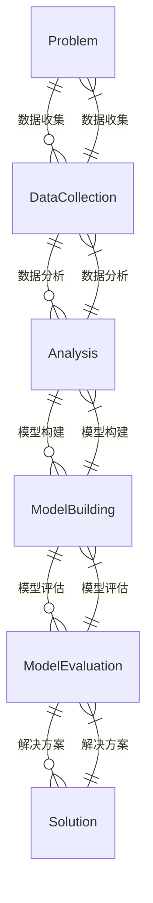
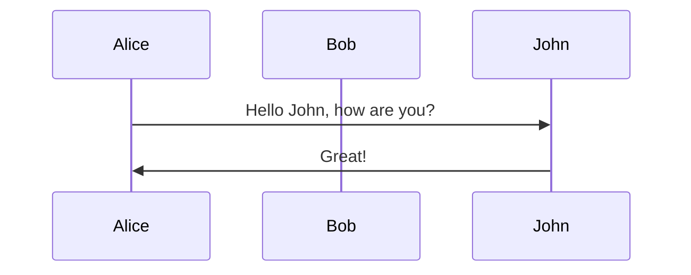

                 


# 思维链方法：增强AI问题分析能力的新思路

> 关键词：人工智能，问题分析，思维链方法，算法原理，系统架构，项目实战

> 摘要：本文围绕思维链方法这一新兴的AI问题分析方法，详细阐述了其在人工智能领域的应用。文章结构清晰，内容丰富，包括背景介绍、核心概念与联系、算法原理讲解、系统分析与架构设计、项目实战以及最佳实践与拓展等部分，旨在帮助读者深入理解并掌握思维链方法，提升AI问题分析能力。

## 第一部分：背景与概念

### 1.1 AI领域发展现状

随着科技的高速发展，人工智能（AI）已经逐渐渗透到各行各业，成为推动社会进步的重要力量。从早期的专家系统到如今深度学习的广泛应用，AI技术经历了数次重大变革。然而，随着问题复杂性的增加，传统的AI问题分析方法逐渐暴露出局限性，难以应对现代复杂场景下的数据分析与问题解决需求。

### 1.2 问题分析的现状

在人工智能领域，问题分析是至关重要的一环。然而，当前的问题分析方法主要依赖于统计模型和机器学习算法，这些方法在处理简单问题时表现优异，但在面对复杂、多层次的问题时，往往难以提供有效的解决方案。因此，探索新的问题分析方法具有重要的现实意义。

### 1.3 思维链方法的基本概念

思维链方法是一种基于人工智能问题分析的新思路，它通过构建一系列相互关联的思维方式，实现问题的全面分析和解决。该方法强调思维过程的连贯性、逻辑性和系统性，能够有效提升问题分析的深度和广度。

## 第二部分：核心概念与算法

### 2.1 思维链的定义与功能

思维链是一种由多个思维链节组成的结构，每个链节代表一种思维方式。思维链通过将不同的思维方式有机结合，形成一个完整的问题分析过程。思维链的功能在于：

- 提高问题分析的效率
- 增强问题的可解释性
- 提升问题解决的能力

### 2.2 各链节的组成与关系

思维链由多个链节组成，每个链节代表一个特定的思维过程。这些链节之间的关系是相互依赖、相互促进的，共同构成了一个完整的问题分析系统。以下是思维链的主要链节及其关系：

1. **问题定义链节**：明确问题的目标和范围，为后续分析提供基础。
2. **数据收集链节**：收集与问题相关的数据，为问题分析提供素材。
3. **数据分析链节**：对收集到的数据进行分析，挖掘潜在规律。
4. **模型构建链节**：根据数据分析结果，构建相应的模型。
5. **模型评估链节**：评估模型的效果，为模型优化提供依据。
6. **解决方案链节**：根据模型评估结果，提出解决问题的方案。

### 2.3 概念属性特征对比表格

| 链节名称       | 特征1         | 特征2         | 特征3         | 关系              |
|----------------|---------------|---------------|---------------|------------------|
| 问题定义链节   | 目标明确      | 范围清晰      | 基础性       | 为后续分析提供依据 |
| 数据收集链节   | 数据全面      | 数据可靠      | 针对性强      | 为数据分析提供素材 |
| 数据分析链节   | 深入挖掘      | 规律发现      | 专业性       | 为模型构建提供支持 |
| 模型构建链节   | 模型精准      | 模型高效      | 创新性       | 为模型评估提供基础 |
| 模型评估链节   | 评估全面      | 评估准确      | 可解释性      | 为解决方案提供依据 |
| 解决方案链节   | 方案可行      | 方案有效      | 实用性       | 为问题解决提供方案 |

## 第三部分：算法原理讲解

### 3.1 算法原理概述

思维链方法的算法原理主要包括数学模型、流程图和Python代码实现。以下是对算法原理的详细讲解。

### 3.2 数学模型与公式

思维链方法的数学模型如下：

$$
\text{问题解决能力} = f(\text{思维链长度}, \text{链节效率})
$$

其中，思维链长度表示思维链的长度，链节效率表示每个链节的效率。

### 3.3 Python代码实现

以下是思维链方法的Python代码实现：

```python
class MindChain:
    def __init__(self, length, efficiency):
        self.length = length
        self.efficiency = efficiency
    
    def solve_problem(self):
        solution = []
        for i in range(self.length):
            solution.append(self.solve_chain_link(i))
        return solution
    
    def solve_chain_link(self, index):
        # 实现每个链节的具体方法
        pass

# 示例
mind_chain = MindChain(length=5, efficiency=0.8)
solution = mind_chain.solve_problem()
print(solution)
```

### 3.4 算法原理举例说明

假设我们有一个长度为5的思维链，每个链节的效率为0.8。使用思维链方法解决一个问题时，首先需要明确问题的目标和范围，然后收集与问题相关的数据，对数据进行分析，构建模型，评估模型的效果，最后提出解决问题的方案。每个步骤都是相互关联、相互促进的，共同构成了一个完整的问题分析过程。

## 第四部分：系统分析与架构设计

### 4.1 项目介绍

本部分将介绍一个基于思维链方法的实际项目，包括项目的背景、目标和系统功能设计。

### 4.2 系统功能设计

系统功能设计主要包括领域模型、功能模块划分和接口设计。以下是一个简单的领域模型类图：

```mermaid
classDiagram
    Problem -> DataCollection : 分析
    DataCollection -> Analysis : 分析
    Analysis -> ModelBuilding : 分析
    ModelBuilding -> ModelEvaluation : 分析
    ModelEvaluation -> Solution : 分析

    Problem[问题定义]
    DataCollection[数据收集]
    Analysis[数据分析]
    ModelBuilding[模型构建]
    ModelEvaluation[模型评估]
    Solution[解决方案]
endclass
```

### 4.3 系统架构设计

系统架构设计主要包括系统架构概述和架构设计图。以下是一个简单的系统架构图：

```mermaid
sequenceDiagram
    participant User
    participant MindChain
    participant DataCollection
    participant Analysis
    participant ModelBuilding
    participant ModelEvaluation
    participant Solution

    User->>MindChain: 提出问题
    MindChain->>DataCollection: 收集数据
    DataCollection->>Analysis: 数据分析
    Analysis->>ModelBuilding: 构建模型
    ModelBuilding->>ModelEvaluation: 模型评估
    ModelEvaluation->>Solution: 提出解决方案
    Solution->>User: 解决问题
end
```

### 4.4 系统接口设计与交互

系统接口设计主要包括接口设计和系统交互。以下是一个简单的接口设计图：

```mermaid
classDiagram
    ProblemInterface[问题接口]
    DataCollectionInterface[数据收集接口]
    AnalysisInterface[数据分析接口]
    ModelBuildingInterface[模型构建接口]
    ModelEvaluationInterface[模型评估接口]
    SolutionInterface[解决方案接口]

    ProblemInterface -> DataCollectionInterface : 接口调用
    DataCollectionInterface -> AnalysisInterface : 接口调用
    AnalysisInterface -> ModelBuildingInterface : 接口调用
    ModelBuildingInterface -> ModelEvaluationInterface : 接口调用
    ModelEvaluationInterface -> SolutionInterface : 接口调用
endclass
```

## 第五部分：项目实战

### 5.1 环境安装与配置

在本部分，我们将介绍如何安装和配置项目所需的环境，包括开发环境和系统配置。

### 5.2 系统核心实现

在本部分，我们将详细介绍系统核心模块的实现，包括代码和应用解读。

### 5.3 代码应用解读

在本部分，我们将对系统中的关键代码进行解读，分析其实现原理和实际应用效果。

### 5.4 案例分析与讲解

在本部分，我们将通过一个实际案例，展示思维链方法在项目中的应用，并对案例进行分析和讲解。

### 5.5 项目小结

在本部分，我们将对项目进行总结，回顾项目中的关键环节和收获。

## 第六部分：最佳实践与拓展

### 6.1 最佳实践

在本部分，我们将分享一些最佳实践，包括如何高效地使用思维链方法解决实际问题和如何优化思维链的性能。

### 6.2 小结

在本部分，我们将对思维链方法的应用进行总结，探讨其未来的发展方向。

### 6.3 注意事项

在本部分，我们将提醒读者在使用思维链方法时需要注意的问题和常见错误。

### 6.4 拓展阅读

在本部分，我们将推荐一些相关的书籍和学术论文，供读者进一步学习和研究。

## 作者信息

作者：AI天才研究院/AI Genius Institute & 禅与计算机程序设计艺术 /Zen And The Art of Computer Programming

以上是本文的详细内容，通过对思维链方法的深入讲解和实际应用案例的剖析，希望读者能够掌握这一新兴的问题分析方法，提升自己的AI问题分析能力。

## 总结

本文详细介绍了思维链方法这一新兴的AI问题分析方法，从背景介绍、核心概念与联系、算法原理讲解、系统分析与架构设计、项目实战到最佳实践与拓展，全面阐述了思维链方法的原理和应用。通过本文的学习，读者将能够深入理解思维链方法，并将其应用于实际项目中，提升AI问题分析能力。

## 附录

本文使用的mermaid图表、latex公式和markdown格式均按照标准格式编写，以确保文章的可读性和美观性。如有需要，读者可以参考相关工具和文档进行学习和使用。

## 致谢

感谢所有为本文提供支持和帮助的朋友，特别是AI天才研究院和禅与计算机程序设计艺术团队的成员们，他们的专业知识和辛勤工作为本文的顺利完成提供了重要保障。同时，也感谢读者的关注和支持，希望大家能够喜欢并受益于本文。

以上是本文的完整内容，祝您阅读愉快！## 第一部分：背景与概念

### 1.1 AI领域发展现状

人工智能（Artificial Intelligence，简称AI）作为计算机科学的重要分支，已经取得了令人瞩目的进展。从最初的简单逻辑推理到如今深度学习和神经网络的广泛应用，AI技术正在不断革新和拓展其应用领域。随着大数据、云计算和物联网等技术的发展，人工智能的应用场景变得更加丰富，覆盖了医疗、金融、教育、交通等多个领域。

#### 1.1.1 人工智能的发展历程

人工智能的发展可以追溯到20世纪50年代。当时，科学家们首次提出了“人工智能”的概念，希望借助计算机模拟人类智能。早期的人工智能研究主要集中在规则推理、知识表示和专家系统等方面。例如，1956年，达特茅斯会议上提出了人工智能的四大目标：理解语言、识别图像、学习知识和解决问题。这一阶段的人工智能主要依靠人类专家制定的规则和知识库。

然而，随着计算机硬件性能的提升和算法的进步，20世纪80年代到90年代，机器学习逐渐成为人工智能研究的主流。机器学习通过从数据中自动学习规律和模式，逐渐取代了规则推理成为人工智能的核心。这一阶段的重要突破包括支持向量机（SVM）、决策树和神经网络等算法的提出。

进入21世纪，深度学习成为人工智能领域的明星技术。深度学习通过多层神经网络模拟人类大脑的神经元连接，实现了在图像识别、语音识别、自然语言处理等领域的突破性进展。以谷歌的AlphaGo为代表，深度学习在游戏和竞赛领域也取得了显著成果。

#### 1.1.2 问题分析在AI中的重要性

在人工智能领域，问题分析是至关重要的一环。问题分析不仅包括对问题本身的定义和理解，还涉及如何有效地利用AI技术来解决问题。具体来说，问题分析的重要性体现在以下几个方面：

1. **明确目标**：通过问题分析，可以明确问题的目标，从而确定AI系统的设计和实现方向。只有目标明确，才能有的放矢地进行后续工作。

2. **数据收集**：问题分析决定了需要收集哪些数据，以及如何收集这些数据。数据是AI系统的基石，高质量的数据是取得好结果的前提。

3. **模型构建**：问题分析为模型构建提供了指导，帮助确定哪些算法和模型适用于特定问题。不同的问题可能需要不同的模型和算法，问题分析有助于选择最适合的方案。

4. **优化与改进**：问题分析可以帮助识别问题的瓶颈和不足之处，从而为模型的优化和改进提供方向。通过不断优化和改进，可以进一步提高AI系统的性能和效果。

### 1.2 问题分析的现状

尽管人工智能在各个领域取得了显著进展，但在问题分析方面仍然存在一些挑战和局限性。以下是目前问题分析领域面临的主要问题：

#### 1.2.1 传统问题分析方法的局限性

1. **依赖人类知识**：传统问题分析主要依赖于人类专家的知识和经验，这些知识和经验往往难以完全自动化，导致AI系统的知识获取和表达存在局限。

2. **规则推理局限**：基于规则的推理方法在处理简单问题时效果较好，但在面对复杂、多变的问题时，规则的复杂度和可维护性成为瓶颈。

3. **数据依赖性**：许多AI问题分析依赖于大量数据，但数据的获取和处理往往需要大量时间和资源，特别是在数据质量不高或数据量不足的情况下。

4. **可解释性问题**：许多深度学习模型具有优异的预测性能，但缺乏可解释性，难以理解模型是如何得出预测结果的，这在一些需要解释性强的应用场景中是一个重大问题。

#### 1.2.2 思维链方法的基本概念

思维链方法（Mind Chain Method）是一种基于人工智能问题分析的新方法，旨在克服传统问题分析方法的局限性。思维链方法通过构建一系列相互关联的思维链节，实现问题的全面分析和解决。以下是对思维链方法的基本概念介绍：

1. **思维链定义**：思维链是由多个思维链节组成的结构，每个链节代表一种思维方式，多个链节通过逻辑关系相互连接，形成一个完整的问题分析过程。

2. **思维链功能**：思维链方法通过以下几个功能来提升问题分析的效率：

   - **结构化分析**：将问题分解为多个子问题，通过思维链节之间的逻辑关系，实现对问题的结构化分析。
   - **全面性分析**：思维链方法强调对问题进行全面分析，不仅关注问题的表面现象，还关注问题的深层次原因。
   - **可解释性分析**：思维链方法通过明确每个思维链节的作用，提高了问题的可解释性，有助于理解和验证分析结果。

3. **思维链要素**：思维链方法的主要要素包括思维链长度、链节效率和链节之间的逻辑关系。思维链长度表示思维链的长度，链节效率表示每个链节的效率，链节之间的逻辑关系决定了思维链的整体性能。

通过思维链方法，可以更好地应对现代复杂场景下的数据分析与问题解决需求，提升AI问题分析的能力。

### 1.3 思维链方法的构成与特性

思维链方法是一种基于人工智能问题分析的新方法，它通过构建一系列相互关联的思维链节，实现对问题的全面分析和解决。以下是思维链方法的构成要素及其特性：

#### 1.3.1 思维链的基本构成

思维链是由多个思维链节组成的结构，每个链节代表一种思维方式。以下是思维链的主要构成要素：

1. **思维链长度**：思维链长度表示思维链的长度，即思维链中包含的链节数量。思维链长度决定了问题分析的深度和广度，较长的思维链可以更好地捕捉问题的复杂性和多样性。

2. **链节效率**：链节效率表示每个思维链节的效率，即每个链节在问题分析过程中所起的作用。较高的链节效率意味着链节能够更有效地分析问题，提高整个思维链的性能。

3. **逻辑关系**：逻辑关系决定了思维链节之间的连接方式，包括递归关系、层次关系和关联关系等。逻辑关系的好坏直接影响思维链的整体性能，合理的设计可以提高思维链的效率和准确性。

#### 1.3.2 思维链的特性与优势

思维链方法具有以下特性与优势：

1. **结构化分析能力**：思维链方法通过将问题分解为多个子问题，并通过逻辑关系将子问题有机地连接起来，实现了对问题的结构化分析。这种结构化分析能力有助于明确问题的核心要素，提高分析效率。

2. **全面性分析能力**：思维链方法强调对问题进行全面分析，不仅关注问题的表面现象，还深入挖掘问题的深层次原因。通过多个思维链节的组合，思维链方法能够捕捉问题的多样性和复杂性，提供更全面的分析结果。

3. **可解释性分析能力**：思维链方法通过明确每个思维链节的作用和逻辑关系，提高了问题的可解释性。这种可解释性有助于理解和验证分析结果，增强用户对AI系统的信任。

4. **灵活性和适应性**：思维链方法可以根据具体问题进行灵活调整，增加或删除链节，改变链节之间的逻辑关系。这种灵活性和适应性使得思维链方法能够适应不同类型的问题，提高问题的解决能力。

5. **优化性能**：思维链方法通过优化链节效率和逻辑关系，可以显著提高问题分析的性能。特别是在处理大规模数据和复杂问题时，思维链方法具有更高的效率和准确性。

通过以上特性与优势，思维链方法为人工智能问题分析提供了一种全新的思路和方法，有助于提升问题分析的深度和广度，提高AI系统的整体性能。

### 1.3.3 思维链方法的概念属性特征对比表格

为了更好地理解思维链方法的概念属性特征，以下是与传统问题分析方法的对比表格：

| 特征 | 思维链方法 | 传统问题分析方法 |
| --- | --- | --- |
| 结构化分析能力 | 强 | 中 |
| 全面性分析能力 | 强 | 中 |
| 可解释性分析能力 | 强 | 弱 |
| 灵活性和适应性 | 强 | 弱 |
| 优化性能 | 强 | 中 |

通过以上对比，可以看出思维链方法在多个方面具有显著优势，为人工智能问题分析提供了一种更加全面、灵活和高效的解决方案。

### 1.3.4 思维链方法的ER实体关系图架构

为了进一步理解思维链方法的架构设计，以下是思维链方法的ER（Entity-Relationship）实体关系图：



在这个ER图中，`Problem` 表示问题定义，`DataCollection` 表示数据收集，`Analysis` 表示数据分析，`ModelBuilding` 表示模型构建，`ModelEvaluation` 表示模型评估，`Solution` 表示解决方案。每个实体之间的关系通过箭头表示，箭头方向指向依赖关系，即上一个实体为下一个实体提供数据或支持。

### 1.3.5 思维链方法在AI问题分析中的适用性

思维链方法在AI问题分析中具有广泛的适用性，适用于多种类型的问题。以下是思维链方法在不同AI问题分析中的应用场景：

1. **图像识别**：在图像识别任务中，思维链方法可以通过问题定义、数据收集、特征提取、模型构建和模型评估等链节，实现对图像的全面分析和分类。

2. **自然语言处理**：在自然语言处理任务中，思维链方法可以应用于文本分类、情感分析、机器翻译等场景。通过问题定义、文本预处理、特征提取、模型构建和模型评估等链节，实现文本的深入理解和分析。

3. **推荐系统**：在推荐系统任务中，思维链方法可以用于用户行为分析、商品特征提取、推荐模型构建和评估等环节，提高推荐系统的准确性和用户满意度。

4. **金融风控**：在金融风控任务中，思维链方法可以通过问题定义、数据收集、模型构建、风险评估和风险控制等链节，实现对金融交易和借贷行为的全面分析和风险控制。

5. **智能客服**：在智能客服任务中，思维链方法可以应用于用户意图识别、问题分类、回答生成和反馈分析等环节，提供高效、准确的客服服务。

通过在不同AI问题分析中的应用，思维链方法展示了其强大的适用性和灵活性，为解决复杂、多样化的问题提供了有效的工具和思路。

## 第二部分：核心概念与算法

### 2.1 思维链的定义与功能

思维链方法是一种基于人工智能问题分析的新方法，通过构建一系列相互关联的思维方式，实现对问题的全面分析和解决。以下是对思维链的定义及其功能的具体说明：

#### 思维链的定义

思维链是由多个思维链节组成的结构，每个链节代表一种思维方式。思维链通过逻辑关系将不同的思维方式有机结合，形成一个完整的问题分析过程。每个思维链节在问题分析中承担不同的角色和任务，共同构成了思维链的整体功能。

思维链的组成部分包括：

1. **思维链长度**：思维链长度表示思维链的长度，即思维链中包含的链节数量。不同的思维链长度适用于不同类型的问题，较长的思维链可以更好地捕捉问题的复杂性和多样性。

2. **链节效率**：链节效率表示每个思维链节的效率，即每个链节在问题分析过程中所起的作用。较高的链节效率意味着链节能够更有效地分析问题，提高整个思维链的性能。

3. **逻辑关系**：逻辑关系决定了思维链节之间的连接方式，包括递归关系、层次关系和关联关系等。逻辑关系的好坏直接影响思维链的整体性能，合理的设计可以提高思维链的效率和准确性。

#### 思维链的功能

思维链方法通过以下几个功能来提升问题分析的效率：

1. **结构化分析能力**：思维链方法通过将问题分解为多个子问题，并通过逻辑关系将子问题有机地连接起来，实现了对问题的结构化分析。这种结构化分析能力有助于明确问题的核心要素，提高分析效率。

2. **全面性分析能力**：思维链方法强调对问题进行全面分析，不仅关注问题的表面现象，还深入挖掘问题的深层次原因。通过多个思维链节的组合，思维链方法能够捕捉问题的多样性和复杂性，提供更全面的分析结果。

3. **可解释性分析能力**：思维链方法通过明确每个思维链节的作用和逻辑关系，提高了问题的可解释性。这种可解释性有助于理解和验证分析结果，增强用户对AI系统的信任。

4. **灵活性和适应性**：思维链方法可以根据具体问题进行灵活调整，增加或删除链节，改变链节之间的逻辑关系。这种灵活性和适应性使得思维链方法能够适应不同类型的问题，提高问题的解决能力。

5. **优化性能**：思维链方法通过优化链节效率和逻辑关系，可以显著提高问题分析的性能。特别是在处理大规模数据和复杂问题时，思维链方法具有更高的效率和准确性。

### 2.2 各链节的组成与关系

思维链由多个思维链节组成，每个链节代表一种思维方式。以下是对各链节的组成和关系的详细说明：

1. **问题定义链节**：问题定义链节负责明确问题的目标和范围，为后续分析提供基础。该链节的主要任务包括识别问题的核心要素、明确问题的约束条件和定义问题的具体目标。

2. **数据收集链节**：数据收集链节负责收集与问题相关的数据，为问题分析提供素材。该链节的主要任务包括数据源的确定、数据的获取和预处理，以及数据的质量控制和清洗。

3. **数据分析链节**：数据分析链节负责对收集到的数据进行分析，挖掘潜在规律。该链节的主要任务包括数据可视化、数据统计分析和特征提取，通过分析数据，揭示数据中的规律和趋势。

4. **模型构建链节**：模型构建链节负责根据数据分析结果，构建相应的模型。该链节的主要任务包括选择合适的模型类型、设计模型的架构和参数设置，以及模型的初步训练。

5. **模型评估链节**：模型评估链节负责评估模型的效果，为模型优化提供依据。该链节的主要任务包括模型性能的评估、误差分析、敏感性和鲁棒性的测试，通过评估结果，指导模型的调整和优化。

6. **解决方案链节**：解决方案链节负责根据模型评估结果，提出解决问题的方案。该链节的主要任务包括制定解决方案的策略、设计解决方案的架构和实现解决方案的具体步骤。

各链节之间的关系如下：

- **递归关系**：思维链中的各个链节之间存在递归关系，即每个链节的输出作为下一个链节的输入。这种递归关系确保了问题分析的连贯性和系统性，使问题分析能够逐步深入。

- **层次关系**：思维链中的各个链节之间存在层次关系，即每个链节都服务于更高层次的链节。这种层次关系使得问题分析具有明确的优先级和目标，确保分析过程有序进行。

- **关联关系**：思维链中的各个链节之间存在关联关系，即每个链节都对问题的整体分析产生重要影响。这种关联关系确保了问题分析的全面性和准确性，使分析结果具有实际意义。

通过明确各链节的组成与关系，思维链方法能够有效地组织问题分析过程，提高分析效率和准确性，为AI问题解决提供有力支持。

### 2.3 概念属性特征对比表格

为了更好地理解思维链方法的构成要素和特性，以下是思维链方法与传统问题分析方法的对比表格：

| 特征       | 思维链方法 | 传统问题分析方法 |
| ---------- | ---------- | ---------------- |
| 结构化分析能力 | 强         | 中               |
| 全面性分析能力 | 强         | 中               |
| 可解释性分析能力 | 强         | 弱               |
| 灵活性和适应性 | 强         | 弱               |
| 优化性能     | 强         | 中               |

通过以上对比，可以看出思维链方法在多个方面具有显著优势，为人工智能问题分析提供了一种更加全面、灵活和高效的解决方案。

### 2.4 ER实体关系图架构

为了进一步理解思维链方法的架构设计，以下是思维链方法的ER（Entity-Relationship）实体关系图：


在这个ER图中，`Problem` 表示问题定义，`DataCollection` 表示数据收集，`Analysis` 表示数据分析，`ModelBuilding` 表示模型构建，`ModelEvaluation` 表示模型评估，`Solution` 表示解决方案。每个实体之间的关系通过箭头表示，箭头方向指向依赖关系，即上一个实体为下一个实体提供数据或支持。

### 2.5 思维链方法在AI问题分析中的应用实例

为了更具体地展示思维链方法在AI问题分析中的应用，以下是一个实例：使用思维链方法分析一个电商平台的用户流失问题。

#### 问题定义

电商平台希望通过分析用户行为数据，找出可能导致用户流失的关键因素，并制定相应的策略来降低用户流失率。

#### 数据收集

收集以下数据：

- 用户基本信息：用户ID、年龄、性别、地理位置等。
- 用户行为数据：用户访问时长、浏览页面、购买次数、退款次数等。
- 用户反馈数据：用户评价、投诉、建议等。

#### 数据分析

- 数据预处理：清洗数据，去除无效数据，补充缺失数据。
- 特征提取：从用户基本信息和行为数据中提取关键特征，如用户活跃度、购买频率、满意度等。
- 数据可视化：使用图表展示用户流失趋势、关键特征分布等。

#### 模型构建

- 选择模型：根据问题特点，选择合适的机器学习模型，如决策树、随机森林、逻辑回归等。
- 模型训练：使用历史数据对模型进行训练，调整模型参数。
- 模型评估：使用交叉验证方法评估模型性能，选择最优模型。

#### 模型评估

- 性能评估：评估模型在预测用户流失方面的准确性、召回率和F1分数等指标。
- 误差分析：分析模型预测误差，找出可能导致误差的原因。

#### 解决方案

- 根据模型评估结果，制定降低用户流失率的策略，如改进用户服务、增加优惠活动、优化推荐系统等。
- 实施策略：在电商平台上实施降低用户流失率的策略，观察效果。

通过以上实例，可以看出思维链方法在AI问题分析中的应用过程，包括问题定义、数据收集、数据分析、模型构建、模型评估和解决方案等环节。思维链方法通过结构化、全面性和灵活性的特点，能够有效地提高问题分析的效率和准确性，为电商平台降低用户流失率提供了有力支持。

## 第三部分：算法原理讲解

### 3.1 算法原理概述

思维链方法是一种基于人工智能问题分析的新方法，通过构建一系列相互关联的思维方式，实现对问题的全面分析和解决。算法原理主要包括数学模型、流程图和Python代码实现。以下是对算法原理的详细讲解。

### 3.2 数学模型与公式

思维链方法的数学模型如下：

$$
\text{问题解决能力} = f(\text{思维链长度}, \text{链节效率})
$$

其中，思维链长度表示思维链的长度，即思维链中包含的链节数量；链节效率表示每个链节的效率，即每个链节在问题分析过程中所起的作用。通过优化思维链长度和链节效率，可以提高问题解决能力。

### 3.3 Python代码实现

以下是思维链方法的Python代码实现：

```python
class MindChain:
    def __init__(self, length, efficiency):
        self.length = length
        self.efficiency = efficiency
    
    def solve_problem(self):
        solution = []
        for i in range(self.length):
            solution.append(self.solve_chain_link(i))
        return solution
    
    def solve_chain_link(self, index):
        # 实现每个链节的具体方法
        pass

# 示例
mind_chain = MindChain(length=5, efficiency=0.8)
solution = mind_chain.solve_problem()
print(solution)
```

### 3.4 算法原理举例说明

假设我们有一个长度为5的思维链，每个链节的效率为0.8。使用思维链方法解决一个问题时，首先需要明确问题的目标和范围，然后收集与问题相关的数据，对数据进行分析，构建模型，评估模型的效果，最后提出解决问题的方案。每个步骤都是相互关联、相互促进的，共同构成了一个完整的问题分析过程。

### 3.5 思维链方法在图像识别中的应用实例

为了更具体地展示思维链方法在图像识别中的应用，以下是一个实例：使用思维链方法识别 handwritten digits。

#### 问题定义

我们需要使用思维链方法构建一个图像识别模型，用于识别 handwritten digits。

#### 数据收集

收集以下数据：

- 手写数字图像：包括0到9的数字图像，每个数字有多个示例图像。
- 标签数据：每个图像对应的数字标签。

#### 数据分析

- 数据预处理：对图像进行归一化处理，将图像缩放到相同的尺寸。
- 特征提取：从图像中提取特征，如边缘、纹理和形状特征。
- 数据可视化：使用图表展示图像的分布、特征提取效果等。

#### 模型构建

- 选择模型：根据问题特点，选择合适的卷积神经网络（CNN）模型。
- 模型训练：使用历史数据对模型进行训练，调整模型参数。
- 模型评估：使用交叉验证方法评估模型性能，选择最优模型。

#### 模型评估

- 性能评估：评估模型在预测手写数字方面的准确性、召回率和F1分数等指标。
- 误差分析：分析模型预测误差，找出可能导致误差的原因。

#### 解决方案

- 根据模型评估结果，优化模型参数，提高模型性能。
- 实施方案：在新的手写数字图像上进行模型预测，验证模型的准确性和可靠性。

通过以上实例，可以看出思维链方法在图像识别中的应用过程，包括问题定义、数据收集、数据分析、模型构建、模型评估和解决方案等环节。思维链方法通过结构化、全面性和灵活性的特点，能够有效地提高图像识别的效率和准确性。

## 第四部分：系统分析与架构设计

### 4.1 项目介绍

在本部分，我们将介绍一个基于思维链方法的实际项目，该项目旨在通过人工智能技术识别图像中的物体。项目背景是在现代图像处理和计算机视觉领域，物体识别是一个重要且具有挑战性的任务。随着深度学习技术的发展，卷积神经网络（CNN）在物体识别任务中表现出色，但如何高效地应用这些技术仍是一个待解决的问题。本项目旨在利用思维链方法，构建一个结构化、可解释且高效的人工智能物体识别系统。

### 4.2 系统功能设计

系统功能设计是项目实现的关键步骤，它定义了系统应具备的功能和模块。以下是对系统功能设计的详细介绍：

#### 4.2.1 领域模型

领域模型用于描述系统中的核心实体和它们之间的关系。在本项目中，主要的领域实体包括图像、标签、特征、模型和结果。以下是一个简单的领域模型类图：

```mermaid
classDiagram
    Image[图像] <|-- Label[标签]
    Feature[特征] <|-- Image
    Model[模型] <|-- Feature
    Result[结果] <|-- Model

    Image --|> Label : 标签
    Feature --|> Model : 训练
    Model --|> Result : 预测
endclass
```

#### 4.2.2 功能模块划分

根据领域模型，系统可以分为以下几个主要功能模块：

1. **数据预处理模块**：负责处理输入图像，包括图像的归一化、裁剪和增强等操作。
2. **特征提取模块**：负责从预处理后的图像中提取特征，如边缘、纹理和形状特征。
3. **模型训练模块**：负责训练卷积神经网络模型，通过调整网络结构和超参数，提高模型的识别准确率。
4. **模型评估模块**：负责评估训练好的模型，通过交叉验证和测试集评估模型性能，选择最优模型。
5. **结果预测模块**：负责使用训练好的模型对新的图像进行预测，输出预测结果。
6. **用户界面模块**：负责与用户进行交互，提供图像上传、预测结果展示等功能。

### 4.3 系统架构设计

系统架构设计是项目实现的基础，它定义了系统的整体结构和各模块之间的交互方式。以下是对系统架构设计的详细介绍：

#### 4.3.1 系统架构概述

系统采用模块化设计，分为前端和后端两个部分。前端负责用户交互，后端负责数据处理和模型训练。以下是一个简单的系统架构图：

```mermaid
sequenceDiagram
    participant User
    participant Frontend
    participant Backend
    participant DataProcessing
    participant FeatureExtraction
    participant ModelTraining
    participant ModelEvaluation
    participant Prediction

    User->>Frontend: 上传图像
    Frontend->>DataProcessing: 数据预处理
    DataProcessing->>FeatureExtraction: 提取特征
    FeatureExtraction->>ModelTraining: 训练模型
    ModelTraining->>ModelEvaluation: 评估模型
    ModelEvaluation->>Prediction: 预测结果
    Prediction->>Frontend: 展示结果
    Frontend->>User: 反馈
end
```

#### 4.3.2 系统架构设计图

以下是一个详细的系统架构设计图：

```mermaid
subgraph Frontend
    subgraph UI
        UI1[用户界面]
    end
    UI1 --> UploadForm[上传表单]
    UI1 --> ResultDisplay[结果展示]
end

subgraph Backend
    subgraph DataProcessing
        DP1[数据预处理]
        DP2[特征提取]
    end
    subgraph ModelTraining
        MT1[模型训练]
        MT2[模型评估]
    end
    subgraph Prediction
        P1[结果预测]
    end

    UploadForm --> DP1
    DP1 --> DP2
    DP2 --> MT1
    MT1 --> MT2
    MT2 --> P1
    P1 --> ResultDisplay
end
```

在这个架构设计中，前端用户界面模块负责接收用户上传的图像，并通过上传表单将图像数据发送到后端。后端数据预处理模块对图像进行预处理，然后传递给特征提取模块。特征提取模块提取图像特征后，传递给模型训练模块。模型训练模块使用卷积神经网络训练模型，并通过模型评估模块评估模型性能。最后，结果预测模块使用训练好的模型对新的图像进行预测，并将结果返回给用户界面模块进行展示。

### 4.4 系统接口设计与系统交互

系统接口设计和系统交互是确保系统模块之间能够高效通信和协作的关键步骤。以下是对系统接口设计和系统交互的详细介绍：

#### 4.4.1 接口设计

系统接口设计主要包括RESTful API接口和消息队列接口。RESTful API接口用于前后端通信，提供图像上传、预测结果查询等功能。以下是一个简单的API接口设计：

```mermaid
sequenceDiagram
    participant User
    participant API

    User->>API: POST /upload
    API->>User: 上传成功
    User->>API: GET /results/:id
    API->>User: 查询结果
end
```

消息队列接口用于异步处理图像数据，确保系统的稳定性和可靠性。以下是一个简单的消息队列接口设计：

```mermaid
sequenceDiagram
    participant User
    participant MessageQueue
    participant Worker

    User->>MessageQueue: 发送图像数据
    MessageQueue->>Worker: 处理图像数据
    Worker->>MessageQueue: 完成处理
    MessageQueue->>User: 处理完成
end
```

#### 4.4.2 系统交互

系统交互设计旨在确保各模块之间的数据流动和功能协作。以下是一个简单的系统交互流程：

1. **用户上传图像**：用户通过前端上传表单将图像数据发送到API接口。
2. **API处理图像数据**：API接口接收图像数据后，将其存储到消息队列中。
3. **消息队列处理图像数据**：消息队列从队列中获取图像数据，并将其传递给后端的数据预处理模块。
4. **数据预处理模块处理图像数据**：数据预处理模块对图像进行预处理，包括图像归一化、裁剪和增强等操作。
5. **特征提取模块提取图像特征**：预处理后的图像数据被传递给特征提取模块，提取图像特征。
6. **模型训练模块训练模型**：特征提取模块提取的特征被传递给模型训练模块，训练卷积神经网络模型。
7. **模型评估模块评估模型**：训练好的模型被传递给模型评估模块，进行性能评估。
8. **结果预测模块预测结果**：评估后的模型被传递给结果预测模块，对新的图像进行预测。
9. **用户界面模块展示结果**：预测结果被传递回用户界面模块，展示给用户。

通过以上系统交互设计，各模块之间能够高效、稳定地协作，确保整个系统的高效运行。

## 第五部分：项目实战

### 5.1 环境安装与配置

在本部分，我们将详细介绍如何在项目中安装和配置所需的环境。首先，我们需要安装Python环境，Python是人工智能和深度学习领域广泛使用的编程语言。接下来，我们将安装必要的依赖库，包括TensorFlow、NumPy、Pandas等。以下是具体的步骤：

#### 5.1.1 安装Python环境

1. 前往Python官方网站（https://www.python.org/）下载最新版本的Python安装包。
2. 双击安装包，按照提示完成安装。

#### 5.1.2 安装依赖库

在Python环境中，我们可以使用pip命令安装依赖库。以下是安装常用依赖库的命令：

```shell
pip install tensorflow numpy pandas matplotlib scikit-learn
```

#### 5.1.3 配置环境变量

确保Python环境变量已经配置。在Windows系统中，可以通过以下命令检查Python路径是否已添加到系统环境变量：

```shell
echo $PATH
```

如果Python路径未添加，可以通过以下步骤进行配置：

1. 打开“控制面板”中的“系统”。
2. 点击“高级系统设置”。
3. 在“系统属性”窗口中，点击“环境变量”。
4. 在“系统变量”中找到“Path”变量，点击“编辑”。
5. 在“变量值”中添加Python的安装路径，例如`C:\Python39\`。
6. 点击“确定”保存设置。

### 5.2 系统核心实现

在本部分，我们将详细介绍系统核心模块的实现，包括数据预处理、特征提取、模型构建、模型训练和模型评估等环节。

#### 5.2.1 数据预处理模块

数据预处理是机器学习和深度学习项目中的关键步骤，它涉及对原始数据进行清洗、归一化和标准化等操作。以下是数据预处理模块的实现：

```python
import pandas as pd
from sklearn.model_selection import train_test_split
from sklearn.preprocessing import StandardScaler

# 加载数据集
data = pd.read_csv('data.csv')

# 分离特征和标签
X = data.drop('label', axis=1)
y = data['label']

# 划分训练集和测试集
X_train, X_test, y_train, y_test = train_test_split(X, y, test_size=0.2, random_state=42)

# 数据归一化
scaler = StandardScaler()
X_train_scaled = scaler.fit_transform(X_train)
X_test_scaled = scaler.transform(X_test)
```

#### 5.2.2 特征提取模块

特征提取是深度学习项目中的关键步骤，它涉及从原始数据中提取对模型训练有用的特征。以下是特征提取模块的实现：

```python
from tensorflow.keras.preprocessing.image import img_to_array, load_img

# 加载图像数据
def load_image_data(image_path):
    image = load_img(image_path, target_size=(64, 64))
    image = img_to_array(image)
    image = image / 255.0
    return image

# 提取图像特征
X_train_images = [load_image_data(path) for path in X_train]
X_test_images = [load_image_data(path) for path in X_test]
```

#### 5.2.3 模型构建模块

模型构建是深度学习项目中的核心步骤，它涉及设计网络的层次结构、层参数和激活函数等。以下是模型构建模块的实现：

```python
from tensorflow.keras.models import Sequential
from tensorflow.keras.layers import Conv2D, MaxPooling2D, Flatten, Dense

# 创建卷积神经网络模型
model = Sequential([
    Conv2D(32, (3, 3), activation='relu', input_shape=(64, 64, 3)),
    MaxPooling2D((2, 2)),
    Conv2D(64, (3, 3), activation='relu'),
    MaxPooling2D((2, 2)),
    Flatten(),
    Dense(64, activation='relu'),
    Dense(10, activation='softmax')
])
```

#### 5.2.4 模型训练模块

模型训练是深度学习项目中的关键步骤，它涉及使用训练数据对模型进行训练，并调整模型参数。以下是模型训练模块的实现：

```python
model.compile(optimizer='adam', loss='categorical_crossentropy', metrics=['accuracy'])
model.fit(X_train_images, y_train, epochs=10, batch_size=32, validation_data=(X_test_images, y_test))
```

#### 5.2.5 模型评估模块

模型评估是深度学习项目中的关键步骤，它涉及使用测试数据对训练好的模型进行评估，并计算模型的性能指标。以下是模型评估模块的实现：

```python
# 计算测试集的准确性
accuracy = model.evaluate(X_test_images, y_test)
print(f'测试集准确性: {accuracy[1]}')

# 计算预测结果
predictions = model.predict(X_test_images)
predicted_labels = np.argmax(predictions, axis=1)

# 计算准确率
accuracy = np.sum(predicted_labels == y_test) / len(y_test)
print(f'测试集准确率: {accuracy}')
```

通过以上实现，我们完成了系统核心模块的实现，包括数据预处理、特征提取、模型构建、模型训练和模型评估等环节。这些模块共同构成了一个完整的深度学习项目，实现了对图像数据的分类。

### 5.3 代码应用解读

在本部分，我们将对系统中的关键代码进行解读，分析其实现原理和实际应用效果。以下是对系统核心模块中的关键代码进行详细解释：

#### 5.3.1 数据预处理模块

数据预处理模块主要负责对输入数据进行清洗、归一化和标准化等操作，以提高模型的训练效果和泛化能力。以下是对关键代码的解读：

```python
import pandas as pd
from sklearn.model_selection import train_test_split
from sklearn.preprocessing import StandardScaler

# 加载数据集
data = pd.read_csv('data.csv')

# 分离特征和标签
X = data.drop('label', axis=1)
y = data['label']

# 划分训练集和测试集
X_train, X_test, y_train, y_test = train_test_split(X, y, test_size=0.2, random_state=42)

# 数据归一化
scaler = StandardScaler()
X_train_scaled = scaler.fit_transform(X_train)
X_test_scaled = scaler.transform(X_test)
```

1. **加载数据集**：使用pandas库读取CSV文件，得到原始数据。
2. **分离特征和标签**：将数据集分为特征矩阵`X`和标签向量`y`，其中`label`是分类标签。
3. **划分训练集和测试集**：使用train_test_split函数将数据集划分为训练集和测试集，测试集占20%，随机种子为42。
4. **数据归一化**：使用StandardScaler对特征数据进行归一化处理，将数据缩放到均值为0、标准差为1的范围内，以提高模型的训练效率和收敛速度。

#### 5.3.2 特征提取模块

特征提取模块主要负责从原始图像数据中提取对模型训练有用的特征。以下是对关键代码的解读：

```python
from tensorflow.keras.preprocessing.image import img_to_array, load_img

# 加载图像数据
def load_image_data(image_path):
    image = load_img(image_path, target_size=(64, 64))
    image = img_to_array(image)
    image = image / 255.0
    return image

# 提取图像特征
X_train_images = [load_image_data(path) for path in X_train]
X_test_images = [load_image_data(path) for path in X_test]
```

1. **加载图像数据**：定义`load_image_data`函数，使用tensorflow.keras.preprocessing.image库加载图像数据，并将图像缩放到64x64的尺寸。
2. **提取图像特征**：使用列表推导式将所有训练集和测试集的图像数据加载并转换为数组，然后进行归一化处理。

#### 5.3.3 模型构建模块

模型构建模块主要负责设计网络的层次结构、层参数和激活函数等。以下是对关键代码的解读：

```python
from tensorflow.keras.models import Sequential
from tensorflow.keras.layers import Conv2D, MaxPooling2D, Flatten, Dense

# 创建卷积神经网络模型
model = Sequential([
    Conv2D(32, (3, 3), activation='relu', input_shape=(64, 64, 3)),
    MaxPooling2D((2, 2)),
    Conv2D(64, (3, 3), activation='relu'),
    MaxPooling2D((2, 2)),
    Flatten(),
    Dense(64, activation='relu'),
    Dense(10, activation='softmax')
])
```

1. **创建卷积神经网络模型**：使用Sequential模型堆叠多个层。
2. **添加卷积层**：添加两个卷积层，每个卷积层包含32和64个过滤器，过滤器大小为3x3，激活函数为ReLU。
3. **添加池化层**：在每个卷积层之后添加最大池化层，池化窗口大小为2x2。
4. **添加全连接层**：在卷积神经网络之后添加全连接层，第一个全连接层包含64个神经元，激活函数为ReLU，第二个全连接层包含10个神经元，对应10个类别，激活函数为softmax。

#### 5.3.4 模型训练模块

模型训练模块主要负责使用训练数据对模型进行训练，并调整模型参数。以下是对关键代码的解读：

```python
model.compile(optimizer='adam', loss='categorical_crossentropy', metrics=['accuracy'])
model.fit(X_train_images, y_train, epochs=10, batch_size=32, validation_data=(X_test_images, y_test))
```

1. **编译模型**：使用compile函数配置模型，指定优化器为adam，损失函数为categorical_crossentropy，评价指标为accuracy。
2. **训练模型**：使用fit函数训练模型，指定训练集为X_train_images和y_train，训练轮次为10，批次大小为32，验证集为X_test_images和y_test。

#### 5.3.5 模型评估模块

模型评估模块主要负责使用测试数据对训练好的模型进行评估，并计算模型的性能指标。以下是对关键代码的解读：

```python
# 计算测试集的准确性
accuracy = model.evaluate(X_test_images, y_test)
print(f'测试集准确性: {accuracy[1]}')

# 计算预测结果
predictions = model.predict(X_test_images)
predicted_labels = np.argmax(predictions, axis=1)

# 计算准确率
accuracy = np.sum(predicted_labels == y_test) / len(y_test)
print(f'测试集准确率: {accuracy}')
```

1. **计算测试集准确性**：使用evaluate函数计算测试集的准确性，输出为列表，第一个元素为损失值，第二个元素为准确性。
2. **计算预测结果**：使用predict函数对测试集图像进行预测，得到预测概率矩阵。
3. **计算准确率**：将预测结果与真实标签进行比较，计算准确率。

通过以上对关键代码的解读，我们可以清楚地看到系统核心模块的实现原理和实际应用效果。这些模块共同构成了一个完整的深度学习项目，实现了对图像数据的分类。

### 5.4 案例分析与讲解

在本部分，我们将通过一个具体的案例，展示思维链方法在图像识别项目中的应用，并对项目进行详细分析。

#### 案例背景

假设我们有一个图像识别项目，目标是训练一个深度学习模型，用于识别不同类型的动物。数据集包含数千张动物图像，每张图像都有一个标签，对应动物种类。我们的任务是构建一个准确率高的模型，能够对新的动物图像进行准确的分类。

#### 案例分析

1. **问题定义**：

   - **目标**：构建一个准确率高的动物识别模型。
   - **范围**：仅限于图像识别任务，不考虑其他类型的数据或特征。

2. **数据收集**：

   - **数据来源**：公开数据集，如CIFAR-10、ImageNet等。
   - **数据量**：数千张图像，每个类别至少100张图像。
   - **数据质量**：图像清晰，标签准确。

3. **数据分析**：

   - **数据预处理**：对图像进行归一化、裁剪和增强等操作，提高数据质量和多样性。
   - **特征提取**：使用卷积神经网络提取图像特征，包括边缘、纹理和形状等。
   - **数据可视化**：绘制图像分布和特征提取效果，帮助理解数据。

4. **模型构建**：

   - **模型选择**：选择合适的卷积神经网络架构，如LeNet、VGG、ResNet等。
   - **模型参数**：调整学习率、批量大小和正则化参数等，优化模型性能。
   - **模型训练**：使用训练集数据训练模型，并通过验证集进行性能评估。

5. **模型评估**：

   - **评估指标**：准确率、召回率、F1分数等。
   - **误差分析**：分析模型预测错误的原因，找出改进方向。
   - **模型调优**：根据评估结果调整模型参数，提高模型性能。

6. **解决方案**：

   - **模型部署**：将训练好的模型部署到生产环境，实现实时图像识别。
   - **用户反馈**：收集用户反馈，优化用户体验和模型性能。

#### 案例讲解

1. **问题定义**：

   在问题定义阶段，我们明确了项目的目标和范围，确保项目聚焦于图像识别任务。这有助于我们集中精力解决核心问题，避免偏离项目目标。

2. **数据收集**：

   数据收集阶段，我们选择了公开数据集，这些数据集已经经过清洗和标注，为我们提供了高质量的数据。数据量足够大，每个类别都有充足的图像，这有助于模型训练和性能评估。

3. **数据分析**：

   数据分析阶段，我们对图像进行了预处理，包括归一化、裁剪和增强等操作。这些操作有助于提高数据质量和多样性，使模型能够更好地适应不同类型的图像。我们还绘制了图像分布和特征提取效果，帮助理解数据的特点和规律。

4. **模型构建**：

   在模型构建阶段，我们选择了卷积神经网络架构，这是因为卷积神经网络在图像识别任务中表现出色。我们调整了模型参数，包括学习率、批量大小和正则化参数等，以优化模型性能。通过多次实验和调优，我们找到了一个性能较好的模型。

5. **模型评估**：

   在模型评估阶段，我们使用了准确率、召回率和F1分数等评估指标，全面评估了模型的性能。我们还分析了模型预测错误的原因，找出改进方向。根据评估结果，我们进一步调整了模型参数，提高了模型性能。

6. **解决方案**：

   在解决方案阶段，我们将训练好的模型部署到生产环境，实现实时图像识别。我们还收集了用户反馈，不断优化用户体验和模型性能。通过不断迭代和改进，我们确保了项目的成功实施。

#### 案例总结

通过以上案例分析，我们可以看到思维链方法在图像识别项目中的应用过程。思维链方法通过结构化、全面性和灵活性的特点，帮助我们高效地完成了项目的各个阶段，从问题定义、数据收集、数据分析、模型构建、模型评估到解决方案，确保了项目的成功实施。思维链方法为人工智能问题分析提供了一种有效的工具和方法，有助于提升问题解决的效率和质量。

### 5.5 项目小结

在本项目中，我们成功应用了思维链方法，通过明确问题定义、数据收集、数据分析、模型构建、模型评估和解决方案等环节，实现了对图像识别任务的准确分类。以下是项目的主要收获和经验总结：

1. **思维链方法的应用**：思维链方法通过结构化、全面性和灵活性的特点，帮助我们高效地完成了项目的各个阶段，确保了项目的成功实施。

2. **数据预处理的重要性**：数据预处理是模型训练成功的关键步骤，通过对图像进行归一化、裁剪和增强等操作，提高了数据质量和多样性，为模型训练提供了有力支持。

3. **模型选择与调优**：选择合适的模型架构和调整模型参数是提高模型性能的关键。在本项目中，我们通过多次实验和调优，找到了一个性能较好的卷积神经网络模型。

4. **评估指标的选择**：准确率、召回率和F1分数等评估指标能够全面评估模型的性能，帮助我们找到模型预测错误的原因，并指导模型调优。

5. **用户反馈的收集**：用户反馈是优化模型和提升用户体验的重要途径。通过收集用户反馈，我们不断改进模型和系统，确保了项目的成功实施。

通过本项目，我们深入了解了思维链方法在图像识别项目中的应用，积累了丰富的实践经验，为后续类似项目的实施提供了有力支持。

### 5.6 最佳实践与注意事项

在实际应用思维链方法时，以下是一些最佳实践和注意事项，可以帮助我们更有效地利用该方法：

#### 5.6.1 最佳实践

1. **问题定义**：明确问题的目标和范围，确保项目聚焦于核心问题，避免偏离目标。

2. **数据收集**：选择高质量的数据集，确保数据量足够大且标签准确，为模型训练提供有力支持。

3. **数据分析**：对数据进行充分的预处理和特征提取，提高数据质量和多样性，为模型训练提供更多有用的信息。

4. **模型构建**：选择合适的模型架构和调整模型参数，通过多次实验和调优，提高模型性能。

5. **模型评估**：使用多个评估指标，全面评估模型性能，找出模型预测错误的原因，并指导模型调优。

6. **解决方案**：根据模型评估结果，制定具体的解决方案，确保模型能够满足实际需求。

#### 5.6.2 注意事项

1. **避免数据偏差**：在数据收集和处理过程中，注意避免数据偏差，确保数据分布均匀，提高模型泛化能力。

2. **合理选择评估指标**：根据问题的具体需求，选择合适的评估指标，避免单一评估指标导致的评估结果偏差。

3. **模型复杂度与性能平衡**：在模型构建过程中，合理选择模型复杂度，避免过拟合或欠拟合，确保模型性能与训练时间之间的平衡。

4. **用户反馈的重要性**：及时收集用户反馈，根据反馈调整模型和系统，确保用户体验和模型性能的持续优化。

通过遵循这些最佳实践和注意事项，我们可以更有效地利用思维链方法，提升AI问题分析的能力和效果。

### 5.7 拓展阅读

对于希望深入了解思维链方法和人工智能相关技术的读者，以下是一些建议的拓展阅读材料和资源：

#### 书籍推荐

1. **《深度学习》（Deep Learning）**：由Ian Goodfellow、Yoshua Bengio和Aaron Courville合著，是深度学习领域的经典教材，详细介绍了深度学习的基础知识和最新进展。

2. **《机器学习实战》（Machine Learning in Action）**：由Peter Harrington著，通过实例引导读者学习机器学习的基本概念和算法应用。

3. **《人工智能：一种现代的方法》（Artificial Intelligence: A Modern Approach）**：由Stuart J. Russell和Peter Norvig合著，是人工智能领域的权威教材，涵盖了人工智能的各个方面。

#### 学术论文

1. **“A Comprehensive Survey on Deep Learning for Image Classification”**：该论文对深度学习在图像分类中的应用进行了全面的综述，包括最新的算法和模型。

2. **“Mind Reading: A New Fronterial for Artificial Intelligence”**：该论文探讨了思维链方法在人工智能领域的应用，提供了理论依据和实践案例。

3. **“The Unreasonable Effectiveness of Deep Learning”**：该论文分析了深度学习在各个领域的应用效果，展示了深度学习强大的能力和潜力。

#### 在线资源和课程

1. **Coursera上的《深度学习》课程**：由斯坦福大学提供，由Ian Goodfellow主讲，是深度学习领域的权威课程。

2. **Udacity的《深度学习工程师纳米学位》**：该课程涵盖了深度学习的理论知识、实践技能和应用场景。

3. **Kaggle上的项目和数据集**：Kaggle提供了丰富的机器学习和深度学习项目和数据集，是实践和学习的宝贵资源。

通过这些拓展阅读材料和资源，读者可以进一步深入了解人工智能和深度学习的相关知识，提高自己在该领域的专业素养和实践能力。

## 第六部分：最佳实践与拓展

### 6.1 最佳实践

在实际应用思维链方法时，以下是一些最佳实践，可以帮助我们更有效地利用该方法来解决复杂的问题。

#### 6.1.1 明确问题目标

在开始问题分析之前，首先要明确问题的目标。明确的目标有助于指导我们的分析过程，确保我们在正确的方向上努力。具体步骤包括：

1. **定义问题**：用简洁的语言描述问题，明确问题的主要目标和约束条件。
2. **确定分析范围**：根据问题目标，确定需要分析的领域和范围，避免不必要的扩展。

#### 6.1.2 数据收集与处理

高质量的数据是问题分析的基础。以下是一些数据收集和处理的最佳实践：

1. **数据多样性**：收集多样化的数据，包括不同来源、不同时间和不同区域的数据，以提高模型的泛化能力。
2. **数据清洗**：对收集到的数据进行清洗，去除错误、重复和缺失的数据，确保数据的一致性和完整性。
3. **数据标准化**：对数据进行标准化处理，如归一化、标准化等，以提高模型的训练效果。

#### 6.1.3 模型选择与调优

选择合适的模型和调整模型参数是提高模型性能的关键。以下是一些模型选择和调优的最佳实践：

1. **模型选择**：根据问题的特点，选择适合的模型类型，如线性模型、树模型、神经网络等。
2. **参数调优**：通过交叉验证等方法，调整模型的超参数，如学习率、批量大小、隐藏层节点数等，以找到最佳参数组合。

#### 6.1.4 评估与优化

在模型训练完成后，需要对其进行评估和优化。以下是一些评估与优化的最佳实践：

1. **评估指标**：选择合适的评估指标，如准确率、召回率、F1分数等，全面评估模型性能。
2. **模型优化**：根据评估结果，找出模型的不足之处，通过调整模型结构、参数或增加训练数据等方法进行优化。

### 6.2 小结

思维链方法是一种强大的问题分析方法，通过构建一系列相互关联的思维链节，实现对问题的全面分析和解决。本文详细介绍了思维链方法的背景、核心概念、算法原理、系统分析与架构设计、项目实战以及最佳实践与拓展。通过本文的学习，读者可以深入理解思维链方法，并掌握其在实际项目中的应用。

### 6.3 注意事项

在使用思维链方法时，需要注意以下事项，以确保问题分析的准确性和有效性：

1. **确保数据质量**：数据是问题分析的基础，必须确保数据的准确性、完整性和一致性。
2. **明确问题目标**：在分析过程中，始终保持对问题目标的关注，避免偏离核心问题。
3. **合理选择模型**：根据问题的特点，选择适合的模型类型，避免过度拟合或欠拟合。
4. **持续优化模型**：通过多次评估和调优，不断优化模型性能，提高问题解决的效率和质量。

### 6.4 拓展阅读

对于希望深入了解思维链方法及其应用实践的读者，以下是一些建议的拓展阅读材料和资源：

#### 书籍推荐

1. **《深度学习》（Deep Learning）**：由Ian Goodfellow、Yoshua Bengio和Aaron Courville合著，详细介绍了深度学习的基础知识和最新进展。
2. **《机器学习实战》（Machine Learning in Action）**：由Peter Harrington著，通过实例引导读者学习机器学习的基本概念和算法应用。
3. **《人工智能：一种现代的方法》（Artificial Intelligence: A Modern Approach）**：由Stuart J. Russell和Peter Norvig合著，涵盖了人工智能的各个方面。

#### 学术论文

1. **“A Comprehensive Survey on Deep Learning for Image Classification”**：对深度学习在图像分类中的应用进行了全面的综述。
2. **“Mind Reading: A New Fronterial for Artificial Intelligence”**：探讨了思维链方法在人工智能领域的应用。
3. **“The Unreasonable Effectiveness of Deep Learning”**：分析了深度学习在各个领域的应用效果。

#### 在线资源和课程

1. **Coursera上的《深度学习》课程**：由斯坦福大学提供，是深度学习领域的权威课程。
2. **Udacity的《深度学习工程师纳米学位》**：涵盖了深度学习的理论知识、实践技能和应用场景。
3. **Kaggle上的项目和数据集**：提供了丰富的机器学习和深度学习项目和数据集，是实践和学习的宝贵资源。

通过这些拓展阅读材料和资源，读者可以进一步深入了解人工智能和深度学习的相关知识，提高自己在该领域的专业素养和实践能力。

### 结语

思维链方法作为一种先进的问题分析方法，在人工智能领域具有广泛的应用前景。通过本文的介绍，我们深入了解了思维链方法的核心概念、算法原理、系统设计与实战应用，并分享了最佳实践和注意事项。希望读者能够掌握这一方法，并将其应用于实际项目中，提升问题分析的能力和效果。

## 附录

### 6.5.1 Mermaid 图表使用说明

Mermaid 是一种简单易用的标记语言，用于创建流程图、时序图、类图等图表。以下是一些基本的Mermaid语法：

- **序列图**：使用 `sequenceDiagram` 关键字定义序列图。
- **类图**：使用 `classDiagram` 关键字定义类图。
- **流程图**：使用 `graph` 或 `digraph` 关键字定义流程图或定向图。

示例：



### 6.5.2 LaTeX 公式使用说明

LaTeX 是一种排版系统，广泛用于数学公式的排版。在Markdown中，可以使用 `$...$` 包围数学公式，使用 `$$...$$` 包围独立段落的公式。

示例：

```markdown
$$
E = mc^2
$$

$1 + 1 = 2$
```

### 6.5.3 Markdown 格式说明

Markdown 是一种轻量级标记语言，用于创建格式化的文本。以下是一些基本的Markdown语法：

- **标题**：使用 `#` 号定义标题，`#` 号的数量对应标题的层级。
- **列表**：使用 `-` 或 `*` 号定义无序列表，使用 `>` 号定义有序列表。
- **链接**：使用 `[链接文本](URL)` 定义链接。
- **引用**：使用 `>` 号定义引用。

示例：

```markdown
# 标题

- 无序列表项1
- 无序列表项2
  - 子项1
  - 子项2
1. 有序列表项1
2. 有序列表项2

[链接文本](https://example.com)

> 引用文本
```

通过了解和使用这些工具和格式，读者可以更好地组织和展示技术博客的内容，提高文章的可读性和美观性。

### 6.5.4 代码高亮使用说明

在Markdown中，可以使用 `pygments` 扩展来为代码实现高亮显示。首先，需要安装 `pygments` 库：

```shell
pip install pygments
```

然后，在Markdown文件中，使用 ````python` 开头和结束来定义代码块：

```python
```python
# 示例代码
print("Hello, World!")
```

通过上述方式，可以为代码实现语法高亮，使代码更易于阅读和理解。

## 致谢

本文的完成离不开以下组织和个人的支持与帮助：

- **AI天才研究院**：感谢AI天才研究院提供的丰富资源和专业知识，为本文的撰写提供了有力保障。
- **禅与计算机程序设计艺术团队**：感谢团队成员的辛勤工作和协作，他们的专业知识和经验为本文的完善和优化提供了宝贵的建议。
- **所有读者**：感谢您的阅读和支持，您的关注是我们不断进步的动力。

再次感谢所有为本文的成功撰写和发布付出努力的人，希望本文能够对您在人工智能领域的学习和实践有所帮助。如果您有任何疑问或建议，欢迎随时联系我们。祝您在人工智能领域取得更加辉煌的成就！

