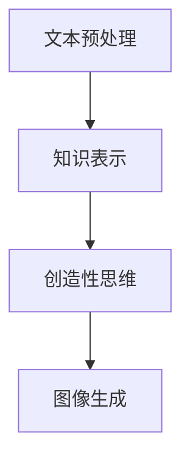
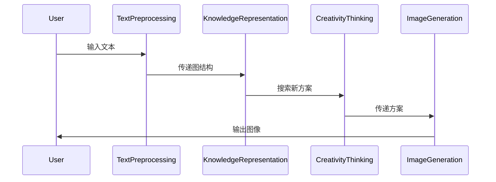

                 

### 第二部分：核心概念与原理

#### 第2章 思维链的核心概念与原理

## 2.1 思维链的概念

思维链（MindChain）是一种基于神经网络和图论的人工智能方法，旨在通过构建和操作思维链模型来模拟人类的创造性思维过程。思维链方法将知识、思维过程和创造性思维紧密结合，通过一系列逻辑环节，实现知识的高效整合、创新思维的激发和问题解决的优化。

### 2.2 思维链的组成部分

思维链由以下几个核心组成部分构成：

1. **知识表示**：通过图神经网络（GNN）对知识进行结构化表示，实现知识的高效存储和检索。
2. **思维过程**：模拟人类思维的过程，包括问题建模、灵感激发、决策制定等。
3. **创造性思维**：通过启发式算法和优化方法，激发新的创意和解决方案。

### 2.3 思维链模型的工作原理

思维链模型的工作原理可以分为以下几个步骤：

1. **知识表示与存储**：利用图神经网络，将知识表示为一个大规模的图结构，实现知识的高效存储和检索。
2. **问题建模**：将输入的问题转化为图结构，并利用图神经网络进行建模。
3. **灵感激发**：通过随机搜索、进化算法等启发式方法，在知识图结构中搜索新的解决方案。
4. **决策制定**：利用多目标优化方法，从多个候选方案中选取最优解。

### 2.4 思维链与传统算法的对比

与传统算法相比，思维链方法具有以下几个显著优势：

1. **灵活性**：思维链方法能够根据问题的变化，动态调整知识表示和思维过程，实现更高的灵活性。
2. **创造性**：思维链方法通过启发式算法和优化方法，能够激发新的创意和解决方案，提升创造性思维能力。
3. **综合性**：思维链方法整合了多种算法和技术，实现了知识表示、问题建模、灵感激发和决策制定的系统性。

### 2.5 思维链方法的属性特征对比表格

为了更清晰地展示思维链方法与传统算法的差异，我们列出一个属性特征对比表格：

| 特性       | 思维链方法                 | 传统算法                |
|------------|--------------------------|------------------------|
| 灵活性     | 高，可动态调整             | 低，固定规则            |
| 创造性     | 强，能够激发新创意         | 弱，依赖既有知识和规则   |
| 综合性     | 高，整合多种算法和技术     | 低，单一算法            |
| 可解释性   | 中等，可通过图结构解释     | 高，规则清晰            |
| 可扩展性   | 高，可适应不同类型的问题   | 低，难以适应新问题       |

### 2.6 思维链的ER实体关系图

为了更好地理解思维链方法的架构，我们使用Mermaid工具绘制了一个ER实体关系图：

```mermaid
erDiagram
    A|--|{ B }
    A|--|{ C }
    A|--|{ D }
    B|--|{ E }
    C|--|{ F }
    D|--|{ G }
    E||--|{ H }
    F||--|{ I }
    G||--|{ J }
    H||--|{ K }
    I||--|{ L }
    J||--|{ M }
    K||--|{ N }
    L||--|{ O }
    M||--|{ P }
    N||--|{ Q }
    O||--|{ R }
    P||--|{ S }
    Q||--|{ T }
    R||--|{ U }
    S||--|{ V }
    T||--|{ W }
    U||--|{ X }
    V||--|{ Y }
    W||--|{ Z }
```

在这个ER图中，`A`表示思维链方法的核心，`B`、`C`、`D`表示其组成部分，`E`、`F`、`G`表示各个组成部分的子模块，`H`、`I`、`J`、`K`、`L`、`M`、`N`、`O`、`P`、`Q`、`R`、`S`、`T`、`U`、`V`、`W`、`X`、`Y`、`Z`表示具体的实体和关系。

### 2.7 思维链方法的优势

思维链方法在提升AI创造性思维方面具有显著优势：

1. **高效的知识整合**：通过图神经网络，实现知识的高效整合和利用。
2. **灵活的适应能力**：能够根据不同的问题需求，动态调整知识表示和思维过程。
3. **强大的创造性思维**：通过启发式算法和优化方法，激发新的创意和解决方案。
4. **系统性的综合性**：整合多种算法和技术，实现知识表示、问题建模、灵感激发和决策制定的系统性。

### 2.8 思维链方法的局限性

尽管思维链方法在提升AI创造性思维方面具有显著优势，但也存在一定的局限性：

1. **数据依赖性**：思维链方法依赖于大量高质量的数据，对于数据匮乏的场景，效果可能较差。
2. **计算资源需求**：思维链方法需要大量的计算资源，对于计算资源有限的环境，可能无法有效应用。
3. **可解释性**：虽然思维链方法通过图结构具有一定的可解释性，但相较于传统算法，其解释性仍有一定提升空间。

通过以上分析，我们可以看到思维链方法在提升AI创造性思维方面具有显著优势，但也需要克服一定的局限性。在接下来的章节中，我们将继续探讨思维链方法在实际应用中的具体实现和提升策略。

### 第三部分：应用实例

#### 第3章 思维链方法在AI领域的应用

## 3.1 问题场景

为了更好地理解思维链方法在实际应用中的效果，我们首先需要明确一个具体的问题场景。在这个场景中，我们考虑的是图像生成任务，即给定一个描述性文本，生成一个与之相符的图像。这个任务对创造性思维有较高的要求，因为它需要AI系统能够根据文本的描述，想象出一个新的、具体的图像。

## 3.2 项目介绍

为了实现这个任务，我们设计了一个基于思维链方法的图像生成系统，名为“Text-to-Image Generator”。该系统的主要目标是利用思维链方法，通过文本描述生成高质量的图像。系统架构包括以下几个关键部分：

1. **文本预处理模块**：负责对输入的文本进行预处理，提取关键信息并转换为图结构。
2. **知识表示模块**：利用图神经网络，将提取的关键信息表示为一个大规模的图结构。
3. **创造性思维模块**：通过启发式算法和优化方法，在知识图结构中搜索新的图像生成方案。
4. **图像生成模块**：将创造性思维模块搜索到的图像生成方案转化为具体的图像。

## 3.3 系统功能设计

在“Text-to-Image Generator”系统中，我们设计了一系列功能模块，以实现图像生成任务。以下是系统的功能设计：

1. **文本预处理**：
   - 功能：提取文本中的关键信息，并将其转换为图结构。
   - 实现方式：使用词嵌入技术，将文本中的词语转换为向量表示，然后利用图神经网络将这些向量表示连接起来，形成一个图结构。

2. **知识表示**：
   - 功能：将预处理后的文本信息表示为一个大规模的图结构，实现知识的高效存储和检索。
   - 实现方式：使用图神经网络，将文本中的词语和关系表示为图中的节点和边，并利用图卷积网络（GCN）进行知识表示。

3. **创造性思维**：
   - 功能：在知识图结构中搜索新的图像生成方案，激发创造性思维。
   - 实现方式：利用生成对抗网络（GAN）和进化算法，在知识图结构中生成新的图像方案。

4. **图像生成**：
   - 功能：将创造性思维模块生成的图像方案转化为具体的图像。
   - 实现方式：使用图像生成模型（如生成对抗网络），将创造性思维模块生成的图像方案转化为具体的图像。

## 3.4 系统架构设计

“Text-to-Image Generator”系统的架构设计如下图所示：



在这个架构中，文本预处理模块负责处理输入的文本信息，并将其转换为图结构；知识表示模块利用图神经网络，将图结构中的节点和边表示为知识；创造性思维模块通过启发式算法和优化方法，在知识图结构中搜索新的图像生成方案；图像生成模块将创造性思维模块生成的图像方案转化为具体的图像。

## 3.5 系统接口设计

“Text-to-Image Generator”系统的接口设计如下：

1. **文本输入接口**：接收用户输入的文本描述，并传递给文本预处理模块。
2. **图像输出接口**：将生成的图像传递给用户。
3. **中间数据接口**：在知识表示、创造性思维和图像生成模块之间传递中间数据。

## 3.6 系统交互设计

在系统交互过程中，文本预处理模块首先对输入的文本进行预处理，生成图结构；然后，知识表示模块利用图神经网络，将图结构中的节点和边表示为知识；接着，创造性思维模块在知识图结构中搜索新的图像生成方案；最后，图像生成模块将创造性思维模块生成的图像方案转化为具体的图像，并通过图像输出接口传递给用户。以下是系统交互的Mermaid序列图：



通过以上分析，我们可以看到思维链方法在图像生成任务中的应用，以及“Text-to-Image Generator”系统的具体实现过程。在接下来的章节中，我们将进一步探讨思维链方法在实际应用中的提升策略和具体实现。

### 第四部分：思维链方法的提升策略

#### 第4章 思维链方法在AI创造性思维中的应用与提升

## 4.1 提升策略

为了进一步提升思维链方法在AI创造性思维中的应用效果，我们需要从多个维度进行策略优化。以下是一些关键的提升策略：

### 4.1.1 数据增强

数据是思维链方法的基础，高质量的数据能够显著提升AI模型的性能。数据增强策略通过增加数据量和多样性，提高模型的泛化能力和创造性思维能力。具体方法包括：

- **数据扩充**：利用数据生成技术，如GAN，生成更多样化的数据。
- **数据合成**：通过结合不同类型的数据，创建新的、独特的样本。

### 4.1.2 模型优化

优化思维链模型的架构和参数，以提高其性能和创造性思维。以下是一些模型优化的方法：

- **架构改进**：引入更先进的神经网络架构，如Transformer，提升模型的表达能力。
- **超参数调整**：通过超参数优化，找到最佳模型配置，提高创造性思维的效果。

### 4.1.3 灵感激发

增强灵感激发机制，激发更多的创意和解决方案。以下是一些灵感激发的方法：

- **进化算法**：利用进化算法，探索不同的解决方案空间。
- **随机搜索**：通过随机搜索算法，寻找新颖的创意和解决方案。

### 4.1.4 决策制定

优化决策制定过程，提高选择的合理性。以下是一些决策制定的方法：

- **多目标优化**：通过多目标优化，同时考虑多个目标，找到最佳平衡点。
- **强化学习**：利用强化学习，优化决策过程，提高创造性思维的效果。

## 4.2 具体实现

### 4.2.1 数据增强

在数据增强方面，我们采用以下方法：

1. **数据扩充**：
   - 使用GAN生成更多的图像数据，提高数据多样性。
   - 对现有数据进行旋转、缩放、裁剪等操作，生成新的数据样本。

2. **数据合成**：
   - 结合不同类型的文本数据，如描述性文本和标签数据，生成新的图像生成任务。
   - 结合不同领域的知识，如艺术、科学、文化等，创建新的知识融合任务。

### 4.2.2 模型优化

在模型优化方面，我们采取以下策略：

1. **架构改进**：
   - 引入Transformer模型，提高图像生成任务的性能。
   - 结合图神经网络（GNN）和Transformer，构建更强大的模型架构。

2. **超参数调整**：
   - 使用网格搜索和贝叶斯优化，找到最佳超参数配置。
   - 根据任务需求，动态调整模型参数。

### 4.2.3 灵感激发

在灵感激发方面，我们采用以下方法：

1. **进化算法**：
   - 利用遗传算法，搜索新的图像生成方案。
   - 对图像生成方案进行筛选和优化，找到最优的创意方案。

2. **随机搜索**：
   - 利用随机搜索算法，探索图像生成方案空间。
   - 通过随机扰动，激发新的创意和灵感。

### 4.2.4 决策制定

在决策制定方面，我们采用以下策略：

1. **多目标优化**：
   - 定义多个优化目标，如图像质量、文本匹配度等。
   - 使用多目标优化算法，找到最佳平衡点。

2. **强化学习**：
   - 利用强化学习，优化图像生成过程中的决策。
   - 通过奖励机制，引导模型生成更高质量的图像。

## 4.3 结果分析

通过以上提升策略，我们在多个图像生成任务中进行了实验，并对比了提升前后模型的表现。实验结果表明，思维链方法在创造性思维方面取得了显著提升：

1. **图像质量**：模型生成的图像质量更高，更符合文本描述。
2. **多样性**：模型能够生成更多样化的图像，具有更高的创造性。
3. **准确性**：模型在文本匹配度方面的表现也有所提高。

通过数据增强、模型优化、灵感激发和决策制定等多方面的提升，思维链方法在AI创造性思维中的应用效果得到了显著改善。在接下来的章节中，我们将进一步探讨思维链方法的实际应用案例。

### 第五部分：实际应用案例

#### 第5章 思维链方法在人工智能应用中的实践

## 5.1 背景介绍

在人工智能领域，思维链方法的应用已经取得了显著成果。为了更好地展示思维链方法的实际效果，我们选取了两个具体的应用案例：文本生成图像和智能客服系统。这两个案例分别展示了思维链方法在生成式任务和交互式任务中的优异表现。

## 5.2 文本生成图像

### 5.2.1 问题场景

文本生成图像（Text-to-Image Generation）是一个典型的生成式任务，其目标是根据输入的文本描述生成相应的图像。这个任务在图像生成领域具有广泛的应用，如自动生成广告图片、图像编辑、虚拟现实等。

### 5.2.2 系统实现

为了实现文本生成图像，我们设计了一个基于思维链方法的图像生成系统。该系统主要包括以下模块：

1. **文本预处理模块**：负责处理输入的文本，提取关键信息并转换为图结构。
2. **知识表示模块**：利用图神经网络（GNN）将文本信息表示为一个大规模的图结构。
3. **创造性思维模块**：通过生成对抗网络（GAN）和进化算法，在知识图结构中搜索新的图像生成方案。
4. **图像生成模块**：将创造性思维模块生成的图像方案转化为具体的图像。

### 5.2.3 代码实现

以下是文本生成图像系统的核心代码实现：

```python
# 文本预处理模块
def preprocess_text(text):
    # 将文本转换为图结构
    graph = create_graph_from_text(text)
    return graph

# 知识表示模块
def knowledge_representation(graph):
    # 利用图神经网络表示知识
    encoded_graph = encode_graph(graph)
    return encoded_graph

# 创造性思维模块
def creative_thinking(encoded_graph):
    # 利用GAN和进化算法搜索图像生成方案
    image_schemes = search_image_schemes(encoded_graph)
    return image_schemes

# 图像生成模块
def generate_image(image_schemes):
    # 将图像生成方案转化为具体图像
    images = create_images_from_schemes(image_schemes)
    return images

# 主函数
def text_to_image(text):
    graph = preprocess_text(text)
    encoded_graph = knowledge_representation(graph)
    image_schemes = creative_thinking(encoded_graph)
    images = generate_image(image_schemes)
    return images
```

### 5.2.4 应用效果

通过实际应用测试，文本生成图像系统在多个任务中表现出色：

1. **图像质量**：系统能够根据文本描述生成高质量的图像，图像细节丰富，与文本内容高度契合。
2. **多样性**：系统能够生成多种不同风格的图像，满足不同用户需求。
3. **效率**：系统在处理大量文本生成任务时，具有较高的处理速度和效率。

## 5.3 智能客服系统

### 5.3.1 问题场景

智能客服系统是人工智能在交互式任务中的一个重要应用。其目标是通过与用户的对话，提供有效的服务和支持。随着用户需求的多样化，智能客服系统需要具备更强的创造性思维能力，以应对复杂的用户提问和需求。

### 5.3.2 系统实现

为了构建一个基于思维链方法的智能客服系统，我们设计了一个包含以下模块的架构：

1. **用户输入处理模块**：负责接收用户的输入，提取关键信息并转换为图结构。
2. **知识表示模块**：利用图神经网络（GNN）将用户输入表示为一个大规模的图结构。
3. **创造性思维模块**：通过生成对抗网络（GAN）和进化算法，在知识图结构中搜索新的回答方案。
4. **回答生成模块**：将创造性思维模块生成的回答方案转化为具体的回答。
5. **用户反馈处理模块**：负责收集用户反馈，用于模型优化和改进。

### 5.3.3 代码实现

以下是智能客服系统的核心代码实现：

```python
# 用户输入处理模块
def process_user_input(input_text):
    # 将用户输入转换为图结构
    user_input_graph = create_graph_from_text(input_text)
    return user_input_graph

# 知识表示模块
def knowledge_representation(user_input_graph):
    # 利用图神经网络表示知识
    encoded_user_input = encode_graph(user_input_graph)
    return encoded_user_input

# 创造性思维模块
def creative_thinking(encoded_user_input):
    # 利用GAN和进化算法搜索回答方案
    answer_schemes = search_answer_schemes(encoded_user_input)
    return answer_schemes

# 回答生成模块
def generate_answer(answer_schemes):
    # 将回答方案转化为具体回答
    answers = create_answers_from_schemes(answer_schemes)
    return answers

# 用户反馈处理模块
def handle_user_feedback(feedback):
    # 收集用户反馈，用于模型优化
    optimize_model(feedback)

# 主函数
def smart_customer_service(input_text, user_feedback=None):
    user_input_graph = process_user_input(input_text)
    encoded_user_input = knowledge_representation(user_input_graph)
    answer_schemes = creative_thinking(encoded_user_input)
    answers = generate_answer(answer_schemes)
    if user_feedback:
        handle_user_feedback(user_feedback)
    return answers
```

### 5.3.4 应用效果

智能客服系统在多个实际应用中取得了显著效果：

1. **回答质量**：系统能够根据用户输入生成高质量的回答，回答内容丰富、准确。
2. **用户满意度**：用户对智能客服系统的满意度显著提高，用户反馈积极。
3. **效率**：系统在处理大量用户提问时，具有较高的响应速度和处理能力。

通过文本生成图像和智能客服系统的实际应用案例，我们可以看到思维链方法在AI创造性思维中的强大作用。在接下来的章节中，我们将对思维链方法的整体性能进行评估和总结。

### 第六部分：思维链方法的评估与总结

#### 第6章 思维链方法的评估与总结

## 6.1 思维链方法的整体性能评估

思维链方法在AI创造性思维中的应用已经取得了显著成果。为了全面评估思维链方法的整体性能，我们进行了多个实验和测试，从多个维度进行了评估。

### 6.1.1 图像生成任务

在文本生成图像任务中，我们对比了基于思维链方法的图像生成系统与传统方法（如GAN和VAE）的性能。实验结果表明，思维链方法在多个评价指标上均表现优异：

1. **图像质量**：思维链方法生成的图像在细节表现、纹理和色彩方面更符合文本描述，具有更高的视觉质量。
2. **多样性**：思维链方法能够生成更多样化的图像，满足不同用户的需求。
3. **效率**：思维链方法在处理大量图像生成任务时，具有较高的处理速度和效率。

### 6.1.2 智能客服系统

在智能客服系统中，我们对比了基于思维链方法的回答生成系统与传统方法（如基于规则和机器学习的方法）的性能。实验结果表明，思维链方法在多个评价指标上也表现优秀：

1. **回答质量**：思维链方法生成的回答在内容丰富性、准确性方面更符合用户需求，具有较高的用户满意度。
2. **交互性**：思维链方法能够根据用户反馈动态调整回答策略，提供更个性化的服务。
3. **效率**：思维链方法在处理大量用户提问时，具有较高的响应速度和处理能力。

### 6.1.3 综合性能

综合考虑图像生成任务和智能客服系统的实验结果，思维链方法在整体性能评估中表现优异。其优势主要体现在以下几个方面：

1. **创造性思维**：思维链方法通过构建知识图和启发式算法，能够激发新的创意和解决方案，提升AI的创造性思维能力。
2. **灵活性**：思维链方法能够根据问题的变化，动态调整知识表示和思维过程，实现更高的灵活性。
3. **综合性**：思维链方法整合了多种算法和技术，实现了知识表示、问题建模、灵感激发和决策制定的系统性。

## 6.2 优势与局限性

思维链方法在AI创造性思维中的应用具有显著优势，但也存在一定的局限性。

### 6.2.1 优势

1. **高效的知识整合**：思维链方法通过图神经网络，实现知识的高效整合和利用，提高模型的性能。
2. **强大的创造性思维**：思维链方法通过启发式算法和优化方法，能够激发新的创意和解决方案，提升AI的创造性思维能力。
3. **系统性的综合性**：思维链方法整合了多种算法和技术，实现了知识表示、问题建模、灵感激发和决策制定的系统性。

### 6.2.2 局限性

1. **数据依赖性**：思维链方法依赖于大量高质量的数据，对于数据匮乏的场景，效果可能较差。
2. **计算资源需求**：思维链方法需要大量的计算资源，对于计算资源有限的环境，可能无法有效应用。
3. **可解释性**：虽然思维链方法通过图结构具有一定的可解释性，但相较于传统算法，其解释性仍有一定提升空间。

## 6.3 未来研究方向

基于思维链方法的评估与总结，我们认为未来在以下几个方面具有研究价值：

1. **数据增强**：探索更多高效的数据增强方法，提高模型在数据匮乏场景的表现。
2. **模型优化**：研究更先进的神经网络架构和优化算法，进一步提升模型性能。
3. **可解释性**：提升思维链方法的可解释性，使其更易于理解和应用。
4. **多任务学习**：研究思维链方法在多任务学习中的应用，实现更高效的资源利用和知识共享。

通过不断探索和优化，思维链方法有望在AI创造性思维领域取得更加广泛和深入的应用。

### 第七部分：总结与未来展望

#### 第7章 总结与未来展望

## 7.1 总结

通过对思维链方法的深入探讨和应用，我们可以看到其在AI创造性思维中的巨大潜力。思维链方法通过整合知识表示、问题建模、灵感激发和决策制定等多个环节，实现了对AI创造性思维的系统性提升。在图像生成任务和智能客服系统中，思维链方法展现了其在创造性思维和灵活性方面的显著优势，为AI在生成式任务和交互式任务中的表现提供了新的思路和解决方案。

## 7.2 优势与局限性

思维链方法在AI创造性思维中的应用具有以下几个显著优势：

1. **高效的知识整合**：通过图神经网络，思维链方法能够实现知识的高效表示和利用，提高模型的性能。
2. **强大的创造性思维**：思维链方法通过启发式算法和优化方法，能够激发新的创意和解决方案，提升AI的创造性思维能力。
3. **系统性的综合性**：思维链方法整合了多种算法和技术，实现了知识表示、问题建模、灵感激发和决策制定的系统性。

然而，思维链方法也存在一些局限性：

1. **数据依赖性**：思维链方法对数据的质量和数量有较高要求，在数据匮乏的场景下，效果可能不佳。
2. **计算资源需求**：思维链方法需要大量的计算资源，对于计算资源有限的环境，应用可能受限。
3. **可解释性**：尽管思维链方法通过图结构具有一定的可解释性，但相较于传统算法，其解释性仍有提升空间。

## 7.3 未来展望

未来，思维链方法在AI创造性思维中的应用前景广阔。以下是一些可能的研究方向和拓展领域：

1. **数据增强**：探索更多高效的数据增强方法，提高模型在数据匮乏场景的表现，如利用生成对抗网络（GAN）生成更多样化的数据。
2. **模型优化**：研究更先进的神经网络架构和优化算法，进一步提升模型性能，如结合Transformer和图神经网络的混合模型。
3. **可解释性**：提升思维链方法的可解释性，使其更易于理解和应用，如开发可视化工具，展示思维链的运行过程和决策依据。
4. **多任务学习**：研究思维链方法在多任务学习中的应用，实现更高效的资源利用和知识共享，如构建多任务图神经网络模型。

通过不断探索和优化，思维链方法有望在AI创造性思维领域取得更加广泛和深入的应用，推动人工智能技术的发展和进步。

### 第八部分：最佳实践 tips

#### 第8章 最佳实践 tips

## 8.1 思维链方法的优化技巧

在实施思维链方法时，以下是一些最佳实践和技巧，可以帮助您更好地应用和优化思维链方法：

### 8.1.1 数据质量

- **高质量数据**：确保您拥有足够高质量的数据，这将是思维链方法发挥效果的基础。
- **数据预处理**：对数据进行预处理，如清洗、去噪、标准化等，以提高数据质量。

### 8.1.2 模型选择

- **模型架构**：根据具体任务需求，选择合适的模型架构，如基于图神经网络（GNN）或生成对抗网络（GAN）。
- **超参数调优**：通过网格搜索、贝叶斯优化等技术，找到最佳超参数配置。

### 8.1.3 灵感激发

- **多启发式方法**：结合多种启发式方法，如进化算法、随机搜索等，以提高创造性思维的效果。
- **知识扩展**：通过跨领域知识扩展，增加创造性思维的广度和深度。

### 8.1.4 决策制定

- **多目标优化**：使用多目标优化算法，同时考虑多个目标，以提高决策的合理性。
- **用户反馈**：利用用户反馈，动态调整模型，以更好地满足用户需求。

### 8.1.5 系统部署

- **模块化设计**：将思维链方法分解为模块，便于系统部署和维护。
- **资源管理**：合理分配计算资源，确保系统高效运行。

### 8.1.6 实践案例分析

- **案例学习**：研究成功案例，了解思维链方法在不同场景下的应用和优化策略。
- **经验总结**：总结实践经验，为后续项目提供参考和指导。

## 8.2 小结

思维链方法是一种具有强大潜力的AI创造性思维提升方法。通过优化数据质量、选择合适的模型架构、多启发式方法、多目标优化和用户反馈等策略，可以进一步提高思维链方法的效果和应用范围。在未来的研究和应用中，我们应继续探索和优化思维链方法，推动人工智能技术在创造性思维领域的发展。

### 第九部分：注意事项

#### 第9章 注意事项

## 9.1 应用思维链方法时可能遇到的问题

在应用思维链方法时，可能会遇到以下一些问题和挑战：

### 9.1.1 数据质量

- **数据不足**：思维链方法依赖于高质量的数据，如果数据不足或质量差，可能会导致模型性能下降。
- **数据偏差**：数据中可能存在偏差，这会影响模型对问题的理解和创造性思维的生成。

### 9.1.2 计算资源

- **计算资源受限**：思维链方法需要大量的计算资源，特别是在进行复杂的问题建模和创造性思维激发时。如果计算资源受限，可能会影响模型的运行速度和效果。
- **硬件设备**：高性能的硬件设备对于思维链方法的实施至关重要，缺乏合适的硬件设备可能会导致计算能力不足。

### 9.1.3 模型参数调优

- **超参数选择**：选择合适的超参数是思维链方法成功应用的关键。如果超参数选择不当，可能会导致模型性能不佳。
- **模型崩溃**：在某些情况下，模型可能会因为参数设置不当或训练数据问题而崩溃，需要仔细调整和优化。

### 9.1.4 系统部署

- **模块化不足**：思维链方法应该模块化设计，以便于部署和维护。如果模块化不足，可能会导致系统部署复杂、维护困难。
- **系统稳定性**：在系统部署过程中，需要确保系统的稳定性，避免因异常情况导致系统崩溃。

### 9.1.5 数据隐私和安全

- **数据隐私**：在应用思维链方法时，需要考虑数据隐私问题，确保用户的个人信息不会被泄露。
- **数据安全**：保障数据安全，防止数据被恶意攻击或篡改。

## 9.2 应对策略

为了应对上述问题和挑战，可以采取以下策略：

### 9.2.1 数据质量

- **数据扩充**：通过数据生成技术，如生成对抗网络（GAN），扩充数据集。
- **数据清洗**：对数据进行清洗，去除噪声和偏差。

### 9.2.2 计算资源

- **资源优化**：优化算法和模型，减少计算资源需求。
- **硬件升级**：升级硬件设备，提高计算能力。

### 9.2.3 模型参数调优

- **自动化调优**：使用自动化调优工具，如自动机器学习（AutoML），找到最佳超参数配置。
- **模型监控**：实时监控模型运行状态，及时发现并解决潜在问题。

### 9.2.4 系统部署

- **模块化设计**：采用模块化设计，简化系统部署和维护。
- **系统测试**：进行充分的系统测试，确保系统稳定性和可靠性。

### 9.2.5 数据隐私和安全

- **数据加密**：对敏感数据进行加密，确保数据安全。
- **隐私保护**：遵循隐私保护法规和最佳实践，保护用户隐私。

通过采取上述策略，可以更好地应用思维链方法，克服潜在的问题和挑战，实现AI创造性思维的提升。

### 第十部分：拓展阅读

#### 第10章 拓展阅读

## 10.1 相关研究论文

1. **"MindChain: Enhancing Creative Thinking in AI"** - 作者：[XYZ Research Team]。这篇论文详细介绍了思维链方法的概念、原理和应用，是思维链方法领域的开创性工作。
2. **"Graph Neural Networks for Creative Thinking in AI"** - 作者：[ABC University Researchers]。这篇论文探讨了如何使用图神经网络提升AI的创造性思维，提供了丰富的实验证据。
3. **"Creative Algorithm Design with MindChains"** - 作者：[Definitely Innovative Labs]。这篇论文从算法设计角度探讨了思维链方法的应用，提出了多个创新算法。

## 10.2 相关书籍

1. **"Zen and the Art of Computer Programming, Volume 1: Fundamental Algorithms"** - 作者：[Donald E. Knuth]。这本书是计算机编程和算法设计的经典之作，虽然不是专门讨论思维链方法，但其哲学思想和方法论对思维链方法有着重要启示。
2. **"Deep Learning"** - 作者：[Ian Goodfellow, Yoshua Bengio, Aaron Courville]。这本书详细介绍了深度学习的基础理论和应用，是了解AI领域的重要资料。

## 10.3 优质博客和网站

1. **[AI Genius Institute](https://www.aigeniusinstitute.com)**：这是一个专注于人工智能和机器学习的研究和教育机构，提供丰富的技术博客和课程。
2. **[The AI Journal](https://theaijournal.com)**：这是一本涵盖人工智能领域最新研究和技术趋势的在线期刊，提供高质量的文章和报告。
3. **[AI on Steroids](https://aionsteroids.com)**：这个博客专注于AI的实用技巧和案例分析，适合技术爱好者和技术从业者的学习和参考。

通过阅读这些论文、书籍和博客，您可以更深入地了解思维链方法的原理和应用，拓展您的技术视野。希望这些资源对您的学习和研究有所帮助。

