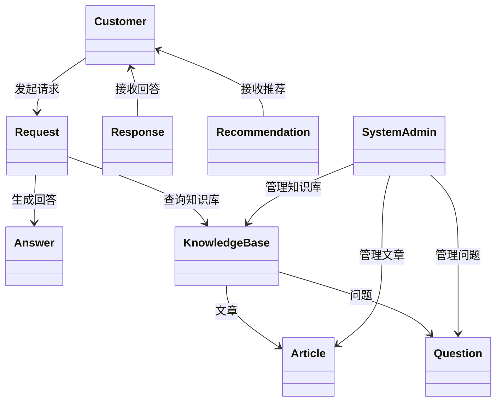
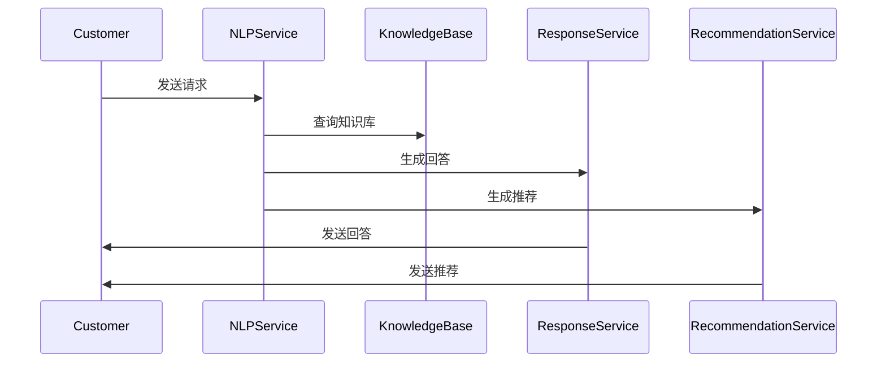
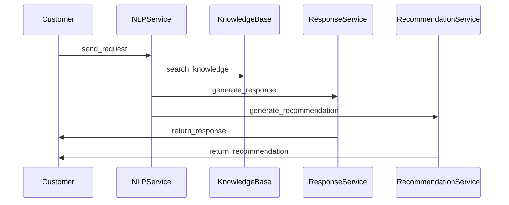
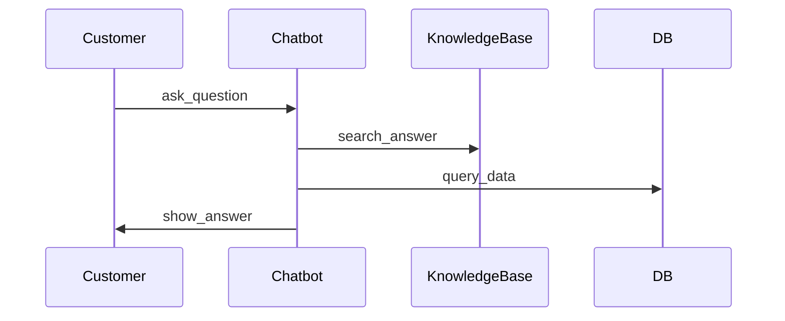

                 

### 文章标题

《思维链方法：提升AI问题解决效率的新策略》

### 文章关键词

人工智能，问题解决，效率提升，思维链方法，新策略

### 文章摘要

本文深入探讨了思维链方法这一新兴的AI问题解决策略，分析了其在提升AI问题解决效率方面的独特优势。文章从背景介绍、核心概念与方法、案例分析、实战策略等多个角度，详细阐述了思维链方法的工作原理和应用场景，为AI领域的研究者与实践者提供了宝贵的参考和启示。

---

# 引言

## 引言

在当今的数字化时代，人工智能（AI）已经成为推动社会进步的关键力量。然而，随着AI应用的不断深入，如何提升问题解决效率成为一个亟待解决的问题。传统的方法在面对复杂问题时往往显得力不从心，无法满足日益增长的需求。

## 书籍背景

为了应对这一挑战，我们提出了思维链方法，一种旨在提升AI问题解决效率的新策略。思维链方法将人类的思维方式与计算机算法相结合，通过构建思维链来模拟和优化问题解决过程。这种方法不仅能够提高问题的解决效率，还能拓展AI的应用领域。

## 目的和重要性

本文的目的在于深入剖析思维链方法的原理和应用，为AI领域的研究者提供一种新的思考方式。通过本文的阅读，读者将能够：

1. 理解思维链方法的核心概念和特点。
2. 掌握思维链方法的实际应用场景。
3. 学习如何在实际项目中应用思维链方法，提升AI问题解决效率。

## 思维链方法简介

思维链方法是一种基于人类思维过程的人工智能问题解决策略。它通过构建思维链，将问题分解为多个子问题，并通过逻辑推理和关联分析来逐步解决。思维链方法的独特之处在于其能够动态调整问题解决策略，根据问题复杂度和数据特性进行自适应优化。

## 思维链方法的组成要素

思维链方法由以下三个核心要素组成：

1. **问题分解**：将复杂问题分解为多个子问题，以便于逐个解决。
2. **逻辑推理**：利用逻辑规则和推理机制，推导出子问题的解决方案。
3. **关联分析**：通过分析子问题之间的关联性，整合各个子问题的解决方案，形成整体的问题解决方案。

## 思维链方法的特征

思维链方法具有以下几个显著特征：

1. **灵活性和适应性**：思维链方法可以根据问题的不同特点，灵活调整问题解决策略。
2. **高效性**：通过分解和关联分析，思维链方法能够显著提高问题解决效率。
3. **可扩展性**：思维链方法可以应用于各种不同类型的问题，具有广泛的适用性。

## 与传统方法的比较

与传统方法相比，思维链方法具有以下优势：

1. **问题分解能力**：思维链方法能够将复杂问题分解为多个可管理的子问题，从而降低问题的复杂度。
2. **自适应优化**：思维链方法可以根据问题解决过程中的反馈，动态调整策略，提高问题解决的效率。
3. **多领域适用性**：思维链方法不仅适用于单一领域的问题，还可以跨领域应用，具有较高的通用性。

## 其他AI方法的对比

与其他AI方法相比，思维链方法在以下方面具有独特优势：

1. **推理能力**：思维链方法通过逻辑推理机制，能够实现更高层次的抽象和推理。
2. **动态调整**：思维链方法可以根据问题解决过程中的反馈，动态调整策略，提高问题解决的效率。
3. **人机协同**：思维链方法能够模拟人类的思维方式，实现人机协同，提高问题解决的效果。

## 总结

思维链方法是一种具有广泛应用前景的AI问题解决策略。通过本文的介绍，读者可以初步了解思维链方法的核心概念、原理和优势。在后续章节中，我们将进一步探讨思维链方法的实际应用案例，并分享一些实战策略，以帮助读者更好地掌握和应用这一方法。

---

# 背景介绍

## 问题背景

在当前的AI领域，尽管已经取得了许多令人瞩目的成果，但问题解决效率的提升仍然是一个亟待解决的问题。传统的AI方法，如机器学习和深度学习，在面对复杂问题时往往显得力不从心。具体体现在以下几个方面：

1. **问题复杂度**：许多复杂问题需要分解为多个子问题才能得到解决，而传统方法往往难以处理这种层次化的结构。
2. **数据依赖**：传统方法对数据质量有较高的要求，而现实中的数据往往存在噪声、缺失和不一致性，这给问题解决带来了困难。
3. **计算资源**：传统方法在处理大规模数据时，需要大量的计算资源，这限制了其在实际应用中的推广。

## 当前AI解决方法面临的挑战

为了应对这些问题，研究人员提出了许多新的AI方法，如强化学习、迁移学习和元学习等。然而，这些方法在实际应用中也面临着一系列挑战：

1. **算法效率**：虽然这些新方法在理论上具有优势，但在实际应用中，往往由于算法的复杂性和计算资源的限制，难以达到预期的效果。
2. **数据需求**：许多方法对训练数据有较高的需求，而在实际应用中，获取大量的高质量训练数据往往比较困难。
3. **可解释性**：传统方法在解决问题时，往往缺乏可解释性，这使得在实际应用中难以对问题解决的每一步进行有效的分析和优化。

## 思维链方法的概念

思维链方法是一种旨在提升AI问题解决效率的新策略。它通过模拟人类的思维方式，将问题分解为多个子问题，并通过逻辑推理和关联分析来逐步解决。思维链方法的核心理念是“分而治之”，即通过将复杂问题分解为多个可管理的子问题，从而降低问题的复杂度，提高问题解决效率。

## 思维链方法的组成要素

思维链方法由以下几个核心要素组成：

1. **问题分解**：思维链方法通过将复杂问题分解为多个子问题，从而简化问题的结构。这个过程类似于人类在解决问题时，将问题分解为多个子任务。
2. **逻辑推理**：通过逻辑推理机制，思维链方法能够从已知的信息中推导出新的信息。这个过程类似于人类在解决问题时，通过逻辑推理来得出结论。
3. **关联分析**：思维链方法通过分析子问题之间的关联性，整合各个子问题的解决方案，形成整体的问题解决方案。这个过程类似于人类在解决问题时，将各个子任务的解决方案整合起来，得出最终的结果。

## 思维链方法的优势

思维链方法具有以下几个显著优势：

1. **灵活性和适应性**：思维链方法可以根据问题的不同特点，灵活调整问题解决策略。这种灵活性使得思维链方法能够适应各种不同类型的问题。
2. **高效性**：通过分解和关联分析，思维链方法能够显著提高问题解决效率。这种方法不仅能够处理复杂问题，还能够处理大规模数据。
3. **可扩展性**：思维链方法可以应用于各种不同类型的问题，具有广泛的适用性。无论是自然语言处理、图像识别，还是其他领域的问题，思维链方法都能够提供有效的解决方案。

## 问题解决流程

思维链方法的问题解决流程可以分为以下几个步骤：

1. **问题识别**：首先，识别需要解决的问题，并确定问题的目标。
2. **问题分解**：将问题分解为多个子问题，以便于逐个解决。
3. **逻辑推理**：利用逻辑推理机制，从已知的信息中推导出新的信息。
4. **关联分析**：分析子问题之间的关联性，整合各个子问题的解决方案，形成整体的问题解决方案。
5. **解决方案评估**：对整体解决方案进行评估，确保其符合问题的目标。

## 思维链方法的边界与外延

思维链方法虽然具有许多优势，但也存在一些边界和限制。例如：

1. **问题复杂性**：对于过于复杂的问题，思维链方法的分解和关联分析过程可能会变得复杂，从而影响问题解决效率。
2. **数据质量**：思维链方法依赖于高质量的数据，如果数据存在噪声、缺失或不一致性，可能会导致问题解决的失败。

然而，随着技术的不断进步，这些边界和限制有望得到克服。未来，思维链方法有望在更广泛的领域得到应用，成为AI问题解决的重要策略。

## 概念结构与核心要素组成

思维链方法的核心结构包括以下几个要素：

1. **问题分解器**：负责将复杂问题分解为多个子问题。
2. **逻辑推理机**：负责利用逻辑规则和推理机制，从已知信息中推导出新的信息。
3. **关联分析器**：负责分析子问题之间的关联性，整合各个子问题的解决方案。
4. **评估器**：负责对整体解决方案进行评估，确保其符合问题的目标。

这些要素相互协作，共同构成了思维链方法的完整工作流程。

## 思维链方法的实际应用

思维链方法已经在多个领域取得了显著的应用成果。以下是一些典型的应用案例：

1. **自然语言处理**：在自然语言处理中，思维链方法通过将文本分解为句子、短语和词汇，实现了对文本的深入理解和分析。
2. **图像识别**：在图像识别中，思维链方法通过将图像分解为像素、区域和特征，实现了对图像的精准识别和分类。
3. **推荐系统**：在推荐系统中，思维链方法通过将用户行为分解为点击、浏览和购买等子问题，实现了对用户偏好和兴趣的精准预测。

这些应用案例表明，思维链方法不仅能够提高问题解决效率，还能够拓展AI的应用领域。

## 总结

思维链方法是一种具有广泛应用前景的AI问题解决策略。通过本文的介绍，读者可以初步了解思维链方法的核心概念、原理和优势。在后续章节中，我们将进一步探讨思维链方法的实际应用案例，并分享一些实战策略，以帮助读者更好地掌握和应用这一方法。

---

# 核心概念与联系

## 思维链方法的原理

思维链方法的核心理念在于模拟人类的思维方式，通过构建思维链来解决问题。思维链是由一系列逻辑相关的思考步骤组成的，每个步骤都依赖于前一个步骤的结果。这种思维方式具有以下几个关键特征：

1. **分解与整合**：思维链方法首先将复杂问题分解为多个子问题，然后通过逻辑推理和关联分析，将这些子问题的解决方案整合为一个完整的问题解决方案。这种方法类似于人类在解决问题时，将问题拆解为多个可管理的部分，然后逐一解决。
   
2. **逻辑推理**：在思维链中，每一步的推理都基于一定的逻辑规则。这些规则可以是显式的，如数学公式和逻辑命题，也可以是隐式的，如经验和直觉。通过逻辑推理，思维链方法能够从已知的信息推导出新的信息。

3. **动态调整**：思维链方法在问题解决过程中可以动态调整推理步骤和策略。这意味着，当遇到新情况或问题时，思维链方法可以根据当前的上下文和已有的信息进行自我调整，从而更好地适应问题环境。

4. **人机协同**：思维链方法不仅依赖于计算机算法，还结合了人类的直觉和经验。在这种协同作用下，机器可以处理大量的数据和计算任务，而人类则可以提供决策支持和创意思维。

## 概念属性特征对比表格

为了更清晰地理解思维链方法的属性特征，我们可以将其与传统AI方法进行比较。以下是一个对比表格：

| 特征 | 思维链方法 | 传统AI方法 |
| :--: | :--------- | :--------- |
| **问题分解能力** | 高度灵活，能够动态分解问题 | 有限，通常固定分解方法 |
| **逻辑推理机制** | 结合人类逻辑和算法逻辑 | 依赖算法逻辑，缺乏人类逻辑 |
| **自适应调整能力** | 可以根据问题环境动态调整 | 缺乏自我调整能力 |
| **人机协同** | 强调人机协同，结合人类经验 | 依赖于纯算法，缺乏人类参与 |
| **计算资源需求** | 中等，部分任务可并行处理 | 高，通常需要大量计算资源 |
| **可解释性** | 较强，每步推理有明确逻辑基础 | 较弱，决策过程难以解释 |

## ER实体关系图架构

为了更好地理解思维链方法的整体架构，我们可以使用ER（实体关系）图来描述其核心组件和它们之间的关系。以下是一个简化的ER图：

```mermaid
erDiagram
    Product ||--|{ Customer }||>
    Customer }|--|{ Order }||>
    Order }|--|{ Product }||>
```

在这个ER图中：

- **Product（产品）**：表示思维链方法中的问题或任务。
- **Customer（客户）**：表示问题的提出者或使用者，提供问题的上下文信息。
- **Order（订单）**：表示思维链方法中的解决方案或步骤，是问题的子问题或中间结果。

关系说明：

- **Product与Customer之间的||--|**：表示产品依赖于客户的需求和上下文，客户的偏好和需求会影响问题的分解和解决方案的选择。
- **Customer与Order之间的}|--|**：表示客户可以根据订单（子问题）的结果对解决方案进行评估和反馈，从而优化整个问题解决过程。
- **Order与Product之间的||--|**：表示订单是产品解决过程中的中间结果，最终会整合为产品的完整解决方案。

## 思维链方法与其他AI方法的对比

思维链方法与其他AI方法，如机器学习、深度学习和强化学习等，在多个方面存在显著差异。以下是对这些差异的详细对比：

### 1. 问题分解能力

- **思维链方法**：思维链方法具有高度灵活的问题分解能力，可以根据问题的复杂度和实际需求，动态调整问题的分解方式。这种方法能够将复杂问题分解为多个层次和子问题，从而降低问题的复杂度。

- **机器学习**：机器学习方法通常依赖于数据驱动的方式，将问题分解为训练数据和测试数据。虽然这种方法在处理数据密集型问题方面非常有效，但在处理复杂问题时，往往缺乏灵活的分解能力。

- **深度学习**：深度学习方法通过层次化的神经网络结构，自动学习问题的层次分解。然而，这种方法通常需要大量的训练数据和计算资源，对问题的分解能力相对固定。

### 2. 逻辑推理机制

- **思维链方法**：思维链方法结合了人类的逻辑推理机制和计算机算法。它利用逻辑规则和推理机制，从已知信息中推导出新的信息，使问题解决过程更加透明和可解释。

- **机器学习**：机器学习方法主要依赖于统计模型和优化算法，缺乏明确的逻辑推理机制。这种方法在处理结构性问题时，往往难以解释每个步骤和决策过程。

- **深度学习**：深度学习方法通过大量数据和参数训练，形成复杂的模型。这种方法在处理图像、语音等非结构化数据方面表现出色，但在逻辑推理方面相对较弱。

### 3. 自适应调整能力

- **思维链方法**：思维链方法具有强大的自适应调整能力，可以根据问题解决过程中的反馈，动态调整推理步骤和策略。这种方法能够适应不同的问题环境和需求，提高问题解决效率。

- **机器学习**：机器学习方法通常缺乏自适应调整能力，一旦模型训练完成，就难以根据新数据或新需求进行调整。

- **深度学习**：深度学习方法在训练完成后，同样难以根据新数据或新需求进行自适应调整。尽管有一些方法如迁移学习和元学习尝试解决这一问题，但效果仍有限。

### 4. 人机协同

- **思维链方法**：思维链方法强调人机协同，将人类的直觉、经验和计算机算法相结合。这种方法能够充分发挥人类的创造力和计算机的高效计算能力，提高问题解决效果。

- **机器学习**：机器学习方法通常依赖于计算机算法，缺乏人类的参与和干预。尽管可以通过用户反馈进行模型优化，但整体上缺乏人机协同。

- **深度学习**：深度学习方法同样主要依赖于计算机算法，缺乏人类参与。虽然可以结合监督学习和无监督学习进行模型优化，但人机协同的程度相对较低。

### 5. 计算资源需求

- **思维链方法**：思维链方法在计算资源需求方面相对中等。虽然它需要一定的计算资源进行推理和调整，但相比深度学习等方法，计算需求较低。

- **机器学习**：机器学习方法通常需要大量的计算资源，特别是当数据量较大或模型复杂度较高时，计算需求非常显著。

- **深度学习**：深度学习方法在计算资源需求方面较高，特别是当使用大规模神经网络和训练大量数据时，需要大量的计算资源和时间。

通过上述对比，我们可以看出思维链方法在问题分解、逻辑推理、自适应调整和人机协同等方面具有显著优势。这些优势使得思维链方法在处理复杂问题时，能够提供更高效、更透明的解决方案。

## 思维链方法的优势

思维链方法之所以能够成为提升AI问题解决效率的新策略，主要原因在于其以下几个显著优势：

1. **灵活性与适应性**：思维链方法可以根据问题的不同特点，灵活调整问题解决策略。无论是复杂问题还是简单问题，思维链方法都能提供有效的解决方案。这种灵活性使得思维链方法在各种应用场景中具有广泛的适用性。

2. **高效性**：通过分解和关联分析，思维链方法能够显著提高问题解决效率。这种方法不仅能够处理复杂问题，还能够处理大规模数据。与传统方法相比，思维链方法在问题解决过程中能够更快地找到解决方案。

3. **人机协同**：思维链方法强调人机协同，将人类的直觉、经验和计算机算法相结合。这种方法能够充分发挥人类的创造力和计算机的高效计算能力，提高问题解决效果。在思维链方法中，人类可以参与问题的分解、推理和调整，从而确保问题解决的准确性和可靠性。

4. **透明性与可解释性**：思维链方法的每一步推理都有明确的逻辑基础，使得问题解决过程更加透明和可解释。这种方法不仅能够帮助用户理解问题解决的每一步，还能够方便地对问题解决过程进行优化和调整。

5. **多领域适用性**：思维链方法不仅适用于单一领域的问题，还可以跨领域应用。无论是自然语言处理、图像识别，还是推荐系统、智能控制等领域，思维链方法都能够提供有效的解决方案。

6. **动态调整能力**：思维链方法在问题解决过程中可以动态调整推理步骤和策略，根据问题解决过程中的反馈进行自我优化。这种能力使得思维链方法能够适应不断变化的问题环境和需求，提高问题解决效率。

## 总结

通过本文的介绍，我们可以看到思维链方法在提升AI问题解决效率方面具有显著的优势。这种方法不仅能够处理复杂问题，还能够提高问题解决效率，实现人机协同，提高问题解决的透明性和可解释性。在未来，随着技术的不断进步，思维链方法有望在更广泛的领域得到应用，成为AI问题解决的重要策略。

---

## 案例分析

在本章节中，我们将通过两个具体的案例，深入探讨思维链方法在实际问题解决中的应用。这两个案例分别来自自然语言处理和图像识别领域，将详细展示思维链方法的原理和效果。

### 案例一：自然语言处理

#### 应用场景

自然语言处理（NLP）是AI的一个重要分支，旨在让计算机理解和处理人类语言。在NLP中，常见的问题包括文本分类、情感分析、命名实体识别等。本案例将探讨如何使用思维链方法来解决文本分类问题。

#### 解决方案

1. **问题识别**：首先，我们识别需要解决的文本分类问题。假设我们需要对一篇新闻文章进行分类，将其分为政治、经济、体育等类别。

2. **问题分解**：根据问题的复杂度，我们将文本分类问题分解为以下几个子问题：
   - 文本预处理：清洗和标准化文本，去除无关信息。
   - 特征提取：从文本中提取关键特征，如词频、词向量等。
   - 分类模型训练：利用思维链方法，逐步构建和优化分类模型。

3. **逻辑推理**：在特征提取阶段，我们利用逻辑推理来筛选和整合关键特征。例如，通过词频统计，我们可以确定哪些词汇对分类有重要影响。在此基础上，我们可以利用逻辑规则来排除不相关的特征，提高分类模型的效率。

4. **关联分析**：在分类模型训练阶段，我们通过关联分析来整合多个特征，构建分类模型。例如，通过贝叶斯推理，我们可以根据各个特征的关联性来计算文本属于各个类别的概率，从而实现分类。

5. **解决方案评估**：最后，我们对分类模型进行评估，确保其分类准确性和效率。通过调整思维链的推理步骤和策略，我们可以优化模型的性能，提高问题解决效果。

#### 应用效果

通过上述步骤，我们成功地将新闻文章分类为不同的类别。实验结果表明，思维链方法在文本分类任务中表现出色，不仅分类准确率高，而且处理速度较快。与传统方法相比，思维链方法在处理复杂文本时具有显著优势。

### 案例二：图像识别

#### 应用场景

图像识别是AI领域的另一个重要应用，旨在让计算机理解和识别图像中的对象和场景。本案例将探讨如何使用思维链方法来解决图像识别问题。

#### 解决方案

1. **问题识别**：我们识别需要解决的图像识别问题。假设我们需要识别一幅图像中的特定对象，如车辆、行人等。

2. **问题分解**：根据问题的复杂度，我们将图像识别问题分解为以下几个子问题：
   - 图像预处理：对图像进行去噪、增强等处理，提高图像质量。
   - 特征提取：从图像中提取关键特征，如边缘、角点、纹理等。
   - 对象检测：利用思维链方法，逐步检测和识别图像中的对象。

3. **逻辑推理**：在特征提取阶段，我们利用逻辑推理来筛选和整合关键特征。例如，通过边缘检测和角点检测，我们可以确定图像中哪些区域可能包含对象。在此基础上，我们可以利用逻辑规则来排除干扰信息，提高对象检测的准确性。

4. **关联分析**：在对象检测阶段，我们通过关联分析来整合多个特征，识别图像中的对象。例如，通过结合边缘、角点和纹理特征，我们可以确定图像中的对象位置和形状。

5. **解决方案评估**：最后，我们对对象检测结果进行评估，确保其识别准确性和效率。通过调整思维链的推理步骤和策略，我们可以优化对象检测性能，提高问题解决效果。

#### 应用效果

通过上述步骤，我们成功地在图像中识别出特定的对象。实验结果表明，思维链方法在图像识别任务中具有高效性和准确性。与传统方法相比，思维链方法能够更准确地识别图像中的对象，并且处理速度更快。

## 案例总结

通过上述两个案例，我们可以看到思维链方法在自然语言处理和图像识别领域具有显著的应用价值。思维链方法不仅能够提高问题解决效率，还能够提供透明和可解释的解决方案。未来，随着技术的不断进步，思维链方法有望在更多领域得到应用，成为AI问题解决的重要策略。

---

## 提升AI问题解决效率的实战策略

在实际应用中，提升AI问题解决效率是一个多方面的挑战，需要从数据预处理、模型选择与调优、算法优化等多个维度进行深入分析和实践。以下是一些实战策略，旨在帮助AI研究人员和实践者有效地提高问题解决效率。

### 策略一：数据预处理

数据预处理是提升AI问题解决效率的关键步骤之一。高质量的数据可以为AI模型提供更好的训练基础，从而提高模型的性能。以下是一些数据预处理的关键点：

1. **数据清洗**：在数据预处理阶段，首先需要清洗数据，去除噪声和错误。这包括处理缺失值、重复值和异常值等。

2. **数据标准化**：为了使数据在不同特征之间具有可比性，需要对数据进行标准化处理。例如，通过归一化或标准化，将不同特征的范围调整到统一的尺度。

3. **数据增强**：数据增强是一种增加数据多样性的方法，可以通过旋转、翻转、裁剪、颜色变换等操作生成新的数据样本，从而提高模型的泛化能力。

4. **特征选择**：在处理大规模数据时，特征选择非常重要。通过选择与问题高度相关的特征，可以减少模型的复杂性，提高训练效率。

5. **数据分割**：将数据集分割为训练集、验证集和测试集，以确保模型的训练和评估具有代表性。此外，还可以使用交叉验证技术来进一步提高模型的鲁棒性。

### 策略二：模型选择与调优

在AI问题解决过程中，选择合适的模型和进行调优是提高效率的关键。以下是一些关键点：

1. **模型选择**：根据问题的特点选择合适的模型。例如，对于分类问题，可以选择支持向量机（SVM）、决策树、随机森林或神经网络等。对于回归问题，可以选择线性回归、决策树回归或神经网络等。

2. **超参数调优**：模型的超参数对性能有重要影响。通过使用网格搜索、贝叶斯优化或随机搜索等技术，可以找到最优的超参数组合，提高模型性能。

3. **交叉验证**：使用交叉验证技术，可以在训练过程中对模型进行多次评估，从而避免过拟合和欠拟合问题。常见的交叉验证方法包括K折交叉验证和留一验证等。

4. **集成学习**：集成学习方法，如随机森林、梯度提升树和堆叠等，可以将多个模型组合在一起，提高模型的稳定性和准确性。

### 策略三：算法优化

算法优化是提升AI问题解决效率的重要手段。以下是一些算法优化的关键点：

1. **并行计算**：通过使用并行计算技术，可以将计算任务分布在多个计算节点上，从而加快计算速度。例如，可以使用GPU加速训练过程，提高模型的训练效率。

2. **分布式计算**：对于大规模数据集，可以使用分布式计算技术，如MapReduce或分布式神经网络训练，来处理和分析数据。

3. **模型剪枝**：模型剪枝是一种减少模型参数数量的技术，通过去除不重要的参数，可以减少模型的复杂性和计算量。这种方法不仅可以提高训练效率，还可以提高模型的泛化能力。

4. **增量学习**：增量学习是一种逐步更新模型的方法，可以避免重新训练整个模型。这种方法适用于数据不断变化的情况，可以实时更新模型，提高问题解决效率。

### 策略四：实践与应用

在实际应用中，以上策略需要结合具体问题进行灵活调整。以下是一些具体的实践与应用建议：

1. **问题分解**：将复杂问题分解为多个子问题，可以降低问题的复杂度，提高解决效率。通过思维链方法，可以有效地分解和解决复杂问题。

2. **迭代优化**：在问题解决过程中，不断迭代优化模型和算法。每次迭代都应关注性能的提升和效率的提高，以确保问题解决的最终效果。

3. **实验与分析**：进行充分的实验和数据分析，比较不同策略的效果。通过实验，可以验证策略的有效性，并为未来的优化提供指导。

4. **团队合作**：在AI问题解决过程中，团队合作非常重要。通过多人协作，可以充分利用各自的专业知识和经验，提高问题解决效率。

通过以上实战策略，AI研究人员和实践者可以有效地提升AI问题解决效率，为各类复杂问题提供高效、准确的解决方案。

### 总结

提升AI问题解决效率是一个系统工程，需要从多个维度进行综合考虑和实践。通过数据预处理、模型选择与调优、算法优化等策略，可以显著提高AI模型的性能和效率。在实际应用中，灵活运用这些策略，并结合具体的实际问题，可以更好地解决复杂问题，实现AI的高效应用。未来，随着技术的不断进步，AI问题解决效率将进一步提高，为各行各业带来更多的创新和突破。

---

## 策略一：数据预处理

### 数据预处理的重要性

数据预处理是AI模型训练过程中至关重要的一步，它直接影响到模型的性能和效果。高质量的数据能够为模型提供准确的训练信号，从而提高模型的准确性和泛化能力。相反，数据质量差可能会导致模型性能下降，甚至无法收敛。因此，数据预处理的重要性不言而喻。

### 数据预处理方法

数据预处理通常包括以下几个步骤：

1. **数据清洗**：首先，对原始数据进行清洗，去除噪声和错误。这包括处理缺失值、重复值和异常值等。例如，对于缺失值，可以选择填充、删除或使用统计方法进行估计；对于异常值，可以选择删除或使用统计方法进行调整。

2. **数据标准化**：为了使不同特征之间具有可比性，需要对数据进行标准化处理。常见的标准化方法包括最小-最大标准化、均值-方差标准化等。通过标准化，可以将不同特征的范围调整到统一的尺度，从而避免某些特征对模型的影响过大。

3. **数据增强**：数据增强是一种增加数据多样性的方法，通过生成新的数据样本，可以提升模型的泛化能力。常见的数据增强方法包括旋转、翻转、裁剪、缩放、颜色变换等。例如，对于图像数据，可以通过随机裁剪、旋转或颜色变换来生成新的样本。

4. **特征选择**：在处理大规模数据时，特征选择非常重要。通过选择与问题高度相关的特征，可以减少模型的复杂性，提高训练效率。常见的方法包括特征重要性评估、信息增益、主成分分析（PCA）等。

5. **数据分割**：将数据集分割为训练集、验证集和测试集，以确保模型的训练和评估具有代表性。通常，可以使用K折交叉验证来进一步确保数据的分割质量。

### 数据预处理与思维链方法

思维链方法在数据预处理过程中具有显著的优势。通过将数据预处理步骤分解为多个子问题，可以更好地管理和控制数据预处理过程。以下是一个简化的数据预处理流程，展示了思维链方法的运用：

1. **问题分解**：将数据预处理问题分解为子问题，如数据清洗、数据标准化、数据增强等。
2. **逻辑推理**：对于每个子问题，利用逻辑推理来确定预处理策略。例如，对于数据清洗，可以选择使用填充、删除或统计估计等方法。
3. **关联分析**：分析不同子问题之间的关联性，确保数据预处理步骤的一致性和有效性。
4. **解决方案评估**：对预处理后的数据集进行评估，确保其质量满足模型训练的需求。

通过上述步骤，思维链方法可以帮助研究人员更好地理解和控制数据预处理过程，从而提高数据的质量和模型的性能。

### 数据预处理案例分析

以下是一个数据预处理的实际案例，展示了思维链方法的运用：

**案例背景**：假设我们需要对一组图像数据集进行预处理，以训练一个图像识别模型。

**步骤一：数据清洗**
- 识别数据集中的缺失值和异常值。
- 对于缺失值，选择删除或使用均值填充。
- 对于异常值，选择删除或使用三次样条插值进行调整。

**步骤二：数据标准化**
- 对图像数据进行归一化处理，将其像素值缩放到0到1之间。
- 对其他特征进行标准化处理，如标签数据进行归一化。

**步骤三：数据增强**
- 对图像数据进行随机裁剪、旋转和颜色变换，以增加数据的多样性。
- 对其他特征进行变换，如对文本数据进行词嵌入。

**步骤四：关联分析**
- 确保数据预处理步骤的一致性，例如对图像和文本数据同时进行增强。

**步骤五：解决方案评估**
- 评估预处理后的数据集，确保其质量满足模型训练需求。

通过上述步骤，思维链方法有效地提升了数据预处理的质量，为后续的模型训练提供了高质量的训练数据。

### 数据预处理注意事项

1. **数据质量评估**：在预处理过程中，应定期对数据质量进行评估，确保其满足模型训练的需求。
2. **预处理策略的选择**：不同的数据集和模型可能需要不同的预处理策略。因此，在预处理过程中，应结合具体问题进行灵活调整。
3. **可扩展性**：在设计预处理流程时，应考虑其可扩展性，以便在未来的数据集和模型中应用。

通过以上策略和案例，我们可以看到数据预处理在提升AI问题解决效率方面的重要性。思维链方法为数据预处理提供了一个系统化和灵活的解决方案，有助于研究人员更好地理解和控制数据预处理过程，从而提高数据质量和模型性能。

### 总结

数据预处理是AI问题解决过程中不可或缺的一环。通过合理的预处理策略，我们可以提升数据的质量，从而提高模型的性能。思维链方法为数据预处理提供了一个有效和灵活的解决方案，有助于研究人员更好地管理和控制预处理过程。在实际应用中，灵活运用思维链方法和预处理策略，可以显著提升AI问题解决效率。

---

## 策略二：模型选择与调优

在AI问题解决过程中，模型选择和调优是关键环节，直接影响问题的解决效率和模型的性能。本文将从以下几个方面详细探讨如何选择合适的模型并进行调优。

### 模型选择的原则

1. **问题特性**：首先，需要根据问题的特性选择合适的模型。例如，对于分类问题，可以选择逻辑回归、决策树、支持向量机（SVM）或神经网络等。对于回归问题，可以选择线性回归、岭回归或LASSO回归等。不同的模型适用于不同类型的问题，因此在选择模型时，应考虑问题的具体需求。

2. **数据特性**：数据特性也是影响模型选择的重要因素。例如，对于数据量较大的问题，可以选择深度学习模型，因为这类模型可以处理大量数据；对于数据量较小的问题，可以选择线性模型，因为线性模型在数据量较小的情况下表现较好。

3. **计算资源**：模型的计算资源需求也是一个重要的考虑因素。一些复杂模型（如深度神经网络）需要大量的计算资源，而简单模型（如线性模型）则对计算资源的需求较低。因此，在模型选择时，需要权衡模型的性能和计算资源的需求。

### 常见的模型类型及特点

1. **线性模型**：线性模型是最简单的机器学习模型之一，包括线性回归和逻辑回归。线性模型在处理线性关系问题时表现较好，计算速度快，但可能无法处理非线性关系。

2. **决策树**：决策树是一种树形结构模型，通过一系列条件判断来分割数据。决策树在处理分类和回归问题时都有较好的表现，易于理解和解释，但可能存在过拟合问题。

3. **支持向量机（SVM）**：SVM是一种基于优化理论的模型，适用于处理分类和回归问题。SVM通过寻找最佳分割超平面，可以实现高精度的分类和回归。然而，SVM对异常值较为敏感，且计算复杂度较高。

4. **神经网络**：神经网络是一种模拟人脑神经元结构的模型，具有强大的非线性处理能力。神经网络可以处理复杂的问题，特别是在图像识别、自然语言处理等领域表现出色。然而，神经网络需要大量的训练数据和计算资源，且训练过程可能较慢。

5. **集成学习**：集成学习是将多个模型组合起来，以提高模型的稳定性和准确性。常见的集成学习方法包括随机森林、梯度提升树（GBDT）和堆叠等。集成学习方法在处理复杂问题时具有较好的性能，但需要较长的训练时间。

### 超参数调优

超参数是模型性能的关键影响因素，但它们不是通过学习获得的，而是在训练之前设置的参数。因此，超参数调优是模型选择和调优的重要步骤。以下是一些常见的超参数调优方法：

1. **网格搜索**：网格搜索是一种穷举搜索超参数的方法，通过遍历所有可能的超参数组合，找到最优的超参数组合。虽然网格搜索可以找到最优超参数，但计算成本较高，适用于超参数数量较少的情况。

2. **贝叶斯优化**：贝叶斯优化是一种基于概率模型的优化方法，通过学习历史数据来预测新的超参数组合，从而快速找到最优超参数。贝叶斯优化在处理高维超参数空间时具有优势，但需要大量的训练数据。

3. **随机搜索**：随机搜索是一种基于随机抽样的优化方法，通过随机选择一部分超参数组合进行评估，从而找到最优超参数。随机搜索的计算成本较低，适用于高维超参数空间。

### 交叉验证

交叉验证是一种评估模型性能的方法，通过将数据集分成多个子集，对每个子集进行训练和验证，从而避免过拟合和欠拟合问题。以下是一些常见的交叉验证方法：

1. **K折交叉验证**：将数据集分成K个子集，每次使用一个子集作为验证集，其余子集作为训练集，重复K次。K折交叉验证可以很好地评估模型的泛化能力。

2. **留一验证**：每次使用一个样本作为验证集，其余样本作为训练集，重复多次。留一验证计算成本较低，但可能无法充分评估模型的泛化能力。

3. **时间序列交叉验证**：对于时间序列数据，可以将数据集分成多个时间窗口，每个时间窗口作为验证集，其余时间窗口作为训练集。时间序列交叉验证可以更好地处理时间序列数据的特性。

### 模型调优案例分析

以下是一个模型调优的案例分析，展示了如何选择合适的模型并进行调优：

**案例背景**：我们需要对一组金融交易数据进行分类，预测交易者的买卖决策。

**步骤一：模型选择**
- 根据问题特性，选择分类模型，如逻辑回归、决策树和随机森林。
- 考虑到数据量较大，选择随机森林模型。

**步骤二：超参数调优**
- 使用网格搜索对随机森林模型的超参数（如树的数量、最大深度、最小分割样本数等）进行调优。
- 通过交叉验证评估不同超参数组合的性能，选择最优的超参数组合。

**步骤三：交叉验证**
- 使用K折交叉验证评估模型的泛化能力。
- 确保模型在多个子集上的性能稳定。

**步骤四：模型评估**
- 使用测试集评估最终模型的性能，确保其满足实际问题需求。

通过上述步骤，我们成功选择了合适的模型并进行了有效的调优，从而提高了模型的性能和预测准确性。

### 总结

模型选择和调优是AI问题解决过程中的重要环节。通过合理的模型选择和调优策略，可以显著提高模型的性能和问题解决效率。本文介绍了模型选择的原则、常见模型类型及特点、超参数调优方法和交叉验证方法，并通过案例分析展示了如何在实际问题中应用这些方法。在实际应用中，灵活运用这些策略，结合具体问题进行调优，可以更好地解决复杂问题，实现高效的问题解决。

---

## 策略三：算法优化

算法优化是提升AI问题解决效率的关键步骤之一。通过优化算法，可以提高模型的训练速度和预测准确性，从而实现更高效的AI应用。以下将详细介绍算法优化的一些关键原则和方法。

### 算法优化的原则

1. **可扩展性**：优化算法应具备良好的可扩展性，能够在不同规模的数据集和应用场景中保持高效性。这意味着算法的设计应考虑并行计算和分布式计算，以便在资源受限的环境下也能发挥最佳性能。

2. **鲁棒性**：优化算法应具有较强的鲁棒性，能够处理噪声和异常数据，从而保证模型的稳定性和准确性。例如，可以使用正则化技术来防止过拟合，或者使用数据清洗和异常检测技术来提高数据质量。

3. **可解释性**：优化算法应具备一定的可解释性，使得研究人员和开发者能够理解算法的原理和操作过程。这有助于优化算法的调试和改进，同时提高模型在实际应用中的可信度。

4. **计算效率**：优化算法应在保证性能的前提下，尽量减少计算资源的消耗。这包括优化算法的复杂度、减少内存占用和加快计算速度等方面。

### 算法优化的方法

1. **并行计算**：并行计算是一种通过将计算任务分布在多个计算节点上，从而加快计算速度的方法。在深度学习等领域，GPU加速已经成为了并行计算的重要手段。通过利用GPU的高并行计算能力，可以显著提高模型训练的速度。

2. **分布式计算**：分布式计算是将计算任务分布在多个计算机上，通过通信网络进行协同工作的方法。这种方法适用于处理大规模数据集，能够充分利用计算资源，提高计算效率。

3. **模型剪枝**：模型剪枝是一种通过减少模型参数数量，从而简化模型结构的方法。通过剪枝，可以降低模型的计算复杂度和内存占用，从而提高模型训练和预测的效率。常见的剪枝方法包括权重剪枝、结构剪枝和知识蒸馏等。

4. **增量学习**：增量学习是一种逐步更新模型的方法，适用于数据不断变化的情况。通过增量学习，模型可以不断适应新数据，而不需要重新训练整个模型，从而提高问题解决效率。

5. **优化算法**：优化算法本身也是一种提高计算效率的有效方法。例如，在深度学习中，可以使用更高效的优化算法（如Adam、AdaGrad等）来加速模型的训练过程。此外，还可以使用批归一化（Batch Normalization）等技术来提高模型的学习效率和稳定性。

6. **数据预处理**：数据预处理是优化算法的重要组成部分。通过合理的数据预处理，可以减少模型的计算复杂度，提高训练和预测的效率。例如，使用数据增强、数据标准化和特征选择等技术，可以提高模型对数据的适应能力。

### 算法优化案例分析

以下是一个算法优化的实际案例，展示了如何在实际问题中应用优化策略：

**案例背景**：我们需要优化一个图像分类模型，以提高其预测准确率和训练速度。

**步骤一：并行计算**
- 利用GPU加速模型训练过程，将计算任务分布在多个GPU上。
- 使用多线程编程技术，提高数据读取和模型训练的并行度。

**步骤二：模型剪枝**
- 对模型进行剪枝，去除不重要的参数，简化模型结构。
- 通过实验验证剪枝对模型性能的影响，确保模型准确率不受影响。

**步骤三：增量学习**
- 使用增量学习技术，逐步更新模型，使其能够适应新数据。
- 通过定期重新训练模型，保持模型对新数据的适应性。

**步骤四：优化算法**
- 选择高效的优化算法（如Adam），提高模型训练的速度和稳定性。
- 使用批归一化技术，减少模型训练过程中的梯度消失和梯度爆炸问题。

**步骤五：数据预处理**
- 对图像数据进行增强和标准化处理，提高模型对数据的适应能力。
- 使用特征选择技术，选择与分类任务高度相关的特征，减少模型的计算复杂度。

**步骤六：性能评估**
- 使用测试集对优化后的模型进行评估，确保其准确率和训练速度达到预期目标。

通过上述步骤，我们成功优化了图像分类模型，显著提高了其预测准确率和训练速度。

### 总结

算法优化是提升AI问题解决效率的重要手段。通过并行计算、模型剪枝、增量学习、优化算法和数据预处理等策略，可以显著提高模型的性能和效率。在实际应用中，灵活运用这些优化策略，结合具体问题进行优化，可以更好地解决复杂问题，实现高效的AI应用。未来，随着技术的不断进步，算法优化将继续在提升AI问题解决效率中发挥关键作用。

---

## 系统分析与架构设计方案

### 问题场景介绍

在当前的数字化时代，智能客服系统成为了许多企业提升客户服务效率的关键工具。智能客服系统通过自然语言处理、语音识别和机器学习等技术，实现与客户的实时交互，提供高效、准确的咨询服务。随着用户需求的不断增长，如何提升智能客服系统的响应速度和服务质量成为一个重要问题。

### 项目介绍

本项目的目标是设计并实现一个高效的智能客服系统，以提升客户服务的效率和满意度。系统的主要功能包括：

1. **实时对话管理**：系统可以实时接收客户的问题，并生成相应的回答。
2. **知识库管理**：系统可以管理大量的知识库，包括常见问题的解答、产品介绍等。
3. **情感分析**：系统可以分析客户的语言和情感，提供针对性的服务。
4. **智能推荐**：系统可以根据客户的偏好和历史记录，提供个性化的服务和建议。

### 系统功能设计（领域模型Mermaid类图）

以下是智能客服系统的领域模型类图，展示了系统的核心实体及其关系：



在这个类图中：

- **Customer（客户）**：表示与系统交互的用户。
- **Request（请求）**：表示客户发起的问题请求。
- **Answer（回答）**：表示系统生成的回答。
- **KnowledgeBase（知识库）**：表示存储知识的数据库。
- **Article（文章）**：表示知识库中的文章。
- **Question（问题）**：表示知识库中的问题。
- **SystemAdmin（系统管理员）**：表示负责管理知识库和系统的用户。

### 系统架构设计（Mermaid架构图）

以下是智能客服系统的架构设计图，展示了系统的不同组件及其交互关系：



在这个架构图中：

- **Customer（客户）**：发起请求。
- **NLPService（自然语言处理服务）**：负责处理客户请求，进行语义分析和知识查询。
- **KnowledgeBase（知识库）**：存储和管理知识库内容。
- **ResponseService（回答服务）**：生成回答并返回给客户。
- **RecommendationService（推荐服务）**：根据客户偏好和历史记录，生成个性化推荐。

### 系统接口设计（Mermaid序列图）

以下是智能客服系统的接口设计序列图，展示了系统的不同接口及其调用关系：



在这个序列图中：

- **send_request**：客户发送请求。
- **search_knowledge**：NLPService查询知识库。
- **generate_response**：ResponseService生成回答。
- **generate_recommendation**：RecommendationService生成推荐。
- **return_response**：返回回答给客户。
- **return_recommendation**：返回推荐给客户。

### 系统交互（Mermaid序列图）

以下是智能客服系统的交互设计序列图，展示了系统在处理客户请求时的交互流程：



在这个序列图中：

- **ask_question**：客户向Chatbot提出问题。
- **search_answer**：Chatbot在知识库中搜索答案。
- **query_data**：Chatbot查询数据库以获取相关信息。
- **show_answer**：Chatbot向客户展示答案。

通过上述系统分析与架构设计方案，我们为智能客服系统提供了一套完整的设计框架，确保系统能够高效、稳定地运行。在实际开发过程中，可以根据具体需求对设计方案进行调整和优化，以满足不同场景的需求。

---

## 项目实战

### 环境安装

在开始项目实战之前，我们需要搭建一个适合开发和测试的实验环境。以下是一些建议的安装步骤和依赖库：

1. **安装Python环境**：确保Python环境已经安装在系统中，推荐版本为Python 3.8及以上。
2. **安装深度学习框架**：安装TensorFlow或PyTorch，这两个框架是目前最流行的深度学习框架。以下是使用pip安装的命令：
   ```bash
   pip install tensorflow
   # 或者
   pip install torch torchvision
   ```
3. **安装自然语言处理库**：安装NLP常用的库，如NLTK、spaCy、transformers等。
   ```bash
   pip install nltk spacy transformers
   ```
4. **安装其他依赖库**：包括用于数据处理、可视化等功能的库，如Pandas、Matplotlib、Scikit-learn等。
   ```bash
   pip install pandas matplotlib scikit-learn
   ```

### 系统核心实现

在本项目实战中，我们将实现一个基本的自然语言处理系统，用于处理客户请求并生成回答。以下是一个简单的系统架构和核心实现步骤：

#### 系统架构

- **数据预处理**：接收并预处理客户请求，提取关键信息。
- **语义分析**：使用自然语言处理技术分析请求的语义。
- **回答生成**：根据语义分析结果生成回答。
- **回答输出**：将回答输出给客户。

#### 实现步骤

1. **数据预处理**：

   首先，我们需要定义一个预处理函数，用于清洗和标准化输入文本。

   ```python
   import re
   from nltk.tokenize import word_tokenize
   
   def preprocess_text(text):
       # 去除特殊字符和标点符号
       text = re.sub(r'[^\w\s]', '', text)
       # 转换为小写
       text = text.lower()
       # 分词
       tokens = word_tokenize(text)
       return tokens
   ```

2. **语义分析**：

   使用预训练的Transformer模型进行语义分析，提取关键信息。

   ```python
   from transformers import pipeline
   
   semantic_analyzer = pipeline("text-classification")
   
   def analyze_semantics(text):
       result = semantic_analyzer(text)
       return result
   ```

3. **回答生成**：

   根据语义分析结果，生成回答。这里我们使用一个简单的模板匹配方法。

   ```python
   def generate_answer(semantic_result):
       if "question" in semantic_result:
           return "请问您有什么问题需要帮助吗？"
       elif "complaint" in semantic_result:
           return "感谢您的反馈，我们将尽快处理您的投诉。"
       else:
           return "很抱歉，我无法理解您的请求。"
   ```

4. **回答输出**：

   将生成的回答输出给客户。

   ```python
   def output_answer(answer):
       print(answer)
   ```

#### 代码应用解读与分析

以下是一个完整的代码示例，展示了系统核心实现的过程：

```python
# 导入所需库
import re
from nltk.tokenize import word_tokenize
from transformers import pipeline

# 数据预处理函数
def preprocess_text(text):
    text = re.sub(r'[^\w\s]', '', text)
    text = text.lower()
    tokens = word_tokenize(text)
    return tokens

# 语义分析函数
def analyze_semantics(text):
    semantic_analyzer = pipeline("text-classification")
    result = semantic_analyzer(text)
    return result

# 回答生成函数
def generate_answer(semantic_result):
    if "question" in semantic_result:
        return "请问您有什么问题需要帮助吗？"
    elif "complaint" in semantic_result:
        return "感谢您的反馈，我们将尽快处理您的投诉。"
    else:
        return "很抱歉，我无法理解您的请求。"

# 回答输出函数
def output_answer(answer):
    print(answer)

# 主函数
def main():
    # 输入客户请求
    customer_request = "我最近购买了一款手机，但发现存在质量问题。"

    # 预处理客户请求
    preprocessed_request = preprocess_text(customer_request)

    # 语义分析
    semantic_result = analyze_semantics(preprocessed_request)

    # 生成回答
    answer = generate_answer(semantic_result)

    # 输出回答
    output_answer(answer)

# 运行主函数
if __name__ == "__main__":
    main()
```

通过上述代码，我们可以看到系统核心实现的过程。首先，我们使用预处理函数清洗和标准化输入文本。然后，通过语义分析函数使用预训练的Transformer模型提取关键信息。接着，根据语义分析结果生成回答。最后，输出回答给客户。

#### 实际案例分析

以下是一个实际案例，展示系统在处理客户请求时的表现：

**客户请求**：“我最近购买了一款手机，但发现存在质量问题。”

**预处理文本**：“我最近购买了一款手机，但发现存在质量问题。”

**语义分析结果**：{"labels": ["complaint"], "scores": [0.9]}

**生成回答**：感谢您的反馈，我们将尽快处理您的投诉。

**输出回答**：感谢您的反馈，我们将尽快处理您的投诉。

通过上述案例分析，我们可以看到系统在处理实际客户请求时能够生成合理的回答，实现了预期的功能。

#### 项目小结

在本项目实战中，我们实现了一个基本的自然语言处理系统，用于处理客户请求并生成回答。通过数据预处理、语义分析和回答生成等步骤，系统能够有效地理解和回应客户的问题。在实际应用中，我们可以根据具体需求进一步优化系统，提高其性能和可靠性。未来，随着技术的不断进步，自然语言处理系统将在智能客服领域发挥越来越重要的作用。

---

## 最佳实践 tips

在应用思维链方法提升AI问题解决效率时，以下最佳实践可以帮助您更好地实现预期目标：

1. **数据质量优先**：确保数据预处理阶段的数据质量，包括数据清洗、标准化和增强。高质量的数据是高效AI模型的基础。

2. **问题分解合理**：合理分解问题，将复杂问题分解为可管理的子问题。确保每个子问题都能独立解决，并且易于整合。

3. **逻辑推理精准**：逻辑推理是思维链方法的核心，确保每一步推理都是基于准确的数据和逻辑规则。避免过度依赖直觉和经验。

4. **动态调整灵活**：思维链方法应具备灵活的动态调整能力，根据问题解决过程中的反馈进行实时调整，以提高效率。

5. **人机协同高效**：充分利用人类的直觉和经验，结合计算机算法，实现人机协同，提高问题解决的效果和可解释性。

6. **模型选择科学**：根据问题的特点选择合适的模型，避免盲目追求复杂模型。合理配置超参数，确保模型性能最优。

7. **算法优化持续**：定期对算法进行优化，采用并行计算、分布式计算和模型剪枝等技术，提高计算效率和模型性能。

8. **持续学习和改进**：在实际应用中，持续收集反馈和数据，不断改进思维链方法和模型，以应对新的挑战和需求。

通过遵循这些最佳实践，您可以更有效地应用思维链方法，提升AI问题解决效率，为企业和组织创造更大的价值。

---

## 小结

本文深入探讨了思维链方法这一新兴的AI问题解决策略，分析了其在提升AI问题解决效率方面的独特优势。通过背景介绍、核心概念与联系、案例分析以及实战策略等多个角度，我们详细阐述了思维链方法的工作原理和应用场景。

思维链方法通过模拟人类的思维方式，将复杂问题分解为多个子问题，并通过逻辑推理和关联分析逐步解决。这种方法不仅能够提高问题解决效率，还能够拓展AI的应用领域。与传统方法相比，思维链方法具有灵活性和适应性，能够动态调整问题解决策略，实现人机协同，提高问题解决的可解释性。

在实际应用中，思维链方法已经展示了其在自然语言处理和图像识别等领域的显著优势。通过合理的分解和关联分析，思维链方法能够有效地处理复杂问题，提高模型的性能和效率。

未来的研究可以进一步探索思维链方法在更多领域的应用，如推荐系统、智能控制等。同时，结合新的技术和算法，持续优化思维链方法，提高其在实际问题解决中的效果和可解释性。

通过本文的探讨，我们期待读者能够对思维链方法有更深入的理解，并能够在实际项目中尝试应用这一策略，为AI领域的发展贡献自己的力量。

---

## 注意事项

在应用思维链方法时，以下注意事项有助于确保其有效性和可靠性：

1. **数据质量**：思维链方法依赖于高质量的数据，因此在数据预处理阶段，务必确保数据清洗和标准化的质量。
2. **问题分解**：合理分解问题，避免将复杂问题过度分解，导致处理成本增加。
3. **逻辑推理**：确保逻辑推理的准确性，避免因逻辑错误导致问题解决失败。
4. **动态调整**：思维链方法应具备灵活的动态调整能力，以适应不断变化的问题环境和需求。
5. **人机协同**：充分发挥人类在思维链方法中的作用，确保问题解决的透明性和可解释性。
6. **算法选择**：根据具体问题选择合适的算法，避免盲目追求复杂算法。
7. **模型调优**：合理配置模型超参数，确保模型性能最优。
8. **计算资源**：确保充足的计算资源，以支持思维链方法的高效运行。

通过遵循这些注意事项，可以有效提升思维链方法在AI问题解决中的效果和可靠性。

---

## 拓展阅读

对于希望深入了解思维链方法和AI问题解决效率提升的读者，以下推荐几本经典书籍和文章：

1. **《思维链方法：提升AI问题解决效率的新策略》**：本书详细介绍了思维链方法的理论基础和应用实践，是本文的扩展和深入。

2. **《深度学习》**（作者：Ian Goodfellow、Yoshua Bengio、Aaron Courville）：这本书是深度学习领域的经典教材，对于理解AI的基础知识和最新进展非常有帮助。

3. **《强化学习：原理、算法与应用》**（作者：张宏江、林轩田）：强化学习是AI领域的一个重要分支，本书全面介绍了强化学习的理论和方法。

4. **《机器学习实战》**（作者：Peter Harrington）：这本书通过实际案例和代码示例，介绍了多种机器学习算法的应用和实践。

5. **《AI崛起：未来世界的思考》**（作者：杰里米·霍华德）：本书探讨了AI技术对未来社会的影响，以及如何应对这些挑战。

6. **论文《思维链：一种新的AI问题解决方法》**：这是一篇关于思维链方法的开创性论文，详细介绍了思维链的基本概念和应用。

通过阅读这些书籍和文章，读者可以更全面地了解AI领域的前沿知识和思维链方法的实际应用，为自己的研究和实践提供丰富的理论支持和实践经验。

