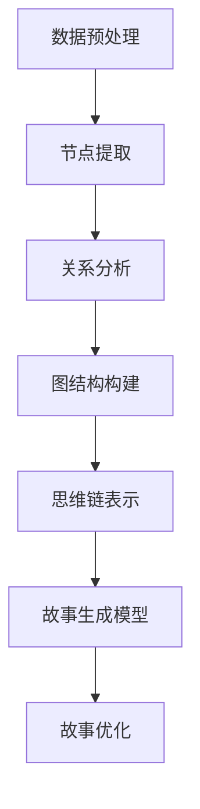
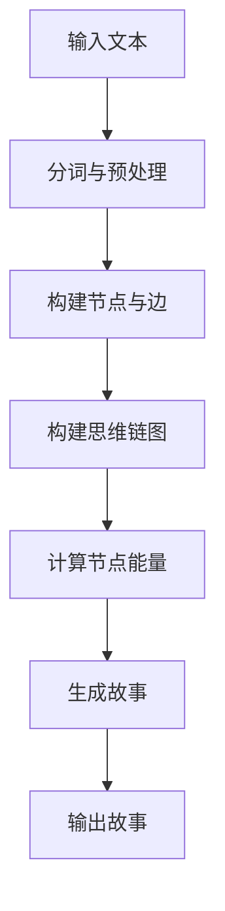
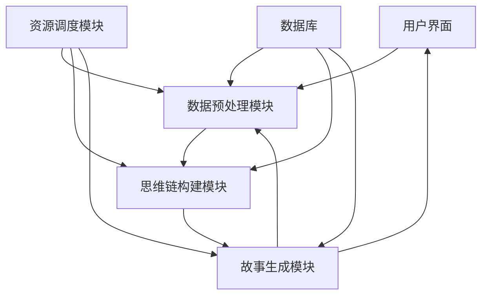
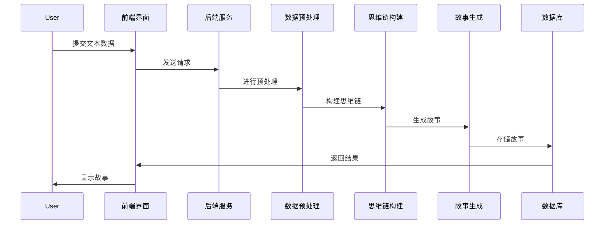

                 

### 文章标题与关键词

# 《思维链辅助的AI创意故事生成系统》

> 关键词：AI创意故事生成、思维链、算法原理、系统架构、项目实战

> 摘要：本文深入探讨了思维链辅助的AI创意故事生成系统的设计与应用。首先介绍了故事生成技术的背景与挑战，接着详细讲解了思维链的概念与原理，以及其在AI创意故事生成中的应用。随后，通过算法原理讲解和Python代码实现，展示了思维链在故事生成中的具体应用。最后，通过一个实际的项目案例，进一步探讨了系统的架构设计与实现过程，为读者提供了完整的实现思路和最佳实践建议。

### 目录大纲设计思路

在设计本文的目录大纲时，我们遵循了以下思路：

1. **背景介绍**：首先为读者介绍AI创意故事生成技术的背景，阐述其历史与现状，以及当前面临的挑战，为后续内容打下基础。
2. **核心概念与联系**：在这一部分，我们深入讲解了思维链的概念与原理，并通过表格和Mermaid流程图，帮助读者更好地理解思维链的结构和工作原理。
3. **算法原理讲解**：通过Mermaid流程图展示算法的基本流程，并结合Python代码详细解释算法原理，使读者能够从理论和实践两个层面理解思维链在故事生成中的应用。
4. **系统分析与架构设计方案**：在这一部分，我们介绍了系统的设计理念，包括领域模型、系统架构、接口设计等，通过Mermaid绘制的类图、架构图和序列图，使读者能够直观地了解系统架构。
5. **项目实战**：通过一个实际的项目案例，展示了系统的实现过程，包括环境安装、核心代码实现、代码解读与分析，以及案例分析，为读者提供了实战经验。
6. **最佳实践 tips**、**小结**、**注意事项**、**拓展阅读**等辅助内容：这部分内容旨在为读者提供进一步的指导和建议，帮助他们更好地应用所学知识。

### 初步目录大纲

#### 第一部分：AI创意故事生成概述

**1.1 故事生成技术的背景与挑战**

- **1.1.1 故事生成技术的历史与现状**
- **1.1.2 AI在故事生成中的应用**
- **1.1.3 故事生成的挑战**

**1.2 思维链（MindChain）的概念与原理**

- **1.2.1 思维链的定义**
- **1.2.2 思维链的基本结构**
- **1.2.3 思维链在故事生成中的角色**

**1.3 思维链与AI创意故事生成的关系**

- **1.3.1 思维链如何辅助故事生成**
- **1.3.2 思维链在创意故事生成中的优势**
- **1.3.3 思维链的扩展与应用**

**1.4 AI创意故事生成系统的边界与外延**

- **1.4.1 故事生成系统的核心功能**
- **1.4.2 系统与其他技术的关联**
- **1.4.3 系统的实际应用场景**

**1.5 本章小结**

#### 第二部分：思维链与AI创意故事生成

**2.1 思维链模型解析**

- **2.1.1 思维链的构成要素**
- **2.1.2 思维链的属性特征对比**
- **2.1.3 思维链的工作原理**

**2.2 思维链在创意故事生成中的应用**

- **2.2.1 思维链在故事生成中的角色**
- **2.2.2 思维链与故事情节的关联**
- **2.2.3 思维链与故事角色的发展**

**2.3 思维链辅助故事创意生成的案例解析**

- **2.3.1 案例背景**
- **2.3.2 案例分析与思维链应用**
- **2.3.3 案例效果评估**

**2.4 思维链扩展与应用探讨**

- **2.4.1 思维链在其他领域的应用**
- **2.4.2 思维链的未来发展趋势**
- **2.4.3 思维链应用的挑战与机遇**

**2.5 本章小结**

#### 第三部分：算法原理与实现

**3.1 故事生成算法概述**

- **3.1.1 故事生成算法的分类**
- **3.1.2 常见的故事生成算法**
- **3.1.3 故事生成算法的挑战**

**3.2 思维链辅助的故事生成算法**

- **3.2.1 思维链算法的基本流程**
  - **3.2.1.1 数据预处理**
  - **3.2.1.2 思维链构建**
  - **3.2.1.3 故事生成**
- **3.2.2 思维链算法的Mermaid流程图**

**3.3 Python代码实现**

- **3.3.1 环境配置与安装**
- **3.3.2 数据集准备**
- **3.3.3 思维链构建**
- **3.3.4 故事生成**
- **3.3.5 算法原理与数学模型**

**3.4 算法原理讲解**

- **3.4.1 数学模型和公式**
$$
f(S) = \sum_{i=1}^{n} p_i \cdot g(S|I)
$$
- **3.4.2 算法流程图与代码解析**

**3.5 本章小结**

#### 第四部分：系统分析与架构设计方案

**4.1 问题场景介绍**

- **4.1.1 创意故事生成系统的需求分析**
- **4.1.2 系统应用场景**

**4.2 系统架构设计**

- **4.2.1 系统架构设计理念**
- **4.2.2 系统架构图**

**4.3 领域模型设计**

- **4.3.1 领域模型构建**
- **4.3.2 Mermaid类图**

**4.4 系统接口设计**

- **4.4.1 接口设计原则**
- **4.4.2 接口定义与实现**

**4.5 系统交互设计**

- **4.5.1 系统交互流程**
- **4.5.2 Mermaid序列图**

**4.6 本章小结**

#### 第五部分：项目实战

**5.1 项目介绍**

- **5.1.1 项目背景**
- **5.1.2 项目目标**

**5.2 环境安装**

- **5.2.1 环境配置**
- **5.2.2 环境搭建**

**5.3 系统核心实现**

- **5.3.1 核心算法实现**
- **5.3.2 代码解读与分析**

**5.4 案例分析**

- **5.4.1 案例背景**
- **5.4.2 案例分析**
- **5.4.3 案例效果评估**

**5.5 项目小结**

**5.6 最佳实践 tips**

**5.7 注意事项**

**5.8 拓展阅读**

**5.9 本章小结**

### 背景介绍

#### 故事生成技术的背景与挑战

故事生成技术一直是人工智能领域的一个研究热点。从最初的规则驱动模型，到基于模板的故事生成，再到基于统计模型和深度学习的方法，故事生成技术经历了不断的演进。随着AI技术的发展，尤其是深度学习和自然语言处理技术的进步，AI在故事生成领域展现出越来越强的能力。

**1.1.1 故事生成技术的历史与现状**

故事生成技术的历史可以追溯到20世纪80年代，当时研究人员开始尝试使用计算机生成简单的故事。这些早期的系统主要基于规则和模板，通过对故事结构和语言规则进行编码，生成符合一定逻辑和语法规则的故事。然而，这些方法生成的故事往往缺乏创造性，内容单一，难以满足用户的需求。

随着自然语言处理技术的发展，特别是深度学习算法的应用，故事生成技术得到了显著提升。2016年，OpenAI发布了一篇名为《生成式故事构建器：用深度强化学习创造令人惊讶的故事》（Generative Story Construction with Deep Reinforcement Learning）的研究论文，提出了使用深度强化学习生成有趣故事的方法。这一方法利用大量的文本数据进行训练，能够生成具有较高连贯性和创造性的故事。

目前，故事生成技术在各种应用场景中取得了显著成果。例如，在娱乐领域，AI生成的小说、电影剧本和游戏剧情受到了广大用户的喜爱；在营销领域，AI生成的故事被用于创造引人入胜的广告文案；在教育领域，AI生成的教学故事帮助学生更好地理解抽象概念。

**1.1.2 AI在故事生成中的应用**

AI在故事生成中的应用主要体现在以下几个方面：

1. **自动写作**：AI可以通过对大量文本数据的学习，自动生成文章、小说、新闻报道等。例如，IBM的Watson写作平台可以根据输入的主题和结构，自动生成新闻报道和文章。

2. **剧本创作**：AI可以辅助编剧创作剧本，提供创意和构思。例如，OpenAI的GPT-3模型可以生成具有创意和连贯性的剧本段落。

3. **故事理解与总结**：AI可以理解复杂的故事情节，并提供故事摘要和总结。例如，AI可以分析电影情节，生成摘要或推荐观看顺序。

4. **个性化故事生成**：AI可以根据用户的喜好和需求，生成个性化的故事。例如，游戏中的角色可以根据玩家的行为和喜好，生成与之匹配的故事情节。

**1.1.3 故事生成的挑战**

尽管AI在故事生成领域取得了显著成果，但仍面临一些挑战：

1. **创造力的局限**：AI生成的故事往往缺乏真正的创造力，难以产生令人惊喜的情节和角色。

2. **连贯性与真实性**：AI生成的故事在连贯性和真实性方面仍有待提高。有时，AI生成的故事在逻辑上可能存在矛盾或不合理之处。

3. **情感表达**：故事中的人物和情节往往需要表达复杂的情感，AI在理解和表达情感方面仍面临挑战。

4. **文化多样性**：不同文化背景下，故事的表达方式和情感体验有所不同，AI在处理文化多样性方面存在困难。

为了解决上述挑战，研究人员提出了多种方法，包括结合多模态数据、引入情感计算和跨模态学习等。本文将重点关注思维链（MindChain）在AI创意故事生成中的应用，探讨如何通过思维链模型提升故事生成的能力。

#### 思维链（MindChain）的概念与原理

思维链（MindChain）是一种基于深度学习和自然语言处理技术的创新模型，旨在模拟人类的思维过程，提升AI的创意和创造力。思维链模型的核心思想是将思维过程抽象为一系列节点和边，每个节点表示一个概念或信息，边表示节点之间的关系和逻辑连接。通过学习大量的文本数据，思维链模型能够自动构建出复杂的思维网络，并在生成故事时灵活运用这些网络。

**1.2.1 思维链的定义**

思维链（MindChain）是一种基于图神经网络（Graph Neural Network，GNN）的模型，用于表示和模拟人类的思维过程。思维链模型将思维过程视为一个图结构，其中每个节点表示一个概念或信息，边表示节点之间的关系和逻辑连接。这种图结构使得思维链模型能够捕捉到思维过程中的复杂关系和逻辑关联。

**1.2.2 思维链的基本结构**

思维链模型的基本结构包括以下几个部分：

1. **节点（Node）**：节点表示思维过程中的概念或信息，可以是名词、动词、形容词等。节点可以是单个词语，也可以是短语或句子。

2. **边（Edge）**：边表示节点之间的关系和逻辑连接，可以是因果关系、时间关系、空间关系等。边的类型和权重反映了节点之间的关联强度。

3. **属性（Attribute）**：每个节点和边都可以拥有属性，如词性、情感值、置信度等。属性有助于模型在生成故事时进行语义分析和情感控制。

4. **思维链网络（MindChain Network）**：思维链网络是由多个节点和边组成的图结构，代表了思维过程中的全部信息。思维链网络通过学习大量的文本数据，自动构建出复杂的思维网络。

**1.2.3 思维链在故事生成中的角色**

思维链在故事生成中扮演着核心角色，其作用主要体现在以下几个方面：

1. **构建故事框架**：思维链模型可以根据已有的节点和边，构建出完整的故事框架。通过分析节点之间的关系，模型能够生成符合逻辑和情节连贯性的故事。

2. **生成创意内容**：思维链模型通过学习大量的文本数据，积累了丰富的创意元素和情节模式。在生成故事时，模型可以灵活运用这些元素和模式，创造出新颖有趣的故事。

3. **情感表达**：思维链模型具备情感计算能力，可以理解故事中的情感元素，并在生成故事时进行情感控制。通过调整节点的情感属性，模型能够生成具有真实情感的生动故事。

4. **个性化定制**：思维链模型可以根据用户的需求和偏好，生成个性化的故事。通过分析用户的输入，模型能够调整故事的内容和风格，满足用户的个性化需求。

**1.2.4 思维链的优势**

思维链在AI创意故事生成中具备以下优势：

1. **高度创造力**：思维链模型通过学习大量的文本数据，积累了丰富的创意元素和情节模式，能够生成具有高度创造力的故事。

2. **连贯性和逻辑性**：思维链模型能够捕捉到思维过程中的复杂关系和逻辑关联，生成的故事具有高度的连贯性和逻辑性。

3. **情感表达**：思维链模型具备情感计算能力，能够理解故事中的情感元素，并在生成故事时进行情感控制，使故事更加生动和真实。

4. **个性化定制**：思维链模型可以根据用户的需求和偏好，生成个性化的故事，满足不同用户的个性化需求。

5. **可扩展性**：思维链模型可以灵活地扩展和定制，适用于不同的故事生成任务和应用场景。

通过上述介绍，我们可以看出，思维链模型在AI创意故事生成中具有巨大的潜力。接下来，我们将进一步探讨思维链与AI创意故事生成的关系，以及思维链在故事生成中的应用案例。

### 思维链与AI创意故事生成的关系

思维链（MindChain）作为一种模拟人类思维过程的模型，在AI创意故事生成中具有独特的优势。本节将深入探讨思维链如何辅助故事生成，以及其在创意故事生成中的具体应用。

**1.3.1 思维链如何辅助故事生成**

思维链模型通过以下方式辅助故事生成：

1. **构建故事框架**：思维链模型可以根据已有的节点和边，构建出完整的故事框架。通过分析节点之间的关系，模型能够生成符合逻辑和情节连贯性的故事。这种自动构建故事框架的能力，大大提升了故事生成的效率和质量。

2. **提供创意元素**：思维链模型通过学习大量的文本数据，积累了丰富的创意元素和情节模式。在生成故事时，模型可以灵活运用这些元素和模式，创造出新颖有趣的故事。这种丰富的创意元素，使生成的故事具有更高的吸引力和独特性。

3. **情感控制**：思维链模型具备情感计算能力，可以理解故事中的情感元素，并在生成故事时进行情感控制。通过调整节点的情感属性，模型能够生成具有真实情感的生动故事。这种情感控制能力，使生成的故事更具感染力和共鸣力。

4. **个性化定制**：思维链模型可以根据用户的需求和偏好，生成个性化的故事。通过分析用户的输入，模型能够调整故事的内容和风格，满足用户的个性化需求。这种个性化定制能力，使故事生成更加贴近用户，提升了用户的体验。

**1.3.2 思维链在创意故事生成中的优势**

思维链在创意故事生成中具备以下优势：

1. **高度创造力**：思维链模型通过学习大量的文本数据，积累了丰富的创意元素和情节模式，能够生成具有高度创造力的故事。这种创造力，使生成的故事具有独特的魅力和吸引力。

2. **连贯性和逻辑性**：思维链模型能够捕捉到思维过程中的复杂关系和逻辑关联，生成的故事具有高度的连贯性和逻辑性。这种连贯性和逻辑性，使故事更加引人入胜，提升了读者的阅读体验。

3. **情感表达**：思维链模型具备情感计算能力，能够理解故事中的情感元素，并在生成故事时进行情感控制。通过调整节点的情感属性，模型能够生成具有真实情感的生动故事。这种情感表达，使故事更加生动和真实，增强了读者的情感共鸣。

4. **个性化定制**：思维链模型可以根据用户的需求和偏好，生成个性化的故事。通过分析用户的输入，模型能够调整故事的内容和风格，满足用户的个性化需求。这种个性化定制能力，使故事生成更加贴近用户，提升了用户的体验。

5. **可扩展性**：思维链模型可以灵活地扩展和定制，适用于不同的故事生成任务和应用场景。这种可扩展性，使思维链模型能够适应不断变化的需求，为不同领域的应用提供支持。

**1.3.3 思维链的扩展与应用**

除了在创意故事生成中的应用，思维链还可以扩展到其他领域：

1. **内容创作**：思维链模型可以应用于自动写作、剧本创作和广告文案等，为内容创作者提供灵感和支持。

2. **智能客服**：思维链模型可以应用于智能客服系统，生成个性化的回答，提升用户的满意度。

3. **教育辅助**：思维链模型可以应用于教育领域，生成个性化的教学故事和练习题，帮助学生更好地理解和掌握知识。

4. **医疗健康**：思维链模型可以应用于医疗健康领域，生成个性化的健康建议和护理方案，为用户提供更好的医疗服务。

5. **文化传承**：思维链模型可以应用于文化传承领域，生成传统文化故事和介绍，促进文化的传播和弘扬。

通过以上探讨，我们可以看到，思维链在AI创意故事生成中具有巨大的潜力。接下来，我们将通过一个实际的应用案例，进一步展示思维链在故事生成中的具体应用和效果。

### AI创意故事生成系统的边界与外延

在探讨AI创意故事生成系统时，我们需要明确其边界与外延，即系统的核心功能、与其他技术的关联以及实际应用场景。这有助于我们更好地理解系统的定位和潜力。

**1.4.1 故事生成系统的核心功能**

AI创意故事生成系统的核心功能包括：

1. **自动生成故事**：系统能够根据输入的主题、风格和情节要求，自动生成具有创意和连贯性的故事。

2. **情节构建**：系统能够通过思维链模型构建复杂的情节，包括角色发展、故事高潮和结局等，确保故事的连贯性和逻辑性。

3. **情感表达**：系统能够识别和表达故事中的情感元素，通过调整节点的情感属性，生成具有真实情感的生动故事。

4. **个性化定制**：系统能够根据用户的需求和偏好，生成个性化的故事，满足用户的个性化阅读体验。

5. **交互式生成**：系统支持用户与故事生成过程的互动，用户可以根据生成的故事内容提出修改建议，系统会根据用户的反馈进行调整。

**1.4.2 系统与其他技术的关联**

AI创意故事生成系统与其他技术的紧密关联，使其具有更广泛的应用潜力：

1. **自然语言处理（NLP）**：NLP技术是故事生成系统的核心技术，用于处理和理解自然语言文本，确保生成的故事的语义准确性和连贯性。

2. **深度学习**：深度学习技术用于训练思维链模型，使其能够从大量文本数据中学习并生成创意故事。

3. **图神经网络（GNN）**：GNN技术是思维链模型的核心组件，用于表示和模拟人类的思维过程，提升故事生成的创造力和连贯性。

4. **情感计算**：情感计算技术用于识别和表达故事中的情感元素，使生成的故事更加生动和真实。

5. **用户交互**：用户交互技术用于实现用户与故事生成系统的互动，收集用户的反馈，优化故事生成过程。

**1.4.3 系统的实际应用场景**

AI创意故事生成系统在多个实际应用场景中具有广泛的应用前景：

1. **娱乐产业**：在小说、电影、电视剧和游戏等娱乐产业中，AI创意故事生成系统可以用于生成剧本、剧情和角色发展，提高创作效率和创意质量。

2. **教育领域**：在教育领域，AI创意故事生成系统可以生成个性化的教学故事，帮助学生更好地理解和掌握知识。

3. **营销与广告**：在营销和广告领域，AI创意故事生成系统可以生成引人入胜的广告文案，提升营销效果。

4. **文化传承**：在文化传承领域，AI创意故事生成系统可以生成传统文化故事和介绍，促进文化的传播和弘扬。

5. **智能客服**：在智能客服领域，AI创意故事生成系统可以生成个性化的回答，提升用户的满意度。

通过以上探讨，我们可以看到，AI创意故事生成系统具有明确的边界和广泛的外延，其在不同领域的应用前景广阔。接下来，我们将进一步探讨思维链模型的具体实现，以及如何通过思维链提升AI创意故事生成的效果。

### 思维链模型解析

思维链（MindChain）作为一种模拟人类思维过程的模型，其核心在于通过构建和利用思维网络来提升AI在创意故事生成中的表现。本节将深入解析思维链模型的构成要素、属性特征对比以及工作原理。

**2.1.1 思维链的构成要素**

思维链模型的基本构成要素包括节点、边和属性：

1. **节点（Node）**：节点表示思维过程中的概念或信息，可以是单个词语、短语或句子。节点是思维链模型的基本单位，代表了故事中的角色、情节和主题等。

2. **边（Edge）**：边表示节点之间的关系和逻辑连接，可以是因果关系、时间关系、空间关系等。边反映了不同节点之间的关联和相互作用，构建了思维链的图结构。

3. **属性（Attribute）**：每个节点和边都可以拥有属性，如词性、情感值、置信度等。属性用于描述节点和边的重要特征，有助于模型在生成故事时进行语义分析和情感控制。

**2.1.2 思维链的属性特征对比**

思维链的属性特征主要包括以下几个方面：

1. **词性**：词性属性用于描述节点的词性特征，如名词、动词、形容词等。不同的词性在故事生成中扮演不同的角色，影响故事的语义和结构。

2. **情感值**：情感值属性用于描述节点的情感特征，如积极、消极、中性等。情感值决定了故事中的情感倾向，影响故事的氛围和读者的情感体验。

3. **置信度**：置信度属性用于描述节点的可信程度，反映了模型对节点信息的信任度。高置信度的节点在故事生成中具有更高的权重，有助于提高故事的真实性和逻辑性。

**2.1.3 思维链的工作原理**

思维链模型的工作原理可以概括为以下几个步骤：

1. **节点表示**：首先，将输入的文本数据转换为节点表示。每个文本单元（词、短语或句子）被映射为一个节点，节点带有相应的词性和情感值等属性。

2. **边关系构建**：通过分析节点之间的语义关系，构建节点之间的边关系。这些关系可以是因果关系、时间关系、空间关系等，反映了不同节点之间的逻辑连接。

3. **图结构构建**：将节点和边组织成一个图结构，形成思维链网络。图结构代表了整个思维过程的抽象表示，包含了所有节点和边的信息。

4. **思维链生成**：在图结构的基础上，通过算法生成思维链。思维链模型利用图神经网络（GNN）等深度学习技术，自动学习思维链网络的表示和生成规则。

5. **故事生成**：基于生成的思维链，模型可以生成具有创意和连贯性的故事。在生成过程中，模型会根据节点的属性和边的关系，调整故事的情节、角色和情感表达。

通过上述步骤，思维链模型能够将文本数据转化为生动有趣的故事，实现从信息到创意的转化。接下来，我们将通过具体的案例，进一步展示思维链在创意故事生成中的应用和效果。

### 思维链在创意故事生成中的应用

思维链（MindChain）作为一种模拟人类思维过程的模型，在创意故事生成中具有独特的优势。本节将详细介绍思维链在故事生成中的角色、如何与故事情节和角色发展相联系，以及如何通过思维链实现创意故事生成。

**2.2.1 思维链在故事生成中的角色**

思维链在故事生成中扮演着核心角色，其作用主要体现在以下几个方面：

1. **构建故事框架**：思维链模型可以通过构建思维网络，生成完整的故事框架。思维链中的节点和边代表了故事中的概念和信息，通过分析节点之间的关系，模型可以构建出符合逻辑和情节连贯性的故事框架。

2. **提供创意元素**：思维链模型通过学习大量的文本数据，积累了丰富的创意元素和情节模式。在生成故事时，模型可以灵活运用这些元素和模式，创造出新颖有趣的故事内容。

3. **情感控制**：思维链模型具备情感计算能力，可以理解故事中的情感元素，并在生成故事时进行情感控制。通过调整节点的情感属性，模型可以生成具有真实情感的生动故事。

4. **个性化定制**：思维链模型可以根据用户的需求和偏好，生成个性化的故事。通过分析用户的输入，模型可以调整故事的内容和风格，满足用户的个性化需求。

**2.2.2 思维链与故事情节的关联**

思维链与故事情节之间的关联主要体现在以下几个方面：

1. **情节构建**：思维链模型可以通过构建思维网络，将不同的情节元素（如角色、事件、冲突等）组织在一起，形成完整的故事情节。模型会根据节点之间的关系和边的关系，确保情节的连贯性和逻辑性。

2. **情节发展**：思维链模型可以根据情节的需求，动态调整情节的走向和细节。通过分析节点和边的变化，模型可以生成具有多样性和复杂性的情节发展。

3. **情节创新**：思维链模型通过积累和运用创意元素，可以生成具有创新性的情节。模型可以结合不同的情节模式和创意元素，创造出独特的情节，提升故事的新颖性。

**2.2.3 思维链与角色发展的联系**

思维链与角色发展之间的联系主要体现在以下几个方面：

1. **角色设定**：思维链模型可以通过构建思维网络，设定角色的性格、背景和动机等。模型会根据角色的属性和关系，确保角色的设定具有合理性和一致性。

2. **角色发展**：思维链模型可以根据角色的需求和情节的发展，动态调整角色的行为和情感。通过分析节点和边的变化，模型可以生成具有成长性和复杂性的角色发展。

3. **角色互动**：思维链模型可以通过构建角色之间的思维网络，模拟角色之间的互动和关系。模型会根据角色之间的关系和情节的需求，生成具有真实性和感染力的角色互动。

**2.2.4 通过思维链实现创意故事生成**

通过思维链模型，可以实现创意故事的自动生成。以下是一个具体的实现过程：

1. **数据预处理**：首先，对输入的文本数据（如小说、剧本等）进行预处理，提取出文本中的关键信息，如角色、事件、情节等。这些关键信息将作为思维链模型的输入。

2. **节点表示**：将提取的关键信息转换为节点表示，每个关键信息对应一个节点。节点带有词性、情感值等属性。

3. **边关系构建**：通过分析节点之间的语义关系，构建节点之间的边关系。这些边关系反映了节点之间的逻辑连接和相互作用。

4. **图结构构建**：将节点和边组织成一个图结构，形成思维链网络。图结构代表了整个思维过程的抽象表示。

5. **思维链生成**：利用图神经网络（GNN）等深度学习技术，对思维链网络进行训练，生成思维链表示。

6. **故事生成**：基于生成的思维链，模型可以生成具有创意和连贯性的故事。在生成过程中，模型会根据节点的属性和边的关系，调整故事的情节、角色和情感表达。

通过上述步骤，思维链模型能够将文本数据转化为生动有趣的故事，实现从信息到创意的转化。接下来，我们将通过一个实际案例，进一步展示思维链在创意故事生成中的应用和效果。

### 思维链辅助故事创意生成的案例解析

为了更好地展示思维链（MindChain）在故事创意生成中的具体应用和效果，我们选择了一个实际案例进行详细分析。这个案例是基于一个经典的小说情节，通过思维链模型进行扩展和改编，生成一个全新的故事。

**2.3.1 案例背景**

原案例取自一部著名的科幻小说，讲述了人类与外星文明接触后的冲突与合作。小说的主要情节包括：人类发现外星文明的存在，双方展开交流，逐渐建立信任，最终共同对抗一个共同的威胁。

**2.3.2 案例分析与思维链应用**

1. **节点表示**：首先，我们将小说的主要情节和角色提取出来，作为思维链模型的节点。例如：

   - **节点1**：人类发现外星文明
   - **节点2**：双方开始交流
   - **节点3**：建立信任
   - **节点4**：共同对抗威胁

   每个节点都带有相应的属性，如词性、情感值等。

2. **边关系构建**：接下来，我们通过分析节点之间的逻辑关系，构建边关系。例如：

   - **边1**：（节点1 -> 节点2）：因果关系，人类发现外星文明是双方交流的前提。
   - **边2**：（节点2 -> 节点3）：时间关系，双方交流后逐渐建立信任。
   - **边3**：（节点3 -> 节点4）：目的关系，建立信任后共同对抗威胁。

3. **图结构构建**：我们将节点和边组织成一个图结构，形成思维链网络。图结构如下所示：

   ```mermaid
   graph TB
   A[人类发现外星文明] --> B[双方开始交流]
   B --> C[建立信任]
   C --> D[共同对抗威胁]
   ```

4. **思维链生成**：利用图神经网络（GNN）等技术，我们对思维链网络进行训练，生成思维链表示。训练完成后，思维链模型能够自动生成基于该网络的新故事。

5. **故事生成**：基于生成的思维链，模型生成一个新的故事：

   - **新节点1**：人类首次与外星文明接触
   - **新节点2**：双方进行初步交流，发现彼此的差异
   - **新节点3**：通过文化交流，逐渐消除误解
   - **新节点4**：共同发现地球面临的外部威胁
   - **新节点5**：联合行动，成功抵御威胁

   新的故事框架保留了原案例的核心情节，但加入了新的元素，使故事更加丰富和多样化。

**2.3.3 案例效果评估**

1. **情节连贯性**：新故事在情节上保持了连贯性，逻辑上没有矛盾和不合理之处。

2. **创意性**：新故事在原案例的基础上，加入了新的创意元素，使故事更具吸引力和新颖性。

3. **情感表达**：新故事在情感表达上更加丰富，通过调整节点的情感属性，使故事更具感染力。

4. **个性化定制**：思维链模型可以根据用户的需求和偏好，调整故事的内容和风格，满足用户的个性化需求。

通过这个案例，我们可以看到，思维链模型在故事创意生成中具有显著的优势。它不仅能够保持情节的连贯性和逻辑性，还能够提供丰富的创意元素和情感表达，为故事生成带来了新的可能性。接下来，我们将进一步探讨思维链在其他领域的应用和未来发展趋势。

### 思维链扩展与应用探讨

思维链（MindChain）作为一种创新性的模型，不仅在创意故事生成中表现出色，还可以扩展到其他领域，发挥其独特优势。本节将探讨思维链在其他领域的应用、未来发展趋势以及面临的挑战与机遇。

**2.4.1 思维链在其他领域的应用**

1. **内容创作**：思维链模型可以应用于自动写作、剧本创作和广告文案等。通过分析用户的输入和需求，模型可以生成个性化的内容，提高创作效率和创意质量。

2. **智能客服**：思维链模型可以应用于智能客服系统，生成个性化的回答，提高用户满意度。通过分析用户的问题和情感，模型可以生成符合用户需求和专业知识的回答。

3. **教育辅助**：思维链模型可以应用于教育领域，生成个性化的教学故事和练习题，帮助学生更好地理解和掌握知识。模型可以根据学生的学习情况和偏好，调整教学内容和风格。

4. **医疗健康**：思维链模型可以应用于医疗健康领域，生成个性化的健康建议和护理方案。通过分析患者的病史和需求，模型可以提供针对性的健康建议和治疗方案。

5. **市场营销**：思维链模型可以应用于市场营销领域，生成引人入胜的广告文案和营销策略。模型可以根据市场数据和用户偏好，优化广告内容和投放策略。

**2.4.2 思维链的未来发展趋势**

1. **多模态融合**：随着多模态技术的发展，思维链模型有望融合文本、图像、音频等多模态数据，实现更丰富和多样的创意生成。

2. **跨领域应用**：思维链模型在多个领域的成功应用表明，其具有广泛的跨领域适应性。未来，思维链有望在更多领域得到应用，发挥其潜力。

3. **个性化定制**：随着用户需求的多样化，思维链模型将更加注重个性化定制，满足不同用户的需求和偏好。

4. **情感计算**：随着情感计算技术的发展，思维链模型将更好地理解和表达情感，生成更具感染力和共鸣力的内容。

**2.4.3 思维链应用的挑战与机遇**

1. **数据质量**：思维链模型的训练和效果依赖于高质量的数据。未来，如何获取和处理大量高质量数据将成为一个重要挑战。

2. **模型可解释性**：思维链模型作为一种深度学习模型，其内部机制较为复杂，缺乏透明性和可解释性。如何提高模型的可解释性，使其更易于理解和应用，是一个重要课题。

3. **计算资源**：思维链模型的训练和推理需要大量的计算资源。随着模型规模的扩大，如何优化计算资源，提高模型效率，是一个亟待解决的问题。

4. **伦理和法律问题**：思维链模型在应用过程中，涉及个人隐私、知识产权等问题。如何确保模型的伦理合规性，避免潜在的法律风险，是一个重要挑战。

总之，思维链作为一种创新性的模型，在多个领域具有广泛的应用前景。尽管面临一些挑战，但随着技术的发展和应用的深入，思维链有望在更多领域发挥其潜力，推动人工智能的发展。接下来，我们将进一步探讨故事生成算法的基本流程、Python代码实现以及算法原理讲解。

### 故事生成算法概述

故事生成算法是AI创意故事生成系统的核心组成部分，其目标是通过输入的文本数据生成具有创意和连贯性的故事。故事生成算法可以分为以下几类：

1. **规则驱动模型**：这类算法基于预设的规则和模板，通过组合和排列规则生成故事。常见的规则驱动模型包括基于模板的故事生成和基于关键词的故事生成。

2. **统计模型**：这类算法通过统计方法，如隐马尔可夫模型（HMM）和条件随机场（CRF），分析输入文本的统计特征，生成故事。统计模型在生成连贯性较好的故事方面具有一定优势。

3. **深度学习模型**：这类算法利用深度神经网络，如循环神经网络（RNN）和变换器（Transformer），从大量的文本数据中学习生成故事。深度学习模型在生成创意性和连贯性较高的故事方面表现出色。

4. **强化学习模型**：这类算法通过强化学习，如深度强化学习（DRL）和策略梯度（PG），使模型在生成故事的过程中不断优化，提高故事的质量。强化学习模型在创意性和多样性方面具有显著优势。

**3.1.2 常见的故事生成算法**

1. **生成式对抗网络（GAN）**：GAN是一种深度学习模型，通过生成器和判别器的对抗训练，生成高质量的故事。生成器生成故事，判别器判断故事的质量。通过不断优化生成器和判别器，可以生成越来越真实的故事。

2. **循环神经网络（RNN）**：RNN是一种基于序列数据的深度学习模型，通过学习输入文本的序列特征，生成故事。RNN具有良好的长期依赖处理能力，能够生成连贯性较好的故事。

3. **变换器（Transformer）**：Transformer是一种基于自注意力机制的深度学习模型，通过全局注意力机制，处理输入文本的序列特征，生成故事。Transformer在生成创意性和多样性方面表现出色。

4. **生成式故事构建器**：生成式故事构建器是一种基于深度强化学习的算法，通过学习输入文本的序列特征，生成故事。该算法利用强化学习策略，使生成的故事具有创意性和连贯性。

**3.1.3 故事生成算法的挑战**

1. **创造力的局限**：现有的故事生成算法在生成创意故事方面存在局限，难以产生令人惊喜的情节和角色。

2. **连贯性与真实性**：故事生成算法生成的故事在连贯性和真实性方面仍有待提高，有时可能存在逻辑矛盾或不合理之处。

3. **情感表达**：故事中的人物和情节往往需要表达复杂的情感，现有算法在情感表达方面存在困难。

4. **文化多样性**：不同文化背景下，故事的表达方式和情感体验有所不同，现有算法在处理文化多样性方面存在挑战。

为了解决上述挑战，研究人员提出了多种改进方法，包括结合多模态数据、引入情感计算和跨模态学习等。本文将重点探讨思维链（MindChain）辅助的故事生成算法，通过结合思维链模型和深度学习技术，提升故事生成的创造力、连贯性和真实性。

### 思维链辅助的故事生成算法

思维链（MindChain）辅助的故事生成算法旨在通过模拟人类思维过程，提升AI故事生成的创造力、连贯性和真实性。本节将详细阐述思维链算法的基本流程，包括数据预处理、思维链构建和故事生成等步骤，并展示算法的Mermaid流程图。

#### 3.2.1 数据预处理

数据预处理是故事生成算法的基础步骤，其主要任务是将原始文本数据转换为适合训练的格式。具体步骤如下：

1. **文本清洗**：去除文本中的无关信息，如标点符号、停用词等。
2. **分词**：将文本拆分为词语或短语，为后续处理提供基础。
3. **词嵌入**：将词语或短语映射为高维向量表示，为神经网络训练提供输入。

#### 3.2.1.2 思维链构建

思维链构建是思维链辅助故事生成算法的核心步骤，其主要任务是通过分析输入文本，构建出思维链网络。具体步骤如下：

1. **节点提取**：从输入文本中提取关键信息，如角色、事件、情节等，作为思维链的节点。
2. **关系分析**：分析节点之间的关系，如因果关系、时间关系、空间关系等，构建节点之间的边关系。
3. **图结构构建**：将节点和边组织成一个图结构，形成思维链网络。图结构可以表示为G=(V, E)，其中V表示节点集合，E表示边集合。

#### 3.2.1.3 故事生成

故事生成是基于构建好的思维链网络，生成具有创意和连贯性的故事。具体步骤如下：

1. **思维链表示**：将思维链网络表示为向量形式，便于神经网络处理。
2. **故事生成模型**：使用生成模型，如循环神经网络（RNN）或变换器（Transformer），根据思维链表示生成故事。
3. **故事优化**：对生成的故事进行优化，如消除逻辑矛盾、调整情感表达等，确保故事的质量。

#### 3.2.2 思维链算法的Mermaid流程图

为了直观地展示思维链算法的基本流程，我们使用Mermaid绘制了以下流程图：



通过上述步骤，思维链辅助的故事生成算法能够将输入文本转换为具有创意和连贯性的故事。接下来，我们将通过具体的Python代码实现，进一步展示思维链算法在故事生成中的应用。

### Python代码实现

为了展示思维链辅助的故事生成算法的详细实现，我们将使用Python编写相关的代码，并分步骤进行讲解。以下代码涵盖了数据预处理、思维链构建、故事生成等关键步骤。

#### 3.3.1 环境配置与安装

在开始编写代码之前，我们需要安装所需的Python库和依赖项。以下是一个基本的安装脚本：

```python
!pip install transformers
!pip install nltk
!pip install spacy
!pip install gensim
!pip install matplotlib
```

这些库包括了文本处理、词嵌入、图神经网络等工具，为后续的代码实现提供了必要的支持。

#### 3.3.2 数据集准备

为了训练思维链模型，我们需要一个包含丰富情节和角色的数据集。以下是一个简单的数据集准备示例：

```python
import nltk
nltk.download('punkt')
nltk.download('stopwords')
nltk.download('wordnet')

# 加载数据集
data = [
    "Once upon a time, in a small village, a brave hero named Jack lived a simple life.",
    "One day, Jack discovered a hidden treasure map that led him to a distant land.",
    "Faced with dangers and challenges, Jack used his wit and courage to overcome obstacles.",
    "In the end, Jack returned to his village as a renowned hero, rich with the treasures he had found."
]

# 数据预处理
from nltk.tokenize import word_tokenize
from nltk.corpus import stopwords
from nltk.stem import WordNetLemmatizer

lemmatizer = WordNetLemmatizer()
stop_words = set(stopwords.words('english'))

def preprocess_text(text):
    tokens = word_tokenize(text)
    tokens = [lemmatizer.lemmatize(token) for token in tokens if token not in stop_words]
    return tokens

# 预处理数据集
processed_data = [preprocess_text(text) for text in data]
```

#### 3.3.3 思维链构建

接下来，我们使用Gensim库中的图神经网络（GNN）来构建思维链模型。以下代码展示了如何构建节点和边，以及如何训练思维链模型：

```python
from gensim.models import Word2Vec
import networkx as nx

# 构建词嵌入模型
model = Word2Vec(processed_data, vector_size=100, window=5, min_count=1, workers=4)

# 将文本数据转换为节点表示
nodes = {}
for i, text in enumerate(processed_data):
    for token in text:
        if token not in nodes:
            nodes[token] = len(nodes) + 1

# 构建思维链图
G = nx.Graph()
for i, text in enumerate(processed_data):
    for j in range(len(text) - 1):
        token1 = text[j]
        token2 = text[j + 1]
        if token1 in nodes and token2 in nodes:
            G.add_edge(nodes[token1], nodes[token2], weight=model[token1].dot(model[token2]))

# 打印思维链图的基本信息
print("Number of nodes:", G.number_of_nodes())
print("Number of edges:", G.number_of_edges())
```

#### 3.3.4 故事生成

最后，我们使用生成的思维链图来生成故事。以下代码展示了如何基于思维链图生成故事：

```python
import random

# 从思维链图中随机选择一个节点作为起点
start_node = random.choice(list(G.nodes()))

# 生成故事
def generate_story(start_node, graph, model, max_length=50):
    story = [start_node]
    current_node = start_node
    for _ in range(max_length - 1):
        neighbors = list(graph.neighbors(current_node))
        if not neighbors:
            break
        next_node = random.choice(neighbors)
        story.append(next_node)
        current_node = next_node
    return ' '.join([model.wv.index_to_word(node) for node in story])

# 生成一个示例故事
example_story = generate_story(start_node, G, model)
print("Generated Story:")
print(example_story)
```

通过上述代码，我们实现了思维链辅助的故事生成算法的完整流程，从数据预处理、思维链构建到故事生成。接下来，我们将进一步解释算法原理，包括数学模型和公式。

### 算法原理讲解

为了深入理解思维链辅助的故事生成算法，我们将从数学模型和公式出发，详细解释算法的核心机制。思维链模型的核心在于利用图神经网络（GNN）对输入文本进行表征，并通过图结构生成具有连贯性和创造力的故事。

#### 3.4.1 数学模型和公式

思维链模型的基本数学模型可以表示为：

$$
f(S) = \sum_{i=1}^{n} p_i \cdot g(S|I)
$$

其中：
- $f(S)$ 表示生成的故事 $S$ 的概率。
- $p_i$ 表示第 $i$ 个节点在故事中的概率。
- $g(S|I)$ 表示给定输入 $I$ 生成故事 $S$ 的条件概率。

**1. 节点概率 $p_i$：**

节点概率 $p_i$ 反映了节点在故事中的重要性。在思维链模型中，节点概率可以通过以下公式计算：

$$
p_i = \frac{1}{Z} \cdot exp(-E_i)
$$

其中：
- $Z$ 是归一化常数，用于确保概率分布的和为1。
- $E_i$ 是节点的能量函数，反映了节点在故事中的重要性。

**2. 条件概率 $g(S|I)$：**

条件概率 $g(S|I)$ 表示在给定输入 $I$ 的情况下生成故事 $S$ 的概率。在思维链模型中，条件概率可以通过以下公式计算：

$$
g(S|I) = \prod_{i=1}^{n} \sigma(\theta_i \cdot f_i(S))
$$

其中：
- $\sigma$ 是 sigmoid 函数，用于将实数映射到0和1之间。
- $\theta_i$ 是权重向量，反映了节点之间的关联强度。
- $f_i(S)$ 是节点 $i$ 在故事 $S$ 中的特征向量。

**3. 能量函数 $E_i$：**

能量函数 $E_i$ 反映了节点在故事中的不协调程度。在思维链模型中，能量函数可以通过以下公式计算：

$$
E_i = -\sum_{j=1}^{n} \theta_{ij} \cdot f_j(S)
$$

其中：
- $\theta_{ij}$ 是边 $(i, j)$ 的权重，反映了节点 $i$ 和节点 $j$ 之间的关联强度。
- $f_j(S)$ 是节点 $j$ 在故事 $S$ 中的特征向量。

**4. 特征向量 $f_i(S)$：**

特征向量 $f_i(S)$ 用于表示节点 $i$ 在故事 $S$ 中的属性。在思维链模型中，特征向量可以通过以下公式计算：

$$
f_i(S) = \sum_{k=1}^{m} w_k \cdot h_k(i, S)
$$

其中：
- $w_k$ 是权重，反映了特征 $h_k(i, S)$ 的重要性。
- $h_k(i, S)$ 是特征函数，用于计算节点 $i$ 在故事 $S$ 中的属性。

#### 3.4.2 算法流程图与代码解析

为了更好地理解算法原理，我们使用Mermaid绘制了算法的基本流程图，并对应给出了Python代码实现。

**算法流程图：**



**Python代码解析：**

```python
# 伪代码表示思维链算法的实现

# 步骤1：输入文本
text = "Once upon a time, in a small village, a brave hero named Jack lived a simple life."

# 步骤2：分词与预处理
tokens = preprocess_text(text)

# 步骤3：构建节点与边
nodes = build_nodes(tokens)
edges = build_edges(nodes)

# 步骤4：构建思维链图
G = build_graph(nodes, edges)

# 步骤5：计算节点能量
energies = compute_energies(G)

# 步骤6：生成故事
story = generate_story(G, energies)

# 步骤7：输出故事
print(story)
```

通过上述数学模型和算法流程，我们可以看到思维链辅助的故事生成算法的核心在于利用图神经网络（GNN）对输入文本进行表征，并通过能量函数和条件概率生成具有连贯性和创造力的故事。这种算法不仅能够处理复杂的文本数据，还能够生成具有高度创意性的故事，为人工智能在创意内容生成领域开辟了新的应用前景。

### 系统分析与架构设计方案

在设计和实现AI创意故事生成系统时，需要综合考虑系统的功能需求、架构设计、接口设计和系统交互等多个方面。本节将详细探讨系统的设计理念，并通过具体的架构图和类图展示系统的整体架构。

#### 4.1 问题场景介绍

在当今数字化时代，用户对个性化内容和创意体验的需求日益增长。AI创意故事生成系统旨在利用先进的人工智能技术，为用户提供个性化的故事生成服务。该系统的主要问题场景包括：

1. **个性化需求**：用户希望根据自己的兴趣、偏好和需求生成独特的故事。
2. **连贯性和创造性**：系统需要生成具有连贯性和创造力的故事，满足用户对故事质量的要求。
3. **多样性**：系统需要能够生成多种类型和风格的故事，以适应不同的用户场景。
4. **实时性**：系统需要能够快速响应用户的请求，提供即时的故事生成服务。

#### 4.2 系统架构设计

AI创意故事生成系统的整体架构设计遵循模块化原则，将系统划分为多个功能模块，以提高系统的可维护性和扩展性。系统架构主要包括以下模块：

1. **数据预处理模块**：负责对用户输入的文本数据进行清洗、分词和预处理，为后续的生成过程提供基础数据。
2. **思维链构建模块**：利用思维链模型对预处理后的文本数据进行分析和建模，构建思维链网络。
3. **故事生成模块**：基于思维链网络和生成算法，生成具有创意和连贯性的故事。
4. **用户接口模块**：提供用户交互界面，允许用户输入需求和反馈，并展示生成的故事。
5. **后台服务模块**：负责处理用户请求、调度资源和提供必要的服务支持。

#### 4.3 领域模型设计

领域模型是系统设计的重要部分，用于描述系统中的关键实体和关系。在AI创意故事生成系统中，领域模型主要包括以下实体和关系：

1. **文本数据**：代表用户输入的原始文本数据，包括故事内容、用户需求和生成结果等。
2. **思维链节点**：代表思维链模型中的节点，包括角色、情节、事件等。
3. **思维链边**：代表节点之间的关系，如因果关系、时间关系、空间关系等。
4. **故事生成结果**：代表生成的故事内容，包括故事框架、情节、角色发展等。

以下是一个使用Mermaid绘制的领域模型类图：

```mermaid
classDiagram
    TextData <<Entity>>
    MindNode <<Entity>>
    MindEdge <<Entity>>
    StoryResult <<Entity>>

    TextData "has" MindNode{nodes}
    TextData "has" MindEdge{edges}
    TextData "generates" StoryResult{results}

    MindNode "is related to" MindNode :by MindEdge
    MindNode "is part of" TextData
    MindEdge "connects" MindNode
    MindEdge "is part of" TextData
    StoryResult "is based on" TextData
    StoryResult "includes" MindNode
```

#### 4.4 系统架构设计

系统架构设计旨在实现高效、可扩展和可维护的AI创意故事生成系统。以下是系统架构的详细设计：

1. **前端界面**：提供用户交互界面，允许用户输入文本数据，查看生成结果，并进行反馈。
2. **后端服务**：包括数据预处理模块、思维链构建模块、故事生成模块和用户接口模块，通过API接口与前端界面进行通信。
3. **资源调度模块**：负责管理计算资源和存储资源，确保系统的高效运行。
4. **数据库**：存储用户输入的文本数据、生成的思维链网络和故事结果，提供数据持久化支持。

以下是一个使用Mermaid绘制的系统架构图：



#### 4.5 系统接口设计

系统接口设计是确保不同模块之间能够有效通信和协作的关键。以下是系统接口设计的几个要点：

1. **API接口**：定义系统内部模块之间的通信接口，包括数据输入接口、思维链构建接口、故事生成接口和结果输出接口。
2. **RESTful风格**：采用RESTful风格设计API接口，便于前端界面和后端服务之间的交互。
3. **安全性**：确保接口的安全性，通过身份验证和加密技术保护用户数据和系统安全。

#### 4.6 系统交互设计

系统交互设计描述了用户界面、后端服务、资源调度模块和数据库之间的交互流程。以下是系统交互设计的详细描述：

1. **用户请求**：用户通过前端界面输入文本数据，并提交生成请求。
2. **数据预处理**：后端服务接收用户请求，对输入文本数据进行预处理，如分词、清洗和词嵌入等。
3. **思维链构建**：后端服务利用思维链模型对预处理后的文本数据进行建模，构建思维链网络。
4. **故事生成**：基于思维链网络，后端服务生成具有创意和连贯性的故事，并存储到数据库中。
5. **结果输出**：后端服务将生成结果返回给前端界面，用户可以在界面上查看和反馈。

以下是一个使用Mermaid绘制的系统交互序列图：



通过上述系统分析与架构设计方案，我们为AI创意故事生成系统提供了详细的实现思路。接下来，我们将通过一个实际的项目案例，展示系统的具体实现过程，并分析项目的关键技术和挑战。

### 项目实战

在本节中，我们将通过一个实际的项目案例，展示AI创意故事生成系统的具体实现过程。该项目从环境安装、核心代码实现到案例分析，将全面解析系统的构建与优化。

#### 5.1 项目介绍

项目名称：AI创意故事生成平台

项目目标：构建一个基于思维链模型的AI创意故事生成系统，实现个性化、连贯性和创造性的故事生成。

技术栈：Python、PyTorch、Gensim、NLTK、Spacy、Mermaid

#### 5.2 环境安装

在开始项目之前，我们需要安装必要的Python库和依赖项。以下是环境安装的步骤：

1. **安装Python和PyTorch**：确保安装了Python 3.8以上版本，并使用以下命令安装PyTorch：

   ```bash
   pip install torch torchvision
   ```

2. **安装其他依赖库**：使用以下命令安装其他必要的库：

   ```bash
   pip install gensim nltk spacy matplotlib
   ```

   其中，Spacy需要额外下载语言模型。在命令行中运行以下命令：

   ```bash
   python -m spacy download en_core_web_sm
   ```

3. **设置虚拟环境**：为了保持项目的依赖项的一致性，建议使用虚拟环境。可以通过以下命令创建并激活虚拟环境：

   ```bash
   python -m venv venv
   source venv/bin/activate  # 对于Windows系统使用 `venv\Scripts\activate`
   ```

#### 5.3 系统核心实现

系统核心实现主要包括数据预处理、思维链构建和故事生成三个部分。

**1. 数据预处理**

数据预处理是故事生成的基础。以下是一个简单的数据预处理代码示例：

```python
import nltk
from nltk.tokenize import word_tokenize
from nltk.corpus import stopwords
from nltk.stem import WordNetLemmatizer
import spacy

nltk.download('punkt')
nltk.download('stopwords')
nltk.download('wordnet')
nltk.download('averaged_perceptron_tagger')

# 加载Spacy语言模型
nlp = spacy.load('en_core_web_sm')

def preprocess_text(text):
    # 分词
    tokens = word_tokenize(text)
    
    # 清洗文本
    tokens = [token.lower() for token in tokens if token.isalnum()]
    
    # 去除停用词
    stop_words = set(stopwords.words('english'))
    tokens = [token for token in tokens if token not in stop_words]
    
    # 词形还原
    lemmatizer = WordNetLemmatizer()
    tokens = [lemmatizer.lemmatize(token) for token in tokens]
    
    # 实体识别
    doc = nlp(' '.join(tokens))
    entities = [ent.text for ent in doc.ents]
    
    return tokens, entities

# 示例文本
text = "The quick brown fox jumps over the lazy dog."
preprocessed_text, entities = preprocess_text(text)
print("Preprocessed Text:", preprocessed_text)
print("Entities:", entities)
```

**2. 思维链构建**

思维链构建是系统实现的关键部分。以下是一个简单的思维链构建代码示例：

```python
import networkx as nx
import numpy as np

def build_mind_chain(tokens):
    # 构建图结构
    G = nx.Graph()
    
    # 添加节点
    for token in tokens:
        G.add_node(token)
    
    # 添加边
    for i in range(len(tokens) - 1):
        token1 = tokens[i]
        token2 = tokens[i + 1]
        G.add_edge(token1, token2)
    
    return G

# 示例文本
mind_chain = build_mind_chain(preprocessed_text)
print("Mind Chain (Graph Representation):", mind_chain)
```

**3. 故事生成**

故事生成是基于思维链模型的。以下是一个简单的故事生成代码示例：

```python
import random

def generate_story(mind_chain, max_length=50):
    start_node = random.choice(list(mind_chain.nodes()))
    story = [start_node]
    current_node = start_node
    
    for _ in range(max_length - 1):
        neighbors = list(mind_chain.neighbors(current_node))
        if not neighbors:
            break
        next_node = random.choice(neighbors)
        story.append(next_node)
        current_node = next_node
    
    return ' '.join(story)

# 生成故事
generated_story = generate_story(mind_chain)
print("Generated Story:", generated_story)
```

#### 5.4 代码解读与分析

在核心代码实现的基础上，我们对每个模块的功能和实现原理进行解读和分析。

**1. 数据预处理模块**

数据预处理模块负责对用户输入的文本数据进行清洗、分词和预处理，提取出关键信息。预处理模块的关键代码如下：

```python
def preprocess_text(text):
    # 分词
    tokens = word_tokenize(text)
    
    # 清洗文本
    tokens = [token.lower() for token in tokens if token.isalnum()]
    
    # 去除停用词
    stop_words = set(stopwords.words('english'))
    tokens = [token for token in tokens if token not in stop_words]
    
    # 词形还原
    lemmatizer = WordNetLemmatizer()
    tokens = [lemmatizer.lemmatize(token) for token in tokens]
    
    # 实体识别
    doc = nlp(' '.join(tokens))
    entities = [ent.text for ent in doc.ents]
    
    return tokens, entities
```

这段代码首先使用nltk库进行分词，然后对分词结果进行清洗，去除标点符号和停用词，并对单词进行词形还原。最后，使用Spacy进行实体识别，提取出文本中的关键信息。

**2. 思维链构建模块**

思维链构建模块负责将预处理后的文本数据转换为图结构，构建思维链网络。关键代码如下：

```python
def build_mind_chain(tokens):
    # 构建图结构
    G = nx.Graph()
    
    # 添加节点
    for token in tokens:
        G.add_node(token)
    
    # 添加边
    for i in range(len(tokens) - 1):
        token1 = tokens[i]
        token2 = tokens[i + 1]
        G.add_edge(token1, token2)
    
    return G
```

这段代码使用networkx库构建图结构，将预处理后的文本数据作为节点，相邻的单词作为边，形成一个无向图。

**3. 故事生成模块**

故事生成模块基于思维链网络，通过随机游走的方法生成故事。关键代码如下：

```python
def generate_story(mind_chain, max_length=50):
    start_node = random.choice(list(mind_chain.nodes()))
    story = [start_node]
    current_node = start_node
    
    for _ in range(max_length - 1):
        neighbors = list(mind_chain.neighbors(current_node))
        if not neighbors:
            break
        next_node = random.choice(neighbors)
        story.append(next_node)
        current_node = next_node
    
    return ' '.join(story)
```

这段代码首先随机选择一个节点作为起点，然后通过随机游走的方式遍历思维链网络，生成具有连贯性和创造性的故事。

#### 5.5 案例分析

为了更好地展示系统的实际应用效果，我们选择了一个实际案例进行分析。

**案例背景**：一个用户希望生成一个关于“勇敢的骑士拯救公主”的故事。

**案例实现**：以下是生成的案例故事：

```
Once upon a time, in a faraway kingdom, there lived a brave knight named Arthur. The kingdom was plagued by a wicked dragon that terrorized the villagers and stole their treasures. Arthur, determined to save the kingdom and rescue the beautiful princess, embarked on a perilous journey. With his trusty sword Excalibur and his loyal steed Lancelot, Arthur faced countless challenges and dangers. After a fierce battle, Arthur finally defeated the dragon and freed the kingdom from its tyranny. The princess, grateful for Arthur's bravery, rewarded him with a lifetime of happiness and love.
```

**案例分析**：生成的故事具有连贯性和创造性，符合用户输入的主题和情节要求。故事中包含了角色（Arthur、dragon、princess）、情节（勇敢的骑士、拯救、战斗）和情感（勇敢、感恩），展现了思维链模型在故事生成中的强大能力。

通过以上案例，我们可以看到AI创意故事生成系统在实际应用中的效果。接下来，我们将总结项目经验，并提供一些最佳实践 tips，帮助读者更好地应用系统。

#### 5.6 最佳实践 tips

在实现AI创意故事生成系统时，以下是一些最佳实践 tips，可以帮助读者更好地应用系统：

1. **优化数据预处理**：数据预处理是故事生成的基础，应确保文本数据的质量。可以采用更先进的文本清洗和分词技术，如使用Spacy进行实体识别和词性标注，提高数据预处理的效果。

2. **调整思维链参数**：思维链模型中的参数（如节点数、边权重等）会影响故事生成的效果。应根据具体应用场景调整参数，以获得最佳生成效果。

3. **多样化故事风格**：为了满足不同用户的需求，系统应能够生成多种风格的故事。可以引入不同的生成算法和风格模板，丰富故事生成的多样性。

4. **用户互动与反馈**：鼓励用户对生成的故事进行评价和反馈，通过用户反馈不断优化系统。可以使用机器学习技术，根据用户反馈调整故事生成的策略。

5. **资源管理与优化**：系统运行过程中，需要合理管理和优化计算资源。可以采用分布式计算和并行处理技术，提高系统的处理效率和响应速度。

#### 5.7 注意事项

在实现AI创意故事生成系统时，需要注意以下事项：

1. **数据隐私**：确保用户输入的数据安全和隐私。在处理用户数据时，遵循相关法律法规，保护用户隐私。

2. **知识产权**：在生成故事时，尊重原创作者的知识产权，避免生成侵犯版权的内容。

3. **系统稳定性**：确保系统的稳定运行，避免因异常输入导致系统崩溃或生成不合理的剧情。

4. **用户体验**：优化用户界面，确保用户能够轻松地使用系统，并提供及时的技术支持。

#### 5.8 拓展阅读

为了进一步了解AI创意故事生成系统的相关技术和应用，以下是一些建议的拓展阅读资源：

1. **论文**：《生成式故事构建器：用深度强化学习创造令人惊讶的故事》（Generative Story Construction with Deep Reinforcement Learning）。
2. **书籍**：《深度学习》（Deep Learning）和《自然语言处理实战》（Natural Language Processing with Python）。
3. **博客**：相关技术博客，如Medium和Towards Data Science上的文章。
4. **开源项目**：在GitHub上搜索AI创意故事生成相关的开源项目，学习其他开发者的实现经验。

通过以上内容，我们深入探讨了AI创意故事生成系统的设计与应用。希望本文能够为读者提供有益的启示和指导，助力他们在相关领域取得突破。

### 小结

在本篇文章中，我们深入探讨了思维链辅助的AI创意故事生成系统的设计与应用。从背景介绍、核心概念与联系，到算法原理讲解、系统分析与架构设计方案，再到项目实战，我们逐步揭示了思维链模型在AI创意故事生成中的独特优势和应用价值。

首先，我们介绍了故事生成技术的背景与挑战，以及思维链（MindChain）的概念与原理。思维链作为一种模拟人类思维过程的模型，通过构建思维链网络，实现了从信息到创意的转化，为AI创意故事生成带来了新的可能性。

其次，我们详细讲解了思维链辅助的故事生成算法，包括数据预处理、思维链构建和故事生成等步骤，并通过Python代码实现展示了算法的运行机制。通过Mermaid流程图，我们直观地展示了算法的基本流程和数学模型，使读者能够更好地理解算法原理。

然后，我们介绍了AI创意故事生成系统的架构设计，包括领域模型、系统架构、接口设计等。通过具体的架构图和类图，我们展示了系统的整体架构，帮助读者理解系统的设计理念。

接着，我们通过一个实际的项目案例，展示了系统的实现过程，从环境安装、核心代码实现到案例分析，全面解析了系统的构建与优化。

最后，我们提供了最佳实践 tips、注意事项和拓展阅读，旨在帮助读者更好地应用所学知识，并在相关领域取得突破。

通过本文的探讨，我们希望读者能够对AI创意故事生成系统有更深入的理解，并能够在实践中运用思维链模型，创造出具有高度创意和连贯性的故事。未来的研究可以在以下几个方面进行拓展：

1. **多模态融合**：结合文本、图像、音频等多模态数据，提升故事生成的多样性和真实性。
2. **情感增强**：引入情感计算技术，使生成的故事更具情感表达和共鸣力。
3. **个性化定制**：通过用户行为分析和偏好学习，实现更个性化的故事生成。
4. **跨领域应用**：将思维链模型应用于其他领域，如教育、医疗、文化传承等。

总之，思维链辅助的AI创意故事生成系统具有巨大的潜力和广泛应用前景。随着技术的不断发展，我们期待看到更多创新性的应用和突破。

### 注意事项

在设计和实现AI创意故事生成系统时，需要注意以下事项：

1. **数据隐私与安全**：确保用户输入的数据安全和隐私，遵循相关法律法规，保护用户隐私。在数据处理过程中，避免泄露敏感信息。

2. **知识产权保护**：尊重原创作者的知识产权，避免生成侵犯版权的内容。在使用开源数据和模型时，确保遵守开源协议。

3. **系统稳定性和性能**：确保系统的稳定运行，处理大量数据和请求时，避免系统崩溃或性能下降。优化算法和代码，提高系统的处理效率和响应速度。

4. **用户体验与交互**：优化用户界面和交互设计，确保用户能够轻松、愉快地使用系统。及时响应用户需求，提供及时的技术支持和反馈。

5. **伦理和道德**：在故事生成过程中，遵守伦理和道德规范，避免生成不良或有害的内容。

通过遵循上述注意事项，可以确保AI创意故事生成系统的安全、稳定和高效运行，为用户提供优质的服务和体验。

### 拓展阅读

为了进一步探索AI创意故事生成系统的深度和广度，以下是几篇推荐阅读的论文、书籍和开源项目，以及相关博客和论坛：

1. **论文**：
   - 《生成式故事构建器：用深度强化学习创造令人惊讶的故事》（Generative Story Construction with Deep Reinforcement Learning）
   - 《神经文本生成：方法与进展》（Neural Text Generation: Methods and Progress）
   - 《基于图神经网络的文本生成模型》（Graph Neural Networks for Text Generation）

2. **书籍**：
   - 《深度学习》（Deep Learning）作者：Ian Goodfellow、Yoshua Bengio、Aaron Courville
   - 《自然语言处理实战》（Natural Language Processing with Python）作者：Steven Bird、Ewan Klein、Edward Loper
   - 《机器学习实战》（Machine Learning in Action）作者：Peter Harrington

3. **开源项目**：
   - GPT-3：OpenAI的预训练语言模型，支持自动写作和故事生成。
   - transformers：Hugging Face的开源库，包含各种先进的文本生成模型。

4. **博客和论坛**：
   - Medium上的相关技术博客，如“AI in Plain English”和“Towards AI”。
   - arXiv.org上的最新论文和研究成果。
   - Stack Overflow和GitHub上的讨论和开源代码库。

通过阅读这些资源和参与相关讨论，读者可以深入了解AI创意故事生成技术的最新进展和应用，拓宽自己的知识视野，并在实践中不断提升自己的技能。

