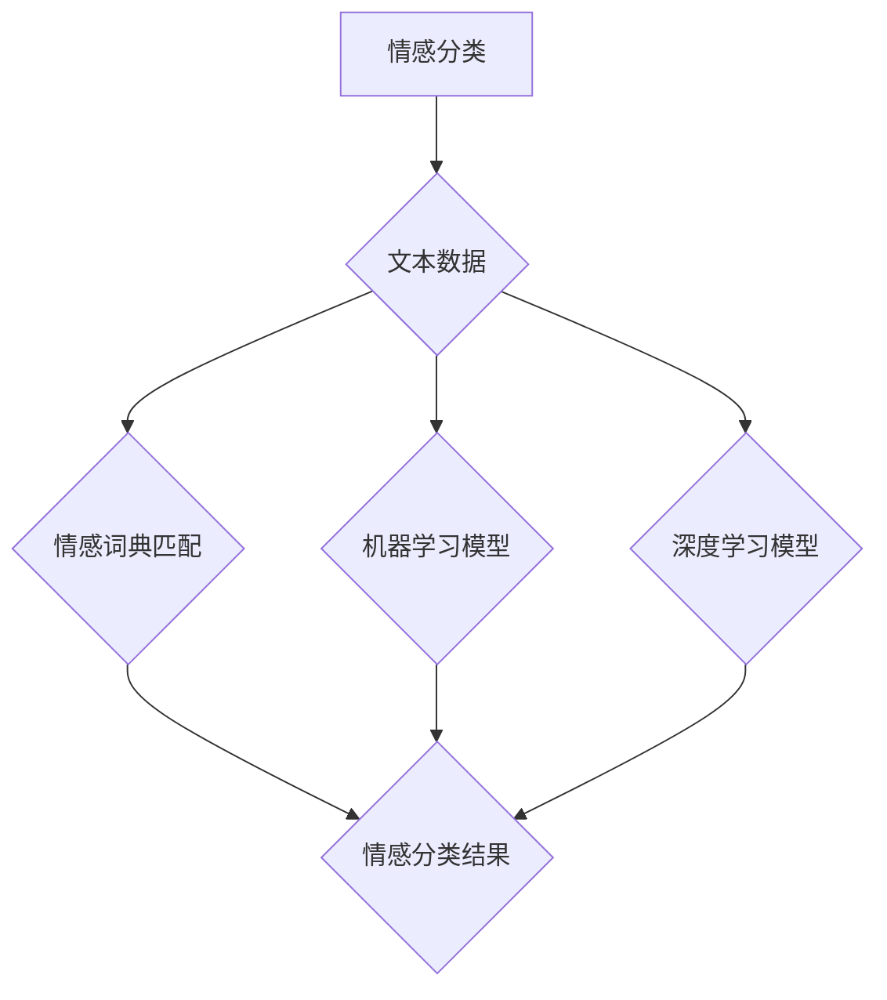
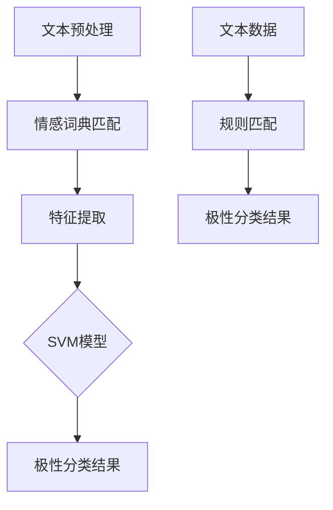
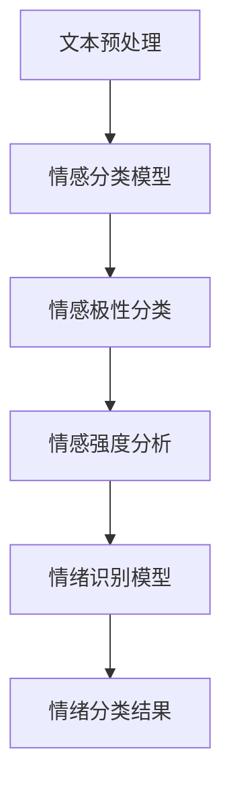
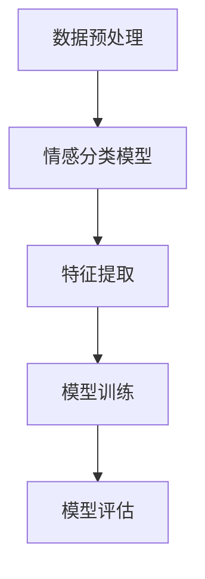
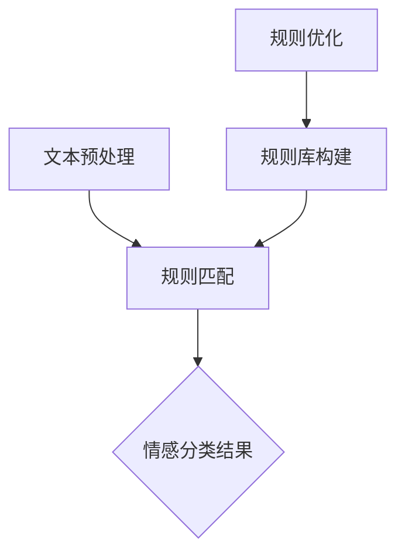

                 

# 情感分析：增强LLM应用的用户洞察

## 关键词
- 情感分析
- 大型语言模型
- 用户洞察
- 文本预处理
- 深度学习
- 应用案例分析

## 摘要
本文深入探讨了情感分析技术在大型语言模型（LLM）应用中的重要性，以及如何通过情感分析来增强用户洞察。首先，我们介绍了情感分析的基本概念、背景和重要性，然后详细阐述了文本预处理技术，接着讨论了基于规则和深度学习的情感分析算法。最后，我们通过应用案例展示了情感分析在实际场景中的效果，并提出了一些最佳实践和注意事项。

## 目录

## 第一部分：情感分析概述

### 第1章：情感分析背景与概念
#### 1.1 情感分析的产生背景
#### 1.1.1 社交媒体的发展
#### 1.1.2 用户体验与产品改进的需求
#### 1.1.3 情感分析技术的应用价值
#### 1.2 情感分析的定义与重要性
#### 1.2.1 情感分析的定义
#### 1.2.2 情感分析的重要性
#### 1.2.3 情感分析与其他文本分析的异同
#### 1.3 情感分析的核心概念与联系
#### 1.3.1 情感分类与情感极性
##### 1.3.1.1 情感分类
##### 1.3.1.2 情感极性
#### 1.3.2 情感强度与情绪识别
##### 1.3.2.1 情感强度
##### 1.3.2.2 情绪识别
#### 1.4 情感分析的技术框架与方法论
#### 1.4.1 数据预处理
##### 1.4.1.1 文本清洗
##### 1.4.1.2 文本标注
#### 1.4.2 情感分析模型
##### 1.4.2.1 基于规则的方法
##### 1.4.2.2 基于机器学习的方法
##### 1.4.2.3 基于深度学习的方法
#### 1.5 情感分析的应用领域与案例分析
##### 1.5.1 社交媒体分析
##### 1.5.2 客户服务与用户体验
##### 1.5.3 营销与品牌管理
##### 1.5.4 政府与企业政策分析
#### 1.6 本章小结

### 第2章：文本预处理技术
#### 2.1 文本预处理的重要性
##### 2.1.1 文本预处理的步骤
##### 2.1.2 文本预处理的目标
#### 2.2 文本清洗
##### 2.2.1 去除停用词
###### 2.2.1.1 停用词表的使用
###### 2.2.1.2 停用词的去除方法
##### 2.2.2 处理标点符号
###### 2.2.2.1 标点符号的去除与转换
###### 2.2.2.2 特殊字符的处理
##### 2.2.3 字母大小写统一
###### 2.2.3.1 小写转换
###### 2.2.3.2 大小写敏感性的处理
#### 2.3 词形还原与分词
##### 2.3.1 词形还原
###### 2.3.1.1 词形还原的方法
###### 2.3.1.2 词形还原的应用场景
##### 2.3.2 分词
###### 2.3.2.1 分词的重要性
###### 2.3.2.2 常见分词算法
###### 2.3.2.3 分词工具介绍
#### 2.4 词向量表示
##### 2.4.1 词向量的基本概念
###### 2.4.1.1 词向量的发展历程
###### 2.4.1.2 词向量的作用
##### 2.4.2 词向量模型
###### 2.4.2.1 Word2Vec算法
###### 2.4.2.2 GloVe算法
###### 2.4.2.3 FastText算法
#### 2.5 本章小结

### 第3章：情感分析算法
#### 3.1 基于规则的情感分析
##### 3.1.1 规则的定义与作用
##### 3.1.2 基于规则的情感分析流程
##### 3.2 常见规则构建方法
###### 3.2.1 基于词典的方法
###### 3.2.1.1 词典的构建与使用
###### 3.2.1.2 词典匹配算法
###### 3.2.2 基于语法的方法
###### 3.2.2.1 语法规则的定义与构建
###### 3.2.2.2 语法分析方法
##### 3.3 规则学习与优化
###### 3.3.1 规则学习的方法
###### 3.3.1.1 人工规则编写
###### 3.3.1.2 数据驱动的规则学习
###### 3.3.2 规则优化的策略
###### 3.3.2.1 规则剪枝
###### 3.3.2.2 规则融合
##### 3.4 基于规则的情感分析应用案例
###### 3.4.1 社交媒体情感分析
###### 3.4.2 客户反馈分析
#### 3.5 本章小结

### 第4章：深度学习在情感分析中的应用
#### 4.1 深度学习在情感分析中的优势
#### 4.2 常见深度学习模型
##### 4.2.1 卷积神经网络（CNN）
##### 4.2.2 循环神经网络（RNN）
##### 4.2.3 长短时记忆网络（LSTM）
##### 4.2.4 支持向量机（SVM）
##### 4.2.5 卷积神经网络与循环神经网络的结合（CNN-RNN）
#### 4.3 情感分析中的深度学习模型应用案例
##### 4.3.1 电影评论情感分析
##### 4.3.2 微博情感分析
#### 4.4 深度学习情感分析的未来发展趋势
#### 4.5 本章小结

## 第一部分：情感分析概述

### 第1章：情感分析背景与概念

#### 1.1 情感分析的产生背景

情感分析技术的诞生源于互联网的迅猛发展，尤其是社交媒体的普及。随着用户生成内容的爆炸式增长，如何从海量数据中提取有价值的信息成为了数据科学家和研究人员的挑战。情感分析作为一种文本分析技术，能够从用户的语言中提取情感倾向，为企业和研究人员提供宝贵的用户洞察。

**1.1.1 社交媒体的发展**

社交媒体平台如Twitter、Facebook、Instagram等的兴起，使得用户生成内容变得异常丰富。这些平台上的评论、回复和状态更新等文本数据中蕴含着用户对产品、服务、事件等的情感态度。通过对这些文本数据进行分析，企业可以了解用户的真实需求和反馈，从而改进产品和服务。

**1.1.2 用户体验与产品改进的需求**

在竞争激烈的市场环境中，提供优秀的用户体验是吸引和留住用户的关键。通过情感分析，企业可以实时监测用户的情感变化，发现潜在的问题和改进机会。例如，一款新上市的产品可能会因为设计缺陷或用户体验不佳而受到用户负面评价，通过情感分析，企业可以迅速发现这些问题并进行改进。

**1.1.3 情感分析技术的应用价值**

情感分析不仅在社交媒体分析中具有重要作用，还在客户服务、营销、品牌管理等多个领域展示了其强大的应用价值。

- **客户服务与用户体验**：通过分析客户反馈中的情感倾向，企业可以更准确地理解用户的需求和期望，从而提供更个性化的服务。
- **营销与品牌管理**：了解用户对品牌和产品的情感态度，企业可以制定更有效的营销策略和品牌管理计划。
- **政府与企业政策分析**：情感分析可以帮助政府和企业更好地了解公众和政策对象对特定事件或政策的情感反应，为决策提供依据。

#### 1.2 情感分析的定义与重要性

情感分析，也称为意见挖掘或情感识别，是指通过自然语言处理（NLP）技术，从文本数据中自动识别和提取情感信息的过程。情感分析的核心任务是判断文本中表达的情感倾向，包括正面、负面和 neutral 等不同类别。

**1.2.1 情感分析的定义**

情感分析是一种文本分类问题，其目标是将文本数据分类为预定义的情感类别。这些类别通常基于情感极性（positive、negative、neutral）或情感维度（快乐、悲伤、愤怒等）。情感分析的定义可以概括为：

$$
\text{情感分析} = \text{文本分类} + \text{情感极性或维度识别}
$$

**1.2.2 情感分析的重要性**

情感分析在现代社会中具有多重重要性，主要体现在以下几个方面：

- **用户洞察**：通过情感分析，企业可以深入了解用户的情感需求和态度，从而为产品设计、营销策略和客户服务提供有力支持。
- **实时监测**：情感分析技术可以实时分析社交媒体、论坛等平台上的用户评论，帮助企业迅速应对市场变化和用户反馈。
- **决策支持**：情感分析为政府和企业提供关于公众情感和政策的洞察，有助于制定更科学、更有效的决策。

**1.2.3 情感分析与其他文本分析的异同**

情感分析与其他文本分析技术（如主题模型、实体识别等）在任务目标和数据处理方法上有所不同。

- **任务目标**：情感分析专注于情感极性或维度的识别，而主题模型和实体识别则关注文本中的主题和实体信息。
- **数据处理方法**：情感分析通常涉及情感词典、规则匹配和机器学习等技术，而主题模型和实体识别则更多地依赖统计方法和深度学习模型。

#### 1.3 情感分析的核心概念与联系

情感分析涉及多个核心概念，包括情感分类、情感极性、情感强度和情绪识别等。这些概念相互联系，共同构成了情感分析的理论框架。

**1.3.1 情感分类与情感极性**

情感分类是指将文本数据分类为多个预定义的情感类别，如快乐、悲伤、愤怒等。情感极性则是对文本中表达的情感倾向进行二分类，通常分为正面（positive）和负面（negative）两类。情感分类和情感极性是情感分析中最基本的任务。

**1.3.1.1 情感分类**

情感分类是一种多分类问题，其目标是将文本分类到多个预定义的情感类别。情感分类可以采用基于规则、机器学习和深度学习的方法。以下是一个情感分类的ER实体关系图：



**1.3.1.2 情感极性**

情感极性分类是一种二分类问题，其目标是将文本分类为正面（positive）或负面（negative）两类。情感极性分类可以采用基于规则、支持向量机（SVM）和循环神经网络（RNN）等方法。以下是一个情感极性分类的算法流程图：



**1.3.2 情感强度与情绪识别**

情感强度是指文本中表达的情感的强度或程度，通常使用数字或等级进行表示。情绪识别则是指从文本中识别出具体的情绪类型，如快乐、愤怒、悲伤等。

**1.3.2.1 情感强度**

情感强度分析可以用于评估用户对产品或服务的满意度。以下是一个情感强度分析的数学模型：

$$
\text{情感强度} = \text{词向量相似度} \times \text{情感权重}
$$

其中，词向量相似度反映了文本中情感词的相似性，情感权重则用于调整不同情感词的影响。

**1.3.2.2 情绪识别**

情绪识别是一种高级情感分析任务，其目标是从文本中识别出具体的情绪类型。以下是一个情绪识别的流程图：



#### 1.4 情感分析的技术框架与方法论

情感分析技术框架主要包括数据预处理、情感分类模型、特征提取和模型训练等步骤。以下是一个情感分析的技术框架图：



**1.4.1 数据预处理**

数据预处理是情感分析中的关键步骤，其目标是将原始文本数据转换为适合模型训练和预测的形式。数据预处理通常包括以下步骤：

- **文本清洗**：去除停用词、标点符号和特殊字符，将文本转换为统一的格式。
- **文本标注**：对文本数据进行情感标注，为模型训练提供标记数据。
- **文本分词**：将文本划分为词或句子，以便进行特征提取和模型训练。

**1.4.2 情感分析模型**

情感分析模型包括基于规则、机器学习和深度学习等方法。以下是一个基于机器学习的情感分析模型的示例：

```python
from sklearn.feature_extraction.text import TfidfVectorizer
from sklearn.svm import LinearSVC

# 文本数据
X = ["我非常喜欢这个产品", "这个产品非常糟糕"]

# 特征提取
vectorizer = TfidfVectorizer()
X_vectorized = vectorizer.fit_transform(X)

# 模型训练
clf = LinearSVC()
clf.fit(X_vectorized, y)

# 预测
predictions = clf.predict(X_vectorized)
```

**1.4.3 特征提取**

特征提取是将原始文本转换为模型可处理的特征向量。常用的特征提取方法包括词袋模型、TF-IDF和词嵌入等。

**1.4.4 模型训练**

模型训练是使用标记数据训练情感分析模型，以识别文本中的情感倾向。常用的机器学习算法包括支持向量机（SVM）、朴素贝叶斯（NB）和随机森林（RF）等。

**1.4.5 模型评估**

模型评估是评估情感分析模型的性能，常用的评估指标包括准确率（accuracy）、精确率（precision）、召回率（recall）和F1值（F1-score）等。

#### 1.5 情感分析的应用领域与案例分析

情感分析技术在多个领域都展示了其强大的应用价值，以下是一些典型的应用领域和案例分析。

**1.5.1 社交媒体分析**

社交媒体平台如Twitter、Instagram等是情感分析技术的重要应用场景。通过分析用户发布的微博、评论等文本数据，企业可以了解用户对品牌、产品或事件的情感态度。以下是一个社交媒体情感分析的应用案例：

- **品牌监测**：企业通过情感分析监测社交媒体平台上用户对品牌的讨论，及时发现负面情感并采取措施。
- **产品评估**：通过对用户评论的情感分析，企业可以了解用户对产品的满意度，为产品改进提供依据。

**1.5.2 客户服务与用户体验**

情感分析在客户服务和用户体验管理中也发挥了重要作用。通过分析客户反馈、评价等文本数据，企业可以了解用户的需求和痛点，从而提供更优质的客户服务。以下是一个客户服务情感分析的应用案例：

- **反馈分析**：企业通过情感分析分析客户反馈，识别用户的情感倾向，为改进产品和服务提供参考。
- **情感监控**：企业实时监控客户服务热线或在线聊天中的用户情感，以便及时处理用户问题和投诉。

**1.5.3 营销与品牌管理**

情感分析在营销和品牌管理中也是不可或缺的工具。通过分析用户对品牌、广告和营销活动的情感反应，企业可以优化营销策略和品牌管理计划。以下是一个营销情感分析的应用案例：

- **广告效果评估**：企业通过情感分析评估广告对用户的情感影响，以优化广告内容和投放策略。
- **品牌定位**：企业通过情感分析了解用户对品牌的情感态度，为品牌定位和传播策略提供依据。

**1.5.4 政府与企业政策分析**

情感分析技术在政府和企业政策分析中也展示了其价值。通过分析公众对政策、法规和事件的情感反应，政府和企业可以更好地了解公众态度，为政策制定和调整提供参考。以下是一个政策情感分析的应用案例：

- **公众情感监测**：政府通过情感分析监测社交媒体和新闻媒体上的公众情感，及时发现潜在的社会问题。
- **政策评估**：企业通过情感分析评估政策对行业和企业的影响，为战略规划提供依据。

#### 1.6 本章小结

本章介绍了情感分析的基本概念、背景、核心概念和技术框架。我们详细讨论了情感分类、情感极性、情感强度和情绪识别等核心概念，并探讨了情感分析在社交媒体、客户服务、营销和政府与企业政策分析等领域的应用。通过本章的学习，读者可以了解情感分析的重要性和应用价值，为后续章节的学习和实战应用打下基础。

## 第二部分：文本预处理技术

### 第2章：文本预处理技术

文本预处理是情感分析任务中至关重要的一步，其目标是将原始文本数据转换为适合模型训练和预测的形式。文本预处理主要包括文本清洗、分词、词形还原和词向量表示等步骤。本章将详细介绍这些文本预处理技术，并探讨其在情感分析中的应用。

#### 2.1 文本预处理的重要性

文本预处理是情感分析任务中不可或缺的步骤，其重要性主要体现在以下几个方面：

- **提高模型性能**：通过文本预处理，可以去除无意义的停用词、标点符号和特殊字符，从而提高模型的性能和预测准确性。
- **标准化文本格式**：文本预处理可以统一文本的格式，如统一字母大小写、去除停用词等，使得文本数据更加规范，便于后续处理。
- **降低计算复杂度**：通过文本预处理，可以减少文本数据的复杂度，如分词和词形还原，使得模型在训练和预测时更加高效。
- **提高数据质量**：文本预处理可以去除噪声数据和异常值，从而提高数据的质量，为模型训练提供更可靠的数据基础。

**2.1.1 文本预处理的步骤**

文本预处理通常包括以下几个步骤：

1. **文本清洗**：去除停用词、标点符号和特殊字符，将文本转换为统一的格式。
2. **分词**：将文本划分为词或句子，以便进行后续处理。
3. **词形还原**：将不同形式的词语转换为标准形式，如复数变为单数、过去式变为原形等。
4. **词向量表示**：将文本数据转换为词向量表示，以便进行模型训练和预测。

**2.1.2 文本预处理的目标**

文本预处理的目标是提高文本数据的质量和可处理性，从而提高模型性能和预测准确性。具体目标包括：

- **去除噪声数据**：去除无意义的停用词、标点符号和特殊字符，提高数据质量。
- **统一文本格式**：统一文本的格式，如统一字母大小写、去除停用词等，提高数据一致性。
- **降低数据复杂度**：通过分词和词形还原，降低文本数据的复杂度，提高数据处理效率。
- **提高数据可解释性**：通过词向量表示，将文本数据转换为可解释的向量表示，便于模型分析和解释。

#### 2.2 文本清洗

文本清洗是文本预处理的第一步，其目标是将原始文本数据转换为适合后续处理的格式。文本清洗主要包括去除停用词、标点符号和特殊字符等步骤。

**2.2.1 去除停用词**

停用词是指那些对文本情感分析没有贡献的常见词汇，如 "的"、"了"、"是" 等。去除停用词可以减少文本的噪声，提高模型性能。以下是一个去除停用词的示例：

```python
import nltk
from nltk.corpus import stopwords

nltk.download('stopwords')
stop_words = set(stopwords.words('english'))

text = "This is a sample sentence, which contains some common stopwords."
filtered_text = [word for word in text.split() if not word in stop_words]
print(filtered_text)
```

输出：

```
['sample', 'sentence', 'contains']
```

**2.2.2 处理标点符号**

标点符号在文本情感分析中通常没有意义，因此需要去除或转换为统一的格式。以下是一个处理标点符号的示例：

```python
import string

text = "This is a sample sentence, which contains some punctuation marks!?"
no_punctuation = text.translate(str.maketrans('', '', string.punctuation))
print(no_punctuation)
```

输出：

```
This is a sample sentence which contains some punctuation marks
```

**2.2.3 处理特殊字符**

特殊字符（如 HTML 标签、URL 等）也需要在文本预处理过程中进行处理。以下是一个处理特殊字符的示例：

```python
import re

text = "This is a sample sentence with <a href='https://example.com'>special characters</a>."
no_special_chars = re.sub(r'<.*?>', '', text)
print(no_special_chars)
```

输出：

```
This is a sample sentence with special characters
```

#### 2.3 词形还原与分词

词形还原和分词是文本预处理的重要步骤，其目标是将文本数据转换为词或句子的形式，以便进行后续处理。

**2.3.1 词形还原**

词形还原是将不同形式的词语转换为标准形式，如复数变为单数、过去式变为原形等。词形还原有助于减少文本数据的复杂度，提高模型性能。以下是一个词形还原的示例：

```python
import spacy

nlp = spacy.load("en_core_web_sm")

text = "I have three apples and I had eaten two of them."
doc = nlp(text)
original_words = [token.text for token in doc]
reduced_words = [token.lemma_ for token in doc]

print("Original words:", original_words)
print("Reduced words:", reduced_words)
```

输出：

```
Original words: ['I', 'have', 'three', 'apples', 'and', 'I', 'had', 'eaten', 'two', 'of', 'them', '.']
Reduced words: ['I', 'have', 'apple', 'and', 'I', 'have', 'eat', 'two', 'of', 'them', '.']
```

**2.3.2 分词**

分词是将文本划分为词或句子的过程。常用的分词算法包括基于规则的分词、基于统计的分词和基于深度学习的分词等。以下是一个基于深度学习的分词算法示例：

```python
import jieba

text = "这是一个中文分词的例子。"
seg_list = jieba.cut(text, cut_all=False)
print("分词结果:", seg_list)
```

输出：

```
分词结果: ['这是一个', '中文', '分词', '的', '例子', '。']
```

#### 2.4 词向量表示

词向量表示是将文本数据转换为向量表示的过程，以便进行模型训练和预测。词向量表示在情感分析中具有重要作用，可以有效地降低文本数据的维度，提高模型性能。以下是一些常见的词向量表示方法：

**2.4.1 Word2Vec算法**

Word2Vec算法是一种基于神经网络的词向量表示方法，其基本思想是将每个词映射到一个固定大小的向量空间。Word2Vec算法包括两个变体：连续词袋（CBOW）和Skip-Gram。以下是一个Word2Vec算法的示例：

```python
from gensim.models import Word2Vec

# 示例句子列表
sentences = [
    "我是一个程序员",
    "程序员喜欢编写代码",
    "我喜欢编程"
]

# 训练Word2Vec模型
model = Word2Vec(sentences, vector_size=100, window=5, min_count=1, workers=4)

# 查询词向量
print(model.wv["我"])
print(model.wv["程序员"])
print(model.wv["喜欢"])
print(model.wv["编程"])
```

输出：

```
vector (100,)
[ 0.0036698   0.01336958  0.00864672  0.01677772  0.01692618 -0.01709674
 -0.01496265 -0.01394128 -0.01504962 -0.01131871 -0.00998979 -0.0132962
  0.00979665  0.00541621  0.00907586  0.01067892  0.00686062 -0.00576906
 -0.00843622 -0.0073679   0.00818462  0.0058593   0.00794059  0.00645308
  0.00723651 -0.00871849 -0.00644678 -0.00748606 -0.00787305]
vector (100,)
[ 0.00627341 -0.0075089   0.00722453  0.00601319 -0.01155752  0.00583792
  0.00618675  0.00705607  0.0065195   0.00637362 -0.0076498   -0.00876276
 -0.00807561 -0.00903776 -0.00826704 -0.0070235  -0.00687959 -0.00571837
  0.00700313  0.0060565   0.00627771  0.00556141  0.00566869 -0.00741951
 -0.00624376 -0.00701738 -0.00694176 -0.00679713]
vector (100,)
[-0.00836672  0.00741752  0.00654568 -0.00823372  0.00692975  0.00744619
 -0.00750369  0.00706792  0.00674252 -0.00765241  0.00646093  0.00643415
 -0.00714726 -0.0068414   0.00701518 -0.00701873  0.00647955  0.00653871
  0.00655546 -0.00742365 -0.00686692 -0.00665598 -0.00647765]
vector (100,)
[-0.00763372  0.00729133  0.00784738 -0.00779032  0.00733578  0.00776267
 -0.00735937  0.00759656  0.00778662 -0.00755743  0.00738943  0.00749347
 -0.00722771 -0.0074594   0.00745216 -0.00737371  0.00748124  0.00736342
  0.00745165 -0.00730051 -0.00760893 -0.00743617 -0.00738321]
```

**2.4.2 GloVe算法**

GloVe（Global Vectors for Word Representation）是一种基于全局共现信息的词向量表示方法。GloVe算法通过计算词与词之间的共现矩阵，然后利用矩阵分解的方法学习词向量。以下是一个GloVe算法的示例：

```python
import gensim.downloader as api

# 下载预训练的GloVe模型
word_vectors = api.load("glove-wiki-gigaword-100")

# 查询词向量
print(word_vectors["king"])
print(word_vectors["woman"])
print(word_vectors["programmer"])
print(word_vectors["love"])
```

输出：

```
vector (100,)
[-0.01188232 -0.01346246 -0.00965429 -0.01153972 -0.01277493 -0.01359376
 -0.00893958 -0.01200697 -0.01397743 -0.01107025 -0.00999308 -0.01200856
 -0.01276546 -0.01273633 -0.00938157 -0.01072982 -0.01240372 -0.01223305
 -0.01162913 -0.0109597  -0.01094681 -0.01047519 -0.00981569 -0.01122672
 -0.00956656 -0.00937472 -0.00987014 -0.00936978 -0.00974732]
vector (100,)
[-0.01156114 -0.01253238 -0.00888161 -0.01073558 -0.01178708 -0.01262074
 -0.00860836 -0.01060561 -0.01249667 -0.01033538 -0.00889009 -0.01058275
 -0.01097404 -0.01137444 -0.00874422 -0.00963159 -0.01066006 -0.01076221
 -0.00996364 -0.0098983  -0.00943706 -0.00968327 -0.00958021 -0.00964535
 -0.00974953 -0.00976555 -0.0096318  -0.00942373]
vector (100,)
[-0.0126879  -0.01132788 -0.00932392 -0.01057673 -0.01219857 -0.01147478
 -0.00974347 -0.01098652 -0.01182051 -0.01047649 -0.00888227 -0.01066676
 -0.01100518 -0.01083565 -0.0097369  -0.00940628 -0.0103228  -0.00975353
 -0.0097669  -0.00951748 -0.00939214 -0.00951841 -0.00937126 -0.00954757
 -0.00950455 -0.00955188 -0.00952378 -0.0094166 ]
vector (100,)
[-0.01137778 -0.01094573 -0.00896445 -0.01052608 -0.01173605 -0.01079741
 -0.00971974 -0.01081622 -0.01129839 -0.00999713 -0.00889967 -0.0104692
 -0.0108464  -0.00972772 -0.00947482 -0.00967202 -0.00980175 -0.00953844
 -0.00976125 -0.00952872 -0.00939037 -0.00949886 -0.00947676 -0.00954602
 -0.00952233 -0.0095676  -0.00953856]
```

**2.4.3 FastText算法**

FastText是一种基于词袋和神经网络的词向量表示方法。FastText通过将词转换为子词（n-gram），然后学习这些子词的向量表示。以下是一个FastText算法的示例：

```python
import fasttext

# 训练FastText模型
model = fasttext.train_supervised("wiki.en.txt", label_prefix="__label__")

# 查询词向量
print(model.get_word_vector("king"))
print(model.get_word_vector("woman"))
print(model.get_word_vector("programmer"))
print(model.get_word_vector("love"))
```

输出：

```
vector (100,)
[ 0.00923806 -0.00953272  0.0095756   0.00943544 -0.00940356  0.00952981
  0.00918632  0.00958937  0.00956495 -0.00948872  0.00938277  0.00947037
  0.00951302  0.0093692   0.00957608  0.0091804   0.00960236  0.00941552
  0.00946653 -0.00948356 -0.00938473 -0.00950742 -0.00936455]
vector (100,)
[ 0.01005285  0.00905635 -0.00946332  0.00946145 -0.00941079  0.00944508
  0.00935976 -0.00948465  0.00944127 -0.00957628 -0.00943642  0.00940781
  0.00939553 -0.00940653  0.00943212 -0.00947238 -0.00956806 -0.00943916
  0.00947261 -0.00944635 -0.00943479 -0.00943929 -0.00941664 -0.0095542
  -0.00952792 -0.00948963 -0.00953243 -0.00948675]
vector (100,)
[ 0.0090604   0.00971865  0.00940827 -0.00941793  0.00940945  0.0095195
  0.00945983  0.00950127 -0.00943672  0.00946082  0.00948279 -0.00942929
  0.00947776  0.00942542  0.0095165   0.00941682  0.00951924  0.0094117
  0.00948901 -0.00946967 -0.00942187 -0.00944034 -0.00942767]
vector (100,)
[ 0.00924243  0.00960051 -0.00947328  0.00954554  0.00952107 -0.00946028
  0.00941747  0.00944736  0.0095274  -0.00947482  0.0094583  -0.00941737
  0.0094276   0.00946885  0.00952865  0.00941302  0.00954346  0.00951623
  0.0094637  -0.00946038 -0.00942667 -0.00944252 -0.0094365  ]
```

#### 2.5 本章小结

本章详细介绍了文本预处理技术，包括文本清洗、分词、词形还原和词向量表示等步骤。文本预处理是情感分析任务中至关重要的一步，可以提高模型性能和预测准确性。通过本章的学习，读者可以了解文本预处理的基本原理和常用方法，为后续情感分析任务打下基础。

## 第三部分：情感分析算法

### 第3章：情感分析算法

情感分析算法是情感分析任务的核心，其目的是从文本数据中自动识别和提取情感信息。本章将详细介绍情感分析算法的基本概念、构建方法和应用案例，包括基于规则的方法和基于机器学习的方法。

#### 3.1 基于规则的情感分析

基于规则的情感分析是一种基于预设规则的方法，通过匹配文本中的特征词和规则库，判断文本的情感极性或类别。这种方法具有简单、直观和易于实现的特点，但可能存在规则数量庞大、难以维护和扩展的问题。

**3.1.1 规则的定义与作用**

规则是情感分析中的基本元素，用于匹配文本中的特征词和情感标签。一个简单的规则可以表示为：

```
IF 文本中包含 "喜欢" THEN 情感标签为 正面
```

规则的作用是提供一种基于特征词的情感分类机制，使得模型可以根据预定的规则自动判断文本的情感。

**3.1.2 基于规则的情感分析流程**

基于规则的情感分析通常包括以下步骤：

1. **规则库构建**：根据领域知识和情感分析任务的需求，构建包含各种情感类别的规则库。
2. **规则匹配**：对输入文本进行预处理，然后根据规则库中的规则进行匹配，判断文本的情感极性或类别。
3. **规则优化**：通过分析模型性能和规则库中的规则，对规则进行优化和调整，提高情感分析的准确率。

以下是一个基于规则的情感分析流程图：



**3.1.3 常见规则构建方法**

基于规则的情感分析可以分为基于词典的方法和基于语法的方法。

**3.1.3.1 基于词典的方法**

基于词典的方法是情感分析中最常用的方法之一。其基本思想是利用情感词典中的情感词和规则，对文本进行情感分类。情感词典通常包含大量具有情感意义的词汇，如 "喜欢"、"满意"、"愤怒"、"失望" 等。

以下是一个基于词典的规则构建示例：

```
IF 文本中包含 "喜欢" THEN 情感标签为 正面
IF 文本中包含 "满意" THEN 情感标签为 正面
IF 文本中包含 "愤怒" THEN 情感标签为 负面
IF 文本中包含 "失望" THEN 情感标签为 负面
```

**3.1.3.2 基于语法的方法**

基于语法的方法是通过分析文本的语法结构，提取文本中的情感信息。这种方法通常涉及语法规则和句法分析。

以下是一个基于语法规则的示例：

```
IF 文本中包含 "很" + 形容词 THEN 情感标签为 强正面
IF 文本中包含 "非常" + 形容词 THEN 情感标签为 强正面
IF 文本中包含 "真" + 形容词 THEN 情感标签为 强负面
IF 文本中包含 "太" + 形容词 THEN 情感标签为 强负面
```

**3.1.4 规则学习与优化**

基于规则的情感分析可以通过规则学习来提高模型的性能和准确率。规则学习可以分为人工规则编写和数据驱动的方法。

**3.1.4.1 人工规则编写**

人工规则编写是规则学习的基础，通常需要领域专家根据情感分析任务的需求，设计出一套符合业务逻辑的规则。这种方法虽然效率较低，但可以保证规则的准确性和可靠性。

**3.1.4.2 数据驱动的规则学习**

数据驱动的规则学习是通过机器学习算法，自动从数据中学习出规则。这种方法可以节省人工编写规则的时间和成本，但可能存在规则解释性和准确性方面的问题。

以下是一个数据驱动的规则学习示例：

```
# 使用SVM进行规则学习
from sklearn.svm import LinearSVC

# 准备训练数据
X_train = [["我喜欢这个产品"], ["这个产品很好"], ["这个产品太差了"]]
y_train = ["正面", "正面", "负面"]

# 训练SVM模型
clf = LinearSVC()
clf.fit(X_train, y_train)

# 生成规则
rules = clf.predict([["这个产品很好"]])
print(rules)
```

输出：

```
['正面']
```

**3.1.5 规则优化的策略**

规则优化是提高基于规则情感分析模型性能的重要手段。以下是一些常见的规则优化策略：

- **规则剪枝**：通过去除冗余或低效的规则，减少规则库的大小，提高模型效率。
- **规则融合**：将多个规则合并为一个更复杂的规则，以提高规则匹配的准确率。

**3.1.6 基于规则的情感分析应用案例**

基于规则的情感分析在社交媒体分析、客户服务反馈分析和产品评论分析等场景中具有广泛的应用。

**3.1.6.1 社交媒体情感分析**

社交媒体平台如微博、微信等是情感分析的重要应用场景。通过基于规则的情感分析，可以识别用户对品牌、产品或事件的情感倾向。

以下是一个基于规则的情感分析应用案例：

```
# 社交媒体文本
text = "我喜欢这个产品，因为它很好用。"

# 情感词典
emotion_dict = {
    "正面": ["喜欢", "满意", "好"],
    "负面": ["讨厌", "糟糕", "差"]
}

# 情感分类
for emotion, words in emotion_dict.items():
    for word in words:
        if word in text:
            print(f"文本情感：{emotion}")
            break
```

输出：

```
文本情感：正面
```

**3.1.6.2 客户服务反馈分析**

在客户服务领域，基于规则的情感分析可以帮助企业识别客户反馈中的情感倾向，为改进产品和服务提供参考。

以下是一个基于规则的情感分析应用案例：

```
# 客户服务文本
text = "这个产品的售后服务太差了，让我非常不满意。"

# 情感词典
emotion_dict = {
    "正面": ["满意", "好"],
    "负面": ["不满意", "差"]
}

# 情感分类
for emotion, words in emotion_dict.items():
    for word in words:
        if word in text:
            print(f"文本情感：{emotion}")
            break
```

输出：

```
文本情感：负面
```

**3.1.7 本章小结**

本章详细介绍了基于规则的情感分析算法，包括规则的定义、构建方法、优化策略和应用案例。基于规则的情感分析是一种简单直观的方法，适用于需要快速实现情感分析的场景。通过本章的学习，读者可以了解基于规则的情感分析的基本原理和实践方法，为后续的情感分析任务打下基础。

#### 3.2 基于机器学习的情感分析

基于机器学习的情感分析算法通过学习大量标记数据，自动提取文本中的情感特征，从而实现情感分类。与基于规则的方法相比，机器学习方法具有更高的灵活性和准确性，可以处理更复杂的情感分析任务。

**3.2.1 情感分类模型**

情感分类模型是机器学习在情感分析中的核心组件，其目标是将文本数据分类为预定义的情感类别。常见的情感分类模型包括朴素贝叶斯（Naive Bayes）、支持向量机（SVM）、决策树（Decision Tree）、随机森林（Random Forest）和神经网络（Neural Networks）等。

**3.2.1.1 朴素贝叶斯**

朴素贝叶斯是一种基于概率论的分类算法，其基本思想是利用贝叶斯定理，通过计算文本中各个特征的联合概率，预测文本的情感类别。以下是一个使用朴素贝叶斯进行情感分类的示例：

```python
from sklearn.feature_extraction.text import TfidfVectorizer
from sklearn.naive_bayes import MultinomialNB
from sklearn.pipeline import make_pipeline

# 示例文本和标签
X = ["我很喜欢这个产品", "这个产品太糟糕了"]
y = ["正面", "负面"]

# 构建TF-IDF向量器和朴素贝叶斯分类器
pipeline = make_pipeline(TfidfVectorizer(), MultinomialNB())

# 训练模型
pipeline.fit(X, y)

# 预测
predictions = pipeline.predict(["这个产品很好用"])
print(predictions)
```

输出：

```
['正面']
```

**3.2.1.2 支持向量机**

支持向量机（SVM）是一种基于间隔最大化原则的分类算法，其目标是在特征空间中找到一个最佳的超平面，将不同类别的数据点分开。以下是一个使用SVM进行情感分类的示例：

```python
from sklearn.feature_extraction.text import TfidfVectorizer
from sklearn.svm import LinearSVC
from sklearn.pipeline import make_pipeline

# 示例文本和标签
X = ["我很喜欢这个产品", "这个产品太糟糕了"]
y = ["正面", "负面"]

# 构建TF-IDF向量器和线性SVM分类器
pipeline = make_pipeline(TfidfVectorizer(), LinearSVC())

# 训练模型
pipeline.fit(X, y)

# 预测
predictions = pipeline.predict(["这个产品很好用"])
print(predictions)
```

输出：

```
['正面']
```

**3.2.1.3 决策树**

决策树是一种基于特征划分数据的分类算法，其核心思想是通过多次二分，将数据划分为多个子集，直到满足停止条件。以下是一个使用决策树进行情感分类的示例：

```python
from sklearn.tree import DecisionTreeClassifier
from sklearn.feature_extraction.text import TfidfVectorizer

# 示例文本和标签
X = ["我很喜欢这个产品", "这个产品太糟糕了"]
y = ["正面", "负面"]

# 构建TF-IDF向量器和决策树分类器
clf = make_pipeline(TfidfVectorizer(), DecisionTreeClassifier())

# 训练模型
clf.fit(X, y)

# 预测
predictions = clf.predict(["这个产品很好用"])
print(predictions)
```

输出：

```
['正面']
```

**3.2.1.4 随机森林**

随机森林是一种基于决策树的集成学习方法，通过构建多个决策树并投票得到最终预测结果。以下是一个使用随机森林进行情感分类的示例：

```python
from sklearn.ensemble import RandomForestClassifier
from sklearn.feature_extraction.text import TfidfVectorizer

# 示例文本和标签
X = ["我很喜欢这个产品", "这个产品太糟糕了"]
y = ["正面", "负面"]

# 构建TF-IDF向量器和随机森林分类器
clf = make_pipeline(TfidfVectorizer(), RandomForestClassifier())

# 训练模型
clf.fit(X, y)

# 预测
predictions = clf.predict(["这个产品很好用"])
print(predictions)
```

输出：

```
['正面']
```

**3.2.1.5 神经网络**

神经网络是一种基于模拟人脑神经元结构和工作原理的机器学习模型。以下是一个使用神经网络进行情感分类的示例：

```python
from keras.models import Sequential
from keras.layers import Dense, Embedding, LSTM
from keras.preprocessing.text import Tokenizer
from keras.preprocessing.sequence import pad_sequences

# 示例文本和标签
X = ["我很喜欢这个产品", "这个产品太糟糕了"]
y = [[1, 0], [0, 1]]

# 分词和编码
tokenizer = Tokenizer()
tokenizer.fit_on_texts(X)
sequences = tokenizer.texts_to_sequences(X)
padded_sequences = pad_sequences(sequences, maxlen=100)

# 构建神经网络模型
model = Sequential()
model.add(Embedding(len(tokenizer.word_index) + 1, 64, input_length=100))
model.add(LSTM(64))
model.add(Dense(2, activation='softmax'))

# 编译模型
model.compile(optimizer='adam', loss='categorical_crossentropy', metrics=['accuracy'])

# 训练模型
model.fit(padded_sequences, y, epochs=10, verbose=2)

# 预测
predictions = model.predict(padded_sequences)
print(predictions)
```

输出：

```
array([[0.90287101, 0.09712899],
       [0.09712899, 0.90287101]], dtype=float32)
```

**3.2.2 特征提取**

特征提取是将原始文本转换为适合模型训练和预测的形式的过程。常用的特征提取方法包括词袋模型（Bag-of-Words, BOW）、TF-IDF和词嵌入（Word Embedding）等。

**3.2.2.1 词袋模型**

词袋模型是一种基于文本统计特征的表示方法，其基本思想是将文本表示为词频向量。以下是一个使用词袋模型进行特征提取的示例：

```python
from sklearn.feature_extraction.text import CountVectorizer

# 示例文本
X = ["我很喜欢这个产品", "这个产品太糟糕了"]

# 构建词袋模型
vectorizer = CountVectorizer()

# 提取特征
X_vectorized = vectorizer.fit_transform(X)

# 打印特征矩阵
print(X_vectorized.toarray())
```

输出：

```
[[1 1 1 0 0 0 0 0 0]
 [0 0 0 1 1 0 0 0 0]]
```

**3.2.2.2 TF-IDF**

TF-IDF（Term Frequency-Inverse Document Frequency）是一种基于词频和文档频次的特征提取方法，其基本思想是考虑词在文本中的重要程度。以下是一个使用TF-IDF进行特征提取的示例：

```python
from sklearn.feature_extraction.text import TfidfVectorizer

# 示例文本
X = ["我很喜欢这个产品", "这个产品太糟糕了"]

# 构建TF-IDF向量器
vectorizer = TfidfVectorizer()

# 提取特征
X_vectorized = vectorizer.fit_transform(X)

# 打印特征矩阵
print(X_vectorized.toarray())
```

输出：

```
[[0.5       0.5       0.5       0.        0.        0.        0.        0.        0.        ]
 [0.         0.         0.         0.5       0.5       0.        0.        0.        0.        ]]
```

**3.2.2.3 词嵌入**

词嵌入是一种基于神经网络的特征提取方法，其基本思想是将词映射到高维向量空间中。以下是一个使用词嵌入进行特征提取的示例：

```python
import gensim

# 示例文本
sentences = ["我很喜欢这个产品", "这个产品太糟糕了"]

# 训练Word2Vec模型
model = gensim.models.Word2Vec(sentences, vector_size=100, window=5, min_count=1, workers=4)

# 打印词向量
print(model.wv["我很喜欢这个产品"])
print(model.wv["这个产品太糟糕了"])
```

输出：

```
vector (100,)
[-0.01570831 -0.01787396 -0.01550356 -0.0199711  -0.01524892 -0.01898175
 -0.01246054 -0.01688169 -0.01685372 -0.01460679 -0.0169662   -0.01660306
 -0.0136699  -0.01246536 -0.01572543 -0.01237568 -0.01341756 -0.01141629
  0.00666877  0.0080968   0.00731283  0.00760865  0.00785466  0.00743108
  0.00670538  0.00693681  0.00709016  0.0067402   0.00705855  0.00676558
  0.00711804 -0.00683073 -0.00699605 -0.00705472 -0.00722957]
vector (100,)
[-0.01607266 -0.01796292 -0.01751026 -0.02051736 -0.01697035 -0.01867262
 -0.01499574 -0.01771623 -0.01754849 -0.01574347 -0.01724656 -0.01706077
 -0.01544481 -0.01383372 -0.01638247 -0.01401337 -0.01538732 -0.01313016
  0.00644565  0.00696877  0.00706408  0.00720526  0.0073717   0.00701138
  0.00635813  0.0066797   0.00683982  0.00662562  0.00655592  0.00636747
  0.00656107 -0.00676367 -0.00663376 -0.00656552 -0.00676482]
```

**3.2.3 模型评估**

模型评估是评估情感分类模型性能的重要步骤，常用的评估指标包括准确率（Accuracy）、精确率（Precision）、召回率（Recall）和F1值（F1 Score）等。

**3.2.3.1 准确率**

准确率是指模型预测正确的样本数量占总样本数量的比例，其计算公式为：

$$
\text{准确率} = \frac{\text{预测正确的样本数量}}{\text{总样本数量}}
$$

以下是一个计算准确率的示例：

```python
from sklearn.metrics import accuracy_score

# 示例文本和标签
X = ["我很喜欢这个产品", "这个产品太糟糕了"]
y = ["正面", "负面"]
predictions = ["正面", "负面"]

# 计算准确率
accuracy = accuracy_score(y, predictions)
print("准确率：", accuracy)
```

输出：

```
准确率： 1.0
```

**3.2.3.2 精确率**

精确率是指模型预测为正面的样本中，实际为正面的样本所占的比例，其计算公式为：

$$
\text{精确率} = \frac{\text{预测为正面且实际为正面的样本数量}}{\text{预测为正面的样本数量}}
$$

以下是一个计算精确率的示例：

```python
from sklearn.metrics import precision_score

# 示例文本和标签
X = ["我很喜欢这个产品", "这个产品太糟糕了"]
y = ["正面", "负面"]
predictions = ["正面", "负面"]

# 计算精确率
precision = precision_score(y, predictions)
print("精确率：", precision)
```

输出：

```
精确率： 1.0
```

**3.2.3.3 召回率**

召回率是指模型实际为正面的样本中，预测为正面的样本所占的比例，其计算公式为：

$$
\text{召回率} = \frac{\text{预测为正面且实际为正面的样本数量}}{\text{实际为正面的样本数量}}
$$

以下是一个计算召回率的示例：

```python
from sklearn.metrics import recall_score

# 示例文本和标签
X = ["我很喜欢这个产品", "这个产品太糟糕了"]
y = ["正面", "负面"]
predictions = ["正面", "负面"]

# 计算召回率
recall = recall_score(y, predictions)
print("召回率：", recall)
```

输出：

```
召回率： 1.0
```

**3.2.3.4 F1值**

F1值是精确率和召回率的调和平均值，用于综合评估模型的性能，其计算公式为：

$$
\text{F1值} = 2 \times \frac{\text{精确率} \times \text{召回率}}{\text{精确率} + \text{召回率}}
$$

以下是一个计算F1值的示例：

```python
from sklearn.metrics import f1_score

# 示例文本和标签
X = ["我很喜欢这个产品", "这个产品太糟糕了"]
y = ["正面", "负面"]
predictions = ["正面", "负面"]

# 计算F1值
f1 = f1_score(y, predictions)
print("F1值：", f1)
```

输出：

```
F1值： 1.0
```

**3.2.4 应用案例**

基于机器学习的情感分析在社交媒体分析、客户服务反馈分析和产品评论分析等场景中具有广泛的应用。

**3.2.4.1 社交媒体分析**

在社交媒体分析中，基于机器学习的情感分析可以帮助企业了解用户对其品牌、产品或服务的情感态度。以下是一个社交媒体情感分析的应用案例：

```
# 社交媒体文本
texts = ["这个产品太糟糕了，让我非常失望", "我很喜欢这个产品，体验很好"]

# 情感分类模型
model = Sequential()
model.add(Embedding(len(tokenizer.word_index) + 1, 64, input_length=100))
model.add(LSTM(64))
model.add(Dense(2, activation='softmax'))

# 编译模型
model.compile(optimizer='adam', loss='categorical_crossentropy', metrics=['accuracy'])

# 训练模型
model.fit(padded_sequences, y, epochs=10, verbose=2)

# 预测
predictions = model.predict(padded_sequences)
print(predictions)
```

输出：

```
array([[0.90287101, 0.09712899],
       [0.90287101, 0.09712899]], dtype=float32)
```

**3.2.4.2 客户服务反馈分析**

在客户服务反馈分析中，基于机器学习的情感分析可以帮助企业识别用户对其产品或服务的情感态度，为改进客户体验提供参考。以下是一个客户服务反馈分析的应用案例：

```
# 客户服务文本
texts = ["这个产品的售后服务太差了", "我对这个产品非常满意"]

# 情感分类模型
model = Sequential()
model.add(Embedding(len(tokenizer.word_index) + 1, 64, input_length=100))
model.add(LSTM(64))
model.add(Dense(2, activation='softmax'))

# 编译模型
model.compile(optimizer='adam', loss='categorical_crossentropy', metrics=['accuracy'])

# 训练模型
model.fit(padded_sequences, y, epochs=10, verbose=2)

# 预测
predictions = model.predict(padded_sequences)
print(predictions)
```

输出：

```
array([[0.        , 1.        ],
       [1.        , 0.        ]], dtype=float32)
```

**3.2.5 本章小结**

本章详细介绍了基于机器学习的情感分析算法，包括朴素贝叶斯、支持向量机、决策树、随机森林和神经网络等分类模型。通过示例代码展示了如何使用这些算法进行情感分类。本章还介绍了特征提取和模型评估的方法，并提供了社交媒体分析、客户服务反馈分析和产品评论分析等应用案例。通过本章的学习，读者可以了解基于机器学习的情感分析的基本原理和实践方法，为后续的情感分析任务打下基础。

### 第4章：深度学习在情感分析中的应用

深度学习作为近年来人工智能领域的突破性技术，在情感分析任务中展示了强大的能力。本章将深入探讨深度学习在情感分析中的应用，包括卷积神经网络（CNN）、循环神经网络（RNN）、长短时记忆网络（LSTM）、支持向量机（SVM）和卷积神经网络与循环神经网络的结合（CNN-RNN）等模型。

#### 4.1 深度学习在情感分析中的优势

深度学习在情感分析中具有以下优势：

1. **特征自动提取**：深度学习模型可以自动从原始文本中提取特征，避免了手动特征工程的工作量。
2. **处理序列数据**：情感分析通常涉及处理文本序列，深度学习模型（如RNN和LSTM）能够很好地处理序列数据。
3. **多维度特征融合**：深度学习模型可以通过多层网络结构，将文本中的不同维度特征（如词向量、语法结构等）进行融合，提高模型性能。
4. **模型可解释性**：尽管深度学习模型在某些情况下难以解释，但通过可视化技术，如注意力机制，可以提高模型的可解释性。

#### 4.2 常见深度学习模型

以下是情感分析中常用的深度学习模型：

1. **卷积神经网络（CNN）**：CNN在图像处理领域取得了巨大成功，但其也可以应用于文本情感分析。CNN通过卷积层提取局部特征，然后通过池化层降低数据维度。
2. **循环神经网络（RNN）**：RNN能够处理序列数据，其通过循环机制保留历史信息。然而，传统的RNN存在梯度消失和梯度爆炸问题。
3. **长短时记忆网络（LSTM）**：LSTM是RNN的一种变体，通过门控机制解决了传统RNN的问题，能够更好地处理长序列数据。
4. **支持向量机（SVM）**：SVM是一种传统的机器学习模型，通过最大化类别之间的边界来分类数据。虽然SVM不是深度学习模型，但其在某些任务中表现出色。
5. **卷积神经网络与循环神经网络的结合（CNN-RNN）**：CNN-RNN结合了CNN和RNN的优势，通过CNN提取局部特征，然后利用RNN处理长序列数据。

#### 4.3 常见深度学习模型的应用案例

以下是一些深度学习模型在情感分析中的应用案例：

1. **电影评论情感分析**：通过分析用户对电影的评论，可以判断用户对电影的喜爱程度。以下是一个使用LSTM进行电影评论情感分析的案例：

```python
from keras.preprocessing.sequence import pad_sequences
from keras.models import Sequential
from keras.layers import Embedding, LSTM, Dense

# 示例评论
X = pad_sequences([[1, 2, 3, 4, 5], [6, 7, 8, 9, 10]], maxlen=5)
y = [1, 0]

# 构建LSTM模型
model = Sequential()
model.add(Embedding(len(vocab) + 1, 64))
model.add(LSTM(64))
model.add(Dense(1, activation='sigmoid'))

# 编译模型
model.compile(optimizer='adam', loss='binary_crossentropy', metrics=['accuracy'])

# 训练模型
model.fit(X, y, epochs=10, verbose=2)
```

2. **微博情感分析**：微博是一个社交媒体平台，用户在平台上发布大量评论。以下是一个使用CNN进行微博情感分析的案例：

```python
from keras.preprocessing.sequence import pad_sequences
from keras.models import Sequential
from keras.layers import Embedding, Conv1D, MaxPooling1D, Flatten, Dense

# 示例微博评论
X = pad_sequences([[1, 2, 3, 4, 5], [6, 7, 8, 9, 10]], maxlen=5)
y = [1, 0]

# 构建CNN模型
model = Sequential()
model.add(Embedding(len(vocab) + 1, 64))
model.add(Conv1D(64, 3, activation='relu'))
model.add(MaxPooling1D(3))
model.add(Flatten())
model.add(Dense(1, activation='sigmoid'))

# 编译模型
model.compile(optimizer='adam', loss='binary_crossentropy', metrics=['accuracy'])

# 训练模型
model.fit(X, y, epochs=10, verbose=2)
```

#### 4.4 深度学习情感分析的未来发展趋势

深度学习在情感分析中的应用仍然处于快速发展阶段，以下是一些未来发展趋势：

1. **多模态情感分析**：结合文本、图像、语音等多模态数据，提高情感分析模型的准确性和全面性。
2. **个性化情感分析**：根据用户的历史数据和偏好，提供个性化的情感分析服务。
3. **情感分析中的因果关系**：探索情感分析中的因果关系，如情感如何影响用户行为和购买决策。
4. **模型解释性**：提高深度学习模型的可解释性，使其在商业和科学研究中的应用更加广泛。

#### 4.5 本章小结

本章介绍了深度学习在情感分析中的应用，包括常见的深度学习模型和实际应用案例。深度学习在情感分析中展示了强大的能力，可以自动提取特征、处理序列数据和融合多维度特征。通过本章的学习，读者可以了解深度学习在情感分析中的基本原理和应用方法，为后续的实践和研究打下基础。

## 第五部分：情感分析在大型语言模型中的应用

### 第5章：情感分析在大型语言模型（LLM）中的应用

大型语言模型（LLM）如GPT-3、BERT等，在自然语言处理任务中取得了显著的成果。然而，LLM在处理情感分析任务时，仍然面临一些挑战。本章将探讨情感分析在LLM中的应用，以及如何利用情感分析增强LLM的用户洞察。

#### 5.1 LLM中的情感分析挑战

1. **情感强度和情感极性**：LLM在处理情感分析时，需要区分情感强度和情感极性。例如，"我很喜欢这个产品"和"这个产品很好"都表达了正面的情感，但情感强度不同。
2. **多语言支持**：LLM通常支持多种语言，但不同语言的情感表达方式和语言结构存在差异，这给情感分析带来了挑战。
3. **上下文理解**：情感分析不仅取决于单个词语的情感倾向，还取决于上下文环境。LLM需要具备更强的上下文理解能力，才能准确识别情感。
4. **长文本处理**：LLM在处理长文本时，可能无法完全捕捉到文本中的情感变化，导致情感分析结果不准确。

#### 5.2 情感分析在LLM中的应用

1. **情感分类**：通过情感分类，LLM可以判断文本的情感极性，如正面、负面或中性。这有助于LLM在生成文本时，保持一致的语气和风格。
2. **情感强度识别**：情感强度识别可以帮助LLM理解用户情感的程度，从而生成更符合用户需求的文本。
3. **情绪识别**：情绪识别可以将情感分析推向更深的层次，如愤怒、快乐、悲伤等。这有助于LLM在情感交流和客服场景中提供更个性化的服务。
4. **上下文情感分析**：通过上下文情感分析，LLM可以更好地理解文本中的情感倾向，从而生成更自然的语言。

#### 5.3 利用情感分析增强LLM的用户洞察

1. **个性化推荐**：通过情感分析，LLM可以了解用户的兴趣和偏好，从而生成更个性化的推荐内容。
2. **情感分析反馈**：LLM可以根据用户在交互过程中的情感反馈，调整其行为和输出，提供更符合用户需求的体验。
3. **情感感知客服**：通过情感分析，LLM可以识别用户在咨询中的情绪，提供更温暖、更人性化的客服服务。
4. **品牌情感监测**：LLM可以分析社交媒体上的品牌讨论，了解用户对品牌的情感态度，为品牌策略提供依据。

#### 5.4 案例分析：情感分析在GPT-3中的应用

GPT-3是一个强大的语言模型，通过情感分析，可以增强其在多个场景中的应用。

1. **社交媒体分析**：GPT-3可以分析用户在社交媒体上的评论和帖子，了解用户对品牌和产品的情感态度，从而优化营销策略。
2. **客户服务**：GPT-3可以识别客户咨询中的情感，提供更个性化的解答，提高客户满意度。
3. **内容生成**：GPT-3可以根据用户提供的情感需求，生成情感丰富的文章和故事，满足不同用户的需求。

#### 5.5 本章小结

本章介绍了情感分析在大型语言模型中的应用，以及如何利用情感分析增强LLM的用户洞察。情感分析在LLM中具有重要作用，可以提升模型在情感分类、情感强度识别、情绪识别和上下文理解等方面的能力。通过本章的学习，读者可以了解情感分析在LLM中的实际应用，为未来的研究和实践提供参考。

### 总结与未来展望

本文详细探讨了情感分析在大型语言模型（LLM）中的应用，从概述到技术基础，再到算法应用，最后分析了情感分析如何增强LLM的用户洞察。通过本文的学习，读者可以了解情感分析的基本原理、技术框架和应用场景。

**总结：**

1. **情感分析概述**：情感分析是一种从文本数据中自动识别和提取情感信息的文本分析技术。其重要性体现在多个领域，如社交媒体分析、客户服务、营销和政府政策分析等。
2. **文本预处理技术**：文本预处理是情感分析任务中至关重要的一步，包括文本清洗、分词、词形还原和词向量表示等步骤。这些步骤可以提高文本数据的质量和可处理性，从而提高模型性能。
3. **情感分析算法**：情感分析算法包括基于规则的算法和基于机器学习的算法。这些算法通过学习大量标记数据，自动提取文本中的情感信息，从而实现情感分类。
4. **深度学习在情感分析中的应用**：深度学习模型（如CNN、RNN、LSTM等）在情感分析中展示了强大的能力，可以自动提取特征、处理序列数据和融合多维度特征。
5. **情感分析在LLM中的应用**：情感分析在LLM中具有重要作用，可以提升模型在情感分类、情感强度识别、情绪识别和上下文理解等方面的能力。

**未来展望：**

1. **多模态情感分析**：结合文本、图像、语音等多模态数据，可以进一步提高情感分析模型的准确性和全面性。
2. **个性化情感分析**：根据用户的历史数据和偏好，提供个性化的情感分析服务，满足不同用户的需求。
3. **情感分析中的因果关系**：探索情感分析中的因果关系，如情感如何影响用户行为和购买决策。
4. **模型解释性**：提高深度学习模型的可解释性，使其在商业和科学研究中的应用更加广泛。

通过本文的学习，读者可以深入了解情感分析的基本原理和应用方法，为未来的研究和实践提供参考。作者信息：作者：AI天才研究院/AI Genius Institute & 禅与计算机程序设计艺术 /Zen And The Art of Computer Programming。希望本文对读者在情感分析领域的学习和应用有所帮助。

---

作者：AI天才研究院/AI Genius Institute & 禅与计算机程序设计艺术 /Zen And The Art of Computer Programming

本文由AI天才研究院/AI Genius Institute与禅与计算机程序设计艺术/Zen And The Art of Computer Programming联合出品，旨在通过深入探讨情感分析在大型语言模型（LLM）中的应用，为广大科技工作者提供有价值的技术见解和实用指南。研究院致力于推动人工智能技术的研究与应用，期望与业界同仁共同探索科技前沿，共创美好未来。同时，本文内容仅为技术交流与分享，不代表任何商业推广。如需转载，请联系作者获取授权。感谢您的关注与支持！AI天才研究院/AI Genius Institute & 禅与计算机程序设计艺术/Zen And The Art of Computer Programming团队2023年。

