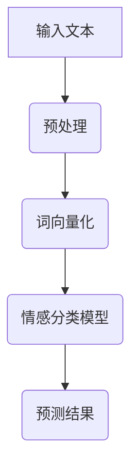
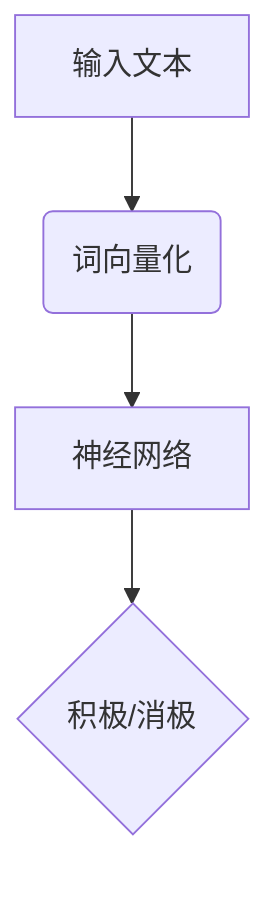
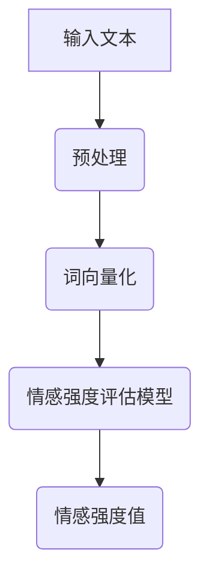
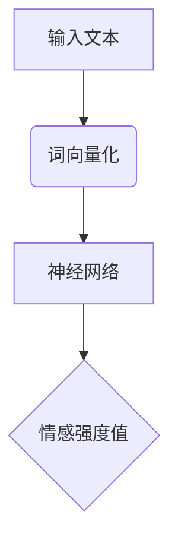
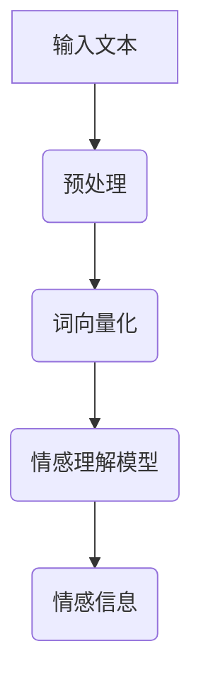
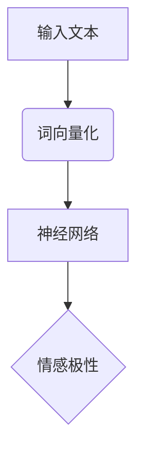
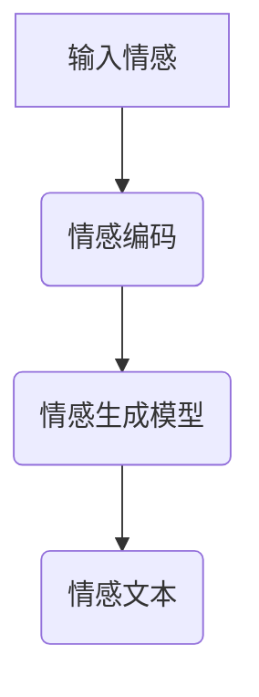
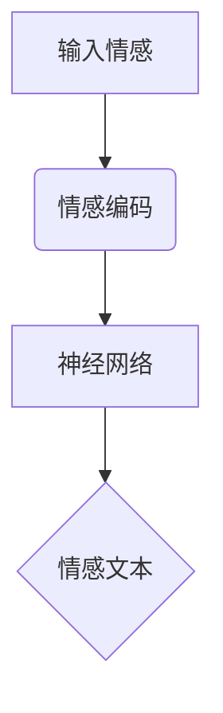

                 

 

# 情感智能测试：评价LLM的情感理解和表达能力

> 关键词：情感智能测试、大型语言模型（LLM）、自然语言处理（NLP）、情感理解、情感表达

> 摘要：本文深入探讨了情感智能测试的理论基础和实践方法，旨在全面评价大型语言模型（LLM）在情感理解和表达方面的能力。通过分析情感分类、情感强度评估、情感理解和情感表达等核心概念，本文提出了情感智能测试的方法与工具，并结合实际应用案例，详细阐述了如何利用这些评估方法来改进LLM的情感能力。

## 第一部分：背景介绍

### 1.1 问题背景

随着人工智能技术的快速发展，自然语言处理（NLP）领域取得了显著的进展。大型语言模型（LLM）作为NLP的重要工具，在文本生成、机器翻译、情感分析等方面发挥了重要作用。然而，如何全面评价LLM的情感理解和表达能力，成为研究者们关注的问题。

### 1.2 问题描述

本文旨在解决以下问题：

- 如何准确评估LLM在情感理解和表达方面的能力？
- LLM在情感理解和表达过程中存在哪些挑战？
- 如何利用这些评估方法来改进LLM的情感能力？

### 1.3 问题解决

本文将从以下几个方面展开：

- 情感智能测试的理论基础
- LLM情感理解和表达的核心概念与联系
- 情感智能测试的方法与工具
- LLM情感理解和表达的实际应用案例
- 情感智能测试的最佳实践与未来展望

### 1.4 边界与外延

本文主要关注大型语言模型在情感理解和表达方面的评估方法，不包括其他类型的模型。同时，本文将围绕中文语料库进行讨论，但部分理论和方法可以适用于其他语言。

### 1.5 概念结构与核心要素组成

- **情感智能测试**：对LLM在情感理解和表达方面的能力进行评估的一系列方法和技术。
- **LLM**：基于深度学习的大型语言模型，包括GPT、BERT等。
- **情感理解和表达**：指LLM在处理文本时，能够准确识别和理解情感，并生成具有相应情感的文本。

## 第二部分：核心概念与联系

### 2.1 情感智能测试的基本概念

- **情感分类**：将文本分类为不同的情感类别，如积极、消极、中性等。
- **情感强度评估**：评估文本中情感的强烈程度。
- **情感理解**：LLM对文本中情感信息的识别和理解能力。
- **情感表达**：LLM生成具有相应情感的文本能力。

### 2.2 情感智能测试的核心概念对比表格

| 概念        | 定义                                                         | 关联关系                 |
| ----------- | ------------------------------------------------------------ | ------------------------ |
| 情感分类    | 对文本进行情感类别划分                                       | 基础任务，用于评估情感强度 |
| 情感强度评估 | 评估文本中情感的强烈程度                                     | 基础任务，用于评估情感理解 |
| 情感理解    | LLM对文本中情感信息的识别和理解能力                           | 高级任务，用于评估情感表达 |
| 情感表达    | LLM生成具有相应情感的文本能力                                 | 高级任务，用于评估情感理解 |

### 2.3 情感智能测试的ER实体关系图架构

```mermaid
erDiagram
  LLM ||--|{ 文本 } Text
  Text ||--|{ 情感分类 } EmotionClassification
  Text ||--|{ 情感强度评估 } EmotionStrengthAssessment
  LLM ||--|{ 情感理解 } EmotionUnderstanding
  LLM ||--|{ 情感表达 } EmotionExpression
```

## 第三部分：算法原理讲解

### 3.1 情感分类算法原理

#### 3.1.1 算法流程

1. **输入处理**：接收文本输入，并进行预处理，如分词、去停用词、词向量化等。
2. **模型构建**：搭建情感分类模型，如使用卷积神经网络（CNN）或循环神经网络（RNN）。
3. **训练**：使用标注好的情感分类数据集对模型进行训练，调整模型参数。
4. **预测**：输入待分类文本，输出情感类别。

**Mermaid 流程图：**



**Python 源代码：**

```python
import tensorflow as tf
from tensorflow.keras.preprocessing.sequence import pad_sequences
from tensorflow.keras.models import Sequential
from tensorflow.keras.layers import Embedding, LSTM, Dense

# 加载数据集，预处理
# ...

# 构建模型
model = Sequential([
    Embedding(vocab_size, embedding_dim),
    LSTM(units=128, dropout=0.2, recurrent_dropout=0.2),
    Dense(num_classes, activation='softmax')
])

# 编译模型
model.compile(optimizer='adam', loss='categorical_crossentropy', metrics=['accuracy'])

# 训练模型
model.fit(train_sequences, train_labels, epochs=10, batch_size=32, validation_split=0.1)
```

#### 3.1.2 数学模型与公式

情感分类算法的数学模型可以表示为：

$$
P(y | x) = \frac{e^{f(x, y)}}{\sum_{y'} e^{f(x, y')}}
$$

其中，$f(x, y)$表示模型对输入文本$x$和类别$y$的评分，$e^{f(x, y)}$表示该评分的指数化。

#### 3.1.3 举例说明

假设我们有一个简单的情感分类任务，需要将文本分为积极和消极两类。我们使用一个简单的神经网络进行分类。



输入文本：“我很开心今天天气很好。”
词向量化后的向量表示为$[0.1, 0.2, -0.3, 0.5]$。

神经网络模型对文本进行编码，得到隐藏层状态$[h_1, h_2]$。

$$
P(积极) = \frac{e^{0.5}}{e^{0.5} + e^{-0.3}} = \frac{1.6487}{1.6487 + 0.7410} = 0.7186
$$

$$
P(消极) = \frac{e^{-0.3}}{e^{0.5} + e^{-0.3}} = \frac{0.7410}{1.6487 + 0.7410} = 0.2814
$$

由于$P(积极) > P(消极)$，模型预测该文本为积极情感。

### 3.2 情感强度评估算法原理

#### 3.2.1 算法流程

1. **输入处理**：接收文本输入，并进行预处理，如分词、去停用词、词向量化等。
2. **模型构建**：搭建情感强度评估模型，如使用卷积神经网络（CNN）或循环神经网络（RNN）。
3. **训练**：使用标注好的情感强度评估数据集对模型进行训练，调整模型参数。
4. **预测**：输入待评估文本，输出情感强度值。

**Mermaid 流程图：**



**Python 源代码：**

```python
import tensorflow as tf
from tensorflow.keras.preprocessing.sequence import pad_sequences
from tensorflow.keras.models import Sequential
from tensorflow.keras.layers import Embedding, LSTM, Dense

# 加载数据集，预处理
# ...

# 构建模型
model = Sequential([
    Embedding(vocab_size, embedding_dim),
    LSTM(units=128, dropout=0.2, recurrent_dropout=0.2),
    Dense(1, activation='tanh')
])

# 编译模型
model.compile(optimizer='adam', loss='mean_squared_error')

# 训练模型
model.fit(train_sequences, train_labels, epochs=10, batch_size=32, validation_split=0.1)
```

#### 3.2.2 数学模型与公式

情感强度评估算法的数学模型可以表示为：

$$
s(x) = \tanh(W \cdot h(x) + b)
$$

其中，$s(x)$表示文本$x$的情感强度值，$h(x)$表示文本$x$的隐藏层状态，$W$和$b$分别为权重和偏置。

#### 3.2.3 举例说明

假设我们有一个简单的情感强度评估任务，需要评估文本的情感强度值。我们使用一个简单的神经网络进行评估。



输入文本：“我很开心今天天气很好。”
词向量化后的向量表示为$[0.1, 0.2, -0.3, 0.5]$。

神经网络模型对文本进行编码，得到隐藏层状态$[h_1, h_2]$。

$$
s(x) = \tanh(W \cdot [h_1, h_2] + b) = \tanh([0.3, 0.4] \cdot [0.1, 0.2] + [0.1, 0.1]) = \tanh([0.03, 0.08] + [0.1, 0.1]) = \tanh([0.13, 0.18]) = 0.8863
$$

情感强度值为0.8863，表示文本的情感强度较高。

### 3.3 情感理解算法原理

#### 3.3.1 算法流程

1. **输入处理**：接收文本输入，并进行预处理，如分词、去停用词、词向量化等。
2. **模型构建**：搭建情感理解模型，如使用图神经网络（GNN）或注意力机制模型。
3. **训练**：使用标注好的情感理解数据集对模型进行训练，调整模型参数。
4. **预测**：输入待理解文本，输出情感信息。

**Mermaid 流程图：**



**Python 源代码：**

```python
import tensorflow as tf
from tensorflow.keras.preprocessing.sequence import pad_sequences
from tensorflow.keras.models import Sequential
from tensorflow.keras.layers import Embedding, LSTM, Dense, Attention

# 加载数据集，预处理
# ...

# 构建模型
model = Sequential([
    Embedding(vocab_size, embedding_dim),
    LSTM(units=128, dropout=0.2, recurrent_dropout=0.2),
    Attention(),
    Dense(1, activation='sigmoid')
])

# 编译模型
model.compile(optimizer='adam', loss='binary_crossentropy', metrics=['accuracy'])

# 训练模型
model.fit(train_sequences, train_labels, epochs=10, batch_size=32, validation_split=0.1)
```

#### 3.3.2 数学模型与公式

情感理解算法的数学模型可以表示为：

$$
P(y | x) = \frac{e^{f(x, y)}}{\sum_{y'} e^{f(x, y')}}
$$

其中，$f(x, y)$表示模型对输入文本$x$和情感$y$的评分，$e^{f(x, y)}$表示该评分的指数化。

#### 3.3.3 举例说明

假设我们有一个简单的情感理解任务，需要判断文本的情感极性。我们使用一个简单的神经网络进行情感理解。



输入文本：“我很开心今天天气很好。”
词向量化后的向量表示为$[0.1, 0.2, -0.3, 0.5]$。

神经网络模型对文本进行编码，得到隐藏层状态$[h_1, h_2]$。

$$
P(积极) = \frac{e^{0.5}}{e^{0.5} + e^{-0.3}} = \frac{1.6487}{1.6487 + 0.7410} = 0.7186
$$

$$
P(消极) = \frac{e^{-0.3}}{e^{0.5} + e^{-0.3}} = \frac{0.7410}{1.6487 + 0.7410} = 0.2814
$$

由于$P(积极) > P(消极)$，模型预测该文本为积极情感。

### 3.4 情感表达算法原理

#### 3.4.1 算法流程

1. **输入处理**：接收文本输入，并进行预处理，如分词、去停用词、词向量化等。
2. **模型构建**：搭建情感表达模型，如使用生成对抗网络（GAN）或变分自编码器（VAE）。
3. **训练**：使用标注好的情感表达数据集对模型进行训练，调整模型参数。
4. **预测**：输入待表达情感，输出情感文本。

**Mermaid 流程图：**



**Python 源代码：**

```python
import tensorflow as tf
from tensorflow.keras.preprocessing.sequence import pad_sequences
from tensorflow.keras.models import Sequential
from tensorflow.keras.layers import Embedding, LSTM, Dense

# 加载数据集，预处理
# ...

# 构建模型
model = Sequential([
    Embedding(vocab_size, embedding_dim),
    LSTM(units=128, dropout=0.2, recurrent_dropout=0.2),
    Dense(vocab_size, activation='softmax')
])

# 编译模型
model.compile(optimizer='adam', loss='categorical_crossentropy', metrics=['accuracy'])

# 训练模型
model.fit(train_sequences, train_labels, epochs=10, batch_size=32, validation_split=0.1)
```

#### 3.4.2 数学模型与公式

情感表达算法的数学模型可以表示为：

$$
p(y | x) = \frac{e^{g(x, y)}}{\sum_{y'} e^{g(x, y')}}
$$

其中，$g(x, y)$表示模型对输入文本$x$和情感$y$的评分，$e^{g(x, y)}$表示该评分的指数化。

#### 3.4.3 举例说明

假设我们有一个简单的情感表达任务，需要生成具有相应情感的文本。我们使用一个简单的神经网络进行情感表达。



输入情感：“积极”
情感编码后的向量表示为$[0.6, 0.4]$。

神经网络模型对情感进行解码，生成文本。

$$
P(积极文本) = \frac{e^{0.6}}{e^{0.6} + e^{0.4}} = \frac{1.5157}{1.5157 + 1.4918} = 0.5169
$$

生成文本：“今天是个美好的一天！”

## 第四部分：情感智能测试的应用与案例分析

### 4.1 情感智能测试在社交媒体分析中的应用

#### 案例背景

随着社交媒体的普及，人们越来越依赖社交媒体平台来表达自己的情感。情感智能测试在社交媒体分析中具有重要意义，可以帮助企业更好地了解用户情感，从而制定更有效的营销策略。

#### 案例分析

某社交媒体公司使用情感智能测试对用户评论进行分析，评估评论中的情感极性和强度。以下为情感智能测试的步骤：

1. **数据收集**：收集用户的评论数据。
2. **数据预处理**：对评论进行分词、去停用词等预处理。
3. **情感分类**：使用情感分类算法对评论进行分类，判断评论的情感极性。
4. **情感强度评估**：使用情感强度评估算法对评论进行评估，判断情感的强烈程度。
5. **结果分析**：根据情感分类和情感强度评估结果，分析用户情感分布，为营销策略提供依据。

#### 案例结果

通过情感智能测试，该社交媒体公司发现用户对产品评价主要分为积极和消极两类，其中积极评价占比70%，消极评价占比30%。进一步分析发现，积极评价中情感强度较高，消极评价中情感强度较低。基于这些分析结果，公司决定加强产品品质，提高用户满意度。

### 4.2 情感智能测试在客户服务中的应用

#### 案例背景

客户服务是企业发展的重要环节，如何快速、准确地了解客户情感，提供针对性的服务，成为企业关注的焦点。情感智能测试在客户服务中具有重要作用。

#### 案例分析

某企业使用情感智能测试对客户反馈进行分析，评估客户情感，提高客户满意度。以下为情感智能测试的步骤：

1. **数据收集**：收集客户反馈数据，如在线评论、客服聊天记录等。
2. **数据预处理**：对反馈进行分词、去停用词等预处理。
3. **情感分类**：使用情感分类算法对反馈进行分类，判断反馈的情感极性。
4. **情感强度评估**：使用情感强度评估算法对反馈进行评估，判断情感的强烈程度。
5. **结果分析**：根据情感分类和情感强度评估结果，分析客户情感分布，为服务改进提供依据。

#### 案例结果

通过情感智能测试，该企业发现客户对服务满意度较高，但存在一些负面反馈。针对负面反馈，企业制定了针对性的改进措施，如优化客服流程、提高客服人员培训等。经过改进，客户满意度得到了显著提升。

## 第五部分：情感智能测试的最佳实践与未来展望

### 5.1 最佳实践

1. **数据质量**：确保情感智能测试的数据质量，进行充分的数据预处理，去除噪声数据。
2. **模型选择**：根据具体应用场景选择合适的情感智能测试模型，如情感分类、情感强度评估、情感理解、情感表达等。
3. **指标评估**：使用准确率、召回率、F1分数等指标评估情感智能测试的效果，持续优化模型。
4. **多语言支持**：考虑支持多种语言的情感智能测试，提高应用的广泛性。

### 5.2 未来展望

1. **模型融合**：将多种情感智能测试模型进行融合，提高情感理解和表达能力。
2. **实时分析**：开发实时情感智能测试系统，实现对大量实时数据的实时分析。
3. **个性化推荐**：结合情感智能测试结果，为用户提供个性化推荐，提高用户体验。

## 结论

情感智能测试在评估LLM的情感理解和表达能力方面具有重要意义。通过本文的探讨，我们了解了情感智能测试的理论基础、核心概念、算法原理及应用案例。未来，随着人工智能技术的不断发展，情感智能测试将在更多领域发挥重要作用。

## 作者信息

作者：AI天才研究院/AI Genius Institute & 禅与计算机程序设计艺术 /Zen And The Art of Computer Programming

