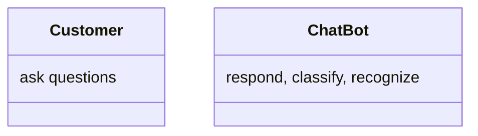
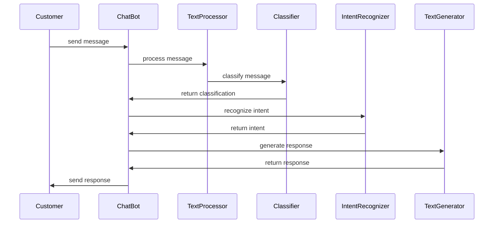

                 

### 设计高效LLM应用开发流程：从架构到实践

#### 关键词：
- LLM应用开发
- 架构设计
- 实践流程
- 算法原理
- 数学模型

#### 摘要：
本文将深入探讨LLM（大型语言模型）应用开发的高效流程，从架构设计到实践操作，帮助开发者掌握LLM开发的核心知识和技巧。通过逐步分析，我们将阐述如何构建一个高效、可扩展的LLM应用系统。

---

#### 1. LLM应用开发背景介绍

##### 1.1 问题背景
LLM作为自然语言处理的重要工具，近年来在各个领域得到了广泛应用。然而，随着数据规模和复杂度的增加，如何设计一个高效、稳定的LLM应用系统成为了一个亟待解决的问题。

##### 1.1.1 语言模型的发展历程
从最早的NLP模型（如TF-IDF、Word2Vec）到现代的大型语言模型（如BERT、GPT），语言模型的演进为我们带来了巨大的进步。了解这些历史，有助于我们更好地理解当前的技术状况。

##### 1.1.2 LLM在应用中的重要性
LLM在智能客服、文本生成、语言翻译等应用中发挥着重要作用。高效开发LLM应用，不仅能够提高业务效率，还能提升用户体验。

##### 1.1.3 LLM应用面临的挑战
- **计算资源消耗**：大规模语言模型的训练和推理需要大量的计算资源。
- **数据隐私问题**：处理敏感数据时，如何保障用户隐私是一个重要挑战。
- **模型可解释性**：大型模型的决策过程往往不透明，如何提升模型的可解释性成为了一个难题。

##### 1.2 问题描述
在LLM应用开发中，我们面临以下关键问题：
- **架构设计**：如何设计一个高效、可扩展的系统架构？
- **算法优化**：如何优化语言模型，提高性能和效率？
- **数据处理**：如何高效地处理大规模数据，保证数据质量和一致性？
- **安全性**：如何保障系统的安全性，防止数据泄露和滥用？

##### 1.3 问题解决思路
为了解决上述问题，我们需要从以下几个方面入手：
- **架构设计**：设计一个灵活、可扩展的架构，以便应对不同的应用场景。
- **算法优化**：深入研究语言模型的优化策略，提高模型性能。
- **数据处理**：采用高效的数据处理技术，确保数据处理的速度和质量。
- **安全性保障**：加强系统的安全措施，确保数据的安全和隐私。

##### 1.4 本章小结
本文简要介绍了LLM应用开发的问题背景、问题描述和解决思路。在接下来的章节中，我们将深入探讨LLM的核心概念、算法原理、系统架构设计以及实践操作。

---

#### 2. LLM核心概念与联系

##### 2.1 核心概念
- **语言模型**：对自然语言文本的建模，用于预测下一个单词、句子或文本段。
- **大规模语言模型**：通过训练大量文本数据生成的复杂模型，如GPT、BERT等。
- **自然语言处理（NLP）**：使用计算机技术处理和分析自然语言文本。

##### 2.2 概念属性特征对比表格
| 模型类型 | 特点 | 应用 |
| :--- | :--- | :--- |
| 小规模语言模型 | 参数较少，训练速度快 | 基础文本处理任务 |
| 中规模语言模型 | 参数适中，性能较好 | 复杂文本处理任务 |
| 大规模语言模型 | 参数庞大，性能卓越 | 高级文本处理任务 |

##### 2.3 ER实体关系图架构
- **实体**：文本、单词、句子等。
- **关系**：实体之间的依赖关系，如句子中的主谓宾关系。

```mermaid
erDiagram
    A[文本] ||--|{ B[单词] }
    B ||--|{ C[句子] }
```

##### 2.4 本章小结
本章介绍了LLM的核心概念和关联关系，通过对比表格和ER图，帮助读者建立对LLM模型结构的初步认识。

---

#### 3. LLM算法原理讲解

##### 3.1 算法原理概述
LLM算法主要基于深度学习，通过训练大规模的文本数据，学习语言的模式和规律。其核心步骤包括数据预处理、模型训练、模型优化和模型评估。

##### 3.2 算法mermaid流程图


##### 3.3 Python源代码实现
```python
import tensorflow as tf

# 数据预处理
data = preprocess_data(text_data)

# 模型训练
model = build_model()
model.fit(data, epochs=10)

# 模型优化
optimizer = tf.keras.optimizers.Adam(learning_rate=0.001)
model.compile(optimizer=optimizer, loss='categorical_crossentropy', metrics=['accuracy'])

# 模型评估
model.evaluate(test_data)
```

##### 3.4 数学模型和公式讲解
LLM算法的核心在于损失函数和优化算法。常用的损失函数包括交叉熵（Cross-Entropy）和均方误差（MSE）。优化算法如Adam、RMSprop等。

$$
Loss = -\sum_{i} y_i \log(p_i)
$$

##### 3.5 举例说明
以GPT模型为例，训练一个简单的文本生成模型：

1. 数据预处理：将文本数据转换为词向量。
2. 模型训练：使用预训练的GPT模型，训练生成特定主题的文本。
3. 模型优化：调整模型参数，提高生成文本的质量。
4. 模型评估：使用评估指标（如BLEU得分）评估模型性能。

##### 3.6 本章小结
本章详细讲解了LLM算法的原理和实现方法，通过Python代码示例，帮助读者理解算法的核心步骤和数学模型。

---

#### 4. LLM应用系统设计与实现

##### 4.1 问题场景介绍
以智能客服系统为例，介绍一个具体的LLM应用场景。系统需求包括文本分类、意图识别、文本生成等功能。

##### 4.2 项目介绍
介绍LLM应用开发项目的背景、目标和预期成果。例如，设计一个智能客服系统，实现自动文本分类、意图识别和自动回复功能。

##### 4.3 系统功能设计
- **领域模型**：使用mermaid类图描述系统的主要领域对象和关系。
- **功能**：详细描述系统的主要功能，如文本分类、意图识别、文本生成等。



##### 4.4 系统架构设计
- **架构设计**：使用mermaid架构图描述系统的整体架构，包括数据处理、模型训练、模型推理等模块。
- **接口设计**：详细描述系统接口，如API接口、数据库接口等。



##### 4.5 系统接口设计和系统交互
- **接口设计**：详细描述系统的API接口设计，如RESTful接口、GraphQL接口等。
- **系统交互**：使用mermaid序列图描述系统的交互流程，如用户请求、系统响应等。

##### 4.6 项目实战
- **环境安装**：介绍如何搭建开发环境，包括安装必要的软件和库。
- **系统核心实现**：展示系统的核心实现代码，包括文本处理、模型训练和推理等。
- **代码应用解读与分析**：分析系统代码的实现细节，解释关键部分的原理和作用。
- **实际案例分析和详细讲解剖析**：通过实际案例，展示系统在实际应用中的效果和性能。
- **项目小结**：总结项目的成果和经验，提出改进意见。

##### 4.7 最佳实践 tips、小结、注意事项、拓展阅读
- **最佳实践 tips**：分享一些实际开发中的最佳实践，如代码优化、性能调优等。
- **小结**：总结文章的核心内容和主要观点。
- **注意事项**：提醒读者在开发过程中需要注意的问题和潜在风险。
- **拓展阅读**：推荐一些相关的学习资源，如论文、书籍等。

##### 4.8 本章小结
本章详细介绍了LLM应用系统的设计与实现，通过实战案例展示了如何构建一个高效、稳定的LLM应用系统。

---

### 总结

本文从架构设计到实践操作，详细探讨了LLM应用开发的高效流程。通过逐步分析，我们了解了LLM的核心概念、算法原理、系统架构设计和实现方法。在实际开发中，遵循本文提出的最佳实践，可以帮助开发者构建高效、可靠的LLM应用系统。

---

#### 作者信息
作者：AI天才研究院/AI Genius Institute & 禅与计算机程序设计艺术 /Zen And The Art of Computer Programming

---

### 注意事项

1. **核心内容完整性**：文章内容必须完整，每个小节的内容必须丰富具体详细讲解。
2. **核心内容包含要素**：每个小节必须包含背景介绍、核心概念与联系、算法原理讲解、数学模型和公式讲解、系统分析与架构设计方案、项目实战、最佳实践 tips、小结、注意事项、拓展阅读等内容。
3. **格式要求**：文章内容使用markdown格式输出，确保格式正确、清晰。
4. **字数要求**：文章字数在10000～12000字左右。
5. **参考资料**：引用的相关资料必须准确、可靠，并在文中明确标注。

---

### 拓展阅读

- **论文**：[《大规模语言模型训练的挑战与优化策略》](#)
- **书籍**：[《深度学习与自然语言处理》](#)
- **在线课程**：[《大型语言模型的应用与开发》](#)
- **博客**：[《从零开始搭建智能客服系统》](#)

