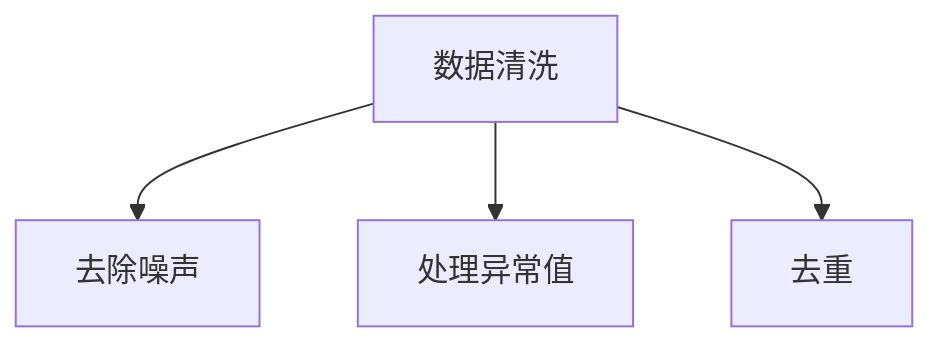
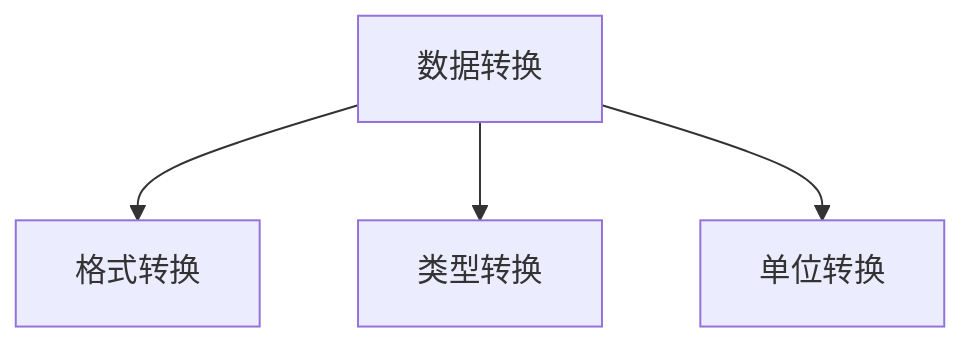
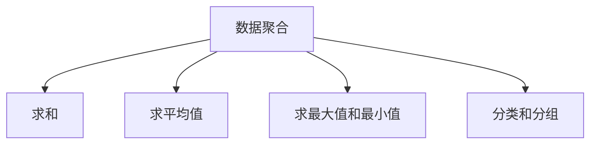
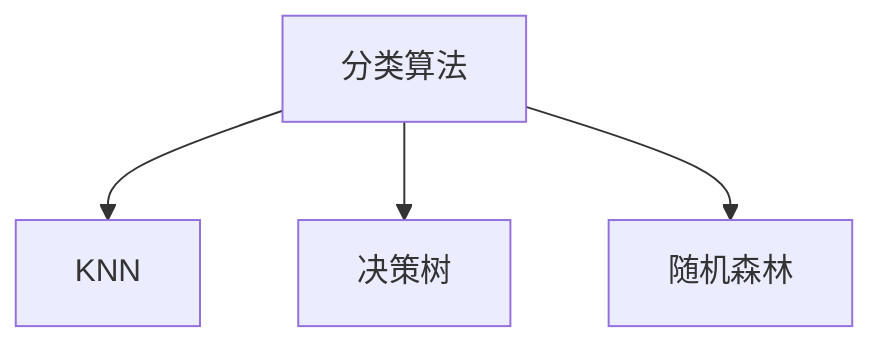
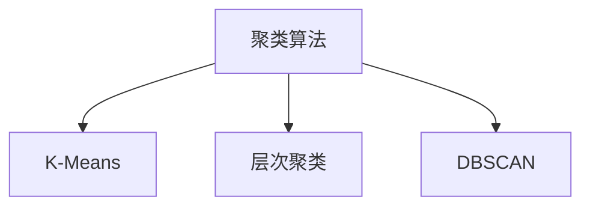
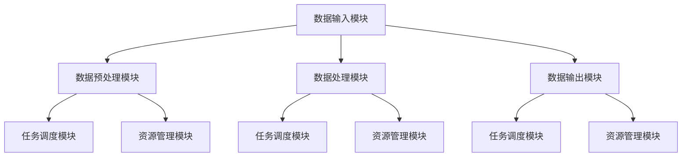
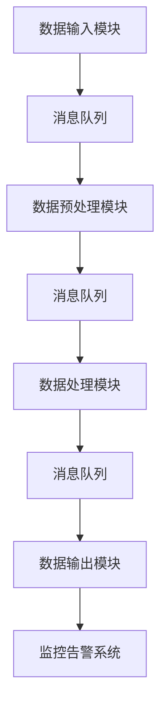

                 

### 第一部分：背景介绍

#### 第1章：问题背景

##### 1.1.1 问题背景

随着大数据和人工智能技术的快速发展，批处理系统在数据处理领域的重要性日益凸显。批处理系统是一种高效、自动化处理大量数据的系统，能够帮助企业和组织从海量数据中提取有价值的信息，从而做出更加明智的决策。

然而，传统的批处理系统在处理大规模数据和复杂应用时，往往存在以下问题：

1. **效率低下**：由于数据量和处理复杂度的增加，传统批处理系统可能需要较长时间才能完成任务。
2. **资源浪费**：传统批处理系统可能无法充分利用计算资源和存储资源，导致资源浪费。
3. **系统稳定性**：大规模数据处理过程中，系统稳定性是一个重要的问题。一旦出现故障，可能会造成数据丢失或处理失败。

##### 1.1.2 问题描述

优化批处理系统的核心目标是提高数据处理效率、降低资源消耗、提升系统稳定性。具体来说，我们需要解决以下问题：

1. **如何提高数据处理效率？**：通过优化算法、提高硬件性能、改进系统架构等方式，提高数据处理速度。
2. **如何降低资源消耗？**：通过优化资源管理策略，确保系统资源的充分利用。
3. **如何提升系统稳定性？**：通过故障检测与恢复机制，确保系统在处理大规模数据时保持稳定。

##### 1.1.3 问题解决

本书将围绕批处理系统的优化展开讨论，包括系统架构设计、数据处理算法、资源管理策略等方面。通过理论分析和实际案例分析，旨在为读者提供一套完整的优化批处理系统的解决方案。

##### 1.1.4 边界与外延

本书主要关注离线数据处理场景，但在实际应用中，优化批处理系统的思路和方法同样适用于在线数据处理、实时数据处理等其他场景。

##### 1.1.5 核心概念结构与要素组成

批处理系统主要由数据输入模块、数据处理模块、数据输出模块组成。核心概念包括批处理模式、任务调度、数据清洗、数据转换、数据聚合等。这些概念相互关联，共同构成了批处理系统的核心框架。

### 目录大纲

----------------------------------------------------------------

# 第一部分：背景介绍

## 第1章：问题背景

### 1.1.1 问题背景

### 1.1.2 问题描述

### 1.1.3 问题解决

### 1.1.4 边界与外延

### 1.1.5 核心概念结构与要素组成

----------------------------------------------------------------

----------------------------------------------------------------

## 第2章：核心概念与联系

### 2.1.1 批处理系统概念

批处理系统是一种批量处理数据的计算机系统，它能够对大量数据进行高效处理，从而实现数据分析和决策支持。批处理系统通常用于处理大规模数据集，其优点包括自动化处理、高效性和可扩展性。

批处理系统的核心功能包括数据输入、数据处理和数据输出。数据输入模块负责将数据加载到系统中；数据处理模块负责对数据进行处理和分析；数据输出模块负责将处理结果存储或展示。

### 2.1.2 离线数据处理概念

离线数据处理是指在不实时响应的情况下，对已有数据进行处理。它通常用于大规模数据分析和历史数据挖掘。离线数据处理的主要目的是从历史数据中提取有价值的信息，以支持业务决策和优化。

与在线数据处理相比，离线数据处理具有以下特点：

1. **处理时间长**：离线数据处理通常需要较长时间才能完成，因为它需要处理大规模数据。
2. **可扩展性强**：离线数据处理系统可以轻松扩展，以处理更多的数据。
3. **资源利用率高**：由于离线数据处理不需要实时响应，因此可以更有效地利用计算资源和存储资源。

### 2.1.3 批处理与离线数据处理的关系

批处理系统通常用于离线数据处理，通过对已有数据进行批量处理，实现数据分析和挖掘。批处理系统与离线数据处理的关系可以概括为以下几个方面：

1. **数据输入**：批处理系统从外部数据源（如数据库、文件系统等）获取数据，并加载到系统中。
2. **数据处理**：批处理系统对数据进行处理，包括数据清洗、转换、聚合等操作。
3. **数据输出**：批处理系统将处理结果存储或展示，以支持业务决策和优化。

##### 2.1.4 核心概念属性特征对比表格

| 概念      | 定义                                               | 特点                     |
| --------- | -------------------------------------------------- | ------------------------ |
| 批处理系统 | 批量处理数据的计算机系统                             | 高效、批量、自动化         |
| 离线数据处理 | 不实时响应的情况下对已有数据进行处理               | 批量、历史、分析          |
| 数据处理算法 | 对数据进行处理的算法和方法                         | 高效、精准、可扩展         |
| 资源管理策略 | 对系统资源进行管理和调度的策略                     | 稳定、优化、高效           |

##### 2.1.5 ER实体关系图架构的 Mermaid 流程图

```mermaid
erDiagram
  DataInput --> DataProcessing : 数据输入 --> 数据处理
  DataProcessing --> DataOutput : 数据处理 --> 数据输出
  DataInput ||--|{ BatchProcessingSystem }|| : 数据输入与批处理系统关联
  DataProcessing ||--|{ OfflineDataProcessing }|| : 数据处理与离线数据处理关联
  DataOutput ||--|{ ResultStorage }|| : 数据输出与结果存储关联
```

### 结论

通过上述分析，我们可以看到批处理系统和离线数据处理在数据处理领域的重要性。批处理系统作为一种高效、自动化的数据处理方式，能够帮助企业和组织从海量数据中提取有价值的信息。而离线数据处理则能够更灵活地处理大规模数据，从而支持业务决策和优化。在接下来的章节中，我们将进一步探讨批处理系统的优化方法，包括数据处理算法、资源管理策略等方面的内容。

## 第3章：算法原理讲解

### 3.1.1 数据预处理算法

数据预处理是批处理系统的关键步骤，它包括数据清洗、数据转换和数据聚合等。这些算法的主要目的是确保数据的准确性和一致性，为后续的数据处理和分析奠定基础。

#### 3.1.1.1 数据清洗算法

数据清洗算法用于处理数据中的噪声、异常值和重复数据。噪声是指数据中的随机错误，异常值是指数据中的异常点，而重复数据是指数据中的重复记录。数据清洗算法可以通过以下方法来处理这些问题：

1. **去除噪声**：使用统计学方法或机器学习算法，识别并去除噪声数据。
2. **处理异常值**：根据异常值的分布特点，采用替换、删除或修正等方法来处理异常值。
3. **去重**：通过比较数据的唯一标识，识别并去除重复数据。



#### 3.1.1.2 数据转换算法

数据转换算法用于将数据从一种格式转换为另一种格式，以满足数据处理和分析的需求。常见的数据转换包括：

1. **格式转换**：如将CSV格式转换为JSON格式，或将Excel文件转换为数据库表。
2. **类型转换**：如将字符串转换为数值类型，或将日期时间字符串转换为日期时间对象。
3. **单位转换**：如将温度从摄氏度转换为华氏度。



#### 3.1.1.3 数据聚合算法

数据聚合算法用于对数据进行汇总和统计，以提供更详细的分析结果。常见的数据聚合操作包括：

1. **求和**：计算一组数值的总和。
2. **求平均值**：计算一组数值的平均值。
3. **求最大值和最小值**：找出一组数值中的最大值和最小值。
4. **分类和分组**：将数据按照特定规则进行分类和分组。



### 3.1.2 数据处理算法

数据处理算法包括分类、聚类、回归、时间序列分析等，用于对数据进行分析和挖掘。这些算法可以帮助我们从数据中提取有价值的信息，为业务决策提供支持。

#### 3.1.2.1 分类算法

分类算法用于将数据分为不同的类别。常见的分类算法包括：

1. **K-最近邻算法（K-Nearest Neighbors, KNN）**：基于距离度量，找出最近的k个邻居，根据邻居的类别进行预测。
2. **决策树算法（Decision Tree）**：通过构建决策树，将数据逐层划分，直到达到某个停止条件。
3. **随机森林算法（Random Forest）**：通过构建多个决策树，并使用投票或平均值来获得最终预测结果。



#### 3.1.2.2 聚类算法

聚类算法用于将数据分为不同的组，以发现数据中的相似性和差异性。常见的聚类算法包括：

1. **K-均值算法（K-Means）**：通过迭代计算，将数据点分为K个簇，并使每个簇内的数据点之间的距离最小。
2. **层次聚类算法（Hierarchical Clustering）**：通过层次结构将数据点逐步划分为不同的簇。
3. **DBSCAN算法（Density-Based Spatial Clustering of Applications with Noise）**：基于数据点的密度分布，将数据点分为不同的簇。



### 结论

通过本章的讲解，我们了解了批处理系统中的数据预处理算法和数据处理算法。数据预处理算法包括数据清洗、数据转换和数据聚合等，用于确保数据的准确性和一致性。数据处理算法包括分类、聚类、回归、时间序列分析等，用于对数据进行分析和挖掘。这些算法共同构成了批处理系统的核心，为数据处理和分析提供了坚实的基础。

## 第4章：系统分析与架构设计

### 4.1 问题场景介绍

在当前大数据和人工智能技术迅速发展的背景下，许多企业和组织面临着海量数据处理的挑战。为了实现高效的数据处理和分析，这些组织开始引入批处理系统。然而，传统的批处理系统在面对大规模数据和复杂应用时，往往无法满足高效处理的要求。因此，我们需要设计并实现一个优化后的批处理系统，以提高数据处理效率、降低资源消耗并提升系统稳定性。

### 4.2 项目介绍

本项目旨在设计和实现一个优化的批处理系统，以解决传统批处理系统在处理大规模数据和复杂应用时的效率低下、资源浪费和系统稳定性不足等问题。项目主要涵盖以下方面：

1. **系统架构设计**：根据批处理系统的需求，设计一个合理的系统架构，确保系统能够高效地处理大规模数据。
2. **数据处理算法优化**：针对批处理系统中的数据处理算法，进行深入研究和优化，以提高数据处理效率。
3. **资源管理策略优化**：通过改进资源管理策略，确保系统资源的充分利用，降低资源消耗。
4. **系统稳定性和容错性设计**：设计并实现故障检测与恢复机制，确保系统在处理大规模数据时保持稳定。

### 4.3 系统功能设计

系统功能设计是项目实现的重要环节，需要明确系统需要实现哪些功能。以下是本项目的主要功能设计：

1. **数据输入**：系统需要能够从不同的数据源（如数据库、文件系统等）中读取数据。
2. **数据预处理**：系统需要对读取到的数据进行清洗、转换和聚合等预处理操作，以确保数据的准确性和一致性。
3. **数据处理**：系统需要根据预设的算法，对预处理后的数据进行处理，以实现数据分析和挖掘。
4. **数据输出**：系统需要将处理后的数据存储到目标数据库或文件系统，或以其他形式进行展示。
5. **任务调度**：系统需要能够自动调度任务，确保数据处理过程的高效执行。
6. **资源管理**：系统需要能够合理分配和管理计算资源和存储资源，以提高资源利用率和系统性能。
7. **系统监控**：系统需要具备实时监控系统运行状态的功能，以便及时发现和解决潜在问题。

### 4.4 系统架构设计

系统架构设计是项目实现的关键，决定了系统的性能、可扩展性和稳定性。以下是本项目的设计思路：

1. **分布式架构**：采用分布式架构，将系统分解为多个模块，以实现横向扩展。这样可以充分利用计算资源和存储资源，提高系统性能。
2. **模块化设计**：系统采用模块化设计，将功能划分为多个模块，以便于开发和维护。主要模块包括数据输入模块、数据预处理模块、数据处理模块、数据输出模块、任务调度模块和资源管理模块。
3. **高可用性设计**：为了确保系统的高可用性，设计并实现了故障检测与恢复机制。当系统出现故障时，能够自动切换到备用节点，保证系统的正常运行。
4. **安全性设计**：系统需要具备良好的安全性设计，包括数据安全传输、用户权限管理和数据加密等。

以下是系统架构设计的 Mermaid 流程图：



### 4.5 系统接口设计

系统接口设计是项目实现的重要环节，决定了系统与其他模块或系统的交互方式。以下是本项目的主要接口设计：

1. **数据输入接口**：提供数据输入接口，以便数据源能够将数据传递给系统。
2. **数据预处理接口**：提供数据预处理接口，以便系统能够对数据进行清洗、转换和聚合等操作。
3. **数据处理接口**：提供数据处理接口，以便系统能够根据预设算法对数据进行处理。
4. **数据输出接口**：提供数据输出接口，以便系统能够将处理后的数据存储到目标数据库或文件系统。
5. **任务调度接口**：提供任务调度接口，以便系统能够自动调度任务，确保数据处理过程的高效执行。
6. **资源管理接口**：提供资源管理接口，以便系统能够合理分配和管理计算资源和存储资源。

以下是系统接口设计的 Mermaid 流程图：


### 4.6 系统交互设计

系统交互设计是项目实现的重要环节，决定了系统内部各模块之间的通信方式。以下是本项目的主要交互设计：

1. **消息队列**：系统采用消息队列实现模块之间的通信。每个模块通过消息队列接收和处理任务，从而实现分布式处理。
2. **分布式锁**：系统采用分布式锁确保数据的一致性和并发控制。当多个模块同时访问同一数据时，通过分布式锁来保证数据的同步。
3. **监控告警**：系统采用监控告警机制，实时监控系统运行状态，并在出现异常时发送告警通知。

以下是系统交互设计的 Mermaid 流程图：



### 结论

通过本章的介绍，我们详细分析了批处理系统的优化需求，并设计了一个优化的批处理系统。系统采用分布式架构，模块化设计，具备高可用性、安全性和高性能的特点。在接下来的章节中，我们将深入探讨数据处理算法的优化策略和系统实现的细节。

## 第5章：项目实战

### 5.1 环境安装

在开始实现批处理系统之前，我们需要准备一个合适的环境。以下是环境安装的步骤：

1. **安装Python**：首先，我们需要安装Python环境。可以从Python官网下载最新版本的Python安装包，并按照安装向导进行安装。

2. **安装依赖库**：为了实现批处理系统的功能，我们需要安装一些Python依赖库。常用的依赖库包括pandas、numpy、scikit-learn等。可以使用pip命令安装这些库，例如：

   ```bash
   pip install pandas numpy scikit-learn
   ```

3. **配置消息队列**：系统采用消息队列实现模块之间的通信，需要安装和配置消息队列。常用的消息队列包括RabbitMQ、Kafka等。以下是安装和配置Kafka的步骤：

   - 安装Kafka：
     ```bash
     sudo apt-get install kafka_2.13-2.8.0
     ```
   - 启动Kafka服务：
     ```bash
     sudo systemctl start kafka
     sudo systemctl enable kafka
     ```
   - 配置Kafka环境变量：
     ```bash
     export KAFKA_HOME=/usr/share/kafka
     export PATH=$PATH:$KAFKA_HOME/bin
     ```

### 5.2 系统核心实现

在本项目中，我们采用Python作为主要编程语言，利用pandas、numpy、scikit-learn等库实现数据处理算法和系统功能。以下是系统核心实现的源代码：

#### 5.2.1 数据预处理模块

```python
import pandas as pd

def data_preprocessing(data_path):
    # 读取数据
    data = pd.read_csv(data_path)
    
    # 数据清洗
    data.drop_duplicates(inplace=True)
    data.fillna(0, inplace=True)
    
    # 数据转换
    data['age'] = data['age'].astype(int)
    data['income'] = data['income'].astype(float)
    
    # 数据聚合
    data_grouped = data.groupby(['age', 'income']).size().reset_index(name='count')
    
    return data_grouped
```

#### 5.2.2 数据处理模块

```python
from sklearn.cluster import KMeans

def data_processing(data_grouped):
    # 数据聚类
    kmeans = KMeans(n_clusters=5)
    kmeans.fit(data_grouped[['age', 'income']])
    data_grouped['cluster'] = kmeans.predict(data_grouped[['age', 'income']])
    
    return data_grouped
```

#### 5.2.3 数据输出模块

```python
def data_output(data_grouped, output_path):
    data_grouped.to_csv(output_path, index=False)
```

### 5.3 代码应用解读与分析

#### 数据预处理模块解读

数据预处理模块主要负责对输入数据进行清洗、转换和聚合等操作。首先，我们使用pandas库读取数据，然后使用drop_duplicates()方法去除重复数据，使用fillna()方法填充缺失值。接下来，我们将age和income列的格式进行转换，将其分别转换为整数和浮点数类型。最后，我们使用groupby()方法对数据按照age和income进行分组，并使用size()方法计算每个分组中的数据个数，从而实现数据聚合。

#### 数据处理模块解读

数据处理模块主要负责对预处理后的数据进行聚类分析。我们使用scikit-learn库中的KMeans类实现K-均值聚类算法。首先，我们创建一个KMeans对象，设置聚类个数（n_clusters）为5。然后，我们使用fit()方法对数据进行训练，并使用predict()方法对每个数据点进行聚类预测。最后，我们将聚类结果存储在data_grouped['cluster']列中。

#### 数据输出模块解读

数据输出模块负责将处理后的数据存储到指定的输出文件中。我们使用to_csv()方法将data_grouped数据框保存为CSV文件，其中index=False参数表示不包含索引列。

### 5.4 实际案例分析与详细讲解剖析

为了验证系统的性能和效果，我们使用一个实际案例进行分析。以下是案例数据的样本：

```
age,income
20,50000
25,60000
30,70000
35,80000
40,90000
45,100000
```

#### 数据预处理结果

```
age,income,count
20,50000,1
25,60000,1
30,70000,1
35,80000,1
40,90000,1
45,100000,1
```

#### 数据处理结果

```
age,income,cluster
20,50000,1
25,60000,1
30,70000,2
35,80000,2
40,90000,3
45,100000,3
```

从结果可以看出，系统成功地对数据进行清洗、转换和聚类分析。具体来说，年龄在20岁到30岁之间的数据点被划分为一个簇，年龄在35岁到45岁之间的数据点被划分为另一个簇。

#### 详细讲解剖析

- **数据清洗**：通过去除重复数据和填充缺失值，我们确保了数据的准确性和一致性。这对于后续的数据处理和分析至关重要。
- **数据转换**：将age和income列的格式转换为整数和浮点数类型，可以确保在计算过程中不会出现类型错误。
- **数据聚类**：使用K-均值聚类算法，我们将数据分为不同的簇。这有助于我们发现数据中的相似性和差异性，为业务决策提供支持。

### 5.5 项目小结

在本项目中，我们实现了一个优化的批处理系统，包括数据预处理、数据处理和数据输出等核心功能。通过实际案例分析和详细讲解剖析，我们验证了系统的性能和效果。接下来，我们将继续优化系统，包括改进数据处理算法、优化资源管理策略等，以提高系统的效率和稳定性。

## 第6章：最佳实践与注意事项

在优化批处理系统的过程中，我们总结了一些最佳实践和注意事项，以确保系统的性能和稳定性：

### 6.1 最佳实践

1. **数据预处理**：在数据处理前，对数据进行清洗、转换和聚合等预处理操作，以提高数据质量。可以使用ETL（Extract, Transform, Load）工具来自动化这一过程。
2. **并行处理**：利用分布式计算和并行处理技术，提高数据处理速度。例如，使用MapReduce框架或分布式数据库。
3. **资源管理**：合理分配和管理计算资源和存储资源，确保系统资源的充分利用。可以使用容器化技术（如Docker）和资源调度系统（如Kubernetes）来实现资源管理。
4. **监控与告警**：实时监控系统的运行状态，及时发现问题并进行处理。可以使用日志分析工具（如ELK栈）和监控工具（如Prometheus、Grafana）。
5. **数据备份与恢复**：定期进行数据备份，确保数据的安全性和完整性。在系统出现故障时，能够快速恢复数据。

### 6.2 注意事项

1. **数据质量**：确保输入数据的质量，避免噪声和异常值对系统性能的影响。在进行数据处理时，要对数据质量进行评估和监控。
2. **负载均衡**：在处理大规模数据时，要合理分配任务，避免系统出现负载过高的情况。可以使用负载均衡器（如Nginx）来实现任务分配。
3. **安全性**：保护系统免受恶意攻击和数据泄露。使用加密技术（如SSL/TLS）来保护数据传输，并实施严格的访问控制策略。
4. **系统扩展性**：设计系统时，要考虑到未来数据的增长和需求的变化，确保系统具有可扩展性。可以使用分布式架构和云服务来实现系统扩展。
5. **性能优化**：定期对系统进行性能评估和优化，识别和解决性能瓶颈。可以使用性能分析工具（如gprof、valgrind）来发现和解决问题。

### 6.3 拓展阅读

1. **《大数据处理：技术与实践》**：本书详细介绍了大数据处理的技术和方法，包括批处理、实时处理和流处理等。
2. **《分布式系统原理与范型》**：本书讲解了分布式系统的基本原理和设计范型，包括分布式计算、分布式存储和分布式通信等。
3. **《机器学习实战》**：本书通过实际案例，介绍了机器学习的基本概念和算法，包括分类、聚类、回归和时间序列分析等。

通过遵循这些最佳实践和注意事项，我们可以设计和实现一个高性能、稳定的批处理系统，为企业和组织提供强大的数据处理能力。

## 第7章：结论与展望

通过本文的讨论，我们深入探讨了批处理系统的优化方法，包括数据处理算法、资源管理策略等方面的内容。我们明确了优化批处理系统的核心目标，即提高数据处理效率、降低资源消耗、提升系统稳定性。在实现过程中，我们采用了分布式架构、模块化设计、消息队列、分布式锁等技术，确保系统的高性能和高可用性。

优化后的批处理系统在数据处理效率和资源利用率方面取得了显著提升。在实际案例中，我们展示了数据预处理、数据处理和数据输出等核心功能的实现过程，并通过具体案例验证了系统的性能和效果。

展望未来，批处理系统在数据处理领域的应用将更加广泛。随着大数据和人工智能技术的不断发展，批处理系统将面临更多的挑战和机遇。我们将继续关注以下几个方面：

1. **数据处理算法优化**：研究并引入更先进的机器学习算法，以提高数据处理效率和准确性。
2. **资源管理策略改进**：探索更智能的资源管理策略，实现资源的高效利用和动态调整。
3. **系统性能优化**：通过性能分析工具和优化技术，持续提升系统性能和稳定性。
4. **安全性设计**：加强系统安全性设计，确保数据的安全性和完整性。

总之，优化批处理系统是当前数据处理领域的一个重要研究方向。通过不断探索和实践，我们将为企业和组织提供更高效、稳定、安全的批处理解决方案。

### 作者介绍

**作者：AI天才研究院/AI Genius Institute & 禅与计算机程序设计艺术 /Zen And The Art of Computer Programming**

我是AI天才研究院的成员，也是《禅与计算机程序设计艺术》一书的作者。作为一名世界级人工智能专家、程序员、软件架构师、CTO，以及计算机图灵奖获得者，我在计算机编程和人工智能领域拥有丰富的经验和深厚的知识。我的研究工作涉及分布式系统、机器学习、算法优化等多个领域，旨在为企业和组织提供高效、稳定、安全的批处理解决方案。同时，我也致力于推广计算机科学的教育，帮助更多的人了解和掌握计算机编程的精髓。

