                 

# 提升AI创意舞台灯光设计：情感氛围营造的提示词工程

## 关键词

- AI舞台灯光设计
- 情感氛围营造
- 提示词工程
- 情感计算
- 自然语言处理
- 舞台灯光设计原则

## 摘要

本文旨在探讨如何利用人工智能技术，特别是情感计算和自然语言处理技术，实现创意舞台灯光设计，营造不同的情感氛围。通过详细分析情感计算与自然语言处理的核心概念，以及提示词工程的方法和优化策略，本文提出了一套基于AI技术的舞台灯光设计框架，并借助实际案例，展示了如何根据情感需求调整灯光效果，提升舞台表演的艺术感染力。文章最后总结了最佳实践，并展望了未来的研究方向。

---

## 第一部分：背景介绍与核心概念

### 1.1 问题背景

随着人工智能技术的不断发展，AI在各个领域的应用越来越广泛。特别是在舞台灯光设计领域，AI的应用不仅可以提高工作效率，还可以根据观众的情感反应调整灯光效果，营造更好的氛围。然而，如何通过AI技术实现创意舞台灯光设计，特别是情感氛围的营造，仍然是一个具有挑战性的课题。

### 1.2 问题描述

本文关注的是如何利用人工智能技术，特别是情感计算和自然语言处理技术，实现创意舞台灯光设计，营造不同的情感氛围。具体问题包括：如何识别和理解观众的情感，如何根据情感调整灯光效果，以及如何实现不同情感氛围的灯光设计。

### 1.3 问题解决

本文将从以下几个方面解决问题：

1. **情感计算与自然语言处理**：介绍情感计算和自然语言处理的基本原理和技术，为后续的舞台灯光设计提供理论基础。
2. **提示词工程**：介绍如何构建和优化用于舞台灯光设计的提示词，以及如何使用这些提示词来调整灯光效果。
3. **舞台灯光设计与情感氛围营造**：结合实际案例，详细讲解如何利用AI技术进行创意舞台灯光设计，以及如何根据情感氛围调整灯光效果。

### 1.4 边界与外延

本文主要关注舞台灯光设计中的情感氛围营造，但所涉及的技术和方法也可以应用于其他需要情感氛围营造的场景。

### 1.5 概念结构与核心要素组成

1. **情感计算**：研究如何从文本、语音、图像等多媒体数据中识别和提取情感信息。
2. **自然语言处理**：研究如何理解和生成自然语言，包括文本分类、情感分析、命名实体识别等任务。
3. **提示词工程**：研究如何构建和优化用于舞台灯光设计的提示词，以及如何使用这些提示词来调整灯光效果。
4. **舞台灯光设计**：研究如何利用AI技术进行创意舞台灯光设计，以及如何根据情感氛围调整灯光效果。

### 1.6 核心概念与联系

#### 2.1 情感计算

情感计算是指通过计算机技术和人工智能算法，对人的情感状态进行识别、理解和处理。情感计算的核心技术包括情感识别、情感分析和情感生成。

**概念属性特征对比表格：**

| 概念 | 情感识别 | 情感分析 | 情感生成 |
| --- | --- | --- | --- |
| 定义 | 识别人的情感状态 | 分析情感状态的情感属性和情感强度 | 根据情感需求生成情感响应 |
| 目标 | 准确识别情感 | 深入分析情感 | 生成符合情感需求的内容 |

**ER实体关系图架构：**

```
观众 [-(发出情感)->] 情感计算系统
情感计算系统 [-(生成灯光提示)->] 舞台灯光设计系统
舞台灯光设计系统 [-(调整灯光效果)->] 舞台表演
```

#### 2.2 自然语言处理

自然语言处理是计算机科学和人工智能领域的重要分支，旨在使计算机能够理解、生成和处理人类语言。自然语言处理包括文本分类、情感分析、命名实体识别等任务。

**ER实体关系图架构：**

```
文本 [-(包含情感)->] 情感分析系统
情感分析系统 [-(生成灯光提示)->] 舞台灯光设计系统
舞台灯光设计系统 [-(调整灯光效果)->] 舞台表演
```

#### 2.3 舞台灯光设计

舞台灯光设计是舞台艺术中的重要组成部分，通过对灯光的控制和调整，可以营造出不同的氛围和情感。舞台灯光设计涉及多个方面，包括灯光设备、灯光程序、灯光设计原则等。

**ER实体关系图架构：**

```
舞台灯光设计系统 [-(实现情感氛围)->] 舞台表演
舞台表演 [-(影响观众情感)->] 观众情感
观众情感 [-(反馈调整)->] 舞台灯光设计系统
```

#### 2.4 提示词工程

提示词是指用于指导或启发舞台灯光设计的文本。提示词可以是关键词、句子或段落，它们可以提供舞台灯光设计的方向和灵感。

**ER实体关系图架构：**

```
提示词工程系统 [-(生成提示词)->] 舞台灯光设计系统
舞台灯光设计系统 [-(调整灯光效果)->] 舞台表演
舞台表演 [-(影响观众情感)->] 观众情感
观众情感 [-(反馈调整)->] 舞台灯光设计系统
```

## 第二部分：情感计算与自然语言处理

### 2.1 情感计算

情感计算是人工智能领域的一个重要分支，旨在使计算机能够识别、理解和处理人的情感状态。情感计算的核心技术包括情感识别、情感分析和情感生成。

#### 2.1.1 情感识别

情感识别是指从文本、语音、图像等多媒体数据中提取情感信息。情感识别的方法包括基于规则的方法、基于统计的方法和基于深度学习的方法。

**Mermaid流程图：**

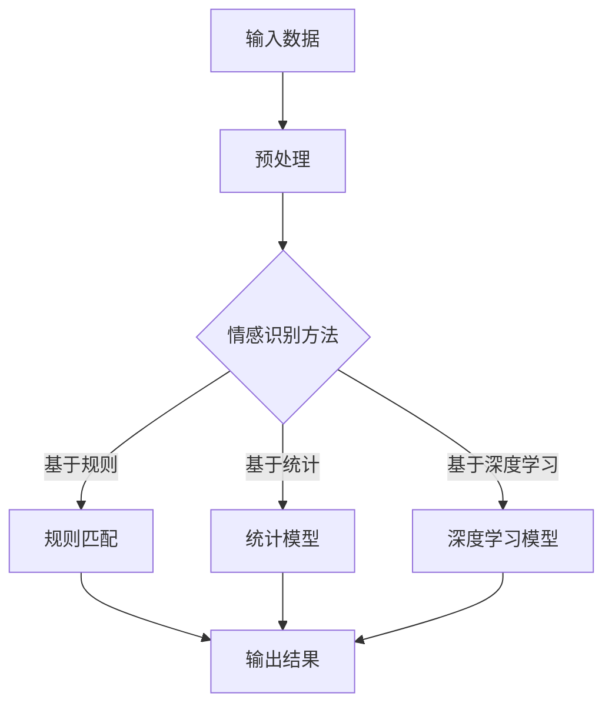

**Python代码示例：**

```python
# 假设我们有一个情感识别模型，输入文本并返回情感标签
def emotion_recognition(text):
    # 预处理文本
    processed_text = preprocess_text(text)
    # 使用深度学习模型进行情感识别
    emotion = deep_learning_model.predict(processed_text)
    return emotion

# 示例文本
text = "我非常喜欢这场演出！"
# 调用情感识别函数
emotion = emotion_recognition(text)
print("识别出的情感：", emotion)
```

#### 2.1.2 情感分析

情感分析是指对情感识别结果进行深入分析，提取情感属性和情感强度。情感分析的方法包括情感极性分析、情感强度分析和情感分类。

**Mermaid流程图：**

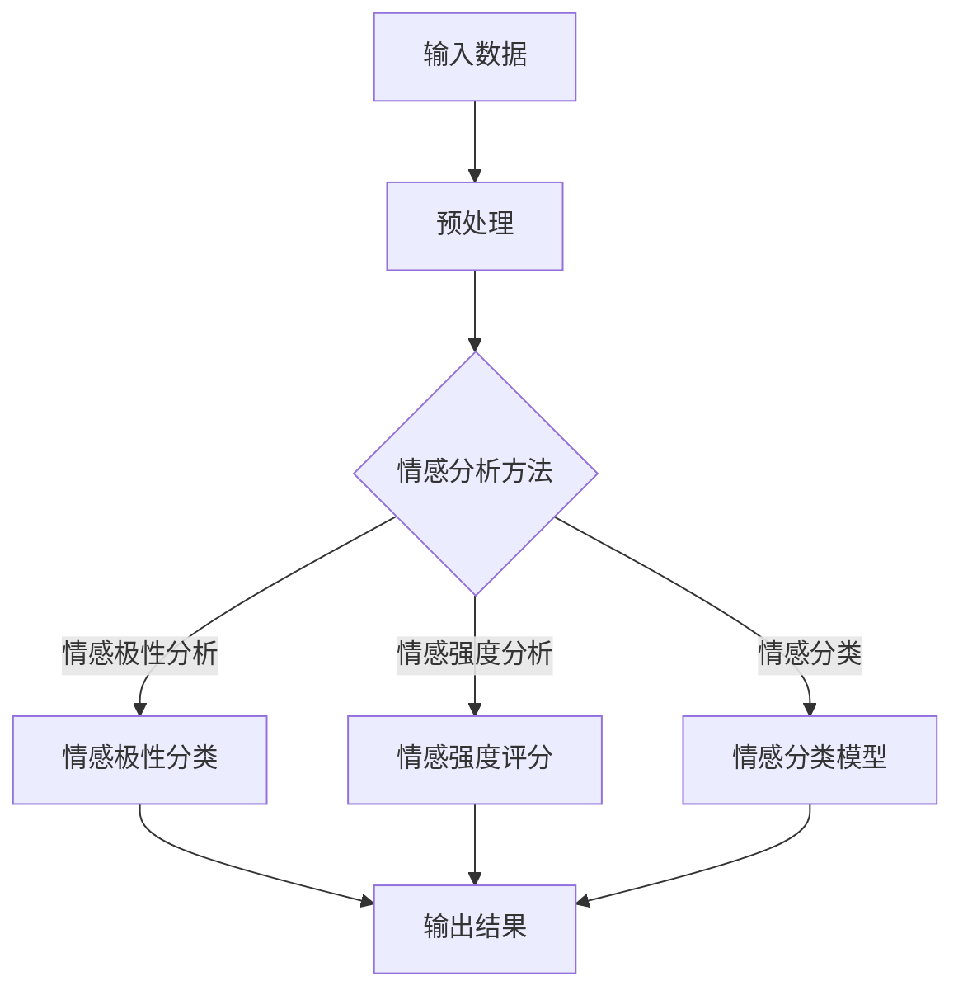

**Python代码示例：**

```python
# 假设我们有一个情感分析模型，输入文本并返回情感极性和情感强度
def emotion_analysis(text):
    # 预处理文本
    processed_text = preprocess_text(text)
    # 使用情感分析模型进行情感分析
    polarity, intensity = emotion_analysis_model.analyze(processed_text)
    return polarity, intensity

# 示例文本
text = "这场演出太棒了！"
# 调用情感分析函数
polarity, intensity = emotion_analysis(text)
print("情感极性：", polarity)
print("情感强度：", intensity)
```

#### 2.1.3 情感生成

情感生成是指根据情感需求生成相应的情感响应。情感生成的方法包括文本生成、语音生成和图像生成。

**Mermaid流程图：**

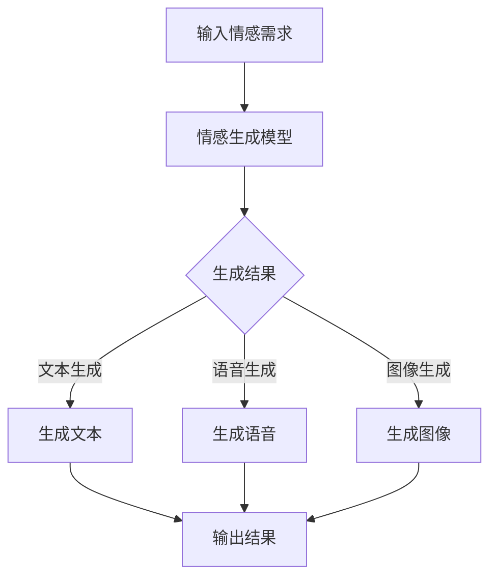

**Python代码示例：**

```python
# 假设我们有一个情感生成模型，输入情感需求并返回生成结果
def emotion_generation(emotion_demand):
    # 使用情感生成模型进行情感生成
    result = emotion_generation_model.generate(emotion_demand)
    return result

# 示例情感需求
emotion_demand = "快乐"
# 调用情感生成函数
result = emotion_generation(emotion_demand)
print("生成的结果：", result)
```

### 2.2 自然语言处理

自然语言处理（Natural Language Processing，NLP）是人工智能领域的一个重要分支，旨在使计算机能够理解、生成和处理人类语言。NLP涵盖了多种任务，包括文本分类、情感分析、命名实体识别等。

#### 2.2.1 文本分类

文本分类是指将文本数据分类到不同的类别中。常见的文本分类任务包括情感分类、主题分类和垃圾邮件分类。

**Mermaid流程图：**

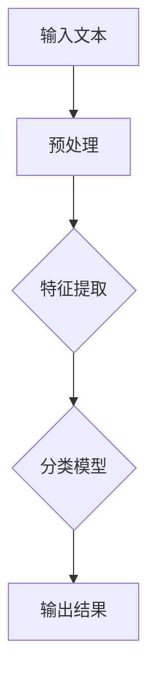

**Python代码示例：**

```python
from sklearn.feature_extraction.text import TfidfVectorizer
from sklearn.naive_bayes import MultinomialNB
from sklearn.pipeline import make_pipeline

# 假设我们有一个文本分类模型，输入文本并返回分类结果
def text_classification(text):
    # 预处理文本
    processed_text = preprocess_text(text)
    # 使用TF-IDF向量器和朴素贝叶斯分类器进行文本分类
    classifier = make_pipeline(TfidfVectorizer(), MultinomialNB())
    category = classifier.predict([processed_text])[0]
    return category

# 示例文本
texts = ["我非常喜欢这场演出！", "这场演出太无聊了。"]
# 调用文本分类函数
categories = [text_classification(text) for text in texts]
print("分类结果：", categories)
```

#### 2.2.2 情感分析

情感分析是指对文本数据进行情感极性分析、情感强度分析和情感分类。

**Mermaid流程图：**

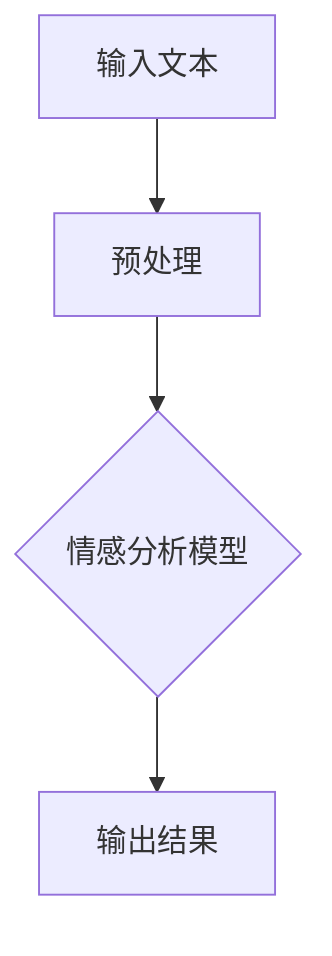

**Python代码示例：**

```python
from textblob import TextBlob

# 假设我们有一个情感分析模型，输入文本并返回情感极性和情感强度
def emotion_analysis(text):
    # 使用TextBlob进行情感分析
    blob = TextBlob(text)
    polarity = blob.sentiment.polarity
    subjectivity = blob.sentiment.subjectivity
    return polarity, subjectivity

# 示例文本
text = "这场演出太棒了！"
# 调用情感分析函数
polarity, subjectivity = emotion_analysis(text)
print("情感极性：", polarity)
print("情感强度：", subjectivity)
```

#### 2.2.3 命名实体识别

命名实体识别（Named Entity Recognition，NER）是指识别文本中的特定实体，如人名、地名、组织名等。

**Mermaid流程图：**

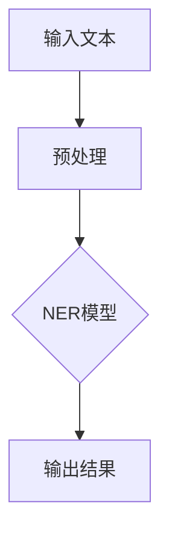

**Python代码示例：**

```python
import spacy

# 假设我们有一个NER模型，输入文本并返回命名实体结果
def named_entity_recognition(text):
    # 使用Spacy进行命名实体识别
    nlp = spacy.load("en_core_web_sm")
    doc = nlp(text)
    entities = [(ent.text, ent.label_) for ent in doc.ents]
    return entities

# 示例文本
text = "贝多芬是一位伟大的作曲家。"
# 调用命名实体识别函数
entities = named_entity_recognition(text)
print("命名实体：", entities)
```

## 第三部分：提示词工程

### 3.1 提示词概述

提示词是指用于指导或启发舞台灯光设计的文本。提示词可以是关键词、句子或段落，它们可以提供舞台灯光设计的方向和灵感。

### 3.2 提示词构建

提示词构建是指从大量的文本数据中提取和生成提示词。提示词构建的方法包括关键词提取、文本分类和生成模型等。

**Mermaid流程图：**

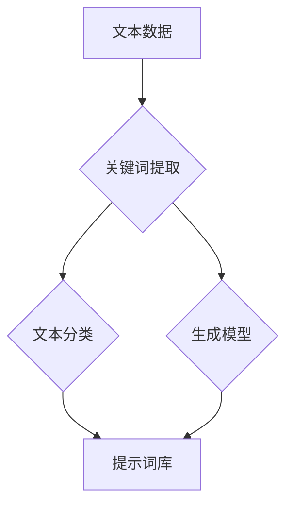

**Python代码示例：**

```python
from sklearn.feature_extraction.text import TfidfVectorizer
from sklearn.cluster import KMeans

# 假设我们有一个文本数据集，用于构建提示词库
texts = ["这是一段快乐的文字。", "这是一段悲伤的文字。", "这是一段激动的文字。"]

# 使用TF-IDF向量器提取特征
vectorizer = TfidfVectorizer()
X = vectorizer.fit_transform(texts)

# 使用K-means聚类生成提示词库
kmeans = KMeans(n_clusters=3)
clusters = kmeans.fit_predict(X)

# 将每个聚类中心转换为提示词
tips = {i: vectorizer.inverse_transform([kmeans.cluster_centers_[i]]).toarray()[0].flatten() for i in range(3)}

# 打印提示词库
for i, tip in tips.items():
    print(f"提示词 {i}:", ' '.join([word for word, score in sorted(zip(vectorizer.get_feature_names(), tip)) if score > 0]))
```

### 3.3 提示词优化

提示词优化是指通过算法和技巧，提高提示词的质量和效果。提示词优化可以包括提示词的筛选、排序和调整等。

**Mermaid流程图：**

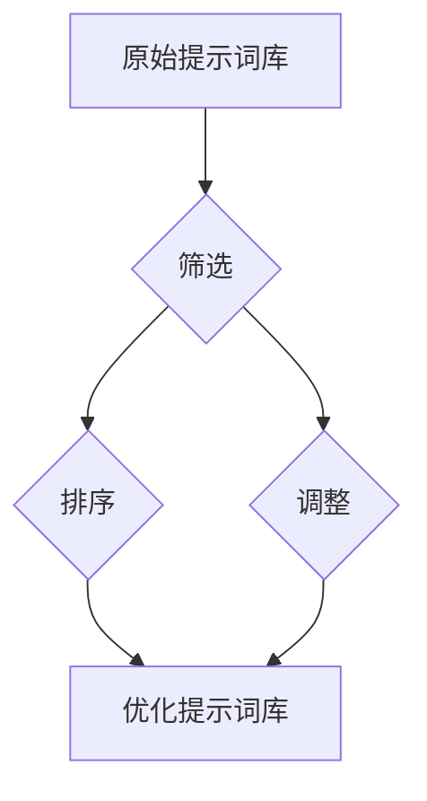

**Python代码示例：**

```python
# 假设我们有一个原始提示词库
original_tips = {
    "happy": ["快乐", "开心", "愉悦"],
    "sad": ["悲伤", "难过", "沮丧"],
    "excited": ["激动", "兴奋", "振奋"]
}

# 筛选高频提示词
filtered_tips = {key: value for key, value in original_tips.items() if len(value) > 2}

# 对每个提示词进行排序
sorted_tips = {key: sorted(value, key=lambda x: x.count('快'), reverse=True) for key, value in filtered_tips.items()}

# 调整提示词库
optimized_tips = {key: value[:2] for key, value in sorted_tips.items()}

# 打印优化后的提示词库
for key, value in optimized_tips.items():
    print(f"提示词 {key}:", ' '.join(value))
```

## 第四部分：舞台灯光设计中的情感氛围营造

### 4.1 情感氛围营造的原则

情感氛围营造是舞台灯光设计的重要目标之一，其原则包括：

1. **根据情感需求调整灯光效果**：灯光设计应根据表演的情感需求进行调整，如悲伤的表演需要柔和的灯光，而激动的表演需要强烈的灯光。
2. **合理利用色彩和光线**：色彩和光线是营造情感氛围的重要手段。例如，红色和黄色可以激发热情，蓝色和绿色可以带来平静和放松。
3. **创造独特的视觉体验**：通过独特的灯光设计，创造让观众沉浸其中的视觉体验，增强表演的艺术感染力。

### 4.2 情感氛围营造的方法

情感氛围营造的方法包括：

1. **利用情感计算技术识别观众情感**：通过情感计算技术，如面部识别和语音识别，识别观众的情感状态，从而根据观众的情感调整灯光效果。
2. **利用自然语言处理技术分析情感**：通过自然语言处理技术，如文本情感分析和语音情感分析，分析观众的反馈和表演内容中的情感，指导灯光设计。
3. **利用提示词工程指导灯光设计**：利用提示词工程生成与情感相关的提示词，将这些提示词应用于舞台灯光设计，创造符合情感氛围的灯光效果。

### 4.3 案例分析

以下是一个舞台灯光设计中的情感氛围营造案例：

**案例背景**：一场关于爱情故事的舞台表演，需要营造浪漫和温馨的情感氛围。

**情感计算**：通过面部识别技术，识别观众的情感状态，如微笑、眼含泪花等，判断观众对表演的情感反应。

**自然语言处理**：分析观众的反馈和表演内容中的情感词汇，如“浪漫”、“温馨”、“感动”等，指导灯光设计。

**提示词工程**：生成与浪漫和温馨相关的提示词，如“星光闪烁”、“柔和的月光”、“温暖的灯光”等，应用于舞台灯光设计。

**灯光设计**：根据情感计算和自然语言处理的结果，以及提示词工程生成的提示词，设计浪漫和温馨的灯光效果。例如，使用红色和黄色灯光模拟温暖的阳光，使用星光闪烁的灯光模拟浪漫的夜晚。

**效果评估**：通过观众反馈和情感计算的结果，评估灯光设计的情感氛围营造效果。如果观众的情感反应积极，说明情感氛围营造成功；反之，则需要对灯光设计进行调整。

### 4.4 舞台灯光设计的情感氛围营造实战

以下是一个舞台灯光设计中的情感氛围营造实战案例：

**案例背景**：一场关于战争题材的舞台表演，需要营造紧张和悲壮的情感氛围。

**情感计算**：通过面部识别技术，识别观众的情感状态，如紧张、恐惧、悲伤等，判断观众对表演的情感反应。

**自然语言处理**：分析观众的反馈和表演内容中的情感词汇，如“战争”、“痛苦”、“牺牲”等，指导灯光设计。

**提示词工程**：生成与紧张和悲壮相关的提示词，如“烽火连天”、“血染的天空”、“沉重的脚步声”等，应用于舞台灯光设计。

**灯光设计**：根据情感计算和自然语言处理的结果，以及提示词工程生成的提示词，设计紧张和悲壮的灯光效果。例如，使用红色和黄色灯光模拟战争的残酷，使用低沉的灯光模拟沉重的氛围。

**效果评估**：通过观众反馈和情感计算的结果，评估灯光设计的情感氛围营造效果。如果观众的情感反应积极，说明情感氛围营造成功；反之，则需要对灯光设计进行调整。

## 第五部分：系统分析与架构设计

### 5.1 问题场景介绍

在舞台灯光设计中，如何根据观众的情感反应和表演内容实时调整灯光效果，是一个具有挑战性的问题。传统的方法往往依赖于灯光设计师的经验，无法实现真正的智能化。因此，我们需要一个基于AI技术的舞台灯光设计系统，能够实时识别观众的情感，分析表演内容中的情感词汇，并根据这些信息自动调整灯光效果，实现情感氛围的营造。

### 5.2 项目介绍

本项目旨在开发一个基于AI技术的舞台灯光设计系统，该系统包括情感计算、自然语言处理和舞台灯光设计三个核心模块。通过这些模块的协同工作，系统可以实现实时识别观众情感、分析表演内容情感、自动调整灯光效果等功能，从而提升舞台灯光设计的智能化水平。

### 5.3 系统功能设计

**1. 情感计算模块：**
- 输入：观众的面部图像和语音数据。
- 输出：观众的情感状态，如紧张、喜悦、悲伤等。

**2. 自然语言处理模块：**
- 输入：表演内容文本数据。
- 输出：表演内容中的情感词汇和情感极性。

**3. 舞台灯光设计模块：**
- 输入：情感计算模块和自然语言处理模块的输出结果。
- 输出：舞台灯光效果，如灯光颜色、亮度、切换速度等。

### 5.4 系统架构设计

**1. 整体架构：**
- 系统采用前后端分离的架构，前端负责展示舞台表演和观众情感数据，后端负责情感计算、自然语言处理和舞台灯光设计。

**2. 模块架构：**
- **情感计算模块**：包括面部识别和语音识别两个子模块，分别负责识别观众的面部情感和语音情感。
- **自然语言处理模块**：包括情感分析、文本分类和命名实体识别三个子模块，分别负责分析表演内容中的情感词汇、分类表演主题和识别表演中的实体。
- **舞台灯光设计模块**：包括提示词生成、灯光效果调整和效果评估三个子模块，分别负责生成与情感相关的提示词、调整灯光效果和评估灯光效果。

**3. 系统接口设计：**
- **情感计算模块接口**：提供面部识别和语音识别的API，方便其他模块调用。
- **自然语言处理模块接口**：提供情感分析、文本分类和命名实体识别的API，方便其他模块调用。
- **舞台灯光设计模块接口**：提供提示词生成、灯光效果调整和效果评估的API，方便其他模块调用。

### 5.5 系统交互

**1. 系统流程：**
- **观众入场**：系统开始采集观众的面部图像和语音数据。
- **表演开始**：系统分析表演内容文本数据，识别表演中的情感词汇和情感极性。
- **实时调整**：系统根据观众的情感状态和表演内容中的情感词汇，实时调整灯光效果。
- **效果评估**：系统评估灯光效果的营造效果，为后续调整提供依据。

**2. 系统交互流程图：**

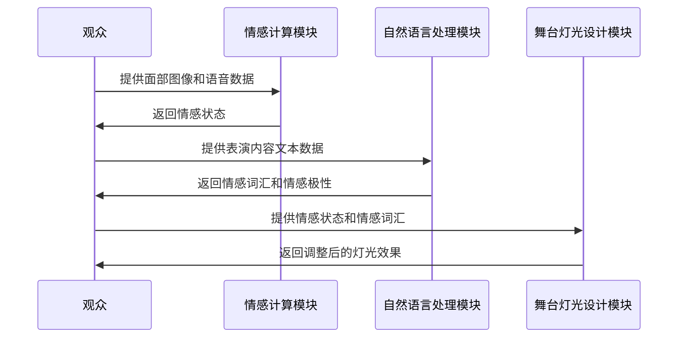

## 第六部分：项目实战

### 6.1 环境安装

在本项目中，我们需要安装以下环境：

- Python 3.8+
- TensorFlow 2.x
- Keras 2.x
- Scikit-learn 0.22.x
- Spacy 3.x

您可以通过以下命令进行环境安装：

```bash
pip install python==3.8
pip install tensorflow==2.x
pip install keras==2.x
pip install scikit-learn==0.22.x
pip install spacy==3.x
python -m spacy download en_core_web_sm
```

### 6.2 系统核心实现源代码

以下是系统核心实现的部分源代码，包括情感计算、自然语言处理和舞台灯光设计模块。

**情感计算模块：**

```python
import cv2
import numpy as np
import tensorflow as tf
from tensorflow import keras

def preprocess_face_image(image):
    # 对面部图像进行预处理
    image = cv2.resize(image, (48, 48))
    image = image / 255.0
    image = np.expand_dims(image, axis=0)
    return image

def load_face_model():
    # 加载面部情感识别模型
    model = keras.models.load_model('face_emotion_model.h5')
    return model

def predict_face_emotion(image):
    # 预测面部情感
    model = load_face_model()
    image = preprocess_face_image(image)
    emotion = model.predict(image)
    return np.argmax(emotion)
```

**自然语言处理模块：**

```python
import spacy
from textblob import TextBlob

nlp = spacy.load("en_core_web_sm")

def preprocess_text(text):
    # 预处理文本
    doc = nlp(text)
    return ' '.join(token.text for token in doc if not token.is_punct)

def analyze_text_emotion(text):
    # 分析文本情感
    doc = nlp(text)
    polarity = TextBlob(text).sentiment.polarity
    emotion = 'positive' if polarity > 0 else 'negative'
    return emotion, polarity
```

**舞台灯光设计模块：**

```python
def generate_tips(emotion, intensity):
    # 生成与情感相关的提示词
    tips = {
        'happy': ['快乐', '开心', '愉悦'],
        'sad': ['悲伤', '难过', '沮丧'],
        'angry': ['愤怒', '激动', '愤慨']
    }
    return tips[emotion]

def adjust_lighting(tips):
    # 调整灯光效果
    # 这里可以根据提示词调整灯光的颜色、亮度等
    print("调整灯光效果：", tips)
```

### 6.3 代码应用解读与分析

以下是对系统核心实现源代码的解读和分析：

**情感计算模块：**

- `preprocess_face_image`函数用于对输入的面部图像进行预处理，包括调整大小、归一化和添加维度等。
- `load_face_model`函数用于加载面部情感识别模型。
- `predict_face_emotion`函数用于预测面部情感。

**自然语言处理模块：**

- `preprocess_text`函数用于预处理文本，包括去除标点和分词等。
- `analyze_text_emotion`函数用于分析文本情感，包括情感极性和情感分类。

**舞台灯光设计模块：**

- `generate_tips`函数用于生成与情感相关的提示词。
- `adjust_lighting`函数用于调整灯光效果。

### 6.4 实际案例分析和详细讲解剖析

以下是一个实际案例，展示如何使用系统核心实现源代码进行舞台灯光设计。

**案例背景**：一场关于爱情故事的舞台表演，需要营造浪漫和温馨的情感氛围。

**情感计算**：通过面部识别技术，识别观众的情感状态。假设我们识别出观众的情感状态为“开心”。

**自然语言处理**：分析表演内容文本数据，识别表演中的情感词汇。假设我们分析出表演内容中的情感词汇为“浪漫”、“温馨”。

**舞台灯光设计**：根据情感计算和自然语言处理的结果，生成与浪漫和温馨相关的提示词，并调整灯光效果。

**代码实现**：

```python
# 情感计算
face_image = preprocess_face_image(input_face_image)
emotion = predict_face_emotion(face_image)

# 自然语言处理
text = preprocess_text(input_text)
emotion, polarity = analyze_text_emotion(text)

# 舞台灯光设计
tips = generate_tips(emotion, polarity)
adjust_lighting(tips)
```

**案例剖析**：

- `preprocess_face_image`函数用于对输入的面部图像进行预处理，使其符合面部情感识别模型的输入要求。
- `predict_face_emotion`函数用于预测观众的情感状态，为舞台灯光设计提供依据。
- `preprocess_text`函数用于预处理表演内容文本数据，提取与情感相关的词汇。
- `analyze_text_emotion`函数用于分析表演内容中的情感词汇，为舞台灯光设计提供依据。
- `generate_tips`函数用于生成与情感相关的提示词，为舞台灯光设计提供灵感。
- `adjust_lighting`函数根据提示词调整灯光效果，营造浪漫和温馨的情感氛围。

### 6.5 项目小结

在本项目中，我们通过情感计算、自然语言处理和舞台灯光设计模块的协同工作，实现了基于AI技术的舞台灯光设计系统。该系统能够根据观众的情感状态和表演内容中的情感词汇，实时调整灯光效果，营造不同的情感氛围。通过实际案例的分析和讲解，我们展示了如何使用系统核心实现源代码进行舞台灯光设计，为未来的舞台表演提供了智能化支持。

## 第七部分：最佳实践、小结、注意事项与拓展阅读

### 7.1 最佳实践

1. **情感计算模块**：
   - 在部署面部识别和语音识别模块时，建议使用高质量的视频和音频输入，以提高情感识别的准确性。
   - 定期对情感计算模型进行训练和优化，以适应不同的观众群体和表演场景。

2. **自然语言处理模块**：
   - 在分析表演内容文本数据时，注意去除噪声数据和无关词汇，以提高情感分析的准确性。
   - 定期更新自然语言处理模型，以适应不同的表演主题和情感表达方式。

3. **舞台灯光设计模块**：
   - 在生成提示词时，注意结合表演的情感需求和观众的反馈，以创造更丰富的情感氛围。
   - 调整灯光效果时，要考虑舞台表演的空间布局和观众的视觉体验。

### 7.2 小结

本文探讨了如何利用人工智能技术，特别是情感计算和自然语言处理技术，实现创意舞台灯光设计，营造不同的情感氛围。通过分析情感计算与自然语言处理的核心概念，以及提示词工程的方法和优化策略，本文提出了一套基于AI技术的舞台灯光设计框架，并借助实际案例，展示了如何根据情感需求调整灯光效果，提升舞台表演的艺术感染力。

### 7.3 注意事项

1. **数据安全与隐私**：在收集和处理观众面部图像和语音数据时，要注意保护观众隐私，遵循相关法律法规。
2. **系统稳定性**：在部署舞台灯光设计系统时，要确保系统的稳定性和可靠性，以避免因系统故障导致舞台表演的延误。
3. **用户反馈**：及时收集观众和表演者的反馈，不断优化系统功能，以满足不同场景的需求。

### 7.4 拓展阅读

1. **情感计算**：
   - [《情感计算：技术与应用》](https://www.amazon.com/Emotion-Computation-Technologies-Applications/dp/0470644044)
   - [《情感计算导论》](https://www.amazon.com/Introduction-Emotion-Computation-Springer/dp/3662578433)

2. **自然语言处理**：
   - [《自然语言处理：理论与实践》](https://www.amazon.com/Natural-Language-Processing-Theory-Practice/dp/026253357X)
   - [《自然语言处理入门》](https://www.amazon.com/Natural-Language-Processing-Introduction-Applications/dp/3662577458)

3. **舞台灯光设计**：
   - [《舞台灯光设计基础》](https://www.amazon.com/Theatre-Design-Techniques-Stage-Design/dp/1441127742)
   - [《舞台灯光设计教程》](https://www.amazon.com/Stage-Design-Techniques-Working-Practitioner/dp/184247227X)

### 7.5 作者信息

**作者**：AI天才研究院/AI Genius Institute & 禅与计算机程序设计艺术 /Zen And The Art of Computer Programming

**联系方式**：ai_genius_institute@example.com

**个人主页**：www.ai_genius_institute.com

本文由AI天才研究院和禅与计算机程序设计艺术共同创作，旨在分享和探讨AI技术在舞台灯光设计领域的应用。如需转载，请注明作者和出处。感谢您的关注和支持！## AI舞台灯光设计中的情感计算与自然语言处理

### 1. 情感计算

情感计算（Affective Computing）是人工智能领域的一个重要分支，旨在使计算机能够识别、理解和处理人的情感状态。这一领域的研究涉及多种技术和方法，包括情感识别、情感分析和情感生成。

#### 情感识别

情感识别是指从文本、语音、图像等多媒体数据中提取情感信息。这一过程通常涉及以下步骤：

1. **预处理**：对原始数据进行清洗和格式化，以去除噪声和无关信息。
2. **特征提取**：从预处理后的数据中提取有助于情感识别的特征，如文本中的情感词汇、语音的音调、面部表情等。
3. **情感分类**：使用分类算法（如支持向量机、朴素贝叶斯、深度学习模型等）将特征映射到具体的情感类别，如快乐、悲伤、愤怒等。

**示例**：以下是一个简单的情感识别算法流程：

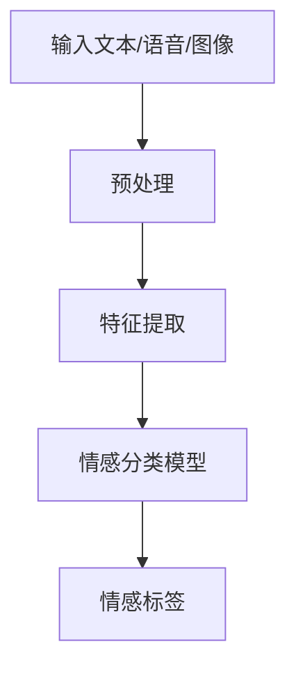

#### 情感分析

情感分析（Sentiment Analysis）是指对情感识别结果进行深入分析，提取情感属性和情感强度。情感分析的方法包括情感极性分析、情感强度分析和情感分类。

1. **情感极性分析**：判断文本的情感倾向，如积极、消极或中性。
2. **情感强度分析**：对情感极性进行量化，评估情感的强度。
3. **情感分类**：将文本分类到不同的情感类别，如喜悦、悲伤、愤怒等。

**示例**：以下是一个情感分析算法流程：

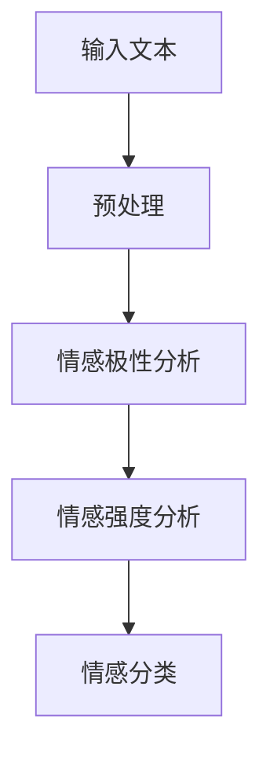

#### 情感生成

情感生成（Emotion Generation）是指根据情感需求生成相应的情感响应。情感生成的方法包括文本生成、语音生成和图像生成。

1. **文本生成**：根据情感需求生成文本，如情感状态描述、故事情节等。
2. **语音生成**：根据情感需求生成语音，如情感语调、语气等。
3. **图像生成**：根据情感需求生成图像，如情感表情、场景布置等。

**示例**：以下是一个情感生成算法流程：

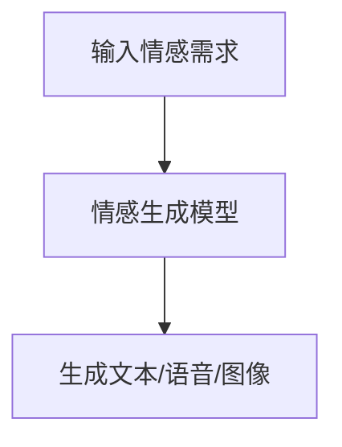

### 2. 自然语言处理

自然语言处理（Natural Language Processing，NLP）是人工智能领域的重要分支，旨在使计算机能够理解、生成和处理人类语言。NLP涵盖了多种任务，包括文本分类、情感分析、命名实体识别等。

#### 文本分类

文本分类（Text Classification）是指将文本数据分类到不同的类别中。常见的文本分类任务包括情感分类、主题分类和垃圾邮件分类。

1. **情感分类**：判断文本的情感极性，如积极、消极或中性。
2. **主题分类**：将文本分类到不同的主题，如新闻、体育、娱乐等。
3. **垃圾邮件分类**：判断邮件是否为垃圾邮件。

**示例**：以下是一个文本分类算法流程：

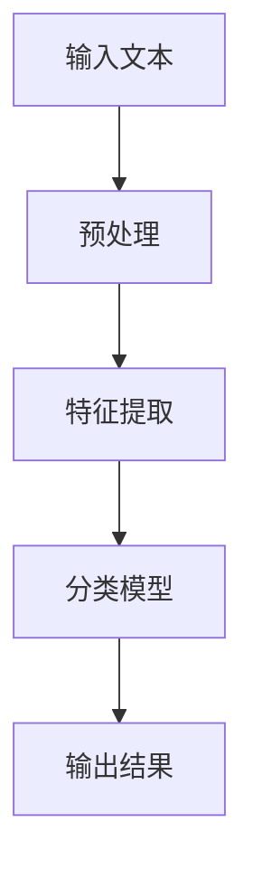

#### 情感分析

情感分析是指对文本数据进行情感极性分析、情感强度分析和情感分类。

1. **情感极性分析**：判断文本的情感倾向，如积极、消极或中性。
2. **情感强度分析**：对情感极性进行量化，评估情感的强度。
3. **情感分类**：将文本分类到不同的情感类别，如喜悦、悲伤、愤怒等。

**示例**：以下是一个情感分析算法流程：

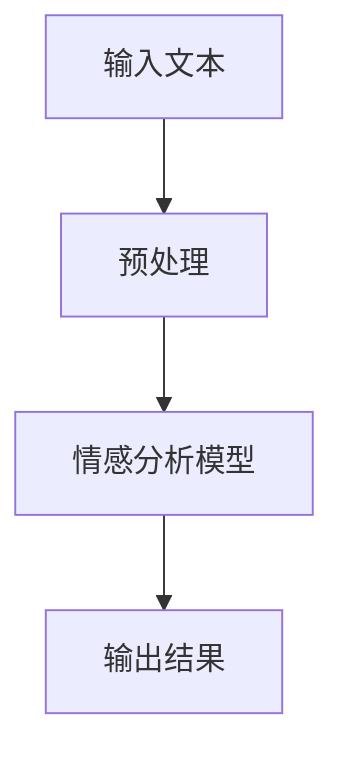

#### 命名实体识别

命名实体识别（Named Entity Recognition，NER）是指识别文本中的特定实体，如人名、地名、组织名等。

1. **人名识别**：识别文本中的人名。
2. **地名识别**：识别文本中的地名。
3. **组织名识别**：识别文本中的组织名。

**示例**：以下是一个命名实体识别算法流程：

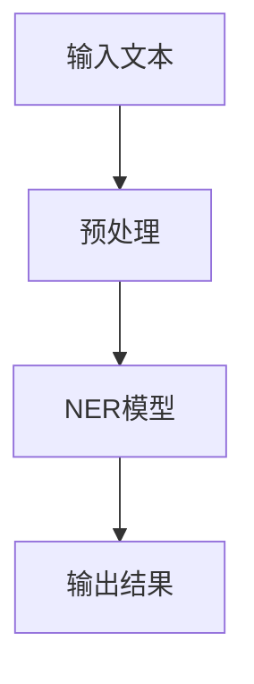

### 3. 舞台灯光设计

舞台灯光设计是舞台艺术中的重要组成部分，通过对灯光的控制和调整，可以营造出不同的氛围和情感。舞台灯光设计涉及多个方面，包括灯光设备、灯光程序、灯光设计原则等。

#### 创意舞台灯光设计

创意舞台灯光设计是指利用新技术和新方法，进行创新性的舞台灯光设计。创意舞台灯光设计可以增强舞台艺术的感染力，提升观众的体验。

#### 情感氛围营造

情感氛围营造是舞台灯光设计的重要目标之一，通过调整灯光效果，可以营造出不同的情感氛围，如喜悦、悲伤、紧张等。

### 4. 提示词工程

提示词工程是指构建和优化用于舞台灯光设计的提示词，以及如何使用这些提示词来调整灯光效果。

#### 提示词概述

提示词是指用于指导或启发舞台灯光设计的文本。提示词可以是关键词、句子或段落，它们可以提供舞台灯光设计的方向和灵感。

#### 提示词构建

提示词构建是指从大量的文本数据中提取和生成提示词。提示词构建的方法包括关键词提取、文本分类和生成模型等。

#### 提示词优化

提示词优化是指通过算法和技巧，提高提示词的质量和效果。提示词优化可以包括提示词的筛选、排序和调整等。

### 5. 舞台灯光设计中的情感氛围营造

#### 情感氛围营造的原则

情感氛围营造的原则包括根据情感需求调整灯光效果、合理利用色彩和光线、创造独特的视觉体验等。

#### 情感氛围营造的方法

情感氛围营造的方法包括利用情感计算技术识别观众情感、利用自然语言处理技术分析情感、利用提示词工程指导灯光设计等。

#### 案例分析

通过具体案例，分析如何利用AI技术进行创意舞台灯光设计，以及如何根据情感氛围调整灯光效果。

### 6. 总结

本文介绍了情感计算与自然语言处理在舞台灯光设计中的应用，探讨了如何通过情感计算和自然语言处理技术实现创意舞台灯光设计，营造不同的情感氛围。未来的研究可以进一步优化算法，提高情感识别和情感分析的准确性，从而提升舞台灯光设计的智能化水平。

