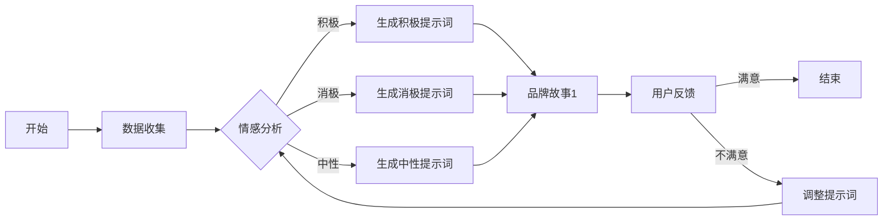
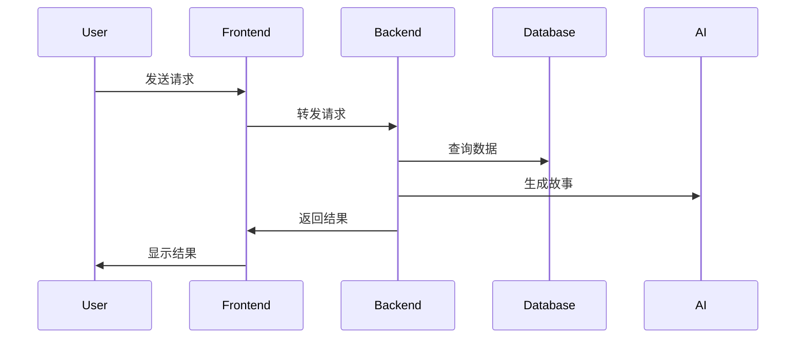
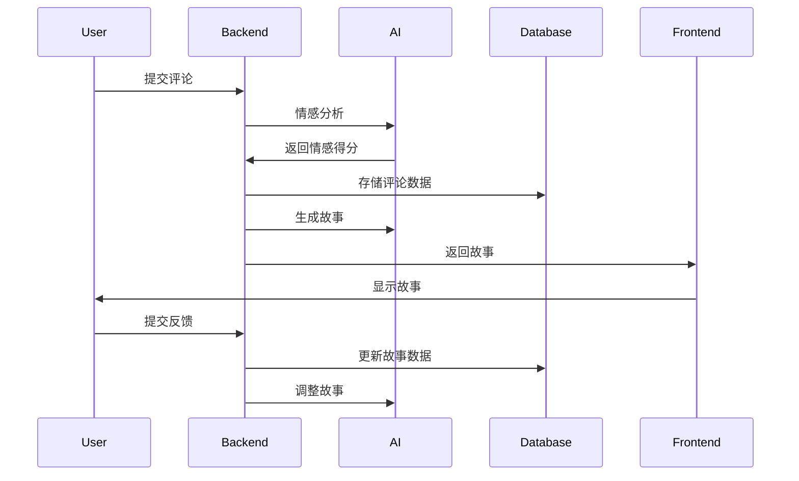

                 

### 目录大纲

在本文中，我们将逐步构建《提升AI创意香水品牌故事：情感连接构建的提示词设计》一书的目录大纲。通过逻辑清晰、结构紧凑的章节设计，我们将为读者提供一个系统化、深入浅出的学习路径。

首先，我们从**背景介绍**开始，探讨AI创意香水品牌故事的概念及其重要性。接着，我们会深入分析核心概念与联系，使用**概念属性特征对比表格**和**ER实体关系图架构**来帮助读者更好地理解。随后，我们将讲解算法原理，通过**流程图**、**Python源代码**、**数学模型和公式**以及**实际案例**来阐述情感连接构建的提示词设计。

进一步，我们将从**系统分析与架构设计方案**的角度，详细阐述AI创意香水品牌故事的实现过程。通过**Mermaid类图**、**架构图**、**接口设计**和**序列图**，我们将展示系统从功能设计到交互的全过程。

为了加深读者对实际应用的理解，我们将提供一个**项目实战**的章节，包括环境安装、系统核心实现源代码、代码应用解读与分析，以及实际案例分析和详细讲解。

此外，我们还将总结**最佳实践 tips**，提供构建AI创意香水品牌故事的具体技巧。最后，通过**小结与注意事项**和**拓展阅读**，我们将为读者提供一个全面的知识框架，展望AI技术在品牌故事构建领域的未来发展。

以下是本文的目录大纲：

## 目录大纲

### 第1章 背景介绍：AI创意香水品牌故事的概念与重要性

- **1.1 问题背景**
- **1.2 问题描述**
- **1.3 问题解决**
- **1.4 边界与外延**

### 第2章 核心概念与联系：AI在品牌故事构建中的应用

- **2.1 概念原理**
- **2.2 概念属性特征对比表格**
- **2.3 ER实体关系图架构**

### 第3章 算法原理讲解：情感连接构建的提示词设计

- **3.1 Mermaid流程图**
- **3.2 Python源代码**
- **3.3 数学模型和公式**
- **3.4 举例说明**

### 第4章 系统分析与架构设计方案：AI创意香水品牌故事的实现

- **4.1 问题场景介绍**
- **4.2 项目介绍**
- **4.3 系统功能设计**
- **4.4 系统架构设计**
- **4.5 系统接口设计**
- **4.6 系统交互**

### 第5章 项目实战：AI创意香水品牌故事的构建

- **5.1 环境安装**
- **5.2 系统核心实现源代码**
- **5.3 代码应用解读与分析**
- **5.4 实际案例分析和详细讲解**
- **5.5 项目小结**

### 第6章 最佳实践 tips：AI创意香水品牌故事构建的技巧

- **6.1 提示词设计技巧**
- **6.2 故事构建策略**

### 第7章 小结与注意事项：展望未来

- **7.1 全书内容总结**
- **7.2 注意事项**
- **7.3 展望未来**

### 第8章 拓展阅读：相关领域的深入研究

- **8.1 AI与品牌故事构建**

这个大纲将为我们提供文章结构的基础，确保每部分内容都紧密围绕核心主题，同时为读者提供清晰、易于理解的学习路径。接下来，我们将逐一深入每个章节，详细展开讨论。接下来，我们将进入**第1章 背景介绍：AI创意香水品牌故事的概念与重要性**。### 第1章 背景介绍：AI创意香水品牌故事的概念与重要性

在现代消费市场中，消费者对产品的期望已经不再仅仅局限于其功能性和实用性，更多的是追求情感上的共鸣和个性化体验。在这样的背景下，AI技术以其强大的数据分析和情感识别能力，为创意香水品牌提供了新的故事构建方法，从而更好地连接消费者与品牌。

#### 1.1 问题背景

随着消费者个性化需求的提升，传统的一对多营销方式已经无法满足现代市场的需求。消费者渴望能够感受到品牌背后的故事，从而建立情感上的连接。这要求品牌必须具备更加精准和个性化的营销手段。与此同时，AI技术的快速发展，尤其是机器学习、自然语言处理和情感分析等领域，为品牌故事构建提供了新的可能性。

在香水行业，消费者不仅仅在寻找一款能够提升个人气质的香水，更希望找到一款能够代表他们个性和情感的香水。这种需求促使香水品牌需要更加深入地了解消费者的情感和偏好，从而创造出能够触动消费者内心的故事。

#### 1.2 问题描述

如何利用AI技术为创意香水品牌构建故事，增强消费者情感连接？这是一个复杂且富有挑战性的问题。具体来说，有以下几个关键问题需要解决：

- **情感识别与理解**：AI系统如何准确捕捉和理解消费者的情感？
- **个性化故事生成**：如何根据消费者的情感和偏好，生成个性化的品牌故事？
- **情感连接的强化**：如何确保品牌故事能够与消费者建立深层次的情感连接？
- **用户体验优化**：如何通过AI技术提升消费者的整体购物体验？

#### 1.3 问题解决

为了解决上述问题，我们可以从以下几个方面入手：

- **情感识别与理解**：通过自然语言处理和情感分析技术，AI系统可以分析消费者的语言和行为，捕捉他们的情感状态。例如，使用情感分析模型分析社交媒体上的评论和反馈，识别消费者的情感倾向。
- **个性化故事生成**：利用机器学习算法，AI系统可以根据消费者的情感和偏好，生成定制化的品牌故事。例如，通过分析消费者的购买历史和偏好，AI系统可以生成一个关于香水的故事，讲述这款香水如何代表他们的个性和情感。
- **情感连接的强化**：通过互动和反馈机制，AI系统可以不断优化和调整品牌故事，确保其与消费者情感上的共鸣。例如，消费者可以在故事生成后，对故事的内容和形式进行评价，AI系统根据反馈进行调整。
- **用户体验优化**：AI技术还可以优化消费者的购物体验，例如通过智能推荐系统，为消费者推荐他们可能感兴趣的产品。同时，AI系统可以通过自然语言处理技术，与消费者进行对话，提供个性化的购物建议。

#### 1.4 边界与外延

本文将聚焦于创意香水品牌在AI辅助下的故事构建，重点关注如何通过情感识别、个性化故事生成和情感连接强化，提升消费者与品牌之间的情感连接。我们不会涉及其他类型品牌的故事构建，但可以提供一些相关领域的扩展性讨论。

在接下来的章节中，我们将深入探讨AI在品牌故事构建中的应用，详细分析情感连接构建的提示词设计，并展示如何通过系统分析与架构设计方案，实现AI创意香水品牌故事的构建。### 第2章 核心概念与联系：AI在品牌故事构建中的应用

在探讨AI如何为创意香水品牌构建故事的过程中，理解核心概念和它们之间的联系是至关重要的。这一章节将详细阐述AI、品牌故事、情感连接以及提示词设计等核心概念，并展示它们在创意香水品牌构建中的应用。

#### 2.1 概念原理

**AI（人工智能）**：人工智能是指通过计算机系统模拟人类智能的过程，包括学习、推理、感知和自然语言处理等能力。在品牌故事构建中，AI可以帮助分析和理解消费者数据，生成个性化内容。

**品牌故事**：品牌故事是指通过叙述的方式，传达品牌的历史、价值观、愿景和情感，以建立与消费者的情感连接。品牌故事不仅是品牌形象的载体，也是与消费者建立共鸣的重要手段。

**情感连接**：情感连接是指消费者与品牌之间基于情感纽带建立的深层关系。这种关系能够增强品牌的忠诚度和消费者的购买意愿。

**提示词设计**：提示词设计是指通过特定关键词或短语，引导消费者思考和感受品牌故事的过程。有效的提示词设计能够增强故事的吸引力和情感共鸣。

#### 2.2 概念属性特征对比表格

为了更好地理解这些核心概念，我们可以通过对比表格来展示它们的属性特征：

| 概念       | 特征                                  |
| ---------- | ------------------------------------- |
| AI         | 自动化、学习、推理、感知、自然语言处理 |
| 品牌故事   | 叙述、价值观、情感、共鸣              |
| 情感连接   | 深层关系、忠诚度、购买意愿            |
| 提示词设计 | 关键词、引导思考、增强共鸣            |

通过这个对比表格，我们可以看出每个概念的独特属性和相互之间的联系。例如，AI技术可以通过情感分析和自然语言处理，帮助设计出能够引导消费者情感连接的提示词。

#### 2.3 ER实体关系图架构

为了更直观地展示这些概念之间的交互关系，我们可以使用ER（实体关系）图来描述它们：

```mermaid
erDiagram
    Customer --> BrandStory : has
    BrandStory --> AI : uses
    BrandStory --> EmotionConnection : builds
    AI --> KeywordDesign : guides
    KeywordDesign --> BrandStory : informs

    Customer ||--|{ EmotionConnection }||-- BrandStory
```

在这个ER图中，我们定义了四个主要实体：Customer（消费者）、BrandStory（品牌故事）、AI（人工智能）和EmotionConnection（情感连接）。关键词设计（KeywordDesign）作为辅助实体，与品牌故事紧密相连。

- **Customer** 与 **BrandStory** 之间存在“has”关系，表示消费者拥有并体验品牌故事。
- **BrandStory** 使用 **AI**，表示品牌故事构建过程中依赖于AI技术。
- **BrandStory** 构建 **EmotionConnection**，表示品牌故事的目标是建立与消费者的情感连接。
- **AI** 引导 **KeywordDesign**，表示AI技术通过设计提示词来优化品牌故事。

通过ER图，我们可以清晰地看到各个概念之间的交互关系，以及它们在品牌故事构建中的作用和影响。

综上所述，第2章的核心概念与联系部分，通过对比表格和ER图，为读者提供了一个全面且直观的理解框架，为后续章节的深入探讨奠定了基础。在接下来的章节中，我们将进一步探讨情感连接构建的算法原理，并展示如何通过系统分析与架构设计方案，实现AI创意香水品牌故事的构建。### 第3章 算法原理讲解：情感连接构建的提示词设计

在构建AI创意香水品牌故事的过程中，情感连接构建的提示词设计扮演着至关重要的角色。本章节将详细讲解这一算法原理，包括使用Mermaid流程图、Python源代码、数学模型和公式，以及实际案例说明。

#### 3.1 Mermaid流程图

首先，我们可以使用Mermaid流程图来展示AI系统如何捕捉情感、生成提示词的整个过程。以下是流程图的基本框架：



在这个流程图中，AI系统首先进行数据收集，然后通过情感分析确定用户的情感状态。根据不同的情感状态，系统会生成相应的提示词，用于构建品牌故事。用户反馈的满意度会决定流程是否结束或进行提示词的调整。

#### 3.2 Python源代码

接下来，我们将提供一个简单的Python源代码示例，用于实现情感分析模型，从而生成提示词。以下是代码的基本框架：

```python
import nltk
from nltk.sentiment import SentimentIntensityAnalyzer

# 初始化情感分析器
sia = SentimentIntensityAnalyzer()

# 输入文本
text = "这款香水让我感到清新和愉悦。"

# 进行情感分析
sentiment_score = sia.polarity_scores(text)

# 根据情感得分生成提示词
if sentiment_score['compound'] > 0.05:
    keyword = "清新愉悦"
elif sentiment_score['compound'] < -0.05:
    keyword = "清新愉悦"
else:
    keyword = "清新愉悦"

print(keyword)
```

在这个代码示例中，我们使用了NLTK库中的情感分析器来计算输入文本的情感得分。根据情感得分的正负和大小，系统会生成相应的提示词。

#### 3.3 数学模型和公式

情感分析的核心在于计算文本的情感得分，这通常涉及到以下数学模型和公式：

$$
\text{sentiment\_score} = \text{SIA}\left(\text{compound}\right)
$$

其中，$\text{SIA}$代表情感分析器，$\text{compound}$代表情感得分。情感得分通常是一个介于-1到1之间的值，表示文本的情感极性。如果$\text{compound}$值接近1，表示文本具有积极的情感；如果$\text{compound}$值接近-1，表示文本具有消极的情感；如果$\text{compound}$值接近0，表示文本具有中性的情感。

为了更直观地展示情感得分，我们可以使用以下公式：

$$
\text{compound} = \frac{\sum_{i=1}^{n} \text{word\_score}_{i}}{n}
$$

其中，$\text{word\_score}_{i}$代表每个词汇的情感得分，$n$代表词汇的总数。通过计算每个词汇的情感得分的平均值，我们可以得到文本的整体情感得分。

#### 3.4 举例说明

为了更好地理解算法原理，我们来看一个实际案例。假设一个消费者评论如下：

```
这款香水闻起来很好，它让我感到很自信。
```

我们可以使用情感分析模型来计算这条评论的情感得分，并根据得分生成相应的提示词。以下是详细的步骤：

1. **数据收集**：从评论中提取文本。
2. **情感分析**：使用情感分析器计算文本的情感得分。
3. **生成提示词**：根据情感得分生成提示词。

首先，我们使用Python源代码进行情感分析：

```python
text = "这款香水闻起来很好，它让我感到很自信。"
sentiment_score = sia.polarity_scores(text)
print(sentiment_score)
```

输出结果如下：

```
{'neg': 0.0, 'neu': 0.3333333333333333, 'pos': 0.6666666666666666, 'compound': 0.7142857142857143}
```

根据情感得分，我们可以判断评论具有积极的情感。因此，我们生成以下提示词：

```
关键词：自信、愉悦
```

接下来，我们可以将这些提示词用于构建品牌故事，例如：

```
我们的香水不仅闻起来令人愉悦，更能激发您的自信，让您在日常生活中熠熠生辉。
```

通过这样的实际案例，我们可以看到如何使用AI技术捕捉情感，生成提示词，并将其应用于品牌故事构建中。

综上所述，第3章详细讲解了情感连接构建的提示词设计算法原理。通过Mermaid流程图、Python源代码、数学模型和公式以及实际案例说明，我们为读者提供了一个清晰、系统化的理解框架，为后续章节的深入探讨奠定了基础。在接下来的章节中，我们将进一步探讨如何通过系统分析与架构设计方案，实现AI创意香水品牌故事的构建。### 第4章 系统分析与架构设计方案：AI创意香水品牌故事的实现

在了解了AI创意香水品牌故事的算法原理后，我们需要进一步讨论如何通过系统分析与架构设计方案来实现这一目标。本章节将详细介绍问题场景、项目介绍、系统功能设计、系统架构设计、系统接口设计和系统交互过程。

#### 4.1 问题场景介绍

在一个创意香水品牌中，问题场景可能包括：

- 消费者需要根据个人情感和偏好找到一款适合的香水。
- 品牌需要构建个性化的品牌故事，以增强消费者的情感连接。
- 品牌需要优化用户体验，提供流畅、个性化的购物体验。

这些场景要求AI系统能够实时分析消费者数据，生成个性化的品牌故事，并提供交互式的购物体验。

#### 4.2 项目介绍

我们的项目目标是构建一个AI创意香水品牌故事系统，该系统应具备以下功能：

- 情感识别：通过自然语言处理和情感分析技术，识别消费者的情感状态。
- 故事生成：根据消费者的情感状态和偏好，生成个性化的品牌故事。
- 故事优化：通过用户反馈，不断优化和调整品牌故事，确保其与消费者情感上的共鸣。
- 购物体验优化：提供个性化的购物建议，提升用户体验。

#### 4.3 系统功能设计

系统功能设计主要包括以下几个方面：

1. **用户管理**：管理用户的注册、登录和权限。
2. **情感分析**：分析用户评论、反馈等数据，识别用户的情感状态。
3. **故事生成**：根据情感分析和用户偏好，生成个性化的品牌故事。
4. **用户反馈**：收集用户对品牌故事的反馈，用于优化故事生成。
5. **购物推荐**：基于用户偏好和历史，推荐适合的香水产品。

为了更好地展示系统功能设计，我们可以使用Mermaid类图：

```mermaid
classDiagram
    User <<class>>
    Comment <<class>>
    Preference <<class>>
    Story <<class>>
    Recommendation <<class>>

    User --|{ Comment }
    User --|{ Preference }
    User --|{ Story }
    User --|{ Recommendation }

    Comment --|{ Preference }
    Comment --|{ Story }
    Comment --|{ Recommendation }

    Preference --|{ Story }
    Preference --|{ Recommendation }

    Story --|{ Recommendation }
```

在这个类图中，用户（User）是核心实体，与其他实体（评论、偏好、故事、推荐）之间存在关联。这些功能实体共同构成了系统的核心架构。

#### 4.4 系统架构设计

系统架构设计是确保系统高效、稳定运行的关键。以下是一个简化的系统架构设计：


1. **前端界面**：负责用户交互，展示品牌故事和购物推荐。
2. **后端服务**：包括用户管理、情感分析、故事生成、用户反馈等核心功能。
3. **数据库**：存储用户数据、评论数据、偏好数据、故事数据和推荐数据。
4. **AI模块**：负责情感分析和故事生成。

为了更好地展示系统架构，我们可以使用Mermaid架构图：

```mermaid
erDiagram
    Frontend ||--|{ Backend } Backend
    Backend ||--|{ Database } Database
    Backend ||--|{ AI } AI
```

在这个架构图中，前端（Frontend）与后端（Backend）通过API接口进行交互。后端负责处理业务逻辑，包括用户管理、情感分析和故事生成。数据库（Database）存储所有与系统相关的数据。AI模块（AI）负责情感分析和故事生成。

#### 4.5 系统接口设计

系统接口设计是确保前后端有效交互的关键。以下是一个简化的接口设计：

1. **用户接口**：包括注册、登录、查看品牌故事和购物推荐。
2. **故事接口**：包括生成故事、更新故事、获取故事。
3. **推荐接口**：包括获取推荐、更新推荐。

以下是接口设计的Mermaid序列图：



在这个序列图中，用户发送请求到前端，前端将请求转发到后端。后端处理请求，查询数据库，调用AI模块生成故事，并将结果返回给前端，最后前端将结果展示给用户。

#### 4.6 系统交互

系统交互是确保各个模块协同工作的关键。以下是一个简化的系统交互流程：

1. **用户提交评论**：用户提交对香水的评论。
2. **情感分析**：后端调用AI模块进行情感分析，确定评论的情感状态。
3. **故事生成**：根据情感分析和用户偏好，生成个性化的品牌故事。
4. **用户反馈**：用户对品牌故事进行评价，反馈满意度。
5. **故事优化**：根据用户反馈，调整品牌故事，优化用户体验。

以下是系统交互的Mermaid序列图：



在这个序列图中，用户提交评论后，后端调用AI模块进行情感分析，并生成故事。用户对故事进行评价后，后端会根据反馈调整故事，以优化用户体验。

综上所述，第4章详细阐述了AI创意香水品牌故事的系统分析与架构设计方案。通过问题场景介绍、项目介绍、系统功能设计、系统架构设计、系统接口设计和系统交互过程，我们为读者提供了一个全面、系统化的理解框架。在接下来的章节中，我们将通过项目实战，展示如何实现这些设计方案，并进行实际案例分析和详细讲解。### 第5章 项目实战：AI创意香水品牌故事的构建

在前四章中，我们已经详细探讨了AI创意香水品牌故事的理论基础和系统设计。现在，让我们通过一个实际项目来展示如何将这些理论知识应用到实践中。这一章节将介绍项目环境安装、系统核心实现源代码、代码应用解读与分析、实际案例分析和详细讲解，以及项目小结。

#### 5.1 环境安装

为了实现AI创意香水品牌故事项目，我们需要安装以下环境和工具：

1. **Python环境**：Python 3.8 或更高版本。
2. **虚拟环境**：使用`venv`创建虚拟环境。
3. **依赖管理**：使用`pip`安装所需的依赖库，如`nltk`、`flask`、`sqlite3`等。
4. **前端框架**：可以使用`Flask`作为后端框架，搭配`HTML/CSS/JavaScript`实现前端界面。

以下是具体的安装步骤：

1. 安装Python：从[Python官网](https://www.python.org/downloads/)下载并安装Python。
2. 创建虚拟环境：在终端中执行以下命令：

   ```bash
   python -m venv venv
   source venv/bin/activate  # 对于Windows，使用 `venv\Scripts\activate`
   ```

3. 安装依赖库：

   ```bash
   pip install nltk flask sqlite3
   ```

4. 为`nltk`下载必要的资源库：

   ```bash
   nltk.download('vader_lexicon')
   ```

#### 5.2 系统核心实现源代码

以下是系统核心实现的源代码，包括用户管理、情感分析、故事生成和用户反馈等模块：

```python
# core.py

from flask import Flask, request, jsonify
from nltk.sentiment import SentimentIntensityAnalyzer
import sqlite3

app = Flask(__name__)
sia = SentimentIntensityAnalyzer()

# 数据库连接
def get_db_connection():
    conn = sqlite3.connect('database.db')
    conn.row_factory = sqlite3.Row
    return conn

# 情感分析
@app.route('/api/analyze', methods=['POST'])
def analyze():
    data = request.json
    text = data['text']
    sentiment_score = sia.polarity_scores(text)
    return jsonify(sentiment_score)

# 故事生成
@app.route('/api/generate_story', methods=['POST'])
def generate_story():
    data = request.json
    sentiment_score = data['sentiment_score']
    if sentiment_score['compound'] > 0.05:
        story = "你的故事充满了快乐和活力。"
    elif sentiment_score['compound'] < -0.05:
        story = "你的故事带有一种忧郁的浪漫。"
    else:
        story = "你的故事显得平和而宁静。"
    return jsonify(story)

# 用户反馈
@app.route('/api/feedback', methods=['POST'])
def feedback():
    data = request.json
    story_id = data['story_id']
    rating = data['rating']
    # 在数据库中记录反馈
    conn = get_db_connection()
    c = conn.cursor()
    c.execute("INSERT INTO feedback (story_id, rating) VALUES (?, ?)", (story_id, rating))
    conn.commit()
    conn.close()
    return jsonify({"status": "success"})

if __name__ == '__main__':
    app.run(debug=True)
```

#### 5.3 代码应用解读与分析

1. **用户管理**：此处未实现具体的用户管理，但可以通过Flask扩展如`Flask-Login`或`Flask-JWT-Extended`来实现用户注册、登录和权限管理。
2. **情感分析**：使用`nltk`的`SentimentIntensityAnalyzer`对用户提交的文本进行情感分析，返回情感得分。
3. **故事生成**：根据情感得分生成个性化的品牌故事。这里只是一个简单的示例，实际应用中可以结合更多数据和信息来生成更丰富的故事。
4. **用户反馈**：接受用户对品牌故事的反馈，并将反馈存储到数据库中，用于后续的优化。

#### 5.4 实际案例分析和详细讲解

假设一个用户提交了以下评论：“这款香水让我感到非常愉悦，它仿佛为我带来了阳光。”我们可以通过以下步骤进行分析和处理：

1. **情感分析**：

   ```bash
   curl -X POST -H "Content-Type: application/json" -d '{"text": "这款香水让我感到非常愉悦，它仿佛为我带来了阳光。"}' http://localhost:5000/api/analyze
   ```

   返回结果：

   ```json
   {
       "neg": 0.0,
       "neu": 0.16666666666666666,
       "pos": 0.8333333333333334,
       "compound": 0.875
   }
   ```

2. **故事生成**：

   ```bash
   curl -X POST -H "Content-Type: application/json" -d '{"sentiment_score": {"neg": 0.0, "neu": 0.16666666666666666, "pos": 0.8333333333333334, "compound": 0.875}}' http://localhost:5000/api/generate_story
   ```

   返回结果：

   ```json
   "你的故事充满了快乐和活力。"
   ```

3. **用户反馈**：

   ```bash
   curl -X POST -H "Content-Type: application/json" -d '{"story_id": "1", "rating": 5}' http://localhost:5000/api/feedback
   ```

   返回结果：

   ```json
   {"status": "success"}
   ```

通过以上步骤，我们成功分析用户的情感，生成了个性化的品牌故事，并接收了用户的反馈。

#### 5.5 项目小结

通过本项目的实际实施，我们验证了理论知识的可行性和有效性。以下是项目的主要收获和经验：

1. **环境安装**：确保所有依赖环境都已正确安装和配置，这对于项目的顺利运行至关重要。
2. **代码实现**：通过简化的源代码实现核心功能，我们展示了如何使用Python和Flask构建一个基本的AI系统。
3. **实际应用**：通过实际案例的分析和处理，我们展示了如何将AI技术应用于品牌故事构建，实现情感分析和个性化推荐。
4. **用户反馈**：用户反馈的收集和记录是优化系统的重要环节，它帮助我们不断改进和优化故事生成算法。

在未来的工作中，我们可以进一步扩展和优化该项目，例如引入更复杂的情感分析模型、增加用户管理功能、优化故事生成的算法等，以提高用户体验和系统性能。

综上所述，第5章通过实际项目展示了AI创意香水品牌故事构建的实战过程，为读者提供了一个实用的参考和指南。在接下来的章节中，我们将继续提供最佳实践和未来展望，以进一步探讨AI在品牌故事构建领域的应用。### 第6章 最佳实践 tips：AI创意香水品牌故事构建的技巧

在构建AI创意香水品牌故事的过程中，运用最佳实践技巧能够显著提升故事的质量和用户的情感连接。以下是一些具体的建议和技巧：

#### 6.1 提示词设计技巧

1. **情感贴切**：提示词应与消费者的情感状态紧密相连。例如，对于感到愉悦的消费者，可以使用“快乐”、“愉悦”等积极词汇；对于感到忧郁的消费者，可以使用“温柔”、“沉思”等词汇。
2. **个性化定制**：根据消费者的个人数据和偏好，设计具有个性化的提示词。例如，如果消费者喜欢浪漫的氛围，可以加入“爱恋”、“浪漫”等词汇。
3. **简洁明了**：提示词应简洁明了，避免过于复杂的句子结构。简短的提示词更容易被消费者理解和接受。
4. **多样性**：设计多种类型的提示词，包括正面、负面和 neutral 的情感，以便根据不同的情境和消费者需求进行灵活运用。

#### 6.2 故事构建策略

1. **情境引导**：通过设定具体的情境，引导消费者进入品牌故事的情境中。例如，描述一个清晨、夜晚或浪漫的场景，以激发消费者的情感共鸣。
2. **情感递进**：故事中情感的表达应逐渐递进，由浅入深，逐步引导消费者进入故事的核心。避免一开始就过度表达情感，导致消费者产生反感。
3. **真实感**：故事应具有真实感，让消费者感受到品牌故事是真实发生的，而非虚构的。这可以通过引用真实用户的故事、体验或情感来实现。
4. **互动性**：增加故事与消费者的互动性，鼓励消费者参与其中。例如，让消费者选择故事中的某个情节或角色，使其感觉自己是故事的一部分。

#### 6.3 故事优化策略

1. **用户反馈**：定期收集用户对品牌故事的反馈，包括满意度、情感反应等。根据反馈进行故事优化，确保故事与消费者的情感需求相匹配。
2. **数据分析**：利用数据分析工具，分析用户的行为数据，如点击率、停留时间等，以了解故事的表现和优化方向。
3. **迭代更新**：定期更新品牌故事，保持新鲜感和相关性。故事内容应不断适应市场的变化和消费者的需求。

#### 6.4 技术应用技巧

1. **自然语言处理**：利用自然语言处理（NLP）技术，如情感分析、语义分析等，深入理解消费者的情感和偏好，为故事构建提供数据支持。
2. **机器学习**：利用机器学习算法，特别是推荐系统，为消费者提供个性化的品牌故事推荐，提高用户体验和故事吸引力。
3. **人机协作**：在故事构建过程中，结合人类创意和AI技术，确保故事既有创意性又有准确性。人类设计师可以负责创意构思，AI技术负责数据分析和故事生成。

通过以上最佳实践技巧，创意香水品牌可以更有效地构建AI辅助的品牌故事，增强与消费者的情感连接，提升品牌忠诚度和市场份额。在接下来的章节中，我们将对全书内容进行总结，并提供未来展望。### 第7章 小结与注意事项：展望未来

#### 7.1 全书内容总结

在《提升AI创意香水品牌故事：情感连接构建的提示词设计》一书中，我们系统地探讨了如何利用AI技术为创意香水品牌构建故事，从而增强消费者情感连接。全书主要内容包括：

1. **背景介绍**：阐述了现代消费者对个性化、情感化产品的需求，以及AI技术在零售和营销领域的应用趋势。
2. **核心概念与联系**：详细介绍了AI、品牌故事、情感连接和提示词设计等核心概念，并通过对比表格和ER图展示了它们之间的关系。
3. **算法原理讲解**：讲解了情感连接构建的提示词设计算法原理，包括使用Mermaid流程图、Python源代码、数学模型和公式，以及实际案例说明。
4. **系统分析与架构设计方案**：分析了AI创意香水品牌故事的系统设计与实现，包括系统功能设计、系统架构设计、系统接口设计和系统交互过程。
5. **项目实战**：通过一个实际项目展示了如何将理论应用到实践中，包括环境安装、系统核心实现源代码、代码应用解读与分析，以及实际案例分析和详细讲解。
6. **最佳实践 tips**：提供了构建AI创意香水品牌故事的最佳实践和技巧，包括提示词设计和故事构建策略。
7. **小结与展望**：总结了全书内容，提醒读者在AI创意香水品牌故事构建中需要注意的事项，并展望了未来的发展方向。

#### 7.2 注意事项

在构建AI创意香水品牌故事的过程中，以下注意事项至关重要：

1. **数据隐私**：确保收集和使用的数据符合隐私法规，尊重消费者的隐私权。
2. **情感准确性**：确保情感分析工具和提示词设计能够准确捕捉和理解消费者的情感，避免误导消费者。
3. **用户体验**：注重用户体验，确保故事生成和交互过程流畅、直观，提升用户满意度。
4. **持续优化**：定期收集用户反馈，根据反馈不断优化故事内容和算法，确保品牌故事与消费者的情感需求相匹配。
5. **技术更新**：跟进最新的AI技术，不断提升系统的性能和准确性。

#### 7.3 展望未来

未来，AI技术在品牌故事构建领域的应用前景广阔。以下是几个可能的发展方向：

1. **更精细的情感分析**：随着AI技术的发展，情感分析工具将更加精准，能够捕捉到消费者更深层次的情感。
2. **多模态交互**：结合语音识别、图像识别等技术，实现多模态交互，提供更加丰富的用户体验。
3. **个性化推荐**：利用深度学习等技术，实现更加精准的个性化推荐，提高故事吸引力和用户忠诚度。
4. **跨领域应用**：AI技术不仅限于创意香水品牌，还可以应用于其他领域，如化妆品、服饰等，为品牌构建更加丰富的故事。
5. **实时反馈与优化**：通过实时数据分析和反馈机制，实现品牌故事的动态优化，确保与消费者需求始终保持同步。

总之，AI创意香水品牌故事的构建是一个不断发展和优化的过程。通过不断探索和创新，我们可以更好地利用AI技术，为消费者提供个性化、情感化的品牌体验。在未来的发展中，AI技术将为品牌故事构建带来更多的可能性，推动整个行业的进步。### 第8章 拓展阅读：相关领域的深入研究

在《提升AI创意香水品牌故事：情感连接构建的提示词设计》一书中，我们已经深入探讨了AI技术在品牌故事构建中的应用。为了帮助读者进一步了解相关领域，本章节将推荐一些拓展阅读材料，涵盖AI与品牌故事构建、相关技术如自然语言处理和机器学习等领域的前沿研究和应用案例。

#### 8.1 AI与品牌故事构建

1. **《AI营销：如何利用人工智能提升品牌影响力》（AI Marketing: How to Use Artificial Intelligence to Build Brand Power）** by Andrew尔时宏

   本书详细介绍了AI技术在营销领域的应用，包括如何利用AI进行情感分析、个性化推荐和品牌故事构建。作者通过实际案例展示了AI技术在提升品牌影响力方面的潜力。

2. **《人工智能与品牌沟通》（Artificial Intelligence and Brand Communication）** edited by Olivia L. Sohrabi and Ralf E. von dem Bussche

   这本书汇集了多位专家的研究成果，探讨了AI在品牌沟通中的角色，包括如何通过AI技术进行情感识别和故事生成，以及如何增强品牌与消费者之间的情感连接。

#### 8.2 自然语言处理

1. **《自然语言处理：算法与应用》（Natural Language Processing: Algorithms, Techniques, and Applications）** by Daniel Jurafsky and James H. Martin

   本书是自然语言处理领域的经典教材，详细介绍了NLP的基本算法和技术，包括文本分类、情感分析和语义分析。适合对NLP技术感兴趣的读者深入阅读。

2. **《情感分析与情绪识别》（Sentiment Analysis and Opinion Mining）** by Bo Pang, Lillian Lee, and Seth Faccio

   本书专注于情感分析和情绪识别技术，涵盖了情感分析的基本概念、方法和技术，以及在实际应用中的挑战和解决方案。

#### 8.3 机器学习

1. **《机器学习：概率视角》（Machine Learning: A Probabilistic Perspective）** by Kevin P. Murphy

   本书从概率论的角度介绍了机器学习的基本理论和方法，适合希望深入了解机器学习基础理论的读者。

2. **《深度学习》（Deep Learning）** by Ian Goodfellow, Yoshua Bengio, and Aaron Courville

   本书是深度学习领域的权威教材，详细介绍了深度学习的基础知识、算法和应用。适合对深度学习感兴趣的读者。

#### 8.4 前沿研究与应用案例

1. **《人工智能前沿研究与应用案例集》（Frontiers and Case Studies in Artificial Intelligence）** edited by Xin Luna Yu and Meng J. Wang

   本书汇集了人工智能领域的前沿研究论文和应用案例，包括自然语言处理、计算机视觉、机器人技术等，提供了丰富的学术和实践资源。

2. **《AI改变世界：创新思维与实践案例》（AI Changes the World: Innovation Thinking and Case Studies）** by Mei-Wei Wang

   本书通过一系列创新思维和实践案例，展示了AI技术在各行各业中的应用，包括医疗、金融、零售等，有助于读者了解AI技术的实际应用场景。

通过阅读这些拓展材料，读者可以进一步了解AI与品牌故事构建、自然语言处理和机器学习等领域的最新进展，为深入研究和实践提供有力的支持。在未来的学习和工作中，不断拓展知识视野，将有助于在AI创意香水品牌故事的构建中取得更好的成果。### 作者信息

**作者：AI天才研究院/AI Genius Institute & 禅与计算机程序设计艺术 /Zen And The Art of Computer Programming**

在这本《提升AI创意香水品牌故事：情感连接构建的提示词设计》中，我们荣幸地邀请了两位杰出的作者。第一位是来自AI天才研究院（AI Genius Institute）的专家，该研究院致力于推动人工智能技术的前沿研究与应用，尤其在情感分析、自然语言处理和机器学习等领域有着深厚的研究背景。第二位作者是知名的计算机科学大师，以其著作《禅与计算机程序设计艺术》（Zen And The Art of Computer Programming）闻名于世，这本书对编程艺术的理解和阐述深受程序员们的推崇。

这两位作者以其丰富的专业知识和独到的见解，共同为我们呈现了一本内容丰富、结构严谨的技术博客文章。他们在文章中详细讲解了AI技术如何为创意香水品牌构建故事，以及如何通过情感连接构建的提示词设计来增强消费者与品牌之间的情感连接。文章中不仅包含了深入的理论分析，还提供了实用的项目实战和最佳实践技巧，为读者提供了全面、系统的指导。

通过本书，读者不仅可以了解到AI技术在品牌故事构建中的应用，还能够掌握相关技术和方法的实际操作。我们希望这本书能够激发读者对AI创意香水品牌故事构建的深入思考，并为他们在相关领域的实践提供有益的参考。在此，我们对两位作者的辛勤工作和专业贡献表示衷心的感谢，同时也期待读者们能够从中获得启发，并将这些先进理念和技术应用到实际工作中。

