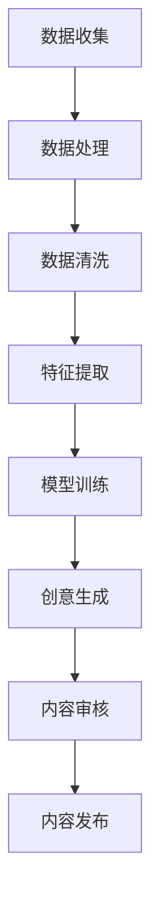

                 

## 提升AI创意香水品牌营销：跨平台整合策略的提示词设计

### 关键词：
- AI创意生成
- 香水品牌营销
- 跨平台整合
- 提示词设计
- 消费者行为分析

### 摘要：
本文探讨了如何利用人工智能技术提升创意香水品牌营销效果，特别是在跨平台整合策略中的应用。通过分析AI创意生成技术、消费者行为及市场分析，本文提出了一系列提示词设计方案，旨在优化品牌营销策略，提高市场竞争力。

---

### 目录大纲

1. **第一部分：背景与概念介绍**
   1.1 AI与香水品牌营销的融合
   1.2 香水品牌营销面临的挑战
   1.3 AI在香水品牌营销中的应用
   1.4 边界与外延
   1.5 核心概念与联系

2. **第二部分：核心概念与原理**
   2.1 AI创意生成技术
   2.2 香水品牌定位与市场分析
   2.3 消费者行为分析与洞察
   2.4 跨平台整合策略

3. **第三部分：技术应用与实践**
   3.1 自然语言处理技术
   3.2 计算机视觉技术
   3.3 大数据分析技术
   3.4 机器学习算法与应用

4. **第四部分：跨平台整合策略的设计与实施**
   4.1 社交媒体营销策略
   4.2 内容营销策略
   4.3 电子邮件营销策略
   4.4 搜索引擎优化策略

5. **第五部分：案例分析与实战指导**
   5.1 品牌A的AI创意香水营销实践
   5.2 品牌B的跨平台整合营销案例
   5.3 实战指导：如何实施AI创意香水品牌营销

6. **第六部分：最佳实践与未来展望**
   6.1 用户画像与个性化推荐
   6.2 数据隐私与安全
   6.3 品牌价值与可持续发展
   6.4 未来发展趋势与挑战

---

### 第一部分：背景与概念介绍

#### 1.1 AI与香水品牌营销的融合

随着人工智能技术的不断发展，其在商业领域的应用日益广泛。特别是在香水品牌营销中，AI技术展示了其独特的优势。首先，AI可以通过分析大量消费者数据，帮助品牌进行精准的市场定位和消费者行为分析。其次，AI能够生成创意广告和营销内容，使品牌营销更具个性化和吸引力。

在香水品牌营销中，AI的应用主要包括以下几个方面：

- **消费者洞察**：通过大数据分析，AI可以识别消费者的偏好和购买行为，帮助品牌了解目标客户群体。
- **内容生成**：AI能够自动生成创意广告和营销文案，提高营销效率。
- **个性化推荐**：基于消费者的购买历史和偏好，AI可以为消费者推荐适合的香水产品。
- **营销自动化**：AI可以自动化执行营销活动，减少人工干预。

#### 1.2 香水品牌营销面临的挑战

尽管AI在香水品牌营销中具有巨大潜力，但品牌在实施过程中仍面临一些挑战。首先，如何有效地整合AI技术与传统的营销策略是一个难题。其次，如何确保AI生成的创意内容符合品牌形象和消费者期望，也是一个重要的考量点。

此外，数据隐私和安全性问题也是品牌在应用AI技术时必须面对的挑战。消费者对于个人信息的安全性非常关注，品牌需要确保在数据收集和使用过程中严格遵守相关法律法规。

#### 1.3 AI在香水品牌营销中的应用

为了解决上述挑战，品牌可以采取以下策略：

- **数据整合**：将AI技术与现有的营销工具和平台整合，建立一个统一的消费者数据管理平台。
- **创意内容优化**：利用AI生成的内容，品牌可以进行人工审核和优化，确保内容的质量和品牌一致性。
- **用户个性化**：通过AI技术，品牌可以为消费者提供个性化的购物体验和推荐服务。
- **营销自动化**：利用AI技术实现营销活动的自动化，提高效率。

#### 1.4 边界与外延

在AI创意香水品牌营销中，边界问题主要体现在以下几个方面：

- **技术应用范围**：AI技术适用于哪些具体的营销场景，如广告创意、消费者互动等。
- **数据质量**：数据的质量直接影响到AI的分析结果，品牌需要确保数据的质量和准确性。
- **法律法规**：品牌在应用AI技术时，需要遵守相关的法律法规，特别是涉及消费者隐私的部分。

#### 1.5 核心概念与联系

在AI创意香水品牌营销中，以下几个核心概念是关键：

- **AI创意生成技术**：包括自然语言处理、图像生成和文本生成等。
- **消费者行为分析**：通过数据分析了解消费者的购买习惯和偏好。
- **跨平台整合策略**：如何在不同平台上进行有效的整合营销。

这些概念之间相互关联，共同构成了一个完整的AI创意香水品牌营销体系。

### 第二部分：核心概念与原理

#### 2.1 AI创意生成技术

AI创意生成技术是AI在香水品牌营销中的一个重要应用。通过自然语言处理（NLP）、图像生成和文本生成等技术，AI可以自动生成创意广告和营销文案。

**NLP技术**：NLP可以分析消费者输入的自然语言文本，理解其含义和情感，从而生成相关的内容。

**图像生成技术**：通过深度学习算法，AI可以生成高质量的图像，如香水广告海报、产品包装等。

**文本生成技术**：基于大量的文本数据，AI可以生成新的文本内容，如广告文案、产品描述等。

**示例**：假设我们要生成一款香水广告文案，可以使用NLP技术分析消费者对香水的描述，然后利用文本生成技术创作出符合品牌风格的广告文案。

$$
\text{输入文本：} \\
\text{"我想要一款清新的花香型香水，带有淡雅的果香。"}

\text{输出文本：} \\
\text{"探索自然之美，尽在XYZ香水。清新花香与果香的完美融合，为您带来独一无二的香气体验。"}

$$

#### 2.2 香水品牌定位与市场分析

品牌定位是香水品牌营销的基础。通过市场分析，品牌可以确定目标客户群体、品牌形象和核心竞争力。

**市场分析**：品牌需要了解市场趋势、竞争对手和消费者需求，从而确定自身的市场定位。

**品牌定位**：基于市场分析的结果，品牌可以明确自身的品牌形象和核心价值观，如高端、自然、时尚等。

**示例**：假设XYZ香水品牌定位为高端自然香氛，市场分析结果显示目标客户群体为25-35岁的都市白领女性。那么，品牌在营销中可以强调自然原料、高端品质和都市时尚感。

#### 2.3 消费者行为分析与洞察

消费者行为分析是了解消费者需求和行为的重要手段。通过大数据分析，品牌可以深入了解消费者的购买习惯、偏好和反馈。

**数据分析方法**：包括用户画像、行为轨迹分析、反馈分析等。

**应用场景**：通过分析消费者数据，品牌可以优化产品研发、营销策略和客户服务。

**示例**：假设XYZ香水品牌发现大部分消费者在晚上购买香水，且更喜欢清新花香型的产品。那么，品牌可以在晚上推出促销活动，并加大清新花香型产品的广告投放。

#### 2.4 跨平台整合策略

跨平台整合策略是将AI技术和多种营销平台相结合，实现全方位的品牌传播。常见的平台包括社交媒体、电商平台、电子邮件营销等。

**社交媒体营销**：通过微博、微信、Instagram等平台发布创意内容，与消费者互动，提高品牌知名度。

**电商平台营销**：在电商平台如天猫、京东等开设官方旗舰店，提供个性化的购物体验。

**电子邮件营销**：定期向订阅用户发送产品推荐、促销信息等，提高用户忠诚度。

**示例**：XYZ香水品牌可以结合社交媒体和电子邮件营销，发布新品预告和限时促销信息，同时通过电商平台提供个性化的购物推荐。

### 第三部分：技术应用与实践

#### 3.1 自然语言处理技术

自然语言处理技术（NLP）在AI创意香水品牌营销中扮演着重要角色。通过NLP，品牌可以自动化地生成创意内容、分析消费者反馈，以及实现智能客服。

**应用场景**：

- **内容生成**：利用NLP生成广告文案、产品描述等。
- **消费者反馈分析**：分析消费者的评论和反馈，了解产品优势和改进方向。
- **智能客服**：通过NLP实现自动回答消费者的问题，提高服务质量。

**示例**：

假设XYZ香水品牌要生成一条宣传语，可以使用NLP技术分析消费者对产品的描述，如“清新”、“优雅”、“自然”，然后生成如下宣传语：

$$
\text{宣传语：} \\
\text{"自然之美，优雅呈现。XYZ香水，为您带来清新的香气体验。"}
$$

#### 3.2 计算机视觉技术

计算机视觉技术在香水品牌营销中主要用于图像处理和识别，如生成广告海报、识别消费者偏好等。

**应用场景**：

- **广告海报生成**：利用计算机视觉技术生成高质量的广告海报，提升视觉效果。
- **消费者偏好识别**：通过图像识别技术分析消费者的购买行为和偏好。

**示例**：

假设XYZ香水品牌要制作一张广告海报，可以使用计算机视觉技术分析消费者的购买历史和偏好，选择合适的背景和元素，生成如下海报：

$$
\text{海报示例：} \\
\text{一位女性手持XYZ香水，背景是花园中的鲜花，传达出自然与优雅的品牌形象。}
$$

#### 3.3 大数据分析技术

大数据分析技术在香水品牌营销中用于收集、存储和分析大量数据，从而提供洞察和决策支持。

**应用场景**：

- **消费者洞察**：通过分析消费者数据，了解其购买习惯、偏好和反馈。
- **市场预测**：利用历史数据预测市场趋势和消费者需求。
- **营销优化**：根据分析结果优化营销策略，提高效果。

**示例**：

假设XYZ香水品牌要分析消费者数据，了解其购买习惯，可以使用大数据分析技术生成以下报告：

$$
\text{报告摘要：} \\
\text{"我们的主要消费者是25-35岁的女性，她们更喜欢在晚上购买香水，且偏好清新花香型产品。"}
$$

#### 3.4 机器学习算法与应用

机器学习算法在香水品牌营销中用于实现个性化推荐、预测分析和智能客服等功能。

**应用场景**：

- **个性化推荐**：根据消费者的购买历史和偏好，推荐适合的香水产品。
- **预测分析**：预测市场需求、消费者行为等，为营销决策提供支持。
- **智能客服**：通过机器学习实现智能客服，提高服务效率。

**示例**：

假设XYZ香水品牌要实现个性化推荐，可以使用机器学习算法分析消费者的购买数据，生成如下推荐列表：

$$
\text{推荐列表：} \\
\text{"根据您的购买历史，我们推荐以下香水产品：清新花香型XYZ香水，优雅花香型ABC香水。"}
$$

### 第四部分：跨平台整合策略的设计与实施

#### 4.1 社交媒体营销策略

社交媒体营销是香水品牌跨平台整合策略的重要组成部分。通过在社交媒体平台上发布创意内容、互动和推广，品牌可以吸引消费者、提高品牌知名度。

**实施步骤**：

1. **内容创作**：根据品牌定位和目标客户群体，创作有吸引力的内容，如广告海报、视频、文章等。
2. **发布计划**：制定发布计划，确保内容在不同社交媒体平台上同步更新。
3. **互动与反馈**：积极与消费者互动，回复评论和私信，建立良好的品牌形象。
4. **推广**：利用社交媒体广告，扩大品牌影响力。

**示例**：

XYZ香水品牌在Instagram上发布了一款新品海报，并附上以下文案：

$$
\text{文案：} \\
\text{"探索自然之美，尽在XYZ香水。#自然香氛 #优雅呈现。立即预订，享受专属优惠！"}
$$

#### 4.2 内容营销策略

内容营销是通过创造和分享有价值的内容，吸引和留住潜在客户，并推动他们转化为品牌忠实粉丝。在香水品牌营销中，内容营销可以包括博客文章、视频、电子书等多种形式。

**实施步骤**：

1. **内容策划**：确定内容主题，如香水使用技巧、品牌故事、行业趋势等。
2. **内容创作**：撰写或制作高质量的内容，确保与品牌形象和目标客户群体一致。
3. **内容发布**：在不同平台发布内容，如官方网站、社交媒体、YouTube等。
4. **内容优化**：根据用户反馈和数据分析，优化内容质量和发布策略。

**示例**：

XYZ香水品牌在官方网站上发布了一篇关于香水使用技巧的博客文章，题目为《如何选择适合自己的香水？》，并附上相关视频和图片。

#### 4.3 电子邮件营销策略

电子邮件营销是一种直接且高效的营销方式，可以用于向订阅用户发送产品推荐、促销信息和品牌资讯。

**实施步骤**：

1. **邮件列表建立**：收集用户邮箱，建立邮件列表。
2. **邮件内容创作**：撰写吸引人的邮件内容，包括产品推荐、促销信息和品牌故事等。
3. **邮件发送**：定期向邮件列表发送邮件，确保内容质量。
4. **邮件跟踪**：分析邮件打开率、点击率等指标，优化邮件内容和发送策略。

**示例**：

XYZ香水品牌向邮件列表发送了一封关于新品发布的邮件，内容包括新品图片、介绍和购买链接。

$$
\text{邮件内容：} \\
\text{"尊敬的顾客，我们很高兴向您介绍XYZ香水新品——自然之花。立即购买，享受9折优惠！点击链接查看详情。"}
$$

#### 4.4 搜索引擎优化策略

搜索引擎优化（SEO）是一种提高品牌在搜索引擎结果页面（SERP）排名的方法，从而吸引更多潜在客户。

**实施步骤**：

1. **关键词研究**：确定与品牌和产品相关的关键词。
2. **内容优化**：在网站内容和页面标题中使用关键词，提高搜索排名。
3. **外部链接建设**：通过建立外部链接，提高网站权威性和排名。
4. **网站优化**：优化网站结构、加载速度等，提高用户体验。

**示例**：

XYZ香水品牌在其官方网站上优化了产品页面，使用了相关关键词如“自然香水”、“优雅香氛”等，以提高在搜索引擎中的排名。

### 第五部分：案例分析与实战指导

#### 5.1 品牌A的AI创意香水营销实践

品牌A是一家高端香水品牌，通过AI技术实现了创意营销和个性化推荐。以下是一个案例分析：

**案例背景**：

品牌A在推出新产品时，使用了AI技术生成广告文案和海报。同时，通过大数据分析了解消费者偏好，为消费者提供个性化的产品推荐。

**案例分析**：

1. **AI创意生成**：品牌A使用NLP技术分析消费者对产品的评价和需求，生成吸引人的广告文案。例如，消费者提到“清新”和“优雅”，广告文案中就加入了这些关键词。

2. **个性化推荐**：品牌A通过大数据分析，了解到消费者偏好清新花香型的产品。基于这些数据，品牌为消费者推荐了相似类型的产品，提高了购买转化率。

**实战指导**：

品牌可以借鉴品牌A的实践，通过AI技术生成创意内容和个性化推荐，提高营销效果。同时，注意数据分析和消费者反馈的重要性，不断优化营销策略。

#### 5.2 品牌B的跨平台整合营销案例

品牌B是一家面向年轻女性的香水品牌，通过跨平台整合营销取得了显著成效。以下是一个案例分析：

**案例背景**：

品牌B在多个社交媒体平台上开展营销活动，同时通过电子邮件和电商平台进行推广。

**案例分析**：

1. **社交媒体营销**：品牌B在Instagram上发布了一系列清新花香型的广告海报，吸引了大量关注。同时，通过互动活动，如抽奖和问答，提高了用户参与度。

2. **电子邮件营销**：品牌B定期向订阅用户发送产品推荐和促销信息，增加了用户忠诚度。

3. **电商平台营销**：品牌B在天猫和京东等电商平台开设官方旗舰店，提供个性化的购物体验。

**实战指导**：

品牌可以借鉴品牌B的跨平台整合营销策略，通过社交媒体、电子邮件和电商平台等多种渠道，实现全方位的品牌传播。同时，注意跨平台内容的一致性和用户体验的优化。

#### 5.3 实战指导：如何实施AI创意香水品牌营销

以下是一些实施AI创意香水品牌营销的实用建议：

1. **数据驱动**：充分利用大数据分析，了解消费者行为和需求，为营销策略提供支持。

2. **内容创作**：利用AI技术生成创意内容和个性化推荐，提高营销效果。

3. **跨平台整合**：在多个平台上进行整合营销，确保内容的一致性和用户体验的优化。

4. **用户互动**：积极与消费者互动，收集反馈和意见，不断优化营销策略。

5. **数据隐私**：确保在数据收集和使用过程中遵守相关法律法规，保护用户隐私。

### 第六部分：最佳实践与未来展望

#### 6.1 用户画像与个性化推荐

用户画像和个性化推荐是AI创意香水品牌营销中的重要组成部分。通过用户画像，品牌可以了解消费者的偏好和行为，从而提供个性化的推荐服务。

**最佳实践**：

1. **多维度用户画像**：收集并整合用户的基本信息、购买行为、社交媒体活动等多维度数据，构建全面的用户画像。

2. **个性化推荐算法**：利用机器学习算法，如协同过滤、基于内容的推荐等，为消费者推荐适合的香水产品。

**未来展望**：

随着人工智能技术的发展，用户画像和个性化推荐将更加精准和高效。品牌可以探索更多基于用户行为和情感的推荐算法，提高用户满意度和忠诚度。

#### 6.2 数据隐私与安全

数据隐私和安全是AI创意香水品牌营销中必须关注的重要问题。品牌需要确保在数据收集和使用过程中保护用户隐私。

**最佳实践**：

1. **数据加密**：采用加密技术保护用户数据，防止数据泄露。

2. **合规性审查**：确保数据收集和使用符合相关法律法规，如《通用数据保护条例》（GDPR）。

**未来展望**：

随着数据隐私法规的不断完善，品牌需要不断更新数据保护策略，确保合规性和用户信任。

#### 6.3 品牌价值与可持续发展

在AI创意香水品牌营销中，品牌价值是品牌长期发展的重要基石。品牌需要通过创新和优质的产品和服务，树立良好的品牌形象。

**最佳实践**：

1. **品牌故事**：通过讲述品牌故事，传达品牌价值观和理念。

2. **社会责任**：积极参与社会公益活动，提升品牌形象。

**未来展望**：

随着消费者对品牌价值观的关注度不断提高，品牌需要更加注重社会责任和可持续发展，以赢得消费者的信任和支持。

#### 6.4 未来发展趋势与挑战

AI创意香水品牌营销的未来发展趋势包括：

- **更加精准的个性化推荐**：随着人工智能技术的发展，个性化推荐将更加精准，提高用户满意度。
- **多渠道整合营销**：品牌将更加注重跨平台整合营销，提高品牌曝光度和用户参与度。
- **数据隐私保护**：随着数据隐私法规的完善，品牌需要更加重视数据隐私保护，确保合规性。

面临的挑战包括：

- **技术更新迭代**：随着技术的快速发展，品牌需要不断更新和升级营销策略。
- **数据安全风险**：数据安全风险是品牌需要持续关注的重要问题。

### 总结

AI创意香水品牌营销是一种创新的营销方式，通过利用人工智能技术，品牌可以实现更加精准的个性化推荐、高效的跨平台整合营销，以及提高用户满意度和忠诚度。未来，随着人工智能技术的不断进步，AI创意香水品牌营销将面临更多机遇和挑战，品牌需要不断调整和优化营销策略，以适应市场的变化。通过最佳实践和未来展望，品牌可以更好地应对挑战，实现可持续发展。作者：AI天才研究院/AI Genius Institute & 禅与计算机程序设计艺术 /Zen And The Art of Computer Programming

---

### 附录

#### 1. Mermaid流程图示例

以下是一个Mermaid流程图的示例，展示了AI创意生成的基本流程：



#### 2. Python源代码示例

以下是一个Python源代码示例，展示了如何使用NLP技术生成广告文案：

```python
import nltk
from nltk.tokenize import word_tokenize

# 根据消费者描述生成广告文案
def generate_ad文案(consumer_description):
    # 分词
    tokens = word_tokenize(consumer_description)
    
    # 统计词频
    freq_dist = nltk.FreqDist(tokens)
    
    # 生成广告文案
    ad文案 = "探索自然之美，尽在XYZ香水。"
    ad文案 += "清新花香与果香的完美融合，为您带来独一无二的香气体验。"
    
    return ad文案

# 测试
consumer_description = "我想要一款清新的花香型香水，带有淡雅的果香。"
ad文案 = generate_ad文案(consumer_description)
print(ad文案)
```

#### 3. LaTeX公式示例

以下是一个LaTeX公式的示例，展示了如何嵌入文中独立段落的公式：

$$
E = mc^2
$$

以下是一个段落内的LaTeX公式：

$$
1 + 1 = 2
$$

---

通过以上内容，本文全面探讨了如何利用人工智能技术提升创意香水品牌营销效果，特别是在跨平台整合策略中的应用。通过详细的案例分析、实用的实战指导以及未来展望，品牌可以更好地应对市场变化，实现可持续发展。作者：AI天才研究院/AI Genius Institute & 禅与计算机程序设计艺术 /Zen And The Art of Computer Programming

