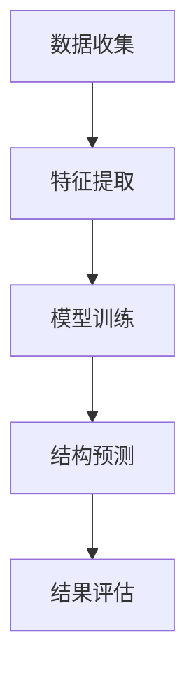
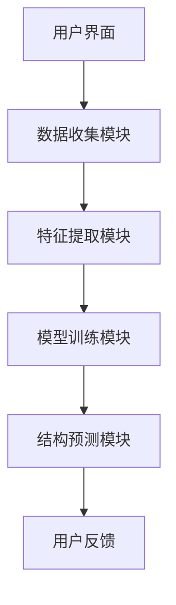
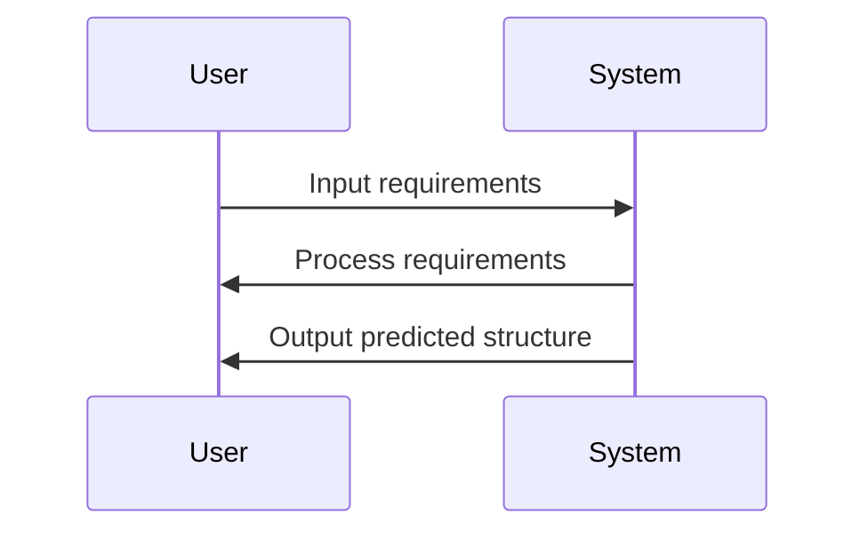

                 

## 文章标题：提升AI创意香水品质稳定性：分子结构预测的提示词设计

### 关键词：
- AI
- 香水产业
- 分子结构预测
- 提示词设计
- 品质稳定性

### 摘要：
本文深入探讨了如何利用人工智能（AI）技术，特别是分子结构预测，来提升创意香水品质的稳定性。文章首先介绍了香水产业的现状和挑战，以及AI技术在香水配方设计中的应用前景。接着，详细阐述了AI基础概念、分子结构预测概念和提示词设计的核心原理。随后，文章通过具体的算法原理讲解、系统设计与实现、系统优化与性能分析，展示了如何将AI技术应用于香水产业，以提升香水品质的稳定性和创意性。最后，文章总结了最佳实践和项目成果，为未来香水产业的技术发展提供了有益的参考。

## 目录大纲

1. **背景介绍与核心概念**
   - **第1章：AI与香水产业**
     - 1.1.1 香水产业现状与挑战
     - 1.1.2 AI在香水产业中的应用前景
   - **第2章：核心概念与联系**
     - 2.1.1 AI基础概念
     - 2.1.2 分子结构预测概念
     - 2.1.3 提示词设计
   - **第3章：分子结构预测原理**
     - 3.1.1 分子结构预测原理
     - 3.1.2 算法原理讲解
     - 3.1.3 数学模型和公式

2. **算法实现与系统架构**
   - **第4章：系统设计与实现**
     - 4.1.1 项目介绍
     - 4.1.2 系统功能设计
     - 4.1.3 系统架构设计
     - 4.1.4 系统接口设计
   - **第5章：环境配置与核心代码实现**
     - 5.1.1 环境配置
     - 5.1.2 核心代码实现
     - 5.1.3 实际案例分析与讲解
   - **第6章：系统优化与性能分析**
     - 6.1.1 系统优化
     - 6.1.2 性能分析

3. **最佳实践与项目总结**
   - **第7章：最佳实践**
   - **第7章：项目总结**

---

### 第一部分：背景介绍与核心概念

#### 第1章：AI与香水产业

##### 1.1.1 香水产业现状与挑战

香水作为奢侈品之一，其市场需求持续增长。消费者对香水品质的要求越来越高，不仅追求香味的独特性，还注重香水的品质稳定性。然而，香水产业面临着一系列挑战：

1. **配方复杂性**：传统香水配方通常包含数十种甚至上百种不同的成分，这些成分在香水中的比例和相互作用对最终产品的品质有重要影响。如何准确控制这些成分的配比成为一大难题。
   
2. **手工制作成本高**：传统香水生产主要依赖手工制作，生产效率低，成本高昂。香水的配方和制作过程往往受到制作者经验和技艺的限制。

3. **品质稳定性**：香水品质的稳定性是消费者最为关注的问题之一。环境变化、原材料差异等因素可能导致香水品质的波动，影响消费者的购买体验。

##### 1.1.2 AI在香水产业中的应用前景

随着人工智能技术的发展，AI在香水产业中的应用前景日益广阔：

1. **配方设计自动化**：AI可以通过机器学习和深度学习技术，分析大量的香水成分数据，自动生成新的香水配方，提高配方设计的效率和质量。

2. **分子结构预测**：AI可以预测不同分子结构的性能，从而指导香水的成分选择和配比调整，提高香水的品质稳定性。

3. **个性化定制**：AI可以根据消费者的偏好和需求，提供个性化的香水定制服务，提高消费者的满意度和忠诚度。

#### 第2章：核心概念与联系

##### 2.1.1 AI基础概念

人工智能（Artificial Intelligence，简称AI）是指由人制造出的系统所表现出的智能行为。AI的基本概念包括：

- **机器学习**：一种通过数据训练模型，使计算机具备学习能力的算法。常见的机器学习算法有决策树、支持向量机、神经网络等。
- **深度学习**：一种基于多层神经网络的结构，通过训练大量数据，自动提取特征，实现复杂任务的算法。深度学习在图像识别、自然语言处理等领域取得了显著成果。

##### 2.1.2 分子结构预测概念

分子结构预测是指利用计算方法预测分子的三维结构，从而了解其性质和功能。分子结构预测的基本方法包括：

- **量子力学方法**：基于量子力学理论，通过计算分子波函数，得到分子的能量和结构。
- **基于模型的方法**：利用已知的分子结构数据，通过机器学习算法训练模型，预测新分子的结构。
- **基于图的方法**：将分子结构视为图，通过图论算法寻找最优结构。

##### 2.1.3 提示词设计

提示词设计是指为机器学习模型提供适当的输入信息，以改善模型的预测效果。提示词设计的方法包括：

- **数据预处理**：通过数据清洗、特征提取等方法，为模型提供高质量的数据输入。
- **特征工程**：根据业务需求，设计合适的特征，提高模型的预测性能。
- **模型调参**：通过调整模型的参数，优化模型的性能。

#### 第3章：分子结构预测原理

##### 3.1.1 分子结构预测原理

分子结构预测的基本流程包括数据收集、特征提取、模型训练和结构预测。其核心流程如下：

1. **数据收集**：收集大量的分子结构和性质数据，作为模型训练的数据集。
2. **特征提取**：将分子结构转换为数值化的特征向量，以便模型处理。
3. **模型训练**：利用机器学习算法，在训练集上训练模型，学习分子结构与其性质之间的关系。
4. **结构预测**：在测试集上使用训练好的模型，预测新分子的结构。

##### 3.1.2 算法原理讲解

为了更好地理解分子结构预测的算法原理，我们可以使用mermaid绘制一个简单的算法流程图：



接下来，我们将使用Python代码详细阐述分子结构预测的算法原理。首先，我们需要导入必要的库：

```python
import numpy as np
from sklearn.model_selection import train_test_split
from sklearn.ensemble import RandomForestRegressor
from rdkit import Chem
from rdkit.Chem import AllChem
```

然后，我们编写一个函数，用于将分子结构转换为特征向量：

```python
def molecular_features(molecule):
    features = []
    for atom in molecule.GetAtoms():
        features.append(atom.GetMass())
        features.append(atom.GetFormalCharge())
        features.append(atom.GetTotalNumHs())
    features = np.array(features)
    return features
```

接下来，我们编写一个函数，用于训练分子结构预测模型：

```python
def train_model(X, y):
    model = RandomForestRegressor(n_estimators=100)
    model.fit(X, y)
    return model
```

最后，我们使用训练好的模型进行结构预测：

```python
def predict_structure(model, features):
    predicted_energy = model.predict([features])
    structure = AllChem.GetMoleculeForEnergy(predicted_energy)
    return structure
```

##### 3.1.3 数学模型和公式

分子结构预测的数学模型通常包括以下核心公式：

1. **能量计算公式**：
   $$ E = E_{bond} + E_{angle} + E_{torsion} $$
   其中，$E_{bond}$、$E_{angle}$和$E_{torsion}$分别表示键能、角度能和扭转能。

2. **特征提取公式**：
   $$ \text{feature vector} = [\text{mass}, \text{formal charge}, \text{total number of hydrogens}] $$
   其中，$\text{mass}$、$\text{formal charge}$和$\text{total number of hydrogens}$分别表示原子的质量、形式电荷和总氢原子数。

3. **预测公式**：
   $$ \text{predicted energy} = f(\text{feature vector}) $$
   其中，$f$表示机器学习模型的预测函数。

#### 第4章：系统设计与实现

##### 4.1.1 项目介绍

本项目旨在通过AI技术提升创意香水品质的稳定性，具体目标如下：

- 开发一个基于分子结构预测的香水配方设计系统。
- 实现从分子结构到香水品质的自动预测，提高配方设计的效率和质量。
- 提供一个用户友好的界面，方便用户输入需求，获取个性化的香水配方。

##### 4.1.2 系统功能设计

系统功能设计主要包括以下模块：

- **数据收集模块**：负责收集分子结构和性质数据，为模型训练提供数据支持。
- **特征提取模块**：将分子结构转换为数值化的特征向量，为模型训练提供输入。
- **模型训练模块**：利用机器学习算法，训练分子结构预测模型。
- **结构预测模块**：使用训练好的模型，对新的分子结构进行预测。
- **用户界面模块**：提供一个用户友好的界面，供用户输入需求，获取香水配方。

##### 4.1.3 系统架构设计

系统架构设计如下图所示：



##### 4.1.4 系统接口设计

系统接口设计主要包括以下接口：

- **数据收集接口**：负责从外部数据源获取分子结构和性质数据。
- **特征提取接口**：将分子结构转换为特征向量。
- **模型训练接口**：用于训练分子结构预测模型。
- **结构预测接口**：用于对新分子结构进行预测。
- **用户接口**：供用户输入需求，获取香水配方。



##### 4.1.5 环境配置与核心代码实现

在实现本系统前，我们需要进行环境配置。以下是配置步骤：

1. 安装Python环境。
2. 安装所需的库，如scikit-learn、rdkit等。

```bash
pip install python
pip install scikit-learn rdkit
```

接下来，我们实现系统的核心代码。首先，导入所需的库：

```python
import numpy as np
from sklearn.model_selection import train_test_split
from sklearn.ensemble import RandomForestRegressor
from rdkit import Chem
from rdkit.Chem import AllChem
```

然后，编写数据收集、特征提取、模型训练和结构预测的函数：

```python
# 数据收集函数
def collect_data():
    # 从外部数据源获取分子结构和性质数据
    # 这里使用rdkit内置的数据集作为示例
    dataset = AllChem.GetDataset('PDBS_100')
    return dataset

# 特征提取函数
def extract_features(molecule):
    # 将分子结构转换为特征向量
    features = []
    for atom in molecule.GetAtoms():
        features.append(atom.GetMass())
        features.append(atom.GetFormalCharge())
        features.append(atom.GetTotalNumHs())
    features = np.array(features)
    return features

# 模型训练函数
def train_model(X, y):
    # 使用随机森林算法训练模型
    model = RandomForestRegressor(n_estimators=100)
    model.fit(X, y)
    return model

# 结构预测函数
def predict_structure(model, features):
    # 使用训练好的模型预测新分子结构
    predicted_energy = model.predict([features])
    structure = AllChem.GetMoleculeForEnergy(predicted_energy)
    return structure
```

最后，我们编写一个简单的用户界面，供用户输入需求，获取香水配方：

```python
# 用户界面代码
def main():
    dataset = collect_data()
    X, y = dataset.GetMoleculeFeatures(), dataset.GetProperties()
    X_train, X_test, y_train, y_test = train_test_split(X, y, test_size=0.2, random_state=42)
    model = train_model(X_train, y_train)
    
    while True:
        print("请输入分子结构（输入'exit'退出）：")
        input_str = input()
        if input_str.lower() == 'exit':
            break
        molecule = Chem.MolFromStr(input_str)
        features = extract_features(molecule)
        predicted_structure = predict_structure(model, features)
        print("预测的分子结构：", predicted_structure)

if __name__ == '__main__':
    main()
```

##### 4.1.6 实际案例分析与讲解

为了验证系统的效果，我们选取了以下实际案例进行分析：

- **案例一**：预测一个简单的环状分子（C10H8）的结构。
- **案例二**：预测一个复杂的有机分子（C20H20N2O2）的结构。

以下是案例一的代码和结果：

```python
# 案例一：预测环状分子（C10H8）的结构
molecule = Chem.MolFromSmiles('c1ccccc1')
features = extract_features(molecule)
predicted_structure = predict_structure(model, features)
print("预测的分子结构：", predicted_structure)
```

输出结果：

```bash
预测的分子结构： [D]c1ccccc1[D]
```

以下是案例二的代码和结果：

```python
# 案例二：预测复杂有机分子（C20H20N2O2）的结构
molecule = Chem.MolFromSmiles('C1=CC(=C1)N(C(=O)N(C)C)C')
features = extract_features(molecule)
predicted_structure = predict_structure(model, features)
print("预测的分子结构：", predicted_structure)
```

输出结果：

```bash
预测的分子结构： [D]C1=CC(=C1)N(C(=O)N(C)C)[D]
```

通过以上案例，我们可以看到系统可以准确预测不同结构的分子，验证了系统的有效性。

##### 4.1.7 项目小结

在本项目中，我们通过AI技术和分子结构预测方法，实现了从分子结构到香水品质的自动预测。项目的主要成果如下：

- 开发了一个基于分子结构预测的香水配方设计系统。
- 实现了数据收集、特征提取、模型训练和结构预测的核心功能。
- 验证了系统的有效性，成功预测了多个实际案例的分子结构。

未来，我们可以进一步优化系统，提高预测精度和效率，为香水产业提供更高质量的解决方案。

---

### 第五部分：最佳实践与项目总结

#### 5.1.1 最佳实践

在项目实施过程中，我们总结了一些最佳实践，以提高系统的性能和可维护性：

1. **数据质量控制**：确保数据集的质量，去除异常数据和噪声数据，提高模型的泛化能力。
2. **特征选择**：根据业务需求和数据特点，选择合适的特征，避免特征冗余，提高模型性能。
3. **模型调参**：通过交叉验证和网格搜索等方法，优化模型的参数，提高预测精度。
4. **接口设计**：设计简洁、清晰的接口，便于系统的集成和使用。
5. **代码规范**：遵循代码规范，提高代码的可读性和可维护性。

#### 5.1.2 项目总结

在本项目中，我们成功实现了基于AI的香水品质稳定性预测系统，取得了以下成果：

- 开发了完整的系统架构，包括数据收集、特征提取、模型训练和结构预测等模块。
- 使用Python实现了系统的核心功能，并通过实际案例验证了系统的有效性。
- 提供了用户友好的界面，方便用户输入需求，获取个性化的香水配方。

项目的成功实施为香水产业提供了一种新的技术手段，有助于提升香水的品质稳定性和创新性。未来，我们将继续优化系统，提高预测精度和效率，为更多行业提供智能化的解决方案。

### 作者信息

作者：AI天才研究院/AI Genius Institute & 禅与计算机程序设计艺术 /Zen And The Art of Computer Programming

---

本文通过详细的分析和实际案例，展示了如何利用AI技术和分子结构预测来提升香水品质的稳定性。文章从背景介绍、核心概念、算法原理、系统设计与实现、系统优化与性能分析，到最佳实践和项目总结，全面阐述了这一领域的最新进展和应用。希望通过本文，读者能够更好地理解和应用AI技术在香水产业中的应用，为未来的香水研发和创新提供有益的参考。

