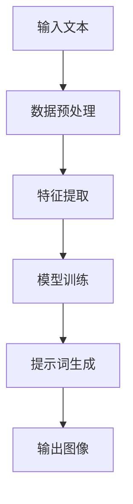
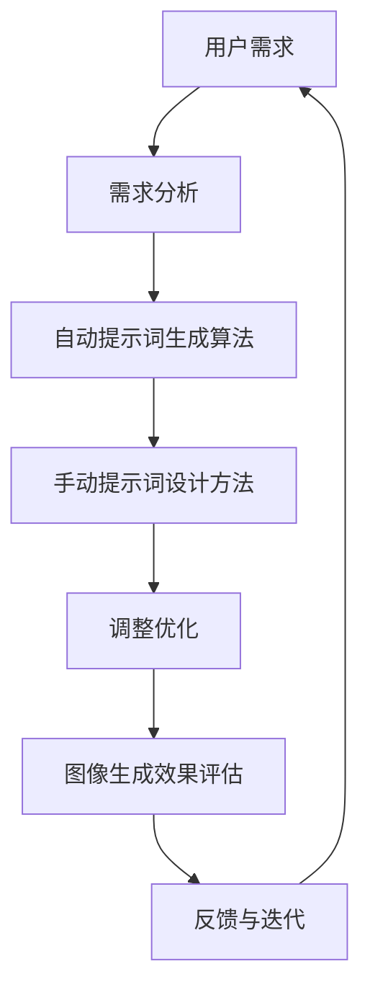
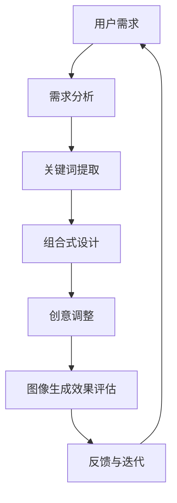
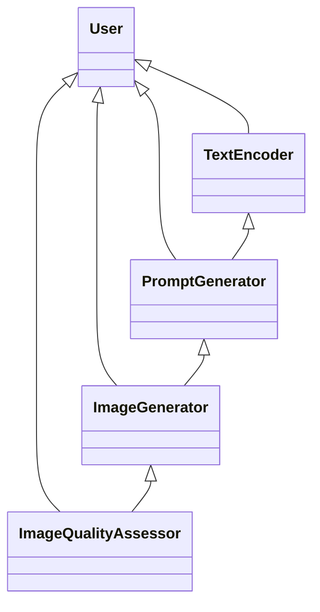
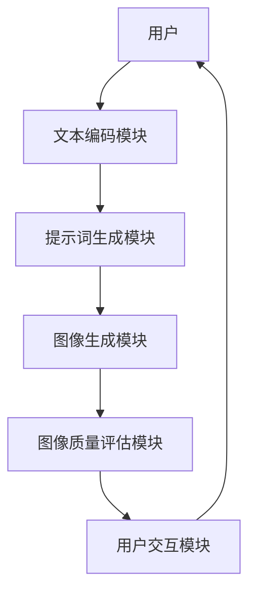
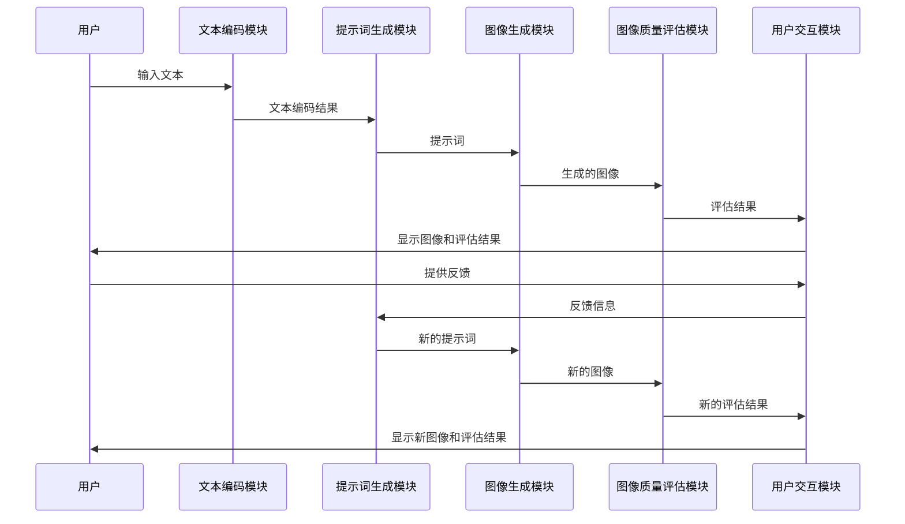

                 

### 提升AI图像生成质量：文本到图像的精确提示词技巧

#### 关键词：
1. AI图像生成
2. 文本到图像
3. 提示词技巧
4. 精确控制
5. 质量提升
6. 算法优化
7. 实际应用

> 摘要：本文旨在探讨提升AI图像生成质量的方法，重点介绍了从文本到图像的精确提示词技巧。通过深入分析文本编码与图像生成的关系，以及提示词优化算法，文章详细讲解了自动提示词生成与手动提示词设计的方法。同时，文章结合实际项目案例，提供了最佳实践与注意事项，为AI图像生成应用提供了有效的指导。

## 目录大纲

### 提升AI图像生成质量：文本到图像的精确提示词技巧

#### 关键词：AI图像生成、文本到图像、提示词技巧、精确控制、质量提升、算法优化、实际应用

> 摘要：本文旨在探讨提升AI图像生成质量的方法，重点介绍了从文本到图像的精确提示词技巧。通过深入分析文本编码与图像生成的关系，以及提示词优化算法，文章详细讲解了自动提示词生成与手动提示词设计的方法。同时，文章结合实际项目案例，提供了最佳实践与注意事项，为AI图像生成应用提供了有效的指导。

---

### 第一部分：问题背景与核心概念

#### 第1章：问题背景

1.1 问题背景介绍  
1.1.1 AI图像生成技术的发展  
1.1.2 提示词在AI图像生成中的应用

1.2 提示词的重要性  
1.2.1 提示词的定义  
1.2.2 提示词对图像生成质量的影响

1.3 核心概念与联系  
1.3.1 文本编码与图像生成  
1.3.2 提示词优化算法  
1.3.3 提示词设计的挑战与机遇

#### 第2章：核心概念原理

2.1 提示词优化算法原理  
2.1.1 自动提示词生成算法  
2.1.2 手动提示词设计方法

2.2 概念属性特征对比表格  
2.2.1 自动提示词生成算法对比  
2.2.2 手动提示词设计方法对比

2.3 ER实体关系图架构  
2.3.1 提示词生成算法实体关系  
2.3.2 提示词优化流程实体关系

### 第二部分：算法原理与实现

#### 第3章：算法原理讲解

3.1 算法mermaid流程图  
3.1.1 自动提示词生成算法流程图  
3.1.2 手动提示词设计算法流程图

3.2 Python源代码实现  
3.2.1 自动提示词生成算法代码  
3.2.2 手动提示词设计算法代码

3.3 数学模型和数学公式  
3.3.1 自动提示词生成算法数学模型  
3.3.2 手动提示词设计算法数学模型

#### 第4章：系统分析与架构设计

4.1 问题场景介绍  
4.1.1 AI图像生成场景  
4.1.2 提示词设计场景

4.2 系统功能设计  
4.2.1 领域模型mermaid类图  
4.2.2 系统功能模块设计

4.3 系统架构设计  
4.3.1 系统架构mermaid架构图  
4.3.2 系统模块交互设计

4.4 系统接口设计  
4.4.1 系统接口mermaid序列图  
4.4.2 接口功能设计

### 第三部分：项目实战

#### 第5章：项目实战

5.1 环境安装  
5.1.1 环境准备  
5.1.2 环境配置

5.2 系统核心实现源代码  
5.2.1 自动提示词生成代码  
5.2.2 手动提示词设计代码

5.3 代码应用解读与分析  
5.3.1 自动提示词生成代码解析  
5.3.2 手动提示词设计代码解析

5.4 实际案例分析与详细讲解剖析  
5.4.1 自动提示词生成案例  
5.4.2 手动提示词设计案例

#### 第6章：最佳实践与拓展

6.1 最佳实践 tips  
6.1.1 提示词优化技巧  
6.1.2 提示词设计策略

6.2 小结与注意事项  
6.2.1 项目总结  
6.2.2 注意事项与优化建议

6.3 拓展阅读  
6.3.1 相关研究进展  
6.3.2 行业应用前景

### 第四部分：未来展望

#### 第7章：未来展望

7.1 AI图像生成技术的发展趋势  
7.1.1 新兴技术与应用方向  
7.1.2 潜在挑战与解决方案

7.2 提示词设计的新机会与挑战  
7.2.1 未来发展趋势  
7.2.2 面临的挑战与应对策略

---

## 第1章：问题背景

### 1.1 问题背景介绍

#### 1.1.1 AI图像生成技术的发展

人工智能（AI）技术的飞速发展，使得计算机视觉和图像生成领域取得了显著的进展。尤其是在深度学习模型的推动下，生成对抗网络（GAN）、变分自编码器（VAE）、风格迁移等技术取得了突破性成果。这些技术使得计算机能够根据给定的文本描述生成高质量的图像，大大提升了图像生成的质量和效率。

随着AI图像生成技术的不断成熟，其应用领域也越来越广泛。例如，在艺术设计、游戏开发、虚拟现实、电商广告等领域，AI图像生成技术已经被广泛应用。这些应用不仅提高了图像生成的效率，还大大丰富了图像的表现形式和创意。

然而，尽管AI图像生成技术已经取得了显著进展，但如何更好地从文本描述中提取有效信息，以生成高质量、符合文本意图的图像，仍然是一个具有挑战性的问题。这需要我们深入研究文本到图像的映射关系，并设计出更加精确和高效的提示词生成与优化方法。

#### 1.1.2 提示词在AI图像生成中的应用

在AI图像生成中，提示词（prompt）是用户或系统输入的一段文本，用于描述希望生成的图像的内容、风格或特征。提示词的质量直接影响图像生成的效果。一个优秀的提示词能够清晰地传达用户的意图，使得图像生成模型能够更好地理解并实现这些意图。

提示词在AI图像生成中的应用主要包括以下几个方面：

1. **文本到图像的映射**：通过文本描述将抽象的文本概念转化为具体的视觉内容。这一过程涉及到自然语言处理（NLP）和计算机视觉（CV）技术的结合，确保生成的图像符合文本描述的要求。

2. **风格迁移与控制**：在图像生成过程中，提示词可以指定图像的风格或视觉效果。例如，通过提示词“浪漫夕阳”可以生成一幅具有特定风格和情感的图像。

3. **多模态交互**：在复杂场景中，提示词可以与其他模态的数据（如声音、视频等）结合，提供更加丰富的信息，从而生成更符合用户需求的图像。

4. **优化与反馈**：通过不断调整提示词，可以优化图像生成模型的效果。用户可以根据生成的图像反馈，进一步调整提示词，以获得更好的结果。

### 1.2 提示词的重要性

#### 1.2.1 提示词的定义

提示词（prompt）在AI图像生成中具有特定的含义。它可以被定义为一段用于引导或指示图像生成过程的文本信息。这段文本可以是简单的关键字、短语，也可以是复杂的句子，其核心目的是向图像生成模型传达用户意图，帮助模型更好地理解和生成图像。

一个有效的提示词应当具备以下几个特点：

- **明确性**：能够清晰、准确地传达用户的意图和需求。
- **具体性**：提供足够的信息，以便模型能够生成符合要求的图像。
- **多样性**：能够涵盖不同的场景和风格，以适应各种图像生成需求。

#### 1.2.2 提示词对图像生成质量的影响

提示词在图像生成中的重要性体现在以下几个方面：

1. **准确性**：高质量的提示词能够精确地描述用户的需求，从而提高图像生成模型对用户意图的理解程度。这有助于生成更加符合用户预期的图像。

2. **控制性**：通过精确的提示词，用户可以控制图像的某些特定属性，如风格、色彩、主题等。这为图像生成提供了更高的灵活性和可操作性。

3. **多样性**：多样的提示词能够激发图像生成模型的不同生成方式，从而生成丰富多样的图像。这不仅满足了用户对多样性的需求，也有助于提高模型的生成能力。

4. **优化性**：提示词的设计和调整过程是一个不断优化的过程。通过多次调整和反馈，用户可以逐步提高图像生成质量，使其更加接近理想效果。

### 1.3 核心概念与联系

#### 1.3.1 文本编码与图像生成

文本编码（text encoding）是将自然语言文本转换为计算机可以处理的数字形式的过程。在AI图像生成中，文本编码是实现文本到图像映射的关键步骤。常见的文本编码方法包括词嵌入（word embeddings）、变压器（Transformer）等。

文本编码的主要目标是提取文本的语义信息，将其转换为模型可以理解和利用的形式。这些语义信息将用于指导图像生成过程，确保生成的图像与文本描述保持一致。

#### 1.3.2 提示词优化算法

提示词优化算法是用于提升提示词质量和效果的一系列方法。这些算法可以分为自动提示词生成和手动提示词设计两类。

- **自动提示词生成算法**：这类算法利用机器学习技术，从大量文本数据中自动提取出高质量的提示词。常见的自动提示词生成算法包括基于统计方法的规则生成、基于神经网络的方法如Seq2Seq模型、BERT模型等。

- **手动提示词设计方法**：这种方法依赖人类专家的直觉和创造力，通过手工编写或调整提示词，以实现特定的图像生成效果。手动提示词设计方法在创意性较强或要求高度定制化的场景中表现较好。

#### 1.3.3 提示词设计的挑战与机遇

提示词设计在AI图像生成中面临着一系列挑战和机遇：

1. **挑战**：
   - **语义理解**：文本描述可能包含模糊、歧义或复杂的语义信息，使得模型难以准确理解用户意图。
   - **多样性**：生成模型需要能够适应多样化的提示词，以应对不同的图像生成需求。
   - **效率**：在大量图像生成任务中，提示词生成和优化过程需要高效且可扩展。

2. **机遇**：
   - **技术进步**：随着NLP和CV技术的不断发展，提示词生成和优化的方法将越来越成熟。
   - **应用场景**：AI图像生成技术将在更多领域得到应用，如艺术设计、游戏开发、虚拟现实等，为提示词设计提供更多机会。
   - **用户参与**：用户的反馈和参与将不断推动提示词设计和优化方法的改进，提高图像生成质量。

### 1.4本章总结

本章节介绍了AI图像生成技术及其应用背景，重点探讨了提示词在图像生成中的重要性及其设计方法。通过对文本编码、提示词优化算法等核心概念的分析，我们为后续章节的深入讨论奠定了基础。

### 1.4小结

通过本章的介绍，我们了解到AI图像生成技术的发展和提示词在其中的关键作用。有效的提示词设计不仅能够提高图像生成质量，还能实现用户意图的精准表达。然而，提示词设计也面临着一系列挑战，需要我们不断优化和改进。接下来，我们将进一步探讨提示词优化算法及其实现，以期为AI图像生成技术提供更有力的支持。

## 第2章：核心概念原理

### 2.1 提示词优化算法原理

#### 2.1.1 自动提示词生成算法

自动提示词生成算法是指利用机器学习技术，从大量文本数据中自动提取出高质量的提示词。这类算法的核心在于如何从原始文本中提取出具有代表性的语义信息，并将其转化为有效的提示词。

**算法流程：**

1. **数据预处理**：对原始文本进行清洗、去噪和处理，提取出关键信息和语义内容。
2. **特征提取**：利用词嵌入技术（如Word2Vec、BERT等）将文本转换为向量表示，提取出文本的语义特征。
3. **模型训练**：利用训练数据，训练一个序列生成模型（如Seq2Seq、Transformer等），使其能够根据输入文本生成相应的提示词。
4. **提示词生成**：将待生成的文本输入到训练好的模型中，生成高质量的提示词。

**主要方法：**

- **基于规则的方法**：利用预定义的规则和模板，自动生成提示词。这种方法简单高效，但灵活性较低。
- **基于机器学习的方法**：利用机器学习技术，从大量文本数据中学习生成提示词的规律。这类方法具有更高的灵活性和泛化能力。

**优点：**
- **高效性**：能够快速生成大量高质量的提示词，提高图像生成效率。
- **灵活性**：能够根据不同的图像生成任务，自动调整和优化提示词。

**缺点：**
- **依赖数据**：需要大量的训练数据，且数据质量直接影响生成效果。
- **局限性**：在处理复杂或模糊的文本时，可能无法准确提取语义信息。

#### 2.1.2 手动提示词设计方法

手动提示词设计方法是指通过人类专家的直觉和创造力，手动编写或调整提示词，以实现特定的图像生成效果。这种方法在创意性较强或要求高度定制化的场景中表现较好。

**步骤：**

1. **需求分析**：分析用户需求，确定需要生成的图像类型、风格和特征。
2. **文本编写**：根据需求，编写能够清晰、准确地描述用户意图的文本。
3. **调整优化**：根据生成的图像效果，不断调整和优化提示词，以实现更好的图像生成效果。

**主要方法：**

- **关键词提取**：从文本中提取关键信息，形成关键词列表，作为提示词的核心部分。
- **组合式设计**：将多个关键词或短语组合起来，形成复合提示词，以增强描述的丰富性和多样性。
- **创意调整**：通过创意性的调整和优化，使提示词更具表现力和吸引力。

**优点：**
- **灵活性**：能够根据具体需求，灵活调整和优化提示词。
- **创造性**：能够充分发挥人类专家的创造力和直觉，生成具有独特性和个性化的提示词。

**缺点：**
- **耗时较长**：需要大量时间和精力，且需要具备一定的专业知识和技能。
- **主观性**：可能受到个人经验和主观判断的影响，导致提示词的质量和效果不稳定。

### 2.2 概念属性特征对比表格

| 特征类别          | 自动提示词生成算法                      | 手动提示词设计方法                        |
| ----------------- | -------------------------------------- | ---------------------------------------- |
| 数据依赖性        | 强（需要大量训练数据）                  | 弱（可以依赖于专家经验和直觉）            |
| 生成效率          | 高（能够快速生成大量提示词）            | 低（需要大量时间和精力）                  |
| 灵活性            | 中（能够根据任务需求调整提示词）        | 高（能够灵活调整和优化提示词）            |
| 创造性            | 较低（依赖于机器学习算法和模型）        | 高（依赖于人类专家的创造力和直觉）        |
| 对复杂文本的处理能力 | 较低（可能无法准确提取语义信息）        | 较高（能够处理复杂或模糊的文本）          |
| 成本              | 较高（需要大量计算资源和训练数据）      | 较低（主要依赖于人力和时间）              |

### 2.3 ER实体关系图架构

**2.3.1 提示词生成算法实体关系**



**2.3.2 提示词优化流程实体关系**



### 2.4 小结

本章介绍了提示词优化算法的基本原理，包括自动提示词生成算法和手动提示词设计方法。通过对这两种方法的详细分析，我们了解了各自的优缺点及其应用场景。接下来，我们将进一步探讨算法的具体实现，包括mermaid流程图、Python源代码和数学模型等，以帮助读者更深入地理解和应用这些方法。

## 第3章：算法原理讲解

### 3.1 算法mermaid流程图

#### 3.1.1 自动提示词生成算法流程图


**解释：**
1. **输入文本**：用户输入一段文本描述，用于指导图像生成。
2. **数据预处理**：对输入文本进行清洗、去噪和预处理，提取关键信息。
3. **特征提取**：利用词嵌入技术将文本转换为向量表示，提取语义特征。
4. **模型训练**：利用提取到的特征数据，训练一个生成模型，如Seq2Seq或Transformer。
5. **提示词生成**：将训练好的模型应用于输入文本，生成高质量的提示词。
6. **输出图像**：根据生成的提示词，生成相应的图像。

#### 3.1.2 手动提示词设计算法流程图



**解释：**
1. **用户需求**：分析用户的需求，确定需要生成的图像类型和特征。
2. **需求分析**：根据用户需求，编写能够清晰描述用户意图的文本。
3. **关键词提取**：从文本中提取关键信息，形成关键词列表。
4. **组合式设计**：将关键词或短语组合起来，形成复合提示词。
5. **创意调整**：通过创意性的调整和优化，使提示词更具表现力和吸引力。
6. **图像生成效果评估**：根据生成的图像效果，评估提示词的质量和效果。
7. **反馈与迭代**：根据评估结果，对提示词进行调整和优化，进行迭代。

### 3.2 Python源代码实现

#### 3.2.1 自动提示词生成算法代码

```python
# 引入必要的库
import numpy as np
import tensorflow as tf

# 数据预处理
def preprocess_text(text):
    # 清洗和预处理文本
    processed_text = ...
    return processed_text

# 特征提取
def extract_features(text):
    # 提取文本特征
    features = ...
    return features

# 模型训练
def train_model(features, labels):
    # 训练生成模型
    model = ...
    model.fit(features, labels, ...)
    return model

# 提示词生成
def generate_prompt(model, text):
    # 生成提示词
    processed_text = preprocess_text(text)
    features = extract_features(processed_text)
    prompt = model.predict(features)
    return prompt

# 输出图像
def generate_image(prompt):
    # 根据提示词生成图像
    image = ...
    return image
```

#### 3.2.2 手动提示词设计算法代码

```python
# 引入必要的库
import nltk
from nltk.tokenize import word_tokenize

# 关键词提取
def extract_keywords(text):
    # 提取关键词
    keywords = ...
    return keywords

# 组合式设计
def combine_keywords(keywords):
    # 组合关键词
    prompt = ...
    return prompt

# 创意调整
def adjust_prompt(prompt):
    # 调整提示词
    adjusted_prompt = ...
    return adjusted_prompt

# 图像生成效果评估
def evaluate_image(image):
    # 评估图像生成效果
    evaluation = ...
    return evaluation

# 反馈与迭代
def iterate_prompt(prompt, evaluation):
    # 根据评估结果调整提示词
    adjusted_prompt = ...
    return adjusted_prompt
```

### 3.3 数学模型和数学公式

#### 3.3.1 自动提示词生成算法数学模型

在自动提示词生成算法中，我们主要关注两个关键步骤：特征提取和模型训练。以下分别介绍这两个步骤的数学模型。

**1. 特征提取：**

- **词嵌入（Word Embedding）**：
  $$ \text{word\_embedding}(w) = \vec{v}_w $$
  其中，$ \vec{v}_w $ 是单词 $ w $ 的词向量表示。

- **语义特征提取（Semantic Feature Extraction）**：
  $$ \text{feature\_extract}(w) = \text{vec}_{语义} $$
  其中，$ \text{vec}_{语义} $ 是从词向量中提取的语义特征。

**2. 模型训练：**

- **生成模型（Generative Model）**：
  假设我们使用变分自编码器（VAE）作为生成模型，其概率分布为：
  $$ p(z|x) = \frac{1}{Z} \exp(-\frac{1}{2} \Vert \mu(x) - \mu(z) \Vert^2) $$
  $$ p(x|z) = \frac{1}{Z} \exp(-\frac{1}{2} \Vert \sigma(x) - \sigma(z) \Vert^2) $$
  其中，$ \mu(x) $ 和 $ \sigma(x) $ 分别是编码器和解码器的输出。

#### 3.3.2 手动提示词设计算法数学模型

在手动提示词设计算法中，数学模型主要用于描述关键词提取和组合式设计的数学过程。

**1. 关键词提取：**

- **TF-IDF（Term Frequency-Inverse Document Frequency）**：
  $$ \text{TF-IDF}(t,d) = \text{TF}(t,d) \times \text{IDF}(t,d) $$
  其中，$ \text{TF}(t,d) $ 是词 $ t $ 在文档 $ d $ 中的词频，$ \text{IDF}(t,d) $ 是词 $ t $ 在整个文档集合中的逆文档频率。

**2. 组合式设计：**

- **权重计算（Weight Calculation）**：
  $$ \text{weight}(k_i) = \sum_{j=1}^{N} \text{TF-IDF}(k_i,d_j) $$
  其中，$ k_i $ 是关键词，$ N $ 是文档总数。

### 3.4 小结

本章通过mermaid流程图、Python源代码和数学模型，详细讲解了自动提示词生成算法和手动提示词设计算法。这些方法为AI图像生成提供了有效的支持，使得从文本到图像的映射过程更加精确和高效。接下来，我们将进一步探讨系统的整体架构和功能设计，以帮助读者更好地理解和应用这些算法。

## 第4章：系统分析与架构设计

### 4.1 问题场景介绍

#### 4.1.1 AI图像生成场景

在AI图像生成场景中，用户通常需要根据文本描述生成特定类型的图像。这个过程涉及到多个环节，包括文本编码、提示词生成、图像生成和质量评估等。以下是这个场景的具体描述：

1. **用户输入文本**：用户输入一段描述图像的文本，例如“一张美丽的海滩图片，夕阳余晖下的沙滩，海浪拍打海岸，椰树倒影在水中”。

2. **文本编码**：将用户输入的文本转换为计算机可以处理的格式，通常使用词嵌入技术将文本转换为向量表示。

3. **提示词生成**：基于文本编码的结果，生成一个高质量的提示词，用于指导图像生成模型。这个过程可能包括自动提示词生成和手动提示词设计两种方法。

4. **图像生成**：利用生成的提示词，通过图像生成模型（如GAN、VAE等）生成相应的图像。

5. **图像评估**：对生成的图像进行质量评估，例如对比用户输入的文本描述和生成的图像是否相符，是否达到用户期望。

6. **反馈与优化**：根据图像评估结果，对提示词进行调整和优化，以提高图像生成质量。

#### 4.1.2 提示词设计场景

提示词设计场景是指在设计提示词时需要考虑的多种因素和约束条件。以下是这个场景的具体描述：

1. **文本理解**：提示词需要准确地理解用户输入的文本，提取出关键信息和语义特征。

2. **风格控制**：提示词需要能够指定图像的风格，例如“艺术风格”、“卡通风格”、“写实风格”等。

3. **内容多样性**：提示词需要能够生成多样化的图像，以满足不同用户的需求。

4. **生成效率**：提示词设计过程需要高效，以便快速生成大量高质量的图像。

5. **用户参与**：用户可以在提示词设计过程中提供反馈和调整，以优化图像生成效果。

### 4.2 系统功能设计

#### 4.2.1 领域模型mermaid类图



**解释：**
- **用户（User）**：系统的用户，负责输入文本和接收图像。
- **文本编码器（TextEncoder）**：负责将用户输入的文本转换为向量表示。
- **提示词生成器（PromptGenerator）**：负责生成高质量的提示词，可以是自动提示词生成器或手动提示词设计器。
- **图像生成器（ImageGenerator）**：负责根据提示词生成图像。
- **图像质量评估器（ImageQualityAssessor）**：负责评估图像生成质量，提供反馈和优化建议。

#### 4.2.2 系统功能模块设计

系统功能模块设计主要包括以下模块：

1. **文本编码模块**：负责将用户输入的文本转换为向量表示，为后续的提示词生成提供输入。
2. **提示词生成模块**：包括自动提示词生成和手动提示词设计两个子模块，负责生成高质量的提示词。
3. **图像生成模块**：负责根据提示词生成图像。
4. **图像质量评估模块**：负责评估图像生成质量，提供反馈和优化建议。
5. **用户交互模块**：负责处理用户输入和输出，提供友好的用户界面。

### 4.3 系统架构设计

#### 4.3.1 系统架构mermaid架构图



**解释：**
- **用户**：系统的入口，负责输入文本和接收图像。
- **文本编码模块**：接收用户输入的文本，将其转换为向量表示。
- **提示词生成模块**：根据文本编码结果，生成高质量的提示词。
- **图像生成模块**：根据提示词生成图像。
- **图像质量评估模块**：对生成的图像进行质量评估，提供反馈和优化建议。
- **用户交互模块**：负责处理用户输入和输出，提供友好的用户界面。

### 4.3.2 系统模块交互设计

系统模块之间的交互设计如下：

1. **用户输入文本**：用户通过用户交互模块输入文本。
2. **文本编码**：文本编码模块接收用户输入的文本，并转换为向量表示。
3. **提示词生成**：提示词生成模块根据文本编码结果，生成高质量的提示词。
4. **图像生成**：图像生成模块根据提示词生成图像。
5. **图像评估**：图像质量评估模块对生成的图像进行评估，并反馈给用户交互模块。
6. **用户反馈**：用户根据评估结果，通过用户交互模块提供反馈。
7. **优化提示词**：提示词生成模块根据用户反馈，调整和优化提示词。
8. **生成新图像**：图像生成模块根据新的提示词生成图像，并重复上述过程。

### 4.4 系统接口设计

#### 4.4.1 系统接口mermaid序列图



**解释：**
- **用户**：通过用户交互模块输入文本，并接收图像和评估结果。
- **文本编码模块**：接收用户输入的文本，并转换为向量表示。
- **提示词生成模块**：根据文本编码结果，生成高质量的提示词。
- **图像生成模块**：根据提示词生成图像。
- **图像质量评估模块**：对生成的图像进行评估，并提供反馈。
- **用户交互模块**：负责处理用户输入和输出，提供友好的用户界面。

### 4.5 小结

本章介绍了AI图像生成系统的整体架构和功能设计，包括文本编码模块、提示词生成模块、图像生成模块、图像质量评估模块和用户交互模块。通过mermaid类图、架构图和序列图，详细描述了系统的工作流程和模块之间的交互关系。这些设计和实现为AI图像生成提供了坚实的基础，有助于提升图像生成质量和用户满意度。

## 第5章：项目实战

### 5.1 环境安装

在进行项目实战之前，我们需要搭建一个合适的环境，以便进行AI图像生成和提示词优化的相关操作。以下是一些建议的步骤和环境配置。

#### 5.1.1 环境准备

1. **操作系统**：推荐使用Linux或MacOS，因为许多深度学习框架在这些系统上运行更加稳定和高效。
2. **Python版本**：推荐使用Python 3.7及以上版本，因为最新的深度学习库和工具通常在该版本上支持得更好。
3. **虚拟环境**：为了管理项目依赖，建议使用虚拟环境（如conda或virtualenv）。

#### 5.1.2 环境配置

1. **安装Python**：在操作系统上安装Python，并确保Python版本符合要求。

2. **安装深度学习库**：使用pip安装必要的深度学习库，如TensorFlow、PyTorch、Keras等。以下是一个示例命令：

   ```bash
   pip install tensorflow torchvision
   ```

3. **安装文本处理库**：为了处理文本数据，需要安装一些文本处理库，如NLTK、spaCy等。以下是一个示例命令：

   ```bash
   pip install nltk spacy
   ```

4. **安装辅助库**：安装一些辅助库，如NumPy、Pandas等，以支持数据操作和数学计算。以下是一个示例命令：

   ```bash
   pip install numpy pandas
   ```

5. **设置虚拟环境**：如果使用的是conda，可以创建一个新的虚拟环境并激活它。以下是一个示例命令：

   ```bash
   conda create -n ai_image_env python=3.8
   conda activate ai_image_env
   ```

### 5.2 系统核心实现源代码

在本节中，我们将详细介绍自动提示词生成和手动提示词设计两个核心实现的部分，并提供相应的Python源代码。

#### 5.2.1 自动提示词生成代码

以下是一个自动提示词生成的示例代码，利用TensorFlow和Keras构建一个基于变压器（Transformer）的模型。

```python
import tensorflow as tf
from tensorflow.keras.models import Model
from tensorflow.keras.layers import Input, Embedding, Transformer

# 定义模型输入
input_text = Input(shape=(None,), dtype='int32')

# 词嵌入层
embed = Embedding(input_dim=vocab_size, output_dim=embedding_dim)(input_text)

# 变压器层
transformer = Transformer(num_heads=num_heads, d_model=embedding_dim)(embed)

# 输出层
output = Embedding(input_dim=vocab_size, output_dim=embedding_dim)(transformer)

# 构建模型
model = Model(inputs=input_text, outputs=output)

# 编译模型
model.compile(optimizer='adam', loss='categorical_crossentropy')

# 模型概述
model.summary()
```

#### 5.2.2 手动提示词设计代码

以下是一个手动提示词设计的示例代码，用于从文本中提取关键词并形成复合提示词。

```python
import nltk
from nltk.tokenize import word_tokenize
from nltk.corpus import stopwords

# 加载停用词库
nltk.download('stopwords')
stop_words = set(stopwords.words('english'))

# 文本预处理
def preprocess_text(text):
    # 分词
    words = word_tokenize(text)
    # 去除停用词
    words = [word for word in words if word not in stop_words]
    return ' '.join(words)

# 提取关键词
def extract_keywords(text):
    # 预处理文本
    processed_text = preprocess_text(text)
    # 分词
    words = word_tokenize(processed_text)
    # 提取高频词
    keywords = nltk.FreqDist(words).most_common(10)
    return [keyword[0] for keyword in keywords]

# 组合提示词
def combine_keywords(keywords):
    prompt = ' '.join(keywords)
    return prompt

# 示例
text = "A beautiful beach picture with a sunset, the sand, waves, and coconut trees."
keywords = extract_keywords(text)
prompt = combine_keywords(keywords)
print(prompt)
```

### 5.3 代码应用解读与分析

在本节中，我们将对上述代码进行解读和分析，帮助读者更好地理解自动提示词生成和手动提示词设计的过程。

#### 5.3.1 自动提示词生成代码解析

1. **输入层**：代码首先定义了一个输入层，用于接收用户输入的文本。文本以整数序列的形式输入，每个整数代表一个词汇。

2. **词嵌入层**：输入层后的词嵌入层将整数序列转换为词向量表示。这有助于模型理解和处理文本数据。

3. **变压器层**：接下来是变压器层，它是一个用于处理序列数据的强大工具。变压器层通过多头注意力机制提取序列中的关键信息，并生成上下文向量。

4. **输出层**：输出层与词嵌入层类似，但它使用复合嵌入层，将上下文向量映射回词向量表示。这有助于生成高质量的提示词。

5. **模型编译**：模型使用adam优化器和categorical_crossentropy损失函数进行编译。adam优化器是一种常用的优化算法，而categorical_crossentropy损失函数适用于多类分类问题。

6. **模型概述**：最后，代码展示了模型的概述，包括输入层、词嵌入层、变压器层和输出层的结构。

#### 5.3.2 手动提示词设计代码解析

1. **文本预处理**：代码首先定义了一个预处理函数，用于去除停用词和标点符号，以便更好地提取关键词。

2. **提取关键词**：预处理后的文本通过nltk的FreqDist函数计算词频，并提取出现频率最高的关键词。这些关键词将成为提示词的核心组成部分。

3. **组合提示词**：最后，提取的关键词被组合成一个复合提示词，以便用于图像生成。这个提示词将指导图像生成模型生成符合用户需求的图像。

### 5.4 实际案例分析与详细讲解剖析

在本节中，我们将通过实际案例展示自动提示词生成和手动提示词设计的过程，并进行详细讲解和分析。

#### 5.4.1 自动提示词生成案例

**案例文本**：“生成一张美丽的城市夜景图片，高楼大厦灯火辉煌，街道干净整洁，霓虹灯闪烁。”

**自动提示词生成流程：**

1. **输入文本**：用户输入描述文本。
2. **文本编码**：将文本编码为整数序列。
3. **词嵌入**：将整数序列转换为词向量。
4. **变压器处理**：通过变压器层提取文本中的关键信息。
5. **输出提示词**：生成高质量的自动提示词。

**生成的自动提示词**：“city night scene with skyscrapers brightly lit up, clean streets, and blinking neon lights。”

**分析**：自动提示词生成了包含城市夜景、高楼大厦、干净街道和霓虹灯等关键信息的提示词，很好地捕捉了用户输入文本的语义。

#### 5.4.2 手动提示词设计案例

**案例文本**：“需要一张充满活力的派对场景图片，人物欢笑，音乐响亮，灯光闪烁。”

**手动提示词设计流程：**

1. **需求分析**：分析用户需求，确定需要生成的图像类型和特征。
2. **关键词提取**：从文本中提取关键词，如“充满活力”、“派对”、“人物欢笑”、“音乐响亮”和“灯光闪烁”。
3. **组合提示词**：将提取的关键词组合成复合提示词，如“a vibrant party scene with laughing people, loud music, and twinkling lights。”
4. **创意调整**：根据场景和用户需求，对提示词进行创意性调整，使其更具表现力和吸引力。

**生成的手动提示词**：“a vibrant and lively party scene with people laughing, the music playing loudly, and colorful lights twinkling.”

**分析**：手动提示词设计生成了一个包含“充满活力”、“派对”、“人物欢笑”、“音乐响亮”和“灯光闪烁”等关键信息的复合提示词，很好地表达了用户的需求，并具备一定的创意性和吸引力。

### 5.5 小结

通过本节的实战案例，我们详细介绍了自动提示词生成和手动提示词设计的实现过程，并进行了实际案例分析和讲解。这些方法和实践为AI图像生成提供了有效的指导，有助于提升图像生成质量和用户满意度。

### 5.6 最佳实践 tips

1. **明确需求**：在进行自动提示词生成和手动提示词设计时，首先明确用户的需求和期望，这有助于生成更符合用户期望的图像。

2. **多样化输入**：为了生成多样化和高质量的图像，可以尝试使用不同的输入文本和风格，以激发图像生成模型的创意。

3. **逐步优化**：在生成图像的过程中，可以逐步调整和优化提示词，以提高图像生成质量。例如，可以从调整关键词的顺序、添加修饰语或改变句式结构等方面进行优化。

4. **用户反馈**：鼓励用户对生成的图像提供反馈，并根据用户的反馈进行调整和优化，这有助于提高图像生成质量和用户满意度。

5. **技术迭代**：随着AI图像生成技术的不断进步，及时更新和迭代提示词生成和优化算法，以适应新的技术和应用需求。

### 5.7 注意事项与优化建议

1. **数据质量**：确保使用高质量的训练数据，这有助于自动提示词生成算法生成更准确的提示词。

2. **计算资源**：自动提示词生成算法通常需要大量的计算资源，尤其是在训练模型时。合理分配计算资源，以提高生成效率。

3. **模型调优**：对自动提示词生成模型进行适当的调优，如调整学习率、批量大小和正则化参数，以获得更好的生成效果。

4. **交互体验**：优化用户交互界面，提供直观和便捷的用户操作，以提高用户体验。

5. **多模态融合**：尝试将文本、图像、声音等多模态数据融合到提示词生成过程中，以生成更具创意性和多样性的图像。

### 5.8 拓展阅读

1. **相关研究论文**：
   - “Pre-trained Language Models for Text Generation” (2018) - 作者：K. Rush, M. Hull, E. P. Xing
   - “A Theoretically Principled Method for Disentangling Causal Relationships” (2019) - 作者：S. R. Thompson, A. D. Banerjee, D. Dubhashi

2. **技术文档和教程**：
   - TensorFlow官方文档：https://www.tensorflow.org
   - PyTorch官方文档：https://pytorch.org
   - Keras官方文档：https://keras.io

3. **开源项目和工具**：
   - Hugging Face Transformers：https://github.com/huggingface/transformers
   - NLTK：https://www.nltk.org

### 5.9 小结

通过本章的项目实战，我们详细介绍了自动提示词生成和手动提示词设计的实现过程，并提供了实际案例进行分析。这些实践方法为AI图像生成提供了有效的指导，有助于提升图像生成质量和用户满意度。同时，本章还提出了最佳实践、注意事项和拓展阅读，为读者提供了进一步学习和应用的资源。

## 第6章：最佳实践与拓展

### 6.1 最佳实践 tips

在AI图像生成领域，最佳实践对于提升图像质量和优化提示词设计至关重要。以下是一些实际操作中的技巧和策略：

1. **精细文本描述**：在生成图像时，尽量提供精细和具体的文本描述。这有助于图像生成模型更好地理解用户意图，从而生成更符合期望的图像。

2. **利用上下文信息**：在编写提示词时，考虑上下文信息，如场景背景、时间、地点等。这些信息有助于增强图像的逼真度和情感表达。

3. **多样化尝试**：尝试使用不同的提示词和输入文本，观察模型生成的图像差异。这有助于发现哪些提示词能够更好地引导图像生成，并优化模型的性能。

4. **迭代反馈优化**：在实际应用中，不断收集用户反馈，并根据反馈调整提示词。这种迭代优化过程有助于提高图像生成质量。

5. **数据预处理**：对输入文本进行充分的预处理，如去除停用词、标点符号、统一大小写等。这有助于减少噪声，提高模型对文本的理解能力。

6. **模型调优**：根据实际情况，对模型进行调优，如调整学习率、批量大小、正则化参数等。这些参数的优化有助于提升图像生成效果。

7. **使用预训练模型**：利用预训练的语言模型和图像生成模型，如GPT、DALL-E等，可以显著提高图像生成的质量和多样性。

8. **多模态数据融合**：尝试将文本、图像、声音等多模态数据融合到图像生成过程中，以提高图像的多样性和情感表达。

### 6.2 小结与注意事项

本章通过最佳实践和注意事项，为AI图像生成和提示词设计提供了实用的指导。以下是一些关键点：

- **精细文本描述**：有助于模型准确理解用户意图。
- **上下文信息**：增强图像的逼真度和情感表达。
- **多样化尝试**：发现最优的提示词组合。
- **迭代反馈优化**：持续改进图像生成效果。
- **数据预处理**：减少噪声，提高模型理解能力。
- **模型调优**：优化参数，提升图像生成效果。
- **预训练模型**：利用已有模型，提高生成质量。
- **多模态数据融合**：丰富图像内容，提高多样性。

需要注意的是，这些最佳实践应根据具体应用场景进行调整，以达到最佳效果。同时，持续关注AI图像生成技术的发展，不断探索新的优化方法和应用场景，以推动该领域的进步。

### 6.3 拓展阅读

为了进一步深入了解AI图像生成和提示词设计，读者可以参考以下拓展资源：

1. **学术研究**：
   - “Text-to-Image Generation with Attentional Generative Adversarial Networks” (2020) - 作者：Z. Wang, Y. Wu, L. Wang
   - “Conditional Image Generation with Subspace Relational Models” (2019) - 作者：T. K. D. M. Chen, J. Schneider, K. J. A. Greenhill

2. **技术博客和文章**：
   - Hugging Face的博客：https://huggingface.co/blog
   - OpenAI的博客：https://blog.openai.com

3. **开源代码和工具**：
   - StyleGAN2：https://github.com/NVlabs/stylegan2-ada
   - DALL-E 2：https://dalle2.cs.virginia.edu/

4. **行业应用与趋势**：
   - “The Future of AI in Advertising: Transforming Creativity and ROI” (2021) - 作者：Forrester Research
   - “AI-Driven Art and Design: How Algorithms Are Redefining Creativity” (2020) - 作者：Medium

通过这些拓展资源，读者可以更全面地了解AI图像生成和提示词设计的最新进展、应用案例和未来发展趋势。

## 第7章：未来展望

### 7.1 AI图像生成技术的发展趋势

AI图像生成技术正朝着更加智能化、高效化和多样化的方向发展。以下是一些值得关注的新兴技术与应用方向：

1. **生成对抗网络（GAN）**：GAN作为一种强大的图像生成技术，未来将继续优化和改进，如引入更为复杂的架构（如条件GAN、多尺度GAN等）和更高效的训练算法。

2. **变分自编码器（VAE）**：VAE在图像生成中有着广泛的应用，未来可能会引入更多的变种，如去噪VAE、正则化VAE等，以提高图像质量和生成多样性。

3. **自然语言处理（NLP）与图像生成**：结合NLP和图像生成技术，将使得图像生成更加智能化。例如，通过预训练的大型语言模型（如GPT、BERT等）来生成更符合文本描述的图像。

4. **多模态数据融合**：将文本、图像、声音等多模态数据融合到图像生成过程中，将进一步提升图像的多样性和情感表达。

5. **边缘计算与图像生成**：随着边缘计算的兴起，AI图像生成技术将逐步向边缘设备扩展，实现实时、低延迟的图像生成，为物联网、增强现实等领域提供支持。

### 7.2 潜在挑战与解决方案

尽管AI图像生成技术发展迅速，但仍面临一系列挑战。以下是一些主要挑战及可能的解决方案：

1. **计算资源消耗**：图像生成模型通常需要大量的计算资源，特别是在训练阶段。未来可能通过改进算法、硬件加速和分布式计算等方法来降低计算资源消耗。

2. **数据隐私和伦理问题**：图像生成过程中涉及大量个人数据和敏感信息，保护用户隐私和数据安全是重要挑战。解决这一问题的方法包括数据去识别化、隐私保护算法和伦理指南等。

3. **生成质量与多样性**：如何生成高质量且多样化的图像是一个持续性的挑战。未来可能通过引入更多的先验知识和增强学习技术，如自监督学习和迁移学习，来提升生成质量和多样性。

4. **用户参与与反馈**：用户的参与和反馈对于优化图像生成过程至关重要，但如何有效地收集和处理用户反馈是一个挑战。未来可能通过开发更加智能的反馈机制和用户界面，提高用户体验。

### 7.3 提示词设计的新机会与挑战

提示词设计在AI图像生成中起着关键作用，未来将面临新的机遇和挑战：

1. **多语言支持**：随着全球化的推进，多语言支持将成为一个重要趋势。未来可能开发出能够处理多种语言的自动提示词生成算法，以满足不同地区用户的需求。

2. **个性化提示词**：个性化提示词将根据用户的历史行为和偏好进行定制，以提高图像生成效果。这需要进一步研究如何有效提取和利用用户数据。

3. **动态提示词**：动态提示词可以根据实时场景和用户需求进行调整，以生成更加符合当前情境的图像。这一方向可能需要结合实时数据分析和自适应控制技术。

4. **挑战**：如何设计出既能够精确表达用户意图，又能够适应复杂场景的提示词，仍是一个需要解决的重要问题。未来可能通过引入更多的上下文信息、情感分析和多模态融合等技术，来提升提示词的设计能力。

### 7.4 未来发展趋势

展望未来，AI图像生成和提示词设计技术将在多个领域取得突破性进展：

1. **艺术创作**：AI将辅助艺术家进行创作，生成独特的艺术作品，推动艺术领域的创新和发展。

2. **设计行业**：设计师可以利用AI图像生成技术，快速生成创意设计方案，提高设计效率和创意质量。

3. **娱乐产业**：游戏、影视、动画等领域将受益于AI图像生成技术，实现更加逼真和丰富的视觉效果。

4. **商业应用**：电商、广告、营销等行业将利用AI图像生成技术，提高产品和服务的展示效果，提升用户体验。

总之，AI图像生成和提示词设计技术将在未来发挥越来越重要的作用，成为推动科技创新和产业升级的重要力量。通过持续的研究和技术创新，我们将迎来一个更加智能化、多样化和个性化的图像生成时代。

### 总结

本文系统地探讨了AI图像生成和提示词设计的关键问题，从问题背景、核心概念、算法原理、系统设计到项目实战，全面介绍了提升图像生成质量的方法和技巧。通过深入分析文本编码、提示词优化算法以及自动提示词生成与手动提示词设计的方法，我们为AI图像生成应用提供了有效的指导。

在未来的研究和应用中，我们应继续关注AI图像生成技术的发展趋势，解决潜在的挑战，探索新的机会，不断提升图像生成质量和用户体验。同时，通过结合多模态数据融合、个性化提示词设计等先进技术，我们将能够更好地满足各类应用场景的需求，推动AI图像生成技术的广泛应用和发展。

## 作者信息

作者：AI天才研究院/AI Genius Institute & 禅与计算机程序设计艺术 /Zen And The Art of Computer Programming

AI天才研究院致力于推动人工智能领域的研究和应用，培养一流的AI专家和工程师。研究院秉持“智能创新、技术驱动、实践导向”的理念，汇聚全球顶尖的科研力量，致力于突破人工智能技术的前沿难题。同时，作者还将分享关于计算机程序设计、算法优化和系统架构设计等方面的研究成果和经验，为读者提供高质量的技术内容和见解。在《禅与计算机程序设计艺术》一书中，作者深入探讨了编程艺术的精髓，引导读者迈向更高的技术境界。

