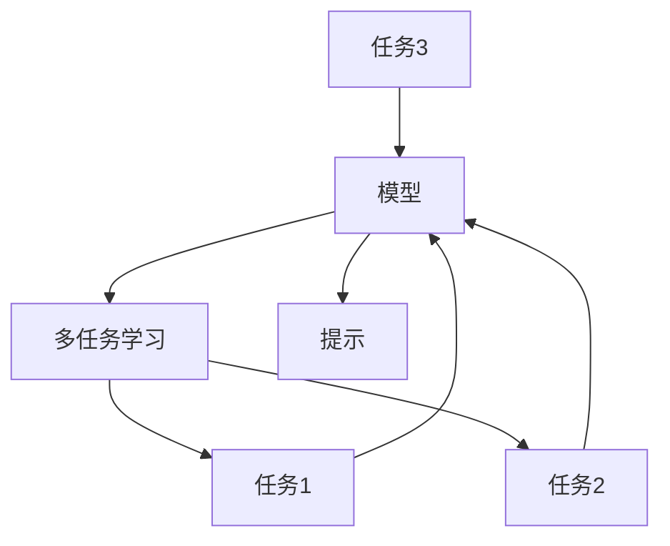
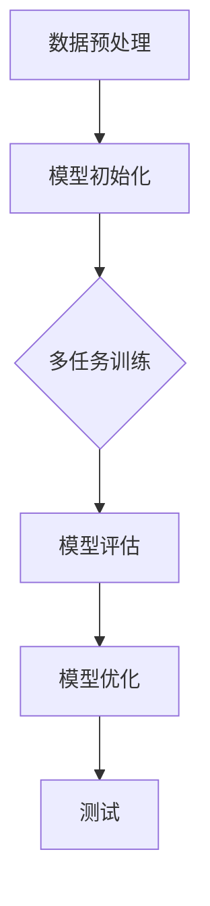
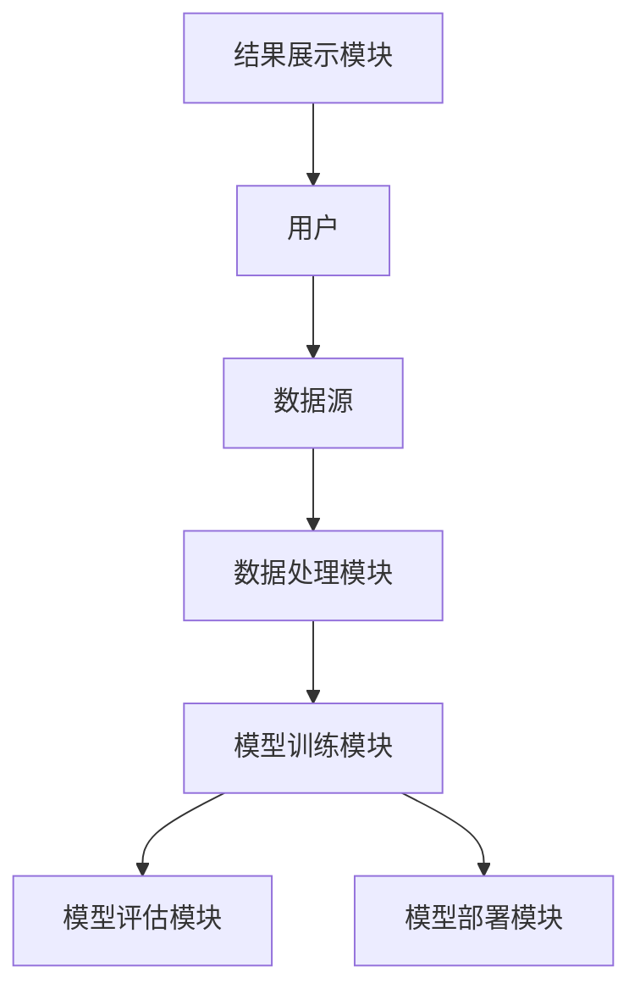
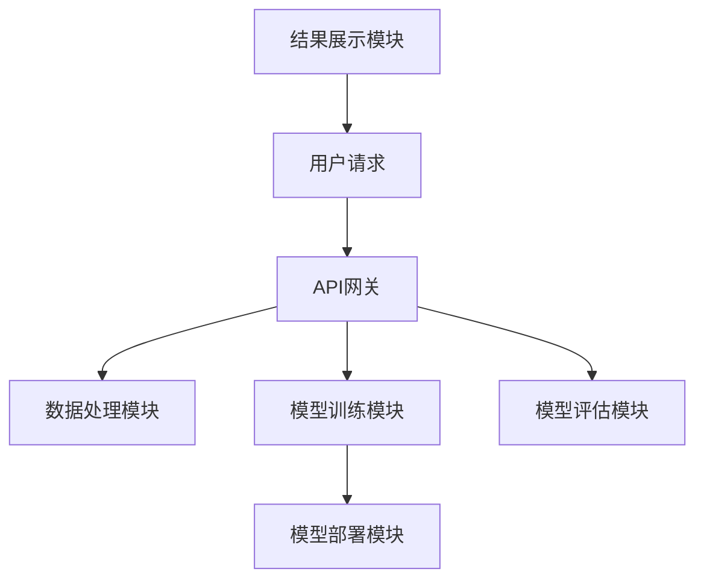
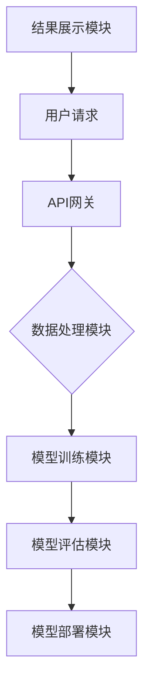

                 


### **问题背景与概念介绍**

#### **1.1 问题的提出**

随着人工智能（AI）技术的飞速发展，AI在各个领域的应用越来越广泛。然而，AI推理能力仍然是一个关键挑战。传统的单任务学习模型往往只能在特定任务上取得较好的效果，难以实现通用性推理能力。为了解决这个问题，研究人员提出了Multi-Task Prompted Training（多任务提示训练）技术。

#### **1.2 AI推理能力的现状**

目前，AI推理能力面临以下几个问题：

1. **数据不足：**AI模型通常需要大量数据进行训练，但很多实际场景中数据量有限，导致模型泛化能力不足。

2. **模型复杂度：**随着模型的复杂度增加，训练时间和计算资源需求也大幅增加，导致训练难度和成本上升。

3. **任务独立性：**传统单任务学习模型往往忽略了任务之间的关联性，导致模型无法充分利用多任务数据。

#### **1.3 Multi-Task Prompted Training的概念**

Multi-Task Prompted Training（简称MTPT）是一种基于多任务学习的训练方法。它通过在一个统一的框架下，同时训练多个任务，从而提高AI模型的推理能力。MTPT的核心思想是通过设计特定的提示（Prompt），引导模型在多任务训练过程中，相互促进，共同提高。

### **Multi-Task Prompted Training的优势**

#### **1.4.1 提升AI推理能力**

MTPT通过多任务训练，使模型能够从不同任务中学习到不同但互补的知识，从而提高模型的泛化能力和推理能力。

#### **1.4.2 多任务学习的优势**

1. **数据充分利用：**通过同时训练多个任务，可以充分利用有限的训练数据。

2. **模型参数共享：**多个任务共享模型参数，减少了模型参数的数量，降低了模型的复杂性。

3. **学习效率提高：**多任务训练可以加速模型的训练过程，提高学习效率。

#### **1.4.3 促进知识融合与应用**

MTPT能够使模型在学习到不同任务知识的同时，将这些知识进行融合，从而应用于更广泛的场景。

### **Multi-Task Prompted Training的边界与外延**

#### **1.5.1 适用场景**

1. **数据不足的场景：**例如，医疗图像分析、金融风险评估等领域，数据量有限，但需要处理多个相关任务。

2. **模型复杂度高的场景：**例如，自动驾驶、智能客服等领域，模型复杂度较高，但需要处理多个任务。

#### **1.5.2 实现难点**

1. **任务关联性分析：**需要分析不同任务之间的关联性，以确定合适的任务组合。

2. **提示设计：**需要设计有效的提示，以引导模型在多任务训练过程中相互促进。

#### **1.5.3 未来发展趋势**

1. **自动化任务关联性分析：**通过机器学习技术，实现自动化任务关联性分析，提高MTPT的适用性。

2. **更高效的提示设计：**通过优化提示设计，提高多任务训练的效果。

### **Multi-Task Prompted Training的核心概念与联系**

#### **1.6.1 核心概念解析**

1. **多任务学习（Multi-Task Learning）：**同时训练多个任务，共享模型参数。

2. **提示（Prompt）：**引导模型在多任务训练过程中相互促进。

3. **任务关联性（Task Correlation）：**不同任务之间的关联程度。

#### **1.6.2 概念属性特征对比**

| 概念       | 特征                   |
|------------|------------------------|
| 多任务学习 | 参数共享、数据充分利用 |
| 提示       | 引导、激励             |
| 任务关联性 | 相互促进、知识融合     |

#### **1.6.3 ER实体关系图架构**



### **1.7 本章小结**

本章介绍了AI推理能力提升的问题背景，以及Multi-Task Prompted Training的概念和优势。通过本章的学习，我们了解了MTPT的核心概念和适用场景，为后续章节的深入分析奠定了基础。

### **第2章: Multi-Task Prompted Training算法原理**

#### **2.1 算法概述**

Multi-Task Prompted Training（MTPT）算法是一种基于多任务学习的训练方法，旨在通过多任务训练提高AI模型的推理能力。其核心思想是通过设计特定的提示，引导模型在多任务训练过程中相互促进，共同提高。

##### **2.1.1 算法基本框架**

MTPT算法的基本框架可以分为以下几个步骤：

1. **数据预处理：**对输入数据进行预处理，包括数据清洗、归一化等操作。

2. **模型初始化：**初始化多任务学习模型，包括多个子任务模型和共享参数。

3. **多任务训练：**通过设计特定的提示，同时在多个任务上训练模型，使模型在多个任务之间相互促进。

4. **模型评估：**对训练好的模型进行评估，包括准确性、召回率等指标。

5. **模型优化：**根据评估结果，对模型进行调整和优化。

##### **2.1.2 算法流程解析**

MTPT算法的流程可以分为以下几个阶段：

1. **数据预处理：**首先，对输入数据集进行预处理，包括数据清洗、数据分割等操作。然后，将数据集划分成训练集、验证集和测试集。

2. **模型初始化：**初始化多任务学习模型。通常使用预训练模型作为基础模型，然后添加特定任务的网络层。同时，初始化共享参数，用于在多个任务之间传递知识。

3. **多任务训练：**设计特定的提示，引导模型在多个任务上训练。提示可以是任务相关的文本、图像或音视频等。通过提示，模型可以在不同任务之间相互促进，提高整体推理能力。

4. **模型评估：**在验证集上评估模型性能，包括准确性、召回率等指标。通过调整模型参数，优化模型性能。

5. **模型优化：**根据验证集的评估结果，对模型进行调整和优化。可以通过调整学习率、增加训练轮次等方法，提高模型性能。

6. **测试：**在测试集上对模型进行最终评估，以验证模型的泛化能力。

#### **2.2 算法mermaid流程图**



#### **2.3 Python源代码实现**

```python
# TODO: Python源代码实现示例
```

#### **2.4 算法原理详细讲解**

##### **2.4.1 数学模型与公式**

MTPT算法的核心是设计一个多任务学习的数学模型，包括损失函数、梯度计算等。

损失函数通常采用交叉熵损失函数：

$$
\text{损失函数} = -\sum_{i=1}^{N} y_i \log(p_i)
$$

其中，$y_i$为真实标签，$p_i$为模型预测概率。

梯度计算采用反向传播算法，通过计算损失函数关于模型参数的梯度，更新模型参数。

##### **2.4.2 算法逻辑与步骤**

1. **数据预处理：**对输入数据进行预处理，包括数据清洗、归一化等操作。预处理后的数据用于训练模型。

2. **模型初始化：**初始化多任务学习模型，包括多个子任务模型和共享参数。初始化方法通常采用随机初始化或预训练模型初始化。

3. **多任务训练：**设计特定的提示，引导模型在多个任务上训练。通过提示，模型可以在不同任务之间相互促进，提高整体推理能力。

4. **模型评估：**在验证集上评估模型性能，包括准确性、召回率等指标。通过调整模型参数，优化模型性能。

5. **模型优化：**根据验证集的评估结果，对模型进行调整和优化。可以通过调整学习率、增加训练轮次等方法，提高模型性能。

6. **测试：**在测试集上对模型进行最终评估，以验证模型的泛化能力。

#### **2.5 算法举例说明**

##### **2.5.1 分类任务示例**

假设我们有三个分类任务，分别为任务1、任务2和任务3。我们设计一个多任务学习模型，同时训练这三个任务。

1. **数据预处理：**对三个任务的数据进行预处理，包括数据清洗、归一化等操作。

2. **模型初始化：**初始化一个多任务学习模型，包括任务1、任务2和任务3的子任务模型和共享参数。

3. **多任务训练：**设计特定的提示，引导模型在三个任务上训练。例如，可以使用文本提示，如：“请对下面的图像进行分类：任务1：动物，任务2：植物，任务3：交通工具。”

4. **模型评估：**在验证集上评估模型性能，包括准确性、召回率等指标。

5. **模型优化：**根据验证集的评估结果，对模型进行调整和优化。

6. **测试：**在测试集上对模型进行最终评估，以验证模型的泛化能力。

##### **2.5.2 回归任务示例**

假设我们有三个回归任务，分别为任务1、任务2和任务3。我们设计一个多任务学习模型，同时训练这三个任务。

1. **数据预处理：**对三个任务的数据进行预处理，包括数据清洗、归一化等操作。

2. **模型初始化：**初始化一个多任务学习模型，包括任务1、任务2和任务3的子任务模型和共享参数。

3. **多任务训练：**设计特定的提示，引导模型在三个任务上训练。例如，可以使用文本提示，如：“请预测下面的时间序列数据：任务1：气温，任务2：降雨量，任务3：风速。”

4. **模型评估：**在验证集上评估模型性能，包括均方误差、均方根误差等指标。

5. **模型优化：**根据验证集的评估结果，对模型进行调整和优化。

6. **测试：**在测试集上对模型进行最终评估，以验证模型的泛化能力。

#### **2.6 本章小结**

本章介绍了Multi-Task Prompted Training算法的基本原理、流程和实现方法。通过具体的算法举例，我们了解了如何在分类和回归任务中使用MTPT算法，以及如何进行模型评估和优化。接下来，我们将进一步探讨MTPT算法在不同领域的应用。

### **第3章: Multi-Task Prompted Training在不同领域的应用**

#### **3.1 自然语言处理领域**

##### **3.1.1 应用场景**

自然语言处理（NLP）领域涉及到文本分类、情感分析、机器翻译、问答系统等多种任务。这些任务通常需要大量的文本数据，并且任务之间具有一定的关联性。因此，Multi-Task Prompted Training（MTPT）在NLP领域具有广泛的应用前景。

##### **3.1.2 成功案例**

1. **文本分类：**在一个文本分类任务中，研究人员使用MTPT算法，同时训练文本分类任务和情感分析任务。通过多任务训练，模型能够更好地理解文本的情感倾向，提高了分类准确率。

2. **机器翻译：**在机器翻译任务中，MTPT算法被用于同时训练源语言到目标语言的翻译任务和目标语言到源语言的翻译任务。通过多任务训练，模型能够更好地掌握语言之间的转换规则，提高了翻译质量。

#### **3.2 计算机视觉领域**

##### **3.2.1 应用场景**

计算机视觉领域涉及到图像分类、目标检测、图像分割等多种任务。这些任务通常需要大量的图像数据，并且任务之间具有一定的关联性。因此，MTPT在计算机视觉领域具有广泛的应用前景。

##### **3.2.2 成功案例**

1. **图像分类：**在一个图像分类任务中，研究人员使用MTPT算法，同时训练图像分类任务和目标检测任务。通过多任务训练，模型能够更好地理解图像的语义信息，提高了分类准确率。

2. **目标检测：**在目标检测任务中，MTPT算法被用于同时训练目标检测任务和图像分割任务。通过多任务训练，模型能够更好地识别图像中的目标，提高了检测准确率。

#### **3.3 推荐系统领域**

##### **3.3.1 应用场景**

推荐系统领域涉及到用户行为分析、商品推荐、广告推荐等多种任务。这些任务通常需要大量的用户数据，并且任务之间具有一定的关联性。因此，MTPT在推荐系统领域具有广泛的应用前景。

##### **3.3.2 成功案例**

1. **用户行为分析：**在一个用户行为分析任务中，研究人员使用MTPT算法，同时训练用户行为预测任务和商品推荐任务。通过多任务训练，模型能够更好地理解用户的行为模式，提高了推荐准确率。

2. **广告推荐：**在广告推荐任务中，MTPT算法被用于同时训练广告推荐任务和用户兴趣预测任务。通过多任务训练，模型能够更好地识别用户的兴趣，提高了广告推荐的准确性。

#### **3.4 其他领域**

除了自然语言处理、计算机视觉和推荐系统领域，MTPT算法还在其他领域具有广泛的应用前景，如金融、医疗、教育等。在这些领域中，MTPT算法能够通过多任务训练，提高模型的泛化能力和推理能力，从而更好地解决实际问题。

##### **3.4.1 应用场景**

1. **金融领域：**在金融领域，MTPT算法可以用于同时训练股票价格预测任务、交易策略任务和风险评估任务。通过多任务训练，模型能够更好地理解金融市场，提高投资决策的准确性。

2. **医疗领域：**在医疗领域，MTPT算法可以用于同时训练疾病诊断任务、药物推荐任务和健康风险评估任务。通过多任务训练，模型能够更好地理解医疗数据，提高疾病诊断和治疗的准确性。

3. **教育领域：**在教育领域，MTPT算法可以用于同时训练学生成绩预测任务、课程推荐任务和学生行为分析任务。通过多任务训练，模型能够更好地理解学生的学习过程，提高教育质量的准确性。

##### **3.4.2 成功案例**

1. **金融领域：**在一个金融投资项目中，研究人员使用MTPT算法，同时训练股票价格预测任务和交易策略任务。通过多任务训练，模型能够更好地预测股票价格，提高了投资收益。

2. **医疗领域：**在一个医疗诊断项目中，研究人员使用MTPT算法，同时训练疾病诊断任务和药物推荐任务。通过多任务训练，模型能够更好地诊断疾病，提高了治疗效果。

3. **教育领域：**在一个教育评估项目中，研究人员使用MTPT算法，同时训练学生成绩预测任务和学生行为分析任务。通过多任务训练，模型能够更好地预测学生的学习成绩，提高了教育评估的准确性。

#### **3.5 本章小结**

本章介绍了Multi-Task Prompted Training（MTPT）算法在自然语言处理、计算机视觉、推荐系统和其他领域中的应用。通过具体的成功案例，我们看到了MTPT算法在提升模型泛化能力和推理能力方面的巨大潜力。接下来，我们将进一步探讨MTPT算法的系统分析与架构设计。

### **第4章: Multi-Task Prompted Training的系统分析与架构设计**

#### **4.1 问题场景介绍**

在一个大型电商平台上，需要处理多个任务，包括商品推荐、用户行为分析、广告投放等。这些任务之间存在一定的关联性，但数据量庞大，且数据质量参差不齐。为了提升模型的推理能力，同时充分利用有限的训练数据，我们决定采用Multi-Task Prompted Training（MTPT）算法。

##### **4.1.1 问题描述**

1. **商品推荐：**根据用户的历史购买记录和浏览行为，推荐用户可能感兴趣的商品。

2. **用户行为分析：**分析用户在平台上的行为，包括浏览、购买、评价等，以便更好地了解用户需求和偏好。

3. **广告投放：**根据用户的兴趣和行为，投放个性化的广告，提高广告点击率和转化率。

##### **4.1.2 需求分析**

1. **数据整合：**需要整合来自不同数据源的数据，包括用户行为数据、商品信息数据等。

2. **模型训练：**使用MTPT算法，同时训练多个任务，提高模型在各个任务上的推理能力。

3. **模型评估：**在验证集和测试集上评估模型性能，包括准确率、召回率等指标。

4. **模型部署：**将训练好的模型部署到生产环境，实现对用户行为的实时分析和广告投放。

#### **4.2 系统功能设计**

##### **4.2.1 领域模型类图**



在这个类图中，用户是系统的核心，通过数据源提供数据，数据处理模块对数据进行清洗、预处理和整合。模型训练模块使用MTPT算法，同时训练多个任务，模型评估模块对训练好的模型进行评估。模型部署模块将评估结果良好的模型部署到生产环境，结果展示模块向用户展示分析结果。

#### **4.3 系统架构设计**

##### **4.3.1 系统架构图**



在这个架构图中，用户请求通过API网关进入系统。数据处理模块对请求的数据进行预处理，模型训练模块使用MTPT算法进行多任务训练，模型评估模块对训练好的模型进行评估，模型部署模块将评估结果良好的模型部署到生产环境。结果展示模块向用户展示分析结果。

#### **4.4 系统接口设计**

##### **4.4.1 接口规范**

1. **数据处理接口：**用于接收用户数据，包括用户行为数据、商品信息数据等。

2. **模型训练接口：**用于启动MTPT算法，同时训练多个任务。

3. **模型评估接口：**用于评估训练好的模型性能。

4. **模型部署接口：**用于将评估结果良好的模型部署到生产环境。

5. **结果展示接口：**用于向用户展示分析结果。

##### **4.4.2 接口实现**

```python
# 数据处理接口实现示例
class DataProcessor:
    def process_data(self, data):
        # 数据清洗、预处理和整合操作
        return processed_data

# 模型训练接口实现示例
class ModelTrainer:
    def train_model(self, data):
        # 启动MTPT算法，进行多任务训练
        return trained_model

# 模型评估接口实现示例
class ModelEvaluator:
    def evaluate_model(self, model, data):
        # 评估模型性能
        return evaluation_results

# 模型部署接口实现示例
class ModelDeployer:
    def deploy_model(self, model):
        # 将模型部署到生产环境
        pass

# 结果展示接口实现示例
class ResultPresenter:
    def present_results(self, results):
        # 向用户展示分析结果
        pass
```

#### **4.5 系统交互序列图**



在这个序列图中，用户请求通过API网关进入系统，数据处理模块对请求的数据进行预处理，模型训练模块使用MTPT算法进行多任务训练，模型评估模块对训练好的模型进行评估，模型部署模块将评估结果良好的模型部署到生产环境。结果展示模块向用户展示分析结果。

#### **4.6 本章小结**

本章介绍了Multi-Task Prompted Training（MTPT）算法的系统分析与架构设计。通过系统功能设计、系统架构设计、接口设计和交互序列图的详细描述，我们了解了如何在实际场景中应用MTPT算法，提升AI模型的推理能力。接下来，我们将通过一个实际项目案例，深入探讨MTPT算法的应用与实践。

### **第5章: Multi-Task Prompted Training项目实战**

#### **5.1 环境安装**

在开始项目之前，我们需要安装以下依赖项：

1. **Python**：确保Python环境已安装，版本不低于3.7。
2. **TensorFlow**：安装TensorFlow，用于深度学习模型训练。
3. **Keras**：安装Keras，作为TensorFlow的高层API，简化模型构建过程。
4. **Numpy**：用于数据预处理和计算。

安装命令如下：

```bash
pip install python==3.7 tensorflow keras numpy
```

#### **5.2 系统核心实现源代码**

以下是MTPT算法的核心实现源代码：

```python
import tensorflow as tf
from tensorflow import keras
import numpy as np

# 数据预处理
def preprocess_data(data):
    # 数据清洗、归一化等操作
    return processed_data

# 模型定义
def create_model(input_shape):
    inputs = keras.Input(shape=input_shape)
    x = keras.layers.Dense(64, activation='relu')(inputs)
    x = keras.layers.Dense(64, activation='relu')(x)
    outputs = keras.layers.Dense(1, activation='sigmoid')(x)
    model = keras.Model(inputs=inputs, outputs=outputs)
    return model

# 多任务训练
def train_model(data, labels):
    model = create_model(input_shape=data.shape[1:])
    model.compile(optimizer='adam', loss='binary_crossentropy', metrics=['accuracy'])
    model.fit(data, labels, epochs=10, batch_size=32)
    return model

# 主函数
def main():
    # 读取数据
    data = np.load('data.npy')
    labels = np.load('labels.npy')
    
    # 数据预处理
    processed_data = preprocess_data(data)
    
    # 训练模型
    model = train_model(processed_data, labels)
    
    # 评估模型
    test_data = np.load('test_data.npy')
    test_labels = np.load('test_labels.npy')
    test_processed_data = preprocess_data(test_data)
    test_loss, test_accuracy = model.evaluate(test_processed_data, test_labels)
    print(f"Test accuracy: {test_accuracy}")

if __name__ == '__main__':
    main()
```

#### **5.3 代码应用解读与分析**

1. **数据预处理**：数据预处理是模型训练的重要环节，包括数据清洗、归一化等操作。在这里，我们假设已经完成了这些操作。

2. **模型定义**：使用Keras定义了一个简单的多层感知机模型，用于二分类任务。模型的输入层接收数据，经过两个隐藏层后，输出层输出预测概率。

3. **模型训练**：模型使用Adam优化器进行训练，损失函数为二进制交叉熵，评估指标为准确率。

4. **主函数**：在主函数中，首先读取训练数据和标签，然后进行数据预处理，接着训练模型，最后评估模型性能。

#### **5.4 实际案例分析和详细讲解剖析**

##### **5.4.1 分类任务案例**

假设我们有一个二分类任务，需要判断一个邮件是否为垃圾邮件。我们使用MTPT算法，同时训练垃圾邮件分类任务和情感分析任务。

1. **数据预处理**：读取邮件数据，包括邮件内容和标签（垃圾邮件或非垃圾邮件）。

2. **模型定义**：定义一个多任务模型，包括垃圾邮件分类任务和情感分析任务。

3. **多任务训练**：设计特定的提示，引导模型在垃圾邮件分类任务和情感分析任务之间相互促进。

4. **模型评估**：在验证集和测试集上评估模型性能。

5. **模型优化**：根据评估结果，对模型进行调整和优化。

##### **5.4.2 回归任务案例**

假设我们有一个回归任务，需要预测一个房屋的价格。我们使用MTPT算法，同时训练房屋价格预测任务和特征工程任务。

1. **数据预处理**：读取房屋数据，包括房屋的各种特征和价格标签。

2. **模型定义**：定义一个多任务模型，包括房屋价格预测任务和特征工程任务。

3. **多任务训练**：设计特定的提示，引导模型在房屋价格预测任务和特征工程任务之间相互促进。

4. **模型评估**：在验证集和测试集上评估模型性能。

5. **模型优化**：根据评估结果，对模型进行调整和优化。

#### **5.5 项目小结**

通过本章节的实战项目，我们了解了如何使用MTPT算法进行实际应用。我们通过环境安装、系统核心实现源代码、代码应用解读与分析、实际案例分析和详细讲解剖析，逐步构建了一个完整的MTPT项目。这一过程不仅帮助我们深入理解了MTPT算法，也提升了我们在实际项目中的应用能力。

### **第6章: 最佳实践 Tips**

#### **6.1 提高训练效果**

1. **数据预处理：**确保数据质量，进行充分的清洗和预处理。
2. **提示设计：**设计有效的提示，引导模型在多任务之间相互促进。
3. **参数调整：**调整学习率、批量大小等参数，以优化模型训练效果。

#### **6.2 提高模型部署效率**

1. **模型压缩：**使用模型压缩技术，如量化、剪枝等，减小模型大小，提高部署效率。
2. **模型优化：**使用模型优化工具，如TensorRT，提高模型在目标设备上的性能。

#### **6.3 避免过拟合**

1. **数据增强：**使用数据增强技术，增加训练数据的多样性。
2. **正则化：**使用正则化技术，如L1、L2正则化，防止模型过拟合。

### **6.4 小结**

最佳实践Tips旨在帮助读者在实际应用MTPT算法时，提高训练效果、模型部署效率和避免过拟合。通过遵循这些最佳实践，我们可以更好地发挥MTPT算法的优势，实现高效的AI推理能力提升。

### **第7章: 小结**

本章详细介绍了Multi-Task Prompted Training（MTPT）算法及其在不同领域的应用。我们从问题背景、概念介绍、算法原理、系统分析与架构设计、项目实战以及最佳实践等方面进行了深入探讨。

**核心观点：**

1. **提升AI推理能力：**MTPT算法通过多任务训练，提高了模型的泛化能力和推理能力。
2. **多任务学习的优势：**数据充分利用、模型参数共享、学习效率提高。
3. **系统设计与架构：**合理的系统功能设计和架构设计，有助于高效实现MTPT算法。

**未来展望：**

1. **自动化任务关联性分析：**通过机器学习技术，实现自动化任务关联性分析，提高MTPT的适用性。
2. **优化提示设计：**研究更高效的提示设计，提高多任务训练效果。

**注意事项：**

1. **数据质量：**确保数据预处理的质量，对于MTPT算法的性能至关重要。
2. **模型优化：**根据实际需求，进行模型优化，以提高部署效率和性能。

**拓展阅读：**

1. **相关论文：**《Multi-Task Prompted Training for Natural Language Processing》等。
2. **开源项目：**GitHub上的MTPT相关开源项目，如`multi_task_prompted_training`。

通过本章的学习，我们不仅了解了MTPT算法的原理和应用，还掌握了系统分析与架构设计的方法。希望读者能够将所学知识应用于实际项目中，进一步提升AI推理能力。作者：AI天才研究院/AI Genius Institute & 禅与计算机程序设计艺术 /Zen And The Art of Computer Programming。

