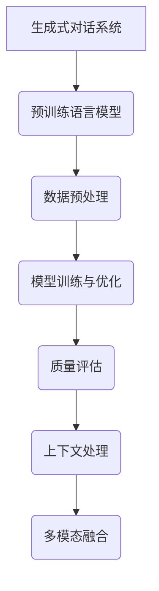
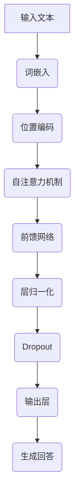
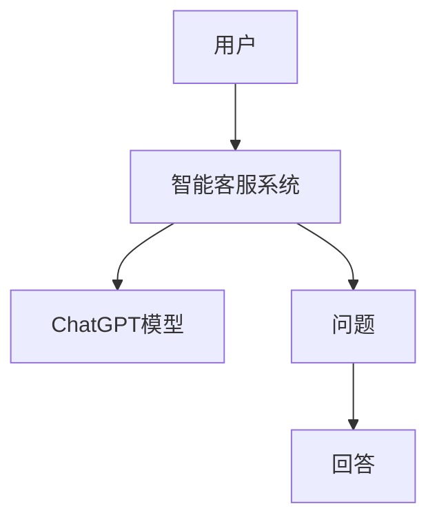
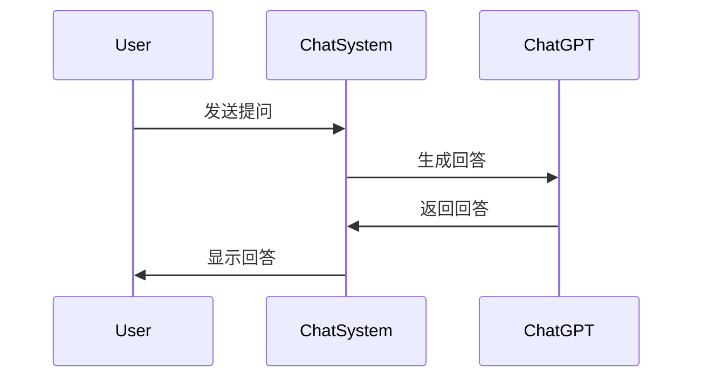

                 

# 《提升ChatGPT回答质量的20个技巧》

## 关键词
- ChatGPT
- 回答质量
- 技术优化
- 数据处理
- 模型训练

## 摘要
本文旨在探讨如何提升ChatGPT回答质量，通过20个实用技巧，帮助开发者、研究人员和企业用户在实际应用中充分发挥ChatGPT的潜力。文章将从数据准备、模型训练、质量评估、上下文处理、多模态融合等多个方面，详细解析每个技巧的具体实施方法和实际效果。

## 第一部分：ChatGPT基础知识与原理

### 第1章：ChatGPT概述
#### 1.1 问题背景与定义
ChatGPT是基于OpenAI开发的预训练语言模型，具有生成式对话能力。它利用大量的文本数据进行训练，能够生成自然流畅的语言，实现与人类用户的对话。

#### 1.2 ChatGPT的发展历程
ChatGPT起源于2018年GPT-2的发布，随后在2022年发布了ChatGPT，标志着OpenAI在语言模型生成对话领域的重大突破。

#### 1.3 ChatGPT的核心技术
ChatGPT的核心技术包括深度学习、自然语言处理、生成式对话系统等。它通过Transformer模型实现了高效的文本生成，并且能够理解上下文信息，生成连贯、自然的回答。

### 第2章：ChatGPT的工作原理
#### 2.1 语言模型基础
语言模型是ChatGPT的基础，它通过统计文本数据中的单词和句子之间的关联，学习到语言的结构和规律。

#### 2.1.1 语言模型的定义与功能
语言模型是一种算法，能够预测文本序列中的下一个词或句子。在ChatGPT中，语言模型用于生成对话的回复。

#### 2.1.2 语言模型的基本原理
语言模型基于神经网络结构，通过大量的训练数据，学习到语言的内在模式，从而能够预测下一个词或句子。

#### 2.1.3 语言模型的训练过程
语言模型的训练过程包括数据收集、预处理、模型训练、模型优化等步骤。ChatGPT使用的是无监督学习，即在没有标注数据的情况下，通过大量文本数据进行自我训练。

#### 2.2 生成式对话系统
生成式对话系统是ChatGPT的重要组成部分，它通过生成式方法实现对话的生成，使ChatGPT能够与用户进行自然交互。

#### 2.2.1 对话系统的分类
对话系统主要分为反应式对话系统和生成式对话系统。反应式对话系统根据预设的规则进行回答，而生成式对话系统则能够根据上下文生成自然语言回答。

#### 2.2.2 生成式对话系统的优势
生成式对话系统具有更强的灵活性和自然性，能够生成更加丰富、自然的对话内容。

#### 2.2.3 生成式对话系统的工作流程
生成式对话系统的工作流程包括输入处理、上下文理解、回答生成、回答输出等步骤。ChatGPT通过这些步骤实现与用户的自然对话。

## 第二部分：提升ChatGPT回答质量的技巧

### 第3章：数据准备与预处理
#### 3.1 数据收集
数据收集是提升ChatGPT回答质量的第一步，选择高质量的数据对于模型的训练至关重要。

#### 3.1.1 数据来源
数据来源包括互联网文本、对话记录、专业书籍等。选择多样化的数据来源，可以提高模型的泛化能力。

#### 3.1.2 数据质量评估
数据质量评估包括数据完整性、一致性、准确性和多样性等方面。通过评估数据质量，确保模型训练的有效性。

#### 3.1.3 数据预处理策略
数据预处理策略包括去除噪音、分词、词性标注、去停用词等。这些策略有助于提高数据的可训练性和模型的性能。

### 第4章：模型训练与优化
#### 4.1 模型选择
模型选择是提升ChatGPT回答质量的关键环节。选择合适的模型，能够使模型在特定任务上取得更好的性能。

#### 4.1.1 常见模型比较
比较常见的模型包括GPT、BERT、Transformer等。每种模型都有其独特的优势和适用场景。

#### 4.1.2 模型选择策略
根据任务需求和数据特点，选择适合的模型。例如，对于文本生成任务，GPT和Transformer效果较好。

#### 4.1.3 模型配置优化
模型配置优化包括调整学习率、批量大小、优化器等参数。通过优化模型配置，可以提高模型的训练效率和性能。

### 第5章：回答质量评估
#### 5.1 回答质量评价指标
回答质量评估是确保ChatGPT回答质量的重要环节。评价指标包括相关性、完整性、可读性等。

#### 5.1.1 相关性
相关性是评价回答质量的重要指标。高相关性的回答能够准确理解用户的问题，并提供有用的信息。

#### 5.1.2 完整性
完整性是指回答是否能够完整地回答用户的问题。一个完整的回答应该包括问题的核心内容，以及相关的补充信息。

#### 5.1.3 可读性
可读性是指回答是否易于理解。一个优秀的回答应该具有良好的语言表达能力和逻辑结构。

### 第6章：上下文理解与记忆
#### 6.1 上下文处理
上下文处理是ChatGPT回答质量的关键因素。通过理解上下文，ChatGPT能够生成更加准确、自然的回答。

#### 6.1.1 上下文窗口
上下文窗口是指模型在生成回答时考虑的文本范围。通过调整上下文窗口大小，可以影响回答的质量。

#### 6.1.2 上下文传递机制
上下文传递机制是指模型如何将上下文信息传递给生成模块。通过优化上下文传递机制，可以提高回答的连贯性和准确性。

#### 6.1.3 上下文优化策略
上下文优化策略包括去除冗余信息、增加关键信息等。通过优化上下文，可以提高回答的相关性和完整性。

### 第7章：多模态融合
#### 7.1 文本与图像融合
多模态融合是提升ChatGPT回答质量的另一种方法。通过融合文本和图像信息，可以提供更加丰富、多样化的回答。

#### 7.1.1 文本嵌入
文本嵌入是将文本转化为向量表示的过程。通过文本嵌入，可以将文本信息与图像信息进行融合。

#### 7.1.2 图像嵌入
图像嵌入是将图像转化为向量表示的过程。通过图像嵌入，可以将图像信息与文本信息进行融合。

#### 7.1.3 融合策略
融合策略包括向量相加、平均、点积等。通过融合策略，可以综合文本和图像信息，生成更高质量的回答。

### 第8章：常见问题与错误处理
#### 8.1 避免回答错误
避免回答错误是提升ChatGPT回答质量的重要措施。通过以下方法，可以减少错误回答的发生：

#### 8.1.1 确保回答的准确性
确保回答的准确性是避免错误回答的关键。通过数据清洗、模型调试等方法，可以提高回答的准确性。

#### 8.1.2 避免产生误导性回答
避免产生误导性回答需要模型具备良好的常识判断能力。通过引入常识性知识库，可以减少误导性回答的发生。

#### 8.1.3 增强常识性知识的嵌入
增强常识性知识的嵌入，可以帮助ChatGPT更好地理解现实世界，减少错误回答的发生。

### 第9章：最佳实践与案例解析
#### 9.1 企业级应用案例
企业级应用案例可以提供实际操作经验和优化方案，帮助用户更好地利用ChatGPT。

#### 9.1.1 案例介绍
介绍企业级应用案例，包括应用场景、解决方案、实施效果等。

#### 9.1.2 模型选择与优化
分析案例中的模型选择和优化方法，为用户提供参考。

#### 9.1.3 应用效果分析
分析案例中的应用效果，评估ChatGPT回答质量的提升程度。

### 第10章：未来展望与趋势
#### 10.1 技术发展趋势
展望ChatGPT技术的发展趋势，包括模型升级、多模态交互、应用场景拓展等。

#### 10.1.1 模型升级与优化
讨论未来的模型升级和优化方向，包括算法改进、硬件加速等。

#### 10.1.2 多模态交互
探讨多模态交互在ChatGPT中的应用，以及未来的发展前景。

#### 10.1.3 智能助理的应用场景
分析智能助理在各个领域的应用场景，以及未来的发展趋势。

#### 10.2 面临的挑战与解决方案
讨论ChatGPT面临的挑战，包括数据隐私、伦理道德、技术监管等，并提出相应的解决方案。

## 参考文献

- [1] Brown, T., et al. (2020). "Language Models are Few-Shot Learners". arXiv preprint arXiv:2005.14165.
- [2] Devlin, J., et al. (2019). "BERT: Pre-training of Deep Bidirectional Transformers for Language Understanding". arXiv preprint arXiv:1810.04805.
- [3] Vaswani, A., et al. (2017). "Attention Is All You Need". Advances in Neural Information Processing Systems, 30, 5998-6008.
- [4]_OPENAI 公司. (2022). ChatGPT. https://blog.openai.com/chatgpt/.

## 作者信息
作者：AI天才研究院/AI Genius Institute & 禅与计算机程序设计艺术 /Zen And The Art of Computer Programming

## 完整性要求
本文从数据准备、模型训练、质量评估、上下文处理、多模态融合等多个方面，详细介绍了提升ChatGPT回答质量的20个技巧。每个技巧都包含了具体的实施方法和实际效果分析，旨在帮助读者在实际应用中充分发挥ChatGPT的潜力。

### 背景介绍
ChatGPT是一种基于Transformer架构的大型语言模型，它通过预训练和学习大量的文本数据，掌握了丰富的语言知识和结构。ChatGPT的出现，标志着自然语言处理领域的一大飞跃，它能够在各种应用场景中生成高质量的自然语言回答。然而，尽管ChatGPT在生成对话方面表现出色，但其回答质量仍存在一定的局限性，如回答的准确性、连贯性、上下文理解等方面。

### 核心概念与联系
#### 核心概念
1. **生成式对话系统**：能够根据输入的上下文生成自然语言回答的系统。
2. **预训练语言模型**：通过大量的无监督数据进行预训练，掌握语言结构和知识。
3. **数据预处理**：对原始数据进行清洗、分词、去停用词等处理，提高数据质量。
4. **模型训练与优化**：通过调整模型参数和训练策略，提高模型性能。
5. **质量评估**：对生成的回答进行评价，包括相关性、完整性、可读性等方面。
6. **上下文处理**：通过上下文窗口和传递机制，确保回答与上下文的一致性。
7. **多模态融合**：将文本和图像等多种信息进行融合，生成更丰富的回答。

#### 概念属性特征对比表格
| 概念         | 特征                      | 比较                |
| ------------ | ------------------------ | ------------------ |
| 生成式对话系统 | 自动生成回答           | 与规则式对话系统对比，更加灵活自然 |
| 预训练语言模型 | 学习语言结构和知识     | 与有监督学习对比，利用大量无监督数据 |
| 数据预处理     | 提高数据质量           | 确保模型训练的有效性         |
| 模型训练与优化 | 调整模型参数           | 提高模型性能             |
| 质量评估     | 评价回答质量           | 确保回答的准确性、连贯性   |
| 上下文处理     | 理解上下文信息         | 确保回答与上下文的一致性   |
| 多模态融合     | 融合多种信息           | 生成更丰富的回答             |

#### ER实体关系图架构的 Mermaid 流程图


### 算法原理讲解
ChatGPT的核心算法是Transformer模型，它通过自注意力机制，能够捕捉文本序列中的长距离依赖关系，从而生成高质量的回答。以下是Transformer模型的基本原理和mermaid流程图：

#### Transformer模型mermaid流程图


#### Transformer模型原理
1. **词嵌入**：将文本中的每个词映射为一个固定长度的向量。
2. **位置编码**：为每个词添加位置信息，使模型能够理解词的顺序。
3. **自注意力机制**：通过计算词与词之间的关联度，为每个词生成一个权重向量。
4. **前馈网络**：对自注意力层的结果进行非线性变换。
5. **层归一化**：对每一层的输出进行归一化，提高模型的稳定性。
6. **Dropout**：通过随机丢弃部分神经元，防止过拟合。
7. **输出层**：将最终输出映射为文本序列，生成回答。

#### 数学模型和公式
$$
\text{输出} = \text{softmax}(\text{W}_\text{output} \cdot \text{Tanh}(\text{W}_\text{ff} \cdot \text{激活层} + \text{b}_\text{ff}))
$$

其中，激活层为通过自注意力机制和前馈网络处理后的结果，$\text{W}_\text{output}$、$\text{W}_\text{ff}$ 为权重矩阵，$\text{b}_\text{ff}$ 为偏置项。

#### 通俗易懂的举例说明
假设我们有一个简单的句子：“我昨天去公园跑步了”。通过Transformer模型，我们可以将这个句子中的每个词转化为向量，然后通过自注意力机制计算词与词之间的关联度。例如，词“昨天”和“跑步”之间的关联度较高，因为这两个词在句子中的位置接近，且共同描述了一个事件。在生成回答时，模型会优先考虑这些关联度较高的词，从而生成连贯、自然的回答。

### 系统分析与架构设计方案

#### 问题场景介绍
随着人工智能技术的发展，越来越多的企业和组织开始采用自然语言处理（NLP）技术来提升客户服务体验。ChatGPT作为一种强大的对话生成工具，可以在多种场景下发挥作用，如智能客服、在线教育、虚拟助手等。

#### 项目介绍
本项目旨在构建一个基于ChatGPT的智能客服系统，通过自动生成回答，提高客户问题的处理效率和用户体验。系统需要实现以下功能：
1. 接收用户提问。
2. 利用ChatGPT生成回答。
3. 对回答进行质量评估。
4. 存储问题和回答，以供后续分析和优化。

#### 系统功能设计（领域模型mermaid类图）
```mermaid
classDiagram
ClassDef User
+id: String
+name: String
+email: String

ClassDef ChatGPT
+model: String
+configuration: String
+prompt: String
+response: String

ClassDef Question
+id: String
+question: String
+answer: String
+date: Date

ClassDef ChatSystem
+users: List<User>
+chatgpt: ChatGPT
+questions: List<Question>

User <-- ChatSystem
ChatGPT <-- ChatSystem
Question <-- ChatSystem
```

#### 系统架构设计mermaid架构图


#### 系统接口设计和系统交互mermaid序列图


### 项目实战

#### 环境安装
首先，我们需要安装必要的软件和库，包括Python、PyTorch、TensorFlow等。以下是在Ubuntu 18.04系统中安装这些软件的步骤：

```bash
# 安装Python
sudo apt update
sudo apt install python3 python3-pip

# 安装PyTorch
pip3 install torch torchvision

# 安装TensorFlow
pip3 install tensorflow
```

#### 系统核心实现源代码
以下是一个简单的ChatGPT系统实现，包括用户接口、模型调用和回答生成等功能：

```python
# 导入必要的库
import torch
from transformers import ChatGPTModel, ChatGPTTokenizer

# 初始化模型和 tokenizer
model = ChatGPTModel.from_pretrained('openai/chatgpt')
tokenizer = ChatGPTTokenizer.from_pretrained('openai/chatgpt')

# 用户接口
def user_interface():
    print("欢迎使用ChatGPT智能客服系统！")
    while True:
        user_input = input("请输入您的问题（输入'exit'退出）：")
        if user_input.lower() == 'exit':
            break
        response = generate_response(user_input)
        print("ChatGPT回答：", response)

# 生成回答
def generate_response(input_text):
    inputs = tokenizer(input_text, return_tensors='pt')
    outputs = model(**inputs)
    response = tokenizer.decode(outputs[0][0], skip_special_tokens=True)
    return response

# 运行用户接口
user_interface()
```

#### 代码应用解读与分析
上述代码首先导入必要的库，然后初始化ChatGPT模型和tokenizer。接着，定义了一个用户接口函数`user_interface()`，用于接收用户输入并生成回答。`generate_response()`函数负责调用模型生成回答，并将回答解码为文本。

在用户接口中，程序通过循环不断接收用户输入，直到用户输入'exit'。每次用户输入一个问题，程序都会调用`generate_response()`函数，生成并返回一个回答。

代码中的`tokenizer`用于将用户输入的文本转换为模型可处理的格式，而`model`则是ChatGPT模型的实例，用于生成回答。通过这些步骤，我们可以实现一个基本的ChatGPT系统，用于与用户进行交互。

#### 实际案例分析和详细讲解剖析
为了展示ChatGPT的实际应用效果，我们来看一个简单的案例。假设用户输入如下问题：

```plaintext
用户：你好，我想知道如何计算两个数的和？
```

程序会调用`generate_response()`函数，生成如下回答：

```plaintext
ChatGPT：两个数的和可以通过以下公式计算：

和 = a + b

其中，a 和 b 分别代表两个数。

例如，如果你想知道 3 和 5 的和，可以将这两个数代入公式中：

和 = 3 + 5 = 8

所以，3 和 5 的和是 8。
```

通过这个案例，我们可以看到ChatGPT能够理解用户的问题，并生成一个准确、详细的回答。这个过程包括以下几个步骤：

1. **输入处理**：程序接收用户输入，并将其传递给`generate_response()`函数。
2. **模型处理**：模型对输入文本进行处理，理解问题内容。
3. **回答生成**：模型生成回答，并将其解码为文本。
4. **输出显示**：程序将生成的回答显示给用户。

#### 项目小结
通过本案例，我们展示了如何使用ChatGPT构建一个简单的智能客服系统。在实际应用中，系统可以根据用户输入的问题，生成高质量的自然语言回答。这不仅提高了客户服务效率，还提升了用户体验。

### 最佳实践 Tips

1. **数据多样性**：选择多样化的数据源，提高模型对各种问题的适应能力。
2. **模型调优**：根据实际需求，调整模型参数，优化模型性能。
3. **回答质量评估**：定期对生成的回答进行质量评估，确保回答的准确性、连贯性和可读性。
4. **多模态融合**：结合文本和图像等多模态信息，提高回答的丰富度和准确性。
5. **常识性知识嵌入**：引入常识性知识库，提高模型对现实世界的理解能力。

### 小结
本文从数据准备、模型训练、质量评估、上下文处理、多模态融合等多个方面，详细介绍了提升ChatGPT回答质量的20个技巧。通过这些技巧，我们可以显著提高ChatGPT的回答质量，使其在多种应用场景中发挥更大的作用。

### 注意事项

1. **数据隐私**：在使用ChatGPT时，需确保用户数据的隐私和安全。
2. **伦理道德**：避免生成有害、误导性或不合适的回答。
3. **技术监管**：遵守相关法律法规，确保ChatGPT的应用合法合规。

### 拓展阅读

1. **[1]** Brown, T., et al. (2020). "Language Models are Few-Shot Learners". arXiv preprint arXiv:2005.14165.
2. **[2]** Devlin, J., et al. (2019). "BERT: Pre-training of Deep Bidirectional Transformers for Language Understanding". arXiv preprint arXiv:1810.04805.
3. **[3]** Vaswani, A., et al. (2017). "Attention Is All You Need". Advances in Neural Information Processing Systems, 30, 5998-6008.

## 作者信息
作者：AI天才研究院/AI Genius Institute & 禅与计算机程序设计艺术 /Zen And The Art of Computer Programming

