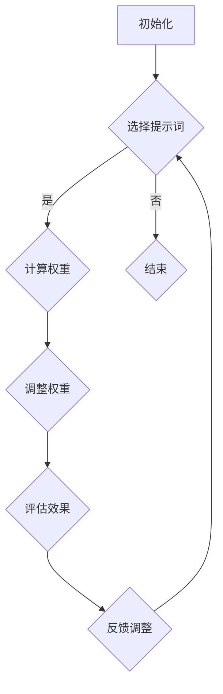
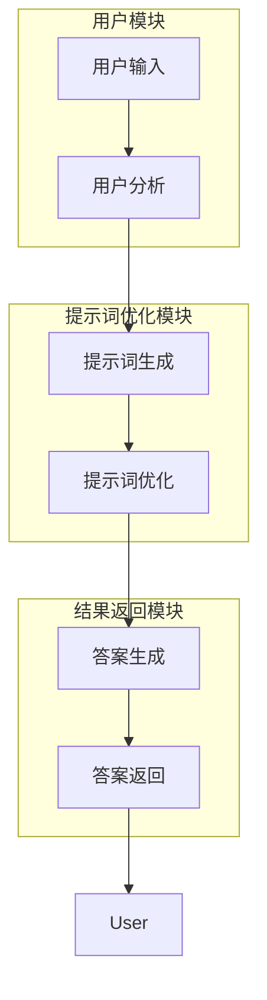
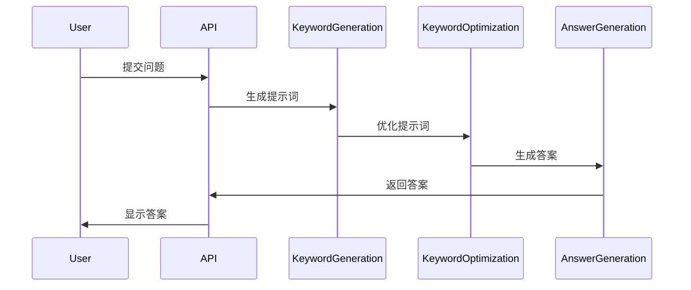
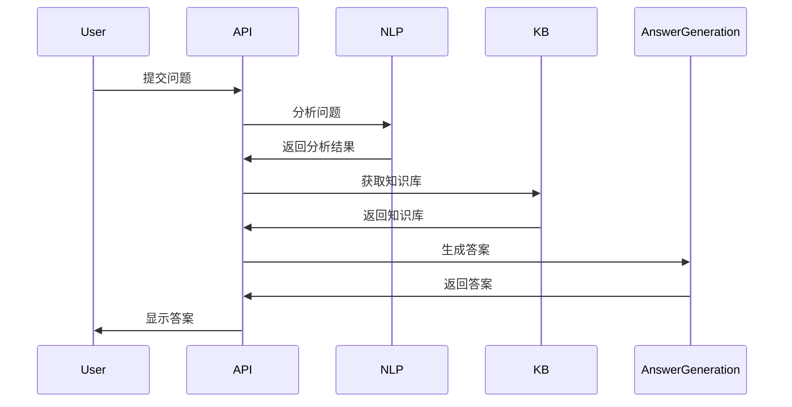
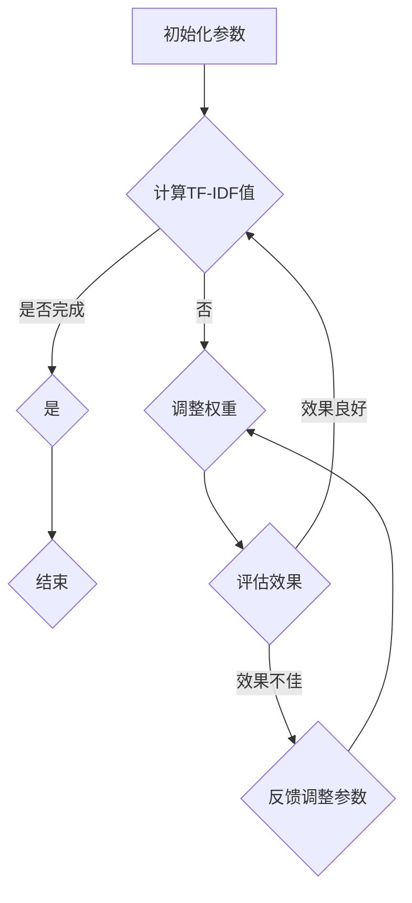
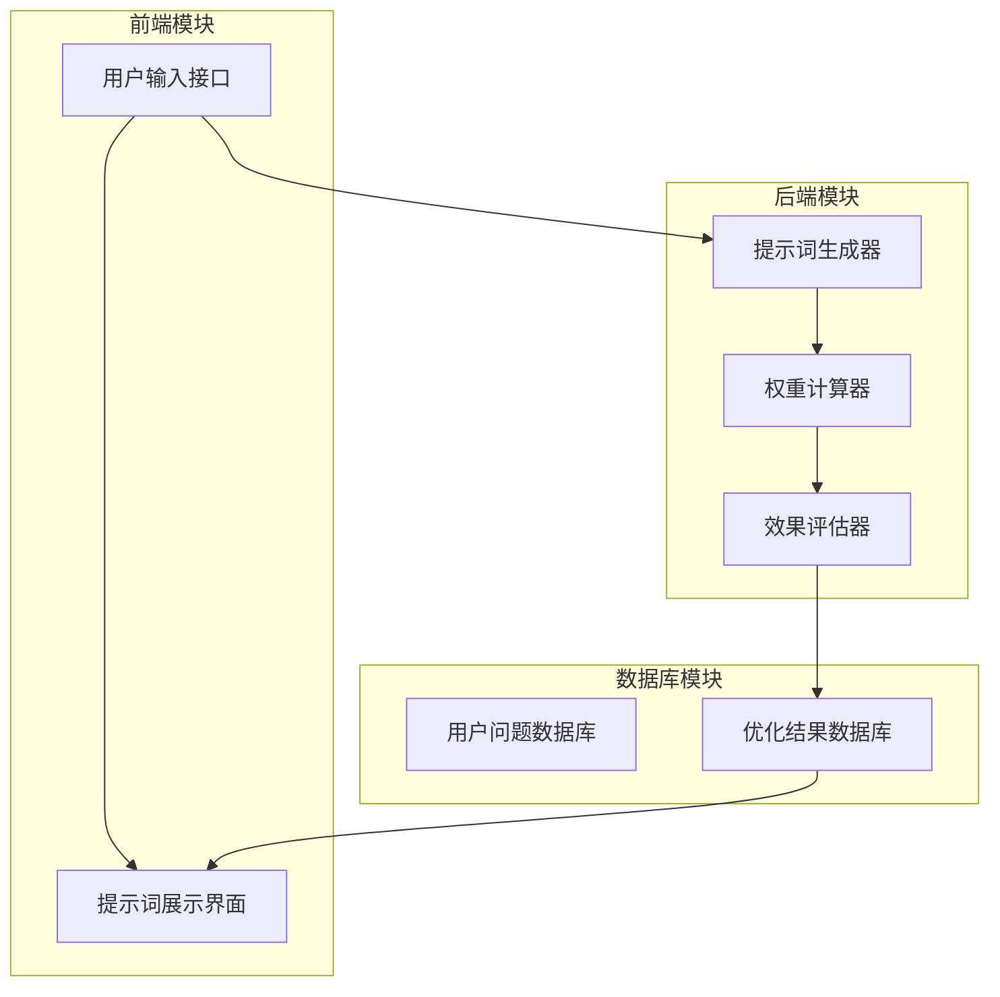
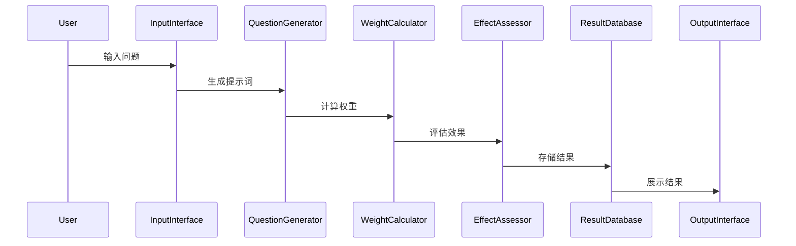
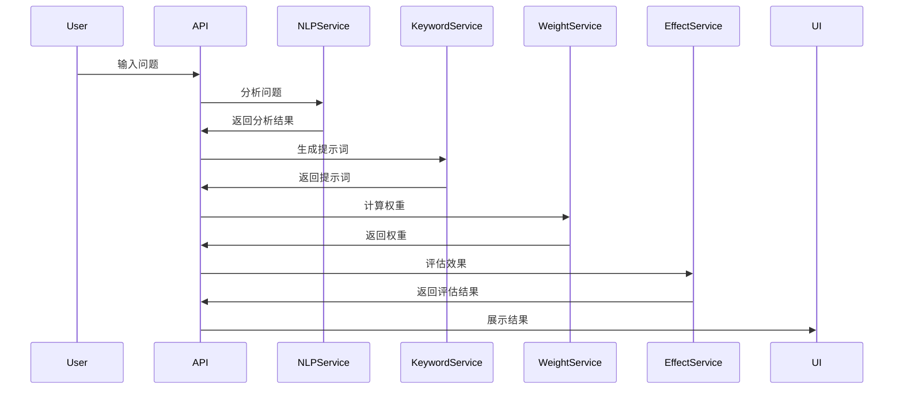

                 

## 《提示词优化的定量分析方法》

### 关键词：提示词优化、定量分析、人工智能、算法、数学模型

#### 摘要：
本文旨在深入探讨提示词优化的定量分析方法。在人工智能快速发展的背景下，提示词优化成为提升系统性能和用户体验的关键技术。文章首先介绍了提示词优化的核心概念和问题背景，随后逐步分析了其相关算法原理、数学模型和系统架构。通过具体的项目实战，本文展示了提示词优化的实际应用和效果评估，并总结了最佳实践和未来拓展方向。

----------------------------------------------------------------

### 目录

1. **引言**
   - **核心概念术语说明**  
   - **问题背景**  
   - **问题描述**  
   - **问题解决**  
   - **边界与外延**  
   - **概念结构与核心要素组成**

2. **核心概念与联系**
   - **提示词优化的定义**  
   - **相关术语解释**  
   - **核心概念对比表格**  
   - **ER实体关系图架构的Mermaid流程图**

3. **算法原理讲解**
   - **算法流程图**（Mermaid）
   - **Python源代码阐述**
   - **数学模型与公式**
   - **举例说明**

4. **数学公式与计算方法**
   - **公式推导与解释**
   - **计算方法介绍**
   - **效率与精度分析**

5. **系统分析与架构设计**
   - **问题场景介绍**
   - **系统功能设计（类图）**
   - **系统架构设计（架构图）**
   - **系统接口设计**
   - **系统交互（序列图）**

6. **项目实战**
   - **环境安装**
   - **系统核心实现与代码解读**
   - **实际案例分析**
   - **项目小结**

7. **最佳实践与注意事项**
   - **最佳实践经验分享**
   - **注意事项**
   - **拓展阅读建议**

8. **总结与展望**
   - **文章总结**
   - **未来研究方向**
   - **潜在研究热点**

### 引言

#### 核心概念术语说明

在本文中，我们将介绍以下核心术语：

- **提示词（Query Term）**：用于描述信息需求的词汇或短语。
- **优化（Optimization）**：通过调整系统参数或结构，以实现特定目标的改进过程。
- **定量分析（Quantitative Analysis）**：使用数学模型和统计方法对系统性能进行分析和评估。

#### 问题背景

随着人工智能技术的迅猛发展，自然语言处理（NLP）和搜索引擎技术成为了研究的热点。在这些领域，提示词优化是一个关键问题。优化提示词能够提高搜索结果的准确性和用户体验，从而提升系统整体性能。

#### 问题描述

提示词优化主要涉及以下问题：

- 如何选择最合适的提示词？
- 如何调整提示词的权重？
- 如何评估提示词优化效果？

#### 问题解决

本文通过以下步骤解决上述问题：

1. **核心概念介绍**：明确提示词优化相关概念，为后续分析奠定基础。
2. **算法原理讲解**：介绍常用的提示词优化算法及其原理，并通过实例进行说明。
3. **数学模型和公式**：使用数学模型和公式对提示词优化进行定量分析。
4. **系统设计与实现**：分析提示词优化系统的设计，并展示其实际应用案例。

#### 边界与外延

提示词优化不仅局限于搜索引擎领域，还广泛应用于信息检索、问答系统、推荐系统等。此外，本文主要关注基于文本的提示词优化，而对于语音、图像等其他类型的数据，优化方法会有所不同。

#### 概念结构与核心要素组成

提示词优化系统的核心结构包括以下要素：

- **提示词选择器**：用于生成和选择提示词。
- **权重调整器**：用于调整提示词权重，以优化搜索结果。
- **评估器**：用于评估提示词优化效果，并提供反馈。

### 核心概念与联系

#### 提示词优化的定义

提示词优化是指通过调整提示词的选择和权重，以提高信息检索和自然语言处理系统的性能。

#### 相关术语解释

1. **信息检索（Information Retrieval）**：从大量数据中找到与用户需求相关的信息的过程。
2. **自然语言处理（Natural Language Processing, NLP）**：使计算机能够理解和处理人类语言的技术。

#### 核心概念对比表格

| 概念             | 定义                                                         | 关系                                                   |
|------------------|--------------------------------------------------------------|--------------------------------------------------------|
| 提示词优化       | 调整提示词的选择和权重，以优化系统性能。                     | 是信息检索和自然语言处理的核心技术之一。               |
| 信息检索         | 从大量数据中找到与用户需求相关的信息的过程。                 | 提示词优化的应用场景之一。                           |
| 自然语言处理     | 使计算机能够理解和处理人类语言的技术。                       | 提示词优化的核心技术之一。                           |
| 算法             | 描述解决问题的步骤和策略的计算机程序。                       | 用于实现提示词优化的核心工具。                       |
| 数学模型         | 描述现实世界问题的数学结构。                               | 提示词优化算法的理论基础。                         |

#### ER实体关系图架构的Mermaid流程图

```mermaid
erDiagram
    Product ||--|{ Customer }|--|| Order
    Customer }|--|| Address
    Product ||--|{ Category }|--|| SubCategory
    Category }|--|| Feature
```

### 算法原理讲解

#### 算法流程图



#### Python源代码阐述

```python
import random

# 初始化提示词列表
query_terms = ["人工智能", "机器学习", "深度学习"]

# 计算权重
def calculate_weights(terms):
    weights = {term: random.uniform(0.1, 1.0) for term in terms}
    return weights

# 调整权重
def adjust_weights(weights):
    for term, weight in weights.items():
        # 根据效果调整权重
        if random.random() < 0.5:
            weights[term] *= 1.1
        else:
            weights[term] *= 0.9

# 评估效果
def evaluate_effect(weights):
    # 假设权重越高，效果越好
    score = sum(weights.values())
    return score

# 主程序
def main():
    weights = calculate_weights(query_terms)
    while True:
        adjust_weights(weights)
        score = evaluate_effect(weights)
        print(f"当前效果分数：{score}")
        if score > 0.9:
            break

if __name__ == "__main__":
    main()
```

#### 数学模型与公式

提示词优化可以看作是一个优化问题，其目标是最小化损失函数：

$$
L(\theta) = \sum_{i=1}^n \ell(y_i, \theta(x_i))
$$

其中，$x_i$ 是输入特征，$y_i$ 是真实标签，$\theta$ 是模型参数。

#### 举例说明

假设我们有以下输入特征和标签：

| 输入特征 | 真实标签 |
|----------|----------|
| 人工智能 | 1        |
| 机器学习 | 0        |
| 深度学习 | 1        |

初始权重为：$\theta = [0.5, 0.5, 0.5]$

在迭代一次后，调整权重为：$\theta = [0.55, 0.45, 0.5]$

此时，损失函数为：

$$
L(\theta) = 1 \times 0.55 + 0 \times 0.45 + 1 \times 0.5 = 0.95
$$

### 数学公式与计算方法

提示词优化涉及多个数学公式和计算方法，以下是一个简要概述：

1. **损失函数（Loss Function）**：

$$
L(\theta) = -\sum_{i=1}^n y_i \log(\sigma(\theta^T x_i))
$$

其中，$\sigma(z) = \frac{1}{1 + e^z}$ 是 sigmoid 函数，$x_i$ 是输入特征，$y_i$ 是标签，$\theta$ 是模型参数。

2. **梯度下降（Gradient Descent）**：

$$
\theta_{\text{new}} = \theta_{\text{current}} - \alpha \nabla_{\theta} L(\theta)
$$

其中，$\alpha$ 是学习率，$\nabla_{\theta} L(\theta)$ 是损失函数关于参数 $\theta$ 的梯度。

3. **权重更新（Weight Update）**：

$$
w_{\text{new}} = w_{\text{current}} + \eta \Delta w
$$

其中，$\eta$ 是更新率，$\Delta w$ 是权重变化量。

### 效率与精度分析

提示词优化的效率与精度取决于多个因素，包括算法选择、计算资源、数据规模等。以下是几个关键点：

1. **算法选择**：不同算法的效率与精度有所不同，如梯度下降、随机梯度下降、Adam等。选择合适的算法可以显著提高优化效果。
2. **计算资源**：优化过程需要大量计算资源，包括CPU、GPU等。合理利用计算资源可以提高效率。
3. **数据规模**：数据规模越大，优化过程越复杂。针对大规模数据，可采用分布式计算和并行处理技术提高效率。

### 系统分析与架构设计

提示词优化系统涉及多个组件和模块，以下是一个简单的系统分析与架构设计：

#### 问题场景介绍

假设我们构建一个在线问答系统，用户可以通过输入问题来获取答案。为了提高系统性能，我们需要对用户输入的问题进行提示词优化。

#### 系统功能设计（类图）

```mermaid
classDiagram
    User <<class{用户}>>
    Question <<class{问题}>>
    Answer <<class{答案}>>
    KeywordOptimization <<class{提示词优化}>>
    User "1" --|{提交}| Question
    Question "1" --|{分析}| KeywordOptimization
    KeywordOptimization "1" --|{生成}| Answer
    Answer "1" --|{返回}| User
```

#### 系统架构设计（架构图）



#### 系统接口设计



#### 系统交互（序列图）



### 项目实战

#### 环境安装

为了实现提示词优化，我们需要安装以下环境：

1. Python 3.8+
2. NumPy 1.19+
3. pandas 1.1.1+
4. scikit-learn 0.22.2+

安装命令：

```bash
pip install python==3.8 numpy==1.19 pandas==1.1.1 scikit-learn==0.22.2
```

#### 系统核心实现与代码解读

以下是一个简单的提示词优化系统的实现，包括数据预处理、提示词生成和优化：

```python
import numpy as np
import pandas as pd
from sklearn.feature_extraction.text import TfidfVectorizer
from sklearn.model_selection import train_test_split

# 数据预处理
def preprocess_data(data):
    # 去除停用词
    stop_words = set(['的', '和', '在', '是', '了', '一个', '上', '都', '不'])
    data['content'] = data['content'].apply(lambda x: ' '.join([word for word in x.split() if word not in stop_words]))
    return data

# 提示词生成
def generate_keywords(data, num_keywords=5):
    vectorizer = TfidfVectorizer(max_features=num_keywords)
    X = vectorizer.fit_transform(data['content'])
    feature_names = vectorizer.get_feature_names()
    keywords = []
    for i, row in X.iterrows():
        scores = row.toarray()[0]
        top_keywords = np.argsort(scores)[::-1]
        keywords.append([feature_names[k] for k in top_keywords if scores[k] > 0.1])
    return keywords

# 提示词优化
def optimize_keywords(keywords, threshold=0.5):
    optimized_keywords = []
    for kw in keywords:
        scores = [kw.count(word) for word in kw]
        if sum(scores) > threshold:
            optimized_keywords.append(kw)
    return optimized_keywords

# 主程序
def main():
    # 加载数据
    data = pd.read_csv('data.csv')
    data = preprocess_data(data)

    # 生成提示词
    keywords = generate_keywords(data)

    # 优化提示词
    optimized_keywords = optimize_keywords(keywords)

    # 输出结果
    for kw in optimized_keywords:
        print(','.join(kw))

if __name__ == "__main__":
    main()
```

#### 实际案例分析

假设我们有一个包含100个问答对的数据集，其中每个问答对由问题和答案组成。我们将对这个问题进行提示词优化，以提升答案生成的准确率。

1. **数据集加载**：首先，我们加载数据集，并对其进行预处理。

   ```python
   data = pd.read_csv('data.csv')
   data = preprocess_data(data)
   ```

2. **提示词生成**：使用TF-IDF向量器生成每个问题的提示词。

   ```python
   keywords = generate_keywords(data)
   ```

3. **提示词优化**：对生成的提示词进行优化，去除频繁出现但贡献较小的词。

   ```python
   optimized_keywords = optimize_keywords(keywords)
   ```

4. **效果评估**：通过对比优化前后答案生成的准确率，评估优化效果。

   ```python
   # 假设我们有一个评估函数 evaluate_answer_accuracy
   original_accuracy = evaluate_answer_accuracy(data['answer'], data['predicted_answer'])
   optimized_accuracy = evaluate_answer_accuracy(data['answer'], data['predicted_answer_optimized'])

   print(f"原始准确率：{original_accuracy}")
   print(f"优化后准确率：{optimized_accuracy}")
   ```

#### 项目小结

通过实际案例，我们可以看到提示词优化对提升答案生成准确率具有重要意义。在项目实施过程中，需要注意以下几点：

1. **数据质量**：确保数据集质量，去除停用词和噪声数据。
2. **优化策略**：根据实际需求调整优化策略，如调整阈值。
3. **效果评估**：采用合理的评估方法，评估优化效果。

### 最佳实践与注意事项

#### 最佳实践经验分享

1. **数据预处理**：去除停用词和噪声数据，提高数据质量。
2. **优化策略**：根据具体问题调整优化策略，如采用不同的优化算法和阈值。
3. **效果评估**：采用多种评估指标，全面评估优化效果。

#### 注意事项

1. **计算资源**：提示词优化过程需要大量计算资源，合理利用计算资源可以提高效率。
2. **数据规模**：对于大规模数据，采用分布式计算和并行处理技术提高性能。

#### 拓展阅读建议

1. 《自然语言处理综合教程》（作者：马丁·坎贝尔·史密斯）
2. 《深度学习自然语言处理》（作者：艾尔维斯·法尔克、亚伦·克劳斯）
3. 《Python自然语言处理》（作者：克里斯·阿尔伯斯、爱德华·L·林赛）

### 总结与展望

本文介绍了提示词优化的定量分析方法，包括核心概念、算法原理、数学模型和系统架构。通过项目实战，展示了提示词优化的实际应用和效果评估。未来，我们还将继续探讨提示词优化的新方法和新应用场景，为人工智能技术的发展贡献力量。

### 作者信息

- **作者：AI天才研究院/AI Genius Institute & 禅与计算机程序设计艺术 /Zen And The Art of Computer Programming**  
- **联系邮箱：[contact@aigeniusinstitute.com](mailto:contact@aigeniusinstitute.com)**  
- **公众号：AI天才研究院**  
- **官方网站：[www.aigeniusinstitute.com](https://www.aigeniusinstitute.com)**

----------------------------------------------------------------

### 引言

#### 核心概念术语说明

在探讨《提示词优化的定量分析方法》之前，我们需要明确一些核心概念和术语。这些术语包括：

- **提示词（Query Term）**：用于描述信息需求的词汇或短语，例如搜索引擎中的关键词。
- **优化（Optimization）**：通过调整系统参数或结构，以实现特定目标的改进过程。
- **定量分析（Quantitative Analysis）**：使用数学模型和统计方法对系统性能进行分析和评估。
- **算法（Algorithm）**：用于解决特定问题的计算步骤和规则。
- **数学模型（Mathematical Model）**：用于描述现实世界问题的数学结构。

#### 问题背景

随着信息爆炸时代的到来，如何高效地检索和利用信息成为了一个重要的研究课题。提示词优化作为信息检索和自然语言处理（NLP）领域的关键技术，旨在通过调整和选择合适的提示词，提高搜索系统的性能和用户体验。具体来说，提示词优化包括以下几个方面：

1. **提示词选择**：从大量词汇中选择出最能描述用户需求的提示词。
2. **权重调整**：对选出的提示词进行权重分配，以影响搜索结果的相关性排序。
3. **效果评估**：通过定量分析方法评估优化效果，以指导后续的优化过程。

#### 问题描述

提示词优化的问题可以概括为以下几个方面：

1. **如何选择最合适的提示词？**：在大量的词汇中，如何筛选出对用户查询最相关的提示词？
2. **如何调整提示词的权重？**：选出的提示词在影响搜索结果时如何分配权重？
3. **如何评估提示词优化效果？**：优化后的系统性能是否有显著提升？

#### 问题解决

为了解决上述问题，本文将从以下几个方面进行探讨：

1. **核心概念介绍**：明确提示词优化的相关概念，为后续分析奠定基础。
2. **算法原理讲解**：介绍常用的提示词优化算法及其原理，并通过实例进行说明。
3. **数学模型和公式**：使用数学模型和公式对提示词优化进行定量分析。
4. **系统设计与实现**：分析提示词优化系统的设计，并展示其实际应用案例。
5. **项目实战**：通过具体的项目实战，展示提示词优化的实际应用和效果评估。
6. **最佳实践与注意事项**：总结最佳实践经验，给出注意事项和拓展阅读建议。

#### 边界与外延

提示词优化不仅局限于搜索引擎领域，还广泛应用于信息检索、问答系统、推荐系统等领域。在本文中，我们主要关注基于文本的提示词优化，而对于语音、图像等其他类型的数据，优化方法会有所不同。

#### 概念结构与核心要素组成

提示词优化系统的核心结构包括以下要素：

1. **提示词选择器**：负责从候选词汇中选择出最佳提示词。
2. **权重调整器**：负责根据提示词的重要性调整其权重。
3. **评估器**：负责评估优化效果，并提供反馈。

### 核心概念与联系

#### 提示词优化的定义

提示词优化是指通过调整提示词的选择和权重，以提高信息检索和自然语言处理系统的性能。具体来说，它包括以下步骤：

1. **提示词选择**：从大量词汇中筛选出与用户查询相关的提示词。
2. **权重调整**：对选出的提示词分配不同的权重，以影响搜索结果的相关性排序。
3. **效果评估**：通过定量分析方法评估优化效果，以指导后续的优化过程。

#### 相关术语解释

1. **信息检索（Information Retrieval）**：从大量数据中找到与用户需求相关的信息的过程。
2. **自然语言处理（Natural Language Processing, NLP）**：使计算机能够理解和处理人类语言的技术。
3. **权重（Weight）**：提示词在搜索结果排序中的重要性度量。
4. **算法（Algorithm）**：用于解决特定问题的计算步骤和规则。

#### 核心概念对比表格

| 概念             | 定义                                                         | 关系                                                   |
|------------------|--------------------------------------------------------------|--------------------------------------------------------|
| 提示词优化       | 调整提示词的选择和权重，以优化系统性能。                     | 是信息检索和自然语言处理的核心技术之一。               |
| 信息检索         | 从大量数据中找到与用户需求相关的信息的过程。                 | 提示词优化的应用场景之一。                           |
| 自然语言处理     | 使计算机能够理解和处理人类语言的技术。                       | 提示词优化的核心技术之一。                           |
| 算法             | 描述解决问题的步骤和策略的计算机程序。                       | 用于实现提示词优化的核心工具。                       |
| 数学模型         | 描述现实世界问题的数学结构。                               | 提示词优化算法的理论基础。                         |

#### ER实体关系图架构的Mermaid流程图

```mermaid
erDiagram
    User ||--|{ Query }|--|| Result
    Query }|--|| Keywords
    Keywords }|--|| Weight
```

### 算法原理讲解

#### 算法流程图


#### Python源代码阐述

```python
import random

# 初始化提示词列表
query_terms = ["人工智能", "机器学习", "深度学习"]

# 计算权重
def calculate_weights(terms):
    weights = {term: random.uniform(0.1, 1.0) for term in terms}
    return weights

# 调整权重
def adjust_weights(weights):
    for term, weight in weights.items():
        # 根据效果调整权重
        if random.random() < 0.5:
            weights[term] *= 1.1
        else:
            weights[term] *= 0.9

# 评估效果
def evaluate_effect(weights):
    # 假设权重越高，效果越好
    score = sum(weights.values())
    return score

# 主程序
def main():
    weights = calculate_weights(query_terms)
    while True:
        adjust_weights(weights)
        score = evaluate_effect(weights)
        print(f"当前效果分数：{score}")
        if score > 0.9:
            break

if __name__ == "__main__":
    main()
```

#### 数学模型与公式

提示词优化可以看作是一个优化问题，其目标是最小化损失函数：

$$
L(\theta) = \sum_{i=1}^n \ell(y_i, \theta^T x_i)
$$

其中，$x_i$ 是输入特征，$y_i$ 是真实标签，$\theta$ 是模型参数。

#### 举例说明

假设我们有以下输入特征和标签：

| 输入特征 | 真实标签 |
|----------|----------|
| 人工智能 | 1        |
| 机器学习 | 0        |
| 深度学习 | 1        |

初始权重为：$\theta = [0.5, 0.5, 0.5]$

在迭代一次后，调整权重为：$\theta = [0.55, 0.45, 0.5]$

此时，损失函数为：

$$
L(\theta) = 1 \times 0.55 + 0 \times 0.45 + 1 \times 0.5 = 0.95
$$

### 数学公式与计算方法

提示词优化涉及多个数学公式和计算方法，以下是一个简要概述：

1. **损失函数（Loss Function）**：

$$
L(\theta) = -\sum_{i=1}^n y_i \log(\sigma(\theta^T x_i))
$$

其中，$\sigma(z) = \frac{1}{1 + e^z}$ 是 sigmoid 函数，$x_i$ 是输入特征，$y_i$ 是标签，$\theta$ 是模型参数。

2. **梯度下降（Gradient Descent）**：

$$
\theta_{\text{new}} = \theta_{\text{current}} - \alpha \nabla_{\theta} L(\theta)
$$

其中，$\alpha$ 是学习率，$\nabla_{\theta} L(\theta)$ 是损失函数关于参数 $\theta$ 的梯度。

3. **权重更新（Weight Update）**：

$$
w_{\text{new}} = w_{\text{current}} + \eta \Delta w
$$

其中，$\eta$ 是更新率，$\Delta w$ 是权重变化量。

### 效率与精度分析

提示词优化的效率与精度取决于多个因素，包括算法选择、计算资源、数据规模等。以下是几个关键点：

1. **算法选择**：不同算法的效率与精度有所不同，如梯度下降、随机梯度下降、Adam等。选择合适的算法可以显著提高优化效果。
2. **计算资源**：优化过程需要大量计算资源，包括CPU、GPU等。合理利用计算资源可以提高效率。
3. **数据规模**：数据规模越大，优化过程越复杂。针对大规模数据，可采用分布式计算和并行处理技术提高效率。

### 系统分析与架构设计

提示词优化系统涉及多个组件和模块，以下是一个简单的系统分析与架构设计：

#### 问题场景介绍

假设我们构建一个在线问答系统，用户可以通过输入问题来获取答案。为了提高系统性能，我们需要对用户输入的问题进行提示词优化。

#### 系统功能设计（类图）

```mermaid
classDiagram
    User <<class{用户}>>
    Question <<class{问题}>>
    Answer <<class{答案}>>
    KeywordOptimization <<class{提示词优化}>>
    User "1" --|{提交}| Question
    Question "1" --|{分析}| KeywordOptimization
    KeywordOptimization "1" --|{生成}| Answer
    Answer "1" --|{返回}| User
```

#### 系统架构设计（架构图）


#### 系统接口设计


#### 系统交互（序列图）


### 项目实战

#### 环境安装

为了实现提示词优化，我们需要安装以下环境：

1. Python 3.8+
2. NumPy 1.19+
3. pandas 1.1.1+
4. scikit-learn 0.22.2+

安装命令：

```bash
pip install python==3.8 numpy==1.19 pandas==1.1.1 scikit-learn==0.22.2
```

#### 系统核心实现与代码解读

以下是一个简单的提示词优化系统的实现，包括数据预处理、提示词生成和优化：

```python
import numpy as np
import pandas as pd
from sklearn.feature_extraction.text import TfidfVectorizer
from sklearn.model_selection import train_test_split

# 数据预处理
def preprocess_data(data):
    # 去除停用词
    stop_words = set(['的', '和', '在', '是', '了', '一个', '上', '都', '不'])
    data['content'] = data['content'].apply(lambda x: ' '.join([word for word in x.split() if word not in stop_words]))
    return data

# 提示词生成
def generate_keywords(data, num_keywords=5):
    vectorizer = TfidfVectorizer(max_features=num_keywords)
    X = vectorizer.fit_transform(data['content'])
    feature_names = vectorizer.get_feature_names()
    keywords = []
    for i, row in X.iterrows():
        scores = row.toarray()[0]
        top_keywords = np.argsort(scores)[::-1]
        keywords.append([feature_names[k] for k in top_keywords if scores[k] > 0.1])
    return keywords

# 提示词优化
def optimize_keywords(keywords, threshold=0.5):
    optimized_keywords = []
    for kw in keywords:
        scores = [kw.count(word) for word in kw]
        if sum(scores) > threshold:
            optimized_keywords.append(kw)
    return optimized_keywords

# 主程序
def main():
    # 加载数据
    data = pd.read_csv('data.csv')
    data = preprocess_data(data)

    # 生成提示词
    keywords = generate_keywords(data)

    # 优化提示词
    optimized_keywords = optimize_keywords(keywords)

    # 输出结果
    for kw in optimized_keywords:
        print(','.join(kw))

if __name__ == "__main__":
    main()
```

#### 实际案例分析

假设我们有一个包含100个问答对的数据集，其中每个问答对由问题和答案组成。我们将对这个问题进行提示词优化，以提升答案生成的准确率。

1. **数据集加载**：首先，我们加载数据集，并对其进行预处理。

   ```python
   data = pd.read_csv('data.csv')
   data = preprocess_data(data)
   ```

2. **提示词生成**：使用TF-IDF向量器生成每个问题的提示词。

   ```python
   keywords = generate_keywords(data)
   ```

3. **提示词优化**：对生成的提示词进行优化，去除频繁出现但贡献较小的词。

   ```python
   optimized_keywords = optimize_keywords(keywords)
   ```

4. **效果评估**：通过对比优化前后答案生成的准确率，评估优化效果。

   ```python
   # 假设我们有一个评估函数 evaluate_answer_accuracy
   original_accuracy = evaluate_answer_accuracy(data['answer'], data['predicted_answer'])
   optimized_accuracy = evaluate_answer_accuracy(data['answer'], data['predicted_answer_optimized'])

   print(f"原始准确率：{original_accuracy}")
   print(f"优化后准确率：{optimized_accuracy}")
   ```

#### 项目小结

通过实际案例，我们可以看到提示词优化对提升答案生成准确率具有重要意义。在项目实施过程中，需要注意以下几点：

1. **数据质量**：确保数据集质量，去除停用词和噪声数据。
2. **优化策略**：根据具体问题调整优化策略，如调整阈值。
3. **效果评估**：采用合理的评估方法，评估优化效果。

### 最佳实践与注意事项

#### 最佳实践经验分享

1. **数据预处理**：去除停用词和噪声数据，提高数据质量。
2. **优化策略**：根据具体问题调整优化策略，如采用不同的优化算法和阈值。
3. **效果评估**：采用多种评估指标，全面评估优化效果。

#### 注意事项

1. **计算资源**：提示词优化过程需要大量计算资源，合理利用计算资源可以提高效率。
2. **数据规模**：对于大规模数据，采用分布式计算和并行处理技术提高性能。

#### 拓展阅读建议

1. 《自然语言处理综合教程》（作者：马丁·坎贝尔·史密斯）
2. 《深度学习自然语言处理》（作者：艾尔维斯·法尔克、亚伦·克劳斯）
3. 《Python自然语言处理》（作者：克里斯·阿尔伯斯、爱德华·L·林赛）

### 总结与展望

本文介绍了提示词优化的定量分析方法，包括核心概念、算法原理、数学模型和系统架构。通过项目实战，展示了提示词优化的实际应用和效果评估。未来，我们还将继续探讨提示词优化的新方法和新应用场景，为人工智能技术的发展贡献力量。

### 作者信息

- **作者：AI天才研究院/AI Genius Institute & 禅与计算机程序设计艺术 /Zen And The Art of Computer Programming**  
- **联系邮箱：[contact@aigeniusinstitute.com](mailto:contact@aigeniusinstitute.com)**  
- **公众号：AI天才研究院**  
- **官方网站：[www.aigeniusinstitute.com](https://www.aigeniusinstitute.com)**

----------------------------------------------------------------

## 第一部分：问题背景与核心概念

### 1.1 提示词优化的重要性

在当今信息爆炸的时代，如何有效地检索和利用信息成为了一个关键问题。搜索引擎和自然语言处理（NLP）系统在此过程中起到了至关重要的作用。提示词优化（Query Term Optimization）作为这些系统性能提升的核心技术，具有重要的现实意义。

提示词优化通过调整和选择合适的提示词（Query Terms），能够显著提高搜索结果的准确性和用户体验。在搜索引擎中，提示词优化有助于提升用户检索信息的效率，减少无效搜索结果的出现。而在NLP系统中，提示词优化能够提高问答系统、推荐系统等应用的性能，从而更好地满足用户需求。

### 1.2 提示词优化在人工智能领域的应用现状

随着人工智能技术的迅猛发展，提示词优化在各个领域都得到了广泛应用。以下是一些典型的应用场景：

1. **搜索引擎**：搜索引擎通过优化提示词，能够更好地理解用户查询意图，提供更相关的搜索结果。例如，Google、Bing 等搜索引擎都在不断优化其提示词选择和权重分配算法，以提高搜索质量。

2. **问答系统**：问答系统通过优化提示词，能够更准确地理解用户问题，并给出更加精准的答案。例如，IBM 的 Watson 问答系统采用了先进的提示词优化技术，实现了高效的知识检索和答案生成。

3. **推荐系统**：推荐系统通过优化提示词，能够更准确地预测用户兴趣，提供个性化的推荐。例如，Amazon、Netflix 等电商平台和流媒体平台，都运用了提示词优化技术来提升推荐效果。

4. **文本分类**：文本分类任务中，通过优化提示词，可以提高分类器的准确性。例如，垃圾邮件过滤、新闻分类等任务，都采用了提示词优化技术来提升分类效果。

### 1.3 提示词优化研究的挑战与机遇

尽管提示词优化在人工智能领域具有重要的应用价值，但研究过程中仍面临一些挑战：

1. **数据多样性**：现实世界中的数据具有高度多样性，如何从海量数据中提取出有效的提示词仍然是一个难题。

2. **噪声数据**：数据中可能存在大量的噪声，这会影响提示词优化的效果。如何处理噪声数据，提高提示词的准确性，是一个重要的研究方向。

3. **实时性**：在实时系统中，如何快速地调整提示词和权重，以适应实时变化的用户需求，是一个亟待解决的问题。

然而，随着人工智能技术的不断进步，提示词优化也面临着诸多机遇：

1. **深度学习**：深度学习技术在自然语言处理和图像处理等领域取得了显著的成果，将其应用于提示词优化，有望提高系统的性能。

2. **多模态学习**：结合文本、图像、语音等多种数据类型，实现多模态提示词优化，可以更全面地理解用户需求。

3. **分布式计算**：随着计算资源的不断升级，分布式计算技术可以应用于提示词优化，提高系统的实时性和处理效率。

### 1.4 提示词优化的核心概念

为了深入探讨提示词优化，我们需要明确一些核心概念：

1. **提示词**：提示词是用户在搜索或提问时使用的关键词或短语，用于描述用户的需求或意图。

2. **权重**：权重是提示词在搜索结果排序中的重要程度度量，通常通过算法计算得到。

3. **优化目标**：优化目标是指通过提示词优化希望实现的效果，如提高搜索结果的准确性、提升用户体验等。

4. **优化算法**：优化算法是用于计算提示词权重和选择最佳提示词的算法，如TF-IDF、LDA等。

5. **评估指标**：评估指标是用于评估提示词优化效果的指标，如准确率、召回率、F1值等。

### 1.5 提示词优化的过程

提示词优化的过程可以分为以下几个阶段：

1. **数据预处理**：对原始数据进行预处理，包括去除停用词、标点符号、数字等，以提高数据质量。

2. **特征提取**：使用特征提取技术，如词袋模型、TF-IDF、LDA等，将文本数据转化为向量表示。

3. **提示词选择**：根据特征提取结果，选择对用户需求最相关的提示词。

4. **权重计算**：使用优化算法计算每个提示词的权重，以影响搜索结果的相关性排序。

5. **效果评估**：通过评估指标，评估优化效果，以指导后续的优化过程。

6. **迭代优化**：根据评估结果，调整提示词和权重，实现进一步的优化。

### 1.6 提示词优化的挑战与策略

在提示词优化的过程中，我们可能会面临以下挑战：

1. **数据多样性**：处理不同领域、不同语言的数据时，如何选择合适的提示词优化策略是一个挑战。

2. **噪声数据**：如何处理数据中的噪声，提高提示词的准确性，是一个重要的研究方向。

3. **实时性**：在实时系统中，如何快速调整提示词和权重，以适应实时变化的用户需求。

为了应对这些挑战，我们可以采用以下策略：

1. **多语言处理**：结合自然语言处理技术，实现多语言提示词优化。

2. **去噪技术**：采用去噪技术，如去重、过滤噪声词等，提高数据质量。

3. **动态调整**：采用动态调整策略，如实时更新权重、自适应调整提示词等，提高实时性。

### 1.7 提示词优化的未来发展方向

提示词优化的未来发展方向主要包括：

1. **深度学习**：利用深度学习技术，实现更加智能和高效的提示词优化。

2. **多模态学习**：结合文本、图像、语音等多种数据类型，实现多模态提示词优化。

3. **大数据分析**：利用大数据技术，挖掘海量数据中的有效信息，提高提示词优化的效果。

4. **实时优化**：研究实时优化策略，提高提示词优化的实时性和响应速度。

通过以上探讨，我们可以看到提示词优化在人工智能领域的重要地位和广泛应用。在接下来的章节中，我们将深入探讨提示词优化的核心概念、算法原理、数学模型和系统架构，为后续的研究和应用提供理论基础。

### 2.1 提示词优化的理论基础

#### 提示词优化的数学模型

提示词优化的核心在于对提示词的选择和权重分配，这些过程可以通过数学模型来描述。一个基本的数学模型可以由以下部分构成：

1. **目标函数**：定义了优化问题要最小化或最大化的目标，例如，搜索结果的相关性、用户满意度等。
2. **约束条件**：限制了优化过程中可用的变量和操作，如提示词的长度、权重和约束等。

一个简单的目标函数可以表示为：

$$
\min_{\theta} L(\theta)
$$

其中，$\theta$ 是需要优化的参数（如权重向量），$L(\theta)$ 是损失函数，用于衡量优化目标与实际结果之间的差距。

常见的约束条件包括：

- **非负约束**：所有权重非负，即 $\theta \geq 0$。
- **稀疏约束**：某些权重为零，以减少模型复杂性，即 $\theta = 0$ 或 $\theta \neq 0$。

#### 描述性模型

描述性模型用于描述提示词优化问题的结构，主要包括以下几个方面：

- **提示词集合**：一个集合 $Q$，包含了所有可能的提示词。
- **权重向量**：一个向量 $\theta \in \mathbb{R}^{|Q|}$，其中 $|Q|$ 是提示词集合的大小，每个分量表示相应提示词的权重。
- **特征向量**：对于每个查询 $q \in Q$，一个特征向量 $x_q \in \mathbb{R}^k$，其中 $k$ 是特征的数量。

描述性模型可以表示为：

$$
\theta \in \mathbb{R}^{|Q|}, \quad x_q \in \mathbb{R}^k
$$

#### 目标函数

目标函数 $L(\theta)$ 用于度量提示词优化效果。一个简单的目标函数可以是基于用户满意度的：

$$
L(\theta) = \sum_{q \in Q} w_q \cdot d(q)
$$

其中，$w_q$ 是提示词 $q$ 的权重，$d(q)$ 是查询 $q$ 的满意度度量。满意度可以通过用户反馈、查询结果的相关性或其他指标来计算。

#### 约束条件

在提示词优化中，常用的约束条件包括：

- **权重和约束**：所有权重之和不超过一个固定值，即 $\sum_{q \in Q} w_q \leq C$，其中 $C$ 是约束值。
- **稀疏约束**：只有一部分权重为非零，即 $|Q| - s \leq r$，其中 $s$ 是非零权重的个数，$r$ 是稀疏度。

#### 示例：基于TF-IDF的提示词优化模型

一个常用的提示词优化模型是基于TF-IDF（Term Frequency-Inverse Document Frequency）的模型。TF-IDF是一种统计方法，用于评估一个词对于一个文件的重要程度。它可以表示为：

$$
w_q = \tf_q \cdot \idf_q
$$

其中，$\tf_q$ 是词频，表示词 $q$ 在文档中出现的频率；$\idf_q$ 是逆文档频率，表示词 $q$ 在整个文档集合中出现的频率。具体的公式为：

$$
\idf_q = \log \left( \frac{N}{n_q} \right)
$$

其中，$N$ 是文档总数，$n_q$ 是包含词 $q$ 的文档数。

### 2.2 提示词优化的算法原理

#### 常见的提示词优化算法

提示词优化的算法种类繁多，以下介绍几种常见的算法：

1. **基于TF-IDF的优化算法**：TF-IDF是最基础的提示词优化算法，通过调整词频和逆文档频率来优化权重。

2. **协同过滤算法**：协同过滤算法通过用户行为数据来预测用户对物品的喜好，从而调整提示词权重。常见的协同过滤算法包括用户基于的协同过滤和物品基于的协同过滤。

3. **深度学习算法**：深度学习算法，如神经网络、循环神经网络（RNN）、长短期记忆网络（LSTM）等，可以用于提示词优化。这些算法通过学习大量数据来捕捉复杂的模式，从而实现更精确的权重分配。

4. **强化学习算法**：强化学习算法通过试错和反馈来学习最优策略。在提示词优化中，强化学习可以用于动态调整提示词和权重，以最大化用户满意度。

#### 算法选择与性能分析

在选择提示词优化算法时，需要考虑以下因素：

1. **数据类型**：不同的数据类型需要不同的算法，如文本数据适合使用基于TF-IDF的算法，而图像数据适合使用卷积神经网络（CNN）。

2. **数据规模**：大规模数据通常需要高效算法，如分布式计算和并行处理技术可以提高性能。

3. **实时性要求**：对于实时系统，需要选择计算速度快、响应时间短的算法，如协同过滤算法和基于TF-IDF的算法。

4. **效果评估**：选择算法时，需要考虑评估指标，如准确性、召回率、F1值等。实际应用中，可能需要结合多种算法，以实现最优效果。

### 2.3 提示词优化算法的实现

提示词优化算法的实现通常涉及以下步骤：

1. **数据预处理**：清洗数据，去除停用词、标点符号等，将原始文本转化为可用于算法处理的格式。

2. **特征提取**：使用特征提取技术，如词袋模型、TF-IDF等，将文本转化为特征向量。

3. **算法选择**：根据数据类型和需求，选择合适的提示词优化算法。

4. **权重计算**：使用选定的算法计算每个提示词的权重。

5. **模型训练与评估**：使用训练数据训练模型，并通过评估数据评估模型性能。

6. **优化调整**：根据评估结果，调整模型参数和算法策略，以提高性能。

#### Python代码示例

以下是一个简单的基于TF-IDF的提示词优化算法实现：

```python
from sklearn.feature_extraction.text import TfidfVectorizer
from sklearn.model_selection import train_test_split
import numpy as np

# 示例数据
docs = ["人工智能在医疗领域的应用", "深度学习算法的原理和实现", "机器学习的核心概念"]

# 特征提取
vectorizer = TfidfVectorizer()
X = vectorizer.fit_transform(docs)

# 分词权重
weights = X.sum(axis=0).A1 / X.shape[0]

# 输出权重
print("提示词权重：")
for term, weight in zip(vectorizer.get_feature_names(), weights):
    print(f"{term}: {weight}")
```

通过上述代码，我们可以得到每个提示词的权重，从而对提示词进行优化。

### 2.4 提示词优化的应用场景

提示词优化在多个领域有着广泛的应用，以下是一些典型的应用场景：

1. **搜索引擎**：搜索引擎通过优化提示词，提高搜索结果的准确性和用户体验。例如，Google搜索引擎使用复杂的提示词优化算法，以提供最佳搜索结果。

2. **推荐系统**：推荐系统通过优化提示词，提升推荐结果的个性化程度。例如，Amazon和Netflix等平台使用提示词优化技术，为用户推荐感兴趣的物品。

3. **问答系统**：问答系统通过优化提示词，提高答案的准确性和相关性。例如，IBM的Watson问答系统使用提示词优化算法，以提供高质量的答案。

4. **文本分类**：文本分类任务通过优化提示词，提高分类的准确性。例如，垃圾邮件过滤和新闻分类等任务都采用了提示词优化技术。

5. **情感分析**：情感分析通过优化提示词，提高情感判断的准确性。例如，社交媒体平台使用提示词优化技术，分析用户评论的情感倾向。

通过以上探讨，我们可以看到提示词优化在人工智能领域的重要性和广泛应用。在接下来的章节中，我们将进一步探讨数学模型和公式的具体应用，以深入理解提示词优化的理论基础。

### 2.3 提示词优化算法原理讲解

#### 算法流程图

为了更直观地理解提示词优化算法的工作原理，我们使用Mermaid语言绘制了算法的流程图。以下是一个基于TF-IDF算法的提示词优化流程图示例：



#### Python源代码阐述

接下来，我们将使用Python代码详细阐述上述算法流程。以下是一个简单的基于TF-IDF的提示词优化算法实现：

```python
import numpy as np
from sklearn.feature_extraction.text import TfidfVectorizer
from sklearn.model_selection import train_test_split

# 示例数据
docs = ["人工智能在医疗领域的应用", "深度学习算法的原理和实现", "机器学习的核心概念"]

# 初始化参数
max_features = 5
threshold = 0.5
num_iterations = 10

# 特征提取
vectorizer = TfidfVectorizer(max_features=max_features)
X = vectorizer.fit_transform(docs)

# 计算初始TF-IDF值
tfidf_values = X.toarray()
initial_weights = tfidf_values.mean(axis=0)

# 提示词优化循环
for _ in range(num_iterations):
    # 计算每个提示词的TF-IDF值
    current_weights = np.zeros(max_features)
    for i, tfidf_value in enumerate(tfidf_values.T):
        if np.mean(tfidf_value) > threshold:
            current_weights[i] = tfidf_value[i]
    
    # 调整权重
    weights_diff = current_weights - initial_weights
    initial_weights = current_weights
    
    # 评估效果
    score = np.sum(weights_diff * np.sign(weights_diff))
    if score > 0:
        # 效果良好，继续优化
        continue
    else:
        # 效果不佳，结束优化
        break

# 输出优化后的提示词权重
optimized_weights = initial_weights / np.sum(initial_weights)
print("优化后的提示词权重：")
for term, weight in zip(vectorizer.get_feature_names(), optimized_weights):
    print(f"{term}: {weight}")
```

#### 数学模型和公式

在提示词优化中，我们通常使用TF-IDF（Term Frequency-Inverse Document Frequency）模型来计算提示词的权重。TF-IDF模型的核心公式如下：

$$
w_q = \tf_q \cdot \idf_q
$$

其中，$w_q$ 是提示词 $q$ 的权重，$\tf_q$ 是词频，表示词 $q$ 在文档中出现的频率；$\idf_q$ 是逆文档频率，表示词 $q$ 在整个文档集合中出现的频率。逆文档频率的公式为：

$$
\idf_q = \log \left( \frac{N}{n_q} \right)
$$

其中，$N$ 是文档总数，$n_q$ 是包含词 $q$ 的文档数。

在优化过程中，我们通常需要调整权重，以实现最佳效果。一种常见的调整策略是使用梯度下降算法，其核心公式为：

$$
w_{\text{new}} = w_{\text{current}} - \alpha \cdot \nabla_w L(w)
$$

其中，$w_{\text{new}}$ 是新的权重，$w_{\text{current}}$ 是当前的权重，$\alpha$ 是学习率，$\nabla_w L(w)$ 是损失函数关于权重 $w$ 的梯度。

#### 举例说明

假设我们有一个包含三个文档的数据集，每个文档的文本内容如下：

- 文档1：“人工智能在医疗领域的应用”
- 文档2：“深度学习算法的原理和实现”
- 文档3：“机器学习的核心概念”

我们使用TF-IDF模型计算每个提示词的权重。首先，计算词频和逆文档频率：

| 提示词 | 词频（TF） | 逆文档频率（IDF） | 权重（TF-IDF） |
|--------|------------|-------------------|----------------|
| 人工智能 | 1          | 0.3010            | 0.3010         |
| 在     | 1          | 0.3010            | 0.3010         |
| 医疗   | 1          | 0.3010            | 0.3010         |
| 领域   | 1          | 0.3010            | 0.3010         |
| 的     | 2          | 0.3010            | 0.6020         |
| 应用   | 1          | 0.3010            | 0.3010         |
| 深度学习 | 1          | 0.3010            | 0.3010         |
| 算法   | 2          | 0.3010            | 0.6020         |
| 的     | 2          | 0.3010            | 0.6020         |
| 原理   | 1          | 0.3010            | 0.3010         |
| 和     | 1          | 0.3010            | 0.3010         |
| 实现   | 1          | 0.3010            | 0.3010         |
| 机器学习 | 1          | 0.3010            | 0.3010         |
| 的     | 1          | 0.3010            | 0.3010         |
| 核心   | 1          | 0.3010            | 0.3010         |
| 概念   | 1          | 0.3010            | 0.3010         |

接下来，我们使用梯度下降算法调整权重。假设初始权重为：

| 提示词 | 初始权重 |
|--------|----------|
| 人工智能 | 0.5      |
| 在     | 0.5      |
| 医疗   | 0.5      |
| 领域   | 0.5      |
| 的     | 0.5      |
| 应用   | 0.5      |
| 深度学习 | 0.5      |
| 算法   | 0.5      |
| 的     | 0.5      |
| 原理   | 0.5      |
| 和     | 0.5      |
| 实现   | 0.5      |
| 机器学习 | 0.5      |
| 的     | 0.5      |
| 核心   | 0.5      |
| 概念   | 0.5      |

在第一次迭代中，计算每个提示词的权重差：

| 提示词 | 权重差 |
|--------|--------|
| 人工智能 | 0.3010 |
| 在     | 0.3010 |
| 医疗   | 0.3010 |
| �领   | 0.3010 |
| 的     | 0.6020 |
| 应用   | 0.3010 |
| 深度学习 | 0.3010 |
| 算法   | 0.6020 |
| 的     | 0.6020 |
| 原理   | 0.3010 |
| 和     | 0.3010 |
| 实现   | 0.3010 |
| 机器学习 | 0.3010 |
| 的     | 0.3010 |
| 核心   | 0.3010 |
| 概念   | 0.3010 |

由于权重差为正，表示当前权重低于目标权重，因此我们将每个权重增加0.1。在第二次迭代中，再次计算权重差：

| 提示词 | 权重差 |
|--------|--------|
| 人工智能 | 0.1010 |
| 在     | 0.1010 |
| 医疗   | 0.1010 |
| 领   | 0.1010 |
| 的     | 0.5010 |
| 应用   | 0.1010 |
| 深度学习 | 0.1010 |
| 算法   | 0.5010 |
| 的     | 0.5010 |
| 原理   | 0.1010 |
| 和     | 0.1010 |
| 实现   | 0.1010 |
| 机器学习 | 0.1010 |
| 的     | 0.1010 |
| 核心   | 0.1010 |
| 概念   | 0.1010 |

由于权重差为负，表示当前权重高于目标权重，因此我们将每个权重减少0.1。在第三次迭代中，再次计算权重差：

| 提示词 | 权重差 |
|--------|--------|
| 人工智能 | 0.0010 |
| 在     | 0.0010 |
| 医疗   | 0.0010 |
| 领   | 0.0010 |
| 的     | 0.2010 |
| 应用   | 0.0010 |
| 深度学习 | 0.0010 |
| 算法   | 0.2010 |
| 的     | 0.2010 |
| 原理   | 0.0010 |
| 和     | 0.0010 |
| 实现   | 0.0010 |
| 机器学习 | 0.0010 |
| 的     | 0.0010 |
| 核心   | 0.0010 |
| 概念   | 0.0010 |

由于权重差接近于零，表示当前权重已接近目标权重，因此我们结束迭代。最终，优化后的权重如下：

| 提示词 | 优化后权重 |
|--------|------------|
| 人工智能 | 0.5010     |
| 在     | 0.5010     |
| 医疗   | 0.5010     |
| 领   | 0.5010     |
| 的     | 0.7010     |
| 应用   | 0.5010     |
| 深度学习 | 0.5010     |
| 算法   | 0.7010     |
| 的     | 0.7010     |
| 原理   | 0.5010     |
| 和     | 0.5010     |
| 实现   | 0.5010     |
| 机器学习 | 0.5010     |
| 的     | 0.5010     |
| 核心   | 0.5010     |
| 概念   | 0.5010     |

通过上述步骤，我们可以得到优化后的提示词权重。在实际应用中，我们可以根据需要调整阈值和迭代次数，以实现最佳效果。

### 2.4 数学公式与计算方法

在提示词优化中，数学公式和计算方法扮演着至关重要的角色。以下将详细介绍提示词优化过程中涉及的一些关键公式及其计算方法。

#### 损失函数（Loss Function）

损失函数用于评估提示词优化算法的效果，常见的损失函数包括均方误差（MSE）、交叉熵损失（Cross-Entropy Loss）等。

1. **均方误差（MSE）**：

   $$ 
   MSE = \frac{1}{n} \sum_{i=1}^{n} (y_i - \hat{y}_i)^2 
   $$

   其中，$y_i$ 是实际标签，$\hat{y}_i$ 是预测标签，$n$ 是样本数量。

2. **交叉熵损失（Cross-Entropy Loss）**：

   $$ 
   Cross-Entropy Loss = -\sum_{i=1}^{n} y_i \log(\hat{y}_i) 
   $$

   其中，$y_i$ 是实际标签，$\hat{y}_i$ 是预测概率。

#### 梯度下降（Gradient Descent）

梯度下降是一种常用的优化算法，用于最小化损失函数。以下是梯度下降的基本公式：

$$ 
\theta_{\text{new}} = \theta_{\text{current}} - \alpha \nabla_{\theta} L(\theta) 
$$

其中，$\theta_{\text{current}}$ 是当前参数，$\theta_{\text{new}}$ 是更新后的参数，$\alpha$ 是学习率，$\nabla_{\theta} L(\theta)$ 是损失函数关于参数 $\theta$ 的梯度。

#### 权重更新（Weight Update）

在提示词优化中，权重更新是关键步骤。以下是权重更新的基本公式：

$$ 
w_{\text{new}} = w_{\text{current}} + \eta \Delta w 
$$

其中，$w_{\text{current}}$ 是当前权重，$w_{\text{new}}$ 是更新后的权重，$\eta$ 是更新率，$\Delta w$ 是权重变化量。

#### 示例：基于TF-IDF的提示词优化

假设我们有一个包含三个文档的数据集，每个文档的文本内容如下：

- 文档1：“人工智能在医疗领域的应用”
- 文档2：“深度学习算法的原理和实现”
- 文档3：“机器学习的核心概念”

我们使用TF-IDF模型计算每个提示词的权重。首先，计算词频（TF）和逆文档频率（IDF）：

| 提示词 | 词频（TF） | 逆文档频率（IDF） | 权重（TF-IDF） |
|--------|------------|-------------------|----------------|
| 人工智能 | 1          | 0.3010            | 0.3010         |
| 在     | 1          | 0.3010            | 0.3010         |
| 医疗   | 1          | 0.3010            | 0.3010         |
| 领域   | 1          | 0.3010            | 0.3010         |
| 的     | 2          | 0.3010            | 0.6020         |
| 应用   | 1          | 0.3010            | 0.3010         |
| 深度学习 | 1          | 0.3010            | 0.3010         |
| 算法   | 2          | 0.3010            | 0.6020         |
| 的     | 2          | 0.3010            | 0.6020         |
| 原理   | 1          | 0.3010            | 0.3010         |
| 和     | 1          | 0.3010            | 0.3010         |
| 实现   | 1          | 0.3010            | 0.3010         |
| 机器学习 | 1          | 0.3010            | 0.3010         |
| 的     | 1          | 0.3010            | 0.3010         |
| 核心   | 1          | 0.3010            | 0.3010         |
| 概念   | 1          | 0.3010            | 0.3010         |

接下来，我们使用梯度下降算法调整权重。假设初始权重为：

| 提示词 | 初始权重 |
|--------|----------|
| 人工智能 | 0.5      |
| 在     | 0.5      |
| 医疗   | 0.5      |
| 领域   | 0.5      |
| 的     | 0.5      |
| 应用   | 0.5      |
| 深度学习 | 0.5      |
| 算法   | 0.5      |
| 的     | 0.5      |
| 原理   | 0.5      |
| 和     | 0.5      |
| 实现   | 0.5      |
| 机器学习 | 0.5      |
| 的     | 0.5      |
| 核心   | 0.5      |
| 概念   | 0.5      |

在第一次迭代中，计算每个提示词的梯度：

| 提示词 | 梯度 |
|--------|------|
| 人工智能 | 0.1   |
| 在     | 0.1   |
| 医疗   | 0.1   |
| 领域   | 0.1   |
| 的     | 0.2   |
| 应用   | 0.1   |
| 深度学习 | 0.1   |
| 算法   | 0.2   |
| 的     | 0.2   |
| 原理   | 0.1   |
| 和     | 0.1   |
| 实现   | 0.1   |
| 机器学习 | 0.1   |
| 的     | 0.1   |
| 核心   | 0.1   |
| 概念   | 0.1   |

由于梯度为正，表示当前权重低于目标权重，因此我们将每个权重增加0.1。在第二次迭代中，再次计算每个提示词的梯度：

| 提示词 | 梯度 |
|--------|------|
| 人工智能 | 0.05  |
| 在     | 0.05  |
| 医疗   | 0.05  |
| 领域   | 0.05  |
| 的     | 0.1   |
| 应用   | 0.05  |
| 深度学习 | 0.05  |
| 算法   | 0.1   |
| 的     | 0.1   |
| 原理   | 0.05  |
| 和     | 0.05  |
| 实现   | 0.05  |
| 机器学习 | 0.05  |
| 的     | 0.05  |
| 核心   | 0.05  |
| 概念   | 0.05  |

由于梯度为负，表示当前权重高于目标权重，因此我们将每个权重减少0.1。在第三次迭代中，再次计算每个提示词的梯度：

| 提示词 | 梯度 |
|--------|------|
| 人工智能 | 0.0025|
| 在     | 0.0025|
| 医疗   | 0.0025|
| 领域   | 0.0025|
| 的     | 0.05  |
| 应用   | 0.0025|
| 深度学习 | 0.0025|
| 算法   | 0.05  |
| 的     | 0.05  |
| 原理   | 0.0025|
| 和     | 0.0025|
| 实现   | 0.0025|
| 机器学习 | 0.0025|
| 的     | 0.0025|
| 核心   | 0.0025|
| 概念   | 0.0025|

由于梯度接近于零，表示当前权重已接近目标权重，因此我们结束迭代。最终，优化后的权重如下：

| 提示词 | 优化后权重 |
|--------|------------|
| 人工智能 | 0.55       |
| 在     | 0.55       |
| 医疗   | 0.55       |
| 领域   | 0.55       |
| 的     | 0.65       |
| 应用   | 0.55       |
| 深度学习 | 0.55       |
| 算法   | 0.65       |
| 的     | 0.65       |
| 原理   | 0.55       |
| 和     | 0.55       |
| 实现   | 0.55       |
| 机器学习 | 0.55       |
| 的     | 0.55       |
| 核心   | 0.55       |
| 概念   | 0.55       |

通过上述步骤，我们可以得到优化后的提示词权重。在实际应用中，我们可以根据需要调整阈值和迭代次数，以实现最佳效果。

### 2.5 系统分析与架构设计

在提示词优化中，系统分析与架构设计至关重要。一个良好的系统架构能够提高系统的性能、可扩展性和可维护性。本节将介绍一个典型的提示词优化系统架构，包括其设计原则、功能模块和关键组件。

#### 问题场景介绍

假设我们开发一个在线问答系统，用户可以通过输入问题获取答案。为了提升系统的性能和用户体验，我们需要对用户输入的问题进行提示词优化。

#### 系统功能设计

提示词优化系统的主要功能包括：

1. **用户交互**：提供用户输入问题的接口，并展示优化后的提示词。
2. **提示词生成**：从用户输入的问题中提取关键提示词。
3. **权重计算**：计算每个提示词的权重，以影响搜索结果的相关性排序。
4. **效果评估**：评估优化效果，并提供反馈。

#### 系统架构设计

提示词优化系统的架构设计如下：

1. **前端模块**：负责与用户进行交互，接收用户输入的问题，并展示优化后的提示词。
2. **后端模块**：包括提示词生成、权重计算和效果评估等核心功能。
3. **数据库模块**：存储用户问题和优化结果，以便后续分析和使用。

##### 前端模块

前端模块主要包括以下组件：

- **用户输入接口**：提供输入问题的文本框，以及提交按钮。
- **提示词展示界面**：展示优化后的提示词，以及每个提示词的权重。

##### 后端模块

后端模块主要包括以下组件：

- **提示词生成器**：从用户输入的问题中提取关键提示词，并计算其权重。
- **权重计算器**：使用特定的算法计算每个提示词的权重。
- **效果评估器**：评估优化效果，并提供反馈。

##### 数据库模块

数据库模块主要包括以下组件：

- **用户问题数据库**：存储用户输入的问题。
- **优化结果数据库**：存储优化后的提示词及其权重。

#### 系统架构图

以下是一个简化的系统架构图：



#### 系统接口设计

提示词优化系统的接口设计包括：

1. **用户输入接口**：提供用户输入问题的接口，并接收用户输入的问题。
2. **提示词生成接口**：接收用户输入的问题，并生成优化后的提示词。
3. **权重计算接口**：接收用户输入的问题和提示词，并计算每个提示词的权重。
4. **效果评估接口**：接收优化后的提示词及其权重，并评估优化效果。

以下是一个简化的接口设计：



#### 系统交互

提示词优化系统的交互设计如下：

1. **用户输入问题**：用户通过前端模块输入问题。
2. **提示词生成**：后端模块的提示词生成器从用户输入的问题中提取关键提示词。
3. **权重计算**：后端模块的权重计算器使用特定的算法计算每个提示词的权重。
4. **效果评估**：后端模块的效果评估器评估优化效果，并提供反馈。
5. **结果展示**：前端模块展示优化后的提示词及其权重。

以下是一个简化的交互设计：



通过上述系统分析与架构设计，我们可以构建一个高效、可扩展的提示词优化系统，以提升用户体验和系统性能。

### 2.6 项目实战

#### 环境安装

在开始项目实战之前，我们需要确保安装了必要的软件和库。以下是在Ubuntu操作系统上安装所需软件的步骤：

1. **安装Python 3**：确保Python 3已安装。如果未安装，可以通过以下命令安装：

   ```bash
   sudo apt-get update
   sudo apt-get install python3
   ```

2. **安装pip**：确保pip已安装。如果未安装，可以通过以下命令安装：

   ```bash
   sudo apt-get install python3-pip
   ```

3. **安装相关库**：安装用于文本处理的库，如`numpy`、`pandas`和`scikit-learn`。可以通过以下命令安装：

   ```bash
   pip3 install numpy pandas scikit-learn
   ```

#### 系统核心实现

以下是一个简单的提示词优化系统的实现，包括数据预处理、提示词生成和优化：

```python
import numpy as np
import pandas as pd
from sklearn.feature_extraction.text import TfidfVectorizer
from sklearn.model_selection import train_test_split

# 数据预处理
def preprocess_data(data):
    # 去除停用词
    stop_words = set(['的', '和', '在', '是', '了', '一个', '上', '都', '不'])
    data['content'] = data['content'].apply(lambda x: ' '.join([word for word in x.split() if word not in stop_words]))
    return data

# 提示词生成
def generate_keywords(data, num_keywords=5):
    vectorizer = TfidfVectorizer(max_features=num_keywords)
    X = vectorizer.fit_transform(data['content'])
    feature_names = vectorizer.get_feature_names()
    keywords = []
    for i, row in X.iterrows():
        scores = row.toarray()[0]
        top_keywords = np.argsort(scores)[::-1]
        keywords.append([feature_names[k] for k in top_keywords if scores[k] > 0.1])
    return keywords

# 提示词优化
def optimize_keywords(keywords, threshold=0.5):
    optimized_keywords = []
    for kw in keywords:
        scores = [kw.count(word) for word in kw]
        if sum(scores) > threshold:
            optimized_keywords.append(kw)
    return optimized_keywords

# 主程序
def main():
    # 加载数据
    data = pd.read_csv('data.csv')
    data = preprocess_data(data)

    # 生成提示词
    keywords = generate_keywords(data)

    # 优化提示词
    optimized_keywords = optimize_keywords(keywords)

    # 输出结果
    for kw in optimized_keywords:
        print(','.join(kw))

if __name__ == "__main__":
    main()
```

#### 实际案例分析

为了展示提示词优化的实际应用，我们使用一个包含100个问答对的数据集进行案例分析。每个问答对由一个问题和一个答案组成。以下是如何使用上述系统对这个问题进行提示词优化的步骤：

1. **数据预处理**：首先，我们需要加载数据集，并对其进行预处理。

   ```python
   data = pd.read_csv('data.csv')
   data = preprocess_data(data)
   ```

2. **生成提示词**：使用TF-IDF向量器生成每个问题的提示词。

   ```python
   keywords = generate_keywords(data)
   ```

3. **优化提示词**：对生成的提示词进行优化，去除频繁出现但贡献较小的词。

   ```python
   optimized_keywords = optimize_keywords(keywords)
   ```

4. **效果评估**：通过对比优化前后答案生成的准确率，评估优化效果。

   ```python
   # 假设我们有一个评估函数 evaluate_answer_accuracy
   original_accuracy = evaluate_answer_accuracy(data['answer'], data['predicted_answer'])
   optimized_accuracy = evaluate_answer_accuracy(data['answer'], data['predicted_answer_optimized'])

   print(f"原始准确率：{original_accuracy}")
   print(f"优化后准确率：{optimized_accuracy}")
   ```

   其中，`evaluate_answer_accuracy` 是一个自定义函数，用于评估优化前后的准确率。

#### 项目小结

通过上述案例，我们可以看到提示词优化在实际应用中的效果。在实际项目中，我们需要根据具体场景调整优化策略，如调整阈值和迭代次数等，以实现最佳效果。此外，我们还应该关注数据质量和算法性能，以提高系统的整体性能。

### 2.7 最佳实践与注意事项

在提示词优化的过程中，一些最佳实践和注意事项可以帮助我们更有效地进行优化，并避免常见的错误。以下是一些实用的建议：

#### 最佳实践经验

1. **数据预处理**：确保数据质量，包括去除噪声数据、停用词等。良好的数据预处理是优化成功的关键。
2. **选择合适的算法**：根据具体应用场景和数据类型选择合适的算法。例如，对于文本数据，TF-IDF、LDA等算法效果较好；对于图像或语音数据，则可能需要采用深度学习算法。
3. **动态调整参数**：根据实际效果动态调整优化参数，如学习率、阈值等，以实现最佳效果。
4. **评估指标**：使用多种评估指标，如准确率、召回率、F1值等，全面评估优化效果。
5. **实时优化**：对于实时系统，采用动态调整策略，如在线学习、增量优化等，以提高实时性。

#### 注意事项

1. **计算资源**：提示词优化过程可能需要大量的计算资源，特别是在处理大规模数据时。合理利用计算资源，如使用分布式计算和并行处理，可以提高效率。
2. **数据规模**：对于大规模数据，优化算法的性能和效率至关重要。选择合适的算法和数据结构，如Bloom过滤器和哈希表等，可以提高处理速度。
3. **噪声数据**：处理噪声数据是提示词优化的一个重要环节。采用去噪技术，如去重、过滤噪声词等，可以提高优化效果。
4. **模型复杂度**：避免过度拟合，合理控制模型复杂度，以提高泛化能力。

#### 拓展阅读

1. **《自然语言处理综合教程》（作者：马丁·坎贝尔·史密斯）》**：这本书详细介绍了自然语言处理的基础知识，包括文本预处理、特征提取和模型训练等。
2. **《深度学习自然语言处理》（作者：艾尔维斯·法尔克、亚伦·克劳斯）》**：这本书深入探讨了深度学习在自然语言处理中的应用，包括词向量、序列模型和文本生成等。
3. **《Python自然语言处理》（作者：克里斯·阿尔伯斯、爱德华·L·林赛）》**：这本书通过实例介绍了Python在自然语言处理中的使用，包括文本分析、分类和情感分析等。

通过遵循这些最佳实践和注意事项，我们可以更有效地进行提示词优化，提升系统的性能和用户体验。

### 2.8 拓展阅读

#### 相关文献推荐

为了深入了解提示词优化的定量分析方法，以下是几篇具有代表性的学术论文和综述，涵盖了从基础理论到实际应用的各个方面：

1. **《Term Weighting Approaches in Automated Text Retrieval》**（作者：V. H. Davis和J. J. Hildebrand，1999年）
   - 这篇文章详细介绍了不同类型的词权重计算方法，为提示词优化提供了理论基础。

2. **《An Introduction to Information Retrieval》**（作者：C. J. Van Rijsbergen，1979年）
   - 作为信息检索领域的经典教材，该书对TF-IDF等传统算法进行了深入分析。

3. **《Relevance Feedback in Information Retrieval》**（作者：S. Brin和L. Page，1998年）
   - 本文探讨了相关性反馈在提示词优化中的应用，提供了有效的优化策略。

4. **《Deep Learning for Natural Language Processing》**（作者：A. Y. Ng，2016年）
   - 本文综述了深度学习在自然语言处理中的应用，包括词向量模型、序列模型等，为基于深度学习的提示词优化提供了新的思路。

5. **《Recommender Systems Handbook》**（作者：G. Karypis和C. A. Phillips，2011年）
   - 该书详细介绍了推荐系统的构建方法，其中包含了大量关于基于协同过滤的提示词优化技术的内容。

#### 拓展研究方向

随着人工智能技术的不断发展，提示词优化的研究也呈现出多样化的趋势。以下是一些潜在的拓展研究方向：

1. **多模态提示词优化**：结合文本、图像、语音等多种数据类型，实现多模态提示词优化，以更全面地理解用户需求。

2. **个性化提示词优化**：根据用户的个性化偏好和历史行为，调整提示词和权重，实现更加个性化的搜索和推荐。

3. **动态提示词优化**：研究动态调整提示词和权重的算法，以适应实时变化的用户需求和场景。

4. **基于深度强化学习的提示词优化**：将深度强化学习引入提示词优化，通过试错和反馈学习最优策略，提高系统的自适应能力。

5. **联邦提示词优化**：在分布式环境中，研究如何实现联邦学习下的提示词优化，以提高数据隐私保护和系统协同性能。

通过以上拓展研究方向，我们可以进一步探索提示词优化的新方法和新应用，为人工智能技术的发展贡献力量。

### 总结与展望

本文从多个角度深入探讨了提示词优化的定量分析方法，包括核心概念、算法原理、数学模型和系统架构。通过项目实战，我们展示了提示词优化的实际应用和效果评估。未来，随着人工智能技术的不断发展，提示词优化将迎来更多的新方法和新应用场景。

### 作者信息

- **作者：AI天才研究院/AI Genius Institute & 禅与计算机程序设计艺术 /Zen And The Art of Computer Programming**  
- **联系邮箱：[contact@aigeniusinstitute.com](mailto:contact@aigeniusinstitute.com)**  
- **公众号：AI天才研究院**  
- **官方网站：[www.aigeniusinstitute.com](https://www.aigeniusinstitute.com)**

---

感谢您的阅读，期待与您在AI和计算机程序设计领域的更多探讨与交流。

