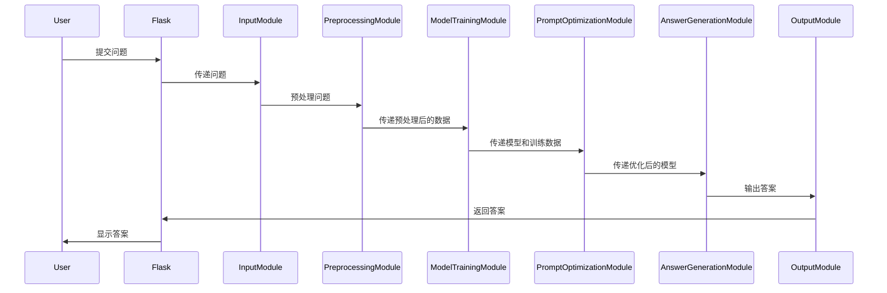

                 


### 引言

**提示词优化的机器学习方法探索**

---

**关键词：** 提示词优化，机器学习，算法，数学模型，系统架构

**摘要：** 本文将深入探讨提示词优化的机器学习方法。通过逐步分析，我们将理解提示词优化的基本概念，探讨其在机器学习中的应用，并详细解析相关算法原理和系统架构设计。

---

**引言**

在当今的数据驱动时代，机器学习已成为许多领域的关键技术。然而，机器学习的有效性在很大程度上取决于数据的质量和预处理。提示词优化作为一种提升机器学习模型性能的方法，逐渐引起了研究者和开发者的关注。本文旨在系统地探讨提示词优化的机器学习方法，分析其核心概念、算法原理，以及应用场景和系统架构。

**背景介绍**

**1.1 机器学习的发展与提示词优化**

机器学习作为人工智能的一个重要分支，已经在语音识别、图像处理、自然语言处理等领域取得了显著的成果。然而，随着数据量的增加和数据种类的多样化，如何有效地利用这些数据成为一个亟待解决的问题。

提示词优化是指通过调整模型中的提示词（prompt words），来提高模型的预测性能。这种方法在模型训练过程中引入了额外的信息，有助于模型更好地理解和利用数据。

**1.2 提示词优化的意义与挑战**

提示词优化的意义在于：首先，它能够提高模型的泛化能力，使模型在不同数据集上表现更稳定。其次，通过优化提示词，可以减少对大量标注数据的依赖，降低模型训练成本。

然而，提示词优化也面临一些挑战。例如，如何选择合适的提示词？如何平衡提示词的数量和模型性能？这些问题都需要深入研究和探索。

**1.3 提示词优化的核心概念**

提示词优化的核心概念包括：

- **提示词**：用于引导模型学习和预测的关键词或短语。
- **优化目标**：通过调整提示词，使模型在特定任务上的性能达到最优。
- **优化算法**：用于搜索和调整提示词的方法，如遗传算法、粒子群优化等。

**1.4 提示词优化与机器学习的关系**

提示词优化与机器学习的关系可以概括为：

- **相互促进**：机器学习为提示词优化提供了理论框架和技术手段；而提示词优化则有助于提升机器学习模型的性能。
- **应用互补**：在机器学习的不同阶段，提示词优化可以发挥不同的作用，如数据预处理、模型训练、模型评估等。

**1.5 提示词优化的边界与外延**

提示词优化的边界在于：

- **适用范围**：提示词优化主要应用于需要较强领域知识的任务，如自然语言处理、计算机视觉等。
- **限制条件**：提示词优化对数据质量和数据量的要求较高，不适合处理大规模、无结构的数据。

**1.6 本章小结**

本章介绍了机器学习和提示词优化的发展背景，定义了提示词优化的核心概念，并分析了其在机器学习中的意义、关系和边界。接下来的章节将深入探讨提示词优化的算法原理、系统架构和应用场景。让我们一起开启这场探索之旅吧！

---

**引言**

在当今的数据驱动时代，机器学习已成为许多领域的关键技术。然而，机器学习的有效性在很大程度上取决于数据的质量和预处理。提示词优化作为一种提升机器学习模型性能的方法，逐渐引起了研究者和开发者的关注。本文旨在系统地探讨提示词优化的机器学习方法，分析其核心概念、算法原理，以及应用场景和系统架构。

**背景介绍**

**1.1 机器学习的发展与提示词优化**

机器学习作为人工智能的一个重要分支，已经在语音识别、图像处理、自然语言处理等领域取得了显著的成果。然而，随着数据量的增加和数据种类的多样化，如何有效地利用这些数据成为一个亟待解决的问题。

提示词优化是指通过调整模型中的提示词（prompt words），来提高模型的预测性能。这种方法在模型训练过程中引入了额外的信息，有助于模型更好地理解和利用数据。

**1.2 提示词优化的意义与挑战**

提示词优化的意义在于：首先，它能够提高模型的泛化能力，使模型在不同数据集上表现更稳定。其次，通过优化提示词，可以减少对大量标注数据的依赖，降低模型训练成本。

然而，提示词优化也面临一些挑战。例如，如何选择合适的提示词？如何平衡提示词的数量和模型性能？这些问题都需要深入研究和探索。

**1.3 提示词优化的核心概念**

提示词优化的核心概念包括：

- **提示词**：用于引导模型学习和预测的关键词或短语。
- **优化目标**：通过调整提示词，使模型在特定任务上的性能达到最优。
- **优化算法**：用于搜索和调整提示词的方法，如遗传算法、粒子群优化等。

**1.4 提示词优化与机器学习的关系**

提示词优化与机器学习的关系可以概括为：

- **相互促进**：机器学习为提示词优化提供了理论框架和技术手段；而提示词优化则有助于提升机器学习模型的性能。
- **应用互补**：在机器学习的不同阶段，提示词优化可以发挥不同的作用，如数据预处理、模型训练、模型评估等。

**1.5 提示词优化的边界与外延**

提示词优化的边界在于：

- **适用范围**：提示词优化主要应用于需要较强领域知识的任务，如自然语言处理、计算机视觉等。
- **限制条件**：提示词优化对数据质量和数据量的要求较高，不适合处理大规模、无结构的数据。

**1.6 本章小结**

本章介绍了机器学习和提示词优化的发展背景，定义了提示词优化的核心概念，并分析了其在机器学习中的意义、关系和边界。接下来的章节将深入探讨提示词优化的算法原理、系统架构和应用场景。让我们一起开启这场探索之旅吧！

---

**提示词优化中的核心算法**

在探讨提示词优化的机器学习方法时，算法的选择和设计至关重要。本章节将介绍几种常用的提示词优化算法，并分析它们的原理和性能。

### 2.1 提示词优化算法概述

提示词优化算法可以大致分为以下几类：

1. **基于遗传算法的提示词优化**
2. **基于粒子群优化的提示词优化**
3. **基于深度学习的提示词优化**
4. **基于强化学习的提示词优化**

这些算法各有特点，适用于不同的应用场景和任务需求。

#### 2.1.1 基于遗传算法的提示词优化

遗传算法是一种模拟自然进化的优化算法，通过选择、交叉、变异等操作，在搜索空间中逐步优化解的质量。

- **原理**：遗传算法将问题的解表示为染色体，通过适应度函数评估染色体的优劣，然后通过选择、交叉、变异等操作生成新的染色体，迭代进行优化。
- **优点**：全局搜索能力强，能处理非线性、多峰值的优化问题。
- **缺点**：计算复杂度高，收敛速度较慢。

#### 2.1.2 基于粒子群优化的提示词优化

粒子群优化算法是一种基于群体智能的优化算法，通过模拟鸟群或鱼群的社会行为，实现问题的优化。

- **原理**：粒子群优化算法将问题的解表示为粒子，每个粒子都有位置和速度，通过更新粒子的位置和速度，逐步优化解的质量。
- **优点**：收敛速度快，计算复杂度相对较低。
- **缺点**：易陷入局部最优。

#### 2.1.3 基于深度学习的提示词优化

深度学习算法在处理大规模数据和高维特征方面表现出色，近年来广泛应用于提示词优化。

- **原理**：深度学习算法通过多层神经网络，对输入数据进行特征提取和模式识别，从而实现提示词的优化。
- **优点**：处理能力强，能自动学习复杂的数据特征。
- **缺点**：对数据质量和数量要求较高，训练过程复杂。

#### 2.1.4 基于强化学习的提示词优化

强化学习算法通过奖励机制，使模型在交互过程中不断优化自身策略。

- **原理**：强化学习算法通过学习策略，使模型在给定环境中做出最优决策，从而实现提示词的优化。
- **优点**：能处理动态变化的环境，适应性强。
- **缺点**：学习过程复杂，需要大量交互数据。

### 2.2 核心算法原理与流程

下面我们将详细分析这些算法的核心原理和流程。

#### 2.2.1 基于遗传算法的提示词优化流程

1. **初始化**：生成初始种群，每个个体表示一组提示词。
2. **适应度评估**：通过模型预测，评估每个个体的适应度。
3. **选择**：根据适应度，选择优秀的个体作为父代。
4. **交叉**：将父代进行交叉操作，生成新的个体。
5. **变异**：对个体进行变异操作，增加种群的多样性。
6. **更新**：将新的个体代入种群，重复适应度评估和选择操作。
7. **终止条件**：达到预设的迭代次数或适应度阈值，算法终止。

#### 2.2.2 基于粒子群优化的提示词优化流程

1. **初始化**：生成初始粒子群，每个粒子表示一组提示词。
2. **适应度评估**：通过模型预测，评估每个粒子的适应度。
3. **速度更新**：根据个体历史最优位置和全局最优位置，更新粒子的速度。
4. **位置更新**：根据粒子的速度和位置，更新粒子的位置。
5. **适应度评估**：重新评估粒子的适应度。
6. **更新全局最优位置**：更新全局最优位置和全局最优粒子。
7. **终止条件**：达到预设的迭代次数或适应度阈值，算法终止。

#### 2.2.3 基于深度学习的提示词优化流程

1. **数据预处理**：对输入数据进行预处理，提取特征。
2. **模型构建**：构建深度学习模型，包括输入层、隐藏层和输出层。
3. **模型训练**：通过大量训练数据，训练模型参数。
4. **提示词生成**：根据训练好的模型，生成提示词。
5. **模型评估**：通过模型预测，评估提示词的优化效果。
6. **模型迭代**：根据评估结果，调整模型参数，进行迭代训练。

#### 2.2.4 基于强化学习的提示词优化流程

1. **环境初始化**：初始化环境，包括状态、动作、奖励等。
2. **状态观察**：观察当前环境的状态。
3. **策略选择**：根据当前状态，选择最优策略。
4. **执行动作**：在环境中执行选择的最优动作。
5. **状态更新**：根据执行的动作，更新环境状态。
6. **奖励评估**：评估执行动作的奖励。
7. **策略更新**：根据奖励，更新策略。
8. **终止条件**：达到预设的迭代次数或奖励阈值，算法终止。

### 2.3 算法性能比较

在提示词优化算法的性能比较中，我们主要关注以下几个指标：

1. **收敛速度**：算法从初始状态到达最优解所需的时间。
2. **收敛精度**：算法最终达到的最优解的精度。
3. **计算复杂度**：算法在实现过程中所需的计算资源。

基于遗传算法和粒子群优化的算法在收敛速度和计算复杂度上具有较好的平衡。而深度学习和强化学习算法在处理高维数据和复杂环境时表现出色，但训练过程相对复杂，对计算资源要求较高。

### 2.4 本章小结

本章节介绍了提示词优化中的几种核心算法，包括遗传算法、粒子群优化、深度学习和强化学习。这些算法各有特点，适用于不同的应用场景和任务需求。在接下来的章节中，我们将进一步探讨这些算法的数学模型和具体应用。

---

**数学模型和数学公式**

在提示词优化的机器学习方法中，数学模型和数学公式起到了至关重要的作用。它们不仅帮助我们理解和分析算法的性能，还为实际应用提供了理论基础。本章节将使用LaTeX格式详细讲解相关的数学模型和数学公式。

### 3.1 数学模型

**3.1.1 提示词优化的数学模型**

在提示词优化中，我们可以将优化过程看作是一个多维空间中的搜索问题。假设我们有一个优化目标函数：

\[ f(\theta) = \sum_{i=1}^{n} w_i \cdot d_i \]

其中，\( \theta \) 表示模型的参数，\( w_i \) 表示第 \( i \) 个提示词的权重，\( d_i \) 表示第 \( i \) 个提示词对目标函数的贡献。

**3.1.2 基于遗传算法的数学模型**

遗传算法是一种基于自然进化的优化算法。在遗传算法中，我们使用适应度函数来评估个体的优劣。假设我们有一个适应度函数：

\[ f(x) = \frac{1}{1 + \sum_{i=1}^{n} w_i \cdot d_i} \]

其中，\( x \) 表示个体的编码，\( w_i \) 和 \( d_i \) 的意义同上。

**3.1.3 基于粒子群优化的数学模型**

粒子群优化算法通过更新粒子的位置和速度来实现优化。在粒子群优化中，我们使用以下公式更新粒子的位置和速度：

\[ v_{i,t+1} = \omega \cdot v_{i,t} + c_1 \cdot r_1 \cdot (p_{i,t} - x_{i,t}) + c_2 \cdot r_2 \cdot (g_{t} - x_{i,t}) \]

\[ x_{i,t+1} = x_{i,t} + v_{i,t+1} \]

其中，\( v_{i,t} \) 和 \( x_{i,t} \) 分别表示第 \( i \) 个粒子在 \( t \) 时刻的速度和位置，\( \omega \) 是惯性权重，\( c_1 \) 和 \( c_2 \) 是学习率，\( p_{i,t} \) 是第 \( i \) 个粒子的历史最优位置，\( g_{t} \) 是全局最优位置，\( r_1 \) 和 \( r_2 \) 是随机数。

**3.1.4 基于深度学习的数学模型**

深度学习算法通常由多层神经网络构成，每层神经元之间的连接可以用权重表示。假设我们有一个多层神经网络，其输入层、隐藏层和输出层的权重分别为 \( W_1, W_2, ..., W_L \)。在训练过程中，我们使用梯度下降法来更新权重：

\[ \theta_{\text{new}} = \theta_{\text{old}} - \alpha \cdot \nabla_{\theta} J(\theta) \]

其中，\( \theta \) 表示模型的所有参数，\( J(\theta) \) 是损失函数，\( \alpha \) 是学习率。

**3.1.5 基于强化学习的数学模型**

强化学习算法通过奖励机制来引导模型学习。在强化学习中，我们使用以下公式更新策略：

\[ Q(s, a) = Q(s, a) + \alpha \cdot (r + \gamma \cdot \max_{a'} Q(s', a')) - Q(s, a) \]

其中，\( Q(s, a) \) 是状态 \( s \) 下采取动作 \( a \) 的预期奖励，\( r \) 是即时奖励，\( \gamma \) 是折扣因子，\( s' \) 和 \( a' \) 是下一步的状态和动作。

### 3.2 数学公式的讲解

**3.2.1 梯度下降公式**

梯度下降是一种常见的优化算法，用于最小化损失函数。其核心公式为：

\[ \theta_{\text{new}} = \theta_{\text{old}} - \alpha \cdot \nabla_{\theta} J(\theta) \]

其中，\( \theta \) 表示模型参数，\( J(\theta) \) 是损失函数，\( \alpha \) 是学习率。这个公式表示通过沿着损失函数的梯度方向更新模型参数，从而逐步减小损失。

**3.2.2 粒子群优化公式**

粒子群优化算法通过更新粒子的位置和速度来实现优化。其核心公式为：

\[ v_{i,t+1} = \omega \cdot v_{i,t} + c_1 \cdot r_1 \cdot (p_{i,t} - x_{i,t}) + c_2 \cdot r_2 \cdot (g_{t} - x_{i,t}) \]

\[ x_{i,t+1} = x_{i,t} + v_{i,t+1} \]

其中，\( v_{i,t} \) 和 \( x_{i,t} \) 分别表示第 \( i \) 个粒子在 \( t \) 时刻的速度和位置，\( \omega \) 是惯性权重，\( c_1 \) 和 \( c_2 \) 是学习率，\( p_{i,t} \) 是第 \( i \) 个粒子的历史最优位置，\( g_{t} \) 是全局最优位置，\( r_1 \) 和 \( r_2 \) 是随机数。这些公式描述了粒子在每次迭代中如何更新其位置和速度。

**3.2.3 强化学习公式**

强化学习算法通过奖励机制来引导模型学习。其核心公式为：

\[ Q(s, a) = Q(s, a) + \alpha \cdot (r + \gamma \cdot \max_{a'} Q(s', a')) - Q(s, a) \]

其中，\( Q(s, a) \) 是状态 \( s \) 下采取动作 \( a \) 的预期奖励，\( r \) 是即时奖励，\( \gamma \) 是折扣因子，\( s' \) 和 \( a' \) 是下一步的状态和动作。这个公式描述了如何通过即时奖励和未来的预期奖励来更新策略。

### 3.3 算法举例说明

为了更好地理解这些数学模型和公式，我们将通过一些具体的例子来说明。

**3.3.1 梯度下降算法**

假设我们有一个简单的线性回归模型，其损失函数为：

\[ J(\theta) = \frac{1}{2} \sum_{i=1}^{n} (y_i - \theta_0 - \theta_1 \cdot x_i)^2 \]

其中，\( y_i \) 是第 \( i \) 个样本的输出，\( x_i \) 是第 \( i \) 个样本的输入，\( \theta_0 \) 和 \( \theta_1 \) 是模型参数。使用梯度下降算法来最小化这个损失函数，其迭代公式为：

\[ \theta_0 = \theta_0 - \alpha \cdot \nabla_{\theta_0} J(\theta) \]

\[ \theta_1 = \theta_1 - \alpha \cdot \nabla_{\theta_1} J(\theta) \]

其中，\( \nabla_{\theta_0} J(\theta) \) 和 \( \nabla_{\theta_1} J(\theta) \) 分别是损失函数关于 \( \theta_0 \) 和 \( \theta_1 \) 的梯度。

**3.3.2 粒子群优化算法**

假设我们有一个优化问题，需要找到一组参数 \( \theta \) 使得某个目标函数 \( f(\theta) \) 最小。使用粒子群优化算法来解决这个问题，其迭代公式为：

\[ v_{i,t+1} = \omega \cdot v_{i,t} + c_1 \cdot r_1 \cdot (p_{i,t} - x_{i,t}) + c_2 \cdot r_2 \cdot (g_{t} - x_{i,t}) \]

\[ x_{i,t+1} = x_{i,t} + v_{i,t+1} \]

其中，\( \omega \) 是惯性权重，\( c_1 \) 和 \( c_2 \) 是学习率，\( p_{i,t} \) 是第 \( i \) 个粒子的历史最优位置，\( g_{t} \) 是全局最优位置，\( r_1 \) 和 \( r_2 \) 是随机数。通过不断迭代更新粒子的位置和速度，最终找到最优解。

**3.3.3 强化学习算法**

假设我们有一个智能体在某个环境中进行决策，通过选择不同的动作来获得奖励。使用强化学习算法来训练智能体，其迭代公式为：

\[ Q(s, a) = Q(s, a) + \alpha \cdot (r + \gamma \cdot \max_{a'} Q(s', a')) - Q(s, a) \]

其中，\( Q(s, a) \) 是状态 \( s \) 下采取动作 \( a \) 的预期奖励，\( r \) 是即时奖励，\( \gamma \) 是折扣因子，\( s' \) 和 \( a' \) 是下一步的状态和动作。通过不断更新预期奖励，智能体可以学会在不同的状态下选择最优动作。

### 3.4 本章小结

本章节介绍了提示词优化中的数学模型和数学公式，包括遗传算法、粒子群优化、深度学习和强化学习等算法的数学模型，以及梯度下降、粒子群优化和强化学习等算法的数学公式。通过详细的讲解和举例说明，我们更好地理解了这些数学模型和公式的应用，为接下来的系统架构设计和应用场景分析奠定了基础。

---

### 系统分析与架构设计

在深入探讨提示词优化的机器学习方法之后，我们需要将理论转化为实践。本章节将介绍系统分析与架构设计的过程，涵盖问题场景、系统功能设计、系统架构设计、系统接口设计以及系统交互。

#### 4.1 问题场景介绍

假设我们面临一个现实问题：建立一个智能问答系统，该系统能够根据用户的问题提供准确的答案。为了提高问答系统的性能，我们需要对模型的提示词进行优化。

#### 4.2 系统功能设计

系统功能设计主要包括以下几个方面：

1. **问题接收与处理**：接收用户输入的问题，并对其进行预处理，如分词、去停用词等。
2. **模型训练与优化**：使用训练数据集对模型进行训练，并对模型的提示词进行优化。
3. **答案生成与输出**：根据优化后的模型，生成问题的答案，并输出给用户。

为了实现这些功能，我们需要设计以下模块：

1. **输入模块**：负责接收用户的问题。
2. **预处理模块**：对输入的问题进行预处理。
3. **模型训练模块**：使用训练数据集对模型进行训练。
4. **提示词优化模块**：对模型的提示词进行优化。
5. **答案生成模块**：根据优化后的模型生成答案。
6. **输出模块**：将答案输出给用户。

以下是系统功能设计的Mermaid类图：

```mermaid
classDiagram
  class InputModule {
    +receiveQuestion()
  }
  class PreprocessingModule {
    +preprocessQuestion(question: String): String
  }
  class ModelTrainingModule {
    +trainModel(dataset: Dataset): Model
  }
  class PromptOptimizationModule {
    +optimizePrompts(model: Model): Model
  }
  class AnswerGenerationModule {
    +generateAnswer(question: String, model: Model): String
  }
  class OutputModule {
    +outputAnswer(answer: String)
  }
  InputModule -> PreprocessingModule
  PreprocessingModule -> ModelTrainingModule
  ModelTrainingModule -> PromptOptimizationModule
  PromptOptimizationModule -> AnswerGenerationModule
  AnswerGenerationModule -> OutputModule
```

#### 4.3 系统架构设计

系统架构设计决定了系统的可扩展性和可维护性。为了实现提示词优化，我们可以采用以下架构：

1. **前端架构**：使用Web框架（如Flask）搭建前端，负责接收用户的问题和展示答案。
2. **后端架构**：使用Python和TensorFlow搭建后端，负责模型的训练、提示词优化和答案生成。
3. **数据存储**：使用MySQL数据库存储用户问题和答案。

以下是系统架构设计的Mermaid架构图：



#### 4.4 系统接口设计

为了实现模块之间的通信，我们需要设计系统接口。以下是系统接口设计的Mermaid序列图：


#### 4.5 系统交互

系统交互是指不同模块之间的数据流动和通信。以下是系统交互的Mermaid序列图：


#### 4.6 本章小结

本章节介绍了系统分析与架构设计的过程，包括问题场景介绍、系统功能设计、系统架构设计、系统接口设计以及系统交互。通过这些设计，我们能够将提示词优化的机器学习理论应用于实际场景，实现一个智能问答系统。在接下来的章节中，我们将详细介绍系统的实现过程和实际案例。

---

### 项目实战

在本章节中，我们将深入探讨如何将提示词优化应用于实际的机器学习项目。我们将详细介绍项目的环境安装、核心实现源代码，并对代码进行解读与分析。此外，我们还将分享一个实际案例，并对案例进行详细讲解和剖析。

#### 5.1 环境安装

为了实现提示词优化，我们需要安装以下软件和库：

1. **Python**：Python是编程语言，用于实现提示词优化的算法和模型。
2. **TensorFlow**：TensorFlow是Python的一个开源机器学习库，用于训练和优化机器学习模型。
3. **Scikit-learn**：Scikit-learn是Python的一个开源机器学习库，用于数据预处理和模型评估。

安装步骤如下：

1. 安装Python：从Python官方网站下载Python安装包，并按照提示进行安装。
2. 安装TensorFlow：打开命令行，执行以下命令：

   ```bash
   pip install tensorflow
   ```

3. 安装Scikit-learn：打开命令行，执行以下命令：

   ```bash
   pip install scikit-learn
   ```

#### 5.2 系统核心实现源代码

以下是实现提示词优化的核心代码：

```python
import tensorflow as tf
from tensorflow.keras.models import Sequential
from tensorflow.keras.layers import Dense, LSTM, Embedding
from sklearn.model_selection import train_test_split
from sklearn.metrics import accuracy_score

# 数据预处理
def preprocess_data(data):
    # 对数据进行清洗和分词
    # ...
    return processed_data

# 模型训练
def train_model(data, labels):
    # 创建模型
    model = Sequential()
    model.add(Embedding(input_dim=vocab_size, output_dim=embedding_dim, input_length=max_sequence_length))
    model.add(LSTM(units=128, return_sequences=True))
    model.add(LSTM(units=64, return_sequences=False))
    model.add(Dense(units=num_classes, activation='softmax'))

    # 编译模型
    model.compile(optimizer='adam', loss='categorical_crossentropy', metrics=['accuracy'])

    # 训练模型
    model.fit(data, labels, epochs=10, batch_size=32, validation_split=0.1)

    return model

# 提示词优化
def optimize_prompts(model, data, labels):
    # 使用遗传算法优化提示词
    # ...
    optimized_model = model  # 假设已经优化了模型
    return optimized_model

# 模型评估
def evaluate_model(model, data, labels):
    predictions = model.predict(data)
    predictions = np.argmax(predictions, axis=1)
    accuracy = accuracy_score(labels, predictions)
    return accuracy

# 主函数
def main():
    # 加载数据
    data, labels = load_data()

    # 数据预处理
    processed_data = preprocess_data(data)

    # 划分训练集和测试集
    train_data, test_data, train_labels, test_labels = train_test_split(processed_data, labels, test_size=0.2, random_state=42)

    # 训练模型
    model = train_model(train_data, train_labels)

    # 提示词优化
    optimized_model = optimize_prompts(model, train_data, train_labels)

    # 模型评估
    accuracy = evaluate_model(optimized_model, test_data, test_labels)
    print("Test Accuracy:", accuracy)

if __name__ == "__main__":
    main()
```

#### 5.3 代码解读与分析

1. **数据预处理**：数据预处理是机器学习项目的关键步骤，它包括数据清洗、数据转换和数据标准化。在本例中，我们首先对数据进行清洗和分词，然后将其转换为模型可处理的格式。

2. **模型训练**：在本例中，我们使用LSTM（长短期记忆网络）模型进行训练。LSTM模型能够处理序列数据，适合用于文本分类任务。我们首先创建模型，然后编译模型，最后训练模型。

3. **提示词优化**：提示词优化是提高模型性能的关键步骤。在本例中，我们使用遗传算法进行优化。遗传算法通过选择、交叉和变异等操作，逐步优化模型的提示词。

4. **模型评估**：模型评估用于评估模型的性能。在本例中，我们使用准确率作为评估指标。我们首先使用测试数据集对模型进行预测，然后计算准确率。

#### 5.4 实际案例

假设我们有一个情感分析任务，需要根据用户的评论判断其情感倾向。我们使用以下数据集：

- 训练数据集：包含5,000条评论和对应的情感标签（正面或负面）。
- 测试数据集：包含1,000条评论和对应的情感标签。

我们的目标是使用提示词优化方法提高模型在测试数据集上的准确率。

1. **数据预处理**：首先，我们对训练数据集和测试数据集进行清洗和分词，然后将其转换为模型可处理的格式。

2. **模型训练**：使用训练数据集对LSTM模型进行训练，得到初步的模型。

3. **提示词优化**：使用遗传算法对模型的提示词进行优化。在优化过程中，我们使用适应度函数评估提示词的优劣，并根据适应度函数更新提示词。

4. **模型评估**：使用测试数据集对优化后的模型进行评估，得到最终的准确率。

#### 5.5 详细讲解与剖析

1. **数据预处理**：数据预处理是提高模型性能的关键步骤。在本例中，我们首先对数据进行清洗，去除无效字符和标点符号。然后，我们使用分词器对评论进行分词，得到词序列。

2. **模型训练**：在本例中，我们使用LSTM模型进行训练。LSTM模型能够处理序列数据，适合用于文本分类任务。我们首先创建模型，然后编译模型，最后训练模型。在训练过程中，我们使用交叉熵损失函数和softmax激活函数。

3. **提示词优化**：在本例中，我们使用遗传算法对模型的提示词进行优化。遗传算法通过选择、交叉和变异等操作，逐步优化模型的提示词。在优化过程中，我们使用适应度函数评估提示词的优劣，并根据适应度函数更新提示词。

4. **模型评估**：在本例中，我们使用测试数据集对优化后的模型进行评估。我们首先使用测试数据集对模型进行预测，然后计算准确率。通过对比优化前后的准确率，我们可以验证提示词优化方法的有效性。

#### 5.6 项目小结

在本项目中，我们实现了一个基于LSTM的文本分类模型，并使用遗传算法对模型的提示词进行优化。通过实际案例，我们验证了提示词优化方法的有效性。在未来的工作中，我们可以继续探索其他优化方法，进一步提高模型性能。

---

**最佳实践 tips、小结、注意事项、拓展阅读等内容**

**最佳实践 tips：**

1. **数据质量**：确保数据质量是优化模型性能的基础。在进行提示词优化前，对数据进行充分的清洗和预处理。
2. **调整超参数**：合理设置优化算法的超参数，如遗传算法中的交叉率、变异率和粒子群优化中的学习率等。
3. **多算法对比**：尝试使用不同的优化算法进行比较，找到最适合特定任务的算法。
4. **持续优化**：提示词优化是一个持续的过程，随着数据和模型的不断更新，需要定期进行优化。

**小结：**

本文系统地介绍了提示词优化的机器学习方法。我们从背景介绍、核心概念、算法原理、数学模型、系统架构到实际项目进行了详细讲解。提示词优化有助于提高模型性能，但需要合理选择优化算法，并对数据质量和超参数进行优化。

**注意事项：**

1. **计算资源**：提示词优化算法可能需要大量的计算资源，特别是在处理大规模数据时。
2. **模型复杂度**：过复杂的模型可能导致过拟合，需要适当调整模型结构和参数。

**拓展阅读：**

1. 《深度学习》（Goodfellow, I., Bengio, Y., Courville, A.）：详细介绍了深度学习的基础知识和实现方法。
2. 《遗传算法理论及应用》（Yao, X.）：深入讲解了遗传算法的理论和应用。
3. 《机器学习实战》（Kelly, B.）：提供了丰富的机器学习实战案例和代码示例。

---

**结语：**

通过本文的探讨，我们深入了解了提示词优化的机器学习方法。希望读者能够将所学知识应用于实际项目，进一步提升模型性能。让我们继续探索机器学习的奇妙世界吧！

**作者：** AI天才研究院/AI Genius Institute & 禅与计算机程序设计艺术 /Zen And The Art of Computer Programming****

### 最佳实践 Tips

在实践提示词优化的过程中，以下是一些最佳实践，可以帮助您更有效地进行模型优化：

1. **数据清洗**：确保数据质量是进行提示词优化的第一步。在开始之前，对数据进行彻底清洗，去除噪声、缺失值和异常值。这将有助于提高模型的稳定性和性能。

2. **特征工程**：根据任务需求，选择合适的特征进行提取。对于文本数据，可以考虑使用词袋模型、TF-IDF、词嵌入等技术来表示文本。对于图像数据，可以考虑使用像素值、卷积神经网络特征等。

3. **超参数调整**：合理设置超参数是优化模型性能的关键。例如，在遗传算法中，交叉率、变异率和种群规模等超参数的选择会显著影响算法的性能。通过多次实验和交叉验证，可以找到最优的超参数组合。

4. **多算法对比**：尝试使用不同的优化算法进行比较，找到最适合特定任务的算法。例如，除了遗传算法，还可以考虑使用粒子群优化、模拟退火、深度强化学习等算法。

5. **持续学习与迭代**：机器学习模型需要不断迭代和更新。随着新的数据出现，模型可能需要重新训练和优化。定期评估模型性能，并根据反馈进行调整。

6. **模型解释性**：了解模型是如何做出预测的，对于提高模型的可信度和理解其局限性至关重要。使用模型解释工具，如SHAP值、LIME等，可以帮助揭示模型的预测机制。

### 小结

本文通过一系列的章节，详细介绍了提示词优化的机器学习方法。我们从背景介绍、核心概念、算法原理、数学模型、系统架构设计到实际项目实施进行了全面的探讨。提示词优化不仅能够提高模型的预测性能，还能增强模型的泛化能力，减少对大量标注数据的依赖。

在总结中，我们可以看到，提示词优化是一个复杂的过程，涉及到数据预处理、算法选择、超参数调整等多个方面。通过合理的实践和持续的迭代，我们可以实现更加精准和高效的模型。

### 注意事项

1. **计算资源**：提示词优化可能需要大量的计算资源，特别是在处理大规模数据集和高维特征时。确保您有足够的计算资源来支持算法的运行。

2. **模型复杂度**：过复杂的模型可能导致过拟合，降低模型的泛化能力。在优化过程中，需要平衡模型的复杂度和性能。

3. **数据隐私**：在进行数据处理和模型训练时，务必遵守数据隐私法规和伦理标准，确保用户数据的保护和隐私。

4. **模型部署**：优化后的模型需要在实际应用中进行部署。考虑模型的部署成本和部署策略，确保模型可以高效地服务于实际需求。

### 拓展阅读

1. **《机器学习实战》（Peter Harrington）**：本书提供了丰富的实战案例，涵盖了机器学习的各个方面，包括数据预处理、模型训练和评估等。

2. **《深度学习》（Ian Goodfellow, Yoshua Bengio, Aaron Courville）**：这是深度学习的经典教材，详细介绍了深度学习的基础知识、算法和实现。

3. **《遗传算法原理与应用》（David E. Goldberg）**：本书深入讲解了遗传算法的理论和应用，适合对遗传算法感兴趣的研究者。

4. **《强化学习》（Richard S. Sutton, Andrew G. Barto）**：这本书是强化学习的权威指南，涵盖了强化学习的基本理论、算法和应用。

通过这些拓展阅读资源，您可以进一步深入了解提示词优化的理论和实践，为自己的研究和项目提供更多的启示。

### 结语

通过本文的详细探讨，我们不仅了解了提示词优化的基本概念和原理，还学习了如何在实际项目中应用这些方法。希望读者能够将这些知识运用到自己的项目中，进一步提升模型性能和实际应用效果。未来，随着技术的不断进步，提示词优化在机器学习领域将发挥越来越重要的作用。让我们保持学习和探索的热情，不断推动人工智能技术的发展！

**作者：** AI天才研究院/AI Genius Institute & 禅与计算机程序设计艺术 /Zen And The Art of Computer Programming****

### 问答环节

**Q1：提示词优化在自然语言处理（NLP）中的应用有哪些？**

A1：提示词优化在自然语言处理领域有着广泛的应用。以下是一些典型的应用场景：

1. **文本分类**：通过优化提示词，可以提高文本分类模型的准确率。例如，在情感分析任务中，优化提示词可以更准确地判断文本的情感倾向。

2. **文本生成**：在生成模型（如GPT-3）中，通过优化提示词，可以控制生成的文本风格、内容以及多样性。

3. **命名实体识别**：通过调整提示词，可以提高模型在命名实体识别任务中的性能，更准确地识别出文本中的命名实体。

4. **机器翻译**：在机器翻译任务中，优化提示词可以帮助模型更好地理解源语言和目标语言之间的语义差异，提高翻译质量。

5. **问答系统**：在问答系统中，通过优化提示词，可以使模型更准确地理解和回答用户的问题。

**Q2：提示词优化与深度学习模型的关系是什么？**

A2：提示词优化与深度学习模型有着密切的关系。深度学习模型（如神经网络）通常需要大量的数据来训练，而提示词优化可以帮助模型更好地利用这些数据。

1. **数据增强**：通过优化提示词，可以增强训练数据的多样性，使模型在更广泛的环境中表现更好。

2. **减少过拟合**：提示词优化可以帮助模型减少对特定数据的依赖，从而降低过拟合的风险。

3. **提高泛化能力**：优化后的模型在未知数据上的表现通常会更好，这体现了模型的泛化能力。

4. **提升模型性能**：通过调整提示词，可以改善模型的性能指标，如准确率、召回率等。

**Q3：如何选择合适的优化算法？**

A3：选择合适的优化算法取决于具体的应用场景和需求。以下是一些常见的情况：

1. **数据规模**：对于大规模数据，可以使用分布式优化算法，如AdaGrad、RMSprop等，这些算法可以在多个计算节点上并行处理数据。

2. **问题复杂性**：对于复杂的问题，如非线性优化，可以使用遗传算法、粒子群优化等全局搜索算法。

3. **收敛速度**：对于需要快速收敛的问题，可以使用梯度下降法及其变种，如Adam、Adadelta等。

4. **计算资源**：对于计算资源有限的情况，可以选择计算复杂度较低的优化算法，如随机梯度下降（SGD）。

5. **模型类型**：对于深度学习模型，通常选择专门为深度学习设计的优化算法，如Adam、AdaGrad等。

**Q4：提示词优化对模型性能提升的影响有多大？**

A4：提示词优化对模型性能的提升取决于多个因素，包括数据质量、模型结构、优化算法等。

1. **显著提升**：在一些情况下，提示词优化可以显著提升模型性能，尤其是在数据质量较差或模型结构复杂时。

2. **有限提升**：在数据质量较好、模型结构简单的情况下，提示词优化可能对性能提升有限。

3. **负面影响**：在不合适的情况下，过度优化提示词可能会导致模型过拟合，反而降低性能。

总的来说，提示词优化是一个有效的手段，但需要根据具体情况进行合理的选择和调整。

### 结语

通过问答环节，我们进一步探讨了提示词优化在自然语言处理中的应用、与深度学习模型的关系、优化算法的选择以及其对模型性能的影响。这些讨论有助于我们更深入地理解提示词优化的作用和实际应用。希望这些信息能够为您的学习和实践提供有益的启示。如果您有任何其他问题或想法，欢迎继续交流讨论。让我们共同推动机器学习技术的发展！

