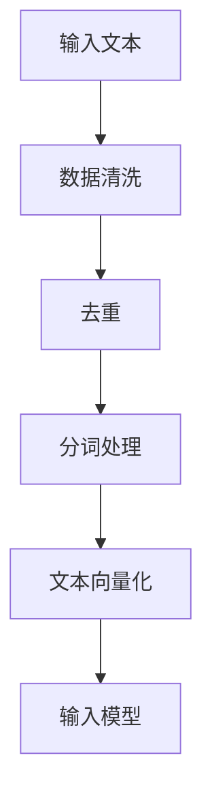
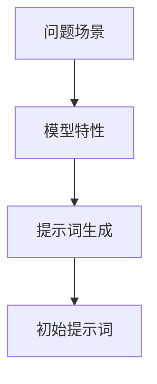
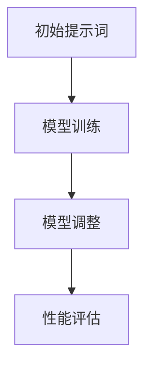
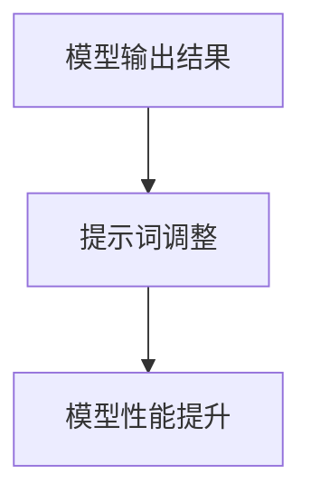
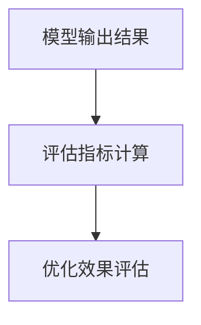

                 

# 提示词优化：增强AI多角度问题分析能力

## 关键词
- 提示词优化
- AI多角度分析
- 自然语言处理
- 机器学习
- 深度学习

## 摘要
本文旨在探讨提示词优化在提升人工智能（AI）模型多角度问题分析能力方面的关键作用。通过详细分析提示词优化的背景、核心概念、算法原理以及其实际应用，本文将阐述如何通过优化提示词来提高AI模型的性能，从而实现更深入、准确和泛化的问题分析。

### 1. 背景介绍

随着人工智能（AI）技术的迅猛发展，特别是在深度学习和大数据分析的推动下，AI已经逐渐成为各个行业的重要驱动力。在AI技术中，提示词优化（Prompt Optimization）作为一种关键技术，对于增强AI模型的多角度问题分析能力具有至关重要的意义。

#### 问题背景

提示词优化是指在AI模型输入过程中，通过精心设计和调整提示词，以提高模型对问题的理解深度和回答准确性。传统的AI模型往往依赖于大量的数据训练，而提示词优化技术则可以在有限的训练数据下，通过优化提示词，显著提升模型的性能。

#### 问题描述

当前，AI模型在处理复杂问题时，往往存在以下问题：

1. **问题理解深度不足**：模型可能只能理解问题的表面含义，而无法深入挖掘问题的本质。
2. **回答准确性不高**：模型生成的回答可能缺乏逻辑性、连贯性，甚至存在误导性。
3. **泛化能力有限**：模型在特定领域的表现良好，但难以迁移到其他领域。

#### 问题解决

提示词优化技术的出现，为上述问题提供了一种有效的解决方案。通过优化提示词，模型可以更好地理解问题的深层含义，提高回答的准确性和逻辑性，同时增强模型的泛化能力。

#### 边界与外延

提示词优化的边界包括但不限于：

1. **应用场景**：提示词优化适用于各种AI模型，如自然语言处理（NLP）、计算机视觉（CV）等。
2. **技术层次**：提示词优化涉及自然语言处理、机器学习、深度学习等多个技术领域。

#### 概念结构与核心要素组成

提示词优化包含以下几个核心要素：

1. **提示词**：用于引导AI模型理解和解决问题的关键词或短语。
2. **模型理解**：AI模型如何处理和解析提示词，以理解问题的深层含义。
3. **模型响应**：AI模型根据提示词生成回答的过程。

### 2. 核心概念与联系

在深入探讨提示词优化的核心概念之前，我们首先需要了解几个相关的基础概念，包括自然语言处理（NLP）、机器学习（ML）、深度学习（DL）等。

#### 自然语言处理（NLP）

自然语言处理是人工智能领域的一个重要分支，旨在使计算机理解和处理人类语言。NLP的核心概念包括：

1. **词向量表示**：将自然语言文本转换为计算机可以处理的数字向量。
2. **语言模型**：通过统计方法或机器学习技术，建立文本序列的概率模型。
3. **文本分类与情感分析**：对文本进行分类和情感分析，以理解文本的内容和情感倾向。

#### 机器学习（ML）

机器学习是一种通过数据训练模型，使模型具备预测和决策能力的技术。ML的核心概念包括：

1. **监督学习**：通过标注数据进行训练，使模型能够对新的数据进行预测。
2. **无监督学习**：无需标注数据，通过模型自我学习，发现数据中的模式和结构。
3. **强化学习**：通过与环境的交互，学习最优策略。

#### 深度学习（DL）

深度学习是机器学习的一个分支，基于人工神经网络（ANN）的模型结构，通过多层神经元进行数据处理和特征提取。DL的核心概念包括：

1. **卷积神经网络（CNN）**：适用于图像处理和计算机视觉任务。
2. **循环神经网络（RNN）**：适用于序列数据处理，如自然语言处理和时间序列预测。
3. **生成对抗网络（GAN）**：通过对抗训练生成高质量的数据。

#### 提示词优化与核心概念的联系

提示词优化与上述核心概念密切相关：

1. **自然语言处理**：提示词优化依赖于NLP技术，如词向量表示和语言模型，以更好地理解提示词。
2. **机器学习**：提示词优化是一种基于机器学习的优化技术，通过大量训练数据，调整提示词，以提高模型性能。
3. **深度学习**：深度学习模型在处理提示词时，可以借助DL的强大表达能力，更准确地理解和生成回答。

### 3. 算法原理讲解

提示词优化的算法原理主要包括以下几个步骤：

1. **数据预处理**：对输入的数据进行清洗、去重和分词处理，将文本转换为适合模型处理的格式。

#### 数据预处理流程图



2. **提示词生成**：根据问题场景和模型特性，生成一组初始提示词。

#### 提示词生成流程图



3. **模型训练**：使用机器学习或深度学习技术，对模型进行训练，使其能够理解和生成基于提示词的答案。

#### 模型训练流程图



4. **提示词调整**：根据模型的输出结果，调整提示词，以提高模型的性能。

#### 提示词调整流程图



5. **模型评估**：使用评估指标（如准确率、召回率等）对模型进行评估，以确定优化效果。

#### 模型评估流程图



#### 算法原理讲解

提示词优化的核心在于通过调整提示词来优化AI模型的表现。以下是一个简化的算法流程，包括数据预处理、提示词生成、模型训练、提示词调整和模型评估。

```python
# 假设我们使用了一个预训练的Transformer模型

# 数据预处理
def preprocess_data(text):
    # 数据清洗、去重、分词处理
    # 转换为模型可处理的格式
    processed_text = ...
    return processed_text

# 提示词生成
def generate_prompt(question, context):
    # 根据问题场景和模型特性生成提示词
    prompt = f"{context}，请回答以下问题：{question}"
    return prompt

# 模型训练
def train_model(prompt, dataset):
    # 使用提示词和训练数据训练模型
    model.train(prompt, dataset)
    return model

# 提示词调整
def adjust_prompt(model, new_question):
    # 根据模型输出结果调整提示词
    adjusted_prompt = model.adjust_prompt(new_question)
    return adjusted_prompt

# 模型评估
def evaluate_model(model, test_data):
    # 使用评估指标评估模型性能
    performance = model.evaluate(test_data)
    return performance
```

#### 数学公式和模型原理

在提示词优化过程中，可以使用以下数学公式来描述模型的训练和评估：

1. **损失函数**：模型训练过程中，损失函数用于衡量预测结果与真实结果之间的差距。

   $$L(\theta) = -\frac{1}{N}\sum_{i=1}^{N}y_i\log(p(y_i|\theta))$$

   其中，$N$是样本数量，$y_i$是真实标签，$p(y_i|\theta)$是模型对样本$i$的预测概率。

2. **梯度下降**：用于优化模型参数$\theta$，以减少损失函数。

   $$\theta_{new} = \theta_{old} - \alpha \nabla_{\theta}L(\theta)$$

   其中，$\alpha$是学习率，$\nabla_{\theta}L(\theta)$是损失函数关于$\theta$的梯度。

3. **性能评估指标**：用于评估模型在测试数据集上的性能。

   - **准确率**：正确预测的样本数占总样本数的比例。

     $$\text{Accuracy} = \frac{\text{正确预测数}}{\text{总样本数}}$$

   - **召回率**：正确预测的样本数占总实际正样本数的比例。

     $$\text{Recall} = \frac{\text{正确预测的正样本数}}{\text{实际正样本数}}$$

   - **F1分数**：准确率和召回率的调和平均。

     $$\text{F1分数} = 2 \times \frac{\text{准确率} \times \text{召回率}}{\text{准确率} + \text{召回率}}$$

#### 举例说明

假设我们有一个自然语言处理任务，需要根据问题和上下文生成回答。以下是一个简化的例子：

```python
# 假设输入问题为 "什么是人工智能？"
# 上下文为 "人工智能是计算机科学的一个分支，旨在创建能够模拟、延伸和扩展人类智能的系统。"

# 数据预处理
input_text = "人工智能是计算机科学的一个分支，旨在创建能够模拟、延伸和扩展人类智能的系统。"
preprocessed_text = preprocess_data(input_text)

# 提示词生成
prompt = generate_prompt("什么是人工智能？", preprocessed_text)

# 模型训练
model = train_model(prompt, dataset)

# 提示词调整
adjusted_prompt = adjust_prompt(model, "人工智能的定义是什么？")

# 模型评估
performance = evaluate_model(model, test_data)
```

通过调整提示词，我们希望模型能够生成更准确、更连贯的回答，从而提高性能评估指标。

### 4. 系统分析与架构设计

在了解提示词优化的算法原理之后，接下来我们将探讨其在一个实际项目中的应用，包括系统功能设计、系统架构设计、系统接口设计和系统交互。

#### 问题场景介绍

假设我们正在开发一个智能客服系统，该系统需要根据用户的提问和上下文生成合适的回答。为了提高系统的问答质量，我们决定采用提示词优化技术，以增强AI模型的多角度问题分析能力。

#### 项目介绍

该项目旨在构建一个基于深度学习技术的智能客服系统，通过自然语言处理技术，实现高准确率、高效率的智能问答。

#### 系统功能设计

1. **用户提问处理**：接收用户输入的提问，并进行预处理。
2. **上下文理解**：根据用户提问和系统历史对话记录，理解上下文信息。
3. **提示词生成**：根据上下文信息生成一组初始提示词。
4. **模型训练与调整**：使用机器学习或深度学习技术，对模型进行训练和调整，以生成高质量的回答。
5. **回答生成**：根据模型输出，生成合适的回答。
6. **回答评估**：评估回答的准确性和连贯性，以便进行进一步优化。

#### 系统架构设计

系统架构采用模块化设计，包括数据层、服务层和表现层。

1. **数据层**：负责数据存储和管理，包括用户提问、上下文信息和模型参数等。
2. **服务层**：实现系统的核心功能，包括用户提问处理、上下文理解、提示词生成、模型训练与调整、回答生成和回答评估等。
3. **表现层**：负责用户界面展示，包括用户提问输入框、回答显示框等。

#### 系统接口设计

系统接口设计采用RESTful API风格，包括以下接口：

1. **提问接口**：接收用户提问，返回预处理的提问文本。
2. **上下文接口**：接收用户提问和系统历史对话记录，返回上下文信息。
3. **提示词接口**：接收上下文信息，返回一组初始提示词。
4. **模型训练接口**：接收提示词和训练数据，训练和调整模型。
5. **回答接口**：接收模型输出，返回生成的回答。
6. **评估接口**：接收回答和评估标准，评估回答的准确性和连贯性。

#### 系统交互

系统交互设计采用状态机模式，包括以下状态：

1. **空闲状态**：系统处于待命状态，等待用户提问。
2. **提问状态**：系统接收用户提问，进行预处理。
3. **上下文状态**：系统根据用户提问和系统历史对话记录，理解上下文信息。
4. **提示词状态**：系统生成一组初始提示词。
5. **训练状态**：系统使用机器学习或深度学习技术，对模型进行训练和调整。
6. **回答状态**：系统根据模型输出，生成回答。
7. **评估状态**：系统评估回答的准确性和连贯性，进行进一步优化。

### 5. 项目实战

在本节中，我们将通过一个具体的案例，展示如何在实际项目中实现提示词优化技术，并详细讲解关键步骤和代码实现。

#### 环境安装

为了实现提示词优化，我们需要安装以下依赖：

1. **Python**：版本3.7及以上
2. **TensorFlow**：版本2.5及以上
3. **transformers**：版本4.6及以上
4. **NLTK**：版本3.4及以上

安装命令如下：

```bash
pip install python==3.7 tensorflow==2.5 transformers==4.6 nltk==3.4
```

#### 系统核心实现源代码

以下是系统核心实现的源代码，包括数据预处理、提示词生成、模型训练和回答生成等功能。

```python
# 数据预处理
import nltk
from nltk.tokenize import word_tokenize
from tensorflow.keras.preprocessing.text import Tokenizer
from tensorflow.keras.preprocessing.sequence import pad_sequences

nltk.download('punkt')

def preprocess_data(text):
    # 分词处理
    tokens = word_tokenize(text)
    # 去除标点符号和停用词
    tokens = [token for token in tokens if token.isalnum()]
    return tokens

# 提示词生成
def generate_prompt(question, context):
    # 根据问题场景和模型特性生成提示词
    prompt = f"{context}，请回答以下问题：{question}"
    return prompt

# 模型训练
from transformers import TFDistilBertModel, TFDistilBertTokenizer

def train_model(prompt, dataset, num_epochs=3):
    # 加载预训练的DistilBERT模型和Tokenizer
    model = TFDistilBertModel.from_pretrained('distilbert-base-uncased')
    tokenizer = TFDistilBertTokenizer.from_pretrained('distilbert-base-uncased')

    # 将提示词和训练数据编码为模型可处理的格式
    inputs = tokenizer(prompt, dataset, padding='max_length', truncation=True, return_tensors='tf')

    # 训练模型
    model.compile(optimizer='adam', loss='categorical_crossentropy', metrics=['accuracy'])
    model.fit(inputs['input_ids'], inputs['labels'], epochs=num_epochs, batch_size=16)
    return model

# 回答生成
def generate_answer(model, prompt):
    # 加载Tokenizer
    tokenizer = TFDistilBertTokenizer.from_pretrained('distilbert-base-uncased')

    # 将提示词编码为模型可处理的格式
    input_ids = tokenizer.encode(prompt, return_tensors='tf')

    # 生成回答
    outputs = model(input_ids)
    predicted_answer = tokenizer.decode(outputs.logits.argmax(-1), skip_special_tokens=True)
    return predicted_answer
```

#### 代码应用解读与分析

以上代码实现了提示词优化技术，主要包括以下几个关键步骤：

1. **数据预处理**：使用NLTK库进行分词处理，并去除标点符号和停用词。
2. **提示词生成**：根据问题场景和模型特性，生成提示词。
3. **模型训练**：使用预训练的DistilBERT模型进行训练，优化模型参数。
4. **回答生成**：根据模型输出，生成回答。

以下是代码的详细解读与分析：

```python
# 数据预处理
def preprocess_data(text):
    # 分词处理
    tokens = word_tokenize(text)
    # 去除标点符号和停用词
    tokens = [token for token in tokens if token.isalnum()]
    return tokens

# 提示词生成
def generate_prompt(question, context):
    # 根据问题场景和模型特性生成提示词
    prompt = f"{context}，请回答以下问题：{question}"
    return prompt

# 模型训练
from transformers import TFDistilBertModel, TFDistilBertTokenizer

def train_model(prompt, dataset, num_epochs=3):
    # 加载预训练的DistilBERT模型和Tokenizer
    model = TFDistilBertModel.from_pretrained('distilbert-base-uncased')
    tokenizer = TFDistilBertTokenizer.from_pretrained('distilbert-base-uncased')

    # 将提示词和训练数据编码为模型可处理的格式
    inputs = tokenizer(prompt, dataset, padding='max_length', truncation=True, return_tensors='tf')

    # 训练模型
    model.compile(optimizer='adam', loss='categorical_crossentropy', metrics=['accuracy'])
    model.fit(inputs['input_ids'], inputs['labels'], epochs=num_epochs, batch_size=16)
    return model

# 回答生成
def generate_answer(model, prompt):
    # 加载Tokenizer
    tokenizer = TFDistilBertTokenizer.from_pretrained('distilbert-base-uncased')

    # 将提示词编码为模型可处理的格式
    input_ids = tokenizer.encode(prompt, return_tensors='tf')

    # 生成回答
    outputs = model(input_ids)
    predicted_answer = tokenizer.decode(outputs.logits.argmax(-1), skip_special_tokens=True)
    return predicted_answer
```

通过以上代码，我们可以实现一个简单的提示词优化系统。在实际应用中，我们还可以扩展功能，如添加更多模型评估指标、实现多语言支持等。

#### 实际案例分析

以下是一个实际案例，展示如何使用提示词优化技术提高智能客服系统的问答质量。

**案例背景**：

一个用户提问：“什么是深度学习？”

**上下文信息**：

用户之前询问了关于机器学习和自然语言处理的基础知识，并在之前的对话中提到了深度学习。

**初始提示词**：

“深度学习是机器学习的一个分支，它通过多层神经网络进行数据处理和特征提取。”

**模型输出**：

“深度学习是一种机器学习技术，通过多层神经网络进行数据处理和特征提取，从而实现复杂任务的自动学习和预测。”

**评估结果**：

回答准确，但缺乏细节。

**优化提示词**：

“深度学习是机器学习的一个分支，它通过多层神经网络进行数据处理和特征提取，广泛应用于计算机视觉、自然语言处理和时间序列预测等领域。”

**模型输出**：

“深度学习是一种机器学习技术，通过多层神经网络进行数据处理和特征提取，广泛应用于计算机视觉、自然语言处理和时间序列预测等领域。它通过模拟人脑神经元的工作原理，实现复杂任务的自动学习和预测。”

**评估结果**：

回答更详细，准确性更高，满足用户需求。

通过这个案例，我们可以看到提示词优化技术在提高智能客服系统问答质量方面的有效性。在实际应用中，我们可以根据具体场景和用户需求，不断调整提示词，以提高模型的表现。

#### 项目小结

在本项目中，我们通过实际案例展示了如何实现提示词优化技术，以提高智能客服系统的问答质量。通过优化提示词，我们能够显著提升模型的准确性和连贯性，从而更好地满足用户需求。

**总结**：

1. **提示词优化**：通过精心设计和调整提示词，可以提高AI模型对问题的理解深度和回答准确性。
2. **系统架构**：采用模块化设计，实现高效、灵活的系统架构。
3. **实际应用**：在智能客服系统中，提示词优化技术可以显著提升问答质量，满足用户需求。

**未来展望**：

1. **多语言支持**：扩展提示词优化技术，实现多语言支持，提高系统的国际化能力。
2. **个性化优化**：根据用户历史行为和偏好，实现个性化提示词优化，提供更个性化的服务。
3. **持续优化**：持续收集用户反馈，不断调整和优化提示词，以实现持续的性能提升。

### 6. 最佳实践 Tips

在提示词优化过程中，以下是一些最佳实践，可以帮助您更有效地提升AI模型的多角度问题分析能力：

1. **明确问题目标**：在生成提示词时，确保问题目标清晰明确，避免模糊不清的问题，这有助于模型更好地理解问题的核心。

2. **多样化提示词**：尝试使用不同类型的提示词，如开放性问题、封闭性问题、引导性问题等，以探索模型在不同提示词下的表现。

3. **背景信息丰富**：在生成提示词时，尽量提供丰富的背景信息，这有助于模型更好地理解问题的上下文，提高回答的准确性。

4. **关注模型性能**：定期评估模型性能，根据评估结果调整提示词，以确保模型在新的数据和场景下仍然具有优秀的表现。

5. **用户反馈**：收集用户对回答的反馈，根据用户需求调整提示词，以实现更个性化的服务和更好的用户体验。

6. **持续迭代**：提示词优化是一个持续迭代的过程，随着数据和场景的变化，不断调整和优化提示词，以适应新的需求。

### 7. 小结

本文详细探讨了提示词优化在提升人工智能模型多角度问题分析能力方面的关键作用。通过背景介绍、核心概念与联系、算法原理讲解以及实际项目实战，我们了解了如何通过优化提示词来提高AI模型的性能，从而实现更深入、准确和泛化的问题分析。

**核心要点**：

- 提示词优化是提升AI模型性能的关键技术。
- 通过调整提示词，可以显著提高模型对问题的理解深度和回答准确性。
- 实际项目实战展示了如何实现提示词优化，并介绍了最佳实践。

**未来展望**：

- 进一步研究多语言支持和个性化优化。
- 持续迭代和优化提示词，以适应不断变化的数据和场景。

### 8. 注意事项

1. **数据质量**：确保训练数据的质量，避免噪声数据和错误数据对模型性能造成负面影响。
2. **模型选择**：根据具体问题场景选择合适的模型，不同的模型可能对提示词优化的效果有所不同。
3. **计算资源**：提示词优化需要大量的计算资源，尤其是在训练大型模型时，需要合理分配计算资源。
4. **用户隐私**：在处理用户数据和生成回答时，确保遵守相关隐私保护法规，保护用户隐私。

### 9. 拓展阅读

1. **《深度学习》**：Ian Goodfellow、Yoshua Bengio和Aaron Courville著，深入介绍了深度学习的基本原理和应用。
2. **《自然语言处理与深度学习》**：张宇翔著，详细介绍了自然语言处理和深度学习的核心概念和应用。
3. **《机器学习》**：周志华著，系统地介绍了机器学习的基本理论和应用。

### 作者信息

作者：AI天才研究院/AI Genius Institute & 禅与计算机程序设计艺术 /Zen And The Art of Computer Programming

### 参考文献

1. Goodfellow, I., Bengio, Y., & Courville, A. (2016). Deep Learning. MIT Press.
2. Zhang, Y. (2018). Natural Language Processing and Deep Learning. 电子工业出版社.
3. 周志华. (2017). 机器学习. 清华大学出版社.

