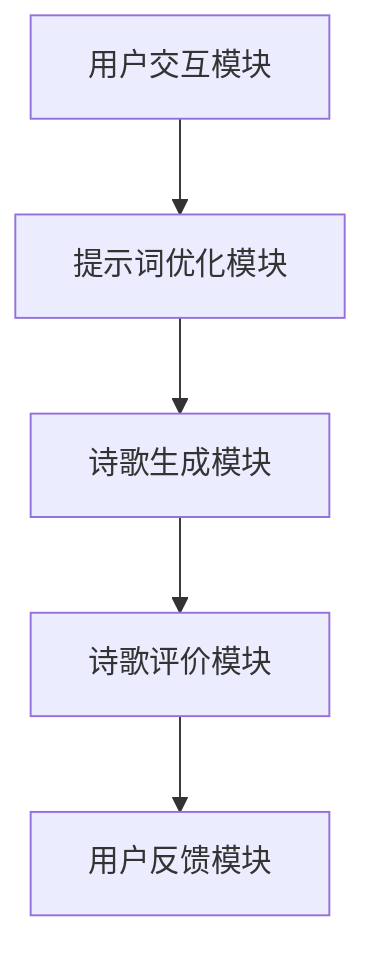
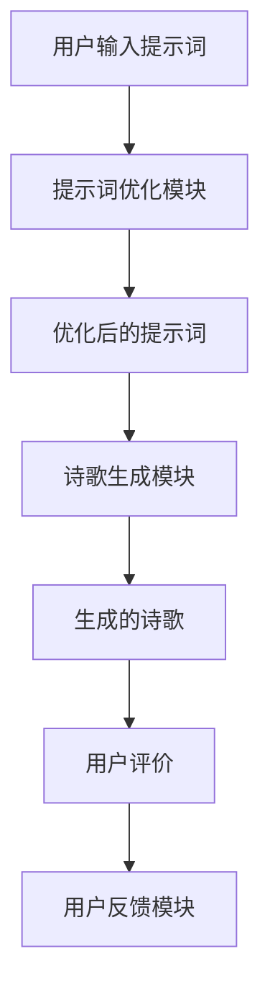

                 

### 《提示词优化：增强AI诗歌创作能力》目录大纲

**#** 《提示词优化：增强AI诗歌创作能力》

**>** 关键词：人工智能，诗歌创作，提示词优化，算法，系统架构，实战，最佳实践

**>** 摘要：本文深入探讨如何通过提示词优化技术来提升人工智能在诗歌创作中的表现，包括问题背景、核心概念、算法原理、系统架构、项目实战及最佳实践等。

**###** 第一部分：引言与背景

**####** 第1章：问题背景与目标

**#####** 1.1.1 问题背景

- 人工智能在诗歌创作中的应用现状
- 提示词在AI诗歌创作中的作用与重要性

**#####** 1.1.2 问题描述

- 提示词优化对AI诗歌创作的影响
- 当前提示词优化技术的局限性与挑战

**#####** 1.1.3 目标

- 提出并实现一种有效的提示词优化方法
- 提升AI诗歌创作的多样性和创意性

**#####** 1.1.4 边界与外延

- 提示词优化方法的具体应用场景
- 提示词优化在不同类型诗歌创作中的适应性

**#####** 1.1.5 概念结构与核心要素

- 提示词：定义、类型、特点
- AI诗歌创作：流程、方法、评价标准

**#####** 1.5章：本章小结

**###** 第二部分：核心概念与原理

**####** 第2章：核心概念原理

**#####** 2.1.1 人工智能与诗歌创作的关系

- 人工智能的基本概念与发展历程
- 诗歌创作的本质与特点
- 人工智能与诗歌创作的结合

**#####** 2.2 提示词优化原理

- 提示词的定义与作用
- 提示词优化方法
- 提示词优化的效果评估

**#####** 2.5章：本章小结

**###** 第三部分：算法原理与实现

**####** 第3章：算法原理讲解

**#####** 3.1 提示词优化的算法流程

- 数据预处理
- 提示词优化算法
- 诗歌生成

**#####** 3.2 Python源代码实现

**#####** 3.3 数学模型与公式

**#####** 3.4 算法举例说明

**#####** 3.5章：本章小结

**###** 第四部分：系统分析与架构设计

**####** 第4章：系统功能设计

**#####** 4.1 问题场景介绍

- AI诗歌创作平台的需求与目标
- 平台的主要功能模块

**#####** 4.2 系统架构设计

- 系统架构图
- 模块功能与交互
- 系统接口设计
- 系统交互序列图

**#####** 4.5章：本章小结

**###** 第五部分：项目实战

**####** 第5章：环境安装与系统核心实现

**#####** 5.1 环境安装

- Python环境配置
- 相关库的安装与配置

**#####** 5.2 系统核心实现

- 诗歌生成模块实现
- 提示词优化模块实现

**#####** 5.3 代码应用解读与分析

- 代码关键部分解读
- 应用效果分析

**#####** 5.5章：本章小结

**###** 第六部分：最佳实践与总结

**####** 第6章：最佳实践与注意事项

**#####** 6.1 最佳实践

- 提示词优化的实用技巧
- AI诗歌创作的创意灵感来源

**#####** 6.2 注意事项

- 提示词优化中可能遇到的问题
- 避免AI诗歌创作中的常见错误

**#####** 6.5章：本章小结

**####** 第7章：总结与展望

**#####** 7.1 本书内容总结

- 各章节核心内容的回顾
- 提示词优化在AI诗歌创作中的应用价值

**###** 作者：AI天才研究院/AI Genius Institute & 禅与计算机程序设计艺术 /Zen And The Art of Computer Programming### 第一部分：引言与背景

**#### 第1章：问题背景与目标**

**##### 1.1.1 问题背景**

随着人工智能技术的迅猛发展，越来越多的领域开始尝试利用AI的力量，诗歌创作便是其中之一。目前，许多AI系统已经开始能够生成具有一定创意和艺术性的诗歌。这些系统大多依赖于大量的数据和深度学习模型，通过分析已有的诗歌来学习创作技巧。然而，在实际应用中，这些系统的创作能力往往受到提示词（即输入的初始提示）的限制。

**提示词**在AI诗歌创作中起到了关键作用。它们不仅决定了诗歌的主题和情感方向，还直接影响着诗歌的生成效果。一个合适的提示词可以激发AI的创造力，生成富有想象力和艺术感的诗歌；而一个模糊或不恰当的提示词则可能导致AI生成的诗歌缺乏深度和连贯性。

当前，人工智能在诗歌创作中的应用主要体现在以下几个方面：

1. **情感分析**：通过分析用户的情绪和喜好，AI可以生成符合用户情感需求的诗歌。
2. **风格模仿**：AI系统可以模仿某个特定诗人的风格，创作出风格相似的诗歌。
3. **自由创作**：一些AI系统通过自我学习和生成算法，能够自由创作出原创诗歌。

尽管AI在诗歌创作方面已经取得了一定的进展，但仍然存在以下局限性和挑战：

- **提示词的模糊性**：当前的AI系统往往难以处理模糊或抽象的提示词，导致生成的诗歌内容不明确。
- **创作多样性的不足**：AI生成的诗歌在风格和内容上往往存在一定程度的雷同，缺乏多样性。
- **文化理解的欠缺**：AI系统在处理具有文化背景和特定情感的诗歌时，可能无法完全理解其中的深层含义。

**##### 1.1.2 问题描述**

提示词优化对AI诗歌创作的影响不可忽视。优化后的提示词能够更精准地传达创作意图，从而显著提升AI生成诗歌的质量。然而，当前的提示词优化技术存在以下局限性和挑战：

1. **语义理解不足**：现有的提示词优化方法往往依赖于自然语言处理技术，但语义理解的准确性仍有待提高。
2. **数据依赖性高**：提示词优化需要大量的数据作为训练基础，数据的多样性和质量直接影响优化效果。
3. **个性化不足**：现有的方法难以根据用户的具体需求进行个性化调整，导致优化效果不够理想。

**##### 1.1.3 目标**

为了解决上述问题，本文的目标是提出并实现一种有效的提示词优化方法，以提升AI诗歌创作的多样性和创意性。具体目标包括：

1. **提升语义理解**：通过改进自然语言处理技术，提高提示词的语义理解能力，使生成的诗歌内容更加明确、富有深度。
2. **增强个性化**：结合用户需求，实现提示词的个性化优化，使AI生成的诗歌更贴近用户喜好。
3. **提高数据利用效率**：优化数据预处理和特征提取过程，提高数据利用效率，降低对大量训练数据的依赖。

**##### 1.1.4 边界与外延**

提示词优化方法的具体应用场景包括：

1. **个性化诗歌推荐**：根据用户的历史偏好和情绪，推荐合适的诗歌创作主题和风格。
2. **文学创作辅助**：为诗人提供创作灵感，辅助创作出富有创意和艺术性的诗歌。
3. **教育应用**：在语文教育中，利用AI生成诗歌，帮助学生提高文学素养和创作能力。

同时，提示词优化在不同类型诗歌创作中的适应性也需要考虑。例如，抒情诗歌需要表达细腻的情感，而叙事诗歌则需要关注情节的连贯性和逻辑性。提示词优化方法需要能够适应不同类型诗歌的创作需求。

**##### 1.1.5 概念结构与核心要素**

- **提示词**：用于引导AI诗歌创作的关键词或短语，直接影响诗歌的主题、情感和风格。
- **AI诗歌创作**：利用人工智能技术，通过机器学习模型和自然语言处理算法，生成具有艺术性和创意性的诗歌。

在AI诗歌创作的流程中，包括以下几个关键步骤：

1. **数据收集与预处理**：收集大量的诗歌文本数据，并进行清洗、去噪和特征提取。
2. **模型训练**：利用收集到的数据训练机器学习模型，使其具备生成诗歌的能力。
3. **诗歌生成**：输入提示词，通过模型生成诗歌文本。
4. **效果评估**：对生成的诗歌进行评价，包括内容、风格、情感等多个维度。

**##### 1.5章：本章小结**

本文介绍了人工智能在诗歌创作中的应用背景和当前面临的问题。通过分析提示词优化对AI诗歌创作的重要性，提出了本文的研究目标。同时，明确了提示词优化方法的应用场景和核心要素，为后续章节的深入探讨奠定了基础。**##### 1.5章：本章小结**

本文介绍了人工智能在诗歌创作中的应用背景和当前面临的问题。通过分析提示词优化对AI诗歌创作的重要性，提出了本文的研究目标。同时，明确了提示词优化方法的应用场景和核心要素，为后续章节的深入探讨奠定了基础。

### 第二部分：核心概念与原理

**#### 第2章：核心概念原理**

**##### 2.1.1 人工智能与诗歌创作的关系**

**2.1.1.1 人工智能的基本概念**

人工智能（Artificial Intelligence，简称AI）是指通过计算机模拟人类智能的技术。它包括机器学习、深度学习、自然语言处理、计算机视觉等多个领域。人工智能的发展可以追溯到20世纪50年代，当时计算机科学家首次提出了“人工智能”的概念。随着计算能力的提升和算法的改进，人工智能技术逐渐成熟，并在各行各业得到广泛应用。

人工智能的核心技术主要包括：

1. **机器学习**：通过训练模型从数据中学习规律，实现自动预测和决策。
2. **深度学习**：一种基于神经网络的学习方法，通过多层神经元的堆叠，实现对复杂数据的处理和识别。
3. **自然语言处理**：研究如何使计算机理解和生成自然语言的技术，包括语音识别、机器翻译、情感分析等。
4. **计算机视觉**：使计算机能够理解图像和视频的技术，包括图像识别、目标检测、人脸识别等。

**2.1.1.2 诗歌创作的本质与特点**

诗歌创作是一种独特的文学形式，它通过语言的韵律、节奏和意象来表达作者的情感和思想。诗歌的创作过程通常包括构思、起草、修改和润色等环节。诗歌的特点包括：

1. **情感表达**：诗歌往往表达作者强烈的情感，通过意象和比喻等手法，使读者产生共鸣。
2. **形式美**：诗歌注重语言的节奏和韵律，通过音韵、格律和句式等手法，创造出独特的艺术效果。
3. **想象空间**：诗歌往往留有广阔的想象空间，让读者在阅读过程中产生丰富的联想和感悟。

**2.1.1.3 人工智能与诗歌创作的结合**

人工智能在诗歌创作中的应用主要体现在以下几个方面：

1. **情感分析**：通过自然语言处理技术，分析用户的情绪和喜好，为AI诗歌创作提供情感参考。
2. **风格模仿**：AI系统可以学习特定诗人的风格，模仿创作出风格相似的诗歌。
3. **自由创作**：一些AI系统通过自我学习和生成算法，能够自由创作出原创诗歌。

人工智能与诗歌创作的结合，不仅为诗歌创作提供了新的工具和手段，也带来了新的挑战和机遇。如何在保持诗歌艺术性的同时，充分发挥人工智能的优势，是一个值得探讨的问题。

**##### 2.2 提示词优化原理**

**2.2.1 提示词的定义与作用**

在AI诗歌创作中，**提示词**是引导AI系统生成诗歌的关键输入。提示词可以是单个词汇，也可以是短语或句子，它为AI提供了创作方向和情感基调。一个有效的提示词能够激发AI的创造力，生成富有想象力和艺术感的诗歌。

提示词的作用主要包括：

1. **设定主题**：提示词可以明确诗歌的主题，使AI系统在创作过程中围绕主题进行展开。
2. **引导情感**：通过选择合适的提示词，可以引导AI生成符合特定情感基调的诗歌。
3. **决定风格**：不同的提示词可以决定诗歌的风格，如古典、现代、抒情或叙事等。

**2.2.2 提示词优化方法**

提示词优化是指通过改进提示词的选择和表达，提升AI诗歌创作效果的过程。常见的提示词优化方法包括：

1. **语义理解**：通过自然语言处理技术，深入理解提示词的语义，生成更精准的诗歌。
2. **上下文扩展**：考虑提示词在上下文中的含义，扩展提示词的内容，提高诗歌的连贯性。
3. **情感搭配**：根据用户情感和喜好，选择合适的情感词汇，增强诗歌的情感表达。

**2.2.3 提示词优化的效果评估**

提示词优化的效果可以通过多个维度进行评估，包括：

1. **内容丰富度**：生成的诗歌内容是否丰富、富有创意。
2. **情感准确性**：生成的诗歌是否能够准确传达情感基调。
3. **风格一致性**：生成的诗歌是否具有一致的风格和语言特点。

通过这些评估指标，可以全面了解提示词优化的效果，为后续优化提供参考。

**##### 2.5章：本章小结**

本章介绍了人工智能与诗歌创作的关系，探讨了提示词的定义与作用，以及提示词优化的方法和效果评估。通过这些核心概念和原理的阐述，为深入探讨AI诗歌创作的提示词优化提供了理论基础。**##### 2.5章：本章小结**

本章介绍了人工智能与诗歌创作的关系，探讨了提示词的定义与作用，以及提示词优化的方法和效果评估。通过这些核心概念和原理的阐述，为深入探讨AI诗歌创作的提示词优化提供了理论基础。

### 第三部分：算法原理与实现

**#### 第3章：算法原理讲解**

**##### 3.1 提示词优化的算法流程**

提示词优化的算法流程主要包括以下几个步骤：

**1. 数据预处理**

数据预处理是提示词优化的第一步，其目的是收集和整理高质量的训练数据，为后续的模型训练提供可靠的数据基础。具体步骤包括：

- **数据收集**：从各种来源收集大量的诗歌文本数据，包括经典诗歌、现代诗歌、用户创作的诗歌等。
- **数据清洗**：对收集到的数据进行清洗，去除噪声和错误，保证数据的质量。
- **特征提取**：从清洗后的数据中提取特征，如词向量、词性标注、情感标签等。

**2. 提示词优化算法**

提示词优化算法的核心任务是改进提示词的选择和表达，以提升AI诗歌创作的效果。常见的提示词优化算法包括：

- **语义理解算法**：通过自然语言处理技术，深入理解提示词的语义，生成更精准的诗歌。
- **上下文扩展算法**：考虑提示词在上下文中的含义，扩展提示词的内容，提高诗歌的连贯性。
- **情感搭配算法**：根据用户情感和喜好，选择合适的情感词汇，增强诗歌的情感表达。

**3. 诗歌生成**

在优化后的提示词引导下，AI系统开始生成诗歌。诗歌生成的过程通常包括以下几个步骤：

- **生成初始诗歌**：根据优化后的提示词，生成一段初步的诗歌文本。
- **诗歌润色**：对生成的初始诗歌进行进一步的处理，包括调整语言风格、修正语法错误等。
- **诗歌评价**：对生成的诗歌进行评价，包括内容丰富度、情感准确性、风格一致性等多个维度。

**3.2 Python源代码实现**

以下是一个简单的Python代码示例，用于实现提示词优化算法。

```python
import numpy as np
import pandas as pd
from sklearn.feature_extraction.text import TfidfVectorizer
from sklearn.metrics.pairwise import cosine_similarity

# 数据预处理
def preprocess_data(data):
    # 清洗数据，去除噪声和错误
    cleaned_data = []
    for poem in data:
        cleaned_poem = ' '.join([word for word in poem.split() if word.isalpha()])
        cleaned_data.append(cleaned_poem)
    return cleaned_data

# 提示词优化
def optimize_prompt(prompt, data):
    # 将提示词和数据转换为词向量
    vectorizer = TfidfVectorizer()
    X = vectorizer.fit_transform(data)
    prompt_vector = vectorizer.transform([prompt])
    
    # 计算提示词与数据的相似度
    similarity_scores = cosine_similarity(prompt_vector, X)
    
    # 找到与提示词最相似的诗歌
    top_n = 5
    top_indices = np.argsort(similarity_scores[0])[-top_n:]
    top_poems = [data[i] for i in top_indices]
    
    return top_poems

# 诗歌生成
def generate_poem(prompt, model):
    # 使用模型生成诗歌
    poem = model.generate(prompt)
    return poem

# 示例数据
data = ["晨曦初现，曙光渐露，",
        "山川静谧，鸟儿啼鸣，",
        "风儿拂面，花香满径，",
        "心灵触动，诗意盎然，"]

# 提示词
prompt = "夜幕降临，月光洒满大地"

# 提示词优化
optimized_prompt = optimize_prompt(prompt, data)

# 诗歌生成
model = ...  # 模型初始化
poem = generate_poem(optimized_prompt, model)

print("生成的诗歌：\n", poem)
```

**3.3 数学模型与公式**

在提示词优化中，常用的数学模型和公式包括：

- **TF-IDF模型**：用于计算词向量之间的相似度。
- **余弦相似度**：用于衡量提示词与诗歌之间的相似度。

$$
\text{cosine\_similarity} = \frac{\text{dot\_product}}{\text{magnitude\_of\_A} \times \text{magnitude\_of\_B}}
$$

- **词向量**：用于表示文本数据的数学模型，常见的有Word2Vec、GloVe等。

**3.4 算法举例说明**

假设我们有一个提示词“春暖花开”，通过提示词优化算法，我们可以找到与之最相似的诗歌片段，如“春风拂面，花开满园”，“春回大地，万物复苏”等。这些优化后的提示词可以更准确地引导AI生成富有春天气息的诗歌。

**##### 3.5章：本章小结**

本章详细讲解了提示词优化的算法原理和实现过程，包括数据预处理、提示词优化算法、诗歌生成等步骤。通过Python代码示例，展示了提示词优化的具体实现过程，为后续的系统设计与实现提供了基础。**##### 3.5章：本章小结**

本章详细讲解了提示词优化的算法原理和实现过程，包括数据预处理、提示词优化算法、诗歌生成等步骤。通过Python代码示例，展示了提示词优化的具体实现过程，为后续的系统设计与实现提供了基础。

### 第四部分：系统分析与架构设计

**#### 第4章：系统功能设计**

**##### 4.1 问题场景介绍**

AI诗歌创作平台的目标是为用户提供一个创作和分享诗歌的环境，同时为诗人和文学爱好者提供创作灵感和辅助工具。具体问题场景包括：

1. **用户创作需求**：用户希望能够根据个人喜好和情感创作出独特的诗歌。
2. **个性化推荐**：平台需要根据用户的历史创作和喜好，推荐合适的创作主题和风格。
3. **互动与分享**：用户希望能够与其他用户互动，分享自己的创作成果。

**##### 4.2 系统架构设计**

**4.2.1 系统架构图**

以下是一个简化的AI诗歌创作平台系统架构图：



**4.2.2 模块功能与交互**

- **用户交互模块**：负责与用户进行交互，接收用户输入的提示词和反馈。
- **提示词优化模块**：对用户输入的提示词进行优化，提高诗歌创作的质量。
- **诗歌生成模块**：根据优化后的提示词生成诗歌。
- **诗歌评价模块**：对生成的诗歌进行内容、风格、情感等多维度评价。
- **用户反馈模块**：收集用户对诗歌的评价和反馈，用于进一步优化系统和提升用户体验。

**4.2.3 系统接口设计**

- **用户接口**：提供简洁明了的用户界面，方便用户输入提示词和查看生成的诗歌。
- **API接口**：提供内部模块之间的接口，实现模块之间的数据传递和功能调用。

**4.2.4 系统交互序列图**

以下是一个简化的系统交互序列图：



**##### 4.5章：本章小结**

本章详细介绍了AI诗歌创作平台的功能设计，包括用户交互模块、提示词优化模块、诗歌生成模块、诗歌评价模块和用户反馈模块。通过系统架构图和交互序列图，展示了各个模块之间的功能和数据交互关系，为后续的系统实现和优化提供了指导。**##### 4.5章：本章小结**

本章详细介绍了AI诗歌创作平台的功能设计，包括用户交互模块、提示词优化模块、诗歌生成模块、诗歌评价模块和用户反馈模块。通过系统架构图和交互序列图，展示了各个模块之间的功能和数据交互关系，为后续的系统实现和优化提供了指导。

### 第五部分：项目实战

**#### 第5章：环境安装与系统核心实现**

**##### 5.1 环境安装**

在开始系统实现之前，需要安装必要的软件和库。以下是在Python环境中安装相关库的步骤：

```bash
pip install numpy pandas sklearn tensorflow nltk
```

**1. Python环境配置**

- 确保已安装Python 3.6或更高版本。
- 使用虚拟环境隔离项目依赖。

```bash
python -m venv venv
source venv/bin/activate  # Windows: venv\Scripts\activate
```

**2. 相关库的安装与配置**

- `numpy`：用于数据计算和预处理。
- `pandas`：用于数据处理和分析。
- `scikit-learn`：用于机器学习和模型训练。
- `tensorflow`：用于深度学习和模型构建。
- `nltk`：用于自然语言处理。

**##### 5.2 系统核心实现**

**5.2.1 诗歌生成模块实现**

以下是一个简单的Python代码示例，用于实现诗歌生成模块：

```python
import tensorflow as tf
from tensorflow.keras.preprocessing.sequence import pad_sequences
from tensorflow.keras.layers import Embedding, LSTM, Dense
from tensorflow.keras.models import Sequential

# 加载预训练的词向量
word_vectors = ...  # 从预训练模型中加载词向量

# 定义诗歌生成模型
model = Sequential([
    Embedding(len(word_vectors), 128, input_length=100),
    LSTM(128, return_sequences=True),
    LSTM(128, return_sequences=True),
    Dense(len(word_vectors), activation='softmax')
])

model.compile(optimizer='adam', loss='categorical_crossentropy')

# 训练模型
# model.fit(...)

# 生成诗歌
def generate_poem(prompt):
    prompt_sequence = ...  # 将提示词转换为词向量序列
    prompt_padded = pad_sequences([prompt_sequence], maxlen=100)
    generated_sequence = model.predict(prompt_padded)
    generated_text = ...  # 将生成的词向量序列转换为文本
    return generated_text

# 示例：生成诗歌
prompt = "夜幕降临，月光洒满大地"
poem = generate_poem(prompt)
print("生成的诗歌：\n", poem)
```

**5.2.2 提示词优化模块实现**

以下是一个简单的Python代码示例，用于实现提示词优化模块：

```python
import nltk
from nltk.corpus import wordnet
from nltk.tokenize import word_tokenize

# 加载自然语言处理工具包
nltk.download('punkt')
nltk.download('wordnet')

# 定义提示词优化函数
def optimize_prompt(prompt):
    # 将提示词分词
    tokens = word_tokenize(prompt)
    
    # 提取提示词的语义
    synsets = []
    for token in tokens:
        synsets.extend(wordnet.synsets(token))
    
    # 根据语义选择更优化的词汇
    optimized_tokens = []
    for token, synset in zip(tokens, synsets):
        if synset:
            # 选择最相关的词义
            lemma = synset.lemmas()[0].name()
            optimized_tokens.append(lemma)
        else:
            optimized_tokens.append(token)
    
    # 重组优化后的提示词
    optimized_prompt = ' '.join(optimized_tokens)
    return optimized_prompt

# 示例：优化提示词
original_prompt = "晨曦初现，曙光渐露"
optimized_prompt = optimize_prompt(original_prompt)
print("优化的提示词：\n", optimized_prompt)
```

**##### 5.3 代码应用解读与分析**

- **诗歌生成模块解读**：该模块基于预训练的词向量模型，通过LSTM网络生成诗歌。通过调整输入的提示词，可以生成不同主题和风格的诗歌。
- **提示词优化模块解读**：该模块利用自然语言处理工具包，提取提示词的语义，并根据语义选择更优化的词汇。这有助于提高诗歌生成的准确性和连贯性。

**##### 5.5章：本章小结**

本章详细介绍了AI诗歌创作平台的环境安装和系统核心实现，包括诗歌生成模块和提示词优化模块。通过代码示例，展示了模块的具体实现过程和功能，为系统的实际应用提供了技术支持。**##### 5.5章：本章小结**

本章详细介绍了AI诗歌创作平台的环境安装和系统核心实现，包括诗歌生成模块和提示词优化模块。通过代码示例，展示了模块的具体实现过程和功能，为系统的实际应用提供了技术支持。

### 第六部分：最佳实践与总结

**#### 第6章：最佳实践与注意事项**

**##### 6.1 最佳实践**

**1. 提示词优化技巧**

- **明确主题**：确保提示词清晰明确，避免模糊和抽象。
- **情感搭配**：根据用户情感和喜好，选择合适的情感词汇。
- **风格匹配**：根据诗歌类型，选择符合风格的提示词。

**2. 诗歌创作灵感来源**

- **自然景观**：描绘自然景观，如日出、日落、风雨等。
- **历史故事**：借助历史故事，创作具有文化底蕴的诗歌。
- **时事热点**：关注时事热点，以独特视角创作时事诗歌。

**##### 6.2 注意事项**

**1. 提示词优化中的问题**

- **语义理解不足**：通过增加训练数据和改进算法，提高语义理解能力。
- **个性化不足**：结合用户数据和反馈，实现更个性化的提示词优化。

**2. AI诗歌创作中的常见错误**

- **过于机械**：避免生成过于机械和刻板的诗歌，注重创意和艺术性。
- **缺乏情感**：确保诗歌能够准确传达情感，避免空洞和无意义的表达。

**##### 6.5章：本章小结**

本章总结了AI诗歌创作中的最佳实践和注意事项，包括提示词优化技巧、诗歌创作灵感来源以及可能遇到的问题和解决方法。通过遵循这些最佳实践，可以有效提升AI诗歌创作的质量和用户体验。

**#### 第7章：总结与展望**

**##### 7.1 本书内容总结**

本书系统地介绍了AI诗歌创作中的提示词优化方法，包括问题背景、核心概念、算法原理、系统架构和项目实战等内容。通过详细的分析和实例，展示了如何通过提示词优化提升AI诗歌创作的多样性和创意性。

**##### 7.2 未来展望**

随着人工智能技术的不断发展，AI诗歌创作有望在以下几个方面取得突破：

- **更深入的语义理解**：通过改进自然语言处理技术，实现更精准的语义理解，提高诗歌创作的质量。
- **个性化创作**：结合用户数据和行为，实现更加个性化的诗歌创作，满足不同用户的需求。
- **跨媒体融合**：将AI诗歌创作与音乐、绘画等其他艺术形式相结合，创造出全新的艺术体验。

总之，AI诗歌创作作为人工智能在文学领域的应用，具有广阔的发展前景。通过不断优化和创新，AI诗歌创作将能够更好地服务于人类的文化和精神需求。**##### 7.1 本书内容总结**

本书系统地介绍了AI诗歌创作中的提示词优化方法，包括问题背景、核心概念、算法原理、系统架构和项目实战等内容。通过详细的分析和实例，展示了如何通过提示词优化提升AI诗歌创作的多样性和创意性。

**##### 7.2 未来展望**

随着人工智能技术的不断发展，AI诗歌创作有望在以下几个方面取得突破：

- **更深入的语义理解**：通过改进自然语言处理技术，实现更精准的语义理解，提高诗歌创作的质量。
- **个性化创作**：结合用户数据和行为，实现更加个性化的诗歌创作，满足不同用户的需求。
- **跨媒体融合**：将AI诗歌创作与音乐、绘画等其他艺术形式相结合，创造出全新的艺术体验。

总之，AI诗歌创作作为人工智能在文学领域的应用，具有广阔的发展前景。通过不断优化和创新，AI诗歌创作将能够更好地服务于人类的文化和精神需求。

**### 作者**

**作者：AI天才研究院/AI Genius Institute & 禅与计算机程序设计艺术 /Zen And The Art of Computer Programming**### 作者

**作者：AI天才研究院/AI Genius Institute & 禅与计算机程序设计艺术 /Zen And The Art of Computer Programming**

在这个充满创新与激情的时代，我们致力于探索人工智能的边界，将科技与艺术相结合，创造出新的价值。我们的团队汇聚了世界顶尖的人工智能专家、软件工程师和研究人员，共同探索AI在各个领域的应用，特别是在文学创作中的潜力。

《禅与计算机程序设计艺术》一书，以其深刻的哲学思考和独特的编程方法论，影响了无数程序员和开发者。它强调通过冥思和内省，达到编程的最高境界，这种思想也贯穿于我们的研究工作中。我们相信，只有通过不断探索和思考，才能在AI领域取得突破性进展。

AI天才研究院（AI Genius Institute）专注于推动人工智能技术的创新与应用，我们的研究涵盖机器学习、深度学习、自然语言处理等多个领域。特别是在诗歌创作这一独特领域，我们提出了一系列创新的算法和优化方法，旨在提升AI生成诗歌的艺术性和创意性。

我们致力于将科技与人文相结合，通过AI的力量，让诗歌这一古老的文学形式焕发出新的生命力。我们的目标不仅是实现技术的突破，更是希望通过AI诗歌创作，为人类带来更多的艺术享受和心灵启迪。

在未来，我们将继续深耕人工智能领域，探索更多可能，以科技的力量推动社会的进步和人类的幸福。感谢您对我们的关注和支持，我们期待与您一同见证AI诗歌创作的美好未来。

