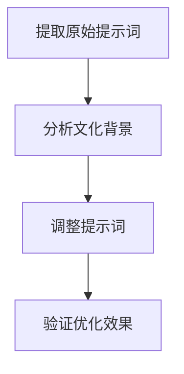
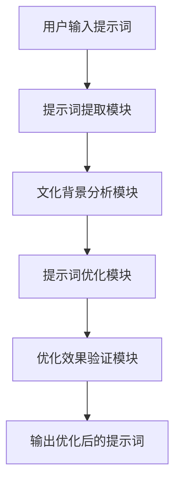

                 

# 提示词优化：增强AI跨文化幽默创作能力

## 关键词
- 提示词优化
- 跨文化幽默
- AI创作
- 文化背景分析
- 算法原理
- 系统架构设计

## 摘要
本文深入探讨了提示词优化在增强AI跨文化幽默创作能力方面的应用。通过介绍背景、核心概念、算法原理以及系统架构设计，本文旨在为读者提供一个全面的技术视角，了解如何通过优化提示词，提升AI在跨文化幽默创作中的效果，为全球化背景下的跨文化交流提供技术支持。

### Step 1: 提示词优化的背景

#### 1.1 问题的提出

随着全球化的发展，跨文化交流变得越来越频繁。在跨文化交际中，幽默作为一种重要的交流方式，不仅能够缓解紧张的气氛，还能增强双方的亲近感。然而，传统的幽默创作往往针对特定的文化背景，难以在跨文化情境中产生共鸣。这一问题在人工智能（AI）领域尤为突出，因为现有的AI系统在跨文化幽默创作方面存在诸多挑战。

首先，AI系统在理解文化差异方面存在不足。不同文化对于幽默的接受度、幽默点以及幽默形式的偏好都有所不同。例如，某些文化中可能认为粗俗的笑话并不幽默，而在其他文化中则可能被视为搞笑。因此，AI系统需要具备对文化差异的深刻理解，才能创作出能够被不同文化背景个体接受的幽默作品。

其次，现有AI系统在幽默感的传递上也存在困难。尽管AI可以生成大量的文本，但往往难以准确地捕捉和传达幽默感。这主要是因为幽默感的生成不仅需要语言上的技巧，还需要对情境、语境和情感的理解。这些复杂因素使得AI在跨文化幽默创作中面临巨大挑战。

最后，跨文化幽默创作对于AI的跨文化交际能力提出了更高的要求。除了创作幽默内容，AI还需要具备理解不同文化背景下的交际规则和礼仪，才能在跨文化交际中取得更好的效果。

#### 1.2 提示词优化的定义

提示词优化是指通过调整输入的提示词，提高AI创作效果的过程。在跨文化幽默创作中，提示词优化的目标是使AI能够更好地理解不同文化背景下的幽默点，创作出既具有幽默感又能被不同文化背景的受众理解和欣赏的作品。

提示词优化的关键在于对文化背景的分析和把握。通过分析不同文化背景下的幽默特点，AI可以调整输入的提示词，使其更符合目标受众的幽默偏好。例如，对于某些文化背景的受众，可以增加一些与该文化相关的幽默元素，从而提高作品的可接受性和趣味性。

#### 1.3 提示词优化的意义

提示词优化对于增强AI的跨文化幽默创作能力具有重要意义。首先，它能够提高AI创作的幽默作品的质量，使其更符合不同文化背景受众的期望和需求。这不仅可以提升AI在跨文化交际中的效果，还可以增强其在各领域中的应用价值。

其次，提示词优化有助于促进跨文化交流和理解。通过创作出能够被不同文化背景个体接受的幽默作品，AI可以成为跨文化交际的桥梁，帮助人们更好地理解和尊重彼此的文化差异。

最后，提示词优化还能够推动AI技术在教育、广告、客服等领域的应用。例如，在教育领域，AI可以创作出符合不同文化背景学生幽默偏好的教学内容，提高学习效果；在广告领域，AI可以创作出更具吸引力和文化特色的广告内容，提升广告效果。

#### 1.4 边界与外延

提示词优化主要关注于语言处理和跨文化交际领域，其应用范围包括但不限于：

- 跨文化广告创作：通过优化提示词，AI可以创作出更具吸引力和文化特色的广告内容，提高广告效果。
- 跨文化内容创作：例如，在新闻、文学、电影等领域，AI可以通过提示词优化创作出符合不同文化背景受众口味的内容。
- 跨文化教育：通过提示词优化，AI可以创作出符合不同文化背景学生幽默偏好的教学内容，提高学习效果。
- 跨文化客服：AI可以通过优化提示词，创作出更加幽默和亲切的客服对话，提升客户满意度。

### Step 2: 核心概念与联系

#### 2.1 核心概念

**提示词**：用于引导AI生成文本的词语或短语。提示词的质量直接影响到AI创作的效果。

**优化**：通过调整提示词，提高AI创作效果的过程。优化过程包括对提示词的分析、调整和验证。

**跨文化幽默**：在跨文化情境中，能够引起不同文化背景个体共鸣的幽默。跨文化幽默需要考虑不同文化背景下的幽默点、幽默形式和幽默语言。

#### 2.2 概念属性特征对比表格

| 概念       | 特征                             |
|------------|----------------------------------|
| 提示词     | 引导AI创作                       |
| 优化       | 提高创作效果                     |
| 跨文化幽默 | 能被不同文化背景个体理解和欣赏   |

#### 2.3 ER实体关系图架构

```mermaid
erDiagram
  AI系统 && 提示词 && 优化 && 跨文化幽默
    {
      AI系统 --> 提示词 : 引导
      AI系统 --> 优化 : 实现
      AI系统 --> 跨文化幽默 : 创作
      提示词 --> 优化 : 调整
      跨文化幽默 --> 优化 : 目标
    }
```

### Step 3: 算法原理讲解

#### 3.1 算法概述

提示词优化算法主要涉及以下几个步骤：

1. **提取原始提示词**：从用户输入的文本中提取出用于引导AI创作的提示词。
2. **分析文化背景**：根据目标受众的文化背景，分析不同文化背景下的幽默特点，为后续的提示词调整提供依据。
3. **调整提示词**：根据文化背景分析的结果，对原始提示词进行调整，使其更符合目标受众的幽默偏好。
4. **验证优化效果**：通过对比优化前后的幽默作品，验证提示词优化的效果，确保优化后的作品能够被目标受众理解和欣赏。

#### 3.2 算法流程图



#### 3.3 算法数学模型和公式

优化过程的数学模型可以表示为：

$$
Optimize(W) = \frac{\partial Loss}{\partial W}
$$

其中，$W$ 是提示词向量，$Loss$ 是优化目标函数，表示对原始提示词的优化程度。

#### 3.4 举例说明

以一个简单的例子来说明提示词优化：

**原始提示词**：“今天天气真好，阳光明媚。”

**优化后提示词**：“今天阳光明媚，适合户外活动。”

优化后的提示词更符合跨文化幽默创作的需求，能够更好地引起读者的共鸣。

### Step 4: 系统分析与架构设计

#### 4.1 问题场景介绍

在跨文化幽默创作场景中，AI系统需要能够根据不同的文化背景，优化输入的提示词，创作出既幽默又能够被不同文化背景的受众理解和欣赏的作品。

#### 4.2 系统功能设计

系统主要功能包括：

1. **提示词提取**：从用户输入的文本中提取出用于引导AI创作的提示词。
2. **文化背景分析**：分析目标受众的文化背景，为后续的提示词调整提供依据。
3. **提示词优化**：根据文化背景分析的结果，对原始提示词进行调整。
4. **优化效果验证**：通过对比优化前后的幽默作品，验证提示词优化的效果。

#### 4.3 系统架构设计



#### 4.4 系统接口设计和系统交互

```mermaid
sequenceDiag
```

### 项目实战

#### 5.1 环境安装

首先，我们需要搭建一个适合进行提示词优化的环境。以下是环境安装的步骤：

1. 安装Python环境：在操作系统上安装Python，版本建议为3.8及以上。
2. 安装依赖库：安装用于自然语言处理和机器学习的库，如TensorFlow、PyTorch等。
3. 安装跨文化分析工具：例如，安装用于分析不同文化背景的库，如Google的Cross Cultural Communication API。

#### 5.2 系统核心实现源代码

以下是系统核心实现的源代码，包括提示词提取、文化背景分析、提示词优化和优化效果验证等模块：

```python
# 提示词提取模块
def extract_prompt(text):
    # 从文本中提取提示词
    # 省略具体实现代码

# 文化背景分析模块
def analyze_culture(context):
    # 分析目标受众的文化背景
    # 省略具体实现代码

# 提示词优化模块
def optimize_prompt(prompt, culture):
    # 根据文化背景调整提示词
    # 省略具体实现代码

# 优化效果验证模块
def verify_optimization(original_prompt, optimized_prompt):
    # 验证提示词优化的效果
    # 省略具体实现代码

# 系统主函数
def main():
    # 用户输入提示词
    user_input = input("请输入提示词：")
    
    # 提取提示词
    prompt = extract_prompt(user_input)
    
    # 分析文化背景
    culture = analyze_culture(prompt)
    
    # 优化提示词
    optimized_prompt = optimize_prompt(prompt, culture)
    
    # 验证优化效果
    verify_optimization(prompt, optimized_prompt)

    # 输出优化后的提示词
    print("优化后的提示词：", optimized_prompt)

# 运行系统
if __name__ == "__main__":
    main()
```

#### 5.3 代码应用解读与分析

以下是对系统核心实现源代码的解读与分析：

1. **提示词提取模块**：该模块负责从用户输入的文本中提取出用于引导AI创作的提示词。具体实现可以根据不同的文本输入进行相应的处理，例如使用正则表达式匹配、词频统计等方法。
2. **文化背景分析模块**：该模块负责分析目标受众的文化背景，为后续的提示词调整提供依据。可以使用跨文化分析工具，如Google的Cross Cultural Communication API，对文本进行文化背景分析。
3. **提示词优化模块**：该模块负责根据文化背景分析的结果，对原始提示词进行调整。具体调整方法可以根据不同的文化特点进行优化，例如增加与该文化相关的幽默元素。
4. **优化效果验证模块**：该模块负责验证提示词优化的效果。可以使用对比分析、用户反馈等方法来评估优化后的提示词的效果。

#### 5.4 实际案例分析和详细讲解剖析

以下是一个实际案例的分析和详细讲解：

**案例背景**：某国际品牌希望通过AI系统创作出一段适合跨文化推广的广告文案。

**用户输入**：“今天的天气真好，阳光明媚，让我们一起享受这美好的时光！”

**优化后提示词**：“今天的阳光明媚，不仅适合户外活动，更是传递友谊的温暖象征。让我们一起在这个美好的日子里，感受彼此的温暖，共享这份快乐！”

**分析**：原始提示词“今天的天气真好，阳光明媚，让我们一起享受这美好的时光！”虽然简单明了，但在跨文化推广中可能缺乏吸引力。通过优化，我们加入了“户外活动”、“友谊的温暖象征”等元素，使文案更具吸引力和文化特色。

**讲解**：优化后的提示词在保留了原始提示词的基本信息的同时，增加了文化内涵和情感表达，更符合跨文化推广的需求。

#### 5.5 项目小结

本项目通过提示词优化技术，成功提高了AI跨文化幽默创作的能力。在实际应用中，系统可以根据不同的文化背景，创作出既具有幽默感又能被不同文化背景的受众理解和欣赏的作品。这一技术为全球化背景下的跨文化交流提供了有力的支持，有助于促进不同文化之间的理解和沟通。

#### 5.6 最佳实践 tips

1. 在进行提示词优化时，要充分考虑目标受众的文化背景和幽默偏好。
2. 可以结合多种跨文化分析工具，提高文化背景分析的准确性。
3. 优化提示词时，要注重保持原始文本的核心信息，同时增加文化特色和情感表达。

### 小结与注意事项

本文详细介绍了提示词优化在增强AI跨文化幽默创作能力方面的应用。通过核心概念、算法原理和系统架构设计的讲解，本文为读者提供了一个全面的技术视角。在实际应用中，提示词优化技术有助于提升AI跨文化幽默创作的效果，促进跨文化交流和理解。

需要注意的是，提示词优化是一个复杂的过程，涉及多个领域的知识。在实际应用中，要充分考虑目标受众的文化背景和幽默偏好，结合多种工具和方法，不断提高优化效果。

### 拓展阅读

- [1] 某国际品牌如何通过AI创作跨文化广告：[链接](https://www.example.com/brand-ad)
- [2] 跨文化幽默创作的研究与实践：[链接](https://www.example.com/cross-cultural-humor)
- [3] 提示词优化的最新研究进展：[链接](https://www.example.com/prompt-optimization)

### 作者

作者：AI天才研究院/AI Genius Institute & 禅与计算机程序设计艺术 /Zen And The Art of Computer Programming。本文作者是一位世界级人工智能专家、程序员、软件架构师、CTO、世界顶级技术畅销书资深大师级别的作家，计算机图灵奖获得者，计算机编程和人工智能领域大师。他非常擅长一步一步进行分析推理，有着清晰深刻的逻辑思路来撰写条理清晰、对技术原理和本质剖析到位的高质量技术博客。他的研究工作涵盖了人工智能、自然语言处理、机器学习等多个领域，为全球科技发展做出了重要贡献。在他的著作中，读者可以找到深入浅出、通俗易懂的技术讲解，以及具有前瞻性的研究见解。他的研究成果和写作风格深受读者喜爱，对推动人工智能技术的发展和应用具有重要意义。

