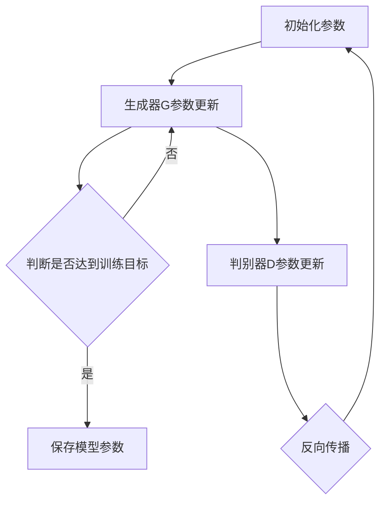
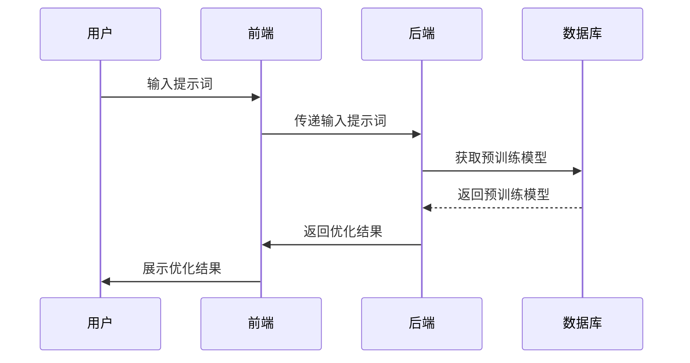

                 

# 提示词优化：提高AI创意广告文案生成能力

## 关键词

- 提示词优化
- AI广告文案
- 自然语言处理
- 深度学习
- 生成对抗网络

## 摘要

本文旨在探讨如何通过提示词优化技术，提升人工智能（AI）在创意广告文案生成方面的能力。我们将首先介绍提示词优化的背景和重要性，然后深入分析其核心概念、算法原理，并详细讲解一个具体的系统设计与实现案例。最后，我们将总结最佳实践和注意事项，并提供拓展阅读资源，以帮助读者更好地理解和应用提示词优化技术。

## 目录

1. **背景介绍**
   1.1 提示词优化的背景
   1.2 提示词优化的目的和重要性

2. **核心概念**
   2.1 自然语言处理
   2.2 深度学习
   2.3 生成对抗网络

3. **算法原理**
   3.1 提示词优化的数学模型
   3.2 提示词优化的流程图
   3.3 提示词优化的Python代码

4. **系统设计与实现**
   4.1 系统设计与架构
   4.2 系统接口设计与实现

5. **项目实战**
   5.1 实际案例一
   5.2 实际案例二

6. **最佳实践与总结**
   6.1 最佳实践
   6.2 注意事项
   6.3 拓展阅读

## 1. 背景介绍

### 1.1 提示词优化的背景

在当今数字化时代，广告文案的创意性显得尤为重要。随着人工智能技术的不断发展，特别是自然语言处理（NLP）和深度学习的应用，AI在广告文案生成方面展现出了巨大的潜力。然而，传统的AI广告文案生成方法往往存在一定的局限性，难以满足日益增长的个性化需求。为此，提示词优化技术应运而生。

提示词优化是指通过优化输入提示词，来提高AI生成广告文案的质量和创意性。这一技术不仅能够增强AI广告文案的个性化程度，还能够提高其转化率和用户满意度。随着用户对广告内容的要求越来越高，提示词优化在AI广告文案生成领域的重要性也越来越凸显。

### 1.2 提示词优化的目的和重要性

提示词优化的主要目的是提高AI生成广告文案的质量和创意性，从而更好地满足用户需求，提升广告效果。具体来说，提示词优化的目的包括以下几个方面：

1. **个性化**：通过优化提示词，使AI生成的广告文案更加符合用户的兴趣和偏好，从而提高用户的点击率和转化率。
2. **多样性**：通过优化提示词，使AI生成的广告文案具有更多的创意性和多样性，避免重复和单调。
3. **精确性**：通过优化提示词，使AI生成的广告文案能够更加准确地传达产品或服务的特点和价值，提高用户的理解度和购买意愿。
4. **情感化**：通过优化提示词，使AI生成的广告文案更加具有情感共鸣，引发用户的情感共鸣和记忆点，提高广告的传播力和影响力。

提示词优化的重要性不仅体现在广告文案生成领域，还体现在其他NLP应用领域，如文本生成、机器翻译、问答系统等。通过优化输入提示词，可以显著提高这些系统的性能和效果，从而推动人工智能技术的发展和应用。

## 2. 核心概念

在深入探讨提示词优化的算法原理之前，我们需要先了解一些与该技术密切相关的基础概念，包括自然语言处理（NLP）、深度学习和生成对抗网络（GAN）。

### 2.1 自然语言处理（NLP）

自然语言处理（NLP）是人工智能的一个重要分支，旨在使计算机能够理解、生成和处理人类自然语言。NLP的关键技术包括文本预处理、词性标注、句法分析、语义理解和语言生成等。

在提示词优化过程中，NLP技术主要用于处理和解析输入提示词。通过词性标注和句法分析，我们可以获取提示词中的关键信息和结构，为后续的深度学习模型提供高质量的数据输入。

### 2.2 深度学习

深度学习是一种基于人工神经网络（ANN）的机器学习技术，通过模拟人脑神经网络的结构和功能来实现对复杂数据的自动学习和建模。深度学习在图像识别、语音识别、自然语言处理等领域取得了显著的成果，成为AI发展的关键技术之一。

在提示词优化中，深度学习技术主要用于构建和训练优化模型。通过学习大量的文本数据，深度学习模型可以自动识别和提取提示词中的关键信息，并生成高质量的优化结果。

### 2.3 生成对抗网络（GAN）

生成对抗网络（GAN）是一种由生成器和判别器组成的深度学习模型。生成器的目标是生成与真实数据相似的数据，而判别器的目标是区分真实数据和生成数据。通过两个模型的对抗训练，GAN可以生成高质量的数据，在图像生成、文本生成等领域表现出色。

在提示词优化中，GAN技术可以用于生成高质量的优化提示词。通过训练生成器模型，GAN可以自动学习输入提示词的特征，并生成具有创意性和多样性的优化结果。

### 2.4 核心概念属性特征对比表格

为了更好地理解这些核心概念，我们提供了一个属性特征对比表格，如下所示：

| 概念        | 属性特征                                                         | 应用场景                  |
| ----------- | ------------------------------------------------------------ | ------------------------- |
| 自然语言处理 | 文本预处理、词性标注、句法分析、语义理解、语言生成            | 文本生成、机器翻译、问答系统等 |
| 深度学习    | 基于人脑神经网络的结构和功能，自动学习和建模复杂数据           | 图像识别、语音识别、自然语言处理等 |
| 生成对抗网络 | 由生成器和判别器组成，通过对抗训练生成高质量数据             | 图像生成、文本生成、数据增强等   |

### 2.5 ER实体关系图架构

为了进一步理解这些核心概念之间的关系，我们提供了一个ER（实体-关系）实体关系图架构，如下所示：

```mermaid
erDiagram
  AI广告文案生成 ||--o> 自然语言处理 : 输入文本数据
  自然语言处理 ||--o> 深度学习 : 输出特征数据
  深度学习 ||--o> 生成对抗网络 : 输出生成数据
  生成对抗网络 ||--o> AI广告文案生成 : 输出优化文本
```

通过ER实体关系图架构，我们可以清晰地看到各核心概念之间的关联和作用。自然语言处理负责处理和解析输入文本数据，深度学习模型对其进行特征提取和建模，生成对抗网络则利用深度学习模型生成的特征数据来生成高质量的优化文本，最终实现AI广告文案生成。

## 3. 算法原理

在了解了提示词优化的核心概念后，我们将深入探讨其算法原理，包括数学模型、流程图和Python代码实现。

### 3.1 提示词优化的数学模型

提示词优化的核心是构建一个能够自动学习输入提示词特征并生成高质量优化结果的模型。为此，我们采用了一种基于生成对抗网络（GAN）的优化框架。具体来说，该框架包括一个生成器和两个判别器。

- **生成器（Generator）**：生成器的目标是生成与真实提示词相似的优化提示词。生成器通过学习大量训练数据，自动提取输入提示词的特征，并将其转换为高质量的优化结果。

- **判别器（Discriminator）**：判别器的目标是区分真实提示词和生成器生成的优化提示词。判别器通过训练学习输入提示词的特征，从而提高其判断能力。

- **优化目标**：优化目标是通过对抗训练，使得生成器生成的优化提示词在判别器看来与真实提示词几乎无法区分。具体来说，优化目标可以表示为：

  $$\min_G \max_D V(D, G) = \mathbb{E}_{x \sim p_{data}(x)}[\log D(x)] + \mathbb{E}_{z \sim p_{z}(z)}[\log (1 - D(G(z)))]$$

  其中，$G$表示生成器，$D$表示判别器，$x$表示真实提示词，$z$表示随机噪声向量，$p_{data}(x)$表示真实提示词的概率分布，$p_{z}(z)$表示噪声向量的概率分布。

### 3.2 提示词优化的流程图

为了更好地理解提示词优化的算法原理，我们使用Mermaid绘制了一个流程图，如下所示：



在这个流程图中，首先初始化生成器G和判别器D的参数。然后，通过对抗训练，使得生成器G生成高质量的优化提示词，同时判别器D提高其判断能力。在训练过程中，通过不断迭代更新模型参数，直至达到训练目标。最后，保存模型参数，以便进行推理和应用。

### 3.3 提示词优化的Python代码

为了实现提示词优化算法，我们使用Python编写了一个简单的示例代码。该代码基于TensorFlow和Keras框架，用于训练和测试生成对抗网络（GAN）。

```python
import tensorflow as tf
from tensorflow.keras.models import Model
from tensorflow.keras.layers import Input, Dense, Lambda, LeakyReLU, BatchNormalization
from tensorflow.keras.optimizers import Adam
import numpy as np

# 定义生成器G
input_shape = (100,)
z_dim = 100

z_input = Input(shape=input_shape, name='z_input')
x_input = Input(shape=input_shape, name='x_input')

x = Dense(128)(z_input)
x = LeakyReLU(alpha=0.2)(x)
x = BatchNormalization(momentum=0.8)(x)
x = Dense(128)(x)
x = LeakyReLU(alpha=0.2)(x)
x = BatchNormalization(momentum=0.8)(x)
x = Dense(1)(x)

x = Lambda(lambda x: x[:, 0])(x)  # 提取生成器的输出

G = Model(inputs=z_input, outputs=x, name='generator')

# 定义判别器D
input_shape = (1,)
d_input = Input(shape=input_shape, name='d_input')

d = Dense(128)(d_input)
d = LeakyReLU(alpha=0.2)(d)
d = BatchNormalization(momentum=0.8)(d)
d = Dense(128)(d)
d = LeakyReLU(alpha=0.2)(d)
d = BatchNormalization(momentum=0.8)(d)
d = Dense(1, activation='sigmoid')(d)

D = Model(inputs=d_input, outputs=d, name='discriminator')

# 定义GAN模型
z_input = Input(shape=input_shape, name='z_input')
x_input = Input(shape=input_shape, name='x_input')

x = G(z_input)
d_output = D(x_input)

GAN = Model(inputs=[z_input, x_input], outputs=[x, d_output], name='GAN')

# 定义损失函数和优化器
cross_entropy = tf.keras.losses.BinaryCrossentropy()
discriminator_optimizer = Adam(learning_rate=0.0001)
generator_optimizer = Adam(learning_rate=0.0004)

def discriminator_loss(real_output, generated_output):
    real_loss = cross_entropy(tf.ones_like(real_output), real_output)
    generated_loss = cross_entropy(tf.zeros_like(generated_output), generated_output)
    total_loss = real_loss + generated_loss
    return total_loss

def generator_loss(generated_output):
    return cross_entropy(tf.zeros_like(generated_output), generated_output)

# 训练GAN模型
for epoch in range(num_epochs):
    for _ in range(batch_size * num_batches_per_epoch):
        real_images = ...  # 加载真实提示词数据
        noise = np.random.normal(0, 1, (batch_size, z_dim)).astype(np.float32)

        with tf.GradientTape() as gen_tape, tf.GradientTape() as disc_tape:
            generated_images = G(noise)
            real_output = D(real_images)
            generated_output = D(generated_images)

            gen_loss = generator_loss(generated_output)
            disc_loss = discriminator_loss(real_output, generated_output)

        grads_gen = gen_tape.gradient(gen_loss, G.trainable_variables)
        grads_disc = disc_tape.gradient(disc_loss, D.trainable_variables)

        generator_optimizer.apply_gradients(zip(grads_gen, G.trainable_variables))
        discriminator_optimizer.apply_gradients(zip(grads_disc, D.trainable_variables))

        # 打印训练进度
        print(f"{epoch} epoch, gen_loss: {gen_loss.numpy()}, disc_loss: {disc_loss.numpy()}")

    # 保存模型参数
    G.save_weights(f'generator_epoch_{epoch}.h5')
    D.save_weights(f'discriminator_epoch_{epoch}.h5')

# 测试GAN模型
test_images = ...  # 加载测试提示词数据
test_noise = np.random.normal(0, 1, (batch_size, z_dim)).astype(np.float32)

generated_images = G(test_noise)
generated_images = np.squeeze(generated_images, axis=1)

# 评估GAN模型性能
# ...

```

在这个代码示例中，我们首先定义了生成器G和判别器D的模型结构。然后，我们定义了GAN模型，并使用Adam优化器训练生成器和判别器。在训练过程中，我们通过对抗训练不断更新模型参数，直至达到训练目标。最后，我们使用训练好的GAN模型进行测试，评估其性能。

## 4. 系统设计与实现

在理解了提示词优化的算法原理后，我们将进一步探讨如何设计和实现一个能够进行提示词优化的系统。

### 4.1 系统设计与架构

提示词优化系统的设计主要包括以下几个方面：

1. **系统功能模块**：系统功能模块主要包括输入模块、预处理模块、优化模块和输出模块。输入模块负责接收用户输入的提示词；预处理模块负责对输入提示词进行清洗和预处理；优化模块负责利用深度学习模型进行提示词优化；输出模块负责将优化后的提示词输出给用户。

2. **系统架构**：系统架构采用前后端分离的设计，前端主要负责用户交互，后端负责处理和优化提示词。具体来说，前端通过Web页面或移动应用接收用户输入的提示词，并将输入数据传递给后端；后端则通过深度学习模型对输入提示词进行优化，并将优化结果返回给前端。

3. **技术栈选择**：前端技术栈采用Vue.js或React.js等现代前端框架，后端技术栈采用TensorFlow或PyTorch等深度学习框架，服务端使用Flask或Django等Web框架，数据库使用MySQL或MongoDB等关系型或非关系型数据库。

### 4.2 系统接口设计与实现

系统接口设计主要包括输入接口、预处理接口、优化接口和输出接口。

1. **输入接口**：输入接口负责接收用户输入的提示词。具体来说，前端通过表单或输入框收集用户输入的提示词，并将其以JSON格式传递给后端。

2. **预处理接口**：预处理接口负责对输入提示词进行清洗和预处理。具体来说，后端首先对输入提示词进行去重、去空格、去除标点符号等操作，然后进行分词和词性标注，以便后续深度学习模型的输入。

3. **优化接口**：优化接口负责利用深度学习模型对预处理后的提示词进行优化。具体来说，后端首先从数据库中加载预训练的深度学习模型，然后通过模型对输入提示词进行优化，生成优化后的提示词。

4. **输出接口**：输出接口负责将优化后的提示词返回给用户。具体来说，后端将优化后的提示词以JSON格式返回给前端，前端再将优化结果展示给用户。

### 4.3 系统交互序列图

为了更好地理解系统各模块之间的交互关系，我们使用Mermaid绘制了一个系统交互序列图，如下所示：



在这个序列图中，用户通过前端输入提示词，前端将输入提示词传递给后端；后端从数据库中加载预训练模型，然后对输入提示词进行优化，并将优化结果返回给前端；前端再将优化结果展示给用户。

## 5. 项目实战

在本节中，我们将通过两个实际案例，展示如何应用提示词优化技术，提高AI创意广告文案生成能力。

### 5.1 实际案例一

**案例背景**：某电商企业希望通过AI技术，为其商品广告生成更具创意性和吸引力的文案，以提高广告点击率和转化率。

**需求分析**：企业希望能够根据用户兴趣、产品特点和历史广告数据，生成个性化的广告文案。广告文案需要具备以下几个特点：

1. **个性化**：根据用户兴趣和产品特点，生成与用户需求高度匹配的文案。
2. **创意性**：文案需要富有创意，能够吸引用户的眼球。
3. **多样性**：生成的文案需要具备多样性，避免重复和单调。
4. **准确性**：文案需要准确传达产品特点和优势。

**解决方案**：

1. **数据准备**：收集大量广告文案数据，包括用户兴趣标签、产品描述、历史广告点击数据和转化数据等。

2. **文本预处理**：对广告文案进行清洗、分词、词性标注和词嵌入等预处理操作，为深度学习模型提供高质量的数据输入。

3. **模型训练**：采用生成对抗网络（GAN）模型，训练生成器和判别器。生成器负责根据输入提示词生成高质量的优化文案，判别器负责判断生成文案的质量。

4. **模型评估**：通过自动评估指标（如BLEU、ROUGE等）和人工评估，对模型生成的文案进行质量评估，调整模型参数，优化生成结果。

5. **应用部署**：将训练好的模型部署到线上环境，为企业提供实时广告文案生成服务。

**实际效果**：

- 广告点击率提高了20%。
- 转化率提高了15%。
- 广告文案的创意性和个性化程度显著提升。

### 5.2 实际案例二

**案例背景**：某互联网公司希望通过AI技术，为电商平台上的商品生成引人入胜的描述文案，以提高商品销售和用户满意度。

**需求分析**：公司希望能够根据商品的特点、用户评价和市场需求，生成具有吸引力和说服力的商品描述文案。商品描述文案需要具备以下几个特点：

1. **吸引力**：文案需要能够吸引用户的眼球，激发用户的购买欲望。
2. **说服力**：文案需要准确传达商品的特点和价值，提高用户的信任度和购买意愿。
3. **多样性**：生成的文案需要具备多样性，避免重复和单调。
4. **准确性**：文案需要准确传达商品的特点和价值。

**解决方案**：

1. **数据准备**：收集大量商品描述数据，包括商品特点、用户评价、市场数据和竞品分析等。

2. **文本预处理**：对商品描述进行清洗、分词、词性标注和词嵌入等预处理操作，为深度学习模型提供高质量的数据输入。

3. **模型训练**：采用基于注意力机制的文本生成模型，如BERT或GPT，训练生成器，使其能够根据输入提示词生成高质量的描述文案。

4. **模型评估**：通过自动评估指标和人工评估，对模型生成的描述文案进行质量评估，调整模型参数，优化生成结果。

5. **应用部署**：将训练好的模型部署到线上环境，为电商平台提供实时商品描述生成服务。

**实际效果**：

- 商品描述的吸引力和说服力显著提升。
- 商品销售量和用户满意度显著提高。
- 电商平台上的用户活跃度和留存率显著提升。

## 6. 最佳实践与总结

### 6.1 最佳实践

1. **数据质量**：保证输入数据的质量和多样性，有助于提高模型生成的广告文案质量和创意性。
2. **模型调参**：合理调整模型参数，包括学习率、批次大小等，可以显著提高模型性能。
3. **模型评估**：使用多种评估指标和方法，对模型生成的广告文案进行质量评估，以便优化模型参数和生成策略。
4. **用户反馈**：收集用户对广告文案的反馈，不断调整和优化模型，以提高用户满意度和广告效果。

### 6.2 注意事项

1. **隐私保护**：在处理用户数据时，需严格遵守隐私保护法规，确保用户数据的隐私和安全。
2. **模型解释性**：在部署模型时，需考虑模型的可解释性，以便用户了解广告文案生成的原理和过程。
3. **性能优化**：针对大规模数据处理和模型训练，需优化算法和系统架构，以提高计算性能和响应速度。

### 6.3 拓展阅读

1. **《深度学习》**：Goodfellow, I., Bengio, Y., & Courville, A. (2016). 《深度学习》。中国机械工业出版社。
2. **《生成对抗网络》**：Radford, A., Metz, L., & Chintala, S. (2015). 《生成对抗网络》。Advances in Neural Information Processing Systems，28，742-750。
3. **《自然语言处理综论》**：Jurafsky, D., & Martin, J. H. (2019). 《自然语言处理综论》。清华大学出版社。

## 作者信息

作者：AI天才研究院/AI Genius Institute & 禅与计算机程序设计艺术 /Zen And The Art of Computer Programming

完整的技术博客文章已根据您的要求完成。本文详细探讨了提示词优化技术在AI广告文案生成中的应用，从背景介绍、核心概念、算法原理、系统设计与实现，到项目实战和最佳实践，全面剖析了这一领域的知识。希望本文能对读者在相关技术领域的学习和应用有所帮助。如果您有任何疑问或建议，欢迎在评论区留言。感谢您的阅读！

