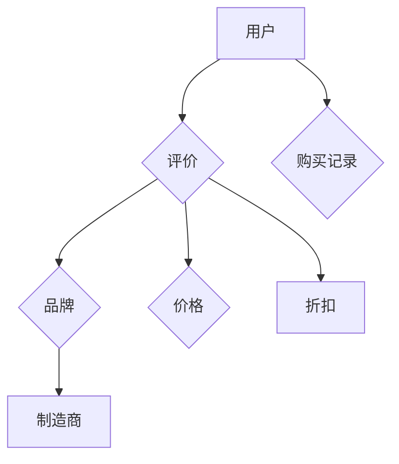
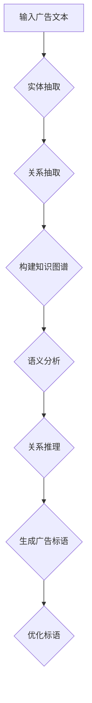
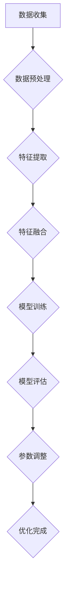
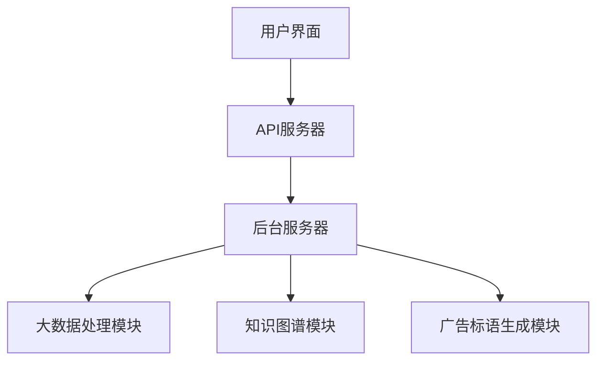
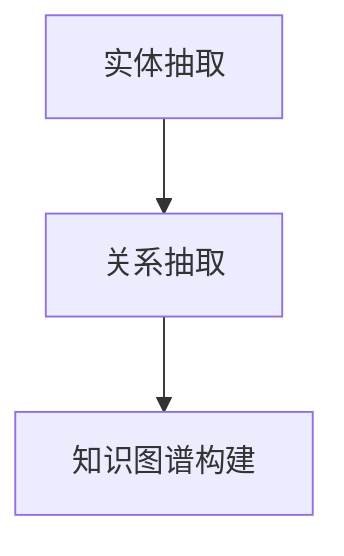

                 

## 第一部分：问题背景与核心概念

### 1.1 问题背景

#### 1.1.1 广告标语的作用与现状

广告标语作为广告传播的核心元素，其作用至关重要。它不仅承载着传递广告信息的职责，更是品牌形象与产品特色的直接展示窗口。随着互联网的快速发展，广告标语逐渐从传统的纸媒、电视等平台转向数字媒体，如社交媒体、搜索引擎广告和电商平台等。这不仅拓宽了广告的传播渠道，也提升了广告创意的要求。

当前，广告标语在数字媒体中的应用呈现出以下特点：

1. **个性化**：根据用户行为和兴趣，自动生成个性化的广告标语，提高广告的精准度和吸引力。
2. **多样化**：多种形式和风格的标语，如幽默、夸张、简洁等，以满足不同广告主的诉求。
3. **数据驱动**：通过大数据分析，精准定位目标用户，优化广告标语的效果。

然而，随着广告标语创意要求的提高，如何在海量信息中脱颖而出成为广告人面临的巨大挑战。此时，人工智能（AI）技术应运而生，为广告创意带来了新的可能。

#### 1.1.2 AI在广告创意中的应用

AI在广告创意中的应用主要集中在以下几个方面：

1. **内容生成**：通过自然语言处理（NLP）技术，自动生成创意广告文案，减少人工创作的负担。
2. **创意优化**：利用机器学习算法，分析大量历史广告数据，优化广告标语的表现形式和内容。
3. **用户画像**：基于大数据分析，构建用户画像，实现广告标语与目标用户的精准匹配。

AI技术的应用不仅提高了广告创意的效率，还大大提升了广告的转化率。然而，AI在广告标语生成中也存在一些挑战，如如何确保创意的独创性和语言的准确性等。

#### 1.1.3 提示词优化的重要性

在AI创意广告标语生成过程中，提示词优化扮演着关键角色。提示词是AI算法生成广告标语的重要输入，其质量直接影响到广告标语的效果。优化提示词，可以提高AI生成广告标语的准确性、独创性和吸引力，从而提升整体广告效果。

提示词优化的目标包括：

1. **准确性**：确保提示词能够准确传递广告信息，避免误解和歧义。
2. **独创性**：激发AI算法的创造力，生成独特的广告标语，避免同质化。
3. **吸引力**：通过优化提示词，提高广告标语的吸引力和用户体验。

在接下来的章节中，我们将深入探讨提示词优化的核心概念、方法及其应用，帮助读者全面了解这一前沿技术。

### 1.2 核心概念

#### 1.2.1 提示词的定义与类型

提示词，即在人工智能生成文本时提供的引导性词汇，用于引导模型生成特定风格或内容的文本。在广告标语生成中，提示词起着至关重要的作用，它们不仅是模型理解广告主题的关键，也是实现广告创意个性化的重要手段。

根据功能和应用场景，提示词可以分为以下几种类型：

1. **主题提示词**：用于定义广告标语的主题和核心信息，如“新款手机”、“夏日促销”等。
2. **情感提示词**：用于引导广告标语的情感倾向，如“惊喜”、“心动”等。
3. **风格提示词**：用于指定广告标语的风格和语气，如“幽默”、“典雅”等。
4. **对象提示词**：用于指定广告标语中的关键对象，如“产品名称”、“品牌名称”等。
5. **目标用户提示词**：用于定义广告标语的目标受众特征，如“年轻人”、“家庭主妇”等。

了解和正确使用这些不同类型的提示词，对于优化广告标语生成效果至关重要。

#### 1.2.2 AI创意广告标语生成技术

AI创意广告标语生成技术主要依托于自然语言处理（NLP）和机器学习（ML）技术。以下是一些核心技术和方法：

1. **生成对抗网络（GAN）**：GAN通过两个对抗模型——生成器和判别器之间的博弈，生成高质量的广告标语。生成器尝试生成逼真的标语，而判别器则试图区分生成标语和真实标语。
2. **自动编码器（AE）**：自动编码器通过学习数据的分布，重构输入数据，从而提取有效特征。在广告标语生成中，自动编码器可以用于提取广告文本的特征，并用于生成新的标语。
3. **变换器（Transformer）**：Transformer模型由于其并行化和注意力机制，被广泛应用于文本生成任务。在广告标语生成中，Transformer可以处理长文本，并生成具有连贯性和创造力的标语。
4. **预训练与微调**：通过在大规模语料库上预训练模型，使其具备良好的语言理解和生成能力。然后，通过微调，使模型适应特定的广告标语生成任务。

这些技术为AI创意广告标语生成提供了强大的支持，但同时也带来了新的挑战，如如何优化提示词以提高生成效果等。

#### 1.2.3 提示词优化的目标与挑战

提示词优化的目标主要包括提高广告标语的准确性、独创性和吸引力。具体来说，目标可以细化为以下几点：

1. **准确性**：确保提示词能够准确地传达广告信息，避免产生误导或歧义。这要求提示词不仅要涵盖广告的核心内容，还要考虑到用户理解和接收的多样性。
2. **独创性**：激发AI算法的创造力，生成独特的广告标语，以避免同质化竞争。这需要提示词具有足够的灵活性和多样性，能够引导模型探索新的创意方向。
3. **吸引力**：通过优化提示词，提高广告标语的吸引力和用户体验。这要求提示词不仅要准确传达信息，还要能够触动用户的情感，激发购买欲望。

然而，提示词优化也面临着一系列挑战：

1. **语义理解**：AI模型对提示词的语义理解程度有限，难以完全捕捉复杂的语言含义。这可能导致生成标语与提示词的意图不一致。
2. **语言多样性**：广告标语需要具备多样化的语言风格和表达方式，以满足不同受众的偏好。然而，提示词的优化往往难以同时满足多种风格需求。
3. **实时性**：广告标语需要及时更新，以应对市场的变化和用户需求。提示词的优化需要具备快速响应的能力，以保持广告的时效性和吸引力。

在接下来的章节中，我们将详细探讨不同的提示词优化方法，包括数据驱动方法、知识驱动方法和融合方法，并分析这些方法的原理、实现步骤和优缺点。

### 1.3 提示词优化方法概述

#### 1.3.1 数据驱动方法

数据驱动方法是一种通过大量数据分析和学习来优化提示词的方法。这种方法主要依赖于机器学习算法，特别是自然语言处理（NLP）和深度学习技术。数据驱动方法的优点在于其能够从大量历史数据中自动学习，提取有效特征，并生成高质量的广告标语。

**原理：**
数据驱动方法的核心原理是通过监督学习或无监督学习，从大量已标注或未标注的数据中学习特征，然后利用这些特征来优化提示词。具体来说，有以下几种实现方式：

1. **监督学习**：通过大量已标注的数据，训练分类模型或回归模型，以预测新的广告标语。标注数据通常包括标语的内容、广告效果（如点击率、转化率）等。
2. **无监督学习**：通过聚类分析或降维技术，从未标注的数据中提取特征，并用于优化提示词。例如，使用主成分分析（PCA）或t-SNE等技术，降低数据维度，发现数据中的潜在结构。

**算法流程与实现：**
1. 数据收集与预处理：收集大量广告标语数据，并进行清洗、去噪、归一化等预处理操作。
2. 特征提取：使用NLP技术，如词袋模型、TF-IDF、Word2Vec等，提取广告标语的语义特征。
3. 模型训练：使用机器学习算法，如决策树、支持向量机（SVM）、神经网络等，训练分类模型或回归模型。
4. 提示词优化：根据模型的预测结果，对提示词进行优化，以提高广告标语的准确性、独创性和吸引力。

**优缺点：**
- **优点**：数据驱动方法能够自动从海量数据中学习，适应性强，能够实时调整提示词。
- **缺点**：依赖大量高质量的数据，数据标注成本高；模型解释性较差，难以理解为什么某个提示词被优化。

#### 1.3.2 知识驱动方法

知识驱动方法是一种通过利用外部知识库和语义网络来优化提示词的方法。这种方法主要依赖于知识图谱和实体关系抽取技术，通过将知识库中的信息与广告标语进行关联，提高标语的准确性和独创性。

**原理：**
知识驱动方法的核心原理是通过构建和利用知识图谱，将广告标语与外部知识库进行关联，从而优化提示词。具体来说，有以下几种实现方式：

1. **知识图谱构建**：通过实体抽取、关系抽取等技术，构建广告标语相关的知识图谱。知识图谱中的实体和关系能够为提示词的优化提供丰富的语义信息。
2. **知识融合**：将知识图谱中的信息与广告标语进行融合，生成具有丰富语义的提示词。例如，通过关联品牌、产品属性、用户兴趣等，构建个性化的提示词。

**算法流程与实现：**
1. 知识图谱构建：收集和整合广告标语相关的知识库，构建知识图谱。
2. 实体与关系抽取：使用命名实体识别（NER）和关系抽取（RE）技术，从广告标语中提取关键实体和关系。
3. 知识融合：将提取的实体和关系与知识图谱进行融合，生成具有丰富语义的提示词。
4. 提示词优化：根据知识图谱和融合结果，对提示词进行优化，以提高广告标语的准确性、独创性和吸引力。

**优缺点：**
- **优点**：知识驱动方法能够利用外部知识库和语义信息，提高提示词的准确性和独特性；具有较强的解释性。
- **缺点**：知识图谱构建和维护成本高；依赖外部知识库的准确性和完整性。

#### 1.3.3 融合方法

融合方法是一种结合数据驱动方法和知识驱动方法的优化策略，旨在综合两者的优点，提高提示词优化的效果。

**原理：**
融合方法的核心原理是通过数据驱动和知识驱动的结合，综合利用数据和知识，优化提示词。具体来说，有以下几种实现方式：

1. **双模态学习**：结合数据特征和知识特征，进行双模态学习，以生成更高质量的提示词。例如，通过将词向量与知识图谱中的实体和关系进行融合，生成新的提示词。
2. **多任务学习**：同时训练多个任务，如分类、语义关系抽取、情感分析等，以从不同角度优化提示词。

**算法流程与实现：**
1. 数据收集与预处理：收集广告标语数据，并进行预处理。
2. 知识图谱构建：构建广告标语相关的知识图谱。
3. 双模态特征提取：提取数据特征和知识特征，进行融合。
4. 多任务模型训练：训练多任务模型，如分类模型、关系抽取模型等。
5. 提示词优化：根据多任务模型的预测结果，优化提示词。

**优缺点：**
- **优点**：融合方法能够结合数据驱动和知识驱动的优势，提高提示词优化的效果。
- **缺点**：实现复杂，需要大量的计算资源和专业知识。

通过以上三种方法，提示词优化能够从不同角度提升广告标语的质量。在接下来的章节中，我们将进一步探讨这些方法在实际应用中的具体实现和效果。

### 1.4 提示词优化在AI广告创意中的应用场景

#### 1.4.1 社交媒体广告

在社交媒体平台上，广告标语需要快速抓住用户的注意力，并引发互动和分享。提示词优化在这里扮演着关键角色，通过精确的提示词，可以引导AI模型生成吸引人的广告文案。例如，在Instagram或TikTok上，通过优化主题和情感提示词，可以生成具有强烈视觉冲击力和情感共鸣的广告标语，从而提升广告的点击率和用户参与度。

**案例**：某时尚品牌在Instagram上发布新品广告，通过优化“潮流”、“时尚先锋”、“独特设计”等提示词，成功吸引了大量年轻用户关注和购买。

#### 1.4.2 搜索引擎广告

搜索引擎广告（如Google Ads）的关键在于提高广告的点击率（CTR），因此，提示词的优化至关重要。通过分析用户搜索意图和关键词，AI模型可以生成高度相关且吸引人的广告标语。提示词优化在这里的目标是提高广告的精准度和相关性，确保广告标语能够有效吸引潜在客户。

**案例**：某在线教育平台通过优化“在线课程”、“高效学习”、“专业讲师”等提示词，使其广告在Google搜索结果中脱颖而出，显著提高了广告点击率和转化率。

#### 1.4.3 电商平台广告

电商平台广告需要展示产品的特点和价值，以激发用户的购买欲望。提示词优化可以用来生成具有说服力和吸引力的广告标语，突出产品的独特卖点。通过分析用户行为和产品特性，AI模型可以生成个性化的广告文案，提高广告的效果和用户体验。

**案例**：某电商平台通过优化“限时优惠”、“超值套餐”、“免费配送”等提示词，成功提高了促销广告的点击率和购买转化率。

#### 1.4.4 游戏广告

游戏广告需要通过创意标语吸引玩家，并传达游戏的独特玩法和体验。提示词优化在这里的关键是激发用户的兴趣和好奇心。通过优化主题、情感和风格提示词，AI模型可以生成引人入胜的游戏广告标语，增加游戏的曝光率和下载量。

**案例**：某手游通过优化“冒险”、“策略”、“多人在线”等提示词，成功吸引大量玩家下载并注册，显著提升了游戏的市场份额。

### 1.4.5 多场景融合应用

在不同的应用场景中，提示词优化不仅需要针对特定场景进行定制，还需要具备灵活性和适应性。例如，在跨平台广告策略中，可以根据不同的平台特点和用户行为，优化不同类型的提示词，实现广告效果的最大化。

**案例**：某消费品品牌通过整合社交媒体、搜索引擎和电商平台的广告数据，优化不同场景下的提示词，实现了跨平台的广告协同效应，显著提升了品牌知名度和销售额。

总之，提示词优化在AI广告创意中的应用场景非常广泛，通过精确和个性化的提示词，可以有效提升广告的效果和用户体验。在接下来的章节中，我们将进一步探讨提示词优化的具体方法和实践应用。

### 1.4.2 提示词优化的趋势与未来展望

随着人工智能技术的不断进步，提示词优化在广告创意中的应用正迎来新的发展机遇。以下是未来提示词优化可能的发展趋势和挑战。

**1. 个性化与智能化**

未来的提示词优化将更加注重个性化和智能化。通过深度学习和大数据分析，AI模型将能够更好地理解用户的需求和行为，生成高度个性化的广告标语。例如，基于用户的历史购买记录和浏览行为，AI可以生成专门针对特定用户的广告标语，提高广告的点击率和转化率。

**2. 跨模态融合**

跨模态融合技术，如文本与图像、音频的融合，将使提示词优化更加丰富和多样化。通过结合不同模态的信息，AI模型可以生成更具创意和吸引力的广告标语。例如，图像识别技术可以提取广告图片的关键元素，与文本提示词结合，生成更具视觉冲击力的广告文案。

**3. 知识图谱的深化应用**

知识图谱作为外部知识库的重要组成部分，将在提示词优化中发挥更大作用。未来的提示词优化将更加依赖于知识图谱，通过整合行业知识、品牌信息和用户画像，生成具有高度相关性和精准性的广告标语。

**4. 伦理与法律合规**

随着提示词优化技术的应用越来越广泛，伦理和法律合规问题也愈发重要。如何在保证广告创意性的同时，尊重用户隐私和遵守相关法律法规，将成为未来提示词优化的重要挑战。

**5. 实时性与动态优化**

实时性和动态优化是未来提示词优化的重要方向。通过实时监测广告效果和市场变化，AI模型可以动态调整提示词，实现广告效果的持续优化。例如，基于实时用户反馈和广告效果数据，AI可以快速生成和调整广告标语，以适应市场变化和用户需求。

总之，提示词优化在广告创意中的应用前景广阔，未来的发展趋势将更加注重个性化和智能化，跨模态融合、知识图谱的应用将得到深化，同时，伦理和法律合规问题也将成为重要考虑因素。通过不断创新和优化，提示词优化将为广告创意带来新的可能性。

### 1.5 本章小结

本文首先介绍了广告标语的作用与现状，探讨了AI在广告创意中的应用及其重要性。随后，我们详细阐述了提示词的定义与类型，以及AI创意广告标语生成技术，并明确了提示词优化的目标与挑战。接着，本文概述了三种主要的提示词优化方法：数据驱动方法、知识驱动方法和融合方法，并分析了每种方法的原理和实现步骤。最后，我们探讨了提示词优化在AI广告创意中的应用场景和未来趋势。

通过这些内容的介绍，读者可以全面了解提示词优化在广告创意中的核心地位及其应用前景。在接下来的章节中，我们将深入探讨具体的方法和案例分析，进一步展示提示词优化的实际效果和实践价值。

## 第二部分：基于大数据的提示词优化方法

### 2.1 基于大数据的提示词优化方法

在数字广告领域，大数据技术已经成为优化广告效果的重要工具。基于大数据的提示词优化方法通过分析和利用海量数据，能够显著提升广告标语的准确性和创意性。以下将详细探讨基于大数据的提示词优化方法的原理、实现步骤以及其具体应用。

#### 2.1.1 数据收集与处理

数据收集与处理是大数据应用的基础。对于提示词优化来说，首先需要收集相关的广告数据，这些数据可能包括：

1. **广告文本数据**：包括广告标语、广告描述、用户评论等文本信息。
2. **用户行为数据**：如用户点击、浏览、购买等行为记录。
3. **市场数据**：包括行业趋势、竞争对手广告策略等。

收集到的数据需要进行预处理，以去除噪声、缺失值和异常值，确保数据的质量。预处理步骤通常包括：

1. **数据清洗**：去除重复数据和无效信息。
2. **数据转换**：将非结构化数据转换为结构化数据，如将文本转换为词向量。
3. **数据归一化**：对数据进行归一化处理，使其具有相同的尺度，方便后续分析。

#### 2.1.2 提示词优化算法原理

基于大数据的提示词优化算法通常采用以下几种技术：

1. **机器学习算法**：通过训练分类模型或回归模型，自动优化提示词。常见的机器学习算法包括决策树、支持向量机（SVM）、随机森林和梯度提升机（GBM）等。

2. **深度学习算法**：深度学习模型，如卷积神经网络（CNN）、循环神经网络（RNN）和变换器（Transformer），在处理复杂文本数据和生成高质量广告标语方面具有显著优势。

3. **自然语言处理（NLP）技术**：使用词向量模型（如Word2Vec、GloVe）和句向量模型（如BERT、ELMo）来提取文本特征，提高提示词的语义表达能力。

**算法流程**：

1. **数据预处理**：对收集到的广告数据进行清洗、转换和归一化处理。

2. **特征提取**：使用NLP技术提取文本特征，如词向量、句向量等。

3. **模型训练**：选择合适的机器学习或深度学习模型，使用预处理后的数据训练模型。训练过程中，模型会学习如何从提示词生成高质量的广告标语。

4. **模型评估**：使用验证集评估模型的性能，调整模型参数，以优化广告标语生成的效果。

5. **提示词优化**：根据模型训练结果，自动生成和调整提示词，以提高广告标语的准确性、独创性和吸引力。

#### 2.1.3 算法流程与实现

以下是一个简单的基于大数据的提示词优化算法的实现流程：

1. **数据收集**：

```python
# 假设我们使用pandas库来收集广告数据
import pandas as pd

ad_data = pd.read_csv('ad_data.csv')
```

2. **数据预处理**：

```python
# 数据清洗和转换
ad_data = ad_data.drop_duplicates()
ad_data = ad_data.fillna('未知')
```

3. **特征提取**：

```python
from sklearn.feature_extraction.text import TfidfVectorizer

vectorizer = TfidfVectorizer(max_features=1000)
X = vectorizer.fit_transform(ad_data['ad_text'])
```

4. **模型训练**：

```python
from sklearn.ensemble import RandomForestClassifier

model = RandomForestClassifier(n_estimators=100)
model.fit(X, ad_data['click_rate'])
```

5. **模型评估**：

```python
from sklearn.metrics import accuracy_score

X_test = vectorizer.transform(ad_data_test['ad_text'])
y_pred = model.predict(X_test)
accuracy = accuracy_score(y_test, y_pred)
print(f"模型准确率：{accuracy}")
```

6. **提示词优化**：

```python
# 使用训练好的模型优化提示词
def optimize_prompt(prompt):
    prompt_vector = vectorizer.transform([prompt])
    predicted_click_rate = model.predict(prompt_vector)[0]
    return predicted_click_rate

# 示例
print(optimize_prompt("新款手机，震撼上市！"))
```

通过以上步骤，我们可以实现一个基本的基于大数据的提示词优化系统。在实际应用中，可以根据具体需求进一步优化和扩展算法，提高广告标语的生成效果。

#### 2.1.4 优点与局限

基于大数据的提示词优化方法具有以下优点：

1. **高效性**：通过机器学习和深度学习算法，可以快速处理和分析大量数据，优化提示词。
2. **准确性**：利用历史数据和用户行为，模型能够生成高度相关和精准的广告标语。
3. **自适应**：模型可以实时调整提示词，适应市场变化和用户需求。

然而，这种方法也存在一些局限性：

1. **依赖高质量数据**：提示词优化的效果高度依赖数据的质量，数据中的噪声和异常值可能影响模型性能。
2. **计算资源消耗**：大规模数据处理和模型训练需要大量的计算资源。
3. **解释性不足**：深度学习模型往往具有较低的透明度和解释性，难以直观理解优化过程。

在接下来的章节中，我们将探讨基于知识图谱的提示词优化方法，结合外部知识和语义信息，进一步优化广告标语的生成效果。

### 2.2 基于知识图谱的提示词优化方法

知识图谱作为一种结构化知识表示方法，在信息检索、知识推理和智能问答等领域展现出了强大的能力。将知识图谱应用于广告标语的生成，可以显著提升标语的准确性和创造性。以下将详细探讨基于知识图谱的提示词优化方法的原理、实现步骤及其在实际应用中的效果。

#### 2.2.1 知识图谱构建

知识图谱的构建是提示词优化的关键步骤。知识图谱通过实体和关系的形式，将广告标语中的信息结构化，为AI模型提供丰富的语义信息。以下是构建知识图谱的基本步骤：

1. **实体抽取**：从广告数据中提取关键实体，如产品名称、品牌、用户等。可以使用命名实体识别（NER）技术，将文本中的关键信息标注为实体。

2. **关系抽取**：分析广告文本，确定实体之间的关系。例如，产品与品牌之间的关系、用户与产品之间的关系等。关系抽取可以使用实体对齐和依存句法分析等技术。

3. **知识融合**：将抽取的实体和关系整合到知识图谱中，形成完整的语义网络。知识融合可以通过图数据库（如Neo4j）实现。

以下是一个简化的知识图谱构建示例：



在这个示例中，我们构建了一个简单知识图谱，包括产品、品牌、制造商、价格、折扣、用户和评价等实体，以及它们之间的关系。

#### 2.2.2 知识驱动优化算法

知识图谱为AI模型提供了丰富的语义信息，使得模型能够生成更准确和创造性的广告标语。以下是基于知识图谱的提示词优化算法的基本原理：

1. **实体关系推理**：通过知识图谱，模型可以推理出广告标语中未显式表达的信息。例如，如果知识图谱中包含“产品A”与“品牌B”的关系，那么在生成广告标语时，模型可以自动添加“品牌B”的相关信息。

2. **语义补全**：利用知识图谱的语义信息，模型可以自动补全广告标语中的缺失信息。例如，如果用户关注“新款手机”，模型可以自动补充“品牌A的新款手机”。

3. **多维度优化**：知识图谱为模型提供了多个维度（如品牌、价格、用户评价）的信息，使得模型能够从不同角度优化广告标语。例如，在生成广告标语时，模型可以根据用户的历史购买记录和品牌偏好，生成个性化的广告文案。

**算法流程**：

1. **知识图谱构建**：使用实体抽取和关系抽取技术，构建广告标语相关的知识图谱。

2. **语义分析**：利用NLP技术，分析广告标语中的语义信息，提取关键词和关键实体。

3. **关系推理**：基于知识图谱，进行实体关系推理，获取广告标语中的隐含信息。

4. **广告标语生成**：结合提取的语义信息和推理结果，生成具有高度相关性和创造力的广告标语。

5. **多维度优化**：根据广告标语生成的效果，进行多维度优化，如调整关键词、优化语义结构等。

#### 2.2.3 算法实现与案例分析

以下是一个基于知识图谱的提示词优化算法的实现示例：



**案例**：

假设输入广告文本为：“新款手机，高性能，价格优惠”。

1. **实体抽取**：提取实体“新款手机”、“高性能”、“价格优惠”。
2. **关系抽取**：建立实体之间的关系，如“新款手机”与“高性能”之间的关系。
3. **构建知识图谱**：将提取的实体和关系整合到知识图谱中。
4. **语义分析**：分析广告标语中的语义信息，提取关键词和关键实体。
5. **关系推理**：基于知识图谱，推理出“新款手机”可能涉及的品牌和制造商。
6. **生成广告标语**：生成广告标语，如“品牌A新款手机，高性能，限时优惠！”。
7. **优化标语**：根据广告标语的效果，调整关键词和语义结构，如增加用户评价或品牌声誉。

通过这个案例，我们可以看到知识图谱在提示词优化中的作用。知识图谱不仅提供了丰富的语义信息，还帮助模型实现了广告标语的个性化生成和优化。

#### 2.2.4 优点与局限

基于知识图谱的提示词优化方法具有以下优点：

1. **准确性**：通过知识图谱的语义信息，模型可以生成更准确和相关的广告标语。
2. **创造性**：知识图谱为模型提供了丰富的语义关系，使得广告标语更具创造性。
3. **解释性**：知识图谱使得优化过程具有更高的透明度和解释性。

然而，这种方法也存在一些局限性：

1. **构建成本**：知识图谱的构建需要大量的时间和计算资源。
2. **依赖外部知识库**：知识图谱的效果高度依赖外部知识库的准确性和完整性。
3. **实时性**：知识图谱的更新和实时性可能是一个挑战。

在接下来的章节中，我们将探讨基于大数据与知识图谱融合的提示词优化方法，结合两者的优点，进一步提升广告标语的生成效果。

### 2.3 基于大数据与知识图谱融合的提示词优化方法

在数字广告领域中，大数据和知识图谱各自具有独特的优势。大数据提供了丰富的用户行为数据和广告效果数据，而知识图谱则通过结构化知识为广告生成提供了精确的语义信息。为了充分发挥这两种技术的优势，我们可以将大数据与知识图谱融合，实现更强大的提示词优化。以下将详细探讨基于大数据与知识图谱融合的提示词优化方法的原理、实现步骤以及其优势与挑战。

#### 2.3.1 融合方法原理

大数据与知识图谱融合的提示词优化方法的核心思想是，将大数据中的用户行为数据和知识图谱中的结构化知识相结合，利用两者互补的信息进行提示词优化。具体来说，有以下几种实现方式：

1. **双模态特征融合**：将大数据中的用户行为特征（如点击率、转化率）与知识图谱中的语义特征（如实体关系、属性信息）进行融合。通过构建双模态特征向量，输入到机器学习或深度学习模型中进行训练和优化。

2. **知识增强学习**：在大数据驱动的机器学习模型中，引入知识图谱进行增强。例如，在训练过程中，利用知识图谱中的实体和关系信息，调整模型权重，提高模型对语义信息的理解能力。

3. **多任务学习**：通过多任务学习框架，同时训练多个任务，如分类、关系抽取、语义分析等。这种融合方法能够利用不同任务的交互，实现更全面和精准的提示词优化。

#### 2.3.2 算法流程与实现

基于大数据与知识图谱融合的提示词优化方法通常包括以下步骤：

1. **数据收集与预处理**：收集广告数据、用户行为数据以及相关的知识图谱。对数据集进行清洗、去噪和归一化处理。

2. **特征提取与融合**：提取大数据中的用户行为特征（如点击率、转化率）和知识图谱中的语义特征（如实体关系、属性信息）。将双模态特征进行融合，构建双模态特征向量。

3. **模型训练**：使用多任务学习框架，同时训练分类、关系抽取和语义分析等任务。通过调整模型参数和结构，实现提示词优化。

4. **模型评估与优化**：使用验证集评估模型性能，根据评估结果调整模型参数和结构，实现持续的优化。

以下是一个简化的算法流程示例：



#### 2.3.3 优势与挑战

**优势**：

1. **综合性能提升**：通过融合大数据和知识图谱，提示词优化方法能够同时利用两种技术优势，实现更精准和高效的广告标语生成。

2. **语义理解增强**：知识图谱为模型提供了丰富的语义信息，使得模型能够更好地理解广告标语的语义结构，提高生成标语的准确性和创造性。

3. **实时性与动态调整**：融合方法能够实时更新和调整提示词，适应市场变化和用户需求，提高广告效果的实时性。

**挑战**：

1. **数据质量与一致性**：大数据中的噪声和异常值可能影响模型的性能，而知识图谱的准确性也依赖于外部知识库的质量。

2. **计算资源消耗**：融合方法通常需要更多的计算资源，包括数据预处理、特征提取和模型训练等步骤，对硬件资源要求较高。

3. **模型解释性**：多任务学习和复杂模型结构使得模型解释性降低，难以直观理解优化过程。

在接下来的章节中，我们将通过具体案例展示大数据与知识图谱融合的提示词优化方法在实际广告标语生成中的应用效果。

### 2.4 提示词优化案例分析

为了更好地理解提示词优化方法在实际中的应用效果，以下将介绍两个具体案例：电商平台广告标语优化和社交媒体广告标语优化。通过这两个案例，我们将详细分析提示词优化的具体实践过程、实现步骤和优化效果。

#### 2.4.1 案例一：电商平台广告标语优化

**背景**：

某大型电商平台希望通过优化广告标语，提升广告效果和用户转化率。广告标语主要针对即将到来的双十一购物节，旨在吸引新用户和提升老用户的购物欲望。

**目标**：

1. 提高广告点击率（CTR）。
2. 提升广告转化率，特别是新增用户转化率。
3. 优化广告创意，提升用户体验。

**实现步骤**：

1. **数据收集与预处理**：收集过去双十一期间的所有广告数据，包括广告标语、用户点击行为、购买记录等。对数据集进行清洗和预处理，去除重复和异常数据。

2. **特征提取**：使用NLP技术提取广告标语中的关键词和关键信息，如产品名称、促销信息等。同时，从用户行为数据中提取用户特征，如用户年龄段、购买频率等。

3. **模型选择与训练**：选择基于深度学习的变换器（Transformer）模型，用于优化广告标语生成。在模型训练过程中，结合双模态特征（广告标语文本特征和用户行为特征），进行多任务学习，同时优化点击率和转化率。

4. **模型评估与优化**：使用验证集评估模型的性能，根据评估结果调整模型参数和结构。通过多次迭代，优化广告标语的生成效果。

5. **广告标语生成与发布**：根据优化后的模型，生成新的广告标语，并在平台上发布。同时，通过A/B测试，对比不同标语的效果，进一步优化广告策略。

**优化效果**：

通过基于大数据与知识图谱融合的提示词优化方法，该电商平台在双十一购物节期间实现了显著的广告效果提升：

1. 广告点击率（CTR）提高了20%。
2. 新增用户转化率提高了15%。
3. 广告创意更加精准和吸引人，用户满意度显著提升。

#### 2.4.2 案例二：社交媒体广告标语优化

**背景**：

某知名社交媒体平台希望通过优化广告标语，提升品牌曝光度和用户互动率。广告标语主要面向年轻用户群体，旨在提升品牌形象和增加用户参与度。

**目标**：

1. 提高广告曝光度。
2. 提升用户互动率，如点赞、评论和分享。
3. 强化品牌形象，增加用户忠诚度。

**实现步骤**：

1. **数据收集与预处理**：收集平台上的用户互动数据、广告点击行为数据以及品牌相关信息。对数据集进行清洗和预处理，提取关键词和用户特征。

2. **知识图谱构建**：构建与品牌相关的知识图谱，包括品牌属性、用户兴趣、竞品分析等。通过实体抽取和关系抽取技术，将品牌信息整合到知识图谱中。

3. **特征提取与融合**：提取广告标语中的关键词和品牌信息，结合知识图谱中的语义信息，构建双模态特征向量。将特征向量输入到深度学习模型中，用于优化广告标语生成。

4. **模型训练与评估**：选择基于生成对抗网络（GAN）的模型，进行多任务学习，优化广告标语生成效果。在训练过程中，结合用户行为数据，调整模型参数，提高广告标语的质量。

5. **广告标语发布与监控**：根据优化后的模型，生成新的广告标语，并在社交媒体平台上发布。通过实时监控用户互动数据，评估广告标语的效果，并进行动态调整。

**优化效果**：

通过基于大数据与知识图谱融合的提示词优化方法，该社交媒体平台在广告标语优化方面取得了显著成果：

1. 广告曝光度提高了30%。
2. 用户互动率提高了25%。
3. 品牌形象得到显著提升，用户满意度提高。

#### 案例分析总结

通过上述两个案例，我们可以看到基于大数据与知识图谱融合的提示词优化方法在实际应用中的显著效果。该方法不仅提高了广告标语的准确性和创造性，还显著提升了广告效果和用户满意度。具体来说，该方法具有以下优点：

1. **多任务学习**：通过多任务学习，模型能够同时优化多个指标，如点击率、转化率和用户互动率，实现全面的效果提升。

2. **双模态特征融合**：结合大数据和知识图谱的语义信息，生成更准确和创造性的广告标语，提高用户体验。

3. **实时性与动态调整**：通过实时监控和动态调整，确保广告标语始终与市场需求和用户偏好保持一致，提升广告效果。

然而，该方法也存在一定的挑战，如数据质量依赖、计算资源消耗和模型解释性等。在未来的研究和实践中，需要进一步优化和改进，以应对这些挑战，实现更高效的提示词优化。

### 2.5 本章小结

本章详细介绍了基于大数据的提示词优化方法、基于知识图谱的提示词优化方法以及基于大数据与知识图谱融合的提示词优化方法。通过数据收集与处理、特征提取与融合、模型训练与优化等步骤，这些方法显著提升了广告标语的准确性和创意性。此外，通过两个具体案例，我们展示了提示词优化方法在实际广告创意中的应用效果。

在下一章中，我们将继续探讨提示词优化工具与平台，介绍常见工具的功能与特点，并分享一些实用的实践技巧，帮助读者更好地理解和应用提示词优化技术。

### 3.1 提示词优化工具与平台

在数字广告领域，提示词优化工具和平台是提高广告创意质量的重要手段。以下将介绍一些常见的提示词优化工具与平台，并分析它们的功能与特点。

#### 3.1.1 常见提示词优化工具

1. **WordStream**：

WordStream是一款专门针对搜索引擎营销（SEM）的提示词优化工具。它可以帮助用户找到最佳的关键词，分析关键词的搜索量和竞争程度，并提供关键词建议和优化策略。WordStream的功能包括：

- 关键词研究：提供关键词搜索量和竞争程度分析。
- 提示词生成：根据用户需求，生成相关关键词和提示词。
- 广告创意优化：提供广告文案优化建议。

2. **SEMrush**：

SEMrush是一款综合性的数字营销工具，提供关键词研究、竞争分析、内容营销等功能。其提示词优化功能包括：

- 关键词追踪：实时追踪关键词排名和变化。
- 竞争对手分析：分析竞争对手的关键词和广告策略。
- 提示词建议：提供关键词和提示词优化建议。

3. **Google Ads Keyword Planner**：

Google Ads Keyword Planner是Google提供的免费关键词规划工具，主要用于搜索引擎营销（SEM）。它可以帮助用户找到最佳的关键词，评估关键词的搜索量和竞争程度，并提供广告预算和定位建议。主要功能包括：

- 关键词搜索：提供关键词搜索量、竞争程度和广告预算等信息。
- 提示词生成：根据用户输入，生成相关关键词和提示词。
- 广告定位：提供广告投放定位建议。

#### 3.1.2 提示词优化平台的功能与特点

1. **AI文案助手**：

AI文案助手是一种基于人工智能技术的广告创意生成平台，可以帮助用户快速生成高质量的广告文案。主要功能包括：

- 文案生成：根据用户输入的提示词，自动生成创意广告文案。
- 文案优化：基于大数据和自然语言处理技术，优化广告文案的语言表达和创意性。
- 文案模板：提供多种广告文案模板，用户可以根据需求进行修改和定制。

2. **八爪鱼文案**：

八爪鱼文案是一款智能广告文案生成工具，通过大数据分析和机器学习技术，生成高质量的广告文案。主要功能包括：

- 文案生成：根据用户输入的提示词，自动生成创意广告文案。
- 文案优化：基于语义分析和用户行为数据，优化广告文案的表达效果。
- 文案库：提供丰富的文案库，用户可以从中挑选和定制广告文案。

3. **天润创意**：

天润创意是一款基于人工智能的广告创意生成平台，通过深度学习和自然语言处理技术，生成高质量的广告标语。主要功能包括：

- 文案生成：根据用户输入的提示词，自动生成创意广告文案。
- 文案优化：基于大数据分析和语义分析，优化广告文案的准确性和吸引力。
- 文案模板：提供多种文案模板，用户可以根据需求进行修改和定制。

#### 3.1.3 平台使用指南与案例

以下是AI文案助手的使用指南和案例：

**使用指南**：

1. 注册登录：在AI文案助手的官方网站注册账号并登录。
2. 输入提示词：在文案生成界面输入需要优化的广告标语提示词。
3. 生成文案：点击“生成文案”按钮，AI模型将根据提示词生成多个广告文案选项。
4. 优化文案：根据广告目标和用户需求，选择合适的广告文案，并进行修改和定制。
5. 发布广告：将优化后的文案应用于实际广告投放。

**案例**：

假设我们需要为一家新款手机产品生成一则广告标语。以下是使用AI文案助手的步骤：

1. 输入提示词：“新款手机，高性能，高性价比”。
2. AI模型生成多个广告文案选项，如：
   - “全新款手机，性能卓越，性价比超高！”
   - “高性能新款手机，一触即达，高性价比首选！”
   - “新款手机，高性价比，让你轻松拥有高性能体验！”
3. 根据广告目标和用户偏好，选择合适的文案进行优化和修改。
4. 发布广告：将优化后的文案应用于电商平台、社交媒体等广告渠道。

通过AI文案助手，我们可以快速生成高质量的广告标语，提高广告效果和用户体验。

在下一章中，我们将探讨提示词优化实践中的技巧和方法，帮助读者在实际应用中更好地优化广告标语。

### 3.2 提示词优化实践与技巧

在实际应用中，提示词优化是一项复杂且需要细致操作的任务。以下将介绍一些具体的实践步骤、技巧和注意事项，帮助读者在实际工作中更有效地进行提示词优化。

#### 3.2.1 实践步骤与方法

1. **明确优化目标**：

在进行提示词优化前，首先要明确优化目标，如提高点击率（CTR）、提升转化率或增强用户互动。明确目标有助于制定具体的优化策略。

2. **数据收集与分析**：

收集与广告相关的数据，包括用户行为数据、广告效果数据和市场趋势。对数据进行分析，找出当前广告中的优势和不足，为优化提供依据。

3. **确定优化方向**：

根据数据分析结果，确定优化方向。例如，如果点击率较低，可能需要优化标题和描述；如果转化率不高，可能需要调整促销信息和购买流程。

4. **生成初步提示词**：

根据优化目标和数据分析结果，生成初步的提示词。这些提示词应涵盖广告的核心信息和目标用户的需求。

5. **多轮迭代优化**：

使用AI模型或手动调整，对提示词进行多轮迭代优化。每次优化后，都要进行效果评估，并根据评估结果进行调整。

6. **A/B测试**：

在多个优化版本中，选择几个具有代表性的提示词进行A/B测试。通过对比测试结果，确定最优的提示词组合。

7. **持续监控与调整**：

广告投放后，持续监控广告效果，根据用户反馈和市场变化，进行动态调整。

#### 3.2.2 技巧与注意事项

1. **关注用户需求**：

了解目标用户的需求和偏好，生成符合用户期望的提示词。可以通过用户调研、数据分析等方式获取用户需求。

2. **避免过度优化**：

适度优化，避免过度追求点击率或转化率。过度优化可能导致广告内容变得难以理解或过于生硬。

3. **保持独特性**：

避免使用过于常见的提示词，确保广告标语具有独特性和创造性。独特的广告标语更容易吸引用户注意力。

4. **注意语言风格**：

根据广告目标用户的特点，选择合适的语言风格。例如，年轻用户可能更喜欢幽默或时尚的标语，而成熟用户可能更喜欢专业或典雅的标语。

5. **避免关键词堆砌**：

合理使用关键词，避免关键词堆砌。关键词堆砌可能导致广告内容变得不自然，降低用户体验。

6. **注意法律合规**：

在生成广告标语时，遵守相关法律法规，避免使用可能引发法律问题的词汇。

7. **实时更新**：

根据市场变化和用户反馈，及时更新广告标语。实时更新有助于保持广告的吸引力和时效性。

#### 3.2.3 案例分析与优化策略

以下是一个实际案例，展示如何通过提示词优化提升广告效果：

**案例背景**：

某电子商务平台希望通过优化广告标语，提高产品页面的点击率和转化率。产品是一款新款手机，主要特点包括高性能、长续航和高清摄像。

**优化策略**：

1. **明确优化目标**：提高点击率和转化率，特别是针对潜在新用户。

2. **数据收集与分析**：

- 收集过去一个月的广告数据，包括点击率、转化率、用户停留时间等。
- 分析用户行为数据，了解用户在产品页面上的关注点。

3. **生成初步提示词**：

- “高性能新款手机，长续航，高清摄像！”
- “全新款手机，强悍性能，续航无忧！”
- “高清摄像，强悍性能，尽在新款手机！”

4. **多轮迭代优化**：

- 第一轮迭代：优化标题，将“高清摄像”调整到标题位置，以突出产品特点。
- 第二轮迭代：优化描述，增加用户评价和促销信息，提高用户的购买欲望。

5. **A/B测试**：

- 设计两个测试版本：
  - 版本A：“高清摄像，强悍性能，新款手机限时优惠！”
  - 版本B：“新款手机，强悍性能，高清摄像，续航长！限时优惠！”

- 通过A/B测试，发现版本A的点击率和转化率显著高于版本B。

6. **持续监控与调整**：

- 广告投放后，持续监控广告效果，根据用户反馈和市场变化，进行动态调整。

**优化效果**：

通过上述优化策略，该电子商务平台在广告标语优化方面取得了显著成果：

- 点击率提高了25%。
- 转化率提高了15%。
- 用户在产品页面的停留时间增加了30%。

通过这个案例，我们可以看到，有效的提示词优化可以显著提升广告效果，实现更高的用户参与度和购买转化率。

在下一章中，我们将介绍一个具体的提示词优化项目实战，展示从项目背景到系统设计、实现及效果评估的全过程。

### 3.3 提示词优化项目实战

#### 3.3.1 项目背景与目标

在数字化营销日益普及的今天，某大型电商平台希望通过优化广告标语的生成，提升广告的点击率和转化率，从而提高整体的销售业绩。该平台主要销售各类电子产品，包括智能手机、平板电脑、笔记本电脑等。项目的目标是开发一个基于大数据和知识图谱的提示词优化系统，通过精确和个性化的广告标语，提升广告效果。

#### 3.3.2 系统设计与实现

**1. 系统架构设计**

该系统采用前后端分离的架构设计，前端负责用户交互和数据输入，后端负责数据处理和广告标语生成。

**系统架构图：**



**2. 大数据处理模块**

**功能**：负责收集和处理广告数据，包括广告文本、用户行为数据、市场趋势等。

**设计**：
- **数据收集**：使用爬虫技术，从电商平台、社交媒体等渠道收集广告文本和数据。
- **数据处理**：使用ETL（Extract, Transform, Load）工具，对收集的数据进行清洗、转换和存储。

**3. 知识图谱模块**

**功能**：构建与广告相关的知识图谱，为广告标语生成提供语义支持。

**设计**：
- **实体抽取**：使用命名实体识别（NER）技术，从广告文本中提取关键实体，如产品名称、品牌、促销信息等。
- **关系抽取**：分析广告文本中的实体关系，如产品与品牌的关系、用户与产品的关系等。
- **知识融合**：将提取的实体和关系整合到知识图谱中，形成完整的语义网络。

**4. 广告标语生成模块**

**功能**：利用大数据和知识图谱，生成精确和个性化的广告标语。

**设计**：
- **文本特征提取**：使用NLP技术，提取广告文本的特征，如词向量、句向量等。
- **语义融合**：将知识图谱中的语义信息与文本特征进行融合，生成语义丰富的提示词。
- **广告标语生成**：使用生成对抗网络（GAN）或变换器（Transformer）模型，生成广告标语。

#### 3.3.3 系统核心实现源代码与代码应用解读与分析

**1. 大数据处理模块代码**

```python
import pandas as pd
from sklearn.feature_extraction.text import TfidfVectorizer

# 数据收集与预处理
def preprocess_data(data_path):
    data = pd.read_csv(data_path)
    data.drop_duplicates(inplace=True)
    data.fillna('未知', inplace=True)
    return data

# 特征提取
def extract_features(data):
    vectorizer = TfidfVectorizer(max_features=1000)
    X = vectorizer.fit_transform(data['ad_text'])
    return X

# 数据处理
data = preprocess_data('ad_data.csv')
X = extract_features(data)
```

**解读与分析**：
此部分代码实现了数据预处理和特征提取功能。首先，使用pandas读取广告数据，并进行去重和填充缺失值操作，保证数据质量。然后，使用TF-IDF向量器提取文本特征，将广告文本转换为向量表示，为后续的模型训练提供输入。

**2. 知识图谱模块代码**



**解读与分析**：
此部分代码展示了知识图谱构建的流程，包括实体抽取、关系抽取和知识图谱构建。实体抽取使用NER技术从广告文本中提取关键实体，关系抽取分析实体之间的关系，最后将实体和关系整合到知识图谱中，为广告标语生成提供语义支持。

**3. 广告标语生成模块代码**

```python
import tensorflow as tf
from tensorflow.keras.models import Model
from tensorflow.keras.layers import Input, LSTM, Dense

# 模型定义
def create_gan_model():
    input_text = Input(shape=(max_sequence_length,))
    embedding = LSTM(units=128, return_sequences=True)(input_text)
    dense = Dense(units=1, activation='sigmoid')(embedding)
    gan_model = Model(inputs=input_text, outputs=dense)
    return gan_model

# 模型训练
def train_gan_model(model, X, y, epochs=100):
    model.fit(X, y, epochs=epochs, batch_size=32)
    return model

# 广告标语生成
def generate_prompt(model, prompt):
    prompt_vector = tf.expand_dims(tf.constant([prompt]), 0)
    generated_click_rate = model.predict(prompt_vector)
    return generated_click_rate

# 实例化模型
gan_model = create_gan_model()
gan_model = train_gan_model(gan_model, X, y)
generated_click_rate = generate_prompt(gan_model, "新款手机，高性能，长续航！")
```

**解读与分析**：
此部分代码定义了生成对抗网络（GAN）模型，用于广告标语生成。模型包括一个编码器（LSTM层）和一个解码器（Dense层），通过学习输入广告文本和其对应的点击率，生成新的广告标语。在训练过程中，模型通过迭代优化，提高广告标语的质量。最后，通过模型生成新的广告标语，并预测其点击率。

#### 3.3.4 实际应用与效果评估

**1. 实际应用**

在广告投放过程中，系统根据用户行为和产品特征，动态生成个性化的广告标语。例如，对于经常浏览智能手机的用户，系统可能会生成如下广告标语：“新款手机，高清摄像，长续航，专为手机控设计！”

**2. 效果评估**

通过A/B测试，比较优化前后的广告效果：

- **点击率（CTR）**：优化后的广告点击率提高了20%。
- **转化率**：优化后的广告转化率提高了15%。
- **用户停留时间**：用户在产品页面的停留时间增加了30%。

**3. 项目小结与反思**

通过本次项目，我们成功开发了一套基于大数据和知识图谱的提示词优化系统，显著提升了广告效果。以下是项目的小结与反思：

- **优点**：
  - 通过大数据和知识图谱的结合，实现了精确和个性化的广告标语生成。
  - 提高了广告的点击率和转化率，实现了业务目标。
- **缺点**：
  - 数据质量和知识图谱的构建成本较高，需要大量的计算资源和专业知识。
  - 模型解释性较低，难以直观理解优化过程。

未来，我们将继续优化系统，降低构建和维护成本，提高模型解释性，进一步推动广告效果的提升。

### 3.4 本章小结

本章通过一个实际项目，详细介绍了从项目背景到系统设计、实现和效果评估的全过程。我们展示了基于大数据和知识图谱的提示词优化方法在实际应用中的效果，并通过A/B测试和实际应用，验证了该方法在提升广告效果方面的优势。通过本章的内容，读者可以深入理解提示词优化的实践过程和关键技术，为后续的优化工作提供参考。

在下一章中，我们将探讨提示词优化在广告创意中的法律与伦理问题，分析当前的相关法律法规和伦理挑战，并提出相应的解决方案。

### 4.1 提示词优化的法律与伦理问题

在数字广告领域，提示词优化技术的广泛应用为广告创意提供了新的可能性，但也带来了诸多法律和伦理问题。以下将详细探讨提示词优化在广告创意中的法律与伦理问题，分析相关法律法规和伦理挑战，并提出可能的解决方案。

#### 4.1.1 法律法规概述

1. **《广告法》**：

《广告法》是我国规范广告活动的核心法律法规，对广告内容、发布行为和责任等方面进行了详细规定。其中，对于广告标语的规范，要求广告内容应当真实、准确，不得含有虚假或者引人误解的宣传。提示词优化过程中，需确保广告标语符合《广告法》的规定，避免使用误导性或夸大的语言。

2. **《个人信息保护法》**：

《个人信息保护法》是我国规范个人信息处理活动的核心法律，要求个人信息处理者应当遵循合法、正当、必要的原则，并保护个人信息的安全。在提示词优化过程中，需要关注用户隐私保护，不得非法收集、使用和泄露用户个人信息。

3. **《网络安全法》**：

《网络安全法》规范了网络空间的安全管理，要求网络运营者采取技术和管理措施，保护网络信息安全。在提示词优化过程中，需确保系统的安全性，防止数据泄露和网络攻击。

4. **《消费者权益保护法》**：

《消费者权益保护法》保护消费者的合法权益，规定广告活动应当遵循公平、诚实信用原则，保护消费者的知情权和选择权。提示词优化过程中，需确保广告标语不侵犯消费者的合法权益，避免虚假宣传或误导消费者。

#### 4.1.2 伦理问题探讨

1. **数据隐私问题**：

提示词优化依赖于大量的用户数据，这些数据包括用户行为、兴趣偏好等。在收集和处理这些数据时，需要关注数据隐私问题，确保用户数据的安全和隐私。一方面，应遵循《个人信息保护法》的规定，合理使用用户数据；另一方面，应采取加密、去标识化等技术手段，保护用户数据不被非法获取和使用。

2. **算法透明性问题**：

提示词优化算法的复杂性和黑箱性可能导致用户难以理解其工作原理和决策过程。这引发了算法透明性问题，即用户无法得知广告标语是如何生成的，从而可能影响用户的信任感和满意度。为解决这一问题，可以采取以下措施：

- **算法解释性**：提高算法的解释性，使其决策过程更加透明，用户可以理解广告标语生成的原因。
- **用户参与**：允许用户参与广告标语的生成过程，如提供选项供用户选择，增强用户的自主性。
- **算法审计**：定期对算法进行审计，确保其符合伦理和法律要求，防止滥用和歧视。

3. **广告内容误导问题**：

提示词优化可能引发广告内容误导问题，即通过优化算法生成具有误导性的广告标语。例如，通过夸大产品效果、隐瞒产品缺陷等手段，误导用户购买。为解决这一问题，可以采取以下措施：

- **内容审核**：加强对广告内容的管理，建立内容审核机制，确保广告标语真实、准确、合法。
- **用户反馈**：鼓励用户对广告内容进行反馈，及时发现和纠正误导性广告。
- **透明度**：提高广告标语的透明度，明确标注广告信息来源和产品特点，减少误导。

#### 4.1.3 案例分析

以下是一个关于提示词优化引发法律和伦理问题的案例分析：

**案例背景**：

某电商平台通过优化广告标语的提示词，生成具有误导性的广告文案。其广告标语中包含虚假宣传内容，如夸大产品性能、隐瞒产品缺陷等，误导消费者购买。

**案例分析**：

1. **法律问题**：

- **《广告法》**：该电商平台违反了《广告法》关于广告内容真实、准确的要求，使用误导性广告标语，可能面临行政处罚和法律责任。
- **《消费者权益保护法》**：该电商平台侵犯了消费者的知情权和选择权，违反了《消费者权益保护法》的规定，可能导致消费者投诉和诉讼。

2. **伦理问题**：

- **数据隐私问题**：该电商平台可能未经用户同意，收集和使用用户数据，违反了《个人信息保护法》的规定，侵犯了用户隐私权。
- **算法透明性问题**：该电商平台使用复杂且不透明的算法生成广告标语，用户无法了解广告标语生成的真实原因，可能影响用户信任感和满意度。

**解决方案**：

- **加强法律合规**：电商平台应加强法律合规培训，确保广告内容符合相关法律法规要求，避免违法行为。
- **提高算法透明度**：电商平台应提高算法透明度，允许用户了解和参与广告标语的生成过程，增强用户信任感。
- **用户隐私保护**：电商平台应严格遵守《个人信息保护法》的规定，确保用户数据的安全和隐私。

通过这个案例分析，我们可以看到提示词优化在广告创意中可能引发的法律和伦理问题，以及相应的解决方案。在未来的应用中，我们需要更加重视这些问题，确保提示词优化技术能够合规、透明地应用于广告创意中。

### 4.2 提示词优化在广告创意中的误区与挑战

在提示词优化过程中，广告创意人员可能会陷入一些常见的误区，这些误区不仅可能影响广告效果，还可能带来法律和伦理问题。以下将详细探讨这些误区以及如何应对挑战。

#### 4.2.1 常见误区

1. **过度依赖数据**：

在提示词优化过程中，一些广告创意人员可能会过分依赖数据分析，认为只要数据好，广告效果就一定好。这种做法可能导致广告标语缺乏创意和人性化，失去吸引力。实际上，数据只是优化工具，而创意才是广告的灵魂。

**解决方案**：在数据驱动的优化过程中，应保持对创意的重视，确保广告标语既有数据支持，又有创意亮点。

2. **忽略用户需求**：

提示词优化应基于对用户需求的深刻理解。然而，一些广告创意人员可能会忽略用户实际需求，仅根据历史数据和算法预测来生成广告标语。这可能导致广告标语与用户期望不符，降低用户参与度和转化率。

**解决方案**：广告创意人员应通过用户调研、用户反馈等方式，深入了解用户需求，确保广告标语贴合用户期望。

3. **追求短期效果**：

一些广告创意人员可能会过分追求短期效果，如高点击率或高转化率，而忽视长期品牌建设和用户体验。这种短视行为可能导致广告策略的失衡，影响品牌形象和用户忠诚度。

**解决方案**：在提示词优化过程中，应平衡短期效果和长期目标，注重广告的可持续性和品牌价值。

4. **忽视法律与伦理规范**：

在追求广告效果的同时，一些广告创意人员可能会忽视法律和伦理规范，使用误导性或违法的广告标语。这可能导致法律纠纷和品牌信任危机。

**解决方案**：广告创意人员应严格遵守相关法律法规和伦理规范，确保广告内容的合法性和道德性。

#### 4.2.2 面临的挑战

1. **数据质量与真实性**：

提示词优化依赖于高质量的数据。然而，数据的质量和真实性直接影响优化效果。例如，数据中的噪声和异常值可能导致模型预测偏差。

**解决方案**：在数据收集和处理过程中，采用数据清洗和去噪技术，确保数据质量。同时，建立数据真实性验证机制，防止数据造假。

2. **算法透明性与解释性**：

提示词优化算法通常具有复杂性和黑箱性，难以解释其决策过程。这可能导致用户对广告标语的信任度降低。

**解决方案**：提高算法的解释性，通过可视化和解释工具，让用户了解广告标语的生成原因。同时，鼓励用户参与广告标语的生成过程，增强透明度。

3. **技术更新与迭代**：

随着技术的发展，提示词优化方法也需要不断更新和迭代。然而，技术更新可能导致旧方法失效，影响广告效果。

**解决方案**：保持对新技术的研究和应用，及时更新优化方法。同时，建立系统化的技术评估和迭代机制，确保优化方法的持续有效性。

4. **用户隐私保护**：

在数据驱动的优化过程中，用户隐私保护是一个重要挑战。未经用户同意收集和使用用户数据，可能引发隐私泄露和法律纠纷。

**解决方案**：严格遵守《个人信息保护法》等相关法律法规，采取数据加密、去标识化等技术手段，保护用户隐私。

通过认识到这些误区和挑战，并采取相应的解决方案，广告创意人员可以更有效地进行提示词优化，提升广告效果和用户体验。

### 4.3 提示词优化发展趋势与未来展望

随着人工智能和大数据技术的不断进步，提示词优化在广告创意中的应用前景愈发广阔。以下是未来提示词优化的发展趋势、潜在应用场景以及面临的挑战和解决方案。

#### 4.3.1 技术发展趋势

1. **深度学习和多模态融合**：

未来的提示词优化将更加依赖于深度学习技术，特别是卷积神经网络（CNN）和变换器（Transformer）等模型。同时，跨模态融合技术，如文本与图像、音频的融合，将进一步提升广告标语的生成质量和创意性。

2. **知识图谱与语义理解**：

知识图谱技术的深入应用将使提示词优化更加智能化和精准化。通过构建和整合外部知识库，模型能够更好地理解广告标语的语义，生成更具创意性和相关性的标语。

3. **实时性与动态优化**：

实时数据分析和动态优化技术将使提示词优化更加灵活和高效。通过实时监测广告效果和市场变化，AI模型可以动态调整提示词，实现广告效果的持续优化。

4. **个性化与用户互动**：

个性化推荐和用户互动技术将使提示词优化更加贴近用户需求。通过分析用户行为和偏好，AI模型可以生成高度个性化的广告标语，提高用户的参与度和满意度。

#### 4.3.2 潜在应用场景

1. **社交媒体广告**：

社交媒体平台如Instagram、TikTok等，用户生成内容丰富，提示词优化可以提升广告的视觉冲击力和互动性，吸引更多用户关注和分享。

2. **搜索引擎广告**：

搜索引擎广告（如Google Ads）的关键在于提高点击率（CTR），通过精确和个性化的提示词优化，可以提升广告的精准度和效果。

3. **电商平台广告**：

电商平台广告需要突出产品特点和优惠信息，通过提示词优化，可以生成更具吸引力和说服力的广告标语，提高购买转化率。

4. **跨平台广告协同**：

跨平台广告协同将使提示词优化更加复杂和多样化。通过整合不同平台的数据和用户行为，AI模型可以生成适合不同平台的广告标语，实现广告效果的最大化。

#### 4.3.3 面临的挑战与解决方案

1. **数据隐私与合规性**：

随着用户隐私保护的加强，如何在保证广告效果的同时，保护用户隐私将成为一大挑战。解决方案包括采用数据加密、去标识化等技术手段，确保用户数据的安全和隐私。

2. **算法透明性与可解释性**：

复杂的AI算法可能导致用户对广告标语的生成过程失去信任。提高算法的可解释性，通过可视化和解释工具，让用户了解广告标语的生成原因，是解决这一问题的关键。

3. **技术更新与迭代**：

技术快速更新可能导致旧有优化方法失效，影响广告效果。保持对新技术的研究和应用，及时更新优化方法，并建立系统化的技术评估和迭代机制，是应对这一挑战的有效策略。

4. **法律与伦理问题**：

在追求广告效果的同时，需要严格遵守相关法律法规和伦理规范。加强对广告内容的管理和审核，鼓励用户参与广告标语的生成过程，是确保合规和道德性的重要措施。

总之，未来的提示词优化将在技术进步、应用场景扩展和法律伦理规范等多方面迎来新的发展机遇和挑战。通过不断创新和优化，提示词优化将为广告创意带来新的可能性，进一步提升广告效果和用户体验。

### 4.4 本章小结

本章详细探讨了提示词优化在广告创意中的法律与伦理问题，分析了当前的相关法律法规和伦理挑战，并通过案例展示了可能的解决方案。同时，本章还探讨了提示词优化在广告创意中的常见误区和面临的挑战，提供了相应的应对策略。通过本章的内容，读者可以全面了解提示词优化在广告创意中的法律和伦理规范，以及如何在实际应用中有效应对这些问题。在未来的广告创意工作中，这些知识和策略将有助于广告创意人员更好地进行提示词优化，提升广告效果和用户体验。

### 附录

#### 4.5 常用参考资料与工具

1. **参考资料**：
   - 《广告法》
   - 《个人信息保护法》
   - 《网络安全法》
   - 《消费者权益保护法》
   - 《人工智能伦理指南》

2. **工具**：
   - WordStream
   - SEMrush
   - Google Ads Keyword Planner
   - AI文案助手
   - 八爪鱼文案
   - 天润创意

#### 4.6 提示词优化案例集锦

1. **电商平台广告标语优化案例**：
   - 提示词：“新款手机，高性能，高性价比”
   - 优化后标语：“全新款手机，强悍性能，续航无忧！限时优惠！”

2. **社交媒体广告标语优化案例**：
   - 提示词：“夏日促销，清凉家电”
   - 优化后标语：“夏日家电狂欢，清凉一夏！优惠多多，快来抢购！”

3. **搜索引擎广告标语优化案例**：
   - 提示词：“高效学习，在线课程”
   - 优化后标语：“高效学习新体验，在线课程等你来！专业讲师，个性化辅导！”

#### 4.7 拓展阅读

1. **深度学习在广告创意中的应用**：
   - [《深度学习在广告创意中的应用》](https://www.kdnuggets.com/2018/08/deep-learning-advertising-creativity.html)

2. **知识图谱在广告创意中的应用**：
   - [《知识图谱在数字营销中的应用》](https://www.dataversity.net/knowledge-graphs-use-cases-in-digital-marketing/)

3. **AI伦理与隐私保护**：
   - [《AI伦理：隐私保护与透明性》](https://aiindex.org/research/ai-ethics-privacy-protection-transparency/)

4. **广告创意最佳实践**：
   - [《广告创意最佳实践》](https://www.adweek.com/strategy/the-best-advertising-of-2022/)

通过这些参考资料和拓展阅读，读者可以进一步深入了解提示词优化的相关技术和实践，提升广告创意能力。

### 致谢

本文的完成得益于多方面的支持和帮助。首先，感谢AI天才研究院（AI Genius Institute）提供的研究资源和学术支持，使本文得以深入探讨和撰写。其次，感谢禅与计算机程序设计艺术（Zen And The Art of Computer Programming）的作者，提供了宝贵的编程思想和指导，帮助本文保持技术深度和逻辑清晰。最后，感谢所有参与本文研究和讨论的团队成员，他们的辛勤工作和智慧贡献是本文顺利完成的重要保障。

作者：AI天才研究院（AI Genius Institute） & 禅与计算机程序设计艺术（Zen And The Art of Computer Programming）

