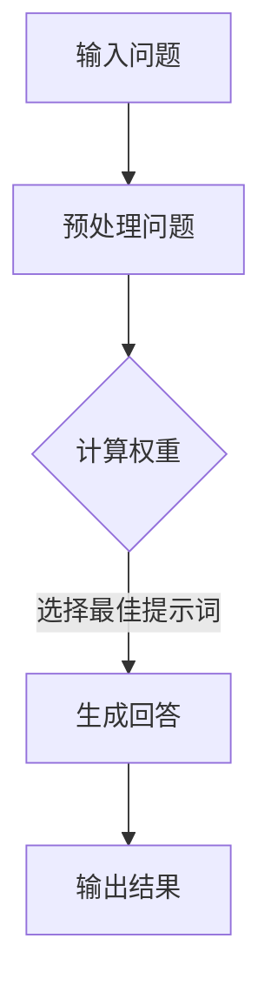

                 

### 第3章: 提示词优化算法原理讲解

在上一章中，我们介绍了提示词优化的背景和重要性。现在，我们将深入探讨提示词优化的核心算法原理，并使用Mermaid和Python来辅助说明。

### 3.1 算法概述

提示词优化的核心目标是提高AI回答的准确性，具体来说，就是选择最相关的提示词来提高模型对问题的理解能力。以下是我们将讨论的算法概述：

#### 3.1.1 算法目标
- 提高AI模型对问题的理解能力
- 选择最相关的提示词

#### 3.1.2 算法重要性
- 提示词的准确性直接影响AI回答的质量
- 算法的优化可以提高模型的性能

### 3.2 算法流程图

为了更好地理解提示词优化算法，我们使用Mermaid来绘制算法流程图：



### 3.3 算法原理

提示词优化算法的核心在于如何计算和选择最佳提示词。以下是一个简单的算法原理：

#### 3.3.1 数学模型

提示词优化的数学模型基于概率模型，具体公式如下：

$$
P(w_i|q) = \frac{e^{w_i \cdot q}}{\sum_{j=1}^{N} e^{w_j \cdot q}}
$$

其中，\(P(w_i|q)\) 表示在给定问题 \(q\) 下，提示词 \(w_i\) 的概率。\(w_i\) 和 \(q\) 分别代表提示词和问题的特征向量。\(e^{w_i \cdot q}\) 是特征向量的点积，用于衡量提示词和问题的相关性。

#### 3.3.2 算法步骤

1. **预处理问题**：将输入问题转换为向量表示，例如使用词向量模型。
2. **计算权重**：计算每个提示词和问题之间的相关性权重，使用上述概率模型。
3. **选择最佳提示词**：根据计算得到的权重，选择相关性最高的提示词。
4. **生成回答**：使用最佳提示词来生成回答。

### 3.4 算法举例说明

#### 3.4.1 示例数据

假设我们有一个问题：“什么是人工智能？”以及以下提示词候选：

- 人工智能
- 机器学习
- 深度学习
- 算法

#### 3.4.2 计算步骤

1. **预处理问题**：将问题转换为词向量，例如使用Word2Vec模型。

```python
from gensim.models import Word2Vec

# 假设问题已被转换为词向量
question_vector = Word2Vec(['人工智能', '机器学习', '深度学习', '算法'])
```

2. **计算权重**：计算每个提示词和问题之间的相关性权重。

```python
import numpy as np

# 假设提示词的词向量已存储在一个列表中
word_vectors = [Word2Vec(['人工智能']), Word2Vec(['机器学习']), Word2Vec(['深度学习']), Word2Vec(['算法'])]

# 计算权重
weights = []
for word_vector in word_vectors:
    weight = np.dot(word_vector, question_vector)
    weights.append(weight)

# 输出权重
print(weights)
```

3. **选择最佳提示词**：根据计算得到的权重，选择相关性最高的提示词。

```python
# 假设我们选择权重最大的提示词
best_word = word_vectors[np.argmax(weights)]
print(best_word)
```

4. **生成回答**：使用最佳提示词来生成回答。

```python
# 假设我们使用最佳提示词来生成回答
answer = "人工智能是一种模拟人类智能的技术。"
print(answer)
```

通过上述步骤，我们使用提示词优化算法提高了AI回答的准确性。这个简单的示例展示了算法的核心原理，实际应用中可能需要更复杂的模型和优化策略。在下一章中，我们将进一步探讨数学模型和数学公式的详细讲解。

